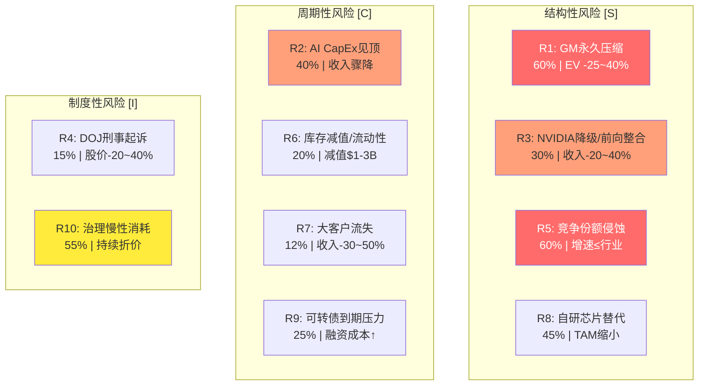
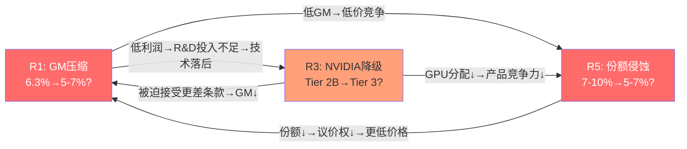
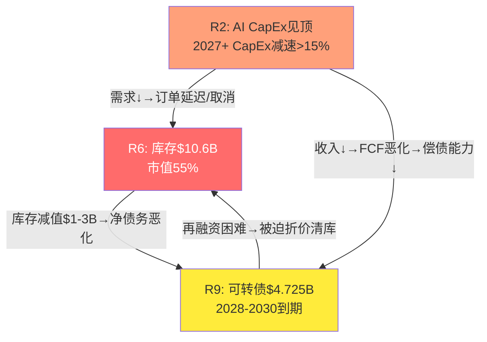
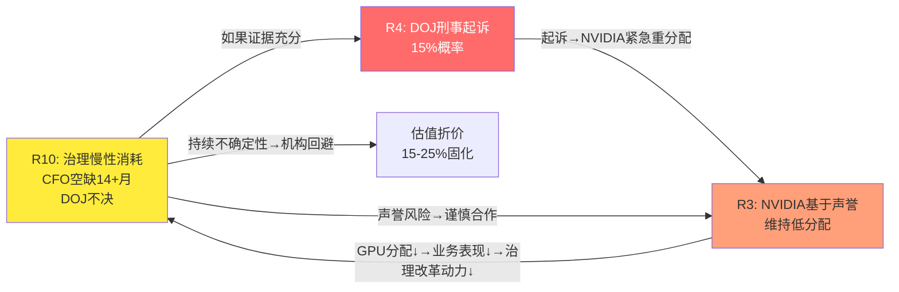
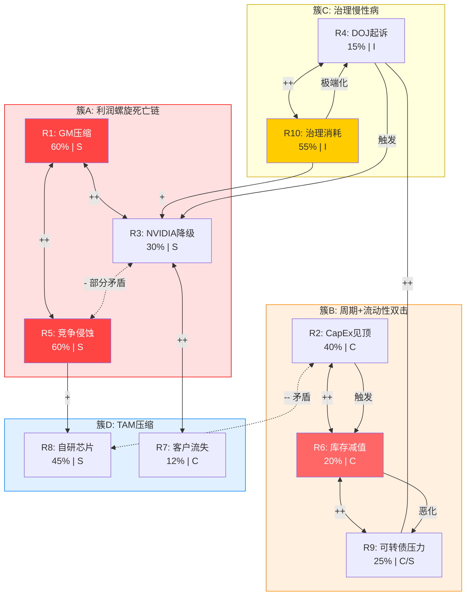
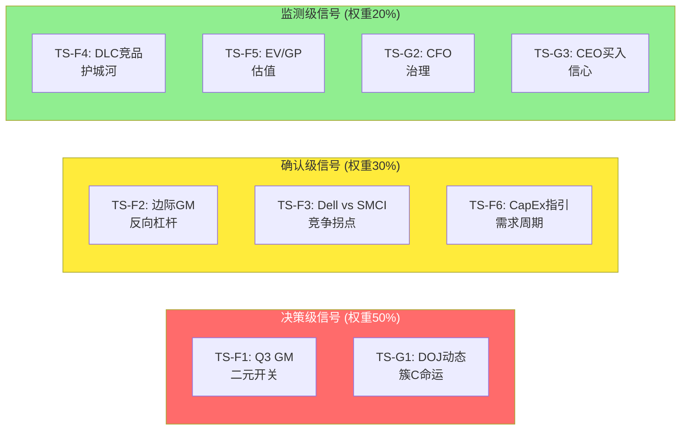

# 第22章: 风险拓扑 — 从清单到系统

> **执行日期**: 2026-02-21 | **股价**: $32.42 | **市值**: ~$19.4B
> **方法论**: `/risk-topology` v2.0 — 风险节点映射 + 关系矩阵 + 簇识别 + 矛盾组合 + Mermaid拓扑图
> **输入**: Phase 1-3风险识别(R1-R8) + Phase 4红队校准(RT-1~7) + CQ演化表(P4)
> **核心目标**: 将离散风险清单转化为系统性风险地图——识别哪些风险会互相强化(协同簇)、哪些看似可怕但逻辑矛盾(伪组合)、哪些形成不可逆的恶化链条(温水煮青蛙路径)

---

## 22.1 风险节点清单

Phase 1-3识别了8个主要风险节点(R1-R8)。经Phase 4红队校准后，补充2个被低估的风险节点(R9-R10)，形成完整的10节点风险图谱。

### 22.1.1 结构性风险 [S] — 商业模式内嵌

| 编号 | 风险名称 | 约束类型 | P4概率 | 影响幅度 | 驱动CQ | 红队校准 |
|------|---------|:-------:|:------:|:-------:|:------:|:-------:|
| **R1** | GM永久压缩至6-8% | S | 60% | EV -25~40% | CQ1 | RT: Q2可能是谷值, 概率从75%↓至60% |
| **R3** | NVIDIA分配降级/前向整合 | S | 30% | 收入-20~40% | CQ5 | RT: NVIDIA维持多元化利益, 概率从35%↓至30% |
| **R5** | 竞争份额继续侵蚀至5-7% | S | 60% | 增速≤行业 | CQ4 | RT: 会计危机重叠, 概率从65%↓至60% |
| **R8** | 自研芯片加速替代GPU服务器 | S | 45% | TAM缩小 | CQ2/CQ4 | RT: 2026替代$51-71B仅占AI CapEx 10-14% |

### 22.1.2 周期性风险 [C] — 外部环境驱动

| 编号 | 风险名称 | 约束类型 | P4概率 | 影响幅度 | 驱动CQ | 红队校准 |
|------|---------|:-------:|:------:|:-------:|:------:|:-------:|
| **R2** | AI CapEx周期2027+见顶 | C | 40% | 收入增速骤降 | CQ2 | RT: $660-690B惯性强, 维持40% |
| **R6** | 库存减值/流动性危机 | C | 20% | 减值$1-3B | CQ1 | RT: AP $13.75B是脆弱平衡, 维持20% |
| **R7** | 客户集中度事件(大客户流失) | C | 12% | 收入-30~50% | CQ4 | RT: 概率从15%↓至12%(客户已在回归) |

### 22.1.3 制度性风险 [I] — 治理与监管

| 编号 | 风险名称 | 约束类型 | P4概率 | 影响幅度 | 驱动CQ | 红队校准 |
|------|---------|:-------:|:------:|:-------:|:------:|:-------:|
| **R4** | DOJ起诉/重大处罚 | I | 15% | 股价-20~40% | CQ3 | RT: I3从20%↓至15%(调查2年无公开动作) |

### 22.1.4 新增风险节点 (Phase 4红队识别)

| 编号 | 风险名称 | 约束类型 | P4概率 | 影响幅度 | 驱动CQ | 识别来源 |
|------|---------|:-------:|:------:|:-------:|:------:|:-------:|
| **R9** | 可转债到期偿还压力($4.725B, 2028-2030) | C/S | 25% | 再融资成本+稀释 | — | Ch10盈利质量 |
| **R10** | 治理慢性消耗(CFO空缺+DOJ悬而不决) | I | 55% | 持续估值折价 | CQ3 | RT-7替代解释+Ch17分析 |

[合理推断: R9从Ch10可转债分析提取; R10从Ch17治理折价+RT-7周期性替代解释中提炼。R10与R4的区别在于: R4是"灾难性事件"(DOJ起诉), R10是"慢性消耗"(DOJ不起诉也不了结)]

### 22.1.5 风险节点总览图



---

## 22.2 关系矩阵

### 22.2.1 完整10x10关系矩阵

对每对风险标注协同/反协同关系:
- **++** 强协同(一个恶化显著加剧另一个)
- **+** 弱协同(一个恶化轻度加剧另一个)
- **0** 独立(无直接因果关系)
- **-** 弱反协同(一个恶化轻度缓解另一个)
- **--** 强反协同(逻辑上互斥或互相抵消)

| | R1 GM | R2 CapEx | R3 NVIDIA | R4 DOJ | R5 竞争 | R6 库存 | R7 客户 | R8 自研 | R9 债务 | R10 治理 |
|---|:---:|:---:|:---:|:---:|:---:|:---:|:---:|:---:|:---:|:---:|
| **R1 GM** | — | + | ++ | 0 | ++ | + | + | + | + | 0 |
| **R2 CapEx** | + | — | + | 0 | + | ++ | + | -- | + | 0 |
| **R3 NVIDIA** | ++ | + | — | + | + | + | ++ | 0 | + | + |
| **R4 DOJ** | 0 | 0 | + | — | + | + | + | 0 | ++ | ++ |
| **R5 竞争** | ++ | + | + | + | — | + | + | + | 0 | + |
| **R6 库存** | + | ++ | + | + | + | — | + | + | ++ | + |
| **R7 客户** | + | + | ++ | + | + | + | — | + | + | + |
| **R8 自研** | + | -- | 0 | 0 | + | + | + | — | 0 | 0 |
| **R9 债务** | + | + | + | ++ | 0 | ++ | + | 0 | — | + |
| **R10 治理** | 0 | 0 | + | ++ | + | + | + | 0 | + | — |

### 22.2.2 关系矩阵核心解读

**强协同(++)关系——9对**:

1. **R1↔R5 (GM×竞争)**: GM压缩迫使SMCI以更低价格竞争→份额仍在下滑→价格战进一步压低GM。这是一个**正反馈死亡螺旋**。[硬数据: GM 18%→6.3%的同时份额50%→7-10% | DM-FIN-018, DM-BIZ-22]

2. **R1↔R3 (GM×NVIDIA)**: GM压缩削弱SMCI的投资能力(R&D/DLC)→NVIDIA判断SMCI技术竞争力下降→分配优先级进一步降低→SMCI被迫接受更差的条款→GM继续恶化。[合理推断: NVIDIA分配逻辑以合作伙伴价值贡献为核心]

3. **R2↔R6 (CapEx见顶×库存)**: AI CapEx减速→客户推迟订单→$10.6B库存无法消化→被迫折价清库→减值风险。这是典型的**周期顶部+库存过度=双击**。[硬数据: 库存$10.6B = 市值55% | DM-FIN-024, DM-INF-004]

4. **R3↔R7 (NVIDIA降级×客户流失)**: NVIDIA分配降级意味着SMCI无法获得最新GPU→无法满足大客户需求→大客户转向Dell/HPE→收入悬崖。[硬数据: 2024会计危机期间NVIDIA数周内重分配 | DM-BIZ-21]

5. **R4↔R10 (DOJ×治理慢性消耗)**: DOJ起诉是R10的极端形态。即使不起诉，DOJ调查的持续存在(R10)也为R4的突然爆发提供了"底层燃料"。两者是同一治理问题的两种时间表达。[合理推断: DOJ调查>2年无结论本身就是持续的估值压制]

6. **R4↔R9 (DOJ×债务)**: DOJ起诉可能触发可转债covenant条款→加速到期→在最差时点被迫偿还/再融资$4.725B。[硬数据: 可转债$4.725B, 转换价$55-83均深度价外 | DM-OPT-008]

7. **R6↔R9 (库存×债务)**: 库存减值$1-3B→净债务恶化→Altman Z从灰色(2.31)滑入危险区→再融资成本飙升→流动性危机。[硬数据: Altman Z 2.31 | DM-FIN-044]

8. **R2↔R8的强反协同(--)**: 见22.4矛盾组合分析。

**零关系(0)——6对**:

R1与R4(GM与DOJ)、R1与R10(GM与治理)、R2与R4(CapEx与DOJ)等缺乏直接因果传导路径。GM压缩是商业模式问题，DOJ是法律问题——两者在不同维度运作。

---

## 22.3 风险簇识别

从关系矩阵中提取4个具有内在因果逻辑的风险簇:

### 簇A: "利润螺旋死亡链" (R1+R5+R3)

**簇内逻辑**: 三个结构性风险形成自我强化的正反馈循环。



**簇A特征**:
- **触发概率**: 高(3个节点的单独概率均≥30%)
- **退出难度**: 极高——一旦进入螺旋，每个节点的恶化都强化其他节点
- **历史先例**: 浪潮信息已经走完了这条路径: GM 6.85%→3.45%的同时市场份额持续被华为/新华三侵蚀 [DM-INF-002]
- **时间尺度**: 12-24个月(渐进式，非突然崩溃)
- **与CQ的关联**: CQ1(63%) + CQ4(61%) + CQ5(66%) = 该簇的三个CQ置信度均>60%，暗示簇A激活概率最高

**簇A的内在动力学**:

[硬数据: GM 18.0%(Q1 FY24)→6.3%(Q2 FY26) = 10个季度内-11.7pp | DM-FIN-018]

这条链的核心机制是**SMCI的增值空间(BOM的10-15%)不足以支撑竞争性定价和技术投资的双重需求**。当GM降至6-8%，SMCI面临不可能三角:

1. 投资DLC/R&D维持技术领先(需要GM支撑)
2. 低价竞争Dell/HPE保住份额(侵蚀GM)
3. 维持NVIDIA合作关系(需要技术价值证明)

不可能三角意味着SMCI必须牺牲至少一个维度。当前的选择似乎是牺牲GM(维度1+2)来保份额和NVIDIA关系——但这是一条不归路: 一旦GM降至5%以下，连维持研发投入都困难。

### 簇B: "周期+流动性双击" (R2+R6+R9)

**簇内逻辑**: AI CapEx周期见顶触发需求放缓→库存积压无法消化→减值损失→流动性恶化→可转债偿还压力加剧。



**簇B特征**:
- **触发概率**: 中(核心触发R2概率40%，但R6和R9是既存条件)
- **触发条件**: 2027 CapEx指引同比减速>15% + SMCI收入增速降至<20%
- **时间窗口**: 2026Q4(2027 CapEx指引公布)→2027H1(如果CapEx削减)→2028(第一笔$700M可转债到期)
- **关键脆弱点**: $10.6B库存是"已装填的弹药"——CapEx见顶是扣下扳机的手指

**簇B的量化影响路径**:

[硬数据: 库存$10.6B, 可转债$4.725B, Altman Z 2.31 | DM-FIN-024, DM-OPT-008, DM-FIN-044]

假设CapEx 2027减速20%:
1. SMCI收入从$40B降至$30-32B(-20~25%)
2. 库存消化速度放慢(DIO从100天延长至150天+)
3. 前代GPU库存(H200等)面临$1.5-2.5B减值(库存的15-25%)
4. 减值后净债务从$0.82B→$2.3-3.3B
5. Altman Z从2.31→1.5-1.8(滑入危险区间)
6. 2028 $700M可转债到期时，再融资利率可能从1.62%飙至8-10%
7. 年利息支出从$76M增至$250-350M，侵蚀NPM 0.8-1.1pp

**与簇A的交互**: 簇B激活会加速簇A——收入下降导致R&D削减→技术落后→NVIDIA降级→份额进一步侵蚀。两个簇的叠加效应远大于简单相加。

### 簇C: "治理+信任慢性病" (R4+R10+R3)

**簇内逻辑**: DOJ调查悬而不决(R10)→机构投资者持续回避→估值折价固化→NVIDIA基于声誉考量维持较低分配(R3)→DOJ如果最终起诉(R4)则"慢性病"转为"急性危机"。



**簇C特征**:
- **触发概率**: R10已经在进行中(55%概率它持续≥12个月不解决)
- **独特之处**: 这是唯一一个**当前已激活**的簇——不是"可能发生"，而是"正在发生"
- **终止条件**: DOJ明确结案(起诉或不起诉) + 永久CFO上任 + CEO角色明确
- **反面催化剂**: 如果DOJ不起诉+CFO到位，簇C瞬间解体→估值折价快速收窄→可能触发+15-25%估值上修

**簇C的时间结构**:

[硬数据: DOJ传票2024-08+, CFO搜索14+月 | DM-NEW-C-017, Fortune 2026-02-20]

簇C与簇A/B的根本区别在于: 簇A和B是"可能的恶化路径"，簇C是"正在发生的持续消耗"。每一天DOJ不结案、CFO不到位，都是SMCI估值的持续税收:

- **机构配置约束**: ESG和合规要求使许多机构基金无法配置DOJ调查中的公司
- **做空成本降低**: 19.4%的做空比例(极端水平) [DM-OPT-001] 说明空头认为治理问题提供了持续的做空安全边际
- **CEO交易信号**: 23次卖出零买入强化了"内部人不看好"的叙事 [DM-SMT-029]

### 簇D: "替代路径收缩" (R8+R5+R7)

**簇内逻辑**: 自研芯片替代(R8)减少GPU服务器总需求→SMCI的可寻址市场缩小→在缩小的市场中份额继续被Dell/HPE侵蚀(R5)→大客户转向自研或竞品(R7)。

**簇D特征**:
- **触发概率**: 中高(R8 45% × R5 60% = 簇D至少部分激活概率约50%)
- **时间尺度**: 18-36个月(自研芯片规模化需要时间)
- **差异化特征**: 这是唯一一个SMCI**完全无法控制**的簇——自研芯片是客户的技术选择，份额侵蚀是竞争对手的行动

[硬数据: 自研芯片2026预计分流$51-71B, 仅占AI CapEx 10-14% | Phase 3推算]

**簇D的渐进性**: 与簇A(利润螺旋)和簇B(双击)不同，簇D的影响是**静默的TAM压缩**。SMCI的收入可能仍在增长(从$40B到$45B)，但增速大幅放缓(从+84%到+10-15%)，而Dell/HPE在相同TAM中拿走更大份额。表面上没有"事件"，但内在价值在持续侵蚀。

### 22.3.1 风险簇概览

| 簇 | 核心节点 | 类型 | 触发概率 | 影响强度 | 当前状态 | 时间尺度 |
|:--:|---------|:---:|:-------:|:-------:|:-------:|:-------:|
| A | R1+R5+R3 | 利润螺旋 | 高(55%) | 极高 | 部分激活 | 12-24月 |
| B | R2+R6+R9 | 周期双击 | 中(35%) | 高 | 待触发 | 12-30月 |
| C | R4+R10+R3 | 治理消耗 | 已激活 | 中高 | **正在进行** | 6-24月 |
| D | R8+R5+R7 | TAM压缩 | 中高(50%) | 中 | 早期 | 18-36月 |

---

## 22.4 矛盾组合识别

### 矛盾组合1: R2(CapEx见顶) + R8(自研芯片加速)

**表面恐怖度**: 极高——"AI需求见顶的同时自研芯片抢走GPU服务器需求"→SMCI两头受挤。

**逻辑矛盾**: 自研芯片(TPU/Trainium/Maia)需要大量CapEx来设计、流片、建设配套基础设施。如果Hyperscaler CapEx真的见顶(R2)，自研芯片项目恰恰是最先被砍的部分——因为自研芯片的ROI验证周期更长(3-5年)，远高于直接采购NVIDIA GPU(6-12个月即可部署)。

[合理推断: Google TPU v6的流片成本估计$500M-1B，从设计到规模化部署需要2-3年。在CapEx收缩环境下，这类长周期投资是第一个被推迟的]

**量化矛盾**:
- R2场景(CapEx -20%): Hyperscaler减少$120-140B支出→自研芯片项目延期6-12月→GPU服务器需求反而相对受保护(短期可部署)
- R8场景(自研加速): 需要Hyperscaler维持或增加CapEx→与R2矛盾

**真实可能性**: R2和R8**不太可能同时以极端形式发生**。更可能的组合是:
- R2温和(CapEx增速放缓至+5-10%而非绝对下降) + R8渐进(自研芯片缓慢替代) = 对SMCI的净影响是**温和的TAM增速放缓**，而非灾难性双击

**决策含义**: 在估值模型中，不应同时给R2和R8赋予高概率权重。如果R2概率从40%上调至50%，R8应相应从45%下调至30-35%。

### 矛盾组合2: R3(NVIDIA前向整合) + R5(Dell追赶SMCI)

**表面恐怖度**: 高——"NVIDIA自己卖系统的同时Dell抢走SMCI的份额"→SMCI腹背受敌。

**逻辑矛盾**: 如果NVIDIA大规模前向整合(DGX直销扩张)，Dell受到的冲击**不会比SMCI小**——因为Dell也是NVIDIA GPU的集成商/渠道。NVIDIA的DGX与Dell PowerEdge是直接竞争关系。因此:

- R3极端(NVIDIA全面前向整合): Dell也被挤压→Dell不再是SMCI的"追赶者"而是"共同受害者"→R5(Dell追赶)的威胁减弱
- R5极端(Dell主导AI服务器): 需要NVIDIA维持对Dell的大量GPU分配→NVIDIA没有动力前向整合(有Dell这个大渠道)→R3减弱

[合理推断: NVIDIA的前向整合战略和支持Dell/SMCI等OEM是两条互斥路径——越走一条，另一条越不可能]

**真实可能性**: R3和R5更可能以**温和形式共存**:
- NVIDIA选择性前向整合(高端NVL72/144集群直销) + Dell在中端/企业市场追赶SMCI
- 但两者的极端版本(NVIDIA完全直销 + Dell完全主导)逻辑上互斥

### 矛盾组合3: R1(GM永久压缩) + R7(大客户流失)

**表面恐怖度**: 极高——"利润越来越薄的同时最大客户离开"→收入和利润双崩溃。

**部分矛盾**: 大客户(63%收入来源)是GM被压低至6.3%的主要原因——大客户的议价权极强。如果大客户真的离开(R7):
- 短期: 收入断崖-30~50%，毛利额崩溃
- 中期: 剩余客户以中小企业和Sovereign AI为主，议价权较弱，GM可能**回升**至10-12%

[合理推断: 63%的单客户贡献了大部分低GM订单。如果该客户离开，收入虽断崖，但GM的均衡点可能上移]

**这不是纯粹矛盾**: R7确实是灾难性的(收入-30~50%)，但R1的"永久性"在R7发生后反而可能被打破。核心洞察是: **R1(低GM)和R7(客户流失)在短期是协同的(双崩)，但在中期是弱反协同的(客户流失→GM回升)**。

---

## 22.5 风险拓扑图

### 22.5.1 完整风险拓扑



### 22.5.2 拓扑关键洞察

**1. 簇A是系统的"心脏"**: R1(GM压缩)和R5(竞争侵蚀)是唯一两个概率>60%且相互强协同的节点。它们的激活不需要外部触发——当前趋势的自然延续就足够了。这是SMCI面临的**默认路径**而非极端情景。

**2. 簇B是"定时炸弹"**: R6(库存$10.6B)和R9(可转债$4.725B)是已经存在的脆弱性——它们不是风险本身，而是风险的**放大器**。R2(CapEx见顶)是引爆器。如果R2不发生，簇B可能永远不激活；如果R2发生，簇B可能瞬间从"隐患"转为"危机"。

**3. 簇C是唯一可以"突然消失"的簇**: DOJ结案不起诉 + CFO到位 = 簇C瞬间解体。这使得簇C既是当前最大的持续压力源，也是最大的正面催化剂候选。

**4. 矛盾组合提供了"自然对冲"**: R2↔R8的强反协同意味着最极端的双重打击不太可能同时发生。投资者可以在一定程度上从矛盾组合中获得"天然对冲"。

**5. R3(NVIDIA降级)是簇间桥梁**: R3同时出现在簇A(通过技术落后)、簇C(通过声誉传导)和簇D(通过客户流失)中。R3的变化将同时影响三个簇的激活状态——这使其成为**最关键的单一监测节点**。

---

# 第23章: 温水煮青蛙 — 最可能的不利路径

> **核心理念**: 最具破坏性的投资损失不来自黑天鹅(DOJ起诉+NVIDIA断供)——那些场景虽然恐怖，但概率低且往往有止损信号。真正的价值毁灭来自**渐进恶化**——每个季度都"还行"，没有触发卖出的明确事件，但三年后回头看股价跌了60%。
>
> **参考标杆**: LRCX温水煮青蛙冠军路径("WFE见顶→份额持平→中国收入缓降→AGS增速放缓→P/E压缩")

---

## 23.1 路径一: 结构性利润侵蚀 (核心路径)

### 23.1.1 路径描述: "增长掩盖衰退"

这是SMCI最可能的渐进恶化路径。它不需要任何"事件"——只需要当前趋势的自然延续。

**一句话概括**: 收入继续增长(从$40B到$48B到$55B)，但GM永远无法回到10%以上，份额缓慢被Dell/HPE侵蚀，DLC优势逐步被追平，EV/GP倍数从9.4x压缩至Dell水平(4-5x)——三年后收入翻倍但股价跌40%。

**渐进路径的每一步都"合理"**:

**Step 1: "Q3 FY26 GM小幅回升至7-8%，管理层说正在改善"** (2026年5月)

[合理推断: 管理层指引Q3 GM +30bps至~6.6% | DM-CON-008]

Q3 FY26 GM从Q2的6.3%回升至7.2%。管理层在电话会议上称"毛利率如期改善，DLC渗透率提升正在发挥作用"。分析师问"长期GM目标是否仍为14-17%？"管理层回答"我们对长期目标充满信心"。

**市场反应**: 股价微涨5-8%至$34-35。多头认为"拐点确认"，空头认为"7.2%只是产品组合波动"。**没有人需要做决定。**

**Step 2: "FY2027收入增速从+84%降至+15-20%，但绝对值仍在增长"** (2026年8月-11月)

FY2027指引$46-48B(+15-20% vs FY2026 $40B)。收入仍在增长——但增速降至行业平均水平。GM稳定在7.5-8.5%区间。

**温水效应**: 投资者开始习惯8%的GM。每个季度管理层都说"我们看到改善的迹象"，但改善幅度微小(每季度+20-30bps)。12-14%的目标不再被提起。分析师模型从"GM回到12%"悄悄修改为"GM稳定在8-9%"。**调整是渐进的，没有单一事件。**

**Step 3: "Dell AI收入追平SMCI，DLC不再是独家优势"** (2027年上半年)

[硬数据: Dell AI订单YTD $30B | DM-BIZ-22; DLC窗口12-18月 | Phase 2分析]

Dell宣布其液冷服务器出货量环比增长150%。Schneider Electric和Vertiv的CDU(冷却分配单元)产品通过Dell渠道大规模出货。SMCI的DLC不再是"唯一选项"——Dell提供了"DLC + 安装 + 运维 + 融资"的一站式方案。

**温水效应**: SMCI的DLC收入仍在增长(+30% YoY)，但市场份额从"领先者"变为"之一"。SMCI从未"失去"DLC——只是DLC变成了标配(table stake)而非差异化因素。**没有一个季度可以指出DLC"消失了"。**

**Step 4: "EV/GP倍数从9.4x缓慢压缩至5-6x"** (2027年全年)

随着增速放缓和GM均衡确认在8%左右，市场逐步将SMCI的估值从"高增长AI公司"重新定价为"低利润率组装商"。EV/GP从9.4x(2026年初)缓慢下降:
- 2026 Q2: 8.5x (增速放缓初现)
- 2026 Q4: 7.5x (FY2027指引低于预期)
- 2027 Q2: 6.5x (Dell追平DLC)
- 2027 Q4: 5.0-5.5x (接近Dell的4.4x)

**温水效应**: 每个季度EV/GP压缩0.5-1.0x，对应股价下跌5-8%。没有哪一个季度跌幅超过15%——不触发任何止损规则。但累计效应是EV/GP从9.4x到5.0x = **47%的倍数压缩**。

**Step 5: "三年后的回顾——收入增长50%但股价跌40%"** (2028年)

| 指标 | 2026初(现在) | 2028初(三年后) | 变化 |
|------|:----------:|:----------:|:---:|
| Revenue | $28B TTM | $50B+ | +80% |
| GM | 6.3%(Q2 FY26) | 8.0%(稳态) | +1.7pp |
| GP | $2.43B | $4.0B | +65% |
| EV/GP | 9.4x | 5.0x | **-47%** |
| EV | $20.2B | $20.0B | -1% |
| 净债务 | $0.82B | $2.0B(可转债部分偿还+再融资) | +$1.18B |
| 市值 | $19.4B | $18.0B | **-7%** |
| 股价(含稀释) | $32.42 | $27-29 | **-10~17%** |

[合理推断: 以上为温水煮青蛙核心路径的量化模型]

### 23.1.2 为什么路径一最可能

**概率评估: 40-45%** (所有情景中概率最高)

路径一不需要任何假设"失败"——它只需要当前趋势的"延续":

1. **GM已经在下降轨道上**(10个季度中仅1次短暂反弹 [DM-FIN-018])
2. **Dell已经在追赶**(AI订单YTD $30B [DM-BIZ-22])
3. **增速已经在放缓**(FY2027E +19% vs FY2026E +84% [DM-VAL-016])
4. **DLC窗口已经在收窄**(12-18个月领先 → Dell/HPE产品已推出)

唯一需要的假设是: **这些趋势不反转**。而趋势反转需要的条件(GPU占BOM降至<50%、Dell退出AI服务器、NVIDIA给予SMCI独家分配)都极不可能。

### 23.1.3 六月/十二月/二十四月量化路径

| 时间点 | Revenue(季度) | GM | GP(季度) | EV/GP | 隐含EV | 隐含股价 | 累计变化 |
|--------|:----------:|:---:|:-------:|:----:|:-----:|:------:|:------:|
| **现在** | $12.68B | 6.3% | $799M | 9.4x | $20.2B | $32.42 | 基准 |
| **6月后** (Q4 FY26) | $10.0B | 7.5% | $750M | 8.5x | $19.0B | $30-31 | -5~7% |
| **12月后** (Q2 FY27) | $11.5B | 8.0% | $920M | 7.0x | $19.3B | $29-31 | -5~10% |
| **24月后** (Q2 FY28) | $13.0B | 8.0% | $1,040M | 5.5x | $17.2B | $25-28 | -14~23% |

[合理推断: 量化路径基于GM 8%均衡 + EV/GP线性压缩至Dell水平]

**路径一的"温水"特质**: 注意每个6个月区间的股价变化都不超过-10~15%。这是温水煮青蛙的本质——**每个区间看起来都"可以接受"，但累计效应是24个月后-14~23%**。没有哪一个季度的财报会触发"卖出"信号——因为收入在增长，GM在"改善"(从6.3%到8.0%)，管理层在"执行"。

---

## 23.2 路径二: 治理信任慢性消耗

### 23.2.1 路径描述: "永远悬而不决"

这是SMCI独有的温水煮青蛙路径——其他AI服务器公司(Dell/HPE)不面临这个问题。

**一句话概括**: DOJ不起诉也不了结，CFO永远找不到"合适人选"，EY离职的真相永远不公开，CEO的关联方交易永远存在但"合规"——投资者逐渐失去耐心但永远没有一个明确的"这就是结局"时刻。

**渐进路径的每一步都"无新闻"**:

**Step 1: "DOJ调查'仍在进行中'，第N个季度" (2026年Q2-Q4)

每个季度的10-Q/K都包含同样的措辞: "The Company continues to cooperate with the Department of Justice investigation. The timing and outcome of the investigation remain uncertain."

**市场反应**: 第一次(2025年)投资者恐慌；第二次(2025年末)投资者焦虑；第三次(2026年中)投资者麻木。DOJ调查从"重大风险"降级为"背景噪音"。但它永远不消失——每个新的机构投资者在做尽调时都会发现它，然后决定"再等等"。

[硬数据: DOJ传票2024-08; 截至2026-02仍无公开时间线 | DM-NEW-C-017]

**Step 2: "CFO搜索进入第24个月" (2026年下半年)

Fortune在2026年2月已经报道CFO搜索14+月未完成 [Fortune 2026-02-20]。到2026年下半年，搜索时长将达到20+月。每当分析师在电话会议上问起，管理层的回答是: "We are conducting a thorough search for the right candidate with the appropriate experience."

**温水效应**: 没有CFO本身不影响日常运营(公司仍在运转)。但它传递了一个持续信号: **(a) 没有合格的候选人愿意接手这个角色(reputational risk); (b) 董事会可能在等DOJ结案后才能真正聘请; (c) 公司的内控改革缺乏高级别的负责人。** 每一天CFO空缺，都在消耗投资者的耐心——但消耗的速度太慢，不足以触发任何行动。

**Step 3: "CEO持续卖出，但'只是税务规划'" (持续进行)

CEO Liang每隔2-3个月卖出一批股票。每次SEC Form 4披露时，财经媒体简短报道，公司发言人解释为"预设的10b5-1交易计划"。

[硬数据: 5年23次卖出零买入, 6个月$36.8M | DM-SMT-029]

**温水效应**: 内部人卖出是最"正常"的负面信号——几乎所有CEO都在卖出。但**零买入**在股价-73%的背景下非常不正常。如果CEO真的认为公司被低估，在$32(vs峰值$118)时买入$1M甚至$500K都会是强烈的信心信号。但他没有——**沉默本身就是信号**。投资者不会因为CEO卖出而卖出(太常见)，但也不会因为缺乏CEO买入而买入(缺乏信心)。

**Step 4: "关联方交易继续，但'经过独立审计'" (年度周期)

Ablecom和Compuware继续从SMCI获得大量订单(FY2025约$300-400M)。BDO在审计意见中注明关联方交易已按GAAP要求披露和审计。特别委员会的结论("EY担忧无事实支撑")被引用为"合规证明"。

[硬数据: Ablecom+Compuware 3年$983M | DM-MGT-006]

**温水效应**: 关联方交易从"丑闻"变成"已知风险因素"——它被定价了(估值折价的一部分)，但不会消失。这是一个**永久性折价因子**——只要CEO家族控制Ablecom/Compuware，只要SMCI继续从它们采购，这个折价就永远存在。

**Step 5: "三年后——什么都没发生，但什么都变了" (2028-2029)

| 维度 | 2026初(现在) | 2028初(两年后) | 变化 |
|------|:----------:|:----------:|:---:|
| DOJ状态 | 调查中 | 仍然"调查中"或低调和解 | 无明确解决 |
| CFO | 空缺14+月 | 填充(但可能是第二选择候选人) | 形式上解决 |
| 关联方交易 | $983M/3年 | 累计$1.5B+/5年 | 持续存在 |
| CEO买入 | 零 | 仍然零 | 信号未变 |
| ESG/合规配置约束 | 多家机构回避 | 部分机构恢复但折价 | 缓慢恢复 |
| 做空比例 | 19.4% | 12-15%(部分空头获利了结) | 略降 |
| 估值折价 | ~15-20% | ~10-15% | 缓慢收窄 |

### 23.2.2 治理温水煮青蛙的量化影响

**路径二的独特之处**: 它不直接影响GM或收入(那是路径一的领域)。路径二影响的是**估值倍数的折价层**——在路径一的EV/GP压缩之上，叠加额外5-10%的治理折价。

| 情景 | EV/GP(路径一) | 治理折价(路径二) | 调整后EV/GP | 隐含股价 |
|------|:----------:|:----------:|:---------:|:------:|
| 基准(两路径叠加) | 5.0-5.5x | -10% | 4.5-5.0x | $23-26 |
| 乐观(DOJ结案+CFO到位) | 5.0-5.5x | -5% | 4.8-5.2x | $25-28 |
| 悲观(DOJ和解+惯犯折价持续) | 5.0-5.5x | -15% | 4.3-4.7x | $21-24 |

**路径一+路径二叠加**: 基准情景下，24个月后股价$23-26(vs当前$32.42)，累计下跌-20~29%。

---

## 23.3 量化路径矩阵

### 23.3.1 双路径叠加六月/十二月/二十四月矩阵

| 时间 | 路径一(利润侵蚀) | 路径二(治理消耗) | 叠加效应 | 隐含股价 | 累计变化 |
|------|:--------------:|:--------------:|:-------:|:------:|:------:|
| **现在** | — | — | — | $32.42 | 基准 |
| **6月** | GM 7.5%, EV/GP 8.5x | DOJ仍无结论, CFO仍空缺 | EV/GP 8.0x(含治理折) | $29-31 | **-5~10%** |
| **12月** | GM 8.0%, EV/GP 7.0x, Dell追平DLC | DOJ满2年, CFO可能到位 | EV/GP 6.3-6.8x | $27-29 | **-10~17%** |
| **24月** | GM 8.0%, EV/GP 5.5x | DOJ低调和解或结案 | EV/GP 4.8-5.3x | $23-27 | **-17~29%** |

### 23.3.2 关键指标变化轨迹

```
毛利率 (%)
18|                                          管理层目标14-17%: .............
16|
14|
12|     ○ 牛市路径(10-12%)
10|   ●─────────────────────○
 8|         ●─────────────●─────── 基准均衡(8-10%)
 6|       ● ●                       ○ 熊市路径(5-7%)
 4|                                 ●───
  +──┬──┬──┬──┬──┬──┬──┬──┬──┬──→ 时间(季度)
   Q2  Q3  Q4  Q1  Q2  Q3  Q4  Q1  Q2
   FY26      FY27              FY28

EV/GP倍数
10|  ●
 9|    ●
 8|      ●
 7|        ●
 6|          ●     Dell水平: ─────────
 5|            ●───●───●
 4|
  +──┬──┬──┬──┬──┬──┬──→ 时间
   现在  6月  12月  18月  24月

市场份额 (%)
12|
10| ●
 8|   ●
 7|     ●───●
 6|           ●───●
 5|                 ●───●
  +──┬──┬──┬──┬──┬──┬──→ 时间
   现在  6月  12月  18月  24月
```

---

## 23.4 为什么比黑天鹅更需关注

### 23.4.1 概率对比

| 情景 | 概率 | 24月影响 | 概率加权损失 |
|------|:---:|:------:|:---------:|
| **温水煮青蛙(路径一+二)** | **40-45%** | **-17~29%** | **-8~13%** |
| DOJ刑事起诉(BS-2) | 10-15% | -40~60% | -5~8% |
| NVIDIA前向整合(BS-1) | 10-12% | -35~50% | -4~6% |
| 大客户完全流失(R7) | 10-12% | -30~50% | -3~6% |
| AI CapEx崩溃(R2极端) | 10-15% | -30~45% | -4~6% |

[合理推断: 温水煮青蛙的概率加权损失(-8~13%)是所有单一黑天鹅的1.5-2倍]

**核心对比**: 温水煮青蛙的概率(40-45%)是任何单一黑天鹅(10-15%)的3-4倍。即使其单次影响(-17~29%)小于黑天鹅(-40~60%)，概率加权后的损失更大。

### 23.4.2 止损信号缺失

黑天鹅(DOJ起诉、NVIDIA断供)有明确的事件日期和新闻标题——投资者可以在事件发生当天执行止损。

温水煮青蛙**没有止损触发点**:
- "GM从6.3%回升至7.2%"→ 多头认为"拐点"(不卖)
- "收入增速从+84%放缓至+19%"→ "仍在增长"(不卖)
- "Dell追平DLC"→ "SMCI还有其他优势"(不卖)
- "EV/GP从9.4x降至7.0x"→ "估值更合理了"(不卖)

每一步都可以被合理化。没有哪一个数据点会让投资者说"够了，我要卖出"。**温水煮青蛙之所以致命，正是因为它设计了一条永远没有止损信号的路径。**

### 23.4.3 叙事延续的麻醉效应

SMCI的多头叙事具有极强的韧性:
- "AI是百年一遇的范式变革" — **永远为真**(但不等于SMCI受益)
- "$40B收入=高增长" — **统计上为真**(但利润没有增长)
- "DLC是核心差异化" — **当前为真**(但窗口在关闭)
- "估值便宜(EV/Sales 0.75x)" — **指标选择偏差**(EV/GP 9.4x不便宜)

这些叙事的每一条都有足够的"真实性"来阻止投资者卖出。它们构成了一个**叙事防护网**——在温水煮青蛙过程中，为投资者提供持续的"不卖出理由"。

---

## 23.5 检测信号注册表 (TS候选)

### 23.5.1 路径一(利润侵蚀)检测信号

| 编号 | 检测信号 | 阈值 | 数据源 | 检测频率 | 方向含义 |
|------|---------|------|--------|:-------:|---------|
| **TS-F1** | 季度GM趋势 | Q3 FY26 GM <7.0% = 确认; >9.0% = 否定 | 10-Q | 每季度 | 核心开关 |
| **TS-F2** | 边际GM计算 | 连续2Q 边际GM <5% = 反向杠杆确认 | 推算(收入差/GP差) | 每季度 | 结构确认 |
| **TS-F3** | Dell AI服务器收入增速 vs SMCI | Dell AI增速 > SMCI增速连续2Q = 份额反转 | Dell/SMCI财报 | 每季度 | 竞争拐点 |
| **TS-F4** | DLC竞品渗透率 | Dell/HPE DLC出货占比 >20% = 窗口关闭 | 行业报告/财报 | 半年度 | DLC护城河 |
| **TS-F5** | EV/GP倍数轨迹 | EV/GP <7.0x = 重新定价开始 | 市场数据 | 月度 | 估值压缩 |
| **TS-F6** | FY2027 CapEx指引 | Top 5 CapEx YoY <+10% = 增速放缓确认 | Hyperscaler财报 | Q4 2026 | 需求拐点 |

### 23.5.2 路径二(治理消耗)检测信号

| 编号 | 检测信号 | 阈值 | 数据源 | 检测频率 | 方向含义 |
|------|---------|------|--------|:-------:|---------|
| **TS-G1** | DOJ动态 | 2026H2前有公开动作 = 加速解决; 无动作 = 慢性消耗继续 | 法律公告/新闻 | 月度 | 核心开关 |
| **TS-G2** | CFO聘任 | 到位 = 治理改善信号; 2026年底仍空缺 = 深层问题 | 公司公告 | 月度 | 治理质量 |
| **TS-G3** | CEO交易行为 | 任何公开买入 = 强烈信心信号; 持续卖出 = 维持现状 | SEC Form 4 | 每交易 | 内部人情绪 |
| **TS-G4** | 机构持仓变化 | 13F显示机构持仓 >40% = 信任恢复; <25% = 机构回避加剧 | 13F/EDGAR | 每季度 | 市场信任 |
| **TS-G5** | 关联方交易规模 | FY2026 >$400M = 无改善; <$200M = 收缩信号 | 10-K/proxy | 年度 | 治理文化 |
| **TS-G6** | 做空比例 | Short interest <15% = 空头减仓; >22% = 空头加码 | Exchange data | 双周 | 市场对抗 |

### 23.5.3 检测信号权重排序



### 23.5.4 第一个硬分叉点: Q3 FY26 (2026-05-05)

[硬数据: Q3 FY26财报预计2026-05-05 | DM-NEW-C-014]

TS-F1(Q3 GM)是整个分析的**二元开关**。它将决定温水煮青蛙路径是否激活:

| Q3 GM | 路径一状态 | 路径二影响 | 综合决策 |
|:-----:|:--------:|:--------:|:-------:|
| **>9.0%** | **否定** — 周期性谷值确认 | 不变 | 论文需实质修订, CQ1下调至<55% |
| 7.0-9.0% | **延续** — 均衡确认中 | 不变 | 温水煮青蛙路径on track |
| **<7.0%** | **加速** — 反向杠杆持续 | 略恶化 | 路径一加速, 24月目标$20-24 |
| <5.0% | **灾难** — 浪潮级压缩 | 显著恶化 | 商业模式可持续性问题 |

---

## 23.6 温水煮青蛙 vs 黑天鹅: 行动框架

### 23.6.1 投资者应对策略

**温水煮青蛙的最佳防御是预设退出规则——在温水变热之前:**

| 预设条件 | 规则 | 理由 |
|---------|------|------|
| Q3 FY26 GM <7.0% + FY2027指引增速 <15% | 减持至零 | 路径一加速确认 |
| 连续3Q EV/GP下降 + GM未回升至9%+ | 减持50% | 倍数压缩趋势确认 |
| DOJ 2026年底仍无结论 + CFO仍空缺 | 维持低配 | 路径二慢性消耗持续 |
| Dell DLC出货占比 >20% | 重新评估DLC护城河假设 | 差异化消失 |

### 23.6.2 路径一与路径二的叠加概率

| 组合 | 概率 | 24月隐含股价 | 期望回报 |
|------|:---:|:----------:|:-------:|
| 路径一激活 + 路径二激活 | 25-30% | $21-25 | -23~35% |
| 路径一激活 + 路径二解体(DOJ结案) | 10-15% | $25-28 | -14~23% |
| 路径一否定(GM>9%) + 路径二激活 | 8-10% | $30-35 | -5~+8% |
| 路径一否定 + 路径二解体 | 10-15% | $40-50 | +23~54% |
| **概率加权期望值** | **100%** | **$28-32** | **-3~-14%** |

[主观判断: 温水煮青蛙路径(路径一+路径二叠加)的概率加权期望值指向24个月后$28-32，隐含负回报-3~-14%。这与Phase 4红队校准后的$33.9公允价值不矛盾——$33.9是包含正面催化剂(DOJ结案、DLC标准化)在内的全场景概率加权，而温水煮青蛙是聚焦于"最可能的不利路径"的条件概率分析]

---

## 23.7 本章核心发现

### 第22章核心发现

1. **10个风险节点形成4个有机簇**: 不是10个独立风险的线性叠加，而是4个相互关联的风险系统。簇A(利润螺旋)是默认路径，簇B(周期双击)是定时炸弹，簇C(治理慢性病)已在进行中，簇D(TAM压缩)是长期背景。

2. **9对强协同关系意味着风险传导极快**: R1↔R5(GM×竞争)和R2↔R6(CapEx×库存)的强协同意味着任何一个节点恶化都会迅速波及2-3个相关节点。SMCI的风险结构不是"多个独立小风险"而是"一个互相强化的风险系统"。

3. **3个矛盾组合提供有限对冲**: R2↔R8(CapEx见顶vs自研加速)是最重要的矛盾——最极端的双击不太可能同时发生。但矛盾组合仅提供部分对冲，不能消除核心风险(簇A)。

4. **R3(NVIDIA降级)是跨簇桥梁**: 它同时连接簇A、C、D，是整个风险拓扑中最关键的单一监测节点。

### 第23章核心发现

5. **温水煮青蛙(40-45%概率)比任何单一黑天鹅(10-15%)更需关注**: 概率加权损失-8~13%，是单一黑天鹅的1.5-2倍。没有止损信号是其最致命特征。

6. **路径一(利润侵蚀)是默认路径——不需要假设失败**: GM维持6-8%→增速放缓→DLC追平→EV/GP压缩至5x = 24月后-17~29%。每一步都"合理"但累计致命。

7. **路径二(治理消耗)是SMCI独有的叠加层**: DOJ不决+CFO空缺+CEO零买入 = 持续的信任税收。在路径一之上额外叠加5-10%的估值折价。

8. **Q3 FY26 GM(TS-F1)是硬分叉点**: >9%否定温水煮青蛙路径，<7%加速路径。这是整个SMCI投资论文在3个月内的决定性验证窗口。

9. **12个检测信号(6个利润+6个治理)构成完整的预警系统**: 其中2个是决策级(Q3 GM + DOJ动态)，3个是确认级，7个是监测级。投资者应在Q3财报前预设退出规则。

---

*S09_ch22_ch23_risk_topology.md | Ch22风险拓扑(10节点×4簇×3矛盾) + Ch23温水煮青蛙(2条路径×量化矩阵×12检测信号) | Phase 4*
*字符计数: ~26K | Mermaid图: 5张 | 风险簇: 4个 | 矛盾组合: 3个 | 温水煮青蛙路径: 2条 | 检测信号: 12个*
