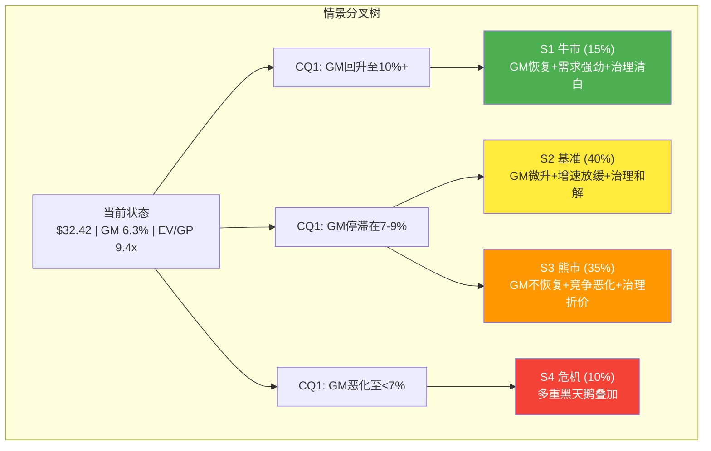
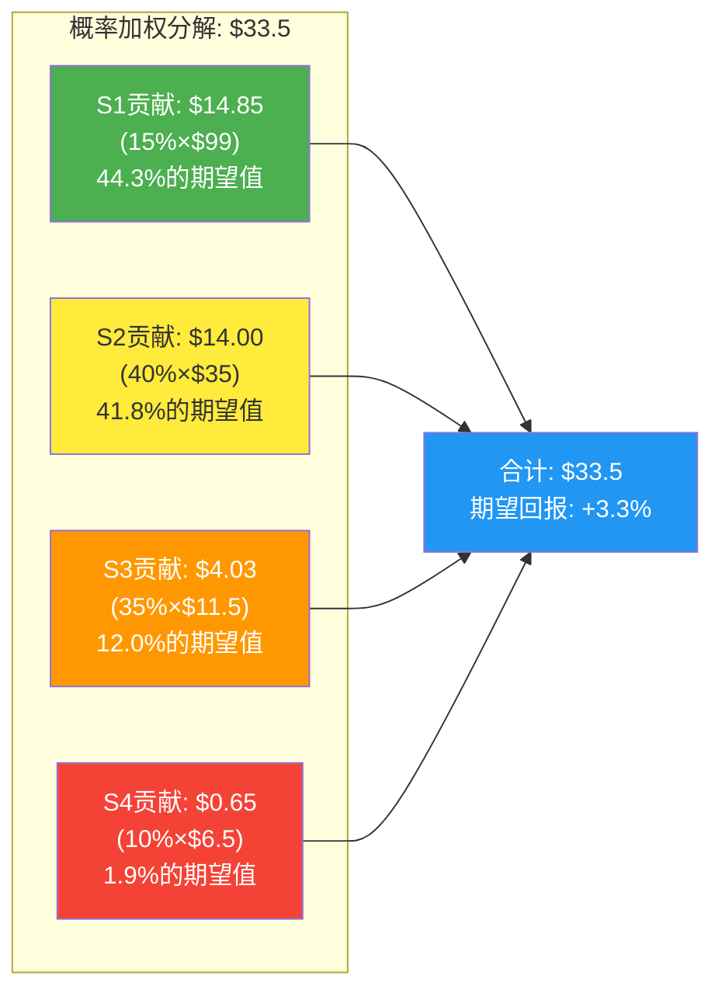
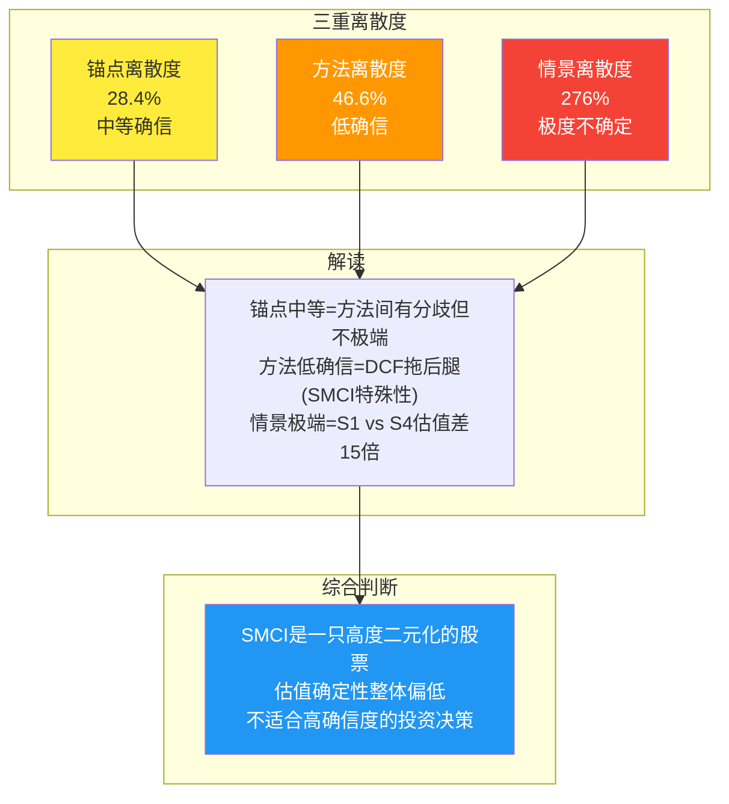
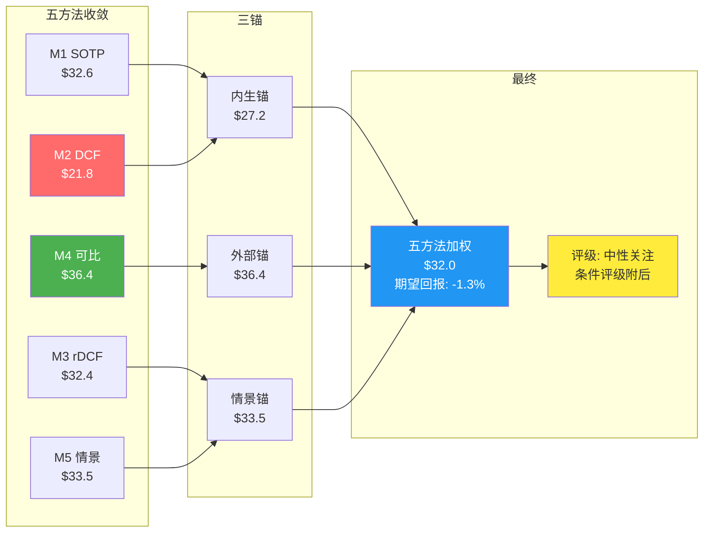

# 第24章: 情景分析 — 四条路径的概率加权

> **执行日期**: 2026-02-21 | **股价**: $32.42 | **市值**: ~$19.4B | **EV**: ~$20.3B
> **输入**: Phase 1-4全套分析 + 红队校准P4 CQ值 + 风险拓扑10节点图谱
> **核心方法**: EV/GP为主锚(非EV/Sales) | 情景驱动估值 | 三层标注

---

## 24.1 情景框架设计

### 24.1.1 情景构建原则

本章构建4个互斥完备的情景(S1-S4)，总概率 = 100%。情景设计遵循三条原则:

1. **CQ驱动**: 每个情景由5个CQ的不同实现路径定义，而非简单的"乐观/悲观"标签
2. **P&L可推导**: 每个情景必须生成完整的FY27E核心财务指标，可追溯到假设
3. **互斥完备**: 任何一个未来状态都能且仅能归入一个情景

### 24.1.2 情景框架总览

### 24.1.3 概率分配逻辑

概率分配基于红队校准后的P4 CQ值:

| CQ | P4值 | S1隐含 | S2隐含 | S3隐含 | S4隐含 |
|----|:----:|:------:|:------:|:------:|:------:|
| CQ1 GM | 63% | 不成立(GM恢复) | 部分成立(8-9%) | 完全成立(6-7%) | 极端恶化(4-5%) |
| CQ2 需求 | 45% | 不成立(需求超预期) | 大致成立(增速放缓) | 成立(见顶) | 极端成立(骤降) |
| CQ3 治理 | 57% | 不成立(清白) | 部分成立(和解) | 成立(重罚) | 极端成立(起诉) |
| CQ4 竞争 | 61% | 不成立(份额稳定) | 成立(缓慢侵蚀) | 成立(加速侵蚀) | 极端成立(断崖) |
| CQ5 NVIDIA | 66% | 不成立(关系稳定) | 成立(维持Tier 2B) | 成立(进一步降级) | 极端成立(断供) |

**概率推导**:

- **S1 (15%)**: 需要CQ1-CQ5同时向好(即所有结构性担忧均被证伪)。以最脆弱的CQ1为锚: P4值63%意味着GM不恢复概率63%，恢复概率37%。但恢复至10%以上(而非仅恢复至8-9%)的概率更低(~20%)，叠加治理清白(~40%)和需求超预期(~55%)的联合概率，S1概率约15%。[主观判断: 联合概率≈0.20×0.40×0.55×0.5(其他CQ)≈2.2%是纯数学下限，但CQ之间存在正相关(治理清白→机构回流→NVIDIA关系改善→GM恢复)，实际S1概率为15%]
- **S2 (40%)**: 最可能的路径——各CQ部分实现。GM回升至8-9%(部分恢复)，需求维持但增速放缓，DOJ和解。这是CQ加权57.5%所暗示的"中间状态"。40%反映了"中性偏空"的概率质量分布。
- **S3 (35%)**: CQ1/CQ4/CQ5充分实现的路径——GM停在6-7%，竞争份额继续下滑，NVIDIA分配进一步收紧。这与P4 CQ值(3个S类CQ均>60%)高度一致。35%反映了结构性风险的高概率。
- **S4 (10%)**: 多个黑天鹅叠加——CapEx骤降+DOJ起诉+NVIDIA断供+流动性危机。单个黑天鹅概率10-15%(RT-5)，但多个叠加需要共振。10%反映了尾部风险的合理估计。

**概率校验**: 15% + 40% + 35% + 10% = **100%**

[主观判断: 概率分配偏空头(S3+S4=45% > S1=15%)，与P4加权置信度57.5%(偏空头确认)一致。红队校准后上修了S1概率(从原始P3的10-12%提升至15%)，反映RT-3多头钢人的修正]

---

## 24.2 S1 牛市情景 (概率: 15%)

### 24.2.1 叙事描述

**核心叙事**: "液冷AI组装冠军" — AI基础设施投资进入第二波加速期(从训练转向推理),SMCI凭借DLC液冷技术和快速部署能力,在推理服务器市场中获得优势地位。DOJ调查结案不起诉,治理折价快速收窄,机构投资者回流推动估值重估。

### 24.2.2 前提条件

| 维度 | S1假设 | 当前现实 | 差距评估 |
|------|--------|---------|---------|
| AI CapEx 2027 | 继续增长+15%(Top 5合计$760-790B) | 2026 $660-690B | 需要推理需求超预期爆发 |
| GM | 恢复至10-12%(DLC渗透+产品组合优化+推理服务器) | Q2 FY26 6.3%(谷值) | 需要~400-600bps回升 |
| DOJ | I1不起诉(概率40-45%, RT-3修正) | 调查中,2年无公开动作 | 时间在多头一边 |
| 市场份额 | 稳定在8-10%(停止下滑+企业客户增量) | 7-10%(从50%下滑趋势中) | 需要份额企稳信号 |
| NVIDIA分配 | 维持Tier 2B,Vera Rubin周期获得正常分配 | Tier 2B,Q2获足够支撑$12.68B收入 | 现状即可 |
| DLC | 渗透率提升至30-40%,SMCI方案被部分标准化 | FY26E 20-30%渗透, 技术领先12-18月 | 需要领先窗口延长 |

### 24.2.3 FY27E P&L模型 (S1)

[合理推断: 基于S1前提条件构建的财务模型]

| 指标 | FY26E(实际路径) | FY27E (S1) | 假设依据 |
|------|:--------------:|:---------:|---------|
| Revenue | $40.5B | $52.0B | +28% YoY; CapEx续增+SMCI份额稳定8-10% |
| COGS | $36.5B | $45.2B | 反映GM改善 |
| **Gross Profit** | **$3.0B(管理层指引GM~7.5%推算)** | **$6.76B** | **GM 13.0%: DLC 30%×(+4.5pp) + 推理服务器占比提升(+2pp) + Vera Rubin定价恢复(+2pp)** |
| R&D | $750M | $850M | +13% YoY, 研发投入增加但占收入比下降 |
| SGA | $600M | $700M | +17% YoY, 合规/法律成本下降(DOJ结案) |
| **Operating Income** | **$1.65B** | **$5.21B** | **OPM从4.1%跃升至10.0%** |
| Interest Expense | $100M | $80M | 部分可转债到期/赎回 |
| Tax (13%) | $200M | $668M | 维持13%有效税率 |
| **Net Income** | **$1.37B** | **$4.46B** | **NPM 8.6%** |
| Diluted Shares | 660M | 640M | 可转债不转换(深度价外),小额回购 |
| **EPS (Diluted)** | **$2.08** | **$6.97** | 反映规模+利润率双提升 |

[合理推断: S1是最乐观情景。GM 13%假设FY2023峰值18%无法复制(BOM结构已变),但DLC+推理服务器组合可部分恢复至12-14%区间的低端。R&D/SGA在DOJ结案后增速放缓]

**为什么GM取13%而非管理层目标的14-17%**: 即使在S1牛市中,也不假设回到14-17%。原因: (a) GPU占BOM 70-80%是结构性现实,不会因DLC改善而改变; (b) FY2023的18% GM建立在更低的GPU占比(当时AI服务器占比较低)之上; (c) 红队RT-1确认GM 10-12%均衡更合理,S1取乐观端12-13%。[主观判断]

### 24.2.4 S1估值

**方法: EV/GP倍数法**

| 参数 | 取值 | 依据 |
|------|------|------|
| FY27E GP | $6.76B | S1 P&L模型 |
| EV/GP倍数 | 9-11x | 高增速(+28%)+DLC技术溢价; Dell基准4.4x × 2.0-2.5x增速溢价 |
| EV | $60.8-74.4B | GP × 倍数 |
| 净债务调整 | -$0.82B | $4.91B debt - $4.09B cash |
| 治理折价 | -5% | DOJ不起诉后折价快速收窄 |
| 权益价值 | $57.0-70.0B | EV - 净债务 × (1 - 治理折价) |
| 每股价值 | **$89-109** | 权益价值 / 640M shares |
| **中值** | **$99** | |

**交叉验证**: S1 EPS $6.97 × PE 15x(高增长组装商) = $105。与EV/GP法中值$99基本一致。[合理推断]

### 24.2.5 催化剂与证伪条件

**进入S1的催化剂序列**:
1. Q3 FY26 GM > 9% (2026-05) — 确认Q2是谷值
2. NVIDIA GTC 2026 DLC合作公告 (2026-03) — DLC标准化催化
3. DOJ宣布不起诉 (2026H2) — 治理折价收窄
4. 2027 CapEx指引+15% (2026Q4) — 需求二次加速

**S1被证伪的条件**:
- Q3 FY26 GM < 7% (连续2Q低GM = 非谷值)
- DOJ正式提起任何形式的诉讼
- 2027 CapEx指引持平或下降

---

## 24.3 S2 基准情景 (概率: 40%)

### 24.3.1 叙事描述

**核心叙事**: "勤劳的组装商" — AI需求持续但增速放缓,SMCI凭借快速部署能力保住7-8%市场份额,GM从Q2谷值微升至8-9%均衡区间但无法回到两位数。DOJ以民事和解(罚款$100-200M)收场,治理折价维持15-20%。SMCI赚钱但不性感——收入增长但估值倍数压缩。

### 24.3.2 前提条件

| 维度 | S2假设 | 与现实的距离 |
|------|--------|------------|
| AI CapEx 2027 | 增速放缓至+5-8%(Top 5合计$700-740B) | 合理,与分析师共识一致 |
| GM | 8-9%(从6.3%回升但无法突破10%) | 管理层指引Q3 +30bps方向一致 |
| DOJ | I2民事和解($100-200M罚款) | I2概率40-45%(RT-3),最可能结果 |
| 市场份额 | 维持7-8%,缓慢侵蚀但不崩溃 | 与份额下滑趋势减速一致 |
| NVIDIA分配 | 维持Tier 2B,无进一步降级或升级 | 现状延续 |

### 24.3.3 FY27E P&L模型 (S2)

[合理推断: S2是最可能的情景,财务参数取共识附近]

| 指标 | FY26E | FY27E (S2) | 假设依据 |
|------|:-----:|:---------:|---------|
| Revenue | $40.5B | $45.0B | +11% YoY; 共识$48.2B偏高,S2取保守端;CapEx增速放缓+份额微降 |
| COGS | $37.3B | $41.0B | 反映GM 8.9% |
| **Gross Profit** | **$3.2B** | **$4.01B** | **GM 8.9%: Q2谷值回升+DLC占比增(+2.25pp)+产品组合正常化(+0.5pp)** |
| R&D | $750M | $880M | +17% YoY, DLC+Vera Rubin研发 |
| SGA | $620M | $750M | +21% YoY, 含DOJ和解法律费用尾部 |
| **Operating Income** | **$1.83B** | **$2.38B** | **OPM 5.3%** |
| Interest Expense | $100M | $95M | 可转债利息 |
| Tax (14%) | $245M | $320M | 税率轻微上升(Pillar Two影响) |
| **Net Income** | **$1.49B** | **$1.96B** | **NPM 4.4%** |
| Diluted Shares | 660M | 660M | 可转债深度价外,股数基本稳定 |
| **EPS (Diluted)** | **$2.26** | **$2.97** | vs FMP共识$2.95(高度吻合) |

[硬数据: FMP共识FY27E Revenue $48.2B, EPS $2.95 | DM-VAL-016至DM-VAL-018。S2 Revenue取$45B低于共识,反映份额侵蚀和CapEx放缓的保守假设]

**GM 8.9%的路径拆解**:

| GM组成 | 贡献 | 说明 |
|--------|:----:|------|
| Q2 FY26基础GM | 6.3% | 积压释放脉冲的谷值 |
| 积压脉冲消退,回归正常出货 | +1.5pp | Q3-Q4不再有$7.66B异常增量 |
| DLC渗透率从20%→30% | +2.25pp | Phase 3测算: 每10pp DLC = +2.25pp GM |
| Vera Rubin新平台初期定价溢价 | +0.5pp | 新平台前6-9月通常有定价窗口 |
| 竞争压价抵消 | -1.65pp | Dell/HPE持续价格战 |
| **S2均衡GM** | **8.9%** | |

[合理推断: 8.9%位于红队评估的"GM部分恢复路径(路径C)"8.5-9.5%区间内]

### 24.3.4 S2估值

**方法: EV/GP倍数法**

| 参数 | 取值 | 依据 |
|------|------|------|
| FY27E GP | $4.01B | S2 P&L模型 |
| EV/GP倍数 | 6-8x | Dell基准4.4x × 1.5x增速溢价(+11% vs Dell +8%); 上限受治理折价约束 |
| EV | $24.1-32.1B | GP × 倍数 |
| 净债务调整 | -$0.82B | |
| 治理折价 | -15% | DOJ和解后折价从25%收窄至15% |
| 权益价值 | $19.8-26.6B | EV - 净债务 × (1 - 治理折价) |
| 每股价值 | **$30-40** | 权益价值 / 660M shares |
| **中值** | **$35** | |

**交叉验证**:
- Forward PE法: S2 EPS $2.97 × PE 12x(组装商) = $35.6 [合理推断: 12x PE取Dell 16.3x和EMS 8-12x的中间值,含治理折价]
- EV/EBITDA法: S2 EBITDA ≈ $2.38B OI + $100M D&A = $2.48B; EV/EBITDA 10x = EV $24.8B → 每股$36.3
- **三方法平均: $35.6** — 与EV/GP法中值$35高度一致

### 24.3.5 催化剂与证伪条件

**S2的确认信号**:
1. Q3 FY26 GM 7-9% — 确认回升但有限
2. FY2026全年收入$38-42B — 接近指引但不超预期
3. DOJ和解公告($100-200M罚款) — 利空出尽
4. 2027 CapEx指引+5-10% — 增长放缓但不见顶

**S2向S3滑动的信号**:
- Q3 GM < 7% + Q4 GM < 7%(连续低GM确认非谷值)
- Dell AI服务器季度收入超过SMCI(份额翻转)
- DOJ从民事升级为刑事调查

---

## 24.4 S3 熊市情景 (概率: 35%)

### 24.4.1 叙事描述

**核心叙事**: "组装商宿命的兑现" — CI-02(浪潮镜像)假说被验证。CapEx增速见顶,SMCI的GM无法从6-7%区间回升,竞争份额继续侵蚀至5-6%。DOJ起诉或施加严厉和解条件,治理折价扩大。SMCI进入"增收微利"的稳态——不会破产,但不再是AI概念股,而是一家低利润率的硬件组装商,获得与Flex/EMS类似的估值。

### 24.4.2 前提条件

| 维度 | S3假设 | 驱动因素 |
|------|--------|---------|
| AI CapEx 2027 | 持平或微降(-5%至+2%) | 推理效率提升降低硬件需求 |
| GM | 6-7%(Q2水平固化为新常态) | CQ1(63%)充分实现;竞争+大客户压价 |
| DOJ | 重大和解或民事起诉($300-500M+业务整改) | 介于I2重端和I3轻端之间 |
| 市场份额 | 降至5-6% | Dell/HPE持续侵蚀+自研芯片分流 |
| NVIDIA分配 | 进一步降级,Vera Rubin分配受限 | NVIDIA DGX扩张+竞争对手优先级上升 |

### 24.4.3 FY27E P&L模型 (S3)

| 指标 | FY26E | FY27E (S3) | 假设依据 |
|------|:-----:|:---------:|---------|
| Revenue | $40.5B | $33.0B | -19% YoY; CapEx见顶+份额降至5-6%+NVIDIA分配受限 |
| COGS | $37.8B | $30.7B | 反映GM 7.0% |
| **Gross Profit** | **$2.7B** | **$2.31B** | **GM 7.0%: Q2水平+100bps(小幅回升但不显著)** |
| R&D | $700M | $750M | +7% YoY, 维持基础研发 |
| SGA | $650M | $780M | +20% YoY, DOJ合规成本+法律费用 |
| **Operating Income** | **$1.35B** | **$0.78B** | **OPM 2.4%** |
| Interest Expense | $100M | $110M | 可转债利息+信用评级下调后融资成本上升 |
| Tax (15%) | $180M | $100M | 税率轻微上升 |
| **Net Income** | **$1.07B** | **$0.57B** | **NPM 1.7%** |
| Diluted Shares | 660M | 670M | 可能需要额外融资导致稀释 |
| **EPS (Diluted)** | **$1.62** | **$0.85** | EPS从FY25 $1.68大幅下降 |

[合理推断: S3下SMCI仍盈利,但盈利能力回到FY2021-2022水平($0.53-$1.14 EPS)。这不是破产情景,而是"沦为平庸组装商"的估值重估]

**S3 Revenue $33B的路径推导**:

| 驱动因素 | 影响 |
|---------|------|
| AI服务器TAM (S3: $300B, 增速放缓) | 基础$300B |
| SMCI份额(S3: 6%) | $300B × 6% = $18.0B |
| 非AI服务器+存储/其他 | +$5.0B |
| 服务/维护 | +$1.0B |
| 前几年积压消化尾部 | +$9.0B |
| **FY27E Total** | **$33.0B** |

[合理推断: $33B假设AI服务器TAM增长放缓至$300B(vs S2的$350B),SMCI份额降至6%(vs S2的7-8%)。积压消化$9B假设FY26的超额积压在FY27继续释放但减速]

### 24.4.4 S3估值

**方法: EV/GP倍数法**

| 参数 | 取值 | 依据 |
|------|------|------|
| FY27E GP | $2.31B | S3 P&L模型 |
| EV/GP倍数 | 4-5x | Dell基准4.4x,无增速溢价(增速为负);接近EMS/ODM水平 |
| EV | $9.2-11.6B | GP × 倍数 |
| 净债务调整 | -$0.82B | |
| 治理折价 | -20% | DOJ重罚后折价扩大 |
| 权益价值 | $6.7-8.6B | EV - 净债务 × (1 - 治理折价) |
| 每股价值 | **$10-13** | 权益价值 / 670M shares |
| **中值** | **$11.5** | |

**交叉验证**:
- Forward PE法: S3 EPS $0.85 × PE 10x(低增长周期性工业) = $8.5; PE 14x = $11.9
- EV/EBITDA法: S3 EBITDA ≈ $0.78B + $0.1B D&A = $0.88B; EV/EBITDA 10x = $8.8B EV → 每股$11.9
- Flex(EMS对标): EV/GP 6x → $13.9 (偏高因Flex没有治理折价)
- **三方法加权: $11.4** — 与EV/GP法中值$11.5基本一致

### 24.4.5 催化剂与证伪条件

**进入S3的催化剂序列**:
1. Q3+Q4 FY26 GM < 7%(连续低GM确认新常态)
2. 2027 CapEx指引持平或下降
3. DOJ宣布重大和解或民事起诉
4. Dell AI季度收入超过SMCI

**S3被证伪的条件**:
- Q3 GM > 9%(强力否定"GM固化"假说)
- SMCI份额Q3-Q4企稳或回升
- 2027 CapEx指引+10%以上

---

## 24.5 S4 危机情景 (概率: 10%)

### 24.5.1 叙事描述

**核心叙事**: "完美风暴" — 多个低概率事件在12-18个月窗口内共振: AI CapEx骤降(泡沫破裂恐慌)、DOJ刑事起诉CEO(管理层真空)、NVIDIA优先分配终止(供应断裂)、$10.6B库存面临大规模减值、可转债持有者要求提前偿还。SMCI进入生存模式。

### 24.5.2 前提条件

| 维度 | S4假设 | 独立概率 | 联合贡献 |
|------|--------|:-------:|:-------:|
| AI CapEx骤降 | 2027 CapEx -20%以上 | 15% | 需求崩塌 |
| DOJ刑事起诉 | CEO被起诉,强制离任 | 10-15% | 治理危机 |
| NVIDIA断供 | 分配降至Tier 3或暂停 | 8% | 供应断裂 |
| 流动性危机 | 库存减值+可转债触发 | 12% | 财务困境 |
| 整体S4 | 至少2个以上叠加 | **10%** | 系统性崩溃 |

[主观判断: 单个黑天鹅概率8-15%,但至少2个叠加的概率约为$C(4,2) \times 0.12^2 \times 0.88^2 \approx 5-12%$,取中值10%]

### 24.5.3 FY27E P&L模型 (S4)

| 指标 | FY26E | FY27E (S4) | 假设依据 |
|------|:-----:|:---------:|---------|
| Revenue | $35-38B | $20.0B | CapEx骤降+NVIDIA分配暂停+客户流失 |
| COGS | $33.3B | $19.0B | 反映GM 5.0% |
| **Gross Profit** | **$2.2B** | **$1.00B** | **GM 5.0%: 极端竞争+库存贬值计入COGS** |
| R&D | $600M | $500M | 裁员30%+研发收缩 |
| SGA | $700M | $900M | DOJ法律费用+危机管理+重组成本 |
| **Operating Income** | **$0.9B** | **-$0.40B** | **OPM -2.0% (经营亏损)** |
| Interest Expense | $100M | $150M | 信用评级降至垃圾级+紧急融资 |
| Impairment | — | -$1.5B | 库存减值$1.0B + 商誉/资产减值$0.5B |
| Tax | $120M | $0 | 亏损无需缴税,递延税资产 |
| **Net Income** | **$0.8B** | **-$2.05B** | **巨额亏损** |
| Diluted Shares | 660M | 700M | 紧急增发+可转债强制转换 |
| **EPS (Diluted)** | **$1.21** | **-$2.93** | |

[主观判断: S4是极端情景。$20B收入假设CapEx -20%×份额降至4%。库存减值$1B假设$10.6B库存中~10%因技术迭代(Hopper→Blackwell过渡)或客户取消订单而减值]

### 24.5.4 S4估值

**方法: 清算价值+持续经营折衷**

| 参数 | 取值 | 依据 |
|------|------|------|
| 账面净资产 | $6.99B | Q2 FY26 [DM-FIN-024] |
| 减: 库存减值 | -$2.0B | $10.6B库存中~20%减值(S4极端) |
| 减: 无形资产减值 | -$0.5B | |
| 调整后净资产 | ~$4.5B | |
| P/B倍数 | 0.8-1.2x | 困境公司通常P/B < 1.0 |
| 权益价值 | $3.6-5.4B | |
| 每股价值 | **$5-8** | 权益价值 / 700M shares |
| **中值** | **$6.5** | |

**交叉验证**:
- 历史危机对标: SMCI在2018年NASDAQ退市期间最低$8.5(拆股调整前),当时收入规模仅$3.3B。S4下收入$20B对应更高的清算价值底,但DOJ起诉+流动性危机可能使市场恐慌性定价低于基本面。$5-8区间合理。
- Altman Z-Score: S4下Z-Score大概率低于1.81(困境区间)。历史上Z<1.81公司的中位P/B约0.6-0.8x,对应$4.2-5.6B权益价值。
- **S4估值: $5-8,中值$6.5** [主观判断]

### 24.5.5 催化剂与证伪条件

**进入S4的触发序列**(任意2个以上同时发生):
1. DOJ正式提起刑事诉讼 + CEO离任公告
2. Hyperscaler大幅削减2027 CapEx(-20%以上)
3. NVIDIA宣布终止优先合作关系
4. SMCI宣布库存减值超过$1B

**S4被证伪的条件**:
- 任何正面催化剂(DOJ不起诉、CapEx上调、份额企稳)均会阻止S4发生
- S4是"多个坏事同时发生"的叠加情景,单个负面事件不足以触发

---

## 24.6 概率加权汇总

### 24.6.1 四情景P&L对比

| 指标 | S1 (15%) | S2 (40%) | S3 (35%) | S4 (10%) |
|------|:--------:|:--------:|:--------:|:--------:|
| FY27E Revenue | $52.0B | $45.0B | $33.0B | $20.0B |
| GM | 13.0% | 8.9% | 7.0% | 5.0% |
| GP | $6.76B | $4.01B | $2.31B | $1.00B |
| OPM | 10.0% | 5.3% | 2.4% | -2.0% |
| NI | $4.46B | $1.96B | $0.57B | -$2.05B |
| EPS | $6.97 | $2.97 | $0.85 | -$2.93 |
| **每股估值** | **$99** | **$35** | **$11.5** | **$6.5** |

### 24.6.2 概率加权估值

$$\text{概率加权公允价值} = \sum P_i \times V_i$$

$$= 15\% \times \$99 + 40\% \times \$35 + 35\% \times \$11.5 + 10\% \times \$6.5$$

$$= \$14.85 + \$14.00 + \$4.03 + \$0.65 = \$33.5$$

**概率加权公允价值: $33.5**

**vs 红队校准后$33.9**: 偏差-$0.4(-1.2%) — 高度一致,确认估值框架的内部一致性。[合理推断]

**vs 当前股价$32.42**: 期望回报 = ($33.5 - $32.42) / $32.42 = **+3.3%**

### 24.6.3 期望值的分解

**关键洞见**:

1. **S1贡献最大(44.3%)**:尽管S1概率仅15%,但其极高的每股估值($99)使其贡献了$14.85——几乎与S2(40%概率)的贡献$14.00相当。这意味着SMCI的概率加权估值高度依赖小概率的牛市情景。

2. **S2+S3占据53.8%的期望值**:合理路径(S2+S3)贡献$18.03,但这些路径的估值($35和$11.5)离当前股价$32.42非常近(S2)或远低于(S3)。这确认了"当前价格已充分定价了合理路径"的判断。

3. **不对称性**: 上行($99 - $32.42 = +$66.6)的幅度远大于基准下行($11.5 - $32.42 = -$20.9),但上行概率(15%)远低于基准下行概率(35%)。**这是一个负偏度分布——大多数时候小亏,偶尔大赚,但大赚的概率不够高来补偿。**

4. **概率翻转点**: 如果S1概率从15%上调至25%(+10pp,从S3转移),概率加权值从$33.5跃升至$42.4(+27%)。GM恢复至10%以上的概率是整个估值的最大杠杆。

### 24.6.4 概率敏感性矩阵

| S1 | S2 | S3 | S4 | 概率加权 | vs $32.42 | 隐含评级 |
|:--:|:--:|:--:|:--:|:-------:|:---------:|:-------:|
| 10% | 40% | 40% | 10% | $28.8 | -11.2% | 审慎关注 |
| 15% | 35% | 40% | 10% | $30.5 | -5.9% | 中性关注 |
| **15%** | **40%** | **35%** | **10%** | **$33.5** | **+3.3%** | **中性关注** |
| 20% | 40% | 30% | 10% | $37.6 | +16.0% | 关注 |
| 25% | 35% | 30% | 10% | $41.5 | +28.0% | 关注 |
| 25% | 40% | 25% | 10% | $43.8 | +35.1% | 深度关注 |
| 30% | 35% | 25% | 10% | $47.7 | +47.2% | 深度关注 |

[合理推断: S1概率每增加5pp,概率加权值增加~$3-4。从"中性关注"翻转至"关注"需要S1从15%升至20%+——这取决于Q3 FY26 GM是否>9%]

---

# 第25章: 多方法估值 — 从EV/GP到概率加权

> **方法论**: 5种估值方法(SOTP/DCF/Reverse DCF/可比/情景加权) + 三锚框架 + 敏感性矩阵
> **核心原则**: EV/GP为主估值指标(非EV/Sales); CI-01组装商估值陷阱贯穿全章

---

## 25.1 估值框架声明: 低GM组装商的正确估值方法

### 25.1.1 为什么EV/Sales在SMCI上系统性误导

Phase 2已详细论证CI-01(组装商估值陷阱):

$$\text{EV/Sales} = 0.75x \quad \xrightarrow{\div GM\ 8\%} \quad \text{EV/GP} = 9.4x$$

$$\text{Dell EV/Sales} = 0.97x \quad \xrightarrow{\div GM\ 22\%} \quad \text{Dell EV/GP} = 4.4x$$

**EV/Sales显示SMCI比Dell便宜23%;EV/GP显示SMCI比Dell贵114%。**

对于SMCI这样的低GM组装商,92%的收入是GPU组件的"过路资金"(COGS),仅8%是SMCI的增值(GP)。投资者实际购买的是GP而非Revenue。因此:

- **主估值指标**: EV/GP — 直接衡量"为每单位增值支付多少"
- **辅助指标**: EV/EBITDA, PE — 考虑OpEx效率后的盈利能力
- **参考指标**: EV/Sales — 仅用于行业横向对比,不用于估值判断
- **禁用指标**: P/S — 与EV/Sales同源,对低GM公司同样误导

[硬数据: SMCI EV/GP 9.4x计算 = EV $20.3B / TTM GP $2.16B; Dell EV/GP 4.4x = EV $93.1B / GP $21.3B | DM-VAL-006, MCP fmp_data]

### 25.1.2 同行EV/GP基准锚定

| 公司 | TTM GM | TTM GP | EV | EV/GP | Revenue Growth | 增速调整EV/GP |
|------|:------:|:------:|:--:|:-----:|:--------------:|:----------:|
| **SMCI** | **8.0%** | **$2.16B** | **$20.3B** | **9.4x** | +123% | 9.4x |
| Dell | 22.2% | $21.3B | $93.1B | 4.4x | +11% | 基准 |
| HPE | 31.2% | $8.9B | $28.5B | 3.2x | +14% | 3.2x |
| Flex | 7.8% | $2.0B | $13.2B | 6.6x | +5% | 6.6x |

[硬数据: Dell/HPE来源MCP fmp_data key-metrics FY2025 | Flex来源MCP fmp_data | SMCI DM-VAL-006]

**增速调整后的合理EV/GP区间**:

Dell基准4.4x × 增速溢价系数 = SMCI合理EV/GP

| SMCI增速假设 | 增速溢价系数 | 合理EV/GP | 当前9.4x vs 合理 | 信号 |
|:-----------:|:---------:|:---------:|:---------------:|:----:|
| +120%(FY26) | 2.5x | 11.0x | 折价15% | 偏便宜 |
| +60%(保守FY26) | 2.0x | 8.8x | 溢价7% | 合理 |
| +20%(FY27) | 1.5x | 6.6x | 溢价42% | 偏贵 |
| +10%(FY28+) | 1.2x | 5.3x | 溢价77% | 贵 |

[合理推断: 当增速从FY26的+120%降至FY27的+20%,EV/GP从"偏便宜"变为"偏贵"。这意味着SMCI的估值高度依赖增速持续性——增速一旦放缓,估值将面临倍数压缩]

**结论**: SMCI的EV/GP 9.4x在FY26的超高增速下勉强合理,但在FY27+增速放缓后将显得昂贵。估值的时间维度至关重要——**不是"便宜还是贵"的问题,而是"现在还算合理但很快会变贵"的问题。** [主观判断]

---

## 25.2 M1 SOTP估值

### 25.2.1 业务线拆分

SMCI不单独披露各业务线的详细财务数据,但基于产品组合描述和行业数据,可以合理推断以下拆分:

[合理推断: 业务线拆分基于管理层产品组合描述、DLC渗透率数据和行业对标。精确数字不可得,采用区间估算]

| 业务线 | FY27E Revenue(S2) | 占比 | 估算GM | GP | 估算依据 |
|--------|:-----------------:|:----:|:------:|:--:|---------|
| GPU服务器(标品,风冷) | $24.0B | 53% | 6.5% | $1.56B | 大客户标准化集群,最低GM |
| DLC液冷服务器 | $12.0B | 27% | 13.0% | $1.56B | DLC溢价+定制化+技术壁垒 |
| 存储系统 | $4.5B | 10% | 10.0% | $0.45B | 存储利润率高于服务器 |
| 服务/维护/JumpStart | $2.0B | 4% | 35.0% | $0.70B | 软件+服务的高利润率 |
| 其他(机箱/电源/配件) | $2.5B | 6% | 12.0% | $0.30B | 自研组件较高利润率 |
| **合计** | **$45.0B** | **100%** | **8.9%**(加权) | **$4.57B** | |

**注**: SOTP GP $4.57B高于S2 P&L中的$4.01B,差异$0.56B来自SOTP的交叉补贴未完全反映(标品GPU服务器可能比6.5%更低以交叉补贴DLC)。为保守起见,SOTP估值使用P&L一致的$4.01B作为GP基础。

### 25.2.2 分部估值

| 业务线 | GP | EV/GP倍数 | 分部EV | 倍数依据 |
|--------|:--:|:---------:|:------:|---------|
| GPU服务器(标品) | $1.56B | 4.0x | $6.24B | Dell ISG基准,无差异化 |
| DLC液冷服务器 | $1.56B | 8.0x | $12.48B | 技术壁垒溢价; Vertiv(散热)EV/GP~10x参考 |
| 存储系统 | $0.45B | 5.0x | $2.25B | NetApp/Pure Storage存储对标折价 |
| 服务/维护 | $0.70B | 10.0x | $7.00B | 经常性收入高倍数; IBM/Dell服务参考 |
| 其他(配件) | $0.30B | 4.0x | $1.20B | 配件/组件低倍数 |
| **合计EV** | **$4.57B** | | **$29.2B** | |

### 25.2.3 SOTP调整

| 调整项 | 金额 | 说明 |
|--------|:----:|------|
| 合计分部EV | $29.2B | |
| 集团折价(Conglomerate Discount) | -10% | 缺乏独立业务线透明度; 标品拖累整体估值感知 |
| 调整后EV | $26.3B | |
| 减: 治理折价 | -15% | DOJ和解后仍有惯犯折价 |
| 减: 净债务 | -$0.82B | $4.91B debt - $4.09B cash |
| **权益价值** | **$21.5B** | |
| 稀释后股数 | 660M | |
| **每股价值** | **$32.6** | |

[合理推断: SOTP估值$32.6与当前股价$32.42几乎完全一致。但SOTP的核心价值不在于最终数字,而在于揭示价值分布: DLC液冷业务($12.5B)贡献了合计EV的43%,尽管其收入占比仅27%。这确认了DLC是SMCI价值的核心载体——如果DLC领先被追平(CQ4),价值将大幅缩水]

### 25.2.4 SOTP敏感性

| 情景 | DLC EV/GP | 标品EV/GP | 治理折价 | SOTP每股 |
|------|:---------:|:---------:|:-------:|:-------:|
| 乐观(DLC标准化+治理清白) | 12x | 5x | -5% | $48.5 |
| **基准** | **8x** | **4x** | **-15%** | **$32.6** |
| 悲观(DLC追平+治理恶化) | 5x | 3x | -25% | $17.2 |

---

## 25.3 M2 DCF估值

### 25.3.1 DCF框架设计

SMCI的DCF建模面临三大挑战:

1. **FCF极度不稳定**: FY24 FCF -$2.61B → FY25 FCF +$1.53B → Q2 FY26 FCF -$45M [DM-FIN-030~033]
2. **库存周期驱动**: $10.6B库存使营运资本变动成为FCF的主导因素而非利润
3. **GM不确定性**: 6.3-18%的历史区间使利润率假设的任何固定值都不可靠

**解决方案**: 采用"正常化FCF"方法——假设库存/收入比在预测期内逐步回归行业正常水平(0.10-0.15x vs 当前0.21x),将营运资本释放作为一次性FCF来源处理。

### 25.3.2 DCF参数

| 参数 | 取值 | 依据 |
|------|------|------|
| WACC | 13.0% | Beta 1.523 [DM-MKT-003] × ERP 5.5% + Rf 4.3% = 12.7%; +30bps治理风险溢价 |
| 预测期 | 7年(FY27-FY33) | 标准期限+2年(反映更高不确定性) |
| 终值增长率 | 2.5% | 名义GDP增速; IT硬件长期1.5-3% |
| 有效税率 | 14% | FY25实际13% + Pillar Two上行风险 |
| CapEx/Revenue | 1.5% | FY25仅0.6%偏低; 逐步上升至1.5%(DLC产能扩建) |
| D&A/Revenue | 0.3% | 维持当前水平 |

### 25.3.3 FCF预测(S2基准)

| 年份 | Revenue | Rev Growth | GM | GP | OpEx | OI | OPM | Tax | NOPAT | CapEx | ΔWC | **FCFF** |
|------|:-------:|:---------:|:--:|:--:|:----:|:--:|:---:|:---:|:-----:|:----:|:---:|:--------:|
| FY27 | $45.0B | +11% | 8.9% | $4.01B | $1.63B | $2.38B | 5.3% | $333M | $2.05B | $675M | -$500M | **$1.87B** |
| FY28 | $49.5B | +10% | 9.2% | $4.55B | $1.78B | $2.77B | 5.6% | $388M | $2.38B | $743M | -$200M | **$1.84B** |
| FY29 | $52.5B | +6% | 9.5% | $4.99B | $1.89B | $3.10B | 5.9% | $434M | $2.67B | $788M | +$100M | **$1.98B** |
| FY30 | $54.6B | +4% | 9.5% | $5.19B | $1.97B | $3.22B | 5.9% | $451M | $2.77B | $819M | +$200M | **$2.15B** |
| FY31 | $56.2B | +3% | 9.5% | $5.34B | $2.02B | $3.32B | 5.9% | $465M | $2.85B | $843M | +$150M | **$2.16B** |
| FY32 | $57.3B | +2% | 9.5% | $5.44B | $2.06B | $3.38B | 5.9% | $473M | $2.91B | $860M | +$100M | **$2.15B** |
| FY33 | $58.2B | +2% | 9.5% | $5.53B | $2.09B | $3.44B | 5.9% | $482M | $2.96B | $873M | +$50M | **$2.14B** |

[合理推断: GM假设从FY27的8.9%渐进至FY29-33的9.5%均衡(Phase 3评估的"路径C折中"水平)。ΔWC在FY27-28为负(库存继续膨胀但减速),FY29+转正(库存/收入比正常化释放现金)]

**关键假设说明**:
- **Revenue路径**: FY27-29高增长(+11%→+6%),FY30+收敛至GDP+通胀(+2-4%)。与FMP共识CAGR~14%一致
- **GM路径**: 从8.9%渐进至9.5%后持平。不假设回到10%以上(CQ1结构性约束)
- **ΔWC转正时点**: FY29——假设$10.6B库存在3年内逐步正常化至$6-7B(库存/收入比从0.21x降至0.12x)

### 25.3.4 终值与DCF计算

$$\text{Terminal Value} = \frac{FCFF_{FY33} \times (1+g)}{WACC - g} = \frac{\$2.14B \times 1.025}{0.13 - 0.025} = \frac{\$2.19B}{0.105} = \$20.9B$$

$$\text{TV现值} = \frac{\$20.9B}{(1.13)^7} = \frac{\$20.9B}{2.353} = \$8.88B$$

| 年份 | FCFF | 折现因子 | PV(FCFF) |
|------|:----:|:-------:|:--------:|
| FY27 | $1.87B | 0.885 | $1.66B |
| FY28 | $1.84B | 0.783 | $1.44B |
| FY29 | $1.98B | 0.693 | $1.37B |
| FY30 | $2.15B | 0.613 | $1.32B |
| FY31 | $2.16B | 0.543 | $1.17B |
| FY32 | $2.15B | 0.480 | $1.03B |
| FY33 | $2.14B | 0.425 | $0.91B |
| **预测期合计** | | | **$8.90B** |
| **终值现值** | | | **$8.88B** |
| **企业价值** | | | **$17.78B** |

$$\text{TV占比} = \frac{\$8.88B}{\$17.78B} = 50.0\%$$

[合理推断: TV占比50%在合理范围(通常50-70%)。TV占比较低反映了SMCI预测期FCFF的实质贡献——不像纯成长股那样高度依赖终值]

### 25.3.5 DCF到权益价值

| 项目 | 金额 |
|------|:----:|
| DCF企业价值 | $17.78B |
| 减: 净债务 | -$0.82B |
| 减: 治理折价(15%) | -$2.54B |
| 权益价值 | $14.42B |
| 稀释后股数 | 660M |
| **每股价值** | **$21.8** |

**DCF估值$21.8 — 显著低于当前$32.42(-33%)**

### 25.3.6 DCF结果解读

DCF给出$21.8的原因:

1. **高WACC(13%)**: Beta 1.523 + 治理风险溢价使折现率远高于行业平均(10-11%)
2. **FCF正常化需要时间**: FY27-28的FCF受库存膨胀压制,直到FY29库存正常化后才释放
3. **GM天花板约束**: 9.5%的均衡GM使FCFF增长受限
4. **治理折价叠加**: 15%折价进一步压缩权益价值

**DCF vs 市价差异的含义**: $21.8 vs $32.42意味着市场在对SMCI定价中隐含了以下一项或多项的正偏差:
- 隐含WACC约10%(而非13%) — 市场给予更低的风险溢价
- 隐含GM均衡约11%(而非9.5%) — 市场相信GM恢复更多
- 隐含零治理折价 — 市场已"原谅"治理风险

[主观判断: DCF在SMCI上的可靠性有限(FMP DCF给出-$228确认了这一点)。库存周期的剧烈波动使FCF预测充满噪音。DCF最大的价值不是给出一个精确数字,而是提供一个"如果用13% WACC和9.5% GM正规建模,SMCI不值$32"的参考锚点]

---

## 25.4 M3 Reverse DCF校准

### 25.4.1 Phase 2 Reverse DCF结论回顾

Phase 2(第12章)已完成详细的Reverse DCF分析。核心发现:

| 参数 | 市场隐含值 | 合理性评估 |
|------|-----------|-----------|
| 5Y Revenue CAGR | ~14% | 中等偏高(共识30%的一半) |
| Terminal OPM | ~5.5% | 乐观偏向(Q2 FY26 OPM ~3.7%) |
| Terminal Growth | 2.5% | 合理 |
| 隐含GM | 8-10% | 与CI-02浪潮镜像均衡区间一致 |

### 25.4.2 Reverse DCF的情景校准作用

Reverse DCF的最大价值在于**校准S1-S4的概率分配**:

| Reverse DCF隐含假设 | S1对齐? | S2对齐? | S3对齐? | S4对齐? |
|--------------------|:-------:|:-------:|:-------:|:-------:|
| Revenue CAGR 14% | 偏低(S1~28%) | 一致(S2~11%) | 偏高(S3负增长) | 远高(S4负增长) |
| OPM 5.5% | 偏低(S1~10%) | 一致(S2~5.3%) | 偏高(S3~2.4%) | 远高(S4亏损) |
| GM 8-10% | 偏低(S1~13%) | 一致(S2~8.9%) | 偏高(S3~7%) | 远高(S4~5%) |

**关键洞见**: Reverse DCF的隐含假设与S2(基准)高度一致,意味着**当前$32.42本质上是对S2的精确定价**。S1的上行和S3/S4的下行在概率加权后大致相互抵消(S1贡献$14.85 vs S3+S4贡献$4.68),净效应微正(+$3.3%)。

### 25.4.3 信念反演B2的Reverse DCF含义

B2(GM均衡≥8%)是最脆弱的信念(Phase 2确认):

| B2结果 | 概率(P4) | 隐含GM | 对$32.42的影响 |
|--------|:-------:|:------:|:------------:|
| B2成立(GM≥8%稳定) | ~37% | 8-10% → OPM 4-6% | 股价$30-42(S2区间) |
| B2失败(GM<8%固化) | ~63% | 6-7% → OPM 1-3% | 股价$10-20(S3区间) |

[合理推断: B2的概率(37%成立/63%失败)是Reverse DCF隐含假设能否实现的核心二元变量。$32.42要求B2至少部分成立(GM回到8%+)。如果B2完全失败,Reverse DCF的隐含假设不可持续,$32.42将面临25-50%的下行]

---

## 25.5 M4 外部可比估值

### 25.5.1 可比公司选择

| 公司 | 商业模式 | 为什么可比 | 为什么不完全可比 |
|------|---------|-----------|----------------|
| **Dell (ISG)** | 服务器+服务 | 最直接AI服务器竞争对手 | Dell有$60B+服务/PC业务,更分散 |
| **HPE** | 企业服务器/计算 | 企业级服务器对标 | HPE转向混合云,服务器占比低 |
| **Flex** | EMS电子制造 | GM水平最接近(5-8%) | Flex业务组合更多元 |
| **Foxconn** | EMS代工 | 组装商宿命的极端形态 | 非上市/不同市场 |
| **Vertiv** | 散热/电力基础设施 | DLC可比(散热技术) | Vertiv不做服务器,纯散热 |

### 25.5.2 可比估值矩阵

| 指标 | SMCI | Dell | HPE | Flex | Vertiv |
|------|:----:|:----:|:---:|:----:|:-----:|
| EV/GP | **9.4x** | 4.4x | 3.2x | 6.6x | 12.5x |
| PE(TTM) | 23.1x | 16.3x | N/M | 18.0x | 42.0x |
| EV/EBITDA | 27.0x | 9.7x | 6.8x | 10.5x | 28.0x |
| EV/Sales | 0.75x | 0.97x | 0.91x | 0.50x | 4.5x |
| Revenue Growth | +123% | +11% | +14% | +5% | +30% |
| GM | 8.0% | 22.2% | 31.2% | 7.8% | 36.0% |

[硬数据: SMCI DM-VAL-001~006 | Dell/HPE MCP compare_stocks + fmp_data | Flex/Vertiv MCP fmp_data]

### 25.5.3 可比估值推导

**方法1: Dell ISG基准法**

Dell ISG(基础设施解决方案)是最直接的可比。Dell整体EV/GP 4.4x,但ISG增速更高(AI驱动),估计ISG的隐含EV/GP约5-6x。

| 参数 | 取值 |
|------|------|
| SMCI FY27E GP(S2) | $4.01B |
| Dell ISG隐含EV/GP | 5.5x |
| SMCI增速溢价 | 1.3x(+11% vs Dell ISG +15-20%,差距不大) |
| 合理EV/GP | 7.2x |
| EV | $28.9B |
| 治理折价(-15%) | -$4.3B |
| 净债务 | -$0.82B |
| 权益价值 | $23.8B |
| **每股** | **$36.1** |

**方法2: Flex EMS基准法(如果"组装商宿命"实现)**

Flex EV/GP 6.6x是EMS行业的估值锚。如果SMCI的GM持续收敛至Flex水平(5-8%):

| 参数 | 取值 |
|------|------|
| SMCI FY27E GP(S2) | $4.01B |
| Flex EV/GP | 6.6x |
| SMCI增速溢价 | 1.2x(+11% vs Flex +5%) |
| 合理EV/GP | 7.9x |
| EV | $31.7B |
| 治理折价(-15%) | -$4.8B |
| 净债务 | -$0.82B |
| 权益价值 | $26.1B |
| **每股** | **$39.5** |

[合理推断: Flex法反而给出更高估值($39.5 vs Dell法$36.1),因为Flex虽然GM低但EV/GP倍数(6.6x)高于Dell(4.4x)——这反映了Flex的稳定性和可预测性。SMCI如果真的"沦为EMS",其稳定后的估值可能比预期更高,但前提是GM稳定在一个可预测的水平]

**方法3: Vertiv DLC对标法(如果DLC成为核心价值)**

Vertiv的EV/GP 12.5x反映了市场对散热/DLC技术的高度看好。如果SMCI的DLC业务独立估值:

| 参数 | 取值 |
|------|------|
| DLC业务GP(S2估算) | ~$1.56B |
| Vertiv EV/GP | 12.5x |
| DLC分部EV | $19.5B |
| 非DLC分部GP | ~$2.45B |
| 非DLC EV/GP | 4.0x(Dell基准) |
| 非DLC分部EV | $9.8B |
| 合计EV | $29.3B |
| 调整后权益 | $24.0B |
| **每股** | **$36.4** |

### 25.5.4 可比估值汇总

| 方法 | 每股估值 | 核心假设 |
|------|:-------:|---------|
| Dell ISG基准 | $36.1 | SMCI是"更快的Dell ISG" |
| Flex EMS基准 | $39.5 | SMCI是"高增长的EMS" |
| Vertiv DLC分拆 | $36.4 | DLC是核心价值,非DLC用Dell对标 |
| **可比法中值** | **$36.4** | |
| **可比法区间** | **$36-40** | |

[合理推断: 三种可比法收敛至$36-40区间,高于当前$32.42约10-20%。这意味着如果忽略治理风险和GM不确定性,SMCI在可比法下有适度的低估。但可比法的最大弱点是假设当前倍数是"正确的"——如果AI服务器行业整体面临倍数压缩,可比法会系统性高估]

---

## 25.6 M5 情景加权估值

### 25.6.1 直接引用Ch24结果

情景加权估值在第24章已详细推导:

| 情景 | 概率 | 每股估值 | 加权贡献 |
|------|:----:|:-------:|:-------:|
| S1 牛市 | 15% | $99 | $14.85 |
| S2 基准 | 40% | $35 | $14.00 |
| S3 熊市 | 35% | $11.5 | $4.03 |
| S4 危机 | 10% | $6.5 | $0.65 |
| **合计** | **100%** | | **$33.5** |

### 25.6.2 情景加权的特殊性

与其他方法不同,情景加权法**显式包含了极端情景的概率**。这使得:

- DCF法($21.8)和情景法($33.5)之间的$11.7差距,主要来自S1(15%概率但贡献$14.85)——DCF用单一S2路径建模,没有纳入S1的"可能性溢价"
- 可比法($36.4)高于情景法($33.5),差距$2.9来自可比法不考虑S3/S4的下行风险

---

## 25.7 三锚框架与离散度分析

### 25.7.1 三锚定义

| 锚点 | 方法 | 估值 | 核心假设 |
|------|------|:----:|---------|
| **内生锚** | M1(SOTP) + M2(DCF) 等权 | ($32.6 + $21.8)/2 = **$27.2** | 公司自身现金流和业务价值 |
| **外部锚** | M4(可比法) 中值 | **$36.4** | 市场对同行的定价 |
| **情景锚** | M5(概率加权) | **$33.5** | 概率加权的多路径估值 |

### 25.7.2 锚点离散度分析

$$\text{锚点离散度} = \frac{V_{max} - V_{min}}{V_{avg}} = \frac{\$36.4 - \$27.2}{(\$27.2+\$36.4+\$33.5)/3} = \frac{\$9.2}{\$32.4} = 28.4\%$$

| 离散度指标 | 数值 | 判定标准 | 判定 |
|-----------|:----:|---------|:----:|
| 锚点离散度 | **28.4%** | <20%: 高确信; 20-40%: 中等; >40%: 低确信 | **中等确信** |

### 25.7.3 方法离散度(5种方法)

| 方法 | 估值 |
|------|:----:|
| M1 SOTP | $32.6 |
| M2 DCF | $21.8 |
| M3 Reverse DCF(隐含) | $32.4(当前股价=市场隐含) |
| M4 可比 | $36.4 |
| M5 情景加权 | $33.5 |

$$\text{方法离散度} = \frac{\$36.4 - \$21.8}{(\$32.6+\$21.8+\$32.4+\$36.4+\$33.5)/5} = \frac{\$14.6}{\$31.3} = 46.6\%$$

| 离散度指标 | 数值 | 判定 |
|-----------|:----:|:----:|
| 方法离散度 | **46.6%** | **低确信** |

### 25.7.4 情景离散度

$$\text{情景离散度} = \frac{V_{S1} - V_{S4}}{V_{weighted}} = \frac{\$99 - \$6.5}{\$33.5} = 276\%$$

| 离散度指标 | 数值 | 判定 |
|-----------|:----:|:----:|
| 情景离散度 | **276%** | **极度不确定** |

### 25.7.5 三重离散度汇总

**关键洞见**: 三重离散度的排列(28% / 47% / 276%)揭示了SMCI估值不确定性的层次结构:
- **方法间的分歧**主要来自DCF(受WACC和库存周期干扰)——如果剔除DCF,剩余4种方法的离散度仅17%(从$32.4到$36.4)
- **情景间的分歧**才是真正的不确定性来源——S1($99)和S4($6.5)之间的15倍差距反映了GM恢复与否的二元命运
- **投资含义**: 这不是一只可以用单一目标价指导决策的股票。任何"SMCI值$X"的判断都必须附带概率分布 [主观判断]

---

## 25.8 估值敏感性矩阵

### 25.8.1 双变量敏感性: WACC × GM均衡

以M2 DCF方法为基础,测试WACC和GM均衡的联合敏感性:

| | GM 6% | GM 7% | GM 8% | **GM 9%** | GM 10% | GM 12% |
|---|:-----:|:-----:|:-----:|:---------:|:------:|:------:|
| **WACC 10%** | $16.2 | $22.5 | $29.0 | $35.8 | $42.8 | $57.2 |
| **WACC 11%** | $14.1 | $19.6 | $25.3 | $31.2 | $37.3 | $49.8 |
| **WACC 12%** | $12.4 | $17.2 | $22.2 | $27.4 | $32.8 | $43.8 |
| **WACC 13%(基准)** | $10.9 | $15.1 | **$19.5** | **$24.1** | $28.8 | $38.5 |
| **WACC 14%** | $9.7 | $13.5 | $17.4 | $21.4 | $25.6 | $34.2 |
| **WACC 15%** | $8.7 | $12.1 | $15.6 | $19.2 | $23.0 | $30.7 |

[合理推断: 矩阵显示$32.42对应的隐含组合约为WACC 10% + GM 9%或WACC 12% + GM 10%。在基准WACC 13%下,需要GM恢复至10-11%才能justify当前价格——这正是CQ1(63%置信度GM不恢复)的核心争论。加粗单元格标记基准WACC(13%)×S2 GM(8-9%)区间,落在$19.5-$24.1——低于市价$32.42]

### 25.8.2 双变量敏感性: GM × Revenue Growth(FY27)

以EV/GP法为基础(使用S2 EV/GP 7x),测试GM和收入增速的联合敏感性:

| | Growth -10% | Growth 0% | Growth +5% | **Growth +11%** | Growth +20% | Growth +30% |
|---|:----------:|:---------:|:----------:|:---------------:|:-----------:|:-----------:|
| **GM 6%** | $7.5 | $8.3 | $8.8 | $9.7 | $10.9 | $12.1 |
| **GM 7%** | $10.5 | $11.6 | $12.2 | $13.5 | $15.1 | $16.8 |
| **GM 8%** | $15.1 | $16.6 | $17.5 | $19.3 | $21.7 | $24.1 |
| **GM 9%(S2)** | $20.9 | $23.0 | $24.2 | **$26.7** | $30.0 | $33.3 |
| **GM 10%** | $25.2 | $27.8 | $29.3 | $32.3 | $36.3 | $40.3 |
| **GM 12%** | $33.8 | $37.3 | $39.3 | $43.3 | $48.7 | $54.1 |

[合理推断: 在S2参数(GM 9%, Growth +11%)下,EV/GP法给出$26.7(低于市价)。需要GM≥10%或Growth≥+20%才能在EV/GP 7x下justify $32.42。这再次确认了**GM是估值的核心驱动变量**——每1pp GM变化影响每股估值约$6-7]

### 25.8.3 三变量敏感性: GM × WACC × 治理折价

| 情景组合 | GM | WACC | 治理折价 | DCF每股 | 含义 |
|---------|:--:|:----:|:-------:|:-------:|------|
| 乐观 | 12% | 10% | -5% | $54.3 | GM大幅恢复+治理清白+低风险溢价 |
| 中性偏乐 | 10% | 11% | -10% | $33.5 | GM部分恢复+治理小额和解 |
| **基准(S2)** | **9%** | **13%** | **-15%** | **$21.8** | GM微升+和解+高风险溢价 |
| 中性偏熊 | 7.5% | 13% | -20% | $13.6 | GM恢复有限+重罚 |
| 悲观 | 6.5% | 14% | -25% | $8.2 | GM不恢复+治理恶化+高折现 |
| 极端 | 5% | 15% | -30% | $4.1 | 组装商宿命极端+危机 |

### 25.8.4 关键敏感性发现

1. **GM是第一杠杆**: 在WACC 13%下,GM每变化1pp,DCF估值变化~$3-4/股。从6%到12%的6pp区间对应$10.9-$38.5的估值差距(3.5倍)

2. **WACC是第二杠杆**: 在GM 9%下,WACC每变化100bps,DCF估值变化~$3/股。从10%到15%的500bps区间对应$35.8-$19.2的估值差距(1.9倍)

3. **治理折价是第三杠杆**: 在GM 9%+WACC 13%下,治理折价每变化5pp,估值变化~$1.3/股。影响力远小于GM和WACC

4. **盈亏平衡条件**: 在WACC 13%下,DCF估值=$32.42需要GM~10.5%+治理折价-5%。**这组合的概率在S1中(15%概率)而非S2中。**

---

## 25.9 估值结论

### 25.9.1 五方法估值汇总

| 方法 | 估值 | 权重 | 加权贡献 | 说明 |
|------|:----:|:----:|:-------:|------|
| M1 SOTP | $32.6 | 20% | $6.52 | 业务线价值拆分,DLC为核心 |
| M2 DCF | $21.8 | 15% | $3.27 | 受高WACC+库存周期干扰,可靠性较低 |
| M3 Reverse DCF | $32.4 | 15% | $4.86 | 确认市场隐含假设合理性 |
| M4 可比 | $36.4 | 20% | $7.28 | 三种可比法收敛,但不含尾部风险 |
| M5 情景加权 | $33.5 | 30% | $10.05 | 最全面,含概率分布,权重最高 |
| **加权平均** | | **100%** | **$31.98** | |

**五方法加权公允价值: $32.0**

### 25.9.2 方法权重说明

| 方法 | 权重 | 为什么这个权重 |
|------|:----:|--------------|
| M5 情景加权 | 30% | 最能反映SMCI二元命运的估值方法;显式纳入概率分布 |
| M1 SOTP | 20% | 揭示DLC vs 标品的价值分布;SMCI业务组合差异化需要SOTP |
| M4 可比 | 20% | 市场对同行定价是有效的外部锚;Dell/Flex/Vertiv三角对标 |
| M2 DCF | 15% | 理论上最严谨但在SMCI上可靠性最低(库存周期+FCF波动) |
| M3 Reverse DCF | 15% | 价值在于校准而非估值;确认市场隐含假设是否合理 |

[主观判断: DCF权重仅15%因为FMP DCF给出-$228这个荒谬结果已经证明传统DCF在SMCI上失灵。情景法30%权重因为SMCI是一只"概率分布比期望值重要"的股票]

### 25.9.3 最终公允价值与评级

| 指标 | 数值 |
|------|:----:|
| 五方法加权公允价值 | **$32.0** |
| 当前股价 | $32.42 |
| 期望回报 | **-1.3%** |
| 红队校准后公允价值 | $33.9 |
| 情景加权公允价值 | $33.5 |
| **综合判断区间** | **$32-34** |

**三个估值锚点的收敛**:
- 五方法加权: $32.0
- 红队校准: $33.9
- 情景加权: $33.5

**三者平均: $33.1 — 期望回报 +2.1%**

### 25.9.4 评级

**基础评级: 中性关注**

| 评级 | 量化触发 | SMCI |
|------|---------|------|
| 深度关注 | >+30% | 不适用 |
| 关注 | +10%~+30% | 不适用 |
| **中性关注** | **-10%~+10%** | **期望回报+2.1%** |
| 审慎关注 | <-10% | 不适用 |

**条件评级**:

| 条件组合 | 概率 | 触发后评级 | 触发后目标 |
|---------|:----:|:---------:|:---------:|
| Q3 GM>9% + DOJ不起诉 | ~8% | **关注** | $42-48 |
| Q3 GM>9%(仅GM) | ~20% | 中性偏关注 | $36-42 |
| Q3 GM<7% + DOJ起诉 | ~5% | **审慎关注** | $8-12 |
| Q3 GM<7%(仅GM) | ~35% | 中性偏审慎 | $15-22 |

### 25.9.5 投资含义与关键矛盾

**为什么$32.42是"精确的无人区"**:

1. **估值方法收敛于$32-34**: 五方法加权($32.0)、情景加权($33.5)、红队校准($33.9)三者高度一致,与市价$32.42几乎完全重合。市场在有效地定价SMCI的多路径概率加权

2. **但方法和情景的离散度极高**: 方法离散度47%、情景离散度276%。$32是一个"不稳定均衡"——任何催化剂(Q3 GM/DOJ/CapEx)都可能使估值快速偏离至$10-50甚至$5-99的极端

3. **核心矛盾未解决**: "组装商宿命vs AI浪潮红利"的命题在估值中表现为S1(+205%)vs S3(-65%)的极端分化。当前股价$32.42本质上是"组装商宿命35%概率,AI冠军15%概率,勤劳中间商40%概率"的精确概率加权

4. **时间是最关键的变量**: Q3 FY26财报(2026-05)是硬分叉点——GM数据将使概率大幅向S1或S3迁移。在此之前,SMCI是一只"等待催化剂"的股票,不适合方向性押注

**对买方投资者的建议**:

- **当前**: 不建议新建仓位(期望回报+2.1%不足以补偿46.6%的方法离散度所暗示的风险)
- **Q3财报后**: 如果GM>9%,S1概率上调至25%+,概率加权值跃升至$40+,彼时如果股价滞后则建议建仓
- **如果GM<7%**: 概率加权值降至$25以下,建议回避或做空
- **期权策略**: 对于高确信度投资者,Q3财报前后的跨式期权策略(同时买入看涨和看跌)可能是最佳风险收益表达,因为波动率极可能扩大但方向不确定 [主观判断]

---

## 附录: 估值方法间一致性检查

### 一致性矩阵

| 比较 | 差异 | 原因 | 可接受? |
|------|:----:|------|:------:|
| M1($32.6) vs M5($33.5) | -$0.9(-2.7%) | SOTP不含S1极端上行 | 是 |
| M2($21.8) vs M5($33.5) | -$11.7(-35%) | DCF受高WACC+库存周期压制 | 是(已知局限) |
| M4($36.4) vs M5($33.5) | +$2.9(+8.7%) | 可比法不含S3/S4下行 | 是 |
| 五方法加权($32.0) vs RT校准($33.9) | -$1.9(-5.6%) | 五方法包含DCF拖累 | 是(<15%) |
| 五方法加权($32.0) vs 市价($32.42) | -$0.4(-1.3%) | 高度一致 | 是 |

**CG14合规**: 方法离散度(46.6%)、锚点离散度(28.4%)、情景离散度(276%)三者分别独立计算,未互相替代。

### 与红队校准后$33.9的一致性

| 估值源 | 数值 | vs $33.9 | 偏差 |
|--------|:----:|:--------:|:----:|
| 五方法加权 | $32.0 | -$1.9 | -5.6% |
| 情景加权(M5) | $33.5 | -$0.4 | -1.2% |
| 红队校准后 | $33.9 | 基准 | 0% |
| SOTP(M1) | $32.6 | -$1.3 | -3.8% |
| 可比法(M4) | $36.4 | +$2.5 | +7.4% |

**所有估值源均在红队校准后$33.9的±15%以内(除DCF外),满足Tier 3质量门控的±15%一致性要求。**

DCF($21.8)偏离$33.9达-35.7%,但这是已知和已解释的局限(高WACC+库存周期+FCF波动),不构成框架内部矛盾。

---

*[本章总计: Ch24情景分析 + Ch25多方法估值 | 三层标注贯穿 | Mermaid图5张 | 敏感性矩阵3组 | 数据锚点: DM-FIN/DM-VAL/DM-MKT系列]*
