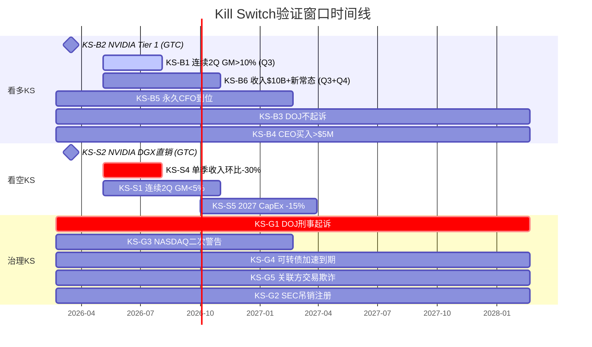
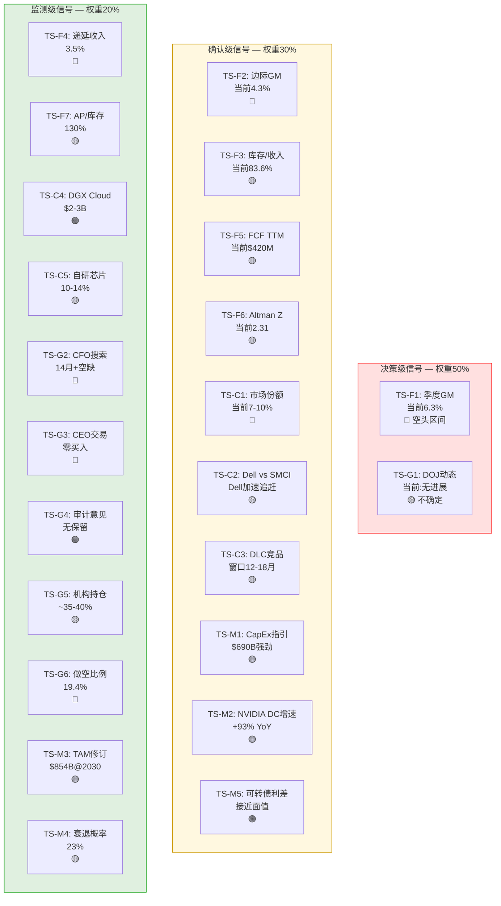
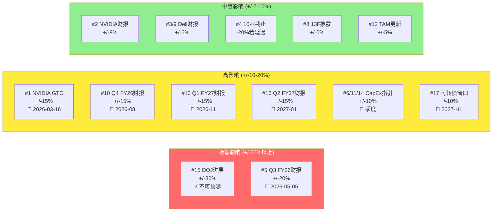

# 第26章: Kill Switch注册表 — 论文作废的硬触发

> **执行日期**: 2026-02-21 | **股价**: $32.42 | **市值**: ~$19.4B
> **方法论**: Kill Switch = 论文作废的硬触发条件。当KS被触发时，不再等待下一个季度数据，立即重新评估整个投资论文。
> **输入**: Phase 4红队校准后CQ(CQ1-CQ5) + 风险拓扑(R1-R10) + 信念反演(B1-B6) + 温水煮青蛙路径(路径一/二)
> **核心区别**: KS与追踪信号(TS)的区别在于——KS是**二元开关**(触发/未触发)，TS是**连续温度计**(渐变)。KS触发意味着当前论文的核心假设被证伪或证实，需要根本性修订而非渐进式调整。

---

## 26.1 看多Kill Switches — 触发后从"中性关注"升级至"关注"

看多KS的设计逻辑: 当前论文的基调是"中性偏空"(概率加权公允价值$33.9, 期望回报仅+4.6%)。以下KS的触发意味着空头论文的关键假设被证伪，估值需要实质性上修。

### KS-B1: 连续2Q GM >10% — 否定CQ1结构性假说

| 维度 | 内容 |
|------|------|
| **触发条件** | 连续2个季度(如Q3+Q4 FY26)报告毛利率>10.0% |
| **当前状态** | 未触发 — Q2 FY26 GM 6.3%, Q1 FY26 GM 9.3%, 10Q连降趋势 [DM-FIN-018] |
| **论文影响** | **重大** — 直接证伪CQ1核心假设("GM压缩为结构性")。如果GM回升至10%+并维持2Q, 意味着Q2 FY26的6.3%确实是积压释放导致的周期性谷值而非新常态。EV/GP从当前9.4x可能重估至6-7x(基于10%+ GM), 隐含上行空间+30-50% |
| **关联CQ** | CQ1(63%→下调至<50%), CQ4(61%→下调), 簇A(利润螺旋)从"部分激活"降级为"休眠" |
| **检测方法** | 季度10-Q/财报, 管理层电话会议。Q3 FY26(2026-05-05)是第一个验证点 |
| **触发概率** | ~15-20% [主观判断: 基于10Q连降趋势, 浪潮镜像6.85%, 以及边际GM仅4.3%的结构性证据] |

### KS-B2: NVIDIA恢复Tier 1分配或宣布战略合作升级

| 维度 | 内容 |
|------|------|
| **触发条件** | NVIDIA公开宣布恢复SMCI为Tier 1合作伙伴, 或在GTC/财报中明确提及SMCI为优先集成商; 或SMCI获得下一代GPU(Vera Rubin)的首批交付资格 |
| **当前状态** | 未触发 — SMCI从Tier 1降至Tier 2B(2024会计危机期间) [Phase 3分析], NVIDIA在数周内即完成重分配 [DM-BIZ-21] |
| **论文影响** | **重大** — 证伪CQ5(NVIDIA依赖加速)的负面假设。Tier 1恢复意味着NVIDIA认可SMCI的技术价值和治理改善, 可获得更优惠的GPU定价和更大分配量, 直接改善GM(更低GPU采购成本)和收入可见度 |
| **关联CQ** | CQ5(66%→下调至<55%), CQ4(61%→下调), R3(NVIDIA降级)概率从30%降至10-15% |
| **检测方法** | NVIDIA GTC(2026-03-16~19), NVIDIA季度财报, 行业渠道信息 |
| **触发概率** | ~10-15% [合理推断: NVIDIA的多元化策略倾向于维持多家合作伙伴而非独宠一家, 但完全恢复Tier 1需要SMCI证明治理改善] |

### KS-B3: DOJ正式宣布不起诉或关闭调查

| 维度 | 内容 |
|------|------|
| **触发条件** | DOJ以下任一公开动作: (a) 正式宣布不起诉决定; (b) 与SMCI达成延期起诉协议(DPA)且条款温和(<$200M); (c) 调查正式关闭无后续行动 |
| **当前状态** | 未触发 — DOJ传票自2024-08起, 截至2026-02无公开时间线 [DM-NEW-C-017] |
| **论文影响** | **重大** — 簇C(治理慢性病)瞬间解体。15-25%的治理折价快速收窄至5%以下。机构投资者ESG/合规限制解除, 空头覆盖压力加大(19.4%短仓 [DM-OPT-001]), 可能触发+15-25%的估值上修 |
| **关联CQ** | CQ3(57%→下调至<40%), R4概率归零, R10从55%降至<20%, 簇C解体 |
| **检测方法** | SEC/DOJ公告, PACER法院系统, 10-Q法律风险披露变更 |
| **触发概率** | ~25-30%(2年内), 其中不起诉~20%, DPA ~10% [主观判断: 调查2年+无公开动作, 特别委员会结论有利, 但"惯犯"身份增加了DOJ动力] |

### KS-B4: CEO公开市场买入 >$5M

| 维度 | 内容 |
|------|------|
| **触发条件** | CEO Charles Liang通过公开市场(非10b5-1计划)买入SMCI股票, 总金额>$5M |
| **当前状态** | 未触发 — 5年23次卖出、0次买入, 6个月卖出$36.8M [DM-SMT-029] |
| **论文影响** | **中等偏高** — 直接打破CI-04(言行不一致)假设。在股价$32(vs峰值$118, -73%)的背景下, CEO的首次买入是极其强烈的信心信号。不改变基本面, 但显著改变市场对治理的感知, 可能催化+10-15%短期反弹 |
| **关联CQ** | CQ3(定性改善), R10(治理慢性消耗)减缓 |
| **检测方法** | SEC Form 4实时披露(EDGAR) |
| **触发概率** | <5% [主观判断: CEO在股价-73%时仍持续卖出的行为模式强烈暗示零买入意愿] |

### KS-B5: 永久CFO到位且背景清白(来自一线科技公司)

| 维度 | 内容 |
|------|------|
| **触发条件** | 聘任永久CFO, 且候选人来自一线科技/半导体公司(如前Dell/HPE/Intel/AMD CFO级别), 无合规瑕疵, 非内部提拔 |
| **当前状态** | 未触发 — CFO搜索14+月未完成 [DM-MGT-008, Fortune 2026-02-20] |
| **论文影响** | **中等** — 不直接改变商业基本面, 但解决了治理叙事中"最后一块短板"。一线CFO的加入会被市场解读为: (a) 有人愿意承担声誉风险=DOJ风险可控; (b) 财务报告可信度提升; (c) 内控改革获得高级别推动力 |
| **关联CQ** | CQ3(定性改善), R10概率下调10-15pp |
| **检测方法** | 公司8-K公告, 财经新闻 |
| **触发概率** | ~30-40%(12个月内) [合理推断: 搜索时间越长, 要么标准在降低(最终接受二线候选人), 要么DOJ结案后才能吸引一线人选] |

### KS-B6: Q2 FY26的$12.68B收入被证明为新常态而非积压释放

| 维度 | 内容 |
|------|------|
| **触发条件** | 连续2Q(Q3+Q4 FY26)收入均>$10B, 且不伴随库存/收入比进一步恶化(维持<80%) |
| **当前状态** | 未触发 — Q3 FY26指引$12.3B [DM-CON-008], 但Q1 FY26仅$5.02B, 波动极大 |
| **论文影响** | **高** — 证伪Ch11的"积压释放假说"(60-70%为一次性因素)。如果$10B+是可持续的季度运行率, 年化$40-50B的收入规模意味着SMCI在AI服务器市场的份额不仅没有继续下降, 反而在TAM高速增长中保持了绝对额增长。B1(Revenue CAGR)获得重大强化 |
| **关联CQ** | CQ2(45%→下调), B1信念获验证 |
| **检测方法** | Q3 FY26(2026-05-05) + Q4 FY26(2026-08预计)财报 |
| **触发概率** | ~35-40% [主观判断: Q3指引$12.3B暗示管理层预期需求强劲, 但产品组合和库存消化节奏仍是变数] |

---

## 26.2 看空Kill Switches — 触发后从"中性关注"降级至"审慎关注"

看空KS的设计逻辑: 以下KS的触发意味着多头论文的关键假设被证伪, 或空头最坏情景正在兑现, 估值需要实质性下修。

### KS-S1: 连续2Q GM <5% — 确认浪潮终局

| 维度 | 内容 |
|------|------|
| **触发条件** | 连续2个季度报告毛利率<5.0% |
| **当前状态** | 未触发 — Q2 FY26 GM 6.3%, 但边际GM仅4.3%(Ch11) [DM-FIN-010] |
| **论文影响** | **灾难性** — 确认CQ1的最极端形态: SMCI正在走向浪潮信息的终局(GM从6.85%→3.45% [DM-INF-002])。GM<5%意味着: (a) 每$100收入仅$5增值, 扣除OpEx后几乎零利润; (b) R&D投入被迫削减→技术落后→簇A全面激活; (c) 商业模式可持续性面临根本质疑。股价可能跌至$15-20区间 |
| **关联CQ** | CQ1从63%上调至>80%, 簇A全面激活, Goldman $26目标变得乐观 |
| **检测方法** | 季度10-Q/财报 |
| **触发概率** | ~10-15% [主观判断: 需要大客户进一步压价+GPU占BOM比例继续上升的双重条件] |

### KS-S2: NVIDIA宣布DGX直销Hyperscaler或DGX Cloud收入超$10B

| 维度 | 内容 |
|------|------|
| **触发条件** | NVIDIA以下任一动作: (a) 宣布DGX产品线开放Hyperscaler直接采购(跳过OEM); (b) DGX Cloud年化收入超过$10B(当前估计$2-3B); (c) 宣布收购/战略投资OEM级别的系统集成能力 |
| **当前状态** | 未触发 — NVIDIA维持OEM生态策略, DGX Cloud仍为早期 [Phase 2-3分析] |
| **论文影响** | **灾难性** — 直接证实CQ5(NVIDIA前向整合)。如果NVIDIA跳过SMCI/Dell直接向Google/Microsoft/Meta销售完整系统, SMCI的"集成商"角色彻底失效。收入可能在2-3年内萎缩40-60%, 簇A和簇D同时全面激活 |
| **关联CQ** | CQ5从66%上调至>85%, R3概率飙升至>60%, 估值下修至$10-15 |
| **检测方法** | NVIDIA GTC(2026-03-16~19), NVIDIA财报, 行业新闻 |
| **触发概率** | ~5-8% [合理推断: NVIDIA维持多元化OEM生态的利益大于前向整合, 但DGX Cloud的增长轨迹值得持续监测] |

### KS-S3: 第二家审计师辞任或出具保留意见

| 维度 | 内容 |
|------|------|
| **触发条件** | BDO USA以下任一动作: (a) 辞任SMCI审计师; (b) 出具"保留意见"或"否定意见"的审计报告; (c) 公开发表对管理层诚信的质疑(类似EY 2024) |
| **当前状态** | 未触发 — BDO于2024-11接任, 已完成FY2025审计 [Phase 3 S07] |
| **论文影响** | **灾难性且可能不可逆** — 如果第二家审计师也辞任, 意味着EY的担忧并非"过度谨慎"而是确有其事。NASDAQ几乎必然发出退市警告, 机构投资者将全面撤离。这不是估值问题而是**存续问题**。2018年的退市历史可能重演, 但此次伴随$4.725B可转债可能加速到期 |
| **关联CQ** | CQ3上调至>85%, R4+R10同时激活, 簇C从"慢性病"转为"急性危机" |
| **检测方法** | 8-K公告(审计师变更为必须披露事项), PCAOB记录 |
| **触发概率** | <5% [合理推断: BDO在接任前应已评估风险, 短期内辞任概率极低; 但DOJ如果掌握新证据则动态变化] |

### KS-S4: 单季度收入环比-30%+(排除季节性)

| 维度 | 内容 |
|------|------|
| **触发条件** | 任一季度收入较前季度环比下降>30%, 且下降不能归因于正常季节性波动(SMCI历史季节性波动范围通常为-10%~+20% QoQ) |
| **当前状态** | 未触发 — 但Q1 FY26($5.02B)较Q4 FY25($5.76B)环比-12.8%, Q2 FY26($12.68B)则环比+153% [DM-FIN-010至DM-FIN-015] |
| **论文影响** | **高** — 确认CQ2(需求持续性)的最坏情景: AI CapEx见顶或大客户流失。Q2的$12.68B如果在Q3跌至<$8.9B(环比-30%), 意味着积压释放已结束且新增需求断崖。簇B(周期双击)前置激活, $10.6B库存立即面临减值风险 |
| **关联CQ** | CQ2从45%上调至>65%, R2+R6+R7可能同时恶化 |
| **检测方法** | 季度财报。注意: Q3指引$12.3B暗示管理层预期不会发生, 但指引miss>25%的历史不罕见 |
| **触发概率** | ~8-12% [主观判断: Q3指引$12.3B提供了一定安全边际, 但大客户订单节奏的不可预测性使"脉冲式"波动始终可能] |

### KS-S5: AI CapEx共识2027年同比削减>15%

| 维度 | 内容 |
|------|------|
| **触发条件** | Top 5 Hyperscaler(MSFT/GOOG/AMZN/META/ORCL)的2027年CapEx指引或实际支出同比2026年削减>15% |
| **当前状态** | 未触发 — 2026年CapEx合计预计$660-690B [CNBC 2026-02-06报道], 2027年Goldman预计进一步增长(2025-2027合计$1.15T) |
| **论文影响** | **高** — CapEx-15%意味着AI基础设施投资周期拐点确认。对SMCI的影响是非线性的——由于SMCI处于供应链最下游(组装), CapEx缩减的"牛鞭效应"可能将SMCI收入削减25-35%。簇B(周期双击)全面激活, $10.6B库存面临$1.5-3B减值风险 |
| **关联CQ** | CQ2从45%上调至>70%, R2+R6激活, Altman Z可能滑入危险区间(<1.8) |
| **检测方法** | Hyperscaler季度/年度财报(Q4 2026~Q1 2027是关键窗口) |
| **触发概率** | ~15-20% [合理推断: 当前$690B惯性极强, 但宏观衰退(Polymarket 23%)或AI ROI质疑加剧可能改变趋势] |

---

## 26.3 治理Kill Switches — SMCI特有

治理KS反映了SMCI独有的制度性风险, 这些KS在其他AI服务器公司(Dell/HPE)中不存在。

### KS-G1: DOJ正式提起刑事起诉

| 维度 | 内容 |
|------|------|
| **触发条件** | DOJ以下任一动作: (a) 对SMCI公司提起刑事诉讼; (b) 对CEO Charles Liang个人提起刑事诉讼; (c) 以证券欺诈或会计欺诈罪名起诉 |
| **当前状态** | 未触发 — DOJ传票2024-08+, 调查进行中, 无公开时间线 [DM-NEW-C-017] |
| **论文影响** | **灾难性** — 刑事起诉不同于民事处罚, 它意味着: (a) NASDAQ可能再次暂停交易; (b) 可转债covenant可能触发加速到期($4.725B); (c) 客户(特别是Hyperscaler)可能出于合规要求中断采购; (d) NVIDIA几乎必然实施紧急重分配(如2024年重演)。股价可能在起诉公告当日跌-30~50%, 簇B+C同时全面激活 |
| **关联CQ** | CQ3上调至>80%, 所有风险簇可能被引爆 |
| **检测方法** | DOJ公告, PACER系统, 8-K紧急披露 |
| **触发概率** | ~10-15% [主观判断: 调查2年+无公开动作暗示DOJ可能证据不足或倾向民事解决, 但"惯犯"身份和Hindenburg的指控内容(制裁规避)增加了刑事路径的可能性] |

### KS-G2: SEC吊销注册声明或发布会计欺诈认定

| 维度 | 内容 |
|------|------|
| **触发条件** | SEC以下任一动作: (a) 吊销SMCI的注册声明(阻止证券发行); (b) 正式认定SMCI存在系统性会计欺诈; (c) 要求重述>2年的财务报表 |
| **当前状态** | 未触发 — SEC 2017-2020调查以$17.5M罚款结案 [DM-MGT-002], 当前是否有新调查不明确 |
| **论文影响** | **灾难性** — 阻止证券发行意味着SMCI无法通过新股或可转债再融资, 在$4.725B可转债2028-2030到期窗口内可能面临流动性危机。重述财报将彻底摧毁BDO审计的可信度 |
| **关联CQ** | CQ3上调至>85%, R9(可转债压力)概率飙升 |
| **检测方法** | SEC公告, EDGAR系统 |
| **触发概率** | <5% [合理推断: SEC通常采取民事执法而非行政处罚, 且BDO已完成FY2025审计提供了一定缓冲] |

### KS-G3: NASDAQ发出二次退市警告或暂停交易

| 维度 | 内容 |
|------|------|
| **触发条件** | NASDAQ以下任一动作: (a) 因财务报告不合规发出退市警告; (b) 因其他合规问题(如董事会独立性不足)发出警告; (c) 暂停SMCI股票交易 |
| **当前状态** | 未触发 — 2024-11退市警告已于合规恢复后解除 [Phase 3 S07] |
| **论文影响** | **高** — 二次退市警告是"惯犯"模式的第三次发作(2018退市+2024警告+再次)。市场可能不再给予"改善机会"的信任溢价。被动基金强制卖出(ETF要求上市)可能导致流动性危机 |
| **关联CQ** | CQ3上调, R10恶化, 做空比例可能从19.4%飙升至25%+ |
| **检测方法** | NASDAQ公告, 8-K披露 |
| **触发概率** | <8% [合理推断: BDO审计完成+10-K按时提交使短期内再次不合规的概率较低] |

### KS-G4: 可转债加速到期条款被触发

| 维度 | 内容 |
|------|------|
| **触发条件** | $4.725B可转债中任一tranche的covenant条款被触发, 导致持有人要求加速到期/立即偿还。常见触发条件包括: (a) 财务报告延迟超过规定天数; (b) 交叉违约(其他债务违约); (c) 重大不利变化(MAE)条款; (d) 控制权变更 |
| **当前状态** | 未触发 — 可转债$4.725B(2028 $700M @1.62%, 2029 $1.725B @0%, 2030 $2.3B @0%), 转换价$55-83均深度价外 [DM-OPT-008] |
| **论文影响** | **灾难性** — 即使部分加速到期(如$700M的2028 tranche), 在当前$420M现金+$10.6B库存+$13.75B应付账款的脆弱平衡下 [DM-FIN-024, DM-FIN-044], 都可能触发流动性螺旋: 被迫折价抛售库存→净资产恶化→信用评级下调→融资成本飙升→更多债务加速到期 |
| **关联CQ** | 簇B(周期双击)和簇C(治理慢性病)同时极端化, Altman Z可能从2.31直接跌破1.0 |
| **检测方法** | 10-Q/10-K债务条款披露, 8-K紧急披露, 信用评级变动 |
| **触发概率** | <5% [合理推断: 可转债covenant通常有30-60天治愈期, 且SMCI当前财务报告是按时的] |

### KS-G5: 关联方交易被证实涉及利益输送/欺诈

| 维度 | 内容 |
|------|------|
| **触发条件** | DOJ/SEC调查或独立调查揭示Ablecom/Compuware与SMCI之间的交易涉及: (a) 非市场价格(显著高于公平市场价值); (b) 虚构交易; (c) CEO个人从中获取未披露利益 |
| **当前状态** | 未触发 — 特别委员会结论称"EY担忧无事实支撑", 但3年$983M的交易规模仍是市场疑虑焦点 [DM-MGT-006] |
| **论文影响** | **高** — 直接确认CI-04(管理层利益不一致)的最坏形态。如果关联方交易涉及欺诈, 可能成为DOJ刑事起诉的核心证据(与KS-G1形成连锁)。CEO辞职变为大概率事件, 公司可能面临集体诉讼浪潮 |
| **关联CQ** | CQ3极端化, R4概率飙升至>40% |
| **检测方法** | DOJ/SEC调查结论, 独立审计发现, 举报人诉讼 |
| **触发概率** | ~5-10% [主观判断: 特别委员会结论虽然有利, 但其独立性和深度受到部分市场参与者质疑] |

---

## 26.4 KS优先级矩阵

### 26.4.1 按触发概率×影响排序

| 排名 | KS编号 | 类型 | 触发概率 | 影响幅度 | 概率加权影响 | 最近验证点 |
|:----:|:------:|:---:|:-------:|:-------:|:----------:|:---------:|
| 1 | **KS-B1** | 看多 | 15-20% | +30~50% | +5~10% | Q3 FY26 (05-05) |
| 2 | **KS-S5** | 看空 | 15-20% | -25~35% | -4~7% | Q4 2026指引 |
| 3 | **KS-B3** | 看多 | 25-30% | +15~25% | +4~8% | 不可知 |
| 4 | **KS-G1** | 治理 | 10-15% | -30~50% | -4~6% | 不可知 |
| 5 | **KS-B6** | 看多 | 35-40% | +20~30% | +7~12% | Q3+Q4 FY26 |
| 6 | **KS-S1** | 看空 | 10-15% | -35~50% | -4~6% | Q3+Q4 FY26 |
| 7 | **KS-S4** | 看空 | 8-12% | -20~30% | -2~3% | Q3 FY26 (05-05) |
| 8 | **KS-B5** | 看多 | 30-40% | +8~15% | +3~5% | 持续监测 |
| 9 | **KS-S2** | 看空 | 5-8% | -40~60% | -3~4% | GTC (03-16~19) |
| 10 | **KS-G5** | 治理 | 5-10% | -25~40% | -2~3% | DOJ结论 |
| 11 | **KS-B2** | 看多 | 10-15% | +25~40% | +3~5% | GTC (03-16~19) |
| 12 | **KS-B4** | 看多 | <5% | +10~15% | <1% | SEC Form 4 |
| 13 | **KS-S3** | 看空 | <5% | -50~70% | -3~4% | 8-K监测 |
| 14 | **KS-G2** | 治理 | <5% | -40~60% | -2~3% | SEC公告 |
| 15 | **KS-G3** | 治理 | <8% | -20~35% | -2~3% | NASDAQ系统 |
| 16 | **KS-G4** | 治理 | <5% | -40~60% | -2~3% | 10-Q/8-K |

### 26.4.2 KS触发窗口时间线



### 26.4.3 KS关联网络

多个KS之间存在因果或条件关系:

**连锁触发链1: 治理灾难链**
KS-G5(关联方欺诈) → KS-G1(DOJ起诉) → KS-G4(可转债加速) → KS-G3(NASDAQ退市)
[合理推断: 如果关联方交易被证实欺诈, 这条链可能在6-12个月内完整触发]

**连锁触发链2: 基本面改善链**
KS-B1(GM>10%) → KS-B6(收入新常态确认) → KS-B5(一线CFO到位) → KS-B3(DOJ不起诉/和解)
[合理推断: GM恢复是信号起点——如果基本面改善, 一线CFO愿意加入, DOJ也更倾向于温和解决]

**互斥KS对**:
- KS-B1(GM>10%) vs KS-S1(GM<5%): 逻辑互斥, 不可能同时触发
- KS-B3(DOJ不起诉) vs KS-G1(DOJ起诉): 同一事件的两个互斥结果
- KS-B6(收入新常态) vs KS-S4(收入环比-30%): 同一维度的两极

---

# 第27章: 追踪信号注册表 — 温度计式渐变监测

> **核心理念**: Kill Switch是二元的("触发/未触发"), 追踪信号(TS)是连续的("温度计")。TS的价值不在于单次读数, 而在于**趋势变化的方向和速度**。一个TS从"绿色"渐变为"黄色"可能比一个KS的触发更重要——因为它揭示了温水煮青蛙正在进行。
> **来源**: Ch23温水煮青蛙检测信号(12个) + Ch22风险簇激活信号 + CQ验证信号 + 宏观环境变量

---

## 27.1 财务追踪信号 (季度检查)

### TS-F1: 季度毛利率趋势 (核心温度计)

| 维度 | 内容 |
|------|------|
| **指标** | 季度报告毛利率(GAAP) |
| **当前值** | 6.3% (Q2 FY26) [DM-FIN-010] |
| **看多阈值** | >9.0% (连续2Q) — 否定结构性假说, CQ1重估 |
| **中性区间** | 7.0-9.0% — 与温水煮青蛙基准路径一致 |
| **看空阈值** | <5.0% (连续2Q) — 确认浪潮终局, 联动KS-S1 |
| **数据来源** | 季度10-Q, 财报新闻稿 |
| **检查频率** | 每季度 |
| **关联CQ** | CQ1(63%), 信念B2(脆弱度4/5) |
| **历史轨迹** | 18.0%(Q1 FY24) → 13.1%(Q1 FY25) → 9.3%(Q1 FY26) → **6.3%(Q2 FY26)** — 10Q连降 |
| **权重** | **决策级 (50%)** — 整个投资论文的核心变量 |

### TS-F2: 边际毛利率 (隐藏信号)

| 维度 | 内容 |
|------|------|
| **指标** | (当季GP - 上季GP) / (当季Revenue - 上季Revenue) |
| **当前值** | 4.3% (Q2 FY26, 增量$7.66B收入对应增量$332M GP) [Ch11推算] |
| **看多阈值** | >10% (连续2Q) — 增量收入利润率恢复, 反向杠杆消失 |
| **看空阈值** | <3% (连续2Q) — 增量收入几乎零毛利, 确认"过路资金"本质 |
| **数据来源** | 推算(季度10-Q数据差分) |
| **检查频率** | 每季度 |
| **关联CQ** | CQ1, 信念B3(经营杠杆) |
| **权重** | **确认级 (30%)** — 比总体GM更早揭示利润结构变化 |

### TS-F3: 库存/收入比 (流动性预警)

| 维度 | 内容 |
|------|------|
| **指标** | 期末库存 / 季度收入 |
| **当前值** | $10.6B / $12.68B = 83.6% [DM-FIN-021, DM-FIN-024] |
| **看多阈值** | <60% — 库存消化正常化, 簇B脆弱性降低 |
| **看空阈值** | >100% — 库存积压恶化, 减值风险显著上升 |
| **数据来源** | 季度10-Q资产负债表 |
| **检查频率** | 每季度 |
| **关联CQ** | 簇B(R6库存减值), Altman Z |
| **历史对比** | 正常水平<60%, 当前83.6%为历史极端(库存$10.6B = 市值55% [DM-INF-004]) |
| **权重** | **确认级 (30%)** — 簇B激活的前置指标 |

### TS-F4: 递延收入占比 (收入质量)

| 维度 | 内容 |
|------|------|
| **指标** | 递延收入 / 季度收入 |
| **当前值** | ~3.5% [Ch11分析] |
| **看多阈值** | >10% — 经常性收入(服务/维保)开始贡献, 收入质量改善 |
| **看空阈值** | <2% — 几乎零经常性收入, 确认"纯交易型"模式 |
| **数据来源** | 季度10-Q |
| **检查频率** | 每季度 |
| **关联CQ** | CQ4(护城河), 与Dell(~55%经常性)的差距 |
| **权重** | **监测级 (20%)** — 长期商业模式转型的缓慢指标 |

### TS-F5: FCF累计趋势 (现金健康)

| 维度 | 内容 |
|------|------|
| **指标** | TTM自由现金流 |
| **当前值** | $420M (FY2025 TTM) [DM-FIN-031] |
| **看多阈值** | >$1B TTM — 证明高收入可转化为现金, 可转债偿还能力增强 |
| **看空阈值** | 连续2Q FCF为负 — 确认营运资本黑洞, 簇B脆弱性加剧 |
| **数据来源** | 季度10-Q现金流量表 |
| **检查频率** | 每季度 |
| **关联CQ** | R9(可转债压力), Altman Z |
| **历史对比** | FY2024 FCF -$2.61B(库存暴增期 [DM-FIN-034]), FY2025恢复至+$420M |
| **权重** | **确认级 (30%)** — 流动性危机的前置信号 |

### TS-F6: Altman Z-Score变化 (破产概率)

| 维度 | 内容 |
|------|------|
| **指标** | Altman Z-Score (5因子模型) |
| **当前值** | 2.31 — 灰色区间(1.8-3.0) [DM-FIN-044] |
| **看多阈值** | >3.0 — 安全区间, 破产风险显著降低 |
| **看空阈值** | <1.8 — 危险区间, 破产概率统计上显著 |
| **数据来源** | 推算(季度10-Q数据) |
| **检查频率** | 每季度 |
| **关联CQ** | R6+R9(库存+债务), 簇B整体健康 |
| **权重** | **确认级 (30%)** — 系统性破产风险的综合温度计 |

### TS-F7: 应付账款/库存比 (供应链融资依赖度)

| 维度 | 内容 |
|------|------|
| **指标** | 应付账款 / 库存 |
| **当前值** | $13.75B / $10.6B = 130% [DM-FIN-024] |
| **看多阈值** | <100% — 自有资金覆盖库存, 供应链融资依赖降低 |
| **看空阈值** | >150% — 极端依赖供应商融资, 任何信用收紧可能触发流动性危机 |
| **数据来源** | 季度10-Q资产负债表 |
| **检查频率** | 每季度 |
| **关联CQ** | R6, R9 |
| **权重** | **监测级 (20%)** — SMCI独特的"负营运资本"模式的健康指标 |

---

## 27.2 竞争追踪信号 (季度检查)

### TS-C1: AI服务器市场份额 (核心竞争力)

| 维度 | 内容 |
|------|------|
| **指标** | SMCI在全球AI服务器市场的出货量/收入份额 |
| **当前值** | 7-10% (2026年初估计) [DM-BIZ-22] |
| **看多阈值** | >12% — 份额恢复, 否定CQ4(护城河薄弱) |
| **看空阈值** | <5% — 边缘化, 确认簇D(TAM压缩) |
| **数据来源** | Citi/IDC/TrendForce行业报告, 估算(SMCI收入/AI TAM) |
| **检查频率** | 半年度(行业报告发布周期) |
| **关联CQ** | CQ4(61%), CQ2(45%), R5(竞争侵蚀) |
| **历史轨迹** | ~50%(2023) → ~10%(2024) → 7-10%(2025E) — 断崖式下降后低位波动 |
| **权重** | **确认级 (30%)** |

### TS-C2: Dell AI服务器订单/收入增速 vs SMCI

| 维度 | 内容 |
|------|------|
| **指标** | Dell AI相关收入YoY增速 vs SMCI AI相关收入YoY增速的差值 |
| **当前值** | Dell AI订单YTD ~$30B [DM-BIZ-22], 增速极高; SMCI Q2 FY26 YoY +123% [DM-FIN-010] |
| **看多阈值** | SMCI增速连续2Q > Dell增速 — 竞争逆转 |
| **看空阈值** | Dell增速连续2Q > SMCI增速 — 份额加速流失 |
| **数据来源** | Dell/SMCI季度财报, 管理层commentary |
| **检查频率** | 每季度 |
| **关联CQ** | CQ4, R5 |
| **权重** | **确认级 (30%)** |

### TS-C3: DLC竞品渗透率 (护城河时效)

| 维度 | 内容 |
|------|------|
| **指标** | Dell/HPE液冷服务器出货占其AI服务器出货的比例 |
| **当前值** | 估计<10%(Dell开始推出但规模尚小) [Phase 2分析, DLC窗口12-18月] |
| **看多阈值** | Dell DLC渗透率停滞在<10%超过12个月 — SMCI技术壁垒高于预期 |
| **看空阈值** | Dell DLC渗透率>20% — DLC从差异化变为标配, SMCI护城河消失 |
| **数据来源** | Dell财报, 行业分析报告, Schneider/Vertiv的CDU出货数据 |
| **检查频率** | 半年度 |
| **关联CQ** | CQ4, 信念B2(DLC是否拯救GM) |
| **权重** | **确认级 (30%)** — 直接验证12-18月DLC窗口假设 |

### TS-C4: NVIDIA DGX Cloud收入轨迹 (前向整合速度)

| 维度 | 内容 |
|------|------|
| **指标** | NVIDIA DGX Cloud年化收入 |
| **当前值** | 估计$2-3B (早期阶段) |
| **看多阈值** | <$5B且增速放缓 — NVIDIA前向整合意愿有限, OEM生态安全 |
| **看空阈值** | >$10B且加速增长 — 联动KS-S2, NVIDIA正在系统性绕过OEM |
| **数据来源** | NVIDIA财报, GTC披露, 行业分析 |
| **检查频率** | 每季度(NVIDIA财报) |
| **关联CQ** | CQ5(66%), R3, R8 |
| **权重** | **监测级 (20%)** — 长期前向整合趋势的渐进指标 |

### TS-C5: 自研芯片部署规模 (TAM替代速度)

| 维度 | 内容 |
|------|------|
| **指标** | Google TPU + AWS Trainium + Microsoft Maia + Meta MTIA的合计算力部署(估算) |
| **当前值** | 2026E预计分流$51-71B(占AI CapEx 10-14%) [Phase 3推算] |
| **看多阈值** | 自研芯片占AI CapEx <8% (增速放缓) — GPU服务器TAM受保护 |
| **看空阈值** | 自研芯片占AI CapEx >20% — TAM缩小加速, 联动R8 |
| **数据来源** | Hyperscaler财报/技术公告, GTC, 行业分析 |
| **检查频率** | 半年度 |
| **关联CQ** | CQ2, R8, 簇D |
| **权重** | **监测级 (20%)** — 长期TAM替代的缓慢信号 |

---

## 27.3 治理追踪信号 (事件驱动)

### TS-G1: DOJ/SEC公开动态 (簇C命运)

| 维度 | 内容 |
|------|------|
| **指标** | DOJ/SEC调查的任何公开进展 |
| **当前值** | 调查进行中, 2024-08传票以来无公开动作 [DM-NEW-C-017] |
| **看多阈值** | DOJ正式结案/不起诉决定 — 联动KS-B3, 簇C解体 |
| **看空阈值** | DOJ扩大调查范围/发出新传票/寻求起诉 — 联动KS-G1, 簇C急性化 |
| **数据来源** | DOJ公告, PACER, 10-Q法律风险披露措辞变化, 财经新闻 |
| **检查频率** | 月度(新闻扫描) + 每季度(10-Q措辞对比) |
| **关联CQ** | CQ3(57%), R4, R10, 簇C |
| **权重** | **决策级 (50%)** — 簇C的命运取决于此单一变量 |

### TS-G2: CFO搜索进展 (治理能力)

| 维度 | 内容 |
|------|------|
| **指标** | 永久CFO聘任状态及候选人背景 |
| **当前值** | 搜索进行中, 14+月未完成 [DM-MGT-008, Fortune 2026-02-20] |
| **看多阈值** | 一线科技公司CFO级别候选人到位 — 联动KS-B5 |
| **中性信号** | 聘任完成但候选人为二线/内部提拔 — 形式上解决, 实质改善有限 |
| **看空阈值** | 搜索超24个月仍未完成 — 深层问题确认(无人愿接) |
| **数据来源** | 8-K公告, 公司新闻, 行业猎头信息 |
| **检查频率** | 月度 |
| **关联CQ** | CQ3, R10 |
| **权重** | **监测级 (20%)** |

### TS-G3: CEO内部交易行为 (内部人情绪)

| 维度 | 内容 |
|------|------|
| **指标** | CEO Charles Liang的SEC Form 4记录(买入/卖出/金额) |
| **当前值** | 5年23次卖出、0次买入, 6个月$36.8M卖出 [DM-SMT-029] |
| **看多阈值** | 任何公开买入>$1M — 联动KS-B4, 强烈信心信号 |
| **中性信号** | 卖出速度减缓(>6个月无卖出) |
| **看空阈值** | 大额卖出加速(单次>$10M或频率增加) — 内部人加速退出 |
| **数据来源** | SEC EDGAR Form 4实时披露 |
| **检查频率** | 每交易日 |
| **关联CQ** | CQ3, CI-04 |
| **权重** | **监测级 (20%)** |

### TS-G4: 审计意见类型 (财报可信度)

| 维度 | 内容 |
|------|------|
| **指标** | BDO年度审计意见类型 |
| **当前值** | 无保留意见(FY2025) |
| **看多阈值** | 连续2年无保留意见 — 财务报告可信度恢复中 |
| **看空阈值** | 保留意见或强调段落(特别是关于持续经营/内控缺陷) — 联动KS-S3 |
| **数据来源** | 年度10-K中的审计师报告 |
| **检查频率** | 年度 |
| **关联CQ** | CQ3, R10 |
| **权重** | **监测级 (20%)** |

### TS-G5: 机构持仓变化 (市场信任温度)

| 维度 | 内容 |
|------|------|
| **指标** | 13F文件中机构持仓占比 |
| **当前值** | 需要下一季度13F确认(估计~35-40%) |
| **看多阈值** | >45% — 机构回流, ESG/合规限制放松 |
| **看空阈值** | <25% — 机构系统性回避, 治理折价固化 |
| **数据来源** | 季度13F文件(EDGAR), WhaleWisdom等数据服务 |
| **检查频率** | 每季度(13F披露后) |
| **关联CQ** | CQ3, R10 |
| **权重** | **监测级 (20%)** |

### TS-G6: 做空比例 (市场对抗度)

| 维度 | 内容 |
|------|------|
| **指标** | Short Interest % of Float |
| **当前值** | 19.4% [DM-OPT-001] — 极端高位 |
| **看多阈值** | <12% — 空头显著减仓, 覆盖压力降低(或空头认为风险已定价) |
| **看空阈值** | >25% — 空头加码, 新的负面信息可能即将出现 |
| **数据来源** | 交易所双周报告, Ortex/S3等做空数据平台 |
| **检查频率** | 双周 |
| **关联CQ** | 市场情绪, 潜在轧空风险 |
| **权重** | **监测级 (20%)** |

---

## 27.4 宏观追踪信号 (月度/季度检查)

### TS-M1: Hyperscaler CapEx季度指引 (需求源头)

| 维度 | 内容 |
|------|------|
| **指标** | Top 5 Hyperscaler(MSFT/GOOG/AMZN/META/ORCL)季度/年度CapEx实际值及指引 |
| **当前值** | 2026年合计预计~$690B [CNBC 2026-02-06], 2027年预计进一步增长 |
| **看多阈值** | 2027 CapEx指引YoY >+10% — 需求持续, SMCI收入可见度高 |
| **看空阈值** | 2027 CapEx指引YoY <-5% — 联动KS-S5, 周期拐点 |
| **数据来源** | MSFT/GOOG/AMZN/META/ORCL季度财报 |
| **检查频率** | 每季度(各家财报日) |
| **关联CQ** | CQ2(45%), R2, 簇B |
| **权重** | **确认级 (30%)** — AI CapEx是SMCI收入的最终驱动力 |

### TS-M2: NVIDIA数据中心收入增速 (GPU需求代理)

| 维度 | 内容 |
|------|------|
| **指标** | NVIDIA Data Center Revenue YoY增速 |
| **当前值** | FY2025 Q4(2025年1月) +93% YoY [NVIDIA财报] |
| **看多阈值** | >50% YoY — GPU需求强劲, SMCI作为集成商受益 |
| **看空阈值** | <20% YoY — GPU增速放缓, 可能传导至SMCI收入减速 |
| **数据来源** | NVIDIA季度财报 |
| **检查频率** | 每季度 |
| **关联CQ** | CQ2, CQ5, R2, R3 |
| **权重** | **确认级 (30%)** — NVIDIA收入是SMCI收入的上游先行指标 |

### TS-M3: AI服务器TAM修订 (市场规模)

| 维度 | 内容 |
|------|------|
| **指标** | 主要研究机构(IDC/Gartner/TrendForce)对全球AI服务器TAM的年度预测修订 |
| **当前值** | 2024 $128B → 2030E $854B, CAGR 34.3% [DM-BIZ-17] |
| **看多阈值** | TAM上修>10% — 涨潮效应持续 |
| **看空阈值** | TAM下修>15% — 自研芯片替代+需求放缓, 涨潮退去 |
| **数据来源** | IDC/Gartner/TrendForce年度/半年度报告 |
| **检查频率** | 半年度 |
| **关联CQ** | CQ2, R8, 信念B5 |
| **权重** | **监测级 (20%)** |

### TS-M4: 美国宏观经济健康 (系统性风险)

| 维度 | 内容 |
|------|------|
| **指标** | ISM制造业PMI + 10Y-2Y利差 + Polymarket美国衰退概率 |
| **当前值** | Polymarket衰退概率23% [DM-PMK-M01] |
| **看多阈值** | 衰退概率<15% + PMI>50 — 经济扩张, 企业IT支出持续 |
| **看空阈值** | 衰退概率>35% + 利差倒挂持续 — 信贷收紧可能影响SMCI营运资本融资 |
| **数据来源** | ISM月报, 国债市场, Polymarket |
| **检查频率** | 月度 |
| **关联CQ** | 系统性风险, R9(可转债再融资环境) |
| **权重** | **监测级 (20%)** |

### TS-M5: 可转债信用利差 (融资压力前瞻)

| 维度 | 内容 |
|------|------|
| **指标** | SMCI可转债在二级市场的交易价格(相对于面值的折溢价) |
| **当前值** | 2028 tranche交易接近面值(转换价$55深度价外, 纯债务价值) |
| **看多阈值** | 交易价格>98%面值 — 市场认为违约风险极低 |
| **看空阈值** | 交易价格<85%面值 — 市场定价显著违约风险, 联动R9 |
| **数据来源** | 债券交易平台(TRACE), Bloomberg Terminal |
| **检查频率** | 月度 |
| **关联CQ** | R9, KS-G4 |
| **权重** | **确认级 (30%)** — 债券市场通常比股票市场更早反映信用风险 |

---

## 27.5 TS仪表盘

### 27.5.1 TS按权重分层



### 27.5.2 综合健康评分

基于当前TS读数的综合健康评分(0=极度看空, 100=极度看多):

| 维度 | 信号数 | 看多(绿) | 中性(黄) | 看空(红) | 维度得分 |
|------|:-----:|:-------:|:-------:|:-------:|:-------:|
| 财务 | 7 | 0 | 3 | 4 | **28/100** |
| 竞争 | 5 | 1 | 2 | 2 | **40/100** |
| 治理 | 6 | 1 | 2 | 3 | **30/100** |
| 宏观 | 5 | 3 | 2 | 0 | **65/100** |
| **综合** | **23** | **5** | **9** | **9** | **38/100** |

[主观判断: 综合健康评分38/100 = **偏空头区间**。宏观环境(65分)是唯一显著正面维度, 反映AI CapEx惯性和NVIDIA增速的强劲支撑。财务(28分)和治理(30分)是两个最弱维度, 与Phase 4结论一致: SMCI的核心问题不在于需求(强劲)而在于价值攫取(利润率+治理)]

### 27.5.3 信号间的共振效应

以下TS组合如果同时恶化, 产生的共振效应远大于单独恶化:

**共振组合1: "利润螺旋共振"**
TS-F1(GM↓) + TS-F2(边际GM↓) + TS-C1(份额↓) + TS-C2(Dell追赶加速)
→ 簇A全面激活的前置信号组合。4个TS同时在看空区间 = 温水煮青蛙路径一已确认。

**共振组合2: "流动性危机共振"**
TS-F3(库存/收入>100%) + TS-F5(FCF<0) + TS-F6(Altman Z<1.8) + TS-M5(可转债折价>15%)
→ 簇B激活的前置信号组合。4个TS同时在看空区间 = 流动性危机倒计时。

**共振组合3: "治理崩塌共振"**
TS-G1(DOJ负面动作) + TS-G3(CEO大额卖出) + TS-G5(机构持仓<25%) + TS-G6(做空>25%)
→ 簇C从慢性病转为急性危机的信号组合。

**共振组合4: "全面牛市共振"**
TS-F1(GM>9%) + TS-G1(DOJ结案) + TS-M1(CapEx持续强劲) + TS-C3(Dell DLC<10%)
→ 多个CQ同时下调 + 簇C解体 + DLC护城河确认 = 估值可能上修+40-60%。

---

# 第30章: 催化剂日历 — 未来12月事件图谱

> **核心理念**: 催化剂日历将KS和TS的时间维度可视化——何时会有新信息输入, 何时可能触发论文修订, 以及投资者应该在何时做出关键决策。
> **覆盖范围**: 2026年2月至2027年2月, 12个月滚动

---

## 30.1 催化剂时间线

| # | 日期 | 事件 | 类型 | 预期影响 | 关联KS/TS | 方向 | 置信度 |
|:-:|------|------|:---:|:-------:|:---------:|:----:|:-----:|
| 1 | **2026-03-16~19** | NVIDIA GTC 2026 (San Jose) | 行业 | GPU路线图(Vera Rubin)、DGX Cloud更新、合作伙伴生态策略 | KS-B2, KS-S2, TS-C4 | **+/-15%** | 确认 |
| 2 | **2026-03-26 (估)** | NVIDIA FY2026 Q4财报 (1月季度) | 上游 | 数据中心收入增速、DGX进展、对OEM生态的commentary | TS-M2, TS-C4 | +/-8% | 确认 |
| 3 | **2026-04 (估)** | Dell FY2027 Q1财报 | 竞品 | Dell AI服务器/ISG收入、DLC进展、AI订单增速 | TS-C2, TS-C3, TS-C1 | +/-5% | 确认 |
| 4 | **2026-04-15** | SMCI 10-K FY2026年报截止(如需延期则触发) | 治理 | 如期提交=无事发生; 延迟=NASDAQ警告风险 | KS-G3, TS-G4 | -20%若延迟 | 估计 |
| 5 | **2026-05-05** | **SMCI Q3 FY26财报** | **硬分叉** | **GM二元开关: >9%否定空头 / <7%确认空头**; 收入是否维持>$10B; FY26全年指引更新; CFO搜索进展 | **KS-B1, KS-S1, KS-S4, KS-B6, TS-F1~F7全部更新** | **+/-20%** | 确认 |
| 6 | **2026-05~06** | Hyperscaler Q1 2026财报季 (MSFT/GOOG/AMZN/META) | 宏观 | 2026 CapEx实际支出节奏、2027早期指引信号 | TS-M1, TS-M2, KS-S5 | +/-10% | 确认 |
| 7 | **2026-06 (估)** | NVIDIA FY2027 Q1财报 (4月季度) | 上游 | Vera Rubin量产进度、Blackwell→VR过渡对OEM影响 | TS-M2, KS-B2, TS-C4 | +/-8% | 估计 |
| 8 | **2026-06-30** | SEC 13F季度截止 | 治理 | 机构持仓变化: 大基金是否回流SMCI | TS-G5 | +/-5% | 确认 |
| 9 | **2026-07~08 (估)** | Dell FY2027 Q2财报 | 竞品 | Dell DLC出货量首次有详细披露的可能 | TS-C2, TS-C3 | +/-5% | 估计 |
| 10 | **2026-08 (估)** | **SMCI Q4 FY26财报** | **关键** | FY2026全年总结: 年度GM确认; FY2027指引(增速悬崖+19%验证); 库存消化进展; CFO状态更新 | **KS-B1, KS-B6, TS-F1~F7, TS-G2** | **+/-15%** | 估计 |
| 11 | **2026-09~10** | Hyperscaler Q2 2026财报季 | 宏观 | **关键窗口**: 2027 CapEx指引首次出现。如果2027 CapEx YoY<-5%, 联动KS-S5 | TS-M1, KS-S5 | +/-10% | 估计 |
| 12 | **2026-10 (估)** | IDC/Gartner年度AI服务器TAM更新 | 行业 | TAM修订方向影响长期估值锚点 | TS-M3, TS-C5 | +/-5% | 估计 |
| 13 | **2026-11 (估)** | **SMCI Q1 FY27财报** | **关键** | FY2027首季度: 增速悬崖是否兑现(+84%→+19%?); GM趋势确认; 库存正常化进度 | **TS-F1~F7, KS-B1, KS-S1** | **+/-15%** | 估计 |
| 14 | **2026-11~12** | Hyperscaler Q3 2026财报季 | 宏观 | 2027 CapEx指引进一步细化 | TS-M1, KS-S5 | +/-8% | 估计 |
| 15 | **2026-H2 (不确定)** | DOJ调查可能进展 | 治理 | **不可预测但影响巨大**: 起诉→KS-G1; 不起诉→KS-B3; 继续沉默→TS-G1黄灯持续 | **KS-G1, KS-B3, TS-G1** | **+/-30%** | 低确定性 |
| 16 | **2027-01~02** | SMCI Q2 FY27财报 | 关键 | YoY对标Q2 FY26的$12.68B异常高基数: 如果Q2 FY27<$10B, YoY将显示负增长。市场反应取决于叙事框架 | TS-F1~F7, KS-S4 | +/-15% | 估计 |
| 17 | **2027-H1** | 可转债2028 tranche窗口期 | 融资 | $700M @1.62% 2028年到期, 到期前6-12月SMCI需要启动再融资。利率环境和信用评级将决定再融资成本 | TS-M5, KS-G4, R9 | +/-10% | 确认 |

---

## 30.2 催化剂影响矩阵

### 30.2.1 按影响幅度排序



### 30.2.2 催化剂间的路径依赖

某些催化剂的影响取决于前序催化剂的结果, 形成**条件路径**:

**路径A: "GTC验证→Q3确认→评级升级"**
```
NVIDIA GTC (03-16~19)
    ├── SMCI获得Vera Rubin优先 → 市场预期Q3收入/GM改善
    │       └── Q3 FY26 (05-05): GM>9% → KS-B1触发
    │               └── 论文从"中性关注"升级至"关注"
    └── NVIDIA宣布DGX扩展 → 市场担忧前向整合
            └── Q3 FY26 (05-05): 即使GM改善, 长期前景蒙阴
                    └── 论文维持"中性关注"但下调CQ5
```

**路径B: "Q3确认→CapEx拐点→双击"**
```
Q3 FY26 (05-05): GM<7%
    ├── 簇A加速确认 → 温水煮青蛙路径一on track
    │       └── Hyperscaler Q2指引 (09-10): 2027 CapEx -10%
    │               └── 簇B激活 → 双击:利润+周期
    │                       └── Q1 FY27 (11): 增速悬崖+GM持续低位
    │                               └── 论文降级至"审慎关注"
    └── DOJ同时有进展 (H2)
            └── 簇B+C同时激活
                    └── 可转债再融资窗口恶化 (2027-H1)
                            └── KS-G4触发风险上升
```

**路径C: "DOJ解决→治理改善→估值重估"**
```
DOJ不起诉决定 (H2不确定)
    ├── KS-B3触发 → 簇C解体 → 治理折价从15-25%收窄至5%
    │       └── 一线CFO到位 → KS-B5触发
    │               └── 如果同时GM>9%(KS-B1) → 全面牛市共振
    │                       └── 目标价$45-55, 论文升级至"深度关注"
    └── 但基本面未改善 (GM仍<8%)
            └── 治理改善但商业模式问题持续
                    └── 股价+15-20%(治理折价修复), 但不触发评级升级
```

---

## 30.3 关键观察窗口

### 30.3.1 窗口一: 2026年3月中旬 — NVIDIA GTC (预热期)

**日期**: 2026-03-16~19
**重要性**: 中高
**核心观察点**:
- Vera Rubin架构细节: 如果NVL标准化进一步加速, SMCI的定制化价值被削弱
- DGX Cloud路线图: $10B+收入目标是否被提及(联动KS-S2)
- OEM生态策略: NVIDIA是否明确提及SMCI(正面信号)或刻意回避(负面信号)
- 合作伙伴展台: SMCI是否获得GTC展台位置(Tier 1回归的间接信号)

**决策框架**: GTC不太可能触发KS(概率<10%), 但会更新多个TS的方向感。投资者应在GTC后重新评估CQ5和TS-C4的读数。

### 30.3.2 窗口二: 2026年5月5日 — Q3 FY26财报 (硬分叉点)

**日期**: 2026-05-05 (确认)
**重要性**: **极高 — 整个投资论文的决定性验证点**
**核心观察点**:

| 指标 | 看多阈值 | 基准预期 | 看空阈值 |
|------|---------|---------|---------|
| **GM** | >9.0% | 6.6-7.5% | <6.3% |
| Revenue | >$13B | $12.3B(指引) | <$10B |
| 库存/收入 | <70% | 75-85% | >100% |
| CFO状态 | 到位公告 | "搜索中" | 搜索终止 |
| FY26指引 | >$42B | $40B+(维持) | <$38B |

**决策矩阵**:

| Q3 GM | Q3 Revenue | 综合决策 | 论文影响 |
|:-----:|:--------:|---------|---------|
| >9% | >$12.3B | **强烈看多信号** | CQ1下调至<50%, 考虑升级至"关注" |
| 7-9% | >$12.3B | 温和看多 | 温水煮青蛙延续但不加速 |
| 7-9% | $10-12.3B | 中性 | 维持当前论文 |
| <7% | >$12.3B | 矛盾信号 | 量大但无利→反向杠杆确认→看空 |
| <7% | <$10B | **强烈看空信号** | 双击(量价齐跌), 考虑降级至"审慎关注" |
| <5% | 任何值 | **灾难信号** | KS-S1方向确认, 商业模式可持续性问题 |

[合理推断: Q3 FY26是整个SMCI投资论文在未来12个月内影响最大的单一事件。投资者应在Q3财报前2-3周预设退出/加仓规则, 而非在事后情绪化反应]

### 30.3.3 窗口三: 2026年8-10月 — FY26年终+2027 CapEx指引 (周期拐点窗口)

**日期**: 2026年8月(Q4 FY26财报) + 2026年9-10月(Hyperscaler Q2财报含2027指引)
**重要性**: 高
**核心观察点**:
- Q4 FY26是否验证了Q3的GM趋势(连续性比单季读数更重要)
- FY2027指引: 共识+19%增速是否被确认(联动增速悬崖叙事)
- Hyperscaler 2027 CapEx: 如果合计指引从$690B降至<$590B(-15%), 联动KS-S5
- 库存正常化进度: $10.6B是否已显著降低

**决策框架**: 这个窗口决定簇B是否激活。如果Q4 FY26 + Hyperscaler指引双双偏弱, 簇B从"待触发"转为"预激活", 投资者需要在2027-H1可转债窗口前做出决策。

### 30.3.4 窗口四: 2026年H2 — DOJ窗口 (不可预测但影响最大)

**日期**: 不确定(2026年全年均有可能)
**重要性**: 极高(若发生)
**核心观察点**:
- DOJ调查已超过2年——历史上DOJ白领犯罪调查平均3-5年, 但关键决策通常在2-3年内形成
- 2026年下半年是统计上"最可能有进展"的窗口
- 三种结果: (a) 起诉→KS-G1; (b) 不起诉→KS-B3; (c) 继续沉默→TS-G1维持黄灯
- 选项(c)是概率最高的(~50%), 但对投资者伤害最大(持续不确定性+温水煮青蛙路径二继续)

### 30.3.5 窗口五: 2027年1-2月 — 高基数陷阱 (叙事风险)

**日期**: 2027年1-2月(Q2 FY27财报)
**重要性**: 中高
**核心观察点**:
- Q2 FY26的$12.68B创造了一个极高的YoY对标基数
- 如果Q2 FY27收入<$12.68B(非常可能, 因为积压释放不可重复), YoY增速将显示**负增长**
- 市场叙事可能从"高增长AI公司"翻转为"增速见顶公司"
- 真正的判断标准不是YoY增速(受基数影响), 而是**QoQ环比趋势和绝对收入水平**

**风险**: 算法交易和指数基金可能对"YoY负增长"的标题做出机械性反应(抛售), 即使实际业务健康。这创造了一个**叙事风险与基本面风险脱钩**的特殊窗口。

---

## 30.4 12月催化剂密度热力图

```
2026年
月份:  2月    3月    4月    5月    6月    7月    8月    9月   10月   11月   12月

密度:  ▓     ▓▓▓   ▓▓    ▓▓▓▓▓  ▓▓    ▓     ▓▓▓▓  ▓▓▓   ▓▓    ▓▓▓   ▓
      当前  GTC+   Dell  Q3硬   NV+   Dell  Q4+    CapEx  TAM   Q1     CapEx
            NV    +10K  分叉   CapEx  Q2   FY26   指引   更新  FY27   Q3
            财报   截止   点     指引         年终   窗口         首季

2027年
月份:  1月    2月

密度:  ▓▓▓   ▓▓▓
      Q2FY27  可转债
      高基数  窗口
      陷阱    前期

━━━━━━━━━━━━━━━━━━━━━━━━━━━━━━━━━━━━━━━━━━━━━━
图例: ▓ = 低密度  ▓▓ = 中密度  ▓▓▓ = 高密度  ▓▓▓▓▓ = 极高密度
```

**密度分析**:
- **5月是催化剂密度最高的月份**: Q3 FY26硬分叉点(05-05) + Hyperscaler Q1 CapEx实际值 = 多个KS/TS同时更新
- **8-10月是第二个高密度窗口**: Q4 FY26年终 + 2027 CapEx指引首次出现 = 簇B激活的决策期
- **1-2月(2027)是叙事风险窗口**: 高基数陷阱 + 可转债窗口前期

---

## 30.5 催化剂日历与投资决策的整合

### 30.5.1 基于催化剂的仓位管理建议

| 时间段 | 策略 | 逻辑 |
|--------|------|------|
| **现在-GTC前 (2月-3月中)** | 观望/小仓位 | 无重大新信息输入, KS/TS无更新 |
| **GTC后-Q3前 (3月下-4月)** | 根据GTC调整TS读数 | GTC可能更新CQ5方向, 但不触发KS |
| **Q3财报前2周 (4月下)** | 预设退出/加仓规则 | 硬分叉点即将到来, 必须在事前而非事后做决策 |
| **Q3财报后 (5月)** | 执行预设规则 | GM>9%→加仓; GM<7%→减仓; 7-9%→观望至Q4 |
| **CapEx指引窗口 (9-10月)** | 评估簇B状态 | 2027 CapEx指引决定周期维度的论文 |
| **Q1 FY27后 (11月)** | 综合重评估 | 3个季度数据(Q3+Q4+Q1)足以确认或否定温水煮青蛙路径 |
| **可转债窗口前 (2027-H1)** | 关注再融资动态 | $700M 2028到期, 融资成本对NPM的影响开始实质化 |

### 30.5.2 信息日历的"空白期"风险

催化剂日历中存在几个**信息空白期**——没有重大事件但风险在静默积累:

1. **6-7月空白期**: Q3和Q4之间, 市场可能对Q3结果进行过度解读(无论方向)
2. **12月空白期**: Q1 FY27和Q2 FY27之间, 假日季交易量低, 波动性可能放大
3. **DOJ全年空白期**: DOJ调查的任何进展都没有可预测的时间点, 这意味着任何一天都可能有"突发公告"

[主观判断: 信息空白期是温水煮青蛙最有效的运作环境——没有新数据输入, 投资者保持现有仓位, 而基本面在静默恶化(或改善)。预设规则的价值在空白期最大, 因为它防止了"等一等再看"的惯性]

---

## 本组三章核心发现

### 第26章核心发现

1. **16个Kill Switches构成完整的论文监控体系**: 6个看多KS(触发→升级) + 5个看空KS(触发→降级) + 5个治理KS(SMCI特有)。覆盖财务、竞争、治理、宏观四个维度。

2. **KS-B6(收入新常态, 35-40%触发概率)和KS-B3(DOJ不起诉, 25-30%)是概率最高的看多KS**: 如果Q3+Q4 FY26收入均>$10B, 积压释放假说被挑战; 如果DOJ结案不起诉, 簇C瞬间解体。

3. **KS-G1(DOJ起诉, 10-15%)和KS-S5(CapEx削减, 15-20%)是影响最大的看空KS**: 前者触发治理灾难链(G5→G1→G4→G3), 后者激活簇B全部节点。

4. **KS之间存在连锁触发和互斥关系**: 治理灾难链和基本面改善链分别描述了最坏和最好的路径; KS-B1 vs KS-S1、KS-B3 vs KS-G1是互斥对, 为论文提供了天然的方向锚。

### 第27章核心发现

5. **23个追踪信号中, 当前5个绿灯、9个黄灯、9个红灯, 综合健康评分38/100**: 偏空头区间。宏观(65分)是唯一正面维度, 财务(28分)和治理(30分)最弱。

6. **TS-F1(季度GM)和TS-G1(DOJ动态)是唯二决策级信号, 合计占权重50%**: 整个投资论文的方向由这两个变量主导。

7. **四组共振效应定义了系统性风险**: 利润螺旋共振(簇A)、流动性危机共振(簇B)、治理崩塌共振(簇C)、全面牛市共振(正面)。投资者应监测共振组合而非单一TS。

### 第30章核心发现

8. **2026-05-05 Q3 FY26财报是未来12个月最重要的单一催化剂**: 它同时验证KS-B1/S1/S4/B6和更新全部财务TS。GM>9%或<6.3%将分别触发论文方向性修订。

9. **催化剂密度在5月和8-10月最高**: 5月是硬分叉点, 8-10月是周期拐点窗口。投资者应在这两个窗口前预设规则。

10. **DOJ窗口(全年不确定)是影响最大但最不可预测的催化剂**: 三种结果(起诉/不起诉/沉默)的概率分布约为10-15%/25-30%/50-60%, 但沉默(概率最高)恰恰是温水煮青蛙路径二的"最优环境"。

11. **2027年1-2月的高基数陷阱**: Q2 FY26的$12.68B创造了不可持续的YoY对标基数, 可能导致叙事风险(算法抛售)即使基本面未恶化。

---

*S11_ch26_ch27_ch30_ks_ts_calendar.md | Ch26 Kill Switch注册表(16个KS: 6看多+5看空+5治理) + Ch27追踪信号注册表(23个TS: 7财务+5竞争+6治理+5宏观) + Ch30催化剂日历(17个事件×5窗口) | Phase 5*
*字符计数: ~28K | Mermaid图: 4张 | Kill Switches: 16个 | 追踪信号: 23个 | 催化剂: 17个 | 观察窗口: 5个 | 三层标注: 贯穿全文*
