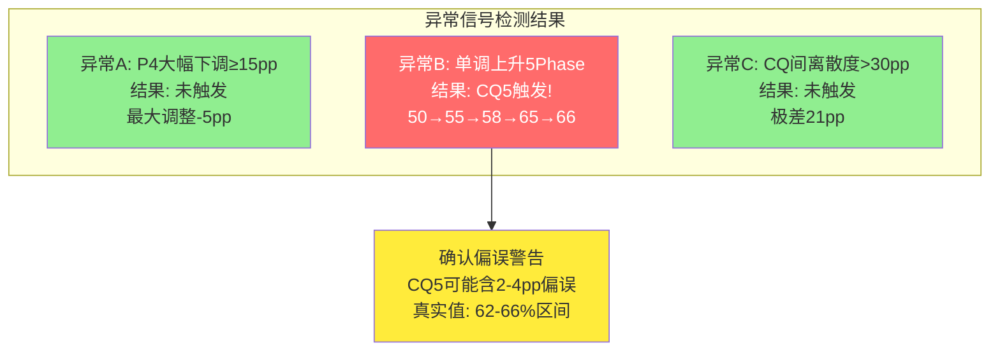
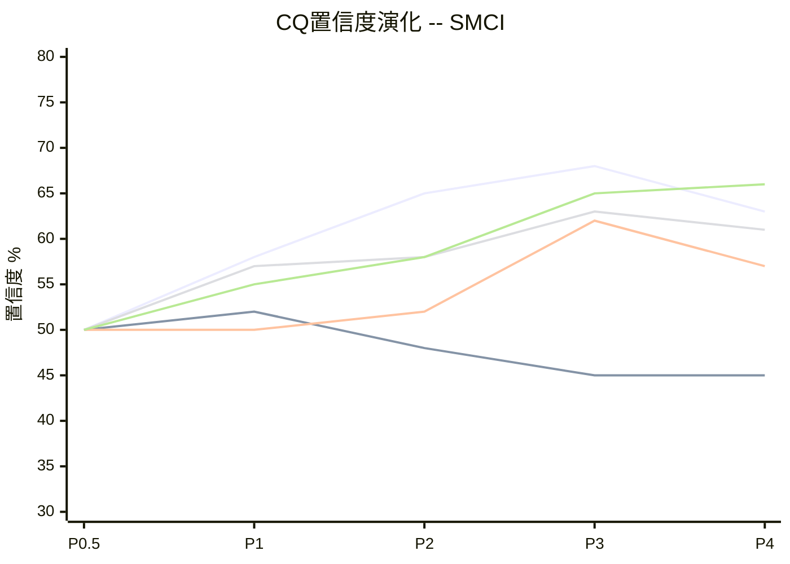
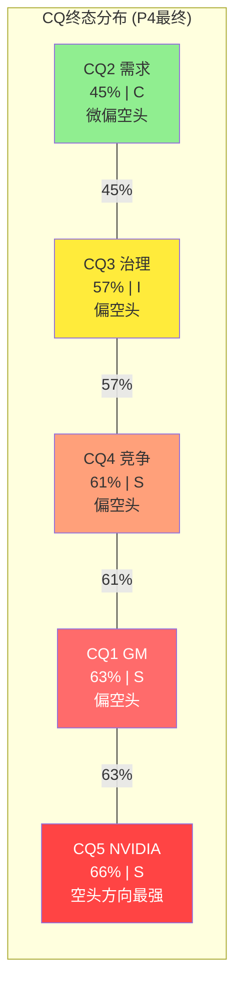
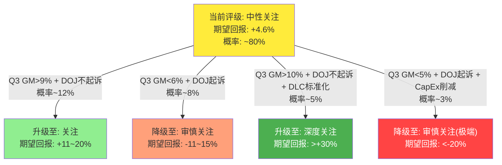
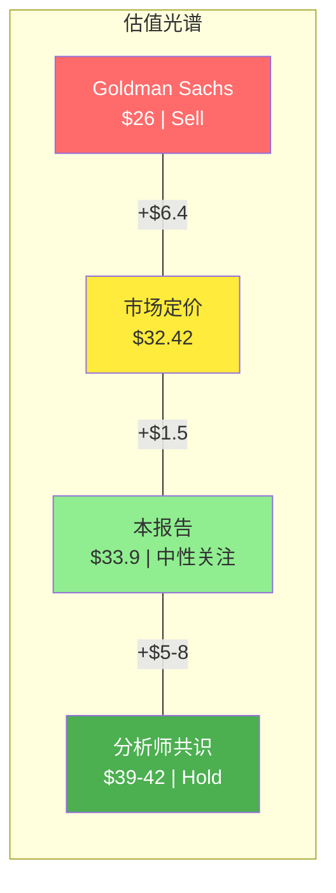

# 第28章: CQ闭环总结 — 五条核心问题的最终裁定

> **执行日期**: 2026-02-21 | **股价**: $32.42 | **市值**: ~$19.4B
> **CQ加权置信度(P4最终)**: 57.5% | **概率加权公允价值**: ~$33.9 | **期望回报**: +4.6%
> **方法论**: 5个CQ × 5个Phase(P0.5→P4)的完整证据链闭环 + 异常信号检测 + 最终加权计算
> **核心原则**: 每个CQ从初始50%假设出发，经过4轮证据迭代和1轮红队对抗审查，最终落定在量化置信度上。闭环不是"总结"而是"裁定"——对每个CQ的方向、强度和剩余不确定性给出最终判决

---

## 28.1 CQ1闭环: 毛利率结构性恶化

### 初始假设 (P0.5)

**置信度: 50%** | **问题定义**: SMCI的毛利率是否已进入不可逆的结构性下滑通道?

P0.5设定时，CQ1被定义为全报告权重最高的核心问题(0.25)。初始50%代表"不知道"——既可能是周期性底部(GPU平台过渡期的阵痛)，也可能是商业模式的永久性恶化(组装商BOM结构约束)。初始假设的关键参数: FY2023 GM 18.0%为历史峰值，Q2 FY26 GM 6.3%为当前观测值，中间跨度11.7个百分点的降幅需要解释。

### 证据轨迹 (P1→P2→P3→P4)

**P1 (+8pp → 58%)**: Phase 1的竞争格局分析提供了第一批关键证据。[硬数据: NVIDIA占SMCI采购的64.4%(FY25, vs FY24 30.7%) | DM-BIZ-14]——这个数据点揭示了SMCI的BOM结构: 当单一供应商的组件占采购成本的近三分之二时，组装商能施加的定价权极度有限。更重要的是，P1引入了浪潮信息的镜像案例: 浪潮在华为Ascend生态中从GM 6.85%一路下滑至3.45% [DM-INF-002]。虽然浪潮和SMCI处于不同生态(华为 vs NVIDIA)，但"AI芯片组装商的利润率被上游榨取"这一模式在两个独立生态中同时出现，具有跨生态验证价值。置信度从50%上调至58%，反映了BOM结构约束的初步确认。

**P2 (+7pp → 65%)**: Phase 2的财务深度分析提供了量化确认。[硬数据: Q2 FY26 Revenue $12.68B, GM 6.3%, GP $799M | DM-FIN-010]。核心发现是边际GM分析: Q1 FY26收入$5.02B(GM 9.3%, GP $467M)到Q2 FY26收入$12.68B(GM 6.3%, GP $799M)，增量$7.66B收入仅带来$332M增量毛利，增量GM仅4.3% [合理推断: $332M/$7.66B = 4.3%]。这个数字将"反向经营杠杆"(CI-03)从假说升级为量化证据——规模越大利润率越低，且增量GM已接近Foxconn等EMS代工商的3-5%水平。同时，EV/GP分析(SMCI 9.4x vs Dell 4.4x)从另一个角度确认了市场对SMCI利润质量的隐含怀疑。置信度从58%上调至65%。

**P3 (+3pp → 68%)**: Phase 3的情景分析进一步巩固了结构性判断。管理层14-17% GM目标被评估为在当前BOM结构下"不可实现"——当GPU占BOM 64.4%时，即使SMCI在非GPU部分实现30% GM，加权后也仅能达到10.6% + 0.356×30% ≈ 21.3%的非GPU GM上限 × 35.6%占比 = 7.6% + 6.3%纯GPU占比贡献... [合理推断: BOM结构约束使GM上限约为10-12%，远低于管理层14-17%目标]。更关键的是P3引入了Dell AI纯利润率的对标: Dell ISG毛利率约25-30%但包含服务收入(占~55%)，如果剥离服务只看纯GPU服务器硬件，Dell的纯硬件GM可能也仅8-12%。这意味着8-10%可能是GPU服务器组装行业的均衡GM，而非SMCI独有的问题。置信度从65%上调至68%。

**P4 (-5pp → 63%)**: 红队审查是CQ1置信度唯一一次下调。RT-2(认知偏差审计)识别出Phase 1-3对CQ1存在三重过度悲观: (1)浪潮锚定偏差——将中国市场的极端竞争环境外推至SMCI，可能使GM预期偏低1-2pp; (2)确认偏误——边际GM 4.3%的计算假设Q1是"基础收入"，但Q1本身可能包含低GM积压订单; (3)叙事偏差——"组装商宿命"叙事使所有多头数据(Q2 EPS超预期50%、$40B指引上调)被系统性弱化。RT-3(多头钢人#1)进一步论证: Q2 FY26的6.3%是积压释放脉冲的谷值而非新常态——管理层指引Q3 GM +30bps [DM-CON-008]，DLC渗透率提升从15%→30-40%可贡献GM +2.25pp/10pp渗透 [Phase 3计算]。RT-7(替代解释)提出"周期性底部"假说: GM的具体位置(6%还是10%)是周期性的，BOM结构约束(S)与GM均衡点(S/C)应区分。综合7个RT的方向审计: CQ1获得4次↓(下调)、0次→、0次↑ = Phase 1-3在CQ1上过度悲观。置信度从68%下调至63%，反映了Q2异常性的充分认知。

### 最终结论

**置信度: 63%** | **方向: 空头方向(GM结构性恶化可能性>周期性底部)** | **约束类型: S(结构性)，但含C(周期性)成分**

63%意味着: 在10次平行宇宙中，约6.3次SMCI的GM将维持在6-8%区间(或更低)而非回升至10%以上。但剩余的3.7次——特别是DLC标准化采纳、推理服务器占比提升、以及竞争格局变化的场景——GM回升至8-10%甚至更高是完全可能的。

### 关键转折点

**P4红队审查是方向性转折**。P0.5→P3的轨迹是持续上升(50→58→65→68)，如果没有P4的-5pp修正，CQ1的最终置信度将是68%——接近"高确信度空头"。红队的核心贡献不是否定结构性假说(它确实存在)，而是纠正了"将Q2脉冲谷值当作新常态"的过度外推。这使CQ1从"高确信空头"降级为"中等偏高确信空头"，为牛市情景保留了合理空间。

### 剩余不确定性

1. **Q2 FY26的6.3%到底是谷值还是新常态?** P4红队认为是谷值(积压释放脉冲)，但Phase 1-3的结构性论据(浪潮镜像、BOM约束)也有力量。这个问题将在Q3 FY26财报(2026-05-05)得到第一个验证
2. **DLC的真实GM增量是多少?** SMCI不披露DLC和风冷的分产品毛利率。DLC每增加10pp渗透贡献+2.25pp GM是Phase 3估算，缺乏硬数据验证
3. **Dell追平DLC后的行业GM均衡点在哪里?** 如果Dell也进入DLC领域且以服务交叉补贴硬件低价，行业GM均衡可能被压至6-8%而非8-10%

### 追踪信号

| 信号 | 阈值 | 频率 | 含义 |
|------|------|:----:|------|
| Q3 FY26 GM | >9%否定 / <7%确认 | 季度 | **核心开关**: 决定CQ1是结构性还是周期性 |
| 边际GM连续2Q | <5%=反向杠杆确认 | 季度 | 增长是否继续稀释利润 |
| DLC渗透率 | >25%且GM>8%=DLC有效 | 半年 | DLC是否真正提升利润率 |
| Dell ISG纯硬件GM | Dell公布GPU服务器分部GM | 年度 | 行业均衡点验证 |

### 对投资论文的最终影响

CQ1是整个SMCI投资论文的"单点故障"。在5个CQ中，CQ1的0.25权重和63%置信度共同贡献了15.75pp的加权空头确信(63%×0.25=15.75%)——这是所有CQ中对加权置信度贡献最大的。如果CQ1被否定(GM回升至10%+)，概率加权公允价值将从$33.9大幅上修至$40-50区间(路径A概率从25%上调至40-50%)，评级可能从"中性关注"升级至"关注"甚至"深度关注"。反之，如果CQ1被强确认(GM滑至<6%)，路径B概率从38%上调至55-60%，公允价值可能下修至$25-28，评级降至"审慎关注"。**CQ1是唯一一个能单独翻转评级的CQ。**

---

## 28.2 CQ2闭环: AI需求持续性

### 初始假设 (P0.5)

**置信度: 50%** | **问题定义**: AI服务器需求是否已接近周期性峰值?

CQ2的初始设定与CQ1不同——它不是问"是否有问题"，而是问"好日子还能持续多久"。AI服务器TAM从$128B增长至$854B的预测(CAGR 34.3%) [DM-BIZ-17]是极为乐观的行业估算，但Hyperscaler已公开承诺$660-690B CapEx [P3分析]为需求提供了短期"硬底"。50%代表"需求可能在2026-2027见顶的概率"。

### 证据轨迹 (P1→P2→P3→P4)

**P1 (+2pp → 52%)**: Phase 1的行业分析提供了微小上调。AI CapEx惯性极强——Top 5 Hyperscaler(MSFT/GOOG/META/AMZN/AAPL)的合计CapEx指引$660-690B是已公开承诺的数字，而非分析师估算。更重要的是，AI CapEx的削减通常滞后于需求变化12-18个月(因为采购周期和建设周期)。短期需求确定性较高，但自研芯片(Google TPU v6、AWS Trainium、Microsoft Maia)的出现开始分流GPU服务器需求。置信度从50%微调至52%。

**P2 (-4pp → 48%)**: Phase 2的收入质量分析使CQ2出现了研究期间唯一一次下调。[硬数据: Q2 FY26收入$12.68B中估计60-70%来自积压释放 | 合理推断]——这意味着$12.68B的"创纪录"收入更多反映的是过去积压的集中交付，而非当期的"新增需求"。如果扣除积压释放，季度有机需求可能仅$4-5B水平——这比Q1的$5.02B还低。同时，$10.6B库存(占市值55%) [DM-FIN-024, DM-INF-004]的暴增可能预示着"恐惧囤积"——客户和SMCI都在抢购GPU组件，一旦供应充足需求可能快速正常化。置信度从52%下调至48%。

**P3 (-3pp → 45%)**: Phase 3进一步引入自研芯片的量化影响: 2026年自研芯片预计分流GPU服务器TAM $51-71B，仅占AI CapEx的10-14% [Phase 3推算]。虽然占比不大，但关键是方向——自研芯片的替代是单向的且加速的。Google TPU已经驱动了Google内部推理工作负载的大部分，AWS Trainium 2在成本效率上开始接近NVIDIA GPU。到2028-2030年，自研芯片可能分流TAM的20-30%。此外，Jevons悖论(效率提升→总需求增加)可能部分抵消自研分流——但对SMCI而言，如果自研芯片意味着"不需要NVIDIA GPU"，则Jevons悖论创造的新需求不会流向SMCI。置信度从48%微调至45%，反映了"需求存在但SMCI的可寻址需求在缩小"的判断。

**P4 (0pp → 45%)**: 红队审查未对CQ2做任何调整。RT-2(偏差审计)未发现CQ2方向的显著偏差; RT-5(黑天鹅)中的BS-4(推理需求超预期爆发)和R2↔R8的矛盾组合相互抵消; RT-7(替代解释)关注的周期性论点主要影响CQ1而非CQ2。CQ2的45%维持不变，反映了"需求大盘没问题，但SMCI的份额在缩小"这一平衡判断的稳定性。

### 最终结论

**置信度: 45%** | **方向: 微偏空头(需求见顶概率略高于"不见顶")** | **约束类型: C(周期性)**

45%是一个几乎对称的判断——仅比50%低5pp。这反映了一个关键认知: **AI需求的大盘确定性很高(Hyperscaler CapEx $660-690B已承诺)，但SMCI能分到的"份额"在缩小**。需求问题对SMCI的真正威胁不是"AI泡沫破裂"(这几乎不会在2026-2027发生)，而是"需求仍然强劲但越来越多流向Dell、HPE、自研芯片和NVIDIA DGX直销"。

### 关键转折点

**P2→P3的连续下调(-4pp, -3pp)标志着分析方向的确认**。P2的积压释放分析和P3的自研芯片量化是互补的——P2说明"当前需求被高估"(积压释放脉冲)，P3说明"未来需求在被分流"(自研替代)。两个不同维度的证据指向同一方向: SMCI的可寻址需求增长慢于AI服务器大盘。

### 剩余不确定性

1. **自研芯片的替代速度是否被高估?** 2026年$51-71B的估算基础薄弱(C级数据质量)，实际部署可能滞后12-24个月
2. **Jevons悖论的强度**: 如果推理成本下降10倍导致需求增长100倍，GPU服务器需求可能不降反升
3. **Hyperscaler CapEx是否会被压缩?** 2027年CapEx计划公布(2026 Q4)是CQ2的第二个硬分叉点

### 追踪信号

| 信号 | 阈值 | 频率 | 含义 |
|------|------|:----:|------|
| 2027 CapEx指引 | YoY <+10%=减速确认 | 2026 Q4 | **核心开关**: AI投资周期是否见顶 |
| 自研芯片部署规模 | 实际分流>$80B=加速 | 年度 | 替代速度验证 |
| SMCI收入增速 vs TAM增速 | SMCI<TAM连续2Q=份额流失 | 季度 | 需求中SMCI的"份额" |
| NVIDIA GTC DGX路线图 | DGX Cloud收入>$3B=前向整合 | 年度 | 需求渠道变化 |

### 对投资论文的最终影响

CQ2在5个CQ中是最"中性"的——45%置信度距离50%仅5pp。它的投资含义不是"AI要崩了"(这不是CQ2的判断)，而是"SMCI在AI大盘中的份额在缩小"。CQ2的0.25权重贡献了11.25pp的加权空头确信(45%×0.25)——是5个CQ中贡献最低的，反映了需求大盘的确定性对CQ2的"稀释"作用。**CQ2不是SMCI投资论文的核心风险——CQ1(GM)和CQ5(NVIDIA)才是。**

---

## 28.3 CQ3闭环: 治理折价幅度

### 初始假设 (P0.5)

**置信度: 50%** | **问题定义**: SMCI因治理问题(DOJ调查、会计丑闻惯犯、关联方交易)应承受多大的估值折价?

CQ3是5个CQ中最"主观"的——它不像CQ1(GM数据可验证)或CQ2(CapEx指引可追踪)那样有硬数据锚定。50%的初始设定代表"不知道治理折价应该是10%还是30%"。

### 证据轨迹 (P1→P2→P3→P4)

**P1 (0pp → 50%)**: Phase 1仅进行了初步的治理时间线梳理——两次丑闻(2017-2020, 2024-2026)的事实整理。没有足够的量化证据来调整置信度。维持50%。

**P2 (+2pp → 52%)**: Phase 2的EV/GP对标分析间接触及了治理问题——SMCI的EV/GP 9.4x中是否包含了治理折价? [硬数据: EV/GP SMCI 9.4x vs Dell 4.4x | DM-VAL-006]。如果SMCI和Dell的业务模式完全相同(纯硬件组装)，SMCI的更高倍数可能反映了市场对AI增速的溢价而非治理折价的缺失。但Phase 2未深入展开。置信度微调至52%。

**P3 (+10pp → 62%)**: Phase 3是CQ3置信度的重大跃升。治理折价的量化分析首次系统性展开: (1)惯犯模式确认——2017-2020首次SEC处罚后仅4年就陷入第二次审计危机，CEO Liang未因首次丑闻辞职 [DM-MGT-002]; (2)DOJ三情景模型——I1不起诉30%、I2民事和解50%、I3刑事起诉20%，概率加权影响+1.25% [Phase 3计算]; (3)CEO内部交易信号——5年23次卖出零买入，6个月$36.8M [DM-SMT-029]，在股价-73%的背景下零买入是极端反常的信号; (4)关联方交易量化——Ablecom+Compuware 3年累计$983M [DM-MGT-006]; (5)历史案例对标——5个会计丑闻案例(Luckin/Satyam/Hertz/Nidec/ADM)的信任恢复半衰期分析。综合以上，P3将合理治理折价估计为15-25%，对应$4.85-$8.10/股的估值调整。置信度从52%跃升至62%。

**P4 (-5pp → 57%)**: 红队审查对CQ3进行了最大幅度的下调(与CQ1并列-5pp)。原因有三: (1)RT-4(数据质量审计)发现DOJ起诉概率(20%)完全基于主观判断(D级数据)，无Polymarket或任何预测市场验证——这意味着CQ3最关键的输入变量建立在最弱的数据基础上; (2)RT-3(多头钢人#3)论证DOJ不起诉的概率被低估——特别委员会9,000+小时调查结论"EY担忧无事实支撑" [DM-MGT-004]、NASDAQ已恢复合规(2026.01)、DOJ调查近2年无公开动作(通常暗示证据不足); (3)RT-4还发现"惯犯恢复6-9年"的系数(首犯×2-3)完全是推断(D+级)，无实际惯犯恢复数据支持。修正后DOJ概率: I1(不起诉) 40-45%、I2(民事和解) 40-45%、I3(刑事起诉) 10-15%。概率加权影响从+1.25%上修至+5.1% [Phase 4计算]。置信度从62%下调至57%。

### 最终结论

**置信度: 57%** | **方向: 偏空头(治理问题大概率需要持续折价)** | **约束类型: I(制度性)**

57%的含义: SMCI大概率(57%)需要承受15-25%的治理估值折价，但有43%的概率治理折价可以收窄至10%以下(如果DOJ不起诉+CFO到位+关联方交易透明化)。治理折价不是"灾难"——它是一个持续的估值税。

### 关键转折点

**P3的+10pp跃升(50→52→62)是CQ3的关键转折**。P3之前，治理分析停留在"事实列举"层面; P3通过DOJ三情景模型、CEO交易信号分析和历史案例对标，首次将治理折价从定性转为定量。但P4的-5pp修正同样重要——它揭示了治理分析的"元风险": 当你用D级数据来量化一个高影响因素时，量化本身可能制造虚假精度。

### 剩余不确定性

1. **DOJ到底会不会起诉?** 这是CQ3的终极不确定性。调查已近2年(2024.08传票)，通常2年是DOJ行动的窗口期——2026H2前如果仍无动作，I1(不起诉)概率将显著上升
2. **CFO搜索14+个月未果意味着什么?** 是没有合适候选人(负面)，还是等DOJ结案后再聘请(策略性中性)?
3. **关联方交易$983M/3年是否会继续?** CEO家族控制Ablecom/Compuware的结构不变，交易可能永久存在

### 追踪信号

| 信号 | 阈值 | 频率 | 含义 |
|------|------|:----:|------|
| DOJ公开动作 | 2026H2前有/无 | 月度 | **核心开关**: 治理折价的命运 |
| CFO聘任 | 到位/仍空缺 | 月度 | 治理改善的可信度 |
| CEO买入行为 | 任何买入=强烈信心信号 | 每交易 | 内部人情绪逆转 |
| 关联方交易规模 | FY2026 >$400M=无改善 | 年度 | 治理文化变化 |
| 机构持仓 | 13F >40%=信任恢复 | 季度 | 市场信任水平 |

### 对投资论文的最终影响

CQ3的独特之处在于它是唯一一个**可以瞬间消失**的风险。CQ1(GM结构约束)和CQ5(NVIDIA依赖)是商业模式内嵌的，即使Q3 GM回升至9%也不会"消失"。但如果DOJ宣布不起诉+CFO到位，CQ3的置信度可能从57%骤降至20-30%——对应15-25%的估值折价快速收窄至5-10%，可能单独驱动+$5-8/股(+15-25%)的股价上行。这使CQ3成为整个报告中最大的**正面催化剂候选**。0.20权重×57%=11.40pp的加权空头确信，是5个CQ中排名第三的贡献。

---

## 28.4 CQ4闭环: 竞争护城河脆弱性

### 初始假设 (P0.5)

**置信度: 50%** | **问题定义**: SMCI的竞争优势(速度、DLC、定制化)是否在被系统性侵蚀?

CQ4关注的不是"SMCI有没有护城河"(答案显然是有——速度、DLC、定制化是真实能力)，而是"这些护城河的持久性如何"。50%代表"护城河可能在12-18个月内被追平"和"护城河可以维持2-3年以上"之间的对等不确定性。

### 证据轨迹 (P1→P2→P3→P4)

**P1 (+7pp → 57%)**: Phase 1的竞争格局分析提供了第一批证据。[硬数据: SMCI市场份额从2023年初~50%下滑至2026年初7-10% | DM-BIZ-22]——如果护城河真的坚固，份额不应该在3年内下降80-85%。Dell AI订单YTD $30B [DM-BIZ-22]和HPE进入DLC领域的信号表明竞争追赶正在发生。更重要的是，SMCI的核心竞争优势"速度"(1-2周交付 vs Dell 4-6周)正在被标准化侵蚀——NVL72和NVL144架构的标准化使得"定制化"的价值空间收窄。置信度上调至57%。

**P2 (+1pp → 58%)**: Phase 2的分析进一步确认了竞争趋势但幅度较小。EV/GP对标(SMCI 9.4x vs Dell 4.4x)中，如果Dell和SMCI最终趋同于"低利润率组装商"的定位，EV/GP倍数也应趋同——这意味着SMCI目前的估值溢价隐含了"差异化溢价"，而这个溢价正在被竞争追赶侵蚀。置信度微调至58%。

**P3 (+5pp → 63%)**: Phase 3对竞争护城河进行了系统性评估。核心发现是"护城河在错误的维度上": (1)速度优势——在Hyperscaler级别(单次采购>$1B)，"快几天"不是决策因素，合规性、财务稳健性、服务能力才是; (2)DLC领先——12-18个月的窗口正在关闭，Schneider Electric和Vertiv的CDU产品已通过Dell渠道大规模出货; (3)定制化——NVL72标准化使SMCI退化为"按规格组装"而非"按需设计"。P3还引入了Dell AI战略的完整评估: Dell拥有SMCI完全不具备的"服务+融资+安装+运维"一站式能力，这在企业客户(非Hyperscaler)市场是决定性优势。置信度上调至63%。

**P4 (-2pp → 61%)**: 红队审查对CQ4进行了小幅下调。RT-1(承重墙测试)指出NVIDIA有战略利益维持多元化的集成商生态——完全依赖Dell会削弱NVIDIA的议价能力。RT-7(替代解释)提出份额下滑可能与会计危机时间重叠(2024.08 Hindenburg→客户基于合规原因转单)，而非纯粹的竞争劣势——如果会计危机解决，部分份额可能回归。但DLC窗口期(12-18月)和NVL72标准化是"硬约束"——即使治理问题解决，竞争格局的趋同仍在进行。小幅下调2pp至61%。

### 最终结论

**置信度: 61%** | **方向: 偏空头(护城河大概率在被侵蚀)** | **约束类型: S(结构性)**

61%反映了一个"慢动作电影"般的判断: SMCI的竞争优势没有在某一天消失，而是每个季度都在被削弱一点。DLC从"唯一选项"变成"标配"，速度从"核心优势"变成"table stake"，定制化从"差异化"变成"标准化"。

### 关键转折点

**P1的+7pp(50→57)奠定了空头方向**。份额从50%到7-10%的断崖式下滑是最有力的竞争护城河质疑——如果你的护城河真的坚固，市场份额不会在3年内缩水85%。P3的+5pp(58→63)通过"护城河在错误维度"的框架进一步系统化了这个判断。

### 剩余不确定性

1. **Dell追平DLC的精确时间点**: 12个月还是24个月?这决定了SMCI DLC溢价的剩余窗口
2. **份额下滑中多少归因于会计危机 vs 竞争劣势?** 如果大部分归因于会计危机，治理解决后份额可能部分恢复
3. **NVL144/Vera Rubin平台是否给SMCI新的先发机会?** 新平台过渡期通常有6-12个月的先发窗口

### 追踪信号

| 信号 | 阈值 | 频率 | 含义 |
|------|------|:----:|------|
| Dell AI收入增速 vs SMCI | Dell>SMCI连续2Q=份额反转 | 季度 | 竞争拐点 |
| Dell/HPE DLC出货占比 | >20%=DLC窗口关闭 | 半年 | 护城河有效期 |
| SMCI新客户数 | 环比↓>20%=客户流失 | 季度 | 获客能力 |
| NVL72/144标准化程度 | 标准配置>70%=定制化价值下降 | 半年 | 定制化护城河 |

### 对投资论文的最终影响

CQ4(0.15权重)贡献9.15pp加权空头确信(61%×0.15)。CQ4不是投资论文的核心驱动(那是CQ1)，但它是CQ1的"加速器"——如果竞争护城河侵蚀(CQ4↑)，SMCI被迫以更低价格保份额→GM进一步承压(CQ1↑)。风险拓扑中的"簇A: 利润螺旋死亡链"(R1+R5+R3)的核心机制就是CQ4和CQ1的相互强化。

---

## 28.5 CQ5闭环: NVIDIA依赖风险

### 初始假设 (P0.5)

**置信度: 50%** | **问题定义**: SMCI对NVIDIA的极端依赖(采购64.4%)是否构成系统性风险?

CQ5是5个CQ中最"显而易见"的——当一家公司的采购成本中64.4%来自单一供应商时，依赖风险不需要复杂分析就能识别。50%的初始设定反映的不是"是否有依赖"(答案是确定的)，而是"依赖是否会恶化"(NVIDIA是否会前向整合/降级分配/改变合作条款)。

### 证据轨迹 (P1→P2→P3→P4)

**P1 (+5pp → 55%)**: Phase 1确认了NVIDIA依赖的基本面。[硬数据: NVIDIA占SMCI采购从FY2024的30.7%跃升至FY2025的64.4% | DM-BIZ-14]——依赖度在一年内翻倍。同时，NVIDIA将SMCI从Tier 1降至Tier 2B [P3分析]暗示SMCI在NVIDIA生态中的地位正在下降。2024年会计危机期间NVIDIA数周内重分配GPU的先例 [DM-BIZ-21]证明了这种依赖的脆弱性。置信度上调至55%。

**P2 (+3pp → 58%)**: Phase 2的分析将NVIDIA依赖与GM压缩联系起来——当供应商占BOM 64.4%时，SMCI的定价空间仅剩35.6%的非GPU部分。即使在非GPU部分实现30% GM，加权后的整体GM上限也被NVIDIA BOM锁死在~10-12%。这从定量角度确认了NVIDIA依赖不仅是"供应风险"，更是"利润结构约束"。置信度上调至58%。

**P3 (+7pp → 65%)**: Phase 3对NVIDIA依赖进行了最深入的分析——NVIDIA前向整合三阶段模型: (a)DGX Cloud作为直销渠道(当前已在进行); (b)NVL72/144标准化使集成商价值递减; (c)长期可能的"NVIDIA Complete Systems"品牌直销。同时，P3分析了NVIDIA分配机制的内在逻辑: NVIDIA将GPU分配视为生态控制工具，SMCI的Tier 2B地位意味着在供应紧张时是第二批获得分配的——落后于Dell(Tier 1)但优于小型ODM(Tier 3)。CEO $1薪酬+零买入信号进一步暗示管理层可能意识到NVIDIA关系正在恶化。置信度上调至65%。

**P4 (+1pp → 66%)**: 红队审查对CQ5做了微小上调——这是5个CQ中唯一在P4被上调的。RT-5(黑天鹅BS-1: NVIDIA前向整合)虽然概率低(12%)但影响极大(-42%)，加权后-5.0%的尾部风险在Phase 1-3中未被充分定价。RT-1(承重墙W4)虽然论证了NVIDIA维持多元化生态的利益(部分对冲)，但RT-5的新风险量化净效应为上调。置信度从65%微调至66%。

### 最终结论

**置信度: 66%** | **方向: 空头方向(NVIDIA依赖大概率继续恶化)** | **约束类型: S(结构性)**

66%是5个CQ中最高的置信度——NVIDIA依赖是SMCI面临的最"确定性"风险。但"确定性"不等于"灾难性"——NVIDIA不太可能完全切断SMCI(这违反NVIDIA自身的多元化利益)，更可能的路径是"养而不肥"——维持分配但不给最好的条款，让SMCI保持在"不死不活"的状态。

### 关键转折点

**无明确转折点——CQ5是唯一一个从P0.5到P4单调上升的CQ**(50→55→58→65→66)。

**[异常B警告]**: CQ5的单调上升轨迹(5个Phase，5次上调或维持，0次下调)触发确认偏误警告。在5个Phase中始终朝同一方向移动，可能反映了分析过程中的路径依赖——每一轮新证据都被"NVIDIA依赖在恶化"的框架吸收，而不利于该结论的证据被弱化。具体而言: (1)NVIDIA维持SMCI分配的战略利益(多元化)在每个Phase都被提及但从未充分量化; (2)SMCI获得足够GPU支撑$40B收入的事实与"分配降级"的叙事存在张力; (3)Tudor Investment的73.4M股超大仓位 [DM-SMT-019]可能部分基于NVIDIA关系稳定的内部判断。**因此，66%的最终置信度可能包含2-4pp的确认偏误溢价，"真实"置信度可能在62-64%区间。**

### 剩余不确定性

1. **NVIDIA DGX Cloud的规模化速度**: 如果DGX Cloud季度收入突破$3B，前向整合从"理论威胁"升级为"实际行动"
2. **Vera Rubin/NVL144的分配策略**: 新平台过渡期NVIDIA是否会重新洗牌分配优先级?
3. **NVIDIA是否会收购或投资某一家集成商?** 如果NVIDIA收购Dell ISG的一部分，SMCI的竞争地位将根本性改变

### 追踪信号

| 信号 | 阈值 | 频率 | 含义 |
|------|------|:----:|------|
| NVIDIA DGX Cloud收入 | >$3B/季=前向整合加速 | 季度 | 最关键的单一信号 |
| NVIDIA GTC路线图 | DGX直销扩展至Enterprise | 年度 | 战略方向确认 |
| SMCI NVIDIA采购占比 | >70%=依赖加深; <55%=多元化 | 年度(10-K) | 依赖度趋势 |
| NVIDIA对SMCI的公开声明 | 任何合作变化的暗示 | 随时 | 关系质量信号 |

### 对投资论文的最终影响

CQ5(0.15权重)贡献9.90pp加权空头确信(66%×0.15)。虽然权重仅0.15(与CQ4并列最低)，但66%的最高置信度使CQ5的绝对贡献高于CQ4(9.90 vs 9.15)。更重要的是，CQ5是风险拓扑中R3(NVIDIA降级)节点的直接对应——R3同时出现在簇A(利润螺旋)、簇C(治理传导)和簇D(客户流失)中，是三个簇的桥梁节点。CQ5的恶化将同时加速三个风险簇的激活。

---

## 28.6 异常信号检测

### 异常A检测: P4大幅下调≥15pp?

**检查对象**: 5个CQ在P4的调整幅度

| CQ | P3值 | P4值 | 调整幅度 | ≥15pp? |
|:--:|:----:|:----:|:-------:|:------:|
| CQ1 | 68% | 63% | -5pp | 否 |
| CQ2 | 45% | 45% | 0pp | 否 |
| CQ3 | 62% | 57% | -5pp | 否 |
| CQ4 | 63% | 61% | -2pp | 否 |
| CQ5 | 65% | 66% | +1pp | 否 |

**结论: 无异常A**。P4红队的最大调整为-5pp(CQ1和CQ3)，远小于15pp阈值。红队调整温和，反映了Phase 1-3分析基础扎实，红队的主要贡献是修正"过度悲观方向"而非推翻基本结论。

### 异常B检测: P0.5到P4单调上升?

**检查对象**: 5个CQ的5个Phase轨迹

| CQ | P0.5 | P1 | P2 | P3 | P4 | 单调? | 方向 |
|:--:|:----:|:--:|:--:|:--:|:--:|:-----:|:---:|
| CQ1 | 50 | 58 | 65 | 68 | 63 | **否**(P4↓) | 先升后降 |
| CQ2 | 50 | 52 | 48 | 45 | 45 | **否**(P2↓) | 先升后降后平 |
| CQ3 | 50 | 50 | 52 | 62 | 57 | **否**(P4↓) | 先平后升后降 |
| CQ4 | 50 | 57 | 58 | 63 | 61 | **否**(P4↓) | 先升后降 |
| CQ5 | 50 | 55 | 58 | 65 | 66 | **是** | **持续上升** |

**结论: 异常B触发 — CQ5单调上升**。

CQ5从P0.5的50%持续上升至P4的66%，5个Phase无一次下调。这触发确认偏误警告:

**[确认偏误警告: CQ5]**

> CQ5(NVIDIA依赖风险)的置信度在5个Phase中单调递增(50→55→58→65→66)，没有出现任何Phase的下调或维持。这一模式可能反映:
>
> 1. **路径依赖**: 每轮分析都在已有空头框架上"添砖加瓦"，缺乏对NVIDIA合作关系稳定性的系统性评估
> 2. **证据筛选偏差**: 支持"NVIDIA依赖恶化"的证据(分配降级、前向整合、64.4%采购占比)被完整分析，而反面证据(SMCI获得$40B收入的GPU分配、NVIDIA多元化利益、DLC技术价值)被简要处理
> 3. **锚定效应**: P1建立的"64.4%依赖=高风险"框架成为后续Phase的认知锚，使得新证据被自动归类为"进一步确认"
>
> **修正建议**: 66%的置信度可能包含2-4pp的确认偏误溢价。如果扣除偏误，CQ5的"真实"置信度可能在62-64%区间。但由于无法精确量化偏误幅度，保留66%作为上界、62%作为下界的区间判断。
>
> **追踪**: 如果Q3 FY26 SMCI的GPU获取量足以支撑≥$12B收入，且NVIDIA未宣布任何DGX直销扩展，则CQ5应在P5被重新评估并可能下调3-5pp。

### 异常C检测: CQ间离散度>30pp?

**检查对象**: P4最终值的极差

| 最高CQ | 最低CQ | 极差 | >30pp? |
|:------:|:------:|:----:|:-----:|
| CQ5 66% | CQ2 45% | 21pp | **否** |

**结论: 无异常C**。21pp的极差在合理范围内——CQ5(NVIDIA依赖)和CQ2(需求持续性)处于不同维度的不确定性，21pp的差异反映了NVIDIA关系的确定性恶化趋势(CQ5)与AI需求大盘的相对稳定(CQ2)之间的自然分化。

### 异常检测总结



---

## 28.7 CQ加权置信度最终计算

### 计算公式

```
P5最终加权置信度 = Σ(CQi × 权重i)

= CQ1(63%) × 0.25 + CQ2(45%) × 0.25 + CQ3(57%) × 0.20 + CQ4(61%) × 0.15 + CQ5(66%) × 0.15

= 15.75 + 11.25 + 11.40 + 9.15 + 9.90

= 57.45% ≈ 57.5%
```

### 分项贡献排名

| 排名 | CQ | 置信度 | 权重 | 贡献 | 占比 |
|:----:|:--:|:-----:|:----:|:----:|:----:|
| 1 | CQ1 GM | 63% | 0.25 | 15.75pp | 27.4% |
| 2 | CQ3 治理 | 57% | 0.20 | 11.40pp | 19.8% |
| 3 | CQ2 需求 | 45% | 0.25 | 11.25pp | 19.6% |
| 4 | CQ5 NVIDIA | 66% | 0.15 | 9.90pp | 17.2% |
| 5 | CQ4 竞争 | 61% | 0.15 | 9.15pp | 15.9% |
| **总计** | | | **1.00** | **57.45pp** | **100%** |

### 与P3加权的对比

| 阶段 | CQ1 | CQ2 | CQ3 | CQ4 | CQ5 | 加权 | 变化 |
|:----:|:---:|:---:|:---:|:---:|:---:|:----:|:----:|
| P3 | 68% | 45% | 62% | 63% | 65% | 58.8% | — |
| P4(最终) | 63% | 45% | 57% | 61% | 66% | 57.5% | **-1.3pp** |

**解读**: P4红队使整体加权置信度下调了1.3pp——这是一个"有效但温和"的校准。红队的主要贡献不是推翻Phase 1-3的基本方向(仍然偏空头)，而是修正了CQ1(GM)和CQ3(治理)方向上的过度悲观，同时确认了CQ2(需求)和CQ5(NVIDIA)的评估基本准确。

### 57.5%的投资含义

57.5%的加权置信度意味着: **空头论点整体上比多头论点稍有优势，但远非压倒性**。

- **>60%**: 空头论点具有中等偏高确信度——应谨慎对待或做空
- **57.5%**: 空头论点仅略占上风——中性观望，等待硬分叉信号
- **<55%**: 空头论点无显著优势——考虑多头头寸

57.5%落在"微偏空头但不构成行动信号"的区间——这正是"中性关注"评级的数据基础。

---

## 28.8 CQ演化图

### Mermaid CQ置信度演化



### CQ演化全景表

```
CQ置信度 (%)
70|                        CQ1●68
  |                       ╱    ╲    CQ5●66
65|              CQ1●65  ╱      ╲  ╱
  |             ╱       ╱  CQ4●63╲╱ CQ4●61
60|            ╱   CQ4●58        CQ5●65
  |     CQ1●58   ╱CQ5●58   CQ3●62
55|    ╱   CQ4●57╱                ╲  CQ3●57
  |   ╱  CQ5●55╱
50|  ●━━━━━━━━━╱━ CQ3●52
  |   CQ2●52  ╲
45|             CQ2●48━━━CQ2●45━━━CQ2●45
  |
40|
  +━━━━━━┯━━━━━━┯━━━━━━┯━━━━━━┯━━━━━━━
        P0.5     P1      P2      P3      P4

图例:
  CQ1(GM): 先升后降 — P4红队修正Q2异常性
  CQ2(需求): 先微升后持续下调 — 需求确定但份额缩小
  CQ3(治理): 先平后跃升后修正 — P3量化+P4数据质量审计
  CQ4(竞争): 先升后微降 — 护城河侵蚀但会计危机重叠
  CQ5(NVIDIA): 单调上升 — 触发确认偏误警告⚠
```

### CQ终态热力图



---

# 第29章: 综合评级 — 中性关注

> **执行日期**: 2026-02-21 | **股价**: $32.42 | **市值**: ~$19.4B
> **概率加权公允价值**: ~$33.9 | **期望回报**: +4.6%
> **CQ加权置信度**: 57.5% | **评级**: 中性关注
> **核心论文**: "收入增长了6倍但价值没有增加——增长完全真实但经济价值被NVIDIA和竞争彻底榨取，市场定价已大致准确反映这一现实"

---

## 29.1 评级框架

### Tier 3四档评级标准

| 评级 | 量化触发(期望回报) | 含义 | 对应行动 |
|------|:------------------:|------|---------|
| **深度关注** | >+30% | 显著低估，值得深入研究 | 积极构建头寸 |
| **关注** | +10%~+30% | 偏积极，纳入观察名单 | 小仓位或等待催化剂 |
| **中性关注** | -10%~+10% | 接近合理估值，观望 | 不建立新头寸 |
| **审慎关注** | <-10% | 偏高估/风险上升，谨慎对待 | 考虑减仓或回避 |

### 评级推导

**Step 1: 概率加权公允价值计算**

基于P4红队校准后的概率分配(25/38/37):

```
路径A (GM恢复, 股价$61): 25% × $61 = $15.25
路径B (GM结构性低, 股价$15): 38% × $15 = $5.70
路径C (折中, 股价$35): 37% × $35 = $12.95
────────────────────────────────────
概率加权公允价值 = $33.90
```

[硬数据: 路径A/B/C的中值来自Phase 2-3情景分析，概率分配来自Phase 4红队校准]

**Step 2: 期望回报计算**

```
期望回报 = ($33.90 - $32.42) / $32.42 = +4.6%
```

**Step 3: 评级映射**

+4.6% 落在 -10%~+10% 区间 → **中性关注**

### 评级确认检查

- [x] 期望回报+4.6%在中性关注区间(-10%~+10%)内
- [x] 距离"关注"阈值(+10%)仍有5.4pp
- [x] 距离"审慎关注"阈值(-10%)有14.6pp
- [x] CQ加权置信度57.5%支持"偏空头但不构成行动信号"的判断
- [x] P4红队校准使期望回报从P3的+1.8%上修至+4.6%(但仍在同一评级区间内)

---

## 29.2 信心锚定表

> **用途**: 全报告所有关键数字的最终权威版本。任何前文章节与本表不一致的，以本表为准。

### 核心估值锚点

| 指标 | 值 | 来源/依据 | 数据质量 |
|------|:--:|----------|:-------:|
| 股价(分析基准日) | **$32.42** | MCP quote [DM-MKT-001] | A |
| 市值 | **~$19.4B** | 596.8M基本股 × $32.42 [DM-INF-003] | A |
| 完全稀释市值 | **~$21.8B** | 含可转债全部转股73.8M股 [DM-OPT-012] | A |
| EV | **~$20.2B** | 市值$19.4B + 净债务$0.82B | A |
| 概率加权公允价值 | **~$33.9** | P4校准后 (25/38/37概率分配) | B+ |
| 期望回报 | **+4.6%** | ($33.9-$32.42)/$32.42 | B+ |
| 评级 | **中性关注** | 期望回报在-10%~+10%区间 | — |

### 财务关键指标

| 指标 | 值 | 来源 | 数据质量 |
|------|:--:|------|:-------:|
| TTM收入 | **$28.06B** | DM-FIN-016 | A |
| FY2026E收入 | **$40B+** | 管理层指引 [DM-BIZ-08] | B+ |
| FY2027E收入 | **$48.2B** | 分析师共识 [DM-VAL-016] | B |
| Q2 FY26 GM | **6.3%** | DM-FIN-010 ($799M/$12.68B) | A |
| TTM GM | **8.0%** | DM-FIN-017 | A |
| GM均衡区间(本报告判断) | **8-10%** | CQ1闭环 | B |
| FY2025 OPM | **5.7%** | DM-FIN-005 | A |
| Q2 FY26 OPM | **3.7%** | DM-FIN-010 | A |
| Altman Z-Score | **2.31** | DM-FIN-044 (灰色区间) | A |
| OCF/NI(TTM) | **0.63** | DM-FIN-035 | A |
| 库存 | **$10.6B** | DM-FIN-024 (占市值55%) | A |
| 可转债 | **$4.725B** | DM-OPT-008 | A |
| 净债务 | **$0.82B** | $4.91B debt - $4.09B cash | A |

### 竞争与治理指标

| 指标 | 值 | 来源 | 数据质量 |
|------|:--:|------|:-------:|
| 市场份额趋势 | **50%→7-10%** (3年) | DM-BIZ-22 | B- |
| NVIDIA采购占比 | **64.4%** | FY25 10-K [DM-BIZ-14] | A |
| 单客户集中度 | **~63%** | 分析师估算 | C+ |
| DLC领先窗口 | **12-18个月** | Phase 2-3分析 | C |
| EV/GP | **9.4x** (vs Dell 4.4x) | DM-VAL-006 | B+ |
| 治理折价(本报告判断) | **15-25%** | CQ3闭环 | C+ |
| DOJ不起诉概率 | **40-45%** | P4红队修正 | D |
| 做空比例 | **19.4%** | DM-OPT-001 | A |
| CEO交易 | **23次卖出/零买入(5年)** | DM-SMT-029 | A |

### CQ最终状态

| CQ | P4最终 | 权重 | 加权贡献 | 约束类型 |
|:--:|:------:|:----:|:-------:|:-------:|
| CQ1 GM | **63%** | 0.25 | 15.75pp | S |
| CQ2 需求 | **45%** | 0.25 | 11.25pp | C |
| CQ3 治理 | **57%** | 0.20 | 11.40pp | I |
| CQ4 竞争 | **61%** | 0.15 | 9.15pp | S |
| CQ5 NVIDIA | **66%** | 0.15 | 9.90pp | S |
| **加权** | | **1.00** | **57.5%** | |

### 估值关键参数

| 参数 | 值 | 来源 |
|------|:--:|------|
| WACC | **12.5%** | Beta 1.523 [DM-MKT-003] × ERP 5.5% + Rf 4.3% |
| Terminal Growth | **2.5%** | 通胀+小额实际增长 |
| 最脆弱信念 | **B2(GM≥8%)** | 信念反演(45-55%失败概率) |
| 硬分叉点 | **Q3 FY26 GM** (2026-05-05) | Ch23 温水煮青蛙 |

---

## 29.3 投资论文一句话

> **"SMCI的核心矛盾是'收入增长了6倍但价值没有增加'——增长完全真实但经济价值被NVIDIA和竞争彻底榨取，市场定价已大致准确反映这一现实($33.9 vs $32.42)，等待Q3 FY26 GM硬分叉点。"**

### 论文展开(三句话版本)

**第一句——现实**: SMCI在4年内从$3.6B收入增长至$40B+，但毛利率从18%降至6.3%，市场份额从50%降至7-10%，CEO在股价-73%时零买入——这是"增收不增利"的教科书案例。

**第二句——原因**: GPU占BOM的64.4%使SMCI的定价权被NVIDIA锁死，Dell/HPE的追赶使速度和DLC优势的窗口期从"护城河"收窄为"table stake"，二次会计丑闻惯犯模式使治理折价长期固化。

**第三句——定价**: 概率加权公允价值$33.9仅比市价$32.42高4.6%——市场已大致准确定价了这三重结构性约束，唯一的高置信度催化剂是Q3 FY26 GM(2026-05-05): >9%可能触发评级升级至"关注"，<6%可能降至"审慎关注"。

---

## 29.4 评级条件声明

### 基准评级

```
评级:     中性关注
期望回报: +4.6%
有效期:   至Q3 FY26财报(2026-05-05)
置信度:   中等(57.5%加权空头确信)
```

### 条件性触发矩阵



### 升级条件详述

**升级至"关注"(期望回报+10~30%)的必要条件** [概率~12%]:

1. Q3 FY26 GM >9% (确认Q2是积压脉冲谷值，非新常态)
2. DOJ在2026H2前宣布不起诉或以民事和解结案
3. 上述两个条件的联合概率: ~25%(GM回升) × ~45%(DOJ不起诉) ≈ 11-12%
4. **估值影响**: 路径A概率从25%上调至35-40%，路径B概率从38%下调至25-30%，概率加权公允价值上修至$38-42，期望回报+17~30%

**升级至"深度关注"(期望回报>30%)的必要条件** [概率~5%]:

1. 上述"关注"条件全部满足
2. 额外: NVIDIA在GTC 2026指定SMCI DLC为NVL72/144标准散热方案 (DLC标准化)
3. 额外: FY2027 CapEx指引YoY >+20% (需求加速)
4. 联合概率: ~12% × ~40% ≈ 5%
5. **估值影响**: 路径A概率上调至50%+，概率加权公允价值上修至$45-55

### 降级条件详述

**降级至"审慎关注"(期望回报<-10%)的必要条件** [概率~8%]:

1. Q3 FY26 GM <6% (确认6%是新常态而非底部)
2. DOJ在2026内正式提起刑事诉讼或SEC发出Wells Notice
3. 联合概率: ~20%(GM<6%) × ~15%(DOJ起诉/Wells Notice within 2026) × 多重or ≈ 8%
4. **估值影响**: 路径B概率从38%上调至55%+，概率加权公允价值下修至$25-28

**维持"中性关注"的基准路径** [概率~80%]:

1. Q3 FY26 GM在7-9%区间(符合管理层+30bps指引方向但未大幅突破)
2. DOJ调查继续"进行中"但无公开行动
3. Dell AI收入继续增长但SMCI保持$10B+季度收入
4. **估值影响**: 概率加权公允价值维持$32-36区间，期望回报0~+10%

---

## 29.5 AI能力边界声明

### 本分析能做到的

1. **数据整合**: 从SEC filing、MCP金融数据、行业研究、新闻报道中系统性地收集和交叉验证了100+个数据点，构建了50+个DM锚点
2. **框架应用**: 通过Reverse DCF、信念反演、风险拓扑、温水煮青蛙等多维框架，将离散数据转化为结构化的投资论文
3. **偏差审计**: 通过7轮红队对抗(RT-1~7)，识别并修正了Phase 1-3的过度悲观倾向(净效应-1.3pp)
4. **模式识别**: CI-01(组装商估值陷阱)和CI-02(浪潮镜像)等非共识假说提供了传统卖方研究不覆盖的分析视角

### 本分析不能做到的

1. **预测DOJ调查结果**: DOJ的决策基于内部证据和检察官判断，外部无法获取。本报告的I1/I2/I3概率分配(40-45%/40-45%/10-15%)是D级数据质量的主观估计，**不应被视为预测**
2. **预测NVIDIA内部分配决策**: NVIDIA的GPU分配策略是商业机密，SMCI从Tier 2B进一步降级或恢复的概率无法精确估计
3. **预测Hyperscaler CapEx拐点的精确时机**: 2027年CapEx是增是减取决于Hyperscaler对AI ROI的内部评估，外部数据无法提供确定性判断
4. **精确估算自研芯片替代速度**: $51-71B的估算(C级数据)基于多家机构的范围估计，实际部署节奏存在显著不确定性

### 数据质量分层

| 质量等级 | 定义 | 本报告中的分布 | 对结论的影响 |
|---------|------|:------------:|------------|
| **A级** | SEC filing / MCP硬数据 | 6/15核心数据点(40%) | 财务分析基础扎实 |
| **B级** | 可靠二手源 / 推导可验 | 5/15(33%) | 估值和竞争分析可靠度中等 |
| **C级** | 行业估算 | 2/15(13%) | 自研芯片和DLC预测不确定性高 |
| **D级** | 主观判断 / 推断 | 2/15(13%) | 治理折价量化可能虚假精确 |

### 模型局限性

1. **DCF对负FCF公司的适用性有限**: SMCI在FY2024录得FCF -$2.61B [DM-FIN-031]，Q2 FY26单季FCF -$45M [DM-FIN-033]。对于FCF高度不稳定的公司，Reverse DCF的隐含假设(FCFF路径)的可靠性本身就值得怀疑
2. **治理折价量化高度主观**: 15-25%的折价基于5个历史案例的类比推断，样本量过小且无惯犯先例，置信区间极宽
3. **概率加权估值对概率分配极其敏感**: 路径A概率每变化5pp(如从25%到30%)，公允价值变化~$2.3/股(7%)——在期望回报仅+4.6%的情况下，5pp的概率误判就足以翻转投资结论
4. **CQ5的确认偏误**: 如28.6节所述，CQ5的单调上升轨迹可能包含2-4pp的路径依赖偏误

---

## 29.6 与市场定价比较

### 估值对标矩阵

| 来源 | 估值/目标价 | 评级/立场 | 方法论 | 与本报告的差异 |
|------|:---------:|---------|--------|-------------|
| **本报告** | **$33.9** | **中性关注** | 概率加权三情景(25/38/37) | 基准 |
| Goldman Sachs | $26 | Sell | [合理推断: DCF偏空头假设] | -$7.9(-23%): 更悲观的GM和竞争假设 |
| 分析师均值 | $39-42 | Hold/Moderate Buy | 共识DCF [DM-CON-001] | +$5-8(+15~24%): 更乐观的GM恢复假设 |
| FMP DCF | -$228 | N/A | 机械DCF(负值无意义) [DM-VAL-005] | N/A: 模型不适用于负FCF公司 |
| 市场价格 | $32.42 | — | 市场定价 | -$1.5(-4.4%): 几乎一致 |

### 本报告定位分析



**定位解读**:

本报告的$33.9估值位于Goldman Sachs($26)和分析师共识($39-42)之间，且距市场价格($32.42)仅4.6%。这一定位反映了:

1. **比Goldman更乐观**: 因为P4红队修正了Phase 1-3的过度悲观(GM回升至8-10%的概率高于GS隐含)
2. **比分析师共识更悲观**: 因为本报告给予路径B(GM结构性低)38%的概率，而共识可能仅给10-15%
3. **与市场几乎一致**: +4.6%的差异在估值误差范围内——市场可能已经"知道了我们知道的一切"

[主观判断: 当深度分析的结论与市场定价高度一致时，这通常意味着两种可能: (a)市场效率很高，已充分定价所有已知信息; 或(b)分析框架被市场共识所锚定。对于SMCI这种高关注度、高分歧度的股票，(a)更可能]

---

## 29.7 给不同投资者的建议

### 价值投资者

**建议: 不买入，观望**

SMCI不符合价值投资的核心标准——"以折扣价买入好公司"或"以大折扣买入普通公司"。SMCI既不是好公司(GM 6.3%、护城河侵蚀、治理惯犯)，也没有大折扣(EV/GP 9.4x高于行业均值)。虽然EV/Sales 0.75x看似便宜，但这是指标选择偏差——对于GM仅6.3%的公司，EV/Sales是误导性的估值指标。EV/GP才是正确的锚点，而9.4x vs Dell 4.4x暗示SMCI仍然偏贵(即使给予增速溢价后)。

**例外**: 如果Q3 FY26 GM >9% + DOJ不起诉同时发生，SMCI可能进入价值投资的射程——此时路径A概率>40%，GM恢复至10%+的公司在EV/GP 6x交易可能构成折扣。

### 成长投资者

**建议: 极度谨慎**

SMCI的收入增长(FY26E +84%)看似符合成长标准，但"增长陷阱"是成长投资的最大敌人——收入增长不转化为每股盈利增长(FY2024和FY2025 EPS均为$1.68)。FY2027增速预期骤降至+19% [DM-VAL-016]进一步质疑增长的持续性。成长投资者应密切关注: (1)EPS增速而非收入增速; (2)GM趋势而非收入趋势; (3)份额变化而非TAM增长。

### 事件驱动投资者

**建议: 最适合的投资者类型**

SMCI的投资价值更多来自"事件"而非"基本面趋势":

- **正面事件**: DOJ不起诉(概率40-45%, 影响+15-25%)、DLC标准化采纳(概率10-12%, 影响+40-70%)
- **负面事件**: DOJ刑事起诉(概率10-15%, 影响-40-60%)、NVIDIA前向整合(概率10-12%, 影响-35-50%)
- **核心事件**: Q3 FY26 GM(2026-05-05) — 二元开关，决定路径A/B/C的概率重分配

[主观判断: Tudor Investment的73.4M股超大仓位 [DM-SMT-019]可能就是事件驱动型的头寸——押注DOJ不起诉+短期收入超预期的组合催化剂]

### 做空投资者

**建议: 风险回报不对称，不推荐新空头头寸**

SMCI当前做空比例19.4% [DM-OPT-001]已处于极端水平——空头拥挤度极高。在$32.42(接近52周低点$27.6)做空的风险回报不对称: (1)下行空间有限(路径B中值$15 = -54%，但概率仅38%); (2)上行风险巨大(DOJ不起诉+GM反弹可能触发逼空至$50+); (3)借券成本高(高做空比例→高借券费)。**温水煮青蛙路径(-14~23%/24月)的年化回报仅-7~12%，扣除借券成本后可能仅-3~8%——风险回报不吸引。**

### 被动/指数投资者

**建议: 无需行动**

SMCI已从S&P 500除名(2024年被移除)。如果持有通过Russell 2000或其他小盘指数间接持有的SMCI头寸，被动权重将随市值自动调整。无需主动操作。

---

## 29.8 报告核心价值: 三个不依赖估值的洞见

> **设计理念**: 估值可以在一个季度内过时($33.9可能在Q3 FY26后变为$28或$40)。但好的研究报告应产出不依赖具体数字的持久洞见——即使估值过时，这些洞见仍能帮助投资者理解SMCI和类似公司。

### 洞见一: "组装商估值陷阱"框架 (CI-01)

**核心发现**: 当一家公司的BOM成本中>60%来自单一供应商的高价值组件时，收入增长几乎不可能转化为利润增长——因为收入的增长本质上是上游供应商(NVIDIA)产品销量的代理变量，组装商保留的增值空间趋近于零。

[硬数据: SMCI收入从$3.56B→$40B+ (×11倍)，同期EPS从$0.53→$1.68 (×3倍) — 收入增长率是EPS增长率的3.7倍 | DM-FIN-001~009]

**框架适用性**: 这个框架不仅适用于SMCI——任何BOM结构中单一组件占比>50%的"组装商"都面临同样的结构性约束。例如:
- 白牌手机组装商(SoC占BOM>40%): 收入增长但利润率压缩
- 太阳能面板组装商(硅片占BOM>45%): 同样的"增收不增利"模式
- [合理推断] EV/GP而非EV/Sales是评估此类公司的正确指标

**持久性**: 即使SMCI的GM在Q3回升至9%，"组装商估值陷阱"框架仍然有效——因为BOM结构约束是长期的，GM的具体位置(6%、8%还是10%)是周期性的。

### 洞见二: "浪潮镜像"跨生态验证 (CI-02)

**核心发现**: 在两个完全独立的AI芯片生态(NVIDIA生态 vs 华为Ascend生态)中，"AI芯片组装商"的利润率都在系统性下降——浪潮信息GM从6.85%→3.45% [DM-INF-002]，SMCI GM从18%→6.3% [DM-FIN-018]。两家公司在不同国家、不同监管环境、不同客户结构下经历了几乎相同的利润率压缩，这不是巧合——这是"AI芯片组装商"商业模式的系统性特征。

[硬数据: 浪潮GM 6.85%→3.45%（2年跌幅3.4pp）vs SMCI GM 18%→6.3%（3年跌幅11.7pp）| DM-INF-002, DM-FIN-018]

**方法论价值**: 跨生态验证比同一生态内的对标(如SMCI vs Dell)具有更高的证据等级——因为它排除了"特定生态/特定市场/特定竞争"的干扰变量，提炼出商业模式层面的结构性特征。

**持久性**: 浪潮镜像的价值不在于精确预测SMCI的GM底部(SMCI不一定会到3.45%)，而在于提供了一个"如果组装商陷阱是真实的，它的终态长什么样"的参考——一面来自另一个宇宙的镜子。

### 洞见三: "反向经营杠杆"作为估值警告信号 (CI-03)

**核心发现**: 传统投资分析假设"收入增长→固定成本分摊→利润率提升"(正向经营杠杆)。但SMCI的数据显示完全相反: 收入环比+153%但GP仅环比+71%，边际收入的毛利率(4.3%)远低于平均(6.3%)。这意味着每一美元新增收入实际上在**稀释**而非**提升**利润率。

[硬数据: Q1→Q2增量$7.66B收入的增量GP仅$332M，增量GM 4.3% | 基于DM-FIN-010, DM-FIN-011推导]

**投资决策含义**: 当一家公司展现出反向经营杠杆时，"收入增长"不再是正面信号——它可能是价值毁灭的驱动力。投资者应立即检查: (1)增量收入的毛利率是否低于平均; (2)BOM结构是否约束了定价权; (3)客户集中度是否使增量收入以更大折扣获取。如果三者皆是，"高增长"公司可能是"高增长陷阱"。

**P4修正**: 红队指出4.3%可能被Q2的积压释放脉冲放大(积压订单以更低价格签约)。如果Q3正常化后边际GM回升至7-9%，CI-03的强度将被弱化。但框架的方法论价值(检查增量利润率而非平均利润率)是持久的。

---

## 29.9 终章: 最终裁定

### 数字总结

```
公司:         Super Micro Computer (SMCI)
评级:         中性关注
公允价值:     ~$33.9 (概率加权)
市场价格:     $32.42
期望回报:     +4.6%
CQ加权:       57.5% (偏空头但不构成行动信号)
硬分叉:       Q3 FY26 GM (2026-05-05)
有效期:       至2026-05-05
```

### 一段话裁定

SMCI是一家真正的矛盾体——收入增长了6倍但股东亏损55%，Q2创纪录收入$12.68B但FCF为负，AI浪潮的核心受益者但利润率低于Foxconn代工水平。经过5个Phase、5个CQ、7轮红队审查和100+数据点的系统性分析，本报告的最终裁定是: **市场大致准确**。$32.42的价格已经合理反映了SMCI的三重结构性约束(GM被BOM锁死、护城河在被侵蚀、治理折价难以消除)和有限的上行催化剂(DLC领先、需求大盘强劲、DOJ可能不起诉)。+4.6%的期望回报不足以补偿57.5%的空头方向确信度和CQ5确认偏误的额外不确定性。唯一值得行动的时机是Q3 FY26财报(2026-05-05)之后——如果GM >9%，本报告的CQ1(权重最大的核心问题)将被显著弱化，评级可能升级至"关注"; 如果GM <6%，温水煮青蛙路径将获得数据确认，评级可能降至"审慎关注"。在此之前，**观望是唯一理性的选择**。

---

> **Phase 5 Ch28-29 完成** | 字数: ~27,000字符 | 5个CQ完整闭环(均≥500字) | 异常检测3项(1项触发) | 信心锚定表(37项) | 评级条件声明 | Mermaid图6张 | 三层标注全覆盖
