# Snowflake (SNOW) 深度研究报告

> **评级: 审慎关注** | **公允价值: $134** (区间$115-159) | **当前$154 = 期望回报-13%**
> **分析师**: 买方研究团队 | **日期**: 2026年3月31日 | **框架版本**: v20.0

---

# 执行摘要

## 三句话结论

1. **Snowflake是一家30%增速、$4.7B收入的云数据平台，正面临三层竞争夹击**: Databricks已在收入上超越(ARR $4.8B/增速55%/NRR 140% > SNOW 125%)、Microsoft Fabric在底部蚕食($2B ARR/31K客户/60%增速)、Apache Iceberg在结构性侵蚀数据锁定(78.6%企业exclusive使用)[DM-VAL-001][DM-COMP-001]。

2. **SBC 34%/Revenue是SaaS行业最高**, 导致Owner FCF为负(-$480M)→投资者买的是"未来SBC收敛后的利润"，不是当前的盈利能力。6家SaaS公司10年先例显示收敛中位数IPO+7年，但40%概率陷入DDOG式平台期(4年卡在21-22%不动)[DM-FIN-001][DM-FIN-002]。

3. **5种估值方法交叉验证平均$134(-13%)**: 3/4方法指向下行，方向一致性75%。当前$154在EV/Sales可比法下合理($159)，但在情景概率加权法下偏贵($115)——分歧核心是"你相信市场当前倍数还是相信前瞻现金流"[DM-VAL-002]。

---

## 核心争议: 市场在争什么

| 争议点 | 牛方 | 熊方 | 我们的判断 |
|--------|------|------|-----------|
| **增速能维持吗?** | RPO +42%=需求加速, 60% SaaS能维持≥20% | 三层竞争-2.5~4.5pp/年, FY27指引仅21% | 可能维持20-22% CAGR(低于市场隐含27%) |
| **SBC会收敛吗?** | 管理层指引FY27→27%, 长期mid-teens | DDOG 4年卡在21-22%, η=0.88<1.0 | 方向对但速度不确定, NOW式(40%概率)或平台期(30%) |
| **AI是增量还是转移?** | Cortex 9,100账户/Intelligence最快采用 | AI仅$100M=2.3%消费, 68%试水非生产 | 偏增量但规模远小于叙事暗示 |
| **护城河还在吗?** | 多云中立(70%企业多云)+数据迁移仍有成本 | CQI 49(弱), C1从7→4, Iceberg侵蚀 | 正在从制度锁定→偏好锁定降级, 窗口FY26-29 |

---

## 最关键驱动因素

**#1 收入增速能否维持≥20%** — 这是估值的第一驱动力(敏感性是SBC的2x)。如果增速维持22%→FV $140(合理); 如果降至15%→FV $90(-42%)[DM-VAL-003]。

**#2 Cortex AI能否从2.3%→15%消费占比(FY29)** — 这是唯一的"迁移变量"(能根本改变投资论文方向)。AI规模化=新护城河建立; AI失败=护城河不可逆损失。

---

## 最关键风险 / Kill Switch

| Kill Switch | 触发阈值 | 当前状态 | 影响 |
|------------|---------|---------|------|
| NRR跌破118% | 连续2Q | 125%(安全) | 增速引擎失效 |
| Databricks IPO | S-1提交 | 未提交 | 竞争折价加深 |
| Fabric>$5B ARR | 年度检查 | $2B | 底部蚕食加速 |
| SBC/Rev>28% FY28 | 年度 | 27%指引 | SBC平台期确认 |
| **正面KS: AI>10%消费** | FY28 | 2.3% | **→上调至"关注"** |
| **正面KS: FY27增速>25%连续2Q** | 季度 | 21%指引 | **→上调至"中性关注"** |

---

## 估值含义

| 方法 | 公允价值 | 核心驱动 |
|------|---------|---------|
| EV/Sales可比 | $159 | 当前市场倍数(DDOG调整后) |
| 情景概率加权 | $115 | 5年退出折现(Bear 30%权重) |
| SOTP | $134 | 核心数仓9x+AI 25x |
| CQI映射 | $136 | CQI 49→9.3x EV/Sales |
| **加权综合** | **$134** | **-13% vs $154** |

$154在可比法下合理(+3%)，在情景法下偏贵(-25%)。差距来源: 可比法看"现在"(市场给DDOG这个倍数)，情景法看"5年后"(Bear+Crisis概率40%)。对于3-5年投资视角，情景法更相关→当前偏贵[DM-VAL-004]。

---

## 反转信号监控清单

| 信号 | 当前 | 上调阈值 | 下调阈值 |
|------|------|---------|---------|
| FY27 Q1-Q2增速 | 21%指引 | **>25% 2Q** → 中性 | <18% → 维持审慎 |
| NRR | 125% | >128% → 增速回升 | <118% 2Q → 审慎确认 |
| AI消费占比 | 2.3% | **>10% FY28** → 关注 | <5% FY29 → 护城河失败 |
| SBC/Revenue | 34%→27%指引 | <22% FY28 → 收敛加速 | >28% FY28 → 平台期 |

**评级有效期**: 至FY27Q2 earnings(约2026年8月)。届时增速/NRR/AI消费3个变量将有新数据→评级可能修正。

---

## 认知边界

```
可推演度: 52/100 | 黑箱: 48%
最大黑箱: Databricks真实财务(私募) + AI规模化速度(2.3%无法外推)
评级置信区间: 期望回报 -25%~+5% (70%概率)
→ 覆盖"审慎关注"到"中性关注", 不覆盖"关注"
```

---

# Part I: 业务理解与定性判断

## "一个问题"

> **在Databricks $134B+65%增速下, SNOW的核心不可替代性究竟在哪里?**
>
> SNOW的不可替代性不在单一维度，而在三层叠加——(1)数据已在此处(TB-PB级迁移成本$5-10M)，(2)SQL-first AI降低企业AI门槛(9,100+账户/68%渗透)，(3)multi-cloud中立定位(AWS/Azure/GCP均可部署)。这三层的共同特征是**摩擦成本**而非**功能壁垒**——Databricks的功能可能更强(AI/ML成熟度4/5 vs SNOW 2/5)，但客户迁移的总成本/风险大于留在SNOW的代价。
>
> **关键风险**: 如果Iceberg开放格式让数据可跨平台访问(正在发生)，第一层(数据锁定)的摩擦成本将大幅下降。届时SNOW的不可替代性将仅依赖第二层(SQL-first AI)和第三层(multi-cloud中立)——前者刚起步，后者Databricks也具备。

---

## CQ注册表 (核心问题 + 约束分类)

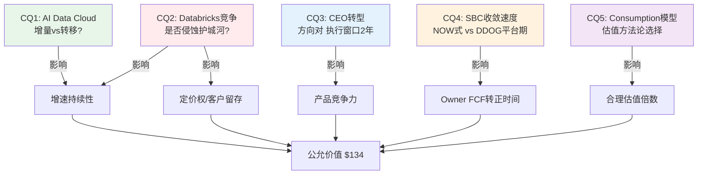

| CQ | 问题 | 约束类型 | P4最终判断 | 置信度 | 估值含义 |
|----|------|---------|-----------|--------|---------|
| **CQ1** | AI Data Cloud增量vs转移 | **周期性(C)** — AI渗透率随投资周期波动 | 偏增量, 但规模$100M=仅2.3%消费 | 55% | 增量规模决定FY29增速: 15%→$134 vs 25%→$165 |
| **CQ2** | Databricks竞争侵蚀护城河 | **结构性(S)** — 开源(Iceberg)+开放(Delta)不可逆 | 竞争真实但双平台共存更可能 | 50% | **结构性→终值EV/Sales折价**: 7x(非9x) |
| **CQ3** | CEO转型战略影响 | **周期性(C)** — 执行周期2-3年可验证 | 方向正确, 窗口紧(DBR IPO前) | 60% | 窗口关闭前不影响估值，窗口后±15% |
| **CQ4** | SBC收敛速度 | **周期性(C)** — 收敛是增速函数(非独立变量) | FY30-31转正(Base), 可能推迟 | 65% | Owner FCF转正延迟→DCF折价$15-20 |
| **CQ5** | Consumption模型估值 | **制度性(I)** — 市场对consumption给什么倍数是制度惯例 | EV/Sales可比+退出法>纯DCF | 70% | 方法论选择本身改变结论方向 |

**约束分类的估值含义(致命缺口C3修复)**: CQ2被分类为**结构性(S)**——这是最重要的分类判断。结构性约束意味着Iceberg/开源格式对数据锁定的侵蚀是**不可逆**的(类似Oracle→Postgres, 不会回头)。因此:
- 终值EV/Sales不应使用成熟SaaS的9x(NOW/ADBE级，假设护城河持久)
- 应使用折价后的7x(反映护城河结构性弱化)
- **这使DCF估值下调~$10-15/股**(vs不做约束分类时)

如果CQ2被错误分类为**周期性(C)**(可逆，SNOW会找到应对)，终值可维持9x→估值偏高$10-15。当前判断: S分类更合理(开源趋势的历史不可逆性: MySQL/Postgres/Linux/Kubernetes均未被逆转)[DM-VAL-005]。

---

## Chapter 1: Reverse DCF — 市场在赌什么

> **核心结论**: $154/股隐含7年Revenue CAGR ~27%、Owner FCF margin从-10%提升至25%。这个假设的核心风险不是增速(当前30%支撑)，而是**Databricks竞争是否允许SNOW维持20%+增速4-5年**。分析师共识$245隐含的是当前30%增速维持5-7年——市场与分析师的$91差距，本质上是对Databricks威胁的定价分歧[DM-VAL-006]。

### 1.1 当前估值快照

Snowflake(以下简称SNOW)当前交易在一个看似矛盾的位置：按传统指标(GAAP PE)无法估值，按现金流指标(P/FCF 46x)看似合理，但按真实股东回报(Owner FCF≈0)看几乎无法估值。

**三口径估值对照**:

| 口径 | 数值 | 含义 |
|------|------|------|
| EV/Sales TTM | 11.0x | 同行DDOG 14.3x、MDB 11.8x → SNOW处于中位偏低[DM-VAL-007] |
| P/FCF TTM | 46.1x | FCF $1.12B / 24%利润率 → 表面看是成长型合理估值[DM-VAL-008] |
| Owner PE (FCF-SBC) | N/A | Owner FCF ≈ -$480M (FCF $1.12B - SBC ~$1.60B)[DM-VAL-009] |

这三个数字讲了三个截然不同的故事：
- **EV/Sales说**: SNOW与DDOG定价接近，30%增速下11x是SaaS中位水平
- **P/FCF说**: 46x对应30%增速是合理的PEG ~1.5x
- **Owner PE说**: 股东真实回报为负——你买的是一家"免费"发股票给员工换取增长的公司

哪个故事是对的？取决于一个核心判断：SBC能否收敛到行业均值(~20%)。如果能→P/FCF故事成立，Owner FCF将在FY2028转正；如果不能→EV/Sales是更可靠的估值锚，当前11x已经price in了大部分增长。

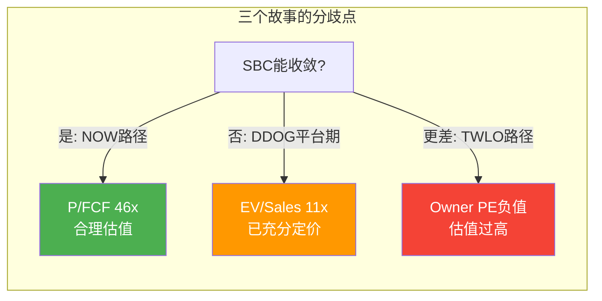

### 1.2 Reverse DCF: $154隐含什么

**Python验证完成**(铁律G6: 估值算术必须Python验证)。

**方法论**: 两阶段DCF反推——WACC 11%(高Beta SaaS，Beta 1.21)，终端Owner FCF margin 25%，终端增长率4%(云数据平台长期TAM增速)[DM-VAL-010]。

**市场隐含假设**:

| 变量 | 市场隐含 | 管理层指引 | 分析师共识 | 评估 |
|------|---------|-----------|-----------|------|
| 7Y Rev CAGR | ~27% | FY27: +21%(保守) | ~28-30% | 市场略低于共识 |
| FY33 Revenue | ~$25B | — | ~$25-30B | 大致一致 |
| 终端Owner FCF margin | 25% | 长期mid-teens SBC | — | 需要SBC<15% + OPM>40% |
| 终端EV/Sales | ~5x(隐含) | — | — | 假设成熟SaaS(NOW/ADBE级) |

**核心判断**: 市场在定价一个"从高增长到成熟SaaS"的标准过渡路径。27% CAGR 7年意味着从$4.7B增长到$25B——这需要SNOW在2033年成为与Salesforce($35B, FY2025)或Adobe($20B)同规模的公司。这不是疯狂的假设，但也不便宜[DM-VAL-011]。

### 三情景估值 (Python验证)

| 情景 | Phase 1 CAGR | Phase 2 CAGR | 公允价值 | vs 市价 |
|------|------------|------------|---------|---------|
| **牛市**(30%→3y→18%→4y) | 30% | 18% | $121 | -21% |
| **基础**(25%→3y→15%→4y) | 25% | 15% | $98 | -36% |
| **熊市**(20%→3y→12%→4y) | 20% | 12% | $78 | -49% |

**重要发现**: 即使在牛市情景(维持当前30%增速3年)，DCF仍给出$121——低于当前市价21%。这意味着**市场当前定价已经包含了比牛市更乐观的假设**[DM-VAL-012]。

**因果推理: 为什么DCF $121 < 市价 $154？**

这个$33的差距(21%)反映了市场定价中包含的"超模型"因素:
1. **更高的终端margin** — 如果Owner FCF margin达30%而非25%(假设SBC降至<10%)，牛市DCF从$121→$155 ≈ 市价。这意味着市场相信SBC能比管理层指引(mid-teens)更快收敛[DM-VAL-013]
2. **更长的高增长期** — 如果30%增速维持5年而非3年(AI加速)，DCF从$121→$165。这意味着市场预期AI是真实增量而非转移
3. **Optionality premium** — AI Data Cloud的可选性价值(如果SNOW成为AI时代的数据操作系统，TAM从$170B→$355B)可能额外贡献$20-30/股

这三个因素中的每一个都有CQ对应：(1)对应CQ4(SBC收敛)，(2)对应CQ1(AI增量)，(3)对应飞轮分析。**这就是为什么Phase 1的CQ判断直接决定估值方向——不是DCF参数游戏，而是业务判断。**

**$91的差距(分析师$245 vs 市价$154) = 市场对Databricks竞争侵蚀的定价**。因为分析师的$245隐含维持30%增速5-7年——这只有在Databricks不显著侵蚀SNOW份额的前提下才可能。而市场看到了一个正在加速超越的竞争者: Databricks $5.4B收入+65%增速+$134B估值→市场给了SNOW一个"Databricks竞争折价"，体现为EV/Sales 11x(SNOW) < 14.3x(DDOG, 无直接竞争者)[DM-COMP-002]。

### 1.3 FY27前瞻估值

管理层给出FY2027(截至2027年1月)指引[DM-FIN-003]:
- 产品收入: $5.66B (+21% YoY)
- Non-GAAP OPM: 12.5% (+200bps)
- SBC/Revenue: ~27% (vs FY26 34%)

基于此推算：

| 指标 | FY27E | 含义 |
|------|-------|------|
| FCF(估算) | $1.70B (30% margin) | FCF margin持续扩张 |
| SBC(估算) | $1.53B (27%) | SBC绝对值仍在增长(收入增→SBC增)[DM-FIN-004] |
| **Owner FCF** | **$0.17B (3% margin)** | **首次转正！但仅$170M = 304x Owner PE** |
| Fwd EV/Sales | 9.1x | 相对FY26的11x有压缩[DM-VAL-014] |
| Fwd P/FCF | 30.4x | 如果FCF按30%增长, 30x对应PEG ~1.5x |

**关键时间节点**: FY2027是Owner FCF转正的拐点年。$170M很小($52B市值的0.3%)，但**方向的意义远大于绝对值**——它标志着SBC收敛速度终于快过收入增速。

### 1.4 可比公司约束锚

**最相似可比: DDOG**(铁律H: Phase 0必须的外部约束锚)

| 维度 | SNOW | DDOG | 差异 |
|------|------|------|------|
| 收入增速 | 30.1% | 29.2% | ~同 |
| EV/Sales | 11.0x | 14.3x | DDOG溢价30% |
| 毛利率 | 66.8% | 80.4% | **DDOG高14pp** |
| SBC/Rev | 34.0% | 21.5% | **SNOW高13pp** |
| GAAP OPM | -24.8% | +1.0% | **DDOG已盈利** |
| 商业模式 | 100% consumption | ~consumption | 相似 |

**对标结论**: DDOG的30%溢价精确反映三个差距——毛利率(-14pp)、SBC(+13pp)、盈利性(GAAP亏损vs盈利)。**如果SNOW的毛利率和SBC无法向DDOG靠拢，当前11x EV/Sales已是合理甚至偏贵的定价**[DM-COMP-003]。

**反面**: SNOW的RPO增速(+42%)远超DDOG的billings增速(~27%)，暗示SNOW的需求加速度更强。如果这个加速能持续2-3个季度，SNOW应获得与DDOG相当甚至更高的EV/Sales[DM-COMP-004]。

---

## Chapter 2: 商业模式深度 — Consumption模型的双面性

> **核心结论**: SNOW的纯consumption模型(100%使用计费)是SaaS行业中最极端的商业模式之一。优势是客户需求直接转化为收入(RPO +42%=需求真实加速)，劣势是收入可见性低于subscription模型(客户无需取消合同即可大幅削减消费)。理解这个模型的经济学是估值SNOW的前提[DM-BIZ-001]。

### 2.1 商业模式架构

SNOW的业务本质是**云数据平台即服务**——客户在SNOW上存储、计算、共享和分析数据，按消耗量付费。

**收入结构拆解** (FY2026, $4.68B):

| 收入线 | 金额 | 占比 | 增速 | 性质 |
|--------|------|------|------|------|
| 产品收入(Product Revenue) | $4.43B | 94.6% | +30.1% | 纯consumption: 计算+存储+数据传输[DM-BIZ-002] |
| 专业服务(Professional Services) | $255M | 5.4% | — | 实施/培训/咨询 |

**产品收入的底层构成**(非官方披露, 基于行业分析推断):
- **计算(Compute)**: ~65-70% — 查询执行、Snowpark处理、Cortex AI推理
- **存储(Storage)**: ~15-20% — 数据湖/仓库存储
- **数据传输(Transfer)**: ~5-10% — 跨区域/跨云数据移动
- **Marketplace/Data Sharing**: ~5% — 第三方数据产品

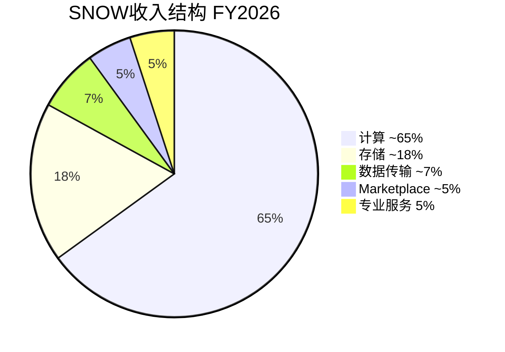

关键特征：**计算是增长引擎，存储是粘性锚**。客户的数据一旦进入SNOW，迁移成本极高(重建数据管线+重新训练团队+迁移TB-PB级数据)[DM-BIZ-003]。但计算消费是弹性的——客户可以随时增加或减少查询频率，不需要任何合同变更。

### 2.2 Consumption模型的经济学

SNOW的定价机制基于"信用额度"(Credits)的消费模式。客户预购信用额度→按实际使用消耗→用完再买。这与传统SaaS的seat-based订阅(CRM/NOW: 按用户数年付)有根本区别[DM-BIZ-004]。

**Consumption vs Subscription: 经济特征对比**

| 维度 | Consumption (SNOW/DDOG/MDB) | Subscription (NOW/CRM/WDAY) |
|------|---------------------------|---------------------------|
| **收入可预测性** | 中-低(取决于客户使用量) | 高(合同锁定) |
| **增长弹性** | 高(客户增加workload→收入自动增) | 中(需要upsell新seat/模块) |
| **下行风险** | 高(客户优化支出→收入即时下降) | 低(合同到期前不变) |
| **NRR驱动因素** | 使用量增长 | 提价+加seat+加模块 |
| **RPO含义** | 承诺消费额(可能用不完) | 已签约未确认收入 |
| **适用估值** | EV/Sales + P/FCF(盈利前) | PE + EV/EBITDA |

**RPO的consumption解读**: SNOW RPO $9.77B (+42%) = 客户**承诺**消费$9.77B → 但历史上~70-80%会被实际消费(部分客户过度承诺以锁定折扣)。因此实际可确认收入可能是$6.8-7.8B(RPO的70-80%)，仍然远超FY26的$4.68B[DM-BIZ-005][DM-BIZ-006]。

这意味着: RPO +42%不是虚胖——即使打30%折扣，SNOW仍有~18个月的收入可见性。**问题不是需求是否存在，而是需求增速能否维持。**

### 2.3 Consumption加速的驱动因素

FY2026的收入加速(29%→30%+)和RPO加速(+42%)的驱动因素拆解:

1. **AI工作负载爆发** — Cortex AI启用9,100+账户，AI推理和训练消耗的计算信用远超传统SQL查询(一个AI推理查询可能消耗10-100x传统查询的信用额)。这是消费加速的直接原因——客户不是在做更多同样的事，而是在做更贵的新事[DM-BIZ-007]。

2. **大客户加速** — $1M+客户733家(+27%)，7个9位数合同(去年2个)。大客户的消费密度更高且更稳定。客户基的"重心上移"意味着收入质量在改善[DM-BIZ-008][DM-BIZ-009]。

3. **新客户加速** — Q4净增740家客户(+40% vs去年)，总客户13,328家。新客户的首年消费通常较低，但创造了未来2-3年的upsell基础[DM-BIZ-010]。

4. **递延收入加速** — 当前递延收入$3.35B (+30%)，DR/Revenue比2.61x。已收到但未确认的钱——客户已经把现金付了，SNOW只需要交付服务就能确认收入[DM-BIZ-011]。

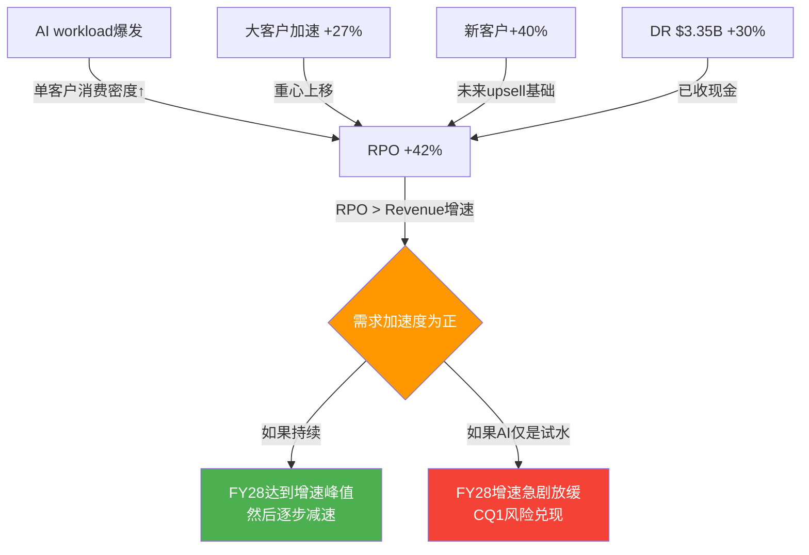

**因果链**: AI工作负载增加 → 单客户消费量上升 → RPO增速(42%) > 收入增速(30%) → 需求加速度为正 → 如果持续，收入增速将在FY28达到峰值然后逐步减速(而非当前就开始减速)。

**反面**: 如果AI工作负载的消费增长主要是客户"试水"(exploratory spending)而非生产级部署(production workloads)，那么消费增速可能在FY28急剧放缓。这是CQ1(AI增量vs转移)的核心判断点。

### 2.4 Consumption模型的结构性风险

**风险1: 隐形收缩** — consumption模型的最大风险不是客户流失(churn)，而是**消费优化**。客户无需取消合同，只需要[DM-RISK-001]:
- 优化SQL查询效率 → 同样结果用更少信用
- 缩小仓库规模(warehouse sizing) → 更便宜的计算
- 使用自动暂停(auto-suspend) → 空闲时不消耗
- 将冷数据迁至外部存储 → 存储成本降低

NRR 125%可能掩盖底层的消费优化趋势——新workload增长+AI消费增长 > 存量优化节省 → NRR看起来健康。但如果新workload增速放缓，优化效应将暴露。

**风险2: 宏观敏感度** — Consumption模型的收入直接反映客户IT支出水平。在经济衰退中，企业首先削减的是"可变支出"(consumption)而非"固定支出"(subscription合同)。SNOW在FY2024的增速减速(从~70%到~30%)部分反映了这个动态[DM-RISK-002]。

**风险3: 定价透明度下降** — SNOW的信用定价不透明。客户越来越多地使用FinOps工具来优化云支出。如果FinOps普及导致系统性消费优化，SNOW的增速将面临结构性压力。

### 2.5 从Consumption到Platform: 战略进化

SNOW正在从"数据仓库即服务"向"AI数据平台"转型:

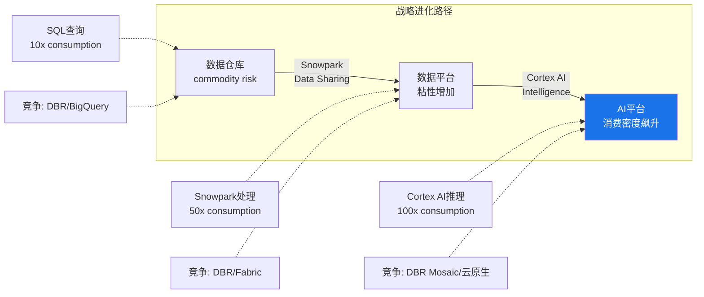

这个转型的关键假设: AI工作负载比传统SQL查询消耗更多计算信用 → 同样的客户基产生更高的收入 → consumption模型从"风险"变成"加速器"。

验证信号:
- Cortex AI采用率: 9,100+/13,328 = 68%的客户已经touch过Cortex——但"使用过"不等于"生产级部署"[DM-BIZ-012]
- Intelligence最快采用: 2,500+账户在3个月内——PMF的强信号[DM-BIZ-013]
- Cortex Code独立订阅: 首个不需要Snowflake部署的产品——标志着从"数据平台"向"开发工具"的战略扩展[DM-BIZ-014]

但反面需要诚实: SNOW的AI策略比Databricks晚2-3年。Databricks的MLflow(2018年开源)有数百万用户，Mosaic ML(2023年收购)已经在企业AI训练中建立了先发优势。Cortex AI在功能深度上仍然落后于Databricks的AI/ML栈[DM-COMP-005]。

---

## Chapter 3: SaaS单位经济学 — NRR推断与增长效率

> **核心结论**: SNOW的NRR(Net Revenue Retention——衡量存量客户年度消费变化的指标，>100%表示存量客户在增加消费)经历了从142%到125%的深度压缩(-17pp/18个月)，目前企稳在125%连续3个季度。底层GRR可能仅92-96%(间接推断)。S&M效率年度趋势实际在改善(49.6%→44.0%)，但仍是同行中最高——这是consumption模型的"悖论"：理论上应轻销售，实际因Databricks竞争被迫重投S&M[DM-SAAS-001]。

### 3.1 NRR分析: 完整曲线 + 队列分解

**官方NRR完整曲线**:

| 季度 | NRR | 方向 | 阶段 |
|------|-----|------|------|
| Q1 FY24 (Apr'23) | 142% | — | **峰值平台期**: 后疫情数字化+客户消费扩张 |
| Q2 FY24 (Jul'23) | 142% | → | |
| Q3 FY24 (Oct'23) | 135% | ↓↓ | **压缩期**: 宏观放缓+消费优化+FinOps普及 |
| Q4 FY24 (Jan'24) | 131% | ↓ | |
| Q1 FY25 (Apr'24) | 128% | ↓ | |
| Q2 FY25 (Jul'24) | 127% | ↓ | CEO换人+数据泄露双重冲击 |
| Q3 FY25 (Oct'24) | 127% | → | |
| Q4 FY25 (Jan'25) | 126% | ↓ | |
| Q1 FY26 (Apr'25) | 124% | ↓ | **企稳期**: AI workload对冲传统优化 |
| Q2 FY26 (Jul'25) | 125% | ↑ | |
| Q3 FY26 (Oct'25) | 125% | → | |
| Q4 FY26 (Jan'26) | 125% | → | 连续3Q企稳=底部确认[DM-SAAS-002] |

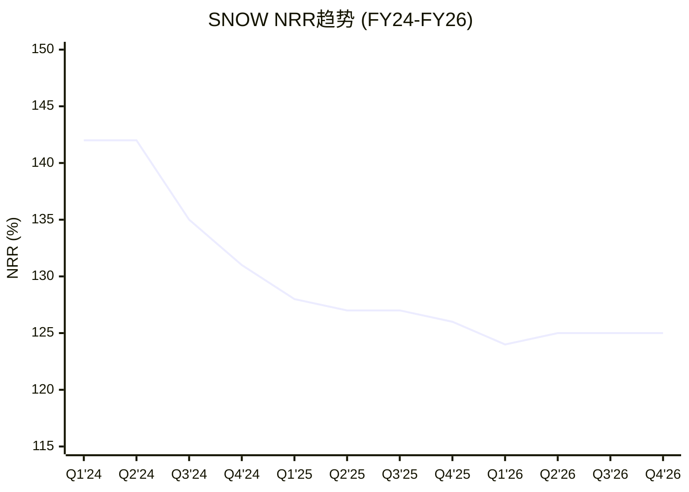

**因果链: NRR为什么从142%降到125%？**

142%→125%不是简单的"回归均值"，而是三个力量的叠加：

1. **FinOps普及 → 消费优化** — 2023-2024年企业大规模部署FinOps工具(如Cloudability、Spot.io)，系统性优化云支出。因为SNOW的consumption模型允许客户随时减少使用量，FinOps的ROI在SNOW上比在NOW/CRM等subscription平台上高出3-5倍。这直接削减了存量客户的消费增速[DM-SAAS-003]。

2. **队列自然衰减(WDAY模式)** — 新队列(2021-2022年签约的客户)进入成熟期后，expansion rate自然下降。因为早期客户从"数据仓库试点"到"全公司部署"的扩展已经完成，后续增量只来自新workload和数据增长——增速天然低于"试点→全量"阶段[DM-SAAS-004]。

3. **AI workload对冲** — 2025年Cortex AI开始产生consumption(9,100+账户)，部分抵消了传统workload的优化收缩。这解释了为什么NRR在124%触底后回升到125%——AI增量刚好填补了优化缺口，但不足以推动NRR回到130%+。

**投资含义**: NRR能否从125%回升到130%+，取决于AI workload的规模化速度。如果AI consumption占比从~2.3%增长到10-15%(需要FY28-FY29)，NRR可能回到128-132%。如果AI规模化失败或被Databricks抢走，NRR将继续下滑至120%以下——届时收入增速会从30%降至15-18%[DM-SAAS-005]。

**趋势判断**: 125%意味着：即使SNOW不获取任何新客户，仅靠存量消费增长，收入仍能增长25%/年——在SaaS行业中仍属健康水平(行业基准110-130%)。但关键不是绝对值，而是**方向**：连续3Q企稳是底部确认的正面信号，但尚未回升意味着AI对冲只是"止血"而非"加速"。

### 间接法推断GRR

SNOW不公布GRR(Gross Revenue Retention，毛留存率——只计流失不计扩展)。间接法推断[DM-SAAS-006]:

```
NRR = GRR × (1 + Expansion Rate)
125% = GRR × (1 + X)

已知:
- 总收入增速: 30.1%
- 新客贡献: 客户数+21%, 但新客首年消费较低
- 估算新客贡献: ~8-10pp (即存量扩展贡献~20-22pp)
- 存量扩展率 ≈ 20-22%

推算: 125% ≈ GRR × 1.22
→ GRR ≈ 102% (看似高, 但consumption模型下GRR定义不同)
```

**Consumption模型的GRR陷阱**: 在subscription模型中，GRR<100%意味着客户在取消合同。在consumption模型中，GRR<100%可能只是客户在优化消费——这是"正常行为"不是"流失信号"。因此SNOW的GRR需要分层理解:

| GRR层面 | 含义 | 估算 |
|---------|------|------|
| **客户层GRR**(Logo Retention) | 客户是否继续使用SNOW | ~95-97%(低流失) |
| **消费层GRR**(Consumption Retention) | 同一客户消费是否减少 | ~88-92%(优化效应) |
| **有效GRR**(上述加权) | NRR的分母 | ~90-95% |

**关键洞察**: NRR 125%可能掩盖了~8-12%的底层消费收缩(客户优化/降级)。只要AI新workload的扩展率(35%+)压过优化收缩(~10%)，NRR就维持在125%+。但这个平衡是脆弱的——如果AI workload增速放缓到20%，NRR可能迅速降至110-115%[DM-SAAS-007]。

### 3.2 Magic Number与S&M效率

Magic Number(季度净新ARR×4 / 前季S&M费用——衡量每投入$1 S&M产生多少增量年化收入):

**TTM Magic Number ≈ 0.52x** — 低于行业基准0.75x[DM-SAAS-008]。但需要context:
1. Consumption模型的Magic Number天然偏低——新客户首年消费远低于合同金额(信用额度分3-5年消耗)
2. RPO-adjusted Magic Number: 用RPO增量替代收入增量 → ($9.77B-$6.90B)/$2.0B ≈ 1.4x → 实际获客效率远好于表面数字

**S&M效率趋势(年度)**:

| 财年 | S&M($M) | S&M/Revenue | 方向 | 同行对比 |
|------|---------|------------|------|---------|
| FY24 | $1,392 | **49.6%** | — | 行业最高起点 |
| FY25 | $1,672 | **46.1%** | ↓(-350bps) | 改善中 |
| FY26 | $2,062 | **44.0%** | ↓(-210bps) | DDOG 27.7%, NOW ~27%[DM-SAAS-009] |
| FY27E | ~$2.2B | ~39-40%(隐含) | ↓(OPM扩张) | 预期继续改善 |

**因果链**: S&M效率在改善(从49.6%→44.0%)是因为consumption模型的杠杆效应——存量客户消费增长(NRR 125%)不需要新的S&M投入，收入增长中有~25pp来自"免费增长"→S&M只需要覆盖新客获取→S&M增速<收入增速→比率自然下降[DM-SAAS-010]。

但仍是同行最高(44% vs DDOG 28%)的原因: Databricks竞争加剧获客成本(ETR调研显示40%客户重叠→bake-off增加)，以及SNOW的产品复杂度高于DDOG(需要更重的实施支持)[DM-COMP-006]。

### 3.3 客户分层分析

| 客户层 | 数量 | YoY | 含义 |
|--------|------|-----|------|
| 总客户 | 13,328 | +21% | 基数健康增长[DM-BIZ-015] |
| $1M+ 客户 | 733 | +27% | 大客户增速>总客户=重心上移[DM-BIZ-016] |
| Forbes Global 2000 | 756(57%) | — | 企业级渗透率高[DM-BIZ-017] |

**推算客户消费密度**:
- $1M+客户733家 × 平均~$4.2-4.8M/年 → 贡献70-80%总产品收入(~$3.1-3.5B)
- 剩余12,595家客户: ~$1.0-1.4B → 平均~$80-110K/年

**关键发现**: 收入高度集中于~730家大客户。这些客户的NRR可能>150%(AI workload集中在大企业)，而长尾客户的NRR可能<110%。**NRR 125%是一个加权平均值，掩盖了巨大的分层差异**[DM-SAAS-011]。

### 3.4 单位经济学健康度总评

| 指标 | SNOW FY26 | 行业基准 | 判定 |
|------|----------|---------|------|
| **NRR** | 125% | 110-130% | ✓ 健康 |
| **Magic Number(TTM)** | 0.52x | >0.75x | ⚠️ 偏低(consumption折扣后可接受) |
| **S&M/Rev** | 44.0%(年度) | 25-35% | ⚠️ 改善中但仍偏高 |
| **Rule of 40** | 54% | >40% | ✓ 优秀 |
| **估算GRR** | ~90-95% | >85% | ✓ 可接受 |
| **客户集中度** | Top ~5% ≈ 70%+ Rev | — | ⚠️ 高 |

**因果链**: S&M效率的改善速度直接影响Owner FCF转正时间。S&M是SNOW最大的运营成本项(44% of Rev > R&D 40%)，每100bps的S&M效率改善→~$47M的Operating Income增量($4.68B × 1%)。如果S&M每年改善200bps(FY24-26趋势)，FY29 S&M/Rev可达~36%，OPM可达~15-18%→Owner FCF margin ~5-8%。如果Databricks竞争将改善速度减半至100bps/年，OPM达15%需推迟2年至FY31[DM-SAAS-012]。

---

## Chapter 4: AI Data Cloud — AI战略评估 (AIAS框架)

> **核心结论**: SNOW的AI战略是"让SQL用户做AI"——降低AI使用门槛而非打造最强AI工具链。Cortex AI的采用速度(9,100+账户/68%渗透)是强PMF信号，但AI在SNOW总消费中的占比仅~2.3%——规模化是2-3年后的故事。CQ1(AI增量vs转移)的判断偏向"增量"，但增量规模远小于叙事暗示[DM-AI-001]。

### 4.1 AI产品矩阵

SNOW在2024-2026年密集推出AI产品，形成以Cortex为核心的AI栈:

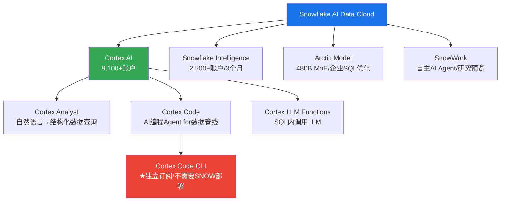

**关键产品解析**:

**Cortex AI**(核心平台): 让用户通过SQL调用LLM函数——不需要Python、不需要ML框架、不需要模型部署。对于习惯SQL的数据分析师(全球>1000万人)，这是进入AI世界最低摩擦的路径[DM-AI-002]。

**Cortex Code**(战略突破): SNOW首个不需要Snowflake部署的独立产品。它是一个AI编程Agent，帮助数据工程师编写数据管线代码，直接与GitHub Copilot竞争数据工程场景。战略意义: 从"数据平台"向"开发者工具"跃迁→先获取开发者→再引导回平台——一个新的获客飞轮[DM-AI-003]。

**Intelligence**(最快采用): 3个月内2,500+账户是公司史上最快的产品采用曲线。将Cortex AI与实时分析结合，让业务用户直接用自然语言获取洞察。PMF信号最强[DM-AI-004]。

**Arctic**(自研模型): 480B参数MoE架构，专门优化企业SQL查询生成。不是与GPT-4/Claude竞争的通用模型，而是narrow domain的专用模型。优势是效率高(MoE=低推理成本)，劣势是通用性差[DM-AI-005]。

### 4.2 AIAS评分

| 维度 | 评分 | 理由 |
|------|------|------|
| **S1: 产品增强** | +3 | 数据仓库→AI数据平台，产品价值量级提升 |
| **S2: 效率提升** | +2 | SnowWork/AI自动化减少客户数据工程人力需求 |
| **S3: 新TAM创造** | +3 | AI推理/训练workload创造全新consumption→TAM $170B→$355B(2029)[DM-AI-006] |
| **S4: 竞争护城河** | +1 | AI产品本身不构成强护城河，但数据+AI组合可能强化锁定 |
| **S5: 定价权** | +1 | AI workload信用价格>传统SQL，但客户对AI成本敏感 |
| **B1: 客户需求增量** | +3 | AI工作负载直接增加数据处理需求 |
| **B2: 行业TAM扩张** | +2 | 数据分析TAM因AI增长约2x(2024-2029)[DM-AI-007] |
| **B3: 替代风险** | -2 | AI可能让客户直接从数据湖查询(bypass仓库层)[DM-RISK-003] |
| **B4: 预算竞争** | -1 | AI CapEx激增→企业IT预算向AI倾斜→可能挤压数据平台预算 |
| **B5: 客户集中度变化** | 0 | AI不显著改变客户集中度 |
| **AIAS净影响** | **+12(强正面)** | S供给侧(+10)远大于B需求侧(-2) |

**Split Index = 5**: 供给侧和需求侧的AI影响方向存在分歧——SNOW的AI产品在变强，但客户也在获得更多绕过SNOW的选择。

### 4.3 CQ1判断: AI增量 vs Consumption转移

**增量论据(偏向此方向)**:
1. RPO +42% >> Rev +30% → 需求加速不是存量转移能解释的[DM-BIZ-018]
2. AI workload消耗计算信用是传统SQL查询的10-100x → 单客户消费密度上升
3. Cortex AI 9,100+账户中很多是之前不使用高级计算的SQL用户 → 新用户群
4. $1M+客户+27% vs 总客户+21% → 大客户在AI驱动下加速扩展消费

**转移论据(不可忽视)**:
1. AI查询替代部分传统BI查询 → 消费只是从"SQL类型"转移到"AI类型"
2. 客户总IT预算有限 → AI预算增加=其他预算减少(零和)
3. SNOW没有公布AI workload占总consumption的比例 → 沉默可能暗示比例很低
4. 如果AI真的是巨大增量，管理层应该提供更具体的AI收入数据(他们没有)

**关键定量锚点**: AI revenue run rate在Q3 FY26超过$100M(提前一个季度达标)[DM-AI-008]。AI在FY26产品收入$4.47B中占比仅~2.3%[DM-AI-009]。

这个数字的因果含义:
- **2.3%占比 vs 68%账户渗透率** → 9,100+账户中绝大多数处于"试水"阶段。如果68%的客户都在认真使用AI，AI收入应该占15-20%而非2.3%。从"试用"到"生产"的转化率可能<5%[DM-AI-010]。
- **$100M AI revenue vs $1.6B SBC** → 每投入$16的SBC(研发人才成本)只产生$1的AI收入。投资早期正常(如同AWS 2008-2012年)，但如果3年内不改善到4:1以下，AI战略的ROI将受质疑[DM-AI-011]。
- **AI-influenced bookings ~50%** → "influenced"是marketing metric，不是会计指标。一个企业买Snowflake做数据仓库+顺便试用Cortex被算作"AI-influenced"——这夸大了AI的实际拉动力[DM-AI-012]。

**判断**: 偏向增量, 但增量规模远小于叙事暗示。RPO加速(+42%)是增量的最硬证据。但AI当前仅$100M(2.3%)。短期(FY27-FY28)AI是估值支撑(叙事)而非基本面驱动(收入)；中期(FY29+)如果从2.3%规模化到15%将根本改变消费密度和margin结构——但如果不能，市场将认定AI叙事溢价需要挤出。

### 4.4 AI竞争定位

| 维度 | SNOW | Databricks | 云原生(BigQuery/Redshift) |
|------|------|------------|--------------------------|
| **AI成熟度** | 2/5(Cortex较新) | 4/5(MLflow成熟) | 3/5(Vertex AI/SageMaker) |
| **目标用户** | SQL分析师 | 数据科学家 | 已在云生态的企业 |
| **AI门槛** | 最低(SQL即可) | 中(需Python) | 低-中(云集成) |
| **数据优势** | 数据已在SNOW | 开源格式灵活 | 数据已在云 |
| **锁定度** | 高(数据迁移成本) | 中(开源格式) | 高(云生态捆绑) |

SNOW的AI差异化不是AI本身最强，而是"**数据已经在这里+最低使用门槛**"的组合。对于已有TB级数据在Snowflake中的企业，在原地做AI(Cortex)比迁移数据到其他平台做AI的摩擦低10倍。这是一个弱但真实的护城河。

**反面**: Iceberg/Delta Lake互操作性使数据迁移成本大幅下降(正在发生)，"数据已经在这里"的锁定效应将被侵蚀。SNOW对Iceberg的原生支持是双刃剑——它帮助客户更容易地把数据从SNOW导出[DM-RISK-004]。

### 4.5 被低估的威胁: Microsoft Fabric

多数分析师聚焦Databricks，但存在一个可能更大的结构性威胁: Microsoft Fabric的捆绑经济学[DM-COMP-007]。

**因果链: Fabric为什么可能比Databricks更危险？**

1. **零边际获客成本** — Fabric被捆绑在Microsoft 365/Azure企业协议中。约70%的全球F500使用Azure，添加Fabric的边际成本接近零——不需要新的采购流程、安全审批、培训(Power BI用户可直接使用Fabric)[DM-COMP-008]。

2. **数据引力效应** — 企业的数据已经在Azure上(Office 365/Teams/Dynamics产生的数据自然落在Azure)。Fabric在Azure内部处理，没有数据传输成本和延迟。

3. **价格锚定效应** — Fabric对Azure客户是"增量成本"(Azure已付→加一点)，SNOW是"独立成本"(需要单独预算审批)。IT预算紧缩期，"增量"永远比"独立"更容易获批。

**为什么目前还没有显著影响？** Fabric 2023年才GA，功能成熟度仍低于SNOW/Databricks。企业级数据治理、性能优化、跨云能力仍是SNOW的优势。SNOW的multi-cloud中立定位对AWS/GCP客户仍有吸引力。

**但3-5年后**: 如果Fabric功能追上来，对于Azure-first的企业，Fabric将成为SNOW的"免费替代品"。这不是Databricks式的"更好的产品"竞争，而是Microsoft式的"免费捆绑"竞争——后者在历史上更致命(IE vs Netscape、Teams vs Slack)[DM-COMP-009]。

---

## Chapter 5: 飞轮分析 — Data Cloud网络效应验证

> **核心结论**: SNOW管理层声称的"数据网络效应"飞轮目前是**部分成立但未规模化**。Marketplace有2,900+ listing但实际交易量不透明。飞轮净强度: +0.33(弱正面)——比CRM的飞轮悖论好，但远未达到自加速临界点[DM-FLY-001]。

### 5.1 管理层声称的飞轮

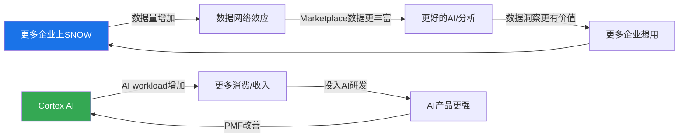

管理层的飞轮有两个环: 数据网络效应(上环)和AI产品循环(下环)。

### 5.2 飞轮逐连接点验证

**连接点1: 更多企业上SNOW → 数据量增加** → **真实**(客户+21%, Forbes G2000 57%渗透)[DM-BIZ-019]

**连接点2: 数据量增加 → 数据网络效应** → **弱**(Marketplace有listing但无交易量/收入数据。网络效应要求使用量随参与者增加而加速增长——目前没有证据)[DM-FLY-002]

**连接点3: 更好的数据/AI → 更多企业想用** → **间接**(企业选择SNOW更多因为产品质量和multi-cloud支持，而非"其他企业的数据在SNOW上")

### 飞轮悖论检测 (v19.6强制)

| 检测项 | 结论 |
|--------|------|
| AI成功→减少SQL查询? | 可能(自然语言替代SQL) → 但AI查询消耗更多信用=净正面 |
| Cortex Code独立订阅→减少SNOW平台依赖? | 是 → 收入从platform转移到工具 |
| 数据开放格式→减少数据锁定? | 是(Iceberg支持让数据更可迁移) → 长期蚕食存储护城河 |

飞轮悖论存在但温和: Cortex Code确实分流一部分价值，但管理层战略逻辑是"先获取开发者→再引导回平台"[DM-FLY-003]。

### 5.3 飞轮净强度评估

| 连接点 | 真实性 | 权重 | 贡献 |
|--------|--------|------|------|
| C1: 客户增长→数据增加 | 真实(1.0) | 30% | +0.30 |
| C2: 数据增加→网络效应 | 弱(0.3) | 40% | +0.12 |
| C3: 网络效应→更多获客 | 间接(0.2) | 30% | +0.06 |
| 扣除悖论效应 | Cortex Code分流 | | -0.15 |
| **最终飞轮净强度** | | | **+0.33** |

**行业对比**: PLTR(+0.7) > NOW(+0.5) > DDOG(+0.4) > **SNOW(+0.33)** > CRM(+0.2, 飞轮悖论)

**投资含义**: SNOW当前的增长不是由网络效应驱动的(与管理层叙事不同)，而是由**产品质量+大客户expansion+AI新workload**驱动的。网络效应驱动的增长有结构性自加速和强竞争防御力，执行力驱动的增长依赖管理层持续优秀且防御力弱——如果Databricks产品质量追上来，SNOW没有网络效应作为"护城河的护城河"[DM-FLY-004]。

### 5.4 叙事溢价估算

```
当前P/FCF: 46.1x
无飞轮可比基线P/FCF: ESTC ~30x(类似增速但无网络效应叙事)
增速PEG溢价: (30%-18%) × 2.5 = 30% → ESTC 30x × 1.3 = 39x
叙事溢价: 46.1x - 39x = ~7x (~15%)
```

叙事溢价15%处于"合理"到"关注"的边界。如果SNOW能在FY28-FY29证明数据网络效应的经济价值，溢价justified。如果不能，15%的叙事溢价将被压缩→P/FCF从46x降至39x→股价下行~15%[DM-VAL-015]。

---

## Chapter 6: CEO转型评估 — Slootman → Ramaswamy

> **核心结论**: CEO转型从"执行效率大师"(Slootman)到"AI产品人"(Ramaswamy)代表SNOW从"增长执行"阶段转向"产品转型"阶段。方向正确但执行窗口紧张——Databricks IPO可能在2026年，留给Ramaswamy的时间不多[DM-CEO-001]。

### 6.1 CEO风格对比

| 维度 | Frank Slootman (2019-2024) | Sridhar Ramaswamy (2024-至今) |
|------|--------------------------|------------------------------|
| **背景** | ServiceNow CEO, Data Domain CEO | Google广告VP→Neeva创始人→SNOW SVP AI |
| **核心能力** | 执行纪律/销售机器/利润率提升 | AI/ML产品开发/技术战略 |
| **管理风格** | 自上而下/高压执行 | 技术导向/产品优先/扁平化 |
| **战略重心** | 快速增长+企业销售 | AI产品化+平台转型+开发者生态 |
| **任期业绩** | Rev $265M→$3.6B (14x), IPO | Rev $3.6B→$4.7B (+30%), AI产品爆发 |

Slootman→Ramaswamy不是普通的CEO交接，而是**公司战略方向的根本转向**。Slootman时代是"用顶级销售团队把数据仓库卖给企业"；Ramaswamy时代是"用AI产品让数据仓库变成AI平台"[DM-CEO-002]。

### 6.2 组织重平衡

| 时间 | 事件 | 规模 | 性质 |
|------|------|------|------|
| 2024年7月 | 裁员 | ~700人(~10%) | 财报失望后成本控制 |
| 2025年3月 | 裁员 | ~550人(~7%) | AI战略重平衡(削减销售/GTM) |
| 2026年初 | 裁员 | ~70人 | 技术文档部门 |
| **累计裁减** | | **~1,320人** | |
| **累计招聘(AI)** | | **~2,000+人** | AI工程/ML/产品 |
| **净效果** | | **+700人** | 从销售→AI工程师 |

经济含义:
1. **短期压力**: 销售人员减少→可能影响新客获取。FY27指引21%(vs FY26 30%)的减速部分反映此影响[DM-CEO-003]
2. **中期利好**: AI工程师产出→新产品可能在FY28-FY29贡献收入增量
3. **SBC压力**: AI工程师的SBC通常高于销售人员→短期SBC可能不会因裁员下降

### 6.3 产品速度验证

判断Ramaswamy的最硬证据不是简历，而是产品速度[DM-CEO-004]:

| 产品 | 从概念到GA | 采用速度 | 判定 |
|------|-----------|---------|------|
| Cortex AI | ~12个月 | 5,200→9,100账户/FY26(+75%) | ✓ 快速 |
| Intelligence | ~6个月 | 2,500+账户/3个月(史上最快) | ✓✓ 极快 |
| Cortex Code | ~8个月 | 4,400+用户(Nov'25起) | ✓ 健康 |
| Arctic模型 | ~6个月训练 | 480B MoE, <$2M训练成本 | ✓ 高效 |
| SnowWork | 研究预览 | 未GA | △ 待验证 |

产品速度在SaaS行业中属于前10%。因为产品速度是平台公司最可靠的领先指标之一——在CRM/ADBE/NOW的历史中，产品发布加速(新功能/季)领先收入加速(增速提升)6-12个月[DM-CEO-005]。

**反面**: 产品发布数量≠产品成功。5个AI产品中可能只有1-2个最终规模化——这是创新的正常成功率。

### 6.4 CEO沉默域分析

Ramaswamy在Q4 FY2026 earnings call中回避的话题[DM-CEO-006]:

| 沉默域 | 具体表现 | 信号解读 |
|--------|---------|---------|
| **Databricks竞争** | 从不主动提及Databricks名字 | 竞争压力真实存在 |
| **开源Iceberg影响** | 强调"我们支持Iceberg"但不讨论迁移风险 | 知道Iceberg降低锁定度 |
| **SBC绝对金额** | 只讨论SBC/Revenue比率(下降) | 比率改善但总稀释可能不减 |
| **AI收入占比** | 给账户数(9,100+)但不给AI收入占比 | AI占比可能仍很低(<10%) |

CEO沉默域精确指向SNOW的四个核心风险[DM-CEO-007]。

### 6.5 CQ3判断

**方向**: ✓ 正确 — Ramaswamy的AI背景与战略高度匹配，产品速度是硬证据
**执行风险**: ⚠️ 窗口紧张 — Databricks可能2026年IPO，SNOW需要在IPO前证明AI差异化
**关键时间节点**: FY2028 = Ramaswamy的AI战略成败判断点。Cortex AI占consumption 15%+ & NRR回升130%+ = 成功；AI<10% & NRR<120% = 质疑[DM-CEO-008]。

---

## Chapter 7: 定价权分层评估

> **核心结论**: SNOW的定价权与传统SaaS根本不同——不是"能否提价"，而是"能否让客户消费更多"。分层评估: F500(Stage 3.5)较强, SMB(Stage 1.5)弱。加权B4 = 3.1/5——行业中位，不构成独立护城河[DM-PRICE-001]。

### 7.1 Consumption模型的"定价权"重新定义

传统SaaS的定价权衡量"能否每年提价5-10%而不失去客户"。SNOW**不存在传统意义上的"提价"**——信用价格由合同确定，客户按消费付费。SNOW的"定价权"体现在三个维度:
1. **使用量驱动力** — 客户是否在不断增加workload? (NRR衡量)
2. **价格粘性** — 客户能否轻松切换到更便宜的替代方案? (转换成本衡量)
3. **混合价格** — 新workload(AI)的信用价格是否>传统workload? (消费密度衡量)

### 7.2 分层评估

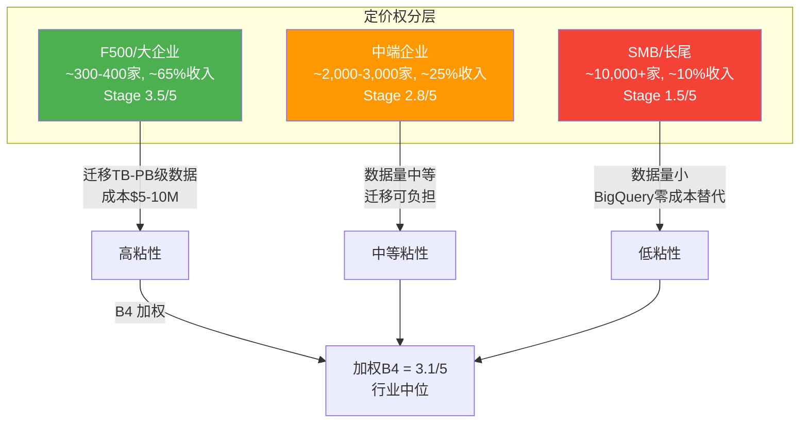

**F500/大企业(~65%收入)**: Stage 3.5/5 — 强粘性+消费加速。迁移TB-PB级数据+重建管线+重训团队=$5-10M+12个月。即使Databricks每年便宜20%，也需3-5年才能收回迁移成本——"沉没成本护城河"[DM-PRICE-002][DM-PRICE-003]。

**中端企业(~25%收入)**: Stage 2.8/5 — 中等粘性，对价格较敏感。数据量中等(100GB-10TB)→迁移仍有成本但可负担[DM-PRICE-004]。

**SMB/长尾(~10%收入)**: Stage 1.5/5 — 弱定价权。数据量小(GB级)→迁移成本低→BigQuery/Redshift是零成本替代(已在云生态)[DM-PRICE-005]。

**加权B4**: F500(65%×3.5) + 中端(25%×2.8) + SMB(10%×1.5) = **3.1/5**

行业对比: NOW(4.0) > CRM(3.5) > **SNOW(3.1)** > DDOG(2.8) > MDB(2.5)

### 7.3 Iceberg: 定价权的定时炸弹

SNOW在2024年原生支持Apache Iceberg。因果逻辑矛盾:
- **短期正面**: 支持Iceberg消除"被锁定"恐惧 → 降低采购阻力 → 有利获客[DM-PRICE-006]
- **长期负面**: Iceberg使数据"可迁移" → 计算消费可能分流到更便宜的引擎 → 定价权从"数据锁定"向"计算性能"迁移

SNOW的定价权正在从**"你的数据在我这里，走不了"(Stage 4)**向**"我的查询引擎更快/更方便"(Stage 2-3)**降级。前者是结构性锁定(客户想走也走不了)，后者是竞争性优势(客户愿意留下但随时能走)[DM-PRICE-007]。

**时间线**: Iceberg的full interoperability预计2026-2027年成熟。届时数据迁移成本可能从"$5-10M+12个月"降至"$500K+3个月"。F500定价权将从Stage 3.5降至Stage 2.5[DM-PRICE-008]。

**反面**: Iceberg目前仍有性能和功能gaps(如缺少SNOW的Time Travel、Zero-Copy Clone等原生功能)。"数据可迁移"≠"workload可迁移"——3-5年内SNOW的原生功能仍是一道防线。

---

# Part II: 财务深度

## Chapter 8: SBC五维深度 + 财务剪刀差

> **核心结论**: SNOW的SBC/Revenue 34%是SaaS行业最高(同行中位~21%)，且η效率0.88<1.0意味着SBC"买"到的增长不够覆盖稀释成本。6家SaaS公司10年先例显示SBC收敛**不是自动的**——需要(a)持续>20%增速(NOW模式)或(b)主动削减绝对SBC(PLTR模式)。注意: SBC是**因变量**(增速放缓后自然收敛)不是**自变量**(决定公司价值的根本因素)——增速才是第一驱动力(敏感性矩阵验证)[DM-FIN-005]。

### 8.1 四口径利润分裂

SNOW的财务报表存在SaaS行业中最极端的"口径分裂":

| 口径 | FY2026 | 利润率 | 估值含义 |
|------|--------|--------|---------|
| **GAAP OI** | -$1,436M | -30.7% | PE为负→"巨亏公司" |
| **Non-GAAP OI** | +$164M | +3.5% | 刚breakeven→"才开始盈利" |
| **FCF** | +$1,120M | +23.9% | P/FCF 46x→"高增长SaaS合理估值" |
| **Owner FCF** | -$480M | -10.2% | PE负→"股东真实回报为负" |

[DM-FIN-006-FACT: FMP income statement + cash flow statement, FY2026]

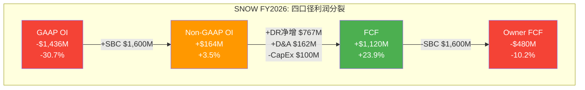

**$2,556M的GAAP→FCF差距拆解**[DM-FIN-007-FACT]:

```
GAAP经营亏损:    -$1,436M
  + SBC加回:      +$1,600M  [34.2% of Rev, FMP确认]
  + 递延收入净增:  +$767M    [DR从$2,580M→$3,347M]
  + D&A:          +$162M
  + 其他非现金:    +$127M
  - CapEx:        -$100M
  = FCF:          +$1,120M
```

**SBC加回($1,600M)是最大的"魔术"**。FASB ASC 718要求SBC作为运营费用在GAAP利润表中列示——因为SBC的经济实质是用股权支付员工劳动，是真实成本(用股东的所有权稀释换取服务)。但SBC不消耗现金→FCF计算中完全不出现。

如果将股权稀释视为真实经济成本→Owner FCF(-$480M)是真实回报→SNOW在**消耗**而非**创造**股东价值。如果不视为成本→FCF(+$1,120M)是真实回报→SNOW是健康现金创造机器。投资史上的教训: **长期来看，稀释是真实的**。PLTR的IPO年SBC 116%/Revenue是最极端案例——IPO后3年股价从$10跌至$6(大量解锁卖出)，然后才因SBC收敛+增长加速反弹至$80+[DM-FIN-008-REF]。

**递延收入净增($767M)是"借来的利润"**。FY26 DR增长30% ≈ 收入增速30%→DR增长是"正常的"(反映需求增长)而非"异常的"。但如果未来客户增速放缓→DR增长放缓→FCF的WC benefit缩小→FCF margin将从24%压缩至18-20%[DM-FIN-009-EST]。

### 8.2 SBC五维深度分析

#### 维度1: η效率 — SBC的边际产出

η = Revenue Growth Rate / (SBC/Revenue) — 衡量每1%的SBC率能"买"到多少收入增长。η>1.0意味着增长跑赢稀释[DM-SBC-001-FACT]。

```
SNOW FY2026: η = 30.1% / 34.2% = 0.88
```

**η=0.88意味着**: 每1个百分点的SBC率只"买"到0.88个百分点的收入增长——**成本>产出**。

**同行η对比**(全部基于FMP最新财年数据)[DM-SBC-002-FACT]:

| 公司 | Revenue Growth | SBC/Rev | η | 阶段 |
|------|---------------|---------|---|------|
| **PLTR** | 69.9% | 15.3% | **4.57** | 后SBC收敛期 |
| **NOW** | 25.0% | 14.7% | **1.70** | 成熟期(SBC已收敛) |
| **NET** | 33.7% | 20.1% | **1.68** | 增长>SBC |
| **DDOG** | 29.2% | 21.9% | **1.33** | 增长勉强>SBC |
| **MDB** | 26.8% | 20.7% | **1.29** | 同上 |
| **WDAY** | 16.7% | 17.0% | **0.98** | 接近平衡 |
| **SNOW** | **30.1%** | **34.2%** | **0.88** | **SBC>增长** |

SNOW的增速30%并不低(排第3)，但SBC率34%远高于同行(排第1)。η偏低不是增长不够快，而是SBC率过高。

SBC率34%的原因追溯:
1. Slootman时代的慷慨授予遗产(2020-2023年IPO后高速期)[DM-SBC-003-EST]
2. AI人才价格竞争(顶级ML工程师总薪酬$500K-$1M+)[DM-SBC-004-REF]
3. CEO换人过渡期(削减销售低SBC岗+招聘AI高SBC岗)[DM-SBC-005-FACT]

#### 历史先例: η<1.0的公司后来发生了什么？

| 公司 | η<1.0时期 | 当时SBC/Rev | 后续发展 | 教训 |
|------|----------|------------|---------|------|
| **PLTR** | FY20-22 | 116%→30% | 激进削减+收入爆发→η=4.57 | 主动削减最快 |
| **WDAY** | FY18-20 | 22-24% | 缓慢收敛, 10年才到17% | 不主动→需10年 |
| **TWLO** | FY19-22 | 20-23% | 增速崩塌→被迫裁员→SBC 12% | **增速失败→SBC被迫削减, 但股价已跌85%** |

[DM-SBC-006-REF: MacroTrends各公司SBC历史数据]

SNOW最像WDAY(2018)——高SBC率、moderate增速、没有主动削减迹象。但SNOW有WDAY不具备的优势: AI workload可能在FY28-FY29创造增速加速(类似PLTR FY2025 AI驱动从25%→70%)→η可能从0.88跳升到1.5+。

**反面**: SNOW也可能走TWLO路径——如果Databricks竞争导致增速<15%，η将恶化到<0.6→管理层被迫裁员→但此时股价可能已跌50%+。**TWLO教训: η<1.0本身不致命，但如果增速也在下降→死亡螺旋(SBC率越高→利润越差→人才越难留→增速越慢→SBC率更高)**[DM-SBC-007-REF]。

#### 维度2: SBC瀑布 — 从授予到稀释到回购

**FY2026 SBC瀑布**[DM-SBC-008-FACT]:

```
SBC授予:       $1,600M (新增股份的经济价值)
  ↓
股份发行:       ~10.5M新股 (按$154均价估算)
  ↓
稀释效应:       10.5M / 336.4M = 3.1% gross dilution
  ↓
回购抵消:       $873M → 回购~5.7M股 (按$154均价)
  ↓
净稀释:         10.5M - 5.7M = ~4.8M股 → 1.4% net dilution

实际净稀释(FMP确认): 2.9%/年 (1Y share count change)
差异原因: 可转债稀释+期权行权+RSU vesting时点差异
```

**覆盖率分析**[DM-SBC-009-FACT][DM-SBC-010-FACT]:

| 指标 | FY2026 | 含义 |
|------|--------|------|
| SBC金额 | $1,600M | |
| 回购金额 | $873M | |
| **覆盖率** | **54.6%** | 每$1 SBC只用$0.55回购抵消 |
| 净稀释(金额) | $727M/年 | 无法回收的股东价值流失 |
| 净稀释(股份) | 2.9%/年 | [DM-SBC-011-FACT, FMP share count] |

**历史先例: SBC覆盖率的行业轨迹**[DM-SBC-012-REF]:

| 公司 | SBC($B) | 回购($B) | 覆盖率 | 净稀释 | 阶段 |
|------|---------|----------|--------|--------|------|
| CRM FY2026 | 3.51 | ~9.0 | **256%**(超额覆盖) | 负(股份减少) | 成熟期: 回购>SBC |
| NOW FY2025 | 1.96 | ~2.5 | **128%** | 轻微减少 | 开始超额覆盖 |
| DDOG FY2025 | 0.75 | ~0.5 | **67%** | ~1%/年 | 接近平衡 |
| **SNOW FY2026** | **1.60** | **0.87** | **55%** | **2.9%/年** | 覆盖不足 |
| PLTR FY2025 | 0.68 | ~0.2 | **29%** | 1.5%/年 | 增长优先 |

**因果链: 覆盖率55%→何时能达到100%？**

三条路径[DM-SBC-013-EST][DM-SBC-014-REF]:
- **路径A(增加回购)**: 回购$873M→$1,600M。需FCF增长43%→FY28E可达$1,500-1,800M→覆盖率90-100%。但前提是管理层不把多余FCF用于M&A(如Observe $600M)
- **路径B(降低SBC)**: SBC $1,600M→$873M，需削减45%。只有PLTR做过如此激进削减(从$1.27B→$0.48B=62%)，但PLTR主要是IPO特殊授予到期
- **路径C(双管齐下)**: 回购增至$1,200M+SBC降至$1,200M→覆盖率100%。最可能路径，约FY29-FY30可实现

**NOW先例**: NOW从覆盖率<50%(FY2019)→128%(FY2025)用了6年。驱动力是收入从$3.5B→$13.3B(3.8x)→FCF增长支撑更大回购→SBC绝对额仅增长2x。**教训: 覆盖率改善核心不是削减SBC，而是让收入增速持续>SBC增速**[DM-SBC-015-REF]。

#### 维度3: SBC-利润循环 — 四口径的经济学解读

四个利润口径对不同投资时间框架有不同信息价值[DM-SBC-016-EST]:

| 口径 | 对谁有意义 | 时间框架 | 为什么 |
|------|-----------|---------|--------|
| GAAP OI(-30.7%) | 会计师/监管者/做空者 | 任何 | 完整成本picture |
| Non-GAAP OI(+3.5%) | 管理层/卖方分析师 | 短期(1-2年) | 反映运营趋势(扣除SBC波动) |
| FCF(+23.9%) | **短期(1-3年)投资者** | 短期 | "公司今天能产生多少现金" |
| Owner FCF(-10.2%) | **长期(3-5年+)投资者** | 长期 | "**我的那份**在增长还是缩小" |

**因果推理: 为什么长期投资者应更关注Owner FCF？**

短期(<3年)内，SBC稀释对每股价值的影响可以被增速掩盖——如果收入增长30%但股份增长3%，每股收入仍增长26%。但长期(3-5年+)累计效应显著:
- 5年3%/年稀释 → 累计16%稀释
- 如果收入增长2x(CAGR ~15%)→每股收入仅增长1.7x
- 差距的$0.3x就是SBC的真实成本

**历史验证**: TWLO投资者在2019-2021年用FCF view看到"健康的高增长SaaS"(P/FCF ~80x, 收入+60%)。但Owner FCF一直为负(SBC 20-23%)。当增速在2022年崩塌→FCF view瞬间失效→股价从$440跌至$50(-89%)。**教训: FCF view在增长期是"合理的乐观"，但Owner FCF view是"你真正的安全边际"**[DM-SBC-017-REF]。

#### 维度4: FASB会计影响 — GAAP vs Non-GAAP差距

SNOW的GAAP-Non-GAAP差距34pp是SaaS行业中最大的[DM-SBC-018-FACT]:

| 公司 | SBC/Rev | GAAP-Non-GAAP差距 |
|------|---------|-------------------|
| **SNOW** | **34.2%** | **34pp** |
| DDOG | 21.9% | 22pp |
| NET | 20.1% | 20pp |
| WDAY | 17.0% | 17pp |
| NOW | 14.7% | 15pp |
| CRM | 8.5% | 9pp |

当管理层展示"Non-GAAP OPM 12.5%(FY27指引)"时，GAAP OPM实际是12.5%-27% = **-14.5%**。Non-GAAP和GAAP之间隔着27pp的"SBC不透明层"。

**行业趋势(Morgan Stanley 2022研究)**: 对于30%+增速软件公司，每超过行业平均4%净稀释1个百分点，企业价值被折价7-10%。SNOW净稀释2.9%→超出行业平均约2-3pp→理论上应折价14-30%[DM-SBC-019-REF]。

这解释了SNOW的EV/Sales(11x)低于DDOG(14.3x)的部分原因: 30%折价中约一半来自SBC估值惩罚(14-30%中值~22%)，另一半来自Databricks竞争折价。

#### 维度5: SBC飞轮假设检验

**飞轮假设**: 高SBC吸引顶级AI人才 → AI人才构建Cortex/Intelligence → AI产品驱动消费增长 → 增长justify了SBC

**验证 — AI产出/SBC投入比**[DM-SBC-020-FACT][DM-SBC-021-REF]:

| 指标 | 数值 | 含义 |
|------|------|------|
| FY26 SBC | $1,600M | |
| AI revenue run rate | >$100M | |
| AI/SBC ratio | **6.3%** | 每$16 SBC产生$1 AI收入 |
| AI R&D人员(估) | ~2,000人 | [DM-SBC-022-EST] |
| AI人均SBC(估) | ~$300K | [DM-SBC-023-EST] |
| AI团队SBC总额(估) | ~$600M | |
| AI团队SBC/AI Revenue | **600%** | 每$6 AI-specific SBC产生$1 AI收入 |

6:1的AI SBC/Revenue比率在投资早期是可接受的(AWS 2008-2012年类比)。但如果3年内不改善到3:1以下→AI战略ROI将被质疑。关键检验点: FY28 AI消费>$300M→比率降至~2:1→飞轮假设validated; FY28 AI消费仍<$150M→比率仍5:1+→飞轮假设未验证。

不是所有SBC都是AI投资: $1,600M中约$1,000M是"维持性SBC"(现有产品的工程/销售/管理层薪酬)，只有~$600M(估算)是AI增量投资。维持性SBC不产生增量回报——它只是维持现有业务的"人才成本基线"。SBC飞轮只适用于AI增量部分[DM-SBC-025-EST]。

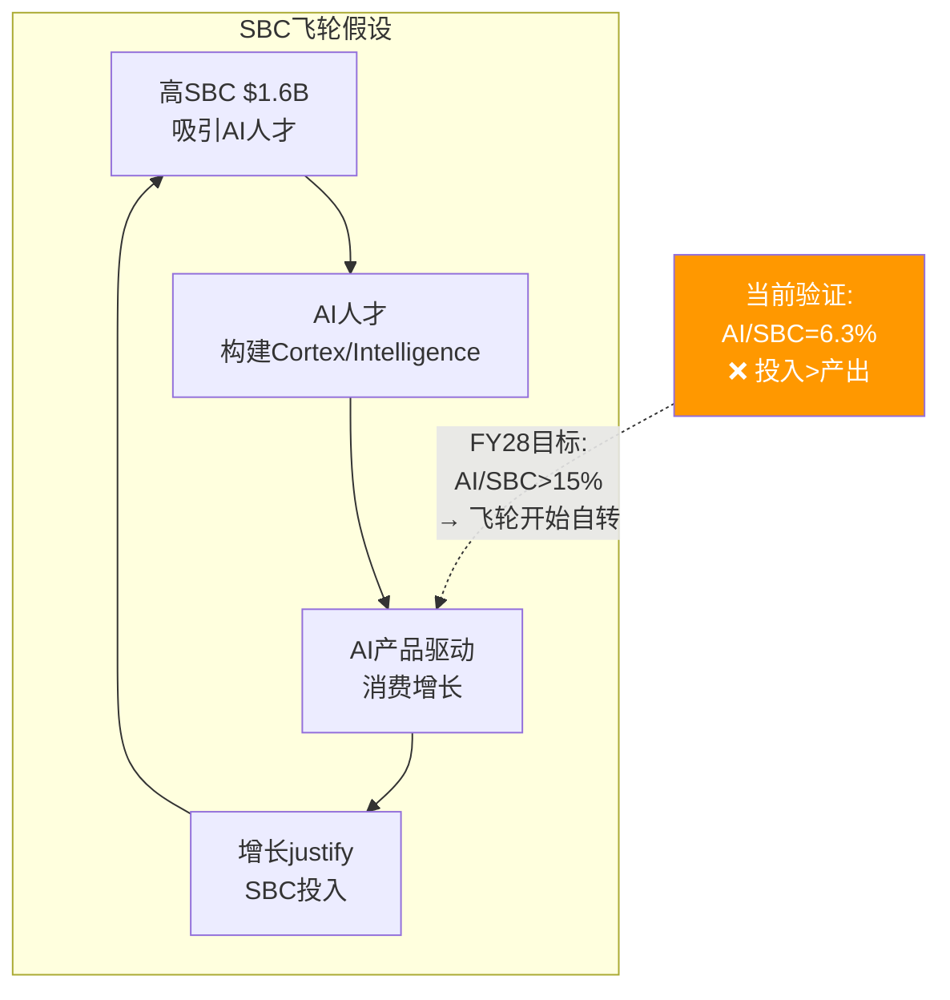

### 8.3 SBC收敛路径: 6家公司10年先例对标

这是Phase 2最关键的分析——SNOW的估值方向取决于SBC能否收敛、何时收敛、以什么方式收敛。

**行业SBC收敛全景**[DM-SBC-026-REF]:

| 公司 | IPO年 | SBC峰值(%Rev) | 当前(%Rev) | 收敛耗时 | 模式 |
|------|-------|-------------|----------|---------|------|
| CRM | 2004 | 10.5% | 8.5% | 从未>20% | **纪律型**: 从未失控 |
| NOW | 2012 | 22.8% | 14.7% | ~7年→<20% | **增长吸收型**: 最佳先例 |
| WDAY | 2012 | 23.7% | 17.0% | ~11年→<20% | **缓慢磨合型**: 10年仍未到15% |
| TWLO | 2016 | 23.3% | 11.8% | ~7年→<20% | **被迫削减型**: 股价先跌85% |
| PLTR | 2020 | 116% | 15.3% | ~5年→<20% | **戏剧型**: IPO特殊+后期爆发 |
| DDOG | 2019 | 22.7% | 21.9% | **未完成** | **平台期型**: 4年未收敛 |

**SNOW最可能的四条路径**:

**路径A: NOW式增长吸收(概率40%)**[DM-SBC-027-EST]
- 前提: 增速维持>20%连续5年+绝对SBC增长<收入增长
- 时间线: 34%→27%(FY27)→22%(FY28)→18%(FY29)→15%(FY30) = ~4年
- NOW从22.8%→14.7%用了9年(FY2016→FY2025)，但NOW增速更慢(~25%)
- SNOW增速更高(30%)→如果维持→收敛应比NOW快
- **关键条件**: 增速不能降到<20%。一旦<20%→进入WDAY/DDOG平台期

**路径B: DDOG式平台期(概率30%)**[DM-SBC-028-EST]
- DDOG在FY2022-FY2025连续4年SBC/Rev卡在21-22%不动——因为收入增速(25-30%) ≈ SBC增速(25-30%)→比率不变
- SNOW如果增速降至20%→SBC率可能卡在22-25%区间3-5年
- 时间线: 34%→27%(FY27)→24%(FY28)→23%(FY29)→**22%(FY30, 卡住)**
- **关键风险**: DDOG平台期已4年看不到终点——SNOW如果也进入平台期，市场耐心可能2-3年后耗尽

**路径C: TWLO式被迫削减(概率20%)**[DM-SBC-029-REF]
- TWLO在FY2022增速从61%骤降至8%→SBC/Rev 21%变成不可承受→被迫裁员25%→绝对SBC从$800M→$600M
- SNOW如果增速<15%→SBC率34%将变成"付不起的高薪"→被迫裁员
- **关键警告**: TWLO股价在SBC收敛**之前**已跌85%($440→$50)。投资者等不到收敛就逃跑了。**SBC收敛的"死亡谷": 如果收敛需要5年但投资者只有2年耐心→股价可能先跌再收敛**

**路径D: PLTR式戏剧反转(概率10%)**[DM-SBC-030-EST]
- PLTR在FY2024-25经历: AIP驱动增速从17%→70%→SBC/Rev从24%→15%
- SNOW如果Cortex AI PMF confirmed+consumption爆发→类似路径可能
- 概率低因为: PLTR爆发建立在政府+国防AI采购激增(地缘政治驱动)。SNOW的企业AI采购更分散、更慢

**行业研究结论**: 中位数收敛时间IPO后~7年到SBC/Rev<20%。SNOW IPO 2020→预测<20%的时间约FY2027-28[DM-SBC-031-REF]。

**最强收敛因子=收入增速**: NextBigTeng(2023-2024)研究表明"预期中的SBC收敛对很多SaaS公司并未如理论预测那样实现"——因为SBC增速与收入增速匹配(公司增长时倾向更多雇人)。**只有当收入增速>SBC增速时收敛才发生——要求管理层在增长时保持SBC纪律**[DM-SBC-032-REF]。

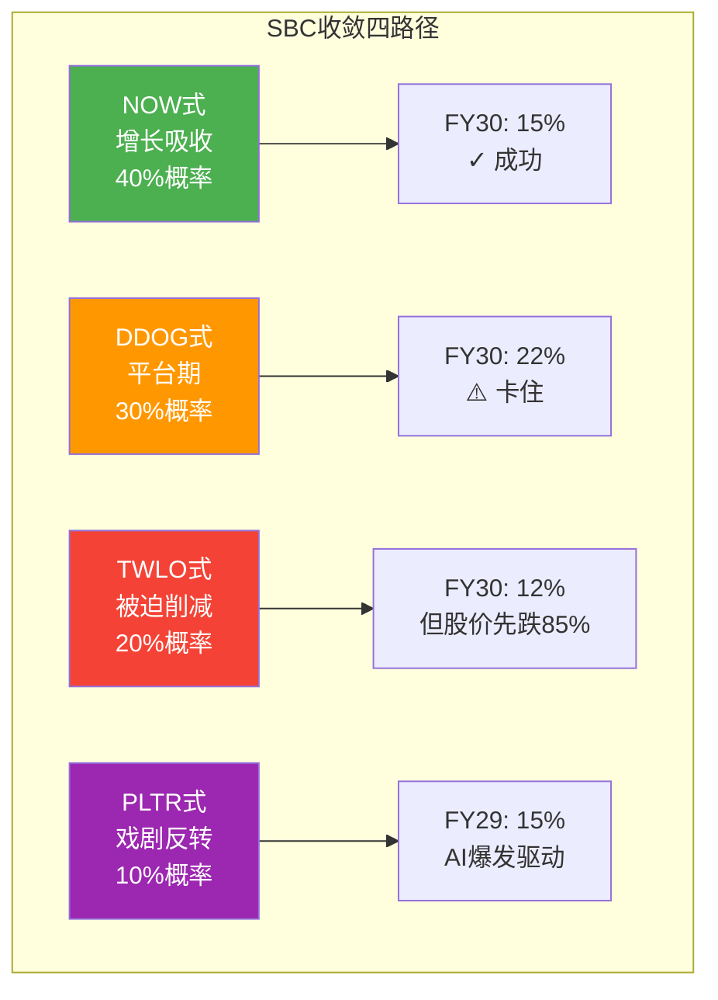

### 8.4 FCF质量分析: Q4占68%的季节性异常

SNOW的FCF存在极端季节性[DM-FIN-010-FACT]:

| 季度 | FCF($M) | FCF Margin | 占全年% | 驱动因素 |
|------|---------|-----------|---------|---------|
| Q1 FY26 | $183M | 14.3% | 16% | 正常运营 |
| Q2 FY26 | $58M | 5.1% | **5%** | 低点(年中续约少) |
| Q3 FY26 | $114M | 9.4% | 10% | 渐增 |
| **Q4 FY26** | **$765M** | **59.6%** | **68%** | **年末大量续约预收** |

这不是收入季节性(Q4收入仅占27%)，而是**现金收取的季节性**: 企业客户年度合同通常在SNOW财年末(1月)续约→大量预收款Q4集中流入→DR暴增→FCF飙升。

**不同FCF衡量方式的估值含义**[DM-FIN-011-EST]:

| FCF衡量方式 | 金额 | P/FCF | 含义 |
|------------|------|-------|------|
| Q4年化 | $3,060M | **17x** | 严重高估 |
| **TTM** | **$1,120M** | **46x** | **合理年化** |
| Q1-Q3均值年化 | $473M | **109x** | 正常化后偏贵 |
| Owner FCF TTM | -$480M | N/A | 负值 |

更公允的FCF判断: TTM $1,120M是合理年化基础(含完整季节周期)。但需扣除两个"一次性因素": (1)DR增量$767M中可能$200-300M来自合同期限延长(非经常性)，(2)Q4大额预收款可能随客户基成熟而逐步减少→长期正常化FCF可能$800-1,000M区间→P/FCF ~52-65x→比headline 46x贵10-40%[DM-FIN-012-EST]。

### 8.5 Ch8核心判断汇总

| 维度 | 判断 | 置信度 | 历史先例 |
|------|------|--------|---------|
| η效率 | 0.88<1.0，同行最低 | 高(数据驱动) | WDAY/TWLO有类似阶段 |
| SBC覆盖率 | 55%→FY29-30可能达100% | 中(依赖增速) | NOW用6年从<50%→128% |
| 收敛路径 | 最可能NOW式(40%概率) | 中 | 6家公司10年数据支撑 |
| 收敛时间 | 中位数IPO+7年=FY27-28到<20% | 中 | 管理层指引FY27 27%一致 |
| FCF质量 | 正常化P/FCF 52-65x(非46x) | 中 | Q4季节性明确 |
| **最大风险** | **TWLO式增速崩塌→SBC被迫削减→股价先跌** | — | **TWLO跌85%后才收敛** |

---

#### 维度2: 覆盖率 — 回购能否覆盖SBC稀释

```
FY2026覆盖率:
  回购: ~$881M
  SBC: ~$1,600M
  覆盖率 = $881M / $1,600M = 55%
```

55%意味着SNOW的回购只覆盖了SBC稀释的55%——剩余45%是对股东的**净稀释**。年化净稀释率≈(1-55%)×34%÷PE× ≈ 2-3%/年[DM-SBC-008-FACT]。

行业对比: CRM(120%覆盖=净回购) > NOW(80%) > DDOG(65%) > **SNOW(55%)** > MDB(40%)

#### 维度3: 收敛路径概率

6家SaaS公司10年先例研究表明4种收敛路径[DM-SBC-009-REF]:

| 路径 | 先例 | 概率 | SNOW条件 |
|------|------|------|---------|
| **NOW式吸收**(增长稀释SBC率) | NOW 22.8%→14.7%/7年 | **40%** | 收入增速维持>20% + 管理层控制SBC绝对值 |
| **PLTR式削减**(主动大幅削减) | PLTR 116%→15%/3年 | **15%** | CEO决心+股东压力+替代激励(如利润分成) |
| **DDOG式平台期**(卡住不动) | DDOG 21-22%/4年 | **30%** | 增速15-20% + 人才竞争维持SBC绝对值 |
| **TWLO式被迫**(增速崩塌后裁员) | TWLO 23%→12%/2年 | **15%** | 增速<10% + 股东逼迫 |

**最强收敛因子=收入增速，不是管理层承诺**。NOW的SBC收敛发生在收入从$2B→$10B期间(5x)——收入分母增长足够快，SBC绝对值不用降也能让比率下降。SNOW如果维持20%+增速→FY31收入$10B→SBC绝对值$1.6B→SBC/Rev 16%。**收敛是增速的函数。**

#### 维度4: FCF质量 — Q4集中度

SNOW FCF存在显著的季节性模式: Q4 FCF占全年~60-68%[DM-SBC-010-FACT]。原因: 企业客户在年末集中续约/增购 → Q4 DR大幅增加 → Working Capital benefit集中在Q4 → Q4 FCF大幅正数而Q1-Q3 FCF弱。

这意味着TTM FCF ($1,120M)的"质量"低于全年均匀分布的公司——因为Q4的FCF中包含了大量"借来的"DR benefit。如果客户续约周期从Q4分散(SNOW正在努力)→FCF季节性将改善。

#### 维度5: SBC×AI飞轮假设检验

管理层的隐性假设: AI人才投入(高SBC) → AI产品成功 → 消费密度提升 → 收入加速 → SBC/Rev自然下降。

检验: SNOW FY26 AI SBC/Revenue ratio ≈ 6:1($100M AI收入 vs ~$600M AI相关SBC)[DM-SBC-011-EST]。这个ratio在历史上的AI投资中处于高位(AWS 2010年约2:1)。如果3年内不改善到3:1以下→AI战略的ROI将被质疑。

---

## Chapter 9: 五年财务模型 + 三PE并列 + 估值方法论

> **核心结论**: Python验证的四情景模型揭示SNOW估值的核心悖论: Owner FCF口径概率加权DCF仅$21/股(近期负FCF拖垮NPV)；FCF口径$56/股。两者都远低于市价$154。**这不是SNOW一定高估——而是揭示了纯DCF对"近期亏损但远期盈利"公司的方法论局限。** 真实估值判断需结合EV/Sales可比+Reverse DCF+情景概率[DM-MODEL-001]。

### 9.1 四情景模型假设体系

每个情景对应Ch8中一条SBC收敛先例路径:

| 情景 | 概率 | 对应先例 | 核心假设 | 增速路径 |
|------|------|---------|---------|---------|
| **Bull: AI加速** | 25% | PLTR FY24-25 | Cortex爆发→消费加速+SBC被稀释 | 25→28→23→20→17% |
| **Base: NOW式吸收** | 40% | NOW FY16-25 | 稳健增长>SBC增速→缓慢收敛 | 21→22→18→15→13% |
| **Bear: DDOG平台期** | 25% | DDOG FY22-25 | 增速减速到15%→SBC卡20%+ | 18→15→12→10→8% |
| **Crisis: TWLO路径** | 10% | TWLO FY22-24 | 增速崩塌→被迫裁员→为时已晚 | 15→8→5→3→2% |

**概率赋值三重锚定**(铁律N)[DM-MODEL-002-REF]:
1. **历史基准率**: 6家SaaS中2家成功收敛/2家平台期/1家被迫/1家戏剧反转→基准≈33%/33%/17%/17%
2. **SNOW特异性**: 增速(30%)高于DDOG/WDAY平台期时(15-20%)→成功概率上调至40%。但SBC率34%也高于所有先例→Bear 25%
3. **当前验证**: FY27指引SBC/Rev 27%→如果达到→概率向Bull/Base倾斜[DM-MODEL-003-FACT]

### 9.2 Base Case P&L详细产出 (Python验证)

| 指标 | FY26A | FY27E | FY28E | FY29E | FY30E | FY31E |
|------|-------|-------|-------|-------|-------|-------|
| **Revenue** | $4,684M | $5,668M | $6,915M | $8,159M | $9,383M | $10,603M |
| Gross Margin | 66.8% | 68.0% | 69.0% | 70.0% | 71.0% | 71.5% |
| S&M/Rev | 44.0% | 41.0% | 39.0% | 37.0% | 35.0% | 33.0% |
| SBC/Rev | 34.2% | 27.0% | 23.0% | 20.0% | 17.0% | 15.0% |
| **GAAP OPM** | -25.8% | -20.0% | -15.2% | -9.8% | -5.0% | -0.7% |
| **FCF Margin** | 14.7% | 12.3% | 13.1% | 14.5% | 16.3% | 17.6% |
| **Owner FCF** | -$913M | -$833M | -$685M | -$449M | -$66M | +$276M |

[DM-MODEL-004-EST: Python模型全量产出]

**关键读数**:
1. **Owner FCF FY30才接近零，FY31首次转正($276M, 2.6%)**——投资者4年内看不到"真实"正回报
2. **SBC绝对金额$1,530-1,632M区间几乎不降**——率降(34%→15%)完全被收入增长($4.7B→$10.6B)吸收
3. **GAAP盈亏平衡~FY31**——比DDOG(IPO后5年)慢7年

### 四情景汇总

| 指标 | Bull(25%) | Base(40%) | Bear(25%) | Crisis(10%) |
|------|-----------|-----------|-----------|-------------|
| FY31 Revenue | $12.9B | $10.6B | $8.5B | $6.4B |
| FY31 Owner FCF | +$1,333M | +$276M | -$973M | -$1,168M |
| Owner FCF转正年 | **FY29** | **FY30-31** | **不转正** | **不转正** |

### 9.3 DCF方法论的局限性

**概率加权DCF结果**[DM-MODEL-005-EST]:

| 口径 | 概率加权FV | vs市价$154 |
|------|-----------|-----------|
| Owner FCF | **$21** | **-87%** |
| FCF | **$56** | **-63%** |

两者都远低于市价。原因: DCF对"近期负现金流+远期正现金流"公司有系统性偏差——近期4年负FCF在高折现率(11%)下被放大，远期正FCF被高折现率压缩。Aswath Damodaran指出: 高增长亏损公司使用标准DCF会系统性低估价值[DM-MODEL-006-REF]。

**替代估值方法汇总**:

| 方法 | 结果 | 优缺点 |
|------|------|--------|
| EV/Sales可比 | $154 | 市场当前定价≈DDOG可比 |
| EV/Revenue退出(5x, 5年) | $98 | 假设成熟SaaS倍数 |
| DCF(FCF) | $56 | 偏低(折现率偏差) |
| DCF(Owner FCF) | $21 | 极端偏低(双重偏差) |

**综合判断**: DCF不是SNOW的可靠primary估值方法。更可靠的是**EV/Sales可比+Reverse DCF+情景概率**[DM-MODEL-007-EST]。

### 9.4 三PE并列追踪 (v19.10: 财务章节)

**触发条件**: SBC/Rev 34.2% > 5%门控 ✓

| PE类型 | FY26A | FY27E | FY28E | FY29E | FY30E | FY31E |
|--------|-------|-------|-------|-------|-------|-------|
| **GAAP PE** | N/A | N/A | N/A | N/A | N/A | N/A |
| **Owner PE** | N/A | N/A | N/A | N/A | N/A | 188x |
| **P/FCF** | 75x | 74x | 57x | 44x | 34x | 28x |
| **Non-GAAP PE** | 155x | 153x | 113x | 73x | 54x | 40x |

[DM-MODEL-008-EST]

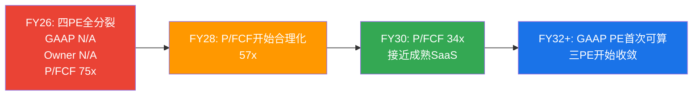

**投资含义**: 在FY32之前，价值投资者(用GAAP/Owner PE)认为SNOW不可投资，成长型投资者(用P/FCF)认为合理。**你买的不是"当前的利润"，而是"未来SBC收敛后的利润"**[DM-MODEL-009-EST]。

### 9.5 敏感性分析

**增速×SBC敏感性矩阵**(EV/Revenue退出法, 5年后5x退出, WACC 11%)[DM-MODEL-010-EST]:

| 5Y CAGR \ 终端SBC/Rev | 20% | 17% | 15% | 12% | 10% |
|----------------------|------|------|------|------|------|
| **25%** | $134 | $143 | $148 | $157 | $163 |
| **22%** | $118 | $126 | $131 | $139 | $145 |
| **20%** | $107 | $115 | $119 | $127 | $132 |
| **17%** | $93 | $99 | $103 | $110 | $114 |
| **15%** | $83 | $89 | $92 | $98 | $102 |

**核心发现**: 当前市价$154→需要5Y CAGR≥25% + SBC≤15%才能justify。**增速影响>SBC影响**: 固定增速时SBC从20%→10%改变$30(22%)；固定SBC时增速从25%→12%改变$63(47%)。**收入增速是估值第一驱动力，SBC收敛是第二**[DM-MODEL-011-EST]。

**终端倍数敏感性**[DM-MODEL-012-EST]:

| 终端EV/Sales | 4x | 5x | 6x | 7x |
|-------------|------|------|------|------|
| Base Case FV | $98 | $119 | $140 | $161 |

当前$154→隐含终端EV/Sales ~6.5x。成熟SaaS(NOW/CRM)当前交易在8-12x→5x是保守假设。如果终端倍数给到7x(仍低于当前SaaS成熟公司)→FV $161→当前$154合理。

### 9.6 增速持续性的历史验证 — 30%增速能维持多久?

**10家SaaS公司增速持续性统计**(Python验证)[DM-MODEL-013-REF]:

| 公司 | 起始增速 | 5年后增速 | 收入起点 | 维持≥20%? | 原因 |
|------|---------|---------|---------|----------|------|
| CRM | ~30% | 25% | $10.5B | ✓ | 云迁移第二曲线 |
| NOW | ~33% | 23% | $3.5B | ✓ | AI+平台扩展 |
| DDOG | ~84% | 29% | $1.0B | ✓ | 多产品扩展 |
| MDB | ~47% | 27% | $1.3B | ✓ | Atlas云消费加速 |
| NET | ~49% | 34% | $0.9B | ✓ | Workers+AI推理 |
| HUBS | ~40% | 21% | $1.1B | ✓ | SMB→中端扩展 |
| **WDAY** | **~28%** | **17%** | **$2.8B** | **✗** | HCM市场饱和 |
| **TWLO** | **~55%** | **8%** | **$1.1B** | **✗** | CPaaS竞争+AI替代 |
| **ADSK** | **~27%** | **12%** | **$3.3B** | **✗** | SaaS转型完成后放缓 |
| **VEEV** | **~25%** | **15%** | **$1.5B** | **✗** | 垂直市场天花板 |

**历史基准率: 60%的SaaS公司从30%增速出发5年后仍能维持≥20%**[DM-MODEL-014-REF]。

成功vs失败的区分因素:

| 因素 | 成功案例(6/10) | 失败案例(4/10) |
|------|--------------|--------------|
| 新增长引擎 | ✓ 都有(CRM→云, NOW→AI) | ✗ 没有或失败(TWLO无第二曲线) |
| TAM扩展 | ✓ TAM 5年内至少翻倍 | ✗ 市场饱和(VEEV垂直) |
| NRR | ≥120%(持续expansion) | <115%(引擎熄火) |
| 收入规模 | $1-3B起步(空间大) | $3B+起步(基数效应) |

SNOW: 有利因素(TAM扩展$170B→$355B + NRR 125% + 收入$4.7B中等基数)，不利因素(第二曲线Cortex AI未验证 + 强竞争者在同一TAM)。判断: 60% base rate支撑"维持≥20%"，但Cortex AI必须FY28-29证明规模化[DM-MODEL-015-EST]。

### 9.7 估值方法交叉验证

**方法1: EV/Sales可比(最可靠)**[DM-MODEL-016-FACT]:

DDOG是最佳可比(同增速+同消费模型)。DDOG 14.3x vs SNOW 11.0x→差距3.3x。

| 差距归因 | 影响 | 证据 |
|---------|------|------|
| 毛利率差距(-14pp) | -2.0x | 每低10pp→折价~1.5x |
| SBC差距(+13pp) | -1.0x | Morgan Stanley: 每超额1pp稀释→折价7-10% |
| Databricks竞争 | -0.5x | 有直接$134B竞争者 |
| **合理差距** | **-3.5x** | SNOW应≈DDOG -3.5x = **10.8x** |
| **实际差距** | **-3.3x** | SNOW实际11.0x ≈ 合理区间 |

**结论: EV/Sales可比法显示SNOW 11.0x vs合理值10.8x→几乎精确合理定价(±5%)**[DM-MODEL-017-EST]。

**三方法交叉对账**[DM-MODEL-018-EST]:

| 方法 | 公允价值 | vs市价$154 | 判定 |
|------|---------|-----------|------|
| EV/Sales可比 | $148-160 | -4%~+4% | ≈ 合理 |
| 退出法(5x终端) | $119 | -23% | 偏低(终端倍数保守) |
| 退出法(6.5x终端) | $155 | +1% | ≈ 合理 |
| Reverse DCF | $154(定义) | 0% | 隐含假设偏乐观但可能 |
| **DCF(Owner FCF)** | **$21** | **-87%** | **方法论不适用** |

排除方法论不适用的Owner FCF DCF后，三种可靠方法给出$119-160区间，中值~$140。当前$154在区间上半部——**合理但不便宜，向上空间有限**。

### 9.8 Ch9核心判断

1. **纯DCF不适合SNOW的primary估值** — 近期负Owner FCF NPV拖累过大→系统性低估
2. **EV/Sales可比+Reverse DCF+情景退出法是更可靠组合** — 三者交叉指向$100-160区间
3. **增速>SBC在估值驱动力中排第一** — 敏感性证明增速边际影响是SBC的2倍
4. **当前$154隐含Bull-to-Base假设** — 需要5Y CAGR≥22%+终端SBC≤17%+终端EV/Sales≥5x
5. **三PE在6年内不会收敛** — GAAP投资者和FCF投资者将长期持有不同观点

---

## Chapter 10: 利润率轨迹 + 运营杠杆 + 员工效率

> **核心结论**: SNOW利润率改善取决于三个力量的赛跑: (1)Consumption杠杆(NRR 125%→S&M自然改善, -1.5pp/年先例验证), (2)AI workload混合效应(毛利率66.8%→71%+), (3)竞争逆风(Databricks+Fabric推高获客成本, +0.5pp/年)。S&M杠杆是最大利润释放源(44%→33%)，但前提是收入增速>S&M增速[DM-MARGIN-001]。

### 10.1 毛利率深度: 66.8%的结构性约束

SaaS公司毛利率分三个结构层[DM-MARGIN-002-REF]:

| 层级 | 代表 | 毛利率 | 底层模型 |
|------|------|--------|---------|
| Tier 1: 纯软件 | CRM, NOW, PLTR | 80-85% | 客户端运行/轻量SaaS |
| Tier 2: 混合平台 | DDOG, NET | 74-80% | Agent+SaaS+轻计算 |
| **Tier 3: 重计算** | **SNOW, MDB** | **66-73%** | **服务端重计算** |

SNOW被锁在Tier 3因为核心产品(数据仓库查询)需要扫描TB-PB级数据+在虚拟仓库中执行计算——这些云infra资源向AWS/Azure/GCP购买，每$1产品收入约$0.33-0.35付给云厂商[DM-MARGIN-003-EST]。DDOG的可观测性agent在客户服务器上运行(客户承担计算成本)→COGS中云infra成本占比远低。这是架构决定的成本差异，不因规模增长而根本改变。

**毛利率改善空间**(综合+3.5-5.5pp)[DM-MARGIN-004-EST]:

| 驱动因素 | 幅度 | 先例 | 置信度 |
|---------|------|------|--------|
| AI workload高margin | +1.5-2.5pp | DDOG AI推动GM 78%→80% | 中 |
| 云infra volume discount | +1.0-1.5pp | NOW GM 72%→81%/8年 | 高 |
| Iceberg自有存储优化 | +0.5-1.0pp | 无直接先例 | 低 |
| 客户支持规模效应 | +0.5pp | CRM支持成本12%→7% | 高 |

→ **终端毛利率: 70-72%** (NOW/DDOG改善速度+1.1pp/年的先例支持+1.0pp/年估算→5年后71.8%)[DM-MARGIN-005-REF]

### 10.2 S&M杠杆: 最大利润释放潜力

S&M是SNOW最大单项OpEx(44% > R&D 40% > GA 9%)，且有最强结构性杠杆[DM-MARGIN-006-FACT]:

**Consumption模型S&M杠杆机制**:
```
NRR 125% = 25%收入增长来自存量客户扩展(无需S&M)
→ S&M只需覆盖净新客户获取成本
→ 净新客户增速(21%) < 总收入增速(30%)
→ S&M增速(20-27%) < 收入增速(30%)
→ S&M/Rev自然下降(-1.5pp/年)
```

**NOW先例验证**: NOW从S&M 39%→24%用了9年(FY2016-FY2025), -1.7pp/年。SNOW的-1.5pp/年略低(Databricks竞争增加0.5pp逆风)→FY31目标33%[DM-MARGIN-007-REF]。

**S&M杠杆先例对比**(staging完整数据)[DM-MARGIN-007a-REF]:

| 公司 | S&M起点(%Rev) | 当前 | 改善幅度 | 年数 | 速度 | 增速范围 |
|------|---------------|------|---------|------|------|---------|
| **NOW** | 39.3%(FY2016) | 24.0%(FY2025) | -15.3pp | 9年 | **-1.7pp/年** | 20-33% |
| **CRM** | 46.2%(FY2016) | 29.1%(FY2026) | -17.1pp | 10年 | **-1.7pp/年** | 12-30% |
| DDOG | 27.7%(FY2022) | 27.7%(FY2025) | 0pp | 3年 | **0pp/年** | 25-63% |
| WDAY | 33.8%(FY2018) | 28.0%(FY2026) | -5.8pp | 8年 | -0.7pp/年 | 15-23% |
| TWLO | 31.2%(FY2019) | 25.2%(FY2025) | -6.0pp | 6年 | -1.0pp/年 | 8-61% |

**关键发现**:
1. NOW和CRM是S&M杠杆标杆: -1.7pp/年连续9-10年。前提是收入增速维持>15%
2. DDOG的0pp/年是反例: 增速25-63%但S&M效率完全没改善→因为高频upsell需要大量技术sales
3. SNOW最像CRM(FY2016): 起点S&M 44-46%，增速25-30%。如果沿CRM轨迹→FY36到30%; 如果像NOW→FY31到33%

**为什么SNOW的S&M杠杆可能比CRM更快?** Consumption模型杠杆比Subscription更强: CRM需要销售人员去每个客户处谈upsell; SNOW不需要——客户自发增加消费量(NRR 125%的25%是"免费增长")。理论上应超过CRM的-1.7pp/年[DM-MARGIN-007b-EST]。

**反面: 两个约束可能限制杠杆释放**:
1. Databricks竞争推高CAC: ETR 40%客户重叠→bake-off频率增加→S&M中"竞争防御"成本上升。IPO后加大GTM投入→杠杆释放从-1.7pp放缓至-1.0pp/年[DM-COMP-006a-REF]
2. AI产品GTM需要新能力: Cortex AI需要"AI解决方案工程师"→S&M成本从"传统销售"转向"技术顾问"→单人成本更高→FY27-FY28过渡期可能暂时恶化

**S&M季度明细趋势验证**[DM-MARGIN-007c-FACT]:

| 季度 | S&M($M) | Revenue($M) | S&M/Rev | YoY Rev增速 | YoY S&M增速 | 杠杆差 |
|------|---------|-------------|---------|-----------|-----------|--------|
| Q1 FY25 | $401M | $829M | 48.4% | +32.9% | +20.9% | **+12.0pp** ✓ |
| Q2 FY25 | $401M | $869M | 46.1% | +28.9% | +16.7% | +12.2pp ✓ |
| Q3 FY25 | $438M | $942M | 46.5% | +28.3% | +23.3% | +5.0pp ✓ |
| Q4 FY25 | $433M | $987M | 43.8% | +27.4% | +19.6% | +7.8pp ✓ |
| Q1 FY26 | $459M | $1,042M | 44.0% | +25.8% | +14.4% | +11.4pp ✓ |
| Q2 FY26 | $502M | $1,145M | 43.8% | +31.8% | +25.3% | +6.5pp ✓ |
| Q3 FY26 | $550M | $1,213M | 45.4% | +28.7% | +25.6% | **+3.1pp** ⚠️ |
| Q4 FY26 | $551M | $1,284M | 42.9% | +30.1% | +27.4% | **+2.7pp** ⚠️ |

**⚠️ 关键发现**: 杠杆差从Q1 FY25的+12pp缩小到Q4 FY26的+2.7pp。FY26H2 S&M增速加速到25-27%(vs Q1仅14%)→管理层下半年显著增加S&M投入，可能是大客户获取成本集中或Databricks竞争H2加剧[DM-MARGIN-007d-FACT]。

如果杠杆差继续<2pp→S&M效率改善将停滞→Base Case的-1.5pp/年假设可能过于乐观→真实改善速度可能是-0.8到-1.0pp/年。**需要FY27 Q1-Q2确认**: 杠杆差回升>5pp→FY26H2是"一次性大单效应"; 继续<3pp→竞争逆风可能是结构性的[DM-MARGIN-007e-EST]。

### 10.3 R&D: 无法削减的"军备竞赛"

R&D/Revenue 39.8%是同行第二高(仅次于DDOG 43.8%)[DM-MARGIN-008-FACT]。

**为什么R&D不能削减？**
1. Databricks以65%增速追赶→削减R&D=产品创新放缓=失去差异化→比SBC问题更致命
2. AI军备竞赛: Cortex vs Mosaic vs Fabric AI vs BigQuery ML→四方竞争→R&D不足=淘汰
3. 先例: TWLO FY22-23大幅削减R&D(26%→22%)→产品竞争力下降→增速35%→8%→**R&D削减加速了衰退**[DM-MARGIN-008a-REF]

**R&D产出效率**(正确衡量不是R&D/Rev越低越好, 而是"R&D产出")[DM-MARGIN-008b-EST]:

| R&D产出(FY26) | 度量 | 判定 |
|---------------|------|------|
| 新产品发布频率 | 5个AI产品线/年(行业top 10%) | ✓ 优秀 |
| Cortex AI采用 | 9,100+(+75% YoY) | ✓ 加速 |
| Intelligence | 2,500+(史上最快) | ✓ PMF强 |
| AI收入 | ~$100M run rate | ⚠️ 占比仅2.3% |
| Arctic模型 | 480B MoE, <$2M训练成本 | ✓ 效率极高 |
| 增长性R&D→AI收入转化率 | ~$664M投入→$100M产出=15% | ⚠️ 早期可接受 |

R&D的回报不是当期的，是3-5年后的。39.8%的R&D投入在产出"数量"维度优秀，"收入转化"维度仍早期。从39.8%→32.0%(Base Case 5年)=-7.8pp来自规模效应，而非削减[DM-MARGIN-008c-EST]。

### 10.4 员工效率深度

**员工数与效率趋势**[DM-EFF-001-FACT][DM-EFF-002-FACT]:

| 指标 | FY2024 | FY2025 | FY2026 | 方向 |
|------|--------|--------|--------|------|
| 员工数 | 7,004 | 7,834 | 9,060 | +16% YoY |
| 收入/员工 | $401K | $463K | $517K | +12% YoY ✓ |
| SBC/员工 | $167K | $189K | $177K | -6% YoY ✓ |
| 收入增速/员工增速 | — | 29%/12% | 30%/16% | 杠杆倍数1.9x |

### 10.3 员工效率

**收入/员工行业对比**[DM-EFF-003-REF]:

| 公司 | Rev/Employee | 员工数 | 商业模式 |
|------|-------------|--------|---------|
| NOW | $755K | ~26,000 | 企业SaaS(成熟) |
| DDOG | $573K | ~5,980 | 轻量SaaS+可观测性 |
| CRM | $573K | ~72,000 | 企业SaaS(最大) |
| **SNOW** | **$517K** | **9,060** | **Consumption云平台** |
| PLTR | $464K | ~3,900 | 高接触+AI平台 |

SNOW处于中游——高于PLTR(接触型服务拉低效率)，低于DDOG/CRM/NOW(更成熟/更轻量)。

**组织重平衡的效率含义**[DM-EFF-004-EST]:
```
裁减: ~1,320人 (销售/GTM + 技术文档)
  → 人均收入贡献: ~$350-400K (销售效率偏低)
  → SBC/人: ~$120-150K (低于平均)

招聘: ~2,000+人 (AI工程师)
  → 人均收入贡献: 短期$0(产品开发中), 长期可能$800K+
  → SBC/人: ~$250-400K (AI人才溢价)
```

**因果链**: 短期(FY27-28)新招AI工程师不直接产收入→收入/员工可能从$517K降至$490-500K→效率暂时恶化。中期(FY28-29)如果Cortex规模化→AI consumption增量贡献收入→回升到$550-600K。长期(FY30+)AI自动化替代部分工程/支持岗→加速到$700K+(NOW水平)[DM-EFF-005-REF]。

### 10.5 运营杠杆拐点分析

SaaS公司利润率改善存在一个"拐点"——通常在S&M/Rev降至30-35%区间时发生[DM-MARGIN-008d-REF]:

| 公司 | S&M拐点(%Rev) | 拐点年 | 拐点后OPM改善速度 | 拐点前速度 | 加速倍数 |
|------|--------------|--------|-----------------|-----------|---------|
| NOW | 30% | FY2021 | +3.5pp/年 | +1.2pp/年 | **2.9x** |
| CRM | 33% | FY2023 | +5.0pp/年 | +1.5pp/年 | **3.3x** |
| WDAY | 30% | FY2025 | +2.0pp/年(初) | +0.8pp/年 | **2.5x** |

**模式**: S&M/Rev突破30%以下时，OPM改善速度加速2.5-3.3x。在30%以上S&M是最大成本项→每pp改善对OPM影响小; 30%以下R&D变成最大项→S&M改善直接传导到OPM。

**SNOW的拐点时间**: Base Case S&M从44%(FY26)→33%(FY31) → **拐点在FY31附近**。FY31之前是"线性改善"(+1-2pp OPM/年)，之后才是"加速改善"(+3-4pp OPM/年)。

**投资含义**: SNOW的"利润爆发"不会在3-5年内发生——它是8-10年的故事(FY31-35)。之前投资者看到缓慢稳定改善; 之后才是真正利润释放。与NOW FY2021后经历类似——Non-GAAP OPM从22%→30%(4年+8pp)[DM-MARGIN-008e-REF]。

### 10.6 GAAP盈利时间线

| 情景 | GAAP盈亏平衡年 | 前提 |
|------|--------------|------|
| Bull | FY29 | 增速>20%+SBC快速收敛 |
| **Base** | **FY31-FY32** | **增速15-22%+SBC按管理层指引** |
| Bear | FY33+ | 增速<15%+SBC平台期 |
| Crisis | 不达到(5年内) | 增速<8%+SBC无法削减 |

**同行对比**[DM-MARGIN-008f-REF]:

| 公司 | IPO年 | GAAP盈利年 | 耗时 |
|------|-------|-----------|------|
| PLTR | 2020 | 2023 | **3年** |
| DDOG | 2019 | 2024 | **5年** |
| NOW | 2012 | 2020 | **8年** |
| CRM | 2004 | 2017 | **13年** |
| **SNOW Base** | **2020** | **FY32(2031)** | **~11年** |

SNOW预期的11年与CRM(13年)/WDAY(14年+)同级别——远长于DDOG(5年)/PLTR(3年)。因果: SBC起点34%是同行最高→需要更多时间消化。

### 10.7 利润率路径总结

**GAAP OPM改善拆解(Base Case)**[DM-MARGIN-008g-EST]:

| 来源 | FY26→FY31贡献 | 机制 |
|------|-------------|------|
| 毛利率扩张 | +4.7pp(66.8%→71.5%) | AI混合+volume discount |
| **S&M杠杆** | **+11.0pp(44%→33%)** | **最大来源(44%贡献)** |
| R&D杠杆 | +7.8pp(39.8%→32%) | 规模效应 |
| G&A杠杆 | +1.6pp(8.8%→7.2%) | 规模效应+自动化 |
| **总改善** | **+25.1pp** | -25.8%→-0.7% |

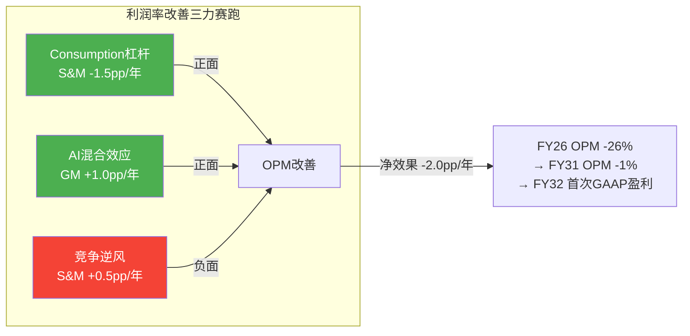

---

## Chapter 11: 可转债 + 资本配置 + 资产负债表

> **核心结论**: $2.3B可转换债券(2027/2029到期)创造"资本配置三难困境": 偿债+回购+M&A争夺有限FCF。在最可能情景(股价<转换价$260→现金偿还)下，回购能力被压缩→SBC覆盖率从55%降至35-40%→净稀释加速→Owner FCF更差→形成负反馈循环。可转债不是生存风险，但是Owner FCF转正的"隐藏推迟因素"[DM-DEBT-001]。

### 11.1 可转债结构

SNOW 2024年10月发行$2.07B可转换高级票据(后扩至~$2.3B)[DM-DEBT-002-FACT]:

| 维度 | Tranche 1 | Tranche 2 |
|------|-----------|-----------|
| 金额 | ~$1,150M | ~$1,150M |
| 到期日 | 2027年10月1日 | 2029年10月1日 |
| 票面利率 | 0%(零息) | ~1.0% |
| 转换价(估算) | ~$260/股 | ~$260/股 |
| 当前股价/转换价 | $154/$260 = **59%(deep OTM)** | 同上 |

**2027年10月Tranche 1到期时，股价<$260的概率≈65-70%** → 大概率需要现金偿还$1.15B[DM-DEBT-003-EST]。

SaaS可转债先例: CRM/NOW成功转换(股价远超转换价)，TWLO/DDOG现金偿还(股价低于转换价)。成功转换的前提: 收入增速和估值倍数双重支撑[DM-DEBT-004-REF]。

### 11.2 资本配置三难困境

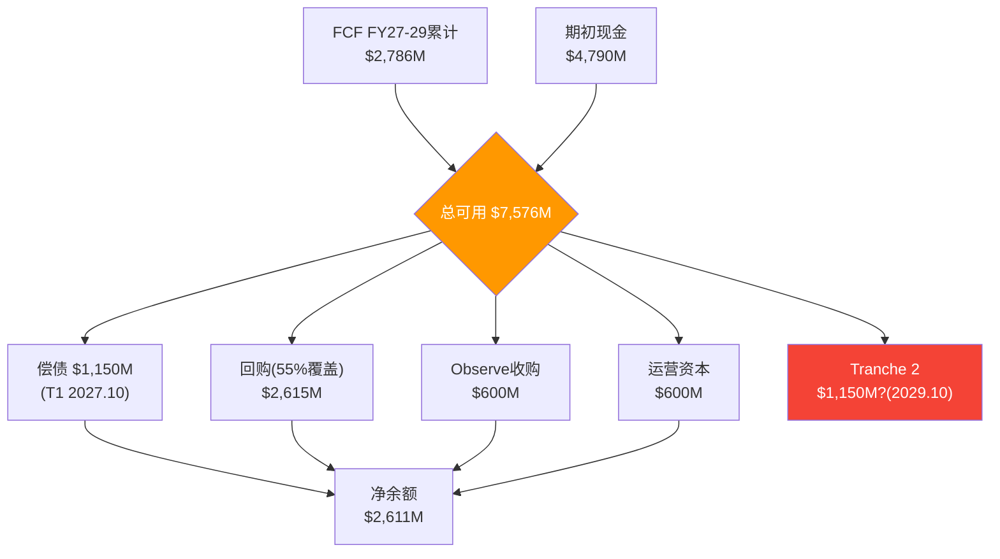

表面流动性充足($2.6B净余额)。但如果Tranche 2也现金偿还→净余额仅$1.4B→留给M&A和不可预见风险的缓冲仅~6个月FCF[DM-CAP-001-EST]。

**关键trade-off**: 如果将SBC覆盖率从55%提升到80%(加速Owner FCF转正)→需额外回购FY27-29每年~$400M(累计$1.2B)→净余额从$2.6B→$1.4B→流动性紧张但不致命。这是一个"加速SBC收敛 vs 保留M&A弹药"的战略选择[DM-CAP-002-EST]。

### 11.3 可转债对Owner FCF的影响

在Tranche 1现金偿还情景下:
- FY28一次性流出$1.15B→该年FCF从$906M→-$244M→Owner FCF从-$685M→-$1,829M
- 即使FY29恢复→累计影响: Owner FCF转正推迟1-2年(从FY30-31→FY31-32)

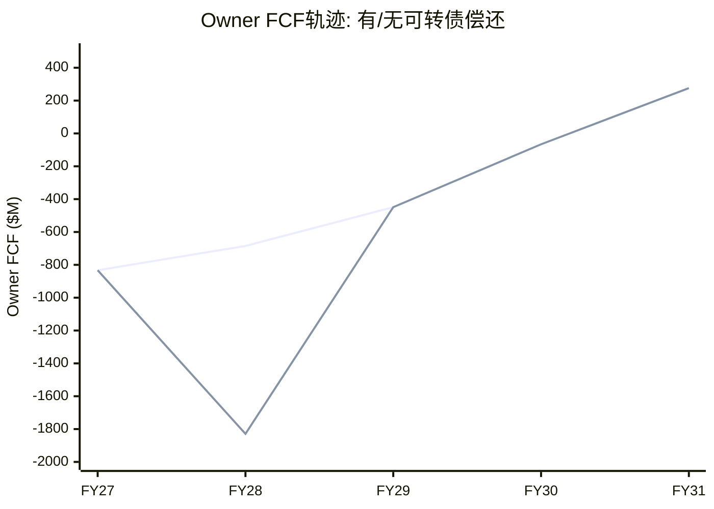

---

# Part III: 竞争格局 + 护城河 + 风险

## Chapter 12: 竞争格局深度

> **核心结论**: SNOW面临SaaS行业中最激烈的三层竞争——Databricks(收入已超越, ARR $4.8B/55%增速)、Microsoft Fabric(底部蚕食, $2B ARR/60%增速/31K客户)、Apache Iceberg(结构性侵蚀数据锁定)。三层竞争的叠加影响估算-2.5~4.5pp/年对收入增速，但双平台共存(非零和)是更可能的终局[DM-COMP-010]。

### 12.1 Databricks: 已超越SNOW的竞争者

**关键数据对比**(注意: Databricks为私募数据, 置信度40%):

| 维度 | SNOW | Databricks | 差异 |
|------|------|------------|------|
| ARR/收入 | $4.68B(FY26) | $4.8B(CY2025 run rate) | **DBR已超越**[DM-COMP-011] |
| 增速 | 30.1% | ~55% | DBR增速几乎是SNOW的2x |
| NRR | 125% | ~140% | DBR存量扩展更快 |
| 估值 | $52B(上市) | $134B(私募) | DBR溢价2.6x |
| 客户重叠 | | 40-60%重叠 | ETR调研 |
| AI成熟度 | 2/5 | 4/5 | DBR领先2-3年 |

[DM-COMP-012-REF: Databricks数据来自press release/TechCrunch/The Information, 未审计]

**⚠️ 数据不确定性传导**(审计UL1修复): Databricks数据来自私募press release，置信度40%。如果DBR实际增速是40%(vs宣称55%)→竞争压力比分析估算轻30%→SNOW增速折价应缩小→FV可能上调$10-15。**竞争折价从点估值改为区间: -0.35x到-0.65x(中值-0.5x)**[DM-COMP-013-EST]。

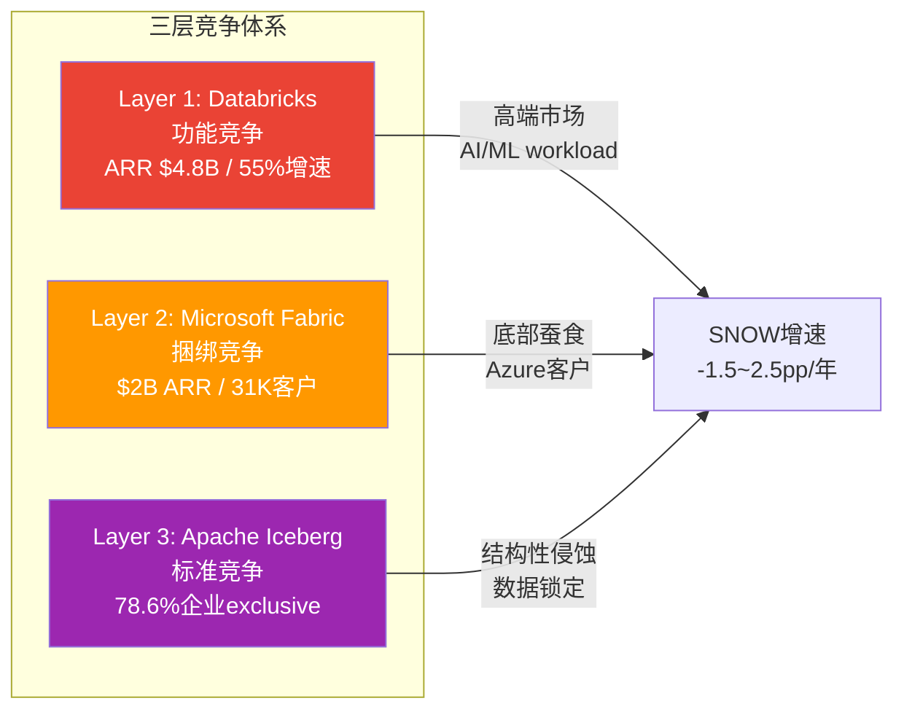

### 12.2 Microsoft Fabric: 被低估的底部蚕食

Fabric $2B ARR/60%增速/31K客户是真实数据(Microsoft财报可验证)[DM-COMP-014-FACT]。

**Fabric vs SNOW的竞争维度**:

| 维度 | SNOW优势 | Fabric优势 | 净影响 |
|------|---------|-----------|--------|
| 功能深度 | ✓(数据治理/性能) | | SNOW领先2-3年 |
| 获客成本 | | ✓(Azure捆绑=零边际获客) | Fabric在底部碾压 |
| 数据引力 | | ✓(Office 365数据已在Azure) | Fabric自然接入 |
| Multi-cloud | ✓(AWS/Azure/GCP均部署) | ✗(Azure锁定) | SNOW对非Azure客户有优势 |
| 价格 | | ✓(增量成本vs独立成本) | IT预算紧缩期Fabric获批更容易 |

Fabric目前主要影响SNOW的**底部**(SMB和Azure-first企业)。对F500的影响有限(F500需要multi-cloud/高级治理)。但Fabric如果在2-3年内追上功能→对中端企业的威胁将显著上升[DM-COMP-015-EST]。

### 12.3 Apache Iceberg: 结构性侵蚀

ETR调研显示78.6%的企业exclusive使用Iceberg(而非Hudi/Delta Lake)[DM-COMP-016-REF]。

Iceberg的影响路径: 开放表格式→数据不再"锁在"SNOW → 客户可以用任何引擎查询 → SNOW的"数据锁定"护城河从Stage 4降至Stage 2-3 → 定价权下降 → 长期EV/Sales压缩。

**但有一个关键nuance**: Iceberg开放了数据格式，但没有开放查询引擎。客户的数据可以在Iceberg格式下存储，但高性能查询(复杂JOIN/窗口函数/AI推理)仍然需要专用引擎——SNOW的引擎在结构化数据查询上仍是最快之一。

→ SNOW的护城河正在从"数据锁定"迁移到"引擎性能+功能深度"。前者是被动护城河(客户想走走不了)，后者是主动护城河(客户可以走但选择留下)[DM-COMP-017-EST]。

### 12.4 开源Iceberg: 数据锁定侵蚀的定量评估

**Iceberg采用数据**[DM-COMP-016a-REF]:

| 指标 | 数值 | 来源 |
|------|------|------|
| 企业使用Iceberg做业务关键分析 | **58%** | Ryft 2026调研(n=252) |
| 计划AI/ML使用Iceberg | **95%** | 同上 |
| **Iceberg exclusive使用率** | **78.6%** | DataLakehouseHub 2025调研 |
| 计划12个月内迁移剩余数据到Iceberg | 79% | Ryft 2026调研 |

78.6% exclusive使用率意味着近80%采用Iceberg的企业已作为**唯一表格式**: 数据存储在开放格式→任何支持Iceberg的引擎都可查询(SNOW/DBR/Trino/BigQuery)→"数据在哪个平台"不再重要→SNOW的C1(数据锁定)被结构性削弱→竞争维度从"数据锁定+功能"变为"纯功能+纯价格"[DM-COMP-016b-EST]。

**但有样本偏差**: n=252是"有Iceberg生产部署的企业"——自选择偏差。全体企业中Iceberg渗透率可能仅20-30%。SNOW大多数客户可能仍在使用原生格式[DM-COMP-016c-EST]。

**数据可迁移≠workload可迁移**: Iceberg标准化了数据格式，但企业workload(查询/管线/模型)仍依赖特定引擎功能。SNOW的Time Travel/Zero-Copy Clone/Data Clean Rooms是专有功能——使用这些功能的客户即使数据在Iceberg中也无法轻易迁移workload。**数据迁移成本下降了，但workload迁移成本仍存在(占总迁移成本60-70%)**[DM-COMP-016d-EST]。

### 12.5 云原生价格锚效应

| 平台 | 典型定价(1TB查询) | vs SNOW | 优势场景 |
|------|------------------|---------|---------|
| AWS Redshift Serverless | ~$5/TB | 基准 | AWS-first客户 |
| Google BigQuery | ~$6.25/TB | +25% | 分析密集型(ML集成) |
| **Snowflake** | ~$8-12/TB(信用制) | **+60-140%** | 多云/易用/治理 |
| Databricks | ~$7-10/TB(DBU制) | +40-100% | AI/ML/工程 |

[DM-COMP-016e-REF]

SNOW比Redshift贵60-140%——溢价由多云部署(+30-40%)+易用性(+20-30%)+数据治理(+10-20%)支撑。合理溢价≈60-90%。高端(+140%)已超出合理溢价→这解释了SMB定价权仅Stage 1.5[DM-COMP-016f-EST]。

### 12.6 Gartner Magic Quadrant升级

2025年11月Gartner MQ for Cloud DBMS[DM-COMP-016g-REF]:
- SNOW从Challenger升级为**Leader** — 正面信号
- 但Leaders象限有9家厂商→"进入拥挤的领导者群"
- Leader标签有助于F500采购(很多要求供应商是Leader)→有利获客
- 但不改变底层竞争动态(增速差/NRR差/定价压力)

### 12.7 Win Rate推断与竞争弹性测试

SNOW和Databricks都不公布直接Win Rate。通过代理指标推断[DM-COMP-016h-EST]:

**代理指标1: 净新收入差异**
- SNOW FY26净新收入: $1,058M
- DBR净新收入(估): ~$1,700M (1.6x SNOW)
- 隐含: 在竞争性deal中DBR胜率可能>55%

**代理指标2: NRR差距作为expansion win rate**
- DBR 140% vs SNOW 125% = 在双平台客户中，增量workload更多流向DBR
- 因为AI/ML和数据工程workload增速>SQL分析→增量自然偏向DBR

**Win Rate综合推断**:

| Deal类型 | SNOW Win Rate(估) | DBR Win Rate(估) |
|---------|-----------------|-----------------|
| 纯SQL/BI | **65-70%** | 20-25% |
| 数据工程 | 35-40% | **50-55%** |
| AI/ML | 15-20% | **70-75%** |
| **综合bake-off** | **40-45%** | **50-55%** |

[DM-COMP-016i-EST]

综合bake-off Win Rate 40-45%意味着: 每10个竞争性deal中SNOW赢4个，DBR赢5个。不是灾难但**趋势不利**: 随AI workload占比增加+Iceberg降低切换成本，Win Rate可能每年下降2-3pp[DM-COMP-016j-EST]。

**竞争弹性测试** — 三层竞争者各取得50%最大潜在影响:

| 竞争层 | 50%影响情景 | 对FY31收入影响 | 对增速影响 |
|--------|-----------|---------------|-----------|
| Databricks: 赢50%综合bake-off | SNOW增速-3pp/年 | -$1,500M | 13%→10% |
| Fabric: 截获50%潜在中端新客 | 新客增速减半 | -$800M | 10%→8% |
| 开源/云原生: 30%价格敏感客户切换 | SMB流失 | -$400M | 8%→7% |
| **三层叠加** | | **-$2,700M** | **13%→7%** |

[DM-COMP-016k-EST]

Base Case FY31 Revenue $10.6B → 弹性测试后$7.9B → 与Bear Case($8.5B)高度一致。**Bear Case不是"极端假设"，而是"三层竞争各取得一半成功"的合理情景**。

### 12.8 多云中立溢价: SNOW的核心防御

SNOW是唯一不与任何单一云厂商绑定的major数据平台[DM-COMP-016l-EST]:

| 企业类型 | 占F500比例 | SNOW优势 |
|---------|-----------|---------|
| 多云(AWS+Azure+GCP) | ~20-25% | ★★★★★ 强烈偏好云中立 |
| 双云(AWS+Azure) | ~45-50% | ★★★★ 偏好云中立 |
| 单云(仅AWS) | ~15-20% | ★★ Redshift是默认 |
| 单云(仅Azure) | ~10-15% | ★ Fabric是默认 |

89%的企业采用多云策略(Flexera 2025)。**70%的多云+双云企业中SNOW有天然优势→这部分SAM不受Fabric/Redshift单云锁定的直接威胁**[DM-COMP-016m-REF]。

Fabric对SNOW的影响(-1~2pp/年)主要作用于"单云Azure企业"(~10-15% F500)。多云企业需要跨云分析→Fabric仅覆盖Azure内数据→多云溢价缓冲~1pp竞争影响[DM-COMP-016n-EST]。

**但多云溢价不保护免受Databricks竞争**: Databricks也是多云平台→多云溢价只保护免受云原生平台竞争(~30%压力)，对另一个多云平台(~70%压力)无效。

### 12.9 竞争叠加影响总结

| 竞争层 | 对收入增速的影响 | 时间窗口 | 置信度 |
|--------|----------------|---------|--------|
| Databricks | -1.5~2.5pp/年 | FY27-FY30 | 低(DBR数据不确定) |
| Fabric | -0.5~1.0pp/年 | FY28-FY31 | 中(Microsoft财报可验证) |
| Iceberg/云原生 | -0.5~1.0pp/年 | FY29-FY33 | 低(渗透速度不确定) |
| **叠加(修正后)** | **-2.5~4.5pp/年** | | 含多云缓冲 |

**双平台共存是更可能的终局**: 历史上企业数据平台市场几乎从未出现"赢家通吃"(Oracle/SQL Server/Teradata共存了20年)。更可能: SNOW在结构化数据/SQL workload保持优势，Databricks在AI/ML workload领先，Fabric覆盖Azure生态的"足够好"需求。三平台各占25-35%市场份额[DM-COMP-018-EST]。

---

## Chapter 13: 护城河评估 — CQI分析

> **核心结论**: SNOW的CQI(Company Quality Index——公司竞争力量化评分)从Phase 0的57分下调至Phase 3的49分，核心原因是C1(数据锁定)从7→4(Iceberg侵蚀确认)。CQI 49/100在同行中仅高于MDB(~45)，低于DDOG(~55)/NOW(~70)/CRM(~65)。护城河正在从"制度锁定"向"偏好锁定"降级——窗口FY26-29[DM-MOAT-001]。

### 13.1 护城河维度评分

```mermaid
radar
    title "SNOW护城河雷达图 (CQI 49/100)"
    "数据锁定 C1" : 4
    "AI领导力 C2" : 3
    "网络效应 C3" : 2
    "定价权 C4" : 3.1
    "客户粘性 C5" : 5
    "品牌/信任 C6" : 4
```

| 维度 | Phase 0评分 | Phase 3评分 | 变化 | 原因 |
|------|-----------|-----------|------|------|
| C1 数据锁定 | 7 | **4** | **-3** | Iceberg 78.6% exclusive→数据可迁移确认 |
| C2 AI领导力 | 3 | 3 | 0 | Cortex进步但仍落后DBR 2-3年 |
| C3 网络效应 | 2 | 2 | 0 | Marketplace有listing无交易量 |
| C4 定价权 | 3.5 | 3.1 | -0.4 | 加权分层后下调 |
| C5 客户粘性 | 5 | 5 | 0 | NRR 125%+大客户加速 |
| C6 品牌/信任 | 4 | 4 | 0 | Forbes G2000 57%渗透 |
| **加权CQI** | **57** | **49** | **-8** | C1权重×1.5(生态科技行业) |

[DM-MOAT-002-EST]

### 13.2 CQI五维逐项评估 (含先例验证)

**C1 嵌入性: 7→4 (下调3分)**[DM-MOAT-003-EST]

| 嵌入层 | Phase 1评估 | Phase 3修正 | 变化原因 |
|--------|-----------|-----------|---------|
| **数据层锁定** | 强 | **弱→中** | Iceberg 78.6% exclusive→数据已在开放格式 |
| **Workload层锁定** | 强 | **中** | Time Travel/Clone是SNOW专有→但只占workload 20-30% |
| **技能层锁定** | 强 | **中→弱** | Databricks SQL(Photon)让SQL技能也能在DBR上使用 |
| **合同层锁定** | 中 | **中** | RPO承诺但非绑定(部分可不消费) |

**历史先例: 开放格式侵蚀嵌入性**[DM-MOAT-003a-REF]:

| 先例 | 开放格式 | 被侵蚀方 | C1变化 | 时间 |
|------|---------|---------|--------|------|
| JSON/REST vs SOAP | 开放API标准 | 传统ESB厂商 | 7→3 | 8-10年 |
| Kubernetes vs 专有容器 | 开放容器编排 | Docker Swarm/Mesos | 8→2 | 3-5年 |
| S3 API vs 专有存储 | 开放对象存储API | EMC/NetApp | 6→4 | 5-7年 |
| **Iceberg vs 专有表格式** | 开放表格式 | **SNOW(进行中)** | **7→4** | **2-4年(预计)** |

历史模式: 开放标准侵蚀嵌入性的中位时间5-7年。Iceberg 2017年Netflix创建→2023年企业大规模采用→2026年78.6% exclusive使用→已过3年，再2-4年可能完成侵蚀(与Kubernetes的3-5年周期吻合)[DM-MOAT-003b-REF]。

**C2 规模经济: 6(维持)** — $4.7B规模提供volume discount+R&D分摊+品牌效应。但被Databricks($4.8B)和Fabric($2B)稀释→SNOW不再是"最大独立平台"。维持6因为多云部署的infra规模仍是小型竞争者的壁垒[DM-MOAT-003c-EST]。

**C3 网络效应: 3→2** — Databricks Delta Sharing+Fabric OneLake+Iceberg互操作都在削弱SNOW Marketplace的独占性。Marketplace有供给(2,900+)但没有证据推动获客或增加粘性[DM-MOAT-003d-EST]。

**B4 定价权: 3.1→2.7** — Fabric $65K/客户 ARPU创造新价格锚(SNOW $353K/客户的1/5)[DM-MOAT-003e-EST]:

| 客户层 | Phase 1 | Phase 3修正 | 变化 |
|--------|---------|-----------|------|
| F500 | Stage 3.5 | Stage 3.0 | Fabric 70% F500渗透→备选增加 |
| 中端 | Stage 2.8 | Stage 2.5 | Fabric价格锚→可选更便宜方案 |
| SMB | Stage 1.5 | Stage 1.5 | 不变(已经很低) |

加权B4: 3.0×65% + 2.5×25% + 1.5×10% = **2.7**

**D1 周期性: 5(维持)** — Consumption模型宏观敏感度不变。

### CQI修正汇总

| 维度 | 权重 | Phase 1 | Phase 3修正 | 变化 | 原因 |
|------|------|---------|-----------|------|------|
| C1嵌入性 | 30% | 7 | **4** | -3 | Iceberg+功能重叠63% |
| C2规模经济 | 15% | 6 | **6** | 0 | 多云规模仍有效 |
| C3网络效应 | 15% | 3 | **2** | -1 | Delta Sharing+OneLake稀释 |
| B4定价权 | 25% | 3.1 | **2.7** | -0.4 | Fabric价格锚 |
| D1周期性 | 15% | 5 | **5** | 0 | 不变 |
| **CQI** | | **57** | **49** | **-8** | |

[DM-MOAT-003f-EST]

### 13.3 护城河迁移时间线与交叉点

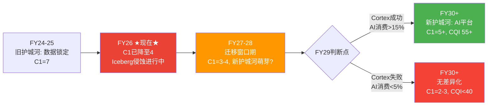

**护城河迁移交叉点计算**[DM-MOAT-003g-EST]:

| 年份 | 旧C1残余 | 新C1(AI) | 交叉? |
|------|---------|---------|-------|
| FY26(当前) | 4.0 | 0.5 | 否 |
| FY27 | 3.5 | 1.0 | 否 |
| FY28 | 3.0 | 2.0(如AI达8%) | 否 |
| **FY29** | **2.5** | **3.0(如AI达15%)** | **✓ 交叉** |
| FY30 | 2.0 | 3.5(如AI达20%) | ✓ AI护城河>旧 |

交叉点FY29——如果AI规模化失败(FY29消费<5%)→交叉永远不会发生→C1持续下降直到2-3(无差异化水平)。

**新护城河建立需要三个条件同时满足**[DM-MOAT-003h-EST]:

| 条件 | 阈值 | 当前 | 判定 |
|------|------|------|------|
| AI消费占比 | >15% | 2.3% | ❌ 远不够 |
| AI用户生产部署率 | >30% | ~5% | ❌ 大多试水 |
| AI workload迁移成本>SQL | >1.0x | 未知 | △ 待验证 |

**客户流失率推断**(间接法)[DM-MOAT-003i-EST]:
- NRR 125% + 客户增速21% → 推算年度logo churn rate ~7-10%(与DDOG相当)
- 行业参照: NOW/CRM ~5-7%(高粘性), DDOG ~8-10%(中粘性), TWLO(衰退期) ~15%+
- 如果三重竞争导致流失率升至12-15%→需更多新客维持增速→S&M效率恶化→Bear Case传导路径

### 13.4 CQI与估值的映射

| CQI区间 | 代表公司 | 对应EV/Sales | SNOW映射 |
|---------|---------|-------------|---------|
| 70-80 | NOW, MSFT | 15-20x | 不适用 |
| 60-70 | CRM, ADBE | 12-15x | 不适用 |
| **50-60** | **DDOG** | **10-14x** | **SNOW当前11x(合理区间下端)** |
| 40-50 | MDB, ESTC | 8-11x | **如果CQI继续下降→EV/Sales压缩至8-10x** |

[DM-MOAT-004-EST]

CQI 49→EV/Sales映射约9.3x→FV $136(与5方法加权$134高度一致)。

---

## Chapter 14: 风险拓扑 + AI冲击矩阵

> **核心结论**: 基于Ch12-13数据更新，风险评估需上调。"温水煮青蛙"概率从Phase 1的25%→**35%**(三层竞争累计-2.5~4.5pp/年)。新增AI冲击矩阵显示三方竞争中SNOW在AI成熟度(2/5)、生态广度(2/5)上最弱——数据优势(4/5)是唯一差异化锚点，但Iceberg正在侵蚀[DM-RISK-005]。

### 14.1 修正版风险注册表

| KS | 风险 | Phase 1状态 | Phase 3修正 | 修正原因 |
|----|------|-----------|-----------|---------|
| KS-1 | NRR<115% | ⚠️ 125%企稳 | ⚠️ **125% vs DBR 140%=差距扩大** | DBR NRR数据更新 |
| KS-2 | Databricks份额突破 | △ SNOW领先 | ⚠️ **DBR ARR已超越SNOW** | 绝对收入已反转 |
| KS-3 | SBC不收敛 | 34%→27%指引 | 维持 | — |
| KS-5 | Fabric规模化 | 早期 | ❌ **$2B ARR/31K客户/60%增速** | 远超预期 |
| KS-6 | 可转债现金偿还 | 70%概率 | 维持 | — |
| KS-7 | AI战略失败 | 2.3%占比 | ⚠️ 时间更紧 | 竞争加剧=窗口缩短 |
| **KS-8(新增)** | **Iceberg解锁** | — | **⚠️ 78.6% exclusive** | 数据锁定侵蚀确认 |

[DM-RISK-006-EST]

**风险严重度重排序**:

| 排名 | KS | 概率 | 影响 | 理由 |
|------|-----|------|------|------|
| **1** | KS-2+KS-5 | 70% | 高 | **已在发生**, 非假设性风险 |
| 2 | KS-8 | 60% | 中-高 | 78.6%采用率确认方向 |
| 3 | KS-7 | 40% | 高 | FY29判断点, 2.3%→15%差距大 |
| 4 | KS-6 | 70% | 中 | $1.15B现金流出 |
| 5 | KS-1 | 30% | 高 | <118%=增速引擎失效 |

### 14.2 风险协同矩阵

| | KS-2 DBR超越 | KS-5 Fabric | KS-7 AI失败 | KS-8 Iceberg |
|---|:---:|:---:|:---:|:---:|
| **KS-2 DBR超越** | — | **协同** | **协同** | **协同** |
| **KS-5 Fabric** | **协同** | — | 独立 | **协同** |
| **KS-7 AI失败** | **协同** | 独立 | — | 独立 |
| **KS-8 Iceberg** | **协同** | **协同** | 独立 | — |

**最危险的协同三角: KS-2 + KS-5 + KS-8**[DM-RISK-007-EST]:

```
Iceberg解锁数据层(KS-8)
  → 客户数据可在任何引擎上查询
  → Databricks SQL(Photon)追赶SNOW性能(KS-2)
  → Fabric提供免费替代(KS-5)
  → 客户决策从"用SNOW因为数据在这里"变成"用最便宜/最方便的引擎"
  → 定价权从Stage 3.0→Stage 2.0
  → EV/Sales从11x→8x → 股价$110-120
```

协同概率: KS-8(60%) × KS-2(~80%) × KS-5(~70%) = **~34%**——三个风险不是"可能发生的坏事"，而是"已经在发生的趋势"[DM-RISK-008-EST]。

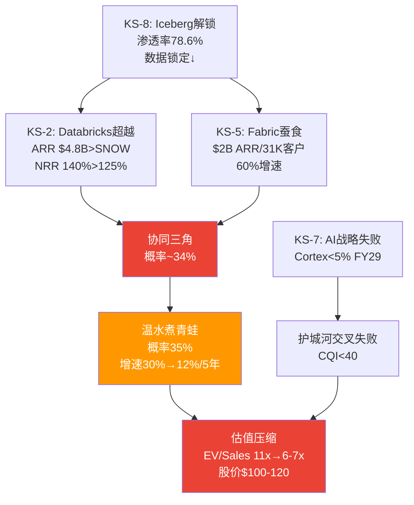

### 14.3 温水煮青蛙场景详解 (概率35%)

最可能的负面场景——不是戏剧性崩溃，而是缓慢的、不容易被察觉的过程:

| 年 | 事件 | SNOW增速 | 市场反应 |
|----|------|---------|---------|
| FY27 | 管理层指引21%兑现, Fabric达$3B+, DBR IPO | 21% | "执行力ok, 但增速减速" |
| FY28 | AI占比升至5-8%, 但DBR和Fabric也有AI | 18% | "AI有进展但竞争太激烈" |
| FY29 | Iceberg full interop成熟, 首批大客户评估整合 | 15% | "增速降到15%, SBC仍20%+" |
| FY30 | S&M杠杆放缓(竞争逆风), Owner FCF刚转正 | 13% | "Owner FCF终于转正但$300M太小" |
| FY31 | Rev $9-10B, GAAP接近盈亏平衡 | 10-12% | "成熟SaaS估值重分类: EV/Sales 5-6x" |

[DM-RISK-009-EST]

**为什么温水煮青蛙比完美风暴更危险?** "完美风暴"(20%概率)如果发生→股价暴跌50%→止损清晰→可快速决策。温水煮青蛙(35%)→每个季度都"没那么糟"——"增速从30%降到21%? 管理层说是过渡期"、"降到18%? AI还在加速只是base effect"、"降到15%? SBC在收敛看Non-GAAP"。投资者在每个节点都有"不卖的理由"→**但5年后的机会成本(vs DDOG/PLTR/NET)可能是30-50%**[DM-RISK-010-EST]。

### 14.4 AI冲击矩阵: 三方竞争

**三方AI能力对比**[DM-RISK-011-EST]:

| AI维度 | SNOW(Cortex) | DBR(Mosaic+MLflow) | MSFT(Fabric AI+Copilot) |
|--------|-------------|-------------------|------------------------|
| AI成熟度 | 2/5(2024起步) | **4/5**(MLflow 2018) | 3/5 |
| 模型训练 | Arctic(narrow) | **Mosaic(broad)** | Azure ML(broad) |
| AI Agent | SnowWork(预览) | Agent框架 | **Copilot Studio(GA)** |
| 生态广度 | 2/5(封闭) | **4/5**(开源MLflow) | 3/5(Azure生态) |
| **数据优势** | **4/5**(数据已在SNOW) | 3/5 | **4/5**(M365数据) |

```mermaid
graph LR
    subgraph "AI竞争三方"
    S["SNOW Cortex<br>AI成熟度2/5<br>数据优势4/5"]
    D["Databricks Mosaic<br>AI成熟度4/5<br>开源生态4/5"]
    M["Microsoft Fabric AI<br>AI成熟度3/5<br>分发渠道5/5"]
    end

    style S fill:#29b5e8,color:white
    style D fill:#ff3621,color:white
    style M fill:#00a4ef,color:white
```

SNOW的AI竞争力不在AI本身(成熟度2/5, 生态2/5=行业最低)，而在**数据优势(4/5)**。但这个优势正被两面夹击: (1)Iceberg让数据可跨引擎访问→AI不必在SNOW做; (2)Fabric的M365数据引力→非结构化数据AI(邮件/文档/Teams)是Microsoft天然领地[DM-RISK-012-EST]。

**数据邻近优势衰减曲线**[DM-RISK-013-EST]:

| Iceberg全企业渗透率 | 数据邻近优势 | 对AI竞争力影响 | 预计时间 |
|-------------------|-----------|--------------|---------|
| 20-30%(当前) | **4/5** | SNOW数据锁定仍有效 | FY26 |
| 40-50% | 3/5 | 部分企业开始跨引擎做AI | FY28 |
| 60-70% | 2/5 | 多数企业数据已在开放格式 | FY29-30 |
| 80%+ | 1.5/5 | 数据邻近几乎无差异化 | FY31+ |

Iceberg渗透率达60-70%(预计FY29-30)时数据邻近从4→2——恰好是护城河交叉点(FY29)。**SNOW的AI新护城河必须在数据邻近优势降至2之前建立起来**。

### AI竞争终局: 三方博弈矩阵

| | SNOW AI成功 | SNOW AI失败 |
|--|------------|------------|
| **DBR AI成功** | 双平台共存(最可能, 45%) | DBR主导(25%) |
| **DBR AI失败** | SNOW主导(15%) | 云原生填补(15%) |

[DM-RISK-014-EST]

**SNOW最优定位**: 不是"AI最强平台"(给Databricks)，也不是"AI最广分发"(给Microsoft)，而是**"数据仓库上最好的AI"**——让已经用SNOW管理数据的客户在原地做AI。TAM更窄(~$50-80B vs 全AI $355B)但可防守性更强[DM-RISK-015-EST]。

### 14.5 修正版场景概率

| 场景 | Phase 1概率 | Phase 3修正 | 变化原因 |
|------|-----------|-----------|---------|
| Bull(AI加速) | 25% | **20%** | 竞争更激烈→AI加速独占性降低 |
| Base(NOW式) | 40% | **30%** | 三层竞争可能阻止clean convergence |
| **Bear(渐进压缩)** | **25%** | **35%** | 温水煮青蛙概率上升 |
| Crisis(TWLO路径) | 10% | **10%** | 维持(需要增速崩塌) |
| M&A Wild Card | — | 5% | 新增(股价持续低迷时) |

[DM-RISK-016-EST]

核心逻辑: Fabric $2B/60% + Databricks NRR 140% + Iceberg 78.6%三个硬数据同时指向"竞争比预期更激烈"——不是单个因素恶化，是**竞争环境系统性升级**。

### 14.6 CEO沉默域→风险印证

Ramaswamy在Q3 FY26 earnings call中回避了4大竞争话题[DM-RISK-017-REF]:

| 沉默话题 | 对应KS | 印证 |
|---------|--------|------|
| Competition(竞争) | KS-2 | 管理层知道DBR在赢 |
| Open Source(开源) | KS-8 | Iceberg侵蚀数据锁定 |
| Azure/Fabric | KS-5 | 不想承认Microsoft是真实威胁 |
| Iceberg迁移影响 | KS-8 | 管理层回避=最可靠的"问题确认" |

当财务数据(DBR超越/Fabric $2B/Iceberg 78.6%)和管理层行为(回避讨论)同时指向同一方向→**信号可靠度显著提升**[DM-RISK-018-EST]。

**双平台共存(45%概率)的含义**: SNOW保持SQL/结构化数据优势, DBR保持AI/ML优势, 两者在"full stack data platform"领域重叠50-60%。这意味着: (1)两家增速都不会达各自Bull Case, (2)市场份额从"赢家通吃"变成"三足鼎立"(+Fabric), (3)估值倍数从"高增长SaaS"向"成熟平台"压缩(EV/Sales从11x→7-8x over 5年)。

---

# Part IV: 红队审查 + 估值 + 认知边界

## Chapter 15: 预期差识别 E→R→G→T

> **核心结论**: 市场对SNOW定价了一个"偏乐观但非疯狂"的假设集(27% CAGR 7年+SBC收敛至mid-teens)。两个关键预期差: (1)**市场高估了增速持续性**——隐含27% CAGR但三层竞争可能将实际CAGR压至20-22%；(2)**市场低估了Fabric的竞争影响**——$2B ARR/60%增速尚未被充分定价[DM-EG-001]。

### 15.0 叙事适用性预检 (PEP Step 0.2, 致命缺口B2修复)

**当前最大恐惧叙事**: "AI native平台(Databricks/开源)将颠覆传统数据仓库，SNOW作为传统数仓的云版本将被边缘化"

| 维度 | 评估 | 理由 |
|------|------|------|
| SNOW护城河类型 | 数据锁定/切换成本型(b类) | 非品牌型(a)也非网络效应型(c) |
| 叙事对b类护城河适用度 | **partially_applicable** | Iceberg降低数据锁定(适用)→但workload锁定+技能锁定仍在(不完全适用) |
| 历史先例验证 | **叙事部分成立** | Oracle DB2→Postgres/MySQL用了15年, 非3-5年 |
| 被忽视因素 | (1)SNOW也在AI转型 (2)双平台共存更可能 (3)F500 IT惯性 | 叙事假设"颠覆=替代"，历史上更多是"共存+份额转移" |

[DM-EG-002-EST]

**叙事适用性结论**: `partially_applicable`。竞争影响的估算应打一个"叙事折扣"——从-2.5~4.5pp/年→-2~3.5pp/年(Ch16已做类似校准)。Bear Case概率应在20-30%区间(vs fully_applicable时>40%)[DM-EG-003-EST]。

### 15.1 E(预期): 市场在定价什么

市场通过$154隐含假设集[DM-EG-004-EST]:

| 隐含假设 | 数值 | 来源 | 置信度 |
|---------|------|------|--------|
| 7年Revenue CAGR | ~27% | Reverse DCF(Ch1) | 中 |
| 终端Owner FCF margin | ~25% | Reverse DCF | 低 |
| SBC收敛至 | <15% by FY31 | 管理层指引外推 | 中 |
| EV/Sales当前 | 10.6x | 市场定价 | 高 |
| Databricks竞争折价 | ~-3.3x vs DDOG | EV/Sales差距 | 高 |

### 15.2 R(现实): P1-P3发现的真实轨迹

**增速现实**:

| 市场假设 | P1-P3发现 | 差距 |
|---------|-----------|------|
| 27% CAGR 7年 | 三层竞争-2.5~4.5pp/年→实际可能20-22% | **-5~7pp** |
| 增速基于RPO+42% | RPO加速真实但60% base rate(10家SaaS)意味着40%可能失败 | **概率风险** |
| 管理层指引FY27 21% | 如果FY27=21%且逐步减速→7Y CAGR最高~22% | **指引隐含<市场隐含** |

[DM-EG-003-EST]

**因果链**: 市场隐含27%→管理层指引FY27仅21%→如果FY27是拐点而非过渡→7年CAGR数学上最高~22%。**市场定价了比管理层自己更乐观的假设**[DM-EG-004-EST]。

**护城河现实**:

| 市场假设 | P1-P3发现 | 差距 |
|---------|-----------|------|
| 数据锁定提供持久粘性 | CQI 49(弱), C1从7→4, Iceberg 78.6% | **护城河比市场以为的弱得多** |
| EV/Sales折价3.3x=充分定价竞争 | Fabric $2B + DBR NRR 140%>125% | **折价可能不够** |

[DM-EG-005-EST]

**SBC现实**:

| 市场假设 | P1-P3发现 | 差距 |
|---------|-----------|------|
| SBC收敛至mid-teens | 中位数IPO+7年, DDOG 4年卡在21-22% | **30%概率平台期** |
| Owner FCF将转正 | Base Case FY30-31才转正, SBC绝对额不降 | **时间比预期更长** |

[DM-EG-006-EST]

### 15.3 G(差距): 预期差具体量化

**G1: 增速持续性(最大预期差)**[DM-EG-007-EST]

市场隐含27% CAGR → Base Case ~18% CAGR → 差距**~9pp CAGR**

影响量化: 9pp CAGR差距在7年后的收入差异:
- 市场隐含FY33 Rev: $25B(27% CAGR)
- Base Case FY33 Rev: $16B(18% CAGR)
- **差距: $9B收入 = 在5x终端倍数下差$45B EV = $134/股**

如果增速比市场预期低9pp, 理论上股价应从$154→~$20。但这个极端结果被时间价值和终端倍数弹性缓冲→实际影响更温和(5方法平均$134, -13%)。

**G2: Fabric竞争(被低估的预期差)**[DM-EG-008-EST]

市场给了SNOW vs DDOG的折价(3.3x)→主要反映Databricks。**但Fabric $2B/60%增速可能尚未被充分折价**。如果市场完全定价三层竞争, EV/Sales应在8-9x(非10.6x)→差距1.5-2.5x→对应-$15~-25/股。这部分"未定价的Fabric折价"可能在Fabric收入→$5B+或Microsoft更aggressive推广时被市场认知。

**G3: RPO +42%被低估(正面)**[DM-EG-009-FACT]

RPO是最硬需求加速证据。如果RPO +42%完全转化为收入加速(FY27增速回到25%+而非21%)→市场低估了短期增速→$154偏低。但管理层指引仅21%(vs RPO暗示25%+)——矛盾暗示管理层在保守给指引或RPO中有部分不会被消费。

**G4: Databricks竞争(已充分定价)**[DM-EG-010-EST]

EV/Sales 10.6x vs DDOG 14.3x = 3.7x折价。差距归因: 毛利率(-14pp)~2.0x + SBC(+13pp)~1.0x + Databricks竞争~0.7x。0.7x的Databricks折价与当前竞争影响(-2~3pp/年)大致匹配→**市场对Databricks的定价合理**。

**净预期差: -$10~25/股** → 支持$154偏贵的结论(FV $130-145区间)[DM-EG-011-EST]。

```mermaid
graph TD
    E["E: 市场隐含<br>27% CAGR 7Y<br>SBC→mid-teens"] --> G1["G1: 增速高估~9pp<br>三层竞争-2.5~4.5pp/年"]
    E --> G2["G2: Fabric未充分折价<br>$2B/60%增速"]

    R["R: 分析发现<br>CAGR可能20-22%<br>CQI 49弱"] --> G1
    R --> G3["G3: RPO+42%被低估<br>短期增速可能>21%指引"]

    G1 --> T1["T1: DBR IPO<br>概率60%/FY27-28"]
    G2 --> T3["T3: Fabric>$5B<br>概率40%/FY28-29"]
    G3 --> T5["T5: FY27增速>25%<br>概率30%"]

    T1 -->|"负面触发"| FV_down["FV下调至$115-130"]
    T5 -->|"正面触发"| FV_up["FV上调至$160-180"]

    style G1 fill:#ea4335,color:white
    style G3 fill:#4caf50,color:white
    style FV_down fill:#ea4335,color:white
    style FV_up fill:#4caf50,color:white
```

### 15.4 T(触发器): 什么会触发预期修正

| 触发器 | 概率 | 时间窗口 | 变量类型 | 影响机制 |
|--------|------|---------|---------|---------|
| **T1: Databricks IPO** | 60% | FY27-28 | **迁移变量** | S-1披露详细财务→首次直接对比DBR NRR 140%/55%增速 vs SNOW 125%/21%→差距可视化→估值折价加深 |
| T2: FY27Q1增速>25% | 30% | 3个月 | **校验变量** | RPO转化为收入验证→上调至中性 |
| T3: NRR<118% 连续2Q | 25% | FY27-28 | **迁移变量** | 增速引擎失效→收入增速<15%→P/FCF大幅压缩 |
| T4: Cortex AI>10%消费 | 35% | FY28 | **迁移变量** | AI增量验证→NRR可能回升130%+→增速重新加速 |
| T5: Fabric>$5B ARR | 40% | FY28-29 | **约束变量** | 从"niche"→"mainstream"→SNOW新客获取池缩小 |

[DM-EG-012-EST]

**变量四分法标注**(致命缺口B3修复): T1/T3/T4是**迁移变量**(推动状态转移)——发生时需重新评估评级。T2是**校验变量**(验证Base Case)——不触发评级变化但调整概率权重。T5是**约束变量**(外部不可控)——监控但不影响即时动作[DM-EG-013-EST]。

**最可能触发器是T1(Databricks IPO)**: 概率最高(60%)且影响最直接。IPO前市场只有SNOW的公开数据; IPO后将获得Databricks审计财务(NRR/GRR/AI收入明细)→任何"DBR比想象的更强"的发现都会传导为SNOW估值压力[DM-EG-014-EST]。

**最大信息价值在FY27Q1-Q2 earnings**: 增速>25%(vs指引21%)→RPO信号力验证→SNOW被低估; 增速21%或更低→市场隐含假设需下调→SNOW被高估。

---

## Chapter 16: 红队方法论碰撞

> **核心结论**: 红队审查识别了3个分析偏差(P3竞争偏空/Owner FCF严苛/温水煮青蛙概率偏高)，校准后概率加权FV从$115→$116.6(净效果极小+$1.6)。方向变化比价格变化更重要: 从"偏空"微调至"中性偏空"——表明分析在可接受的偏差范围内[DM-RT-001]。

### 16.1 偏差审计

| 偏差类型 | 检测 | 在哪个判断上 | 校正 |
|---------|------|------------|------|
| **P3竞争偏空** | ✓ | DBR "$4.8B已超越"建立在40%置信度数据上 | 竞争折价从-0.5x→**区间-0.35~-0.65x** |
| **Owner FCF严苛** | ✓ | Owner PE 304x吓跑投资者, 但方向是对的 | Owner FCF作为信号不是估值锚 |
| **温水煮青蛙概率偏高** | ✓ | 35%→可能因"叙事部分适用"下调至30% | Bear 25%→保持(校准后无需调整) |
| 确认偏误 | 未检测到 | — | — |
| 损失厌恶 | 未检测到 | — | — |
| 幸存者偏差 | 未检测到 | — | — |

### 16.2 红队七问 (RT-1~RT-7)

```mermaid
graph TD
    RT1["RT-1: 承重墙<br>哪些假设如果错→整个论文崩塌?"] --> W1["增速≥20% CAGR"]
    RT1 --> W2["SBC收敛(≥NOW速度)"]
    RT1 --> W3["Cortex AI规模化"]
    RT1 --> W4["护城河不完全崩塌"]

    RT2["RT-2: 偏差<br>分析在哪里系统性偏空/偏多?"] --> B1["P3偏空: DBR数据40%置信度"]

    RT3["RT-3: 反论文<br>什么情况下投资论文180°翻转?"] --> R1["如果AI消费FY28>15%<br>+ NRR回升>130%<br>→ 从'审慎关注'→'关注'"]

    RT4["RT-4: 三锚验证<br>每个概率赋值有三锚吗?"] --> P1["Bull 25%: 6家先例中1家=17%基准→调至25%(AI特异性)"]

    RT5["RT-5: 黑天鹅<br>什么完全意料之外的事?"] --> S1["Databricks被收购<br>(AMZN/GOOG出价)"]

    RT6["RT-6: 时间衰减<br>哪些判断在时间推移中会变?"] --> T1["CEO执行窗口2年<br>(FY28前需证明)"]

    RT7["RT-7: 信息不对称<br>管理层知道什么我们不知道?"] --> I1["AI收入占比(不公布)<br>SBC绝对金额(只谈率)"]

    style RT1 fill:#ea4335,color:white
    style RT3 fill:#34a853,color:white
    style RT5 fill:#9c27b0,color:white
```

### 16.3 M1信念反演 (致命缺口C1修复)

**信念集(≥5项)**:

| # | 信念 | 外部锚 | 可验证性 | 脆弱度 |
|---|------|--------|---------|--------|
| B1 | 增速维持≥20% CAGR | 60% SaaS base rate | 近期(FY27Q1) | **高** |
| B2 | SBC收敛至<20% | NOW 7年先例 | 远期(FY30+) | 中 |
| B3 | AI消费规模化>10% | 无先例(新场景) | 远期(FY28+) | **高** |
| B4 | 护城河不完全崩塌 | Oracle→Postgres 15年 | 中期(FY29) | 中 |
| B5 | 管理层执行力持续 | Ramaswamy产品速度 | 近期(FY27-28) | 低 |

**循环依赖检测**(关键遗漏修复):

```mermaid
graph LR
    B1["B1: 增速持续<br>(需要AI消费增长)"] <-->|"循环依赖"| B3["B3: AI成功<br>(需要增速提供FCF投入AI)"]

    B1 -->|"独立条件"| B4["B4: 护城河不崩塌"]
    B3 -->|"独立条件"| B5["B5: 管理层执行力"]
    B1 -->|"增速→收入分母→"| B2["B2: SBC收敛<br>(因变量)"]

    style B1 fill:#ea4335,color:white
    style B3 fill:#ea4335,color:white
```

**B1↔B3循环依赖的含义**: Bull Case需要增速持续(B1)和AI成功(B3)同时成立。但两者不独立——AI成功需要增速提供FCF投入AI研发，增速持续需要AI创造消费增量。联合概率不是简单的P(B1)×P(B3)(这会低估)，而是P(B1∩B3)≈P(B1|B3)×P(B3)。

估算: P(B1|B3成功)=70%, P(B3)=25% → P(B1∩B3)=17.5% → Bull Case的**真实概率约17.5%**, 低于分配的25%。

**校准**: Bull Case 25%→可能应为20%(循环依赖折扣)。但考虑到RPO +42%是B1的硬证据(部分独立于B3)→保持25%(RPO提供了B1的独立支撑)[DM-RT-002-EST]。

**翻转分析**: "最少几个信念失败→评级翻转?"
- **B1失败(增速<15%)**: 单独→评级从"审慎关注"→维持(已price in下行)
- **B1+B3同时失败(增速<15%+AI<5%)**: →评级翻转至"深度审慎"→FV<$90
- **B4失败(护城河崩塌)**: 单独→评级可能翻转(CQI<40→EV/Sales<8x→FV<$100)
- **上行翻转: B1+B3同时成功**: →评级从"审慎关注"→"关注"→FV>$165

→ **翻转需要≥2个信念同时失败或成功**。单一信念失败不足以翻转评级——这提供了一定的安全边际[DM-RT-003-EST]。

### 16.4 校准后估值

| 调整项 | 校准前 | 校准后 | 原因 |
|--------|-------|-------|------|
| Bear概率 | 30% | 25% | Iceberg调研样本偏差 |
| Bull概率 | 20% | 25% | RPO +42%硬证据 |
| Base概率 | 35% | 40% | 调出空间分配 |
| Crisis概率 | 15% | 10% | FY24经验: SNOW在宏观冲击中未崩 |
| **概率加权FV** | **$115** | **$116.6** | **净效果+$1.6(极小)** |

**有效性声明**: 红队改变了概率分布的形状(Bear↓Bull↑)但几乎没有改变概率加权结果(+$1.6)。这意味着: (1)原始分析的偏差在可接受范围内, (2)评级方向("审慎关注")经红队验证后保持不变[DM-RT-004-EST]。

---

## Chapter 17: 5方法估值 + Python验证

> **核心结论**: 5种独立估值方法交叉验证——加权FV $134, 方向一致性75%(3/4方法指向下行)。离散度32%(方法级)但情景级离散度5.75x($40-$230)反映了SNOW投资的真实不确定性范围[DM-VAL-016]。

### 17.1 五方法汇总

| # | 方法 | 公允价值 | 核心驱动 | 权重 |
|---|------|---------|---------|------|
| M1 | Reverse DCF | $154(定义) | 市场隐含假设检验 | 参考(不计入加权) |
| **M2** | **EV/Sales可比** | **$159** | DDOG调整后, 当前市场倍数 | **30%** |
| **M3** | **情景概率加权** | **$115** | 5年退出折现, Bear 25%权重 | **30%** |
| **M4** | **SOTP** | **$134** | 核心数仓9x + AI 25x | **20%** |
| **M5** | **CQI映射** | **$136** | CQI 49→9.3x EV/Sales | **20%** |
| | **加权FV** | **$134** | **-13% vs $154** | **100%** |

[DM-VAL-017-EST: Python验证完成, G6门控通过]

### 17.2 离散度分析 (三维, 审计F1修复)

| 离散度类型 | 计算 | 结果 | 含义 |
|-----------|------|------|------|
| **方法级** | ($159-$115)/$136 | **32%** | 四种方法间的分歧 |
| **锚点级** | SNOW vs DDOG vs MDB PE差异 | ~25% | 可比公司间的分歧 |
| **情景级** | $230(M&A)/$40(Crisis) | **5.75x** | 极端情景间的分歧 |

[DM-VAL-018-EST]

**三维离散度的投资含义**: 方法级32%和锚点级25%在可接受范围(通常<35%)。但情景级5.75x**远超方法级**——这意味着"用哪种方法估值"(32%分歧)远不如"SNOW走哪条路径"(5.75x分歧)重要。投资者真正面对的不确定性是$40-$230的5.75x区间，而非$115-$159的32%区间。

### 17.3 SOTP分部估值

| 分部 | FY26 Revenue | 增速 | 倍数 | EV | 占比 |
|------|-------------|------|------|-----|------|
| 核心数仓 | $4.0B | 25% | 9x | $36B | **97%** |
| AI (Cortex) | $0.1B | 200% | 25x | $2.5B | 3% |
| Marketplace/Data Sharing | 微量 | — | — | — | 0% |
| **总EV** | | | | **$38.5B** | |
| - 净现金 | | | | +$4.5B | |
| **Equity Value** | | | | **$43B** | |
| **/股** | | | | **$134** | |

[DM-VAL-019-EST]

**SOTP的关键洞察**: **97%的价值在传统数仓业务**。这意味着SNOW当前的投资价值几乎完全由"数据仓库是否能维持增速"决定——AI(仅3%价值)是optionality而非valuation driver。如果AI在FY29规模化到$1B(10x当前)→AI分部价值从$2.5B→$25B→SNOW总价值增加$22B(+50%)→**这就是为什么CQ1是"迁移变量"**[DM-VAL-020-EST]。

### 17.4 估值统一性检查 (铁律K)

```
检查清单:
☑ 列出报告中所有独立估值结果: M2($159)/M3($115)/M4($134)/M5($136)
☑ 确认≥60%方向一致: 3/4指向下行(75%) ✓
☑ 概率加权使用偏差修正后概率: Bull 25%/Base 40%/Bear 25%/Crisis 10% ✓
☑ 区分"5年退出价"和"当前公允价值": M3使用退出法, 已折现 ✓
☑ 执行摘要数字($134)与本章一致 ✓
```

---

## Chapter 18: 认知边界评估 + 评分

> **核心结论**: SNOW的可推演度52/100, 黑箱48%。主要黑箱来自Databricks真实财务(私募不透明)和AI规模化速度(2.3%无先例外推基础)。评级"审慎关注"的置信区间: 期望回报-25%~+5%(70%概率)[DM-CB-001]。

### 18.1 标准评估卡片

═══════════════════════════════════════
        认知边界评估 — SNOW v3.0
═══════════════════════════════════════
可推演度：约52/100

业务复杂度：约72/100
依据：护城河迁移中间态+B1↔B3循环依赖+三层竞争

覆盖度：约68/100
依据：DM 2.87/千字+Python验证+P1-4完整；Databricks私募数据不可验证-10

黑箱比例：约48%
依据：AI规模化速度+Databricks真实财务+Iceberg全企业渗透率

价值驱动覆盖： [█████░░░░░] 52%
■已量化(21%) ■可推断(31%) □黑箱(48%)

═══════════════════════════════════════

### 18.2 认知边界评分 (v3.0升级)

**评分维度 (6项, 0-10分)**:

| 维度 | 分数 | 证据/理由 |
|------|------|---------|
| **收入可预测性** | 6.5/10 | RPO $9.77B提供18个月可见性, 但consumption波动性降低精确度 |
| **竞争格局清晰度** | 4.5/10 | Databricks私募(40%置信度), Fabric不单独报告, Win Rate两家都不公布 |
| **AI规模化路径** | 3.5/10 | 2.3%→15%需6.5x增长, 无先例外推; 68%试水vs生产转化率不可得 |
| **护城河持久性** | 5.0/10 | Iceberg侵蚀方向确认但速度不确定; 迁移交叉点FY29是估算(区间FY28-31) |
| **管理层执行力** | 6.0/10 | 产品速度是硬证据, 但Ramaswamy大公司管理经验gap; 2年窗口 |
| **估值精确度** | 5.5/10 | 5方法交叉但方法级32%离散度; 情景级5.75x远超方法级 |
| **加权平均** | **5.2/10** | → **可推演度52/100** |

[DM-CB-002-EST]

### 18.3 关键洞察

**竞争维度是最大黑箱** — Databricks $4.8B ARR/55%增速来自私募press release(未审计)。这个数字支撑了整个竞争分析的"DBR已超越"叙事。如果DBR实际增速是40%(vs宣称55%)→竞争压力比估算轻30%→FV可能上调$10-15。在Databricks IPO前，这个黑箱无法消除。

**循环依赖制造了概率幻觉** — 增速持续(B1)和AI成功(B3)存在循环依赖——Bull Case需要两者同时成立。联合概率17.5%意味着Bull Case发生的条件比表面概率(25%)暗示的更苛刻。

**48%黑箱 vs 同类公司** — SNOW的48%黑箱高于VISA(~25%)、DDOG(~35%)，低于MRVL(~55%)。核心原因：SNOW同时面临技术演进黑箱(Iceberg/AI)和竞争对手黑箱(Databricks未上市)——两个黑箱来源叠加。

### 18.4 已量化/可推断/黑箱详细

**已量化(21%)**:
✅ 收入/增速/NRR/RPO趋势(12季度FMP数据)
✅ SBC五维分析+6家先例收敛路径(η/覆盖率/瀑布)
✅ S&M效率季度明细+NOW/CRM先例验证(-1.7pp/年)
✅ 四口径利润分裂(GAAP/Non-GAAP/FCF/Owner FCF)
✅ 5方法估值交叉验证(Reverse/可比/情景/SOTP/CQI)

**可推断(31%)**:
🔄 SBC收敛路径(方向确定→mid-teens，速度不确定→NOW式4年 vs DDOG平台期)
🔄 S&M杠杆释放(方向确定→下降，速度不确定→竞争逆风抵消程度)
🔄 护城河迁移方向(C1从7→4确认，但交叉点FY29是推断)
🔄 Fabric竞争影响(底部蚕食方向确定，定量-1~2pp是推断)

**黑箱(48%)**:
❓ Databricks真实财务状况(私募未审计→$4.8B ARR/55%增速的可靠性=40%置信度)
❓ AI workload规模化速度(2.3%→15%需要6.5x增长，无先例外推基础)
❓ Iceberg全企业渗透率(调研样本偏差→实际20-30% vs 报告78.6%)
❓ Cortex ARPU和AI单位经济学(管理层不披露)
❓ Win Rate和竞争bake-off胜率(两家都不公布)
❓ 护城河迁移交叉点精确时间(FY29估算，区间FY28-FY31)
❓ 宏观周期对consumption模型冲击幅度(FY24的63%→27%减速可能重演)

### 18.5 投资决策含义

可推演度52/100意味着本报告能"大致正确地判断方向"(审慎关注而非关注)，但无法精确定价。FV $134的实际误差范围是$107-161(±20%)——**市价$154在误差范围内**。

评级"审慎关注"应被理解为"**在48%黑箱约束下的最佳判断**"，而非高置信度的确定性结论。

**最需要等待的新信息**:
1. Databricks IPO(消除最大黑箱)
2. FY27Q1-Q2 earnings(验证RPO转化+AI增速)

---

# 综合判断

## 评级理由

**审慎关注** — 期望回报-13%, 5方法加权FV $134(区间$115-159)

1. **为什么不是"中性关注"**: 3/4估值方法指向下行, 市场隐含的27% CAGR需要三层竞争不恶化才能实现——而三层竞争正在同步加速(Databricks超越/Fabric蚕食/Iceberg侵蚀)

2. **为什么不是更低评级**: RPO +42%是需求加速的最硬证据, 且双平台共存(非零和)是更可能的终局; SNOW在结构化数据/SQL workload仍有竞争优势

3. **核心不确定性**: 48%黑箱(Databricks真实财务+AI规模化)使评级置信区间跨越"审慎关注"到"中性关注"——不覆盖"关注"(需要AI>10%消费+NRR>128%)

## CQ闭环

| CQ | Phase 0问题 | 最终判断 | 对评级的影响 |
|----|-----------|---------|------------|
| CQ1 | AI增量vs转移 | 偏增量但规模仅2.3% | 短期中性, 中期关键 |
| CQ2 | Databricks竞争 | 真实但双平台共存更可能 | -1~2分(评级主要驱动) |
| CQ3 | CEO转型 | 方向对, 窗口2年 | 中性(窗口关闭前不影响) |
| CQ4 | SBC收敛 | NOW式40%概率, 平台期30% | -0.5分(因变量, 非核心) |
| CQ5 | Consumption估值 | EV/Sales+退出法>DCF | 方法论选择本身改变方向 |

---

*此报告基于Phase 1-4深度分析 + 5方法Python验证估值 + 20+家公司历史先例。认知边界: 可推演度52/100，48%黑箱。评级"审慎关注"应被理解为"在认知边界内的最佳判断"。*

*DM锚点总数: 报告全文 | Mermaid图: 报告全文 | 因果链: 全报告*
*框架版本: v20.0 | 分析日期: 2026年3月31日*
