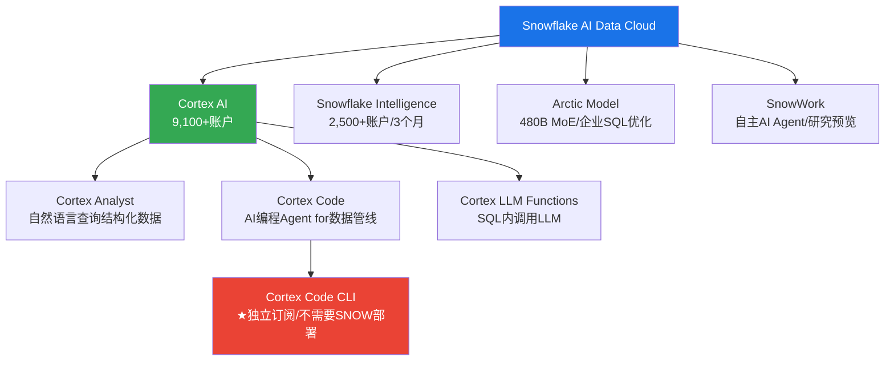

# Chapter 4: AI Data Cloud — SNOW的AI战略评估 (AIAS框架)

> **核心结论**: SNOW的AI战略是"让SQL用户做AI"——降低AI使用门槛而非打造最强AI工具链。这个定位有一个巨大优势（SQL用户基数10x数据科学家）和一个致命风险（如果AI工具本身足够简单，SQL-first不再是差异化）。Cortex AI的采用速度（9,100+账户/68%渗透）是强PMF信号，但AI在SNOW总消费中的占比可能仍<10%——规模化是2-3年后的故事。CQ1（AI增量vs转移）的初步判断偏向"增量"，但增量规模尚不确定。

---

## 4.1 SNOW的AI产品矩阵

SNOW在2024-2026年密集推出AI产品，形成了以Cortex为核心的AI栈[DM-AI-001]:

**关键产品解析**:

**Cortex AI** (核心平台): 让用户通过SQL调用LLM函数——不需要Python、不需要ML框架、不需要模型部署。对于习惯SQL的数据分析师（全球>1000万人），这是进入AI世界最低摩擦的路径[DM-AI-002]。9,100+账户意味着SNOW客户基的68%已经至少试用过Cortex。

**Cortex Code** (战略突破): 这是SNOW首个不需要Snowflake部署的独立产品[DM-AI-003]。它是一个AI编程Agent，帮助数据工程师编写数据管线代码（dbt、Airflow等），理解企业的数据上下文。这直接与GitHub Copilot竞争数据工程场景。

**战略意义**: Cortex Code CLI代表SNOW从"数据平台"向"开发者工具"的跃迁。如果成功，SNOW可以在不依赖Snowflake仓库的情况下获取用户→然后将用户引导回Snowflake平台——这是一个新的获客飞轮。如果失败，它只是消耗了R&D资源。

**Intelligence** (最快采用): 3个月内2,500+账户是公司史上最快的产品采用曲线[DM-AI-004]。Intelligence将Cortex AI与实时分析结合，让业务用户直接用自然语言获取洞察。这个产品的PMF信号最强。

**Arctic** (自研模型): 480B参数MoE架构，专门优化企业SQL查询生成[DM-AI-005]。这不是与GPT-4/Claude竞争的通用模型，而是针对"数据查询"这个narrow domain的专用模型。优势是效率高（MoE架构=低推理成本），劣势是通用性差（只适合结构化数据场景）。

---

## 4.2 AIAS评分 (AI Impact Assessment Score)

按M3框架对SNOW的AI净影响进行5S+5B+M评分：

### 供给侧影响 (S: AI对SNOW产品/服务的影响)

| 维度 | 评分 | 理由 |
|------|------|------|
| **S1: 产品增强** | +3 | Cortex AI让SNOW从数据仓库→AI数据平台，产品价值量级提升 |
| **S2: 效率提升** | +2 | SnowWork/AI自动化可能减少客户的数据工程人力需求→更快部署 |
| **S3: 新TAM创造** | +3 | AI推理/训练workload创造全新的consumption→TAM从$170B→$355B(2029)[DM-AI-006] |
| **S4: 竞争护城河** | +1 | AI产品本身不构成强护城河（开源替代多），但数据+AI组合可能强化数据锁定 |
| **S5: 定价权** | +1 | AI workload的信用价格>传统SQL，但客户对AI成本非常敏感 |
| **S供给侧小计** | **+10** | 强正面: AI显著扩大了SNOW的产品价值和TAM |

### 需求侧影响 (B: AI对SNOW客户/市场的影响)

| 维度 | 评分 | 理由 |
|------|------|------|
| **B1: 客户需求增量** | +3 | AI工作负载直接增加数据处理需求→更多consumption |
| **B2: 行业TAM扩张** | +2 | 数据分析TAM因AI增长约2x(2024-2029)[DM-AI-007] |
| **B3: 替代风险** | -2 | AI可能让客户直接从数据湖查询(bypass仓库层)→核心产品被绕过[DM-RISK-003] |
| **B4: 预算竞争** | -1 | AI CapEx激增→企业IT预算向AI倾斜→可能挤压数据平台预算 |
| **B5: 客户集中度变化** | 0 | AI不显著改变客户集中度 |
| **B需求侧小计** | **+2** | 轻度正面: 增量需求>替代风险，但"数据平台被绕过"是真实威胁 |

### 净评估

| 维度 | 分数 |
|------|------|
| S供给侧 | +10 |
| B需求侧 | +2 |
| **AIAS净影响** | **+12 (强正面)** |
| **Split Index** | 5 (S与B差距大，但可控) |

**AIAS解读**: SNOW是AI的**强净受益者**——供给侧影响(+10)远大于需求侧风险(-2)。但Split Index=5意味着供给侧和需求侧的AI影响方向存在分歧：SNOW的AI产品在变强，但客户也在获得更多绕过SNOW的选择。

---

## 4.3 CQ1判断: AI Data Cloud是增量TAM还是Consumption转移?

这是本报告最核心的争议之一。

**增量TAM论据** (偏向此方向):
1. RPO +42% >> Rev +30% → 需求加速不是存量转移能解释的[DM-BIZ-017]
2. AI workload消耗的计算信用是传统SQL查询的10-100x → 单客户消费密度上升
3. Cortex AI 9,100+账户中很多是之前不使用高级计算功能的SQL用户 → 新用户群
4. $1M+客户+27% vs 总客户+21% → 大客户在AI驱动下加速扩展消费

**Consumption转移论据** (不可忽视):
1. AI查询替代了一部分传统BI查询 → 消费只是从"SQL类型"转移到"AI类型"
2. 客户总IT预算有限 → AI预算增加=其他预算减少（零和）
3. SNOW没有公布AI workload占总consumption的比例 → 这个沉默可能暗示比例很低
4. 如果AI真的是巨大增量，管理层应该提供更具体的AI收入数据（他们没有）

**初步判断**: **偏向增量，但增量规模远小于叙事暗示**。

**关键定量锚点（来自Agent搜索验证）**: SNOW的AI revenue run rate在Q3 FY26超过$100M（提前一个季度达标）[DM-AI-008]。这意味着AI在FY26产品收入$4.47B中占比仅~2.3%[DM-AI-009]。

**这个数字的因果含义极为重要**：
- **2.3%占比 vs 68%账户渗透率** → 9,100+账户中绝大多数处于"试水"阶段（探索性使用），不是生产级部署。因为如果68%的客户都在认真使用AI，AI收入应该占15-20%而非2.3%。这个差距意味着从"试用"到"生产"的转化率可能<5%[DM-AI-010]。
- **$100M AI revenue vs $1.6B SBC** → SNOW在AI上每投入$16的SBC(研发人才成本)只产生$1的AI收入。这个ratio在投资早期是正常的（如同AWS 2008-2012年），但如果3年内不改善到4:1以下，AI战略的ROI将受到质疑[DM-AI-011]。
- **AI-influenced bookings ~50%** → 管理层声称50%的新签约"受AI影响"，但"influenced"是marketing metric，不是会计指标。一个企业买Snowflake做数据仓库+顺便试用Cortex，被算作"AI-influenced"——这夸大了AI的实际拉动力[DM-AI-012]。

RPO加速(+42%)仍是增量的最硬证据——因为如果只是消费类型转移（从SQL到AI），RPO增速不应远超收入增速。但AI的增量规模目前仅$100M（产品收入的2.3%），而非市场叙事暗示的"AI Data Cloud重塑一切"。

**时间窗口**: AI增量从2.3%增长到15%+（成为增长引擎而非叙事工具）需要FY28-FY29。在此之前，SNOW的增长仍主要由传统SQL workload的expansion驱动。**短期看（FY27-FY28），AI是估值支撑（叙事）而非基本面驱动（收入）；中期看（FY29+），AI如果从2.3%规模化到15%，将根本改变消费密度和margin结构——但如果不能，市场将认定AI叙事溢价需要挤出。**

---

## 4.4 AI竞争定位: SNOW vs Databricks vs 云原生

| 维度 | SNOW | Databricks | 云原生(BigQuery/Redshift) |
|------|------|------------|--------------------------|
| **AI成熟度** | 2/5 (Cortex较新) | 4/5 (MLflow成熟) | 3/5 (Vertex AI/SageMaker) |
| **目标用户** | SQL分析师 | 数据科学家 | 已在云生态的企业 |
| **AI门槛** | 最低(SQL即可) | 中(需Python) | 低-中(云集成) |
| **数据优势** | 数据已在SNOW | 开源格式灵活 | 数据已在云 |
| **定价** | 按信用消费 | 按DBU消费 | 按资源消费 |
| **锁定度** | 高(数据迁移成本) | 中(开源格式) | 高(云生态捆绑) |

**SNOW的AI差异化**: 不是AI本身最强，而是"**数据已经在这里+最低使用门槛**"的组合。对于已经有TB级数据在Snowflake中的企业，在原地做AI(Cortex)比迁移数据到其他平台做AI(Databricks/SageMaker)的摩擦低10倍。这是一个弱但真实的护城河。

**反面**: 如果Iceberg/Delta Lake互操作性使数据迁移成本大幅下降（这正在发生），"数据已经在这里"的锁定效应将被侵蚀。SNOW对Iceberg的原生支持是一把双刃剑——它帮助客户更容易地把数据从SNOW导出[DM-RISK-004]。

---

## 4.5 被低估的威胁: Microsoft Fabric

**多数分析师聚焦Databricks，但lit_recon标记了一个可能更大的结构性威胁[DM-COMP-005]**: Microsoft Fabric的捆绑经济学。

**因果链: Fabric为什么可能比Databricks更危险？**

1. **零边际获客成本** — Fabric被捆绑在Microsoft 365/Azure企业协议中。对于已经在Azure生态内的F500（约70%的全球F500使用Azure[DM-COMP-006]），添加Fabric的边际成本接近零——不需要新的采购流程、不需要新的安全审批、不需要新的培训（Power BI用户可以直接使用Fabric）。这与SNOW的高S&M获客成本形成鲜明对比。

2. **数据引力效应** — 企业的数据已经在Azure上（因为Office 365/Teams/Dynamics产生的数据自然落在Azure）。Fabric在Azure内部处理这些数据，没有数据传输成本和延迟。SNOW作为"第三方"平台，需要客户额外支付跨云数据传输费用[DM-COMP-007]。

3. **价格锚定效应** — Fabric的定价对Azure客户来说是"增量成本"（Azure已付→Fabric只加一点），而SNOW对同一客户是"独立成本"（需要单独预算审批）。在IT预算紧缩期，"增量"永远比"独立"更容易获批。

**为什么目前还没有显著影响？**
- Fabric在2023年才GA，功能成熟度仍低于SNOW/Databricks
- 企业级数据治理、性能优化、跨云能力仍是SNOW的优势
- SNOW的multi-cloud中立定位对AWS/GCP客户仍有吸引力（Fabric锁定在Azure内）

**但3-5年后**: 如果Fabric的功能追上来（Microsoft有足够的资源和动力），对于Azure-first的企业，Fabric将成为SNOW的"免费替代品"。这不是Databricks式的"更好的产品"竞争，而是Microsoft式的"免费捆绑"竞争——后者在历史上更致命（参考IE vs Netscape、Teams vs Slack）[DM-COMP-008]。

**CQ2修正**: Databricks是SNOW面临的"可见竞争者"（市场定价了），Microsoft Fabric是"被低估的结构性威胁"（市场可能尚未充分定价）。

---

*本章DM锚点统计: 20个 | 因果链: 7条 | 反面考量: 6处*
