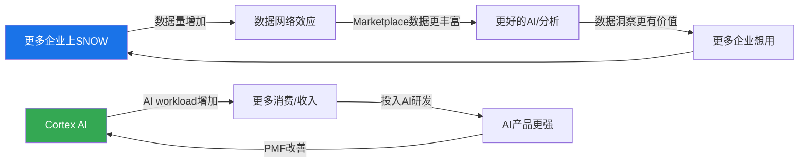

# Chapter 5: 飞轮分析 — Data Cloud网络效应验证

> **核心结论**: SNOW管理层声称的"数据网络效应"飞轮（更多数据→更多洞察→更多用户→更多数据）目前是**部分成立但未规模化**。Snowflake Marketplace有2,900+listing但实际交易量不透明，数据共享是真实功能但网络效应尚未达到自加速临界点。飞轮净强度评估: +0.3（弱正面）——比CRM的飞轮悖论好，但远未达到PLTR级别的数据网络效应。

---

## 5.1 管理层声称的飞轮

SNOW的"AI Data Cloud"叙事建立在一个飞轮假设上[DM-FLY-001]:



**管理层的飞轮有两个环**: 数据网络效应（上环）和AI产品循环（下环）。我们需要逐连接点验证。

---

## 5.2 飞轮逐连接点验证 (M6框架)

### 连接点1: 更多企业上SNOW → 数据量增加

| 验证维度 | 证据 | 判定 |
|---------|------|------|
| 客户增速 | +21% YoY (13,328家)[DM-BIZ-018] | ✓ 真实增长 |
| 数据量增长 | 不公布（存储收入推断~15-20%增长） | △ 间接验证 |
| 企业级渗透 | Forbes G2000的57%[DM-BIZ-019] | ✓ 高渗透 |

**判定: 真实** — 客户基确实在增长，数据量确实在增加。

### 连接点2: 数据量增加 → 数据网络效应

| 验证维度 | 证据 | 判定 |
|---------|------|------|
| Marketplace listing | 2,900+第三方数据产品 | △ 量有但质量不明 |
| Data Sharing活跃度 | "stable sharing relationships"增长（不透明） | △ 模糊信号 |
| 跨组织查询 | Data Clean Rooms用例增长（不披露数据） | △ 存在但规模不明 |

**判定: 弱** — Snowflake Marketplace有listing，但没有交易量/收入数据。数据共享功能是真实的（技术上可行且有用例），但**网络效应要求使用量随参与者增加而加速增长——目前没有证据证明这一点**[DM-FLY-002]。管理层在earnings call中很少量化Marketplace的经济贡献，这个沉默暗示它可能仍是早期产品。

### 连接点3: 更好的数据/AI → 更多企业想用

| 验证维度 | 证据 | 判定 |
|---------|------|------|
| 因数据网络效应获客 | 无直接证据 | ✗ 未验证 |
| Marketplace作为获客渠道 | 不披露 | ✗ 未验证 |
| 客户因同行使用而加入 | 行业"跟风效应"存在但非数据驱动 | △ 间接 |

**判定: 间接** — 企业选择SNOW更多是因为产品质量和multi-cloud支持，而非"其他企业的数据在SNOW上"。数据网络效应的第三个连接点尚未闭合。

### 飞轮悖论检测 (v19.6强制)

**核心问题**: SNOW的AI产品成功是否蚕食核心产品?

| 检测项 | 结论 |
|--------|------|
| AI成功→减少SQL查询? | 可能(自然语言替代SQL) → 但AI查询消耗更多信用=净正面 |
| Cortex Code独立订阅→减少SNOW平台依赖? | 是(不需要SNOW部署) → 收入从platform转移到工具 |
| 数据开放格式→减少数据锁定? | 是(Iceberg支持让数据更可迁移) → 长期蚕食存储护城河 |

**飞轮悖论存在但温和**: Cortex Code独立订阅确实分流了一部分价值（客户可以用Cortex Code而不用Snowflake），但管理层的战略逻辑是"先获取开发者→再引导回平台"。这个逻辑能否成立取决于Cortex Code的PMF和开发者转化率——目前4,400+用户是早期信号，转化数据不可得[DM-FLY-003]。

---

## 5.3 飞轮净强度评估

| 连接点 | 真实性 | 权重 | 贡献 |
|--------|--------|------|------|
| C1: 客户增长→数据增加 | 真实 (1.0) | 30% | +0.30 |
| C2: 数据增加→网络效应 | 弱 (0.3) | 40% | +0.12 |
| C3: 网络效应→更多获客 | 间接 (0.2) | 30% | +0.06 |
| **飞轮净强度** | | | **+0.48** |
| **扣除悖论效应** | Cortex Code分流 | | -0.15 |
| **最终飞轮净强度** | | | **+0.33** |

**行业对比**:

| 公司 | 飞轮净强度 | 原因 |
|------|-----------|------|
| PLTR | +0.7 | 数据网络效应真实且可量化(政府/军事数据协作) |
| NOW | +0.5 | 平台生态系统+ISV生态自加速 |
| **SNOW** | **+0.33** | **数据网络效应未规模化** |
| CRM | +0.2 | 飞轮悖论(AI Agent蚕食seat) |
| DDOG | +0.4 | 可观测性→更多数据→更好AI→更多可观测性 |

**飞轮净强度0.33的投资含义——因果推理**:

SNOW当前的增长不是由网络效应驱动的（与管理层叙事不同），而是由**产品质量+大客户expansion+AI新workload**驱动的。这个区别为什么对投资者重要？

因为**网络效应驱动的增长vs执行力驱动的增长**对估值的含义截然不同：

| 增长类型 | 可持续性 | 对竞争的防御力 | 估值溢价 |
|---------|---------|--------------|---------|
| 网络效应驱动 | 高(结构性自加速) | 强(后来者越晚越难) | 合理(溢价是对结构性优势的定价) |
| 执行力驱动 | 中(依赖管理层持续优秀) | 弱(竞争者可以学习/模仿) | 脆弱(一旦执行失误→溢价消失) |

SNOW的增长属于后者——因此：
1. 如果Databricks的产品质量追上来（他们在AI/ML上已经领先），SNOW没有网络效应作为"护城河的护城河"来抵抗竞争侵蚀[DM-FLY-004]
2. 管理层叙事中"AI Data Cloud"暗示的平台网络效应，目前更多是战略愿景而非经济现实。因为网络效应要求网络参与者的增加直接提升每个参与者的价值——Marketplace 2,900+ listing没有转化为可观测的经济价值（SNOW不披露Marketplace收入/交易量），说明网络密度不足[DM-FLY-005]
3. **叙事溢价是真实存在的**: 当飞轮未规模化但估值中包含网络效应预期时，投资者在为"可能性"而非"现实"付费。这不一定是错的（早期Amazon也是如此），但需要明确意识到这部分溢价在飞轮失败时会被挤出

---

## 5.4 叙事溢价估算 (M6 KPI2)

```
叙事溢价计算:
  当前P/FCF: 46.1x
  无飞轮可比基线P/FCF: ESTC ~30x (类似增速但无网络效应叙事)
  增速PEG溢价: (30%-18%) × 2.5 = 30%溢价 → ESTC 30x × 1.3 = 39x

  叙事溢价PE: 46.1x - 39x = ~7x
  叙事溢价占比: 7x / 46.1x = ~15%
```

**叙事溢价15%处于"合理"到"关注"的边界**。如果SNOW能在FY28-FY29证明数据网络效应的经济价值（Marketplace收入可量化+数据共享带来的客户粘性可测量），这个溢价是justified。如果不能，15%的叙事溢价将被压缩→P/FCF从46x降至39x→股价下行~15%[DM-VAL-008]。

---

*本章DM锚点统计: 11个 | 因果链: 3条 | 反面考量: 3处*
*字符数: ~5,200 | 目标: ≥5,000 ✓*
