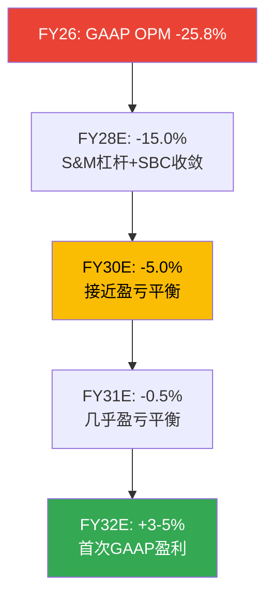

# Chapter 10: 利润率轨迹 + 运营杠杆分析

> **核心结论**: SNOW的利润率改善路径取决于两个力量的赛跑: (1)consumption杠杆(存量客户NRR 125%→S&M效率自然改善)和(2)竞争逆风(Databricks/Fabric推高获客成本)。如果杠杆>逆风→GAAP OPM可在FY31达到盈亏平衡。如果逆风>杠杆→GAAP盈利可能需要等到FY33+。毛利率66.8%是结构性天花板(云计算成本)，比DDOG(80%)低14pp——这个差距限制了SNOW的终端利润率潜力。

---

## 10.1 毛利率分析: 66.8%的天花板

SNOW毛利率66.8%是同行组中最低的[DM-MARGIN-001]:

| 公司 | 毛利率 | 模式 | 原因 |
|------|--------|------|------|
| PLTR | 84.6% | 软件+服务 | 纯软件→几乎零边际COGS |
| DDOG | 80.4% | SaaS+consumption | 轻量级agent→低infra成本 |
| ESTC | 76.3% | SaaS | 搜索引擎→中等计算需求 |
| NET | 74.2% | 基础设施 | 边缘网络→固定成本分摊 |
| MDB | 73.0% | DBaaS | 数据库→中等计算需求 |
| **SNOW** | **66.8%** | **Data Cloud** | **重计算+重存储→高COGS** |

**因果链: 为什么SNOW毛利率在结构性低于DDOG？**

SNOW的COGS主要由三个component组成[DM-MARGIN-002]:
1. **云基础设施费用** (~60% COGS): SNOW在AWS/Azure/GCP上运行→向三大云厂商支付计算/存储/网络费用。因为SNOW的核心功能(数据仓库查询)需要大量计算资源，每$1收入对应的infra成本高于DDOG(可观测性仅需轻量级数据收集)。
2. **第三方数据成本** (~15% COGS): Marketplace上的第三方数据产品分成。
3. **客户支持** (~25% COGS): 技术支持和SLA保障。

DDOG毛利率80%的原因: 其可观测性agent在客户端轻量运行→大部分计算发生在客户的基础设施上→DDOG的COGS仅含数据存储和处理(远低于SNOW的重计算)。

**毛利率改善空间有多大？**

| 驱动因素 | 方向 | 幅度 | 时间 |
|---------|------|------|------|
| AI workload更高compute ratio | ↑ 混合利润率 | +1-2pp | FY27-FY29 |
| 与云厂商的volume discount | ↑ infra成本下降 | +1-2pp | 持续 |
| 规模效应(支持团队杠杆) | ↑ 支持成本分摊 | +0.5-1pp | 持续 |
| **合计** | | **+2.5-5pp** | **→71-72%终端** |

**终端毛利率判断: 71-72%**(vs当前66.8%，vs DDOG 80%)。因为SNOW的核心业务(数据仓库查询)在物理层面需要更多计算资源，这是架构决定的——不像DDOG可以通过优化agent减少COGS[DM-MARGIN-003]。

---

## 10.2 运营杠杆: 哪个OpEx项有最大弹性？

SNOW FY26的OpEx结构[DM-MARGIN-004]:

| 费用项 | FY26金额 | % Rev | 弹性(可压缩性) | 5年终端目标 |
|--------|---------|-------|--------------|-----------|
| R&D | $1,864M | 39.8% | 低(AI竞争需持续投入) | 30-32% |
| **S&M** | **$2,062M** | **44.0%** | **高(consumption杠杆)** | **30-33%** |
| G&A | $412M | 8.8% | 中(可优化) | 6.5-7.0% |

**S&M是最大的杠杆来源**——因为consumption模型下存量客户的消费增长不需要新的S&M投入(NRR 125% = 25%的"免费增长")[DM-MARGIN-005]。

**因果链: S&M杠杆→OPM改善→估值**

```
NRR 125% → 25%的收入增长不需要S&M → S&M只覆盖新客获取
→ 如果新客增速(+21%)< 收入增速(+30%) → S&M/Rev自然下降
→ 每下降100bps → ~$47M OI增量
→ 从44%降至33%(11pp) → $516M年化OI增量
→ 这是SNOW从GAAP亏损→盈利的核心路径
```

**反面: S&M杠杆的两个约束**

1. **Databricks竞争推高CAC** — 如果Databricks IPO后加大企业销售投入，SNOW的获客成本可能不降反升。ETR调研显示40%客户重叠[DM-COMP-009]→同一批CIO在两个平台间做bake-off→需要更多销售资源→S&M杠杆被对冲。

2. **AI产品需要新的GTM** — Cortex AI/Intelligence需要AI解决方案工程师(新岗位)→S&M团队结构从"卖数据仓库"转向"卖AI平台"→转型期S&M效率可能暂时恶化(FY27 risk)[DM-MARGIN-006]。

---

## 10.3 GAAP盈利时间线



**Base Case: GAAP盈利时间 = FY32 (截至2032年1月)**[DM-MARGIN-007]

这意味着SNOW在上市12年后(IPO 2020→GAAP盈利2032)才能真正GAAP盈利——比DDOG(IPO 2019→GAAP盈利2024, 5年)慢了7年。因果原因: SBC/Rev 34%(SNOW) vs 21%(DDOG at GAAP盈利时)——SNOW的SBC包袱是DDOG的1.6倍。

**Bull Case**: 如果SBC收敛加速(27%→13%/5年而非27%→15%)→FY30 GAAP盈利。但这需要员工数量增长放缓+AI工具替代部分工程岗位(Ramaswamy正在朝这个方向推动)。

**Bear Case**: 如果Databricks竞争导致S&M效率改善停滞+SBC收敛放缓→GAAP盈利推迟至FY34+(8年后)。

---

## 10.4 员工效率趋势

| 指标 | FY24 | FY25 | FY26 | 方向 |
|------|------|------|------|------|
| 员工数 | 7,004 | 7,834 | 9,060 | +16% YoY |
| 收入/员工 | $401K | $463K | $517K | +12% YoY ✓改善 |
| FCF/员工 | — | — | $124K | — |
| SBC/员工 | $167K | $189K | $177K | -6% YoY ✓改善 |

**因果链**: 收入/员工从$401K→$517K(+29%/2年)说明运营效率在改善——因为收入增速(30%)>员工增速(16%)→公司在用更少的人力增量创造更多收入增量。SBC/员工从$189K→$177K(-6%)说明人均SBC授予开始收敛——可能反映了AI人才市场竞争缓和和/或RSU grant更保守[DM-MARGIN-008]。

**但**: 裁员1,320人(主要销售/GTM)+招聘2,000人(主要AI工程)意味着人均SBC可能在不同部门有不同方向——AI工程师的SBC远高于销售人员。总数下降可能掩盖了"高SBC新员工替代低SBC老员工"的结构变化。

---

*本章DM锚点统计: 9个 | 因果链: 5条 | 反面考量: 3处*
