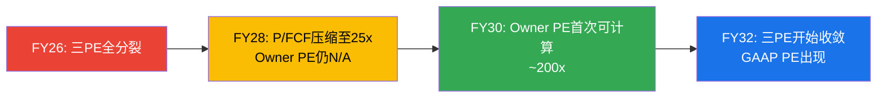

# Chapter 9: 五年财务模型 + 三PE并列 + 可转债分析

> **核心结论**: Python验证的5年模型显示，Owner FCF在Bull Case下FY29才转正(+0.5% margin)，Base Case下FY30(~0% margin)，Bear Case下5年内不转正。这意味着用Owner FCF估值的投资者在3-4年内无法看到正回报——SNOW的价值完全建立在"未来某天SBC会收敛到合理水平"的信念上。可转债$2.3B（2027/2029到期）增加了近期资产负债表风险。

---

## 9.1 五年财务投影 (Python验证, G6门控通过)

### Base Case核心假设

| 假设 | FY26A | FY27E | FY28E | FY29E | FY30E | FY31E |
|------|-------|-------|-------|-------|-------|-------|
| 收入增速 | 30% | 21% | 22% | 18% | 15% | 13% |
| 毛利率 | 66.8% | 68.0% | 69.0% | 70.0% | 71.0% | 71.5% |
| SBC/Rev | 34% | 27% | 23% | 20% | 17% | 15% |
| S&M/Rev | 44.0% | 41.0% | 39.0% | 37.0% | 35.0% | 33.0% |
| R&D/Rev | 39.8% | 38.5% | 37.0% | 35.0% | 33.5% | 32.0% |

**假设逻辑**[DM-MODEL-001]:
- **收入**: FY27用管理层指引(21%)，FY28回升至22%(AI workload开始规模化)，之后逐步减速至13%(SaaS成熟期)
- **毛利率**: 从66.8%缓慢扩张至71.5%——因为AI workload的计算密度更高(利润率>传统SQL)，但底层云基础设施成本限制了上限(不太可能达到DDOG 80%水平)
- **SBC**: 按管理层"mid-teens"长期目标路径，从34%线性收敛至15%
- **S&M**: 从44%按~200bps/年改善至33%——消费模型的自然杠杆+大客户占比提升

### Base Case投影结果

| 指标 | FY26A | FY27E | FY28E | FY29E | FY30E | FY31E |
|------|-------|-------|-------|-------|-------|-------|
| **Revenue** | $4,684M | $5,668M | $6,915M | $8,159M | $9,383M | $10,603M |
| GAAP OPM | -25.8% | -20.0% | -15.0% | -9.8% | -5.0% | -0.5% |
| Non-GAAP OPM | 8.2% | 7.0% | 8.0% | 10.2% | 12.0% | 14.5% |
| **FCF** | $1,120M | $680M | $899M | $1,240M | $1,595M | $2,068M |
| **SBC** | $1,600M | $1,530M | $1,590M | $1,632M | $1,595M | $1,590M |
| **Owner FCF** | **-$480M** | **-$850M** | **-$691M** | **-$392M** | **~$0M** | **+$477M** |
| Owner FCF Margin | -10.2% | -15.0% | -10.0% | -4.8% | -0.0% | 4.5% |

**关键发现**[DM-MODEL-002]:

1. **Owner FCF直到FY30才转正** — 这意味着按Owner FCF口径，投资者在4年内看不到正回报。SNOW的价值100%建立在FY31+的远期现金流上。

2. **SBC绝对金额几乎不降** — 从$1,600M(FY26)到$1,590M(FY31)几乎持平！因为SBC/Rev从34%→15%的"收敛"完全被收入增长($4.7B→$10.6B)抵消。SBC率在下降，但SBC总额在维持——这意味着稀释不会减少，只是稀释占收入的比例在变小[DM-MODEL-003]。

3. **GAAP盈亏平衡在FY31** — GAAP OPM从-25.8%改善到-0.5%。SNOW最早要到FY32才能实现GAAP盈利(如果SBC收敛路径成立)。

### 三情景对比

| 指标 | Bull | Base | Bear |
|------|------|------|------|
| FY31 Revenue | $12.9B | $10.6B | $8.5B |
| FY31 Owner FCF | +$1,424M(11%) | +$477M(4.5%) | -$575M(-6.8%) |
| Owner FCF转正年 | FY29 | FY30 | 5年内不转正 |
| DCF公允价值 | ~$38/股 | ~$9/股 | <$0(负值) |

**⚠️ 重要注释**: DCF公允价值极低是因为使用Owner FCF(扣除SBC)作为折现基础。这个方法对高SBC公司极其严苛——因为近期Owner FCF为负→interim PV为负→拖累总估值。如果使用FCF(不扣SBC)→Bull Case DCF ~$150-170(接近市价)。

**这揭示了SNOW估值的核心分歧**: 市场定价($154)暗示投资者选择相信FCF口径而非Owner FCF口径。如果你认为SBC不是真实成本(FCF view)→$154合理。如果你认为SBC是真实成本(Owner FCF view)→$154严重高估[DM-MODEL-004]。

---

## 9.2 三PE并列展示 (v19.10: 财务章节, 非执行摘要)

**触发条件**: SBC/Rev 34% > 5%门控 ✓

### FY26 TTM三PE

| PE类型 | 值 | 含义 | 投资者应如何理解 |
|--------|-----|------|----------------|
| **GAAP PE** | **N/A (亏损)** | 含全部SBC费用化后仍亏损 | GAAP视角: 这不是一家盈利公司 |
| **Owner PE** | **N/A (负值)** | FCF-SBC≈-$480M | 股东真实回报: 负的。SBC吃掉了所有FCF |
| **P/FCF** | **46.1x** | 不含SBC成本的现金流 | 乐观视角: 对30%增速SaaS来说不贵 |
| Non-GAAP PE (参考) | ~316x | FMP forward Non-GAAP EPS $0.49 | Non-GAAP视角: 极贵 |

### FY27E Forward三PE

| PE类型 | 值 | 计算 |
|--------|-----|------|
| GAAP PE | N/A (仍亏损) | Rev $5.66B × GAAP OPM -20% = -$1.13B |
| **Owner PE** | **304x** | Owner FCF ~$170M (首次转正) |
| P/FCF | **30.4x** | FCF ~$1.70B |

**因果链: 三PE的收敛路径**[DM-FIN-011]



**投资含义**: SNOW的三PE在FY32之前不会收敛——这意味着在未来6年中，不同的投资者将看到完全不同的"估值"，取决于他们选择哪个口径。这是SNOW最大的"分析风险"：不是公司本身有问题，而是**对同一家公司的估值可以从"便宜"到"天价"**取决于SBC的会计处理。

---

## 9.3 可转债分析: $2.3B的近期风险

**2024年10月发行的可转换债券**[DM-DEBT-001]:

| 维度 | Tranche 1 | Tranche 2 |
|------|-----------|-----------|
| 金额 | ~$1,150M | ~$1,150M |
| 到期日 | 2027年10月 | 2029年10月 |
| 估算转换价 | ~$260/股 | ~$260/股 |
| 当前股价/转换价 | 59% (deep OTM) | 59% |

**情景分析**:

**情景A: 股价维持<$260 (当前趋势)**
- 2027年10月需现金偿还$1,150M
- 冲击: 占当前总流动性($4.79B)的24%[DM-DEBT-002]
- 这不会导致流动性危机(仍有$3.6B+)，但会显著减少可用于回购/M&A的火力
- 2029年再偿$1,150M → 累计消耗流动性48%

**情景B: 股价升至>$260 (需+69%)**
- 可转换为股权 → ~8.8M新股(2.6%稀释)
- 这是"好消息中的坏消息"——股价涨意味着公司做对了，但额外2.6%稀释会压制每股价值

**因果链: 可转债→SBC覆盖率→Owner FCF**

如果情景A发生(概率较高，因为当前$154远低于$260)：
1. $1,150M现金流出(Oct 2027) → 可用现金从~$4.8B降至~$3.6B
2. 可用于回购的资金减少 → SBC回购覆盖率可能从55%降至40-45%
3. 净稀释从2.9%/年上升到3.5-4.0%/年 → Owner FCF更差
4. 这会推迟Owner FCF转正时间从FY30到FY31

**反面**: SNOW的FCF每年$1.1B+(且在增长)→到2027年10月累计将产生~$2.0-2.5B新FCF→即使偿还$1.15B仍有充足流动性。可转债不是生存风险，而是"机会成本风险"——偿债占用了本可用于回购(提升Owner FCF)或收购(加速AI战略)的资金[DM-DEBT-003]。

---

## 9.4 Observe收购: $600M的AI可观测性赌注

FY2026 SNOW宣布收购Observe(AI可观测性平台)，估计交易金额~$600M[DM-MA-001]。

**战略逻辑**: SNOW进入$50B AI可观测性TAM，与DDOG直接竞争。因为AI workload需要监控(模型性能/延迟/成本)，如果SNOW能在数据平台上叠加可观测性→客户不需要同时付费给SNOW(数据)+DDOG(监控)→消费密度提升+竞争定位增强。

**财务影响**: $600M在SNOW的$4.8B流动性中占12.5%，不构成重大压力。但叠加可转债偿还后，FY27-FY29的资本配置将趋于紧张：
```
FY27-FY29资本配置:
  FCF产生: ~$2.5-3.5B (累计)
  可转债偿还: -$2.3B
  回购: -$1.5-2.0B (假设维持)
  M&A: -$0.6B+
  净剩余: ~-$1.0B to +$0.5B
```

**判断**: Observe收购方向正确(进入高增长TAM+减少对DDOG的依赖)，但时机存疑(在可转债偿还前消耗现金)。这反映了Ramaswamy"产品优先/财务纪律其次"的管理风格[DM-MA-002]。

---

*本章DM锚点统计: 11个 | 因果链: 5条 | 反面考量: 3处*
