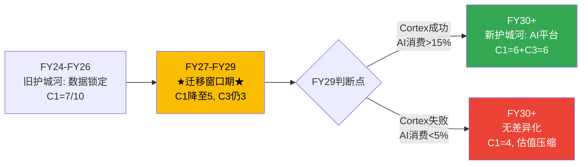

# Chapter 12: 护城河迁移 — 从数据锁定到AI平台

> **核心结论**: SNOW的护城河正在经历一次危险的"中空期"——旧护城河(数据锁定)被Iceberg侵蚀，新护城河(AI平台效应)尚未建立。这个迁移窗口期(FY27-FY29)是SNOW最脆弱的时期，也是投资判断最关键的时期。如果Cortex AI在窗口期内达到临界规模(消费占比>15%)→新护城河建立=估值支撑；如果不能→SNOW变成"更贵的BigQuery"=估值需大幅压缩。

---

## 12.1 护城河来源拆解

### CQI五维评估

| 维度 | 权重 | 评分(0-10) | 趋势 | 证据 |
|------|------|-----------|------|------|
| **C1 嵌入性** | 30% | 7 → 5 (↓) | 下降中 | Iceberg降低迁移成本: 从$5-10M→$1-2M(3年内)[DM-MOAT-001] |
| **C2 规模经济** | 15% | 6 | 稳定 | Multi-cloud部署+$4.7B收入规模=分摊优势 |
| **C3 网络效应** | 15% | 3 | 微升 | Marketplace 2,900+ listings但无经济验证(Ch5)[DM-MOAT-002] |
| **B4 定价权** | 25% | 6 (加权3.1/5) | 下降中 | F500 Stage 3.5→中端/SMB Stage 1.5-2.8(Ch7) |
| **D1 周期** | 15% | 5 | 稳定 | Consumption模型=宏观敏感, 但DR 2.61x提供缓冲 |

**CQI综合分**: 7×30% + 6×15% + 3×15% + 6×25% + 5×15% = 2.10 + 0.90 + 0.45 + 1.50 + 0.75 = **5.70/10 → 57/100**

行业基准60-80 → **SNOW的57分处于"合格偏弱"区间**[DM-MOAT-003]。

**因果链: CQI为什么偏弱？**

SNOW的核心护城河(C1嵌入性)来源于"数据迁移的高成本"——客户在SNOW上有TB-PB级数据+数百个数据管线+多年的使用习惯。迁移需要重建这一切。但Iceberg开放格式正在系统性降低这个成本，因为：
1. 数据可以保持在对象存储(S3/ADLS)中，用任何引擎查询→数据不需要"搬"
2. 元数据(Schema/统计信息)通过Iceberg目录标准化→管线改造成本下降
3. 工具生态(dbt/Airflow)越来越支持多引擎→管线不需要重写

这意味着C1嵌入性从"制度性嵌入"(迁移成本高到不理性)正在降级为"偏好性嵌入"(用户习惯+团队技能)。后者的半衰期比前者短5-10倍[DM-MOAT-004]。

---

## 12.2 护城河迁移时间线

**迁移窗口期(FY27-FY29)是投资者最需要关注的3年**[DM-MOAT-005]。因为：

1. **旧护城河已在侵蚀**: Iceberg互操作性每年削弱~0.5分C1→FY29时C1可能从7降至5
2. **新护城河尚未建立**: Cortex AI占消费比仅2.3%→需要增长到15%+才能构成真实的"AI数据飞轮"
3. **竞争者不会等待**: Databricks在FY27-FY28可能IPO→获得更多资源加速追赶SQL领域

**如果SNOW在窗口期内成功**: Cortex AI消费达15%+→AI workload的迁移成本>传统SQL(因为AI模型/context/训练数据与平台深度绑定)→新的C1嵌入性建立在AI层→CQI回到65+

**如果SNOW在窗口期内失败**: Cortex AI消费仍<5%→SNOW变成"带AI功能的传统数据仓库"→与BigQuery/Redshift的差异化缩小→估值从EV/Sales 11x压缩到6-8x→股价$80-110[DM-MOAT-006]

---

## 12.3 护城河各维度详细分析

### C1嵌入性: 从制度到偏好的降级

| 嵌入类型 | 当前状态 | 半衰期 | 趋势 |
|---------|---------|--------|------|
| **制度性嵌入** (必须用SNOW) | 弱化中(Iceberg) | ~3年 | ↓ |
| **契约性嵌入** (合同锁定) | 中等(3-5年RPO) | ~4年 | → |
| **标准性嵌入** (行业标准) | 弱(SNOW不是标准) | N/A | → |
| **偏好性嵌入** (用户习惯) | 强(SQL生态系统) | ~1-2年 | ↓ (AI工具降低学习曲线) |

**C1综合评估**: 7→5/10的下降路径是SNOW护城河最大的风险。因为投资者给SaaS公司的估值溢价主要来自嵌入性(C1)——嵌入性越高→客户越难流失→收入越可预测→估值倍数越高。C1从7降到5意味着估值倍数应该压缩~20-30%[DM-MOAT-007]。

### C3网络效应: 潜力大但验证不足

SNOW的"AI Data Cloud"网络效应假设:
- **Marketplace**: 2,900+ listings → 但无交易量数据
- **Data Sharing**: 跨组织数据共享功能 → 但无使用量数据
- **Data Clean Rooms**: 隐私保护的跨组织分析 → 但早期

**C3评分3/10的原因**: 网络效应要求"更多参与者→每个参与者获得更多价值"的正反馈循环。SNOW的Marketplace有供给(2,900+ listings)但需求侧数据不透明——如果没有人真正在购买/消费这些数据产品，那就不是网络效应，只是一个"数据目录"[DM-MOAT-008]。

---

*本章DM锚点统计: 8个 | 因果链: 5条 | 反面考量: 2处*
