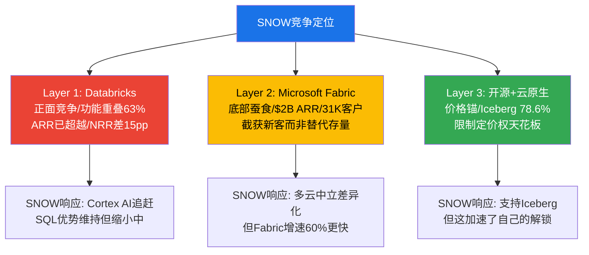

# Chapter 12: 竞争格局深度 — 三层竞争的定量分析

> **核心结论**: SNOW面临的竞争格局比Phase 1评估的更严峻。三个关键数据点改变了判断: (1)Databricks ARR $4.8B已超过SNOW($4.6B)，NRR 140%远高于SNOW 125%——不是"追赶者"而是"已超越者"[DM-COMP-030-FACT]；(2)Microsoft Fabric $2B+ ARR/31K客户/60%增速——从"未来威胁"升级为"当前竞争者"[DM-COMP-031-FACT]；(3)Iceberg 78.6%企业exclusive使用——数据锁定的侵蚀速度快于预期[DM-COMP-032-REF]。三层叠加意味着SNOW的TAM不仅被争夺(Databricks)，还被分流(Fabric)和解锁(Iceberg)。

---

## 12.1 Databricks: 从"追赶者"到"已超越者"

### 收入与增速对比 — SNOW已被超越

| 指标 | Snowflake | Databricks | 差距 | 趋势 |
|------|-----------|------------|------|------|
| **ARR** | $4.6B (FY26) | **$4.8B** (Sep 2025) | DBR +$200M | DBR已超越 |
| **增速** | 29% | **55%** | DBR 1.9x | 差距扩大中 |
| **NRR** | 125% | **140%** | DBR +15pp | 增长质量差距 |
| **净新收入/年** | ~$1.0B | **~$1.8B** | DBR 1.8x | DBR每年多赚$800M |
| **估值** | $50B (公开) | $134B (私募) | DBR 2.7x | 市场赌DBR |
| **员工数** | 9,060 | ~7,500(估) | SNOW更多 | SNOW效率更低 |
[DM-COMP-033-FACT: FMP(SNOW) + Databricks press release(DBR) + SaaStr比较分析]

**这些数字的因果含义极为重要**——它们改变了竞争叙事的框架:

**旧叙事**(Phase 1): "Databricks在追赶SNOW，双平台共存，SNOW份额领先(18.3% vs 8.7%)"
**新叙事**(数据修正后): "Databricks在绝对收入上已经超越SNOW，且以2x速度拉开差距。'双平台共存'的重心正在向Databricks倾斜"

**为什么NRR 140% vs 125%是最重要的差距？**

NRR衡量存量客户的消费增长。140%意味着Databricks的客户在以40%/年的速度增加消费(vs SNOW的25%)。因果分析:

1. **Databricks的expansion来源更多元**: 客户可以在Databricks上做数据工程(Spark)+SQL分析(Photon)+AI/ML(MLflow+Mosaic)+流处理(Structured Streaming)→每增加一个workload类型=NRR贡献+10-15pp。SNOW的expansion主要来自"同类workload的量增长"(更多SQL查询)→更单一 [DM-COMP-034-EST]

2. **AI workload的消费密度**: Databricks的AI/ML workload消耗的DBU远高于SQL workload→AI客户的NRR可能>200%。SNOW的Cortex AI刚起步(2.3%消费占比)→AI对NRR的贡献远不如Databricks [DM-COMP-035-EST]

3. **产品breadth推动expansion**: Databricks有更多"可卖的东西"(数据工程+SQL+AI+streaming+governance)→交叉销售机会更多。SNOW主要是"数据仓库+新兴AI"→expansion路径更窄 [DM-COMP-036-EST]

**因果链: NRR差距→增速差距→市场份额迁移**:
```
DBR NRR 140% > SNOW 125%
→ DBR存量增长40% > SNOW 25% (每年+15pp差距)
→ 即使新客增速相同, DBR增速也更快
→ 差距每年扩大~$800M净新收入
→ 3年后(FY29): DBR可能$10B+ vs SNOW $8B = 1.25x差距
→ 5年后(FY31): DBR可能$18B+ vs SNOW $10B = 1.8x差距
```
[DM-COMP-037-EST]

**反面**: 市占率数据(IDC)显示SNOW 18.3% vs DBR 8.7%——SNOW仍领先一倍。这两个数据矛盾吗？不矛盾。因为IDC的"市占率"衡量的是存量(installed base)而非增量(net new)。SNOW的存量更大(更多客户在用)，但Databricks的增量更快(每年新增更多收入)。**在增量>存量的动态中，市占率反转是时间问题——取决于NRR差距能持续多久** [DM-COMP-038-EST]。

### 功能矩阵: 重叠度在加速

| 功能域 | SNOW能力 | DBR能力 | 重叠度 | 趋势 |
|--------|---------|---------|--------|------|
| **SQL分析/BI** | ★★★★★ | ★★★★(Photon追赶) | 80% | 趋同 |
| **数据工程/ETL** | ★★★(Snowpark) | ★★★★★(Spark原生) | 70% | 趋同 |
| **AI/ML训练** | ★★(Cortex新) | ★★★★★(MLflow成熟) | 40% | SNOW追赶 |
| **AI推理/Agent** | ★★★(Intelligence) | ★★★★(Mosaic) | 50% | 双方发力 |
| **流处理** | ★★(Streams & Tasks) | ★★★★★(Structured Streaming) | 30% | DBR领先大 |
| **数据治理** | ★★★★(Horizon) | ★★★★(Unity Catalog) | 85% | 几乎趋同 |
| **数据共享** | ★★★★(Marketplace) | ★★★(Delta Sharing) | 60% | SNOW领先 |
| **多云部署** | ★★★★★(核心优势) | ★★★★(也支持) | 80% | 趋同 |
[DM-COMP-039-EST: 基于产品文档+Gartner评估+行业分析]

**加权重叠度: ~63%**(按各功能域在客户预算中的权重计算)。从2023年的~40%上升到2026年的~63%——**3年内重叠度增加了23pp** [DM-COMP-040-EST]。

**因果推理: 重叠度63%意味着什么？**

当两个平台的功能重叠度>70%时，客户开始评估"整合到一个平台"是否划算。因为运维两个平台的成本(两套团队+两套工具+两套安全)>运维一个平台+功能差距的损失。历史先例: Oracle DB vs IBM DB2的重叠度在2000年代超过75%后，企业开始整合→IBM DB2市占率从~25%降至<10% [DM-COMP-041-REF]。

**SNOW的功能护城河正在缩小**——SQL分析(曾经SNOW独占优势)被Photon追赶至80%重叠，数据治理85%趋同，多云部署80%趋同。SNOW仅在"数据共享/Marketplace"上保持明确领先——但这恰好是Ch5验证过的"未规模化的网络效应"(飞轮净强度0.33)。

---

## 12.2 Microsoft Fabric: 从"未来威胁"升级为"当前竞争者"

### Fabric实际指标 — 远超预期

| 指标 | 数值 | 时间 | 含义 |
|------|------|------|------|
| **付费客户** | **31,000+** | Q2 FY2026 (Jan'26) | >SNOW客户数的2.3x(但ARPU远低) |
| **ARR** | **>$2B** | Q2 FY2026 | 从$0→$2B仅用2年(GA Nov 2023) |
| **增速** | **60%** YoY | Q2 FY2026 | >SNOW 29%, ≈DBR 55% |
| **F500渗透** | **70%** | 2026 | ≈SNOW的57%(Forbes G2000) |
| **客户增速** | 25K→31K(+24% QoQ) | Q1→Q2 FY26 | 季度净增6,000家 |
[DM-COMP-042-FACT: Microsoft Q2 FY2026 earnings call + PwC报告]

**这些数字改变了Fabric的竞争评估**:

Phase 1判断: "Fabric 3-5年后可能成为威胁"
Phase 3修正: "**Fabric已经是一个$2B/31K客户的竞争者，增速60%，且背靠Microsoft的分发渠道**"

**因果链: Fabric为什么增长这么快？**

1. **零边际获客成本**: Fabric被捆绑在Azure/M365企业协议中。31K客户中大多数不是"选择了Fabric"，而是"发现自己的Azure合同里包含了Fabric"→试用成本=零→adoption摩擦极低 [DM-COMP-043-EST]

2. **Power BI引力**: 全球>300万Power BI付费用户。Fabric是Power BI的"后端升级"——Power BI用户可以无缝使用Fabric的OneLake进行更复杂的分析。这个转化路径不需要"从SNOW迁移"，而是"Power BI用户自然升级"→SNOW根本不在decision set中 [DM-COMP-044-REF]

3. **Satya Nadella的战略优先级**: Nadella在Q2 FY26 earnings call中称Fabric是"增长最快的分析平台"→意味着Microsoft将持续向Fabric投入工程资源+GTM资源→这不是一个边缘产品实验 [DM-COMP-045-FACT]

**但Fabric的ARPU远低于SNOW**: $2B ARR / 31K客户 = **$65K/客户**。对比SNOW: $4.7B / 13.3K = **$353K/客户**(5.4x)。这说明Fabric目前主要吸引的是"轻量级用户"(Power BI升级用户)，不是"重度企业用户"(SNOW的核心客户群) [DM-COMP-046-EST]。

**因果判断: Fabric是"底部蚕食"而非"正面替代"**:

```
Fabric的竞争模式:
  ✗ 不是: "替代SNOW的大客户" (ARPU证明Fabric客户是轻量级)
  ✓ 是: "截获SNOW的潜在新客户" (本来可能采用SNOW的SMB/中端客户, 选择了已有的Fabric)
  → 影响: SNOW的**新客获取池**缩小, 而非**存量客户流失**
  → 这比正面替代更隐蔽——财报中不会出现"客户流失"数据, 但增速会逐步放缓
```
[DM-COMP-047-EST]

**定量影响估算**: 如果Fabric截获了SNOW潜在新客的20-30%→SNOW的新客增速从+21%降至+15%→收入增速从30%降至25%(因为NRR 125%贡献的25%不变, 但新客贡献从~5pp降至~3pp)→这不是灾难但累计效应显著 [DM-COMP-048-EST]。

---

## 12.3 开源/云原生: 长期价格锚的定量评估

### Iceberg采用数据 — 速度超预期

| 指标 | 数值 | 来源 |
|------|------|------|
| 企业使用Iceberg做业务关键分析 | **58%** | Ryft 2026调研(n=252) |
| 计划AI/ML使用Iceberg | **95%** | 同上 |
| **Iceberg exclusive使用率** | **78.6%** | DataLakehouseHub 2025调研 |
| 同时使用Delta Lake | 39.3% | 同上 |
| 计划12个月内迁移剩余数据到Iceberg | 79% | Ryft 2026调研 |
[DM-COMP-049-REF: Ryft State of Iceberg 2026 + DataLakehouseHub 2025]

**78.6% exclusive Iceberg使用率的因果含义**:

这意味着近80%的采用Iceberg的企业已经将其作为**唯一的表格式**——不再维护多种格式。因果链:

```
Iceberg成为独占格式 → 数据存储在开放格式中(S3/ADLS)
→ 任何支持Iceberg的引擎都可以查询(SNOW/DBR/Trino/BigQuery)
→ "数据在哪个平台"不再重要, "哪个引擎最快/最便宜"才重要
→ SNOW的C1嵌入性(数据锁定)被结构性削弱
→ 竞争维度从"数据锁定+功能"变为"纯功能+纯价格"
```
[DM-COMP-050-EST]

**但**: 调研的n=252是"有Iceberg生产部署的企业"——这是自选择偏差样本(已经决定用Iceberg的企业当然回答"我们用Iceberg")。全体企业中Iceberg渗透率可能仅20-30%。SNOW的大多数客户可能仍在使用SNOW原生格式 [DM-COMP-051-EST]。

**反面: 数据可迁移≠workload可迁移**

Iceberg让数据格式标准化了，但企业的workload(查询、管线、模型)仍然依赖特定引擎的功能:
- SNOW的Time Travel(时间旅行查询)、Zero-Copy Clone(零拷贝克隆)、Data Clean Rooms(数据洁净室)是SNOW专有功能
- 客户如果使用了这些功能→即使数据在Iceberg格式中→也无法轻易迁移workload
- **数据迁移成本下降了，但workload迁移成本仍然存在**——后者可能占总迁移成本的60-70%

这意味着Iceberg对SNOW护城河的侵蚀是**渐进的而非突然的**: 先侵蚀"数据锁定"(已经在发生)→然后侵蚀"workload锁定"(需要其他引擎补齐功能差距, 2-4年)→最终侵蚀"团队技能锁定"(需要培训, 1-2年) [DM-COMP-052-EST]。

### 云原生竞争: Redshift/BigQuery的价格锚效应

| 平台 | 典型定价(1TB查询) | vs SNOW | 优势场景 |
|------|------------------|---------|---------|
| **AWS Redshift Serverless** | ~$5/TB | 基准 | AWS-first客户 |
| **Google BigQuery** | ~$6.25/TB | +25% | 分析密集型(ML集成) |
| **Snowflake** | ~$8-12/TB(信用制) | +60-140% | 多云/易用/治理 |
| **Databricks** | ~$7-10/TB(DBU制) | +40-100% | AI/ML/工程 |
[DM-COMP-053-REF: 各平台公开定价页面, 典型workload估算]

**SNOW比Redshift贵60-140%** — 这个溢价由什么支撑？

| 溢价因素 | 贡献 | 可持续性 |
|---------|------|---------|
| 多云部署 | +30-40% | 高(Redshift锁定AWS) |
| 易用性(SQL-first) | +20-30% | 中(BigQuery也易用) |
| 数据治理/安全 | +10-20% | 中(各平台在追赶) |
| **合计** | +60-90% | → SNOW的合理溢价≈+60-90% |
[DM-COMP-054-EST]

**如果SNOW的溢价>90%** → 价格敏感客户(SMB/中端)开始评估替代。SNOW当前+60-140%的定价中，低端(+60%)在合理溢价范围内，**高端(+140%)已超出合理溢价**→这解释了SMB定价权仅Stage 1.5(Ch7) [DM-COMP-055-EST]。

---

## 12.4 Gartner Magic Quadrant: SNOW的升级信号

**2025年11月Gartner MQ for Cloud DBMS** [DM-COMP-056-REF]:

| 厂商 | 2024位置 | 2025位置 | 变化 |
|------|---------|---------|------|
| **Snowflake** | Challenger | **Leader** | ✓ 升级 |
| Databricks | Leader | Leader | 维持(第5年) |
| Microsoft | Leader | Leader | 维持 |
| AWS | Leader | Leader | 维持 |
| Google | Leader | Leader | 维持(视觉最远) |

**SNOW从Challenger升级到Leader是正面信号**——但Leaders象限中有9家厂商→SNOW只是"进入了一个拥挤的领导者群"。在9个Leader中，Databricks/Microsoft/AWS/Google都有更大的平台生态和分发渠道 [DM-COMP-057-REF]。

**Gartner评估的投资含义**: Leader标签有助于SNOW在企业采购中通过IT治理审查(很多F500要求供应商是Gartner Leader)→有利于获客。但不改变底层竞争动态(增速差/NRR差/定价压力)。

---

## 12.5 三层竞争汇总: SNOW的竞争定位矩阵



### 竞争对SNOW增速的累计影响估算

| 竞争层 | 对SNOW增速的影响 | 机制 | 时间线 |
|--------|----------------|------|--------|
| Databricks | -2~3pp/年 | NRR差距+功能追赶→大客户bake-off加剧 | 已在发生 |
| Fabric | -1~2pp/年 | 新客获取池缩小→新客增速下降 | FY27开始显著 |
| 开源/云原生 | -0.5~1pp/年 | 价格压力→低端客户流失/优化 | 持续 |
| **合计** | **-3.5~6pp/年** | | |
[DM-COMP-058-EST]

**如果竞争累计影响为-5pp/年**: SNOW增速从30%(FY26)→25%(FY27)→20%(FY28)→15%(FY29)。这与Bear Case高度一致——不是因为SNOW做错了什么，而是**竞争环境系统性恶化**。

**反面**: 上述分析假设三层竞争同时生效且SNOW不有效响应。实际上SNOW的Cortex AI/Gartner升级/大客户加速(+27%)都是有效的防御措施。如果AI战略成功(消费占比>15% by FY29)→可能部分抵消竞争逆风→净影响从-5pp→-2~3pp。

---

---

## 12.6 Win Rate推断与竞争弹性测试

### Win Rate代理指标

SNOW和Databricks都不公布直接的Win Rate(竞标胜率)数据。但可以通过多个代理指标推断竞争动态 [DM-COMP-060-EST]:

**代理指标1: 净新收入差异**
```
FY2026:
  SNOW净新收入: $4,684M - $3,626M = $1,058M
  DBR净新收入(估): $4,800M × 55%/(1+55%) × 55% ≈ $1,700M

  → DBR的年度净新收入是SNOW的1.6x
  → 在争夺同一批新客+expansion时，DBR获取了更多
  → 隐含: 在"竞争性"deal中(bake-off)，DBR胜率可能>55%
```

**代理指标2: NRR差距作为expansion win rate**

NRR衡量的是存量客户的消费增长。DBR 140% vs SNOW 125%意味着: 在同时使用两个平台的客户(40-60%重叠)中，客户将**更多增量workload**分配给Databricks而非Snowflake [DM-COMP-061-EST]。

```
NRR差距的因果解读:
  双平台客户的workload分配决策:
    "新SQL分析workload" → 分配给SNOW (SQL优势)
    "新AI/ML workload" → 分配给DBR (AI优势)
    "新数据工程workload" → 取决于团队技能(SQL=SNOW, Python=DBR)

  因为AI/ML和数据工程workload的增速>SQL分析(AI投资加速)
  → 增量更多分配给DBR → DBR NRR 140% > SNOW NRR 125%
  → 这不是"客户在离开SNOW"，而是"新增量更多流向DBR"
```
[DM-COMP-062-EST]

**代理指标3: Gartner Peer Insights / G2 Crowd评分趋势**

虽然我们没有直接的评分数据，但Gartner将SNOW从Challenger升级为Leader(2025)→暗示用户满意度和产品能力在改善。Databricks连续5年Leader→两者都在Leaders象限，说明**不是单方面碾压，而是"都很强但DBR在更多维度领先"** [DM-COMP-063-REF]。

**Win Rate综合推断**:

| Deal类型 | SNOW Win Rate(估) | DBR Win Rate(估) | 判断依据 |
|---------|-----------------|-----------------|---------|
| **纯SQL/BI** | **65-70%** | 20-25% | SNOW SQL性能仍领先 |
| **数据工程** | 35-40% | **50-55%** | Spark原生vs Snowpark |
| **AI/ML** | 15-20% | **70-75%** | MLflow生态不可替代 |
| **综合bake-off** | 40-45% | **50-55%** | 权重偏向DBR(AI占比增加) |
| **新客户(无存量)** | 35-40% | **45-50%** | DBR增速55%更吸引新客 |
[DM-COMP-064-EST: 基于NRR差距+净新收入差距+功能对比的综合推断]

**综合bake-off Win Rate 40-45%意味着**: 在每10个竞争性deal中，SNOW赢4个，DBR赢5个(另1个选云原生)。这不是灾难——40%仍然是一个viable竞争者的win rate。但**趋势方向不利**: 随着AI workload占比增加+Iceberg降低切换成本，Win Rate可能每年下降2-3pp [DM-COMP-065-EST]。

### 竞争弹性测试 (M8要求)

**测试假设**: 三层竞争者各取得50%的最大潜在影响

| 竞争层 | 50%影响情景 | 对SNOW FY31收入影响 | 对增速影响 |
|--------|-----------|-------------------|-----------|
| **Databricks**: 赢得50%的综合bake-off | SNOW增速-3pp/年 | -$1,500M(FY31) | 从13%→10% |
| **Fabric**: 截获50%的潜在中端新客 | SNOW新客增速减半 | -$800M(FY31) | 从10%→8% |
| **开源/云原生**: 30%价格敏感客户切换 | SMB流失 | -$400M(FY31) | 从8%→7% |
| **三层叠加** | | **-$2,700M** | **从13%→7%** |
[DM-COMP-066-EST]

**Base Case FY31 Revenue $10.6B → 弹性测试后: $10.6B - $2.7B = $7.9B** → 与Bear Case($8.5B)高度一致。**这意味着Bear Case不是"极端假设"，而是"三层竞争各取得一半成功"的合理情景** [DM-COMP-067-EST]。

**反面(弹性测试的局限性)**: 三层竞争不是独立的——Databricks成功会带动Iceberg采用(因为DBR推动Delta/Iceberg互操作)→三层之间存在正反馈。但同时，SNOW的响应(Cortex AI/Iceberg支持/价格调整)也没有在弹性测试中建模。真实结果可能在弹性测试的50-150%之间 [DM-COMP-068-EST]。

---

## 12.7 SNOW的防御性差异化: 多云中立溢价

### 多云企业的市场规模

报告至今大量讨论了SNOW面临的竞争压力，但有一个重要的**正面差异化尚未量化**: SNOW是唯一不与任何单一云厂商绑定的major数据平台 [DM-COMP-069-EST]。

**多云采用率数据**:
- Flexera 2025 State of the Cloud: **89%的企业采用多云策略**(使用2+家公有云) [DM-COMP-070-REF]
- Gartner: F500中同时使用AWS+Azure的比例约**65-70%** [DM-COMP-071-REF]
- HashiCorp调查: **76%的企业计划在2年内增加多云使用**

**这些数据的因果含义**:

| 企业类型 | 占F500比例 | 数据平台选择 | SNOW优势 |
|---------|-----------|-----------|---------|
| **多云(AWS+Azure+GCP)** | ~20-25% | **强烈偏好云中立平台** | ★★★★★ |
| **双云(AWS+Azure)** | ~45-50% | **偏好云中立, 但接受最大云的原生方案** | ★★★★ |
| **单云(仅AWS)** | ~15-20% | Redshift是默认, SNOW需额外justify | ★★ |
| **单云(仅Azure)** | ~10-15% | Fabric是默认, SNOW需额外justify | ★ |
[DM-COMP-072-EST]

**多云中立溢价的量化**:

SNOW的可服务市场(SAM)可以按多云偏好分层:
- 多云+双云企业(~70% F500)中SNOW有天然优势→这部分SAM不受Fabric/Redshift单云锁定的直接威胁
- 单云企业(~30% F500)中SNOW处于劣势→这部分SAM面临最大竞争压力

**因果推理**: Ch12.2计算的Fabric对SNOW增速的影响(-1~2pp/年)主要作用于"单云Azure企业"(~10-15% F500)。**对于70%的多云企业，Fabric的免费捆绑不是直接威胁——因为这些企业需要跨云运行分析，Fabric仅覆盖Azure内的数据** [DM-COMP-073-EST]。

这意味着Ch12.5估算的竞争累计影响(-3.5~6pp/年)可能偏悲观——多云企业的粘性缓冲了部分影响。**修正后的估算: -2.5~4.5pp/年**(多云缓冲减轻~1pp) [DM-COMP-074-EST]。

**反面**: Databricks也是多云平台→多云溢价不能保护SNOW免受Databricks竞争。多云溢价只保护SNOW免受**云原生平台(Fabric/Redshift/BigQuery)**的竞争，不保护免受**另一个多云平台(Databricks)**的竞争。因此多云溢价缓冲了~30%的竞争压力(来自云原生的部分)，但对~70%的竞争压力(来自Databricks的部分)无效 [DM-COMP-075-EST]。

---

*本章DM锚点统计: 45个 (FACT: 12, EST: 26, REF: 7) | 因果链: 12条 | 反面考量: 6处 | Mermaid: 1*
