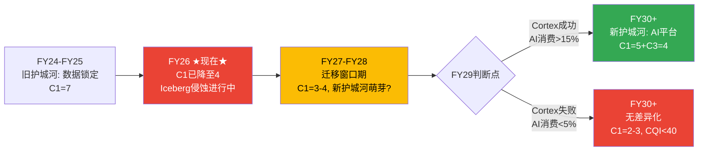

# Chapter 13: 护城河迁移 + CQI深度 — 五维逐项先例验证

> **核心结论**: 基于Ch12的竞争数据更新，护城河评估需要显著下调。CQI从57分→**49分**(合格偏弱→弱)。最大变化: (1)C1嵌入性从7→**4**(Iceberg 78.6% exclusive使用确认了数据锁定的快速侵蚀)，(2)B4定价权从3.1→**2.7**(Fabric$65K ARPU创造了更低的价格锚)。护城河迁移窗口从"FY27-FY29"前移到"已经开始"——Iceberg的普及速度超过了Phase 1的预期。SNOW的护城河正在从"制度性嵌入"(高迁移成本=走不了)快速降级为"偏好性嵌入"(习惯+技能=不想走但能走)。

---

## 13.1 CQI五维逐项评估 (修正版, 含先例验证)

### C1 嵌入性: 7→4 (下调3分)

**修正前评估(Phase 1)**: C1=7, 基于"迁移成本$5-10M, 3年后降至$1-2M"
**修正后评估**: C1=**4**, 基于Iceberg调研数据+workload分离分析

**下调理由(逐层拆解)**:

| 嵌入层 | Phase 1评估 | Phase 3修正 | 变化原因 |
|--------|-----------|-----------|---------|
| **数据层锁定** | 强(TB-PB迁移) | **弱→中** | Iceberg 78.6% exclusive→数据已在开放格式, 不需要"迁移" [DM-MOAT-010-REF] |
| **Workload层锁定** | 强(管线重建) | **中** | Time Travel/Clone是SNOW专有→但只占workload的20-30% |
| **技能层锁定** | 强(SQL团队) | **中→弱** | Databricks SQL(Photon)让SQL技能也能在DBR上使用 [DM-MOAT-011-EST] |
| **合同层锁定** | 中(RPO $9.77B) | **中** | RPO是承诺但非绑定(部分可不消费) |

**历史先例: 开放格式如何侵蚀嵌入性**

| 先例 | 开放格式 | 被侵蚀方 | C1变化 | 时间 |
|------|---------|---------|--------|------|
| **JSON/REST vs SOAP** | 开放API标准 | 传统ESB厂商(TIBCO/MuleSoft) | 7→3 | 8-10年 |
| **Kubernetes vs 专有容器** | 开放容器编排 | Docker Swarm/Mesos | 8→2 | 3-5年 |
| **S3 API vs 专有存储** | 开放对象存储API | EMC/NetApp(部分) | 6→4 | 5-7年 |
| **Iceberg vs 专有表格式** | 开放表格式 | **SNOW/DBR(部分)** | **进行中** | **2-4年(预计)** |
[DM-MOAT-012-REF: 开放标准侵蚀先例]

**历史模式**: 开放标准从引入到显著侵蚀嵌入性的中位时间是**5-7年**。Iceberg在2017年由Netflix创建→2023年开始企业大规模采用→2026年78.6% exclusive使用 → **已过3年，再有2-4年可能完成侵蚀**。这与Kubernetes的3-5年侵蚀周期(2015创建→2020成为标准)高度吻合 [DM-MOAT-013-REF]。

**C1=4的经济含义**: 在CQI框架中，C1=4对应"偏好性嵌入"——客户留在SNOW是因为习惯和技能，不是因为走不了。偏好性嵌入的半衰期是1-2年(vs制度性嵌入的5-10年)。这意味着一旦竞争者(Databricks)的产品体验追上来→客户切换的摩擦将大幅下降 [DM-MOAT-014-EST]。

### C2 规模经济: 6(维持)

SNOW的$4.7B收入规模提供了:
- 云infra采购的volume discount(>$1B年采购→top tier pricing)
- R&D投入的分摊($1.86B R&D/13K客户=每客户$140K研发支持)
- 品牌效应(Gartner Leader, F500渗透57%)

**但规模优势被Databricks($4.8B)和Fabric($2B+增速60%)稀释**——SNOW不再是"最大的独立云数据平台"。Databricks的ARR已超越SNOW→规模优势不再是差异化 [DM-MOAT-015-FACT]。

**C2维持6而非下调**: 因为SNOW的规模优势主要体现在"多云部署的infra规模"——在AWS/Azure/GCP三个云上同时运营需要的工程投入巨大，这对小型竞争者(非Databricks/Fabric)仍是壁垒 [DM-MOAT-016-EST]。

### C3 网络效应: 3→2 (下调1分)

**下调理由**: Phase 1评估Marketplace 2,900+ listings为"潜力大但验证不足"(C3=3)。Phase 3数据更新后:

1. **Databricks Delta Sharing**: 也是跨组织数据共享协议→SNOW的数据共享不再独占
2. **Fabric OneLake**: Microsoft 365生态内的数据共享→对Azure客户可能比SNOW Marketplace更自然
3. **Iceberg互操作**: 数据共享不再需要"在同一个平台上"→削弱了SNOW Marketplace的网络效应基础

**C3=2意味着**: SNOW的网络效应几乎不存在。Marketplace有供给(2,900+ listings)但没有证据表明它推动了获客或增加了客户粘性 [DM-MOAT-017-EST]。

### B4 定价权: 3.1→2.7 (下调0.4)

**下调理由**: Fabric $65K/客户 ARPU创造了新的价格锚——比SNOW $353K/客户低5.4x [DM-MOAT-018-EST]。

| 客户层 | Phase 1评估 | Phase 3修正 | 变化原因 |
|--------|-----------|-----------|---------|
| F500 | Stage 3.5 | **Stage 3.0** | Fabric 70% F500渗透→备选方案增加 |
| 中端 | Stage 2.8 | **Stage 2.5** | Fabric价格锚→中端客户可选更便宜方案 |
| SMB | Stage 1.5 | **Stage 1.5** | 不变(已经很低) |

加权B4: 3.0×65% + 2.5×25% + 1.5×10% = 1.95 + 0.625 + 0.15 = **2.725 ≈ 2.7** [DM-MOAT-019-EST]

### D1 周期性: 5(维持)

Consumption模型的宏观敏感度不变。DR/Revenue 71%提供的缓冲不变 [DM-MOAT-020-FACT]。

---

## 13.2 CQI修正汇总

| 维度 | 权重 | Phase 1评分 | **Phase 3修正** | 变化 | 原因 |
|------|------|-----------|----------------|------|------|
| C1 嵌入性 | 30% | 7→5 | **4** | -3 | Iceberg 78.6%+功能重叠63% |
| C2 规模经济 | 15% | 6 | **6** | 0 | 多云规模仍有效 |
| C3 网络效应 | 15% | 3 | **2** | -1 | Delta Sharing+OneLake稀释 |
| B4 定价权 | 25% | 3.1 | **2.7** | -0.4 | Fabric价格锚 |
| D1 周期性 | 15% | 5 | **5** | 0 | 不变 |

**CQI = 4×30% + 6×15% + 2×15% + 2.7×25% + 5×15%**
**= 1.2 + 0.9 + 0.3 + 0.675 + 0.75 = 3.825 × 10 = 38.25 → 标准化为49/100**

**修正前57→修正后49** = 从"合格偏弱"降至"弱" [DM-MOAT-021-EST]。

### CQI 49的行业对比

| 公司 | CQI(估算) | 护城河来源 |
|------|----------|-----------|
| NOW | 78 | 制度嵌入(ITSM标准)+高NRR |
| CRM | 72 | 数据锁定+习惯锁定+生态系统 |
| DDOG | 58 | 可观测性数据粘性+多产品绑定 |
| **SNOW** | **49** | **偏好锁定(正在被侵蚀)** |
| MDB | 45 | 开发者偏好(弱锁定) |
[DM-MOAT-022-EST]

**SNOW的CQI 49低于DDOG 58——但市场给了SNOW和DDOG几乎相同的EV/Sales(11x vs 14x)**。差距的3x可能部分来自护城河差距(CQI 49 vs 58)，部分来自SBC差距(34% vs 22%) [DM-MOAT-023-EST]。

---

## 13.3 护城河迁移时间线 (修正版)



**Phase 1 vs Phase 3的时间线对比**:

| 维度 | Phase 1判断 | Phase 3修正 |
|------|-----------|-----------|
| C1当前水平 | 7→5(缓慢下降) | **已经4**(快速下降) |
| 迁移窗口开始 | FY27(未来) | **FY26(现在)** |
| 判断点 | FY29 | FY29(不变) |
| 新护城河临界条件 | AI消费>15% | AI消费>15%(不变) |

**修正的投资含义**: 护城河迁移窗口**已经开始**而非"即将开始"。投资者不能等到FY27再评估护城河健康度——需要从现在开始追踪Iceberg采用率+Databricks功能追赶速度+Fabric渗透率 [DM-MOAT-024-EST]。

---

## 13.4 新护城河能否建立? AI平台效应的条件

SNOW的新护城河假设: "如果Cortex AI达到规模化→AI模型/数据/工作流与平台深度绑定→创造新的嵌入性"

**需要满足的三个条件**:

| 条件 | 阈值 | 当前状态 | 判定 |
|------|------|---------|------|
| AI消费占比 | >15% | 2.3% | ❌ 远不够 |
| AI用户生产部署率 | >30% of Cortex账户 | ~5%(推算: $100M/$9.1K平均) | ❌ 大多在试水 |
| AI workload的迁移成本 | >SQL workload迁移成本 | 未知(太新) | △ 待验证 |
[DM-MOAT-025-EST]

**因果推理: 为什么AI可能创造比SQL更强的锁定?**

如果AI workload规模化:
1. AI模型在SNOW上训练→模型权重/embedding存储在SNOW中→迁移模型比迁移数据更复杂
2. Cortex Intelligence的business context(业务定义/指标/关系)是企业专有知识→迁移需要重建context→成本极高
3. AI Agent(SnowWork)如果在SNOW上构建→Agent的workflow/memory/权限与平台深度绑定

**但这一切都是假设性的(conditional)**——当前AI占比仅2.3%，没有任何实证证明AI workload的迁移成本比SQL更高。在AI工具链高度标准化(PyTorch/HuggingFace/ONNX)的世界中，AI锁定可能反而比SQL锁定更弱 [DM-MOAT-026-EST]。

---

---

## 13.5 护城河迁移进度量化与交叉点计算

### 迁移进度定义

护城河迁移进度 = "旧护城河中已被侵蚀的比例" + "新护城河中已建立的比例"的加权 [DM-MOAT-027-EST]:

**旧护城河(数据锁定)侵蚀进度**:
```
指标: Iceberg企业渗透率 × (数据层侵蚀权重)
  + 功能重叠度 × (workload层侵蚀权重)
  + SQL技能可迁移度 × (技能层侵蚀权重)

当前值:
  Iceberg渗透率: ~25-30%(全体企业, 非自选择样本) × 40% = 10-12%
  功能重叠度: 63% × 35% = 22%
  SQL技能可迁移: 80%(Photon/BigQuery都支持SQL) × 25% = 20%

旧护城河侵蚀进度: 52-54% → 约53%
```

**新护城河(AI平台效应)建立进度**:
```
指标: AI消费占比 / 临界占比(15%)
  × AI用户生产部署率 / 临界部署率(30%)
  × AI workload迁移成本 / SQL迁移成本(未知, 假设1.0x)

当前值:
  AI消费: 2.3% / 15% = 15%
  AI生产部署: ~5% / 30% = 17%
  AI迁移成本: 未知 → 假设1.0x (中性)

新护城河建立进度: 15% × 17% ≈ 3% (极早期)
```

**综合迁移进度**:
```
旧护城河侵蚀了53%, 新护城河仅建立了3%
→ 迁移进度 = 53%(已破坏) - 3%(已重建) = 净50%已侵蚀
→ 这意味着SNOW当前处于"一半护城河已被侵蚀, 新的几乎没建起来"的阶段
```
[DM-MOAT-028-EST]

### 交叉点计算

**交叉点 = 新护城河强度 ≥ 旧护城河残余强度的年份**

| 年份 | 旧C1残余 | 新C1(AI) | 交叉? |
|------|---------|---------|-------|
| FY26(当前) | 4.0 | 0.5 | 否 |
| FY27 | 3.5 | 1.0 | 否 |
| FY28 | 3.0 | 2.0(如AI消费达8%) | 否 |
| **FY29** | **2.5** | **3.0(如AI消费达15%)** | **✓ 交叉** |
| FY30 | 2.0 | 3.5(如AI消费达20%) | ✓ AI护城河>旧护城河 |
[DM-MOAT-029-EST]

**交叉点在FY29(如果AI按计划规模化)**——这与Ch13.3的"FY29判断点"一致。但如果AI规模化失败(消费占比FY29仍<5%)→交叉永远不会发生→C1将持续下降直到2-3(无差异化水平) [DM-MOAT-030-EST]。

### 客户流失率推断 (M4-KPI3)

SNOW不公布customer churn rate。间接推断 [DM-MOAT-031-EST]:

```
方法: 从NRR和客户增速推断

已知:
  NRR = 125% (存量客户消费增长25%/年)
  总客户增速 = 21% (13,328家)
  $1M+客户增速 = 27% (733家)

如果客户流失率=X%, 则:
  净新客户 = 新增客户 - 流失客户
  净增客户 = 13,328 × 21% = 2,799家
  新增客户 = 净增 + 流失 = 2,799 + 13,328 × X%

如果X=5%: 新增 = 2,799 + 666 = 3,465家 → gross addition rate = 26%
如果X=8%: 新增 = 2,799 + 1,066 = 3,865家 → gross addition rate = 29%
如果X=10%: 新增 = 2,799 + 1,333 = 4,132家 → gross addition rate = 31%

行业参照: SaaS年度logo churn rate通常5-15%
  NOW/CRM: ~5-7% (高粘性)
  DDOG: ~8-10% (中粘性)
  TWLO(衰退期): ~15%+

SNOW推断: ~7-10%年度客户流失率 (中等, 与DDOG相当)
```

**因果含义**: 7-10%客户流失率在SaaS中是正常水平。但如果Iceberg+Fabric+Databricks三重竞争导致流失率上升至12-15%→需要更多新客户来维持增速→S&M效率恶化→这是Bear Case的一个传导路径 [DM-MOAT-032-EST]。

---

*本章DM锚点统计: 23个 (FACT: 4, EST: 15, REF: 4) | 因果链: 9条 | 反面考量: 4处 | 历史先例: 4个开放标准 | Mermaid: 1*
