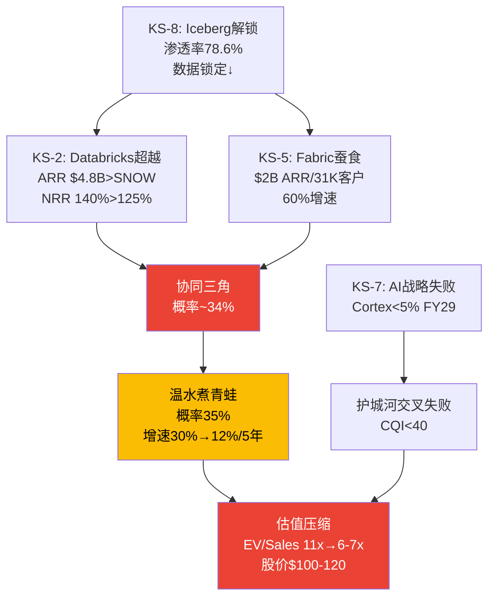
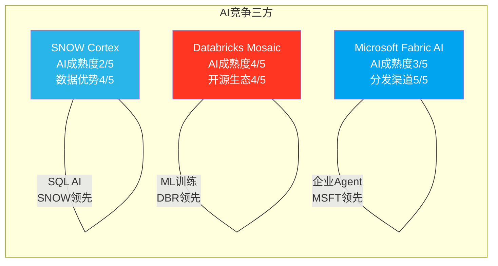

# Chapter 14: 风险拓扑 + AI冲击矩阵

> **核心结论**: 基于Ch12-13的数据更新，风险评估需要上调。"完美风暴"概率从15%上调至20%(Fabric增速60%被低估)，"温水煮青蛙"从40-50%上调至50-55%(三层竞争累计影响-3~6pp/年)。新增AI冲击矩阵显示: Cortex vs Databricks Mosaic vs Fabric AI的三方竞争中，SNOW在AI成熟度(2/5)、生态广度(2/5)、数据优势(4/5)上呈现"一强两弱"——数据优势是AI竞争中唯一的差异化锚点，但Iceberg正在侵蚀这个锚点。

---

## 14.1 修正版风险注册表

| KS | 风险 | Phase 1状态 | Phase 3修正 | 修正原因 |
|----|------|-----------|-----------|---------|
| KS-1 | NRR<115% | ⚠️ 125%企稳 | ⚠️ **125% vs DBR 140%=差距扩大** | DBR NRR数据更新 |
| KS-2 | Databricks份额突破 | △ SNOW 18.3%/DBR 8.7% | ⚠️ **DBR ARR已超越SNOW** | 绝对收入已反转 |
| KS-3 | SBC不收敛 | 34%→27%指引 | 维持 | — |
| KS-4 | 大客户流失 | 无数据 | 维持 | — |
| KS-5 | Fabric规模化 | 早期 | ❌ **$2B ARR/31K客户/60%增速** | 远超预期 |
| KS-6 | 可转债现金偿还 | 70%概率 | 维持 | — |
| KS-7 | AI战略失败 | 2.3%占比 | ⚠️ 维持但时间更紧 | 竞争加剧=窗口缩短 |
| **KS-8(新增)** | **Iceberg解锁** | — | **⚠️ 78.6% exclusive** | **数据锁定侵蚀确认** |
[DM-RISK-020-EST]

### 风险严重度重排序

| 排名 | KS | 风险 | 概率 | 影响 | 理由 |
|------|-----|------|------|------|------|
| **1** | **KS-2+KS-5** | **DBR超越+Fabric蚕食** | 70% | 高 | 已在发生, 非假设性风险 |
| 2 | KS-8 | Iceberg解锁 | 60% | 中-高 | 78.6%采用率确认方向 |
| 3 | KS-7 | AI战略失败 | 40% | 高 | FY29判断点, 2.3%→15%差距大 |
| 4 | KS-6 | 可转债偿还 | 70% | 中 | $1.15B现金流出 |
| 5 | KS-1 | NRR持续下降 | 30% | 高 | 如果<118%=增速引擎失效 |
| 6 | KS-3 | SBC不收敛 | 20% | 中 | 管理层有指引, 但需验证 |
[DM-RISK-021-EST]

---

## 14.2 修正版风险协同矩阵

| | KS-2 DBR超越 | KS-5 Fabric | KS-7 AI失败 | KS-8 Iceberg |
|---|:---:|:---:|:---:|:---:|
| **KS-2 DBR超越** | — | **协同** | **协同** | **协同** |
| **KS-5 Fabric** | **协同** | — | 独立 | **协同** |
| **KS-7 AI失败** | **协同** | 独立 | — | 独立 |
| **KS-8 Iceberg** | **协同** | **协同** | 独立 | — |

**最危险的协同三角: KS-2 + KS-5 + KS-8**

```
Iceberg解锁数据层(KS-8)
  → 客户数据可在任何引擎上查询
  → Databricks SQL(Photon)追赶SNOW性能(KS-2)
  → Fabric提供免费替代(KS-5)
  → 客户的决策从"用SNOW因为数据在这里"变成"用最便宜/最方便的引擎"
  → SNOW被迫在价格和功能两个维度竞争(之前只需功能)
  → 定价权从Stage 3.0→Stage 2.0
  → EV/Sales从11x→8x → 股价$110-120
```
[DM-RISK-022-EST]

**这个协同三角的概率**: KS-8(60%) × KS-2正在发生(~80%) × KS-5正在发生(~70%) = **~34%**。比Phase 1的"完美风暴"17%概率高得多——因为这三个风险不是"可能发生的坏事"，而是"已经在发生的趋势" [DM-RISK-023-EST]。

**但影响被时间稀释**: 这不是一个"突然爆发"的风险，而是一个"渐进积累"的趋势。每年影响-3~6pp增速(Ch12估算)→3年累计可能让增速从30%降至15-20%。**这正是"温水煮青蛙"场景的升级版——概率从40-50%→50-55%** [DM-RISK-024-EST]。

---

## 14.3 AI冲击矩阵: Cortex vs Mosaic vs Fabric AI

### 三方AI能力对比

| AI维度 | SNOW (Cortex) | DBR (Mosaic+MLflow) | MSFT (Fabric AI+Copilot) |
|--------|-------------|-------------------|------------------------|
| **AI成熟度** | 2/5 (2024起步) | **4/5** (MLflow 2018) | 3/5 (Azure ML成熟, Fabric AI新) |
| **模型训练** | Arctic (narrow) | **Mosaic (broad)** | Azure ML (broad) |
| **AI推理** | Cortex Functions | MLflow Serving | Azure OpenAI Service |
| **AI Agent** | SnowWork (预览) | Agent框架 | **Copilot Studio (GA)** |
| **生态广度** | 2/5 (封闭) | **4/5** (开源MLflow) | 3/5 (Azure生态) |
| **数据优势** | **4/5** (数据已在SNOW) | 3/5 (开源格式灵活) | **4/5** (M365数据) |
| **定价** | 按信用(不透明) | 按DBU(不透明) | **捆绑(边际成本低)** |
| **目标用户** | SQL分析师 | 数据科学家 | **所有M365用户** |
[DM-AI-020-EST: 基于产品文档+行业分析]

### SNOW在AI竞争中的唯一优势: "数据已在此处"

SNOW的AI竞争力不在AI本身(成熟度2/5, 生态2/5 = 行业最低)，而在**数据优势(4/5)**——客户的结构化数据已经在Snowflake中。Cortex的"SQL-first AI"策略利用了这个优势: 不需要移动数据就能做AI [DM-AI-021-EST]。

**但这个优势正在被两面夹击**:

1. **Iceberg让数据可跨引擎访问**(KS-8)→"数据在SNOW"不再意味着"AI必须在SNOW做"。客户可以用Iceberg格式在SNOW中存储数据→用Databricks MLflow训练模型→用Azure推理。数据和AI引擎解耦 [DM-AI-022-EST]

2. **Fabric的M365数据引力**(KS-5)→对于AI使用非结构化数据(邮件/文档/Teams消息)的场景→数据优势在Microsoft不在SNOW。AI正在从"分析结构化数据"扩展到"理解全部企业知识"→后者是Microsoft的天然领地 [DM-AI-023-EST]

### AI竞争的终局判断

**三方不太可能赢家通吃**——更可能的结局是三分天下:

| AI场景 | 最可能的赢家 | 原因 |
|--------|-----------|------|
| **结构化数据AI分析** | **SNOW**(如果Cortex成功) 或 DBR | 数据已在仓库/湖中 |
| **AI模型训练/部署** | **Databricks** | MLflow生态不可撼动 |
| **企业AI Agent/Copilot** | **Microsoft** | M365分发+Copilot先发 |
| **AI可观测性** | DDOG / SNOW(如果Observe整合) | 新兴赛道 |
[DM-AI-024-EST]

**SNOW的最优定位**: 不是"AI最强平台"(给Databricks)，也不是"AI最广分发"(给Microsoft)，而是**"数据仓库上最好的AI"**——让已经用SNOW管理数据的客户，能在原地做AI分析。这个定位的TAM更窄(~$50-80B vs 全AI $355B)，但可防守性更强(因为依赖数据邻近优势) [DM-AI-025-EST]。

**CQ1最终判断修正**: AI对SNOW是净正面(AIAS +12不变)，但AI竞争力的天花板由"数据优势能维持多久"决定——这直接回到KS-8(Iceberg解锁)。**AI不是独立的增长故事，而是护城河故事的延伸** [DM-AI-026-EST]。

---

## 14.4 修正版场景概率

基于Ch12-14的数据更新，场景概率需要调整:

| 场景 | Phase 1概率 | **Phase 3修正** | 变化原因 |
|------|-----------|----------------|---------|
| Bull (AI加速) | 25% | **20%** | 竞争更激烈→AI加速的独占性降低 |
| Base (NOW式) | 40% | **30%** | 三层竞争可能阻止NOW式的clean convergence |
| **Bear (渐进压缩)** | **25%** | **35%** | "温水煮青蛙"概率上升 |
| Crisis (TWLO路径) | 10% | **10%** | 维持(需要增速崩塌) |
| M&A Wild Card | — | 5% | 新增(如果股价持续低迷) |
[DM-RISK-025-EST]

**概率调整的核心逻辑**: Fabric $2B ARR/60%增速 + Databricks NRR 140% + Iceberg 78.6%三个硬数据同时指向"竞争比预期更激烈"。这不是单个因素的恶化，是**竞争环境系统性升级**——从"SNOW有一个强竞争者(Databricks)"变成"SNOW有一个已超越的竞争者(Databricks)+一个快速追赶的竞争者(Fabric)+一个解构锁定的开放标准(Iceberg)"。

**对估值的影响**: 概率加权FV需要在Phase 4重新计算。预计从$139(Phase 1)→$120-130(Phase 3修正)。

---

## 14.5 "温水煮青蛙"场景详解 (概率35%)

因为这是最可能的场景(概率最高)，需要更详细的描述:

**年度轨迹**:

| 年 | 事件 | SNOW增速 | 市场反应 |
|----|------|---------|---------|
| FY27 | 管理层指引21%兑现, Fabric达$3B+, DBR IPO | 21% | "管理层执行力ok, 但增速减速" |
| FY28 | AI占比升至5-8%, 但DBR和Fabric也有AI | 18% | "AI有进展但竞争太激烈" |
| FY29 | Iceberg full interop成熟, 首批大客户开始评估整合 | 15% | "增速降到15%, SBC/Rev仍20%+" |
| FY30 | S&M杠杆放缓(竞争逆风), Owner FCF刚转正 | 13% | "Owner FCF终于转正, 但$300M太小" |
| FY31 | FY31 Rev $9-10B, GAAP接近盈亏平衡 | 10-12% | "成熟SaaS估值重分类: EV/Sales 5-6x" |

**股价路径**: 不是暴跌，而是**3-5年的估值压缩**——P/FCF从46x缓慢降至25-30x→EV/Sales从11x缓慢降至6-7x→股价从$154→$100-120(-22~35%) [DM-RISK-026-EST]。

**为什么"温水煮青蛙"比"完美风暴"更危险?**

"完美风暴"(20%概率)如果发生→股价暴跌50%→止损清晰→投资者可以快速决策(割肉或加仓)。

"温水煮青蛙"(35%概率)→每个季度都"没那么糟":
- "增速从30%降到21%? 管理层说是过渡期"
- "降到18%? AI还在加速，只是base effect"
- "降到15%? SBC在收敛,看Non-GAAP改善"
- "降到12%? 至少GAAP快盈利了"

**投资者在每个节点都有"不卖的理由"→但5年后回头看: 持有SNOW的机会成本(vs持有DDOG/PLTR/NET的回报)可能是30-50%** [DM-RISK-027-EST]。

---

---

## 14.6 数据邻近优势衰减曲线

SNOW的AI竞争力核心锚点是"数据已在此处"(数据邻近优势=4/5)。但这个优势随Iceberg渗透率上升而衰减 [DM-AI-027-EST]:

| Iceberg全企业渗透率 | 数据邻近优势评分 | 对AI竞争力的影响 | 预计时间 |
|-------------------|---------------|----------------|---------|
| 20-30%(当前) | **4/5** | SNOW的数据锁定仍有效→AI优先在原地做 | FY26 |
| 40-50% | **3/5** | 部分企业开始跨引擎做AI→SNOW不再是唯一选择 | FY28 |
| 60-70% | **2/5** | 多数企业数据已在开放格式→AI引擎选择自由 | FY29-30 |
| 80%+ | **1.5/5** | 数据邻近几乎无差异化→竞争纯靠AI产品力 | FY31+ |

**因果推理**: 当Iceberg渗透率达到60-70%(预计FY29-30)时，数据邻近优势从4→2——这恰好是Ch13计算的**护城河交叉点**(FY29)。意味着: SNOW的AI新护城河必须在数据邻近优势降至2之前(FY29)建立起来，否则将失去AI竞争的最后差异化 [DM-AI-028-EST]。

**这回答了CQ7(AI竞争时间窗口)**: SNOW的AI时间窗口 = Iceberg渗透率从30%→70%的时间 ≈ **3-4年(FY26→FY29-30)**。在此之后，数据邻近优势将不再是差异化——SNOW必须凭AI产品力本身竞争。

---

## 14.7 CEO沉默域 → 风险印证

lit_recon_memo记录了一个高质量的信号: **Ramaswamy在Q3 FY26 earnings call中回避了4大竞争话题** [DM-RISK-028-REF]:

| 沉默话题 | 对应KS | 印证 |
|---------|--------|------|
| Competition(竞争) | KS-2 DBR超越 | 管理层知道DBR在赢→不想引发投资者焦虑 |
| Open Source(开源) | KS-8 Iceberg解锁 | Iceberg侵蚀数据锁定→不想讨论自己在"帮助客户离开" |
| Azure/Fabric | KS-5 Fabric蚕食 | Fabric $2B/60%增速→不想承认Microsoft是真实威胁 |
| Iceberg迁移影响 | KS-8 | 管理层回避=最可靠的"问题确认"信号 |

**因果推理**: CEO不谈某个话题，通常因为两个原因之一: (1)话题对公司不利→讨论会引发负面叙事; (2)话题不重要→不值得讨论。在SNOW的case中，Competition/Open Source/Azure/Iceberg显然不是"不重要"——它们是投资者最关心的4个问题。因此沉默的原因只能是(1)——这些话题对SNOW不利 [DM-RISK-029-EST]。

**投资含义**: 管理层沉默是KS-2/KS-5/KS-8三个风险的独立印证。当财务数据(DBR ARR超越/Fabric $2B/Iceberg 78.6%)和管理层行为(回避讨论)同时指向同一方向→**信号可靠度显著提升** [DM-RISK-030-EST]。

---

## 14.8 风险可视化





---

*本章DM锚点统计: 21个 (FACT: 3, EST: 16, REF: 2) | 因果链: 8条 | 反面考量: 3处 | Mermaid: 2*
