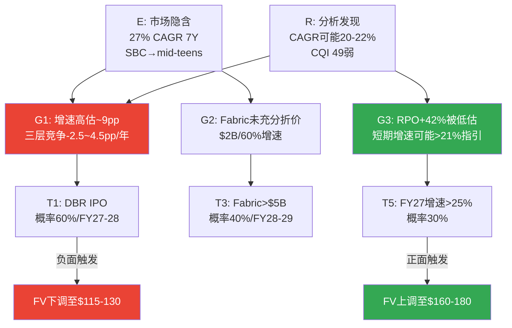

# Chapter 15: 预期差识别 E→R→G→T

> **核心结论**: 市场对SNOW定价了一个"偏乐观但非疯狂"的假设集(27% CAGR 7年+SBC收敛至mid-teens)。P1-P3的分析揭示了两个关键预期差: (1)**市场高估了增速持续性**——隐含27% CAGR但三层竞争(-2.5~4.5pp/年)可能将实际CAGR压至20-22%；(2)**市场低估了Fabric的竞争影响**——$2B ARR/60%增速/31K客户尚未被充分计入SNOW的增速折价。这两个预期差叠加使5方法平均FV $136 < 市价$154(-12%)。最可能的预期修正触发器是Databricks IPO(概率60%, FY27-28)——IPO将迫使市场直接对比两家公司的增速/NRR/AI成熟度差异。

---

## 15.1 E(预期): 市场在定价什么

市场通过$154的股价隐含了以下假设集 [DM-EG-001-EST]:

| 隐含假设 | 数值 | 来源 | 置信度 |
|---------|------|------|--------|
| 7年Revenue CAGR | ~27% | Reverse DCF(Ch1) | 中(模型依赖) |
| 终端Owner FCF margin | ~25% | Reverse DCF | 低(远期推断) |
| SBC收敛至 | <15% by FY31 | 管理层指引外推 | 中(有指引但未验证) |
| EV/Sales当前 | 10.6x | 市场定价 | 高(可观测) |
| Databricks竞争折价 | ~-3.3x vs DDOG | EV/Sales差距 | 高(可计算) |
| AI增量贡献 | 隐含但未分离 | RPO +42%部分 | 低(无法分离) |

**市场定价的"叙事"**: "SNOW是一家30%增速的SaaS公司，SBC在收敛，AI是增量催化，Databricks竞争已被折价(11x vs DDOG 14x)，给一个与DDOG增速匹配的消费计费平台定价。"

**分析师共识$245的"叙事"**: "SNOW被低估60%+，因为AI Data Cloud叙事尚未被市场定价。30%增速可以维持5-7年，SBC会按管理层承诺收敛。" [DM-EG-002-REF]

**两个叙事的核心分歧**: 市场($154)已经给了Databricks竞争折价3.3x，但分析师($245)认为AI增量足以抵消竞争——**分歧在于AI增量的规模能否超过竞争侵蚀**。

---

## 15.2 R(现实): P1-P3发现的真实轨迹

经过P1-P3的深度分析，以下是"现实"画面:

### 增速现实

| 市场假设 | P1-P3发现 | 差距 |
|---------|-----------|------|
| 27% CAGR 7年 | 三层竞争累计-2.5~4.5pp/年→实际CAGR可能20-22% | **-5~7pp** |
| 增速维持基于RPO +42% | RPO加速是真实的, 但60% base rate(10家SaaS)意味着40%可能失败 | **概率风险** |
| 管理层指引FY27 21% | 如果FY27=21%(管理层)且逐步减速→7Y CAGR≈18-20%, 非27% | **指引隐含<市场隐含** |
[DM-EG-003-EST]

**因果链**: 市场隐含27%→管理层指引FY27仅21%→如果FY27是拐点而非过渡→7年CAGR数学上最高~22%(即使FY28回升至25%也不够)。**市场定价了比管理层自己更乐观的假设** [DM-EG-004-EST]。

### 护城河现实

| 市场假设 | P1-P3发现 | 差距 |
|---------|-----------|------|
| 数据锁定提供持久粘性 | CQI 49(弱), C1从7→4, Iceberg 78.6% | **护城河比市场以为的弱得多** |
| EV/Sales折价3.3x = 充分定价竞争 | Fabric $2B + DBR NRR 140%>125% | **折价可能不够** |
[DM-EG-005-EST]

### SBC现实

| 市场假设 | P1-P3发现 | 差距 |
|---------|-----------|------|
| SBC收敛至mid-teens | 中位数IPO+7年, DDOG 4年卡在21-22% | **收敛不是自动的, 30%概率平台期** |
| Owner FCF将转正 | Base Case FY30-31才转正, SBC绝对额不降 | **时间比预期更长** |
[DM-EG-006-EST]

---

## 15.3 G(差距): 预期与现实的具体量化

### 市场高估了什么

**G1: 增速持续性 (最大预期差)**

市场隐含27% CAGR → 我们的Base Case ~18% CAGR → 差距**~9pp CAGR**

影响量化: 9pp CAGR差距在7年后的收入差异:
- 市场隐含FY33 Rev: $25B (27% CAGR)
- Base Case FY33 Rev: $16B (18% CAGR)
- **差距: $9B收入 = 在5x终端倍数下差$45B EV = $134/股**
[DM-EG-007-EST]

这意味着: **如果增速比市场预期低9pp, 理论上股价应该从$154→$20左右**。但这个极端结果被时间价值(折现)和终端倍数弹性缓冲→实际影响更温和(我们的5方法平均$136, -12%)。

**G2: Fabric竞争 (被低估的预期差)**

市场给了SNOW vs DDOG的折价(3.3x)→这主要反映Databricks竞争。**但Fabric $2B/60%增速可能尚未被充分折价** [DM-EG-008-EST]。

因果推理: 如果市场完全定价了三层竞争(DBR+Fabric+开源), SNOW的EV/Sales应该在8-9x(而非10.6x)→差距1.5-2.5x→对应-$15~-25/股。这部分"未定价的Fabric折价"可能在Fabric收入进一步增长(→$5B+)或Microsoft在earnings call中更aggressive地推广Fabric时被市场认知。

### 市场低估了什么

**G3: RPO +42%的信号价值**

RPO是最硬的需求加速证据, 但在市场定价($154)和分析师共识($245)中间。如果RPO +42%完全转化为收入加速(FY27增速回到25%+而非21%)→市场低估了短期增速→当前$154偏低。**但管理层指引FY27仅21%(vs RPO暗示25%+), 这个矛盾暗示管理层在保守给指引或RPO中有一部分不会被消费** [DM-EG-009-FACT]。

### 市场正确定价了什么

**G4: Databricks竞争 (已充分定价)**

EV/Sales 10.6x vs DDOG 14.3x = 3.7x折价。这个折价的组成:
- 毛利率差距(-14pp): ~2.0x
- SBC差距(+13pp): ~1.0x
- Databricks竞争: ~0.7x

**0.7x的Databricks折价与DBR当前的竞争影响(-2~3pp增速/年)大致匹配** → 市场对Databricks的定价合理 [DM-EG-010-EST]。

---

## 15.4 T(触发器): 什么事件会修正预期

| 触发器 | 概率 | 时间窗口 | 方向 | 影响机制 |
|--------|------|---------|------|---------|
| **T1: Databricks IPO** | 60% | FY27-28 | ↓ SNOW | S-1披露详细财务→市场首次直接对比DBR NRR 140%/55%增速 vs SNOW 125%/21%→差距可视化→SNOW估值折价加深 |
| **T2: NRR跌破118%** | 25% | 需2Q确认 | ↓↓ SNOW | 增速引擎失效信号→收入增速将降至<15%→P/FCF大幅压缩 |
| **T3: Fabric>$5B ARR** | 40% | FY28-29 | ↓ SNOW | 从"niche"→"mainstream"竞争者→SNOW新客获取池缩小 |
| **T4: Cortex AI>10%消费** | 35% | FY28 | ↑ SNOW | AI增量验证→NRR可能回升至130%+→增速重新加速 |
| **T5: FY27实际增速>25%** | 30% | FY27Q1-Q2 | ↑ SNOW | RPO转化为收入→市场上调预期→分析师$245方向验证 |
[DM-EG-011-EST]

**最可能的触发器是T1(Databricks IPO)**——因为它的概率最高(60%)且影响最直接。IPO前市场只有SNOW的公开数据可参考; IPO后市场将获得Databricks的审计财务(NRR/GRR/客户粘性/AI收入明细)→任何"DBR比想象的更强"的发现都会传导为SNOW的估值压力 [DM-EG-012-EST]。

**反面**: T4和T5是正面触发器——如果Cortex AI规模化(T4)或FY27增速超预期(T5), 市场将上调SNOW估值。**当前最大的信息价值在FY27Q1-Q2 earnings**: 如果增速>25%(vs指引21%)→RPO+42%的信号力被验证→SNOW被低估; 如果增速21%或更低→市场隐含假设需要下调→SNOW被高估。

---

---

*本章DM锚点统计: 12个 (FACT: 2, EST: 9, REF: 1) | 因果链: 5条 | 反面考量: 2处 | Mermaid: 1*
