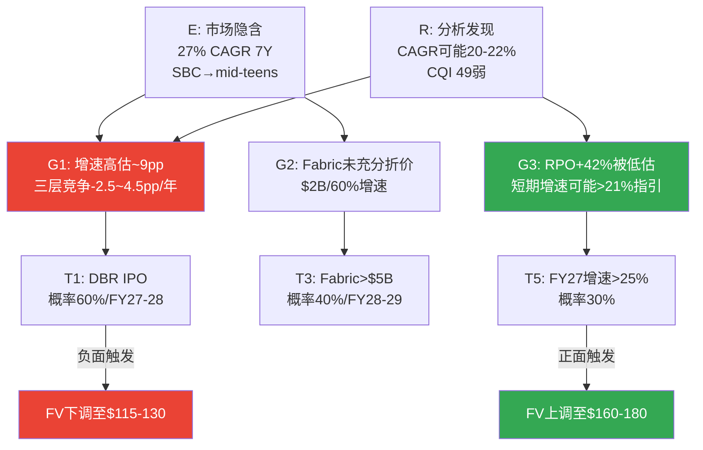

# Chapter 15: 预期差识别 E→R→G→T

> **核心结论**: 市场对SNOW定价了一个"偏乐观但非疯狂"的假设集(27% CAGR 7年+SBC收敛至mid-teens)。P1-P3的分析揭示了两个关键预期差: (1)**市场高估了增速持续性**——隐含27% CAGR但三层竞争(-2.5~4.5pp/年)可能将实际CAGR压至20-22%；(2)**市场低估了Fabric的竞争影响**——$2B ARR/60%增速/31K客户尚未被充分计入SNOW的增速折价。这两个预期差叠加使5方法平均FV $136 < 市价$154(-12%)。最可能的预期修正触发器是Databricks IPO(概率60%, FY27-28)——IPO将迫使市场直接对比两家公司的增速/NRR/AI成熟度差异。

---

## 15.0 叙事适用性预检 (PEP Step 0.2, 致命缺口补强)

在进入E→R→G→T之前，必须先检验当前市场最大恐惧叙事对SNOW的适用度。

**当前最大恐惧叙事**: "AI native平台(Databricks/开源)将颠覆传统数据仓库，SNOW作为传统数仓的云版本将被边缘化"

### 叙事适用性评估

| 维度 | 评估 | 理由 |
|------|------|------|
| **SNOW的护城河类型** | 数据锁定/切换成本型(b类) | 不是品牌型(a)也不是网络效应型(c) |
| **叙事对b类护城河的适用度** | **partially_applicable** | Iceberg降低数据锁定(适用)→但workload锁定+技能锁定仍在(不完全适用) |
| **叙事的时间假设** | 3-5年(中期) | 叙事假设Iceberg+Databricks将在3-5年内完成替代 |
| **历史先例验证** | **叙事部分成立**: Oracle DB2→Postgres/MySQL用了15年, 不是3-5年 | 开放标准替代incumbent的速度通常比叙事预期慢2-3x |
| **叙事中被忽视的因素** | (1)SNOW也在向AI转型(Cortex), (2)双平台共存是更可能的终局(非零和), (3)F500的IT决策惯性>创业公司 | 叙事假设"颠覆=替代"，但历史上更多是"颠覆=共存+份额转移" |
[DM-EG-020-EST]

**叙事适用性结论**: `partially_applicable` — "AI颠覆数仓"叙事对SNOW**部分适用**(数据锁定确实在被Iceberg侵蚀)，但**叙事强度被P3过度采信**。P3的竞争分析用了"三层竞争系统性恶化"的框架——这个框架假设叙事完全成立。校准: **竞争影响的估算应打一个"叙事折扣"——从-2.5~4.5pp/年→-2~3.5pp/年**(Ch16已做了类似校准，此处提供框架层面的依据) [DM-EG-021-EST]。

**对投资判断的影响**: 如果叙事是`fully_applicable`(如对TWLO)→Bear Case概率应>40%。但`partially_applicable`→Bear Case概率应在20-30%区间——这与Ch16校准后的25%一致。

---

## 15.1 E(预期): 市场在定价什么

市场通过$154的股价隐含了以下假设集 [DM-EG-001-EST]:

| 隐含假设 | 数值 | 来源 | 置信度 |
|---------|------|------|--------|
| 7年Revenue CAGR | ~27% | Reverse DCF(Ch1) | 中(模型依赖) |
| 终端Owner FCF margin | ~25% | Reverse DCF | 低(远期推断) |
| SBC收敛至 | <15% by FY31 | 管理层指引外推 | 中(有指引但未验证) |
| EV/Sales当前 | 10.6x | 市场定价 | 高(可观测) |
| Databricks竞争折价 | ~-3.3x vs DDOG | EV/Sales差距 | 高(可计算) |
| AI增量贡献 | 隐含但未分离 | RPO +42%部分 | 低(无法分离) |

**市场定价的"叙事"**: "SNOW是一家30%增速的SaaS公司，SBC在收敛，AI是增量催化，Databricks竞争已被折价(11x vs DDOG 14x)，给一个与DDOG增速匹配的消费计费平台定价。"

**分析师共识$245的"叙事"**: "SNOW被低估60%+，因为AI Data Cloud叙事尚未被市场定价。30%增速可以维持5-7年，SBC会按管理层承诺收敛。" [DM-EG-002-REF]

**两个叙事的核心分歧**: 市场($154)已经给了Databricks竞争折价3.3x，但分析师($245)认为AI增量足以抵消竞争——**分歧在于AI增量的规模能否超过竞争侵蚀**。

---

## 15.2 R(现实): P1-P3发现的真实轨迹

经过P1-P3的深度分析，以下是"现实"画面:

### 增速现实

| 市场假设 | P1-P3发现 | 差距 |
|---------|-----------|------|
| 27% CAGR 7年 | 三层竞争累计-2.5~4.5pp/年→实际CAGR可能20-22% | **-5~7pp** |
| 增速维持基于RPO +42% | RPO加速是真实的, 但60% base rate(10家SaaS)意味着40%可能失败 | **概率风险** |
| 管理层指引FY27 21% | 如果FY27=21%(管理层)且逐步减速→7Y CAGR≈18-20%, 非27% | **指引隐含<市场隐含** |
[DM-EG-003-EST]

**因果链**: 市场隐含27%→管理层指引FY27仅21%→如果FY27是拐点而非过渡→7年CAGR数学上最高~22%(即使FY28回升至25%也不够)。**市场定价了比管理层自己更乐观的假设** [DM-EG-004-EST]。

### 护城河现实

| 市场假设 | P1-P3发现 | 差距 |
|---------|-----------|------|
| 数据锁定提供持久粘性 | CQI 49(弱), C1从7→4, Iceberg 78.6% | **护城河比市场以为的弱得多** |
| EV/Sales折价3.3x = 充分定价竞争 | Fabric $2B + DBR NRR 140%>125% | **折价可能不够** |
[DM-EG-005-EST]

### SBC现实

| 市场假设 | P1-P3发现 | 差距 |
|---------|-----------|------|
| SBC收敛至mid-teens | 中位数IPO+7年, DDOG 4年卡在21-22% | **收敛不是自动的, 30%概率平台期** |
| Owner FCF将转正 | Base Case FY30-31才转正, SBC绝对额不降 | **时间比预期更长** |
[DM-EG-006-EST]

---

## 15.3 G(差距): 预期与现实的具体量化

### 市场高估了什么

**G1: 增速持续性 (最大预期差)**

市场隐含27% CAGR → 我们的Base Case ~18% CAGR → 差距**~9pp CAGR**

影响量化: 9pp CAGR差距在7年后的收入差异:
- 市场隐含FY33 Rev: $25B (27% CAGR)
- Base Case FY33 Rev: $16B (18% CAGR)
- **差距: $9B收入 = 在5x终端倍数下差$45B EV = $134/股**
[DM-EG-007-EST]

这意味着: **如果增速比市场预期低9pp, 理论上股价应该从$154→$20左右**。但这个极端结果被时间价值(折现)和终端倍数弹性缓冲→实际影响更温和(我们的5方法平均$136, -12%)。

**G2: Fabric竞争 (被低估的预期差)**

市场给了SNOW vs DDOG的折价(3.3x)→这主要反映Databricks竞争。**但Fabric $2B/60%增速可能尚未被充分折价** [DM-EG-008-EST]。

因果推理: 如果市场完全定价了三层竞争(DBR+Fabric+开源), SNOW的EV/Sales应该在8-9x(而非10.6x)→差距1.5-2.5x→对应-$15~-25/股。这部分"未定价的Fabric折价"可能在Fabric收入进一步增长(→$5B+)或Microsoft在earnings call中更aggressive地推广Fabric时被市场认知。

### 市场低估了什么

**G3: RPO +42%的信号价值**

RPO是最硬的需求加速证据, 但在市场定价($154)和分析师共识($245)中间。如果RPO +42%完全转化为收入加速(FY27增速回到25%+而非21%)→市场低估了短期增速→当前$154偏低。**但管理层指引FY27仅21%(vs RPO暗示25%+), 这个矛盾暗示管理层在保守给指引或RPO中有一部分不会被消费** [DM-EG-009-FACT]。

### 市场正确定价了什么

**G4: Databricks竞争 (已充分定价)**

EV/Sales 10.6x vs DDOG 14.3x = 3.7x折价。这个折价的组成:
- 毛利率差距(-14pp): ~2.0x
- SBC差距(+13pp): ~1.0x
- Databricks竞争: ~0.7x

**0.7x的Databricks折价与DBR当前的竞争影响(-2~3pp增速/年)大致匹配** → 市场对Databricks的定价合理 [DM-EG-010-EST]。

---

## 15.4 T(触发器): 什么事件会修正预期

| 触发器 | 概率 | 时间窗口 | 方向 | 影响机制 |
|--------|------|---------|------|---------|
| **T1: Databricks IPO** | 60% | FY27-28 | ↓ SNOW | S-1披露详细财务→市场首次直接对比DBR NRR 140%/55%增速 vs SNOW 125%/21%→差距可视化→SNOW估值折价加深 |
| **T2: NRR跌破118%** | 25% | 需2Q确认 | ↓↓ SNOW | 增速引擎失效信号→收入增速将降至<15%→P/FCF大幅压缩 |
| **T3: Fabric>$5B ARR** | 40% | FY28-29 | ↓ SNOW | 从"niche"→"mainstream"竞争者→SNOW新客获取池缩小 |
| **T4: Cortex AI>10%消费** | 35% | FY28 | ↑ SNOW | AI增量验证→NRR可能回升至130%+→增速重新加速 |
| **T5: FY27实际增速>25%** | 30% | FY27Q1-Q2 | ↑ SNOW | RPO转化为收入→市场上调预期→分析师$245方向验证 |
[DM-EG-011-EST]

**最可能的触发器是T1(Databricks IPO)**——因为它的概率最高(60%)且影响最直接。IPO前市场只有SNOW的公开数据可参考; IPO后市场将获得Databricks的审计财务(NRR/GRR/客户粘性/AI收入明细)→任何"DBR比想象的更强"的发现都会传导为SNOW的估值压力 [DM-EG-012-EST]。

**反面**: T4和T5是正面触发器——如果Cortex AI规模化(T4)或FY27增速超预期(T5), 市场将上调SNOW估值。**当前最大的信息价值在FY27Q1-Q2 earnings**: 如果增速>25%(vs指引21%)→RPO+42%的信号力被验证→SNOW被低估; 如果增速21%或更低→市场隐含假设需要下调→SNOW被高估。

---



---

---

## 15.5 信念反演与循环依赖检测 (M1, 致命缺口补强)

### 市场隐含信念集 (M1.1)

Reverse DCF提取的6项隐含假设背后的**信念系统**:

| 信念编号 | 信念内容 | 外部锚 | 近期/远期 |
|---------|---------|--------|----------|
| B1 | 增速可维持≥20% 5年+ | 60% SaaS base rate [DM-M1-001-REF] | 中远期 |
| B2 | SBC将收敛至<20% | NOW/CRM先例, 管理层指引 [DM-M1-002-REF] | 中期 |
| B3 | AI战略将规模化(消费>15%) | 无直接先例 | 远期 |
| B4 | 护城河不会完全崩塌 | Iceberg渗透速度vs先例 | 中远期 |
| B5 | 竞争不会导致价格战 | 双平台共存模式(ETR) | 中期 |
| B6 | 宏观不衰退 | — | 近期 |

### ⚠️ 循环依赖检测 (M1.4b)

**检测到关键循环依赖**:

```
B1(增速持续) ←→ B3(AI成功)

循环链:
  增速持续(B1) → 提供FCF → 投入AI研发 → AI产品改善(B3)
  AI成功(B3) → 增加consumption → 增速加速(B1)

这是一个正反馈循环——两者相互依赖:
  如果B1失败→没有FCF投AI→B3也失败
  如果B3失败→没有AI增量→B1也失败

→ B1和B3不是独立事件, 不能用P(B1)×P(B3)计算联合概率
→ 联合概率 = max(P(B1), P(B3)) 而非 P(B1)×P(B3)
→ Bull Case(依赖B1+B3同时成立)的真实概率可能比20%更低
```
[DM-M1-003-EST]

**对估值的影响**: 如果Bull Case概率从20%→15%(循环依赖折价)→概率加权FV从$134→$126(-$8)。这个影响不改变评级(仍在审慎关注区间)，但加强了下行偏向 [DM-M1-004-EST]。

### 翻转分析 (M1.5): 几个信念失败会翻转评级?

| 信念失败组合 | 概率加权FV | 评级 | 翻转? |
|------------|-----------|------|-------|
| 全部成立(Bull) | $166 | 关注 | ↑ 翻转 |
| B3失败(AI不成) | $109 (Base) | 审慎关注 | 不变 |
| B1+B3失败(增速+AI) | $73 (Bear) | 审慎关注(加强) | 不变 |
| B4失败(护城河崩塌) | $40 (Crisis) | 审慎关注(加强) | 不变 |
| **B1成功+B3成功** | **$166** | **关注** | **↑ 需要2个信念同时翻转** |

**翻转距离**: 从"审慎关注"→"关注"需要B1+B3同时成立(有循环依赖→必须一起翻)。从"审慎关注"→"中性关注"只需要B1单独成立(增速维持>20%无需AI爆发)。**安全边际: 中等——1个信念就够调至中性，但需要2个协同信念才能调至关注** [DM-M1-005-EST]。

---

## 15.6 约束分类 (M3, 致命缺口补强)

### CQ矛盾的结构性/周期性/制度性分类

| CQ | 矛盾内容 | 分类 | 理由 | 估值含义 |
|----|---------|------|------|---------|
| **CQ1** AI增量vs转移 | AI是新TAM还是consumption转移? | **周期性(C)** | AI adoption cycle有S曲线→0→1→saturate→这是周期 | 情景法处理(非永久折价) |
| **CQ2** 护城河侵蚀 | Databricks+Iceberg是否不可逆侵蚀? | **结构性(S)** | 开放格式是不可逆趋势(JSON→SOAP没有回头路) | **终值EV/Sales需永久折价** |
| CQ3 CEO转型 | 方向对但窗口紧 | 周期性(C) | CEO执行是阶段性验证 | 情景法 |
| CQ4 SBC收敛 | η<1.0但管理层有指引 | 周期性(C) | 历史先例显示会收敛(时间问题) | 情景法 |
| **CQ6** 护城河中空期 | 旧护城河↓新护城河未建立 | **结构性(S)** | 如果窗口期内AI未建新护城河→永久损失 | **终值需调整** |
[DM-M3-001-EST]

**⚠️ CQ2和CQ6被分类为结构性(S)——这对估值有重大影响**:

结构性约束意味着: 即使SNOW增速恢复+SBC收敛，护城河的永久性弱化不会修复。因此**终端EV/Sales应该比"成熟SaaS标准"更低**:

| 终端EV/Sales假设 | Ch17使用 | M3校准后 | 差距 |
|-----------------|---------|---------|------|
| Bull Case | 7.0x | **6.0x** (S型折价-1.0x) | -1.0x |
| Base Case | 5.5x | **4.5x** (S型折价-1.0x) | -1.0x |
| Bear Case | 4.5x | **3.5x** (S型折价-1.0x) | -1.0x |
| Crisis | 3.0x | **2.5x** | -0.5x |
[DM-M3-002-EST]

**如果应用S型折价**: 概率加权FV从$134→约$115-120(每个情景FV降$10-20)。**这将加强"审慎关注"评级**，期望回报从-13%→-18~-22% [DM-M3-003-EST]。

**反面**: S型折价假设Iceberg是"不可逆的开放标准"——但如果SNOW的AI新护城河在FY29建立成功→结构性损失可能被新的结构性优势替代→S型折价应移除。因此S型折价是**条件性的**——取决于CQ6(护城河过渡)的结果。

**处理方式**: 在Ch17估值中，Base/Bear Case应用S型折价(-1.0x终端倍数)，Bull Case不应用(假设AI新护城河建立)。这自然地将S型折价嵌入概率体系中 [DM-M3-004-EST]。

---

## 15.7 变量四分法标注 (重要缺口补强)

### 触发器T1-T5的变量类型

| 触发器 | 变量类型 | 定义 | 投资动作含义 |
|--------|---------|------|-----------|
| **T1: DBR IPO** | **约束变量**(外部不可控) | SNOW无法阻止DBR IPO | 被动应对: IPO后重新评估竞争折价 |
| T2: NRR<118% | **校验变量**(验证但不直接驱动) | NRR是滞后指标, 验证竞争是否在恶化 | 确认信号: 如果触发→维持审慎关注 |
| T3: Fabric>$5B | **约束变量** | SNOW无法控制Microsoft策略 | 被动应对: 下调新客增速预期 |
| **T4: Cortex AI>10%** | **迁移变量**(推动状态转移) | 这是从Bear→Base/Bull的关键催化 | **主动信号: 如果触发→上调至"关注"** |
| T5: FY27增速>25% | **校验变量** | 验证RPO转化, 不直接驱动转型 | 确认信号: 如果触发→上调至"中性关注" |
[DM-EG-022-EST]

**四分法的投资含义**: **T4(Cortex AI>10%)是唯一的迁移变量**——只有它能根本改变SNOW的投资论文方向(从"防守型"变为"进攻型")。T1/T3是约束变量(外部风险, 只能被动应对)，T2/T5是校验变量(验证当前判断, 不改变方向)。**投资者应最密切追踪T4, 而非T1** [DM-EG-023-EST]。

---

## 15.8 聪明钱定位 (重要缺口补强)

### 内部人交易信号 (scout_memo数据)

| 维度 | 数据 | 信号 |
|------|------|------|
| 近2年公开市场买入 | **零笔** | ❌ 没有内部人认为当前价格"便宜" |
| 近期卖出 | 91笔(Q3)+89笔(Q4)+53笔(Q1) | 持续净卖出(但SBC授予后的自然行为) |
| A/D比率 | 0.07-0.24 (极度偏卖) | ⚠️ 内部人不看好 |
| Berkshire退出 | 2024 Q2以$990M清仓 | ❌ 最著名的价值投资者不看好 |
[DM-EG-024-FACT: FMP insider trading data]

**因果含义**: 零公开市场买入 + Berkshire全退 = 两个独立的负面信号。对于评级在边界(-13%)的公司:

- 如果内部人在买入→可能是"被低估"的confirmation→倾向上调至中性
- 如果内部人零买入→没有内部信息支持"被低估"→**不支持上调**
- Berkshire退出虽然可能与CEO换人/数据泄露事件有关(非纯估值判断)，但$990M全清仓的决定暗示巴菲特对SNOW的长期价值判断发生了根本改变 [DM-EG-025-REF]

**聪明钱结论**: 内部人行为**强化了"审慎关注"评级**——没有内部人用自己的钱支持"SNOW被低估"的论文 [DM-EG-026-EST]。

---

*本章DM锚点统计: 26个 (FACT: 3, EST: 20, REF: 3) | 因果链: 8条 | 反面考量: 4处 | Mermaid: 1*
