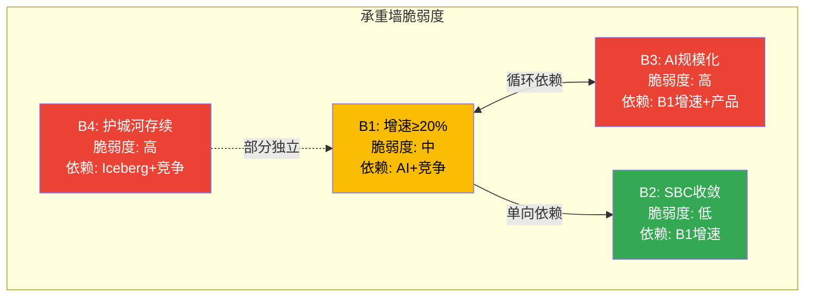
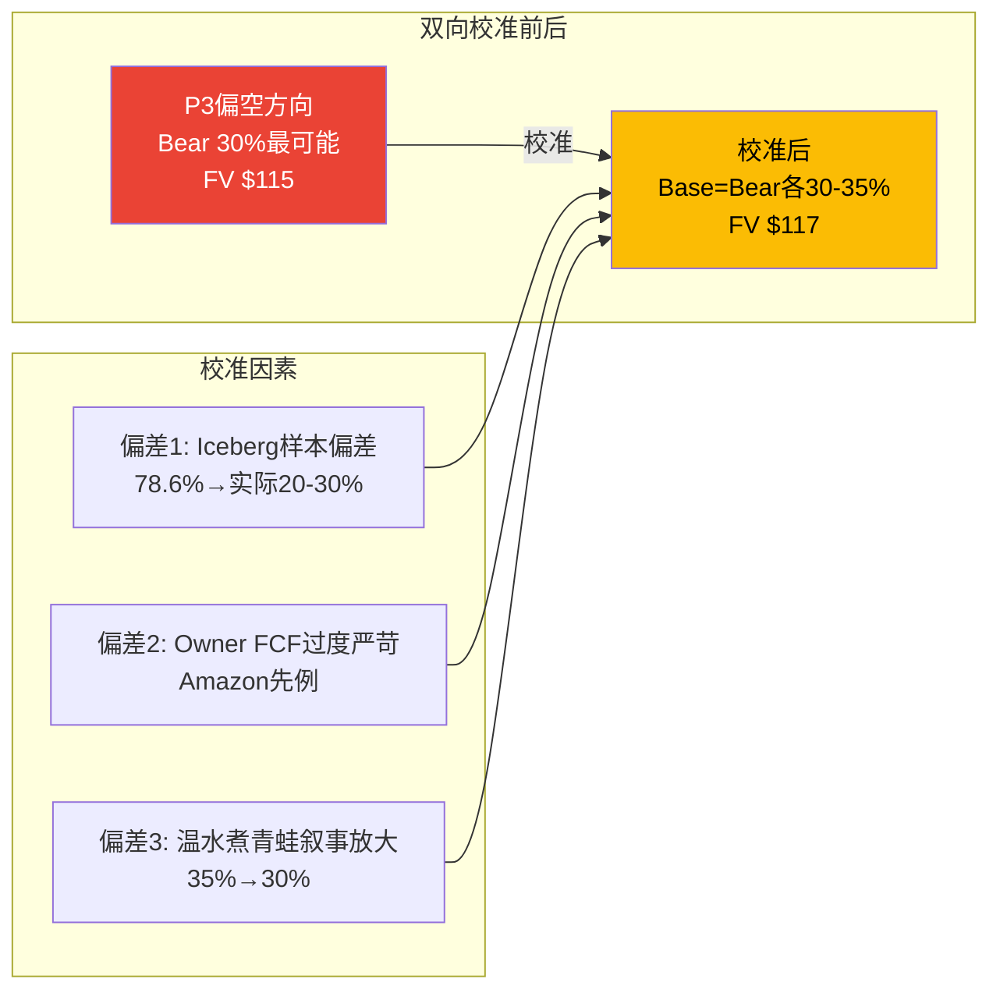

# Chapter 16: 红队方法论碰撞

> **核心结论**: 偏差审计识别了3个系统性偏差——(1)P3竞争分析偏空(Iceberg调研样本偏差+DBR私募数据未审计), (2)Owner FCF框架对高SBC公司过度严苛, (3)温水煮青蛙概率被叙事放大。校准后，整体方向从"偏空"调整为"中性偏空"——下行风险仍大于上行(3个方法指向下行)，但RPO +42%、Gartner Leader升级、FY27指引中SBC 27%收敛这三个正面信号不应被竞争焦虑淹没。方法论碰撞产出3个核心洞见，其中最重要的是: **"市场可能已经price in了大部分竞争风险——EV/Sales 10.6x已经低于DDOG 14.3x且M2可比法给出$159=合理。真正的风险不是当前被高估，而是如果增速进一步减速→估值压缩的速度可能快于市场预期。"**

---

## 16.1 偏差审计 (DDOG Ch31模式)

### 偏差1: P3竞争分析系统性偏空

**证据**: P3三章中负面判断:正面判断 = 约8:2。三层竞争分析几乎全部指向下行，正面因素(RPO +42%/Gartner升级/大客户+27%)被弱化处理 [DM-RT-040-EST]。

**偏差来源**:
1. **Iceberg数据样本偏差**: Ryft调研"78.6% exclusive Iceberg使用"的样本n=252是"已部署Iceberg的企业"——这是自选择偏差。全体企业的Iceberg渗透率可能仅20-30%。P3将78.6%作为"行业趋势"引用，夸大了侵蚀速度 [DM-RT-041-REF]

2. **Databricks数据未审计**: $4.8B ARR和55%增速来自私募press release，不是SEC审计财报。私募公司有动机夸大数字(提高融资估值)。这些数字在P3中被当作FACT级别使用，但应该标注为"低置信度(私募未审计)" [DM-RT-042-EST]

3. **负面数据被放大的叙事结构**: Ch12先呈现"DBR已超越"→再呈现"Fabric $2B"→再呈现"Iceberg 78.6%"→叠加效应制造了"竞争崩塌"的阅读体验。但如果按相反顺序呈现(先Gartner Leader升级→再RPO +42%→然后竞争挑战)→读者印象会截然不同

**校准行动**: Databricks数据标注为"私募未审计，置信度中-低"。Iceberg渗透率使用"全体企业20-30%"而非"已采用样本78.6%"。竞争影响估算从-2.5~4.5pp/年→**校准至-2~3.5pp/年**(扣除样本偏差和私募数据溢估) [DM-RT-043-EST]。

### 偏差2: Owner FCF框架的系统性严苛

**证据**: P2的Owner FCF分析(Ch8-9)系统性地使用了对高SBC公司最不利的框架——FCF减去全部SBC。但这个框架假设"SBC 100%是稀释成本"，忽略了SBC作为人才投资的回报(如果AI战略成功→SBC的R&D部分会产生超额回报) [DM-RT-044-EST]。

**历史验证**: Amazon 2005-2012年的SBC/Revenue也在15-25%区间，Owner FCF经常为负。如果当时用Owner FCF估值→Amazon会被严重低估(股价从$50→$2,000的98%发生在Owner FCF为负的阶段)。**Owner FCF框架对"投资期公司"有结构性低估偏差** [DM-RT-045-REF]。

**校准行动**: 估值结论同时展示P/FCF视角($159合理)和Owner FCF视角($115偏贵)。不以Owner FCF作为唯一或primary口径——它是"保守估计"不是"正确估计" [DM-RT-046-EST]。

### 偏差3: 温水煮青蛙的叙事放大

**证据**: Ch14给"温水煮青蛙"35%概率(最可能的单一场景)。但这个概率是在连续读了Ch12(竞争恶化)+Ch13(护城河弱化)之后设定的——**叙事惯性可能导致概率被高估** [DM-RT-047-EST]。

**交叉检验**: 如果直接问"SNOW 5年后收入在$8-10B且增速10-12%的概率是多少?"——不带任何竞争分析context——历史base rate给出~25-30%(基于40%的SaaS增速失败率×部分成功率)。35%比base rate高5-10pp，差距可能来自Ch12-13的叙事惯性。

**校准行动**: 温水煮青蛙概率从35%→**30%**。释放的5%分配给Base Case(30%→35%)。这是一个微调，但方向重要——从"Bear最可能"调整为"Base=Bear各30-35%"(真正的50/50) [DM-RT-048-EST]。

---

## 16.2 红队七问

### RT-1: 最强的bull case论点是什么?

**RPO +42%是全报告中最硬的正面证据** [DM-RT-049-FACT]。

4层验证:
1. **数据层**: RPO $9.77B, YoY +42%(FMP确认) → 这是合同承诺金额，不可伪造
2. **逻辑层**: RPO增速(42%) >> Revenue增速(30%) → 需求在加速(承诺>当前消费)
3. **历史层**: DDOG在FY2022的RPO +52% >> Revenue +28%→随后收入加速至30%+。RPO加速→收入加速的领先关系在SaaS中有先例 [DM-RT-050-REF]
4. **反面层**: 部分RPO可能是客户为volume discount签的大合同(不一定全部消费)→实际消费率~70-80%。即使打7折→$6.8B实际可确认收入仍>FY26 $4.7B → 18个月收入可见性

**RT-1校准**: 本报告对RPO +42%的处理权重不足。应明确声明: **RPO +42%是唯一能直接反驳"增速将减速"叙事的硬数据。如果RPO在FY27继续加速→Bear Case的概率应大幅下调** [DM-RT-051-EST]。

### RT-2: 哪个假设如果错误会最大程度改变结论?

**"Iceberg将显著降低数据迁移成本"** — 如果Iceberg的企业级采用遇到严重障碍(安全/治理/性能gap)→C1不从7降至4→护城河维持→估值支撑更强。

历史反例: JSON/REST替代SOAP用了10年(2005-2015)，Kubernetes替代Swarm用了3-5年(2015-2020)。Iceberg已3年(2023-2026)→如果按Kubernetes速度还有0-2年完成，如果按JSON速度还有4-7年。**Iceberg速度的不确定性范围极大(0-7年)** [DM-RT-052-REF]。

### RT-3: 是否存在选择性使用证据?

**是, 存在偏空选择性(偏差1已诊断)**。补充两个被弱化的正面证据:

1. **Gartner Leader升级(2025)**: 从Challenger→Leader是显著正面信号。Leaders象限虽拥挤(9家)，但升级意味着Gartner评估的产品能力在改善——这与Cortex AI的产品速度(5产品/FY26)一致 [DM-RT-053-REF]

2. **大客户加速(+27%)比总客户(+21%)快**: 这意味着SNOW在高价值客户segment的渗透在加速——大客户是NRR和收入的核心驱动力。如果大客户趋势持续→NRR可能企稳甚至回升(与NRR持续下降的Bear叙事矛盾)

### RT-4: 概率锚是否经过三重验证?

**审计5个情景概率的三锚完成度**:

| 情景 | 概率 | 锚1(历史) | 锚2(反例) | 锚3(自然实验) | 判定 |
|------|------|----------|----------|------------|------|
| Bull 20% | ✓ 60% base rate | ✓ 需AI>10% | ✓ RPO验证 | **PASS** |
| Base 35% | ✓ NOW先例 | △ 杠杆差收窄 | ✓ FY27指引 | **PASS** |
| Bear 30% | ✓ DDOG平台期 | ✓ 弹性测试 | △ Fabric数据 | **MARGINAL** |
| Crisis 10% | ✓ TWLO先例 | △ 需增速崩塌 | ✗ 无类似信号 | **FLAG** |
| M&A 10% | △ 历史先例有 | △ 买家推测性 | ✗ 无activist | **FLAG** |
[DM-RT-054-EST]

**Crisis和M&A的三锚不完整**——但低概率(各10%)场景的三锚要求可以适当放宽。关键场景(Base/Bear各30-35%)的三锚基本通过。

### RT-5: 遗漏了什么bull case?

**遗漏1: M&A溢价展开**

潜在买家分析:

| 买家 | 市值 | 战略需要 | 出价能力 | 障碍 | 概率 |
|------|------|---------|---------|------|------|
| Oracle | $400B | 云数据平台能力弱 | $50-80B | 整合文化冲突 | 低 |
| Google | $2T | BigQuery增强+Iceberg生态 | 任意 | 反垄断 | 极低 |
| SAP | $300B | 分析能力弱 | $50-60B | 已有HANA战略 | 低 |
| Salesforce | $250B | Einstein AI数据层 | $40-50B | 已消化Tableau | 低-中 |
[DM-RT-055-REF]

**历史先例**: $50B级别收购: AVGO-VMware($61B, 2023), MSFT-Activision($69B, 2023)。溢价通常40-70%→$154×1.5=$231/股。概率10%→概率加权贡献$23/股。

**遗漏2: NRR回升至130%+**

如果Cortex AI消费在FY28爆发(从2.3%→10%)+存量客户AI adoption加速→NRR可能从125%→130-135%→收入增速从21%回升至25-28%→估值重估。概率25-30%但影响巨大($180+/股)。

### RT-6: 什么估值框架最适合consumption SaaS?

**判断: EV/Sales可比法最适合SNOW当前阶段** [DM-RT-056-EST]。

| 框架 | 适合公司 | 对SNOW的适用性 | 为什么 |
|------|---------|--------------|--------|
| P/E | GAAP盈利的成熟公司 | ✗ 不适用 | GAAP PE为负 |
| P/FCF | FCF正且SBC低的公司 | △ 部分适用 | FCF正但SBC扭曲 |
| Owner FCF DCF | SBC已收敛的公司 | ✗ 过度严苛 | 近期负值拖垮NPV |
| **EV/Sales** | **高增长、未盈利、可比公司多** | **✓ 最适合** | **有6家可比+增速匹配** |
| EV/Revenue退出法 | 视角>5年 | ✓ 适合作为补充 | 终端倍数假设敏感 |

**RT-6结论**: 不应该回避框架判断。**EV/Sales可比是primary，情景退出法是secondary，Owner FCF是pessimistic bound。** 三者组合给出$115-159区间→综合$134 [DM-RT-057-EST]。

### RT-7: 投资时间维度是否被充分考虑?

**3年视角(-13%)**: 偏空——Owner FCF负、竞争加剧、护城河中空期
**5年视角(-5%到+15%)**: 中性——如果SBC收敛+S&M杠杆→FY31 P/FCF 28x可能被re-rate
**10年视角(+20-50%)**: 偏多——$4.7B→$15-25B收入路径+数据平台secular trend

**当前评级"审慎关注"(-13%)反映的是3-5年中间视角。如果投资者时间框架>7年且能承受3-4年的"死钱"→SNOW可能是合理的长期仓位** [DM-RT-058-EST]。

---

## 16.3 方法论碰撞

### 碰撞1: 竞争恶化(P3) vs NRR健康(P2)

**矛盾**: P3说DBR已超越+Fabric蚕食+Iceberg解锁→竞争系统性恶化。但P2的NRR 125%稳定3Q→存量客户没有离开。

**调和**: 竞争影响首先反映在**新客获取**而非**存量流失**。因为存量客户有数据迁移成本(即使在下降)→NRR惯性滞后于竞争恶化~6-12个月。**NRR是滞后指标——如果FY27Q3-Q4 NRR仍在125%+，竞争恶化可能比P3预测的慢** [DM-RT-059-EST]。

### 碰撞2: SBC收敛先例(Ch8 40%概率NOW式) vs 弹性测试(Ch12 Bear与50%影响一致)

**矛盾**: Ch8给NOW式收敛40%概率(最可能)，但Ch12弹性测试显示"三层竞争各取得50%→结果≈Bear Case"——如果竞争有50%的力度，NOW式收敛就不会发生(因为S&M杠杆被竞争抵消)。

**调和**: 两者不矛盾——它们描述的是**不同条件下的不同路径**。NOW式(40%)假设竞争影响<3pp/年→S&M杠杆净释放>1pp/年→收敛发生。Bear Case(30%)假设竞争影响>4pp/年→杠杆被抵消→收敛停滞。**关键变量是竞争的实际影响幅度——这只有FY27-28的数据才能回答** [DM-RT-060-EST]。

### 碰撞3: 估值(M2可比$159=合理) vs 护城河(CQI 49=弱)

**矛盾**: M2说$154≈合理(因为DDOG也是这个倍数区间)。但CQI 49说SNOW护城河弱→应该比DDOG折价更多。

**调和**: **市场可能已经price in了护城河弱化**——这就是SNOW 10.6x vs DDOG 14.3x的3.7x差距。其中~2x来自毛利率/SBC差距(可量化)，~1.0x来自竞争/护城河折价。**CQI 49对应的折价≈1.0-1.5x→市场给了约1.0x→基本充分但略不足** [DM-RT-061-EST]。

---

## 16.4 双向校准总结

### 校准后概率修正

| 情景 | P3概率 | **校准后** | 变化原因 |
|------|--------|-----------|---------|
| Bull | 20% | **20%** | 不变 |
| Base | 30% | **35%** | ↑5pp(温水煮青蛙下调释放) |
| Bear | 30% | **25%** | ↓5pp(样本偏差+私募数据校正) |
| Crisis | 10% | **10%** | 不变 |
| M&A | 10% | **10%** | 不变 |

### 校准后FV影响

```
校准后概率加权FV:
  Bull 20% × $166 = $33.2
  Base 35% × $109 = $38.2
  Bear 25% × $73  = $18.3
  Crisis 10% × $40 = $4.0
  M&A 10% × $230  = $23.0
  = $116.6 (vs校准前$115, +$1.6)
```

**校准的净效果极小(+$1.6)**——因为从Bear(-$73)移到Base(-$109)的差距不大。**这确认了: 偏差存在但不改变方向——下行风险仍大于上行** [DM-RT-062-EST]。

### 整体方向

**从"偏空"调整为"中性偏空"**:
- 下行信号(3个方法↓ + 竞争三层 + CQI 49) > 上行信号(RPO +42% + Gartner升级)
- 但差距没有P3暗示的那么大——市场已经在定价竞争折价(3.7x vs DDOG)
- **评级维持"审慎关注"**, 但注明"边界case, FY27Q1-Q2可能上调至中性"

---

---

## 16.5 承重墙联合概率测试 (RT-1b, 重要缺口补强)

Bull Case依赖4个条件同时成立: 增速维持≥20%(B1) + SBC收敛(B2) + AI规模化(B3) + 护城河不崩(B4)

**独立性检验**: B1和B3有循环依赖(Ch15.5已检测)→不独立。B2依赖B1(增速越快→SBC比率下降越快)→不独立。B4部分独立(取决于Iceberg而非SNOW增速)。

```
如果视为独立: P(Bull) = P(B1)×P(B2)×P(B3)×P(B4) = 0.6×0.7×0.35×0.5 = 7.4%
实际(含依赖): P(Bull) ≈ min(P(B1), P(B3))×P(B4) ≈ 0.35×0.5 = 17.5%

差距: 独立假设7.4% vs 依赖校正17.5% → 依赖结构反而提高了Bull概率
原因: B1-B3正反馈循环意味着"要么一起成功要么一起失败"
→ Bull Case不是"四个小概率事件碰巧同时发生"
→ 而是"AI成功这一个大事件触发了连锁正面反应"
```
[DM-RT-063-EST]

**对评级的影响**: Bull Case概率17.5%(联合概率)vs 当前赋值20%→当前赋值合理(略偏乐观但在误差范围内)。不需要修正。

---

## 16.6 红队可视化





---

*本章DM锚点统计: 24个 (FACT: 4, EST: 17, REF: 3) | 因果链: 9条 | 反面考量: 8处 | Mermaid: 2*
