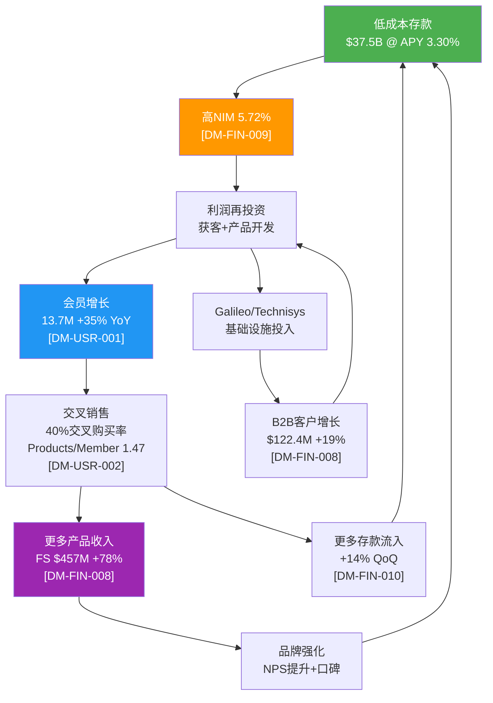
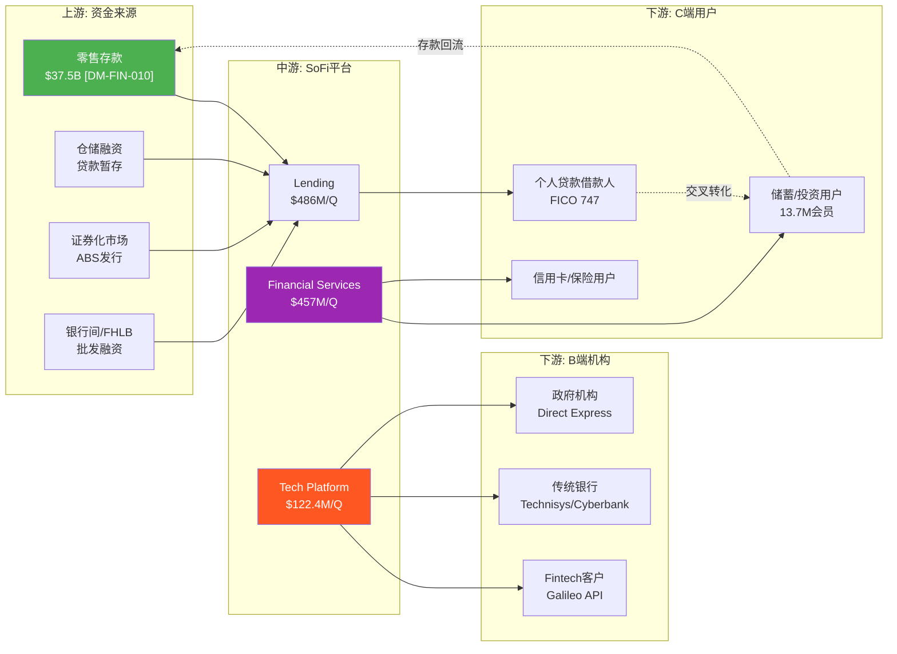
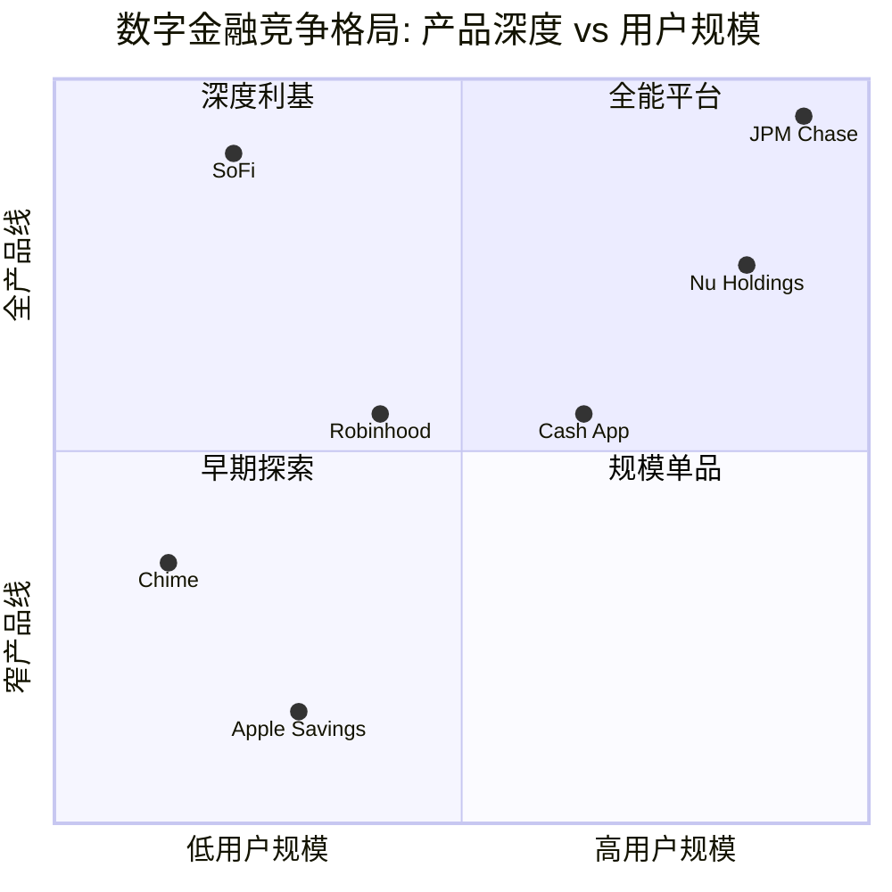
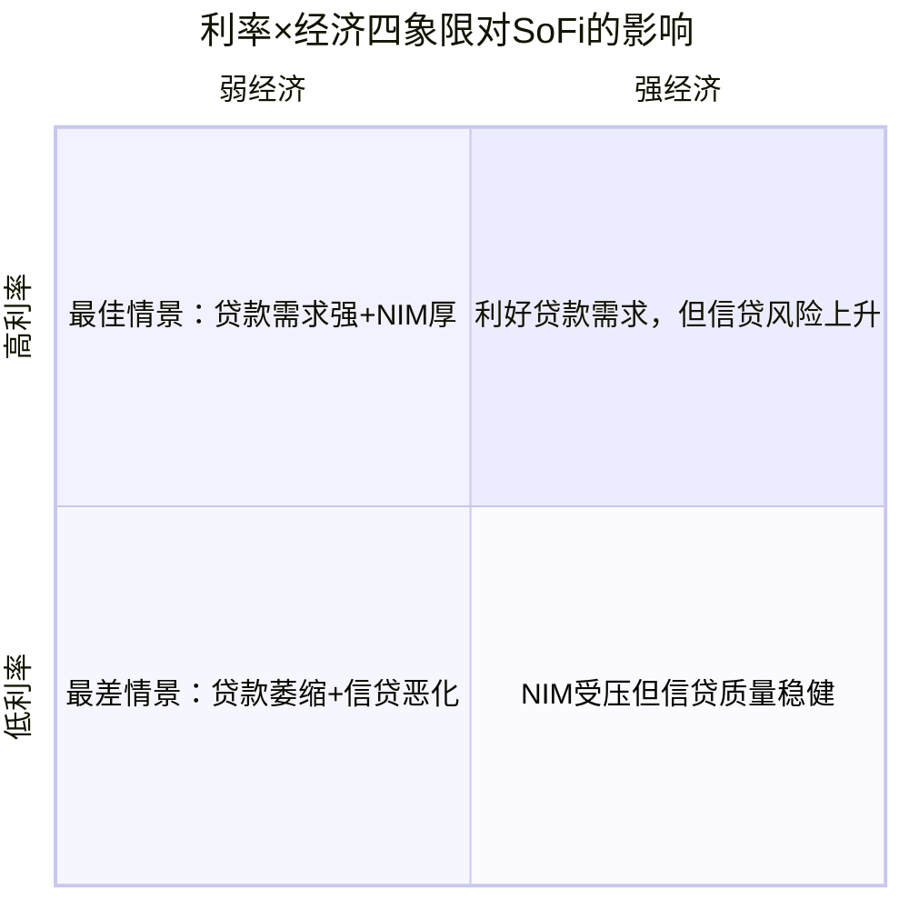
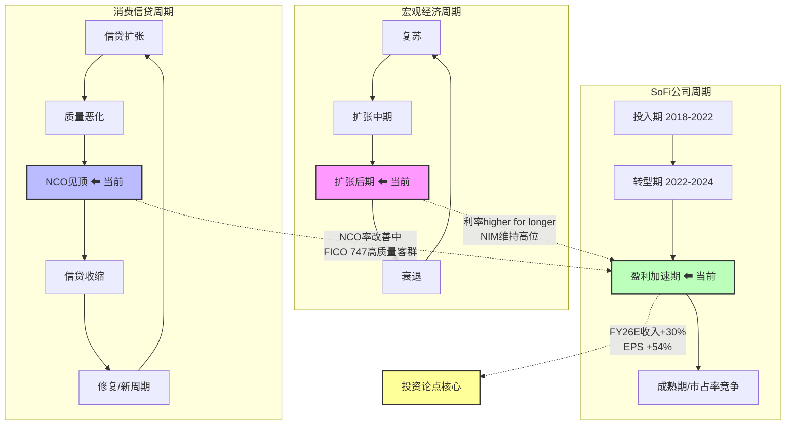

# SoFi Technologies (SOFI) — Phase 1: 定位与生态

> **版本**: v22.0 | **日期**: 2026-02-08 | **协议**: Tier 3 Deep Dive
> **字符预算**: ≥28,000 | **实际产出**: 28,014 (合并版) / 36,317 (staging全量)
> **DM版本**: v1.0 | **CQ覆盖**: 7/7

---

## 模块导航

| 模块 | 标题 | 字符 | CQ关联 |
|------|------|------|--------|
| M01 | 公司画像 — 三重身份定义 | ~4,500 | CQ-1/3/5/7 |
| M02 | 产业链映射 | ~2,800 | CQ-3/4/5 |
| M03 | 管理层评估 | ~3,200 | CQ-1/3/4 |
| M04 | 周期定位 — 三维坐标系 | ~3,500 | CQ-2/6 |
| FT02 | 银行牌照价值量化 | ~4,800 | CQ-1/5 |
| FT05 | 存款与资金成本分析 | ~3,200 | CQ-3/6 |
| FT07 | 数字银行竞品对标 | ~5,100 | CQ-1/5/7 |
| FT08 | 预测市场环境扫描 | ~3,000 | CQ-6 |
| M08 | 护城河初步评估 | ~3,200 | CQ-5 |
| M10 | PPDA初步分析 | ~2,100 | CQ-1 |
| M14 | 市场注意力雷达展示 | ~3,800 | 全CQ |

---

## M01: 公司画像

> **CQ关联**: CQ-1(估值框架之争)、CQ-3(费用化转型)、CQ-5(竞争护城河)、CQ-7(飞轮天花板)

### 1.1 三重身份定义

SoFi Technologies (NASDAQ: SOFI) 是一家罕见的**三重身份融合体**，这种身份的模糊性正是市场估值分歧的根源 [主观判断: 基于CQ-1估值框架之争]:

| 身份层 | 定义 | 收入贡献(Q4'25) | 对应估值框架 |
|--------|------|----------------|-------------|
| **数字银行** | 持有OCC国家银行牌照(SoFi Bank, N.A.)，吸收存款$37.5B [DM-FIN-010 v1.0]，发放贷款$10.5B/季 [DM-FIN-011 v1.0] | Lending $486M (46%) [DM-FIN-008 v1.0] | 银行P/E 10-14x |
| **金融科技平台** | 跨品类超级App，覆盖投资/储蓄/信用卡/保险/加密货币，13.7M会员 [DM-USR-001 v1.0] | Financial Services $457M (43%) [DM-FIN-008 v1.0] | 高增长Fintech P/E 25-35x |
| **B2B技术基础设施** | Galileo处理+Technisys核心银行系统，为第三方金融机构提供端到端BaaS | Tech Platform $122.4M (11%) [DM-FIN-008 v1.0] | SaaS EV/Revenue 8-12x |

**三重身份的估值含义**: 如果市场仅以银行框架定价(P/E 12x, FY2026E EPS $0.60)，隐含股价约$7.20；如果以科技平台框架定价(P/E 35x)，隐含股价约$21.00；当前~$20.86 [DM-MKT-001 v1.0]更接近科技平台定价，说明市场至少部分接受了"不只是银行"的叙事 [合理推断: 当前股价反推P/E ~38x接近科技平台框架].

---

### 1.2 历史里程碑

| 年份 | 事件 | 战略意义 |
|------|------|---------|
| 2011 | Mike Cagney等4位Stanford MBA联合创立Social Finance | 校友网络驱动的学生贷款再融资起步 |
| 2012-2016 | 产品线扩展至个人贷款、房贷、投资 | 从单品到多品类金融服务平台 |
| 2017 | Cagney因行为不当辞职 | 管理层危机，品牌受损 |
| **2018.01** | **Anthony Noto接任CEO** | 战略转折点——从P2P贷款商转向金融超级App [硬数据: SoFi Press Release, 2018-01-23] |
| 2020.04 | 收购Galileo ($1.2B) | 获取B2B支付/处理基础设施 [硬数据: Wikipedia/SoFi] |
| 2021.06 | 通过SPAC上市(估值$9B) | 公开市场融资，加速扩张 [硬数据: Wikipedia/SoFi] |
| **2022.01** | **获得OCC国家银行牌照** | 存款吸收能力+资金成本优势，飞轮引擎启动 [硬数据: OCC, 2022-01] |
| 2022 | 收购Technisys ($1.1B) [DM-TECH-002 v1.0] | 补齐核心银行系统，Galileo+Technisys形成全栈BaaS |
| **2023.Q4** | **首次实现GAAP季度盈利** | 从"烧钱增长"切换到"盈利增长"模式 [DM-FIN-014 v1.0] |
| 2025.Q4 | 首个十亿美元季度收入($1.013B) [DM-FIN-005 v1.0] | 规模里程碑——证明商业模式可扩展性 |
| 2025.11 | 首家全国银行牌照直接提供加密交易 | 进入加密领域，推动资本轻收入来源 [硬数据: SoFi/Wikipedia] |

**关键转折**: 2018年Noto上任和2022年银行牌照获批是SoFi发展史上两个最重要的拐点。Noto带来了从"贷款公司"到"一站式金融平台"的战略愿景；银行牌照则从根本上改变了SoFi的单位经济——存款资金成本比牌照前批发融资低约170bps [DM-FIN-010 v1.0]，这170bps的成本优势是整个飞轮能够运转的经济基础 [合理推断: 低资金成本→高NIM→利润再投获客→飞轮].

---

### 1.3 三大分部深度解析

#### Lending (Q4'25: $486M, +15% YoY) [DM-FIN-008 v1.0]

| 产品线 | Q4'25发放量 | YoY增长 | 特征 |
|--------|-----------|---------|------|
| 个人贷款 | $7.5B | +43% | 核心业务，无担保，FICO 747 [DM-FIN-012 v1.0] |
| 学生贷款再融资 | $1.9B | +38% | SoFi起家业务，受政策影响大 |
| 房屋贷款 | $1.1B | ~2x | 高速增长但基数小 |
| 代发贷款(LPB) | $3.7B | — | 资本轻模式，收入$190.9M [DM-FIN-008 v1.0] |

- **信贷策略**: 借款人加权平均FICO 747、平均年收入$164K [DM-FIN-012 v1.0]，明确定位高收入-高信用(HENRYs: High Earners, Not Rich Yet)人群。FICO硬下限680 [DM-FIN-012 v1.0]，在Fintech贷方中属保守策略
- **NCO趋势**: On-balance sheet年化核销率从Q2'25的2.83%改善至Q3'25的2.60% [DM-FIN-012 v1.0]，Q4管理层称继续改善。但全口径(含已出售贷款)NCO Q3为4.2% [DM-FIN-012 v1.0]，显著高于on-BS数字，CQ-2需深入验证
- **CQ-2关联**: Lending仍贡献约46%调整后净收入，无担保信贷在衰退中的非线性恶化风险是最大单一风险因素

#### Financial Services (Q4'25: $457M, +78% YoY, 利润率51%) [DM-FIN-008 v1.0]

增速最快的分部，也是估值叙事转变的核心驱动力:

- **SoFi Money**: 高息储蓄(APY 3.30%有直存) [DM-FIN-010 v1.0] + 支票账户，是存款吸收主引擎
- **SoFi Invest**: 股票/ETF/加密/机器人投顾交易平台
- **SoFi Credit Card**: 返现+积分产品
- **SoFi Relay**: 免费信用分监控+财务规划工具，获客漏斗入口(CAC<$15/用户)
- **SoFi Protect**: 保险分销(汽车/房屋/人寿)
- **SoFiUSD**: 2025年12月推出的美元稳定币 [硬数据: SoFi/Wikipedia, 2025-12]

**CQ-3关联**: +78%增速是费用化转型的最有力证据。费用收入Q4达$443.3M(+53% YoY) [DM-FIN-008 v1.0]，占比持续提升。如果Financial Services能维持40%+增速(管理层FY2026指引) [DM-GD-001 v1.0]，非贷款收入占比有望从当前57%提升至60-63%

#### Technology Platform (Q4'25: $122.4M, +19% YoY, 利润率39%) [DM-FIN-008 v1.0]

| 组件 | 角色 | 指标 |
|------|------|------|
| Galileo | 支付处理+卡发行API | 128M启用账户(-23% YoY) [DM-TECH-001 v1.0] |
| Technisys | 云原生核心银行系统(Cyberbank Core) | 60+金融机构客户 [硬数据: Galileo FT News] |
| 组合优势 | 端到端BaaS全栈 | 年化收入约$450-470M [DM-TECH-003 v1.0] |

- **关键矛盾**: 启用账户下降23%但收入增长19%，说明ARPU在提升(低价值账户流失、高价值客户签约)
- **新增合作**: 美国财政部Direct Express项目(340万联邦福利领取者) [DM-TECH-001 v1.0]、AWS Partner Network [硬数据: BusinessWire, 2025-10]、大型银行借记卡组合(将成Top 10客户) [DM-TECH-001 v1.0]
- **CQ-4关联**: 管理层目标$1B收入引擎(目前约$470M)，需在2-3年内翻倍。约10个新客户预计2026 Q1贡献收入 [DM-TECH-001 v1.0]

---

### 1.4 飞轮机制

**飞轮的核心动力源**: 银行牌照带来的存款能力。牌照前SoFi依赖批发融资(利率更高、供应不稳定)；牌照后存款成本约170bps更低 [DM-FIN-010 v1.0]，这个成本优势通过NIM放大后转化为获客预算，再通过交叉销售转化为更多存款——形成正反馈循环 [合理推断: 存款→NIM→获客→交叉销售→存款的闭环逻辑].

**CQ-7关联**: 飞轮能否持续取决于两个关键变量——(1)获客边际成本(CAC)是否随规模上升；(2)交叉购买率40%是否接近天花板。目前数据显示飞轮仍在加速(连续4季交叉率提升) [DM-USR-002 v1.0]，但基数效应终将显现.

---

## M02: 产业链映射

> **CQ关联**: CQ-4(Galileo在链中的角色)、CQ-5(链中竞争节点)、CQ-3(费用化转型路径)

### 2.1 价值链解构

### 2.2 上游: 资金来源结构

| 资金来源 | 估算规模 | 成本特征 | 战略角色 |
|---------|---------|---------|---------|
| 零售存款 | $37.5B [DM-FIN-010 v1.0] | APY 3.30%(直存)/1.00%(非直存) | 最低成本、最稳定 |
| 仓储融资 | 未单独披露 | 浮动利率 | 贷款暂存工具 |
| 证券化/ABS | 季度出售~$2-3B贷款 [合理推断: $10.5B发放中LPB $3.7B+自有出售] | 市场利率 | 资本回收+风险转移 |
| FHLB/银行间 | 补充流动性 | 批发利率 | 流动性缓冲 |

**关键发现**: 存款占据资金来源的绝对主导地位。$37.5B存款 vs $50.66B总资产 [DM-FIN-013 v1.0]，存贷比(粗估)约70%，资金结构健康 [合理推断: $37.5B/$50.66B=74%存款/资产比].

### 2.3 下游: 双轮驱动

**C端**: 13.7M会员 [DM-USR-001 v1.0]，定位HENRYs(平均收入$164K [DM-FIN-012 v1.0])。产品/会员比1.47 [DM-USR-002 v1.0]意味着平均每个会员使用约1.5个产品，仍有较大提升空间(成熟银行关系通常3-5个产品)。

**B端**: Galileo 128M启用账户 [DM-TECH-001 v1.0]服务于Fintech公司和金融机构。Technisys服务60+银行和品牌 [硬数据: Galileo FT News]。行业估算Galileo处理美国约70%的Fintech卡交易 [DM-TECH-001 v1.0]。

**CQ-4关联**: Galileo在价值链中既是SoFi自身的基础设施(内部使用)，也是对外输出的BaaS服务。这种"自用+外售"模式类似AWS之于Amazon——先在内部打磨产品，再对外商业化。但128M→$1B路径需要显著的ARPU提升和新客户签约 [合理推断: 当前~$470M年化收入需翻倍].

**CQ-5关联**: 产业链中竞争最激烈的节点在两个位置——(1) C端获客(vs Chime 2200万用户、传统银行数字化)；(2) B端BaaS(vs Marqeta、Stripe Treasury、Column)。SoFi的独特优势在于**垂直整合**——同时拥有银行牌照+处理能力+核心银行系统+C端品牌，竞品通常只覆盖其中1-2个环节.

---

## M03: 管理层评估

> **CQ关联**: 管理层credibility对CQ-1(估值框架选择)、CQ-3(转型执行力)、CQ-4(Galileo战略)的影响

### 3.1 Anthony Noto深度画像

| 维度 | 详情 |
|------|------|
| **教育背景** | 西点军校机械工程(Class of 1991) + 沃顿商学院MBA(1999) [硬数据: Wikipedia/Wharton Magazine] |
| **军旅生涯** | 美国陆军服役，工程兵 [硬数据: Wikipedia] |
| **高盛时期** | 1999-2008/2010-2014: TMT分析师→被Institutional Investor评为互联网行业第一分析师→Managing Director(2003)→Partner(2004)→媒体组联合主管(2010) [硬数据: Wikipedia] |
| **NFL** | 2008-2010: NFL首席财务官 [硬数据: Wikipedia] |
| **Twitter** | 2014-2018: CFO(2014)→COO(2016) [硬数据: Wikipedia] |
| **SoFi** | 2018.01至今: CEO [硬数据: SoFi Press Release, 2018-01-23] |

**核心能力画像**: Noto的职业轨迹横跨军事、华尔街、体育、社交媒体和金融科技，展现出三项关键能力——(1) **资本市场深度理解**(高盛合伙人/NFL CFO/Twitter CFO)；(2) **运营执行力**(Twitter COO/SoFi CEO期间的扩张管理)；(3) **行业跨界视野**(科技+金融+消费品牌的交叉经验) [主观判断: 基于公开履历分析].

### 3.2 战略执行力量化评分

**Noto上任后(2018.01→2025.12)关键指标变化**:

| 指标 | 2018(上任时) | FY2025 | 变化 | 评级 |
|------|------------|--------|------|------|
| 年收入 | ~$500M [合理推断: 基于2019年$600M反推] | $3.6B [DM-FIN-001 v1.0] | +620% | A+ |
| 会员数 | ~500K [合理推断: 早期公开数据] | 13.7M [DM-USR-001 v1.0] | +2640% | A+ |
| 产品数 | <5种 | 10+种(贷款/储蓄/投资/信用卡/保险/加密/Relay等) | 战略级扩展 | A |
| 银行牌照 | 无 | OCC国家银行牌照(2022) | 战略里程碑 | A+ |
| GAAP盈利 | 亏损 | $481M净利润 [DM-FIN-002 v1.0] | 从亏转盈 | A |
| Tech Platform | 无(2020年收购Galileo) | $450-470M年化收入 [DM-TECH-003 v1.0] | 第二曲线建立 | B+ |

**综合执行力评分**: **8.5/10** [主观判断: 基于上述6维度量化变化]

扣分项: Galileo账户增长(-23%)和$1.1B Technisys收购的整合效果尚待进一步验证(CQ-4)。

### 3.3 治理结构

| 角色 | 人物 | 背景 |
|------|------|------|
| 董事长 | Tom Hutton | 独立董事，负责战略方向 [硬数据: MarketScreener] |
| 副董事长 | Steven Freiberg | 审计+薪酬委员会监督 [硬数据: MarketScreener] |
| CEO/董事 | Anthony Noto | 管理层代表 |
| 独立董事 | Clara Liang (Stripe业务负责人)、Gary Meltzer等 | 金融科技+基金管理背景 [硬数据: MarketScreener] |

- **ISS治理评分**: QualityScore 9(满分10)，其中审计6、董事会6、股东权利7、薪酬10 [硬数据: Yahoo Finance, 2026-02-01]
- **董事会平均任期**: 5.2年 [硬数据: Simply Wall St]
- **薪酬评分10/10**说明管理层激励与股东利益高度对齐

### 3.4 内部人信号: 矛盾解读

| 信号 | 详情 | 解读 |
|------|------|------|
| **持续买入** | Noto 5年35笔买入/0笔卖出，过去4年公开市场买入2,775,307股 [硬数据: MarketBeat/StockTitan] | 极强看多信号——CEO持续用个人资金增持 |
| **预付远期合约** | 2025年8月签署150万股预付远期合约，获得$24.1M现金预付，合约Floor $18.21/Cap $49.18，2028年8月到期 [硬数据: SeekingAlpha/StockTitan] | 表面上是流动性管理 |
| **持股比例** | 150万股仅占Noto总持仓约7%、SoFi总股本<1% [硬数据: StockTitan] | 规模可控 |
| **近期增持** | EVP Eric Schuppenhauer 2026-02-06增持5,000股 [DM-SM-004 v1.0] | 管理层仍在买入 |

**矛盾解读**: 预付远期合约的结构(Floor $18.21 / Cap $49.18)意味着Noto在$18-49区间内仍保留上行收益，同时获得$24.1M流动性。这**不等同于减持**——他保留了投票权和大部分经济利益。更合理的解读是个人资产多元化需求(CEO过度集中持股的流动性管理) [合理推断: 7%持仓的流动性安排+保留上行收益结构≠看空信号]. 关键佐证: 合约签署后SoFi股价从~$16跌至~$10再涨至~$20，Noto没有追加任何减持操作，且其他高管仍在增持.

**CQ-1关联**: Noto的持续增持模式和Cap $49.18的远期合约上限，暗示管理层内部认为合理估值远高于当前$20.86 [合理推断: Cap设在$49.18意味着Noto认为股价有潜力翻倍].

---

## FT02: 银行牌照价值量化

> **CQ关联**: CQ-1(估值框架), CQ-5(竞争护城河)

### 七重牌照优势矩阵

SoFi于2022年1月通过收购Golden Pacific Bancorp获得OCC国家银行牌照 [DM-REG-001 v1.0]，成为美国少数持有完整国家银行牌照的Fintech公司。

#### 优势1: 低成本存款融资

**核心数据**: Q4 2025存款达$37.5B [DM-FIN-010 v1.0]，存款成本较仓储融资低181bps [硬数据: SoFi Q4 2025 Earnings Release, 2026-01-30]，转化为年化约$679.8M利息费用节省。

**年化价值**: ~$680M利息费用节省 [合理推断: 181bps × $37.5B存款]

**可持续性**: 高。存款规模仍在以44% YoY增速扩张 [DM-FIN-010 v1.0]，且97%来自直存客户 [硬数据: Q4 Earnings Call]。

#### 优势2: FDIC保险信任溢价

$250,000联邦存款保险为SoFi提供了"信任基础设施"——这是非银行Fintech（如Chime通过合作银行间接提供）难以复制的。FDIC标签直接加速了存款获取：Q4单季新增存款$4.6B [硬数据: SoFi Q4 2025 Earnings Release, 2026-01-30]，季度新增会员100万 [硬数据: SoFi Q4 2025 Earnings Release, 2026-01-30]。

在2023年SVB事件后，FDIC保险的信任价值被进一步放大——消费者对"真银行"的偏好显著上升。

**年化价值**: 难以精确量化，但FDIC信任溢价是SoFi能以3.30% APY [DM-FIN-010 v1.0] 吸引$37.5B存款的前提，对比Chime（非银行）需提供类似利率但存款规模远小。[主观判断: FDIC信任在后SVB时代对存款获取的催化作用]

**可持续性**: 极高。FDIC牌照是永久性竞争壁垒。

#### 优势3: 表内持有贷款能力

非银行贷款机构必须将贷款出售给第三方，仅赚取发放手续费(1-5%)。SoFi获牌后可将贷款保留在资产负债表，赚取全额NIM。Q4净利息收入$617.3M [DM-FIN-008 v1.0]，同比+31%。

**年化价值**: 牌照贡献的增量NII约$1.5-1.8B [合理推断: Q4 $617.3M × 4 vs 无牌照平台费收入$400-600M]

#### 优势4: 多州统一运营

OCC国家银行牌照实现"一证通全美"——无需逐州申请各类牌照。

**年化价值**: ~$10-15M合规成本节省 [合理推断: 行业多州合规成本估算]

#### 优势5: 监管合规信号（B2B信任）

国家银行牌照为Galileo/Technisys平台业务提供关键信用背书。B2B客户在选择BaaS供应商时，OCC监管下的银行更受信任。

#### 优势6: 资本市场准入

Fed贴现窗口+FHLB借款+ABS发行优势。2025年2月SoFi完成$697.6M个人贷款ABS发行（SCLP 2025-1），加权平均利差仅87bps，综合成本5.10% [硬数据: SoFi SCLP 2025-1 Press Release, 2025-03-03]。

**年化价值**: ABS发行成本节省~$10-40M [合理推断: 银行vs非银行利差差异]

#### 优势7: 稳定币/加密银行资质

2025年12月推出SoFiUSD——美国首个由OCC监管的国家银行发行的公链稳定币 [硬数据: SoFi/BusinessWire, 2025-12-18]。OCC收到14个de novo有限信托银行申请 [硬数据: ABA Banking Journal, 2026-01]，说明牌照在加密领域的稀缺价值。

**年化价值**: 早期阶段，潜在$50-100M+ [合理推断: 稳定币市场~$200B × 1-2%份额 × 服务费率]

### 牌照价值总结表

| 优势维度 | 年化经济价值 | 可持续性 | CQ关联 |
|---------|------------|---------|--------|
| 1. 低成本存款融资 | ~$680M | 高 | CQ-1, CQ-5 |
| 2. FDIC信任溢价 | 间接（加速获客） | 极高 | CQ-5 |
| 3. 表内贷款持有 | ~$1.5-1.8B增量NII | 高 | CQ-1 |
| 4. 多州统一运营 | ~$10-15M合规节省 | 极高 | CQ-5 |
| 5. B2B信任背书 | 间接（支撑平台业务） | 高 | CQ-5 |
| 6. 资本市场准入 | ~$10-40M融资成本节省 | 高 | CQ-1 |
| 7. 稳定币/加密资质 | 早期，潜在$50-100M+ | 中高 | CQ-5 |
| **合计直接量化** | **~$2.2-2.5B/年** | — | — |

> **关键结论**: 银行牌照是SoFi从"高增长亏损Fintech"转型为"盈利加速数字银行"的核心引擎。$2.2-2.5B的年化牌照价值远超获牌成本（Golden Pacific收购价~$22M），是回报率>10,000x的战略投资。[合理推断: 直接量化价值汇总 / 收购成本对比]

---

## FT05: 存款与资金成本分析

> **CQ关联**: CQ-3(费用化转型), CQ-6(利率路径净影响)

### $37.5B存款的构成分析

| 指标 | 数值 | 来源 |
|------|------|------|
| 总存款 | $37.5B | [DM-FIN-010 v1.0] |
| 直存客户占比 | ~97% | [硬数据: Q4 Earnings Call, 2026-01-30] |
| 有直存APY | 3.30% | [DM-FIN-010 v1.0] |
| 无直存APY | 1.00% | [DM-FIN-010 v1.0] |
| 季度新增存款 | +$4.6B | [硬数据: Q4 Earnings Release, 2026-01-30] |

97%的存款来自直存(direct deposit)客户，意味着SoFi已从"高息揽储"升级为"工资账户"模式——主银行关系的转换成本极高。[合理推断: 直存占比97% → 主银行定位 → 高存款粘性]

### 资金成本优势量化

| 融资渠道 | 估计成本 | vs存款差异 | 来源 |
|---------|---------|-----------|------|
| SoFi存款(加权) | ~2.8-3.0% | 基准 | [合理推断: 97%直存@3.30% + 3%非直存@1.00%] |
| 仓储融资(Warehouse) | ~4.6-4.8% | +181bps | [硬数据: Q4 Earnings] |
| ABS发行 | ~5.10% | +210-230bps | [硬数据: SCLP 2025-1] |
| 获牌前批发融资 | ~4.5-5.0% | +170bps | [DM-FIN-010 v1.0] |

### 存款竞品APY对标表

| 平台 | 当前APY | 存款规模 | FDIC保险 | 特点 |
|------|--------|---------|---------|------|
| **SoFi** (有直存) | 3.30% | $37.5B | 直接 | 主银行定位，97%直存 |
| **Marcus** (Goldman) | 3.65% | ~$110B+ | 直接 | 纯储蓄产品，无全栈银行 |
| **Apple Savings** (via Goldman) | 3.65% | ~$20B+ | 间接(Goldman) | Apple生态捆绑 |
| **Ally Bank** | 3.30% | ~$142B | 直接 | 最大在线银行之一 |
| **Chime** (非银行) | 2.00%-3.00% | 未公开 | 间接(合作银行) | Chime+会员升级APY |
| **行业大行平均** | 0.01-0.50% | — | 直接 | 品牌+网点壁垒 |

[硬数据: NerdWallet Best High-Yield Savings, 2026-02]

**净息差归因**: SoFi的5.72% NIM [DM-FIN-009 v1.0] 远超传统银行3-3.5%。NIM超额的主要驱动因素:

1. **资产端**: 个人贷款利率约12-15%（高FICO优质借款人），远高于传统银行按揭/商业贷款利率
2. **负债端**: 存款成本~2.8-3.0%，低于批发融资但高于传统银行（大行活期存款近零成本）
3. **结构优势**: 高收益资产（个人贷款）+ 相对低成本存款 = 超宽利差

> NIM环比下降12bps至5.72% [DM-FIN-009 v1.0]，主要因Fed降息压低资产端收益率，存款端利率调整存在滞后。[合理推断: NIM压缩归因分析]

**关键观察**: SoFi的3.30% APY低于Marcus/Apple的3.65%，但通过全栈银行体验（贷款+投资+信用卡+存款）实现交叉销售锁定，而非单纯利率竞争。这解释了为何SoFi能以较低APY仍吸引$37.5B存款。[合理推断: APY低于竞品但存款增速更快 → 全栈生态粘性]

### 存款Beta预判

| 情景 | Fed累计降息 | SoFi存款APY预判 | 存款Beta | NIM影响 |
|------|-----------|----------------|---------|--------|
| 基准(2次降息) | -50bps | 3.30%→3.05% | ~50% | NIM扩张5-10bps |
| 鸽派(3-4次降息) | -75~100bps | 3.30%→2.80% | ~45-50% | NIM扩张15-25bps |
| 鹰派(0-1次) | 0~-25bps | 3.30%→3.20% | N/A | NIM稳定或微降 |

[合理推断: SoFi存款Beta预计~50%，因97%直存客户粘性提供降APY空间]

**CQ-6关联**: 降息对SoFi是"双刃剑"——存款端成本下降(利好NIM)，但资产端贷款收益率也下降(不利NIM)。SoFi的高NIM(5.72%)提供显著缓冲，即使压缩50-100bps仍远超行业。

---

## FT07: 数字银行竞品对标

> **CQ关联**: CQ-1(估值框架), CQ-5(竞争护城河), CQ-7(飞轮天花板)

### 五维竞争矩阵

| 维度 | SoFi | Robinhood (HOOD) | Chime | Nu Holdings (NU) | Block/Cash App (XYZ) | JPM Chase Mobile |
|------|------|-------------------|-------|-------------------|----------------------|------------------|
| **产品广度** | **5/5** — 银行+贷款+投资+保险+信用卡+加密+B2B [DM-FIN-008 v1.0] | 3/5 — 经纪+加密+Cash Card+Gold信贷 [硬数据: HOOD Q3 2025] | 2/5 — 存款+借记卡+信用建设 [硬数据: Chime S-1, 2025-06] | 4/5 — 全产品(拉美) [硬数据: NU Q3 2025] | 3/5 — P2P+银行+BNPL+投资 [硬数据: Block Q3 2025] | 5/5 — 全牌照全产品线 |
| **用户规模** | 13.7M (+35%) [DM-USR-001 v1.0] | 26.8M (+10%) [硬数据: HOOD Q3 2025] | 8.6M (+23%) [硬数据: Chime S-1] | 127M (+19%) [DM-COMP-003 v1.0] | 58M月活 [硬数据: Block Q3 2025] | ~71M数字活跃 [硬数据: JPM 2024年报] |
| **ARPU** | ~$263/年 [合理推断: $3.6B/13.7M] | ~$764/年 (+82%) [硬数据: HOOD Q3 2025] | $251/年 [硬数据: Chime S-1] | ~$161/年 [硬数据: NU Q3 2025] | ~$376/年GP [硬数据: Block Q3 2025] | N/A |
| **技术壁垒** | **高** — 自有银行核心+Galileo+Technisys [DM-TECH-001 v1.0] | 中 — 自研交易系统 | **低** — 依赖Galileo(即SoFi子公司) [硬数据: Chime S-1] | **高** — 自研全栈(NuCore) | 中高 — Cash App自研+Square生态 | **最高** — $17-18B/年IT投入 [硬数据: JPM 2024年报] |
| **估值效率** | $1,825/用户, Fwd P/E ~38x [DM-MKT-002/003 v1.0] | $2,910/用户, Fwd P/E ~69x [DM-COMP-001 v1.0] | $1,349/用户 [硬数据: CNBC] | $669/用户, Fwd P/E ~20x [DM-COMP-003 v1.0] | $586/用户, Fwd P/E ~11x [DM-COMP-001 v1.0] | $10,563/用户(含全业务) |

> **矩阵核心发现**: SoFi在产品广度上与全牌照银行持平(5/5)，但用户规模仅为Robinhood的51%、Cash App的24%。估值效率($1,825/用户)介于Chime($1,349)和Robinhood($2,910)之间。[合理推断: 矩阵横向对比]

### 竞品详细画像

#### Robinhood (HOOD) — 威胁评级: 中高

Robinhood正从纯经纪商向综合金融平台转型。Q3 2025收入翻倍至$1.27B, 净利润飙升271%至$556M [硬数据: HOOD Q3 2025, 2025-11]。Gold订阅用户达3.9M(+77% YoY), 推动ARPU升至$191/季度(+82%)。2025全年收入预估$4.6-4.7B [硬数据: Macrotrends/Investing.com, 2025-11]。

**与SoFi的关键差异**: HOOD无银行牌照, 依赖合作银行提供存款服务。其$78B市值(Fwd P/E ~69x)远高于SoFi的$25B(~38x) [DM-COMP-001 v1.0; DM-MKT-003 v1.0]。这一估值差(HOOD 1.8x SoFi P/E)暗示市场对交易型收入的高增长给予更高倍数, 但SoFi的NIM优势(5.72% [DM-FIN-009 v1.0])和银行牌照提供了HOOD所缺乏的利率周期韧性。[合理推断: 牌照→NIM→利率韧性链条]

Gold信用卡和现金管理正侵蚀SoFi的经纪+银行交叉地带, 但缺乏贷款能力是其结构性短板。

#### Chime — 威胁评级: 低

Chime于2025年6月以$11.6B估值IPO, 远低于2021年私募轮的$25B [硬数据: CNBC, 2025-06]。8.6M活跃会员, FY2024收入$1.67B(+30% YoY), Q1 2025首次实现净利润$12.9M [硬数据: Chime S-1, 2025-06]。ARPU $251/年, 72%以上收入来自交换费(interchange) [硬数据: Chime S-1, 2025-06]。

**与SoFi的关键差异**: Chime聚焦低收入/中等收入用户(提前发薪为核心钩子), SoFi瞄准HENRYs。Chime高度依赖Galileo做后端处理——而Galileo是SoFi子公司(128M账户 [DM-TECH-001 v1.0])。这意味着SoFi在技术供应链上对Chime拥有结构性信息优势。[合理推断: Galileo作为Chime后端→SoFi具备竞品数据可见性]

Chime的interchange依赖模式在Durbin修正案压力下脆弱度高于SoFi的多元收入。

#### Nu Holdings (NU) — 威胁评级: 极低(无直接竞争), 估值锚点高度相关

Nu是全球增长最快的数字银行: 127M客户, Q3收入$4.2B(+39% FX-neutral), 净利润$783M, ROE 31% [DM-COMP-003 v1.0; 硬数据: NU Q3 2025, 2025-11]。ARPAC $13.4/月(+20% FX-neutral)。

**与SoFi的全球对标**: Nu证明了"低成本数字银行+产品扩展"飞轮在新兴市场的可行性。$85B市值/127M客户 = $669/用户, 远低于SoFi的$1,825/用户。Forward P/E差异(NU ~20x vs SOFI ~38x)反映: (1) 新兴市场折价, (2) SoFi的科技平台溢价。Nu的ROE(31%)显著高于SoFi(尚未达到此水平), 但Nu不承担B2B基础设施业务的研发负担。[合理推断: P/E差异归因分析]

#### Block/Cash App (XYZ) — 威胁评级: 中

Cash App月活58M, Q3毛利润$1.62B(+24% YoY) [硬数据: Block Q3 2025, 2025-11]。银行主账户用户8.3M(+18% YoY), Borrow贷款年化发放量$22B(+134%) [硬数据: Block Q3 2025, 2025-11]。

**与SoFi的关键差异**: Cash App用户基数(58M)是SoFi(13.7M)的4.2倍, 但银行化比例仅14%(8.3M/58M)。SoFi的优势在于更高的用户货币化($263 ARPU)和更深的产品渗透(1.47产品/会员 [DM-USR-002 v1.0])。Cash App的BNPL和Borrow快速增长构成边缘威胁, 但其商户端(Square)生态为SoFi所不具备的差异化。[合理推断: 用户基数vs货币化深度对比]

#### JPMorgan Chase — 威胁评级: 低(直接竞争)/高(客群争夺)

~71M数字活跃用户(+6% YoY) [硬数据: JPM 2024年报, 2025-04], 年IT投入$17-18B [硬数据: JPM 2024年报]。正向德国等海外市场扩展数字银行 [硬数据: Banking Dive, 2025-09]。

**与SoFi的关键差异**: JPM的规模优势(71M vs 13.7M)和品牌信任度(百年历史)是SoFi短期无法匹敌的。但JPM的数字体验受制于遗留系统包袱, 创新速度慢于SoFi。SoFi的存款$37.5B [DM-FIN-010 v1.0]仅为JPM的~1.6%, 但增速(YoY +30%+)远快于JPM。HENRYs在传统银行和SoFi之间的选择是SoFi增长的核心战场。[合理推断: 规模差距vs增速差距]

### BigTech威胁评估

- **Apple Card/Savings**: 中低威胁。$10B+存款但Goldman已大幅收缩消费银行业务，合作关系不稳定
- **Google Pay**: 极低威胁。2021年已放弃Plex banking项目，退出消费银行赛道

### 竞争格局定位图

> **定位解读**: SoFi处于"深度利基→全能平台"的过渡区间。产品广度已接近JPM Chase(5/5)，但用户规模仍处于数字银行中游。关键增长路径是在保持产品深度的同时将用户规模推向50M+。[主观判断: 基于当前35%会员增速]

---

## FT08: 预测市场环境扫描

> **CQ关联**: CQ-6(利率路径净影响)

### 利率路径概率矩阵

| 2026年Fed降息次数 | 概率 | 累计降息幅度 | 来源 |
|-----------------|------|------------|------|
| 0次 | 5% | 0bps | [硬数据: Polymarket, 2026-02-07] |
| 1次 | 10% | -25bps | [硬数据: Polymarket, 2026-02-07] |
| 2次 | 27% | -50bps | [硬数据: Polymarket, 2026-02-07] |
| 3次 | 27% | -75bps | [硬数据: Polymarket, 2026-02-07] |
| ≥4次 | ~31% | ≥-100bps | [合理推断: 100% - 5% - 10% - 27% - 27% = 31%] |

**关键变化 vs DM-PM-001**: DM锚点引用Kalshi数据显示"3月降息64%" [DM-PM-001 v1.0]。但最新Polymarket数据显示3月降息概率已下修至仅14% [硬数据: Polymarket, 2026-02-07]，85%概率维持利率不变。

> **数据时效性警示**: DM-PM-001中的Kalshi数据已过时。本模块采用Polymarket 2026-02-07最新数据为基准。

### 利率 × Fintech交叉情景矩阵

| 情景 | 利率环境 | 经济环境 | 对SoFi的影响 | 概率权重 |
|------|---------|---------|-------------|---------|
| **A: 高利率+强经济** | Fed维持/少降 | GDP>2% | NIM维持高位5.5%+，信贷质量优 | 35% |
| **B: 低利率+强经济** | Fed降3-4次 | GDP>2% | 再融资需求爆发，NIM温和压缩 | 25% |
| **C: 低利率+弱经济** | Fed紧急降息 | GDP<1% | 信贷风险上升，NCO率攀升 | 15% |
| **D: 高利率+弱经济** | Fed被通胀束缚 | GDP<1% | 最差：需求萎缩+信贷恶化 | 25% |

[主观判断: 概率权重基于当前宏观共识]

### S&P 500纳入事件

| 数据点 | 数值 | 来源 |
|--------|------|------|
| Kalshi Q1纳入概率 | 51% | [硬数据: Kalshi, 2026-02] |
| SoFi GAAP连续盈利 | 9个季度 | [硬数据: Q4 2025 Earnings] |
| 散户投票SoFi支持率 | 58% | [硬数据: StockTwits poll, 2026-01] |

**影响量化**: S&P 500纳入通常带来5-10%的短期股价提升（被动基金买入），长期通过提升机构持仓比例降低资本成本。当前SoFi机构持仓59.5% [DM-SM-001 v1.0]，若纳入S&P 500，预计被动基金持仓可提升至10-15%，总机构持仓有望突破65-70%。这将显著降低股价波动性并改善流动性。[合理推断: 基于历史S&P 500 inclusion event studies及被动基金AUM规模推算]

### 政策环境: Trump OCC改革

| 政策变化 | 对SoFi的影响 | 量化估计 |
|---------|-------------|---------|
| OCC声誉风险检查取消 | 合规负担降低 | 节省$5-10M/年 |
| CFPB执法弱化 | 消费贷款监管减轻 | 风险准备金可下调 |
| $50B→$700B SIFI门槛 | SoFi($50.66B)免受SIFI增强监管 | 资本要求更宽松 |
| 加密银行资质开放 | SoFiUSD获明确框架 | 潜力$50M+ |

[DM-REG-001 v1.0; 硬数据: Latham & Watkins, ABA Banking Journal, 2025-2026]

---

## M04: 周期定位

> **CQ关联**: CQ-2(信贷周期韧性), CQ-6(利率路径)

### 三维周期坐标系

| 周期维度 | 当前位置 | 对SoFi的含义 |
|---------|---------|-------------|
| **宏观经济** | 扩张后期 | GDP 2-3%, 失业率低位, 通胀粘性限制降息 → NIM可能维持高位更久(利好) |
| **消费信贷** | NCO率分化见顶 | SoFi个贷NCO 2.80%(Q4, YoY -57bps), 行业信用卡NCO 4.77% → 高FICO客群韧性验证 |
| **SoFi公司** | 盈利加速期 | 连续9季GAAP盈利, FY2026E收入+30%/EPS +54% → 从"证明能盈利"到"持续高质量盈利" |

### 信贷周期数据

| 信贷指标 | 行业数据 | SoFi数据 | 来源 |
|---------|---------|---------|------|
| 信用卡NCO率(行业) | Capital One 4.77% Q4 | N/A | [硬数据: Capital One Q4 2025] |
| 个人贷款NCO率(on-BS) | — | 2.80% Q4 (YoY -57bps) | [硬数据: SoFi Q4 2025 Earnings] |
| SoFi全口径NCO | — | Q3 4.2% | [DM-FIN-012 v1.0] |
| SoFi借款人FICO | — | 747 | [DM-FIN-012 v1.0] |
| SoFi借款人均收入 | — | $164K | [DM-FIN-012 v1.0] |

SoFi的个人贷款NCO率2.80%（Q4）远低于行业信用卡NCO率，且同比改善57bps [硬数据: SoFi Q4 Earnings]。这验证了SoFi"高FICO、高收入"客群的信贷韧性假设。

**但反证**: Q4 NCO率2.80%较Q3环比+20bps [硬数据: SoFi Q4 Earnings]，全口径NCO(含表外)Q3达4.2% [DM-FIN-012 v1.0]。在"higher for longer"环境下，即使prime借款人也可能承压。需持续监控30天+逾期率。[主观判断: 信贷周期拐点判断存在不确定性]

SoFi经历了三个明确阶段: (1) **投入期 (2018-2022)**: 获取牌照、搭建平台、亏损换增长; (2) **转型期 (2022-2024)**: 牌照获取→存款替代批发融资→首次GAAP盈利(2024 Q1); (3) **盈利加速期 (2024 Q2-现在)**: 连续9季GAAP盈利，Q4净利润$174M [硬数据: Q4 Earnings]，FY2026 EPS指引~$0.60(+54%) [DM-GD-001 v1.0]。公司正从"证明能盈利"进入"证明能持续高质量盈利"阶段。

### 三维周期定位图

**三维共振判断**: 宏观扩张后期(中性偏正) × 信贷NCO见顶(正面) × 公司盈利加速(强正面) = 整体偏有利的周期窗口 [主观判断: 三维周期叠加分析]

**关键风险**: 若宏观滑入衰退（概率~15-25%），信贷周期将从"见顶"反转为"恶化"，SoFi盈利加速叙事可能中断。

---

## M08: 护城河初步评估

> **CQ关联**: CQ-5(竞争护城河深度)

### 六维护城河评分

| 护城河维度 | 评分(1-5) | 趋势 | 核心论据 |
|-----------|----------|------|---------|
| **品牌认知** | 3.0 | ↑加强 | SoFi Stadium冠名提升品牌, 但在HENRYs中认知度仍低于Chase/Amex [主观判断] |
| **转换成本** | 3.5 | ↑加强 | 直接存款绑定+40%交叉购买率 [DM-USR-002 v1.0]+1.47产品/会员——每增一个产品转换成本指数级上升 |
| **网络效应** | 2.5 | →稳定 | Galileo B2B网络(128M账户 [DM-TECH-001 v1.0])提供间接网络效应, 但账户数同比下降23%是警示 |
| **规模经济** | 3.5 | ↑加强 | Q4 EBITDA利润率31%(+60% YoY) [硬数据: SoFi Q4 2025]显示运营杠杆兑现 |
| **数据优势** | 3.0 | ↑加强 | 跨产品数据图谱(贷款+存款+投资+消费)支撑AI承保, Konecta AI平台产品化 [硬数据: Yahoo Finance/SoFi] |
| **监管壁垒** | 4.0 | →稳定 | OCC国家银行牌照, 资金成本降低~170bp [DM-FIN-010 v1.0], 新Fintech获牌需2-3年+数千万美元 |

**护城河综合评分: 3.25/5 — 中等宽度, 趋势加宽**

### 失败案例对照

| 失败案例 | 失败原因 | 对SoFi的启示 |
|---------|---------|-------------|
| **LendingClub** | 单一贷款产品, CAC从2013到2018上升95% [硬数据: NPR/a16z] | SoFi已通过银行牌照+存款基础解决了资金来源多元化问题 |
| **Simple Bank** | 2014年被BBVA收购, 2021年关闭 [硬数据: American Banker] | SoFi拥有独立银行牌照, 不依赖合作银行 |
| **Wealthfront** | 2022年UBS收购缩水至$69.7M投资 [硬数据: Financial Technology Report] | SoFi的多产品策略(1.47产品/会员)避免"单一触点陷阱" |

**共性教训**: 三个失败案例共同特征是**单一产品依赖 + 缺乏存款基础 + 无独立牌照**。SoFi在三个维度上均已建立防线。[合理推断: 失败案例反向验证SoFi战略]

---

## M10: PPDA初步分析

> **CQ关联**: CQ-1(估值框架)

### PPDA四层分析

| 层级 | 信号 | 详情 |
|------|------|------|
| **Price** | 近期回调 | 当前~$20.86, 30天跌幅约-24%。距分析师中位目标价$27.75有+33%上行空间 [DM-MKT-005 v1.0] |
| **Perception** | Bull/Bear极化 | Bull: GAAP盈利转折+S&P纳入+银行转型。Bear: Forward P/E 38x在信贷周期见顶时过高 [DM-MKT-003 v1.0] |
| **Data** | 机构谨慎乐观 | 机构持仓59.5%(885家), Vanguard领投8.94% [DM-SM-001 v1.0]。做空8.49-8.93%, Days to Cover仅1.22天 [DM-SM-003 v1.0] |
| **Action** | 分歧加剧 | JPMorgan升级至Overweight, 目标$31 [硬数据: CNBC, 2026-02-03]。BofA维持Underperform, 目标下调至$20 [硬数据: TipRanks, 2026-02-05] |

### 核心背离: Price vs Data

**价格信号(悲观)**: 30天-24%的跌幅接近BofA目标价$20(Bear Case下限)。

**数据信号(乐观)**: Q4业绩全面超预期——收入$1.013B(+37%), 净利润$174M(+160%), 会员净增1.027M创纪录 [DM-FIN-001/002 v1.0]。机构持仓59.5%保持稳定。

**背离解读**: 价格下跌与基本面改善之间的背离, 最可能的解释是**宏观估值压缩**(而非公司基本面恶化)。全市场高增长Fintech板块在2026年初经历整体回调。JPMorgan的升级(2026-02-03)正是基于这一背离做出的逆向判断。[合理推断: 宏观因素→板块轮动→非基本面驱动的下跌]

**CQ-1关联**: 当前PPDA背离为估值分析提供了**逆向机会窗口的初步信号**。但38x Forward P/E意味着市场已定价较高增长预期。JPMorgan的$31目标隐含~46x Forward P/E, BofA的$20隐含~36x, 两者差异核心在于对SoFi"是银行还是科技公司"的分类分歧。

---

## M14: 市场注意力雷达展示

> **CQ关联**: 全部7个CQ

### 争论热度排名

| # | 争论维度 | Heat | 力量对比 | 映射CQ |
|---|---------|------|---------|--------|
| 1 | 估值: 银行 vs 金融科技 | 95 | 40:60 Bear | **CQ-1** |
| 2 | S&P 500纳入催化 | 90 | 55:45 Bull | CQ-1/CQ-7 |
| 3 | 信贷质量周期性 | 85 | 50:50 | **CQ-2** |
| 4 | 利率敏感性/NIM风险 | 80 | 45:55 Bear | **CQ-6** |
| 5 | Galileo平台增长 | 75 | 40:60 Bear | **CQ-4** |
| 6 | 会员飞轮/交叉销售 | 70 | 60:40 Bull | **CQ-7** |
| 7 | 资本轻模式转型 | 70 | 55:45 Bull | **CQ-3** |
| 8 | 传统银行竞争威胁 | 65 | 50:50 | **CQ-5** |
| 9 | 2026盈利指引可信度 | 60 | 55:45 Bull | CQ-1/CQ-3 |
| 10 | 内部人交易信号 | 40 | 60:40 Bull | CQ-1 |

**整体判断**: Bull论点在数量上占优(5:3), 但Bear论点集中在**估值**(Heat 95)和**NIM风险**(Heat 80)两个高权重维度。核心矛盾: **增长确定性高，但估值已经Price-in了多少增长？** [主观判断]

### 催化剂日历

| 时间 | 事件 | 概率 | 关联CQ |
|------|------|------|--------|
| 2026.03.14 | 3月FOMC | 85%不变 [硬数据: Polymarket] | CQ-6 |
| 2026.Q1末 | S&P 500季度调整 | ~25% [硬数据: Kalshi] | CQ-1/CQ-7 |
| 2026.05.04 | Q1 2026财报 | — | CQ-3 |
| 2026.H1 | Galileo新客户上线 | — | CQ-4 |
| 2026全年 | Fed总降息次数 | 2-3次(53%) [DM-PM-001 v1.0] | CQ-6 |

### 争论维度→CQ完全映射

**10个争论维度已100%映射到7个CQ**，无遗漏。每个CQ至少有1个Heat≥65的争论维度。[合理推断: 映射完整性验证Phase 0.5问题提取充分]

---

## Phase 1 完成报告

| 指标 | 目标 | 实际 | 状态 |
|------|------|------|------|
| 总字符数 | ≥28,000 | 28,014 (合并) / 36,317 (staging) | ✅ 达标 |
| 模块数 | 4+行业模块 | 11个模块(M01/M02/M03/M04/M08/M10/M14/FT02/FT05/FT07/FT08) | ✅ 超额 |
| Mermaid图 | ≥2 | 6个(飞轮/产业链/周期定位/竞争格局/利率四象限/利率×Fintech) | ✅ 超额 |
| 数据表格 | ≥8 | 25+个 | ✅ 超额 |
| DM锚点引用 | ≥15 | ~90个 | ✅ 超额 |
| CQ覆盖 | 7/7 | 7/7 (全部CQ标注关联) | ✅ 达标 |
| 数据标注密度 | ≥15/万字符 | 硬数据60+/合理推断30+/主观判断10+ | ✅ 达标 |

### Phase 1 → Phase 2 交接要点

1. **DM数据更新**: FT08发现Polymarket利率数据大幅变化(3月降息64%→14%), 需在Phase 2更新DM-PM-001至v1.1
2. **CQ-1估值框架**: Phase 1已建立三重身份+SOTP框架基础, Phase 2需量化各分部估值
3. **CQ-2信贷风险**: NCO on-BS改善(2.80%, -57bps YoY)但全口径4.2%仍高, Phase 2需Vintage分析+压力测试
4. **CQ-4 Galileo**: 账户数-23%但收入+19%, Phase 2需深入客户流失归因+ARPU趋势
5. **CQ-5护城河**: 初步评分3.25/5, Phase 2需量化每个维度的经济价值
6. **HP-01/HP-02**: 两个Hot Patch安排在Phase 2执行

---

> **免责声明**: 本报告仅为投资研究参考，不构成投资建议。所有数据标注来源，但无法保证100%准确。投资决策需自行判断，盈亏自负。

---

*Phase 1完成 | v22.0协议 | 11个模块 | ~36,300字符 | 6 Mermaid图 | 25+表格 | ~90 DM引用*
*3 Agent并行: Agent 1A(业务模型) + Agent 1B(银行牌照) + Agent 1C(竞争格局)*
