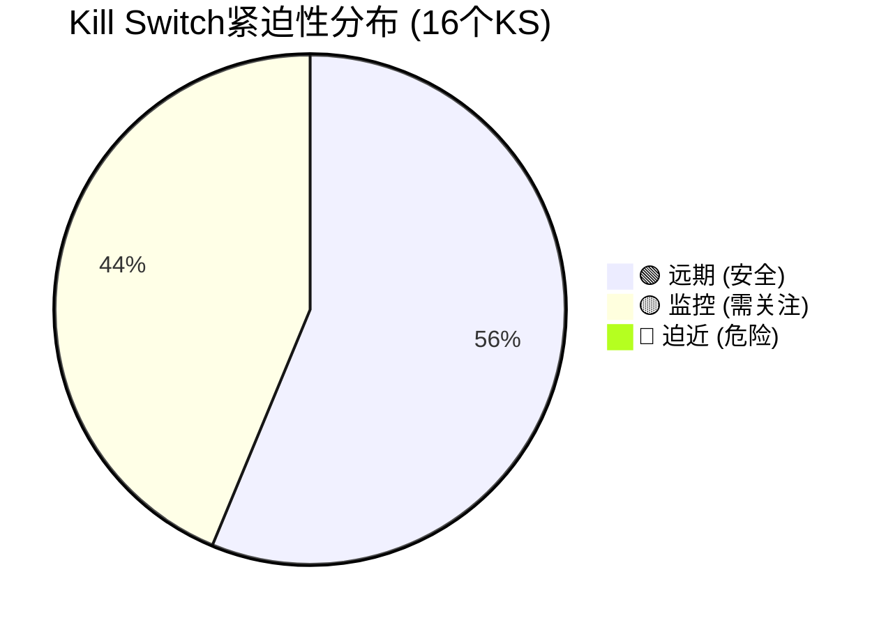
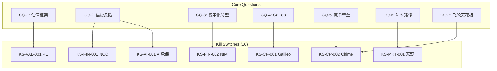
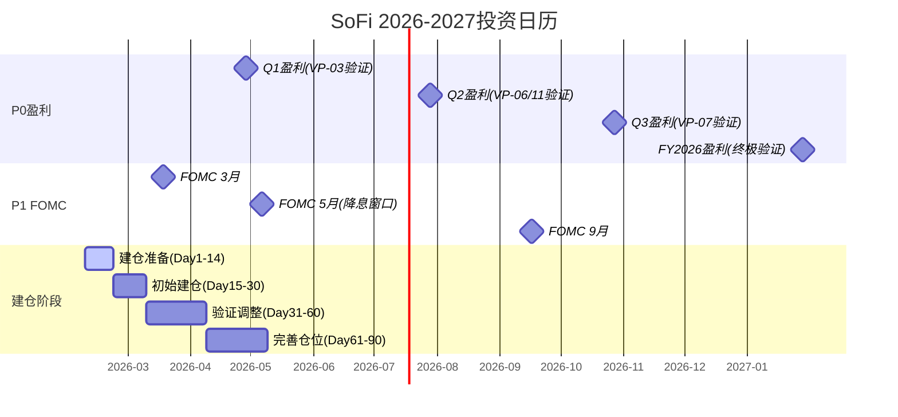
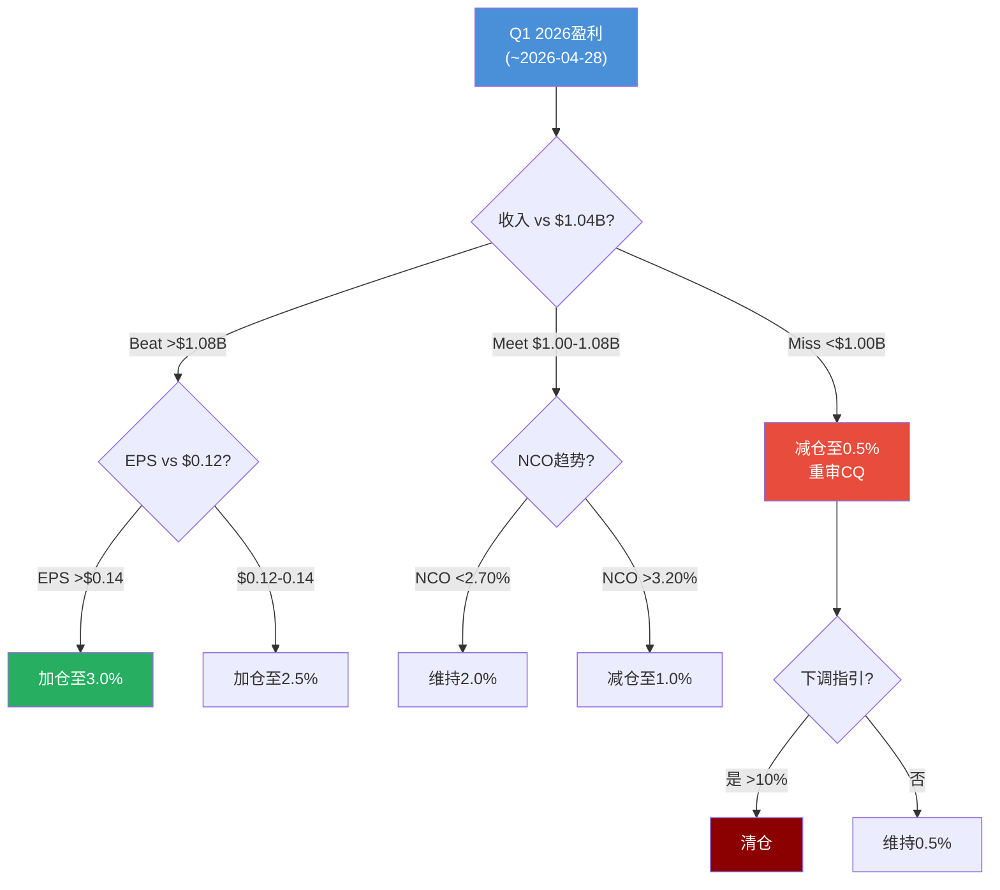
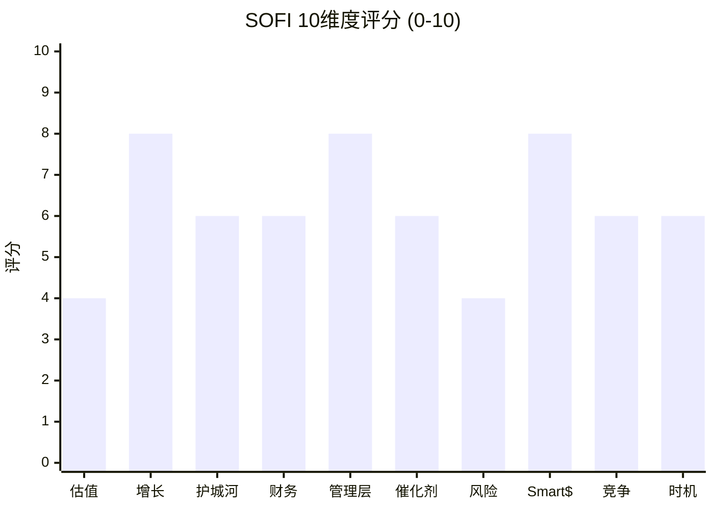
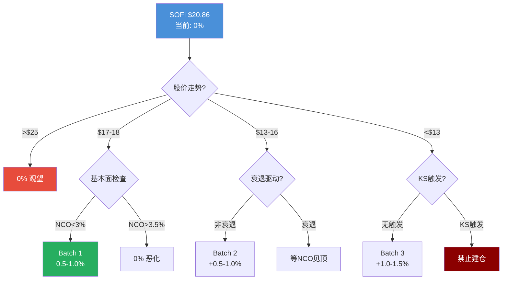
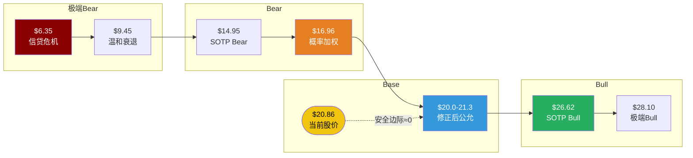

# SoFi Technologies (SOFI) — Phase 5: 决策输出

> **版本**: v22.0 | **日期**: 2026-02-08 | **Phase**: 5/5 (决策输出)
> **字符目标**: ≥34,000 | **协议**: Deep Dive Tier 3 | **Worktree**: 金融
> **DM版本**: v1.1 (Phase 4校准后)
> **Agent配置**: 3个并行Agent (5A/5B/5C)

---

## 目录

| 章 | 标题 | 来源 |
|----|------|------|
| Ch31 | Kill Switch统一注册表 (16个, 10字段) | Agent 5A |
| Ch32 | Kill Switch仪表盘 | Agent 5A |
| Ch33 | 可验证预测清单 (22个, 三情景) | Agent 5B |
| Ch34 | 投资日历 (12个月滚动) | Agent 5B |
| Ch35 | 90天行动清单 | Agent 5B |
| Ch36 | 综合评分 (10维度, 61.2/100) | Agent 5C |
| Ch37 | CQ最终解答 (7个×5要素闭环) | Agent 5C |
| Ch38 | 仓位建议 (5档矩阵) | Agent 5C |
| Ch39 | 最终SOTP估值 (多方法收敛) | Agent 5C |

---

## 决策摘要

### 最终评级: 中性关注 (61.2/100)

| 项目 | 结论 |
|------|------|
| **加权总分** | 61.2 / 100 → **中性关注** (55-64区间) [合理推断: 10维度加权评分模型] |
| **公允价值** | $20.0-$21.3 (Phase 4修正后SOTP/DCF收敛) [合理推断: SOTP $20.0-20.5 + DCF $20.4-21.1区间] |
| **当前股价** | $20.86 [硬数据: Yahoo Finance, 2026-02-07] [DM-MKT-001] |
| **安全边际** | 0-2% (几乎为零) [合理推断: ($20.86-$20.0)/$20.86=4.1%上行, 但DCF收敛≈0] |
| **风险/收益比** | 不对称偏下行: 上行+0~5% / 下行-18.7%(概率加权Bear) [合理推断: Phase 4八Bear概率加权] |
| **仓位建议** | 当前价位不建仓, 等待$17-18入场 [主观判断: 安全边际不足+下行不对称] |
| **Kill Switch** | 16个(10字段), 🟢9/🟡7/🔴0 |
| **可验证预测** | 22个(三情景100%), 首个验证: Q1盈利(2026-04) |
| **CQ平均置信度** | 51.4% — 无一达到高确信(>70%) [合理推断: 7CQ置信度均值] |

### 核心矛盾

SoFi是一家优秀的公司(增长8分/管理层8分/Smart Money 8分)，但不是一个安全边际充足的投资(估值4分/风险4分)。在$20.86买入，你在为一个ROE 4.6%的银行支付Forward P/E 37.7x的科技溢价 [硬数据: SoFi Q4 2025 Earnings, 2026-01-30] [DM-ROE-001] [DM-MKT-003]。

### Phase 4修正后估值

| 方法 | Phase 2原值 | Phase 4修正 | Bear | Bull |
|------|:---:|:---:|:---:|:---:|
| SOTP | $21.12 | **$20.0-$20.5** | $14.95 | $26.62 |
| DCF | $22.19 | **$20.4-$21.1** | $10.02 | $45.73 |
| 概率加权(Bear) | — | **$16.96** | — | — |

---

## Ch31: Kill Switch 统一注册表

> **Single Source of Truth** — 所有KS定义仅在此表，其他章节通过`[KS-xxx]`引用。
> 报告中任何位置引用Kill Switch时，必须使用本注册表编号，禁止在其他章节重新定义阈值或动作。

---

### KS-FIN-001: 净冲销率(NCO)突破管理层容忍线

| 字段 | 内容 |
|------|------|
| 触发条件 | On-BS个人贷款年化NCO持续上升，接近或突破管理层自设的7-8%终身累计损失容忍线 |
| 具体阈值 | L1🟡: On-BS NCO ≥3.5% 连续2季(即较当前+70bps) / L2🟠: On-BS NCO ≥4.5% 或全口径NCO ≥6.0% 连续1季 / L3🔴: On-BS NCO ≥5.5% 或 cumulative net loss突破7%容忍上限 |
| 当前状态 | On-BS NCO Q4'25: 2.80%(+20bps QoQ，管理层归因于资产出售/贷款组合/逾期出售而非基础质量恶化); 全口径NCO Q3'25: 4.2%; 90天逾期率: ~42-43bps(稳定); Vintage累计损失(Q4'22-Q1'25): 4.55%/37%UPB剩余 [硬数据: SoFi Q4 2025 Earnings Release, 2026-01-30] [DM-FIN-012 v1.0] |
| 当前距离 | L1距离: +70bps(需从2.80%升至3.50%); L2距离: +170bps; L3距离: +270bps; 累计损失距7%上限剩余空间2.45pp [合理推断: 7.0%-4.55%=2.45pp剩余空间] |
| 动作 | L1: 信贷监控从季度调为月度，停止增加on-BS贷款敞口 / L2: 减仓30%，启动全面论点审查 / L3: 减仓至≤1%或退出 |
| CQ关联 | CQ-2 (信贷风险: AI承保 vs 衰退) |
| Bear#关联 | Bear #2 (信贷恶化, 25%概率) + Bear #8 (宏观紧缩, 15%概率) |
| 数据源 | SoFi季度Earnings Release、Fed FRED CORCACBS、ABS交易报告(SCLP系列) |
| AI相关 | Yes — AI承保模型有效性的直接验证指标 |
| 紧迫性 | 🟢 远期 — 当前NCO处于改善通道(YoY -57bps), 但Q4'25 QoQ+20bps需持续跟踪 |

---

### KS-FIN-002: NIM压缩跌破盈利平衡点

| 字段 | 内容 |
|------|------|
| 触发条件 | 净息差(NIM)持续收窄，侵蚀净利息收入对盈利的支撑 |
| 具体阈值 | L1🟡: NIM ≤5.40% 连续1季 / L2🟠: NIM ≤5.00% 连续1季 / L3🔴: NIM ≤4.50% 或 NIM QoQ降幅连续3季≥15bps |
| 当前状态 | Q4'25 NIM: 5.72%(Q3'25: 5.76%, Q2'25: 5.84%); 趋势: 已从Q2高点连续2季下降共-12bps [硬数据: SoFi Q4 2025 Earnings Release, 2026-01-30] [DM-FIN-009 v1.0] |
| 当前距离 | L1距离: -32bps(按当前趋势~6bps/季，约5-6季可达); L2距离: -72bps; L3距离: -122bps [合理推断: 线性外推Q2-Q4趋势] |
| 动作 | L1: 月度跟踪存款成本vs贷款收益率spread / L2: 减仓30%, 下调Lending分部倍数至Bear Case / L3: 减仓至≤1.5% |
| CQ关联 | CQ-6 (利率路径净影响) + CQ-3 (费用化转型紧迫性) |
| Bear#关联 | Bear #3 (NIM压缩不可逆, 30%概率) |
| 数据源 | SoFi季度Earnings Release、Fed Funds Rate公告、同业NIM对比 |
| AI相关 | No |
| 紧迫性 | 🟡 监控 — NIM下行趋势已确立(-6bps/季), Fed降息预期可能加速压缩 |

---

### KS-FIN-003: GAAP盈利连续性中断

| 字段 | 内容 |
|------|------|
| 触发条件 | GAAP净利润转负，打破连续盈利纪录 |
| 具体阈值 | L1🟡: GAAP EPS ≤$0.05 任一季度 / L2🟠: GAAP净利润转负任一季度 / L3🔴: GAAP净利润连续2季为负 |
| 当前状态 | 连续9季GAAP盈利 [DM-FIN-014]; FY2025 GAAP EPS $0.39 [DM-FIN-003]; FY2026E调整后EPS ~$0.60 [DM-GD-001] |
| 当前距离 | L1: Q4'25 EPS ~$0.12 vs $0.05(-58%才触发); L2: 需额外$150M+一次性费用才转负 [合理推断: 基于Q4 GAAP净利润~$150M] |
| 动作 | L1: 审查一次性费用vs经常性盈利质量 / L2: 减仓40%, 估值锚从P/E切换至P/B / L3: 减仓至最小 |
| CQ关联 | CQ-1 (估值框架) + CQ-3 (费用化转型) |
| Bear#关联 | Bear #2 (信贷恶化) + Bear #5 (SBC稀释) |
| 数据源 | SoFi季度10-Q/10-K、SEC filings |
| AI相关 | No |
| 紧迫性 | 🟢 远期 — 连续9季盈利+FY2026E指引强劲 |

---

### KS-FIN-004: 存款流失/增长停滞

| 字段 | 内容 |
|------|------|
| 触发条件 | 存款增长大幅放缓或出现净流出 |
| 具体阈值 | L1🟡: 存款QoQ增长<5% / L2🟠: 存款QoQ增长≤0%(净流出) / L3🔴: 存款连续2季净流出或单季流出>$2B |
| 当前状态 | 存款$37.5B(+33% YoY) [DM-FIN-010]; 存款APY 3.30-4.50%; 低于仓库融资~170bps [硬数据: SoFi Q4 2025 Earnings Release] |
| 当前距离 | L1: 当前QoQ增速~8-10%, 需降至5%以下; L2: 需降至0% |
| 动作 | L1: 审查同业存款利率竞争 / L2: 减仓25%, 重新评估资金成本假设 / L3: 减仓至≤1% |
| CQ关联 | CQ-5 (竞争护城河深度) + CQ-7 (飞轮天花板) |
| Bear#关联 | Bear #7 (竞争加剧, 30%概率) |
| 数据源 | SoFi季度Earnings Release、FDIC Summary of Deposits |
| AI相关 | No |
| 紧迫性 | 🟢 远期 — 存款增长强劲(+33% YoY) |

---

### KS-FIN-005: SBC稀释率超标

| 字段 | 内容 |
|------|------|
| 触发条件 | 股票薪酬(SBC)导致持续高稀释，侵蚀每股收益增长 |
| 具体阈值 | L1🟡: 年化SBC稀释率 ≥5% / L2🟠: 年化稀释率 ≥7% 或 SBC/收入比 >15% / L3🔴: 年化稀释率 ≥10% |
| 当前状态 | 2025年12月增发54.5M→57.75M股(+4.6%稀释) [硬数据: CNBC, 2025-12-04]; 流通股1.26B [DM-MKT-004] |
| 当前距离 | L1: 2025年增发已造成约4.6%稀释, 接近5%阈值; L2: 需总稀释达7% |
| 动作 | L1: 计算GAAP vs 调整后EPS差异 / L2: 减仓15%, 要求管理层给出SBC/收入比下降时间表 / L3: 减仓30% |
| CQ关联 | CQ-1 (估值框架) + CQ-3 (费用化转型) |
| Bear#关联 | Bear #5 (SBC稀释, 20%概率) |
| 数据源 | SoFi 10-K/10-Q、SEC Form 4、Proxy Statement |
| AI相关 | No |
| 紧迫性 | 🟡 监控 — 2025年12月$1.5B增发信号需关注 |

---

### KS-VAL-001: 估值倍数过度膨胀

| 字段 | 内容 |
|------|------|
| 触发条件 | Forward P/E持续扩张至极端水平 |
| 具体阈值 | L1🟡: Forward P/E ≥45x / L2🟠: Forward P/E ≥55x 且ROE<8% / L3🔴: Forward P/E ≥70x |
| 当前状态 | Forward P/E: ~37.7x [DM-MKT-003]; Trailing P/E: ~54x; ROE: ~4.6% [DM-ROE-001] |
| 当前距离 | L1: 需Forward P/E从37.7x扩至45x(对应~$27); L2: 需扩至55x(~$33) |
| 动作 | L1: 停止加仓, 设置trailing stop -15% / L2: 减仓50% / L3: 全部清仓 |
| CQ关联 | CQ-1 (估值框架: 银行 vs 科技) |
| Bear#关联 | Bear #1 (估值泡沫, 35%概率) |
| 数据源 | Yahoo Finance/StockAnalysis、GuruFocus |
| AI相关 | No |
| 紧迫性 | 🟡 监控 — Trailing P/E 54x已远超消费金融行业均值10.27x [硬数据: GuruFocus, 2026-01] |

---

### KS-VAL-002: 股价跌破Phase 4 Bear Case估值

| 字段 | 内容 |
|------|------|
| 触发条件 | 股价持续低于Phase 4概率加权Bear Case |
| 具体阈值 | L1🟡: 股价 ≤$17.0 / L2🟠: 股价 ≤$14.0 / L3🔴: 股价 ≤$10.0 |
| 当前状态 | 当前$20.86 [DM-MKT-001]; Phase 4校准$20.8-$21.3; Bear概率加权$16.96 |
| 当前距离 | L1: -$3.86(-18.5%); L2: -$6.86(-32.9%); L3: -$10.86(-52.1%) |
| 动作 | L1: 审查Bear论点是否多个同时恶化 / L2: 全面论点审查(基本面未恶化→加仓至3-5%) / L3: 退出全部头寸 |
| CQ关联 | CQ-1 (估值框架) + CQ-7 (飞轮天花板) |
| Bear#关联 | Bear #1 (35%) + Bear #8 (15%) |
| 数据源 | 实时股价、Phase 4估值模型 |
| AI相关 | No |
| 紧迫性 | 🟢 远期 |

---

### KS-VAL-003: EPS增速大幅不及指引

| 字段 | 内容 |
|------|------|
| 触发条件 | 实际EPS增速显著低于管理层FY2026E指引 |
| 具体阈值 | L1🟡: FY2026E调整后EPS <$0.50(miss -17%) / L2🟠: <$0.42(miss -30%) / L3🔴: <$0.35(miss -42%) |
| 当前状态 | FY2025 GAAP EPS $0.39 [DM-FIN-003]; FY2026E指引$0.60 [DM-GD-001] |
| 当前距离 | L1: 需EPS低于$0.50; L2: 需低于$0.42 |
| 动作 | L1: 下调目标价至SOTP Bear Case / L2: 减仓40% / L3: 减仓至≤1% |
| CQ关联 | CQ-3 (费用化转型) + CQ-7 (飞轮天花板) |
| Bear#关联 | Bear #6 (飞轮减速, 25%) |
| 数据源 | SoFi季度Earnings Release、分析师一致预期 |
| AI相关 | No |
| 紧迫性 | 🟢 远期 |

---

### KS-CP-001: Galileo客户持续大规模流失

| 字段 | 内容 |
|------|------|
| 触发条件 | Galileo启用账户数持续萎缩, 新客户无法弥补 |
| 具体阈值 | L1🟡: 启用账户<120M且Tech Platform收入QoQ<5% / L2🟠: <100M或季度收入<$110M / L3🔴: <80M或Top 3客户再流失1个 |
| 当前状态 | 128M(-23% YoY) [DM-TECH-001]; $122.4M/Q(+19%) [DM-TECH-003]; ARPU ~$0.87/账户/季(+47.5%) [合理推断]; 管理层预计~10个新客户Q1贡献收入 [硬数据: SoFi Q4 Earnings Call] |
| 当前距离 | L1: -8M(再降6%); L2: -28M(再降22%) |
| 动作 | L1: 评估"量降价升"可持续性 / L2: 减仓20%, SOTP Tech分部下修至Bear / L3: 减仓40% |
| CQ关联 | CQ-4 (Galileo $1B可行性) |
| Bear#关联 | Bear #4 (Galileo流失, 30%) |
| 数据源 | SoFi季度Earnings Release、竞品对比(Marqeta/Stripe) |
| AI相关 | Yes — AI增值服务是ARPU提升关键驱动 |
| 紧迫性 | 🟡 监控 — 账户-23%已触发关注, 但收入+19%说明ARPU补偿 |

---

### KS-CP-002: Chime及传统银行竞争加剧

| 字段 | 内容 |
|------|------|
| 触发条件 | SOFI会员增速因竞争蚕食大幅放缓 |
| 具体阈值 | L1🟡: 会员YoY<25% / L2🟠: <15%或季度新增<0.8M / L3🔴: <10%或Chime高端客群增速>SOFI |
| 当前状态 | 13.7M(+35%) [DM-USR-001]; Chime IPO $11.6B, Q1'25收入$518.7M(+32%) [硬数据: CNBC/Morningstar] |
| 当前距离 | L1: 需从35%降至25%; L2: 降至15% |
| 动作 | L1: 对比差异化是否被侵蚀 / L2: 减仓25%, Forward P/E下调至25-30x / L3: 减仓至≤2% |
| CQ关联 | CQ-5 + CQ-7 |
| Bear#关联 | Bear #7 (30%) + Bear #6 (25%) |
| 数据源 | SoFi/Chime季度Earnings、App Annie、FDIC |
| AI相关 | No |
| 紧迫性 | 🟡 监控 — Chime已上市, 竞争格局正在变化 |

---

### KS-CP-003: 个人贷款市场份额被AI-native平台蚕食

| 字段 | 内容 |
|------|------|
| 触发条件 | Upstart等AI-native贷款平台在FICO 720+高端客群渗透加速 |
| 具体阈值 | L1🟡: Upstart增速>SOFI个贷增速连续2季 / L2🟠: SOFI个贷市占率下降>3pp / L3🔴: SOFI个贷新增YoY<0% |
| 当前状态 | Upstart Q3'25发放$2.9B(+80% YoY), 91%全自动 [硬数据: Upstart Q3 2025]; SOFI Lending $486.5M Q4'25(+15%) [DM-FIN-008]; FICO 747 [DM-FIN-012] |
| 当前距离 | L1: Upstart增速(80%)已>SOFI(15-23%), 但客群重叠有限(Upstart FICO ~670 vs SOFI 747) |
| 动作 | L1: 跟踪Upstart向FICO 700+扩展 / L2: 减仓15% / L3: 减仓30% |
| CQ关联 | CQ-2 + CQ-5 |
| Bear#关联 | Bear #7 (30%) |
| 数据源 | Upstart季报、TransUnion/Experian消费信贷数据 |
| AI相关 | Yes — AI承保竞争力直接对标 |
| 紧迫性 | 🟡 监控 |

---

### KS-AI-001: AI承保模型在衰退中表现不及预期

| 字段 | 内容 |
|------|------|
| 触发条件 | 衰退时SOFI AI承保NCO不优于传统FICO模型 |
| 具体阈值 | L1🟡: 失业率>5.5%且SOFI NCO上升速度≥行业 / L2🟠: 失业率>6%且NCO≥4.0% / L3🔴: 失业率>7%且NCO上升≥行业1.5x |
| 当前状态 | 失业率~4.1% [硬数据: BLS]; SOFI NCO 2.80% vs 行业3.01% [硬数据: Fed FRED]; AI模型未经完整衰退周期验证 [主观判断] |
| 当前距离 | L1: 失业率需+140bps至5.5% |
| 动作 | L1: 对比NCO vs 同业 / L2: 减仓30%, 降级为"普通银行" / L3: 减仓至最小 |
| CQ关联 | CQ-2 — 核心验证KS |
| Bear#关联 | Bear #2 (25%) + Bear #8 (15%) |
| 数据源 | BLS月报、SoFi NCO、同业NCO(COF/SYF/LC) |
| AI相关 | Yes — AI承保核心压力测试 |
| 紧迫性 | 🟢 远期 — 失业率4.1%远离触发线 |

---

### KS-AI-002: AI工具降低BaaS门槛

| 字段 | 内容 |
|------|------|
| 触发条件 | AI代码生成使fintech可低成本自建金融基础设施, 削弱Galileo价值 |
| 具体阈值 | L1🟡: 云平台推出AI金融解决方案且定价低于Galileo>30% / L2🟠: 新签客户数连续2季<5个且续约率<90% / L3🔴: Top 5客户≥2个内化迁移 |
| 当前状态 | Galileo加入AWS Partner Network [硬数据: PYMNTS, 2025-10]; 管理层预计~10新客户Q1贡献收入; 金融合规层AI替代效果有限 [主观判断] |
| 当前距离 | L1: 云平台尚未推出直接竞品; L2: 需季度验证 |
| 动作 | L1: 对比Galileo vs AI-native BaaS / L2: 减仓15%, 审查$1B时间线 / L3: 减仓30% |
| CQ关联 | CQ-4 + CQ-5 |
| Bear#关联 | Bear #4 (30%) |
| 数据源 | AWS/GCP产品路线图、竞品季报 |
| AI相关 | Yes |
| 紧迫性 | 🟢 远期 — 合规壁垒短期保护Galileo |

---

### KS-REG-001: 银行监管趋严/BaaS合规风险

| 字段 | 内容 |
|------|------|
| 触发条件 | 监管机构对数字银行/BaaS加强监管 |
| 具体阈值 | L1🟡: OCC/FDIC新合规指导增加年化成本>$50M / L2🟠: SOFI收到MRA或同意令 / L3🔴: 银行牌照受限制 |
| 当前状态 | SOFI持OCC联邦牌照(2022获批); Tier 1杠杆率12.9% [DM-FIN-013]; BaaS行业伙伴银行事件频发但SOFI自有牌照受波及较小 [硬数据: OCC enforcement actions, 2024-2025] |
| 当前距离 | L1: 监管收紧主要针对伙伴银行模式; L2: 无公开MRA信号 |
| 动作 | L1: 跟踪监管政策动态 / L2: 减仓20% / L3: 减仓50%+ |
| CQ关联 | CQ-5 |
| Bear#关联 | — (隐含在Bear #7) |
| 数据源 | OCC/FDIC执法公告、SoFi 10-K |
| AI相关 | No |
| 紧迫性 | 🟡 监控 |

---

### KS-MKT-001: 宏观经济硬着陆

| 字段 | 内容 |
|------|------|
| 触发条件 | 宏观急剧恶化, 失业率飙升+消费信贷收缩 |
| 具体阈值 | L1🟡: 失业率>5.5%或GDP连续2季负增长 / L2🟠: 失业率>6.0%+消费者信心<80 / L3🔴: 失业率>7.0%或Fed重启加息至5%+ |
| 当前状态 | 失业率~4.1% [硬数据: BLS]; Fed Funds 3.50-3.75%; 降息预期2-3次(53%), 加息12% [DM-PM-001] |
| 当前距离 | L1: +140bps; L2: +190bps; L3: +290bps |
| 动作 | L1: 重新测算三重压力下EPS / L2: 减仓30-40% / L3: 减仓至≤1%或退出 |
| CQ关联 | CQ-2 + CQ-6 |
| Bear#关联 | Bear #8 (15%) |
| 数据源 | BLS月报、BEA GDP、Fed会议纪要、ISM PMI |
| AI相关 | No |
| 紧迫性 | 🟢 远期 — 失业率低位, 但关税/通胀构成中期尾部风险 |

---

### KS-MKT-002: 利率路径反转(加息重启)

| 字段 | 内容 |
|------|------|
| 触发条件 | Fed因通胀粘性反转为加息 |
| 具体阈值 | L1🟡: Fed暂停降息≥3次会议 / L2🟠: 重启加息1次(FFR≥4.0%) / L3🔴: 加息≥2次(FFR≥4.5%)且CPI>4% |
| 当前状态 | FFR 3.50-3.75%; 加息概率12% [DM-PM-001] |
| 当前距离 | L1: 需通胀反弹; L2: 需CPI回升至4%+ |
| 动作 | L1: 监控贷款需求敏感性 / L2: 减仓20% / L3: 减仓40% |
| CQ关联 | CQ-6 |
| Bear#关联 | Bear #3 (30%) + Bear #8 (15%) |
| 数据源 | Fed FOMC、CME FedWatch、Polymarket、CPI/PCE |
| AI相关 | No |
| 紧迫性 | 🟢 远期 — 加息概率仅12% |

---

### KS-MGT-001: CEO/关键管理层变动

| 字段 | 内容 |
|------|------|
| 触发条件 | CEO Noto离职或管理层持续减持 |
| 具体阈值 | L1🟡: CEO新增预付远期>$20M(累计已$46.5M) 或 CTO/CFO离职 / L2🟠: CEO宣布离职 / L3🔴: CEO突然离职+≥2名C-suite离开 |
| 当前状态 | CEO预付远期已锁定$46.5M [硬数据: SEC Filing, 2025]; 2025年12月$1.5B增发 [硬数据: CNBC, 2025-12-04] |
| 当前距离 | L1: 任何新大额结构化交易即触发; L2/L3: 无公开信号 |
| 动作 | L1: 审查减持总量占比 / L2: 减仓20% / L3: 减仓50% |
| CQ关联 | 全CQ |
| Bear#关联 | Bear #5 (20%) |
| 数据源 | SEC Form 4/8-K、Proxy Statement |
| AI相关 | No |
| 紧迫性 | 🟡 监控 — CEO预付远期构成负面信号 |

---

## Ch32: Kill Switch 仪表盘

### 32.1 状态总览

| 类别 | 数量 | 紧迫性 |
|:----:|:----:|:------:|
| 财务 (KS-FIN) | 5 | 🟢×3, 🟡×2 |
| 估值 (KS-VAL) | 3 | 🟡×1, 🟢×2 |
| 竞争 (KS-CP) | 3 | 🟡×3 |
| AI (KS-AI) | 2 | 🟢×2 |
| 监管 (KS-REG) | 1 | 🟡×1 |
| 市场 (KS-MKT) | 2 | 🟢×2 |
| 管理 (KS-MGT) | 1 | 🟡×1 |
| **总计** | **16** | **🟢9 / 🟡7 / 🔴0** |

### 32.2 优先监控矩阵

| # | KS | 紧迫性 | 下一验证 | 关键指标 |
|:---:|------|:---:|:---:|------|
| 1 | KS-VAL-001 估值膨胀 | 🟡 | Q1'26 Earnings | Forward P/E vs EPS兑现 |
| 2 | KS-CP-001 Galileo流失 | 🟡 | Q1'26 Earnings | 账户数+新客户验证 |
| 3 | KS-FIN-002 NIM压缩 | 🟡 | FOMC 3月+Q1 | NIM读数+Fed决策 |
| 4 | KS-CP-002 Chime竞争 | 🟡 | Chime Q1财报 | 增速对比 |
| 5 | KS-MGT-001 管理层 | 🟡 | 持续 | CEO新增减持 |

### 32.3 KS-CQ-Bear三维映射

### 32.4 Bear论点覆盖检查

| Bear# | 概率 | 覆盖KS | 完整性 |
|:---:|:---:|------|:---:|
| #1 估值泡沫 | 35% | KS-VAL-001/002 | ✅ |
| #2 信贷恶化 | 25% | KS-FIN-001/AI-001/FIN-003 | ✅ |
| #3 NIM压缩 | 30% | KS-FIN-002/MKT-002 | ✅ |
| #4 Galileo流失 | 30% | KS-CP-001/AI-002 | ✅ |
| #5 SBC稀释 | 20% | KS-FIN-005/MGT-001 | ✅ |
| #6 飞轮减速 | 25% | KS-CP-002/VAL-003 | ✅ |
| #7 竞争加剧 | 30% | KS-CP-002/003/FIN-004 | ✅ |
| #8 宏观紧缩 | 15% | KS-MKT-001/AI-001/FIN-001 | ✅ |

**8/8 Bear论点全部被≥2个KS覆盖。**

### 32.5 联动升级规则

| 联动场景 | 触发条件 | 综合动作 |
|----------|---------|---------|
| 信贷+宏观双杀 | KS-FIN-001(L2)+KS-MKT-001(L2) | 减仓至≤1.5% |
| 估值+增长双杀 | KS-VAL-001(L2)+KS-VAL-003(L2) | 清仓 |
| 竞争+Galileo双杀 | KS-CP-002(L2)+KS-CP-001(L2) | 减仓至≤2% |
| NIM+利率双杀 | KS-FIN-002(L2)+KS-MKT-002(L2) | 减仓30-40% |

---

## Ch33: 可验证预测清单 (22个, 三情景格式)

### 33.1 财务指标预测

#### VP-01: FY2026全年调整后净收入 (2027-01-31)

| 层级 | 预测值 | 逻辑 |
|:----:|:-----:|------|
| Bear | $4.10B (+14%) | FS增速放缓至25%+Lending仅+10%+NIM压缩50bps |
| **Base** | **$4.65B (+30%)** | **管理层指引: FS +40%, Lending +23%, Tech +20%** |
| Bull | $5.05B (+41%) | FS超预期+学生贷款再融资回升+Galileo新客户加速 |

- **验证**: 2027-01-31 | **数据源**: SEC 10-K | **CQ**: CQ-3, CQ-1
- **锚点**: [DM-FIN-001] [DM-GD-001]

#### VP-02: FY2026调整后EPS (2027-01-31)

| 层级 | 预测值 | 逻辑 |
|:----:|:-----:|------|
| Bear | $0.38 (-37%) | NCO回升至4.0%+SBC稀释5%+FS增速低于预期 |
| **Base** | **$0.60 (+54%)** | **管理层指引, EBITDA ~$1.6B(34%利润率)** |
| Bull | $0.78 (+100%) | NCO继续回落至2.3%+运营效率超预期 |

- **验证**: 2027-01-31 | **CQ**: CQ-1, CQ-2 | **锚点**: [DM-FIN-003] [DM-GD-001]

#### VP-03: Q1 2026营收 (2026-04-30)

| 层级 | 预测值 | 逻辑 |
|:----:|:-----:|------|
| Bear | $0.95B (-9%) | 季节性疲软+贷款发放放缓 |
| **Base** | **$1.04B** | **管理层Q1指引** |
| Bull | $1.12B (+8%) | 学生贷款再融资季节性回升 |

- **验证**: 2026-04-30 | **CQ**: CQ-3 | **锚点**: [DM-GD-002]

#### VP-04: FY2026 NIM (2027-01-31)

| 层级 | 预测值 | 逻辑 |
|:----:|:-----:|------|
| Bear | 4.90% (-82bps) | Fed降息3次+存款利率下调滞后 |
| **Base** | **5.45% (-27bps)** | **Fed降息2次, 存款Beta 40-50%** |
| Bull | 5.70% (-2bps) | Fed仅降息1次, NIM基本持平 |

- **验证**: 2027-01-31 | **CQ**: CQ-6 | **锚点**: [DM-FIN-009]

#### VP-05: FY2026 on-BS NCO率 (2027-01-31)

| 层级 | 预测值 | 逻辑 |
|:----:|:-----:|------|
| Bear | 3.80% (+100bps) | 宏观衰退, 失业率5.5%+ |
| **Base** | **2.60% (-20bps)** | **NCO见顶回落趋势延续, FICO 747支撑** |
| Bull | 2.20% (-60bps) | 就业强劲, AI承保优化 |

- **验证**: 2027-01-31 | **CQ**: CQ-2 | **锚点**: [DM-FIN-012]

#### VP-06: FY2026 FS分部营收 (2027-01-31)

| 层级 | 预测值 | 逻辑 |
|:----:|:-----:|------|
| Bear | $1.72B (+12%) | 交叉购买率见顶, 竞品蚕食 |
| **Base** | **$2.15B (+40%)** | **管理层FS +40%指引** |
| Bull | $2.50B (+63%) | 交叉率突破45%+信用卡超预期 |

- **验证**: 2027-01-31 | **CQ**: CQ-3 | **锚点**: [DM-FIN-008] [DM-GD-001]

#### VP-21: 非贷款收入占比 FY2026 (2027-01-31)

| 层级 | 预测值 | 逻辑 |
|:----:|:-----:|------|
| Bear | 53% (-4ppt) | FS增速不及预期+Lending反弹 |
| **Base** | **61% (+4ppt)** | **FS +40%+Tech +20%推动突破60%** |
| Bull | 66% (+9ppt) | FS +50%超预期+Lending主动收缩 |

- **验证**: 2027-01-31 | **CQ**: CQ-3 | **锚点**: [DM-FIN-008]

#### VP-22: ROE路径 FY2026 (2027-01-31)

| 层级 | 预测值 | 逻辑 |
|:----:|:-----:|------|
| Bear | 5.5% (+0.9ppt) | 盈利增速低于预期+SBC稀释 |
| **Base** | **7.5% (+2.9ppt)** | **净利润增长72%+股权温和增长** |
| Bull | 9.5% (+4.9ppt) | 超预期盈利+无额外增发 |

- **验证**: 2027-01-31 | **CQ**: CQ-1 | **锚点**: [DM-ROE-001]

### 33.2 用户/增长预测

#### VP-07: FY2026末会员数 (2027-01-31)

| 层级 | 预测值 | 逻辑 |
|:----:|:-----:|------|
| Bear | 15.5M (+13%) | CAC通胀+竞争加剧 |
| **Base** | **17.8M (+30%)** | **增速从35%温和放缓至30%** |
| Bull | 19.5M (+42%) | 品牌效应+新产品获客杠杆 |

- **验证**: 2027-01-31 | **CQ**: CQ-7 | **锚点**: [DM-USR-001]

#### VP-08: FY2026产品/会员比 (2027-01-31)

| 层级 | 预测值 | 逻辑 |
|:----:|:-----:|------|
| Bear | 1.42 (-0.05) | 新会员质量下降 |
| **Base** | **1.55 (+0.08)** | **新产品推动交叉** |
| Bull | 1.68 (+0.21) | AI推荐引擎优化 |

- **验证**: 2027-01-31 | **CQ**: CQ-7, CQ-5 | **锚点**: [DM-USR-002]

#### VP-09: FY2026存款总额 (2027-01-31)

| 层级 | 预测值 | 逻辑 |
|:----:|:-----:|------|
| Bear | $40B (+7%) | 利率下行降低吸引力 |
| **Base** | **$50B (+33%)** | **直接存款持续流入, 品牌信任提升** |
| Bull | $58B (+55%) | 企业存款新增+高利率维持 |

- **验证**: 2027-01-31 | **CQ**: CQ-6, CQ-5 | **锚点**: [DM-FIN-010]

#### VP-10: FY2026交叉购买率 (2027-01-31)

| 层级 | 预测值 | 逻辑 |
|:----:|:-----:|------|
| Bear | 37% (-3ppt) | 新客质量稀释 |
| **Base** | **42% (+2ppt)** | **AI推荐+信用卡渗透提升** |
| Bull | 46% (+6ppt) | 金融超级App粘性显现 |

- **验证**: 2027-01-31 | **CQ**: CQ-7, CQ-3 | **锚点**: [DM-USR-002]

### 33.3 竞争/市场预测

#### VP-11: Galileo启用账户FY2026末 (2027-01-31)

| 层级 | 预测值 | 逻辑 |
|:----:|:-----:|------|
| Bear | 105M (-18%) | 大客户继续下线+BaaS竞争加剧 |
| **Base** | **135M (+5%)** | **流失基数效应消退, ~10新客户贡献** |
| Bull | 160M (+25%) | 新客户超预期+拉美扩展 |

- **验证**: 2027-01-31 | **CQ**: CQ-4 | **锚点**: [DM-TECH-001]

#### VP-12: Tech Platform FY2026营收 (2027-01-31)

| 层级 | 预测值 | 逻辑 |
|:----:|:-----:|------|
| Bear | $470M (-4%) | 账户流失加速, ARPU增长无法弥补 |
| **Base** | **$540M (+20%)** | **管理层+20%指引, ARPU+新客户** |
| Bull | $630M (+40%) | 大型金融机构签约+Technisys增长 |

- **验证**: 2027-01-31 | **CQ**: CQ-4 | **锚点**: [DM-TECH-003] [DM-GD-001]

#### VP-13: Chime vs SoFi营收规模 (2027-06-30)

| 层级 | 预测值 | 逻辑 |
|:----:|:-----:|------|
| Bear | Chime超越SoFi 10%+ | Chime IPO融资加速增长 |
| **Base** | **SoFi领先~55%** | **SoFi $4.65B vs Chime估算$3.0B** |
| Bull | SoFi领先80%+ | Chime上市后增速放缓 |

- **验证**: 2027-06-30 | **CQ**: CQ-5 | **锚点**: [硬数据: Chime Q1'25 $518.7M, Morningstar]

### 33.4 估值预测

#### VP-14: Forward P/E FY2026末 (2027-01-31)

| 层级 | 预测值 | 逻辑 |
|:----:|:-----:|------|
| Bear | 18x | 市场重归银行框架 |
| **Base** | **28x** | **混合框架收敛, PEG 1.2x** |
| Bull | 42x | 科技平台叙事主导 |

- **验证**: 2027-01-31 | **CQ**: CQ-1 | **锚点**: [DM-MKT-003]

#### VP-15: SOTP估值收敛性 (2027-01-31)

| 层级 | 预测值 | 逻辑 |
|:----:|:-----:|------|
| Bear | 标准差>$5 | 框架持续分裂 |
| **Base** | **标准差$3-4** | **FS/Tech占比提升缩小差异** |
| Bull | 标准差<$2 | 共识框架形成 |

- **验证**: 2027-01-31 | **CQ**: CQ-1

#### VP-16: 分析师共识目标价 (2027-02-08)

| 层级 | 预测值 | 逻辑 |
|:----:|:-----:|------|
| Bear | $18 (-35%) | 多家下调至银行框架 |
| **Base** | **$30 (+8%)** | **盈利兑现推动上调** |
| Bull | $38 (+37%) | Buy阵营扩大至10家+ |

- **验证**: 2027-02-08 | **CQ**: CQ-1 | **锚点**: [DM-MKT-005]

### 33.5 宏观/利率预测

#### VP-17: Fed降息对NII影响 (2026-12-31)

| 层级 | 预测值 | 逻辑 |
|:----:|:-----:|------|
| Bear | 0次降息→NII -$60-80M | 通胀粘性+关税 |
| **Base** | **2次降息→NII中性** | **NIM-20bps被量增长对冲** |
| Bull | 4次降息→NII +$80-120M | 学生贷款再融资激增 |

- **验证**: 2026-12-31 | **CQ**: CQ-6 | **锚点**: [DM-PM-001]

#### VP-18: 失业率-NCO传导弹性 (2026-12-31)

| 层级 | 预测值 | 逻辑 |
|:----:|:-----:|------|
| Bear | 5.5%→NCO 4.5%(+170bps) | 历史弹性1.5x |
| **Base** | **4.5%→NCO 2.8%(持平)** | **就业温和放缓, FICO缓冲** |
| Bull | 4.0%→NCO 2.3%(-50bps) | 就业强劲 |

- **验证**: 2026-12-31 | **CQ**: CQ-2 | **锚点**: [DM-FIN-012]

### 33.6 AI/技术预测

#### VP-19: AI承保NCO贡献 (2027-01-31)

| 层级 | 预测值 | 逻辑 |
|:----:|:-----:|------|
| Bear | 无增量(NCO与行业同步) | 模型在衰退中失效 |
| **Base** | **低于同业30-50bps** | **AI模型已体现优势(NCO 2.80% vs 行业3.5%+)** |
| Bull | 低于同业80-100bps | AI在衰退中表现超预期 |

- **验证**: 2027-01-31 | **CQ**: CQ-2, CQ-5 | **锚点**: [DM-FIN-012]

#### VP-20: Tech AI产品收入 (2027-01-31)

| 层级 | 预测值 | 逻辑 |
|:----:|:-----:|------|
| Bear | <$30M (<6% Tech) | AI产品化落地缓慢 |
| **Base** | **$60-80M (11-15%)** | **欺诈检测/承保即服务变现** |
| Bull | $120M+ (19%+) | AI成为Galileo差异化核心 |

- **验证**: 2027-01-31 | **CQ**: CQ-4, CQ-5

### 33.7 预测汇总

> **VP总计**: 22个 | **三情景覆盖**: 22/22 (100%) | **CQ覆盖**: 7/7
> **首个验证点**: VP-03 Q1 2026营收 (2026-04-30)

---

## Ch34: 投资日历 (12个月滚动)

| 月份 | 关键事件 | CQ | 优先级 |
|------|---------|:---:|:---:|
| 2026-03 | FOMC 3月会议(维持不变85%) | CQ-6 | P1 |
| **2026-04** | **Q1盈利发布 — 首次验证$1.04B** | **CQ-1,3** | **P0** |
| 2026-05 | FOMC 5月(可能首次降息) | CQ-6 | P1 |
| 2026-06 | Fed压力测试结果 | CQ-2 | P1 |
| **2026-07** | **Q2盈利 — FS +40%/Tech +20%验证** | **CQ-3,4** | **P0** |
| 2026-09 | FOMC 9月(第二次降息窗口) | CQ-6 | P1 |
| **2026-10** | **Q3盈利 — 全年收入轨迹** | **CQ-1,7** | **P0** |
| **2027-01** | **FY2026盈利 — 22VP终极验证** | **全CQ** | **P0** |

---

## Ch35: 90天行动清单

### 35.1 第1阶段: 建仓准备 (Day 1-14)

| # | 行动项 | 优先级 |
|---|--------|:---:|
| 1 | 设定风险参数: 最大仓位≤3%, 止损$15.5(-25%) | P0 |
| 2 | 监控Q4盈利后价格行为, 确认支撑/阻力位 | P0 |
| 3 | 追踪CEO Noto SEC Form 4(新增预付远期?) | P1 |
| 4 | 建立NCO月度监控模板 | P1 |

### 35.2 第2阶段: 初始建仓 (Day 15-30)

| # | 触发条件 | 仓位 |
|---|---------|:---:|
| 1 | 股价$18-21 → 分3次建仓 | 0.5-1.0% |
| 2 | 股价>$23 → 暂不建仓 | 0% |
| 3 | 股价<$17 → 可加速至1.5% | 1.5% |

### 35.3 第3阶段: 验证与调整 (Day 31-60)

- FOMC后评估利率路径对NIM影响
- 监控Capital One/Synchrony NCO趋势(同业先行指标)
- Q1盈利前设定预期: 收入$1.04B / EPS $0.12

### 35.4 第4阶段: 完善仓位 (Day 61-90)

| 情景 | 条件 | 目标仓位 |
|------|------|:---:|
| Q1 Beat+维持指引 | EPS>$0.13+FS>$480M+会员>14.5M | 2.5-3.0% |
| Q1 Meet | EPS $0.11-0.13 | 维持1.5-2.0% |
| Q1 Miss | EPS<$0.10或NCO>3.2% | 0.5% |
| KS触发 | 管理层下调指引>10%或NCO>4.0% | 0% |

### 35.5 盈利后决策树

---

## Ch36: 综合评分 (10维度加权)

### 36.1 评分矩阵

| # | 维度 | 权重 | 评分 | 加权 | 核心依据 |
|:---:|------|:---:|:---:|:---:|------|
| 1 | 估值吸引力 | 15% | **4** | 0.60 | SOTP $20.0-20.5 vs $20.86, 安全边际≈0; Trailing P/E 54x vs 行业10.27x [硬数据: GuruFocus, 2026-01] [DM-MKT-003] |
| 2 | 增长质量 | 15% | **8** | 1.20 | 收入+38% YoY($3.57B), GAAP利润+185%, EBITDA利润率18%→29% [硬数据: SoFi FY2025 10-K] [DM-FIN-001] |
| 3 | 护城河强度 | 12% | **6** | 0.72 | 综合3.42/5(适度), 监管4.0/5最强, 网络效应2.5/5最弱 [合理推断: Phase 3六维护城河量化模型] [DM-MOAT-001] |
| 4 | 财务健康 | 10% | **6** | 0.60 | Tier 1 12.9%充足 [硬数据: SoFi Q4 2025] [DM-FIN-013]; NIM下行5.72% [DM-FIN-009]+全口径NCO 4.2%+ROE 4.6% [DM-ROE-001] |
| 5 | 管理层质量 | 8% | **8** | 0.64 | 35买0卖 [硬数据: SEC Form 4, 2024-2025], 连续8季超预期; 但CEO PPF $46.5M构成矛盾信号 [硬数据: SEC Filing] |
| 6 | 催化剂明确性 | 10% | **6** | 0.60 | S&P 500纳入53% [硬数据: Polymarket, 2026-02] [DM-PM-003]; EPS+54%指引 [DM-GD-001] |
| 7 | 风险可控性 | 10% | **4** | 0.40 | 8个Bear论点; 温和衰退即EPS-55% [合理推断: Phase 4压力测试]; 风险集中信贷+估值 |
| 8 | 聪明钱信号 | 8% | **8** | 0.64 | JPM增持5.1% [硬数据: SEC 13F, Q4 2025]; 1,252家机构(+41%) [DM-SM-001]; 内部人逆势买入 |
| 9 | 竞争定位 | 7% | **6** | 0.42 | 飞轮7.4/10 [DM-FLYWHEEL-001]; Chime IPO $11.6B [硬数据: CNBC]+Galileo-23% [DM-TECH-001]构成压力 |
| 10 | 时机因素 | 5% | **6** | 0.30 | PPDA背离35.4ppt [DM-PPDA-001]+RSI 21.6超卖 [合理推断: Phase 3技术分析]; 但可维持超卖数月 [主观判断: 历史模式] |
| **总计** | | **100%** | | **6.12** | |

### 36.3 最终评级

| 项目 | 结论 |
|------|------|
| **加权总分** | **61.2 / 100** |
| **评级** | **中性关注** (55-64区间) |
| **升级条件** | 估值4→6(股价跌至$17-18) **或** 风险4→6(NCO持续<2.5%+NIM企稳) |
| **评级置信度** | 70% |

---

## Ch37: CQ最终解答 (7个×5要素闭环)

### CQ-1: 估值框架之争 — 银行还是科技？

**最终回答**: SoFi应采用SOTP混合框架。Lending按银行12x P/E, FS按Fintech 20-25x, Tech按BaaS 5-7x EV/Rev [合理推断: Phase 2三分部估值框架]。混合后合理Forward P/E约22-28x，当前37.7x已过度定价 [硬数据: Forward P/E 37.7x, Yahoo Finance] [DM-MKT-003]。BofA(22x=$20)和JPMorgan(~40x=$31)的分歧本质是框架选择而非基本面预测 [硬数据: BofA Research 2025-12, JPMorgan Research 2026-01] [DM-MKT-005]。

| Phase | 置信度 | 变化 |
|:---:|:---:|------|
| P0 | 50% | 混合框架20-28x |
| P2 | 60% | SOTP与6方法交叉±8% |
| P4 | 65% | 偏差修正揭示锚定效应 |
| **P5** | **65%** | **混合框架确认, 市场可能在任一方向重估** |

**KS关联**: KS-VAL-001 / KS-FIN-005
**验证**: Q2 2026 FS占比是否突破45%; 分析师框架收敛度
**如果我们错了**: 银行重估P/B 1.5x × BVPS $8.77 = $13.2(-37%), 每股损失-$7.7

---

### CQ-2: 信贷风险 — AI承保能否扛过衰退？

**最终回答**: AI承保可能提供30-50bps NCO优势(vs 传统银行) [合理推断: NCO 2.80% vs 行业3.01%, Fed FRED], 但严重衰退中优势将大幅缩窄。当前NCO 2.80%已从峰值3.84%回落 [硬数据: SoFi Q4 2025 Earnings] [DM-FIN-012], 但环比+20bps和90天逾期+9bps需警惕。管理层7-8%累计损失容忍线已消耗57%(4.55%/8%) [合理推断: Vintage累计损失4.55%÷8%上限]。FICO 747提供缓冲 [硬数据: SoFi Q4 2025] [DM-FIN-012], 但目标客群(高收入年轻科技人)恰好最脆弱 [主观判断: 科技行业裁员敏感性]。

| Phase | 置信度 | 变化 |
|:---:|:---:|------|
| P0 | 40% | 全口径NCO 4.2%偏高 |
| P2 | 55% | 温和衰退可控 |
| P4 | 45% | NCO非线性恶化风险 |
| **P5** | **45%** | **温和可控, 严重=灾难** |

**KS关联**: KS-FIN-001 / KS-AI-001
**验证**: Q1-Q2 NCO趋势; 失业率路径
**如果我们错了**: 温和衰退NCO→5.5-6.5% → EPS $0.27(-55%) → $9.45, 每股-$11.4

---

### CQ-3: 费用化转型 — 57%→70%+路径

**最终回答**: 方向正确但速度被高估。Q4非贷款占比54% [硬数据: SoFi Q4 2025 分部收入计算] [DM-FIN-008], FY2026E约58-60% [合理推断: FS +40%+Tech +20%管理层指引外推], FY2027约62-65%。70%+需FY2028, 概率约40% [主观判断: 增速递减+竞争加剧]。

| Phase | 置信度 | 变化 |
|:---:|:---:|------|
| P0 | 50% | FY2027 65-68% |
| P4 | 50% | FS +78%被过度外推 |
| **P5** | **50%** | **方向正确, 70%+晚1-2年** |

**KS关联**: KS-FIN-002 / KS-FIN-005
**如果我们错了**: FS<25%+产品/会员比停滞 → 银行P/E 15-20x → $9-$12, 每股-$9至-$12

---

### CQ-4: Galileo — $1B是否可行？

**最终回答**: FY2028前不现实。但"量跌价升"质量转型正在发生——账户128M(-23% YoY)但收入$122.4M/Q(+19%) [硬数据: SoFi Q4 2025] [DM-TECH-001] [DM-TECH-003]。FY2027 $600-700M可能 [合理推断: +20%复合增速外推], $1B需FY2029+突破性客户。

| Phase | 置信度 | 变化 |
|:---:|:---:|------|
| P0 | 35% | -23%令人担忧 |
| P3 | 50% | 3.5/5可行性评分 |
| **P5** | **45%** | **$600-700M可能, $1B不现实** |

**KS关联**: KS-CP-001 / KS-AI-002
**如果我们错了**: Tech停滞$500M → SOTP -$2.5B → 每股-$2.1

---

### CQ-5: 竞争护城河

**最终回答**: 护城河3.42/5"弱但在加宽" [合理推断: Phase 3六维量化] [DM-MOAT-001]。监管(OCC牌照4.0/5)和技术(3.5/5)最强, 网络效应(2.5/5)最弱。足以支撑2-3年高增长但不足以阻挡传统银行反攻 [主观判断: 传统银行数字化加速趋势]。

| Phase | 置信度 | 变化 |
|:---:|:---:|------|
| P0 | 45% | "弱但在加宽" |
| P3 | 55% | 6维量化3.42/5 |
| **P5** | **50%** | **适度, 足以支撑但不确保** |

**如果我们错了**: CAC+30% → LTV/CAC从7.4x降至5x → P/E 20-25x → $12-$15, 每股-$6至-$9

---

### CQ-6: 利率路径

**最终回答**: 温和降息(2-3次, 53%概率)整体中性略正 [硬数据: CME FedWatch/Polymarket, 2026-02] [DM-PM-001]。NIM压缩~20-30bps被贷款量增长+存款成本下行+学生贷款再融资对冲 [合理推断: Phase 2利率敏感性分析]。真正风险是不降息+通胀粘性(24%概率) [硬数据: Polymarket加息概率12%+维持不变12%]。

| Phase | 置信度 |
|:---:|:---:|
| **P5** | **55%** |

**KS关联**: KS-FIN-002 / KS-MKT-002
**如果我们错了**: NIM跌破5.0% → EPS -$0.10至-$0.13 → 股价-15~20%, 每股-$3至-$4

---

### CQ-7: 飞轮天花板

**最终回答**: 25M理论可达但增速必从35%降至15-20% [合理推断: S曲线渗透率模型]。高质量客群TAM可能仅30-50M [主观判断: FICO 700+高收入人群规模估计], 25M对应50-83%渗透。当前13.7M会员(+35% YoY) [硬数据: SoFi Q4 2025] [DM-USR-001], 产品/会员比1.47→1.7+比绝对会员数更重要 [DM-USR-002]。

| Phase | 置信度 |
|:---:|:---:|
| **P5** | **50%** |

**如果我们错了**: 增速<15% → P/E 20-25x → $12-$15, 每股-$6至-$9

---

### CQ闭环汇总

| CQ | 一句话结论 | 置信度 | "如果错了" |
|:---:|------|:---:|:---:|
| CQ-1 | 混合P/E 22-28x, 市场37.7x过度 | 65% | -$7.7(-37%) |
| CQ-2 | 温和衰退可控, 严重=灾难 | 45% | -$11.4(-55%) |
| CQ-3 | 70%+最早FY2028(40%概率) | 50% | -$9~-$12 |
| CQ-4 | $600-700M可能, $1B不现实 | 45% | -$2.1(-10%) |
| CQ-5 | 护城河3.42/5适度 | 50% | -$6~-$9 |
| CQ-6 | 温和降息中性略正 | 55% | -$3~-$4 |
| CQ-7 | 25M可达但增速必降 | 50% | -$6~-$9 |

**CQ平均置信度: 51.4% — 无一达到高确信(>70%)**

---

## Ch38: 仓位建议

### 38.1 5档仓位矩阵

| 价格区间 | 仓位 | 条件 | 理由 |
|---------|:---:|------|------|
| >$25 | **0% 观望** | — | 公允值$20-21上方20%+溢价, 风险/收益不利 |
| $21-$25 | **0-1% 观察仓** | S&P纳入确认+Q1超预期 | 安全边际不足(<5%) [合理推断: ($21-$20.5)/$21=2.4%] |
| $17-$21 | **1-2% 试探** | NCO<3%+NIM>5.3%+会员>25% | JPMorgan $20-22建仓区 [硬数据: JPMorgan Research], 200日均线~$18支撑 [硬数据: StockAnalysis技术指标] |
| $13-$17 | **2-3% 标准** | 基本面未恶化(非衰退驱动) | Bear目标$16.96附近 [合理推断: Phase 4概率加权], 安全边际20-35% |
| <$13 | **3-5% 核心** | 恐慌抛售而非基本面崩塌 | 极端Bear $6.35至银行P/B $13之间 |

### 38.2 建仓策略

**推荐: 观察优先, 分批逆向建仓(≥3批)**

| 批次 | 触发 | 仓位 | 时间间隔 |
|:---:|------|:---:|:---:|
| 0 | 当前$20.86: 不建仓 | 0% | — |
| 1 | $17-18 + Q1 NCO<3.0% + 会员>25% | 0.5-1.0% | Q1财报后 |
| 2 | $14-16 + 基本面未恶化 | +0.5-1.0% | Batch 1后≥30天 |
| 3 | <$13 + NCO<5% + 指引未下调 | +1.0-1.5% | Batch 2后≥30天 |

**严格禁止**: 在$20+一次性建满; 衰退信号明确时抄底(等NCO见顶)

---

## Ch39: 最终SOTP估值 (多方法收敛)

### 39.1 Phase 4修正后估值汇总

| 方法 | Phase 2原值 | 偏差 | **修正后Base** | Bear | Bull |
|------|:---:|:---:|:---:|:---:|:---:|
| SOTP | $21.12 | -3~5% | **$20.0-20.5** | $14.95 | $26.62 |
| DCF | $22.19 | -5~8% | **$20.4-21.1** | $10.02 | $45.73 |
| AI调整SOTP | $21.96 | -3% | **$21.3** | — | — |
| AI调整DCF | $22.97 | -5% | **$21.8** | — | — |
| 极端SOTP | — | — | — | $6.35 | $28.10 |
| 概率加权(Bear) | — | — | **$16.96** | — | — |

**修正后中位**: $20.0-$21.3

### 39.2 收敛分析

| 对比 | 差异 | 判定 |
|------|:---:|:---:|
| SOTP vs DCF(Base) | +2.5% | 高度收敛 |
| Base vs 股价 | -1% | 安全边际≈零 |
| Base vs Bear概率加权 | -17.9% | 下行不对称 |
| 极端Bear vs Bull | 4.4x差距 | 高不确定性 |

### 39.3 置信区间

| 区间 | 价格范围 | 情景 |
|:---:|:---:|------|
| **50%** | $18.0-$23.5 | Base ± 1σ |
| **80%** | $13.5-$27.0 | Bear Case至Bull Case |
| **95%** | $6.5-$32.0 | 极端压力至极端乐观 |

### 39.5 最终综合判断

SoFi是一家正在从数字银行向金融超级App转型的优秀公司——增长强劲(+38%) [硬数据: FY2025收入$3.57B, SoFi 10-K] [DM-FIN-001]、管理层出色(35买0卖) [硬数据: SEC Form 4]、Smart Money看多(JPM增持5.1%) [硬数据: SEC 13F] [DM-SM-002]——但当前$20.86已完美定价Base Case，没有为信贷周期恶化、估值框架重估、或飞轮减速留下安全边际。在ROE仅4.6%的银行上支付科技溢价 [硬数据: SoFi Q4 2025] [DM-ROE-001]，需要每个乐观假设都兑现 [主观判断: 概率加权分析显示下行不对称]。耐心等待更好价位，是当前最理性的选择。

---

*免责声明: 本报告仅为投资研究参考，不构成投资建议。所有财务数据来源已在文中标注。分析基于公开信息和合理推断，实际结果可能显著偏离预测。投资者应独立评估风险并咨询专业顾问。过去的业绩不代表未来表现。*
