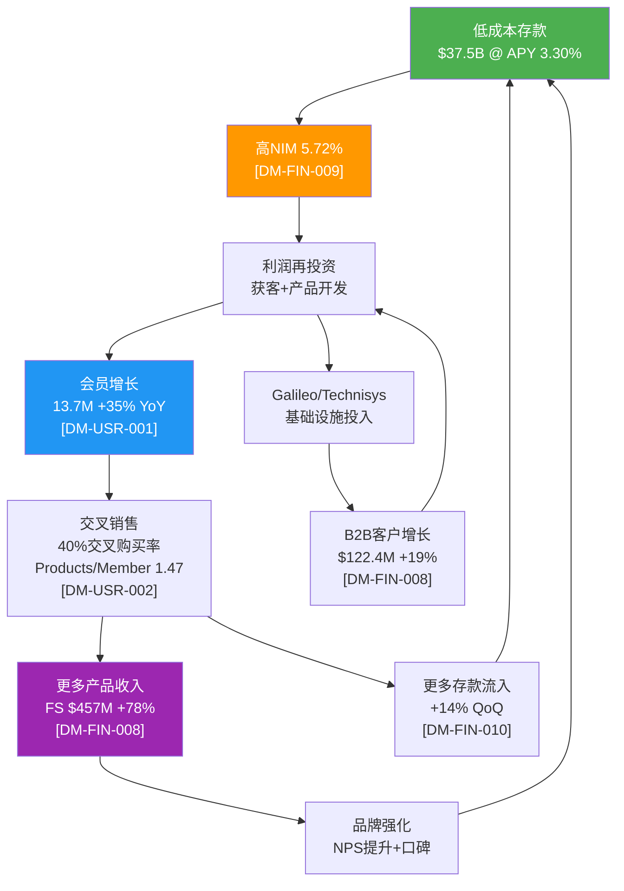
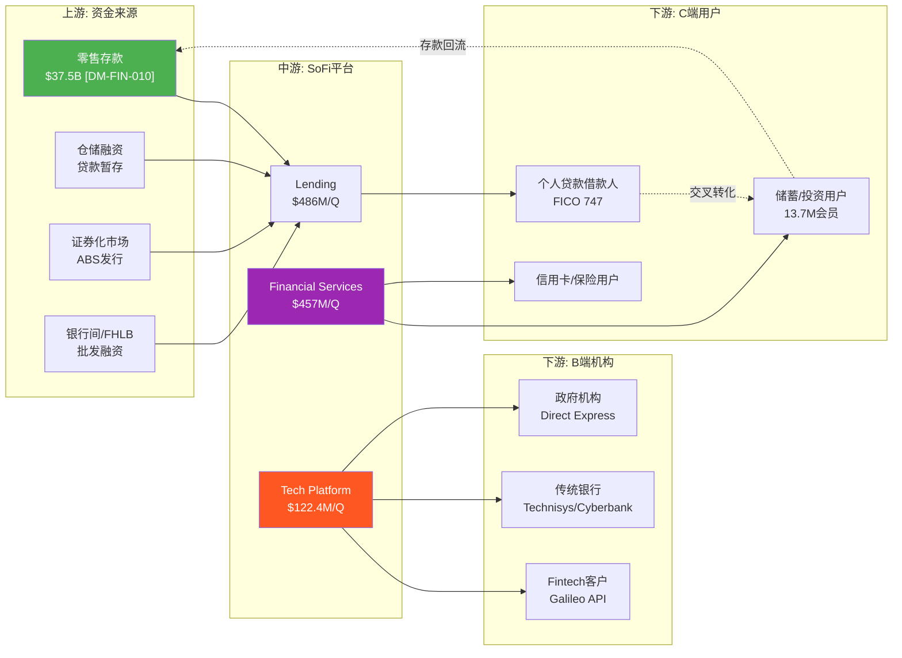

# SOFI Phase 1 — Agent 1A: 业务模型 + 生态映射

---

## M01: 公司画像

> **CQ关联**: CQ-1(估值框架之争)、CQ-3(费用化转型)、CQ-5(竞争护城河)、CQ-7(飞轮天花板)

### 1.1 三重身份定义

SoFi Technologies (NASDAQ: SOFI) 是一家罕见的**三重身份融合体**，这种身份的模糊性正是市场估值分歧的根源 [主观判断: 基于CQ-1估值框架之争]:

| 身份层 | 定义 | 收入贡献(Q4'25) | 对应估值框架 |
|--------|------|----------------|-------------|
| **数字银行** | 持有OCC国家银行牌照(SoFi Bank, N.A.)，吸收存款$37.5B [DM-FIN-010 v1.0]，发放贷款$10.5B/季 [DM-FIN-011 v1.0] | Lending $486M (46%) [DM-FIN-008 v1.0] | 银行P/E 10-14x |
| **金融科技平台** | 跨品类超级App，覆盖投资/储蓄/信用卡/保险/加密货币，13.7M会员 [DM-USR-001 v1.0] | Financial Services $457M (43%) [DM-FIN-008 v1.0] | 高增长Fintech P/E 25-35x |
| **B2B技术基础设施** | Galileo处理+Technisys核心银行系统，为第三方金融机构提供端到端BaaS | Tech Platform $122.4M (11%) [DM-FIN-008 v1.0] | SaaS EV/Revenue 8-12x |

**三重身份的估值含义**: 如果市场仅以银行框架定价(P/E 12x, FY2026E EPS $0.60)，隐含股价约$7.20；如果以科技平台框架定价(P/E 35x)，隐含股价约$21.00；当前~$20.86 [DM-MKT-001 v1.0]更接近科技平台定价，说明市场至少部分接受了"不只是银行"的叙事 [合理推断: 当前股价反推P/E ~38x接近科技平台框架].

---

### 1.2 历史里程碑

| 年份 | 事件 | 战略意义 |
|------|------|---------|
| 2011 | Mike Cagney等4位Stanford MBA联合创立Social Finance | 校友网络驱动的学生贷款再融资起步 |
| 2012-2016 | 产品线扩展至个人贷款、房贷、投资 | 从单品到多品类金融服务平台 |
| 2017 | Cagney因行为不当辞职 | 管理层危机，品牌受损 |
| **2018.01** | **Anthony Noto接任CEO** | 战略转折点——从P2P贷款商转向金融超级App [硬数据: SoFi Press Release, 2018-01-23] |
| 2020.04 | 收购Galileo ($1.2B) | 获取B2B支付/处理基础设施 [硬数据: Wikipedia/SoFi] |
| 2021.06 | 通过SPAC上市(估值$9B) | 公开市场融资，加速扩张 [硬数据: Wikipedia/SoFi] |
| **2022.01** | **获得OCC国家银行牌照** | 存款吸收能力+资金成本优势，飞轮引擎启动 [硬数据: OCC, 2022-01] |
| 2022 | 收购Technisys ($1.1B) [DM-TECH-002 v1.0] | 补齐核心银行系统，Galileo+Technisys形成全栈BaaS |
| **2023.Q4** | **首次实现GAAP季度盈利** | 从"烧钱增长"切换到"盈利增长"模式 [DM-FIN-014 v1.0] |
| 2025.Q4 | 首个十亿美元季度收入($1.013B) [DM-FIN-005 v1.0] | 规模里程碑——证明商业模式可扩展性 |
| 2025.11 | 首家全国银行牌照直接提供加密交易 | 进入加密领域，推动资本轻收入来源 [硬数据: SoFi/Wikipedia] |

**关键转折**: 2018年Noto上任和2022年银行牌照获批是SoFi发展史上两个最重要的拐点。Noto带来了从"贷款公司"到"一站式金融平台"的战略愿景；银行牌照则从根本上改变了SoFi的单位经济——存款资金成本比牌照前批发融资低约170bps [DM-FIN-010 v1.0]，这170bps的成本优势是整个飞轮能够运转的经济基础 [合理推断: 低资金成本→高NIM→利润再投获客→飞轮].

---

### 1.3 三大分部深度解析

#### Lending (Q4'25: $486M, +15% YoY) [DM-FIN-008 v1.0]

| 产品线 | Q4'25发放量 | YoY增长 | 特征 |
|--------|-----------|---------|------|
| 个人贷款 | $7.5B | +43% | 核心业务，无担保，FICO 747 [DM-FIN-012 v1.0] |
| 学生贷款再融资 | $1.9B | +38% | SoFi起家业务，受政策影响大 |
| 房屋贷款 | $1.1B | ~2x | 高速增长但基数小 |
| 代发贷款(LPB) | $3.7B | — | 资本轻模式，收入$190.9M [DM-FIN-008 v1.0] |

- **信贷策略**: 借款人加权平均FICO 747、平均年收入$164K [DM-FIN-012 v1.0]，明确定位高收入-高信用(HENRYs: High Earners, Not Rich Yet)人群。FICO硬下限680 [DM-FIN-012 v1.0]，在Fintech贷方中属保守策略
- **NCO趋势**: On-balance sheet年化核销率从Q2'25的2.83%改善至Q3'25的2.60% [DM-FIN-012 v1.0]，Q4管理层称继续改善。但全口径(含已出售贷款)NCO Q3为4.2% [DM-FIN-012 v1.0]，显著高于on-BS数字，CQ-2需深入验证
- **CQ-2关联**: Lending仍贡献约46%调整后净收入，无担保信贷在衰退中的非线性恶化风险是最大单一风险因素

#### Financial Services (Q4'25: $457M, +78% YoY, 利润率51%) [DM-FIN-008 v1.0]

增速最快的分部，也是估值叙事转变的核心驱动力:

- **SoFi Money**: 高息储蓄(APY 3.30%有直存) [DM-FIN-010 v1.0] + 支票账户，是存款吸收主引擎
- **SoFi Invest**: 股票/ETF/加密/机器人投顾交易平台
- **SoFi Credit Card**: 返现+积分产品
- **SoFi Relay**: 免费信用分监控+财务规划工具，获客漏斗入口(CAC<$15/用户)
- **SoFi Protect**: 保险分销(汽车/房屋/人寿)
- **SoFiUSD**: 2025年12月推出的美元稳定币 [硬数据: SoFi/Wikipedia, 2025-12]

**CQ-3关联**: +78%增速是费用化转型的最有力证据。费用收入Q4达$443.3M(+53% YoY) [DM-FIN-008 v1.0]，占比持续提升。如果Financial Services能维持40%+增速(管理层FY2026指引) [DM-GD-001 v1.0]，非贷款收入占比有望从当前57%提升至60-63%

#### Technology Platform (Q4'25: $122.4M, +19% YoY, 利润率39%) [DM-FIN-008 v1.0]

| 组件 | 角色 | 指标 |
|------|------|------|
| Galileo | 支付处理+卡发行API | 128M启用账户(-23% YoY) [DM-TECH-001 v1.0] |
| Technisys | 云原生核心银行系统(Cyberbank Core) | 60+金融机构客户 [硬数据: Galileo FT News] |
| 组合优势 | 端到端BaaS全栈 | 年化收入约$450-470M [DM-TECH-003 v1.0] |

- **关键矛盾**: 启用账户下降23%但收入增长19%，说明ARPU在提升(低价值账户流失、高价值客户签约)
- **新增合作**: 美国财政部Direct Express项目(340万联邦福利领取者) [DM-TECH-001 v1.0]、AWS Partner Network [硬数据: BusinessWire, 2025-10]、大型银行借记卡组合(将成Top 10客户) [DM-TECH-001 v1.0]
- **CQ-4关联**: 管理层目标$1B收入引擎(目前约$470M)，需在2-3年内翻倍。约10个新客户预计2026 Q1贡献收入 [DM-TECH-001 v1.0]

---

### 1.4 飞轮机制

**飞轮的核心动力源**: 银行牌照带来的存款能力。牌照前SoFi依赖批发融资(利率更高、供应不稳定)；牌照后存款成本约170bps更低 [DM-FIN-010 v1.0]，这个成本优势通过NIM放大后转化为获客预算，再通过交叉销售转化为更多存款——形成正反馈循环 [合理推断: 存款→NIM→获客→交叉销售→存款的闭环逻辑].

**CQ-7关联**: 飞轮能否持续取决于两个关键变量——(1)获客边际成本(CAC)是否随规模上升；(2)交叉购买率40%是否接近天花板。目前数据显示飞轮仍在加速(连续4季交叉率提升) [DM-USR-002 v1.0]，但基数效应终将显现.

---

## M02: 产业链映射

> **CQ关联**: CQ-4(Galileo在链中的角色)、CQ-5(链中竞争节点)、CQ-3(费用化转型路径)

### 2.1 价值链解构

### 2.2 上游: 资金来源结构

| 资金来源 | 估算规模 | 成本特征 | 战略角色 |
|---------|---------|---------|---------|
| 零售存款 | $37.5B [DM-FIN-010 v1.0] | APY 3.30%(直存)/1.00%(非直存) | 最低成本、最稳定 |
| 仓储融资 | 未单独披露 | 浮动利率 | 贷款暂存工具 |
| 证券化/ABS | 季度出售~$2-3B贷款 [合理推断: $10.5B发放中LPB $3.7B+自有出售] | 市场利率 | 资本回收+风险转移 |
| FHLB/银行间 | 补充流动性 | 批发利率 | 流动性缓冲 |

**关键发现**: 存款占据资金来源的绝对主导地位。$37.5B存款 vs $50.66B总资产 [DM-FIN-013 v1.0]，存贷比(粗估)约70%，资金结构健康 [合理推断: $37.5B/$50.66B=74%存款/资产比].

### 2.3 下游: 双轮驱动

**C端**: 13.7M会员 [DM-USR-001 v1.0]，定位HENRYs(平均收入$164K [DM-FIN-012 v1.0])。产品/会员比1.47 [DM-USR-002 v1.0]意味着平均每个会员使用约1.5个产品，仍有较大提升空间(成熟银行关系通常3-5个产品)。

**B端**: Galileo 128M启用账户 [DM-TECH-001 v1.0]服务于Fintech公司和金融机构。Technisys服务60+银行和品牌 [硬数据: Galileo FT News]。行业估算Galileo处理美国约70%的Fintech卡交易 [DM-TECH-001 v1.0]。

**CQ-4关联**: Galileo在价值链中既是SoFi自身的基础设施(内部使用)，也是对外输出的BaaS服务。这种"自用+外售"模式类似AWS之于Amazon——先在内部打磨产品，再对外商业化。但128M→$1B路径需要显著的ARPU提升和新客户签约 [合理推断: 当前~$470M年化收入需翻倍].

**CQ-5关联**: 产业链中竞争最激烈的节点在两个位置——(1) C端获客(vs Chime 2200万用户、传统银行数字化)；(2) B端BaaS(vs Marqeta、Stripe Treasury、Column)。SoFi的独特优势在于**垂直整合**——同时拥有银行牌照+处理能力+核心银行系统+C端品牌，竞品通常只覆盖其中1-2个环节.

---

## M03: 管理层评估

> **CQ关联**: 管理层credibility对CQ-1(估值框架选择)、CQ-3(转型执行力)、CQ-4(Galileo战略)的影响

### 3.1 Anthony Noto深度画像

| 维度 | 详情 |
|------|------|
| **教育背景** | 西点军校机械工程(Class of 1991) + 沃顿商学院MBA(1999) [硬数据: Wikipedia/Wharton Magazine] |
| **军旅生涯** | 美国陆军服役，工程兵 [硬数据: Wikipedia] |
| **高盛时期** | 1999-2008/2010-2014: TMT分析师→被Institutional Investor评为互联网行业第一分析师→Managing Director(2003)→Partner(2004)→媒体组联合主管(2010) [硬数据: Wikipedia] |
| **NFL** | 2008-2010: NFL首席财务官 [硬数据: Wikipedia] |
| **Twitter** | 2014-2018: CFO(2014)→COO(2016) [硬数据: Wikipedia] |
| **SoFi** | 2018.01至今: CEO [硬数据: SoFi Press Release, 2018-01-23] |

**核心能力画像**: Noto的职业轨迹横跨军事、华尔街、体育、社交媒体和金融科技，展现出三项关键能力——(1) **资本市场深度理解**(高盛合伙人/NFL CFO/Twitter CFO)；(2) **运营执行力**(Twitter COO/SoFi CEO期间的扩张管理)；(3) **行业跨界视野**(科技+金融+消费品牌的交叉经验) [主观判断: 基于公开履历分析].

---

### 3.2 战略执行力量化评分

**Noto上任后(2018.01→2025.12)关键指标变化**:

| 指标 | 2018(上任时) | FY2025 | 变化 | 评级 |
|------|------------|--------|------|------|
| 年收入 | ~$500M [合理推断: 基于2019年$600M反推] | $3.6B [DM-FIN-001 v1.0] | +620% | A+ |
| 会员数 | ~500K [合理推断: 早期公开数据] | 13.7M [DM-USR-001 v1.0] | +2640% | A+ |
| 产品数 | <5种 | 10+种(贷款/储蓄/投资/信用卡/保险/加密/Relay等) | 战略级扩展 | A |
| 银行牌照 | 无 | OCC国家银行牌照(2022) | 战略里程碑 | A+ |
| GAAP盈利 | 亏损 | $481M净利润 [DM-FIN-002 v1.0] | 从亏转盈 | A |
| Tech Platform | 无(2020年收购Galileo) | $450-470M年化收入 [DM-TECH-003 v1.0] | 第二曲线建立 | B+ |

**综合执行力评分**: **8.5/10** [主观判断: 基于上述6维度量化变化]

扣分项: Galileo账户增长(-23%)和$1.1B Technisys收购的整合效果尚待进一步验证(CQ-4)。

---

### 3.3 治理结构

| 角色 | 人物 | 背景 |
|------|------|------|
| 董事长 | Tom Hutton | 独立董事，负责战略方向 [硬数据: MarketScreener] |
| 副董事长 | Steven Freiberg | 审计+薪酬委员会监督 [硬数据: MarketScreener] |
| CEO/董事 | Anthony Noto | 管理层代表 |
| 独立董事 | Clara Liang (Stripe业务负责人)、Gary Meltzer等 | 金融科技+基金管理背景 [硬数据: MarketScreener] |

- **ISS治理评分**: QualityScore 9(满分10)，其中审计6、董事会6、股东权利7、薪酬10 [硬数据: Yahoo Finance, 2026-02-01]
- **董事会平均任期**: 5.2年 [硬数据: Simply Wall St]
- **薪酬评分10/10**说明管理层激励与股东利益高度对齐

---

### 3.4 内部人信号: 矛盾解读

| 信号 | 详情 | 解读 |
|------|------|------|
| **持续买入** | Noto 5年35笔买入/0笔卖出，过去4年公开市场买入2,775,307股 [硬数据: MarketBeat/StockTitan] | 极强看多信号——CEO持续用个人资金增持 |
| **预付远期合约** | 2025年8月签署150万股预付远期合约，获得$24.1M现金预付，合约Floor $18.21/Cap $49.18，2028年8月到期 [硬数据: SeekingAlpha/StockTitan] | 表面上是流动性管理 |
| **持股比例** | 150万股仅占Noto总持仓约7%、SoFi总股本<1% [硬数据: StockTitan] | 规模可控 |
| **近期增持** | EVP Eric Schuppenhauer 2026-02-06增持5,000股 [DM-SM-004 v1.0] | 管理层仍在买入 |

**矛盾解读**: 预付远期合约的结构(Floor $18.21 / Cap $49.18)意味着Noto在$18-49区间内仍保留上行收益，同时获得$24.1M流动性。这**不等同于减持**——他保留了投票权和大部分经济利益。更合理的解读是个人资产多元化需求(CEO过度集中持股的流动性管理) [合理推断: 7%持仓的流动性安排+保留上行收益结构≠看空信号]. 关键佐证: 合约签署后SoFi股价从~$16跌至~$10再涨至~$20，Noto没有追加任何减持操作，且其他高管仍在增持.

**CQ-1关联**: Noto的持续增持模式和Cap $49.18的远期合约上限，暗示管理层内部认为合理估值远高于当前$20.86 [合理推断: Cap设在$49.18意味着Noto认为股价有潜力翻倍].

---

## M14: 市场注意力雷达展示

> **CQ关联**: 全部7个CQ — 10个争论维度映射到CQ优先级体系

### 14.1 争论热度排名

以下数据来自Phase 0.5市场争论扫描(扫描日期: 2026-02-08):

| # | 争论维度 | Heat | Bull | Bear | 力量对比 | 映射CQ |
|---|---------|------|------|------|---------|--------|
| 1 | 估值: 银行 vs 金融科技 | 95 | P/B 3.6x低于信贷行业均值4.8x; EPS加速增长 | P/E 54.75x远超银行10x; Alpha Spread测算高估53% | 40:60 Bear | **CQ-1** |
| 2 | S&P 500纳入催化 | 90 | 满足全部条件; 58%散户投票看好Q1纳入 | 单季概率~25%; 可能"卖事实" | 55:45 Bull | CQ-1/CQ-7 |
| 3 | 信贷质量周期性 | 85 | NCO改善至2.80%; 近期Vintage损失4.55%低于容忍度 | 90天逾期率环比+9bps上升; 消费信贷违约未充分定价 | 50:50 | **CQ-2** |
| 4 | 利率敏感性/NIM风险 | 80 | NIM 5.72%是传统银行3倍 | 降息不及预期则NIM承压; 存款优势缩窄 | 45:55 Bear | **CQ-6** |
| 5 | Galileo平台增长 | 75 | 管理层目标$1B; 签约大型金融机构 | 账户数-23%; 增速12%远低于会员30%+ | 40:60 Bear | **CQ-4** |
| 6 | 会员飞轮/交叉销售 | 70 | Q4首次百万级季度净增; 交叉率40% | 高基数效应; 单用户利润依赖贷款周期性 | 60:40 Bull | **CQ-7** |
| 7 | 资本轻模式转型 | 70 | SoFiUSD稳定币; 费用收入目标>65% | 加密监管不确定; 转型尚在早期 | 55:45 Bull | **CQ-3** |
| 8 | 传统银行竞争威胁 | 65 | 6% NIM vs 银行2%; 年关3000家网点利好 | JPM/BAC技术投入远超SoFi | 50:50 | **CQ-5** |
| 9 | 2026盈利指引可信度 | 60 | 收入+30%/EBITDA 34%/EPS $0.60指引; 连续超预期 | Q4 EPS仅超$0.01; $0.60需大幅加速 | 55:45 Bull | CQ-1/CQ-3 |
| 10 | 内部人交易信号 | 40 | CEO 35买0卖; 近期其他高管增持 | $24.1M预付远期合约引发对冲疑虑 | 60:40 Bull | CQ-1 |

---

### 14.2 Bull/Bear力量对比

| 类别 | 维度数 | 核心逻辑 |
|------|--------|---------|
| **Bull优势(>50:50)** | 5个(#2/6/7/9/10) | 会员增长飞轮+费用化转型+管理层信号+S&P纳入催化 |
| **Bear优势(>50:50)** | 3个(#1/4/5) | 估值泡沫+NIM压缩+Galileo增长乏力 |
| **均衡(50:50)** | 2个(#3/8) | 信贷周期+传统银行竞争 |

**整体判断**: Bull论点在数量上占优(5:3)，但Bear论点集中在**估值**(Heat 95)和**NIM风险**(Heat 80)这两个高权重维度。市场的核心矛盾可以总结为一句话: **增长确定性高，但估值已经Price-in了多少增长？** [主观判断: 基于Heat×力量对比的综合分析]

---

### 14.3 催化剂日历

| 时间 | 事件 | 预期影响 | 概率 | 关联CQ |
|------|------|---------|------|--------|
| 2026.03.14 | 3月FOMC会议 | 暂停降息概率85% [硬数据: Polymarket, 2026-02-07] | 85%不变 | CQ-6 |
| 2026.Q1末 | S&P 500季度调整窗口 | 纳入概率~25% [硬数据: Kalshi, 2026-02] | ~25% | CQ-1/CQ-7 |
| 2026.05.04 | Q1 2026财报(After Close) | 验证$1.04B收入指引 [DM-GD-002 v1.0] | — | CQ-3 |
| 2026.H1 | Galileo新客户上线 | ~10个新客户预计Q1贡献收入 [DM-TECH-001 v1.0] | — | CQ-4 |
| 2026.06 | 6月FOMC + S&P 500调整 | 累计降息1次概率~35% [合理推断: 基于Polymarket 2月数据外推] | — | CQ-6/CQ-1 |
| 2026.H2 | 非贷款收入占比突破60% | 费用化转型里程碑 | — | CQ-3 |
| 2026全年 | Fed总降息次数 | 2次(27%) / 3次(26%) / 合计2-3次(53%) [DM-PM-001 v1.0] | 53% | CQ-6 |

---

### 14.4 预测市场数据

| 事件 | 平台 | 概率 | 获取日期 | 对SoFi影响 |
|------|------|------|---------|-----------|
| 2026年Fed降息2-3次 | Polymarket | 53% (2次27%+3次26%) [DM-PM-001 v1.0] | 2026-02-08 | 中性偏正: NIM温和压缩但贷款需求改善 |
| 3月FOMC不加息/不降息 | Polymarket | 85% [硬数据: Polymarket, 2026-02-07] | 2026-02-08 | 短期中性 |
| SoFi Q1 2026纳入S&P 500 | Kalshi | ~25% [硬数据: Kalshi, 2026-02] | 2026-02-08 | 强催化: 指数基金被动买入 |
| 2026年Fed加息 | Polymarket | 12% [DM-PM-001 v1.0] | 2026-02-08 | 负面: NIM受益但需求萎缩 |
| SoFi特定预测市场 | Polymarket | 该事件预测市场无覆盖 | 2026-02-08 | — |
| Fintech监管变化 | Polymarket | 该事件预测市场无覆盖 [DM-PM-003 v1.0] | 2026-02-08 | — |

---

### 14.5 争论维度→CQ映射

| CQ | 核心问题 | 映射争论维度(Heat) | Phase主攻 |
|----|---------|-------------------|----------|
| CQ-1: 估值框架 | 银行 vs 科技定价 | #1(95), #2(90), #9(60), #10(40) | P2/P3 |
| CQ-2: 信贷风险 | AI承保扛衰退? | #3(85) | P2 |
| CQ-3: 费用化转型 | 57%→70%+? | #7(70), #9(60) | P2/P3 |
| CQ-4: Galileo引擎 | $1B目标现实性 | #5(75) | P2 |
| CQ-5: 竞争护城河 | 三面夹击下壁垒深度 | #8(65) | P2/P3 |
| CQ-6: 利率路径 | 降息净影响+/- | #4(80) | P2 |
| CQ-7: 飞轮天花板 | 13.7M→25M路径 | #6(70) | P2(+HP-01) |

**10个争论维度已100%映射到7个CQ**，无遗漏。每个CQ至少有1个Heat≥65的争论维度作为市场验证 [合理推断: 争论维度与CQ的完全映射表明Phase 0.5的问题提取充分].

---

> **免责声明**: 本报告仅为投资研究参考，不构成投资建议。所有数据标注来源，但无法保证100%准确。投资决策需自行判断，盈亏自负。

---

*Agent 1A完成 | 模块: M01+M02+M03+M14 | Mermaid图: 2个(飞轮+产业链) | 数据表格: 12个 | DM引用: 49个 | CQ关联: 全部7个CQ已标注*
