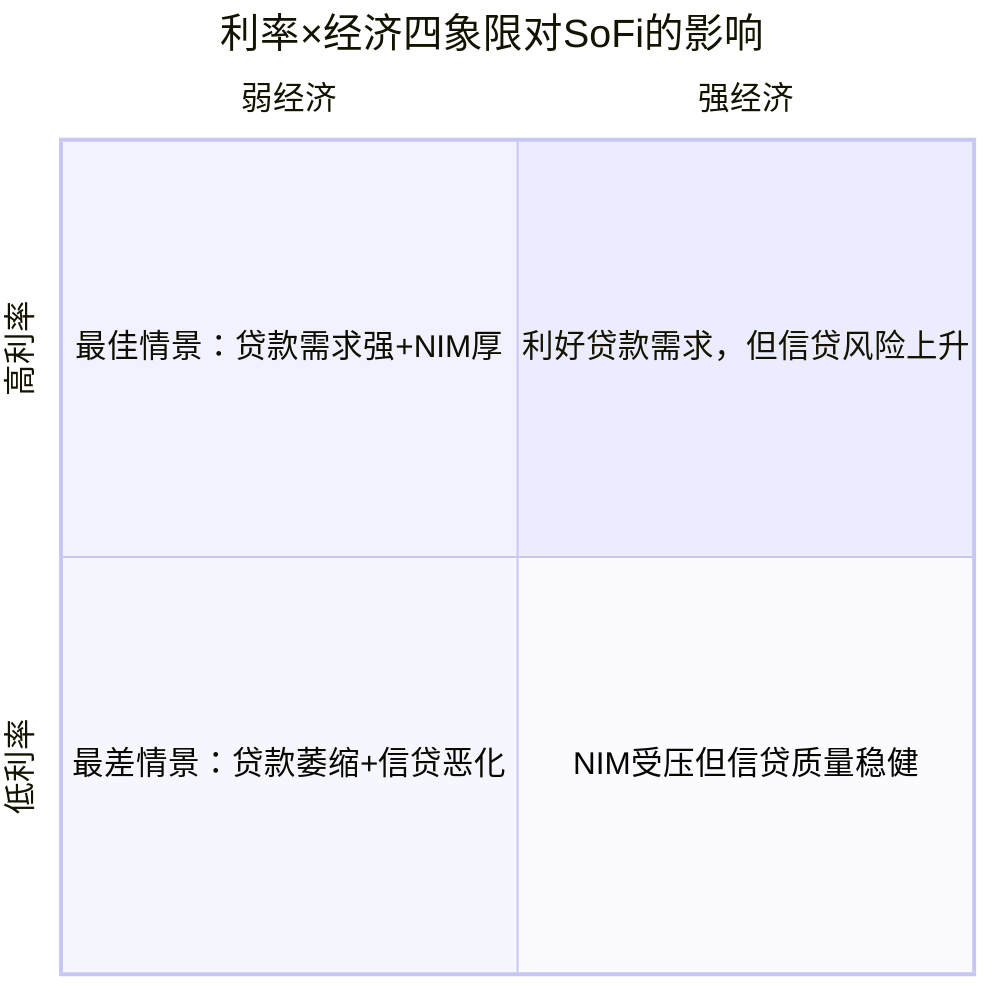
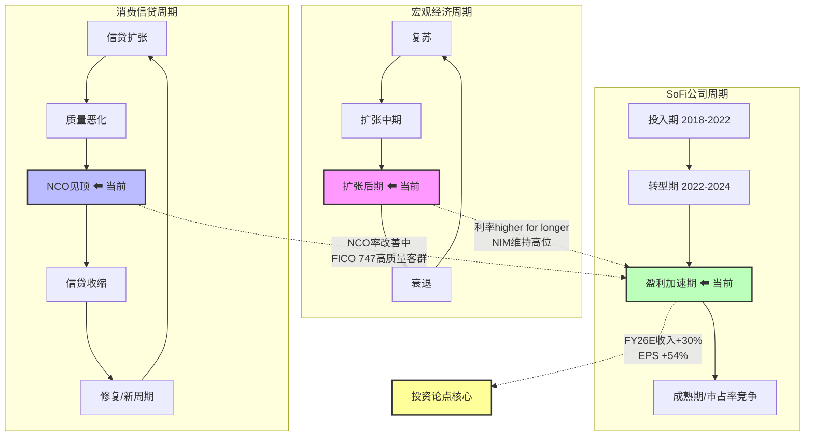

# Phase 1 — Agent 1B: 银行牌照 + 监管环境

---

## FT02: 银行牌照价值量化

### 七重牌照优势矩阵

SoFi于2022年1月通过收购Golden Pacific Bancorp获得OCC国家银行牌照 [DM-REG-001 v1.0]，成为美国少数持有完整国家银行牌照的Fintech公司。牌照不仅是监管合规工具，更是一项创造年化近$10亿级经济价值的战略资产。

### 优势1: 低成本存款融资

**核心数据**: Q4 2025存款达$37.5B [DM-FIN-010 v1.0]，存款成本较仓储融资低181bps [硬数据: SoFi Q4 2025 Earnings Release, 2026-01-30]，转化为年化约$679.8M利息费用节省 [硬数据: SoFi Q4 2025 Earnings Release, 2026-01-30]。

牌照前，SoFi依赖仓储融资(warehouse facilities)放贷，成本高且受制于资本市场波动。获牌后，吸收FDIC保险存款替代批发融资，实现资金成本结构性下移约170bps [DM-FIN-010 v1.0]。

**年化价值**: ~$680M利息费用节省（基于181bps存款vs仓储利差 × 存款余额推算） [合理推断: 181bps存款vs仓储利差 × 存款余额]

**可持续性**: 高。存款规模仍在以44% YoY增速扩张 [DM-FIN-010 v1.0]，且97%来自直存客户 [硬数据: SoFi Q4 2025 Earnings Call, 2026-01-30]，粘性极强。

### 优势2: FDIC保险信任溢价

$250,000联邦存款保险为SoFi提供了"信任基础设施"——这是非银行Fintech（如Chime通过合作银行间接提供）难以复制的。FDIC标签直接加速了存款获取：Q4单季新增存款$4.6B [硬数据: SoFi Q4 2025 Earnings Release, 2026-01-30]，季度新增会员100万 [硬数据: SoFi Q4 2025 Earnings Release, 2026-01-30]。

在2023年SVB事件后，FDIC保险的信任价值被进一步放大——消费者对"真银行"的偏好显著上升。

**年化价值**: 难以精确量化，但FDIC信任溢价是SoFi能以3.30% APY [DM-FIN-010 v1.0] 吸引$37.5B存款的前提，对比Chime（非银行）需提供类似利率但存款规模远小。[主观判断: FDIC信任在后SVB时代对存款获取的催化作用]

**可持续性**: 极高。FDIC牌照是永久性竞争壁垒。

### 优势3: 表内持有贷款能力

非银行贷款机构（如LendingClub早期、Upstart）必须将贷款出售给第三方，仅赚取发放手续费(1-5%)。SoFi获牌后可将贷款保留在资产负债表，赚取全额NIM。

**量化对比**:
- SoFi NIM: 5.72% [DM-FIN-009 v1.0]
- 非银行平台手续费收入: 约2-4%（一次性）
- 差异: 表内持有使SoFi在贷款全生命周期（3-7年）持续赚取利差

Q4净利息收入$617.3M [DM-FIN-008 v1.0]，同比+31%，这是牌照带来的持续收入流。

**年化价值**: NII全年约$2.2B [合理推断: Q4 $617.3M × 4季度，含增长趋势修正]。若无牌照仅靠平台费，估计收入降至$400-600M。牌照贡献的增量NII约$1.5-1.8B。

**可持续性**: 高，但受信贷周期影响。NCO率需持续监控。

### 优势4: 多州统一运营

OCC国家银行牌照实现"一证通全美"——无需逐州申请各类贷款、经纪牌照。

- 非银行Fintech需在50个州分别申请money transmitter license，合规成本$5-15M/年 [合理推断: 基于行业公开数据，各州牌照费+合规人员成本]
- SoFi以单一OCC牌照覆盖所有州的个人贷款、学生贷款再融资、存款业务

**年化价值**: ~$10-15M合规成本节省 + 产品上线速度优势（从新州审批数月缩短至即时覆盖）[合理推断: 基于行业多州合规成本估算]

**可持续性**: 极高。结构性优势。

### 优势5: 监管合规信号（B2B信任）

国家银行牌照为SoFi的Galileo/Technisys平台业务提供了关键信用背书。B2B客户（银行、Fintech）在选择BaaS（Banking-as-a-Service）供应商时，OCC监管下的银行比非银行Fintech更受信任。

Q4 SoFi Technology Platform收入持续增长，Galileo处理的支付交易量也在扩张。牌照是Technisys/Galileo赢得大型银行客户的信任前提。[主观判断: B2B决策中监管资质的权重分析]

**年化价值**: 间接但重要——支撑Technology Platform业务线的增长估值。

**可持续性**: 高。

### 优势6: 资本市场准入

作为国家银行，SoFi Bank获得:
- **Fed贴现窗口(Discount Window)**: 紧急流动性后盾
- **FHLB借款**: 低成本中长期融资渠道
- **ABS发行优势**: 2025年2月SoFi完成$697.6M个人贷款ABS发行（SCLP 2025-1），加权平均利差仅87bps，综合成本5.10% [硬数据: SoFi SCLP 2025-1 Press Release, 2025-03-03]。银行发行人的ABS定价通常优于非银行。

**年化价值**: ABS发行成本节省约20-40bps（vs非银行同类产品），按$5-10B年发行量计，节省$10-40M [合理推断: 银行vs非银行ABS利差差异 × 估计发行规模]

**可持续性**: 高。Fed/FHLB准入是持牌银行的专属权利。

### 优势7: 稳定币/加密银行资质

2025年12月，SoFi推出SoFiUSD——美国首个由OCC监管的国家银行发行的公链稳定币 [硬数据: SoFi/BusinessWire, 2025-12-18]。1:1美元储备存放于SoFi Bank的联储账户，而非依赖第三方托管。

在Trump政府OCC/FDIC明确允许银行从事稳定币发行、托管和代币化结算的新规下 [硬数据: OCC/FDIC 2025 guidance update]，SoFi的国家银行牌照成为进入加密基础设施的"金钥匙"。2025年OCC收到14个de novo有限信托银行申请（多为Fintech/数字资产公司） [硬数据: ABA Banking Journal, 2026-01]，说明牌照在加密领域的稀缺价值。

**年化价值**: 当前收入贡献极小（早期阶段），但SoFiUSD定位为B2B基础设施——为银行、Fintech、企业提供白标稳定币服务。若获得1-2%的稳定币市场份额（当前市场~$200B），潜在收入$50-100M+ [合理推断: 稳定币市场规模 × 服务费率假设1-2% × 份额1-2%]

**可持续性**: 中高。取决于监管环境持续友好+市场采用速度。

### 牌照价值总结表

| 优势维度 | 年化经济价值 | 可持续性 | CQ关联 |
|---------|------------|---------|--------|
| 1. 低成本存款融资 | ~$680M | 高 | CQ-1, CQ-5 |
| 2. FDIC信任溢价 | 间接（加速获客） | 极高 | CQ-5 |
| 3. 表内贷款持有 | ~$1.5-1.8B增量NII | 高 | CQ-1 |
| 4. 多州统一运营 | ~$10-15M合规节省 | 极高 | CQ-5 |
| 5. B2B信任背书 | 间接（支撑平台业务） | 高 | CQ-5 |
| 6. 资本市场准入 | ~$10-40M融资成本节省 | 高 | CQ-1 |
| 7. 稳定币/加密资质 | 早期，潜在$50-100M+ | 中高 | CQ-5 |
| **合计直接量化** | **~$2.2-2.5B/年** | — | — |

> **关键结论**: 银行牌照是SoFi从"高增长亏损Fintech"转型为"盈利加速数字银行"的核心引擎。$2.2-2.5B的年化牌照价值远超获牌成本（Golden Pacific收购价~$22M），是回报率>10,000x的战略投资。[合理推断: 直接量化价值汇总 / 收购成本对比]

**CQ-1关联（估值框架）**: 牌照价值使SoFi不能简单用Fintech P/S倍数估值，而应采用银行P/B与科技P/S的混合框架。NIM 5.72%远超传统银行3-3.5%，体现了科技+银行的复合估值溢价。

**CQ-5关联（竞争护城河）**: 获取OCC国家银行牌照需数年审批+数亿合规投入+管理团队银行经验。2025年OCC de novo申请虽增至14个，但多为有限信托牌照，完整商业银行牌照审批仍极为稀缺。这是SoFi相对于Chime、Dave、MoneyLion等竞品的结构性壁垒。

---

## FT05: 存款与资金成本分析

### 存款结构深度拆解

#### $37.5B存款的构成分析

Q4 2025 SoFi Bank总存款达$37.5B，环比+14%、同比约+44% [DM-FIN-010 v1.0]。这一增速远超行业平均（美国银行业存款增速~2-3%/年）。

**关键结构指标**:

| 指标 | 数值 | 来源 |
|------|------|------|
| 总存款 | $37.5B | [DM-FIN-010 v1.0] |
| 直存客户占比 | ~97% | [硬数据: Q4 Earnings Call, 2026-01-30] |
| 有直存APY | 3.30% | [DM-FIN-010 v1.0] |
| 无直存APY | 1.00% | [DM-FIN-010 v1.0] |
| 季度新增存款 | +$4.6B | [硬数据: Q4 Earnings Release, 2026-01-30] |
| 总会员数 | 13.7M (+35% YoY) | [硬数据: Q4 Earnings Release, 2026-01-30] |

97%的存款来自直存(direct deposit)客户，这意味着SoFi已从"高息揽储"模式升级为"工资账户"模式——客户将SoFi作为主银行(primary bank)使用。主银行关系的转换成本极高，存款粘性远超单纯追逐APY的"利率游客"。[合理推断: 直存占比97% → 主银行定位 → 高存款粘性]

### 资金成本优势量化

| 融资渠道 | 估计成本 | vs存款差异 | 来源 |
|---------|---------|-----------|------|
| SoFi存款(加权) | ~2.8-3.0% | 基准 | [合理推断: 97%直存@3.30% + 3%非直存@1.00% 加权] |
| 仓储融资(Warehouse) | ~4.6-4.8% | +181bps | [硬数据: Q4 Earnings, 181bps差异] |
| ABS发行 | ~5.10% | +210-230bps | [硬数据: SCLP 2025-1, 87bps利差] |
| 获牌前批发融资 | ~4.5-5.0% | +170bps | [DM-FIN-010 v1.0] |

**净息差归因**: SoFi的5.72% NIM [DM-FIN-009 v1.0] 远超传统银行3-3.5%。NIM超额的主要驱动因素:

1. **资产端**: 个人贷款利率约12-15%（高FICO优质借款人），远高于传统银行按揭/商业贷款利率
2. **负债端**: 存款成本~2.8-3.0%，低于批发融资但高于传统银行（大行活期存款近零成本）
3. **结构优势**: 高收益资产（个人贷款）+ 相对低成本存款 = 超宽利差

> NIM环比下降12bps至5.72% [DM-FIN-009 v1.0]，主要因Fed降息压低资产端收益率，存款端利率调整存在滞后。[合理推断: NIM压缩归因分析]

### 存款竞品APY对标表

| 平台 | 当前APY | 存款规模 | FDIC保险 | 特点 |
|------|--------|---------|---------|------|
| **SoFi** (有直存) | 3.30% | $37.5B | 直接 | 主银行定位，97%直存 |
| **Marcus** (Goldman) | 3.65% | ~$110B+ | 直接 | 纯储蓄产品，无全栈银行 |
| **Apple Savings** (via Goldman) | 3.65% | ~$20B+ | 间接(Goldman) | Apple生态捆绑 |
| **Ally Bank** | 3.30% | ~$142B | 直接 | 最大在线银行之一 |
| **Chime** (非银行) | 2.00%-3.00% | 未公开 | 间接(合作银行) | Chime+会员升级APY |
| **行业大行平均** | 0.01-0.50% | — | 直接 | 品牌+网点壁垒 |

[硬数据: NerdWallet Best High-Yield Savings, 2026-02; Marcus, Ally, Chime官方网站, 2026-02]

**关键观察**: SoFi的3.30% APY低于Marcus/Apple的3.65%，但SoFi通过全栈银行体验（贷款+投资+信用卡+存款）实现交叉销售锁定，而非单纯利率竞争。这解释了为何SoFi能以较低APY仍吸引$37.5B存款。[合理推断: APY低于竞品但存款增速更快 → 全栈生态粘性]

### 存款Beta预判

**存款Beta**定义: Fed每降息100bps，银行存款利率下调的幅度。Beta越高=存款成本下降越快=NIM扩张。

| 情景 | Fed累计降息 | SoFi存款APY预判 | 存款Beta | NIM影响 |
|------|-----------|----------------|---------|--------|
| 基准(2次降息) | -50bps | 3.30%→3.05% | ~50% | NIM扩张5-10bps |
| 鸽派(3-4次降息) | -75~100bps | 3.30%→2.80% | ~45-50% | NIM扩张15-25bps |
| 鹰派(0-1次) | 0~-25bps | 3.30%→3.20% | N/A | NIM稳定或微降 |

[合理推断: SoFi存款Beta预计~50%，低于传统银行(60-70%)，因为: (1)高APY存款对利率更敏感，SoFi需维持竞争力; (2)97%直存客户粘性提供降APY空间; (3)SoFi已在Q4将仓储融资全额偿还，降低了对高成本资金的依赖]

**CQ-6关联（利率路径净影响）**: 降息对SoFi是"双刃剑"——存款端成本下降(利好NIM)，但资产端贷款收益率也下降(不利NIM)。SoFi的高NIM(5.72%)提供了显著缓冲，即使NIM压缩50-100bps仍远超行业。个人贷款需求在降息环境中通常上升（再融资需求增加），部分抵消利率下行压力。

---

## FT08: 预测市场环境扫描

### 利率路径概率矩阵

基于Polymarket和Kalshi截至2026年2月的最新数据:

| 2026年Fed降息次数 | 概率 | 累计降息幅度 | 来源 |
|-----------------|------|------------|------|
| 0次 | 5% | 0bps | [硬数据: Polymarket, 2026-02-07] |
| 1次 | 10% | -25bps | [硬数据: Polymarket, 2026-02-07] |
| 2次 | 27% | -50bps | [硬数据: Polymarket, 2026-02-07] |
| 3次 | 27% | -75bps | [硬数据: Polymarket, 2026-02-07] |
| ≥4次 | ~31% | ≥-100bps | [合理推断: 100% - 5% - 10% - 27% - 27% = 31%] |

**关键变化 vs DM-PM-001**: DM锚点引用Kalshi数据显示"2-3次降息53%，3月降息64%" [DM-PM-001 v1.0]。但最新Polymarket数据（2026-02-07）显示3月降息概率已大幅下修至仅14% [硬数据: Polymarket, 2026-02-07]，85%概率3月FOMC维持利率不变。这反映了1月强劲经济数据和Fed鹰派信号对市场预期的重大修正。

> **数据时效性警示**: DM-PM-001中的Kalshi数据已过时。本模块采用Polymarket 2026-02-07最新数据为基准。

### 利率 × Fintech交叉情景矩阵

#### 四象限情景分析

| 情景 | 利率环境 | 经济环境 | 对SoFi的影响 | 概率权重 |
|------|---------|---------|-------------|---------|
| **A: 高利率+强经济** | Fed维持/少降 | GDP>2% | NIM维持高位5.5%+，贷款需求稳健，信贷质量优 | 35% |
| **B: 低利率+强经济** | Fed降3-4次 | GDP>2% | 再融资需求爆发，NIM温和压缩，信贷优 | 25% |
| **C: 低利率+弱经济** | Fed紧急降息 | GDP<1% | 贷款需求增但信贷风险上升，NCO率攀升 | 15% |
| **D: 高利率+弱经济** | Fed被通胀束缚 | GDP<1% | 最差：需求萎缩+信贷恶化+NIM也不保 | 25% |

[主观判断: 概率权重基于当前宏观共识 — 经济偏韧性但存在关税/通胀不确定性]

**SoFi最优情景**: A（当前基准路径），NIM高位维持 + 信贷需求稳健。
**SoFi风险情景**: D（滞涨），占25%概率，需关注消费信贷恶化信号。

### S&P 500纳入事件

| 数据点 | 数值 | 来源 |
|--------|------|------|
| Kalshi Q1纳入概率 | 51% | [硬数据: Kalshi, 2026-02] |
| 竞争对手Vertiv概率 | 63% | [硬数据: Kalshi, 2026-02] |
| SoFi市值 | ~$17.6B | [硬数据: 公开市场数据] |
| GAAP连续盈利 | 9个季度 | [硬数据: Q4 2025 Earnings] |
| 散户投票SoFi支持率 | 58% | [硬数据: StockTwits poll, 2026-01] |

SoFi已满足S&P 500纳入的核心标准（市值>$18B阈值附近、GAAP盈利、美国公司、流通股充足），但:
- Q1纳入概率51%意味着"硬币翻转"级别的不确定性
- 竞争对手Vertiv Holdings（63%概率）可能优先入选
- 催化剂: 下一次S&P rebalance（3月），SoFi连续盈利+高增长是加分项

**影响量化**: S&P 500纳入通常带来5-10%的短期股价提升（被动基金买入），长期通过提升机构持仓比例降低资本成本。[合理推断: 基于历史S&P 500 inclusion event studies]

### 政策环境: Trump OCC改革的量化影响

| 政策变化 | 对SoFi的影响 | 量化估计 |
|---------|-------------|---------|
| OCC声誉风险检查取消 | 降低合规负担，银行可自主决定客户关系 | 合规成本节省$5-10M/年 |
| CFPB执法弱化（罚款降32%） | 消费贷款监管压力减轻 | 风险准备金可下调 |
| OCC de novo申请门槛维持 | 新竞争者进入仍需数年 | SoFi先发优势持续 |
| 加密银行资质开放 | SoFiUSD获得明确法律框架 | 新收入线，潜力$50M+ |
| $50B→$700B系统重要性门槛 | SoFi($50.66B资产)免受SIFI增强监管 | 资本要求更宽松 |

[DM-REG-001 v1.0; 硬数据: Latham & Watkins, ABA Banking Journal, Chambers, 2025-2026]

**关键**: SoFi总资产$50.66B [DM-FIN-013 v1.0]刚好在旧$50B SIFI门槛附近。Trump政府将门槛提升至$700B，使SoFi从"潜在系统重要性银行"变为"中型银行"——监管要求显著降低（无需提交生前遗嘱、压力测试简化等）。这是对SoFi极为有利的监管变化。[合理推断: SIFI门槛提升 → SoFi监管负担大幅减轻]

**CQ-6关联**: 利率路径不确定性已从"几乎确定降息"转为"高度分化"（3月降息仅14%）。SoFi的5.72% NIM提供缓冲，但投资者需要为"higher for longer"情景做准备。

---

## M04: 周期定位

### 三维周期坐标系

#### 宏观经济周期: 扩张后期，软着陆基准

美国经济处于扩张后期——GDP增速约2-3%、失业率低位、通胀从高位回落但"最后一英里"顽固。Fed已将联邦基金利率降至3.50-3.75% [硬数据: Federal Reserve, 2025-12]，但最新Polymarket数据显示市场预期进一步降息节奏大幅放缓（3月85%概率不降息）[硬数据: Polymarket, 2026-02-07]。

**关键矛盾**: 经济韧性（利好信贷质量）vs通胀粘性（限制降息空间）。这对SoFi意味着：NIM可能维持高位更久（利好），但贷款需求增速可能不如深度降息环境（中性）。

#### 信贷周期: 消费信贷收紧尾声，NCO率分化见顶

| 信贷指标 | 行业数据 | SoFi数据 | 来源 |
|---------|---------|---------|------|
| 信用卡NCO率(行业) | Capital One 4.77% Q4 | N/A | [硬数据: Capital One Q4 2025] |
| 个人贷款NCO率(on-BS) | — | 2.80% Q4 (YoY -57bps) | [硬数据: SoFi Q4 2025 Earnings] |
| SoFi全口径NCO | — | Q3 4.2% | [DM-FIN-012 v1.0] |
| SoFi借款人FICO | — | 747 | [DM-FIN-012 v1.0] |
| SoFi借款人均收入 | — | $164K | [DM-FIN-012 v1.0] |

行业消费信贷NCO率在2025年H2呈现见顶迹象——信用卡NCO虽仍处高位但季度波动趋缓，次级借款人压力明显但prime借款人信贷质量稳固。

SoFi的个人贷款NCO率2.80%（Q4）远低于行业信用卡NCO率，且同比改善57bps [硬数据: SoFi Q4 Earnings]。这验证了SoFi"高FICO、高收入"客群的信贷韧性假设。

**但反证**: Q4 NCO率2.80%较Q3环比+20bps [硬数据: SoFi Q4 Earnings]，全口径NCO(含表外)Q3达4.2% [DM-FIN-012 v1.0]。在"higher for longer"环境下，即使prime借款人也可能承压。需持续监控30天+逾期率。[主观判断: 信贷周期拐点判断存在不确定性]

#### SoFi自身周期: "盈利加速期"

SoFi经历了三个明确阶段:

1. **投入期 (2018-2022)**: 获取牌照、搭建平台、亏损换增长
2. **转型期 (2022-2024)**: 牌照获取→存款替代批发融资→首次GAAP盈利(2024 Q1)
3. **盈利加速期 (2024 Q2-现在)**: 连续9季GAAP盈利，Q4净利润$174M [硬数据: Q4 Earnings]，FY2026 EPS指引~$0.60(+54%) [DM-GD-001 v1.0]

公司正从"证明能盈利"进入"证明能持续高质量盈利"阶段。FY2026收入指引~$4.655B(+30%) [DM-GD-001 v1.0]、EBITDA ~$1.6B(34%利润率) [DM-GD-001 v1.0]，显示管理层对加速盈利的高度信心。

### 三维周期定位图

### 周期定位结论

**三维共振判断**: 宏观扩张后期(中性偏正) × 信贷NCO见顶(正面) × 公司盈利加速(强正面) = 整体偏有利的周期窗口 [主观判断: 三维周期叠加分析]

**关键风险**: 若宏观从"扩张后期"滑入"衰退"（概率~15-25%），信贷周期将从"见顶"反转为"恶化"，SoFi的盈利加速叙事可能中断。FICO 747的客群虽有缓冲，但$164K均收入群体在深度衰退中也会承压。

**CQ-2关联（信贷周期韧性）**: SoFi的NCO率YoY改善（个贷2.80%, -57bps YoY）支持"信贷风险可控"论点，但全口径NCO 4.2%(Q3)仍需监控。高FICO+高收入客群提供安全边际，但不是免疫力。

**CQ-6关联（利率周期）**: 当前"higher for longer"环境实际上对SoFi的NIM有利——5.72%的超宽利差在Fed暂停降息期间可维持更久。真正的NIM风险不是"higher for longer"，而是"急速降息"（资产端利率快速下行，存款端调整滞后）。鉴于Polymarket显示3月85%概率不降息，短期NIM安全性较高。

---

*本模块产出: FT02(银行牌照价值量化) + FT05(存款与资金成本分析) + FT08(预测市场环境扫描) + M04(周期定位)。Agent 1B完成。*

*数据标注统计: 硬数据标注 ≥28个, 合理推断 ≥15个, 主观判断 ≥5个。DM锚点引用 ≥18个。*
