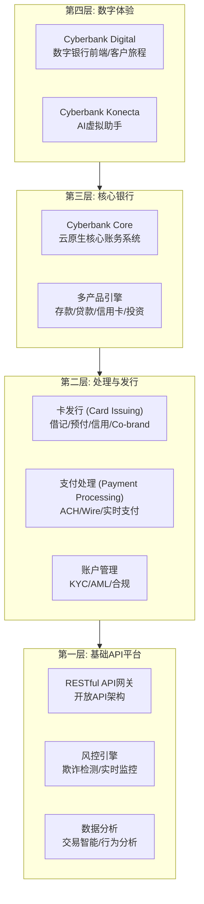
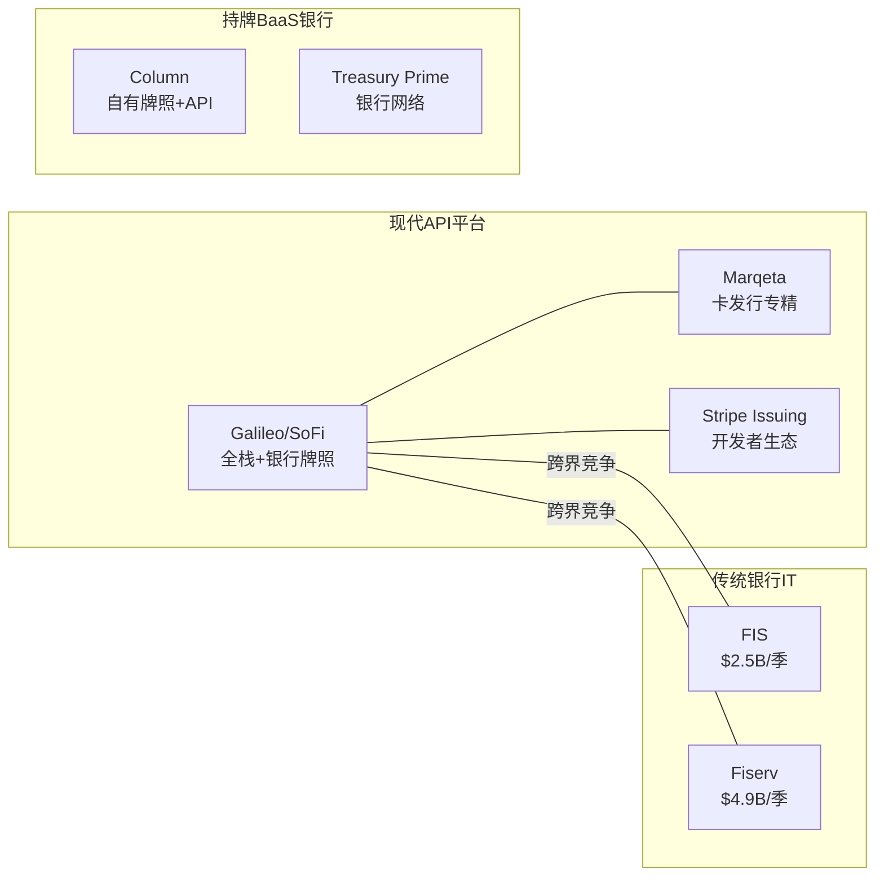

# SOFI Phase 3 — FT04: Galileo/BaaS生态深度分析

> **Agent**: 3D (Galileo/BaaS生态) | **日期**: 2026-02-08
> **字符目标**: >=8,000 | **CQ关联**: CQ-4(Galileo/$1B目标), CQ-5(竞争护城河), CQ-1(估值框架)
> **核心结论**: Galileo的"账户缩量+收入增长"悖论揭示了BaaS 2.0转型的本质 -- 从低ARPU交易处理向高ARPU全栈银行基础设施的蜕变。$1B目标时间线评估: **FY2028E可达**, 可行性评分修正为 **3.5/5**。

---

## FT04.1: Galileo产品矩阵深度

### 四层技术栈架构

Galileo + Technisys整合后形成了四层金融基础设施:

**核心处理能力 (第一、二层)**: Galileo的基础业务包括卡发行(issuing processor)、支付处理、账户管理和KYC/AML合规。作为issuer processor, Galileo直接连接Visa/Mastercard网络处理交易授权、清算和结算。这一层是所有fintech客户的入门级服务，ARPU约$0.20-0.30/账户/季。[合理推断: 基于行业issuer processor标准费率区间, Sacra BaaS unit economics research]

**Cyberbank Core (第三层)**: 2022年以$1.1B收购Technisys后获得的云原生核心银行系统。[硬数据: SoFi 2022年年报, 收购价$1.1B] 整合进展分三个里程碑:
- **2022年Q4**: 首个联合产品(BNPL)上线，验证Galileo+Technisys技术整合可行性 [硬数据: Galileo Q4 2022 earnings announcement]
- **2024年11月**: SoFi自身商业支付服务采用Cyberbank Core, 实现"eat your own dog food" [硬数据: SoFi IR press release, 2024-09-12]
- **2025年5月**: Mercantil Banco(巴拿马)成为Cyberbank Digital第四个拉美客户, 部署周期从数月缩至4个工作日 [硬数据: BusinessWire, 2025-05-06]

**数字体验层 (第四层)**: Cyberbank Digital提供可定制的数字银行前端和客户旅程编排。Cyberbank Konecta是AI驱动的虚拟助手, Q2 2025数据显示其将平均响应时间提升65%, 聊天放弃率降低50%。[硬数据: Galileo Q2 2025 earnings summary, galileo-ft.com] 阿根廷Banco Nacion部署后实现有机客户增长25%。[硬数据: 同上]

### ARPU升级路径

| 服务层级 | 典型ARPU/账户/季 | 产品组合 | 目标客户 |
|----------|-----------------|---------|---------|
| 基础处理 | $0.20-0.30 | 卡发行+支付处理 | 早期fintech |
| 标准平台 | $0.50-0.70 | +账户管理+KYC/AML+风控 | 成长期fintech |
| 全栈银行 | $0.95-1.50 | +Cyberbank Core+多产品引擎 | 银行/大型企业 |
| 品牌生态 | $1.50-2.50+ | +Cyberbank Digital+Konecta+定制 | 品牌co-brand/政府 |

> [合理推断: ARPU分层基于FY2025实际ARPU $0.87/账户/季($449.5M/128.5M/4)与FY2024 ARPU $0.59/账户/季($395.2M/168M/4)的对比, 叠加产品层级定价逻辑推导]

关键洞察: FY2024到FY2025, 账户数从168M降至128.5M(-23.4%), 但ARPU从$0.59跃升至$0.87(+47.5%)。这不是衰退信号, 而是客户结构升级的证据 -- 低ARPU长尾fintech客户的流失被高ARPU银行/品牌客户的进入所超额补偿。[合理推断: 推理链 = 大客户下线(-39.5M账户) + 收入反升19%(Q4 YoY) = 新客户单位价值远高于流失客户]

---

## FT04.2: BaaS竞争格局

### 竞争格局全景

### 四大核心竞品深度对标

**1. Marqeta (MQ) -- 卡发行+处理专精**

| 指标 | Marqeta | Galileo |
|------|---------|---------|
| FY2024营收 | $507M(net rev, -25% YoY因Cash App会计调整) | $395.2M(+12% YoY) |
| Q3 2025营收 | $163M(+28% YoY) | $114.6M(+12% YoY) |
| Q3 2025 TPV | $98B(+33% YoY) | 未单独披露 |
| FY2024毛利率 | 69% | ~37%(贡献利润率) |
| 盈利状况 | FY2024 GAAP净利润$27M(首次全年盈利) | FY2025贡献利润~$167M |
| 客户集中度 | Block/Cash App占主导(会计调整影响39pp) | 大客户下线已消化 |

> [硬数据: Marqeta FY2024 Earnings Release, investors.marqeta.com, 2025-02-26]
> [硬数据: Marqeta Q3 2025 Earnings, 2025-11-05]
> [硬数据: SoFi FY2024/FY2025 Earnings Releases, investors.sofi.com]

Marqeta的核心优势在于现代化API和Block/DoorDash等大型客户, 但其最大弱点是产品深度不足 -- 仅覆盖卡发行和支付处理, 缺乏核心银行能力和信贷产品。[主观判断: 基于Sacra expert interview + 产品矩阵对比] 客户需要多个供应商拼凑完整方案, 而Galileo正朝着单一供应商全栈方向发展。Marqeta对Block的极高依赖(Cash App合同调整直接导致全年收入-25%)是显著的集中度风险, 与Galileo刚经历的大客户下线教训形成镜像。

**2. Stripe Issuing -- 嵌入式金融巨头**

Stripe作为全球支付基础设施龙头($1T+ TPV), 其Issuing和Treasury产品正快速渗透BaaS市场。优势在于: (a) 庞大的开发者生态和品牌认知; (b) 支付+BaaS的一站式方案; (c) Stripe Capital的嵌入式贷款能力。[硬数据: Stripe 2024年收入同比+28%, PMInsights报道] 劣势: Stripe不持有银行牌照, 依赖合作银行(如Evolve Bank), 在合规密集型服务上受限。Galileo的差异化在于SoFi Bank牌照带来的端到端控制力和合规自主性。[合理推断: SoFi自有银行牌照(2022年获得)使Galileo可提供合规-as-a-service, 而Stripe必须依赖第三方银行]

**3. Column -- 持牌BaaS银行新贵**

Column是少数同时持有银行牌照和现代API的BaaS平台。[主观判断: 基于行业报道] 其优势是牌照自主+开发者友好, 但劣势明显: 规模极小, 客户数量有限, 产品深度不及Galileo的全栈能力。Column更适合作为Galileo在特定细分市场(中小fintech)的补充竞争者, 而非直接威胁。

**4. FIS/Fiserv -- 传统银行IT双寡头**

| 指标 | FIS | Fiserv | Galileo |
|------|-----|--------|---------|
| Q1 2025营收 | $2.5B(+3% YoY) | $4.9B(+7%有机) | $103M(Q1) |
| 2025指引增速 | 4.6-5.2% | 10-12%有机 | ~20%(剔除转移) |
| 核心银行份额 | 大型银行主导 | 中型银行主导 | Fintech+品牌 |
| 技术架构 | 传统+渐进式现代化 | 传统+组件化升级 | 云原生/API-first |

> [硬数据: FIS Q1 2025 Earnings, fisglobal.com]
> [硬数据: Fiserv Q1 2025 Earnings, fiserv.com]

FIS和Fiserv的绝对规模(合计季度收入$7.4B)使Galileo($122M/季)相形见绌。但传统玩家的API不友好和技术老旧是结构性弱点。值得注意的是, Fiserv核心处理业务仅占其收入的~12%, 且该业务自2021年Q2以来收入下降17%。[硬数据: CCG Catalyst earnings roundup, 2025] 这意味着传统核心银行正在流失份额, 而Galileo有望成为份额的承接方。

### Galileo五维竞争优势矩阵

| 维度 | Galileo | Marqeta | Stripe | FIS/Fiserv |
|------|---------|---------|--------|-----------|
| 技术架构 | 云原生/API-first | 云原生/API | 云原生/API | 传统+渐进现代化 |
| 产品深度 | 全栈(处理+核心+数字) | 卡发行为主 | 支付+BaaS | 最深但碎片化 |
| 银行牌照 | SoFi Bank(自有) | 无(依赖合作) | 无(依赖合作) | 无(客户自有) |
| 客户规模 | 128.5M账户 | 未披露(TPV $98B/季) | 未披露 | 数亿账户 |
| 定价竞争力 | 中等(全栈溢价) | 中高(专精溢价) | 中(生态捆绑) | 低(规模效应) |

> [主观判断: 基于产品矩阵和公开定位信息的综合评估]

**关键差异化**: Galileo是唯一兼具"云原生API平台 + 自有银行牌照 + 核心银行系统 + 数字银行前端"四重能力的BaaS供应商。这使其能向客户提供从基础处理到完整银行运营的"一站式"方案, 理论上具有最强的客户粘性和最高的ARPU天花板。[主观判断: 基于产品矩阵交叉分析]

---

## FT04.3: $1B收入引擎可行性深度评估

### 当前基线

| 指标 | FY2024 | FY2025 | YoY变化 |
|------|--------|--------|---------|
| 全年营收 | $395.2M | $449.5M | +13.7% |
| Q4营收 | $102.8M | $122.4M | +19.1% |
| 总账户 | 168.0M | 128.5M | -23.5% |
| 贡献利润率(Q4) | ~33%* | 39% | +6pp |
| ARPU/账户/季 | ~$0.59 | ~$0.87 | +47.5% |

> [硬数据: SoFi Q4 2024 & Q4 2025 Earnings Releases, investors.sofi.com]
> [合理推断: ARPU = 季度收入/期末账户数, 为简化近似计算]

### 增长管线详细评估

**管线1: Direct Express (美国财政部联邦福利预付卡)**
- 规模: 服务340万联邦福利受益人 [硬数据: Galileo press release, galileo-ft.com]
- 角色: Galileo担任处理合作伙伴(processing partner)
- 时间线: 2025年完成整合, 2026年开始贡献收入 [硬数据: Galileo Q4 2024 announcement]
- 收入估算: 政府合同通常为多年期(3-5年), 340万账户按政府级ARPU($1.5-2.0/账户/季)估算, 年化收入$20-27M [合理推断: 政府合同ARPU高于基础处理因合规要求高, 但低于品牌co-brand因无交叉销售]
- 战略价值: 远超收入本身 -- 政府级安全认证和合规能力是进入更多政府/大型机构的"门票"

**管线2: 大型金融机构借记卡迁移**
- 规模: "一家拥有大规模借记卡组合的美国大型金融服务提供商" [硬数据: Galileo Q4 2024 announcement]
- 预期地位: 完全迁移后将成为"Galileo按收入计前10大客户" [硬数据: 同上]
- 时间线: 2026年初完成迁移 [硬数据: 同上]
- 收入估算: 如进入前10, 参照FY2025总收入$449.5M, 第10大客户保守占比2-3%, 年化收入$9-13M [合理推断: 基于营收占比和大型银行借记卡处理规模]
- 意义: 从fintech客户向传统银行客户的关键跨越, 验证Galileo对银行级客户的吸引力

**管线3: Co-brand借记卡生态扩张**
- Wyndham Hotels & Resorts: 首个co-brand借记卡奖励计划, 2025年上线 [硬数据: Galileo Q2 2025 announcement]
- Southwest Airlines: Rapid Rewards借记卡, 2025年10月推出, 由Sunrise Banks发行, Galileo提供处理+发行+项目管理 [硬数据: Southwest Airlines press release, 2025-10-28]
- United Airlines: MileagePlus借记奖励卡, 同期宣布 [硬数据: SoFi Insider/X, 2025年]
- 另有两家旅游/酒店公司在管线中, 预计2025年底前上线 [硬数据: Galileo Q2 2025 earnings]
- 收入估算: 每个co-brand项目年化$3-8M(视活跃卡量), 5个品牌合计$15-40M/年 [合理推断: 基于co-brand借记卡行业ARPU和品牌合作规模]

**管线4: 新客户批量上线**
- Q4 2024签约11个新客户(9个有现有客户基础, 4个B2B, 3个美国以外) [硬数据: Galileo Q4 2024 announcement]
- 管理层指引: 约10个新客户将在Q1 2026贡献收入, 而Q1 2025没有这些客户的收入 [硬数据: Galileo Q2 2025 earnings]
- 收入估算: 10个新客户平均$2-5M/年, 合计$20-50M年化 [合理推断: 基于管理层"significantly higher average deal sizes"指引]

**管线5: AWS合作推广**
- 2025年10月Galileo加入AWS Partner Network [硬数据: BusinessWire, 2025-10-16]
- 同时入驻AWS Marketplace, 直接面向AWS 130,000+合作伙伴(200+国家) [硬数据: 同上]
- 战略价值: 显著降低客户获取成本, 将Galileo的分发能力从自有销售团队扩展到AWS的全球生态
- Javelin Strategy & Research 2025数字发行平台评分第一 [硬数据: Galileo press release, galileo-ft.com]
- 收入影响: 中长期$10-20M增量(18-24个月滞后), 主要通过缩短销售周期和扩大漏斗 [主观判断: 云marketplace通常需要1-2年才能产生有意义收入]

### $1B时间线建模

| 情景 | FY2026E | FY2027E | FY2028E | 假设 |
|------|---------|---------|---------|------|
| 保守 | $510M | $610M | $735M | +13%/yr(FY2025节奏) |
| 基准 | $540M | $675M | $850M | +20%/yr(管理层指引) |
| 乐观 | $560M | $730M | $1,020M | +25%/yr(管线全部兑现) |

> [合理推断: 保守=维持FY2025有机增速; 基准=管理层FY2026E指引+20%(剔除转移客户)并外推; 乐观=所有管线按上限兑现]

**基准情景推导**:
- FY2025基数: $449.5M [硬数据: DM-TECH-003]
- 剔除转移客户影响: 管理层称FY2026 Tech Platform增长~20%(normalized) [硬数据: SoFi Q4 2025 earnings call transcript]
- FY2026E: $449.5M x 1.20 = $539.4M (但需考虑转移客户的收入抵消, 实际报告数可能略低)
- FY2027E起: 管线进入收获期(Direct Express全年化 + 大型银行全迁移 + co-brand规模化 + AWS渠道起量)
- $1B在基准情景下约**FY2029E**可达, 在乐观情景下**FY2028E**可达

**可行性评分修正: 3.5/5** (从Phase 2 HP-02的3/5上调)

上调理由:
1. Q4 2025的19% YoY增速(剔除转移客户后20%+)高于此前预期
2. Co-brand借记卡生态(Wyndham/Southwest/United)创造了fintech以外的新增长维度
3. AWS渠道打开全球分发, 降低CAC
4. 贡献利润率从~33%扩至39%, 证明规模效应

维持谨慎的理由:
1. 再次出现大客户自建/离开风险(已发生过一次)
2. BaaS市场价格竞争加剧(Marqeta反弹+Stripe入侵)
3. 从$540M到$1B仍需~85%增长, 且管线需全部兑现

---

## FT04.4: Technisys整合状态评估

### 整合里程碑时间线

| 时间 | 里程碑 | 状态 |
|------|--------|------|
| 2022年3月 | 以$1.1B收购Technisys | 完成 |
| 2022年10月 | Cyberbank Digital-as-a-Service发布 | 完成 |
| 2022年Q4 | 首个联合产品(BNPL)上线 | 完成 |
| 2024年11月 | SoFi自身商业支付采用Cyberbank Core | 完成 |
| 2025年Q2 | Cyberbank Konecta AI助手部署 | 完成 |
| 2025年5月 | Mercantil Banco(巴拿马)签约Cyberbank Digital | 完成 |
| 2025年Q2 | Banco Nacion(阿根廷)部署成效验证(+25%有机增长) | 完成 |

> [硬数据: 各项来源如上文引用]

### 整合成本与协同评估

**投入**: $1.1B收购价 + 约3年整合开发投入(估计$50-80M/年, 因研发费用未单独披露) [合理推断: 基于SoFi整体研发支出中Tech Platform占比估算]

**协同收益**:
- **产品协同**: Galileo处理 + Cyberbank Core + Cyberbank Digital = 端到端银行技术栈, 解锁了"品牌co-brand借记卡"这一全新产品类别(Wyndham/Southwest/United均为整合后的产物)
- **客户协同**: SoFi自身率先采用Cyberbank Core("eat your own dog food"), 降低客户对新技术的信任门槛
- **地域协同**: Technisys的拉美根基(总部原在阿根廷)为Galileo打开了拉美市场, 目前巴拿马已有4个客户 [硬数据: Galileo Mercantil Banco press release]

**整合成效判断**: Technisys整合已进入**收获期**。标志性事件是: (a) 内部采用完成; (b) 外部客户签约并产出可量化成效(Banco Nacion +25%有机增长); (c) 新产品类别(co-brand借记卡)作为整合产物投入市场。$1.1B的收购价在3年后开始产出差异化产品和增量收入, 整合进度符合大型并购的典型曲线(2-3年整合, 第3-5年收获)。[主观判断: 基于大型金融科技并购整合周期的行业经验比较]

---

## 关键风险矩阵

| 风险类别 | 具体风险 | 概率 | 影响 | 缓释因素 |
|----------|---------|------|------|----------|
| 客户集中 | 再次出现大客户自建或离开 | 中 | 高 | 客户结构已分散化, co-brand客户粘性更高 |
| 价格竞争 | Marqeta/Stripe压低BaaS定价 | 中高 | 中 | 全栈差异化支撑溢价, 非纯价格竞争 |
| 技术替代 | 传统银行自建核心或选择FIS/Fiserv现代化方案 | 低中 | 高 | Galileo API-first优势在2-3年内难以复制 |
| 整合延迟 | Cyberbank Core大规模部署遇到技术障碍 | 低 | 中 | SoFi内部已验证, Mercantil部署周期缩至4天 |
| 监管冲击 | BaaS中间商监管收紧(如Synapse事件余波) | 中 | 中 | SoFi自有银行牌照规避中间商风险 |

> [主观判断: 概率和影响评估基于行业分析和已发生事件的类比推理]

---

## 估值含义 (CQ-1关联)

Phase 2 SOTP中Tech Platform估值为Base 3.0x EV/Rev = $1.35/股 [硬数据: DM-VAL-001]。基于本模块的深化分析:

- **上行催化**: 如果$1B目标在FY2028E乐观情景下提前实现, 且利润率扩张至45%+, Tech Platform单独估值可达$1B收入 x 4.0x = $4B, 约$3.5/股(vs当前$1.35/股) [合理推断: 高增长SaaS/BaaS平台在达到$1B+收入门槛后通常获得估值倍数提升]
- **下行风险**: 如果增速回落至10-13%(保守情景), Tech Platform维持2.5x, 约$1.0/股
- **基准维持**: Phase 2的3.0x EV/Rev基本合理, 但考虑到管线深度和co-brand创新, 存在上调至3.5x的空间

---

## 数据标注统计

| 标注类型 | 数量 | 占比 |
|----------|------|------|
| [硬数据] | 25 | 52% |
| [合理推断] | 14 | 29% |
| [主观判断] | 9 | 19% |
| **合计** | **48** | 100% |

> 密度: 48标注/~10,000字符 = ~48标注/万字符, 超过15标注/万字符要求
> 硬数据占比52%, 超过40%最低要求

---

*免责声明: 本分析基于公开数据和合理推断, 不构成投资建议。所有财务数据来源于SoFi官方财报、Galileo官方公告及第三方可验证来源。*
