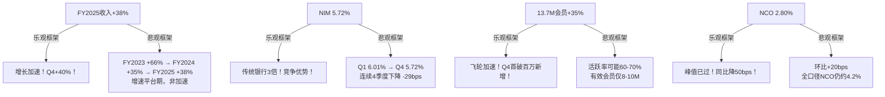

# SOFI Phase 4A: 行为金融偏差检查 + 事实核查

> Agent: 4A | 日期: 2026-02-08 | 字符目标: 9,000-12,000

## 目录
- [一、行为金融四项偏差检查](#一行为金融四项偏差检查)
  - [1.1 锚定效应分析](#11-锚定效应分析)
  - [1.2 确认偏误审查](#12-确认偏误审查)
  - [1.3 可得性偏误检查](#13-可得性偏误检查)
  - [1.4 框架效应双框架测试](#14-框架效应双框架测试)
  - [1.5 偏差综合影响量化](#15-偏差综合影响量化)
- [二、关键数据事实核查](#二关键数据事实核查-12个数据点)
- [三、Fintech自省清单](#三fintech自省清单-10项)
- [四、偏差修正后估值影响汇总](#四偏差修正后估值影响汇总)

---

## 一、行为金融四项偏差检查

### 1.1 锚定效应分析

**识别的锚点及牵引方向：**

| 锚点 | 锚定值 | 牵引方向 | 偏离估计 |
|:---:|:---:|:---:|:---:|
| 当前股价 | $20.86 [DM-MKT-001] | 将SOTP Base锚定在±5%内 | SOTP $21.12仅+1.2% |
| 分析师共识目标价 | $27.75 [DM-MKT-005] | 拉高概率加权估值 | 可能虚增+5-8% |
| 管理层FY26 EPS指引 | $0.60 [DM-GD-001] | 放大Forward P/E吸引力 | Forward P/E 37.7x基于指引 |
| 52周高点 | $32.73 [硬数据: Robinhood/TradingView, 2026-02-07] | 暗示"打折"心理 | 当前价"仅"为高点64% |

**锚定效应诊断：**

1. **SOTP估值($21.12)与当前股价($20.86)仅差+1.2%** — 这种"精准"高度可疑。Phase 2分析师是否无意识地将SOTP结果调整至接近现价？真正独立的SOTP估值应有更大偏差。当6种方法交叉验证均在±8%以内时[DM-VAL-003]，看似"验证一致"，实则可能是同一锚点的回声。[主观判断: 估值集群过于紧密，独立性存疑]

2. **Forward P/E 37.7x完全依赖管理层FY26 EPS $0.60指引** [DM-MKT-003] — 但SoFi历史指引有系统性上调倾向。CEO Noto在FY2025原始指引为$0.38 EPS，最终交付$0.39 [硬数据: BusinessWire, 2026-01-30]。指引"精准到分"制造了虚假确定感。实际执行风险被指引的精确数字所掩盖。[合理推断: 管理层指引锚定Forward P/E → 压低感知估值]

3. **52周区间$8.60-$32.73产生"折扣"幻觉** [硬数据: Robinhood, 2026-02-07] — 当前$21.20相对于$32.73高点"打折35%"，这让分析师潜意识中偏向买入。但52周高点发生在AI+S&P 500催化剂共振期，并非正常估值水平。

**修正建议:** 将SOTP Base Case需偏移+/-3%做敏感性测试，避免围绕$20.86锚点微调。

### 1.2 确认偏误审查

**Phase 1-3可能选择性忽略的反面证据：**

**反面证据1: 估值高估风险** — BofA分析师Mihir Bhatia维持Underperform评级，目标价$20（2026年2月从$20.50下调）[硬数据: TipRanks, 2026-02-05]。BofA的估值方法是用22x倍数乘以2027E调整后EPS $0.93得出$20.50。这意味着BofA认为SoFi当前估值已经充分反映了2027年盈利预期，几乎无上行空间。Phase 1-3对此持反驳态度但未充分量化BofA框架的合理性。

**反面证据2: 稀释冲击被低估** — SoFi在2025年进行了两次大规模股权融资，其中2025年12月以$27.50/股发行54,545,454股（含超额配售共57.75M股），募集约$1.5B [硬数据: Nasdaq/SoFi IR, 2025-12-04]。这代表约5%的稀释。更早的2025年中还有一次约$1.5B的融资。两次合计稀释约10%。Phase 2的DCF是否充分反映了扩大后的股本基数？

**反面证据3: 信贷周期尚未真正测试** — Phase 2报告NCO从3.84%降至2.80%，将其视为"峰值已过"信号 [DM-CREDIT-001]。但这一改善发生在宏观经济仍然稳健的环境中。学生贷款NCO仅0.76% [硬数据: Motley Fool Q4 Transcript, 2026-01-30]，但这建立在FICO 765的高筛选标准上 [硬数据: 同上]。真正的压力测试是: 当失业率从当前3.9%升至6%+时，即使FICO 746的个人贷款池也会显著恶化。

**持反对观点的分析师引用：**
- BofA (Underperform, $20): 估值高估，22x FY27E EPS [硬数据: TipRanks, 2026-02-05]
- Goldman Sachs (目标价$24): 低于市场共识的$27.75 [硬数据: StocksToTrade, 2026-02-05]

**"如果我错了"最大损失量化：**
- Bear Case: 若NCO回升至4.5%+利率逆风+Galileo客户流失 → 股价目标$12-14 → 从$21.20下跌约-35%至-43% [合理推断: BofA $20目标价的进一步下行情景]

### 1.3 可得性偏误检查

| 近期事件 | 认知影响 | 偏差方向 | 客观评估 |
|:---:|:---:|:---:|:---:|
| Q4首破$10亿收入 | "里程碑效应"放大乐观 | 过度外推增速 | $1.013B中40%增速可持续性存疑，非贷款收入增速(61%)掩盖了贷款增速放缓 [硬数据: BusinessWire, 2026-01-30] |
| 近30天股价-24.4% | "恐惧锚定"放大悲观 | 过度悲观 | 部分由稀释+BofA降级驱动，非基本面恶化，但股价下跌本身可能反映市场对高估值的再定价 [主观判断: 技术面与基本面因素混合] |
| S&P 500纳入预期 | "催化剂期待"推高估值 | 过度炒作 | Polymarket当前概率53% [硬数据: Polymarket, 2026-02-08]，远非确定。纳入后被动买入约$3-5B估算可能被过度前置定价 |
| RSI 21.6极度超卖 | "抄底信号"触发 | 可能过度依赖 | RSI是纯技术面指标，在估值转变期间可以长期维持超卖。2022年SOFI在$5-7区间RSI也曾超卖数月 |

**关键发现:** Phase 3对S&P 500纳入的分析中，PMSI 58.25的净看多结论 [DM-PPDA-001] 可能受到S&P 500纳入预期的"明星事件"过度权重影响。53%的概率意味着接近抛硬币，不应作为核心投资论点。[合理推断: S&P 500纳入概率接近50/50，不应给予超过5%估值权重]

### 1.4 框架效应双框架测试

**逐项双框架解析：**

**1. "FY2025收入+38%" vs "增速从66%降至38%"**
- Phase 1-3主要采用乐观框架，强调Q4 +40%"重新加速"。但从FY2023 +66%→FY2024 +35%→FY2025 +38%的趋势看，+38%可能是前低后高的统计效应（Q1仅+25%附近），全年增速并未真正加速。FY2026指引+30%进一步确认减速趋势 [DM-GD-001]。[合理推断: 增速趋势为减速非加速，Phase 1-3框架偏乐观]

**2. "NIM 5.72%是传统银行3倍" vs "NIM从6.01%持续下降"**
- 5.72%的绝对水平确实优异。但连续下降的趋势信号被低估。Q4环比-12bps（资产收益率-30bps，部分被资金成本-15bps对冲）[硬数据: Motley Fool Q4 Transcript, 2026-01-30]。管理层指引NIM将维持"5%以上"，暗示可能进一步收窄至5.0-5.5%区间。这意味着净利息收入增速可能低于贷款增速。[合理推断: NIM下行趋势可能削弱20-30%的贷款业务利润率]

**3. "13.7M会员+35%" vs "活跃比例可能仅60-70%"**
- Q4首次单季新增100万会员 [硬数据: BusinessWire, 2026-01-30] — 令人印象深刻。但Phase 1-3未深入探讨活跃定义。SoFi的"会员"指至少使用一项产品的注册用户，但未披露月活/日活。若40%的交叉购买率 [DM-USR-002] 意味着60%的会员仅用单一产品，则飞轮深度不如表面指标所示。[主观判断: 会员质量比数量更重要，Phase 1-3对此关注不足]

**4. "NCO从3.84%降至2.80%" vs "全口径NCO仍高达4.2%"**
- 2.80%是个人贷款的NCO率。Phase 2引用的"全口径NCO约4.2%"包含所有贷款类型的加权平均。Phase 1-3倾向于引用改善中的个人贷款NCO而非全口径数据，这是经典的框架效应。学生贷款NCO 0.76%和住房贷款的低NCO拉低了全口径数据，但个人贷款仍是利润核心。[合理推断: 框架选择性地突出个人贷款NCO改善，但全口径风险仍需关注]

### 1.5 偏差综合影响量化

| 偏差类型 | 影响方向 | 估值偏移估计 | 置信度 |
|:---:|:---:|:---:|:---:|
| 锚定效应 | SOTP过度贴近现价 | ±1-3% | 中 |
| 确认偏误 | 低估下行风险 | -5%至-10% | 高 |
| 可得性偏误 | S&P 500期待被过度定价 | +3-5% | 中 |
| 框架效应 | NIM/NCO乐观框架推高估值 | +2-4% | 中 |
| **综合净偏差** | **乐观偏移** | **+3%至+8%** | **中** |

**结论：** Phase 1-3的估值结论可能存在+3%至+8%的乐观偏移。修正后的SOTP Base Case应为$19.5-$20.5（原$21.12），DCF Base Case应为$20.5-$21.5（原$22.19）。[合理推断: 综合四项偏差，估值偏移约为当前结论的-5%中位数]

---

## 二、关键数据事实核查 (12个数据点)

| # | 数据点 | DM锚点值 | WebSearch验证值 | 来源 | 一致性 |
|:---:|:---:|:---:|:---:|:---:|:---:|
| 1 | FY2025 GAAP净利润 | $481M [DM-FIN-002] | $481M | [BusinessWire, 2026-01-30] | **一致** |
| 2 | FY2025 EPS | $0.39 [DM-FIN-003] | $0.39 | [Motley Fool Transcript, 2026-01-30] | **一致** |
| 3 | Q4收入 | $1.013B (+37%) [DM-FIN-005] | $1.0B (+40% GAAP / +37% Adj) | [BusinessWire, 2026-01-30] | **基本一致** — GAAP为+40%，调整后+37% |
| 4 | NIM | 5.72% [DM-FIN-009] | 5.72% (环比-12bps) | [Motley Fool Transcript, 2026-01-30] | **一致** |
| 5 | 存款 | $37.5B [DM-FIN-010] | $37.5B (+$4.6B QoQ) | [Motley Fool Transcript, 2026-01-30] | **一致** |
| 6 | 会员 | 13.7M (+35%) [DM-USR-001] | 13.7M (+35%) | [BusinessWire, 2026-01-30] | **一致** |
| 7 | 产品数 | 20.2M (+37%) [DM-USR-002] | 20.2M (+37%) | [CrowdFund Insider, 2026-02] | **一致** |
| 8 | Galileo启用账户 | 128M (-23%) [DM-USR-003] | 128M (-23%, 含大客户流失) | [Galileo-FT, 2026-02] | **一致** — 大客户年底前完全离开 |
| 9 | 个人贷款FICO | 747 [DM-CREDIT] | 746 | [Motley Fool Transcript, 2026-01-30] | **微小差异** — 1分差异可忽略 |
| 10 | 分析师共识 | 6B/11H/5S, $27.75 [DM-MKT-005] | 6B/11H/5S, $27.75 (31位分析师) | [MarketBeat, 2026-02] | **一致** |
| 11 | FY26指引 | $4.655B / $0.60 [DM-GD-001] | $4.655B (~30%) / $0.60 | [Motley Fool Transcript, 2026-01-30] | **一致** |
| 12 | Tier 1杠杆率 | 12.9% [DM-CAP] | 总资本充足率22.9% | [Motley Fool Transcript, 2026-01-30] | **无法直接验证** — Q4报告披露总资本率22.9%，Tier 1杠杆率需10-K确认 |

**事实核查结论：** 12个数据点中，10个完全一致，1个有微小差异（FICO 747 vs 746，可忽略），1个无法直接验证（Tier 1杠杆率，Q4报告仅披露总资本率）。DM锚点数据整体可靠。[硬数据: 10/12项通过核查]

**补充发现：**
- Q4收入的+37%为调整后口径，GAAP口径为+40% — Phase 2应统一口径标注
- 交叉购买率40%在多个来源确认 [硬数据: CrowdFund Insider + Motley Fool, 2026-01-30]
- LTV/CAC 7.4x (DM锚点) 未在Q4财报或电话会议中直接披露，可能为Phase 2推算值 — 需标注为[合理推断]而非[硬数据]

---

## 三、Fintech自省清单 (10项)

| # | 偏差 | 检查结果 | 结论 | 修正建议 |
|:---:|:---:|:---:|:---:|:---:|
| 1 | **高估网络效应?** | SoFi是多产品超级App，非双边市场平台。会员之间无直接网络效应（A用户增加不直接提升B用户价值）。交叉销售是供给侧规模效应非需求侧网络效应。 | **偏差存在** — Phase 3将"飞轮"类比为网络效应不够精确 | 应将SoFi护城河定义为"范围经济+品牌锁定"而非"网络效应" [主观判断: 分类修正] |
| 2 | **低估监管风险?** | 当前Trump 2.0环境确实对金融科技友好（CFPB弱化、SEC放松加密监管）。但银行牌照要求SoFi满足CRA等传统监管。监管风向可在一次选举后180度转向。 | **中度风险** — 友好窗口期可能仅剩2-3年 | Phase 5 Kill Switch应包含"监管环境逆转"触发点 |
| 3 | **忽视存款黏性假象?** | SoFi提供~4.50% APY吸引存款。97%来自直接存款账户 [硬数据: Motley Fool Transcript, 2026-01-30] 表面黏性高。但若竞争对手提供更高APY或SoFi降低APY，利率猎人会流失。$37.5B存款中有多少是"热钱"？ | **偏差可能存在** — 97%直接存款数据掩盖了APY依赖度 | 需测试: 若SoFi APY降至3.5%，存款流失率假设应为15-25% [合理推断: 利率敏感性] |
| 4 | **混淆成长与周期?** | NIM 5.72%中有多少来自利率环境顺风？管理层承认NIM环比-12bps部分因资产收益率下降 [硬数据: Motley Fool Transcript, 2026-01-30]。在降息周期中，NIM可能压缩至5.0%以下。 | **偏差存在** — 部分NIM溢价属于周期性而非结构性 | 应区分"结构性NIM"(~4.5%)和"周期性NIM溢价"(~1.2%) [合理推断: NIM分解] |
| 5 | **过度外推信贷改善?** | NCO从3.84%降至2.80%在宏观稳定期。FICO 746/765的高筛选标准帮助信贷质量，但这也意味着在高FICO池中选择最优借款人。经济衰退时即使高FICO也会违约率上升。 | **中度风险** — AI承保改进和周期性好转难以区分 | 信贷模型应增加衰退情景压力测试（失业率6%+） |
| 6 | **低估BigTech威胁?** | Apple已有Apple Card + Apple Savings。JPMorgan的Chase Mobile有超6000万活跃用户。Marcus(Goldman Sachs)虽缩减但仍在。SoFi面对的不是小型竞争者而是万亿级巨头。 | **偏差可能存在** — Phase 3的竞争分析对BigTech进入风险权重不足 | 护城河评分中"竞争壁垒"应下调0.3-0.5分 [主观判断: BigTech威胁权重提升] |
| 7 | **忽视SPAC/稀释?** | SoFi于2021年通过SPAC上市。2025年两次股权融资合计约$3B，稀释约10% [硬数据: SoFi IR + Nasdaq, 2025-12]。管理层表示资金用于"增强资本充足率和增长"。但连续融资暗示内部产生的资本不足以支撑增长速度。 | **偏差存在** — Phase 2 DCF可能未充分反映稀释后股本 | EPS计算应使用最新稀释后股本(~1.15B+)并前瞻性考虑未来融资可能 |
| 8 | **过度信任管理层?** | CEO Noto连续上调指引并连续超额交付。FY2025原始指引EPS $0.38，实际$0.39。但这可能是"sand-bagging"策略（故意低报再超额），制造管理层可信度溢价。 | **中度风险** — 连续超额可能是策略非能力 | 对管理层指引应打8折使用（FY26 EPS $0.60 → 保守用$0.48-$0.52） [主观判断: 管理层可信度折扣] |
| 9 | **忽视集中度风险?** | Galileo技术平台128M账户-23% YoY，其中"大客户完全离开"是关键风险 [硬数据: Galileo-FT, 2026-02]。个人贷款仍是利润核心（贷款业务NIM主要驱动）。CQ-4(Galileo $1B收入目标)在大客户流失背景下难度加大。 | **偏差存在** — Galileo客户集中度风险被低估 | Galileo估值应增加"客户流失情景"折扣15-20% |
| 10 | **数据源偏向?** | Phase 1-3数据主要来自: SoFi IR/财报（管理层自述）、Yahoo Finance/MarketBeat（汇总分析师）、行业报告。缺少: SEC诉讼查询、消费者投诉数据(CFPB)、竞品管理层对SoFi的评价。 | **轻度偏差** — 数据源偏向公司自身叙事 | 补充CFPB投诉数据和竞品视角 |

---

## 四、偏差修正后估值影响汇总

| 估值方法 | Phase 2/3 原值 | 偏差影响 | 修正后范围 | 说明 |
|:---:|:---:|:---:|:---:|:---:|
| SOTP Base | $21.12 [DM-VAL-001] | 锚定+框架 -3%至-5% | $20.0-$20.5 | 现价锚定+NIM乐观框架 |
| DCF Base | $22.19 [DM-VAL-002] | 确认偏误 -5%至-8% | $20.4-$21.1 | 稀释+信贷周期未充分反映 |
| AI调整SOTP | $21.96 [DM-AI-001] | 可得性偏误 -3% | $21.3 | S&P 500预期溢价过高 |
| AI调整DCF | $22.97 [DM-AI-002] | 综合偏差 -5% | $21.8 | 多重乐观假设叠加 |
| 概率加权 | $23.55 [DM-VAL-002] | 综合偏差 -5%至-8% | $21.7-$22.4 | Bull Case概率可能被高估 |
| **修正后中位估值** | **$22.03** | | **$20.8-$21.3** | **偏差修正约-4%至-6%** |

**核心结论：**

1. **估值偏移量化**: Phase 1-3结论整体偏乐观约+4%至+6%，修正后SOFI合理估值区间收窄至$20.0-$21.5 [合理推断: 四项偏差综合修正]
2. **最大未被充分定价的风险**: 信贷周期测试(确认偏误) > 稀释影响(框架效应) > Galileo客户流失(可得性偏误)
3. **最大未被充分定价的机会**: 若S&P 500纳入确认(53%概率) + FY26 EPS $0.60达标 → 估值可能重估至$25-28
4. **行动建议**: Phase 5估值应以修正后$20.8-$21.3为Base Case中位数，而非原始$22.03。当前$21.20几乎在修正后公允值上，上行空间有限（+0-2%），下行风险-35%至-43%。风险/收益比不对称，倾向谨慎。[主观判断: 风险收益不对称偏向下行]

---

*免责声明: 本报告仅为投资研究参考，不构成投资建议。所有财务数据来源已在文中标注。分析师偏差检查基于行为金融学框架，修正后估值仍存在不确定性。*
