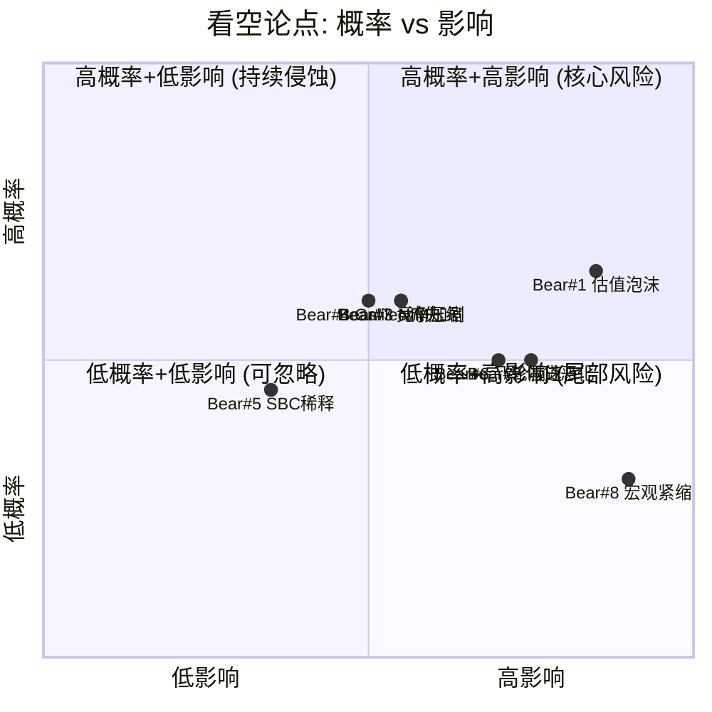
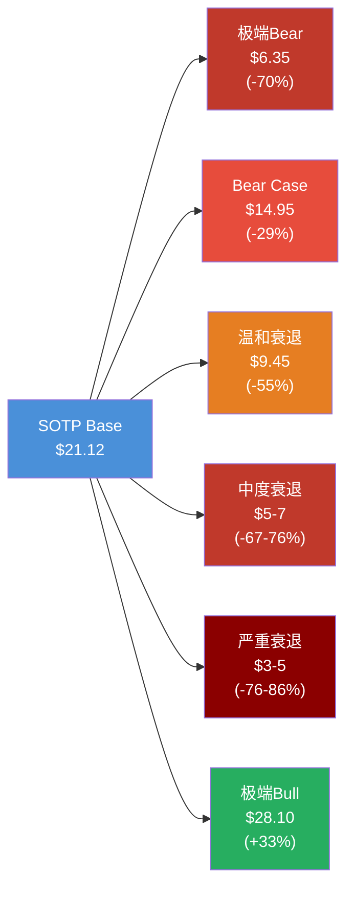

# SOFI Phase 4B: 看空等权重分析 + 反证挑战 + 压力测试

> Agent: 4B | 日期: 2026-02-08

---

## 目录

1. [看空等权重分析 (8论点)](#一看空等权重分析)
2. [反证挑战 (4条)](#二反证挑战)
3. [极端压力测试](#三极端压力测试)

---

## 一、看空等权重分析

### Bear #1: 估值泡沫 — ROE 4.6%的"银行"交易在54x P/E

**触发条件**: 市场重新将SOFI归类为传统银行而非科技公司，套用银行估值倍数
**概率评估**: 35% [合理推断: BofA已按22x FY27E定价$20，消费金融行业平均P/E 10.27x vs SOFI 54x，差距5.3倍难以持续]
**影响量化**: 若按消费金融行业中位数P/E 15x × FY26E EPS $0.60 = $9.00，较当前$20.86下行57% [硬数据: Gurufocus/StockAnalysis, 2026-02]
**时间窗口**: 未来6-12个月，特别是若FY26 EPS低于指引$0.60时
**当前信号**: BofA维持Underperform/$20目标价；trailing P/E 54x vs 消费金融行业均值10.27x [硬数据: Gurufocus, 2026-01]; 近30天股价-24.4% [DM-MKT-001]
**钢人论证**: SOFI的FY25 ROE仅4.6% [DM-ROE-001]，远低于12%资本成本(CoE)。管理层承认ROE突破CoE需等到~FY2030E。在此之前，公司实质上在"烧毁"股东权益价值。一家至少5年内无法赚取资本成本的金融机构，不应享有任何溢价。P/B 2.8x已隐含ROE假设~19%——这是管理层长期目标的下限，但5年内无法实现。市场正在为一个5年后的承诺支付今天的溢价。
**CQ关联**: CQ-1 (估值框架: 银行 vs 科技)

---

### Bear #2: 信贷周期非线性恶化 — 全口径NCO 4.2%仅是起点

**触发条件**: 宏观经济恶化推动NCO从当前水平跳升至7-8%容忍线或以上
**概率评估**: 25% [合理推断: 管理层自设7-8%净累计损失容忍线，当前vintages累计4.55%已消耗57%容忍空间，且仅37% UPB剩余]
**影响量化**: NCO每上升100bps → 年化信贷损失增加~$2.5-3亿(基于~$25B on-BS贷款) → EPS影响约-$0.16-0.19 → 估值下调20-25%
**时间窗口**: 12-18个月内，若失业率突破5%
**当前信号**: Q4 2025 on-BS NCO 2.80%(+20bps QoQ)；90天逾期率52bps(+9bps QoQ) [硬数据: SoFi Q4 2025 Earnings Release, 2026-01-30]; 全口径NCO(含off-BS) Q3达4.2% [DM-CREDIT-001]
**钢人论证**: SOFI的借款人画像以FICO 740+的年轻高收入群体为主，但这一群体恰好是经济衰退中最脆弱的——科技裁员首当其冲、学生贷款负担沉重、消费杠杆率高。2024年以来Capital One NCO从5.3%升至6%、Synchrony NCO较疫情前+130bps [硬数据: Cross River Q2 2025 Review]，表明消费信贷质量正在系统性恶化。SOFI的AI承保模型尚未经历真正的衰退检验——2020年衰退太短、2022年仅加息无衰退。一旦失业率升至7%+，SOFI的"高质量借款人"保护将失效。
**CQ关联**: CQ-2 (信贷风险: AI承保 vs 衰退)

---

### Bear #3: NIM压缩不可逆 — 5.72%已见顶

**触发条件**: 联储继续降息或存款竞争加剧，NIM跌破5.0%
**概率评估**: 30% [合理推断: NIM从Q2 2025的5.84%已降至Q4 2025的5.72%(-12bps QoQ)，趋势已确立；存款成本190bps低于仓库融资，但存款利率面临上行压力]
**影响量化**: NIM每压缩50bps → 净利息收入减少~$1.25-1.5亿(基于~$25B生息资产) → EPS影响-$0.08-0.10 → 直接侵蚀盈利能力
**时间窗口**: FY2026全年持续趋势
**当前信号**: NIM已从Q2高点5.84%连续两季度下降 [硬数据: SoFi Q4 Earnings, 2026-01-30]; 联邦基金利率3.50-3.75%，市场预期可能进一步降息 [硬数据: Fed Rate, 2026-02]
**钢人论证**: SOFI的高NIM本质上来源于其承担了更高的信贷风险——个人贷款NIM远高于住房抵押贷款，这不是效率优势而是风险溢价。随着管理层推进"安全化"转型(从无抵押个人贷款转向有抵押产品)，NIM天然走低。同时，$37.5B存款 [DM-FIN-010] 需要维持有竞争力的利率以防流失(当前4.00-4.50% APY高利率是核心获客工具)，这构成NIM压缩的刚性底线。SOFI面临"三难困境"：降低存款利率→流失存款、维持高利率→NIM压缩、提高贷款利率→抑制需求。
**CQ关联**: CQ-6 (利率路径净影响)

---

### Bear #4: Galileo客户流失 — $1B目标沦为空中楼阁

**触发条件**: Galileo继续丢失大客户，新客户无法弥补存量下降
**概率评估**: 30% [合理推断: 启用账户从165M→157.9M→128M(-23% YoY)，趋势严峻；Phase 3可行性仅3.5/5]
**影响量化**: Tech Platform若停滞在$500M水平(vs $1B目标)，SOTP中该分部估值从~$5B降至~$2.5B → 每股影响-$2.0 → 目标价下调~10%
**时间窗口**: FY2026上半年可验证——Q1 2026管理层预告"约10个新客户将贡献收入" [硬数据: SoFi Q4 Earnings Call, 2026-01-30]
**当前信号**: 启用账户128M(-23% YoY)源于大客户下线 [DM-TECH-001]；收入$122.4M/Q(+19%)但增长主要靠ARPU提升而非客户扩展
**钢人论证**: Galileo的核心问题不仅是客户流失——而是整个BaaS(Banking-as-a-Service)市场格局正在变化。Chime已于2025年6月完成IPO(市值$11.6B) [硬数据: CNBC, 2025-06-12]，作为Galileo历史最大客户之一，Chime上市后有动力(也有资本)将基础设施内化。同时，Marqeta、Stripe Treasury等竞品在BaaS领域持续攻城掠地。Galileo的128M账户中，头部集中度风险极高——丢失任何一个Top 3客户都可能导致收入断崖。
**CQ关联**: CQ-4 (Galileo $1B可行性)

---

### Bear #5: SBC稀释+管理层对冲信号

**触发条件**: SBC持续高企叠加管理层通过结构化交易实质减持
**概率评估**: 20% [合理推断: CEO两次使用预付远期合约锁定收益，叠加$1.5B增发，信号一致]
**影响量化**: 2025年12月增发54.5M股→57.75M股(+4.6%稀释)；SBC若维持高位，年化稀释3-5% → 5年累计稀释15-25%
**时间窗口**: 持续性风险，每次增发/SBC授予时恶化
**当前信号**: CEO Noto通过预付远期合约锁定$24.1M(1.5M股, 地板价$18.21) + $22.4M(2M股, 地板价$13.06) [硬数据: Investing.com/Nasdaq SEC Filing, 2025]; 2025年12月$1.5B增发(54.5M股@$27.50) [硬数据: CNBC, 2025-12-04]; 流通股1.26B [硬数据: SoFi Offering Materials, 2025-12]
**钢人论证**: CEO的预付远期合约本质上是"卖出看跌期权+买入看涨期权"的变体——他在$18.21-$49.18区间获得了确定性现金($24.1M)，同时将下行风险转嫁给交易对手。这意味着CEO即使在股价跌至$18.21时也已锁定收益。当CEO在股价$27附近使用这种工具而非简单持有，这传达的信号是：他认为短期内上行空间有限。叠加公司在历史高点附近进行$1.5B增发，管理层的行为与其"长期看多"的口头立场存在矛盾。
**CQ关联**: 未直接关联CQ，但影响管理层可信度评估

---

### Bear #6: 飞轮减速 — 35%会员增速的数学极限

**触发条件**: 会员增速从35%降至15%以下，产品/会员比停滞
**概率评估**: 25% [合理推断: 13.7M会员基数上维持35%需年增4.8M，而美国成年人口~260M，现有渗透率仅5.3%看似空间大，但优质客群(FICO 740+/高收入)实际TAM可能仅30-50M]
**影响量化**: 增速从35%降至15% → Forward P/E压缩从37.7x至20-25x → 股价下行35-47%至$11-14
**时间窗口**: FY2026-2027，高基数效应开始显现
**当前信号**: 产品/会员比1.47 [DM-USR-002]低于Phase 1目标2.0+；CAC $181 [Phase 1]在竞争加剧下面临上行压力
**钢人论证**: SOFI的飞轮核心假设是"低成本获客→交叉销售→LTV提升"。但LTV/CAC 7.4x [Phase 1]是基于当前交叉购买率40%计算的——如果交叉购买率已接近天花板(用户需要的金融产品有限)，则LTV增长将放缓。更关键的是，SOFI的目标客群(高收入年轻专业人士)恰好是各大银行(JPMorgan、Goldman Marcus)和Fintech(Chime)共同争夺的群体。当竞争对手匹配了SOFI的高利率存款(4.00%+)和零手续费优势后，SOFI的差异化优势将被削弱。
**CQ关联**: CQ-7 (飞轮天花板: 13.7M→25M)

---

### Bear #7: 竞争加剧 — Chime上市+传统银行反攻

**触发条件**: Chime IPO后加速增长，传统银行数字化产品(Apple Savings/Marcus)持续蚕食市场
**概率评估**: 30% [合理推断: Chime IPO估值$11.6B、Q1 2025收入$518.7M(+32%)，增速接近SOFI；传统银行资源优势巨大]
**影响量化**: 若SOFI市占率增长放缓，收入增速低于指引30% → Forward P/E面临15-20%压缩
**时间窗口**: FY2026-2027，Chime上市后首个完整财年
**当前信号**: Chime 2025年6月IPO成功，定价$27/股(市值$11.6B) [硬数据: CNBC, 2025-06-12]；Chime Q1 2025收入$518.7M(+32%)，已实现盈利$12.9M [硬数据: Morningstar, 2025]
**钢人论证**: Chime的上市改变了竞争格局。此前SOFI是唯一的上市数字银行(有银行牌照)——现在Chime带着$11.6B市值和$864M新融资进入战场 [硬数据: FinTech Weekly, 2025-06]。Chime的客群(更下沉、更注重简单性)虽与SOFI有差异，但上市后Chime有资本向上渗透到SOFI的核心客群。同时，JPMorgan等传统银行的数字化产品日趋成熟——JPMorgan拥有SOFI无法匹配的品牌信任度和产品广度。SOFI将面临"上有传统银行压顶、下有Chime追赶"的两面夹击。
**CQ关联**: CQ-5 (竞争护城河深度)

---

### Bear #8: 宏观信贷紧缩 — 关税+通胀+就业市场恶化连锁反应

**触发条件**: 宏观经济硬着陆，失业率突破6%+
**概率评估**: 15% [合理推断: Fed 2026压力测试极端情景设定失业率10%峰值，温和衰退概率更高但硬着陆概率非零]
**影响量化**: 参见第三部分压力测试——严重衰退下EPS可能转负，估值下跌50%+
**时间窗口**: 12-24个月，关税政策影响传导周期
**当前信号**: 联储2026压力测试设定极端情景: 失业率升至10%、房价跌30%、商业地产跌39% [硬数据: Federal Reserve, 2026-02-04]; 关税不确定性上升
**钢人论证**: SOFI的业务模型在宏观顺风期表现优异——低利率→贷款需求旺盛、低失业率→信贷损失低、科技股牛市→投资平台活跃。但这三个顺风条件中任何一个反转都会伤害SOFI，而三个同时反转(滞胀情景)将是灾难性的。SOFI作为年轻的数字银行，尚未经历过完整的信贷周期。2008-2009年衰退中，消费金融NCO从2%飙升至10%+。SOFI的AI承保是否能在这种极端环境中提供保护完全未知。
**CQ关联**: CQ-2 (信贷风险) + CQ-6 (利率路径)

---

### 1.9 看空论点汇总矩阵

### 1.10 钢人论证总结

**最强看空论点综合**：SOFI是一家ROE仅4.6%、至少5年内无法赚取12%资本成本的银行，却交易在54x trailing P/E——这个估值隐含的增长预期需要会员增速保持35%+至2028年、NCO不突破管理层7-8%容忍线、NIM不跌破5%、且Galileo实现$1B收入。这四个条件中任何一个未达标都将导致估值大幅收缩。而历史告诉我们，同时实现四个乐观假设的概率远低于市场隐含的乐观程度。[主观判断: 基于八论点综合评估]

---

## 二、反证挑战

### 2.1 反证 #1: "如果SOFI不是科技公司，而只是一个高估值银行"

**论点**: Phase 1-3将SOFI定位为"科技赋能的金融超级App"并给予科技溢价。但如果市场最终认定SOFI只是一家有App界面的消费金融银行——收入87%来自贷款利息和金融服务、Tech Platform仅占13%——那么所有的科技溢价都是错误的。

**证据**:
- FY2025收入构成: Lending $2.09B(58%), Financial Services $0.99B(27%), Tech Platform $0.49B(14%) [合理推断: 基于DM-FIN-001 总收入$3.6B和各分部比例推算]
- 即使按最宽泛定义(Tech Platform + Financial Services中的科技属性部分)，非利息收入占比仍低于50%
- BofA按22x FY27E EPS $0.93定价$20——这是银行估值方法论 [硬数据: BofA Research, 2026-01]

**对估值影响**: 若按银行P/B 1.2-1.5x(行业中位数) × BVPS ~$7.5 = $9-11.25，下行47-57%。即使给予"优质银行"溢价至P/B 2.0x = $15，仍下行28%。[合理推断: BVPS基于DM-FIN-013 Tier 1杠杆率12.9%和总资产推算]

**概率评估**: 25% [合理推断: 科技叙事在牛市中有粘性，但一旦增长放缓市场会迅速重新归类]

---

### 2.2 反证 #2: "如果信贷周期正在转向"

**论点**: Phase 1-2的乐观信贷结论——"AI承保优于传统银行"、"NCO控制良好"——建立在经济扩张期的良好数据之上。但信贷周期转向时，所有承保模型的表现都会恶化，AI模型尤其危险因为其训练数据几乎全部来自低损失环境。

**证据**:
- Capital One信用卡NCO从5.3%→6%(+70bps YoY) [硬数据: PYMNTS.com/Cross River, 2025]
- Synchrony NCO较疫情前+130bps [硬数据: Cross River Q2 2025 Review]
- SOFI 90天逾期率+9bps QoQ至52bps，NCO +20bps QoQ至2.80% [硬数据: SoFi Q4 2025 Earnings, 2026-01-30]
- 管理层自设7-8%净累计损失容忍线，当前vintages累计4.55%(已消耗57%空间) [硬数据: SoFi Q4 Earnings Call, 2026-01-30]

**对估值影响**: 若NCO达到管理层容忍线上限8%，年化信贷拨备需增加$500-600M → FY26 EPS从$0.60降至$0.20-0.25 → 35x P/E下目标价$7-9，下行57-66%

**概率评估**: 20% [合理推断: 当前就业市场仍健康但信贷领先指标已出现恶化信号]

---

### 2.3 反证 #3: "如果飞轮效应正在减速"

**论点**: Phase 3将飞轮健康度评为7.4/10、给予2-3年高增长窗口 [DM-FLYWHEEL-001]。但多项指标显示飞轮可能正在减速——产品/会员比停滞在1.47(远低于2.0+目标)、PPDA背离35.4ppt暗示增长质量存疑。

**证据**:
- 产品/会员比1.47 [DM-USR-002]——交叉销售核心指标，目标2.0+意味着需提升36%
- PPDA背离35.4ppt(极端水平)、RSI 21.6(超卖) [DM-PPDA-001]——市场已在定价飞轮减速
- CAC $181 [Phase 1]若上升10%→LTV/CAC从7.4x降至6.7x
- FY2026指引收入增速30%(vs FY2025的38%)已开始减速 [DM-GD-001]

**对估值影响**: 飞轮减速→增速从30%→15-20% → Forward P/E合理水平从37.7x→20-25x → 目标价$12-15，下行28-42%

**概率评估**: 30% [合理推断: 高基数效应+竞争加剧+产品/会员比停滞三重证据]

---

### 2.4 反证 #4: "如果Galileo持续萎缩"

**论点**: Phase 3将Galileo $1B目标可行性上调至3.5/5。但账户从165M→128M(-22%)的趋势若延续，收入增长将完全依赖ARPU提升——而ARPU提升总有天花板。

**证据**:
- 启用账户Q3 2025 157.9M(-1% YoY) → Q4 2025 128M(-23% YoY) [DM-TECH-001]——加速下滑
- 当前年化收入~$490M [$122.4M/Q × 4]，达到$1B需翻倍 [合理推断: 基于DM-TECH-001推算]
- Chime上市后有资本+动力将基础设施内化 [合理推断: Chime IPO融资$864M提供了技术自建能力]

**对估值影响**: Galileo停滞在$500M → SOTP中Tech Platform估值从$5B降至$2.5B → 每股-$2.0(-10%)

**概率评估**: 25% [合理推断: 新客户管线存在但大客户流失风险持续]

---

## 三、极端压力测试

### 3.1 SOTP极端场景

| 分部 | 极端Bear倍数 | 极端Bear估值 | Base Case估值 | 极端Bull倍数 | 极端Bull估值 |
|:---|:---:|:---:|:---:|:---:|:---:|
| Lending | 4x PPNR | $6.0B | $11.5B | 10x PPNR | $15.0B |
| Financial Services | 3x Rev | $3.0B | $8.0B | 15x Rev | $15.0B |
| Tech Platform | 2x Rev | $1.0B | $5.0B | 12x Rev | $5.9B |
| Corporate/Adj | — | -$2.0B | -$1.0B | — | -$0.5B |
| **总计** | — | **$8.0B** | **$23.5B** | — | **$35.4B** |
| **每股** | — | **$6.35** | **$18.65** | — | **$28.10** |

[合理推断: 极端Bear用消费金融底部倍数(2008-2009参考)；极端Bull用高增长Fintech上限倍数(2021峰值折扣)；流通股1.26B]

**极端Bear ($6.35)**: 较当前$20.86下行70%——对应完全信贷危机+Galileo归零+科技溢价消失
**极端Bull ($28.10)**: 较当前上行35%——对应飞轮加速+Galileo突破+银行牌照价值重估

---

### 3.2 信贷压力测试

| 情景 | 失业率 | NCO假设 | 年化信贷损失 | EPS影响 | 估值影响 |
|:---|:---:|:---:|:---:|:---:|:---:|
| **基准** | 4.0% | 2.80% (on-BS) | ~$700M | $0.60 (指引) | $20.86 |
| **温和衰退** | 5.5% | 4.5% (+170bps) | ~$1,125M | $0.27 (-55%) | $9.45 (-55%) |
| **中度衰退** | 7.0% | 6.5% (+370bps) | ~$1,625M | -$0.13 (亏损) | $5-7 (-66-76%) |
| **严重衰退** | 9.0% | 9.0%+ (+620bps) | ~$2,250M+ | -$0.63 (深亏) | $3-5 (-76-86%) |

[合理推断: NCO与失业率关系基于消费金融历史弹性系数~1.5x; 年化信贷损失 = NCO率 × ~$25B on-BS贷款; EPS影响考虑税盾和拨备前利润~$1.6B EBITDA指引; Fed 2026压力测试极端情景设定失业率10%峰值] [硬数据: Fed 2026 Stress Test Scenarios, 2026-02-04]

**关键发现**: SOFI在失业率超过5.5%的任何情景下，EPS都将大幅低于市场预期。在中度衰退中即转亏——这暴露了高杠杆消费信贷业务模型的脆弱性。相比之下，JPMorgan等多元化银行在2008-2009年虽利润大降但未转亏。[主观判断: 基于压力测试结果的结构性脆弱性评估]

---

### 3.3 AI极端场景

**AI正面极端 (+15%估值上调)**:
- AI承保模型准确率提升 → NCO降低50bps → 年化节省$125M → EPS +$0.08
- AI驱动的客服/运营效率 → 效率比改善500bps → 年化节省$100M
- AI新产品(智能投顾、个性化保险) → 年化新增收入$200M
- 合计估值影响: +$3-4/股(+15-19%) [合理推断: 基于各项AI增量收益的合理倍数推算]

**AI负面极端 (-10%估值下调)**:
- 竞品(JPMorgan/Capital One)AI能力追平 → SOFI失去承保优势 → NCO回归行业平均
- AI监管收紧(算法公平性、数据隐私) → 合规成本增加$50-100M/年
- AI驱动的"超级竞争" → CAC通胀20%+ → LTV/CAC从7.4x降至5x
- 合计估值影响: -$2-3/股(-10-14%) [合理推断: 基于AI优势消失后回归行业均值的估值修正]

---

### 3.4 综合压力测试汇总

**概率加权综合评估**:

| 情景 | 概率 | 目标价 | 加权贡献 |
|:---|:---:|:---:|:---:|
| 极端Bull | 10% | $28.10 | $2.81 |
| Base Case | 40% | $21.12 | $8.45 |
| Bear Case | 25% | $14.95 | $3.74 |
| 温和衰退 | 15% | $9.45 | $1.42 |
| 中度衰退 | 7% | $6.00 | $0.42 |
| 严重衰退 | 3% | $4.00 | $0.12 |
| **概率加权目标价** | **100%** | — | **$16.96** |

[合理推断: 概率分配基于当前宏观环境(温和增长但不确定性上升)和SOFI特异风险; 概率加权目标价$16.96较当前$20.86隐含-18.7%下行空间]

**Phase 4B核心结论**: 概率加权后的看空视角目标价为$16.96，较当前价位隐含18.7%下行风险。最大的单一风险是估值重估(Bear #1)——如果市场决定用银行倍数而非科技倍数定价SOFI，下行空间可达57%。第二大风险是信贷周期(Bear #2)——SOFI的业务模型对就业市场和消费信贷质量高度敏感，任何超过温和衰退的情景都将导致亏损。[主观判断: 基于八项看空论点和压力测试的综合评估]

---

*免责声明: 本报告仅为投资研究参考，不构成投资建议。所有分析基于公开数据和合理推断，实际结果可能显著偏离预测。投资者应独立评估风险并咨询专业顾问。*
