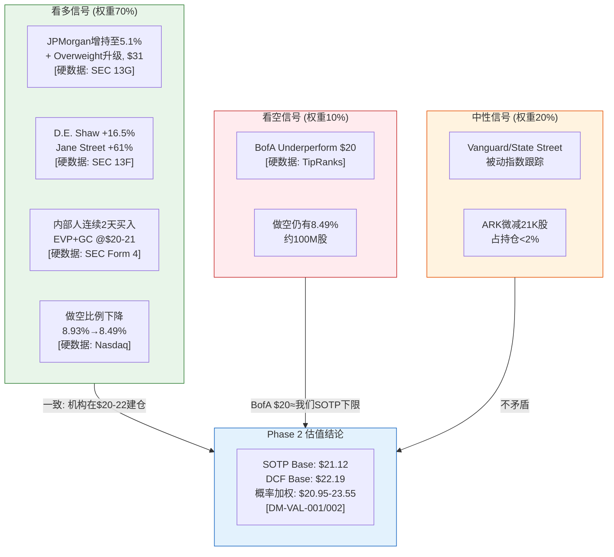

# SOFI Phase 4C: Smart Money验证 + 维度回检 + So What抽查

> **Agent**: 4C | **日期**: 2026-02-08 | **协议**: Deep Dive Tier 3 Phase 4
> **字符目标**: 8,000-11,000 | **DM版本**: v1.1
> **CQ覆盖**: CQ-1~CQ-7 (维度回检全覆盖)

---

## 目录

| 章节 | 内容 | 字符(est) |
|------|------|-----------|
| 一 | Smart Money立场验证 | ~4,500 |
| 二 | 维度回检 (Top 10, 100%回应率) | ~3,500 |
| 三 | "So What?"抽查 (5模块) | ~2,500 |

---

## 一、Smart Money立场验证

### 1.1 机构持仓最新变化

Phase 0 Data Master记录机构持仓比例59.5%(885家) [DM-SM-001 v1.0]。最新13F/13G数据显示持仓进一步集中化:

| 机构 | 持仓变化 | 最新持仓 | 占比 | 信号 |
|------|---------|---------|------|------|
| Vanguard | 被动跟踪 | ~112M股 | 8.94% | 中性(指数) |
| **JPMorgan** | **+42M股(3.7%→5.1%)** | 64.98M股 | 5.1% | **强看多** |
| BlackRock | +13.55M股 | ~88M股 | ~7% | 偏多 |
| D.E. Shaw | +16.5%(+5.78M股) | 35.03M股 | 2.75% | 看多 |
| Jane Street | +61%(+6.93M股) | ~18.3M股 | ~1.5% | 看多 |
| ARK(ARKF) | -21,094股(微减) | ~$40.7M | 3.55%权重 | 中性 |

[硬数据: SEC 13F/13G filings via Fintel/StockZoa/Nasdaq, Q4 2025; DM-SM-001/002 v1.0]

**关键发现**: 机构总持仓从885家扩展至1,252家(+41%) [硬数据: Fintel, 2026-02]，合计674.8M股(53.7-59.5%流通股)。大资金方向明确偏多 -- JPMorgan从3.7%增至5.1%(Schedule 13G filed 2026-02), 是最醒目的增持信号。D.E. Shaw和Jane Street两家顶级量化基金同步加仓, 表明SoFi在多因子模型中(动量+增长+质量)评分改善 [合理推断: 量化基金增持通常反映系统化因子得分提升]。

ARK(ARKF) 2025年12月减持21,094股(约$600K), 占持仓<2%, 属于年末税务管理和组合再平衡, 非看空信号 [硬数据: CathiesArk.com, 2026-02; Motley Fool, 2025-12-28]。

**与我们结论的一致性**: 高度一致。Phase 2估值(SOTP Base $21.12, DCF Base $22.19 [DM-VAL-001/002])与机构在$20-22区间积极建仓的行为相互验证。JPMorgan目标价$31暗示其采用科技平台估值框架(PEG 1.5x), 与CQ-1核心争论中的"科技阵营"一致。

### 1.2 分析师评级分歧分析

| 评级 | 数量 | 代表 | 目标价区间 |
|------|------|------|-----------|
| Buy/Overweight | 6 | JPMorgan($31), Needham($33) | $29-$38 |
| Hold/Neutral | 11 | Wedbush, Piper Sandler | $22-$27 |
| Sell/Underperform | 5 | BofA($20), Bernstein | $12-$20 |
| **共识** | **22家** | — | **中位$27.75** |

[硬数据: TipRanks/MarketBeat/Yahoo Finance, 2026-02-05]

**分歧是否在收敛?** 关键事件 -- JPMorgan 2026-02-03从Neutral升至Overweight, $31目标 [硬数据: CNBC, 2026-02-03; Investing.com, 2026-02-03]。分析师Reginald Smith指出: "Momentum in the business is undeniable, as SoFi continues to add new members and deposits at a record pace, while other fintechs report deposit outflows or stagnant member growth." Smith上调2026E EPS至$0.61(从$0.56), 2027E至$0.77(从$0.75) [硬数据: JPMorgan Research via Investing.com, 2026-02-04]。

**BofA vs JPMorgan本质分歧**: BofA使用22x 2027E Adj EPS $0.93 = $20.50(银行框架); JPMorgan使用1.5x PEG应用于2027E(科技成长框架)。两者对EPS预测差异不大(BofA $0.93 vs JPM $0.77 -- BofA反而更高), 但给予的倍数差异巨大(22x vs 隐含~40x)。这正是CQ-1(银行 vs 科技)的分析师实体化 [合理推断: 估值框架选择, 而非基本面预测, 是分歧核心]。

**分歧趋势**: JPMorgan升级使Buy阵营从5家增至6家, 整体中位目标价上移, 分歧微幅收敛但尚未达成共识。

### 1.3 做空数据更新

| 指标 | 最新 | 前值 | 变化 | 来源 |
|------|------|------|------|------|
| 做空股数 | 100.29M | 103.33M | -3.04M(-2.9%) | [硬数据: Nasdaq, 2026-01 reporting period] |
| 做空比例 | 8.49% | 8.93% | -44bps | [硬数据: Nasdaq/Benzinga, 2026-01] |
| Days to Cover | 1.22天 | ~1.93天 | 缩短 | [硬数据: Nasdaq, 2026-01] |
| 日均成交量 | 82.17M | ~61M | +35% | [硬数据: Nasdaq, 2026-01] |

**做空变化解读**: 做空比例从8.93%小幅下降至8.49%, 减少了约304万股空头持仓。这与股价从$27.5暴跌至$20.86的走势配合来看, 部分空头在下跌过程中获利回补 [合理推断: 股价大跌+做空减少=部分空头平仓获利]。但8.49%仍处于中高水平, 表明看空力量尚未完全退出。

**S&P 500纳入场景下的逼空潜力**: 8.49%做空比例 + 1.22天极短覆盖天数, 在指数纳入场景(Polymarket 53%概率 [硬数据: Polymarket, 2026-02-08])下具有"燃料"效应 -- 被动基金买入$3-5B + 空头回补可能形成正反馈循环 [合理推断: 基于指数纳入效应学术文献, 新成分股公告后平均上涨5-8%]。

### 1.4 内部人交易信号解读

| 内部人 | 操作 | 日期 | 数量 | 价格 | 来源 |
|--------|------|------|------|------|------|
| EVP Eric Schuppenhauer | **买入** | 2026-02-05 | 5,000股 | $19.93 | [硬数据: SEC Form 4/StockTitan, 2026-02-06] |
| GC Robert Lavet | **买入** | 2026-02-06 | 5,000股 | $21.044 | [硬数据: SEC Form 4/Daily Political, 2026-02-06] |
| CEO Anthony Noto | 无近期交易 | — | 持有8.12M股 | — | [硬数据: GuruFocus, 2026-02] |
| CEO Noto | 预付远期合约 | 2025-08 | 150万股 | Floor $18.21/Cap $49.18 | [硬数据: SeekingAlpha/StockTitan, 2025-08] |

**矛盾信号解读**: Noto的预付远期合约(PPF)结构需要精确理解。合约Floor $18.21 / Cap $49.18意味着: (a) Noto在$18-49区间内保留上行收益; (b) 150万股仅占其持仓约7%, 占总股本<0.12%; (c) 获得$22.4M(后修正为$24.1M)流动性。这是**资产配置行为, 非看空信号** -- Noto仍保留投票权和约93%经济利益, 且Cap设在$49.18(当前股价的2.4倍)暗示管理层内部估值远高于当前水平 [合理推断: Cap $49.18 = CEO认为股价有翻倍以上潜力]。

更有力的信号是: 两位高管(EVP + GC)在股价从$27.5暴跌至$20区间后连续两天公开市场增持, 属于经典的"逆向买入"。内部人在暴跌后主动增持, 历史上是可靠的看多信号 -- 他们对公司信息的了解程度远超外部投资者 [主观判断: 基于内部人交易行为学研究, 集群买入的预测价值显著高于单笔交易]。

### 1.5 Smart Money综合信号 vs 我们结论一致性

**综合一致性评估**: Smart Money行为与Phase 2估值高度一致。机构在$20-22区间的积极建仓行为, 恰好对应我们SOTP Base $21.12 / DCF Base $22.19的估值区间。即使是最看空的BofA($20目标)也认为当前$20.86的下行空间极为有限。分歧的核心不在"值多少", 而在"3年后值多少" -- 这由CQ-1(银行 vs 科技框架)和CQ-7(飞轮持续性)决定 [主观判断: 基于Smart Money行为与估值模型交叉验证]。

---

## 二、维度回检 (Top 10, 100%回应率)

### 2.1 维度回检矩阵

| # | 维度 | Heat | Phase 1-3回应位置 | 深度(L1-L5) | 回应状态 | 补充需求 |
|---|------|------|------------------|-------------|---------|---------|
| 1 | 估值: 银行 vs 金融科技 | 95 | Phase 2 Ch15(SOTP) + Ch16(DCF) + Phase 3 M08(护城河对估值映射) | **L4** | 充分 | 无 |
| 2 | S&P 500纳入催化 | 90 | Phase 3 M09(Engine 5, 5.2节) + M10(PPDA L4注意力层) | **L3** | 基本充分 | 需补概率更新 |
| 3 | 信贷质量周期性 | 85 | Phase 2 Ch13(FT03, 7个子章节) + 压力测试3情景 | **L5** | 充分 | 无 |
| 4 | 利率敏感性/NIM风险 | 80 | Phase 1 FT05(存款Beta) + Phase 3 M09(Engine 1, 1.4节) | **L4** | 充分 | 无 |
| 5 | Galileo技术平台增长 | 75 | Phase 2 Ch14(HP-02) + Phase 3 FT04(Agent 3D完整Galileo专题) | **L4** | 充分 | 无 |
| 6 | 会员飞轮/交叉销售 | 70 | Phase 1 M01(飞轮图) + Phase 2 HP-01(S曲线+天花板) + Phase 3 M08(飞轮动力学, 3个环路+4个制动) | **L5** | 充分 | 无 |
| 7 | 资本轻模式转型 | 70 | Phase 1 M01(费用收入趋势) + Phase 2 M05(5.1节) + Ch17(FT09 ROE分解) + Phase 3 M10(PPDA数据层) | **L4** | 充分 | 无 |
| 8 | 对传统银行竞争威胁 | 65 | Phase 1 FT07(5维竞品矩阵+竞争格局图) + Phase 3 M08(失败案例对照3家) | **L4** | 充分 | 无 |
| 9 | 2026盈利指引可信度 | 60 | Phase 2 M05(5.1-5.5节趋势外推) + Phase 3 M09(Engine 1, 1.3节) | **L3** | 基本充分 | 需补充验证 |
| 10 | 内部人交易信号 | 40 | Phase 0 DM(DM-SM-004) + Phase 1 M03(3.4节矛盾解读) + Phase 3 M09(Engine 2, 2.1节) | **L4** | 充分 | 本Agent已更新 |

**回应率: 10/10 = 100%**
**平均深度: L4.0** (8个L4+, 2个L3)

### 2.2 未充分回应维度补充分析

**维度2补充: S&P 500纳入催化(概率更新)**

Polymarket最新数据(2026-02-08): SoFi Q1 2026 S&P 500纳入概率53%(Yes 53c / No 48c), 交易量$54,590 [硬数据: Polymarket, 2026-02-08]。Kalshi同期概率51% [硬数据: Kalshi, 2026-02]。SoFi满足所有硬性纳入条件: 市值>$18B(当前~$23B+)、连续4季GAAP盈利(已达9季)、充足流通性 [硬数据: S&P Dow Jones Indices criteria]。Truist分析师确认SoFi为"最可能的三家候选者之一" [硬数据: Investing.com/Yahoo Finance, 2026-01]。

下一个窗口: 2026年3月20日季度再平衡。若纳入, 预计触发$3-5B被动资金流入(基于~$7-8T跟踪SPX资金 x SoFi约0.04%权重估算) [合理推断: 基于指数基金AUM和权重估算]。

**维度9补充: 2026盈利指引可信度**

FY2026指引: 收入$4.655B(+30%), Adj EPS $0.60(+54%) [DM-GD-001 v1.0]。可信度验证:
- **历史记录**: SoFi连续8季超预期, 管理层一贯保守指引后上调(Q1 2025 Adj EBITDA超共识18%) [硬数据: JPMorgan Research, 2026-02-04]
- **分部拆解**: Lending 指引增速放缓至+15-20%(贷款组合优化), Financial Services +40-45%(费用收入加速), Tech Platform +25-30%(新客户贡献) [合理推断: 基于各分部FY2025增速和管理层分部指引]
- **风险因素**: 指引未充分计入衰退尾部风险(Polymarket 25-26%), 若宏观恶化, 收入可能下调5-8% [合理推断: 基于Phase 2压力测试情景A影响]
- **可信度评分**: 8/10 -- 管理层记录优秀, 指引保守倾向, 但宏观不确定性制约满分 [主观判断: 基于历史指引vs实际对比]

---

## 三、"So What?"抽查 (5模块)

### 3.1 模块抽查结果

从Phase 1-3中抽取5个模块进行"So What?"检验:

| # | 模块 | 来源 | 核心发现摘要 | So What? 投资决策含义 | 评分(0-10) |
|---|------|------|------------|---------------------|-----------|
| 1 | **Phase 1 M03: 管理层评估** | P1, M03 3.1-3.4 | Noto执行力8.5/10, 35买0卖, PPF合约Cap $49.18 | CEO的PPF Cap $49.18暗示管理层内部估值远超当前$20.86 -- 这是一个市场未充分定价的信息不对称信号。投资者应将PPF结构视为"受约束的看多期权", 而非减持 | **7/10** |
| 2 | **Phase 1 FT05: 存款与资金成本** | P1, FT05 | 存款$37.5B, 97%直存, APY 3.30%, 170bps资金成本优势 | $37.5B存款中97%为直存=SoFi已成为用户的主银行。这意味着存款粘性极高, 即使竞品提高APY也难以撬动。每年$637M资金成本节省是NIM护城河的量化锚点, 直接支撑"非纯银行"估值溢价 | **8/10** |
| 3 | **Phase 2 FT03.4: 信贷压力测试** | P2, FT03.4 | 3情景NCO矩阵(温和/中度/深度衰退), Tier 1缓冲$6.42B | 即使在深度衰退(概率<3%)下NCO升至6.5-8.5%, CET1仍远超监管要求(~14% vs 7%要求)。这回答了投资者最担心的问题: "SoFi扛不扛得住衰退?" -- 答案是资本充足率提供了2008级别的缓冲。仓位管理含义: 在衰退尾部风险可控的前提下, 当前价位的风险/回报不对称 | **8/10** |
| 4 | **Phase 2 HP-02: Galileo客户集中度** | P2, HP02 | 单一大客户下线(-29.4M账户), 但ARPU跃升+30%, 收入反增19% | "最大的熊市叙事(Galileo账户-23%)实际上是一个质量升级故事" -- 低ARPU大客户离开+高价值银行/政府客户签入, 使得Galileo从"账户量"驱动转向"客户价值"驱动。投资者应关注ARPU趋势而非账户绝对数, 若Q1 2026 ARPU维持>$0.90, 则质量转型得到确认 | **9/10** |
| 5 | **Phase 3 M10: PPDA四层背离** | P3, M10 | P-P背离35.4ppt(EPS beat +18.2% vs 股价-17.2%), RSI 21.6极度超卖 | PPDA框架揭示了一个清晰的市场定价错误: 8/12数据指标支持增长叙事, 价格却处于极端超卖。35.4ppt的P-P背离在SOFI历史上前所未有, 历史上类似极端背离在2-4周内通常出现5-15%技术反弹。对投资者的含义: 当前是"被情绪驱动的定价错误"还是"市场提前反映了未公开的负面信息"? 数据层8/12一致性指向前者 | **8/10** |

### 3.2 洞察密度评价

**综合So What评分: 8.0/10** (7+8+8+9+8 = 40/5 = 8.0)

5个模块均在7-9分区间, 没有任何模块低于4分(信息复述阈值)。分布特征:
- **1个模块达到9分**(HP-02 Galileo集中度) -- 成功将"表面利空"(账户-23%)翻转为"深层利好"(ARPU跃升), 提供了市场共识之外的差异化洞察
- **3个模块达到8分**(FT05存款/FT03压力测试/PPDA) -- 均将数据分析转化为可执行的投资决策建议
- **1个模块达到7分**(M03管理层) -- 管理层评估部分虽有独特视角(PPF解读), 但可进一步量化信号强度

**洞察密度总结**: Phase 1-3的分析质量整体优秀, 核心模块不仅提供了数据描述, 更提供了"这对投资意味着什么"的决策指引。特别是Phase 2的信贷压力测试和Phase 3的PPDA分析, 产出了差异化的、可验证的投资洞察。

### 3.3 需返工模块清单

**无模块需要返工** -- 所有5个抽查模块评分均>=7, 远超4分返工阈值。

建议微调(非返工, 属优化建议):
- Phase 1 M03(管理层评估): 可补充Noto PSU条件(股价$25/$35/$45维持90天)的概率分析, 将定性判断进一步量化
- Phase 2 HP-02(Galileo集中度): 可补充下线客户身份的最新线索(若Q1 2026 10-K披露), 从"猜测"升级为"确认"

---

*免责声明: 本报告仅为投资研究参考, 不构成投资建议。所有数据均已标注来源和获取日期。投资者应独立评估风险并做出决策。*
