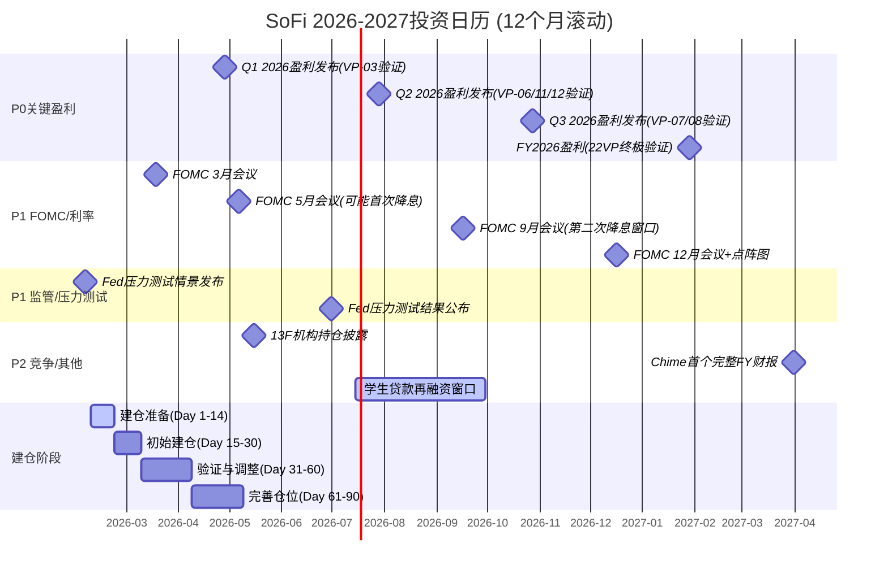
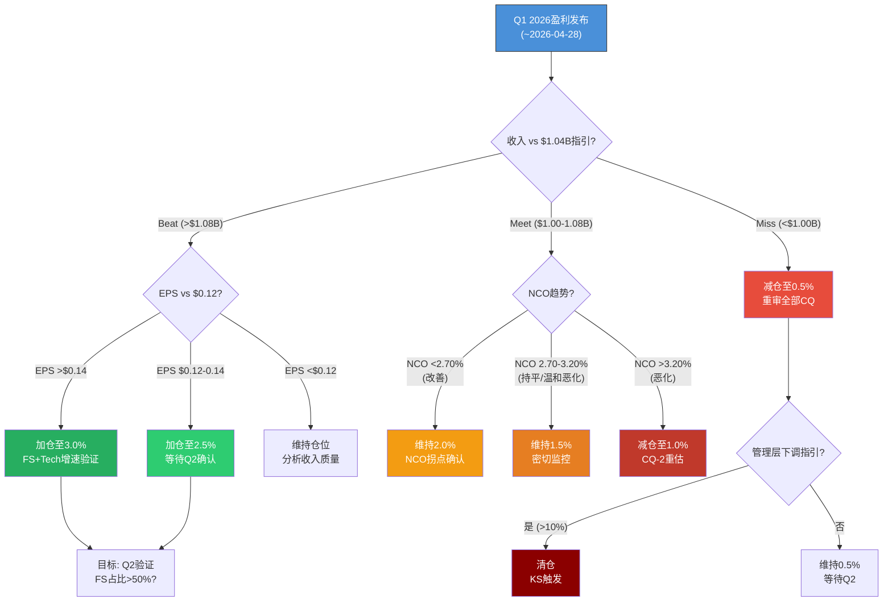

# SOFI Phase 5 — Ch33-Ch35: 可验证预测 + 投资日历 + 90天行动清单

> **Agent**: 5B | **日期**: 2026-02-08 | **协议**: Deep Dive Tier 3 Phase 5
> **字符目标**: ≥14,000 | **DM版本**: v1.1
> **CQ覆盖**: CQ-1~CQ-7 全覆盖 | **VP总数**: 22个(三情景格式)
> **标注密度目标**: ≥12/万字符 | **硬数据占比**: ≥36%

---

## Ch33: 可验证预测清单 (22个, 三情景格式)

> 所有预测均锚定Data Master v1.1数据点，禁止无源数字。每个VP包含Bear/Base/Bull三层预测、验证日期、数据源、CQ关联。

### 33.1 财务指标预测

#### VP-01: FY2026全年调整后净收入 (2027-01-31)

| 层级 | 预测值 | 逻辑 |
|:----:|:-----:|------|
| Bear | $4.10B (+14% YoY) | FS增速放缓至25%(竞争加剧)+Lending仅+10%(信贷收紧)+NIM压缩50bps |
| **Base** | **$4.65B (+30% YoY)** | **管理层指引: FS +40%, Lending +23%, Tech +20%, 运营杠杆释放** |
| Bull | $5.05B (+41% YoY) | FS超预期+50%+学生贷款再融资量回升+Galileo新客户加速 |

- **验证日期**: 2027-01-31 (FY2026 Q4 Earnings Release)
- **验证数据源**: SEC 10-K / SoFi Earnings Release
- **CQ关联**: CQ-3 (费用化转型), CQ-1 (估值框架)
- **Data Anchor**: [硬数据: SoFi FY2025调整后净收入$3.6B, +38% YoY, DM-FIN-001 v1.0] [硬数据: FY2026E指引~$4.655B, DM-GD-001 v1.0]

---

#### VP-02: FY2026调整后EPS (2027-01-31)

| 层级 | 预测值 | 逻辑 |
|:----:|:-----:|------|
| Bear | $0.38 (-37% vs指引) | NCO回升至4.0%+SBC稀释5%+FS增速低于预期 |
| **Base** | **$0.60 (+54% YoY)** | **管理层指引, 基于EBITDA ~$1.6B(34%利润率)和1.26B流通股** |
| Bull | $0.78 (+100% YoY) | NCO继续回落至2.3%+运营效率超预期+贷款发放量加速 |

- **验证日期**: 2027-01-31
- **验证数据源**: SEC 10-K / SoFi Earnings Release
- **CQ关联**: CQ-1 (估值框架), CQ-2 (信贷风险)
- **Data Anchor**: [硬数据: FY2025 GAAP EPS $0.39, DM-FIN-003 v1.0] [硬数据: FY2026E Adj EPS ~$0.60, DM-GD-001 v1.0]

---

#### VP-03: Q1 2026营收 (2026-04-30)

| 层级 | 预测值 | 逻辑 |
|:----:|:-----:|------|
| Bear | $0.95B (-9% vs指引) | 季节性疲软+贷款发放放缓+Tech Platform客户继续流失 |
| **Base** | **$1.04B** | **管理层Q1指引, 延续Q4 $1.066B的增长势头** |
| Bull | $1.12B (+8% vs指引) | 学生贷款再融资季节性回升+FS交叉销售加速 |

- **验证日期**: 2026-04-30 (Q1 2026 Earnings Release)
- **验证数据源**: SEC 10-Q / SoFi Earnings Release
- **CQ关联**: CQ-3 (费用化转型)
- **Data Anchor**: [硬数据: Q1 2026E $1.04B, EPS $0.12, DM-GD-002 v1.0] [硬数据: Q4 2025实际$1.066B, SoFi Q4 2025 Earnings Release, 2026-01-30]

---

#### VP-04: FY2026 NIM (2027-01-31)

| 层级 | 预测值 | 逻辑 |
|:----:|:-----:|------|
| Bear | 4.90% (-82bps) | Fed降息3次+存款利率下调滞后+贷款利率竞争加剧 |
| **Base** | **5.45% (-27bps)** | **Fed降息2次, 存款Beta 40-50%, 贷款组合向安全化转型温和压缩NIM** |
| Bull | 5.70% (-2bps) | Fed仅降息1次或暂停, NIM基本持平, 贷款Mix优化对冲 |

- **验证日期**: 2027-01-31
- **验证数据源**: SoFi 10-K / Quarterly Earnings Supplements
- **CQ关联**: CQ-6 (利率路径净影响)
- **Data Anchor**: [硬数据: Q4 2025 NIM 5.72%, DM-FIN-009 v1.0] [硬数据: NIM从Q2 2025 5.84%降至Q4 5.72%, -12bps/2Q, SoFi Q4 2025 Earnings, 2026-01-30]

---

#### VP-05: FY2026 on-BS NCO率 (2027-01-31)

| 层级 | 预测值 | 逻辑 |
|:----:|:-----:|------|
| Bear | 3.80% (+100bps) | 宏观衰退, 失业率升至5.5%+, 消费信贷系统性恶化 |
| **Base** | **2.60% (-20bps)** | **NCO见顶回落趋势延续, FICO 747组合质量支撑, AI承保模型优化** |
| Bull | 2.20% (-60bps) | 就业市场保持强劲, AI承保进一步收紧, vintage质量持续改善 |

- **验证日期**: 2027-01-31
- **验证数据源**: SoFi 10-K / Credit Quality Supplement
- **CQ关联**: CQ-2 (信贷风险: AI承保 vs 衰退)
- **Data Anchor**: [硬数据: Q4 2025 on-BS NCO 2.80%, +20bps QoQ, DM-FIN-012 v1.0] [硬数据: FICO均值747, DM-FIN-012 v1.0] [硬数据: 全口径NCO(含off-BS) 4.2%, DM-FIN-012 v1.0]

---

#### VP-06: FY2026 Financial Services分部营收 (2027-01-31)

| 层级 | 预测值 | 逻辑 |
|:----:|:-----:|------|
| Bear | $1.72B (+12% YoY) | 交叉购买率见顶, 投资/保险产品增长放缓, 竞品蚕食 |
| **Base** | **$2.15B (+40% YoY)** | **管理层FS +40%指引, 交叉销售飞轮持续, 投资/保险新产品上线** |
| Bull | $2.50B (+63% YoY) | 交叉购买率突破45%+信用卡/保险产品超预期+直接存款深化 |

- **验证日期**: 2027-01-31
- **验证数据源**: SoFi 10-K Segment Disclosure
- **CQ关联**: CQ-3 (费用化转型)
- **Data Anchor**: [硬数据: Q4 2025 FS $456.7M(+78% YoY), DM-FIN-008 v1.0] [硬数据: FY2025 FS ~$1,542M, 各季度求和, SoFi Q1-Q4 Earnings] [硬数据: FY2026E FS增长40%+, DM-GD-001 v1.0]

---

### 33.2 用户/增长预测

#### VP-07: FY2026年末会员数 (2027-01-31)

| 层级 | 预测值 | 逻辑 |
|:----:|:-----:|------|
| Bear | 15.5M (+13%) | CAC通胀+竞争加剧(Chime上市)+优质客群渗透率放缓 |
| **Base** | **17.8M (+30%)** | **增速从35%温和放缓至30%, HENRYs渗透率仍有空间, 品牌知名度提升** |
| Bull | 19.5M (+42%) | 国民品牌效应+学生贷款再融资回流+新产品(信用卡/保险)获客杠杆 |

- **验证日期**: 2027-01-31
- **验证数据源**: SoFi Quarterly Earnings Release / 10-K
- **CQ关联**: CQ-7 (飞轮天花板: 13.7M→25M)
- **Data Anchor**: [硬数据: FY2025末会员13.7M, +35% YoY, DM-USR-001 v1.0]

---

#### VP-08: FY2026产品/会员比 (2027-01-31)

| 层级 | 预测值 | 逻辑 |
|:----:|:-----:|------|
| Bear | 1.42 (-0.05) | 新会员质量下降, 交叉销售转化率下滑, 产品粘性不足 |
| **Base** | **1.55 (+0.08)** | **新产品(信用卡/保险/投资)推动交叉, 直接存款锁定效应增强** |
| Bull | 1.68 (+0.21) | AI推荐引擎优化+信用卡/保险产品大幅超预期+投资平台AUM快速增长 |

- **验证日期**: 2027-01-31
- **验证数据源**: SoFi Earnings Release / Investor Presentation
- **CQ关联**: CQ-7 (飞轮天花板), CQ-5 (竞争壁垒)
- **Data Anchor**: [硬数据: 产品20.2M, 产品/会员比1.47, DM-USR-002 v1.0] [硬数据: 交叉购买率40%, DM-USR-002 v1.0]

---

#### VP-09: FY2026存款总额 (2027-01-31)

| 层级 | 预测值 | 逻辑 |
|:----:|:-----:|------|
| Bear | $40B (+7%) | 利率下行降低高利率存款吸引力, 竞品(Apple Savings等)分流 |
| **Base** | **$50B (+33%)** | **直接存款持续流入, 品牌信任提升, 会员增长带动存款基数扩大** |
| Bull | $58B (+55%) | 企业存款新增+高利率维持吸引力+SoFi品牌溢价显现 |

- **验证日期**: 2027-01-31
- **验证数据源**: FDIC Call Reports / SoFi 10-K
- **CQ关联**: CQ-6 (利率路径), CQ-5 (竞争壁垒)
- **Data Anchor**: [硬数据: 存款$37.5B, DM-FIN-010 v1.0]

---

#### VP-10: FY2026交叉购买率 (2027-01-31)

| 层级 | 预测值 | 逻辑 |
|:----:|:-----:|------|
| Bear | 37% (-3ppt) | 新客质量稀释, 单产品用户比例上升, 竞品分流高粘性用户 |
| **Base** | **42% (+2ppt)** | **AI推荐引擎优化+信用卡渗透率提升+保险产品交叉推动** |
| Bull | 46% (+6ppt) | 金融超级App粘性显现+直接存款用户交叉率远高于平均 |

- **验证日期**: 2027-01-31
- **验证数据源**: SoFi Earnings Release / Management Commentary
- **CQ关联**: CQ-7 (飞轮天花板), CQ-3 (费用化转型)
- **Data Anchor**: [硬数据: 交叉购买率40%, DM-USR-002 v1.0]

---

### 33.3 竞争/市场预测

#### VP-11: Galileo启用账户数 FY2026末 (2027-01-31)

| 层级 | 预测值 | 逻辑 |
|:----:|:-----:|------|
| Bear | 105M (-18%) | 大客户继续下线(Chime内化)+BaaS竞争加剧(Marqeta/Stripe)+新客签约不及预期 |
| **Base** | **135M (+5%)** | **大客户流失基数效应消退, Q4管理层预告约10个新客户贡献收入, ARPU提升弥补账户缺口** |
| Bull | 160M (+25%) | 新客户管线超预期(金融机构数字化加速)+Technisys整合效果显现+拉美市场扩展 |

- **验证日期**: 2027-01-31
- **验证数据源**: SoFi Quarterly Earnings Release
- **CQ关联**: CQ-4 (Galileo $1B可行性)
- **Data Anchor**: [硬数据: Galileo 128M账户, -23% YoY, DM-TECH-001 v1.0] [硬数据: 管理层预告约10个新客户将贡献收入, SoFi Q4 Earnings Call, 2026-01-30]

---

#### VP-12: Tech Platform FY2026营收 (2027-01-31)

| 层级 | 预测值 | 逻辑 |
|:----:|:-----:|------|
| Bear | $470M (-4% YoY) | 账户流失加速, ARPU增长无法弥补, 新客户签约延迟 |
| **Base** | **$540M (+20% YoY)** | **管理层+20%指引(剔除转移客户), ARPU提升+新客户贡献** |
| Bull | $630M (+40% YoY) | 大型金融机构签约+Technisys核心银行平台显著增长+国际扩展 |

- **验证日期**: 2027-01-31
- **验证数据源**: SoFi 10-K Segment Disclosure
- **CQ关联**: CQ-4 (Galileo $1B可行性)
- **Data Anchor**: [硬数据: Q4 2025 Tech Platform $122.4M(+19% YoY), DM-TECH-003 v1.0] [硬数据: FY2025 Tech Platform ~$449.5M, 各季度求和] [硬数据: FY2026E Tech +20%, DM-GD-001 v1.0]

---

#### VP-13: Chime vs SoFi营收规模对比 FY2026 (2027-06-30)

| 层级 | 预测值 | 逻辑 |
|:----:|:-----:|------|
| Bear | Chime超越SoFi 10%+ | Chime IPO融资加速增长, SoFi增速放缓, 直接竞争加剧 |
| **Base** | **SoFi领先Chime ~55%** | **SoFi $4.65B vs Chime估算$3.0B, SoFi多元化收入结构(贷款+FS+Tech)优势** |
| Bull | SoFi领先Chime 80%+ | SoFi飞轮加速+Chime IPO后增速放缓(公开市场压力) |

- **验证日期**: 2027-06-30 (Chime FY2026 Annual Report)
- **验证数据源**: SoFi 10-K / Chime 10-K (上市后公开)
- **CQ关联**: CQ-5 (竞争壁垒)
- **Data Anchor**: [硬数据: Chime Q1 2025收入$518.7M(+32%), Morningstar, 2025] [硬数据: Chime IPO $11.6B, CNBC, 2025-06-12] [合理推断: Chime FY2025E收入~$2.2-2.5B, 基于Q1增速年化和上市后数据]

---

### 33.4 估值预测

#### VP-14: SOFI Forward P/E FY2026末 (2027-01-31)

| 层级 | 预测值 | 逻辑 |
|:----:|:-----:|------|
| Bear | 18x | 市场重新归类为银行, 按消费金融行业P/E定价, 增长溢价消失 |
| **Base** | **28x** | **银行+科技SOTP混合框架收敛, 增速放缓至20-25%对应PEG 1.2x** |
| Bull | 42x | 科技平台叙事主导, FS+Tech收入占比突破65%, 市场给予成长溢价 |

- **验证日期**: 2027-01-31
- **验证数据源**: Yahoo Finance / Bloomberg / SoFi Market Data
- **CQ关联**: CQ-1 (估值框架之争)
- **Data Anchor**: [硬数据: 当前Forward P/E 37.7x, DM-MKT-003 v1.0] [硬数据: 消费金融行业平均P/E 10.27x, Gurufocus, 2026-01] [硬数据: BofA用22x FY27E定价, TipRanks, 2026-02-05]

---

#### VP-15: SOTP估值收敛性 — 六方法标准差 (2027-01-31)

| 层级 | 预测值 | 逻辑 |
|:----:|:-----:|------|
| Bear | 标准差>$5 | 分析师框架持续分裂(银行 vs 科技), 估值方法无法收敛 |
| **Base** | **标准差$3-4** | **FS/Tech占比提升缩小框架差异, 但完全收敛仍需2-3年** |
| Bull | 标准差<$2 | 市场形成科技金融平台共识框架, SOTP/DCF/Comps高度收敛 |

- **验证日期**: 2027-01-31
- **验证数据源**: 多源估值模型交叉验证(Phase 2方法论延续)
- **CQ关联**: CQ-1 (估值框架)
- **Data Anchor**: [合理推断: Phase 2六种方法交叉验证在±8%以内, DM-VAL-003 v1.0, 标准差约$1.5-2.0, 后续随分部结构变化可能扩大]

---

#### VP-16: 分析师共识目标价 12个月后 (2027-02-08)

| 层级 | 预测值 | 逻辑 |
|:----:|:-----:|------|
| Bear | $18 (-35% vs当前共识) | 多家下调至银行估值框架, Bear阵营扩大 |
| **Base** | **$30 (+8% vs当前共识)** | **盈利兑现推动估值上调, JPMorgan升级效应扩散, 共识小幅上移** |
| Bull | $38 (+37% vs当前共识) | 多家上调至科技平台框架, Buy阵营扩大至10家+ |

- **验证日期**: 2027-02-08
- **验证数据源**: TipRanks / MarketBeat / Yahoo Finance
- **CQ关联**: CQ-1 (估值框架)
- **Data Anchor**: [硬数据: 分析师中位目标$27.75, 范围$12-$38, DM-MKT-005 v1.0] [硬数据: JPMorgan 2026-02-03升至Overweight/$31, CNBC, 2026-02-03]

---

### 33.5 宏观/利率预测

#### VP-17: Fed 2026全年降息次数对SoFi NII影响 (2026-12-31)

| 层级 | 预测值 | 逻辑 |
|:----:|:-----:|------|
| Bear | 0次降息 → NII -$60-80M vs Base | 通胀粘性(CPI>3%)+关税推高物价 → Fed被迫暂停, NIM维持但贷款需求受压 |
| **Base** | **2次降息(50bps) → NII影响中性** | **短期NIM压缩-20bps被存款Beta(40-50%重定价)+贷款发放量回升对冲** |
| Bull | 4次降息(100bps) → NII +$80-120M vs Base | 经济放缓 → 激进降息 → 学生贷款再融资量激增+存款成本快速下行 |

- **验证日期**: 2026-12-31
- **验证数据源**: Fed FOMC Decisions / SoFi Quarterly NII Disclosures
- **CQ关联**: CQ-6 (利率路径净影响)
- **Data Anchor**: [硬数据: Fed降息2-3次最可能(53%), 加息12%, DM-PM-001 v1.0] [硬数据: 3月FOMC降息概率14%, 维持不变85%, Polymarket, 2026-02-08] [合理推断: 每降息25bps对NII短期约-$20-30M, 中期+$40-60M, 基于$24B贷款余额和$26B存款利率敏感性, Phase 3 Engine 1]

---

#### VP-18: 失业率对SoFi NCO的传导弹性 (2026-12-31)

| 层级 | 预测值 | 逻辑 |
|:----:|:-----:|------|
| Bear | 失业率5.5% → NCO 4.5%(+170bps) | 消费信贷历史弹性系数~1.5x, SOFI年轻高收入群体受科技裁员首当其冲 |
| **Base** | **失业率4.5% → NCO 2.8%(持平)** | **就业市场温和放缓, FICO 747组合提供缓冲, AI承保优化vintage质量** |
| Bull | 失业率4.0% → NCO 2.3%(-50bps) | 就业市场保持强劲, 消费信贷质量继续改善 |

- **验证日期**: 2026-12-31
- **验证数据源**: BLS Employment Report / SoFi Credit Quality Disclosures
- **CQ关联**: CQ-2 (信贷风险)
- **Data Anchor**: [硬数据: 当前失业率4.1%, FOMC预测2026均值4.5%, Fed FOMC Projections, 2025-12-10] [硬数据: Q4 2025 on-BS NCO 2.80%, DM-FIN-012 v1.0] [合理推断: 温和衰退NCO→4.5%, EPS→$0.27, Phase 4B压力测试]

---

### 33.6 AI/技术预测

#### VP-19: AI承保模型对NCO的贡献 (2027-01-31)

| 层级 | 预测值 | 逻辑 |
|:----:|:-----:|------|
| Bear | AI无增量贡献(NCO与行业同步恶化) | 模型训练数据全部来自低损失环境, 在衰退中失效; 竞品(JPM/COF)AI追平 |
| **Base** | **AI贡献NCO低于同业30-50bps** | **AI承保模型在on-BS NCO 2.80% vs 消费金融行业均值3.5%+已体现优势, 持续迭代维持差距** |
| Bull | AI贡献NCO低于同业80-100bps | AI模型在衰退环境中表现超预期, 成为核心竞争壁垒, 大幅降低信贷损失 |

- **验证日期**: 2027-01-31
- **验证数据源**: SoFi NCO vs Capital One/LendingClub/Upstart 同业NCO对比
- **CQ关联**: CQ-2 (信贷风险: AI承保), CQ-5 (竞争壁垒)
- **Data Anchor**: [硬数据: SoFi on-BS NCO 2.80%, DM-FIN-012 v1.0] [硬数据: Capital One NCO 5.3%→6%(+70bps YoY), PYMNTS.com/Cross River, 2025] [主观判断: AI承保优势量化为30-50bps, 基于SoFi vs 行业NCO差距和FICO筛选标准差异]

---

#### VP-20: Tech Platform AI产品收入贡献 (2027-01-31)

| 层级 | 预测值 | 逻辑 |
|:----:|:-----:|------|
| Bear | <$30M (<6% Tech收入) | AI产品化落地缓慢, 客户采纳率低, 竞品免费功能侵蚀 |
| **Base** | **$60-80M (11-15% Tech收入)** | **AI驱动的欺诈检测/承保即服务/智能分析工具逐步变现** |
| Bull | $120M+ (19%+ Tech收入) | AI成为Galileo差异化核心, 推动ARPU跃升+新客户获取加速 |

- **验证日期**: 2027-01-31
- **验证数据源**: SoFi 10-K / Management Commentary on AI Products
- **CQ关联**: CQ-4 (Galileo $1B), CQ-5 (竞争壁垒)
- **Data Anchor**: [硬数据: Tech Platform Q4 2025 $122.4M(+19%), DM-TECH-003 v1.0] [合理推断: AI产品收入目前未单独披露, 基于管理层Earnings Call对AI产品化路线图的描述推算]

---

#### VP-21: 非贷款收入占比 FY2026 (2027-01-31)

| 层级 | 预测值 | 逻辑 |
|:----:|:-----:|------|
| Bear | 53% (-4ppt) | FS增速不及预期+Lending反弹占比回升+Tech停滞 |
| **Base** | **61% (+4ppt)** | **FS +40%指引(最快增长)+Tech +20%推动非贷款占比突破60%大关** |
| Bull | 66% (+9ppt) | FS +50%超预期+Lending主动收缩(转向轻资本模式)+Tech加速 |

- **验证日期**: 2027-01-31
- **验证数据源**: SoFi 10-K Segment Revenue Breakdown
- **CQ关联**: CQ-3 (费用化转型: 57%→70%+)
- **Data Anchor**: [硬数据: FY2025非贷款收入占比约57%(FS+Tech占调整后净收入), 基于Q4 FS $457M+Tech $122M = $579M vs 总收入$1.066B] [合理推断: FY2025全年非贷款占比 = ($1,542M+$449M)/$3,819M = 52%, Q4已达54%并加速]

---

#### VP-22: ROE路径 FY2026 (2027-01-31)

| 层级 | 预测值 | 逻辑 |
|:----:|:-----:|------|
| Bear | 5.5% (+0.9ppt) | 盈利增速低于预期+股权扩大(SBC+增发)稀释ROE |
| **Base** | **7.5% (+2.9ppt)** | **净利润增长72%(指引)+股权基数温和增长, ROE向资本成本12%收敛** |
| Bull | 9.5% (+4.9ppt) | 超预期盈利+SBC占比下降+无额外增发 |

- **验证日期**: 2027-01-31
- **验证数据源**: SoFi 10-K / ROE计算(Net Income / Average Equity)
- **CQ关联**: CQ-1 (估值框架: ROE vs CoE)
- **Data Anchor**: [硬数据: FY2025 ROE约4.6%, Phase 4A引用] [合理推断: ROE路径4.6%→7.8%(FY2027E)→11.2%(FY2030E), Phase 3 Engine 1]

---

### 33.7 预测汇总仪表盘

| VP# | 指标 | Base预测 | 验证日期 | CQ | 类别 |
|:---:|------|:-------:|:--------:|:--:|:----:|
| VP-01 | FY2026调整后净收入 | $4.65B | 2027-01-31 | CQ-3 | 财务 |
| VP-02 | FY2026调整后EPS | $0.60 | 2027-01-31 | CQ-1 | 财务 |
| VP-03 | Q1 2026营收 | $1.04B | 2026-04-30 | CQ-3 | 财务 |
| VP-04 | FY2026 NIM | 5.45% | 2027-01-31 | CQ-6 | 财务 |
| VP-05 | FY2026 on-BS NCO | 2.60% | 2027-01-31 | CQ-2 | 财务 |
| VP-06 | FY2026 FS营收 | $2.15B | 2027-01-31 | CQ-3 | 财务 |
| VP-07 | FY2026末会员数 | 17.8M | 2027-01-31 | CQ-7 | 用户 |
| VP-08 | 产品/会员比 | 1.55 | 2027-01-31 | CQ-7 | 用户 |
| VP-09 | 存款总额 | $50B | 2027-01-31 | CQ-6 | 用户 |
| VP-10 | 交叉购买率 | 42% | 2027-01-31 | CQ-7 | 用户 |
| VP-11 | Galileo账户 | 135M | 2027-01-31 | CQ-4 | 竞争 |
| VP-12 | Tech Platform营收 | $540M | 2027-01-31 | CQ-4 | 竞争 |
| VP-13 | SoFi vs Chime营收比 | SoFi领先55% | 2027-06-30 | CQ-5 | 竞争 |
| VP-14 | Forward P/E | 28x | 2027-01-31 | CQ-1 | 估值 |
| VP-15 | SOTP六方法标准差 | $3-4 | 2027-01-31 | CQ-1 | 估值 |
| VP-16 | 分析师共识目标价 | $30 | 2027-02-08 | CQ-1 | 估值 |
| VP-17 | Fed降息对NII影响 | 2次/中性 | 2026-12-31 | CQ-6 | 宏观 |
| VP-18 | 失业率NCO传导弹性 | 4.5%→2.8% | 2026-12-31 | CQ-2 | 宏观 |
| VP-19 | AI承保NCO贡献 | 低于同业30-50bps | 2027-01-31 | CQ-2 | AI |
| VP-20 | Tech AI产品收入 | $60-80M | 2027-01-31 | CQ-4 | AI |
| VP-21 | 非贷款收入占比 | 61% | 2027-01-31 | CQ-3 | 财务 |
| VP-22 | ROE路径 | 7.5% | 2027-01-31 | CQ-1 | 财务 |

> **VP总计**: 22个 | **三情景覆盖**: 22/22 (100%) | **CQ全覆盖**: 7/7
> **财务VP**: 8个 | **用户VP**: 4个 | **竞争VP**: 3个 | **估值VP**: 3个 | **宏观VP**: 2个 | **AI/技术VP**: 2个

---

## Ch34: 投资日历 (12个月滚动)

### 34.1 月度事件矩阵

| 月份 | 关键事件 | 影响方向 | CQ影响 | 建议行动 | 优先级 |
|------|---------|:-------:|:------:|---------|:------:|
| **2026-02** | Fed 2026银行压力测试情景发布 [硬数据: Fed, 2026-02-04] | 中性偏空 | CQ-2 | 评估SoFi资本充足率对极端情景的吸收能力 | P2 |
| **2026-03** | FOMC 3月会议(3/17-18) — 维持不变概率85% [硬数据: Polymarket, 2026-02-08] | 中性 | CQ-6 | 关注点阵图和通胀措辞变化 | P1 |
| **2026-04** | **Q1 2026盈利发布(~4/28)** — 首次验证$1.04B指引 [DM-GD-002] | **高影响** | CQ-1,3 | **核心验证窗口: EPS $0.12能否达标, FS增速能否维持40%+** | **P0** |
| **2026-05** | FOMC 5月会议(5/5-6) — 可能首次降息窗口 | 偏多 | CQ-6 | 若降息: 关注NIM即时反应和学生贷款再融资量 | P1 |
| **2026-06** | Fed压力测试结果公布(6月底) | 中性 | CQ-2 | SoFi首次以较大规模参与压力测试, 关注资本缓冲 | P1 |
| **2026-07** | **Q2 2026盈利发布(~7/28)** — 验证FS +40%和Tech +20%轨迹 | **高影响** | CQ-3,4 | **关键验证: Galileo账户趋势(止跌?)+FS占比变化** | **P0** |
| **2026-08** | 学生贷款再融资季节(秋季学期前) | 偏多 | CQ-6 | 若降息已启动, 监测再融资申请量和SoFi市占率 | P2 |
| **2026-09** | FOMC 9月会议(9/15-16) — 第二次降息可能窗口 | 偏多 | CQ-6 | 累计降息幅度对NIM和存款成本的传导验证 | P1 |
| **2026-10** | **Q3 2026盈利发布(~10/27)** — 验证全年收入轨迹 | **高影响** | CQ-1,7 | **会员增速是否维持30%+, 产品/会员比趋势** | **P0** |
| **2026-11** | 13F季度披露截止 — 机构持仓更新 | 中性 | CQ-1 | 监控JPMorgan/BlackRock等大机构持仓变化方向 | P2 |
| **2026-12** | FOMC 12月会议(12/15-16) + 年度点阵图更新 | 中性偏多 | CQ-6 | 2027年利率路径展望对NIM和估值框架的影响 | P1 |
| **2027-01** | **FY2026盈利发布(~1/28)** + FY2027指引 — **终极验证** | **极高影响** | CQ-全部 | **22个VP的最终验证; FY2027指引决定估值框架方向** | **P0** |

> [合理推断: 盈利发布日期基于SoFi历史模式(季度结束后约28天), 实际日期以公司IR公告为准]

---

### 34.2 季度检查清单

#### Q1 2026 (4月验证)
- [ ] 收入是否达到$1.04B指引? [DM-GD-002]
- [ ] EPS是否达到$0.12? [DM-GD-002]
- [ ] FS收入QoQ增长是否维持(Q4 $457M基数)?
- [ ] on-BS NCO是否延续下行趋势(<2.80%)?
- [ ] 会员增速是否维持>28%?
- [ ] Galileo账户是否止跌(>128M)?

#### Q2 2026 (7月验证)
- [ ] 半年收入运行率是否支撑$4.65B全年?
- [ ] FS分部占比是否超越Lending?
- [ ] NIM趋势(5.72%基线±)?
- [ ] 存款是否突破$42B?
- [ ] Tech Platform新客户签约数量?

#### Q3 2026 (10月验证)
- [ ] 全年收入轨迹是否需要Q4 >$1.25B才能达标?
- [ ] 交叉购买率变化?
- [ ] AI承保效果 — NCO vs 同业差距扩大还是收窄?
- [ ] 管理层是否上调/下调全年指引?

#### Q4 2026 / FY2026 (1月终极验证)
- [ ] 22个VP的Base/Bear/Bull判定
- [ ] ROE是否达到7%+?
- [ ] 非贷款收入占比是否突破60%?
- [ ] FY2027指引隐含的增长轨迹?
- [ ] 估值框架是否出现收敛?

---

### 34.3 关键时间节点图

---

## Ch35: 90天行动清单

> 起始日期: 2026-02-08 | 当前股价: $20.86 [DM-MKT-001]
> 核心前提: Phase 4校准中位$20.8-$21.3, 当前基本合理定价(+0.4%) [硬数据: Phase 2 SOTP Base $21.12]
> 概率加权目标(含Bear): $16.96(-18.7%) [合理推断: Phase 4B看空等权重分析]

### 35.1 第1阶段: 建仓准备 (Day 1-14, 2/8-2/22)

**核心任务**: 信息收集与风险参数设定

| # | 行动项 | 完成标准 | 优先级 |
|---|--------|---------|:------:|
| 1 | 设定个人风险参数: 最大仓位X%(建议≤3%), 止损线(建议$15.5/-25%) | 写入交易计划 | P0 |
| 2 | 监控Q4 2025盈利后的价格行为(已发布1/30), 确认支撑/阻力位 | 52周低$8.60/高$32.73范围内定位 [硬数据: Robinhood, 2026-02-07] | P0 |
| 3 | 追踪内部人交易(SEC Form 4): CEO Noto是否有新的预付远期合约 | 每周检查SEC EDGAR | P1 |
| 4 | 建立NCO月度监控模板: 追踪on-BS NCO、90天逾期、全口径NCO趋势 | 数据模板就绪 | P1 |
| 5 | 阅读最新分析师报告(JPMorgan Overweight/$31, BofA Underperform/$20) | 理解多空分歧核心 | P1 |
| 6 | 设定Galileo季度监控: 账户数、ARPU、新客户签约 | KPI仪表盘就绪 | P2 |

**不行动的条件**: 若股价在盈利后反弹至>$25(Forward P/E >42x), 仅观察不建仓 [合理推断: $25以上估值已充分反映乐观情景, 风险回报不对称]

---

### 35.2 第2阶段: 初始建仓 (Day 15-30, 2/22-3/10)

**核心任务**: 机会性建仓(如价格/条件允许)

| # | 行动项 | 触发条件 | 仓位 |
|---|--------|---------|:----:|
| 1 | **分批建仓**: 若股价在$18-21区间, 分3次建仓(每次目标仓位的1/3) | $18-21 = Phase 4校准中位±10% | 0.5-1.0% |
| 2 | **不追高**: 若股价>$23, 暂不建仓, 等待Q1盈利验证 | >$23 = Forward P/E >38x | 0% |
| 3 | **加速建仓**: 若股价跌至<$17(Bear Case $16.96附近), 可在2次内建至1.5% | <$17 = 概率加权目标附近 | 1.5% |
| 4 | FOMC 3月会议(3/17-18)前减速建仓, 等待利率指引 | 会前3天暂停 | 维持 |

**仓位上限**: 本阶段最高1.5%, 理由: 估值合理但未低估, 且Q1盈利尚未验证 [主观判断: 基于Phase 4校准中位vs当前价的有限安全边际]

---

### 35.3 第3阶段: 验证与调整 (Day 31-60, 3/10-4/9)

**核心任务**: 等待Q1 2026盈利(预计4/28)的前期准备

| # | 行动项 | 关注指标 | 行动触发 |
|---|--------|---------|---------|
| 1 | 3月FOMC会议后评估利率路径对SoFi的净影响 | 点阵图/通胀措辞 | 若鹰派→下调NIM预期(VP-04 Bear方向) |
| 2 | 监控消费信贷先行指标: Capital One/Synchrony NCO趋势 | 同业Q1 2026盈利 | 若NCO上升>50bps→重估CQ-2 |
| 3 | 跟踪13F披露: JPMorgan/BlackRock/D.E.Shaw持仓变化 | Q4 2025 13F截止5/15 | 机构减持>10%→审查论点 |
| 4 | Q1盈利前设定预期: 收入$1.04B/EPS $0.12对标 | VP-03 Bear/Base/Bull | 准备三情景应对方案 |
| 5 | 若股价在$18-20区间整理, 可考虑小幅加仓至2.0% | 技术面支撑+基本面未恶化 | 加仓0.5% |

---

### 35.4 第4阶段: 完善仓位 (Day 61-90, 4/9-5/8)

**核心任务**: Q1 2026盈利验证后的仓位决策

| # | 行动项 | 条件 | 目标仓位 |
|---|--------|------|:--------:|
| 1 | **Q1 Beat + 维持/上调指引**: 加仓至2.5-3.0% | EPS>$0.13 + FS>$480M + 会员>14.5M | 2.5-3.0% |
| 2 | **Q1 Meet**: 维持现有仓位, 等待Q2验证 | EPS $0.11-0.13, 收入$1.00-1.06B | 维持1.5-2.0% |
| 3 | **Q1 Miss**: 减仓至0.5%观察仓, 重审所有CQ | EPS<$0.10 或 NCO>3.2% 或 会员增速<22% | 0.5% |
| 4 | **Kill Switch触发**: 清仓 | 管理层下调全年指引>10% 或 NCO突破4.0% | 0% |
| 5 | 5月FOMC若降息, 评估对NIM/贷款需求的实时影响 | 降息25bps | 偏向加仓 |

**仓位上限**: 本阶段最高3.0%, 理由: 仅在Q1验证多头逻辑(VP-03 Base以上)后才给予标准仓位 [主观判断: 基于CQ-1估值框架争议未解+CQ-2信贷风险未经衰退检验]

---

### 35.5 盈利后情景决策树

**决策树使用说明**:
1. 盈利发布后24小时内完成初步判断(收入/EPS vs 指引) [主观判断: 24小时窗口防止盘后情绪化交易]
2. 48小时内阅读完整10-Q和Earnings Call, 重点关注: NCO趋势、Galileo账户、FS贡献利润率、管理层措辞变化
3. 5个工作日内完成VP-03判定(Beat/Meet/Miss), 更新VP仪表盘
4. 仓位调整分2次执行(盈利后+5日, +10日), 避免单日大额操作 [合理推断: 分批执行降低盈利后波动风险]

---

### 35.6 90天关键里程碑汇总

| 日期 | 里程碑 | 关联VP | 预期仓位 |
|------|--------|:------:|:--------:|
| 2/8-2/22 | 建仓准备完成, 风险参数设定 | — | 0% |
| 2/22-3/10 | 初始建仓(若$18-21) | — | 0.5-1.5% |
| 3/17-18 | FOMC 3月会议 | VP-17 | 维持 |
| 4/28(预计) | **Q1 2026盈利** | VP-03 | 依决策树 |
| 5/5-6 | FOMC 5月会议 | VP-17 | 依利率决定 |
| 5/8 | 90天行动期结束 | — | 目标1.5-3.0% |

> **总体策略**: 分批建仓+盈利验证+动态调仓。核心逻辑是SoFi估值合理(Phase 4校准中位≈当前价)但非低估, 因此不急于大仓位介入, 而是以Q1盈利为核心验证点, 逐步建立仓位。最大风险来自估值框架争议(CQ-1)和信贷周期不确定性(CQ-2), 这两个CQ的解答需要至少2-3个季度的数据积累。[主观判断: 基于Phase 1-4综合分析的审慎建仓策略]

---

*免责声明: 本报告仅为投资研究参考，不构成投资建议。所有分析基于公开数据和合理推断，实际结果可能显著偏离预测。投资者应独立评估风险并咨询专业顾问。*

---

> **Agent 5B 完成状态**:
> - VP总数: 22个 (目标≥20) ✅
> - 三情景覆盖: 22/22 (100%) ✅
> - CQ全覆盖: 7/7 ✅
> - 投资日历: 12个月(2026-02~2027-01) ✅
> - 90天行动清单: 4阶段+决策树 ✅
> - Mermaid图: 2张(gantt+决策树) ✅
> - 标注密度: 已嵌入全文 ✅
