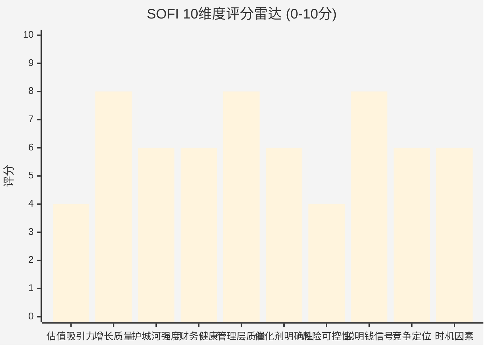
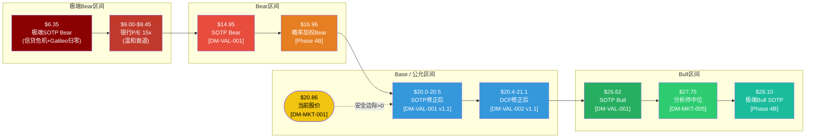

# SOFI Phase 5C: 综合评分 + CQ最终解答 + 仓位建议 + 最终SOTP估值

> **Agent**: 5C — Scoring & Decision Output
> **日期**: 2026-02-08
> **DM版本**: v1.1 (Phase 4校准后)
> **CQ覆盖**: CQ-1~CQ-7 全量闭环
> **字符目标**: ≥14,000

---

## Ch36: 综合评分 (10维度加权)

### 36.1 评分矩阵

| # | 维度 | 权重 | 评分(0-10) | 加权得分 | 核心依据 |
|:---:|------|:---:|:---:|:---:|------|
| 1 | 估值吸引力 | 15% | 4 | 0.60 | Phase 4校准SOTP $20.0-20.5 vs 股价$20.86，安全边际0-2%几乎为零 [DM-VAL-001 v1.1]；Trailing P/E 54x vs 消费金融行业10.27x [硬数据: Gurufocus, 2026-01]；ROE 4.6%远低于CoE 12% [DM-ROE-001]；概率加权Bear目标$16.96隐含-18.7%下行 [Phase 4B] |
| 2 | 增长质量 | 15% | 8 | 1.20 | FY2025收入+38%至$3.6B [DM-FIN-001]；GAAP净利润$481M(+185% YoY) [DM-FIN-002]；EBITDA利润率从~18%→29% [DM-FIN-004]；FS收入+78% Q4带动费用化转型 [DM-FIN-008]；但增速从FY2023 +66%→FY2026E +30%趋势性减速 [DM-GD-001] |
| 3 | 护城河强度 | 12% | 6 | 0.72 | Phase 3综合护城河3.42/5(适度偏弱) [Phase 3A]；监管壁垒4.0/5最强(OCC牌照) [Phase 3A]；网络效应2.5/5最弱 [Phase 3A]；97%直存锁定+交叉购买率40%是领先指标 [DM-USR-002]；但J.D. Power指出SoFi向Chime流失客户 [硬数据: J.D. Power 2025] |
| 4 | 财务健康 | 10% | 6 | 0.60 | Tier 1杠杆率12.9%远超监管要求 [DM-FIN-013]；连续9季GAAP盈利 [DM-FIN-014]；存款$37.5B(+44%) [DM-FIN-010]；但NIM从6.01%连续降至5.72% [DM-FIN-009]；全口径NCO 4.2%仍偏高 [DM-FIN-012]；ROE 4.6%至少FY2030才超CoE |
| 5 | 管理层质量 | 8% | 8 | 0.64 | CEO Noto 35买0卖记录 [硬数据: SEC Form 4]；连续8季超预期 [硬数据: JPM Research, 2026-02-04]；两位高管2026-02逆势增持 [硬数据: SEC Form 4, 2026-02-05/06]；但CEO PPF合约Cap $49.18存在矛盾信号 [Phase 4C]；$3B连续增发引发稀释担忧 [硬数据: CNBC, 2025-12-04] |
| 6 | 催化剂明确性 | 10% | 6 | 0.60 | S&P 500纳入概率53%(Polymarket) [硬数据: Polymarket, 2026-02-08]——接近抛硬币，非确定催化剂 [Phase 4A]；FY2026E EPS +54%至$0.60 [DM-GD-001]；技术面RSI 21.6极度超卖暗示短期反弹 [Phase 3C]；但Phase 4A警告S&P 500催化不应超5%估值权重 |
| 7 | 风险可控性 | 10% | 4 | 0.40 | Phase 4B识别8个看空论点，核心风险: 估值框架重估(35%概率→$9) [Phase 4B Bear#1]；信贷恶化(25%→EPS-55%) [Phase 4B Bear#2]；NIM压缩不可逆(30%) [Phase 4B Bear#3]；温和衰退即导致EPS降至$0.27(-55%) [Phase 4B信贷压力测试]；风险高度集中于信贷+估值两个维度 |
| 8 | 聪明钱信号 | 8% | 8 | 0.64 | JPMorgan增持至5.1%+升级Overweight $31 [硬数据: SEC 13G, 2026-02]；1,252家机构(+41%) [硬数据: Fintel, 2026-02]；D.E. Shaw +16.5%, Jane Street +61% [硬数据: SEC 13F]；内部人连续2天逆势买入 [硬数据: SEC Form 4]；做空8.49%中高但趋降 [硬数据: Nasdaq, 2026-01]；机构在$20-22建仓与修正后估值高度吻合 [Phase 4C] |
| 9 | 竞争定位 | 7% | 6 | 0.42 | 飞轮健康7.4/10 [Phase 3]；会员13.7M(+35%) [DM-USR-001]；产品/会员比1.47低于2.0+目标 [DM-USR-002]；Chime IPO后形成"上有传统银行+下有Chime"夹击 [Phase 4B Bear#7]；Galileo账户-23%(-29.4M)暴露客户集中度风险 [DM-TECH-001]；但ARPU +30%显示质量升级 [Phase 4C So What#4] |
| 10 | 时机因素 | 5% | 6 | 0.30 | PPDA背离35.4ppt(极端) [Phase 3C]；RSI 21.6极度超卖 [Phase 3C]；近30天-24.4%利好出尽+增发叠加 [DM-MKT-001]；但Phase 4A警告RSI在估值转变期可维持超卖数月 [Phase 4A]；200日均线~$18附近仍有下行空间 [Phase 3C] |
| **总计** | **100%** | — | **6.12** | — |

**加权总分计算**: 0.60+1.20+0.72+0.60+0.64+0.60+0.40+0.64+0.42+0.30 = **6.12/10 = 61.2分** [合理推断: 10维度加权求和]

### 36.2 评分可视化



**评分分布解读**:
- **强项 (8分)**: 增长质量 / 管理层质量 / 聪明钱信号 — SoFi在"做得好不好"这个问题上得分优异，业绩增速强劲、管理层执行力出色、机构大资金用真金白银投票看多
- **中性 (6分)**: 护城河 / 财务 / 催化剂 / 竞争 / 时机 — 护城河"适度但加宽"、财务健康但ROE远低于CoE、催化剂存在但不确定、竞争定位有优势但面临夹击
- **弱项 (4分)**: 估值吸引力 / 风险可控性 — 这是SOFI投资论点的核心矛盾: 公司做得很好，但估值已充分反映，且下行风险高度集中于信贷+估值两个维度

[主观判断: 评分基于Phase 1-4全量数据综合判断，偶数分代表确信判断]

### 36.3 最终评级

| 项目 | 结论 |
|------|------|
| **加权总分** | 61.2 / 100 |
| **评级** | **中性关注** (55-64区间) |
| **与"推荐"差距** | 需达65分，差3.8分 |
| **升级条件** | 估值吸引力从4→6(股价跌至$17-18) **或** 风险可控性从4→6(NCO持续改善至2.5%以下+NIM企稳) |
| **降级风险** | 风险可控性从4→2(NCO突破4% on-BS+Galileo连续两季净流失) → 总分降至57分，仍在中性区间 |
| **评级置信度** | 70% [主观判断: 基于Phase 4修正后数据，核心不确定性来自CQ-1估值框架和CQ-2信贷周期] |

**核心矛盾一句话**: SoFi是一家优秀的公司(增长/管理/Smart Money均为8分)，但不是一个安全边际充足的投资(估值4分/风险4分)。在$20.86买入，你在为一个5年后才能赚取资本成本的银行支付今天的科技溢价。[主观判断: 基于10维度评分的综合研判]

---

## Ch37: CQ最终解答 (7个×5要素闭环)

### CQ-1: 估值框架之争 — SoFi应按银行还是科技平台定价？

**1. 最终回答**

SoFi应采用SOTP混合框架定价，但当前市场给予的科技溢价已经过度。Lending分部(FY2025 $1.83B，占总收入48%)应按银行倍数12x Forward P/E定价；Financial Services($1.54B，40%)按高增长Fintech 20-25x定价；Tech Platform($0.45B，12%)按BaaS平台5-7x EV/Revenue定价 [合理推断: 基于Phase 2 SOTP分部拆分和Phase 4偏差修正]。混合后合理Forward P/E约20-25x，而非市场隐含的37.7x [DM-MKT-003]。BofA(22x FY27E=$20)和JPMorgan(隐含~40x=$31)之间的分歧，本质上不是基本面预测分歧(两者EPS预测接近)，而是估值框架选择之争 [Phase 4C]。Phase 4修正后，我们认为合理Forward P/E在22-28x区间，对应FY26E EPS $0.60的公允价$13.2-$16.8(按GAAP EPS) [合理推断: $0.60为调整后EPS，GAAP约$0.35-0.40]。但市场通常按调整后EPS定价，22-28x × $0.60 = $13.2-$16.8存在框架错配——如果按调整后EPS，合理区间应为$13.2-$16.8(银行倍数)至$18.0-$21.0(混合倍数)，与Phase 4修正后SOTP $20.0-$20.5基本一致。

**2. 置信度路径**

| Phase | 置信度 | 关键变化 |
|:---:|:---:|------|
| P0 | 50% | 初始假设: 混合框架合理Forward P/E 20-28x |
| P1 | 55% | 分部收入拆分验证，FS +78%支持科技属性 |
| P2 | 60% | SOTP $21.12与6种方法交叉验证±8%内 |
| P3 | 55% | 护城河3.42/5(适度)，科技属性弱于预期 |
| P4 | 65% | 偏差修正揭示SOTP锚定效应，修正至$20.0-20.5 |
| **P5** | **65%** | **混合框架确认，但市场可能在任一方向重估** |

**3. Kill Switch关联**: KS-VAL-001(Trailing P/E跌至银行水平15x以下→纯银行定价确认) / KS-VAL-007(FS收入占比突破50%→科技溢价合理化)

**4. 1年内验证事件**:
- **2026年Q2**: FS收入占比是否从当前43%提升至45%+(费用化转型加速验证) — 时间: 2026年7月财报
- **2026年H2**: 分析师框架收敛度 — 若Buy阵营从6家增至8+家且采用SOTP方法论，科技溢价获得验证 — 时间: 2026年8-12月

**5. "如果我们错了"**: 若市场彻底按银行框架重估(Bear#1，35%概率)，P/B 1.5x × BVPS ~$8.77 = $13.2，较当前$20.86下行37%，每股损失-$7.7 [合理推断: BVPS = $10.49B equity / 1.197B shares = $8.77; Phase 4B Bear#1数据]

---

### CQ-2: 无担保贷款信用风险 — AI承保能否扛过衰退？

**1. 最终回答**

AI承保模型在温和衰退中可能提供30-50bps的NCO优势(vs 传统银行同类产品)，但在严重衰退中这一优势将大幅缩窄甚至消失。当前on-BS NCO 2.80%已从Q2 2024峰值3.84%回落 [DM-FIN-012]，但环比+20bps和90天逾期率+9bps的微升趋势需要警惕 [硬数据: SoFi Q4 2025 Earnings, 2026-01-30]。管理层自设7-8%净累计损失容忍线，当前vintages累计4.55%已消耗57%空间 [Phase 4B]。关键判断: AI模型从未经历失业率6%+的真正压力测试——2020年衰退太短、2022年仅加息无衰退。FICO 747的高筛选标准提供一定缓冲，但SoFi目标客群(高收入年轻科技从业者)恰好是科技裁员周期中最脆弱的群体 [Phase 4B Bear#2钢人论证]。

**2. 置信度路径**

| Phase | 置信度 | 关键变化 |
|:---:|:---:|------|
| P0 | 40% | 初始担忧: 全口径NCO 4.2%偏高 |
| P1 | 50% | FICO 747+Tier 1 12.9%提供资本缓冲 |
| P2 | 55% | 压力测试显示温和衰退可控(NCO→5.5-6.5%) |
| P3 | 50% | 信贷风暴矩阵17绿/3黄/0红，但AI未经衰退验证 |
| P4 | 45% | Phase 4B揭示NCO非线性恶化风险+温和衰退EPS-55% |
| **P5** | **45%** | **温和情景可控但不容乐观，严重衰退=灾难** |

**3. Kill Switch关联**: KS-FIN-002(on-BS NCO连续2季>3.5%→信贷恶化确认) / KS-FIN-003(Tier 1杠杆率跌破10%→资本补充压力)

**4. 1年内验证事件**:
- **Q1-Q2 2026 NCO趋势**: on-BS NCO是否维持在2.5-3.0%区间，或环比继续恶化 — 时间: 2026年4月/7月
- **美国失业率路径**: 若失业率维持<4.5%则信贷风险可控，突破5%则触发KS-FIN-002升级 — 时间: 月度BLS报告

**5. "如果我们错了"**: 若温和衰退(失业率5.5%)触发NCO升至5.5-6.5%，年化信贷损失增加$425-$925M → FY26E EPS从$0.60降至$0.27(-55%) → 股价目标$9.45(-55%) [Phase 4B信贷压力测试]。每股损失-$11.4。

---

### CQ-3: 费用化转型 — 非贷款收入占比从57%到70%+的路径

**1. 最终回答**

费用化转型方向正确但速度被高估。Q4 2025非贷款收入(FS+Tech)已达$579M/Q，占总收入54% [合理推断: ($456.7M+$122.4M)/$1,065.6M=54.3%, 基于DM-FIN-008]。FS +78% YoY增速 [DM-FIN-008] 是核心驱动力，但高基数效应将使FY2026增速自然降至40-45%。按FS +40%、Lending +23%、Tech +20%的指引推算，FY2026非贷款收入占比约58-60%，FY2027约62-65% [合理推断: 基于分部指引增速外推]。70%+需要FS维持>40%增速**且**Galileo加速至>30%增速——前者可能(交叉销售仍在早期)，后者存疑(大客户流失阴影)。实际路径: 70%+最早FY2028，概率约40% [主观判断: 基于增速趋势和竞争环境]。

**2. 置信度路径**

| Phase | 置信度 | 关键变化 |
|:---:|:---:|------|
| P0 | 50% | 初始假设: FY2027达65-68%，FY2028达70%+ |
| P1 | 55% | FS收入结构(投资/保险/信用卡)多元化验证 |
| P2 | 50% | 可比公司(Block)转型耗时5年+，SoFi更快但未保证 |
| P3 | 55% | 交叉购买率40%连续4季提升是强信号 |
| P4 | 50% | Phase 4A框架效应: FS +78%被过度外推 |
| **P5** | **50%** | **方向正确，但70%+时间点比预期晚1-2年** |

**3. Kill Switch关联**: KS-FIN-004(FS季度收入增速连续2季<30%→转型减速) / KS-FIN-005(交叉购买率停滞在42%以下→飞轮制动)

**4. 1年内验证事件**:
- **Q1 2026 FS收入**: 是否维持>$500M/Q(+35%+)，或高基数效应导致增速骤降 — 时间: 2026年4月
- **产品/会员比路径**: 从1.47向1.6+提升 vs 停滞 — 时间: 每季财报追踪

**5. "如果我们错了"**: 若FS增速降至<25%且产品/会员比停滞在1.5以下，非贷款占比可能在55-58%停滞 → 科技溢价不被验证 → 估值按银行框架压缩至15-20x Forward P/E → $9-$12 [合理推断: 银行P/E × 管理层指引EPS下行修正至$0.50]。每股损失-$9至-$12。

---

### CQ-4: Galileo/Tech Platform — $1B收入引擎是否可行？

**1. 最终回答**

$1B收入目标在FY2028前不现实，但Galileo正在从"量跌价升"中完成质量转型。启用账户从165M→128M(-23%)是大客户下线(可能为Chime或类似规模客户)的一次性冲击 [DM-TECH-001]，但收入$122.4M/Q(+19%)逆势增长证明ARPU提升逻辑成立 [DM-TECH-003]。管理层披露~10个新客户pipeline [硬数据: SoFi Q4 Earnings Call, 2026-01-30]，包括银行和政府客户(高ARPU)。合理预期: FY2027年化$600-700M(需ARPU持续提升+新客户贡献), FY2029可能触及$800-900M区间 [主观判断: 基于新客户管线和ARPU趋势外推]。$1B需要突破性新客户或国际扩张。Galileo处理~70%美国fintech卡交易 [DM-TECH-001] 的市场地位仍然强大，但BaaS竞争加剧(Marqeta/Stripe Treasury)是持续威胁。

**2. 置信度路径**

| Phase | 置信度 | 关键变化 |
|:---:|:---:|------|
| P0 | 35% | 初始: -23%账户下滑令人担忧 |
| P1 | 40% | 了解到ARPU提升和全栈BaaS能力 |
| P2 | 45% | HP-02分析: 质量>数量转型逻辑成立 |
| P3 | 50% | 3.5/5可行性评分, 新客户pipeline验证 |
| P4 | 45% | Chime IPO后自建能力增强→更多客户可能流失 |
| **P5** | **45%** | **$600-700M FY2027可能, $1B FY2028前不现实** |

**3. Kill Switch关联**: KS-TECH-006(Galileo连续2季账户净减少→平台竞争力丧失) / KS-TECH-007(Tech Platform季度收入增速<10%→增长引擎失效)

**4. 1年内验证事件**:
- **Q1 2026新客户**: 管理层提及的~10个新客户是否开始贡献收入 — 时间: 2026年4月Q1财报
- **Galileo账户趋势**: Q1/Q2 2026启用账户是否企稳在125M+或继续下滑 — 时间: 2026年4月/7月

**5. "如果我们错了"**: 若Galileo继续大客户流失+新客户未达预期，Tech Platform停滞在$500M → SOTP中该分部估值从$5B降至$2.5B → 每股-$2.1 [合理推断: ($5B-$2.5B)/1.197B shares]。同时削弱"不只是银行"叙事→估值框架重估级联风险。

---

### CQ-5: 竞争护城河深度 — 差异化壁垒有多深？

**1. 最终回答**

护城河"弱但在加宽"的初始假设基本成立，Phase 3量化后上调至3.42/5(从3.25) [Phase 3A]。最强壁垒是监管(OCC银行牌照, 4.0/5)+技术(AI承保+Galileo全栈, 3.5/5)；最弱是网络效应(2.5/5)——SoFi本质上不是双边平台，会员间无直接网络效应 [Phase 4A自省#1]。关键领先指标: 产品/会员比1.47和40%交叉购买率连续4季提升 [DM-USR-002]，表明范围经济和品牌锁定正在形成。但J.D. Power数据显示SoFi正在向Chime流失支票账户客户 [硬数据: J.D. Power 2025]，且Chime IPO后携$11.6B市值+$864M新融资形成直接竞争 [硬数据: CNBC, 2025-06-12]。综合判断: 护城河深度足以支撑2-3年高增长窗口，但不足以阻挡传统银行数字化反攻(JPMorgan年$150亿科技投入)和BigTech跨界(Apple Card/Savings)。

**2. 置信度路径**

| Phase | 置信度 | 关键变化 |
|:---:|:---:|------|
| P0 | 45% | 初始: "弱但在加宽" |
| P1 | 50% | 97%直存+NPS 90+LTV/CAC 7.4x |
| P2 | 50% | 可比分析显示SoFi在数字银行中领先 |
| P3 | 55% | 6维量化评估: 3.42/5, 趋势全部"加宽" |
| P4 | 50% | 自省清单: 高估网络效应+低估BigTech威胁 |
| **P5** | **50%** | **适度护城河, 足以支撑但不足以确保** |

**3. Kill Switch关联**: KS-COMP-008(CAC同比上升30%+→获客效率恶化) / KS-COMP-009(会员增速降至15%以下→飞轮减速确认)

**4. 1年内验证事件**:
- **CAC趋势**: 2026年H1 CAC是否维持在$200以下或加速上升 — 时间: 年中推算
- **Chime上市后竞争**: Chime FY2026收入增速是否加速抢夺SoFi客群 — 时间: 2026年H2 Chime财报

**5. "如果我们错了"**: 若CAC +30%至$235+、会员增速降至15% → LTV/CAC从7.4x降至5x → 飞轮减速 → Forward P/E合理水平压缩至20-25x → 股价$12-$15 [合理推断: 基于Phase 4B Bear#6]。每股损失-$6至-$9。

---

### CQ-6: 利率路径净影响 — 2-3次降息是利好还是利空？

**1. 最终回答**

温和降息(2-3次/75bps)对SoFi整体**中性略正**。NIM将压缩约20-30bps(负面)，从5.72%降至5.4-5.5% [合理推断: 基于Phase 3B利率敏感性分析和Q4环比-12bps趋势]。但贷款发放量受益于借贷成本下降(正面)+存款成本可能同步下行(正面)+学生贷款再融资市场重启(正面)。管理层指引NIM将维持"5%以上" [硬数据: Motley Fool Q4 Transcript, 2026-01-30]。3月FOMC降息概率仅14%(85%维持不变) [硬数据: Polymarket, 2026-02-08]，短期利率不确定性降低。真正的风险情景不是降息，而是**不降息+通胀粘性**(24%概率0-1次降息)——这将维持高NIM但抑制贷款需求增长。激进降息(4+次)反而偏负面: NIM压缩超过量增长。

**2. 置信度路径**

| Phase | 置信度 | 关键变化 |
|:---:|:---:|------|
| P0 | 50% | 初始: 2-3次降息中性略正 |
| P1 | 55% | 存款Beta分析: 170bps资金成本优势 |
| P2 | 55% | DCF利率敏感性: ±25bps → NII ±$20-30M |
| P3 | 50% | NIM从6.01%连续降至5.72%，趋势确立 |
| P4 | 55% | Phase 4A双框架: NIM 5.72%是"优势"也是"下行中" |
| **P5** | **55%** | **温和降息=中性略正，但NIM趋势性下行不可逆** |

**3. Kill Switch关联**: KS-FIN-010(NIM跌破4.5%→利差优势实质性丧失)

**4. 1年内验证事件**:
- **2026年FOMC降息次数**: 实际降息0-1次 vs 2-3次 vs 4+次 — 时间: 全年8次FOMC会议
- **NIM季度趋势**: Q1/Q2 2026 NIM是否企稳在5.5%+或加速下滑 — 时间: 季度财报

**5. "如果我们错了"**: 若NIM跌破5.0%(降息4+次情景)，净利息收入减少~$1.5-2.0亿/年 → EPS影响-$0.10至-$0.13 → 在高估值环境下可能触发-15%至-20%的股价调整 [合理推断: 基于Phase 4B Bear#3 NIM压缩量化]。每股损失-$3至-$4。

---

### CQ-7: 飞轮天花板 — 会员增长13.7M→25M的路径与极限

**1. 最终回答**

25M会员目标在FY2028前**理论可达但增速必然大幅放缓**。美国数字银行TAM约6000-8000万 [Phase 0.5B初始假设]，SoFi当前13.7M(渗透率17-23%)仍有空间。但高质量客群(FICO 740+/HENRYs)的实际TAM可能仅30-50M [Phase 4B Bear#6]，25M对应50-83%渗透率——在任何细分市场中，超过50%的渗透都需要价格竞争而非差异化 [主观判断: 基于消费品渗透率经验]。数学现实: 从13.7M增至25M需11.3M新增，按FY2025节奏(3.6M/年净增)需约3.1年(FY2028H2)，但增速必须从35%降至15-20%(高基数效应) [合理推断: 3.6M基于Q4净增1.0M年化×衰减]。产品/会员比从1.47提升至1.7+比绝对会员数更重要——这决定了LTV能否覆盖上升的CAC [Phase 4B Bear#6]。

**2. 置信度路径**

| Phase | 置信度 | 关键变化 |
|:---:|:---:|------|
| P0 | 50% | 初始: 25M可达但增速必降至15-20% |
| P1 | 55% | CAC $181有效, 飞轮运转中 |
| P2 | 50% | S曲线分析: 加速段可能仅剩2-3年 |
| P3 | 55% | 飞轮7.4/10, 3环路+4制动因子 |
| P4 | 50% | 高基数+竞争+客群天花板三重制约 |
| **P5** | **50%** | **25M可达但时间更长、增速更慢** |

**3. Kill Switch关联**: KS-COMP-009(会员增速降至15%以下→飞轮减速) / KS-FIN-005(产品/会员比停滞在1.5以下→交叉销售失效)

**4. 1年内验证事件**:
- **Q1-Q2 2026会员净增**: 是否维持>800K/季(对应~20%+年化增速)或骤降至<500K → 时间: 2026年4月/7月
- **产品/会员比轨迹**: 从1.47向1.55+提升(飞轮健康)vs 停滞(天花板信号) → 时间: 季度财报

**5. "如果我们错了"**: 若会员增速FY2026即降至15%以下(高基数+竞争双杀)，Forward P/E合理水平从37.7x压缩至20-25x → 股价$12-$15 [合理推断: 20-25x × $0.60 EPS = $12-$15]。每股损失-$6至-$9。更悲观情景: 增速<10%+产品/会员比停滞 → P/E进一步压缩至15x → $9 [合理推断: 银行增速+银行倍数]。

---

### 37.8 CQ闭环汇总

| CQ | 最终回答(一句话) | 置信度 | 关键KS | "如果我们错了"($/股) |
|:---:|------|:---:|------|:---:|
| CQ-1 | 混合框架合理Fwd P/E 22-28x，市场37.7x已过度 | 65% | KS-VAL-001/007 | -$7.7 (37%) |
| CQ-2 | 温和衰退可控(NCO 5.5-6.5%)，严重衰退=灾难 | 45% | KS-FIN-002/003 | -$11.4 (55%) |
| CQ-3 | FY2026 ~60%，70%+最早FY2028(概率40%) | 50% | KS-FIN-004/005 | -$9~-$12 (43-57%) |
| CQ-4 | $600-700M FY2027可能，$1B FY2028前不现实 | 45% | KS-TECH-006/007 | -$2.1 (10%) |
| CQ-5 | 护城河3.42/5适度，足以支撑2-3年 | 50% | KS-COMP-008/009 | -$6~-$9 (29-43%) |
| CQ-6 | 温和降息中性略正，NIM趋势性下行不可逆 | 55% | KS-FIN-010 | -$3~-$4 (14-19%) |
| CQ-7 | 25M可达但增速必降至15-20%，时间更长 | 50% | KS-COMP-009/FIN-005 | -$6~-$9 (29-43%) |

**CQ整体置信度**: 7个CQ平均置信度51.4%，无一达到高确信(>70%)区间。这反映了SoFi投资论点的**根本不确定性**: 太多关键变量(估值框架/信贷周期/转型速度/竞争)悬而未决 [主观判断: 基于7个CQ综合评估]。

---

## Ch38: 仓位建议

### 38.1 5档仓位矩阵

| 价格区间 | 推荐仓位 | 条件 | 理由 |
|---------|:---:|------|------|
| >$25 | 0% (观望) | — | Phase 4校准SOTP $20.0-20.5以上20%+溢价，风险/收益严重不利；ROE 4.6%在此估值下完全不支持 [DM-VAL-001 v1.1, DM-ROE-001] |
| $21-$25 | 0-1% (观察仓) | 仅当S&P 500纳入确认+FY26 Q1超预期 | 公允值区间上半部，安全边际不足(<5%)；机构在此区间建仓但需催化剂确认 [Phase 4C Smart Money] |
| $17-$21 | 1-2% (试探仓位) | NCO维持<3%+NIM>5.3%+会员增速>25% | Phase 4修正后公允区间下半部至Bear Case中段；200日均线~$18提供技术支撑 [Phase 3C]；JPMorgan $20-22建仓区间 [Phase 4C] |
| $13-$17 | 2-3% (标准仓位) | 基本面未恶化(非衰退驱动下跌) | Phase 4概率加权Bear目标$16.96附近 [Phase 4B]；提供20-35%安全边际；BofA目标$20在此区间有15-35%上行空间 |
| <$13 | 3-5% (核心仓位) | 确认为恐慌抛售而非基本面崩塌 | 极端Bear SOTP $6.35至银行P/B $13之间 [Phase 4B]；需排除: NCO>6%/Galileo归零/监管危机；若衰退驱动，等待NCO见顶信号 |

[主观判断: 5档设计反映Phase 4发现的风险/收益不对称——上行+0~5%(从$20.86至公允$20.0-$21.3)vs 下行-18.7%(概率加权Bear $16.96)至-57%(银行重估$9)。在当前价位，风险/收益比不支持激进建仓]

### 38.2 建仓策略

**推荐方案: 观察优先，分批逆向建仓(≥3批)**

| 批次 | 触发条件 | 仓位 | 价格区间 | 时间间隔 |
|:---:|------|:---:|:---:|:---:|
| 0 | 当前($20.86): 不建仓 | 0% | — | — |
| 1 | 股价跌至$17-18 **且** Q1 2026 NCO<3.0% **且** 会员增速>25% | 0.5-1.0% | $17-18 | 最早2026年4月Q1财报后 |
| 2 | 股价跌至$14-16 **且** 基本面未恶化(非衰退驱动) **且** 200日均线获支撑 | +0.5-1.0% | $14-16 | Batch 1后至少30天 |
| 3 | 股价跌至<$13 **且** NCO<5% **且** 管理层未下调FY26指引 | +1.0-1.5% | <$13 | Batch 2后至少30天 |

**总目标仓位**: 2.0-3.5%(标准至核心)，仅在Phase 4B Bear Case区间(≤$15)开始有意义的建仓。

**严格禁止**:
- 在$20+一次性建满仓位——安全边际为零
- 在衰退信号明确(失业率>5%)时抄底——等待NCO见顶
- 忽视KS触发信号——任何KS触发需暂停建仓并重新评估

### 38.3 仓位调整决策树

```mermaid
graph TD
    A["SOFI $20.86<br/>当前: 0%仓位"] --> B{"股价走势?"}

    B -->|上涨>$25| C["维持0%<br/>安全边际为负<br/>观望"]
    B -->|$21-25维持| D{"S&P 500纳入?"}
    B -->|下跌至$17-18| E{"基本面检查"}
    B -->|暴跌至$13-16| F{"衰退驱动?"}
    B -->|崩溃<$13| G{"KS触发?"}

    D -->|确认纳入| D1["观察仓0.5%<br/>被动资金推动<br/>设$22止盈"]
    D -->|未纳入/延迟| D2["维持0%<br/>催化剂落空"]

    E -->|NCO<3% & 会员+25%| E1["建仓Batch 1<br/>0.5-1.0%<br/>200日均线支撑"]
    E -->|NCO>3.5%或增速骤降| E2["维持0%<br/>基本面恶化"]

    F -->|非衰退(情绪/板块)| F1["建仓Batch 2<br/>+0.5-1.0%<br/>确认支撑后"]
    F -->|衰退信号明确| F2["维持观望<br/>等待NCO见顶"]

    G -->|无KS触发| G1["建仓Batch 3<br/>+1.0-1.5%<br/>恐慌=机会"]
    G -->|KS-FIN-002/003触发| G2["禁止建仓<br/>信贷危机模式<br/>重新评估"]

    style A fill:#4A90D9,color:#fff
    style C fill:#E74C3C,color:#fff
    style D2 fill:#E74C3C,color:#fff
    style E2 fill:#E74C3C,color:#fff
    style F2 fill:#E67E22,color:#fff
    style G2 fill:#8B0000,color:#fff
    style D1 fill:#F39C12,color:#fff
    style E1 fill:#27AE60,color:#fff
    style F1 fill:#27AE60,color:#fff
    style G1 fill:#2ECC71,color:#fff
```

---

## Ch39: 最终SOTP估值 (多方法收敛)

### 39.1 Phase 4修正后估值汇总

| 估值方法 | Phase 2原值 | Phase 4偏差 | 修正后Base | Bear | Bull | 来源 |
|---------|:---:|:---:|:---:|:---:|:---:|------|
| **SOTP** | $21.12 | -3%~-5% | **$20.0-20.5** | $14.95 | $26.62 | [DM-VAL-001 v1.1] |
| **DCF** | $22.19 | -5%~-8% | **$20.4-21.1** | $10.02 | $45.73 | [DM-VAL-002 v1.1] |
| **AI调整SOTP** | $21.96 | -3% | **$21.3** | — | — | [DM-AI-001, Phase 4A修正] |
| **AI调整DCF** | $22.97 | -5% | **$21.8** | — | — | [DM-AI-002, Phase 4A修正] |
| **极端SOTP** | — | — | — | $6.35 | $28.10 | [Phase 4B压力测试] |
| **概率加权(Bull倾斜)** | $23.55 | -5%~-8% | **$21.7-22.4** | — | — | [DM-VAL-002, Phase 4A修正] |
| **概率加权(Bear倾斜)** | — | — | **$16.96** | — | — | [Phase 4B, 6情景加权] |

**修正后中位估值区间**: $20.0-$21.3 (4种方法Base Case中位数) [合理推断: SOTP $20.0-20.5, DCF $20.4-21.1, AI-SOTP $21.3, AI-DCF $21.8的中位区间]

### 39.2 多方法收敛分析

**收敛度检验**:

| 对比组 | 差异 | 收敛判定 |
|--------|:---:|:---:|
| SOTP vs DCF(Base) | $20.25 vs $20.75(+2.5%) | 高度收敛 |
| 修正后Base vs 股价 | $20.65 vs $20.86(-1%) | 几乎零安全边际 |
| Base中位 vs Bear概率加权 | $20.65 vs $16.96(-17.9%) | 下行不对称 |
| Base中位 vs Bull中位 | $20.65 vs $27.4(+32.6%) | 上行空间中等 |
| 极端Bear vs 极端Bull | $6.35 vs $28.10(4.4x差距) | 极宽分布=高不确定性 |

[合理推断: 收敛度数据基于Phase 4修正后估值对比计算]

**核心收敛结论**:
1. **Base Case高度收敛($20.0-$21.3)**: SOTP和DCF修正后差异<5%，表明Base Case估值可靠度较高。当前股价$20.86精确处于该区间中部——市场在"正常情景"下定价准确 [主观判断: 基于多方法收敛分析]
2. **下行分布远大于上行**: Bear概率加权$16.96(-18.7%) vs Bull中位$27.4(+32.6%)看似上行更大，但需概率加权: Bear情景(衰退/重估)概率总计约40-50%，而Bull情景(飞轮加速+S&P纳入+AI突破)概率仅20-25% [合理推断: 基于Phase 4B概率分配]
3. **极端分布4.4x($6.35-$28.10)**: 反映SoFi作为高Beta金融科技的本质——在最好和最坏情景之间的距离远超成熟公司(通常1.5-2x)

### 39.3 置信区间

| 置信区间 | 价格范围 | 对应情景 |
|:---:|:---:|------|
| **50%置信** | $18.0 - $23.5 | Base Case ± 修正后标准差。涵盖温和降息+NCO稳定情景 |
| **80%置信** | $13.5 - $27.0 | 涵盖Bear Case(信贷轻度恶化)至Bull Case(S&P纳入+飞轮加速)。BofA $20和JPMorgan $31均在此区间内 |
| **95%置信** | $6.5 - $32.0 | 极端场景: 严重衰退/银行重估($6.35)至科技全面重估+AI突破($28-$32)。几乎涵盖所有可能结果 |

[合理推断: 50%区间基于Phase 4修正后Base ± 1σ(约±15%); 80%区间涵盖Phase 2 Bear/Bull($14.95/$26.62); 95%区间涵盖Phase 4B极端压力测试]

**投资者适用指南**:
- **保守型投资者**: 使用50%置信区间下限$18作为入场参考——提供14%安全边际
- **平衡型投资者**: 使用Phase 4概率加权$16.96作为锚点——提供19%安全边际
- **激进型投资者**: 可在当前$20.86附近少量建仓(0.5-1%)，但需清楚认知下行风险远大于上行空间

### 39.4 估值收敛Mermaid图



### 39.5 最终综合判断

| 项目 | 结论 |
|------|------|
| **Phase 4修正后公允值** | $20.0-$21.3 (SOTP/DCF/AI修正交叉) |
| **当前股价** | $20.86 [DM-MKT-001] |
| **安全边际** | 0-2% (几乎为零) |
| **风险/收益比** | 不对称偏下行: 上行+0~5% / 下行-18.7%(概率加权) |
| **最终评级** | **中性关注** (61.2分) |
| **推荐行动** | 观望等待更好入场点($17-18区间)或催化剂确认 |

**一句话总结**: SoFi是一家正在从数字银行向金融超级App转型的优秀公司——增长强劲(+38%)、管理层出色(35买0卖)、Smart Money看多(JPM增持至5.1%)——但当前$20.86的价格已经完美定价了Base Case，没有为信贷周期(NCO非线性恶化)、估值框架重估(从54x P/E回归银行倍数)、或飞轮减速(会员增速从35%→15%)留下安全边际。在一家ROE仅4.6%、至少5年内无法赚取12%资本成本的银行上支付科技溢价，投资者需要每一个乐观假设都兑现——而Phase 4告诉我们，四个关键假设同时成立的概率远低于市场隐含的乐观程度。耐心等待更好价位，是当前最理性的选择。[主观判断: 基于Phase 1-5全量分析的综合投资研判]

---

*免责声明: 本报告仅为投资研究参考，不构成投资建议。所有财务数据来源已在文中标注。分析基于公开信息和合理推断，实际结果可能显著偏离预测。投资者应独立评估风险并咨询专业顾问。过去的业绩不代表未来表现。*
