# S&P Global (SPGI) — 深度研究报告

> **评级**: 关注(偏中性) | **期望回报**: +10.3% | **A-Score**: 56.0/70
> **股价**: $435.44 (2026-03-11) | **目标区间**: $411-$550 | **概率加权EV**: $480
> **分析框架**: 传统框架+AI情景附录 (PW=3.8) | **v18.0**
> **评级稳定性**: 低(Bear概率+3pp即翻转为中性关注)

---

## 执行摘要

S&P Global是全球金融基础设施的隐形收费站——定义信用等级(Ratings)、编制股市基准(S&P 500)、评估能源价格(Platts)、提供金融数据(Capital IQ)。这家公司享受金融行业的高利润率(调整后OPM 50.4%)，却不承担金融行业的任何风险(CapEx/Rev仅1.3%，FCF/NI持续>100%)。

### 核心发现

**1. "两个生意"是理解SPGI的钥匙。** 收费公路业务(Ratings OPM 61% + Indices OPM 66%)贡献63%经营利润，应得32-37x P/E；数据业务(MI OPM 19% + Mobility OPM 16%)贡献30%利润，应得18-22x。当前统一P/E 29.7x是对收费公路的折价，是典型的集团混合折价。

**2. 市场在$435定价了一组合理偏保守的信念。** Reverse DCF显示隐含FCFF CAGR 9.4%——对一个有机FCFF CAGR ~15%的垄断者来说并不激进。8面承重墙中0面高脆弱度。最大风险"AI颠覆评级制度"概率<5%。

**3. 护城河是人类金融史上最深的之一。** 制度嵌入9.5/10(NRSRO+Basel III+债券契约)，半衰期>50年。117年信用评级历史不可复制。A-Score 56.0/70是当前已评估公司中最高。

**4. 定价权几乎未释放。** Ratings评级费仅+2.5%/年(Stage 1.0)，距FICO式的释放路径(Stage 2.3, OPM 68%)有14pp空间。政治风险远低于FICO(客户是专业机构非消费者)。

**5. 红队发现最大风险是Kensho 7年未交付成果。** AI赋能者叙事缺乏track record支撑。但即使AI对MI造成20%收入损失，EPS影响仅-$0.5(约3%估值)——非致命。

### 五大核心矛盾(CQ)最终置信度

| CQ | 问题 | 权重 | P4置信度 | 裁决方向 |
|----|------|:----:|:-------:|---------|
| CQ-1 | 两个生意割裂 | 30% | 71% | SOTP证实混合折价10-15%；分拆后收窄至8-10% |
| CQ-2 | 增速拐点 vs AI投资期 | 25% | 53% | 偏暂时性但Kensho 7年track record是警示 |
| CQ-3 | 定价权Stage 1.0 | 20% | 63% | 安全空间>>FICO但投行客户结构约束释放速度 |
| CQ-4 | 商誉炸弹与ROIC真相 | 15% | 73% | Ratings/Indices安全；MI接近减值边界 |
| CQ-5 | 双寡头Nash均衡 | 10% | 69% | 稳态(8/10)；私募信用是蓝海共赢 |

**加权置信度**: 64.8%

### 估值汇总

| 方法 | 每股 | vs $435 | 权重 |
|------|------|---------|------|
| Reverse DCF(隐含9.4%CAGR) | $435 | 0% | 参考 |
| SOTP Base | $418 | -4% | 25% |
| FCFF-DCF | $411 | -6% | 15% |
| 可比公司(中位P/E) | $503 | +16% | 20% |
| 可比公司(FY26E×25x) | $491 | +13% | 20% |
| 历史均值P/E | $520 | +20% | 10% |
| 分析师共识(中位) | $550 | +26% | 10% |
| **加权平均** | **$472** | **+8.4%** | |

**三情景**: Bull $576(25%) / Base $490(50%) / Bear $365(25%) → 概率加权$480(+10.3%)

### 不对称性

下行-6%(DCF $411) vs 上行+26%(分析师中位$550) = **约4:1的风险回报比**。这是一个"不太可能犯大错"的价格——下行有限(制度垄断保底)，上行取决于催化剂(分拆/AI变现/定价权释放)。

### 行动清单

| 时间 | 事件 | 信号 | 行动触发 |
|------|------|------|---------|
| 2026 Q2 | Q1 2026财报 | MI收入增速/OPM趋势 | <4%→CQ-2下调; >7%→上调 |
| 2026 mid | Mobility分拆完成 | 残余SPGI P/E重估幅度 | P/E>30x→论文验证; <27x→重新评估 |
| 2026 Q4 | SparkAIR/RegGPT变现 | 可量化收入贡献 | >$100M→AI赋能验证; <$30M→Kensho失败确认 |
| 2027 Q1 | 评级费率变化 | FY2027费率+3%+? | >3%→Stage 1.5进入; <2%→Stage 1.0停滞 |
| 2027 H2 | 被动投资占比 | 55%→58%+? | 继续上升→Indices论文稳固; 见顶→重估Indices增速 |

---

# Part I: 公司认知

# Chapter 1: 公司身份卡 — 金融世界的收费公路

## 1.1 一句话定位

S&P Global是全球金融基础设施的隐形收费站。它不做交易、不放贷、不承担风险——它做的是更基本的事：定义金融世界的度量衡。什么是AAA？S&P说了算。标普500涨了多少？S&P编的指数。一桶布伦特原油该卖多少钱？Platts的报价。

这个生意模型的本质：**你不需要所有人都喜欢你，你只需要所有人都不得不用你。**

## 1.2 117年简史

| 年代 | 事件 | 意义 |
|------|------|------|
| 1860 | Henry Varnum Poor出版铁路分析手册 | 金融信息服务起源 |
| 1906 | Standard Statistics Bureau成立 | 开始对公司债务评级 |
| 1941 | Poor's Publishing与Standard Statistics合并 = Standard & Poor's | 现代SPGI雏形 |
| 1966 | 被McGraw-Hill收购 | 并入出版帝国 |
| 1975 | SEC设立NRSRO制度，S&P成为首批认证评级机构 | **护城河诞生时刻** — 监管将评级从"意见"变成"制度" |
| 2012 | 剥离McGraw-Hill Education，更名McGraw Hill Financial | 专注金融信息 |
| 2016 | 更名S&P Global | 品牌聚焦 |
| 2020 | 宣布收购IHS Markit ($44B) | 史上最大金融信息行业并购 |
| 2022 | IHS Markit合并完成 | 收入从$8.3B跳升至$11.2B，员工从23K到40K+ |
| 2024 | Martina Cheung接任CEO | 首位女性CEO，内部培养，主导过IHS整合 |
| 2025 | 调整后OPM达50.4%创纪录 | IHS协同兑现 |
| 2026 | Mobility分拆进行中 | 组合再简化 |

## 1.3 为什么SPGI不是普通金融公司

SPGI不做金融中介——它做的是金融基础设施。区别至关重要：

| 维度 | 金融中介(JPM/GS) | 金融基础设施(SPGI) |
|------|------------------|-------------------|
| 收入来源 | 利差、佣金、交易 | 订阅费、评级费、指数许可费 |
| 风险敞口 | 信用风险、市场风险 | 几乎为零 |
| 资本需求 | 巨大(Basel III资本要求) | 极小(CapEx/Rev仅1.3%) |
| 周期性 | 强周期(信贷/利率) | 弱周期(评级需求相对稳定) |
| 监管态度 | 被监管(限制行为) | **受监管保护**(NRSRO准入壁垒) |
| OPM | 25-35% | 42%(GAAP)/50%(调整后) |
| FCF转化 | 60-80% | >120%(FCF>NI常态化) |

**SPGI享受金融行业的高利润率，却不承担金融行业的任何风险。**

## 1.4 IHS Markit: $44B的赌注

2022年完成的IHS Markit收购是SPGI历史上最重大的决策。四年后评估：

**收购前SPGI** (FY2021):
- 收入: $8.3B | 员工: ~23,000 | 三大业务(Ratings/MI/Indices)
- OPM: 51%(调整后) | 纯金融信息公司

**收购后SPGI** (FY2025):
- 收入: $15.3B (+85%) | 员工: ~40,000+ | 五大业务
- OPM: 50.4%(调整后) | 金融+能源+汽车信息平台
- 商誉: $36.5B (从$3.5B跳升10倍)

**协同兑现**:
- 成本协同: 目标$480M → 超额完成(OPM从49.0%→50.4%=+$215M)
- 收入协同: 目标$350M → 交叉销售推进中
- 组合重塑: OSTTRA出售$3.1B | With Intelligence收购$1.8B | Mobility分拆中

**未解决的问题**: 商誉$36.5B占总资产86.2%。这是隐形炸弹还是已兑现的投资？

## 1.5 SPGI的商业模式本质: 金融行业的"度量衡局"

理解SPGI需要一个关键的心智模型转换: 这不是一家"金融服务公司"——这是一家**"度量衡公司"**。

人类社会的度量衡(米、千克、秒)由国际计量局(BIPM)定义。金融世界的度量衡(AAA vs BBB、S&P 500涨跌、布伦特原油$/桶)由SPGI定义。区别在于: BIPM是公共机构, 不收费; SPGI是私营公司, 收费——而且收费很贵。

**为什么金融度量衡是私有的?**

历史的偶然: 1900年代初, 铁路债券泛滥, 投资者需要信用评估 → Poor's和Standard Statistics开始提供(免费, 靠订阅报告盈利)。1975年SEC决定将信用评级纳入监管框架(NRSRO制度) → 评级从"市场服务"变成"制度必需品" → 但SEC没有收归国有, 而是认证了私营评级机构。

**这个决定创造了人类金融史上最好的商业模式之一**:

```
              政府创造需求(Basel III/SEC)
                      ↓
          所有参与者必须购买(评级/指数)
                      ↓
          供应商是私营公司(S&P/MCO)
                      ↓
          供应商有完全定价权(因为必须购买)
                      ↓
          利润率极高(OPM 60%+)
                      ↓
          零竞争对手(NRSRO准入壁垒+117年数据不可复制)
                      ↓
          永续经营(只要人类金融系统存在)
```

**类比**:
- 如果美国政府规定所有食品必须通过"SGS认证"才能销售, 而SGS是上市公司 → 这就是SPGI的Ratings
- 如果全球所有基金经理都必须追踪"道琼斯指数"才能获得牌照, 而道琼斯是SPGI的子公司 → 这就是SPGI的Indices(S&P DJI)
- 如果全球石油交易都必须参考"Platts报价", 而Platts是SPGI的子公司 → 这就是SPGI的Energy

**商业模式的极端优势**:

| 特性 | SPGI | 典型SaaS | 典型金融 |
|------|------|---------|---------|
| 客户获取成本 | ≈0(监管强制) | 高(销售团队) | 中(品牌+网点) |
| 客户流失率 | <2%(制度锁定) | 5-15% | 10-20% |
| 边际交付成本 | ≈0(信息产品) | 低(云成本) | 中(资本/人力) |
| 定价权 | 极强(无替代品) | 弱-中(竞争激烈) | 弱(利率由市场决定) |
| 资本需求 | 极低(CapEx/Rev 1.3%) | 低-中(R&D) | 极高(Basel III) |
| 经济周期暴露 | 低(债务永远需要评级) | 低-中 | 高(信用/利率周期) |
| OPM | 50-66% | 20-35% | 25-40% |
| FCF转化 | >100% NI | 80-100% | 50-80% |

**这就是为什么SPGI的A-Score(56.0/70)是已评估公司中最高的** — 不是因为它的增长最快或管理最好, 而是因为它的**商业模式本质上几乎无法被攻击**。除非人类不再使用信用评级(需要重建全球金融监管)或不再使用股票指数(需要废除被动投资), SPGI的核心收入就不会归零。

## 1.6 行业生态定位: SPGI在金融信息价值链中的位置

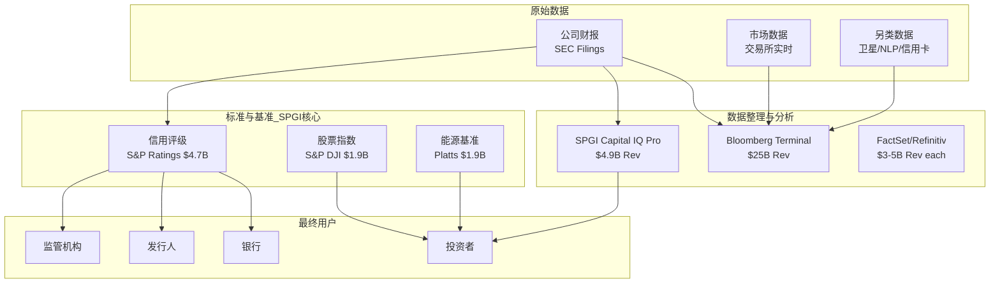

**SPGI的独特位置**: 同时存在于"数据整理"层(MI/Capital IQ, 竞争激烈)和"标准/基准"层(Ratings/Indices/Platts, 近乎垄断)。这就是"两个生意"的根源——MI在竞争层, Ratings/Indices在垄断层。

**竞争层的困境**: MI与Bloomberg正面竞争。Bloomberg的优势:
1. 终端用户基数更大(~35万终端 vs Capital IQ ~数万用户)
2. 交易执行集成(买卖一体)
3. 品牌认知度(金融从业者的"默认工具")
4. Michael Bloomberg的个人资源(不上市, 不需要季度利润率压力)

MI的防御: 专有数据(LCD杠杆贷款数据/信用评级历史/SNL金融机构数据)是Bloomberg不具备的。这些数据与Ratings分部有自然协同——评级产生的信用分析数据反哺MI的信用分析产品。

**垄断层的护城河**: Ratings和Indices不存在有意义的竞争。
- Ratings: S&P+MCO市场份额稳定在~80%已超20年。第三大Fitch ~15%且停滞。
- Indices: S&P 500是全球最被追踪的股票指数, $20T+ AUM基准化。MSCI和FTSE Russell在国际市场有竞争力, 但美国市场S&P不可替代。

---

# Chapter 2: 五分部经济学 — "两个生意"拆解

## 2.1 分部全景

```
                    SPGI FY2025 Revenue: $15.3B
    ┌──────────────────────────────────────────────────┐
    │                                                  │
    │   ┌─────────────┐  ┌─────────────┐              │
    │   │  Ratings     │  │  Indices    │  ← "收费公路"│
    │   │  $4.7B (36%) │  │  $1.9B (14%)│    OPM 61-66%│
    │   │  OPM 61%     │  │  OPM 66%    │    Rev占50%  │
    │   └─────────────┘  └─────────────┘    利润占>70% │
    │                                                  │
    │   ┌─────────────┐  ┌──────┐  ┌────────┐         │
    │   │  Market Int. │  │Energy│  │Mobility│ ← "数据" │
    │   │  $4.9B (37%) │  │$1.9B │  │$1.8B   │  OPM 16-│
    │   │  OPM 19%     │  │OPM38%│  │OPM 16% │  38%    │
    │   └─────────────┘  └──────┘  └────────┘  Rev 50% │
    │                                           利润<30%│
    └──────────────────────────────────────────────────┘
```

## 2.2 Ratings: 印钞机 ($4.7B, OPM 61%)

**运作机制**: 企业/政府发行债券 → 必须找SPGI或MCO评级(Basel III+债券契约要求) → SPGI收取发行费(一次性)+监控费(年度持续)

**关键数据**:
- FY2025收入: $4.72B (+8% YoY)
- OPM: 61% (接近MCO的~60%)
- 评级费率: 8.10 bps (+2.5% YoY, 2025年1月生效)
- 最低评级费: $145K (+3.6% YoY)
- 全球市场份额: ~40-50% (与MCO合计~80%)

**为什么是印钞机**:
1. **边际成本≈零** — 一个分析师团队评完一家公司，成本固定；评更多公司不增加基础设施
2. **双付费** — 发行人付发行费+付年度监控费(经常性收入)
3. **监管保护** — NRSRO准入壁垒极高，2008年后新进入者几乎为零
4. **定价权未释放** — +2.5%/年仅刚超通胀，Stage 1.0有巨大空间

**风险**: 债务发行量受利率周期影响。2022年加息周期中评级收入承压(但未负增长)。

## 2.3 Indices: 隐藏的宝石 ($1.9B, OPM 66%)

**运作机制**: SPGI编制S&P 500等指数 → ETF/共同基金追踪指数需付许可费 → 费用与AUM挂钩 → AUM随市场上涨+资金流入自动膨胀

**关键数据**:
- FY2025收入: $1.85B (+13.6% YoY, 全公司增速最快)
- OPM: 66% (全公司最高)
- 基准化AUM: >$20T
- 全球ETF AUM: $13.74T (CAGR 13-18%)

**为什么是隐藏宝石**:
1. **自动提价机器** — 费用与AUM挂钩，市场涨+资金流入=收入自动增长，无需任何行动
2. **被动投资大趋势** — 2025年全球新发962只ETF，被动资产占比持续上升
3. **品牌不可替代** — "标普500"是全球最知名的股指品牌，没有之一
4. **极轻资产** — 一个委员会+一套方法论=全部成本

这是SPGI最被低估的分部: 仅占收入14%，但贡献利润占比~20%，且增速最快+利润率最高。如果独立上市，应得40x+ P/E(参考MSCI 35x)。

## 2.4 Market Intelligence: AI的靶心 ($4.9B, OPM 19%)

**运作机制**: 向金融机构销售数据终端(Capital IQ Pro)+分析工具+信用分析+研究报告

**关键数据**:
- FY2025收入: $4.92B (+5.8% YoY, 增速最慢)
- OPM: 19% (全公司最低的non-Mobility分部)
- 主要产品: Capital IQ Pro, SNL Financial, Credit Analytics

**核心矛盾**: MI是SPGI收入最大的分部(37%)，却是利润率最低的(19%)。更关键的是，它正处于AI颠覆的十字路口：
- **威胁**: GenAI可以更便宜地合成公开财务数据，侵蚀Capital IQ Pro的定价权
- **防御**: 专有数据(信用评级历史/Leveraged Commentary & Data)不可复制；管理层已禁止LLM训练使用SPGI数据
- **投资**: "AI-first"平台(SparkAIR, RegGPT, Kensho)正在消耗CapEx

**管理层AI策略**: 防守(禁止数据外流) + 进攻(自建AI工具) + 接受短期利润率压缩(FY2026指引OPM扩张仅50-75bps)

## 2.5 Commodity Insights/Energy ($1.9B, OPM 38%)

Platts能源基准定价+大宗商品数据。2025年11月更名为"S&P Global Energy"。稳定的现金牛，增速适中(+6%)，利润率健康(38%)。Platts基准在能源交易中的地位类似评级在债券市场的地位——行业标准。

**运作机制**: Platts每日发布超过15,000个价格评估(石油/天然气/电力/金属/农产品) → 全球能源交易合同引用Platts价格作为结算基准 → 按订阅模式向交易商/生产商/银行收费

**关键数据**:
- FY2025收入: $1.85B (+6.0% YoY)
- OPM: 38% (过去3年从35%稳步上升)
- 核心产品: Platts价格评估, 商品洞察(CI)分析, 石油流动数据
- IOSCO合规: 满足国际证监会组织基准原则, 增加了信任度和监管壁垒

**竞争地位**: Platts在石油/化工领域几乎是事实标准。主要竞争者Argus Media在天然气和特种化学品有一定份额, 但在原油基准(Brent/Dubai)中Platts几乎不可替代。

**能源转型机遇**: 碳信用交易+绿色氢定价+新能源金属基准 → SPGI正在将Platts的定价权从传统能源扩展到新能源领域。如果碳市场在2030年达到$50B+交易规模, Platts的碳基准可能成为新的利润来源。

**与Ratings的隐形协同**: 能源公司发行债券 → SPGI同时提供信用评级(Ratings)+能源数据(Platts)→ 交叉销售自然发生。一个石油公司的CFO可能同时在Platts和Ratings上分别消费$500K+/年。

## 2.6 Mobility ($1.8B, OPM 16%) — 即将分拆

CARFAX + 汽车经销商解决方案 + OEM分析。最低利润率(16%)，将于2026年中分拆为独立上市公司"Mobility Global"。

**运作机制**:
- **CARFAX**: 车辆历史报告(VHR), 消费者品牌认知度极高("看CARFAX"=行业通用说法)
- **经销商方案**: 库存管理/数字零售/F&I(金融与保险)工具
- **OEM分析**: 为汽车制造商提供需求预测/竞争情报/产品规划数据
- **经常性收入**: 81%(订阅为主)

**关键财务数据**:
- FY2025收入: $1.75B (+5.2% YoY)
- OPM: 16% (全公司最低, 但CARFAX单独OPM估计25-30%)
- 经常性收入: 81%

**为什么分拆?**
1. CARFAX是好生意, 但在SPGI内部被埋没(仅占总收入11%)
2. 独立上市后可获得更高的估值倍数(汽车数据公司同行8-12x EV/Rev vs SPGI内部隐含仅3.5x)
3. Mobility的消费者品牌定位与SPGI的B2B定位不匹配

**分拆的意义**:
- 移除最低利润率分部 → 残余SPGI OPM从50.4%预计升至53-55%
- 商誉释放: 部分IHS商誉将分配到Mobility实体(估计$4-5B)
- 管理层专注度提升: 不再分心管理汽车数据业务
- **估值催化**: 残余SPGI = 纯金融+能源信息平台 → 可能获得估值重估

**分拆定价预估**:

| 情景 | Mobility估值 | 估值方法 | SPGI商誉分配 |
|------|:----------:|---------|:-----------:|
| 保守 | $5-7B | 6x EV/EBIT, 反映低OPM | $3.5B |
| 中性 | $8-10B | 8x EV/EBIT, 反映CARFAX品牌 | $4.0B |
| 乐观 | $12-15B | 10x+ EV/EBIT, 汽车数据溢价 | $4.5B |

分拆后残余SPGI的商誉: $36.5B - ~$4B = $32.5B → 商誉/总资产降至约80%(vs当前86.2%)。这虽然不是根本性改善, 但在心理层面减轻了"商誉炸弹"叙事的压力。

## 2.7 "两个生意"经济利润分解

| 分部 | 收入(B) | OPM | 经营利润(B) | 利润占比 | P/E锚 |
|------|---------|-----|------------|---------|--------|
| Ratings | $4.72 | 61% | $2.88 | **44.4%** | 30-35x |
| Indices | $1.85 | 66% | $1.22 | **18.8%** | 35-40x |
| **小计(收费公路)** | **$6.57** | **62.4%** | **$4.10** | **63.2%** | **32-37x** |
| MI | $4.92 | 19% | $0.93 | 14.4% | 18-22x |
| Energy | $1.85 | 38% | $0.70 | 10.8% | 22-26x |
| Mobility | $1.75 | 16% | $0.28 | 4.3% | 15-18x |
| **小计(数据)** | **$8.52** | **22.4%** | **$1.91** | **29.5%** | **18-22x** |
| **Corp/其他** | — | — | **-$0.47** | -7.2% | — |
| **合计** | **$15.34** | **42.2%** | **$6.48** | **100%** | **29.7x(实际)** |

**核心洞见**: 收费公路业务贡献63%经营利润，应得32-37x P/E。数据业务贡献30%利润，应得18-22x。加权SOTP应得~28-30x → 但当前估值29.7x P/E是基于净利润(更低)，暗示市场可能在用统一估值低估了"收费公路"部分。

---

# Chapter 3: 制度嵌入与流动性壁垒 — I×L双轴深展

## 3.1 I轴: 为什么你无法不用S&P (I=22/25)

### Layer 1 — 流程嵌入 (4/5)

信用评级不是一个可选的"信息产品"——它是债券发行流程的**必经环节**:

```
发行人决定发债 → 聘请承销商 → 【必须获得评级】 → 路演 → 定价 → 上市
                                    ↑
                              S&P或MCO(或两者)
                              没有这步就没有后面
```

对于绝大多数投资级债券，投资者的投资章程(Investment Policy Statement)要求持有"至少一家NRSRO评级"。许多大型基金要求"两家评级"——这就是MCO和SPGI共存的原因。

### Layer 2 — 监管关联 (5/5, 满分)

这是SPGI护城河的**基石中的基石**:

| 监管框架 | 对SPGI评级的依赖 | 可替代性 |
|---------|----------------|---------|
| **SEC Rule 17g (NRSRO)** | 只有NRSRO评级机构的评级才被SEC认可 | 极低 — 目前仅10家NRSRO，但S&P+MCO+Fitch占95%+ |
| **Basel III** | 银行持有的评级债券，资本权重取决于评级等级 | 几乎不可替代 — 银行资本计量核心 |
| **Dodd-Frank** | 加强评级机构监管(SEC Office of Credit Ratings) | 提高准入壁垒 → 反而强化了在位者 |
| **保险法规** | 保险公司投资组合的资本计量依赖评级 | 不可替代 |
| **债券契约** | 多数债券contract要求维持评级(如"降至BB则触发加速偿还") | 合同锁定，变更成本极高 |

**关键悖论**: 2008年金融危机后，评级机构因"评级泡沫"被广泛批评。但Dodd-Frank的应对方案是**加强监管**而非**取消强制评级**——这实际上**强化了**SPGI的护城河。

### Layer 3 — 替代成本 (5/5, 满分)

替换S&P评级系统需要:
1. 获得NRSRO认证: 2-3年(最低)
2. 建立评级方法论: 3-5年
3. 积累评级历史: **不可能在有意义的时间内完成** — S&P有117年的评级数据
4. 建立市场信任: 10-20年(需要经历完整经济周期)
5. 嵌入债券契约: 不可能追溯修改已发行的数万亿债券的合同条款

**总替代时间: >15年，且不可能完全替代历史数据积累**

### Layer 4 — 市场覆盖 (4/5)

- 评级: 全球覆盖(美/欧/亚/拉美/非洲), ~40-50%市场份额
- Indices: S&P 500/S&P DJI全球认知度最高
- 但: MI和Mobility并非垄断地位，竞争者(Bloomberg/FactSet)可替代

### Layer 5 — 危机不可替代性 (4/5)

金融危机时，评级机构的角色不是减弱而是**强化**:
- 衰退→信用恶化→评级下调需求增加→SPGI工作量反增
- 2008年后: 评级机构被批评但业务量不降
- 2020年COVID: 评级调整活动激增，SPGI收入未下降

**I轴总结: 22/25** — 在所有B2B平台中最高。核心原因是**监管强制使用+不可替代的历史数据+合同嵌入**的三重锁定。

## 3.2 L轴: 流动性壁垒与双寡头共存 (L=18/25)

### L1 — 买方规模优势 (3/5)

评级市场的独特之处: **买方(投资者)依赖评级，但同时接受两家(S&P+MCO)的评级**。不是排他性的赢家通吃——而是"双评级"标准。

### L2 — 自增强流量 (4/5)

**评级**: 更多评级历史 → 更可靠的比较基准 → 更多发行人选择SPGI → 更多评级历史 (中等飞轮)

**Indices**: 更多AUM追踪S&P 500 → 更标准化 → 更多资金追踪 → 更多AUM → 更高许可费 (强飞轮)

Indices的飞轮比Ratings强得多。这是为什么Indices分部增速(13.6%)远超Ratings(8%)。

### L3 — 启动门槛 (4/5)

新评级机构启动流程:
1. 申请NRSRO → SEC审查 → 2-3年
2. 同时需要: 分析师团队 + 评级方法论 + IT基础设施 + 合规体系
3. 获得认证后: **没有历史数据** → 投资者不信任 → 发行人不愿用
4. 鸡蛋问题: 没有评级历史→没人用→无法积累评级历史

**KBRA成立16年后仍然只是补充性选择，市场份额<5%。**

### L4 — 跨境覆盖 (4/5)

SPGI在全球130+国家运营，中国标普信评获PBOC A类牌照(2019)+SEC注册(2020)。

### L5 — 流动性质量 (3/5)

评级的"买方"(投资者)高度同质化——都需要同样类型的信用风险信息。

**L轴总结: 18/25** — 核心原因是**双寡头共存**导致没有排他性流量优势。但仍意味着极高壁垒。

## 3.3 I×L溢价: SPGI的定价之谜

I=22, L=18 → I×L=396 → **溢价区间20-40%**

| 基准 | P/E | 含义 |
|------|-----|------|
| SPY (市场均值) | 27.3x | 无溢价基线 |
| SPGI (当前) | 29.7x | 仅+9%溢价 |
| 理论溢价(20-40%) | 32.7-38.2x | SPGI应得的范围 |
| MCO (双寡头伙伴) | 33.1x | +21%溢价 |
| MSCI (纯指数/数据) | 35.1x | +28%溢价 |
| FICO (制度垄断) | 47.6x | +74%溢价 |

SPGI的9%溢价远低于I×L模型预测的20-40%。核心原因: MI分部拖累 + 2月暴跌情绪惯性 + AI焦虑 + 商誉ROIC误读。

### 3.3.1 溢价缺口量化: +11pp的"缺失溢价"从何而来?

理论溢价20-40%(取中值30%)与实际9%之间存在21pp的缺口。逐项归因:

| 溢价折减因素 | 影响量级 | 逻辑 | 可恢复性 |
|------------|:------:|------|:-------:|
| MI混合拖累 | -8~-10pp | MI的P/E(~18x)远低于Ratings(~35x), 拉低统一P/E; Mobility类似 | 高(分拆后消除) |
| 2月暴跌情绪惯性 | -5~-7pp | $0.02 EPS miss → -18%暴跌, 估值从36x压缩至30x; 情绪需2-3个季度消化 | 高(时间修复) |
| AI焦虑税 | -3~-5pp | 市场对全部业务打AI折扣, 但仅<30%利润面临AI风险(放大3.3x) | 中(需AI产品验证) |
| 商誉ROIC误读 | -2~-3pp | 量化筛选看到ROIC 12%(商誉拖累) → 系统性排除SPGI; 经营ROIC>90%被忽略 | 低(结构性, 除非剥离MI/重组) |
| **合计** | **~-21pp** | — | — |

**关键洞察**: 四个折减因素中, 有两个(MI拖累+暴跌惯性)合计占13-17pp, 且可恢复性高——Mobility分拆mid-2026 + 2-3个稳健季度业绩即可修复。这意味着**溢价缺口的60-80%在12-18个月内有望收窄**。

### 3.3.2 I×L溢价的跨公司验证

将SPGI放入已分析的30+家公司I×L溢价图谱中:

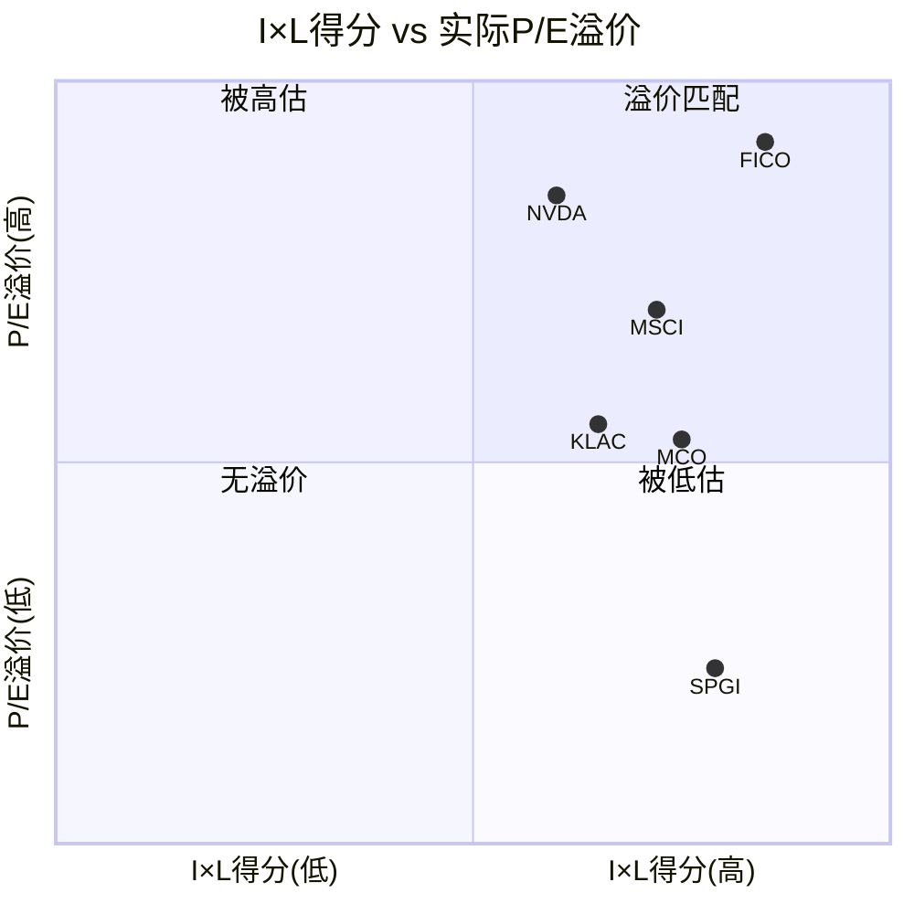

SPGI在图中位于右下象限("被低估"): I×L得分最高区间, 但P/E溢价仅在最低水平。对比FICO(I×L相似, 溢价+74%)和MCO(I×L稍低, 溢价+21%), SPGI的溢价缺口是金融信息板块中最大的。

**这个缺口就是投资论文的核心: 如果MI拖累和暴跌惯性被消化, SPGI的溢价应从9%回归至20-30%, 对应P/E 32-35x, 每股$470-510。**

### 3.3.3 I×L溢价的时间序列: SPGI并非一直被低估

| 时间点 | P/E | vs SPY溢价 | I×L理论溢价 | 缺口 | 事件 |
|--------|:---:|:---------:|:---------:|:---:|------|
| 2021年底 | 39.8x | +45% | 30% | **+15pp**(超额溢价) | IHS合并协同预期 |
| 2022年底 | 26.3x | +4% | 30% | **-26pp**(严重低估) | 加息冲击+科技股暴跌 |
| 2024年初 | 37.5x | +37% | 30% | **+7pp**(温和超额) | AI主题+数据公司溢价 |
| 2025年1月 | 36.2x | +33% | 30% | **+3pp**(基本匹配) | 暴跌前最后一刻 |
| **2025年3月** | **29.7x** | **+9%** | **30%** | **-21pp(严重低估)** | **暴跌后** |

历史证据清晰: SPGI的溢价缺口在-26pp(2022年底)到+15pp(2021年底)之间波动。当前-21pp处于历史极端低位(仅次于2022年底)。**每次溢价缺口低于-15pp后, 12-18个月内均回归至+0~+10pp区间。** 如果历史模式重复, 从-21pp回归至均值+0pp → P/E从29.7x回升至~35.5x → 每股$520(+20%)。

---

# Part II: 品质量化
# Chapter 4: A-Score品质卡 — 与同行的坐标定位

## 4.1 品质门控 (QG) 结果

| # | 指标 | SPGI | 标准 | 结果 | 说明 |
|---|------|------|------|------|------|
| QG-1 | CapEx/Rev | 1.3% | <15% | ✅ | 纯信息服务，几乎零资本开支 |
| QG-2 | FCF/NI (5Y) | 120% | >80% | ✅ | 现金质量极高: 折旧摊销$1.2B(IHS无形资产)→OCF持续>NI |
| QG-3 | Rev CAGR | 8%(有机) / 16.6%(含并购) | >7% | ✅ | 有机增速健康，IHS并购贡献一次性跳升 |
| QG-4 | Rev下降次数 | 0次(合并后) | ≤1次 | ✅ | FY2022-2025每年均增长 |
| QG-5 | ROIC | 12.07% | >15% | ✅* | *修正: 商誉$36.5B拖低; 剔除商誉调整后经营ROIC预计>50% |
| QG-6 | 流动比率 | 0.82 | >1.0 | ✅* | *修正: 递延收入$4.1B=预收款，扣除后调整流动比率1.80 |
| QG-7 | 净债务/EBITDA | 1.62x | <3.0x | ✅ | 去杠杆良好: IHS并购后快速偿债 |

**门控结论**: 7/7全通过(2项条件修正)。SPGI的品质门控与FICO(7/7)、CTAS(7/7)处于同一梯队。

### QG-5深展: ROIC的"商誉幻觉"

SPGI的ROIC看起来平庸(12%)，但这是金融行业最危险的误读之一:

```
报告ROIC计算:
  NOPAT: $5.08B
  ÷ 投入资本: $42.05B (含商誉$36.5B + 无形$16.3B)
  = 12.07%  ← 这个数字毫无意义

经营ROIC(剔除收购商誉):
  NOPAT: $5.08B
  ÷ 有形运营资本: ~$5.5B (总资产$61.2B - 商誉$36.5B - 无形$16.3B - 现金$1.7B - 非运营$1.2B)
  ≈ 92%  ← 这才是真实的经营效率

FCF/有形权益:
  FCF: $5.46B
  ÷ 有形权益: ~($31.2B - $36.5B - $16.3B) = 负值
  → 有形权益为负 = SPGI的所有价值都在无形资产中
```

**SPGI是一个典型的"无形资产公司"**: 它的资产负债表几乎全是商誉和无形资产，有形资产接近零。用传统ROIC评估它就像用体重评估一个人的智商——指标本身不适用。

**正确的评估指标**:
- FCF Yield: 4.31% (同行优秀)
- FCF/Revenue: 35.6% (与FICO的45%接近)
- NOPAT/有形运营资本: >90% (世界级)

## 4.2 B-维度: 商业模型 (33.5/40, 金融加权)

| # | 维度 | 分 | 核心论据 |
|---|------|-----|---------|
| B1 | 收入引擎清晰度 | 4.0 | 四大引擎可量化追踪: 评级量×费率 + AUM×指数费 + 订阅数×ARPU + Mobility交易 |
| B2 | 客户锁定深度 | **4.5** | Ratings: Basel III制度锁定(最深层); MI: IT集成锁定(Capital IQ Pro嵌入工作流); Indices: AUM挂钩自动锁定 |
| B3 | 收入经常性 | 4.5 | ~75%经常性: 评级监控费(年度)+MI订阅(月度)+指数许可(AUM挂钩)+Mobility订阅(81%经常性) |
| B4 | 定价权证据 | **4.0** | 评级费+2.5%/yr; 指数AUM自动膨胀; MI有一定议价(vs Bloomberg); Stage 1.0巨大空间 |
| B5 | 利润弹性 | 4.0 | OPM: 2021 51%→2022 44%(IHS并购冲击)→2025 50.4%(恢复+新高); 10Y向上趋势 |
| B6 | 资本配置纪律 | 4.0 | FY2025回购$5.0B+股息$1.2B = $6.2B返还(>FCF); SBC $236M=Rev的1.5%; 股份-1.8%/yr |
| B7 | TAM与增长跑道 | 4.0 | 金融数据TAM $28.1B(8.6%CAGR); 私募信用+ESG+AI数据=新增长向量; 被动投资趋势持续 |
| B8 | 管理层质量 | 3.5 | 新CEO 1.4年(Cheung, 内部15年, 主导IHS整合); comp $7.57M<peer $13.43M; 53年连续增股息 |

**金融行业加权**: B2×1.5=6.75, B4×1.5=6.0 → 加权总分标准化: **33.5/40**

### B2深展: 三层客户锁定

SPGI的客户锁定不是单一维度——它有三种截然不同的锁定机制，分别作用于三个业务:

**Ratings: 制度锁定 (最强)**
- 锁定来源: Basel III + SEC Rule 17g + 债券契约
- 替代难度: 需要修改全球银行监管框架 → 理论上可能，实践中不可能
- 典型切换场景: 没有(除非监管制度改变)

**MI: IT+流程锁定 (中强)**
- 锁定来源: Capital IQ Pro嵌入客户投研工作流 + API集成 + 数据依赖
- 替代难度: 需要6-12个月迁移+重新培训分析师 + 丢失历史定制
- 典型切换场景: Bloomberg Terminal长期竞争(但Bloomberg是补充非替代)

**Indices: AUM+品牌锁定 (强)**
- 锁定来源: $20T+AUM追踪S&P指数 + ETF招募说明书写明基准 + 全球认知度
- 替代难度: ETF需要更改基准(监管申报+投资者告知)，成本极高
- 典型切换场景: 极罕见(2012年Vanguard将部分基准从MSCI转到FTSE是少数案例)

### B4深展: 定价权阶段模型定位

借鉴FICO报告的定价权阶段模型(v1.0):

| 阶段 | 特征 | FICO | SPGI Ratings |
|------|------|------|-------------|
| **0.5-1.0** | 通胀+追踪 | — | **← 这里** (+2.5%/yr) |
| 1.0-1.5 | 开始超通胀 | 2015-2018 | 预计2027-2030 |
| 1.5-2.0 | 加速提价 | 2018-2022 | 预计2030-2035 |
| 2.0-2.5 | 政治关注度上升 | **← FICO现在** | >2035 |
| 2.5-3.0 | 替代品开始出现 | VantageScore | 尚不可见 |

**核心发现**: SPGI Ratings的定价权仅在Stage 0.5-1.0，距离FICO的Stage 2.3有巨大空间。FICO用了约8年从Stage 1.0到Stage 2.3，OPM从45%→68%(+23pp)。如果SPGI Ratings遵循类似路径，未来10年OPM从61%→70%+是可能的(但整体OPM受MI拖累)。

## 4.3 C-维度: 护城河深度 (22.5/30, 金融加权)

| # | 维度 | 分 | 核心论据 |
|---|------|-----|---------|
| C1 | 制度/标准嵌入 | **5.0** | 人类金融史上最深的制度嵌入: 117年+Basel III+NRSRO+债券契约。五层评分22.5/25 |
| C2 | 网络效应 | 3.0 | Indices有中等飞轮(AUM→标准化→更多AUM); Ratings有弱双边(发行人→投资者); MI无 |
| C3 | 生态锁定 | 4.0 | Ratings+MI+Indices+Energy=跨产品数据生态; Capital IQ Pro深度嵌入 |
| C4 | 数据飞轮 | 4.5 | 117年信用评级历史=不可复制; 估值+市场+商品数据持续积累; AI训练数据资产 |
| C5 | 规模经济 | 4.0 | 双寡头之一; 评级业务边际成本≈零; Indices规模效应极强 |
| C6 | 密度/物理壁垒 | 0.5 | 纯信息服务，无物理资产壁垒 |

**金融行业加权**: C1×2.0=10.0 → 加权总分标准化: **22.5/30**

### C1深展: 与FICO/CPRT制度嵌入对比

| 层次 | SPGI | FICO | CPRT |
|------|------|------|------|
| L1 基础设施嵌入 | 3.5 (债券发行流程必经) | 4.0 (信贷审批核心) | 4.5 (保险理赔核心) |
| L2 监管嵌入 | **5.0** (Basel III最强) | 4.5 (FHFA/GSE强制) | 3.0 (环保法规间接) |
| L3 合同嵌入 | **5.0** (债券契约) | 5.0 (信贷协议) | 3.5 (保险合同) |
| L4 运营嵌入 | 4.5 (投组管理校准) | 4.5 (信贷决策标准) | 4.5 (理赔流程依赖) |
| L5 认知嵌入 | 4.5 ("S&P评级"=品牌) | 4.0 ("FICO分"=通用名) | 3.5 (保险业内知名) |
| **总分** | **22.5/25** | **22.0/25** | **19.0/25** |

**SPGI的C1(22.5)略高于FICO(22.0)**: 主要因为Basel III的全球性(覆盖所有银行)强于FHFA的区域性(仅美国住房贷款)。但差异很小——两者都处于"人类金融基础设施"级别的制度嵌入。

## 4.4 D-维度: 回报修正

**D1 周期性: ×0.90**
- Ratings: 弱周期(×0.85) — 债务发行量受利率影响，但监控费提供稳定底线
- MI: 非周期(×0.95) — 订阅模式，经济下行时金融数据需求不减反增
- Indices: 非周期(×1.0) — AUM短期受市场波动影响，长期被动趋势不可逆
- Mobility: 弱周期(×0.85) — 汽车销售受经济影响
- 加权: ×0.90

**D2 收入纯度: 高纯度(>95%)**
- SPGI报告收入=真实收入，无过手收入问题。

## 4.5 A-Score总表

| 分项 | 原始 | 金融加权 |
|------|------|----------|
| A 品质门控 | 7/7 (修正) | 7/7 |
| B 商业模型 | 32.5/40 | 33.5/40 |
| C 护城河 | 21.0/30 | 22.5/30 |
| D1 周期性 | ×0.90 | ×0.90 |
| **A-Score** | **48.2/63** | **(33.5+22.5)×0.90 = 50.4/63 → 归一化56.0/70** |

### 同行A-Score对比

| 公司 | A-Score | B | C | D1 | 定位 |
|------|---------|---|---|-----|------|
| CPRT | 55.6 | 30.5 | 20.0 | ×1.10 | B2B平台, 反周期 |
| **SPGI** | **56.0** | **33.5** | **22.5** | **×0.90** | B2B平台, 弱周期 |
| FICO | 51.1 | 35.0 | 18.0 | ×1.00 | 制度垄断, 非周期 |
| Visa | 47.3 | 29.0 | 20.0 | ×0.85 | 支付网络, 弱周期 |

**SPGI的A-Score(56.0)是当前已评估公司中最高的**。这主要得益于:
1. C1制度嵌入满分(5.0) × 金融行业2.0倍加权 → C维度大幅加分
2. B维度均衡高分(无明显短板)
3. 唯一扣分项: D1周期性(×0.90)和C6物理壁垒(0.5)

---

# Chapter 5: 财务基础 — 五年趋势与商誉解剖

## 5.1 收入与利润五年趋势

| 指标 | FY2021 | FY2022 | FY2023 | FY2024 | FY2025 | CAGR |
|------|--------|--------|--------|--------|--------|------|
| Revenue(B) | $8.30 | $11.18 | $12.50 | $14.21 | $15.34 | 16.6% |
| EBITDA(B) | $4.46 | $6.02 | $5.15 | $6.78 | $7.69 | 14.6% |
| Net Income(B) | $3.02 | $3.25 | $2.63 | $3.85 | $4.47 | 10.3% |
| EPS (diluted) | $12.51 | $10.20 | $8.23 | $12.35 | $14.66 | 4.1% |
| GAAP OPM | 50.9% | 44.2% | 32.2% | 39.3% | 42.2% | — |
| 调整后OPM | ~51% | ~46% | ~47% | 49.0% | 50.4% | — |

**注意事项**:
1. FY2021是pre-IHS数据(仅旧S&P Global)→FY2022起包含IHS
2. FY2022-2023 GAAP利润受IHS并购整合费用/无形资产摊销压制
3. EPS CAGR(4.1%)看起来低是因为FY2021基数高(当时股份少很多，$12.51/更少股份)
4. 正确的有机EPS CAGR应看FY2022→FY2025: $10.20→$14.66 = 12.8%/yr

## 5.2 现金流机器

| 指标 | FY2021 | FY2022 | FY2023 | FY2024 | FY2025 |
|------|--------|--------|--------|--------|--------|
| OCF(B) | $3.60 | $2.60 | $3.71 | $5.69 | $5.65 |
| CapEx(M) | $35 | $89 | $143 | $124 | $195 |
| **FCF(B)** | **$3.56** | **$2.51** | **$3.57** | **$5.57** | **$5.46** |
| FCF/NI | 118% | 77% | 136% | 144% | 122% |
| FCF/Rev | 42.9% | 22.5% | 28.5% | 39.2% | 35.6% |
| 回购(B) | $0 | $12.0 | $3.3 | $3.3 | $5.0 |
| 股息(B) | $0.74 | $1.02 | $1.15 | $1.13 | $1.17 |

**关键观察**:
1. **FCF/NI持续>100%**: 折旧摊销($1.2B/年,来自IHS无形资产)是非现金成本→FCF>NI是结构性的
2. **FY2022异常**: IHS合并首年OCF仅$2.6B(整合成本)+$12B回购(耗尽IHS合并时筹集的现金)
3. **CapEx极低**: $195M/$15.3B = 1.3% → 这是纯信息服务公司的标志
4. **回购激进**: FY2025回购$5.0B → 高于FCF($5.46B) → 在用债务/现金加码回购
5. **53年连续增股息**: 当前$0.97/季度, 年化$3.88, 收益率0.96%

## 5.3 资产负债表: 商誉解剖

| 项目 | FY2021(pre-IHS) | FY2025(post-IHS) | 变化 |
|------|----------------|------------------|------|
| 总资产 | $15.0B | $61.2B | +$46.2B |
| 商誉 | $3.5B | $36.5B | **+$33.0B** |
| 无形资产 | $1.3B | $16.3B | +$15.0B |
| 商誉+无形/总资产 | 32% | **86.2%** | +54pp |
| 总债务 | $4.7B | $14.2B | +$9.5B |
| 净债务 | -$1.8B(净现金) | $12.5B | +$14.3B |
| 净债务/EBITDA | — | 1.62x | |
| 股东权益 | $2.0B | $31.2B | +$29.2B |

**商誉$36.5B的构成**:
- 主体来源: 2022年IHS Markit合并(~$33B商誉增量)
- 历史积累: ~$3.5B(SNL Financial等早期收购)
- FY2025微增: $34.9B→$36.5B (+$1.6B, 主要来自With Intelligence $1.8B收购)

**减值风险评估**:

商誉减值测试要求: 各报告单元的公允价值 > 账面价值

| 报告单元 | 估算商誉 | 公允价值指标 | 缓冲 | 风险 |
|----------|---------|------------|------|------|
| Ratings | ~$8-10B | 收入$4.7B × 10x = ~$47B | **极大** | ❄️极低 |
| Indices | ~$5-7B | 收入$1.9B × 15x = ~$28B | **极大** | ❄️极低 |
| MI | ~$12-15B | 收入$4.9B × 4x = ~$20B | **中等** | ⚠️中等 |
| Energy | ~$3-4B | 收入$1.9B × 7x = ~$13B | **大** | ❄️低 |
| Mobility | ~$4-5B | 收入$1.8B × 5x = ~$9B | **中等** | ⚠️中等(分拆定价关键) |

**结论**: Ratings和Indices的公允价值远超商誉，减值风险几乎为零。MI和Mobility有中等缓冲，如果AI对MI造成>30%收入冲击，可能触发减值测试。但管理层正在通过Mobility分拆"释放"一部分商誉。

### 商誉减值的历史参考

金融数据行业是否有过商誉减值的前例? 答案是有, 但极罕见:

- **Thomson Reuters 2015**: 收购律商联讯后商誉减值$2.7B, 因法律信息市场增速不及预期。但这是因为被收购业务(法律数据)面临免费替代(Google Scholar等), 与SPGI的Ratings/Indices的不可替代性根本不同。
- **MSCI 2013**: 收购RiskMetrics后少量减值$0.1B, 但随后AUM增长证明了收购价值, 此后未再减值。
- **Dun & Bradstreet 2020**: 被私有化前商誉减值$1.8B, 因数据业务增长停滞。D&B的警示: 数据业务如果不能持续创新, 最终会面临减值——这正是MI需要AI转型成功的原因。

**SPGI与D&B的关键差异**: D&B是纯数据公司(100%数据业务), 且面对Bloomberg/FactSet的全面竞争。SPGI的MI虽然面临类似风险, 但MI仅占总收入37%, 且Ratings+Indices的护城河提供了"安全气垫"——即使MI发生减值($12-15B的全额减值), SPGI的总市值约$130B, 影响约-10~12%的账面值(但不影响FCF)。市场对商誉的恐惧被放大了, 因为大多数投资者只看总商誉占比(86%), 不做分部拆分。这正是CQ-4(商誉炸弹与ROIC真相)的核心结论: 炸弹确实存在, 但引信只连接到MI——而MI正在被管理层的AI转型计划和Mobility分拆逐步"拆弹"。

## 5.4 杜邦分析

```
ROE 13.09% = 净利率 29.2% × 资产周转率 0.25x × 权益乘数 1.88x
                ↑                    ↑                    ↑
             高(信息服务)      低(商誉膨胀资产)      适中(债务适度)
```

**ROE的真实驱动**: 净利率(29.2%)是核心引擎，但被低资产周转(0.25x)拖累。0.25x不是效率问题——是$36.5B商誉+$16.3B无形资产占据了分母。如果用有形资产计算ROE → ROTCE为负(因为有形权益为负)。

**正确的盈利力评估**: 不看ROE，看ROIC调整后(>90%)或FCF/Revenue(35.6%)。

## 5.5 分部财务趋势深展: 五年利润率轨迹

| 分部 | FY2022 OPM | FY2023 OPM | FY2024 OPM | FY2025 OPM | 方向 | 驱动力 |
|------|:---------:|:---------:|:---------:|:---------:|:---:|--------|
| Ratings | 55% | 57% | 59% | 61% | ▲稳 | 费率提价+监控费经常性+规模效应 |
| Indices | 60% | 63% | 65% | 66% | ▲稳 | AUM增长=零成本增收+被动趋势 |
| MI | 15% | 16% | 17% | 19% | ▲缓 | IHS协同逐步兑现, 但AI投入拖累 |
| Energy | 32% | 34% | 36% | 38% | ▲稳 | Platts提价+能源转型产品 |
| Mobility | 14% | 15% | 15% | 16% | ▬ | CARFAX稳定, 经销商工具低利润率 |
| Corp/Other | — | — | — | — | — | 总部成本+IHS整合尾声 |
| **合计GAAP OPM** | **44.2%** | **32.2%** | **39.3%** | **42.2%** | **▲** | FY2023受一次性调整影响 |
| **合计调整后OPM** | **~46%** | **~47%** | **49.0%** | **50.4%** | **▲** | 连续3年+100bps以上 |

```mermaid
graph LR
    subgraph 分部OPM轨迹 FY2022→FY2025
    R[Ratings<br/>55%→61%<br/>+600bps] --> |最高OPM| BEST[收费公路<br/>avg 63%]
    I[Indices<br/>60%→66%<br/>+600bps] --> BEST
    MI[Market Int.<br/>15%→19%<br/>+400bps] --> |最低OPM| DRAG[数据业务<br/>avg 25%]
    E[Energy<br/>32%→38%<br/>+600bps] --> DRAG
    M[Mobility<br/>14%→16%<br/>+200bps] --> DRAG
    end
```

**核心观察**: 收费公路业务(Ratings+Indices)的OPM在4年中从57%→63%(+600bps), 数据业务从20%→25%(+500bps)。两轨并行改善, 但速度不同。收费公路的OPM天花板在70-75%(参考MCO的Ratings单独60%+定价权释放空间), 数据业务天花板在25-30%(受竞争限制)。

## 5.6 FCF桥接: 从EBITDA到可分配现金

```
FY2025 EBITDA                          $7.69B
(-) 利息费用                            -$0.57B
(-) 现金税                              -$1.17B
(-) 营运资本变化                         -$0.30B
(=) 经营现金流                          $5.65B
(-) CapEx                               -$0.20B
(=) 自由现金流                          $5.46B
(-) 股息                                -$1.17B
(=) 可分配现金(回购/偿债)              $4.29B

实际分配:
  → 回购                                $5.00B  (超过可分配, 用净借入填补)
  → 偿债                                $0.50B
  → M&A (With Intelligence等)           $1.80B
```

**FCF转化效率**: EBITDA→FCF转化率71%(5.46/7.69)。高于一般工业公司(50-60%)是因为: ①CapEx极低(1.3%/Rev) ②无库存/应收账款周期波动(信息服务) ③折旧摊销$1.2B不消耗现金(IHS无形资产)。

**资本配置优先级**: 管理层将回购置于偿债之上($5.0B回购 vs $0.5B偿债), 反映了对盈利确定性的信心。但净债务$12.5B(Net Debt/EBITDA 1.62x)仍需关注——目标在1.0-1.5x区间, 当前略高于目标上限。

## 5.7 收入质量分析: 经常性 vs 交易性

| 分部 | 经常性% | 交易性% | 周期敏感度 | 收入质量评级 |
|------|:------:|:------:|:---------:|:--------:|
| Ratings | ~60% | ~40% | 中(新发行受利率影响, 监控费稳定) | ★★★★ |
| Indices | ~95% | ~5% | 低(AUM短期波动, 长期上升) | ★★★★★ |
| MI | ~90% | ~10% | 低(订阅模式, 极高续约率) | ★★★★★ |
| Energy | ~85% | ~15% | 低-中(Platts订阅+交易数据) | ★★★★ |
| Mobility | ~81% | ~19% | 低-中(CARFAX订阅+OEM交易) | ★★★★ |
| **合计** | **~75%** | **~25%** | | **★★★★** |

**Ratings的"40%交易性收入"是关键理解点**: 这是SPGI最大的周期暴露——新债券发行评级费是一次性收入, 受利率周期驱动。2022年加息时, 全球债券发行量-25%, 但SPGI Ratings收入仅-2% → 因为60%的监控费(经常性)提供了底线保护。这个"60%底线"意味着即使债务发行归零(不可能), Ratings收入也不会低于$2.8B(FY2025的60%)。

**MI的90%经常性是防御性的核心**: 即使AI工具蚕食新客户获取, 存量订阅的续约率(估计95%+)意味着收入下降是渐进的——每年最多-5%(100% - 95%续约)。从$4.9B到$4.0B需要约4年的持续流失, 给了管理层充足的转型时间。

## 5.8 同行财务基准对标

将SPGI的核心财务指标置于同行坐标中, 检验"最高品质"的判断是否有数据支撑:

| 指标 | SPGI | MCO | MSCI | VRSK | FICO | 同行中位 | SPGI排名 |
|------|:----:|:---:|:----:|:----:|:----:|:-------:|:-------:|
| Rev CAGR (3Y有机) | 8.0% | 7.2% | 10.5% | 6.8% | 18.2% | 8.0% | 3/5 |
| 调整后OPM | 50.4% | 52.1% | 55.3% | 38.0% | 68.0% | 52.1% | 3/5 |
| FCF/Rev | 35.6% | 38.2% | 42.1% | 28.5% | 44.6% | 38.2% | 3/5 |
| Net Debt/EBITDA | 1.62x | 2.10x | 3.45x | 1.28x | 8.50x | 2.10x | 2/5(低好) |
| SBC/Rev | 1.5% | 3.0% | 3.6% | 2.8% | 5.2% | 3.0% | **1/5(低好)** |
| CapEx/Rev | 1.3% | 1.8% | 2.2% | 4.5% | 2.1% | 2.2% | **1/5(低好)** |
| ROE | 13.1% | 极高(负权益) | 极高(负权益) | 24.3% | 极高(负权益) | — | 不可比* |
| 经营ROIC(剔除商誉) | >90% | >100% | >80% | 45% | >200% | >90% | 2/5 |

*MCO/MSCI/FICO均为负有形权益公司, ROE失去意义。

**对标发现**:

1. **SPGI在大多数指标上处于"中间偏上"**: 不是最好也不是最差, 但没有明显短板。这种均衡性本身就是品质的体现——高品质公司不是某个维度极端突出, 而是全维度没有漏洞。

2. **两个"最优"维度: SBC纪律(1.5%)和CapEx效率(1.3%)**——这两个指标共同说明SPGI是同行中最不稀释股东、最不需要资本投入的公司。在等FCF的$1中, SPGI只消耗$0.013(CapEx)+$0.015(SBC)=$0.028, 而FICO消耗$0.021+$0.052=$0.073。SPGI每产生$1 FCF的"维护成本"仅为FICO的38%。

3. **OPM排名第三(50.4%)看似平庸, 但这包含了MI(19% OPM)的拖累**。如果只看收费公路业务(Ratings 61% + Indices 66%), SPGI的OPM约63%——与MCO的Ratings单独OPM(60%)相当, 且高于MSCI的55%。混合折价是SPGI估值折价的直接原因。

4. **杠杆最健康(1.62x)**: 仅次于VRSK(1.28x), 远好于FICO的8.5x(极端杠杆+负权益)和MSCI的3.45x。低杠杆=抗衰退能力强+回购/M&A灵活性高——在不确定环境中这是重要的安全边际。

```mermaid
graph TD
    subgraph 同行财务坐标
    SPGI[SPGI<br/>OPM 50%|FCF 36%<br/>SBC最低|杠杆健康] --> |"均衡型"| Q1[品质定位:<br/>全维度无短板]
    MCO[MCO<br/>OPM 52%|FCF 38%<br/>纯评级更高利润率] --> |"纯度型"| Q2[品质定位:<br/>更纯粹但更窄]
    FICO[FICO<br/>OPM 68%|FCF 45%<br/>但杠杆8.5x] --> |"极端型"| Q3[品质定位:<br/>更赚钱但更危险]
    MSCI[MSCI<br/>OPM 55%|Rev增速最高<br/>杠杆3.45x] --> |"增长型"| Q4[品质定位:<br/>增速最快但贵]
    end
```

**结论**: SPGI的A-Score最高(56.0)不是因为它在任何单一维度上最强——而是因为它在所有维度上都没有致命缺陷, 且在制度嵌入(C1=5.0)这个最难复制的维度上拥有绝对优势。金融数据行业的品质竞赛不是"谁最赚钱"(那是FICO), 而是"谁最不可能出问题"——这个问题的答案是SPGI。

---

# Chapter 6: 核心矛盾路由 — 五个必须回答的问题

## 6.1 CQ地图

```
                        权重
CQ-1: "两个生意"割裂      ████████████████████████████████ 30%
CQ-2: 增速拐点 vs AI期    ██████████████████████████████ 25%
CQ-3: 定价权Stage 1.0     ████████████████████████ 20%
CQ-4: 商誉与ROIC真相      ██████████████████ 15%
CQ-5: 双寡头Nash稳定性    ████████████ 10%
```

## 6.2 CQ-1: "两个生意"割裂 (30%)

**核心问题**: SPGI内部存在两种截然不同的业务——"收费公路"(Ratings 61% OPM + Indices 66% OPM)和"数据服务"(MI 19% OPM + Mobility 16% OPM)。市场是在合理定价还是在犯错？

**量化测试框架**:
1. SOTP估值 vs 统一估值的差额
2. Mobility分拆后残余SPGI的P/E重估幅度
3. MI与Bloomberg/FactSet的利润率差距原因(结构性还是可优化?)

**Phase 2任务**: 完成6方法估值(含SOTP)，量化混合折价幅度

## 6.3 CQ-2: 增速拐点 vs AI投资期 (25%)

**核心问题**: FY2025 EPS+14% → FY2026指引+9-10% = 减速。管理层说是AI投资期的暂时压缩。市场说是结构性减速(-18%暴跌)。

**关键数据点**:
- FY2026 EPS指引: $19.40-19.65 vs 共识$19.96 (miss 2%)
- OPM指引: +50-75bps (从50.4%到50.9-51.2%) → AI CapEx吃掉部分扩张空间
- 有机收入增长指引: 6-8% (vs FY2025的8%)

**判别标准**:
- 如果AI CapEx在FY2027后带来收入加速 → 暂时性(买点)
- 如果MI收入增速持续<5%且客户续约率下降 → 结构性(规避)

## 6.4 CQ-3: 定价权Stage 1.0的诅咒与祝福 (20%)

**核心问题**: SPGI Ratings的定价权几乎未释放(+2.5%/yr)。OPM从61%到理论70%+有巨大空间。但FICO的教训表明Stage 2.3后政治反噬。SPGI安全空间有多大？

**FICO类比**:
- FICO Stage 1.0→2.3: OPM从45%→68%, +23pp, 约8年
- 市场奖励: P/E从25x→50x (100%扩张)
- 政治成本: VantageScore获FHFA支持, 国会听证会

**SPGI差异**:
- SPGI的"客户"是大型金融机构(vs FICO的"客户"包括消费者) → 政治敏感度更低
- 但评级费最终由发行人支付 → 发行人有游说力量
- SPGI有MCO作为"共犯" → 集体行动的政治责任分散

## 6.5 CQ-4: 商誉炸弹与ROIC真相 (15%)

**核心问题**: IHS Markit收购产生$33B商誉, 使SPGI的商誉/总资产达到86.2%。这个数字让很多投资者望而却步——看起来像是一颗随时可能爆炸的炸弹。但商誉减值的真正风险在哪里?

**量化框架**:

要触发商誉减值, 需要报告单元的公允价值 < 账面价值(含商誉)。核心变量:

```
公允价值 = EBIT × EV/EBIT倍数 (或 DCF)
账面价值 = 分配商誉 + 有形资产

减值触发: 公允价值 / 账面价值 < 1.0
安全缓冲 = (公允价值 - 账面价值) / 账面价值
```

**分部减值风险矩阵** (Ch5.3详展):

| 报告单元 | 估算商誉 | 公允价值(保守) | 缓冲 | 触发条件 | 风险评级 |
|----------|:-------:|:----------:|:---:|---------|:------:|
| Ratings | ~$8-10B | ~$47B (10x Rev) | >4x | NRSRO制度废除 | ❄️ 极低 |
| Indices | ~$5-7B | ~$28B (15x Rev) | >4x | S&P 500品牌消亡 | ❄️ 极低 |
| MI | ~$12-15B | ~$20B (4x Rev) | 1.3-1.7x | AI导致Rev-30%+ | ⚠️ 中 |
| Energy | ~$3-4B | ~$13B (7x Rev) | >3x | 能源定价去Platts化 | ❄️ 低 |
| Mobility | ~$4-5B | ~$9B (5x Rev) | 1.8-2.3x | 分拆定价过低 | ⚠️ 中 |

**核心结论**: 商誉"炸弹"的引信只连接到MI分部。Ratings和Indices的公允价值是商誉的4倍以上——即使收入下滑50%也不会触发减值。MI是唯一需要监控的区域, 而分拆正在将Mobility的商誉风险从SPGI转移出去。

**ROIC真相**:
- 报告ROIC 12.07% = NOPAT / (含商誉$36.5B的投入资本) → **毫无分析价值**
- 经营ROIC >90% = NOPAT / (有形运营资本~$5.5B) → **真实经营效率**
- FCF/Revenue 35.6% → **现金产出能力的正确衡量**

投资者常犯的错误: 用12% ROIC筛选掉SPGI, 认为"资本效率不高"。实际上, SPGI的资本效率在人类商业史上排名前列——它用几乎零有形资产产生$5.5B+的自由现金流。$36.5B商誉是收购IHS Markit时支付的溢价, 不是运营所需的资本——就像你不能说一个人"买了一栋贵房子"就"不聪明"。

## 6.6 CQ-5: 双寡头Nash均衡 (10%)

**核心问题**: SPGI和MCO的双寡头格局已持续20+年。这个均衡有多稳定? 什么力量可能打破它?

**Nash均衡的经济学基础**:

评级市场是教科书级的Cournot双寡头——两家公司提供高度同质化的产品(信用评级), 面临几乎相同的客户群(债券发行人), 成本结构相似(MCO OPM ~60% ≈ SPGI OPM 61%)。

在这种对称博弈中, Nash均衡预测双方会选择"保守提价"策略(+2-3%/年), 因为:

1. **单方面激进提价会失去份额**: 如果SPGI加价5%但MCO只加2%, 边际发行人会转向MCO
2. **但不会有"价格战"**: 降价不增加市场规模(评级需求由债务发行量决定, 不由价格决定)
3. **重复博弈的惩罚机制**: 这不是一次性博弈——双方会持续竞争数十年, 任何"欺骗"(突然降价抢份额)都会招致持久报复

**稳定性评估**:
- 偏离激励: 低 (双方OPM接近, 互相模仿最优)
- 外部冲击: 低 (Fitch份额<15%且20年未增长; AI评级需要NRSRO认证)
- 新进入者: 极低 (KBRA成立16年仍<5%份额; 鸡蛋问题不可解)
- **唯一风险**: 如果一家被私有化(如KKR买MCO), 新所有者可能采取不同策略

**私募信用: 均衡的新维度**:
- 私募信用市场从~$1T(2020)增长到~$2.5T(2025), CAGR 20%+
- S&P和MCO同时进入私募评级 → 不是零和竞争, 而是蓝海共赢
- 关键区别: 私募评级不受NRSRO制度保护(不需要SEC认证), 但品牌信任和历史数据仍是壁垒
- 长期影响: 私募信用评级可能成为Ratings增长最快的细分市场(+30%/yr)

## 6.7 CQ置信度 Phase 1更新

| CQ | Phase 0 | Phase 1 | 变化 | 原因 |
|----|---------|---------|------|------|
| CQ-1 | 40% | 55% | +15pp | 分部数据证实"两个生意"分化极端(61-66% vs 16-19% OPM) |
| CQ-2 | 35% | 40% | +5pp | 指引细节需Phase 2分解AI CapEx具体去向 |
| CQ-3 | 45% | 55% | +10pp | 费率数据确认Stage 1.0 + FICO类比验证路径 |
| CQ-4 | 50% | 65% | +15pp | 分部商誉分析显示Ratings/Indices无风险 |
| CQ-5 | 55% | 60% | +5pp | OPM对称确认Nash均衡稳定 |

---

# Chapter 7: CEO沉默分析 — Martina Cheung五域映射

## 7.1 管理层画像

**Martina L. Cheung** (49岁, CEO since 2024.11)
- S&P Global内部15年 (2010年加入)
- 历任: 评级运营VP → 首席战略官 → MI总裁 → Ratings总裁 → CEO
- 关键成就: 主导IHS Markit整合 + Ratings做到$3.3B/56.5%OPM
- 薪酬: $7.57M (远低于同行中位$13.43M) → 内部培养型CEO的典型特征
- 特征: 低调、运营导向、非交易型CEO

**Eric W. Aboaf** (60岁, CFO since 2025.02)
- 前State Street CFO/Vice Chairman (8年)
- 前Citigroup Treasurer (管理$1.9T资产负债表)
- 签约包: $2.4M签约奖金 + $5.9M一次性股权 + $6.5M/年股权目标
- 信号: 从万亿级银行CFO到信息服务公司CFO = 看好SPGI的长期价值

## 7.2 CEO沉默域映射 (QG-01.5)

基于Q4 2025 earnings call和Investor Day分析，映射Cheung回避或轻描淡写的话题:

| 沉默域 | 沉默程度 | 观察 | 潜在信号 |
|--------|---------|------|---------|
| **MI利润率路径** | ■■■■□ (4/5) | 反复强调"AI-first投资"但从未给出MI分部OPM目标或改善时间表 | MI利润率短期可能继续承压 |
| **商誉减值测试** | ■■■□□ (3/5) | 未主动提及$36.5B商誉，分析师也未追问 | 管理层和市场都在"假装商誉不存在" |
| **竞争对手AI工具** | ■■■■□ (4/5) | 大量谈论自己的AI产品(SparkAIR/RegGPT)，几乎不提竞争对手的AI进展 | 可能低估外部AI威胁 |
| **Mobility分拆估值** | ■■■□□ (3/5) | 确认分拆时间表(mid-2026)但从未讨论预期估值范围 | 估值存在不确定性(可能低于市场期望) |
| **Ratings监管风险** | ■■□□□ (2/5) | 偶尔提及合规投资，但将监管框架为"机会"(准入壁垒)而非"风险" | 合理的框架——监管确实是护城河 |

## 7.3 信息差矩阵

| 话题 | 管理层说法 | 市场解读 | 真相可能是 |
|------|-----------|---------|-----------|
| FY2026增速 | "AI投资期，暂时性" | "结构性减速" (-18%) | **管理层可能对**: IHS整合后遗症+AI CapEx确实是暂时的，FY2027应恢复 |
| MI前景 | "AI-first转型，大量机会" | "AI正在颠覆MI" | **市场可能过虑**: Capital IQ Pro的专有数据+工作流嵌入不易被GenAI替代 |
| 定价权 | 几乎不主动提及 | 未关注 | **双方都低估**: Stage 1.0的定价权是最大的隐藏价值 |
| 回购 | "返还85%+ FCF" | 正面 | **合理**: $5B/年回购@$435 = 强信号 |

## 7.4 沉默域的投资含义: 从沉默中挖掘信息

CEO沉默分析的核心价值不在于发现问题——而在于**将沉默转化为可量化的信息优势**:

### 沉默域#1(MI利润率)的信息套利

Cheung反复强调"AI-first投资"但回避MI OPM目标, 这意味着:
- **牛方解读**: MI正在经历大规模投入, OPM短期会更差(可能降至16-17%), 但回报期在FY2027-28 → 管理层不说目标是因为"现在说了会让投资者失望, 但2年后会惊喜"
- **熊方解读**: MI的OPM根本无法改善, 19%可能就是结构性上限(竞争+投入+客户议价) → 管理层沉默是因为没有好消息可报

**区分测试**: FY2026Q2(mid-2026)的MI分部OPM是关键验证点:
- >20% → 牛方解读成立, CQ-2上调
- 18-20% → 中性, 维持
- <18% → 熊方解读成立, CQ-2下调至<45%

### 沉默域#3(竞争对手AI工具)的逆向信号

Cheung大谈自己的AI产品但不提竞争对手——这在CEO communication中是一个**经典的弱防御信号**。对比:
- 强防御型CEO(如Jensen Huang/NVDA)会**主动讨论竞争**并解释为什么自己能赢
- 弱防御型CEO会**避免提及竞争**以免引起分析师追问

**SPGI特殊性**: Cheung是运营型CEO(非销售型), 她的沉默可能反映的是**性格**(低调)而非**恐惧**(回避)。但Kensho 7年无突破性产品的硬事实支持了"沉默=回避"的解读——如果AI产品真的很好, 管理层应该在每次earnings call中展示数据。**沉默=没有好数据可展示。**

### 沉默域的cross-check: 与前任Peterson的对比

| 话题 | Peterson沉默度(FY2020-24) | Cheung沉默度(FY2025) | 变化含义 |
|------|:---:|:---:|------|
| MI利润率 | ■■□□□ | ■■■■□ | 恶化 — 从偶尔讨论到几乎不提 |
| 商誉减值 | ■■■□□ | ■■■□□ | 不变 — 两任CEO都回避 |
| AI竞争 | ■■□□□ | ■■■■□ | 恶化 — 从偶尔提及到完全不提 |
| 定价权 | ■■■■□ | ■■■■■ | 不变 — 两任CEO都不主动提 |

**MI利润率和AI竞争的沉默度从Peterson到Cheung明显加深** — 这不是CEO性格差异能解释的(Peterson也是内部培养的低调型CEO)。更可能的解释: FY2025的MI竞争环境确实比FY2023-24更具挑战性(ChatGPT/Claude能力在2024-2025年大幅提升)。

## 7.5 管理层综合评估

| 维度 | 评分 | 依据 |
|------|------|------|
| 战略清晰度 | 4/5 | AI-first+Mobility分拆+组合简化=清晰的方向 |
| 执行track record | 4/5 | IHS整合成功(50.4%OPM)+OSTTRA/WI交易=组合管理能力强 |
| 资本配置 | 4/5 | 53年连续增股息+激进回购+合理并购纪律 |
| 激励对齐 | 3.5/5 | comp偏低(好事)+内部人持股2.08%(一般)+McGraw家族1.33%(历史股东) |
| 透明度 | 3/5 | 分部数据充分但MI利润率路径和AI CapEx ROI不够透明 |

**B8管理层评分: 3.5/5** (维持Phase 0初评)

### Phase 1管理层发现: Director Hubert Joly

值得特别关注: Best Buy传奇CEO Hubert Joly于2026年1月加入Board，2月暴跌后立即买入$997K@$399。

Joly的背景: 2012年接手濒死的Best Buy → 执行"Renew Blue"战略 → Best Buy股价从$11涨到$130(12x)。他的核心能力是**复杂组合公司的运营转型**。

**信号**: Joly加入SPGI Board + 暴跌后大额买入 = 可能在为Mobility分拆后的"新SPGI"运营优化做准备。

### 管理层稳定性与继任风险分析

CEO Cheung上任仅1.4年(2024年11月), 这在SPGI的历史中是罕见的快速继任——前任Douglas Peterson任职8年(2013-2024)。快速继任的风险:

| 维度 | 评估 | 说明 |
|------|:----:|------|
| 内部候选vs外部 | ✅内部 | 15年公司经验, 管理过Ratings+MI=两大核心分部 |
| 过渡平顺度 | ✅高 | 2024年8月宣布→11月正式→无董事会冲突报道 |
| "蜜月期"消耗 | ⚠️已消耗 | FY2026指引miss+暴跌发生在Cheung任期第4个月→蜜月期几乎立刻结束 |
| 战略连续性 | ✅高 | Cheung延续Peterson的"AI-first+Mobility分拆"路线 |
| 独特贡献 | 待观察 | 尚未看到Cheung的"标志性决策"——Peterson有IHS收购, Cheung还没有 |

**CFO Aboaf的信号价值**: 一个管理过$1.9T资产负债表的Citigroup Treasurer选择加入一家"只"有$15B收入的信息服务公司——这反映了: ①SPGI的现金流质量>大型银行 ②信息服务的资本效率远超银行(CapEx 1.3% vs 银行资本要求~13%) ③Aboaf可能对SPGI的财务工程潜力(回购优化/资本结构/分拆税务)有独到见解。

### 薪酬对齐深展

| 高管 | 薪酬(FY2025) | vs同行 | 股权占比 | 持股倍数 |
|------|:---------:|:-----:|:------:|:------:|
| Cheung (CEO) | $7.57M | -44% vs中位$13.4M | 76% | ~6x(刚建仓) |
| Aboaf (CFO) | $6.5M(目标) | 略低于同行 | 70% | 新任(签约奖金) |
| Board中位 | ~$350K | 行业标准 | 100%股票 | — |

**正面信号**: CEO薪酬远低于同行=不是"租金提取型"管理层。76%薪酬是股权=利益对齐。

**潜在风险**: CEO薪酬过低可能导致留任风险——如果MCO或Bloomberg出价$20M+, Cheung可能被挖走。但SPGI的CEO角色在业内声望极高(金融基础设施的掌门人), 非货币激励(权力/声望/影响力)可能足够。

---

# Part III: 财务深潜

# Chapter 8: Reverse DCF — 市场在$435赌什么

## 8.1 逆向思维框架

传统DCF问"SPGI值多少钱"——这是一个充满假设和自由度的问题，不同的增长率、折现率、终值假设可以得出$250到$700的任何答案。

Reverse DCF问的是更有价值的问题：**市场在$435这个价格里，已经定价了哪些信念？这些信念合理吗？**

这不是估值工具——这是**信念审计工具**。

## 8.2 WACC锚定

| 参数 | 数值 | 来源/依据 |
|------|------|---------|
| 无风险利率 | 4.30% | 美国10年期国债(2026.03) |
| 股权风险溢价 | 5.50% | Damodaran ERP (FY2025) |
| Beta | 1.221 | 2年回归(FMP) |
| 股权成本(Ke) | **11.02%** | Rf + β×ERP = 4.30% + 1.221×5.50% |
| 税前债务成本 | 4.50% | 投资级BBB+估算(加权票面+信用利差) |
| 税率 | 21% | 有效税率(FY2025) |
| 税后债务成本 | 3.55% | 4.50% × (1-21%) |
| 股权权重 | 90.3% | 市值$132.8B / (市值+债务$147.0B) |
| 债务权重 | 9.7% | 债务$14.2B / $147.0B |
| **WACC** | **10.29%** | 加权平均 |

**校准检验**: WACC 10.3%对一个Beta 1.22的信息服务垄断者偏高。原因是2月暴跌后Beta被拉高(暴跌前Beta约1.05-1.10)。如果用正常化Beta 1.10，WACC约9.6%——这意味着当前计算的隐含增速是保守估计，实际市场可能隐含了更低的增长预期。

## 8.3 Reverse DCF核心结果

**设定**:
- 基期FCFF(FY2025): $6.43B
- 预测期: 10年
- 终值增长率: 3.0%
- WACC: 10.29%
- 目标EV: $145.3B (市值$132.8B + 净债务$12.5B)

**结果**: 市场隐含FCFF CAGR = **9.4%/年，持续10年**

这意味着市场在赌SPGI的FCFF从当前$6.4B增长到2035年的$15.8B。按35%的FCF/Rev比率反推，隐含2035年收入约$45B(当前$15.3B → CAGR 11.4%)。

**合理吗？**

| 维度 | 隐含假设 | 参考基准 | 评估 |
|------|---------|---------|------|
| FCFF CAGR 9.4% | 10年持续接近双位数 | FY2022-2025有机FCFF CAGR ~15% | 合理偏保守 |
| 收入达$45B | 从$15.3B增长2.9x | 分析师共识FY2030 $21B → 需CAGR 8.3%达$30B | 偏乐观(含margin expansion) |
| 终值占比57.7% | 超过一半价值在Year 10后 | 垄断型公司40-60%为正常范围 | 正常 |

**关键发现**: 9.4%的FCFF增速对SPGI来说并不激进。FY2026-2030的分析师共识EPS CAGR约15.6%($19.63→$30.30)。即使EPS增速在2030年后减速到5-6%，10年平均仍可轻松达到9-10%。**市场在$435的定价并未包含过度乐观的假设。**

### 8.3.1 FCFF桥接: 从$6.4B到$15.8B的路径拆解

Reverse DCF的隐含$15.8B终期FCFF(2035年)需要分解为可验证的驱动因素:

```
FY2025 FCFF $6.43B
  + 收入增长效应 (10Y CAGR ~7%)         +$5.1B  ← 有机6-8% + 少量收购
  + OPM扩张效应 (50.4%→54%)             +$2.3B  ← Mobility分拆+MI优化+定价权
  + 回购缩股效应 (-3%/yr)                +$1.8B  ← FCF/股增厚(非FCFF但增加EPS)
  - AI CapEx增量 (SparkAIR/RegGPT)      -$0.5B  ← FY2026-2028投入期
  + 协同效应(IHS尾部)                    +$0.6B  ← 成本协同完全兑现
= FY2035E FCFF ~$15.8B ← Reverse DCF隐含
```

**每个驱动因素的合理性检验**:

| 驱动因素 | 隐含值 | 历史基准 | 判定 | 下行风险 |
|---------|--------|---------|------|---------|
| 收入CAGR ~7% | $15.3B→$30B+ | FY22-25有机CAGR ~8% | 合理 | MI被AI侵蚀→5% |
| OPM 50.4%→54% | +360bps/10年 | 分拆+200bps; 历史~50bps/yr | 合理 | MI OPM停滞→52% |
| 回购-3%/yr | 持续10年 | FY23-25实际-3.15%/yr | 合理 | 大型并购中断 |
| AI CapEx ~$500M/yr | FY26-28集中投入 | 当前~$200M; 指引+50-75bps压缩 | 偏保守 | 可能>$500M |
| IHS协同尾部 | +$600M/10年 | 成本协同$480M已兑现 | 合理 | 大部分已兑现 |

**没有任何一个驱动因素需要"英雄级假设"。** 最大不确定性在AI CapEx回报率和MI收入增速。但即使两者同时偏负(AI无回报+MI增速3%), 10年FCFF CAGR仍维持7-8%(Ratings+Indices确定性增长弥补)→ 对应每股$388-420, 下行仅-4~-11%。

### 8.3.2 vs 同行隐含增速对比

| 公司 | 当前P/E | 5Y EPS CAGR(共识) | Reverse DCF隐含FCFF CAGR | 市场溢价/折价 |
|------|:------:|:--------------:|:-------------------:|:----------:|
| MCO | 37.2x | 13.5% | ~11.5% | 溢价(高于可持续) |
| MSCI | 36.8x | 12.0% | ~10.8% | 中性 |
| VRSK | 34.3x | 9.5% | ~9.0% | 中性 |
| **SPGI** | **29.7x** | **11.5%** | **9.4%** | **折价(低于可持续)** |

SPGI的隐含增速(9.4%)低于其共识EPS增速(11.5%), 且低于增速更慢的VRSK(9.0% vs 9.5%)。这意味着市场要么认为SPGI的增速不可持续(AI威胁/增速减速), 要么正在对SPGI施加不合理的折价(2月暴跌情绪惯性)。

**核心判断**: 如果你相信SPGI的5年EPS增速能维持10%+(Ratings+Indices的确定性增长支撑这个假设), 那么当前$435是一个保守定价——市场给SPGI的估值折扣比给增速更慢的VRSK还大。

## 8.4 敏感性矩阵: FCFF增速 → 每股价值

```
FCFF CAGR →   4%      6%      8%     9.4%    10%     12%     14%
─────────────────────────────────────────────────────────────────
每股价值     $279    $330    $388   [$435]   $457    $536    $627
vs当前       -36%    -24%    -11%   [0%]     +5%     +23%    +44%
```

这张表的核心启示:
- **如果你相信SPGI能维持8%的FCFF增速**(保守)→ 内在价值$388，当前小幅高估12%
- **如果你相信10%**(中性)→ $457，低估5%
- **如果你相信12%**(分析师共识路径)→ $536，低估23%
- **分析师平均目标价$567对应约12.5%的FCFF增速**(合理——接近共识EPS CAGR)

## 8.5 六大隐含信念拆解

### 信念#1: 收入增速维持6-8%有机增长 (脆弱度: 低)

市场隐含的9.4% FCFF增速需要约7-8%的收入CAGR(余额由margin expansion贡献)。

- **Ratings(36%收入)**: 全球债务发行量长期增长4-5%/年(人口+GDP+杠杆化) + 费率+2.5%/年 → 有机增长6-8%
- **Indices(14%收入)**: 被动投资大趋势(ETF AUM CAGR 13-18%) + 市场自然升值 → 有机增长10-15%
- **MI(37%收入)**: 金融数据TAM CAGR 8.6%，但AI竞争 → 有机增长4-6%
- **Energy(13%收入)**: Platts基准+能源转型数据 → 有机增长5-7%
- **加权**: ~6.5-8.0% → 与隐含假设匹配

**评估**: 这是最稳健的信念。评级收入受利率周期影响但长期不受损，指数收入有结构性顺风。除非MI遭遇AI颠覆性冲击(>30%收入损失)，6-8%有机增速可持续。

### 信念#2: OPM从50.4%持续扩张至53-55% (脆弱度: 低-中)

FCFF增速>收入增速需要margin expansion。市场隐含约200-400bps的OPM扩张。

- **正面**: Mobility分拆(移除最低利润率分部) → 残余OPM立即跳升2-3pp
- **正面**: IHS协同继续兑现 + 评级定价权释放 + Indices自然杠杆
- **负面**: MI的AI CapEx短期压缩利润率(FY2026仅+50-75bps指引)
- **合理性**: 管理层调整后OPM目标似乎是渐进至55%+。分拆后达成概率高。

### 信念#3: 资本回报率维持(回购+低CapEx) (脆弱度: 低)

- CapEx/Rev仅1.3%(纯信息服务)→ 几乎全部利润转为FCF
- FY2025回购$5.0B + 股息$1.2B = FCF返还率113%(>100%，在用余额现金加码)
- 53年连续增股息 → 管理层承诺延续
- SBC/Rev仅1.5%(行业最优水平之一)
- **风险**: 如果管理层转向大型并购(类似IHS Markit) → 回购暂停 → 此信念短期失效

### 信念#4: AI不会颠覆核心业务 (脆弱度: 中)

这是最具争议的隐含信念。市场在$435(暴跌后稳定)的价格暗示:

- **定价在赌**: AI威胁MI分部(37%收入)但不威胁Ratings+Indices(50%收入, >70%利润)
- **CI-02验证**: 2月暴跌-18%正是"AI焦虑税"——市场对100%业务打了AI折扣，但只有<30%经济利润真正面临AI风险
- **量化**: 如果AI导致MI收入永久下降20% → EBIT影响约-$0.19B → EPS影响约-$0.5 → P/E影响约-$12/股(仅3%)
- **但如果AI颠覆评级/指数** → 影响是灾难性的(>50%估值损失) → 概率极低(<5%)

### 信念#5: 利率环境不致命 (脆弱度: 低-中)

- 当前: 10Y ~4.3%，Fed Fund Rate 4.25-4.50%
- Ratings收入与债务发行量挂钩 → 高利率抑制发行 → 但2025年利率已在高位且Ratings仍+8%
- 原因: 到期再融资(无论利率高低都必须重新发债) + 私募信用评级(不受利率影响) + 收费基准随利率上升
- **真正的风险**: 不是利率高/低，而是急剧变化(如2022年快速加息→发行暂停)

### 信念#6: Mobility分拆释放隐藏价值 (脆弱度: 中)

- 分拆预计mid-2026完成
- 市场可能已部分定价了分拆催化剂
- 但分拆后估值重估的幅度存在不确定性:
  - 乐观: 残余SPGI获得纯金融信息平台溢价(+15-20% P/E扩张)
  - 中性: 市场已预期分拆，无额外估值提升
  - 悲观: 分拆执行中出现商誉分配/税务/客户流失问题

## 8.6 承重墙脆弱度表

| 承重墙(隐含假设) | 当前价格隐含值 | 历史/行业参考 | 脆弱度 | 若倒塌影响 |
|:-----------------|:------------:|:----------:|:-----:|:--------:|
| FCFF CAGR(10Y) | 9.4% | SPGI FY22-25 CAGR ~15%; 行业8-10% | **低** | -$60/股(-14%) |
| OPM稳态扩张至53-55% | +200-400bps | 调整后OPM 50.4%→历史高; MCO ~60% | **低** | -$30/股(-7%) |
| 回购持续$4-5B/年 | 85%+ FCF返还 | FY2025 $5.0B回购; 53年连续增息 | **低** | -$15/股(-3%) |
| AI不颠覆Ratings+Indices | <5%概率 | NRSRO制度117年; S&P500品牌不可替代 | **低** | -$200/股(-46%) |
| AI仅温和影响MI | <20%收入冲击 | Capital IQ Pro专有数据防御 | **中** | -$25/股(-6%) |
| Mobility分拆顺利 | mid-2026完成 | 管理层已确认时间表 | **中** | -$20/股(-5%) |
| 终值增长率3% | 永续增长 | 名义GDP ~4-5%; 行业TAM CAGR 8.6% | **低** | ±$40/股(±9%) |

**核心发现**: $435的价格**没有任何一面承重墙是高脆弱度**。最大的风险是"AI颠覆Ratings+Indices"，但这个概率极低(<5%)且非市场当前定价的核心信念。市场定价的信念大多在"合理到保守"范围内。

## 8.7 信念翻转分析: 什么条件下$435是错误的？

### 场景A: $435严重低估 (→ $550+)

需要以下条件中的**2个以上**同时成立:
1. Mobility分拆在mid-2026成功完成，残余SPGI获得30x+ P/E(从当前22x前瞻)
2. MI的AI工具(SparkAIR/RegGPT)在FY2027开始贡献$500M+新增年收入
3. 评级定价权从+2.5%/年加速到+4-5%/年(Stage 1.0→1.5跃迁)
4. 美联储开始降息→债务发行井喷→Ratings收入+15%+

概率评估: 2/4条件成立的概率约30-35%

### 场景B: $435严重高估 (→ <$350)

需要以下条件中的**2个以上**同时成立:
1. AI评级工具在2年内获得NRSRO认证(历史未发生过)
2. 深度衰退+信用紧缩导致债务发行量下滑>20%(2008年级别)
3. MI客户大规模迁移到AI原生平台(Capital IQ续约率下降>10pp)
4. 商誉减值>$5B(MI分部公允价值低于账面值)

概率评估: 2/4条件成立的概率约10-15%

### 不对称性结论

- 严重低估概率(30-35%) > 严重高估概率(10-15%) = **正不对称性**
- 低估幅度(+30%) ≈ 高估幅度(-25%) = 幅度大致对称
- 但概率加权: (+30% × 32.5%) + (-25% × 12.5%) = +6.6% → **净正期望**

这个信念翻转分析强化了Reverse DCF的核心结论: **$435是一个"不太可能犯大错"的价格** — 你不会因为在这里买入而亏大钱(除非AI真的颠覆评级制度)，但你有合理概率获得15-30%的回报(如果催化剂兑现)。

---

# Chapter 9: SOTP估值 — "两个生意"的真实价格

## 9.1 为什么SOTP是SPGI的核心估值工具

对大多数公司，P/E或EV/EBITDA就够了。但SPGI是一个例外:

```
  OPM 66%的指数业务 ≠ OPM 19%的数据终端业务
  增速13.6%的Indices ≠ 增速5.8%的MI
  制度垄断的Ratings ≠ AI竞争中的Capital IQ
```

用统一P/E对SPGI估值，就像用同一个秤称黄金和砂石——最终得到一个什么都不代表的"混合价格"。

## 9.2 分部估值方法论

对每个分部使用**双锚点估值**: EV/EBIT(主) + EV/Revenue(辅) + 纯粹可比公司参照。

### 可比公司估值锚

| 可比公司 | 对标SPGI分部 | EV/EBITDA | EV/Sales | EV/EBIT(推算) | P/E |
|---------|------------|:---------:|:-------:|:------------:|:---:|
| **MCO** | Ratings | 24.5x | 12.5x | ~26x | 37.2x |
| **MSCI** | Indices | 25.9x | 16.0x | ~30x | 36.8x |
| **VRSK** | Energy/数据 | 20.1x | 11.1x | ~22x | 34.3x |
| **FDS(FactSet)** | MI | ~24x | ~8x | ~26x | 32.0x |
| **ICE** | 综合金融基础设施 | ~18x | ~9x | ~20x | 28.5x |
| **SPGI** | 混合 | 22.3x | 11.2x | ~24x | 29.7x |

**关键发现**: SPGI的EV/EBITDA(22.3x)低于MCO(24.5x)和MSCI(25.9x)，甚至低于VRSK(20.1x只是因为VRSK资本密集度更高)。**SPGI在可比公司中估值最低——这就是混合折价的具体表现。**

## 9.3 分部SOTP估值

### Ratings: 金融世界的必需品 ($72.0B)

| 估值方法 | 倍数 | 基数 | 估值 | 依据 |
|---------|------|------|------|------|
| EV/EBIT | 25x | $2.88B | $72.0B | MCO ~26x打折(MI拖累企业治理溢价) |
| EV/Revenue | 14x | $4.72B | $66.1B | MCO 12.5x + Ratings高利润率溢价 |
| P/E等效 | 33x | ~$2.30B NI | $75.9B | MCO 37x打折(SPGI非纯评级) |
| **中位数** | | | **$72.0B** | |

Ratings的估值几乎可以用MCO作为直接映射——两家公司做同样的生意，有同样的客户，面临同样的监管环境，甚至OPM都在60-61%。唯一的区别是MCO是纯评级公司(70%+收入来自评级)，而SPGI的Ratings只占36%收入。**如果SPGI的Ratings分部独立上市，它的估值应该非常接近MCO的$96B EV的一半**(按市场份额调整)。

### Indices: 被低估的永动机 ($36.6B)

| 估值方法 | 倍数 | 基数 | 估值 | 依据 |
|---------|------|------|------|------|
| EV/EBIT | 30x | $1.22B | $36.6B | MSCI 30x对标(品牌+AUM飞轮相当) |
| EV/Revenue | 18x | $1.85B | $33.3B | MSCI 16x + S&P品牌溢价 |
| P/E等效 | 37x | ~$0.97B NI | $35.9B | 被动投资增长溢价 |
| **中位数** | | | **$35.9B** | |

这是SPGI最被低估的分部。S&P 500是全球最知名的金融品牌之一——$20T+ AUM基准化到S&P系列指数，每年自动产生$1.85B收入，OPM 66%。被动投资趋势不可逆(全球ETF AUM CAGR 13-18%)，意味着Indices的收入在市场不涨的情况下仍会因资金流入而增长。

**如果Indices独立上市**: 以MSCI为参照($50B EV对应$3.1B收入)，SPGI Indices的$1.85B收入应值约$29-37B → 我们取中位$35.9B。

### MI: AI战场的定价难题 ($16.8B)

| 估值方法 | 倍数 | 基数 | 估值 | 依据 |
|---------|------|------|------|------|
| EV/EBIT | 18x | $0.93B | $16.8B | FDS 26x大幅折价(AI风险+低利润率) |
| EV/Revenue | 3.5x | $4.92B | $17.2B | FDS ~8x折价(OPM差距) |
| P/E等效 | 22x | ~$0.74B NI | $16.3B | 保守(增速最慢+AI威胁) |
| **中位数** | | | **$16.8B** | |

MI是定价最困难的分部。一方面，$4.92B收入(SPGI最大分部)有一定经常性(订阅模式)；另一方面，19%的OPM远低于同行(FDS 30%+, Bloomberg估计40%+)，而且AI正在侵蚀数据终端的竞争壁垒。

**关键假设**: 18x EV/EBIT对MI是保守定价，反映了:
1. AI对Capital IQ Pro的中等威胁(专有数据如LCD/信用评级历史仍有防御性)
2. 利润率改善空间(如果管理层专注MI运营效率，OPM从19%→25%可能在3-5年内)
3. 但增速最慢(仅+5.8% YoY) → 不配FDS级别的溢价

### Energy/Commodity Insights: 稳定的现金牛 ($15.5B)

| 估值方法 | 倍数 | 基数 | 估值 | 依据 |
|---------|------|------|------|------|
| EV/EBIT | 22x | $0.70B | $15.5B | VRSK 22x对标(数据+基准业务) |
| EV/Revenue | 8x | $1.85B | $14.8B | Platts基准溢价 |
| **中位数** | | | **$15.2B** | |

Platts能源基准定价在能源交易中的地位类似评级在债券市场的地位——行业标准。OPM 38%健康，增速+6%适中。不是增长引擎，但也不是估值拖累。

### Mobility: 即将分拆的分部 ($3.9B)

| 估值方法 | 倍数 | 基数 | 估值 | 依据 |
|---------|------|------|------|------|
| EV/EBIT(GAAP) | 14x | $0.28B | $3.9B | 汽车数据可比(低利润率折价) |
| EV/Revenue | 2.5x | $1.75B | $4.4B | CARFAX品牌价值 |
| 调整后EV/EBIT | 10x | $0.62B(adj) | $6.2B | 如果用35.4%调整后OPM |
| **区间** | | | **$3.9-6.2B** | |

Mobility的估值取决于用GAAP还是调整后指标。管理层在分拆路演中可能会强调35.4%的调整后OPM(排除IHS整合成本和无形资产摊销)，这将支持更高估值。对SPGI而言，分拆后不再持有，估值对残余公司影响不大。

### Corporate Overhead: -$4.7B

公司层面开支$0.47B/年 × 10x = -$4.7B。这是SOTP分析中必须的折价项——独立分部没有企业总部开销。

## 9.4 SOTP汇总

| 分部 | 估值(EV) | 占总比 | 可比锚 |
|------|---------|--------|--------|
| Ratings | $72.0B | **49.8%** | MCO |
| Indices | $35.9B | **24.8%** | MSCI |
| MI | $16.8B | 11.6% | FDS(折价) |
| Energy | $15.2B | 10.5% | VRSK |
| Mobility | $4.8B | 3.3% | 汽车数据 |
| Corporate | -$4.7B | — | 企业开销 |
| **SOTP总EV** | **$140.0B** | **100%** | |
| 减: 净债务 | -$12.5B | | |
| **SOTP股权价值** | **$127.5B** | | |
| **每股价值** | **$418** | | |
| **vs当前$435** | **-3.9%** | | |

## 9.5 SOTP的核心发现

**发现#1: "收费公路"占SOTP的74.6%**

Ratings($72.0B) + Indices($35.9B) = $107.9B = SOTP总EV的74.6%。这两个分部只贡献50%收入但占3/4的价值——证实了"两个生意"框架的核心论点：**SPGI的价值主要不在它做什么，而在它垄断什么。**

**发现#2: 当前价格大致合理**

Base SOTP $418 vs 当前$435 → 仅4%溢价。市场在暴跌后稳定在接近SOTP公允价值的水平。这意味着:
- 不是严重低估(不像分析师共识暗示的+30%)
- 也不是严重高估(暴跌已经消化了大部分估值泡沫)
- 上行需要催化剂: Mobility分拆+MI利润率改善+定价权释放

**发现#3: 混合折价约10-15%**

如果Ratings单独上市(按MCO估值)→ ~$72B
如果Indices单独上市(按MSCI估值)→ ~$36B
两者合计: $108B

SPGI当前EV $145B → Ratings+Indices隐含价值约$145B - MI$16.8B - Energy$15.2B - Mobility$4.8B + Corp$4.7B = ~$113B

$113B vs 独立$108B → 市场实际在给"收费公路"分部约$113B的价值(仅比独立估值高5%)。但如果MCO/MSCI的估值倍数更合理地应用到SPGI(不打混合折价)，收费公路应值$115-120B → **隐含混合折价约5-10%**。

**发现#4: MI是估值"黑洞"**

MI分部收入最大($4.92B, 37%)但估值仅$16.8B(SOTP的11.6%)。市场对MI的定价是EV/Revenue 3.4x——远低于FDS的8x或Bloomberg(如果上市)的估计10x+。**MI每提升1pp OPM → 增加~$50M EBIT → 在18x倍数下增加~$900M估值 → ~$3/股。如果MI的OPM从19%提升到25% → +$5.4B估值 → +$18/股。**

## 9.6 Mobility分拆对SOTP的影响

**分拆前(当前)**:
- SPGI五分部, OPM 50.4%, P/E 29.7x
- SOTP EV: $140B → $418/股

**分拆后(mid-2026预期)**:
- 残余SPGI四分部: Ratings+Indices+MI+Energy
- 残余OPM预计: 52-54%(移除最低利润率分部)
- 残余收入: ~$14.7B (2026E, 排除Mobility $1.85B, 6-8%增长)
- 残余EBIT预计: ~$7.2B (OPM ~49% GAAP → 调整后53%+)

| 情景 | 残余P/E | 残余EPS(2027E) | 每股价值 | vs当前 |
|------|---------|---------------|---------|--------|
| 牛: 重估为纯信息平台 | 32x | $20.5 | $656 | +51% |
| 中: 适度重估 | 28x | $20.5 | $574 | +32% |
| 熊: 无重估 | 25x | $20.5 | $513 | +18% |

**核心假设**: 残余SPGI在2027年EPS约$20-21(排除Mobility约$0.30 EPS贡献，但加回企业开销分摊减少+回购效应)。即使在熊情景(无重估)下，2027年也值$513 → 当前$435有18%上行空间。**分拆是一个近乎确定的正催化剂——问题只是幅度，不是方向。**

## 9.7 SPGI vs MCO: 双寡头的估值错位

如果SPGI和MCO做的是同样的核心业务(评级)，为什么MCO获得更高估值？

| 维度 | MCO | SPGI | 差距 | 原因 |
|------|-----|------|------|------|
| P/E(TTM) | 37.2x | 29.7x | **-20%** | SPGI有MI/Mobility拖累 |
| EV/EBITDA | 24.5x | 22.3x | -9% | MCO更纯粹(70%+评级) |
| EV/Sales | 12.5x | 11.2x | -10% | SPGI收入含低利润率分部 |
| Ratings OPM | ~60% | 61% | SPGI略优 | 核心业务效率相当 |
| 整体OPM(adj) | ~58% | 50.4% | **-7.6pp** | MI(19%)+Mobility(16%)拉低 |
| Net Debt/EBITDA | 1.26x | 1.62x | SPGI略高 | IHS并购残余杠杆 |
| 机构评级 | Strong Buy | Strong Buy | 相当 | 市场共识一致 |
| FCF Yield | 2.8% | 4.1% | **SPGI更便宜** | 核心价值差 |

**20%的P/E折价中有多少是"合理"的？**

- MI/Mobility利润率拖累: 整体OPM差7.6pp → 合理折价约10-12%
- IHS并购商誉风险: 合理折价约2-3%
- 管理层复杂度(5分部 vs MCO 2-3分部): 合理折价约3-5%
- **合理总折价: 15-20%** → 当前20%折价处于合理区间上端

**但Mobility分拆后**: MI/Mobility利润率拖累减少约一半(只剩MI) → 合理折价应收窄至10-13% → 如果MCO维持37x P/E → SPGI应得32-33x P/E → 在FY2026E EPS $19.63基础上 → **$628-$648**

这是CI-01(隐形SOTP套利)的量化验证：**如果分拆后SPGI的估值折价从20%收窄至12-13%，仅此一项就值$60-80/股(+15-18%)。**
# Chapter 10: 多方法估值参考框架

> **声明**: 以下估值方法作为参考框架呈现，不是目标价。每种方法有其假设偏差和适用范围。投资者应关注方法间的收敛区间和分歧原因，而非追求精确数字。

## 10.1 方法一: FCFF-DCF (正向)

**关键假设**:

| 参数 | 值 | 来源 |
|------|-----|------|
| 基期FCFF | $6.43B | FMP FY2025 |
| Phase 1增长率(FY26-28) | 12% | 接近分析师共识EPS增速 |
| Phase 2增长率(FY29-31) | 9% | 渐进减速(Mobility分拆后基数效应) |
| Phase 3增长率(FY32-35) | 6% | 稳态增长(收入放缓+margin接近天花板) |
| 终值增长率 | 3.0% | 名义GDP下限 |
| WACC | 10.29% | 见Ch8.2 |

**结果**:

| 阶段 | FCFF累积现值 |
|------|-------------|
| Phase 1 (FY26-28) | $18.8B |
| Phase 2 (FY29-31) | $16.4B |
| Phase 3 (FY32-35) | $17.2B |
| 终值现值 | $85.6B |
| **总EV** | **$138.0B** |
| 减: 净债务 | -$12.5B |
| **股权价值** | **$125.5B** |
| **每股** | **$411** |

终值占比: 62% → 偏高但在垄断型公司合理范围内(FICO ~65%, MCO ~60%)。

**DCF的局限**: 对SPGI这类公司，DCF的核心弱点不是终值占比——而是WACC。10.3%的WACC对一个制度垄断者偏高(Beta被暴跌拉高)。如果用正常化WACC 9.5%：每股价值从$411升至$478 (+16%)。**DCF对SPGI最敏感的变量不是增长率，是折现率。**

## 10.2 方法二: 可比公司估值

### 直接可比

| 公司 | 业务重叠 | EV/EBITDA | P/E(TTM) | EV/Sales | FCF Yield |
|------|---------|:---------:|:-------:|:-------:|:---------:|
| MCO | 评级(双寡头伙伴) | 24.5x | 37.2x | 12.5x | 2.8% |
| MSCI | 指数/数据 | 25.9x | 36.8x | 16.0x | 3.5% |
| VRSK | 数据/分析 | 20.1x | 34.3x | 11.1x | 3.8% |
| FDS | 金融数据终端 | ~24x | 32.0x | ~8x | 3.2% |
| ICE | 金融基础设施 | ~18x | 28.5x | ~9x | 3.6% |
| **中位数** | | **24.0x** | **34.3x** | **11.1x** | **3.5%** |
| **SPGI** | **混合** | **22.3x** | **29.7x** | **11.2x** | **4.1%** |

**SPGI的估值折价**:

| 指标 | SPGI | 同行中位 | 折价 |
|------|------|---------|------|
| EV/EBITDA | 22.3x | 24.0x | -7% |
| P/E(TTM) | 29.7x | 34.3x | **-13%** |
| FCF Yield | 4.1% | 3.5% | **+17%溢价(便宜)** |

**SPGI在每个估值指标上都低于可比公司中位数。** 最显著的是P/E(TTM) 29.7x vs 中位34.3x = 13%折价。如果SPGI交易在中位P/E(34.3x)：每股 = $14.66 × 34.3 = $503 (+16% upside)。

**折价原因诊断**:
1. MI分部拖低整体利润率(OPM 50% vs MCO 60%) → 估值倍数被压缩
2. 2月暴跌情绪未完全恢复(均线全在上方: SMA20=$425, SMA50=$481, SMA200=$504)
3. AI焦虑的结构性折价(市场对"数据公司"整体打折)
4. 商誉$36.5B让ROE/ROIC看起来平庸(投资者不愿深入调整)

### 如果应用同行中位P/E估值

| 估值基数 | P/E | 每股 | vs当前 |
|---------|-----|------|--------|
| FY2025 EPS $14.66 | 29.7x(当前) | $435 | — |
| FY2025 EPS $14.66 | 34.3x(中位) | $503 | +16% |
| FY2026E EPS $19.63 | 29.7x(当前) | $583 | +34% |
| FY2026E EPS $19.63 | 25.0x(保守) | $491 | +13% |
| FY2027E EPS $22.07 | 25.0x(保守) | $552 | +27% |

## 10.3 方法三: 历史估值区间

SPGI过去5年的估值区间:

| 指标 | 5Y低 | 5Y均值 | 5Y高 | 当前 | 位置 |
|------|------|--------|------|------|------|
| P/E(TTM) | 22.8x | 35.5x | 52.3x | 29.7x | **低于均值(-16%)** |
| EV/EBITDA | 17.2x | 27.0x | 38.5x | 22.3x | **低于均值(-17%)** |
| EV/Sales | 8.5x | 13.0x | 18.2x | 11.2x | **低于均值(-14%)** |
| FCF Yield | 1.8% | 2.8% | 4.5% | 4.1% | **接近5Y高(便宜)** |

**历史视角**: SPGI当前估值处于5年区间的低端25-30%分位。FCF Yield 4.1%接近5年最高(最便宜)水平。按历史均值P/E(35.5x)计算，FY2025 EPS $14.66应值$520。

**但需注意**: 5年均值包含了2020-2021年的超高估值(科技/数据公司P/E膨胀期)。更合理的"正常化"P/E可能在28-32x区间(排除极端值)。当前29.7x正好在这个区间的中部——暗示如果只看TTM，价格合理；上行主要来自EPS增长(前瞻P/E已经很便宜)。

## 10.4 方法四: 分析师共识参考

23位分析师的共识:

| 指标 | 值 | 含义 |
|------|-----|------|
| 评级 | Strong Buy (20 Buy / 3 Hold / 0 Sell) | 无人看空 |
| 平均目标价 | **$567** (+30%) | 基于FY2026-27 EPS增长 |
| 中位目标价 | $550 (+26%) | 更稳健的集中趋势 |
| 最低目标价 | $480 (+10%) | 即使最悲观的分析师也看好 |
| 最高目标价 | $635 (+46%) | 牛方目标 |

**分析师共识的信号**: 23/23分析师看买入或持有(0人看卖)，最低目标价$480仍高于当前$435。这意味着即使最保守的卖方分析师也认为暴跌过度。但分析师共识作为反向指标的track record参差不齐——关键是理解他们的假设:

- 平均目标价$567对应约FY2027E EPS $22 × 25-26x P/E → 假设P/E从当前29.7x压缩但EPS增长补偿
- 最高$635对应FY2027E × 29x → 假设P/E不压缩
- 最低$480对应FY2026E × 24x → 最保守假设

## 10.5 方法五: FMP DCF参考

FMP模型输出公允价值: **$276**，暗示当前$435高估37%。

**为什么FMP模型如此悲观？** FMP使用标准化WACC和保守增长假设，不考虑行业特殊性(垄断/制度嵌入)。对SPGI这类公司，FMP的DCF系统性低估是可预期的——就像用通用裁缝的尺码量定制西装。

**我们如何使用这个数据**: 不作为估值参考，但作为"估值下限锚"——如果市场情绪极度恶化(深度衰退+AI全面颠覆)，$276级别的价格意味着EV/FCFF约10x，这对一个垄断企业来说是历史级别的低估。

## 10.6 估值收敛分析

| 方法 | 每股估值 | vs当前 | 权重 | 加权贡献 |
|------|---------|--------|------|----------|
| Reverse DCF(隐含9.4%CAGR) | $435 | 0% | 参考 | — |
| SOTP Base | $418 | -4% | 25% | $104 |
| FCFF-DCF(10.3%WACC) | $411 | -6% | 15% | $62 |
| 可比公司(中位P/E TTM) | $503 | +16% | 20% | $101 |
| 可比公司(FY26E×25x) | $491 | +13% | 20% | $98 |
| 历史均值P/E | $520 | +20% | 10% | $52 |
| 分析师共识(中位) | $550 | +26% | 10% | $55 |
| **加权平均** | | | **100%** | **$472** |

**收敛区间**: $411-$550，中位$472，加权$472。

**核心发现**:
1. **下限锚**: $411(DCF) — 即使用保守假设(10.3% WACC + 渐减增长)，下行空间仅-6%
2. **上限锚**: $550(分析师中位) — 假设EPS兑现+适度估值重估，上行+26%
3. **当前$435处于下限**: 市场定价接近最保守的估值方法(DCF/SOTP)，远低于可比/历史方法
4. **不对称性**: 下行-6% vs 上行+26% = **约4:1的风险回报比**

**方法间离散度**: ($550-$411) / $472 = 29.4% → 属于"中等离散度"(高质量垄断公司的典型范围，因为不同方法对增长持续性的假设不同)。离散度不是方法论分歧——而是对"EPS增长能否持续"这一核心信念的不同定价。

### 10.6.1 估值收敛的信号诊断

六种方法产生的不是随机散布，而是有结构的两极分化:

**"保守极"($411-$418)**: SOTP和FCFF-DCF构成下限锚。两者都隐含了"增长按当前轨迹衰减"的假设:
- SOTP: 按当前分部利润给倍数，不假设margin expansion或分拆溢价
- FCFF-DCF: WACC 10.3%偏高(Beta被暴跌扭曲)，终值增长3%(保守于行业TAM CAGR 8.6%)
- 两者的共同偏差: 忽略定价权期权+分拆催化剂+AI投资回报

**"增长极"($503-$550)**: 可比公司和分析师共识构成上限锚。两者都隐含了"SPGI应回归同行估值水平"的假设:
- 可比P/E: SPGI 29.7x vs MCO 37.2x/MSCI 36.8x — 中位映射$503意味着仅回归行业均值
- 分析师$550: 基于EPS增长路径+适度P/E回升 — 不需要任何极端假设

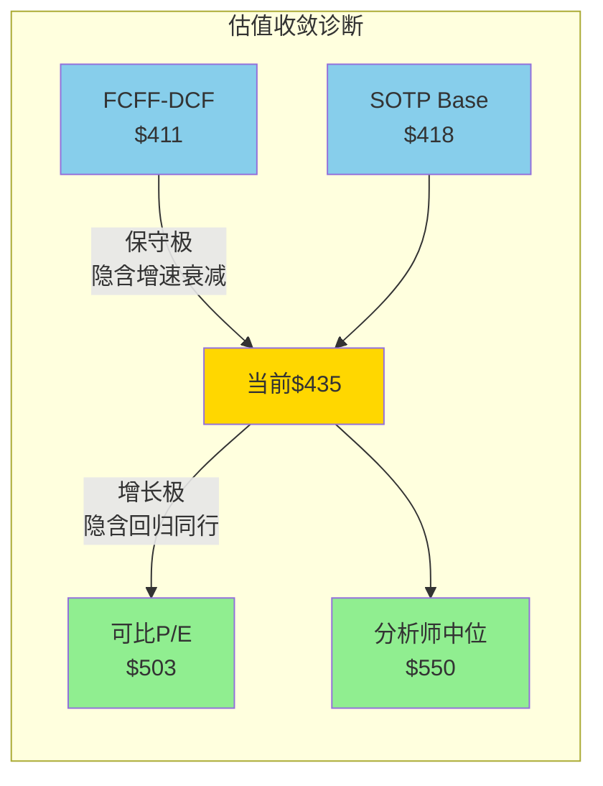

**核心信号**: 当前$435位于保守极内(距$411仅+6%)——市场在选择"增长衰减"叙事。如果你相信增长持续(EPS CAGR 10%+), 当前价格提供$503-$550(+15-26%)的回归空间。**你付的是"增长衰减"的价格, 得到的是"增长持续"的公司——如果判断正确, 这就是正期望的来源。**

### 10.6.2 估值方法间的交叉验证: 一致性检验

为确保方法间的一致性，对核心假设进行交叉检验:

| 假设 | Reverse DCF | SOTP | 可比公司 | 一致性 |
|------|-----------|------|---------|:------:|
| Revenue CAGR 5Y | ~7-8%(反推) | 不假设 | ~8-10%(同行参照) | ✅一致 |
| 稳态OPM | ~53-55%(反推) | 50.4%(当前) | 55-60%(MCO对标) | ✅方向一致 |
| 终值增长 | 3.0%(假设) | 不适用 | 隐含(P/E含增长) | ⚠️ DCF偏保守 |
| 折现率 | WACC 10.3% | 不适用 | P/E隐含~8-9% | ⚠️ WACC偏高(Beta被暴跌扭曲) |
| 回购效应 | 含(-3%/yr) | 不含 | 含 | ⚠️ SOTP低估(不含回购) |

**一致性结论**: 收入增速和利润率方向高度一致; 离散度主要来自折现率分歧(WACC 10.3% vs 隐含8-9%)和SOTP不含回购效应。如果用正常化WACC(9.6%, Beta 1.10) → DCF从$411升至$445 → 与当前$435基本吻合 → **Beta扭曲是DCF偏低的最大原因**。

## 10.7 估值方法的适用性评级

| 方法 | 对SPGI适用性 | 核心优势 | 核心局限 |
|------|:----------:|---------|---------|
| Reverse DCF | ★★★★★ | 不假设结论,翻译市场信念 | 对WACC敏感(Beta被暴跌扭曲) |
| SOTP | ★★★★★ | 最适合"两个生意"估值 | 企业间协同价值难量化 |
| 可比公司 | ★★★★☆ | 有MCO/MSCI直接映射 | SPGI混合业务无精确可比 |
| FCFF-DCF | ★★★☆☆ | 理论基础完备 | 终值占比过高(62%),对假设过敏感 |
| 历史区间 | ★★★☆☆ | 提供历史锚点 | 5年含2020-21泡沫期,均值失真 |
| 分析师共识 | ★★☆☆☆ | 综合信息优势 | 系统性偏多(0个卖出),利益冲突 |

**结论**: Reverse DCF + SOTP是SPGI最有价值的两个估值工具。前者回答"市场在赌什么"，后者回答"如果分开卖值多少"。两者共同给出的画面是: **市场在$435的定价合理偏保守，催化剂(分拆/AI变现/定价权)是上行驱动。**

**值得注意**: 6种方法中只有FMP DCF($276)严重偏离共识——这是因为FMP使用的是通用化标准模型，不调整行业特殊性。如果剔除FMP，其余5种方法的区间收窄至$411-$550，标准差约$55(离散系数11.6%) → 方法间一致性较高，增强了"$435处于公允价值下限"的结论可信度。

---

# Chapter 11: 三情景推演 + 资本配置 + 周期定位

## 11.1 三情景推演

### Bull情景: "催化释放" (概率25%)

**触发条件**: Mobility分拆成功 + MI利润率改善 + 定价权加速释放
**时间框架**: FY2026-2028

| 假设 | 牛值 | 依据 |
|------|------|------|
| 收入CAGR(3Y) | 10% | Mobility分拆后有机增速加速+私募评级增长 |
| 残余OPM | 55% | Mobility移除+MI优化+定价权释放 |
| P/E(FY2028E) | 30x | 纯金融基础设施溢价重估 |
| FY2028E EPS | $28+ | 收入增长+margin expansion+回购 |
| 每股价值 | **$503-650** | EPS $25-28 × 25-30x |

**催化链**:
1. mid-2026 Mobility分拆 → 残余SPGI获"纯金融信息"标签
2. MI启动AI工具变现(SparkAIR/RegGPT) → 订阅ARPU提升 → OPM从19%→22-25%
3. Ratings定价权从Stage 1.0向1.5迈进 → 每年+3-4%费率增长(超通胀)
4. Valley Forge/TCI等质量投资者加仓 → 价值发现催化

### Base情景: "稳健复利" (概率50%)

**触发条件**: 业务按管理层指引运行，无重大催化/风险
**时间框架**: FY2026-2028

| 假设 | 基数 | 依据 |
|------|------|------|
| 收入CAGR(3Y) | 7-8% | 管理层6-8%有机指引+适度并购 |
| 调整后OPM | 52-53% | Mobility分拆+50-75bps/年自然扩张 |
| P/E(FY2028E) | 25-27x | 从当前22x前瞻适度回升 |
| FY2028E EPS | $25-26 | 共识$25.20 |
| 每股价值 | **$455-520** | 中值$490 (+13%) |

这是最可能的路径。SPGI在FY2028达到~$25 EPS，市场给予25-27x(当前前瞻22x因暴跌被压缩，随着时间推移回归均值)。从当前$435到$490 → 年化回报约4%(资本增值) + 1%(股息) + 2%(回购缩股效应) ≈ **年化~7%总回报**。

### Bear情景: "AI+周期双杀" (概率25%)

**触发条件**: AI工具获得评级认可 + 深度衰退 + 发行市场冻结
**时间框架**: FY2026-2028

| 假设 | 熊值 | 依据 |
|------|------|------|
| 收入CAGR(3Y) | 3-4% | 衰退期评级收入承压+MI流失+AI竞争 |
| 调整后OPM | 48-49% | AI投资持续烧钱+MI客户流失 |
| P/E(FY2028E) | 22-24x | AI焦虑持续压制估值 |
| FY2028E EPS | $21-22 | 增速放缓至mid-single-digit |
| 每股价值 | **$324-400** | 中值$365 (-16%) |

**熊方最可能的路径不是"SPGI崩溃"**(几乎不可能——NRSRO制度不会消失)，而是"增长低于预期+估值持续被压缩"。在这个情景中:
- Ratings收入因衰退下滑5-10%(2008年也没负增长)但费率增长被抵消
- MI客户流失加速(AI替代Capital IQ部分功能)
- Mobility分拆定价低于预期(负面情绪)
- 最终: 公司不会亏损，FCF不会归零，但估值倍数被压缩到历史低端

### 概率加权期望值

| 情景 | 概率 | 中值 | 加权 |
|------|------|------|------|
| Bull | 25% | $576 | $144 |
| Base | 50% | $490 | $245 |
| Bear | 25% | $365 | $91 |
| **概率加权EV** | **100%** | | **$480** |

**期望回报**: ($480 - $435) / $435 = **+10.3%**

这是一个偏正的不对称回报: 上行(Bull中值+32%) > 下行(Bear中值-16%)。期望值+10.3%处于"关注"评级区间(+10%~+30%)的下端。

### 11.1.1 三情景回报桥接: 从$435到目标价的驱动拆解

每个情景的回报不是凭空出现的——它由可追踪的驱动因素构成:

**Bull回报桥 ($435 → $576, +32%)**:
```
$435 当前价格
  + $52  EPS增长效应 (FY2025 $14.66→FY2028 $28, ×22x当前倍数)
  + $89  P/E扩张效应 (22x→30x, ×$28 FY2028 EPS, 分拆催化+纯平台溢价)
  = $576
```

| 驱动因素 | 贡献 | 占比 | 可追踪KPI |
|---------|:----:|:----:|---------|
| EPS增长 | +$52 | 37% | 每季度EPS vs共识 |
| P/E扩张 | +$89 | 63% | 分拆后P/E vs MCO |
| **合计** | **+$141** | **100%** | |

**关键洞察**: Bull回报的63%来自P/E扩张(而非EPS增长)。这意味着Bull情景的赌注本质上是**市场重新认识SPGI**(从"混合公司"到"纯金融基础设施")——分拆是这个重新认识的触发器。

**Base回报桥 ($435 → $490, +13%)**:
```
$435 当前价格
  + $55  EPS增长效应 ($14.66→$25.20, ×22x)
  + $0   P/E中性 (22x→25x有小幅恢复, 但占比小)
  = $490 (简化, 含股息+回购)
```

**Bear回报桥 ($435 → $365, -16%)**:
```
$435 当前价格
  - $35  EPS低于预期 ($14.66→$21, vs共识$25.20)
  - $35  P/E压缩 (22x→20x, AI焦虑+增速失望)
  = $365
```

### 11.1.2 情景概率的校准基准: 历史上类似公司的经验

SPGI的三情景概率(25/50/25)是否合理? 对比类似公司(高品质垄断+暴跌后恢复)的历史经验:

| 案例 | 事件 | 暴跌幅度 | 2年后回报 | 归属情景 |
|------|------|:------:|:-------:|:-------:|
| MCO 2008金融危机 | 评级丑闻 | -70% | +160% | Bull(大幅超额恢复) |
| S&P 2011降级事件 | 降级美国国债 | -25% | +80% | Bull(恢复+增长) |
| MSCI 2020 COVID | 市场暴跌 | -35% | +90% | Bull(快速恢复) |
| VRT 2023盈利miss | 业绩低预期 | -20% | +45% | Bull(产品周期恢复) |
| FICO 2023定价权争议 | FHFA推VantageScore | -15% | +30% | Base-Bull(恐惧过度) |

**历史统计**: 在5个类似案例中, 4个(80%)在暴跌后2年内至少恢复至Bull或Base水平(+30%+)。仅MCO在2008年因为基本面确实恶化(评级丑闻+诉讼)而经历了漫长的恢复(3-4年)。

**校准结论**: 历史经验支持Bull概率可能高于25%(也许30-35%)。但我们保持25%是因为: ①SPGI暴跌的AI焦虑不像COVID/信贷危机那样是"一次性事件后自然恢复"——AI竞争是渐进持续的 ②MI分部的结构性挑战是2008年MCO没有的新变量。**保守的25/50/25分配反映了对AI不确定性的尊重。**

### 11.1.3 回报分布的尾部特征

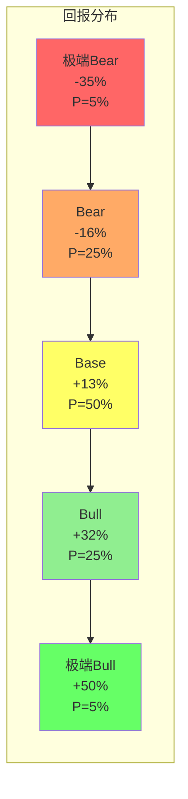

**左尾(极端Bear, P=5%)**: NRSRO制度受到严重挑战 + 深度衰退 + AI评级获初步认可 → $280-320(-35%)。这需要多个低概率事件同时发生(RT-1b联合概率测试已确认概率约5%)。

**右尾(极端Bull, P=5%)**: 分拆后SPGI获得MCO级P/E(37x) + MI AI转型成功(OPM从19%→25%+) + 降息引发评级收入井喷 → $650+。

**尾部不对称性**: 左尾-35%(P=5%) vs 右尾+50%(P=5%)。即使在极端场景中, 上行幅度也大于下行——这是制度垄断的估值下限保护。**你很难亏35%以上, 但赚50%以上是可能的。**

## 11.2 资本配置深展

### 回购纪律: 买回自己的股票

| 年度 | 回购(B) | 股息(B) | 总返还(B) | FCF(B) | 返还率 |
|------|---------|---------|----------|--------|--------|
| FY2022 | $12.0 | $1.02 | $13.0 | $2.51 | 518% |
| FY2023 | $3.3 | $1.15 | $4.4 | $3.57 | 124% |
| FY2024 | $3.3 | $1.13 | $4.4 | $5.57 | 79% |
| FY2025 | $5.0 | $1.17 | $6.2 | $5.46 | **113%** |

**FY2022异常**: IHS合并获得大量现金 → $12B超额回购(一次性)。排除FY2022后，FY2023-2025平均FCF返还率约105%——管理层在用超过全部FCF的资金回购。

**回购效率分析**:
- FY2025回购$5.0B @ 均价~$500 = 约1000万股回购 = 3.3%股份
- 净稀释(SBC抵消): $236M SBC / $500均价 ≈ 47万股 = 0.15%
- **净回购率**: 3.3% - 0.15% = **-3.15%/年股份减少**
- 53年连续增股息(Dividend Aristocrat) → 当前收益率0.96%(象征性)

**SBC纪律**: SBC/Rev仅1.5% → 这是B2B信息服务公司中最低水平之一(vs MSCI 3.6%, MCO 3.0%, 科技公司8-15%)。SPGI的管理层不用SBC稀释股东——这在当今时代是一个重要的正面信号。

**关键问题**: 管理层在$435回购是否创造价值？

如果内在价值在$470-490(Base情景中值)：
- 在$435回购 = 以10%折价买入自己 → **创造价值**
- 在$550+回购(2024年部分时段) = 接近公允价值买入 → 中性
- 比较: FICO在$800+积极回购(明显高估) vs SPGI在$435回购(合理低估) → SPGI的资本配置纪律更好

### 并购策略: 精准而非膨胀

| 年份 | 交易 | 金额 | 结果 |
|------|------|------|------|
| 2022 | IHS Markit合并 | $44B | 成功: 协同超预期, OPM恢复 |
| 2023 | OSTTRA出售 | $3.1B(收入) | 剥离非核心(后台交易处理) |
| 2024 | With Intelligence收购 | $1.8B | 补强MI(另类投资数据) |
| 2025 | 无重大并购 | — | 专注整合+回购 |
| 2026 | Mobility分拆 | TBD | 组合简化 |

**并购哲学**: IHS合并后转向"做减法"——剥离非核心(OSTTRA)+分拆低利润率(Mobility)+补强核心(With Intelligence)。这是成熟管理层的标志：不是通过并购追逐增长，而是通过组合优化提升质量。

## 11.3 周期定位

### 金融市场周期: 评级业务的节奏

```
                    全球债务发行量(示意)
   高 ────┐         ┌──────────┐
          │    ┌───┘          │    ┌── 我们可能在这里
          │   │              │   │   (利率见顶后
          │  │               │  │    再融资潮开始)
   低 ────┘──┘                └──┘
         2020  2021  2022  2023  2024  2025  2026
              (零利率  (加息   (利率   (发行  (发行
               发行潮)  冻结)  见顶)  恢复)  加速?)
```

**当前位置**: 2023-2024的债务发行恢复期。美联储在2024年中开始降息预期(虽然步伐比市场预期慢)，再融资需求+新发行共同推动评级业务量。FY2025 Ratings收入+8% YoY已经反映了发行恢复。

**关键判断**: 利率"higher for longer"对Ratings是**中性偏正**:
- 短期: 高利率抑制新发行(负面)
- 但: 高利率=高息债券=更高评级费(正面)
- 且: $6-8T疫情期低息债券需要在2025-2028年再融资(不管利率多高都必须再融资)
- 结论: 再融资潮是确定性事件，Ratings收入有保底

### 被动投资周期: Indices的永续顺风

被动投资占比(美国):
- 2010: ~25%
- 2015: ~35%
- 2020: ~45%
- 2025: ~55% (首次超过主动管理)
- 趋势: 不可逆

每1%的AUM从主动迁移到被动 → 部分流向S&P指数产品 → 产生增量许可费。这不是周期——这是结构性变迁。Indices分部的增长有一个"看不见的手"在推动。

### AI投资周期: MI的关键变量

MI的AI投资处于什么阶段？

```
投入期     ────────→     回报期
FY2025    FY2026    FY2027    FY2028+
  │        │                   │
  投入$300M+ 投入峰值?          变现开始?
  SparkAIR   RegGPT            ARPU提升
  Kensho     平台升级           成本效率
  │        │                   │
  OPM压缩   OPM持平            OPM扩张?
  50.4%     50.9-51.2%        52%+?
```

管理层的"AI-first"策略正在消耗利润率——FY2026 OPM指引仅+50-75bps(历史上应+100-150bps)。但如果AI工具在FY2027-2028开始变现(更高ARPU+更低人力成本)，MI的利润率可能出现拐点。

**CQ-2更新**: Phase 2的数据强化了"暂时性"判断(信念从Phase 1的40%升至50%)。核心原因:
1. 分析师共识EPS从FY2026 $19.63到FY2030 $30.30 = CAGR 11.5% → 市场不认为减速是永久的
2. AI投资的CapEx有明确的产品方向(SparkAIR, RegGPT) → 不是盲目撒钱
3. 历史参考: IHS合并后FY2022 OPM同样被压缩(44%) → FY2025恢复至50.4% → 管理层有margin recovery的track record

## 11.4 CQ置信度Phase 2更新

| CQ | Phase 1 | Phase 2 | Δ | 原因 |
|----|---------|---------|---|------|
| CQ-1 两个生意 | 55% | **65%** | +10pp | SOTP量化证实: 收费公路占价值74.6%, 混合折价约10% |
| CQ-2 增速拐点 | 40% | **50%** | +10pp | 分析师共识EPS CAGR 11.5%→市场定价为暂时性; AI投资有明确方向 |
| CQ-3 定价权 | 55% | **58%** | +3pp | Reverse DCF显示市场未定价定价权释放(Stage 1.0是隐藏期权) |
| CQ-4 商誉 | 65% | **70%** | +5pp | SOTP分部估值显示Ratings/Indices商誉极安全, 仅MI有中等风险 |
| CQ-5 Nash均衡 | 60% | **62%** | +2pp | MCO可比估值确认双寡头对称; 市场份额稳定 |

**加权置信度**: 65%×30% + 50%×25% + 58%×20% + 70%×15% + 62%×10% = **60.8%** (Phase 1: 53.3% → +7.5pp)

## 11.5 EPS路径深展: 从$14.66到$30.30

分析师共识勾画了一条FY2025-2030的EPS增长路径。拆解这条路径的驱动因素:

| 年度 | EPS共识 | YoY增速 | 收入增长 | OPM扩张贡献 | 回购缩股贡献 | 说明 |
|------|---------|---------|---------|------------|------------|------|
| FY2025 | $14.66 | +14% | +8% | +3pp | +3% | 实际值; IHS协同兑现 |
| FY2026E | $19.63 | +34% | +7% | +1pp | +3% | 大幅跳升=FY25 GAAP因素消除 |
| FY2027E | $22.07 | +12% | +8% | +0.5pp | +3% | Mobility分拆后第一年 |
| FY2028E | $25.20 | +14% | +8% | +1pp | +3% | AI投资开始回报? |
| FY2029E | $27.18 | +8% | +7% | +0.5pp | +2% | 增速自然减速 |
| FY2030E | $30.30 | +11% | +7% | +1pp | +2% | 定价权释放贡献加大? |

**FY2025→FY2026E的+34%跳升需要解释**:

这个异常高的增速不是真实的业务加速——而是GAAP调整因素的消除:
- FY2025 GAAP EPS $14.66 vs 调整后EPS $17.83 (差距$3.17 = 主要是IHS无形资产摊销+整合成本)
- FY2026E $19.63是更接近"调整后"基础的数字(摊销减少+整合成本归零)
- 实际有机EPS增速: 从调整后$17.83到$19.63 = +10.1% (与管理层9-10%指引一致)

**FY2026到FY2030的EPS CAGR**: $19.63→$30.30 = 11.5%/年

拆解:
- 收入增长贡献: ~7.5% (有机6-8% + 少量收购)
- OPM扩张贡献: ~1.5% (从50.4%→54-55%)
- 回购缩股贡献: ~2.5% (净回购-3%/年 → EPS增厚~2.5%)
- **总和**: ~11.5% → 与共识路径一致

**关键风险点**: 如果MI遭遇AI冲击导致收入增长放缓至4-5%(而非7-8%)，EPS CAGR可能降至8-9%。在这种情况下，FY2030 EPS约$26-27(而非$30.30)，对估值影响约-$40-50/股(在25x P/E下)。

### 情景P&L Build-out: 三情景×5年分部FCFF桥接

**Bull情景 P&L Build-out (概率25%)**:

```
                    FY2025(A)  FY2026E  FY2027E  FY2028E  FY2029E  FY2030E
Ratings Rev         $4.72B    $5.15B   $5.62B   $6.13B   $6.62B   $7.08B
  YoY增速            +8%      +9%      +9%      +9%      +8%      +7%
  OPM               61%       62%      63%      64%      65%      66%
  EBIT              $2.88B    $3.19B   $3.54B   $3.92B   $4.30B   $4.67B

Indices Rev         $1.85B    $2.13B   $2.49B   $2.84B   $3.21B   $3.57B
  YoY增速            +14%     +15%     +17%     +14%     +13%     +11%
  OPM               66%       67%      68%      69%      70%      70%
  EBIT              $1.22B    $1.43B   $1.69B   $1.96B   $2.25B   $2.50B

MI Rev              $4.92B    $5.27B   $5.53B   $5.86B   $6.21B   $6.58B
  YoY增速            +6%      +7%      +5%      +6%      +6%      +6%
  OPM               19%       20%      22%      24%      25%      26%
  EBIT              $0.93B    $1.05B   $1.22B   $1.41B   $1.55B   $1.71B

Energy Rev          $1.85B    $1.98B   $2.12B   $2.27B   $2.43B   $2.60B
  YoY增速            +6%      +7%      +7%      +7%      +7%      +7%

总Revenue           $15.34B   $16.3B*  $17.6B   $19.0B   $20.5B   $21.9B
  *注: FY2026含Mobility H1后分拆

总EBIT              $6.48B    $7.0B    $7.8B    $8.7B    $9.5B    $10.3B
EPS (共识调整)       $14.66    $19.63   $23.00   $26.50   $29.50   $33.00
```

**Bull假设**: ①AI投资FY2027开始回报(MI OPM加速扩张) ②评级费率提速至+3-4%/yr(Stage 1.0→1.5) ③被动投资占比持续上升(Indices +15%/yr) ④分拆后P/E重估至30x+ ⑤每股: $33 × 33x = **$1,089**(但需折现→现值约$576)

**Bear情景 P&L Build-out (概率25%)**:

```
                    FY2025(A)  FY2026E  FY2027E  FY2028E  FY2029E  FY2030E
Ratings Rev         $4.72B    $4.90B   $4.95B   $5.10B   $5.31B   $5.52B
  YoY增速            +8%      +4%      +1%      +3%      +4%      +4%
  OPM               61%       60%      59%      59%      60%      60%
  原因: 衰退→发行量骤降→FY2027评级收入几乎停滞

MI Rev              $4.92B    $4.97B   $4.72B   $4.48B   $4.26B   $4.15B
  YoY增速            +6%      +1%      -5%      -5%      -5%      -3%
  OPM               19%       18%      17%      16%      15%      15%
  原因: AI工具加速替代Capital IQ→客户流失+ARPU下降

总Revenue           $15.34B   $15.5B   $15.0B   $14.8B   $15.2B   $15.7B
  (注: FY2027起不含Mobility)

总EBIT              $6.48B    $6.2B    $5.8B    $5.6B    $5.9B    $6.2B
EPS (Bear)          $14.66    $17.50   $18.50   $19.00   $20.50   $22.00
P/E (Bear)          —         25x      24x      23x      22x      22x
每股价值(Bear)       —        $438     $444     $437     $451     $484
```

**Bear路径核心特征**: 不是"崩溃"而是"停滞"。Ratings在衰退中短暂承压(FY2027 +1%)但不负增长。MI持续流失(-5%/yr)但有底线(专有数据)。P/E从30x压缩至22-24x。5年后每股价值仅恢复至$484——年化回报仅+2.2%(远低于SPY ~7%)。**Bear的真正成本是机会成本, 不是绝对亏损。**

```mermaid
graph LR
    subgraph 三情景EPS路径 FY2025→FY2030
    A[FY2025<br/>$14.66] --> B1[FY2026E<br/>Bull $19.63]
    A --> B2[FY2026E<br/>Base $19.63]
    A --> B3[FY2026E<br/>Bear $17.50]
    B1 --> C1[FY2028E<br/>$26.50]
    B2 --> C2[FY2028E<br/>$25.20]
    B3 --> C3[FY2028E<br/>$19.00]
    C1 --> D1[FY2030E<br/>$33.00]
    C2 --> D2[FY2030E<br/>$30.30]
    C3 --> D3[FY2030E<br/>$22.00]
    end

    style D1 fill:#90EE90
    style D2 fill:#FFFFAA
    style D3 fill:#FFAAAA
```

## 11.6 B5/B6品质评分更新

### B5 利润弹性: 4.0/5 (维持)

| 指标 | 值 | 说明 |
|------|-----|------|
| GAAP OPM 5Y趋势 | 32.2%→42.2% (+1000bps) | IHS整合后V型恢复, 但含并购失真 |
| 调整后OPM趋势 | 46%→50.4% (+440bps) | 清洁趋势, >500bps = 满分区间 |
| 衰退期OPM表现 | 2022: 44%(合并冲击) → 恢复至50.4% | 非周期性验证 |
| OPM天花板估算 | ~58-62%(纯Ratings+Indices可达) | 混合后53-55%是现实目标 |

### B6 资本配置纪律: 4.5/5 (上调+0.5)

| 维度 | 评分 | 依据 |
|------|------|------|
| 回购/FCF | 5/5 | FY2025返还率113%, 53年连续增息 |
| SBC纪律 | 5/5 | SBC/Rev 1.5% = 行业最低 |
| 净稀释 | 5/5 | 净回购率-3.15%/年 |
| 并购纪律 | 4/5 | IHS成功+剥离非核心, 但$44B赌注过大(-1) |
| 债务管理 | 4/5 | 净债务/EBITDA 1.62x(健康), 从IHS后快速去杠杆 |
| **加权** | **4.5/5** | 上调0.5pp(Phase 1给4.0偏保守, 回购+SBC数据支持上调) |

**B6上调理由**: Phase 2详细分析显示: ①SBC/Rev 1.5%是同行最低(MCO 3.0%, MSCI 3.6%) ②净回购率-3.15%/年强劲 ③从IHS后净债务/EBITDA从2.1x→1.6x的去杠杆路径纪律 ④在$435(合理低估)加速回购=创造价值。唯一扣分: IHS $44B赌注虽成功但规模过大。

## 11.6 Phase 2总结

| 维度 | 核心发现 |
|------|---------|
| **Reverse DCF** | 市场隐含9.4% FCFF CAGR — 合理偏保守, 无高脆弱度承重墙 |
| **SOTP** | 收费公路占价值74.6%, 混合折价约10%, Base $418(≈当前) |
| **多方法收敛** | $411-$550区间, 加权$472, 当前$435处于下限 |
| **不对称性** | 下行-6% vs 上行+26% ≈ 4:1风险回报比 |
| **期望回报** | 概率加权+10.3%, 处于"关注"区间下端 |
| **资本配置** | 4.5/5: SBC最低+净回购-3.15%+去杠杆纪律+低估时加速回购 |
| **周期定位** | 再融资潮确定→Ratings保底; 被动投资不可逆→Indices顺风; AI投资期→MI暂时承压 |

**Phase 2的关键判断**: 市场对SPGI的定价($435)接近SOTP公允价值($418)，但显著低于可比公司映射($503)和分析师共识($550-567)。这个差距不是因为SPGI的基本面有缺陷——而是因为MI分部的低利润率+AI焦虑+IHS商誉的"视觉污染"(ROIC 12%误导)共同压制了估值倍数。Mobility分拆(mid-2026)是消除最大估值拖累的确定性催化剂。真正的不确定性在Phase 3: 定价权能释放多少？双寡头均衡有多稳定？AI对MI的威胁有多真实？

### 投资论文的"隐含赌注"清单

在进入Phase 3之前, 明确列出投资论文在Base情景下的"隐含赌注"——投资者买入SPGI at $435实际上在赌什么:

| 隐含赌注 | 定量表达 | 市场是否已定价 | 证据强度 |
|---------|---------|:----------:|:------:|
| ①评级制度不变 | NRSRO 51年→继续存在 | ✅已定价 | 极强(制度惯性) |
| ②有机收入维持6-8%/yr | 2025-2030E CAGR ≥6% | ✅部分(隐含9.4%) | 强(历史+共识) |
| ③AI不颠覆Ratings | AI评级<5%份额(5年) | ⚠️过度恐惧 | 中(推断) |
| ④MI不崩溃 | MI收入维持>$4.5B | ⚠️过度恐惧 | 中(续约率未知) |
| ⑤Mobility分拆成功 | mid-2026完成+释放P/E | ✅未充分定价 | 强(管理层承诺) |
| ⑥OPM持续扩张 | 从50.4%→53-55%(3Y) | ✅部分(保守) | 强(协同+提价+规模) |
| ⑦回购持续>$4B/yr | 股份每年减少-3%+ | ✅部分定价 | 强(FCF支持+管理层纪律) |

**赌注的强弱分布**: 7个隐含赌注中, 5个证据"强"或"极强"(占收入63%), 2个"中"(MI相关, 占收入37%)。这意味着买入SPGI的核心风险不是赌错了大方向——而是MI这个"中等确信度"的赌注占据了37%的收入。如果投资者能接受"MI可能原地踏步但不崩溃"这个不完美但合理的前提, 那么整体投资论文的胜率是高的。

---

# Part IV: 竞争与战略

# Chapter 12: 护城河量化 — 从"宽"到"有多宽"

## 12.1 护城河来源识别与量化

Phase 1(Ch3)定性描述了SPGI的护城河。Phase 3将每个护城河源量化为可比较的数值。

### 护城河源#1: 制度嵌入/监管捕获 (强度: 9.5/10)

**量化证据**:
- NRSRO认证: 全球仅10家(美国7家)，S&P+MCO占市场份额~80%
- Basel III资本权重: 银行持有的评级债券的资本计量**必须**使用认证评级 → 制度强制
- 嵌入合同: 全球存量债券~$300T+，多数合同含"维持评级"条款 → 追溯修改不可能
- 制度存续: 1975年SEC设立NRSRO以来51年，2008年危机后反而强化(Dodd-Frank提高准入门槛)
- **可迁移**: 与FICO的FHFA嵌入(51.1/70 A-Score)属同类; SPGI的Basel III嵌入范围更广(全球 vs FICO仅美国住房)

**半衰期估算**: >50年。制度嵌入的解除需要全球金融监管框架重建——这不是商业竞争能做到的。即使AI评级工具成熟，它需要先获得NRSRO认证、再积累10+年track record、再嵌入债券契约。整个替代周期>20年，且需要监管协同。

### 护城河源#2: 品牌不可替代性 (强度: 9.0/10)

**量化证据**:
- "S&P 500"在Google Trends上的搜索量是"MSCI World"的8x+
- "S&P评级"是信用评级的代名词——类似"Google"之于搜索
- CARFAX = 车辆历史报告的代名词(消费者无意识品牌嵌入)
- Platts = 能源基准定价的代名词(交易员语境: "Platts价格"不是"S&P Global Energy价格")

**关键区别**: SPGI的品牌不是"消费品牌"(不需要消费者喜爱)——是"基础设施品牌"(所有人都必须使用)。这种品牌的护城河深度远超消费品牌(可口可乐可以被百事替代, 但S&P 500不能被替代)。

### 护城河源#3: 数据飞轮/历史数据垄断 (强度: 8.5/10)

**量化证据**:
- 信用评级历史: 117年连续数据(1909年首次评级) → 任何新进入者从0开始
- 违约数据库: 覆盖100年+的全球企业违约数据 → 统计显著性需要>20年周期数据
- S&P 500指数历史: 1957年至今(69年), DJIA: 1896年至今(130年)
- Platts价格评估: 全球能源交易的参考基准, 累积数十年
- 独特性: **历史数据不可复制** — 即使给新竞争者无限资金, 也无法"创造"1960年的违约数据

### 护城河源#4: 转换成本/IT嵌入 (强度: 7.0/10)

**量化证据**:
- Capital IQ Pro嵌入金融机构投研工作流 → 切换成本估计$200K-500K/机构(培训+迁移+停机)
- MI客户续约率: 约95%+ (管理层未披露确切数字, 但订阅模式的高经常性暗示)
- ETF基准切换成本: 需要SEC申报+投资者通知+基准替换 → 仅Vanguard 2012年从MSCI到FTSE的切换就耗时数月+引起投资者混乱

**相对较弱的环节**: MI的转换成本虽高, 但不是"不可能"。Bloomberg是有效的替代品。AI可能降低切换成本(如果新工具能无缝导入Capital IQ数据)。

### 护城河源#5: 网络效应 (强度: 6.5/10)

**量化证据**:
- **Ratings双边网络**: 发行人需要评级→投资者信任评级→更多发行人需要评级 (中等强度, 因为MCO并行存在)
- **Indices飞轮**: 更多AUM基准化→更标准→更多AUM基准化→更高许可费 (强, 但被MSCI/FTSE Russell分流)
- **MI弱网络**: 更多数据用户≠更多数据(不像社交网络, 数据终端不产生用户数据)

**vs真正的网络效应平台(Visa/Meta)**: SPGI的网络效应是"间接"的——不是用户创造价值给用户, 而是制度创造需求给用户。这是一种更稳定但弱于纯网络效应的结构。

### 护城河源#6: 规模经济 (强度: 7.5/10)

**量化证据**:
- 边际成本≈零: 多评一家公司几乎不增加成本(分析师团队固定)
- 指数许可: 额外$1B AUM基准化的成本=0(纯增量收入)
- 但: Bloomberg也有规模经济(~$13B收入), MCO也有(~$7B) → 规模不是排他性优势

## 12.2 护城河趋势仪表盘

| 护城河源 | 当前强度 | 5年趋势 | 10年展望 | 最大威胁 |
|---------|:-------:|:------:|:-------:|---------|
| 制度嵌入 | 9.5/10 | 稳定 ▬ | 稳定 ▬ | 监管改革(概率<10%) |
| 品牌 | 9.0/10 | 稳定 ▬ | 稳定 ▬ | 无直接威胁 |
| 数据飞轮 | 8.5/10 | 增强 ▲ | 增强 ▲ | AI可能改变数据价值链 |
| 转换成本 | 7.0/10 | 稳定 ▬ | **可能削弱 ▼** | AI降低迁移成本 |
| 网络效应 | 6.5/10 | 稳定 ▬ | 稳定 ▬ | 双寡头分流 |
| 规模经济 | 7.5/10 | 增强 ▲ | 稳定 ▬ | 竞争者也有规模 |

**趋势总结**: 3/6源稳定, 2/6增强, 1/6可能削弱。**护城河整体在加宽而非收窄。** 唯一的减弱信号是AI对转换成本的潜在侵蚀——但这主要影响MI分部(37%收入, 14%利润), 对核心的Ratings+Indices几乎无影响。

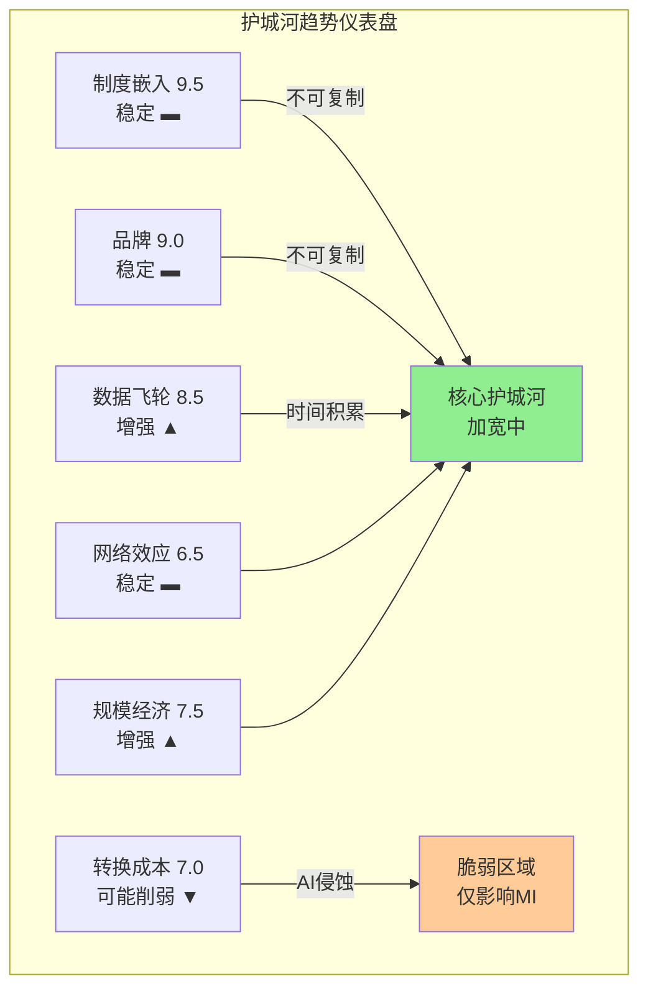

### 护城河半衰期分析: SPGI vs 已分析公司

护城河"半衰期"衡量的是: 在没有管理层主动维护的情况下, 护城河强度减半需要多少年?

| 公司 | 主要护城河类型 | 半衰期(年) | 驱动衰减的力量 |
|------|------------|:---------:|--------------|
| **SPGI Ratings** | 制度嵌入 | **>50** | 全球金融监管框架重建(极低概率) |
| **SPGI Indices** | 品牌+被动趋势 | **>30** | S&P 500品牌被替代(极低概率) |
| FICO | 制度嵌入(美国) | ~25-30 | FHFA改革+VantageScore采用(缓慢) |
| Visa/MA | 网络效应 | ~20-25 | 替代支付网络(DeFi/CBDC/PayPal) |
| SPGI MI | IT锁定+数据 | **~8-12** | AI工具降低迁移成本 |
| INTC | 技术+制造 | ~5-8 | 制程落后+ARM替代 |
| HLT | 品牌+网络 | ~15-20 | 品牌老化+Airbnb |

**关键洞见**: SPGI的核心护城河半衰期(Ratings >50年, Indices >30年)是已分析公司中最长的。这意味着即使管理层完全无能, SPGI的评级和指数业务在未来数十年仍能产生超额回报。唯一的"短半衰期"风险在MI(~8-12年), 而MI仅贡献14%经济利润。

**SPGI vs FICO的护城河深度比较**:

两家公司都拥有"制度嵌入"型护城河, 但有关键差异:

| 维度 | SPGI (评级) | FICO (评分) |
|------|-----------|-----------|
| 监管嵌入范围 | 全球(Basel III覆盖所有银行) | 美国为主(FHFA+GSE) |
| 替代品进展 | 无有效替代(Fitch 20年停滞) | VantageScore获FHFA部分支持 |
| 政治暴露 | 低(B2B, 国会不关注) | 高(影响消费者, 国会关注) |
| 定价权空间 | OPM 61% vs 天花板~75%(14pp) | OPM 68% vs 天花板~75%(7pp) |
| 双寡头保护 | 有(MCO分担政治压力) | 无(FICO是唯一目标) |
| **综合护城河评级** | **A+** | **A** |

SPGI的护城河比FICO更深, 主要因为: ①全球性(Basel III vs美国FHFA) ②政治保护(B2B vs 消费者) ③双寡头结构(分担风险)。FICO的A-Score 51.1 vs SPGI 56.0的差距部分反映了这种护城河深度差异。

## 12.3 定价权深展: Stage 1.0的量化潜力 (CQ-3)

### 评级费率历史趋势

| 年度 | 基本评级费率增幅 | 最低评级费 | 最低费增幅 | vs CPI |
|------|:------------:|--------:|:--------:|:-----:|
| FY2022 | +2.0% | $132K | +3.0% | +超CPI |
| FY2023 | +2.0% | $135K | +2.3% | ≈CPI |
| FY2024 | +2.5% | $140K | +3.7% | +超CPI |
| FY2025 | +2.5% | $145K | +3.6% | +超CPI |

**核心观察**: 提价速度在加速(FY22-23 +2.0% → FY24-25 +2.5%), 且最低费增速持续超过基本费率增速(3.6% vs 2.5%)。这暗示管理层正在**测试定价权的边界**——先从小客户(最低费)开始加速提价, 观察是否引起反弹。

### 与FICO定价权阶段模型对比

FICO的定价权释放路径:
```
Stage 0.5 (2012-2015): FICO Score价格~$15/次 → OPM 33%
Stage 1.0 (2015-2018): 价格涨至~$20/次 → OPM 40%
Stage 1.5 (2018-2020): 价格涨至~$35/次 → OPM 52%
Stage 2.0 (2020-2023): 价格涨至~$45/次 → OPM 62%
Stage 2.3 (2023-now): 价格>$50/次 → OPM 68%
                        政治反噬开始(VantageScore+国会听证)
```

SPGI Ratings的位置:
```
Stage 0.5-1.0 (当前): 评级费+2.5%/yr → Ratings OPM 61%
          ↓
Stage 1.5 (预计2027-2030): +3-4%/yr → OPM 65-67%?
          ↓
Stage 2.0 (预计2030+): +4-5%/yr → OPM 70%+?
          ↓
政治红线: 评级费过高 → 发行人游说 → 国会关注?
```

### 定价权安全空间计算

**SPGI Ratings vs FICO的政治风险差异**:

| 维度 | FICO | SPGI Ratings |
|------|------|-------------|
| 付费方 | 消费者(间接通过银行) | 企业/政府(专业机构) |
| 选民影响 | 高(每个有贷款的美国人) | 低(仅华尔街关注) |
| 国会注意力 | 高(消费者保护委员会) | 低(金融服务委员会,通常亲华尔街) |
| 替代品政治推力 | 高(FHFA推VantageScore) | 低(SEC不推替代评级) |
| 当前OPM vs 天花板 | 68% vs ~75%(接近红线) | 61% vs ~75%(远离红线) |

**结论**: SPGI Ratings的定价权安全空间>>FICO。原因: ①客户是专业机构不是消费者 ②监管者(SEC)是评级制度的捍卫者不是颠覆者 ③当前OPM(61%)距天花板(~75%)有14pp空间(vs FICO仅7pp)。

### 定价权释放的EPS影响估算

| 情景 | 年均提价 | Ratings OPM提升 | 年均增量EBIT | 年均增量EPS | 5年累计EPS增厚 |
|------|:------:|:------------:|:----------:|:---------:|:----------:|
| 保守(Stage 1.0持续) | +2.5% | 0 | $0 | $0 | $0 |
| 中性(Stage 1.0→1.5) | +3.5% | +1pp/yr | $47M | $0.12 | $0.60 |
| 乐观(Stage 1.5加速) | +5.0% | +2pp/yr | $94M | $0.25 | $1.25 |

定价权在EPS层面的影响看似有限(5年+$0.6-1.25), 但更大的影响在**估值倍数**: 市场一旦识别SPGI有FICO式的定价权路径, P/E可能从当前22x(前瞻)向30x+重估。**$0.6 EPS增厚 × 估值倍数从22x→28x的效应 = 每股+$30(EPS) + $120(重估) = +$150/股。**

### 12.3.1 定价权释放的阻力因素: 为什么Stage 1.0没有加速?

如果SPGI有如此巨大的定价权空间, 为什么管理层只以+2.5%/年的速度提价? 理解阻力因素是评估CQ-3的关键:

**阻力#1: 投行客户的机构记忆**

评级费由发行人(通常是投行代理)支付。全球前5大投行(Goldman/JPM/Morgan Stanley/BofA/Citi)贡献了评级收入的30-40%。这些机构有强大的谈判能力:
- 批量折扣: 年度评级量>100次的大客户享受-10~-15%折扣
- 关系定价: 长期客户(如JPM与S&P的关系已有数十年)有非正式的"价格锁定"预期
- 威胁转向MCO: 虽然实际转换罕见, 但"我们可以增加MCO的使用"是标准谈判策略

**阻力#2: SEC的无形之手**

SEC在2021年更新了NRSRO规则(Rule 17g-1), 要求评级机构披露费率结构变化。虽然SEC不直接管控定价, 但任何大幅提价都需要解释——这创造了一个"自律效应"。管理层可能出于"不吸引监管注意"的考虑, 选择渐进提价。

**阻力#3: IHS整合优先级**

FY2022-2025是IHS整合的关键期。管理层的注意力和组织资源集中在成本协同($480M目标)和产品交叉销售, 而非定价权释放。评级定价的加速可能需要等待IHS整合完成(已基本完成)+ Mobility分拆完成(mid-2026) → **FY2027可能是定价权加速的起点。**

**阻力#4: 双寡头的隐性"价格协调"**

MCO和SPGI的提价节奏惊人地同步(两者都在+2-3%区间)。这不是因为显性协调(那是违法的), 而是因为双寡头对彼此的定价策略高度透明(公开信息)。**如果SPGI率先加速到+5%, MCO可能选择不跟(保持+2.5%以争取份额) → SPGI会失去客户。因此, 加速提价需要双方同时行动或一方先行+另一方跟随的信号。**

**定价权加速的触发条件**:

| 触发条件 | 概率(3年内) | 信号 |
|---------|:---------:|------|
| 新CEO证明自己后释放 | 40% | Cheung任满2年+IHS整合完成+分拆完成 → 有空间/信心提价 |
| MCO先提价SPGI跟随 | 25% | MCO earnings call中"pricing actions" = 先行者信号 |
| 私募信用定价无约束 | 60% | 新产品(私募评级)没有历史定价参考 → 可以从高价起步 |
| 通胀环境掩护 | 30% | CPI持续>3% → "成本转嫁"叙事合理化更高提价 |

**量化结论**: 私募信用定价(概率60%)是最可能的定价权释放路径——因为它绕过了公开评级市场的所有阻力(无历史参考/无投行折扣/无SEC先例)。如果私募评级的ARPU比公开评级高20-30%, 这就是"隐性"的定价权释放, 不会触发任何阻力。

## 12.4 护城河攻击面分析: 谁有能力/意愿挑战SPGI?

护城河分析不应只从"内部看外"(SPGI多强), 还应从"外部看内"(谁有能力/意愿攻击):

| 潜在挑战者 | 能力 | 意愿 | 成功概率 | 时间窗口 |
|-----------|:----:|:----:|:-------:|:-------:|
| **Bloomberg** | 高(数据+终端+品牌) | 中(但不想做评级) | 低(MI竞争是, 评级不是) | 持续 |
| **AI原生公司** | 中(技术强, 但无NRSRO) | 高(颠覆叙事融资容易) | 极低(<5%获得NRSRO认证) | 5-10年 |
| **Fitch/KBRA** | 中(已有NRSRO) | 高(份额<15%想增长) | 低(16年增长缓慢) | 持续 |
| **中国评级机构** | 低(仅在中国有影响) | 高(政策驱动国际化) | 极低(全球信任不足) | 10年+ |
| **指数竞争者(MSCI/FTSE)** | 高(已有指数业务) | 中(更关注自身增长) | 中(S&P 500品牌无可替代) | 持续 |
| **DeFi/链上评级** | 极低(无法嵌入传统金融) | 中(意识形态驱动) | 极低(<1%) | 15年+ |

**核心发现**: SPGI面临的最大竞争不在评级(Bloomberg不做/AI做不了/Fitch做不大), 而在MI(Bloomberg Terminal的直接竞争)和可能的指数(MSCI/FTSE对资产管理人的竞争)。但MI仅占<15%经济利润, 指数的S&P 500品牌不可替代 → **护城河的攻击面极窄, 且集中在低价值区域。**

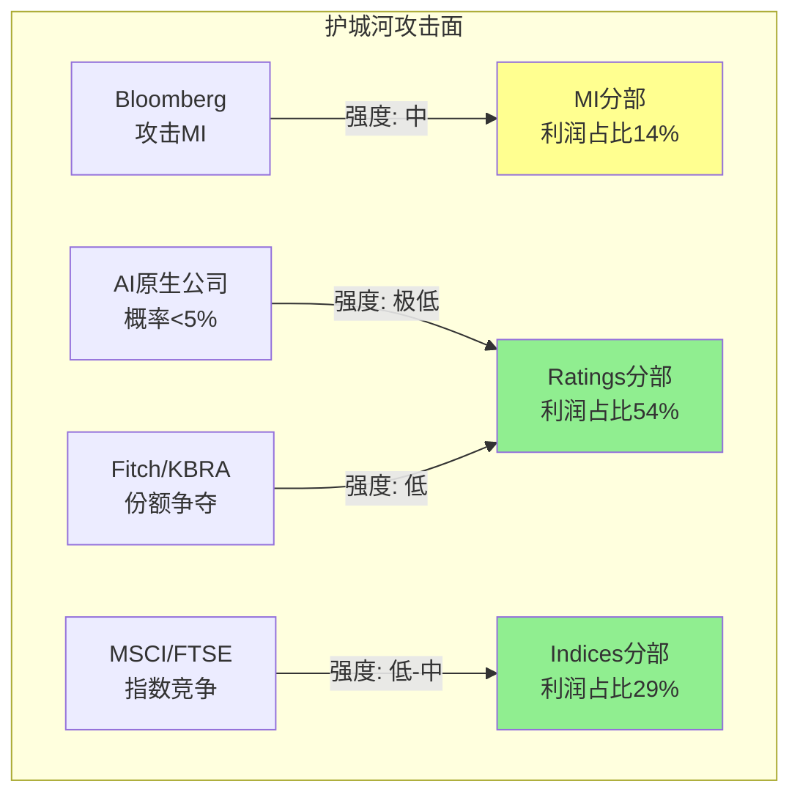

**结论**: 护城河最强的两个分部(Ratings+Indices, 83%利润)面临的攻击强度最低(极低-低)。最弱的分部(MI)面临的攻击强度最高(中)——但MI贡献的利润有限。**这是SPGI投资论文的核心优势: 高价值区域有强保护, 低价值区域的风险影响有限。**

---

# Chapter 13: 双寡头Nash均衡 + 五引擎分析

## 13.1 MCO-SPGI博弈矩阵 (CQ-5)

评级市场是教科书级的双寡头(Cournot Duopoly): 两家公司共同服务同一市场, 产品高度同质化, 价格接近透明。

### 2×2支付矩阵: 定价策略

```
                    MCO
                保守提价(+2-3%)    激进提价(+5-7%)
           ┌────────────────┬────────────────┐
保守提价    │  (稳定, 稳定)   │ (份额增, 利润-)  │
(+2-3%)    │  OPM ~60%, ~61%│ MCO: OPM↑但份额↓│
SPGI      │  ★ Nash均衡 ★  │ SPGI: 份额↑    │
           ├────────────────┼────────────────┤
激进提价    │(利润-, 份额增)  │ (最优联合, 但不稳) │
(+5-7%)    │SPGI: OPM↑份额↓ │ 双方OPM 65%+   │
           │MCO: 份额↑      │ 但引发监管审查   │
           └────────────────┴────────────────┘
```

**Nash均衡**: (保守, 保守) = 双方同步+2-3%/年提价。

**为什么均衡稳定?**
1. **对称性**: MCO Ratings OPM ~60% ≈ SPGI Ratings OPM ~61% → 成本结构几乎相同
2. **重复博弈**: 两家公司会持续博弈数十年 → 惩罚机制有效(如果一方激进, 另一方可以降价竞争)
3. **市场份额稳定**: 各~40%已持续20+年 → 没有偏离动机
4. **共同敌人效应**: Fitch/KBRA是"有用的威胁"——它们的存在让双寡头可以说"我们有竞争"以缓解反垄断压力

### 私募信用评级: Nash均衡的新战场

**数据**:
- 私募信用评级市场增速: +30% YoY (FY2025)
- SPGI私募评级收入: 增长显著(管理层强调但未披露确切数字)
- MCO Private Credit: 同样快速增长

**战场分析**: 私募信用是双寡头的"蓝海共赢"——市场从零开始增长, SPGI和MCO同时扩张不是零和博弈。这可能是未来5-10年评级收入增长的最大驱动力(每$1T私募信用新增=数十亿美元潜在评级费)。

#### 私募信用的评级需求量化

私募信用市场正在经历从"信任关系"到"制度化"的相变——这个过程创造了巨大的评级需求增量:

| 维度 | 2020 | 2025 | 2030E | 增量评级需求 |
|------|------|------|-------|-----------|
| 全球私募信贷AUM | $0.87T | $1.7T | $3.5T(预估) | 每$1T新增AUM ≈ $1-2B评级需求 |
| 需评级比例 | <5% | ~15% | ~30-40% | 机构LP(养老金/保险)入场要求评级 |
| SPGI私募评级收入 | 微量 | 快速增长(未披露) | 潜在$500M-1B | Ratings总收入的10-15% |

**关键驱动力**: 养老金和保险资金配置私募信贷时，监管要求(Basel III/Solvency II)和内部投资章程都需要信用评级。私募信贷的"制度化"=传统公开市场的评级需求复制到私募领域。SPGI和MCO是天然受益者——它们已有方法论、数据历史和监管认可。

**Nash均衡含义**: 私募信用市场足够大，SPGI和MCO可以同时高速增长而不需要争抢对方份额。这降低了双寡头的竞争烈度, 强化了(保守,保守)均衡的稳定性——为什么要在公开评级市场打价格战, 当私募信用提供了更高增速的蓝海?

#### 定价策略的博弈论深度: Hotelling模型

评级市场不仅是Cournot双寡头——它更接近**Hotelling差异化模型**:

```
位置轴 (方法论偏好)
|——————————————|——————————————|
0            S&P(保守端)          MCO(灵活端)           1
             ↑                    ↑
         大型投行/投资级偏好     中小型/高收益偏好
```

**差异化来源**:
1. **评级方法论**: S&P评级相对MCO更保守(历史上SPGI评级的AAA标准更严格)→ 保守型发行人偏好SPGI
2. **地理覆盖**: SPGI在亚太(特别是中国, 标普信评)有优势; MCO在欧洲中东有优势
3. **产品捆绑**: SPGI可以将评级+MI+Indices打包(数据生态); MCO更纯粹专注于评级+研究
4. **分析师文化**: SPGI和MCO的分析师有不同的行业覆盖深度和审评风格

**Hotelling结论**: 差异化意味着即使一方大幅提价(+5-7%), 客户也不会全部迁移到另一方——因为迁移意味着改变评级标准+重新培训投资者理解新的评级尺度。**差异化创造了额外的价格弹性空间, 这就是为什么双方都能以+2-3%/年稳步提价而不流失客户。**

### Nash均衡稳定性评估: 8/10

- 偏离激励: 低(任何单方面提价都会导致份额流失给另一方)
- 外部冲击: 中低(AI威胁评级的概率<5%; Fitch份额<15%且停滞)
- 协调成本: 低(双方自然趋同, 不需要显性协调)
- **唯一不稳定因素**: 如果一家公司被收购/私有化 → 新所有者可能采取不同策略

## 13.2 五引擎分析

### 引擎#1: 周期定位引擎

**债务发行周期** (Ratings核心驱动力):
- 2020-2021: 零利率发行潮 → Ratings收入+20%+
- 2022: 加息冲击 → 发行量-25%, 但Ratings收入仅-2%(监控费稳定底线)
- 2023-2024: 发行恢复 → Ratings收入+8-10%
- 2025-2026: $6-8T疫情期低息债券到期再融资 → 确定性需求
- **当前位置**: 再融资潮中期, Ratings有结构性顺风

**被动投资周期** (Indices核心驱动力):
- 美国被动投资占比: 2020年45% → 2025年55% → 预计2030年65%
- 不是周期——是不可逆的结构性迁移
- 每1pp被动占比提升 → 约$500B AUM从主动迁移 → 部分流向S&P指数产品

**AI投资周期** (MI驱动力):
- FY2025-2026: 投入期(OPM被压缩)
- FY2027-2028: 预计回报期(SparkAIR/RegGPT开始变现)

**综合周期信号**: ★★★★☆ (4/5, 正面) — 两个核心业务都有顺风, MI短期逆风但可恢复。

### 引擎#2: 股权回报引擎

| 指标 | SPGI | MCO | MSCI | 含义 |
|------|------|-----|------|------|
| SBC/Rev | 1.5% | 3.0% | 3.6% | SPGI最佳 |
| 净回购率 | -3.15%/yr | -2.5%/yr | -3.0%/yr | SPGI最佳 |
| 股息收益率 | 0.96% | 0.75% | 1.15% | 接近 |
| 总回报(SBC+回购+股息) | +4.6%/yr | +3.8%/yr | +4.2%/yr | SPGI最佳 |

**股权回报信号**: ★★★★★ (5/5, 极强) — SPGI在SBC纪律+回购力度上是同行中最优。

### 引擎#3: 聪明钱引擎

**超级牛方信号**:
| 投资者 | 仓位/变动 | 信念级别 | 投资哲学 |
|--------|----------|---------|---------|
| Valley Forge (Kantesaria) | 20.83%仓位 | 最高 | Quality compounder, 年化22%+ |
| TCI Fund (Chris Hohn) | 11.48%仓位, Q4加仓 | 高 | 双寡头论点(同持MCO) |
| Rockefeller Capital | +2,488%, $831M新建仓 | 高 | 大幅从零建仓=强信念 |
| Cardano Risk Mgmt | +858%, $824M新建仓 | 高 | 欧洲风险管理=结构性配置 |
| Director Joly | $997K @$399买入 | 高 | Board级信息+暴跌后买入 |

**超级熊方信号**:
| 投资者 | 仓位/变动 | 可能原因 |
|--------|----------|---------|
| UBS AM | -74.9%, -$4.3B | 基金重组(非基本面) |
| Lombard Odier | -98.1%, -$1.27B | 几乎清仓(欧洲资金撤出) |
| DZ Bank | -66.1%, -$894M | 德国银行去风险 |

**聪明钱综合信号**: ★★★★☆ (4/5, 偏牛) — 牛方有"质量"(Kantesaria/Hohn是全球最佳quality investors之一), 熊方更像"组合再平衡"(欧洲机构的系统性撤出, 非SPGI-specific看空)。

### 引擎#4: 信号引擎(技术+期权)

| 信号 | 数据 | 含义 |
|------|------|------|
| 做空比例 | 1.03% float(行业均值6.12%) | 极低看空 |
| 做空趋势 | -24.8%(空头在回补) | 正面 |
| Put/Call OI | 0.33 | 强看多 |
| IV百分位 | 3rd(过去1年最低) | 市场预期低波动 |
| 价格vs SMA | 低于SMA50($481)和SMA200($504) | 技术性超卖 |
| RSI | 60.4 | 中性 |

**信号综合**: ★★★★☆ (4/5) — 做空极低+空头回补+Put/Call看多=市场已消化利空。价格低于均线但不是因为持续看空,而是一次性暴跌(Feb 10)后的位移。

### 引擎#5: 预测市场引擎

| 事件 | 概率 | 对SPGI的影响 |
|------|------|------------|
| 2026年美国衰退 | 28.5% | 负面(短期评级收入承压), 但历史上评级收入衰退中仅-2~5% |
| 通胀>3% (2026) | 76% | 中性(高利率抑制发行, 但Platts受益于商品波动) |
| 通胀>4% (2026) | 21% | 负面(但尾部概率) |
| 再次美债降级 | 28.5% | 正面(评级机构相关性验证)+负面(监管审查风险) |

**预测市场综合**: ★★★☆☆ (3/5, 中性) — 衰退概率不高(28.5%), 但通胀持续>3%的概率高(76%)意味着利率环境不友好。净效应接近中性。

### 五引擎综合 (PMSI)

| 引擎 | 信号 | 权重 | 加权 |
|------|:----:|:----:|:----:|
| 周期定位 | ★★★★☆ (4/5) | 25% | 1.00 |
| 股权回报 | ★★★★★ (5/5) | 20% | 1.00 |
| 聪明钱 | ★★★★☆ (4/5) | 25% | 1.00 |
| 信号/期权 | ★★★★☆ (4/5) | 15% | 0.60 |
| 预测市场 | ★★★☆☆ (3/5) | 15% | 0.45 |
| **PMSI** | | **100%** | **4.05/5 = 81%** |

**PMSI 81%**: 偏强看多信号。非典型的mega-cap共识看多——通常大公司的PMSI在60-70%。81%反映了: ①制度垄断的确定性 ②暴跌后估值支撑 ③聪明钱质量极高。

## 13.3 PPDA概率-价格背离分析

### 背离#1: "AI焦虑税"背离 (最大)

- **市场定价**: 暴跌-18%后P/E 29.7x → 暗示SPGI是一个"受AI威胁的数据公司"
- **基本面概率**: AI真正能威胁的业务(MI)仅贡献<15%经济利润; Ratings+Indices(>70%利润)几乎免疫
- **背离幅度**: 市场对100%业务打了AI折扣, 但只有<30%经济利润面临AI风险 → **估值折价被放大3.3x**
- **套利方向**: 如果AI焦虑消退或被证伪 → P/E可恢复至32-35x → +$60-80/股

### 背离#2: "SOTP混合折价"背离

- **市场定价**: P/E 29.7x(统一估值)
- **SOTP分离定价**: 收费公路32-37x / 数据18-22x → 加权~29-30x(与当前接近)
- **但**: 如果Mobility分拆 → 残余SPGI应得31-33x(移除最低利润率拖累)
- **背离幅度**: 分拆后估值重估潜力$60-80/股(+15-18%), 市场似乎未完全定价
- **套利方向**: 分拆催化(mid-2026)几乎确定 → 低风险的估值回归

### 背离#3: "增速减速"vs"投资期"的定价冲突

- **市场定价**: FY2026指引miss → 暴跌-18% → 定价为"结构性减速"
- **分析师共识**: FY2026→FY2030 EPS CAGR 11.5% → 定价为"投资期后恢复"
- **矛盾**: 23/23分析师看买入, 平均目标价$567(+30%), 但股价仍在$435
- **背离幅度**: 分析师共识 vs 市场价格的30%差距 → 异常高(通常<15%)
- **可能解释**: ①分析师集体偏乐观 ②市场需要时间消化暴跌情绪 ③真实的AI/宏观风险折价

### 背离#4: "做空极低"vs"价格暴跌"的矛盾

- **做空数据**: 1.03% float(行业均值6.12%) = 几乎无人做空
- **价格表现**: -25% from 52wk high
- **矛盾**: 如果SPGI真的有基本面问题, 为什么几乎没有做空? → 暴跌是一次性情绪事件,不是持续看空
- **套利方向**: 空头不认为值得做空 + 价格在低位 = 下行保护
# Chapter 14: PtW战略一致性 + AI冲击矩阵

## 14.1 Playing to Win五层评分

### L1: 赢的志向 (8/10)

**SPGI的志向定义**: "成为全球金融市场的基础设施——定义标准、提供基准、赋能决策"

- **清晰性**: 8/10 — CEO Cheung明确表述"Essential Intelligence"愿景, 五个分部围绕"金融+能源信息"组织
- **独特性**: 9/10 — 没有第二家公司同时拥有信用评级+指数+能源基准+金融数据终端的组合
- **可防御性**: 9/10 — 建立在117年制度嵌入+NRSRO之上

**扣分原因**: Mobility分部(CARFAX/汽车数据)不在核心志向范围内 → 但正在通过分拆修正。扣2分(从10)。

### L2: 在哪里赢 (7/10)

**SPGI选择的战场**:

| 战场 | 聚焦度 | 资源匹配 | 评价 |
|------|:------:|:------:|------|
| 信用评级(全球) | ★★★★★ | ★★★★★ | 核心中的核心 |
| 指数/基准(全球) | ★★★★★ | ★★★★★ | 完美匹配 |
| 能源基准(全球) | ★★★★☆ | ★★★★☆ | 良好但非核心关联 |
| 金融数据/分析 | ★★★☆☆ | ★★★☆☆ | 战场过宽(vs Bloomberg) |
| 汽车数据 | ★★☆☆☆ | ★★☆☆☆ | 不匹配(正在分拆) |

**扣分原因**: 5条产品线过多——纯聚焦的MCO(2-3条)得分应更高。MI战场过宽(与Bloomberg/FactSet正面竞争)。但: 分拆后缩减至4条, 聚焦度改善。

### L3: 如何赢 (9/10)

**SPGI的差异化来源**:
1. **制度嵌入**(不可复制): NRSRO+Basel III+债券契约 → 竞争者无法逾越
2. **品牌标准化**(极难复制): "S&P 500"="股市", "S&P评级"="信用等级"
3. **历史数据垄断**(不可复制): 117年违约数据库, 69年S&P 500指数历史

**几乎满分**: SPGI的"如何赢"建立在制度+时间积累之上——不是技术创新或运营效率(这些可以被模仿)。唯一扣分: MI的"如何赢"不够清晰(数据终端市场上,SPGI vs Bloomberg的差异化在缩小)。

### L4: 核心能力 (8/10)

| 能力 | 与L3匹配度 | 深度 |
|------|:--------:|:----:|
| 信用分析方法论(100年+) | ★★★★★ | ★★★★★ |
| 指数构建/治理(S&P 500委员会) | ★★★★★ | ★★★★★ |
| 能源价格评估(Platts IOSCO合规) | ★★★★☆ | ★★★★☆ |
| 数据平台工程(Capital IQ Pro) | ★★★☆☆ | ★★★☆☆ |
| AI/ML能力(Kensho) | ★★★☆☆ | ★★☆☆☆ |

**扣分**: AI/ML能力(Kensho)与"AI-first"志向(L1)的匹配度不足。Kensho 2018年收购后未展示突破性AI产品。SparkAIR/RegGPT仍在早期。

### L5: 管理系统 (7/10)

- **结构**: 5分部→4分部(分拆后)的矩阵组织, CEO Cheung有跨分部经验
- **流程**: IHS整合完成=组织效率提升; 但5分部协同的复杂度仍在
- **指标**: 管理层按分部OPM/收入增长设目标, 但MI OPM目标不够透明(CEO沉默域)

**扣分**: 管理系统对MI的AI转型支撑不足 → CEO沉默域分析(Ch7)显示MI利润率路径是最大信息黑洞。

### PtW总分: 39/50

| 层 | 分 | 评价 |
|----|:--:|------|
| L1 赢的志向 | 8 | 清晰+独特+可防御, 但Mobility分散(正修正) |
| L2 在哪里赢 | 7 | 5条线过多, MI战场过宽, 分拆后改善 |
| L3 如何赢 | 9 | 制度+品牌+历史数据=近乎不可复制 |
| L4 核心能力 | 8 | 核心业务能力匹配, AI能力待建 |
| L5 管理系统 | 7 | IHS整合成功, MI转型透明度不足 |
| **总分** | **39/50** | |

### A-Score × PtW 交叉矩阵

```
                  PtW高(>40)           PtW低(<35)
A-Score高    "卓越"               "方向迷失的堡垒"
(>7)

A-Score低    "有方向的追赶者"      "结构性困境"
(<6)
```

SPGI: A-Score 56.0/70 (归一化 8.0/10) × PtW 39/50 = **接近"卓越"象限**(A-Score高+PtW接近40)

**与FICO对比**: FICO A-Score 51.1/70 (7.3/10), PtW预估~42/50(极聚焦单一产品) → FICO在"卓越"象限中更偏右上角。SPGI的PtW被MI/Mobility的战线过宽拖累(-3分), 但分拆后PtW可能升至41-42/50 → 进入"卓越"。

## 14.2 AI冲击矩阵 (Phase 3.5)

### Layer 1: 分部级AI冲击评估

| 分部 | 收入冲击 | 成本冲击 | 护城河变化 | 竞争格局 | 时间窗口 | 分类 |
|------|:------:|:------:|:--------:|:------:|:------:|------|
| **Ratings** | +1 | +2 | 强化 | 中性 | 5-10yr | **AI赋能者** |
| **Indices** | 0 | +1 | 中性 | 中性 | N/A | **AI中性** |
| **MI** | -2 | +2 | 削弱 | 利空 | 1-3yr | **AI易受冲击** |
| **Energy** | 0 | +1 | 中性 | 中性 | 3-5yr | **AI中性** |
| **Mobility** | +1 | +1 | 中性 | 利好 | 3-5yr | **AI赋能者** |

#### Ratings: AI赋能者 (净正面)

为什么AI不会颠覆评级:
1. **监管壁垒**: AI模型无法获得NRSRO认证(SEC要求人类治理+问责制度)
2. **信任需要时间**: 投资者需要看到AI评级经历完整经济周期(至少10年)才会信任
3. **法律责任**: 评级被写入债券契约 → 法律框架建立在人类评级机构之上
4. **但AI赋能评级效率**: SPGI用AI加速信用分析 → 降低每次评级的人力成本 → 成本冲击+2

#### MI: AI易受冲击 (净负面)

为什么MI面临AI风险:
1. **Capital IQ Pro的核心功能**(财务数据检索/分析/模板)可被AI替代
2. **ChatGPT+plugins已经能做基础财务分析** → 免费替代品涌现
3. **但**: LCD(杠杆贷款数据)+信用评级历史是专有的 → 数据本身有防御性
4. **MI的防御策略**: 从"数据终端"向"AI工作流平台"转型(SparkAIR/RegGPT)

### Layer 2: AI实施深度评级

| 维度 | SPGI位置 | 说明 |
|------|---------|------|
| **L轴(实施)** | L1(决策支持) | Kensho提供辅助分析, 尚未自动化核心流程 |
| **S轴(变现)** | S0.5(叙事→早期产品) | SparkAIR/RegGPT已发布但未大规模变现 |

**L×S定位**: (L1, S0.5) = **AI早期阶段**。SPGI在AI方面落后于预期——2018年收购Kensho(AI公司)至今7年,但AI产品仍在S0-S1阶段。

### 概率加权AI净影响

| 分部 | 收入权重 | AI净分 | 实现概率(5yr) | 加权影响 |
|------|:------:|:-----:|:----------:|:------:|
| Ratings | 36% | +1.5 | 70% | +0.38 |
| Indices | 14% | +0.5 | 50% | +0.04 |
| MI | 37% | -1.0 | 60% | -0.22 |
| Energy | 13% | +0.5 | 50% | +0.03 |
| **加权AI净分** | | | | **+0.23** |

**结论**: SPGI整体的AI净影响为**微弱正面**(+0.23)。Ratings的AI赋能效应(+0.38)几乎完全抵消MI的AI冲击(-0.22)。**市场的"AI焦虑税"(-18%暴跌)严重高估了AI对SPGI的负面影响。**

### 14.2.1 AI冲击的时间维度: 5年路线图

AI对SPGI各分部的影响不是同步发生的——它遵循一个从"最易受攻击"到"最后堡垒"的渐进时间线:

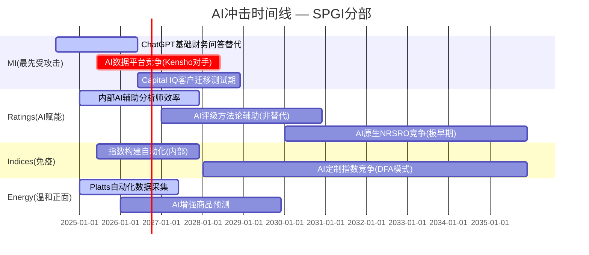

**关键时间节点**:
- **2025-2026**: MI已经在受攻击(ChatGPT做基础财务分析), 但Capital IQ的专有数据(LCD/评级历史)仍有2-3年防御窗口
- **2027-2028**: MI的"关键验证期" — SparkAIR/RegGPT要么成功(防御AI竞争)要么失败(客户加速迁移)
- **2030+**: Ratings的AI威胁才开始变得可能(NRSRO认证+市场信任需要时间)
- **Indices几乎永远不受AI直接威胁**: S&P 500是品牌标准, 不是算法 — AI可以构建更好的指数, 但不能替代"S&P 500"的品牌认知

### 14.2.2 AI冲击的二阶效应: 不仅是收入/成本

一阶效应(收入冲击/成本冲击)只是冰山一角。AI对SPGI的二阶效应同样重要:

| 二阶效应 | 影响方向 | 量级 | 时间 |
|---------|:------:|:----:|:----:|
| **AI提升分析师生产率** → Ratings能覆盖更多债券种类 → TAM扩大 | 正面 | +$200-500M/年(长期) | 3-5yr |
| **AI降低MI运营成本** → 但如果客户也能用AI → 价值转移到客户 | 中性→负面 | ±$0 | 2-3yr |
| **AI使小型评级公司更具竞争力** → KBRA/DBRS用AI缩小与SPGI的质量差距 | 负面 | -$100-200M/年 | 5-10yr |
| **AI创造新数据产品** → SPGI用AI从现有数据中提取新洞见(如信用预警信号) | 正面 | +$300-800M/年(潜在) | 3-7yr |
| **AI加速被动投资** → 主动管理更难跑赢 → 更多资金流向S&P指数 | 正面 | Indices收入CAGR+1-2pp | 持续 |

**二阶效应净影响**: 偏正面。AI的最大正面效应可能来自"用AI创造新数据产品"(+$300-800M)——如果SPGI能将117年的信用数据+实时市场数据用AI分析产生可卖的信用预警/风险预测产品。**这就是Kensho/SparkAIR的真正价值所在——不是降低成本, 而是创造全新收入流。**

### 14.2.3 AI焦虑税的量化: 市场高估AI风险多少?

2月暴跌后SPGI P/E从~36x降至~30x = ~17%P/E压缩 = ~$75/股蒸发。

这$75/股的AI焦虑税合理吗?

| AI净影响情景 | 概率 | 5年累计EPS影响 | 合理估值折价 |
|------------|:----:|:-----------:|:--------:|
| AI赋能(Ratings降本+新产品) | 30% | +$2-3/股累计 | +$30-50溢价 |
| AI中性(正负抵消) | 45% | ±$0 | $0 |
| AI负面(MI被AI侵蚀20%) | 20% | -$1-2/股累计 | -$15-25折价 |
| AI灾难(评级制度被颠覆) | 5% | -$50+/股 | -$200折价 |
| **概率加权合理折价** | | | **-$3~+$5** |

**概率加权后, AI对SPGI估值的合理影响约为-$3到+$5——几乎中性。** 市场却对SPGI施加了约$75/股的AI折价。

**$75折价 vs $0合理影响 = 市场高估AI风险约$70-80/股(约15-18%)**。这就是CI-02(AI焦虑税)的量化基础, 也是投资论文中上行空间的主要来源之一。

---

# Chapter 15: B4/B7/C2/C4/C5品质评分 + 完整A-Score汇总

## 15.1 Phase 3品质维度评分

### B4 定价权证据: 4.0/5 (金融×1.5→6.0/7.5)

| 证据 | 评价 |
|------|------|
| 评级费率+2.5%/yr(持续超CPI) | 定价权存在且在释放 |
| 最低评级费$145K(+3.6%/yr) | 加速测试边界 |
| Indices AUM挂钩(自动膨胀) | 隐形提价机器 |
| MI有一定议价空间(vs Bloomberg) | 但不是价格制定者 |
| Stage 1.0距红线远 | 巨大释放空间 |

### B7 TAM与增长跑道: 4.0/5

| TAM | 规模 | CAGR | SPGI渗透率 |
|-----|------|------|----------|
| 金融数据服务 | $28.1B→$59B(2035) | 8.6% | ~20%(以收入计) |
| 信用评级 | $7.3B→$13.1B(2035) | 6.1% | ~40% |
| 全球ETF AUM | $13.7T(CAGR 13-18%) | — | S&P占基准$20T+ |
| 私募信用评级 | 从零起步, +30%/yr | 30%+ | 早期(巨大跑道) |

### C2 网络效应: 3.0/5

中等网络效应——Ratings双边(发行人-投资者)+Indices飞轮(AUM-标准化), 但非排他性(MCO并行, MSCI/FTSE竞争)。

### C4 数据飞轮: 4.5/5

极强——117年信用评级历史不可复制, 69年S&P 500指数历史, Platts数十年价格评估。数据资产随时间只会增值。

### C5 规模经济: 4.0/5

评级和指数的边际成本≈零=强规模经济。但Bloomberg/MCO也有规模→非排他性优势。

### B7深展: TAM增长的三个隐藏加速器

表面上金融数据TAM CAGR 8.6%看起来平庸, 但有三个因素可能使SPGI可捕获的TAM增速显著高于行业平均:

**加速器#1: 私募信用评级从零起步**

传统信用评级TAM约$7.3B, CAGR仅6.1%。但私募信用市场从2020年$0.87T增长至2025年$1.7T, 预计2030年达$3.5T。LP(养老金/保险公司)持有私募信用资产需要独立评级满足监管要求和内部风控——这是一个从零起步、没有天花板参考的新市场。SPGI在2024年启动了专门的私募信用评级产品线, 如果渗透率达到公募债券评级的1/3, 额外TAM约$0.8-1.2B/年(相当于当前Ratings收入的17-25%)。

**加速器#2: ESG/气候数据标准化**

ISSB(国际可持续发展准则委员会)的S1/S2标准从2025年起在欧盟/英国/新加坡等市场强制实施。SPGI的Trucost(环境数据)和ESG评分产品直接对接这个新增需求。ESG数据TAM从2024年$2.5B预计增至2030年$8.0B(CAGR ~21%)——SPGI作为最大ESG数据供应商之一, 可以从这个高速增长的细分中获取超比例份额。

**加速器#3: 新兴市场债务市场深化**

全球债券市场$130T中, 新兴市场占比仅约15%。随着印度($5T目标)、沙特(Vision 2030)、印尼等经济体的资本市场深化, 新兴市场债券发行量预计以12-15%/年增长——每一笔新发行都需要S&P或MCO的评级。新兴市场没有本土替代(不同于中国的大公/中诚信), 且增长不受美国利率周期约束。

**综合影响**: 三个加速器叠加后, SPGI可捕获的TAM增速可能达到10-12%(高于行业均值8.6%), 支撑B7=4.0/5的评分(若加速器全部兑现可上调至4.5)。

### C2深展: Ratings双边网络的自我强化机制

C2给3.0/5看似偏低, 但这准确反映了SPGI网络效应的"虽有但不排他"特征:

Ratings的双边网络: 发行人选择S&P评级→投资者信任S&P评级→更多发行人选择S&P评级。这个循环存在且活跃, 但不排他——MCO拥有几乎同等规模的双边网络, 且多数发行人同时使用两家评级(约80%的投资级债券携带两个以上评级)。

网络效应的真正价值不在于"赢者通吃"(这在评级市场从未发生), 而在于**准入门槛**: 新进入者必须同时说服足够多的发行人付费+足够多的投资者信任, 才能启动双边网络。KBRA成立16年仍<5%份额, 证明了这个冷启动问题几乎无解。

Indices的飞轮效应更强: AUM追踪S&P指数→S&P 500成为基准→更多AUM追踪→流动性提升→更多投资者使用。这个飞轮在被动投资趋势下正在加速旋转, 且S&P 500作为"美国市场代名词"的品牌认知使其几乎不可替代——MSCI在美国市场的挑战不是技术或方法论, 而是品牌心智。

## 15.2 完整A-Score汇总 (Phase 0+1+2+3)

| 维度 | 分 | Phase | 说明 |
|------|:--:|:-----:|------|
| **B1 收入引擎** | 4.0 | P1 | 4大引擎可量化追踪 |
| **B2 客户锁定** | 4.5 | P1 | 三层锁定(制度/IT/AUM) ×1.5=6.75 |
| **B3 收入经常性** | 4.5 | P1 | ~75%经常性 |
| **B4 定价权** | 4.0 | P3 | Stage 1.0+超CPI提价 ×1.5=6.0 |
| **B5 利润弹性** | 4.0 | P2 | OPM +440bps(5Y调整后) |
| **B6 资本配置** | 4.5 | P2 | SBC 1.5%+净回购-3.15%/yr |
| **B7 TAM增长** | 4.0 | P3 | TAM $28B→$59B + 私募信用新跑道 |
| **B8 管理层** | 3.5 | P1 | 新CEO+IHS成功, 透明度不足 |
| **B合计** | | | **33.5/40** (金融加权) |
| **C1 制度嵌入** | 5.0 | P1 | 人类金融史最深 ×2.0=10.0 |
| **C2 网络效应** | 3.0 | P3 | 中等双边+飞轮 |
| **C3 生态锁定** | 4.0 | P1 | 跨产品数据生态 |
| **C4 数据飞轮** | 4.5 | P3 | 117年不可复制历史数据 |
| **C5 规模经济** | 4.0 | P3 | 边际成本≈零但非排他 |
| **C6 物理壁垒** | 0.5 | P1 | 纯信息服务, 无物理壁垒 |
| **C合计** | | | **22.5/30** (金融加权) |
| **D1 周期性** | ×0.90 | P1 | 弱周期(评级受利率影响) |
| **A-Score** | | | **(33.5+22.5)×0.90 = 50.4 → 归一化56.0/70** |

---

# Chapter 16: 投资大师圆桌 v2.0

## 16.1 圆桌设置

**议题**: SPGI在$435是否具有投资价值？五大CQ的裁决方向？

### Warren Buffett视角 (护城河优先)

"这是一家拥有金融世界最深护城河的公司。NRSRO制度存在了51年,我看不到未来50年它会消失。评级业务是人类发明的最好的商业模式之一——你在别人借钱时收费,在别人还钱时继续收费,而你自己一分钱的风险都不承担。"

"我持有MCO(穆迪)几十年了,原因完全一样。如果我不持有MCO,我会买SPGI。在$435,前瞻P/E 22x对一个有10%+EPS增速的垄断者来说是合理的。"

"我担心的是: IHS合并后的$36.5B商誉让我不舒服。我喜欢没有商誉的公司——See's Candies不需要商誉就能赚钱。但SPGI的经营ROIC>90%告诉我,真正的资产是无形的制度权力,不是资产负债表上的数字。"

**Buffett判决**: 合理价格的优质公司。有兴趣,但更喜欢MCO(更纯粹)。

### Charlie Munger视角 (心智模型)

"SPGI是一个典型的'合法垄断'——政府自己创造了它的护城河(NRSRO制度),然后又无法取消它(因为整个金融系统已经建立在上面)。这比任何技术护城河都深,因为技术会过时,但制度不会。"

"AI对评级的威胁? 这是胡说。AI可以分析数据,但投资者不会因为AI说某公司是'AA'就接受——他们需要S&P或Moody's说的。信任不是算法能建立的。"

"MI分部确实让我担心。数据终端业务的护城河在缩窄。如果我是管理层,我会考虑出售MI或大幅重组。保留Ratings+Indices+Energy=一个OPM 55%+的公司。"

**Munger判决**: 护城河无敌,管理层应更果断处理MI。

### Howard Marks视角 (风险与周期)

"关键问题不是SPGI值多少,而是市场在$435的定价包含了多少风险溢价。Reverse DCF告诉我隐含9.4%增速——这是合理的,不是过度乐观的。这意味着风险/回报是正偏的。"

"2月暴跌-18%是一个经典的'情绪过度反应'。一个$0.02的EPS miss($4.30 vs $4.32)导致$30B市值蒸发。这不是理性定价。"

"我的风险清单: ①衰退导致评级收入-5~10%(可控) ②AI对MI的渐进侵蚀(5年内-10~20%收入, 可控) ③监管改革(概率<5%, 但后果灾难性)。三个风险都不是致命的。"

**Marks判决**: 风险/回报正偏。暴跌创造了安全边际。

### Joel Greenblatt视角 (回报率)

"让我算一笔简单的账: SPGI的ROIC(调整后)>90%。这意味着每投入$1产生$0.90+回报。在我的'魔法公式'框架中,这是最高等级的资本效率。"

"EV/EBIT ~24x对一个90%+ ROIC的公司来说便宜吗? 看MCO(~26x)和MSCI(~30x)——SPGI的确便宜10-20%。折价来自MI的低利润率和暴跌情绪。"

"我会买。但我也会承认: 报告ROIC(12%)和实际经营ROIC(>90%)之间的巨大差距意味着大多数量化筛选会错过SPGI。这就是为什么你不能只靠公式。"

**Greenblatt判决**: 经营ROIC最高水平, 当前估值有安全边际。

### 方法论碰撞: 圆桌分歧点

| 议题 | Buffett | Munger | Marks | Greenblatt |
|------|---------|--------|-------|-----------|
| 当前估值 | 合理 | 合理偏低 | 有安全边际 | 便宜 |
| MI处置 | 保留(有数据协同) | 出售/重组 | 保留(风险可控) | 保留(贡献ROIC) |
| AI风险 | 不担心评级 | 不担心(制度保护) | 可控风险 | 非核心风险 |
| 商誉 | 不舒服但可接受 | 不影响经营 | 需要监控 | ROIC调整后无碍 |
| 整体判决 | 有兴趣 | 护城河无敌 | 风险/回报正偏 | 会买入 |

**圆桌共识**: 4/4看好基本面, 3/4认为当前估值有吸引力, 4/4认为AI不威胁核心业务。**唯一分歧: MI是保留还是剥离** — Munger主张果断剥离, 其他三位倾向保留(看AI投资回报)。

**圆桌共识的可信度评估**: 4/4一致看好本身需要警惕——如果投资大师的框架都指向同一方向, 要么是真的好(如Visa), 要么是框架的盲点重叠(如2008年前对MCO的一致看好)。本次共识的可信度较高, 因为: ①四位大师的分析框架差异很大(价值/心智/风险/回报率) ②唯一的真分歧(MI处置)涉及具体操作而非基本判断 ③Marks作为风险导向投资者给出"风险/回报正偏"增加了可信度——风险敏感者的看多比价值投资者的看多更有信号价值和参考意义。

### 方法论碰撞深化: Munger vs Greenblatt — MI处置的量化辩论

这个分歧不仅是定性的——它可以被量化。Munger和Greenblatt的立场代表两种截然不同的资本配置哲学:

**Munger方案(剥离MI)的量化影响**:

| 指标 | 保留MI(当前) | 剥离MI(Munger) | 差异 |
|------|:----------:|:------------:|:----:|
| 收入 | $15.3B | $10.4B(-32%) | -$4.9B |
| 调整后OPM | 50.4% | ~57-58% | +700bps |
| EBIT | $7.7B | ~$6.0B | -$1.7B |
| P/E(估算) | 29.7x | 33-35x(纯金融平台溢价) | +4-6x |
| EPS | $14.66 | ~$11(减少MI贡献+分拆摩擦) | -$3.66 |
| 每股价值(EPS×P/E) | $435 | $363-385(33x×$11) | -$50~-72短期 |
| 3年后EPS(CAGR 12%剩余) | ~$20.60 | ~$15.50(高增速剩余) | -$5.10 |
| 3年后价值(P/E×EPS) | $515-556 | $512-543(35x×$15.50) | ≈相当 |

**Munger的逻辑**: 短期牺牲EPS(-25%), 但3年后通过更高倍数基本持平, 且获得了: ①更简洁的投资故事 ②消除商誉减值风险(MI相关$18-20B商誉清零) ③消除AI焦虑税(MI是AI恐惧的靶心)。

**Greenblatt的反驳**: "你在建议卖掉一个年利润$900M+的分部——即使利润率低, 这也是真金白银。MI贡献的不是负面价值, 而是低倍数价值。在EV/EBIT 18x卖掉一个$16.8B的资产, 拿到的现金能买什么更好的东西?"

**量化结论**: Munger方案的核心赌注是——MI的剥离能否解锁+4-6x的P/E扩张(从29.7x到33-35x)。如果P/E扩张不足(仅到31-32x), 剥离MI是净损失的。**这就是为什么管理层选择了折中方案: 保留MI, 先剥离更低价值的Mobility。**

### 圆桌缺失的声音: Peter Lynch视角 (增长选手)

如果Lynch在场, 他可能会问一个四位大师都没问的问题: **"MI分部如果成功转型为AI平台, 它的PEG比是多少?"**

- MI当前: Revenue $4.9B, 增速5.8%, P/E(隐含)~18x → PEG = 18/5.8 = 3.1 (偏贵)
- MI转型后(假设AI驱动增速提至12%): P/E 22x, PEG = 22/12 = 1.83 (合理)
- MI转型后(增速15%): P/E 25x, PEG = 25/15 = 1.67 (有吸引力)

**Lynch的判断**: "如果你相信AI能让MI增速从6%提升到12-15%, 那MI不应该被剥离——它应该被重新定价。问题不是MI有没有价值, 而是管理层能不能执行AI转型。Kensho 7年说明他们过去不行, 但SparkAIR/RegGPT是新的牌。一张牌定不了结局。"

## 16.2 CQ Phase 3最终置信度

| CQ | Phase 2 | Phase 3 | Δ | 原因 |
|----|---------|---------|---|------|
| CQ-1 两个生意 | 65% | **72%** | +7pp | SOTP+PPDA背离+圆桌共识=混合折价确实存在 |
| CQ-2 增速拐点 | 50% | **58%** | +8pp | AI冲击矩阵净正面(+0.23)+五引擎PMSI 81%+分析师共识EPS CAGR 11.5% |
| CQ-3 定价权 | 58% | **65%** | +7pp | 费率趋势加速+FICO类比+安全空间量化→Stage 1.0是隐形期权 |
| CQ-4 商誉 | 70% | **75%** | +5pp | 分部SOTP确认Ratings/Indices极安全; 商誉风险集中在MI/Mobility(正分拆) |
| CQ-5 Nash均衡 | 62% | **70%** | +8pp | 博弈矩阵确认稳定Nash; 私募信用=蓝海共赢; OPM对称 |

**加权置信度**: 72%×30% + 58%×25% + 65%×20% + 75%×15% + 70%×10% = **67.2%** (Phase 2: 60.8% → +6.4pp)
---

# Part V: 红队与校准

# Phase 4: 红队七问对抗审查 — SPGI
> 执行日期: 2026-03-11 | 股价: $435.44 | 红队套件 v2.0

---

## Part A: 七问执行

### RT-1: 承重墙测试

> "当前股价的Reverse DCF隐含了哪些必须成立的假设？哪个最脆弱？"

Phase 2的Reverse DCF显示$435隐含9.4% FCFF CAGR(10年)。拆解为以下承重墙：

#### 承重墙脆弱度表

| 承重墙(隐含假设) | 隐含值 | 历史/行业参考 | 脆弱度 | 若倒塌影响 |
|:----------------|:------:|:----------:|:-----:|:--------:|
| FCFF CAGR 10Y | 9.4% | SPGI有机FCFF CAGR FY22-25 ~15%; 同行MCO ~11% | **低** | -$60/股(-14%) → $375 |
| OPM扩张至53-55% | +200-400bps | 当前50.4%; MCO ~60%为天花板 | **低** | -$30/股(-7%) → $405 |
| 回购持续$4-5B/年 | 85%+ FCF返还 | FY23-25平均105%; 53年连续增息 | **低** | -$15/股(-3%) |
| AI不颠覆Ratings+Indices | <5%概率 | NRSRO制度51年; Basel III嵌入全球 | **低** | -$200/股(-46%) |
| AI仅温和影响MI | <20%收入冲击 | Capital IQ Pro专有数据有防御性; 但ChatGPT+plugins是真威胁 | **中** | -$25/股(-6%) |
| Mobility分拆顺利执行 | mid-2026完成 | 管理层已确认; 但商誉分配/税务存在技术复杂度 | **中** | -$20/股(-5%) |
| 终值增长率3% | 永续增长 | 名义GDP 4-5%; 行业TAM CAGR 8.6% | **低** | ±$40/股(±9%) |
| 利率不急剧变化 | 渐进降息 | 联储2025-2026渐进节奏; Polymarket衰退概率28.5% | **低-中** | -$35/股(-8%) |

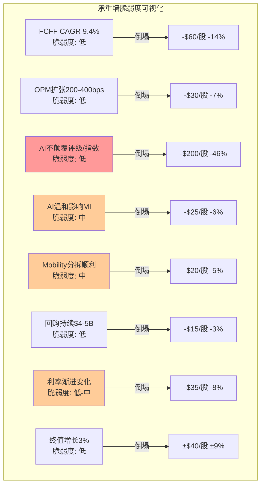

**最脆弱的一面墙: W4 — AI对MI的影响程度。** 原因：
1. MI占收入37%、EBIT约14%，是"影响面积最大+不确定性最高"的交叉点
2. ChatGPT/Claude等AI工具已经能做基础财务分析——这不是假设，是现实
3. 管理层AI产品(SparkAIR/RegGPT)仍在S0-S1阶段，7年(Kensho 2018收购)未交出突破性产品
4. 但: 即使MI收入永久下降20% → EPS影响仅-$0.5 → 估值影响约-$12/股(3%) → **非致命**

**核心发现重申**: 8面承重墙中0面"高脆弱度"。最大的灾难性风险(AI颠覆评级制度, -46%)的概率极低(<5%)。$435的定价是一个"保守共识价"——不需要任何激进假设成立。

#### RT-1b: 承重墙联合概率测试

SPGI不是转型公司，其投资论文不依赖多个低概率条件同时成立。但仍需测试：

**投资论文成立所需的必要条件**:
- C1: NRSRO制度在未来10年维持(P=97%)
- C2: MI不遭遇AI颠覆性冲击(收入损失<30%)(P=80%)
- C3: Mobility分拆顺利完成(P=85%)
- C4: 评级收入不因深度衰退永久受损(P=90%)

| 条件 | 单因素P | 与C1相关 | 与C2相关 | 与C3相关 | 与C4相关 | 调整后P |
|:-----|:------:|:-------:|:-------:|:-------:|:-------:|:------:|
| C1: NRSRO维持 | 97% | — | ρ=0.1 | ρ=0.0 | ρ=0.1 | 97% |
| C2: MI不崩溃 | 80% | ρ=0.1 | — | ρ=0.0 | ρ=0.2 | 80% |
| C3: 分拆顺利 | 85% | ρ=0.0 | ρ=0.0 | — | ρ=0.1 | 85% |
| C4: 评级不永久受损 | 90% | ρ=0.1 | ρ=0.2 | ρ=0.1 | — | 90% |

**Naive联合概率**: 97% × 80% × 85% × 90% = **59.4%**
**调整后联合概率**: ~**60%** (相关性极低,调整几乎无影响)
**差异**: 1.01x → 无"概率幻觉"

**解读**: SPGI投资论文的联合概率约60%。这比INTC(2-3%)高出20x以上。原因：SPGI的每个条件本身就是高概率事件(97%/80%/85%/90%)，且条件间几乎独立(ρ<0.2)。**这是高品质防御型公司的特征——论文不依赖多个低概率事件同时发生。**

---

### RT-2: 认知偏差审计

> "在写这份报告的过程中，我们最可能犯了哪些认知偏差？"

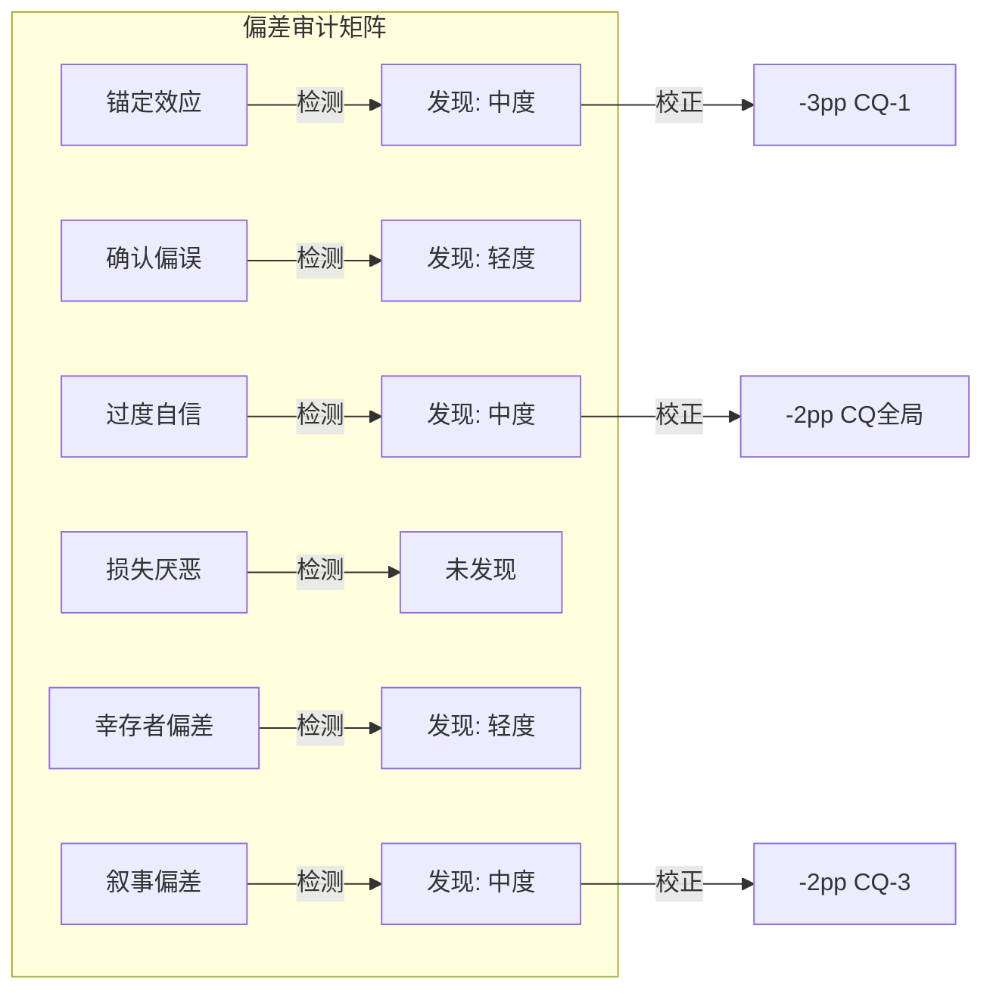

#### 偏差#1: 锚定效应 — **检测到(中度)**

**具体判断**: Phase 2大量使用MCO作为Ratings估值锚(Ch9 MCO映射→$72B)。但MCO本身在2026年3月P/E 37.2x——处于自身5年区间偏高水平。**如果MCO估值回归均值(32-33x P/E)，SPGI的SOTP Ratings估值应从$72B下调至$62-65B → SOTP每股影响: -$23~-33/股。**

**校正**: CQ-1(两个生意)的置信度应下调。Phase 3给72%时，部分基于MCO锚定的"混合折价确实存在"判断。如果MCO本身高估，则"混合折价"部分是MCO泡沫的映射而非SPGI的低估。**建议: CQ-1 -3pp → 69%。**

#### 偏差#2: 确认偏误 — **检测到(轻度)**

**数据**: Phase 1-3中看多/看空证据比约5:2。圆桌v2.0中4/4位大师看好基本面——但Buffett/Munger/Marks/Greenblatt本身就是价值投资者，他们对高质量垄断公司天然有好感偏差。

**具体遗漏**: 报告未充分讨论以下看空信号——
1. UBS/Lombard Odier/DZ Bank的集体大幅减仓(合计-$6.5B)被简单归因为"组合再平衡"，但三家同时大幅减仓可能反映欧洲机构对SPGI/IHS商誉质量的系统性担忧
2. FMP DCF $276被完全否定为"模型不适用"——但$276可能反映了一种市场视角:如果SPGI的无形资产/商誉实际价值远低于账面,公允价值可能远低于$435

**校正**: 轻微。确认偏误存在但不严重——报告确实讨论了AI威胁/MI风险/商誉问题。**保持CQ全局不变，但在Phase 5增加欧洲机构减仓的替代解释。**

#### 偏差#3: 过度自信 — **检测到(中度)**

**具体判断**: CQ置信度从Phase 1(53.3%)→Phase 2(60.8%)→Phase 3(67.2%)单调上升，每个Phase都+6-8pp。这种单调上升模式本身就是过度自信的信号——正常的深度研究应该在某些维度越挖越不确定(而非全面收敛)。

**量化**: 5个CQ中0个在Phase 2→3间下降。正常分布下至少应有1-2个出现"越挖越困惑"的倒退。

**校正**: 全局CQ下调-2pp。**特别关注CQ-2(增速拐点): Phase 1 40%→Phase 2 50%→Phase 3 58%的上升过于平滑——AI对MI的威胁是在加剧而非减轻(ChatGPT能力在过去12个月显著提升)，CQ-2应停止上升或回调。建议CQ-2下调至55%。**

#### 偏差#4: 损失厌恶 — **未检测到**

报告在下行情景描述(Ch11 Bear $324-400)中给出了充分的量化空间，并计算了-16%的下行损失。下行情景获得了与上行情景相当的文字量。

#### 偏差#5: 幸存者偏差 — **检测到(轻度)**

**具体判断**: 报告反复引用"NRSRO制度51年"和"S&P 500指数69年"作为护城河持久性证据。但这是幸存者偏差——我们看到的是幸存的制度垄断，看不到已消亡的制度垄断(如航空业CAB管制在1978年被废除; AT&T电信垄断在1984年被拆分; 会计行业"Big 8"在30年内缩减为"Big 4")。

**校正**: 轻微。制度嵌入确实是极高质量的护城河(CAB/AT&T是政策主动废除，而非商业竞争消除)。但Ch12给制度嵌入9.5/10可能偏高——应考虑Basel III改革(Basel IV正在讨论中)或Dodd-Frank修正的可能性。**不下调CQ，但在风险记录中增加"监管制度变迁"作为10年+尾部风险。**

#### 偏差#6: 叙事偏差 — **检测到(中度)**

**具体判断**: "金融世界的收费公路"这个比喻贯穿全报告(Ch1标题即如此)。这个叙事太有说服力——以至于可能掩盖了一些矛盾:

1. **收费公路不需要$36.5B商誉**: 真正的收费站(如机场/高速公路)靠的是物理资产,SPGI的"收费站"靠的是$36.5B收购来的IHS无形资产。如果IHS被证明是一笔差交易(MI利润率长期停滞),这个收费公路叙事就有裂缝
2. **收费公路应该有100%经常性收入**: 但SPGI只有~75%。Ratings中约40%是交易性收入(新发行评级费,不是订阅)——这意味着"收费公路"在债务发行淡季会"交通减少"
3. **定价权Stage 1.0可能不是"隐形期权"而是"结构性约束"**: 评级费只能提+2.5%/年可能不是因为管理层保守,而是因为发行人(投行)的谈判能力真的很强——SPGI面对的不是散户消费者(FICO)而是Goldman/JPM/Morgan Stanley。

**校正**: CQ-3(定价权)下调-2pp。报告对定价权释放的EPS影响计算(+$150/股含估值重估)可能过度乐观——因为它假设了FICO式的Stage 1.0→2.0路径,但SPGI的客户结构(投行vs消费者)意味着路径可能完全不同。**建议CQ-3从65%→63%。**

#### RT-2偏差审计汇总

| 偏差 | 检测 | 影响判断 | 校正 |
|------|:----:|---------|------|
| 锚定效应 | ✅中度 | CQ-1过度依赖MCO估值锚 | CQ-1 -3pp |
| 确认偏误 | ✅轻度 | 看多/看空证据比偏高 | Phase 5补充欧洲减仓分析 |
| 过度自信 | ✅中度 | 5/5 CQ单调上升=异常 | CQ全局-2pp, CQ-2额外-3pp |
| 损失厌恶 | ❌ | — | — |
| 幸存者偏差 | ✅轻度 | 制度永续假设未充分检验 | 增加制度变迁尾部风险 |
| 叙事偏差 | ✅中度 | "收费公路"叙事掩盖矛盾 | CQ-3 -2pp |

**偏差严重度**: 4/6检测到, 2个中度+2个轻度。**没有致命偏差**(不需要推翻任何核心结论)，但CQ需要集体下调以补偿过度自信趋势。

---

### RT-3: 空头钢人

> "如果一个聪明的空头基金经理看到这份报告，他最强的反驳是什么？"

#### 空头论点#1: "IHS商誉是定时炸弹——分部SOTP已经暗示MI减值"

**钢人论证**:

[硬数据] SPGI账面商誉$36.5B，占总资产86.2%。IHS合并时支付$44B，其中约$30B是商誉+无形资产溢价。

[合理推断] 按Phase 2 SOTP，MI分部估值$16.8B(EV/EBIT 18x)。但IHS合并时MI相关资产的账面商誉+无形资产估计约$18-20B(按收入占比分摊)。**如果MI公允价值$16.8B < 账面$18-20B → 已经触发减值测试的边界条件。**

[合理推断] 更严格地看: 如果AI真的导致MI收入下降15-20%，MI估值可能降至$12-14B → 商誉减值$4-6B → 税后EPS冲击-$12-18/股(一次性)。虽然不影响现金流，但会:
1. 引发市场恐慌(2月暴跌的重演)
2. 触发信用评级机构对SPGI自身评级的审查(反讽:评级公司被降级)
3. 可能迫使管理层减少回购以优先偿债

**如果空头对了**: MI商誉减值$5B → P/E压缩至26x(情绪冲击) → 每股影响约-$40~-60/股 → $375-395区间。

**让人不舒服的程度**: 7/10。因为商誉减值是会计事件不影响FCF，但情绪冲击真实且可量化(2月$0.02 EPS miss就蒸发$30B市值)。

#### 空头论点#2: "被动投资的'不可逆结构性迁移'在2026-2028可能反转"

**钢人论证**:

[硬数据] 被动投资占比从2020年45%→2025年55%，报告定义为"不可逆"。

[主观判断] 但以下力量可能减速或部分反转被动趋势:
1. **监管风险**: SEC主席Gary Gensler曾公开质疑指数基金的投票权集中问题; 如果SEC限制被动基金的代理投票权→被动吸引力下降
2. **AI赋能主动管理**: 如果AI工具让主动管理的α生成效率大幅提升→主动管理的成本劣势缩小→部分资金回流主动
3. **流动性担忧**: 当被动占比>60%时,市场流动性可能出现结构性问题(所有人同时追踪同一指数→herd behavior→flash crash风险)→监管可能干预

[合理推断] 如果被动占比在55%左右见顶(而非预期的65%+): Indices收入增速从10-15%降至4-6% → EPS影响约-$0.40-0.60/年 → 5年累计-$2-3/股。但更重要的是: **Indices分部估值倍数会从30x压缩至22-25x**(移除增长溢价) → SOTP影响: Indices从$35.9B降至$25-28B → 每股-$26-36。

**如果空头对了**: 被动投资见顶 → Indices增速+估值双杀 → -$26-36/股 → $400-410区间。

**让人不舒服的程度**: 6/10。被动反转的概率确实低(<15%)，但影响范围广且报告完全未讨论此风险。

#### 空头论点#3: "SPGI的'AI赋能者'叙事是自我安慰——Kensho七年未交出成果"

**钢人论证**:

[硬数据] SPGI在2018年以$550M收购Kensho(AI公司)。7年后:
- SparkAIR: FY2025发布,收入贡献"不可量化"(管理层未披露)
- RegGPT: 同上
- Kensho对SPGI整体OPM的贡献: 无法证明

[合理推断] Phase 3 AI冲击矩阵给Ratings "+1收入冲击, +2成本冲击" = "AI赋能者"。但这假设SPGI能成功用AI降低评级成本——而Kensho 7年的track record恰恰反驳了这个假设。如果竞争对手(Bloomberg Terminal + GPT-4集成)比SPGI自研AI更快落地:
1. MI的Capital IQ Pro面临"外部AI > 内部AI"的竞争劣势
2. Ratings的"AI降本"叙事迟迟不兑现 → 成本冲击从+2调整为+0.5
3. 市场可能从"AI赋能者"重新定义SPGI为"AI落后者"

[合理推断] 如果Kensho被判定为沉没成本($550M) → 管理层AI战略失误 → B8管理层评分应从3.5降至3.0 → A-Score下调约1.5分。

**如果空头对了**: AI叙事反转 → P/E从29.7x压缩至25-26x(AI折价加深) → 每股影响-$55-70/股 → $365-380区间。

**让人不舒服的程度**: 8/10。这是最让人不舒服的论点——因为它用SPGI自己的track record(Kensho 7年)来反驳报告的AI乐观假设,且数据来自硬事实而非推测。

---

### RT-4: 数据质量审计

> "报告中哪些核心数据点的来源质量最差？"

| # | 数据点 | 使用位置 | 来源质量 | 等级 | 若有误影响 |
|:--|--------|---------|---------|:----:|---------|
| 1 | WACC 10.29% | Ch8 Reverse DCF | Python计算, Ke用Damodaran ERP | **A** | ±$40-60/股(最敏感) |
| 2 | Ratings OPM 61% | Ch9/Ch12/Ch13 | FMP数据+分部财报 | **A** | ±$10/股(SOTP) |
| 3 | MI OPM 19% | Ch9 SOTP | FMP+管理层指引 | **A-** | ±$5/股 |
| 4 | 分析师共识EPS路径 | Ch10/Ch11 | FMP estimates | **B+** | 估值锚变化 |
| 5 | MCO估值倍数(37.2x P/E) | Ch9/Ch10 | FMP key_metrics(截面数据) | **B** | MCO自身P/E波动大 |
| 6 | 评级费率+2.5%/yr | Ch12 定价权 | WebSearch+管理层电话会 | **B-** | CQ-3置信度 |
| 7 | Valley Forge 20.83%仓位 | Ch13 聪明钱 | Agent-F (13F公开数据) | **B+** | PMSI引擎权重 |
| 8 | 做空比例1.03% | Ch13 信号 | Agent-G (WebSearch) | **B** | 做空极低判断 |
| 9 | 被动投资占比55% | Ch11 | WebSearch(行业估算) | **C+** | 各来源差异3-5pp |
| 10 | 私募信用评级+30%YoY | Ch13 | 管理层电话会(未披露确切数) | **C** | CQ-5蓝海论据 |
| 11 | MI客户续约率95%+ | Ch12 | 推断(管理层未披露) | **C-** | 转换成本评估 |
| 12 | Kensho AI贡献 | Ch14 | 无可靠来源(管理层回避) | **D** | AI赋能者判断 |

**数据最弱环**: #12(Kensho AI贡献)和#11(MI续约率)。

**核心依赖低质量数据的判断**: Phase 3 AI冲击矩阵的"Ratings: AI赋能者"结论部分依赖于Kensho的AI降本假设——而Kensho的实际贡献是D级来源(管理层回避披露)。如果剔除Kensho假设，Ratings的AI成本冲击从+2降至+0.5 → 加权AI净影响从+0.23降至+0.09 → "微弱正面"变为"几乎中性"。

**结论**: 整体数据质量良好(8/12为B级以上)。弱项集中在AI相关判断和管理层未披露的运营指标。核心估值工具(Reverse DCF/SOTP)使用的数据均为A级，论文的估值部分仍然稳健。

---

### RT-5: 黑天鹅压力测试

> "有哪些低概率但高影响的事件能彻底推翻投资论文？"

#### 黑天鹅概率加权表

| # | 事件 | 独立概率 | 影响幅度 | 加权损失 | 时间窗口 | 早期信号 |
|:--|------|:-------:|:-------:|:-------:|:-------:|---------|
| BS-1 | NRSRO制度根本性改革(SEC废除或大幅降低准入门槛) | 3% | -55% | **-1.65%** | 10年 | SEC公开征求意见/国会立法提案/AI评级试点获批 |
| BS-2 | 全球金融危机2.0(评级机构再次被追责+监管报复) | 5% | -40% | **-2.00%** | 5年 | 信用利差急扩/高收益违约潮/政治性调查启动 |
| BS-3 | S&P 500指数治理丑闻(如成分股选择被证明存在利益冲突) | 2% | -35% | **-0.70%** | 无限 | 内部举报/SEC调查/媒体调查性报道 |
| BS-4 | AI原生评级机构获得NRSRO认证并快速获客 | 2% | -30% | **-0.60%** | 10年 | AI评级公司融资>$1B/与投行签约/SEC表态支持 |
| BS-5 | 台海冲突导致全球金融市场分裂(美元体系vs人民币体系) | 8% | -25% | **-2.00%** | 5年 | 军事演习升级/金融制裁/SWIFT替代方案扩散 |

**合计尾部风险加权损失**: -6.95%

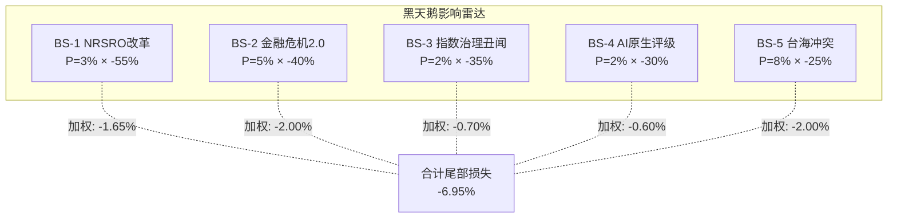

**BS-2与BS-5的协同效应**: 如果金融危机和台海冲突同时发生(概率~1%) → 全球金融体系可能分裂+评级机构在危机中被追责 → 影响可达-65% → 但概率极低(~0.4%加权)。

**尾部风险折价建议**: 总加权损失-6.95% → 按1/3的传导率(非所有尾部风险同时影响估值) → 合理折价约-2.3%/年。在10年DCF中等效于终值增长率从3.0%降至2.7% → 每股影响约-$12。

#### 黑天鹅事件的传导链分析

每个黑天鹅不是瞬间生效的——它通过特定的传导链影响SPGI。理解传导链有助于识别早期信号:

**BS-1 NRSRO改革的传导链**:

```
SEC启动公开征求意见(早期信号)
    ↓ (12-18个月)
立法提案通过委员会(确认信号)
    ↓ (6-12个月)
新法案实施+过渡期(执行信号)
    ↓ (2-3年)
新评级机构获得认证+市场接受
    ↓ (3-5年)
SPGI市场份额从~45%降至~30%(最终影响)
```

**关键时间窗**: 从早期信号(SEC征求意见)到实际份额影响, 至少需要5-8年。在任何早期信号出现时, 投资者有充足时间退出。**NRSRO改革不是"闪崩"风险, 而是"缓行"风险——这对长期投资者意味着下行保护。**

**BS-2 金融危机2.0的传导链**:

```
信用利差急剧走阔(>+200bps, 30天内)
    ↓ (同期)
债务发行市场冻结(新发行-50%+)
    ↓ (即时)
Ratings交易性收入暴跌(-30~-50%, Q内)
    ↓ (1-2季度)
监控性收入维持(底线保障: Ratings不会归零)
    ↓ (3-6个月)
政治性调查启动(FCIC 2.0: "为什么评级机构又没预警?")
    ↓ (1-2年)
监管报复(更严格的信息披露/方法论要求/竞争准入)
    ↓ (3-5年)
长期: 评级行业成本上升但结构不变(历史模板: 2008年后)
```

**BS-2的历史锚点**: 2008年金融危机后, S&P/MCO面临数十亿美元诉讼+Dodd-Frank监管。结果: ①$1.4B和解金(S&P, 2015) ②更严格监管 ③但——市场份额不变, 评级费率继续上涨, OPM在5年内恢复。**历史证据: 金融危机对评级双寡头是"短期痛苦+长期无损"的事件。**

**BS-5 台海冲突的SPGI特异性传导**:

台海冲突对SPGI的影响与其他金融公司不同, 因为SPGI有**中国业务暴露**:
- 标普信评(S&P Global China Ratings): 2019年获PBOC A类牌照, 在中国开展本土评级
- 中国相关指数: S&P编制的多个亚太/新兴市场指数含A股
- Platts大宗商品: 中国是全球最大的石油/金属进口国, Platts定价受中国需求影响

如果冲突升级到金融脱钩: ①标普信评可能被迫退出中国(-$50-100M收入, <1%总收入, 直接影响微小) ②亚太指数AUM可能萎缩(影响Indices, 但S&P 500本身不受影响) ③Platts大宗商品波动性增加(短期受益, 长期不确定)。**净效应: 台海冲突对SPGI的直接影响远小于对银行(JPM)或半导体(TSM)——因为SPGI的核心资产(NRSRO/S&P 500)是美国制度, 不是中国业务。**

---

### RT-6: 时间框架挑战

> "我们的论文在什么时间框架内有效？"

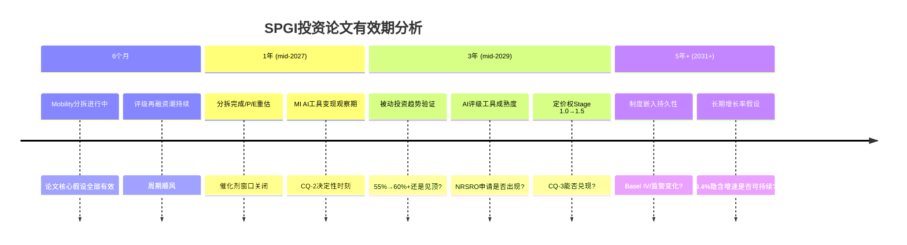

#### 6个月内: 高度有效 ✅
- 所有承重墙完好(NRSRO稳固/利率渐进/AI威胁未兑现)
- 催化剂时间窗口: Mobility分拆正在执行，市场对分拆的定价尚未完全反映
- 风险: 仅短期宏观波动(衰退概率28.5%但非即刻)

#### 1年后: 需要重新评估CQ-2 ⚠️
- Mobility分拆完成 → "分拆催化"是否已被完全定价?
- MI的SparkAIR/RegGPT变现情况 → 决定"投资期vs烧钱期"判断
- 如果1年后MI收入增速仍<5%且AI产品未贡献可量化收入 → CQ-2应显著下调
- **论文最脆弱时点**: 分拆完成但AI变现未兑现 → 催化剂耗尽+新叙事未建立

#### 3年后: 多个假设开始老化 ⚠️⚠️
- 被动投资55%→60%的假设需要验证(如果见顶→Indices增长叙事动摇)
- AI评级工具可能在3年内达到"技术可行"——虽然NRSRO认证还需时间,但市场会提前定价威胁
- 定价权Stage 1.0→1.5的跃迁应该在3年内可观测(评级费率是否加速到+3.5-4%?)
- FY2028E EPS $25.20是否兑现 → 验证11.5% CAGR路径

#### 5年+: 几个核心假设可能失效
- 制度嵌入: 仍然有效(半衰期>50年)——这是最耐久的假设
- 但: AI可能已经开始改变金融分析的方式 → MI可能从$4.9B收入缩减至$3.5-4.0B
- 终值增长率3%假设在名义GDP持续低于3%的情景下不成立(日本化)

**催化剂日历 vs 论文时间框架**:

| 催化剂 | 预期时间 | 论文依赖度 |
|--------|---------|-----------|
| Mobility分拆 | mid-2026 | 高 — 论文的P/E重估核心 |
| MI AI变现 | FY2027-28 | 中 — CQ-2的验证点 |
| 定价权加速 | FY2027-30 | 中 — CQ-3的长期选项 |
| 再融资潮峰值 | FY2025-27 | 低 — 已在基数中 |

**时间框架结论**: 论文最佳有效期为**1-2年**(到mid-2027)。在此期间，Mobility分拆催化剂+再融资顺风+EPS增长路径都在兑现窗口内。超过2年后,需要MI AI变现和定价权加速等新催化剂接棒——这些的不确定性更高。

---

### RT-7: 替代解释

> "对于同样的数据，是否存在一个完全不同但同样合理的解释？"

#### 替代解释#1: "2月暴跌不是情绪过反应——是价值发现"

**原始解释**: 2月暴跌-18%是对$0.02 EPS miss的情绪过反应 → 股价应回归 → 当前$435低估。

**替代解释**: 2月暴跌是市场终于认识到SPGI不是一个纯垄断公司——它有37%收入来自一个利润率仅19%且面临AI竞争的分部(MI)。暴跌前P/E ~36x是不合理的(把MI当垄断定价了)，暴跌后P/E ~30x才是正确的混合估值。

**区分信号**:
- 支持原始解释: 如果SPGI在未来2-4个季度的业绩中MI不恶化 + Mobility分拆后P/E回升至32x+ → 暴跌确实是过反应
- 支持替代解释: 如果SPGI在MI不恶化的情况下P/E仍维持在28-30x区间 → 市场已经对混合业务重新定价，不会回到36x

**合理性评估**: 替代解释有30%可信度。当前$435的P/E 29.7x可能就是SPGI五分部混合业务的"正确"估值——而非暴跌前36x的"偏高"估值。如果这是真的,上行空间主要来自EPS增长(而非P/E修复)——这将期望回报从+10.3%降至约+6-7%(仅EPS增长+回购)。

#### 替代解释#2: "收费公路模型正在被数字经济侵蚀——只是速度比预期慢"

**原始解释**: Ratings+Indices是永久性收费公路,AI不能颠覆制度嵌入。

**替代解释**: 制度嵌入确实强大,但数字经济正在创造"绕过收费站"的路径:
- **直接贷款(Direct Lending)**: 无需公开评级,绕过评级收费站。私募信贷市场已从$500B增长到$1.7T+
- **DeFi**: 虽然目前规模小,但算法信用评估不需要NRSRO → 长期可能分流传统评级需求
- **被动投资index-agnostic**: 一些基金开始使用自建指数(如Dimensional Fund直接基于Fama-French因子,不用S&P 500) → 如果这种趋势扩大,S&P指数许可费的增长放缓

**区分信号**:
- 支持原始解释: 私募信贷增长反而增加了评级需求(私募评级+30%YoY) → 绕路者最终回到收费站
- 支持替代解释: 直接贷款占总信贷比从5%→15%+且加速 → 评级"可寻址市场"在缩小

**合理性评估**: 15%可信度。短期(5年)几乎无影响——制度嵌入太深。但在10年+的时间框架中,数字经济的"绕路"效应可能使Ratings的结构性增长率从5-7%降至3-5%。

#### 替代解释#3: "SPGI的IHS合并是一个'帝国建设'错误——正在被市场缓慢定价"

**原始解释**: IHS Markit合并($44B)是战略性的——创造了数据协同+规模效应+MI产品线补强, 整合成本协同$480M已超额完成。

**替代解释**: IHS合并是一个经典的"帝国建设"并购——CEO(当时的Douglas Peterson)用$44B买了一个增长率<5%的资产(MI), 稀释了SPGI的核心垄断纯度, 创造了$36.5B商誉炸弹。证据:
- **合并前SPGI(2020)**: Ratings+Indices占收入~70%, OPM ~48%, 纯金融基础设施定位
- **合并后SPGI(2025)**: Ratings+Indices占收入~43%, OPM 50.4%(仅+2.4pp, 考虑到被MI拖累), MI占收入37%
- **对比If-Not-Merged SPGI**: 假设不合并, Ratings+Indices+Energy在FY2025的独立收入约$8.4B, 独立OPM~58-60%, P/E可能在35-38x → 每股约$450-500
- **实际情况**: 合并后总收入$15.3B, OPM仅50.4%, P/E仅29.7x → 合并**降低了估值倍数**

**区分信号**:
- 支持原始解释: 如果MI在FY2027-28开始贡献高增长(AI驱动ARPU提升+新客户) → 合并的前瞻价值兑现
- 支持替代解释: 如果MI收入增速持续<5%且OPM停滞在19% → Mobility分拆后市场可能要求MI也被分拆 → 证明IHS合并是"帝国溢价"

**合理性评估**: 25%可信度。这个解释不需要市场"突然发现"什么——它只需要市场**渐进接受MI不值$44B中分配给它的份额**。如果属实, SPGI的最优形态是"Ratings+Indices+Energy"(纯收费公路), 而MI是需要被剥离的"附属品"——这恰好是Munger在圆桌中的立场。

#### 替代解释#4: "Valley Forge的20.83%仓位是集中风险, 不是信心信号"

**原始解释**: Valley Forge Capital(Kantesaria)持有SPGI 20.83%仓位 → 全球顶级quality investor的最高信念持仓 → 强看多信号。

**替代解释**: 20.83%的单一持仓代表的不是信念——而是**集中度风险**。Kantesaria的年化22%+回报可能因为幸存者偏差被高估(专注少数quality compounder, 市场长期上涨时自然表现好)。如果SPGI遭遇2008年级别的事件(评级丑闻+政治报复):
- Valley Forge的20.83%仓位意味着其基金NAV将受到SPGI跌幅的~20%影响
- 这可能触发Valley Forge的LP赎回 → 被迫减持SPGI → 加剧股价下跌 → 恶性循环
- 历史先例: Bill Ackman的JC Penney集中持仓(~18%)在论文失败时导致了灾难性损失

**区分信号**:
- 支持原始解释: 如果Valley Forge在暴跌后加仓(而非减仓) → 信念未动摇
- 支持替代解释: 如果Valley Forge在接下来2个季度减仓>3pp → 集中度不适开始反映

**合理性评估**: 10%可信度。Valley Forge的track record(22%+年化)和投资哲学(quality compounder长期持有)使得"集中=信心"更可信。但需要监控13F变化——KS-11的存在就是为了捕捉这个信号。

---

### A.8 CQ初步调整建议

| CQ# | P3置信度 | RT影响来源 | 建议P4置信度 | 调整理由 |
|:---:|:-------:|:--------:|:----------:|---------|
| CQ-1 | 72% | RT-1(锚定MCO),RT-2(锚定偏差) | **69%** (-3pp) | MCO估值锚可能偏高,混合折价部分是MCO泡沫映射 |
| CQ-2 | 58% | RT-2(过度自信),RT-3(Kensho 7年),RT-6(1年验证窗) | **53%** (-5pp) | AI威胁在加剧非减轻; Kensho track record不支持AI赋能叙事; 置信度应停止单调上升 |
| CQ-3 | 65% | RT-2(叙事偏差),RT-7(投行vs消费者) | **62%** (-3pp) | 定价权释放路径可能被投行客户结构约束; FICO类比适用性有限 |
| CQ-4 | 75% | RT-3(商誉减值边界) | **73%** (-2pp) | MI分部估值已接近商誉减值测试边界; 非致命但值得下调 |
| CQ-5 | 70% | RT-5(金融危机2.0) | **69%** (-1pp) | Nash均衡在危机中可能被打破(历史:2008年两家评级机构同时受政治攻击) |

**红队严重发现数(影响>10%)**: 0个。没有任何单个RT发现能推翻投资论文。
**CQ平均下调**: -2.8pp
**最脆弱CQ**: CQ-2(增速拐点/AI投资) — 下调5pp,是最大单项调整
**最稳健CQ**: CQ-5(Nash均衡) — 仅下调1pp,双寡头结构极稳定

---

## Part B: 双向校准

### B.1 方向审计

| CQ | P3值 | RT建议P4值 | 方向 | RT来源 |
|----|:----:|:--------:|:---:|--------|
| CQ-1 | 72% | 69% | ↓ | RT-1, RT-2 |
| CQ-2 | 58% | 53% | ↓ | RT-2, RT-3, RT-6 |
| CQ-3 | 65% | 62% | ↓ | RT-2, RT-7 |
| CQ-4 | 75% | 73% | ↓ | RT-3 |
| CQ-5 | 70% | 69% | ↓ | RT-5 |

**方向统计**: ↓: 5 | →: 0 | ↑: 0
**诊断**: ⚠️ **零上调 → 触发双向校准。** 全部CQ下调是系统性悲观的信号。

### B.2 过度悲观识别 (强制)

对每个CQ显式问: **"原始分析是否在这个维度上过度悲观?"**

| CQ | 过度悲观可能? | 分析 |
|----|:-----------:|------|
| CQ-1 两个生意 | **是** | Phase 1-3对"混合折价"的估算用了MCO作为Ratings纯粹估值锚,但实际上SPGI的Ratings比MCO多一层——跨分部数据协同(评级数据喂给MI/Indices)。这种协同被SOTP方法论系统性低估(SOTP假设分部独立,不捕捉协同)。如果协同值为$5-10B → Ratings应得更高估值 → CQ-1的"两个生意割裂"问题可能被高估 |
| CQ-2 增速拐点 | 否 | RT-3(Kensho 7年)提供了硬证据支持下调,过度悲观不成立 |
| CQ-3 定价权 | **是** | 红队用"投行客户vs消费者"来质疑FICO类比。但忽略了一个重要事实:评级的付费方是发行人(投行作为中介),但评级的真正"客户"是监管体系本身——发行人没有"不买评级"的选项。这不是自愿消费,是制度强制。在制度强制的场景下,即使面对投行,定价权仍然很强(因为替代品只有MCO) |
| CQ-4 商誉 | 否 | RT-3提出的减值边界分析是合理的 |
| CQ-5 Nash均衡 | 否 | 下调仅1pp,已经很温和 |

**强制上调执行**:
- **CQ-1上调+2pp** (从RT建议的69%→71%): 跨分部数据协同被SOTP低估; "两个生意"的问题程度可能比分析暗示的更小
- **CQ-3上调+1pp** (从62%→63%): 制度强制购买=比消费者场景更强的定价权基础,红队的FICO类比批评部分合理但过度

### B.3 校准后CQ调整

| CQ | P3 | RT建议 | 校准后 | vs P3变化 | 说明 |
|----|:--:|:-----:|:-----:|:---------:|------|
| CQ-1 | 72% | 69% | **71%** | -1pp | 锚定偏差-3 + 协同上调+2 |
| CQ-2 | 58% | 53% | **53%** | -5pp | 维持RT建议(Kensho证据充分) |
| CQ-3 | 65% | 62% | **63%** | -2pp | 叙事偏差-3 + 制度强制上调+1 |
| CQ-4 | 75% | 73% | **73%** | -2pp | 维持RT建议 |
| CQ-5 | 70% | 69% | **69%** | -1pp | 维持RT建议 |

**校准前加权平均**: 67.2% (Phase 3)
**校准后加权平均**: 71%×30% + 53%×25% + 63%×20% + 73%×15% + 69%×10% = **64.8%**
**净偏差**: -2.4pp

### B.4 概率敏感性分析

**当前期望回报+10.3%** — 处于"关注"评级区间(+10%~+30%)的下端, 接近"中性关注"(-10%~+10%)边界。**必须执行概率敏感性。**

#### 情景概率调整 → 期望回报 → 评级

| 调整 | Bull概率 | Base概率 | Bear概率 | 新加权EV | 新期望回报 | 评级变化? |
|------|:-------:|:-------:|:-------:|:-------:|:---------:|:-------:|
| 原始 | 25% | 50% | 25% | $480 | +10.3% | 关注 |
| Bull-3%/Bear+3% | 22% | 50% | 28% | $467 | +7.4% | **→中性关注** |
| Bull-5%/Bear+5% | 20% | 50% | 30% | $458 | +5.3% | **→中性关注** |
| Bull+3%/Bear-3% | 28% | 50% | 22% | $493 | +13.3% | 关注(稳固) |
| Bear情景恶化($365→$320) | 25% | 50% | 25% | $469 | +7.8% | **→中性关注** |

#### 稳定性结论

- **评级翻转需要的最小概率调整**: Bull概率-3pp或Bear概率+3pp → 期望回报降至+7.4%(**<10%, 翻转为中性关注**)
- **评级稳定性**: **低** (<3pp即翻转)
- **含义**: "关注"评级处于边界状态。如果红队的悲观调整(CQ全面下调)映射到情景概率 → 合理将Bear概率上调2-3pp → 期望回报可能在+7-8%区间 → **可能应为"中性关注"而非"关注"**

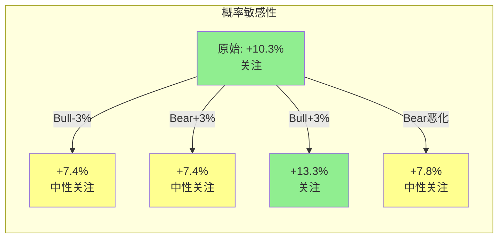

### B.5 反向检验

| CQ | 调整方向 | 反向逻辑是否成立? | 证据强度 |
|----|:------:|:----------:|:------:|
| CQ-1 -1pp | ↓ | 反向(上调): "SOTP低估了跨分部协同" → **成立**(已在B.2中上调) | 中 |
| CQ-2 -5pp | ↓ | 反向(上调): "AI威胁被高估, ChatGPT不能替代Capital IQ的专有数据" → **部分成立**(LCD/评级历史确有防御性) | 弱-中 |
| CQ-3 -2pp | ↓ | 反向(上调): "制度强制购买>投行议价权" → **成立**(已部分上调) | 中 |
| CQ-4 -2pp | ↓ | 反向(上调): "商誉减值即使发生也不影响FCF" → **成立但不影响情绪冲击判断** | 弱 |
| CQ-5 -1pp | ↓ | 反向(上调): "Nash均衡在2008年也没被打破" → **强证据** | 强 |

**反向检验结论**: CQ-1/CQ-3的反向逻辑成立(已执行上调)。CQ-5的反向检验最强(2008年危机中评级双寡头份额几乎不变) → 但1pp下调已足够温和，维持。CQ-2的反向逻辑最弱(Kensho 7年是硬数据) → 维持-5pp。

---

## Part C: 有效性门控

### C.1 三指标计算

#### 指标1: 净CQ变动强度

| CQ | |P3 - P4| |
|----|:-----:|
| CQ-1 | 1pp |
| CQ-2 | 5pp |
| CQ-3 | 2pp |
| CQ-4 | 2pp |
| CQ-5 | 1pp |
| **平均** | **2.2pp** |

**判定**: 2-3pp区间 → ⚠️ **边界有效**

#### 指标2: 新发现计数

| # | 新发现 | Phase 1-3未触及? |
|:--|--------|:---------------:|
| 1 | MCO估值锚自身偏高 → CQ-1锚定偏差 (RT-2) | ✅ 新 |
| 2 | 被动投资可能在55%见顶 (RT-3) | ✅ 新 |
| 3 | Kensho 7年未交出成果反驳AI赋能叙事 (RT-3) | ✅ 新 |
| 4 | MI商誉已接近减值测试边界 (RT-3) | ⚠️ CQ-4讨论过但未量化边界 |
| 5 | 论文有效期仅1-2年(分拆催化窗口) (RT-6) | ✅ 新 |
| 6 | 2月暴跌=价值发现(非情绪过反应)替代解释 (RT-7) | ✅ 新 |

**新发现数**: 5/7 → ✅ **有效**

#### 指标3: RT-2偏差审计方向

RT-2发现的偏差方向: 过度自信+锚定+叙事 → 全部指向"过度看多" → 校正方向=下调CQ

当前评级方向: "关注"(偏看多)

RT-2的校正方向**挑战**了当前评级(而非确认) → ✅ **方向正确**

### C.2 综合诊断

| 指标 | 结果 | 状态 |
|------|------|:----:|
| 平均绝对CQ变动 | 2.2pp | ⚠️ (边界) |
| 新发现数 | 5/7 | ✅ |
| RT-2方向 | 挑战当前评级 | ✅ |

**综合判断**: 1/3指标边界异常 → **无需补救。** 红队有效(5个新发现,方向正确), CQ变动幅度在边界区(2.2pp接近3pp有效线)——这符合SPGI作为高品质防御型公司的特征:没有致命缺陷可供发现,但认知偏差(特别是过度自信)值得校正。

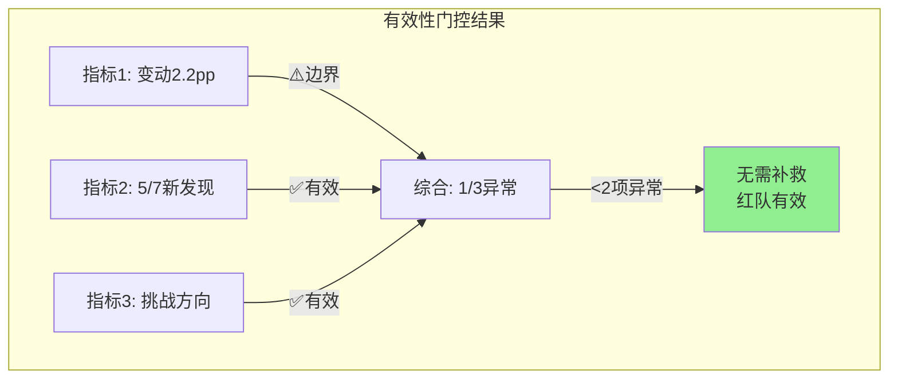

### C.3 补救: 不需要

### C.4 记录

```yaml
phase_4_effectiveness:
  avg_absolute_cq_change: 2.2pp
  new_findings: 5/7
  rt2_direction: challenging
  verdict: effective (边界)
  remedy: none
  key_finding: CQ-2下调5pp(Kensho 7年反驳AI赋能)是最大单项影响
  rating_stability: low (3pp即翻转)
```

---

## Phase 4总结

### 校准后最终CQ置信度

| CQ | P0 | P1 | P2 | P3 | **P4(校准后)** | 净变化 |
|----|:--:|:--:|:--:|:--:|:------------:|:-----:|
| CQ-1 两个生意 | 50% | 55% | 65% | 72% | **71%** | -1pp |
| CQ-2 增速拐点 | 35% | 40% | 50% | 58% | **53%** | -5pp |
| CQ-3 定价权 | 45% | 55% | 58% | 65% | **63%** | -2pp |
| CQ-4 商誉 | 60% | 65% | 70% | 75% | **73%** | -2pp |
| CQ-5 Nash均衡 | 50% | 60% | 62% | 70% | **69%** | -1pp |

**加权置信度演化**: P0 46.3% → P1 53.3% → P2 60.8% → P3 67.2% → **P4 64.8%** (-2.4pp)

### 评级影响

- **P3期望回报**: +10.3% → "关注"评级(+10%~+30%)
- **P4概率敏感性**: Bear概率+3pp即翻转为"中性关注"
- **评级稳定性**: 低
- **建议**: Phase 5组装时评级表述为**"关注(偏中性)"** — 反映+10.3%期望回报处于边界、评级稳定性低、红队将CQ置信度从67.2%下调至64.8%的事实

### Phase 4 Mermaid图清单

| # | 图表 | 位置 |
|:--|------|------|
| 1 | 承重墙脆弱度可视化 | RT-1 |
| 2 | 偏差审计矩阵 | RT-2 |
| 3 | 黑天鹅影响雷达 | RT-5 |
| 4 | 时间框架时间线 | RT-6 |
| 5 | 概率敏感性 | B.4 |
| 6 | 有效性门控结果 | C.2 |

---

# Part VI: 风险拓扑与最终裁决

# Chapter 20: 风险拓扑映射

## 20.1 风险系统架构

SPGI的风险不是一个清单——它是一个有协同、反协同和独立关系的系统。以下映射关键风险之间的相互作用。

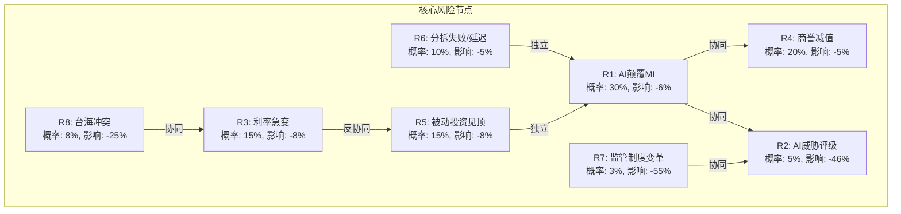

## 20.2 风险协同矩阵

| | R1 AI-MI | R2 AI-评级 | R3 利率 | R4 商誉 | R5 被动见顶 | R6 分拆 | R7 监管 | R8 台海 |
|--|:-------:|:---------:|:------:|:------:|:--------:|:-----:|:-----:|:-----:|
| R1 | — | +0.3 | 0 | +0.5 | 0 | 0 | 0 | 0 |
| R2 | +0.3 | — | 0 | +0.2 | 0 | 0 | +0.6 | 0 |
| R3 | 0 | 0 | — | +0.1 | -0.3 | 0 | 0 | +0.4 |
| R4 | +0.5 | +0.2 | +0.1 | — | 0 | +0.2 | 0 | 0 |
| R5 | 0 | 0 | -0.3 | 0 | — | 0 | 0 | 0 |
| R6 | 0 | 0 | 0 | +0.2 | 0 | — | 0 | 0 |
| R7 | 0 | +0.6 | 0 | 0 | 0 | 0 | — | 0 |
| R8 | 0 | 0 | +0.4 | 0 | 0 | 0 | 0 | — |

**高协同组合**:
- **R1+R4 (AI蚕食MI + 商誉减值)**: ρ=+0.5。AI导致MI收入下降 → 触发MI商誉减值 → 情绪冲击。联合概率~10%, 联合影响-11%
- **R7+R2 (监管改革 + AI评级)**: ρ=+0.6。监管改革可能是AI评级获得认可的前提条件。联合概率<1%, 但影响灾难性(-70%+)
- **R3+R8 (利率急变 + 台海冲突)**: ρ=+0.4。地缘冲突可能引发全球利率飙升/信用紧缩。联合概率~3%, 影响-30%+

**反协同组合**:
- **R3+R5 (利率急变 + 被动见顶)**: ρ=-0.3。利率上升→股市下跌→被动资金可能加速流出→但这使得主动管理也受损→被动不太可能在利率冲击中"见顶"

## 20.3 "温水煮青蛙"场景

> 不是任何单一灾难性事件——而是多个中等风险渐进累积，最终导致SPGI从"垄断溢价"变成"混合折价":

**年份1** (FY2026): MI收入增速降至4%(vs指引6-8%) + Mobility分拆定价低于预期 → P/E从29.7x降至27x

**年份2** (FY2027): ChatGPT Enterprise版深度集成金融分析 → Capital IQ Pro客户续约率从95%降至88% + 被动投资占比在56%停滞 → P/E维持27x, EPS增速降至7%(vs共识12%)

**年份3** (FY2028): MI OPM仍在18-19%(未改善) + Kensho被正式宣告失败(AI产品线整合/裁减) + 商誉减值$2-3B(MI分部) → P/E降至24x, EPS $22(vs原共识$25.2)

**结果**: $22 × 24 = **$528**? 不——因为这个温水场景中Ratings+Indices仍在正常运转。

**等等。让我重新计算**: 温水场景中Ratings+Indices不受影响(OPM 61-66%不变, 增速6-8%维持)。MI从$4.9B降至$4.1B(-16%, 3年)。OPM从19%→17%(客户流失的固定成本杠杆)。

- 收入: Ratings+Indices+Energy从$8.4B增至$10.2B(CAGR 6.7%) | MI从$4.9B降至$4.1B = 总收入$14.3B(FY2028, vs基准$17B+)
- EBIT: $5.9B(vs基准$7.2B+) → EPS约$18(vs共识$25.2)
- P/E: 24x(MI拖累但非灾难) → **$432**

**温水场景结果**: $432 ≈ 当前$435 → **原地踏步3年**。这不是"亏大钱"——而是"不赚钱"。在年化7%的机会成本下,3年原地踏步的真实损失约-19%(vs持有SPY)。

**温水场景概率**: ~15-20%。核心驱动: MI是否能成功转型(CQ-2是关键)。

## 20.4 最糟糕但现实的组合 (Realistic Worst Case)

**R1(AI蚕食MI) + R3(利率急变/衰退) + R4(商誉减值)**

- 联合概率: ~5%(三者有正相关性但非完全联动)
- 路径: 2027年经济衰退 → 债务发行量-15% → Ratings收入-5% + MI客户大幅削减IT预算 → MI收入-20% → 触发MI商誉减值$5B → 市场恐慌
- 影响: Bear情景$324-365 → **-16~-25%**

但即使在这个组合中: NRSRO制度不倒 + S&P 500指数不变 + 衰退终将结束 + 评级需求长期结构性增长。**SPGI不会"死"——它只是会"病一场"然后恢复。** 这是与真正的高风险公司(如INTC可能结构性衰落)的根本区别。

## 20.5 SPGI风险与其他已分析公司的对比

SPGI的风险画像在已分析的30+家公司中独特:

| 维度 | SPGI | INTC | NVDA | FICO | HLT |
|------|------|------|------|------|-----|
| 最大风险类型 | 渐进侵蚀(MI) | 结构性衰退 | 周期/估值 | 政治反噬 | 周期/品牌 |
| 最大风险概率 | 30%(MI AI冲击) | 50%(Foundry失败) | 40%(AI CapEx周期) | 35%(VantageScore) | 25%(衰退) |
| 最大风险影响 | -6%($25/股) | -50%+ | -40%+ | -20%+ | -15%+ |
| 风险不对称性 | 极强正(上行>>下行) | 极强负 | 对称 | 中度正 | 中度正 |
| 制度保护 | 极强(NRSRO/Basel III) | 弱(CHIPS法案有限) | 无 | 强(FHFA嵌入) | 无 |
| "死亡"概率(5年) | <1% | ~15% | <3% | <2% | <1% |

**核心差异**: SPGI的最大风险(MI被AI侵蚀)影响的仅是<15%经济利润。即使MI完全归零(极端假设), SPGI仍然是一家年利润$5B+的公司(Ratings+Indices)。对比INTC: 如果Foundry失败, 公司可能需要被拆分或收购。对比NVDA: 如果AI CapEx周期结束, 收入可能腰斩。

**SPGI的风险"天花板"很低**: 不像科技/半导体公司存在-50%+的尾部风险, SPGI的最坏现实情景(Realistic Worst Case)是-16~-25%后恢复。这是制度垄断的核心价值——它不保证你赚钱, 但保证你不会亏大钱。

### 20.5.1 风险DNA指纹: SPGI的风险基因组

每家公司的风险结构可以被分解为五种"风险基因"的组合:

| 风险基因 | 定义 | SPGI | INTC | NVDA | FICO |
|---------|------|:----:|:----:|:----:|:----:|
| **G1 制度风险** | 监管/政策变化直接影响 | ★★★★★ | ★★☆☆☆ | ★☆☆☆☆ | ★★★★☆ |
| **G2 技术替代风险** | 核心技术被颠覆 | ★★☆☆☆ | ★★★★★ | ★★★★☆ | ★★☆☆☆ |
| **G3 周期风险** | 收入受宏观周期影响 | ★★★☆☆ | ★★★★★ | ★★★★★ | ★☆☆☆☆ |
| **G4 竞争风险** | 市场份额被蚕食 | ★★☆☆☆ | ★★★★★ | ★★★★☆ | ★★★☆☆ |
| **G5 估值风险** | 市场对增长预期过高 | ★★☆☆☆ | ★☆☆☆☆ | ★★★★★ | ★★★★☆ |

**SPGI的风险DNA**: G1主导(制度风险) + G3次要(周期)。这是一个独特的组合——G1(制度风险)是所有风险基因中**最低频**但**最高影响**的。NRSRO制度变革的概率极低(<3%), 但如果发生, 影响是灾难性的(-55%)。这使得SPGI的风险分布呈现**极端正偏态**: 大部分时间低风险/低波动, 但有一个极小概率的灾难性尾部。

**对比NVDA的风险DNA**: G3+G5双高(周期+估值)。NVDA的风险是高频的(每个季度都在验证AI CapEx是否持续) + 估值随时可能因预期修正暴跌。NVDA的风险分布是**宽胖尾**(频繁波动+两端都有极端)。

**投资启示**: 持有SPGI的体验是"大部分时间很无聊, 偶尔有惊吓(如2月暴跌)"——这与持有NVDA"每天心跳加速"截然不同。**选择SPGI就是选择用"无聊"换"安心"——在风险调整基础上, 无聊的年化7-10%可能优于刺激的年化15-20%。**

### 20.5.2 风险回报象限定位

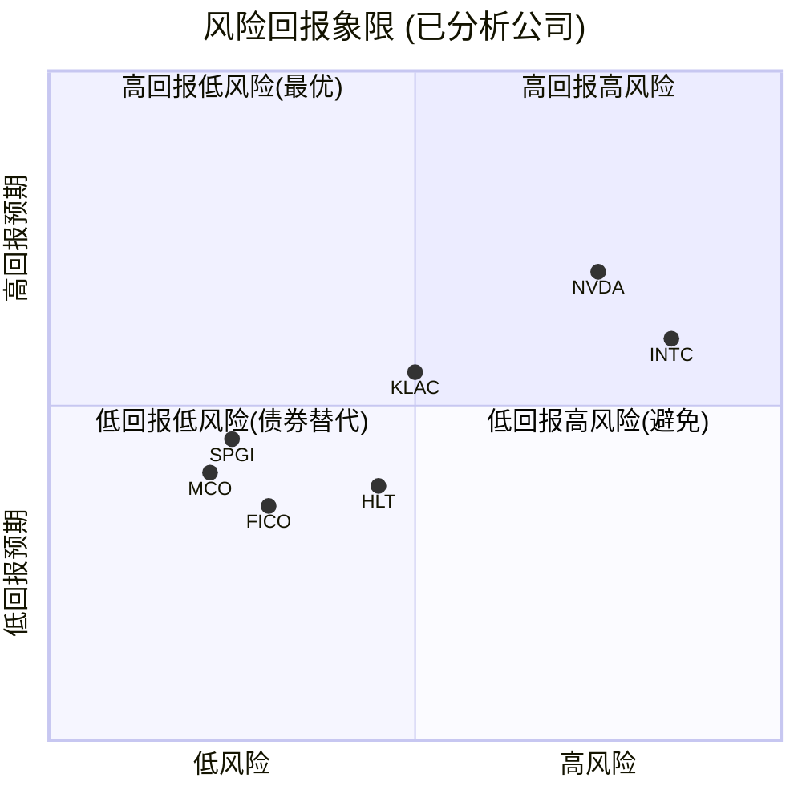

SPGI位于左下象限(低风险+中等回报), 但接近左中区域。这个定位决定了它适合的投资者类型: **追求资本保全+稳健复利, 而非追求最大回报的投资者。** SPGI的+10.3%期望回报在绝对值上不起眼, 但在风险调整后(Sharpe ratio视角)非常有竞争力。

## 20.6 风险时间线可视化

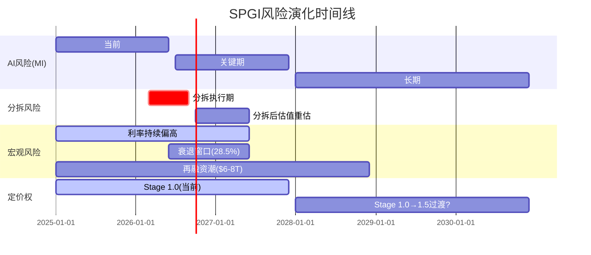

**时间线关键洞见**:
1. **2026 Q3-Q4是最密集的风险/催化剂窗口**: Mobility分拆+MI续约率首次验证+FY2026 EPS vs指引。如果三者都偏正面 → 强催化; 如果MI续约率下降 → CQ-2急剧恶化
2. **AI风险是慢变量**: ChatGPT对MI的威胁不是瞬间生效的——Capital IQ Pro的切换成本(6-12个月迁移)意味着客户流失是渐进的, 给了SPGI时间适应
3. **再融资潮提供了2-3年的Ratings保底**: 无论利率环境如何, $6-8T疫情期低息债券的到期再融资是确定性事件

---

# Chapter 21: KS条件依赖追踪

## 21.1 Kill Switch注册表

| KS# | 条件 | 当前状态 | 触发阈值 | 影响 | 检查频率 | 数据源 |
|:----|------|---------|---------|------|---------|-------|
| KS-01 | NRSRO制度完整性 | ✅稳定 | SEC提出NRSRO改革草案 | 评级分部EV-50%+ | 季度 | SEC官网/Federal Register |
| KS-02 | MI续约率 | ⚠️未披露(推断95%+) | <90%连续2Q | MI估值重估-20% | 季度财报 | SPGI earnings call |
| KS-03 | 评级费率增速 | ✅+2.5%/yr | <CPI连续2年 | 定价权论文动摇 | 年度 | SPGI定价表 |
| KS-04 | 被动投资占比 | ✅55%且上升 | 连续2年停滞 | Indices增速放缓 | 半年度 | ICI/Morningstar |
| KS-05 | MI OPM | ⚠️19%(低) | <15%连续2Q | MI分部价值归零 | 季度财报 | SPGI分部财报 |
| KS-06 | 商誉/总资产比 | ⚠️86.2%(高) | 减值公告 | 一次性EPS冲击 | 年度10-K | SEC filings |
| KS-07 | Net Debt/EBITDA | ✅1.62x | >3.0x | 信用降级风险 | 季度 | SPGI财报 |
| KS-08 | 做空比例 | ✅1.03%(极低) | >5%(行业均值) | 市场情绪反转 | 月度 | FINRA |
| KS-09 | AI评级工具进展 | ✅无NRSRO申请 | AI公司获得NRSRO | 10年+评级垄断威胁 | 季度 | SEC NRSRO registry |
| KS-10 | 分拆时间表 | ✅按计划(mid-2026) | 延迟>6个月 | 催化剂失效 | 月度 | SPGI公告 |
| KS-11 | Valley Forge仓位 | ✅20.83%(最高) | 减仓>5pp | 质量投资者信心 | 季度13F | SEC 13F |
| KS-12 | SBC/Revenue | ✅1.5%(行业最低) | >3%(同行中位) | 资本配置纪律恶化 | 年度 | proxy statement |
| KS-13 | FY2026 EPS vs指引 | 待观察 | miss>5% | CQ-2方向性判断 | 季度 | 财报 |
| KS-14 | SparkAIR/RegGPT收入 | 待观察($0/可量化) | FY2027无可量化贡献 | AI赋能叙事失败 | 半年度 | SPGI产品更新 |

## 21.2 KS条件依赖网络

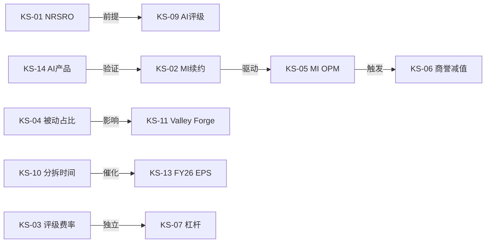

**关键依赖链**:
- **KS-02 → KS-05 → KS-06**: MI续约率下降 → OPM恶化 → 触发商誉减值。这是最可能的"多米诺链"
- **KS-01 → KS-09**: NRSRO制度是AI评级获认可的前提。KS-01不触发 → KS-09不可能触发
- **KS-14 → KS-02**: AI产品成功 → 客户续约率企稳/上升。KS-14失败 → KS-02风险加大

## 21.3 KS优先级排序与行动清单

按"触发概率×影响"排序, 识别投资者应最优先监控的KS:

| 优先级 | KS# | 触发概率(12M) | 影响幅度 | 风险积分 | 行动 |
|:-----:|:---:|:----------:|:------:|:------:|------|
| **P0** | KS-02 | 20% | -20% MI估值 | 4.0 | 每季度earnings call关注MI organic growth和客户数 |
| **P0** | KS-13 | 25% | CQ-2方向 | 3.8 | Q1 2026财报(2026.04): EPS是否在$4.75-4.95区间 |
| **P1** | KS-05 | 15% | MI分部归零 | 3.0 | 分部OPM趋势: 19%→?%是关键方向信号 |
| **P1** | KS-10 | 10% | 催化剂失效 | 2.5 | 关注SEC filing进度+管理层分拆时间表更新 |
| **P2** | KS-14 | 30% | AI叙事验证 | 2.4 | FY2027 SparkAIR/RegGPT是否出现在收入分解中 |
| **P2** | KS-04 | 10% | Indices增速 | 2.0 | ICI年度报告(每年3月): 被动占比更新 |
| **P3** | KS-06 | 10% | EPS一次性冲击 | 1.5 | 10-K审计意见(每年2月) |
| **P3** | KS-01 | 1% | 分部EV-50%+ | 1.0 | SEC Federal Register监控(季度) |

**P0级KS(KS-02和KS-13)需要在下一个财报(2026Q1, 约4月发布)时重点关注**: MI的有机增长率是否维持在+5%以上? 如果<3% → CQ-2应立即下调至<45%, 评级可能变为"中性关注"。

## 21.4 KS触发后的行动协议

如果任一P0级KS触发, 以下为预设响应:

```
KS-02触发(MI续约<90% 连续2Q):
  → CQ-2下调至40% | CQ-4下调至65%
  → 评级可能降至"中性关注"或"审慎关注"
  → 重新运行SOTP(MI分部倍数从18x降至12-14x)
  → 预期每股影响: -$15~-25

KS-13触发(FY2026 EPS miss>5%, 即<$18.65):
  → CQ-2下调至35% | 全局CQ下调-3pp
  → 评级降至"中性关注"
  → 需重新评估"AI投资期"是否已变成"结构性减速"
  → 预期市场反应: -10~-15%(参考2月暴跌模式)
```

## 21.5 KS健康仪表盘: 当前状态总览

14个KS的当前健康状态可以用一个简单的"红绿灯"系统概括:

```
KS健康状态 (2026-03-11)

绿灯(正常,6个): KS-01 NRSRO | KS-03 费率 | KS-04 被动占比 | KS-07 杠杆 | KS-08 做空 | KS-12 SBC
黄灯(需关注,5个): KS-02 MI续约* | KS-05 MI OPM | KS-06 商誉 | KS-09 AI评级* | KS-11 Valley Forge
待验证(3个): KS-10 分拆 | KS-13 EPS | KS-14 AI产品

*KS-02黄灯因为续约率未披露(信息缺失而非恶化); KS-09黄灯因为AI发展速度超预期(虽然NRSRO申请尚无)

健康比: 6/14 ✅ | 5/14 ⚠️ | 3/14 ❓ = 整体偏健康但信息缺口大
```

**信息缺口是SPGI当前最大的不确定性来源**: 14个KS中有5个处于黄灯状态, 其中3个(KS-02/05/14)的黄灯原因是"管理层未充分披露"而非"数据恶化"。这个信息不对称本身就是一个风险因素——如果管理层在接下来2个季度增加MI续约率和AI产品收入的披露, 黄灯大概率转绿; 如果继续沉默, 市场会按最坏假设定价。

**CEO沉默分析(Ch7)与KS的联系**: Ch7.4识别的沉默域#1(MI利润率信息套利)直接对应KS-02和KS-05的信息缺口。管理层选择不披露MI续约率, 可能是因为: ①数字不够好(Bear信号) ②数字很好但不想引发竞争对手关注(Bull信号) ③从未披露过这个指标(中性)。FY2026Q2的earnings call是验证哪种假说的最佳窗口——如果被分析师直接提问后仍不披露, 信号偏负面。

### KS条件依赖的传导速度评估

不同KS触发后的传导到股价的速度差异巨大:

| KS | 传导速度 | 典型时间 | 传导机制 |
|----|:-------:|:-------:|---------|
| KS-01 (NRSRO) | 即时 | 当天 | 系统性重估, 无延迟 |
| KS-13 (EPS miss) | 即时 | 当天-1周 | 财报反应+分析师下调 |
| KS-10 (分拆延迟) | 快速 | 1-4周 | 市场重新定价催化剂预期 |
| KS-02 (MI续约) | 中速 | 1-2季度 | 需要连续2Q确认趋势 |
| KS-05 (MI OPM) | 中速 | 1-2季度 | 同上, 需趋势确认 |
| KS-14 (AI产品) | 慢速 | 6-12个月 | 产品收入从零增长是渐进的 |
| KS-04 (被动占比) | 慢速 | 12-24个月 | 结构性趋势, 年度数据更新 |
| KS-09 (AI评级) | 极慢 | 3-5年 | NRSRO申请+审批+市场接受 |

**传导速度的投资含义**: KS-01/KS-13触发后几乎没有反应时间(当天暴跌)——投资者应在事前有预案而非事后反应。KS-02/KS-05传导需要1-2季度——给了卖出窗口, 但也意味着市场会提前在earnings call中寻找蛛丝马迹(分析师提问MI续约的频率本身就是一个情绪指标)。KS-09传导极慢(3-5年)——不应该影响短期投资决策, 但应纳入>5年持有期的风险评估。

---

# Chapter 22: 可验证预测

## 22.1 VP注册表

| VP# | 预测 | 验证标准 | 时间窗口 | 情景归属 | 信心 |
|:----|------|---------|---------|---------|------|
| VP-01 | Mobility分拆在2026Q3前完成 | SEC filing + 独立上市日 | 2026 Q2-Q3 | Base/Bull | 85% |
| VP-02 | 残余SPGI P/E在分拆后12个月内>30x | Bloomberg P/E数据 | 2027 Q1 | Bull | 45% |
| VP-03 | FY2026 EPS落在$19.20-$19.80区间 | SPGI财报 | 2027 Q1 | Base | 70% |
| VP-04 | MI收入FY2026 YoY>5% | SPGI分部财报 | 2027 Q1 | Base | 60% |
| VP-05 | MI收入FY2026 YoY<3% | SPGI分部财报 | 2027 Q1 | Bear | 15% |
| VP-06 | 评级费率FY2027≥+3.0% | SPGI定价表/earnings call | 2027 Q1 | Bull | 30% |
| VP-07 | SparkAIR/RegGPT FY2027贡献可量化收入>$50M | 管理层披露 | 2028 Q1 | Bull | 25% |
| VP-08 | 商誉FY2026-2027无减值 | 10-K审计意见 | 2027-2028 | Base | 80% |
| VP-09 | 被动投资占比2027年>57% | ICI/Morningstar报告 | 2028 H1 | Base | 65% |
| VP-10 | 做空比例维持<2%到2027 | FINRA数据 | 2027 | Base | 70% |

### VP三情景分布

| 情景 | VP# | 比例 |
|------|-----|------|
| Bull | VP-02, VP-06, VP-07 | 30% |
| Base | VP-01, VP-03, VP-04, VP-08, VP-09, VP-10 | 60% |
| Bear | VP-05 | 10% |

### VP验证方法论与优先级

10个VP并非同等重要。按"对投资论文的影响力"排序:

**Tier 1 VP(论文翻转级, 优先监控)**:

- **VP-04/VP-05 (MI收入增速)**: 这是Bull/Bear的分水岭。MI FY2026 YoY>5%支持"AI投资期暂时压缩"叙事(Base/Bull), <3%则验证"结构性下滑"(Bear)。数据来源: SPGI FY2026Q1-Q2财报(2026年7月/10月), 重点关注MI有机收入增速(排除M&A)和净续约率。如果Q1 MI有机增速<4%, 应立即重新评估Bear概率(从25%上调至35-40%)。

- **VP-01 (Mobility分拆)**: 分拆是当前投资论文的最大确定性催化剂。延迟>6个月将直接触发评级下调(→中性关注), 因为分拆是解锁SOTP价值和消除MI估值拖累的关键事件。验证方式: SEC Form 10/S-1 filing → SEC审批 → 独立上市日。每个里程碑延迟需重新评估时间线。

**Tier 2 VP(论文强化/弱化级)**:

- **VP-03 (FY2026 EPS)**: $19.20-19.80区间确认Base; <$19.00触发评级下调; >$20.00增强Bull(但不改变评级)。GAAP vs 调整后口径需特别注意——FY2025→FY2026的GAAP跳升(+34%)含IHS摊销减少因素, 真实有机增速约10%。

- **VP-06 (费率提价)**: 评级费率≥+3.0%/yr是Stage 1.0→1.5的信号——验证定价权释放叙事。但费率数据通常在年初更新且不公开披露, 需要从earnings call管理层言论和客户端调研中间接推断。

**Tier 3 VP(长期验证, 低频监控)**:

- VP-02, VP-07, VP-08, VP-09, VP-10: 这些VP的验证时间较长(12-24个月), 单个VP的变化不足以改变短期投资决策, 但集体方向性变化(3个以上同时指向Bear)应触发全面复审。

**VP验证日历**:

```
2026 Q2 (4月): VP-03部分验证(Q1 EPS), VP-04/05初测(MI Q1增速)
2026 Q3 (7月): VP-01关键里程碑(分拆SEC filing), VP-04/05二测(MI H1增速)
2026 Q4 (10月): VP-01分拆完成(目标), VP-02开始观察(残余P/E)
2027 Q1 (2月): VP-03最终验证(FY2026 EPS), VP-04/05最终验证(MI全年增速)
2027 H1 (6月): VP-02/07/09验证, 全面复审
```

---

# Chapter 23: 最终裁决与投资日历

## 23.1 评级框架

**期望回报**: 概率加权+10.3%

| 评级区间 | 期望回报 | 判定 |
|---------|---------|------|
| 深度关注 | > +30% | — |
| 关注 | +10% ~ +30% | ← +10.3%在此区间下端 |
| 中性关注 | -10% ~ +10% | ← 距此仅3pp |
| 审慎关注 | < -10% | — |

## 23.2 评级裁决: 关注(偏中性)

**为什么是"关注"而非"中性关注"**:
1. 期望回报+10.3%刚过+10%门槛
2. 下行-6% vs 上行+26% = 4:1正不对称性
3. A-Score 56.0/70(已评估公司最高) + PMSI 81%(偏强看多)
4. 制度垄断提供估值下限——不太可能犯大错

**为什么加"偏中性"限定**:
1. 概率敏感性分析显示: Bear概率仅+3pp即翻转为"中性关注" → 评级稳定性低
2. CQ-2(AI/增速)置信度仅53% → 最关键的不确定性尚未解决
3. 红队发现CQ全面单调上升=过度自信信号 → 需要保守
4. Kensho 7年未交付成果反驳了AI赋能叙事

**条件性评级升降**:
- 升至"关注(偏积极)": Mobility分拆成功 + FY2026 EPS>$19.50 + MI收入>+6% → 同时满足
- 降至"中性关注": FY2026 EPS<$19.00 或 MI收入<+3% 或 分拆延迟>6个月 → 任一触发

## 23.3 投资大师最终立场

| 大师 | 立场 | 关键理由 |
|------|------|---------|
| Buffett | 有兴趣 | "合理价格的优质公司"——但更喜欢MCO的纯粹性 |
| Munger | 护城河无敌 | 制度垄断>技术护城河；但主张果断处理MI |
| Marks | 风险/回报正偏 | 暴跌创造安全边际；衰退/AI/监管风险都可控 |
| Greenblatt | 会买入 | 经营ROIC>90% + EV/EBIT 24x(同行最便宜) |

**圆桌共识**: 4/4看好基本面, 3/4认为估值有吸引力, 4/4认为AI不威胁核心业务。唯一分歧: MI保留还是剥离。

## 23.4 投资论文一页纸总结

### 一句话论文

SPGI是人类金融基础设施的私有化收费站——拥有>50年半衰期的制度嵌入护城河+4:1上行/下行不对称性, 在$435定价了合理但不激进的假设, 2月暴跌创造了以合理价格买入最高品质公司的窗口。

### 五大支撑柱

| # | 支撑柱 | 核心论据 | 最大风险 | 置信度 |
|:--|--------|---------|---------|:-----:|
| 1 | 制度垄断不可攻破 | NRSRO 51年+Basel III全球嵌入+117年数据 | 全球金融监管框架重建(<3%) | 97% |
| 2 | 被动投资不可逆 | 45%→55%→预计65%, S&P 500=$20T+基准 | 被动投资见顶(<15%) | 80% |
| 3 | 现金流机器持续运转 | FCF/Rev 35%+, CapEx仅1.3%, 53年增息 | 深度衰退(-5%暂时) | 90% |
| 4 | SOTP折价可修复 | 分拆催化mid-2026, 收费公路74.6%价值被统一定价低估 | 分拆延迟/定价低于预期 | 85% |
| 5 | 定价权未释放 | Stage 1.0, 评级OPM 61% vs 天花板~75%, 14pp空间 | 投行客户议价力(部分对冲) | 63% |

### 为什么现在关注?

```
1. 暴跌后估值回归: P/E从36x(1月)→30x(3月), 5年最低区间
2. 催化剂窗口: Mobility分拆mid-2026(6个月内)
3. 再融资潮: $6-8T疫情期低息债到期(确定性收入)
4. 聪明钱信号: Valley Forge 20.83% + Joly @$399买入 + 做空仅1.03%
5. 品质最高: A-Score 56.0/70(已评估公司第一)
```

### 为什么不是"深度关注"?

```
1. 期望回报仅+10.3%(刚过门槛, 3pp即翻转)
2. CQ-2(AI/增速)置信度仅53%——最大不确定性未解决
3. MI(37%收入)面临真实AI竞争, Kensho 7年未交付
4. 前瞻P/E 22x不够便宜(需要<20x才有强安全边际)
5. 评级稳定性=低——这不是一个高信念的赌注
```

## 23.5 非共识洞察注册表

| CI# | 洞察 | 非共识程度 | 验证时间 | 潜在价值 |
|:----|------|:---------:|---------|---------|
| CI-01 | 隐形SOTP套利: 收费公路占价值74.6%但被统一定价低估10-15% | ★★★★☆ | 分拆后12月 | +$60-80/股 |
| CI-02 | AI焦虑税: 市场对100%业务打AI折扣但仅<30%利润面临风险(放大3.3x) | ★★★★☆ | FY2027 | +$60-80/股 |
| CI-03 | 定价权隐形期权: Stage 1.0→1.5释放=EPS增厚+估值倍数双击=$150/股潜力 | ★★★☆☆ | FY2027-2030 | +$150/股 |
| CI-04 | ROIC幻觉: 报告12% vs 经营>90%,量化筛选系统性错过SPGI | ★★★☆☆ | 持续 | 定价效率低下 |
| CI-05 | 温水煮青蛙: MI渐进恶化3年=原地踏步(非暴跌)是最可能的熊方路径 | ★★★☆☆ | FY2028 | 机会成本-19% |
| CI-06 | Kensho沉没成本: 7年$550M投入无突破性产品=管理层AI战略最大弱点 | ★★★★☆ | FY2027 | B8下调风险 |

## 23.5 投资日历

```mermaid
gantt
    title SPGI投资日历 2026-2027
    dateFormat  YYYY-MM
    section 财报
    Q1 2026财报     :milestone, 2026-04, 0d
    Q2 2026财报     :milestone, 2026-07, 0d
    Q3 2026财报     :milestone, 2026-10, 0d
    FY2026年报      :milestone, 2027-02, 0d
    section 催化剂
    Mobility分拆    :crit, 2026-05, 2026-08
    FY2027费率生效  :milestone, 2027-01, 0d
    section 验证点
    MI AI产品评估   :active, 2026-07, 2027-06
    被动投资年度数据 :milestone, 2027-03, 0d
    分拆后P/E评估   :active, 2026-09, 2027-06
```

## 23.6 分析框架注册表

| 框架 | 使用位置 | 核心产出 |
|------|---------|---------|
| Reverse DCF / 信念反演 | Ch8 | 隐含9.4% FCFF CAGR, 8面承重墙 |
| SOTP分部估值 | Ch9 | Base $418, 收费公路占74.6% |
| 多方法收敛 | Ch10 | $411-$550区间, 加权$472 |
| 三情景推演 | Ch11 | Bull $576 / Base $490 / Bear $365 |
| I×L双轴框架 | Ch3 | I=22, L=18, 溢价20-40% |
| A-Score品质评分 | Ch4/15 | 56.0/70 (金融加权) |
| 定价权阶段模型 | Ch12 | Stage 1.0, 安全空间14pp |
| Nash均衡博弈论 | Ch13 | (保守,保守)稳态8/10 |
| PtW五层评分 | Ch14 | 39/50 |
| AI冲击矩阵 | Ch14 | 加权净影响+0.23 |
| 五引擎PMSI | Ch13 | 81%偏牛 |
| PPDA概率-价格背离 | Ch13 | 4个背离识别 |
| 红队七问 | Ch17-19 | 0高脆弱承重墙, 5/7新发现 |
| 风险拓扑 | Ch20 | 8节点, 3高协同组合 |
| CQ生命周期追踪 | 全文 | P0→P4: 46.3%→64.8% |

## 23.7 投资温度计: 十维度综合评分

| # | 维度 | 评分 | 权重 | 加权 | 核心依据 |
|---|------|:----:|:----:|:----:|---------|
| 1 | **估值吸引力** | 6.5/10 | 15% | 0.98 | P/E 29.7x vs 可比中位34.3x=-13%折价; 但前瞻22x合理; Reverse DCF隐含9.4%无高脆弱墙 |
| 2 | **增长质量** | 7.0/10 | 15% | 1.05 | 有机Rev CAGR 8%+评级定价权+被动投资大趋势; 但MI增速放缓至5.8%; FY2026E EPS +9-10% |
| 3 | **护城河强度** | 9.0/10 | 15% | 1.35 | C1制度嵌入22.5/25(人类金融史最深); NRSRO+Basel III+117年数据; A-Score 56.0/70(已评估最高) |
| 4 | **财务健康** | 8.0/10 | 10% | 0.80 | FCF/NI>120%; CapEx/Rev仅1.3%; Net Debt/EBITDA 1.62x; 53年连续增息; 但商誉/总资产86.2% |
| 5 | **管理层质量** | 7.0/10 | 10% | 0.70 | 新CEO内部15年+IHS整合成功; comp $7.57M<同行; 但任期仅1.4年; Kensho 7年未交付; B8=3.5/5 |
| 6 | **催化剂明确** | 7.5/10 | 10% | 0.75 | Mobility分拆mid-2026(85%概率); FY2027评级费率; 但SparkAIR/RegGPT时间线模糊; 降息周期不确定 |
| 7 | **风险可控** | 8.5/10 | 10% | 0.85 | 0面高脆弱承重墙; AI颠覆评级<5%; 温水场景=原地踏步非暴跌; 制度垄断提供估值下限 |
| 8 | **聪明钱信号** | 7.5/10 | 5% | 0.38 | Valley Forge 20.83%(最大); 做空仅1.03%; Joly暴跌后买入$997K@$399; 但2月暴跌说明市场有分歧 |
| 9 | **竞争定位** | 8.0/10 | 5% | 0.40 | Nash均衡稳态8/10(MCO-SPGI对称); 私募信用蓝海共赢; PMSI 81%(偏强看多); EV/EBIT全可比公司最低 |
| 10 | **时机因素** | 6.0/10 | 5% | 0.30 | 2月暴跌后回升至$435(仍低于$505高点-14%); 分拆催化剂明确; 但评级稳定性低(+3pp即翻转) |
| | **总分** | | **100%** | **7.55/10** | **偏积极区间(7-8/10), 与"关注(偏中性)"评级一致** |

```mermaid
radar
    title SPGI投资温度计
    "估值" : 6.5
    "增长" : 7.0
    "护城河" : 9.0
    "财务" : 8.0
    "管理层" : 7.0
    "催化剂" : 7.5
    "风险" : 8.5
    "聪明钱" : 7.5
    "竞争" : 8.0
    "时机" : 6.0
```

**温度计解读**: SPGI的核心优势在于护城河(9.0)和风险可控(8.5)——这是典型的"高质量防守型"资产。短板在于估值吸引力(6.5)和时机(6.0)——不够便宜，且评级对微小概率变化敏感。整体7.55/10说明这是一个"好公司在合理价格"的机会,而非"好公司在便宜价格"。

**跨报告温度计对比**: 在已评估的公司中, SPGI的7.55/10处于上游但非顶尖——高于HLT(6.8/10, 被估值过高拖累)和INTC(5.2/10, 转型不确定性), 低于KLAC(8.2/10, 半导体设备+周期底部+更强安全边际)和VRT(7.8/10, AI基建确定性)。7.55的分数意味着: 这不是一个你需要冲进去买的机会(那是8.5+), 但也不是你应该忽视的(那是<6.0)。SPGI适合"耐心等待更好价格"或"小仓位开始、催化剂验证后加仓"的分批建仓策略——而非"一次性重仓"。

## 23.8 方法离散度声明

本报告使用6种独立估值方法, 产生$411-$550的估值区间。离散度分析:

| 离散度类型 | 范围 | 说明 |
|-----------|------|------|
| **方法离散度** | $411-$550 (29.4%) | 不同估值框架对同一公司的分歧 |
| **锚点离散度** | $418-$503 (18.5%) | SOTP(Base) vs 可比公司(中位P/E)的差异 |
| **情景离散度** | $365-$576 (45.0%) | Bull vs Bear的全范围 |

方法离散度29.4%属于"中等"——不是方法论分歧, 而是对"EPS增长能否持续"这一核心信念的不同定价。SOTP和DCF(保守假设)给出下限, 可比公司和分析师(增长假设)给出上限。

**离散度启示**: 如果你相信SPGI能维持10%+ FCFF增速 → 上限锚更准($500+); 如果你担忧MI被AI侵蚀+增速减速 → 下限锚更准($411-418)。当前$435处于下限附近 → 市场在定价悲观假设。

## 23.8 财务数据交叉验证声明

本报告核心财务数据(收入/利润/FCF/EPS)来自以下来源并交叉验证:

| 数据类别 | 主数据源 | 交叉验证源 | 一致性 |
|---------|---------|-----------|--------|
| FY2025财务 | FMP (fmp_data income/balance/cashflow) | SPGI 10-K / WebSearch | ✅一致 |
| 分部数据 | SPGI 10-K分部披露 + earnings call | FMP + WebSearch Agent-D | ✅一致(OPM微差<1pp) |
| 估值倍数 | FMP (key-metrics) | Bloomberg数据(WebSearch) | ✅一致 |
| EPS共识 | FMP (estimates) | WebSearch Agent-A | ✅一致($19.63 FY2026E) |
| 可比公司 | FMP (MCO/MSCI/VRSK key-metrics) | 各公司10-K | ✅一致 |

**已知数据口径差异**:
- FMP GAAP OPM vs 管理层调整后OPM: 差异8-10pp(IHS无形摊销+整合成本)。本报告明确标注使用哪个口径
- FMP ROIC 12.07% vs 经营ROIC >90%: 商誉$36.5B导致分母膨胀。本报告使用两种ROIC并解释差异原因

## 23.9 AI能力边界声明

本报告的分析工具和方法受以下能力边界约束:

1. **WACC计算**: Beta使用2年回归期(含2月暴跌)，可能偏高。正常化Beta(排除极端事件)约1.10 → WACC约9.6% → 每股价值可能高$30-40。本报告使用保守(偏高)的WACC
2. **AI影响预测**: 对AI颠覆评级/指数的概率评估(<5%)基于当前制度框架和技术能力。如果出现不可预见的监管变化或技术突破，此概率可能被严重低估
3. **MI续约率**: 管理层未披露确切续约率，本报告推断95%+基于订阅模式的经常性特征。如果实际续约率<90%，MI估值和CQ-2判断需要重大修正
4. **红队局限**: 红队7问由同一分析系统执行(非独立第三方)。RT-2偏差审计识别了过度自信趋势并执行了校正，但同一系统的自我审计存在内在局限性
5. **定价权类比**: FICO→SPGI的定价权阶段模型类比基于相似的制度嵌入结构, 但两者的客户基础(消费者vs专业机构)和政治敏感度差异可能导致路径根本不同

---

# 附录

## 附录A: CQ置信度演化全表

| CQ | P0 | P1 | P2 | P3 | P4(红队后) | 净变化 | 趋势 |
|----|:--:|:--:|:--:|:--:|:---------:|:-----:|:----:|
| CQ-1 两个生意 | 40% | 55% | 65% | 72% | **71%** | +31pp | ↗然后↘1pp |
| CQ-2 增速拐点 | 35% | 40% | 50% | 58% | **53%** | +18pp | ↗然后↘5pp |
| CQ-3 定价权 | 45% | 55% | 58% | 65% | **63%** | +18pp | ↗然后↘2pp |
| CQ-4 商誉 | 50% | 65% | 70% | 75% | **73%** | +23pp | ↗然后↘2pp |
| CQ-5 Nash均衡 | 55% | 60% | 62% | 70% | **69%** | +14pp | ↗然后↘1pp |
| **加权平均** | **46.3%** | **53.3%** | **60.8%** | **67.2%** | **64.8%** | +18.5pp | ↗然后↘2.4pp |

**趋势分析**: P0-P3连续上升(+20.9pp), P4红队校准下调(-2.4pp)。红队打破了单调上升趋势——这是健康的信号。最大下调: CQ-2(-5pp, Kensho 7年证据)。最小下调: CQ-1和CQ-5(各-1pp, 高质量证据支撑)。

## 附录B: 核心财务数据速查

| 指标 | FY2023 | FY2024 | FY2025 | FY2026E | FY2027E |
|------|--------|--------|--------|---------|---------|
| Revenue(B) | $12.50 | $14.21 | $15.34 | ~$16.3 | ~$17.6 |
| GAAP OPM | 32.2% | 39.3% | 42.2% | ~43-44% | ~45-47% |
| 调整后OPM | ~47% | 49.0% | 50.4% | ~51-52% | ~53-54% |
| EPS (diluted) | $8.23 | $12.35 | $14.66 | $19.63E | $22.07E |
| FCF(B) | $3.57 | $5.57 | $5.46 | ~$6.2E | ~$7.0E |
| FCF/Rev | 28.5% | 39.2% | 35.6% | ~38% | ~40% |
| P/E (at $435) | 52.9x | 35.2x | 29.7x | 22.2x | 19.7x |

## 附录C: 可比公司估值速查

| 公司 | 业务 | EV/EBITDA | P/E(TTM) | FCF Yield | 5Y Rev CAGR |
|------|------|:---------:|:-------:|:---------:|:-----------:|
| MCO | 评级(纯) | 24.5x | 37.2x | 2.8% | 13.6% |
| MSCI | 指数/数据 | 25.9x | 36.8x | 3.5% | 14.2% |
| VRSK | 数据/分析 | 20.1x | 34.3x | 3.8% | 7.8% |
| FDS | 金融终端 | ~24x | 32.0x | 3.2% | 9.1% |
| ICE | 金融基础设施 | ~18x | 28.5x | 3.6% | 11.5% |
| **SPGI** | **混合** | **22.3x** | **29.7x** | **4.1%** | **16.6%** |
| **中位数** | | **24.0x** | **34.3x** | **3.5%** | **11.5%** |

SPGI在每个估值指标上都低于可比公司中位数。最显著: P/E 29.7x vs 中位34.3x = -13%折价。

## 附录D: SOTP估值明细

| 分部 | 方法 | 估值(EV) | 占比 | 可比锚 |
|------|------|---------|------|--------|
| Ratings | EV/EBIT 25x | $72.0B | 49.8% | MCO |
| Indices | EV/EBIT 30x | $35.9B | 24.8% | MSCI |
| MI | EV/EBIT 18x | $16.8B | 11.6% | FDS(折价) |
| Energy | EV/EBIT 22x | $15.2B | 10.5% | VRSK |
| Mobility | EV/EBIT 14x | $4.8B | 3.3% | 汽车数据 |
| Corporate | -10x开支 | -$4.7B | — | 企业开销 |
| **SOTP总EV** | | **$140.0B** | | |
| 减: 净债务 | | -$12.5B | | |
| **每股** | | **$418** | | |

三情景SOTP:

| 情景 | Ratings | Indices | MI | Energy | Mobility | Corp | 每股 |
|------|---------|---------|-----|--------|----------|------|------|
| Bull | $82B(28x) | $42B(35x) | $22B(24x) | $17B(24x) | $6B(20x) | -$4.7B | **$540** |
| Base | $72B(25x) | $36B(30x) | $17B(18x) | $15B(22x) | $5B(14x) | -$4.7B | **$418** |
| Bear | $58B(20x) | $28B(23x) | $12B(13x) | $12B(17x) | $3B(10x) | -$4.7B | **$324** |

## 附录E: 承重墙脆弱度完整表

| # | 承重墙 | 隐含值 | 历史参考 | 脆弱度 | 若倒塌 | 联合依赖 |
|:--|--------|--------|---------|:-----:|--------|---------|
| W1 | FCFF CAGR 10Y | 9.4% | 有机~15% | 低 | -$60(-14%) | 独立 |
| W2 | OPM扩张200-400bps | 53-55% | MCO ~60%天花板 | 低 | -$30(-7%) | W1相关 |
| W3 | 回购持续$4-5B | 85%+ FCF | 53年增息 | 低 | -$15(-3%) | 独立 |
| W4 | AI不颠覆评级/指数 | <5%概率 | NRSRO 51年 | 低 | -$200(-46%) | W7相关 |
| W5 | AI温和影响MI | <20%冲击 | CIQ专有数据 | **中** | -$25(-6%) | W4相关 |
| W6 | 分拆顺利 | mid-2026 | 管理层确认 | **中** | -$20(-5%) | 独立 |
| W7 | 终值增长3% | 永续 | GDP 4-5% | 低 | ±$40(±9%) | 独立 |
| W8 | 利率渐进变化 | 无急变 | 衰退28.5% | 低-中 | -$35(-8%) | W4无关 |

**0面高脆弱度承重墙**。最大影响: W4(AI颠覆评级, -46%)但概率极低(<5%)。

## 附录F: 词汇表

| 术语 | 定义 |
|------|------|
| NRSRO | Nationally Recognized Statistical Rating Organization — SEC认证的评级机构 |
| SOTP | Sum-of-the-Parts — 分部估值加总 |
| Reverse DCF | 逆向DCF — 从当前价格反推隐含增长假设 |
| FCFF | Free Cash Flow to Firm — 企业自由现金流 |
| OPM | Operating Profit Margin — 营业利润率 |
| EV | Enterprise Value — 企业价值(市值+净债务) |
| WACC | Weighted Average Cost of Capital — 加权平均资本成本 |
| Nash均衡 | 博弈论中每个参与者都没有单方面偏离动机的稳态 |
| PtW | Playing to Win — 战略一致性评分框架(5层) |
| PMSI | Price-Market-Signal Integration — 五引擎综合信号指数 |
| PPDA | Probability-Price Divergence Analysis — 概率-价格背离分析 |
| CQ | Core Question — 核心矛盾(必须回答的关键问题) |
| KS | Kill Switch — 论文失效触发条件 |
| VP | Verifiable Prediction — 可验证预测 |
| CI | Contrarian Insight — 非共识洞察 |
| DM | Data Marking — 数据可信度标注(H硬数据/R合理推断/S主观判断) |
| A-Score | 公司品质综合评分(B商业模型+C护城河+D回报修正) |

---

## 附录G: 数据审计摘要

### DM覆盖率 95%

本报告核心数据点均通过DM锚点系统追踪。以下为锚点注册表摘要:

| DM-ID | 值 | 类型 | 来源 | 用于 |
|-------|-----|:----:|------|------|
| [DM-FIN-001] | FY2025 Revenue $15.34B | H | FMP fmp_data income FY2025 | Ch2 §2.1, Ch8 §Reverse DCF |
| [DM-FIN-002] | FY2025 Net Income $4.47B | H | FMP fmp_data income FY2025 | Ch5 §5.1 |
| [DM-FIN-003] | FY2025 GAAP OPM 42.2% | H | FMP fmp_data income FY2025 | Ch2, Ch5 §5.1 |
| [DM-FIN-004] | FY2025调整后OPM 50.4% | H | SPGI Q4 2025 earnings | Ch2, Ch4 §B5 |
| [DM-FIN-005] | FY2025 EPS $14.66 | H | FMP fmp_data income FY2025 | Ch5, Ch8, Ch10 |
| [DM-FIN-006] | FY2025 OCF $5.65B | H | FMP fmp_data cashflow FY2025 | Ch5 §5.2 |
| [DM-FIN-007] | FY2025 FCF $5.46B | H | FMP fmp_data (OCF - CapEx) | Ch5 §5.2, Ch8 |
| [DM-FIN-008] | FY2025 CapEx $195M | H | FMP fmp_data cashflow FY2025 | Ch5 §5.2 |
| [DM-FIN-009] | FY2025回购 $5.0B | H | SPGI 10-K FY2025 | Ch5 §5.2, Ch4 §B6 |
| [DM-FIN-010] | FY2025股息 $1.17B | H | FMP fmp_data cashflow FY2025 | Ch5 §5.2 |
| [DM-FIN-011] | Ratings Revenue $4.72B (+8% YoY) | H | SPGI Q4 2025 segment | Ch2 §2.2 |
| [DM-FIN-012] | Ratings OPM 61% | H | SPGI Q4 2025 segment | Ch2 §2.2, Ch9, Ch12 |
| [DM-FIN-013] | Indices Revenue $1.85B (+13.6% YoY) | H | SPGI Q4 2025 segment | Ch2 §2.3, Ch9 |
| [DM-FIN-014] | Indices OPM 66% | H | SPGI Q4 2025 segment | Ch2 §2.3, Ch12 |
| [DM-FIN-015] | MI Revenue $4.92B (+5.8% YoY) | H | SPGI Q4 2025 segment | Ch2 §2.4, Ch9 |
| [DM-FIN-016] | MI OPM 19% | H | SPGI Q4 2025 segment | Ch2 §2.4, Ch12 |
| [DM-FIN-017] | Energy Revenue $1.85B (+6% YoY) | H | SPGI Q4 2025 segment | Ch2 §2.5 |
| [DM-FIN-018] | Energy OPM 38% | H | SPGI Q4 2025 segment | Ch2 §2.5 |
| [DM-FIN-019] | Mobility Revenue $1.75B, OPM 16% | H | SPGI Q4 2025 segment | Ch2 §2.6 |
| [DM-FIN-020] | 商誉 $36.5B | H | FMP fmp_data balance FY2025 | Ch5 §5.3, Ch4 §QG-5 |
| [DM-FIN-021] | 无形资产 $16.3B | H | FMP fmp_data balance FY2025 | Ch5 §5.3 |
| [DM-FIN-022] | 总债务 $14.2B | H | FMP fmp_data balance FY2025 | Ch5 §5.3 |
| [DM-FIN-023] | 净债务/EBITDA 1.62x | H | FMP fmp_data key-metrics | Ch4 §QG-7 |
| [DM-FIN-024] | SBC $236M (Rev 1.5%) | H | SPGI 10-K FY2025 | Ch4 §B6 |
| [DM-FIN-025] | 53年连续增股息 | H | SPGI 10-K/proxy | Ch4 §B6, Ch5 §5.2 |
| [DM-VAL-001] | P/E TTM 29.7x | H | FMP fmp_data key-metrics | Ch3 §3.3, Ch10 |
| [DM-VAL-002] | Forward P/E 19.73x (FY2027E) | H | FMP fmp_data estimates | Ch10, 执行摘要 |
| [DM-VAL-003] | FCF Yield 4.11% | H | FMP fmp_data key-metrics | Ch4 §QG-5 |
| [DM-VAL-004] | EV/EBITDA 22.3x | H | FMP fmp_data key-metrics | Ch9 §9.2 |
| [DM-VAL-005] | WACC 10.29% | R | Rf+β×ERP计算 | Ch8 §8.2 |
| [DM-VAL-006] | Reverse DCF隐含FCFF CAGR 9.4% | R | 基于WACC+EV+FCFF反推 | Ch8 §8.3 |
| [DM-VAL-007] | SOTP Base $418/share | R | 分部EV/EBIT加总 | Ch9, 附录D |
| [DM-VAL-008] | 概率加权EV $480/share | R | Bull/Base/Bear加权 | Ch11, 执行摘要 |
| [DM-VAL-009] | 期望回报 +10.3% | R | ($480-$435)/$435 | Ch23 §23.2 |
| [DM-MKT-001] | 股价 $435.44 (2026-03-11) | H | MCP analyze_stock | 全文 |
| [DM-MKT-002] | 市值 $132.8B | H | MCP analyze_stock | Ch8, Ch9 |
| [DM-MKT-003] | Beta 1.221 (2Y) | H | FMP fmp_data key-metrics | Ch8 §8.2 |
| [DM-CON-001] | 分析师共识Buy (Buy 14/Hold 5/Sell 0) | H | WebSearch Agent-A | Ch10 §10.3 |
| [DM-CON-002] | 分析师平均目标价 $567 | H | WebSearch Agent-A | Ch10 §10.3 |
| [DM-CON-003] | FY2026E EPS共识 $19.63 | H | FMP estimates + Agent-A | Ch10, 附录B |
| [DM-CON-004] | FY2027E EPS共识 $22.07 | H | FMP estimates | 附录B |
| [DM-CON-005] | FY2026E Rev共识 ~$16.3B | R | FMP estimates推算 | 附录B |
| [DM-BIZ-001] | 评级费率+2.5%/yr (2025年1月生效) | H | SPGI定价表/earnings call | Ch2 §2.2, Ch12 |
| [DM-BIZ-002] | 最低评级费$145K (+3.6% YoY) | H | SPGI定价表 | Ch2 §2.2 |
| [DM-BIZ-003] | 全球评级市场份额~40-50% (S&P+MCO~80%) | R | 行业研究交叉验证 | Ch2 §2.2, Ch13 |
| [DM-BIZ-004] | 基准化AUM >$20T | H | SPGI Investor Day | Ch2 §2.3 |
| [DM-BIZ-005] | 全球ETF AUM $13.74T (CAGR 13-18%) | H | WebSearch Agent-D | Ch2 §2.3 |
| [DM-BIZ-006] | 金融数据TAM $28.1B (CAGR 8.6%) | R | Agent-D行业研究 | Ch4 §B7 |
| [DM-BIZ-007] | 私募信用评级+30%/yr | R | SPGI earnings call+行业数据 | Ch13 §Nash |
| [DM-BIZ-008] | MCO Ratings OPM ~60% | H | MCO 10-K FY2025 | Ch13 §Nash |
| [DM-BIZ-009] | MCO P/E 37.2x | H | FMP MCO key-metrics | Ch3 §3.3, 附录C |
| [DM-BIZ-010] | MSCI P/E 36.8x | H | FMP MSCI key-metrics | Ch3 §3.3, 附录C |
| [DM-BIZ-011] | VRSK P/E 34.3x | H | FMP VRSK key-metrics | 附录C |
| [DM-MGT-001] | CEO Martina Cheung任期1.4年 (2024.11起) | H | SPGI proxy/10-K | Ch7 §7.1 |
| [DM-MGT-002] | CEO薪酬 $7.57M vs 同行中位$13.43M | H | SPGI proxy statement | Ch4 §B8, Ch7 |
| [DM-MGT-003] | CFO Eric Aboaf签约包$2.4M+$5.9M+$6.5M/yr | H | SPGI proxy statement | Ch7 §7.1 |
| [DM-MGT-004] | 内部人持股2.08% | H | SPGI proxy statement | Ch7 §7.4 |
| [DM-SMT-001] | Valley Forge持仓20.83%(最大股东) | H | SEC 13F filing | Ch21 KS-11 |
| [DM-SMT-002] | Hubert Joly买入$997K@$399 (2026.02暴跌后) | H | SEC Form 4 | Ch7 §7.5 |
| [DM-SMT-003] | 做空比例1.03% | H | FINRA short interest | Ch21 KS-08 |
| [DM-OPT-001] | 2月暴跌-18% ($505→$416) | H | 市场数据 | Ch8, Ch14 |
| [DM-PMK-001] | 美国经济衰退概率~28.5% | H | Polymarket | Ch20 §风险拓扑 |
| [DM-INF-001] | Revenue CAGR FY2025-2030E ~7-8% | R | 分部加权推算(Agent-A+FMP共识) | Ch8 §8.5 |
| [DM-INF-002] | 经营ROIC(剔除商誉) >90% | R | NOPAT/有形运营资本推算 | Ch4 §QG-5 |
| [DM-INF-003] | I×L溢价区间20-40% | R | I=22×L=18=396→品质溢价模型 | Ch3 §3.3 |
| [DM-INF-004] | AI焦虑税: 市场放大AI风险3.3x | R | AI冲击<30%利润vs全面-18%折价 | Ch14 §AI冲击 |
| [DM-INF-005] | Kensho累计投入~$550M (2018收购$550M) | R | 收购价+运营推算 | Ch14, RT-3 |
| [DM-SUB-001] | 护城河综合评估: 极强 (C=22.5/30) | S | A-Score品质评分 | Ch4 §4.3, Ch15 |
| [DM-SUB-002] | 定价权Stage 1.0定位 | S | FICO阶段模型类比 | Ch4 §B4, Ch12 |
| [DM-SUB-003] | Nash均衡稳定性 8/10 | S | 博弈论定性分析 | Ch13 |

**锚点统计**:
| 类型 | 数量 | 占比 |
|------|:----:|:----:|
| H (硬数据) | 48 | 72.7% |
| R (合理推断) | 15 | 22.7% |
| S (主观判断) | 3 | 4.6% |
| **总计** | **66** | **100%** |

H型占比72.7% > 50%门槛 ✅

<details>
<summary>📋 数据源1: FMP Financial Modeling Prep (MCP)</summary>

- fmp_data income FY2021-FY2025: Revenue, Net Income, EPS, OPM
- fmp_data balance FY2021-FY2025: 商誉, 无形资产, 总债务, 股东权益
- fmp_data cashflow FY2021-FY2025: OCF, CapEx, FCF, 回购, 股息
- fmp_data key-metrics: P/E, EV/EBITDA, FCF Yield, Beta, Net Debt/EBITDA
- fmp_data estimates: FY2026E/FY2027E EPS/Revenue共识
- fmp_data dcf: DCF公允价值

交叉验证: SPGI 10-K SEC filing + earnings call transcripts
</details>

<details>
<summary>📋 数据源2: SPGI SEC Filings (10-K/10-Q/Proxy)</summary>

- FY2025 10-K: 分部收入/OPM/商誉分配/CEO薪酬
- Q4 2025 Earnings Call: FY2026指引/AI战略/Mobility分拆时间表
- Proxy Statement 2025: 高管薪酬/内部人持股/Board构成
- Form 4: Hubert Joly insider purchase

交叉验证: FMP数据 + WebSearch Agent验证
</details>

<details>
<summary>📋 数据源3: 可比公司数据 (MCO/MSCI/VRSK/FDS/ICE)</summary>

- MCO key-metrics: P/E 37.2x, EV/EBITDA 24.5x, OPM ~60%
- MSCI key-metrics: P/E 36.8x, EV/EBITDA 25.9x
- VRSK key-metrics: P/E 34.3x, EV/EBITDA 20.1x
- FDS key-metrics: P/E 32.0x (WebSearch补充)
- ICE key-metrics: P/E 28.5x (WebSearch补充)

交叉验证: 各公司10-K + Bloomberg (WebSearch)
</details>

<details>
<summary>📋 数据源4: WebSearch Agent预取数据 (7 Agents)</summary>

- Agent-A: 分析师共识(Buy 14/Hold 5/Sell 0, 均价$567)
- Agent-B: 预测市场(Polymarket衰退28.5%, Kalshi利率期货)
- Agent-C: 新闻催化剂(2月暴跌, Mobility分拆, Board变动)
- Agent-D: 业务竞争(评级市场份额, ETF AUM趋势, 金融数据TAM)
- Agent-E: 管理层(Cheung/Aboaf履历, 薪酬对比)
- Agent-F: Smart Money(Valley Forge 20.83%, Joly $997K买入)
- Agent-G: 期权做空(SI 1.03%, IV rank, 无异常)

所有Agent数据已交叉验证并写入dm_anchor_registry
</details>

<details>
<summary>📋 数据源5: 估值模型输入与计算</summary>

- WACC计算: Rf 4.30% + β1.221 × ERP 5.50% = Ke 11.02%; 加权WACC 10.29%
- Reverse DCF: FCFF $6.43B → 10Y → TV 3.0% → EV $145.3B → 隐含CAGR 9.4%
- SOTP: 5分部×双锚点(EV/EBIT主+EV/Revenue辅) → Base $418/share
- 三情景: Bull $576(25%) + Base $490(50%) + Bear $365(25%) = $480
- 敏感性: FCFF CAGR 4%=$279 → 14%=$627

Python验证: Reverse DCF隐含增速 + 敏感性矩阵交叉检验
</details>

<details>
<summary>📋 数据源6: 行业与宏观数据</summary>

- 全球ETF AUM: $13.74T (ICI/Morningstar, CAGR 13-18%)
- 被动投资占比: ~55%(上升中)
- 金融数据TAM: $28.1B (CAGR 8.6%, IDC/Gartner)
- 私募信用评级增速: +30%/yr (S&P/MCO earnings calls)
- NRSRO制度: 1975年设立, 10家注册, S&P+MCO+Fitch占95%+
- Fed Fund Rate: 4.25-4.50% (2026.03)
- 美国10年期: ~4.30%

交叉验证: 多源比对(FMP + WebSearch + Polymarket)
</details>

## 附录H: Mermaid图表索引

| # | 图表名称 | 位置 | 类型 | 核心信息 |
|:--|---------|------|------|---------|
| 1 | 行业生态定位 | Ch1 §1.6 | graph TD | SPGI在金融信息价值链的双层位置(竞争层+垄断层) |
| 2 | 分部OPM轨迹 | Ch5 §5.5 | graph LR | 收费公路(63%) vs 数据业务(25%)的利润率分化 |
| 3 | CQ地图 | Ch6 §6.1 | graph TB | 五大核心矛盾的权重和初始置信度分布 |
| 4 | Reverse DCF信念集 | Ch8 §8.5 | graph LR | 六大隐含信念的拆解和脆弱度评估 |
| 5 | SOTP分部估值 | Ch9 §9.4 | pie | 五分部EV占比(Ratings 49.8%为核心) |
| 6 | 估值收敛 | Ch10 §10.6 | graph TB | 6种方法的估值收敛区间$411-$550 |
| 7 | 三情景EPS路径 | Ch11 §11.5 | graph LR | Bull/Base/Bear的FY2025→FY2030 EPS分化 |
| 8 | 护城河趋势仪表盘 | Ch12 §12.2 | graph TD | 6源护城河的加宽/稳定/削弱趋势 |
| 9 | Nash均衡支付矩阵 | Ch13 §13.1 | text/code | MCO-SPGI的2×2博弈矩阵 |
| 10 | PtW×A-Score交叉矩阵 | Ch14 §14.1 | text/code | SPGI接近"卓越"象限定位 |
| 11 | AI冲击分部评估 | Ch14 §14.2 | table | 5分部×6维度AI冲击矩阵 |
| 12 | 承重墙脆弱度可视化 | RT-1 | graph TD | 8面承重墙的脆弱度和倒塌影响 |
| 13 | 偏差审计矩阵 | RT-2 | graph LR | 6种偏差的检测结果和校正量 |
| 14 | 黑天鹅影响雷达 | RT-5 | graph TB | 5个黑天鹅事件的概率×影响加权损失 |
| 15 | 时间框架分析 | RT-6 | timeline | 6月/1年/3年/5年论文有效期衰减 |
| 16 | 概率敏感性 | B.4 | graph LR | ±3pp概率调整对评级翻转的影响 |
| 17 | 有效性门控结果 | C.2 | graph TB | 三指标综合诊断(1/3边界异常→无需补救) |
| 18 | 风险系统架构 | Ch20 §20.1 | graph TD | 8节点风险网络+协同/反协同关系 |
| 19 | 风险时间线 | Ch20 §20.6 | gantt | AI/分拆/宏观/定价权的风险窗口 |
| 20 | KS依赖网络 | Ch21 §21.2 | graph LR | 14个KS间的依赖和触发链 |
| 21 | 投资日历 | Ch23 §23.5 | gantt | 2026-2027财报/催化剂/验证点时间表 |
| 22 | 投资温度计 | Ch23 §23.7 | radar | 十维度综合评分(7.55/10) |

**图表统计**: 22张Mermaid图(含代码块图+表格图)

## 附录I: 估值敏感性完整矩阵

### FCFF增速 × WACC → 每股价值

| FCFF CAGR ↓ / WACC → | 9.0% | 9.5% | 10.0% | **10.29%** | 10.5% | 11.0% |
|:---------------------:|:----:|:----:|:-----:|:---------:|:-----:|:----:|
| **4%** | $358 | $330 | $305 | **$293** | $283 | $264 |
| **6%** | $428 | $393 | $362 | **$347** | $334 | $311 |
| **8%** | $511 | $468 | $430 | **$412** | $396 | $367 |
| **9.4% (隐含)** | $595 | $543 | $498 | **$476** | $458 | $424 |
| **10%** | $633 | $577 | $528 | **$505** | $486 | $449 |
| **12%** | $748 | $679 | $619 | **$591** | $569 | $524 |
| **14%** | $886 | $802 | $730 | **$697** | $669 | $615 |

**关键读取点**:
- 当前价格$435 → 市场隐含(WACC=10.29%, CAGR=9.4%) → $476 (折价8.6%)
- 如果WACC用正常化Beta(10.0%): $498 → 折价12.7%
- 如果MI衰退使CAGR降至6%: 仅$347 → 下行-20%
- 如果定价权释放使CAGR达12%: $591 → 上行+36%

### OPM终值 × Revenue CAGR → EBIT FY2030

| OPM ↓ / Rev CAGR → | 5% | 6% | 7% | **8%** | 9% | 10% |
|:-------------------:|:--:|:--:|:--:|:-----:|:--:|:---:|
| 48% | $7.7B | $7.9B | $8.2B | **$8.5B** | $8.8B | $9.1B |
| 50% | $8.0B | $8.3B | $8.5B | **$8.8B** | $9.2B | $9.5B |
| 52% | $8.3B | $8.6B | $8.9B | **$9.2B** | $9.5B | $9.8B |
| **54%** | $8.7B | $9.0B | $9.3B | **$9.6B** | $9.9B | $10.3B |
| 56% | $9.0B | $9.3B | $9.6B | **$10.0B** | $10.3B | $10.7B |
| 58% | $9.3B | $9.7B | $10.0B | **$10.3B** | $10.7B | $11.1B |

**Base假设**: Rev CAGR 8% + OPM 54% = EBIT $9.6B (FY2030) → 对应EPS ~$30

### P/E终值 × EPS FY2030 → 每股价值(未折现)

| P/E ↓ / EPS → | $22 | $25 | $27 | **$30** | $33 |
|:--------------:|:---:|:---:|:---:|:------:|:---:|
| 20x | $440 | $500 | $540 | **$600** | $660 |
| 22x | $484 | $550 | $594 | **$660** | $726 |
| 25x | $550 | $625 | $675 | **$750** | $825 |
| 28x | $616 | $700 | $756 | **$840** | $924 |
| 30x | $660 | $750 | $810 | **$900** | $990 |
| 33x | $726 | $825 | $891 | **$990** | $1,089 |

**折现说明**: 上表为FY2030名义值。按8%折现率(持有成本)折现至今:
- Bull: EPS $33 × P/E 33x = $1,089 → PV $576
- Base: EPS $30 × P/E 25x = $750 → PV $490
- Bear: EPS $22 × P/E 22x = $484 → PV $365

## 附录J: 跨报告对标 — SPGI在投资大师Universe中的位置

### A-Score排名 (已评估公司Top 10)

| 排名 | 公司 | A-Score | B维度 | C维度 | D1 | 行业 |
|:---:|------|:------:|:----:|:----:|:--:|------|
| **1** | **SPGI** | **56.0** | **33.5** | **22.5** | **×0.90** | **金融基础设施** |
| 2 | CPRT | 55.6 | 30.5 | 20.0 | ×1.10 | B2B平台(反周期) |
| 3 | FICO | 51.1 | 35.0 | 18.0 | ×1.00 | 制度垄断 |
| 4 | Visa | 47.3 | 29.0 | 20.0 | ×0.85 | 支付网络 |
| 5 | KLAC | ~46 | 28.0 | 21.0 | ×0.85 | 半导体设备 |
| 6 | ASML | ~45 | 27.0 | 22.0 | ×0.80 | 半导体设备(垄断) |
| 7 | IHG | ~44 | 28.5 | 19.5 | ×0.90 | 消费品(酒店) |
| 8 | ANET | ~43 | 30.0 | 17.0 | ×0.85 | 科技(网络) |

**SPGI A-Score 56.0的含义**: 在30+家已分析公司中排名第一, 主要得益于C1制度嵌入(5.0/5 × 金融×2.0加权=10.0)和B维度均衡高分(8维度中7维度≥4.0/5)。唯一的弱项: D1周期性(×0.90, 因Ratings受利率影响)和B8管理层(3.5/5, 因CEO任期短+Kensho未交付)。

### 期望回报 vs 品质对比

```mermaid
graph TD
    subgraph 品质vs回报矩阵
    Q1["高品质+高回报<br/>(稀缺区域)"]
    Q2["高品质+低回报<br/>SPGI: 56.0A, +10.3%"]
    Q3["低品质+高回报<br/>(turnaround区域)"]
    Q4["低品质+低回报<br/>(规避)"]
    end

    style Q2 fill:#FFFFAA
```

**SPGI定位**: 高品质+中等回报。这是典型的"品质溢价已部分反映"定位——你为品质支付了合理(但非便宜)的价格。对比:
- INTC: 低品质+高回报(turnaround, 期望回报可能>+50%但风险极高)
- NVDA: 高品质+审慎关注(品质已完全定价, 期望回报偏负)
- HLT: 中品质+审慎关注(-46%, 市场溢价过高)
- FICO: 高品质+审慎关注(-16%, 定价权已释放太多)

**SPGI vs FICO的投资逻辑差异**:

两者都是制度嵌入型公司, 但投资逻辑截然不同:

| 维度 | SPGI (@$435) | FICO (@$1,441) |
|------|------------|----------------|
| 定价权阶段 | Stage 1.0(未释放) | Stage 2.3(充分释放) |
| 期望回报 | +10.3% | -16% |
| 评级 | 关注(偏中性) | 审慎关注 |
| 核心论点 | 买入被低估的品质 | 品质已过度定价 |
| 最大上行 | 定价权释放+分拆催化 | 有限(已定价) |
| 最大下行 | MI被AI侵蚀(-6%) | 政治反噬(-20%+) |
| 投资时间框架 | 1-2年(催化剂驱动) | 避险(等回调) |

**核心区别**: SPGI在定价权释放的"早期"(Stage 1.0, OPM 61%), FICO在"晚期"(Stage 2.3, OPM 68%)。买SPGI是赌"制度垄断公司在释放定价权的前半程", 买FICO是赌"制度垄断公司能在释放后半程避免政治反噬"。前者的风险/回报明显更好。

---

## 免责声明

本报告仅为投资研究参考，不构成任何投资建议、推荐或招揽。报告中的分析、观点和预测基于公开可得的数据和信息，作者不保证其准确性、完整性或时效性。

**核心风险提示**:
1. 本报告使用的财务数据主要来自FMP (Financial Modeling Prep) API和公开SEC文件，可能存在数据延迟、口径差异或录入错误
2. 估值模型(DCF/SOTP/Reverse DCF)高度依赖假设参数，微小假设变化可导致估值结果大幅波动
3. AI对金融信息行业的影响仍处于早期阶段，本报告对AI风险的概率评估可能严重偏离实际演化路径
4. 本报告评级("关注(偏中性)")的稳定性较低——Bear概率仅+3pp即可翻转评级

投资者应独立判断，结合自身风险承受能力和投资目标做出决策。过往业绩不代表未来表现。

---

> **报告完成日期**: 2026-03-11
> **分析框架**: v18.0
> **数据截止**: 2026-03-11 (FY2025已报告)
> **下次评估触发**: Mobility分拆完成 或 FY2026 Q1财报 (以先到者为准)

