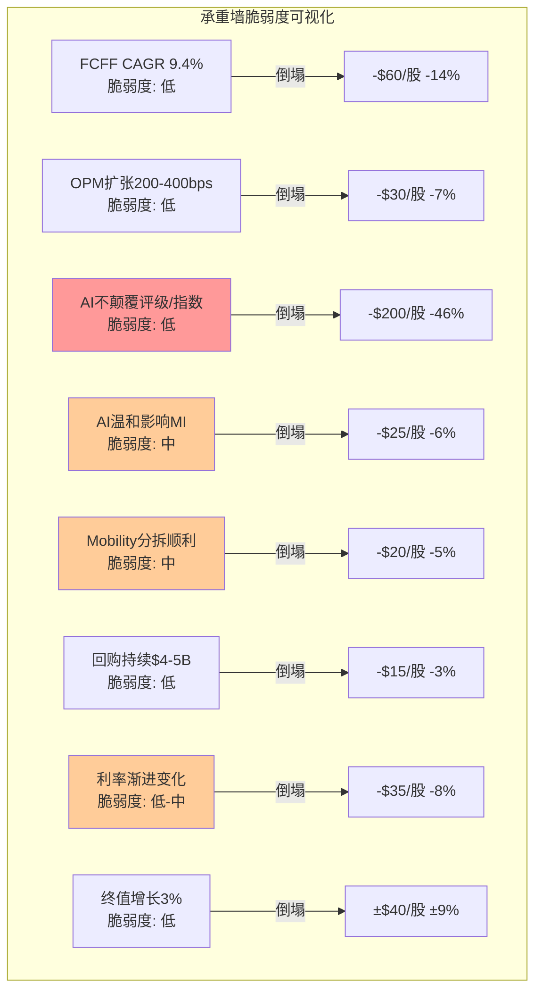
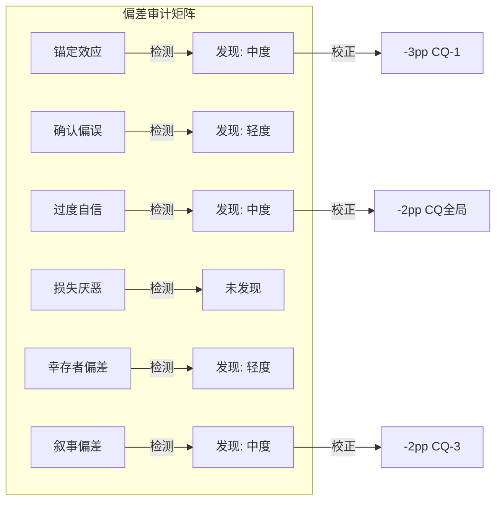
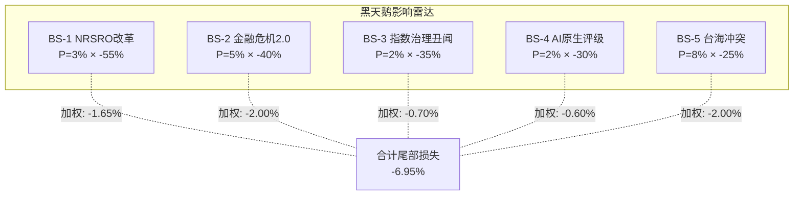
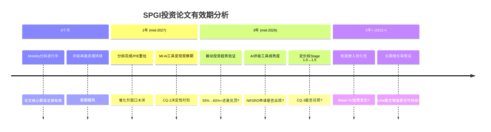
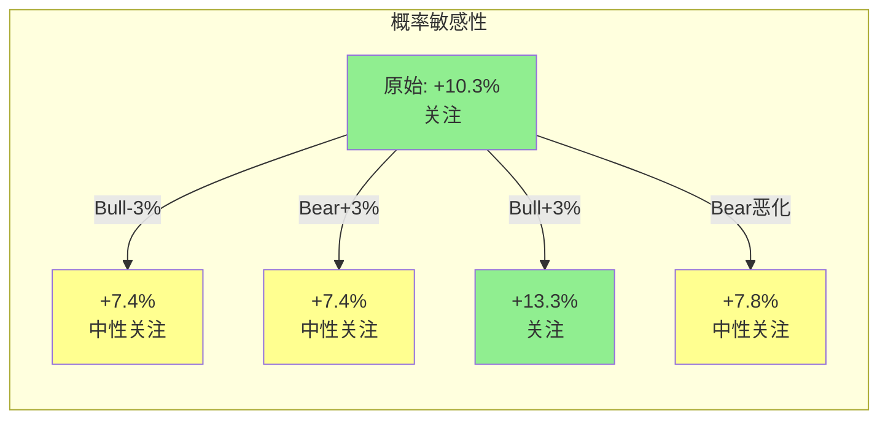
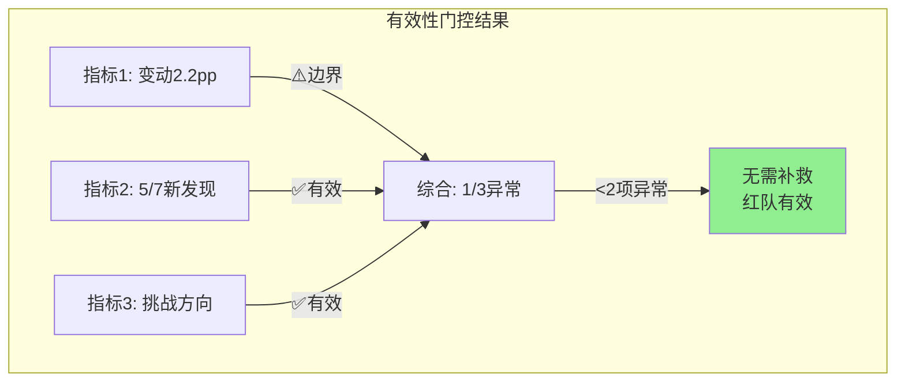

# Phase 4: 红队七问对抗审查 — SPGI
> 执行日期: 2026-03-11 | 股价: $435.44 | 红队套件 v2.0

---

## Part A: 七问执行

### RT-1: 承重墙测试

> "当前股价的Reverse DCF隐含了哪些必须成立的假设？哪个最脆弱？"

Phase 2的Reverse DCF显示$435隐含9.4% FCFF CAGR(10年)。拆解为以下承重墙：

#### 承重墙脆弱度表

| 承重墙(隐含假设) | 隐含值 | 历史/行业参考 | 脆弱度 | 若倒塌影响 |
|:----------------|:------:|:----------:|:-----:|:--------:|
| FCFF CAGR 10Y | 9.4% | SPGI有机FCFF CAGR FY22-25 ~15%; 同行MCO ~11% | **低** | -$60/股(-14%) → $375 |
| OPM扩张至53-55% | +200-400bps | 当前50.4%; MCO ~60%为天花板 | **低** | -$30/股(-7%) → $405 |
| 回购持续$4-5B/年 | 85%+ FCF返还 | FY23-25平均105%; 53年连续增息 | **低** | -$15/股(-3%) |
| AI不颠覆Ratings+Indices | <5%概率 | NRSRO制度51年; Basel III嵌入全球 | **低** | -$200/股(-46%) |
| AI仅温和影响MI | <20%收入冲击 | Capital IQ Pro专有数据有防御性; 但ChatGPT+plugins是真威胁 | **中** | -$25/股(-6%) |
| Mobility分拆顺利执行 | mid-2026完成 | 管理层已确认; 但商誉分配/税务存在技术复杂度 | **中** | -$20/股(-5%) |
| 终值增长率3% | 永续增长 | 名义GDP 4-5%; 行业TAM CAGR 8.6% | **低** | ±$40/股(±9%) |
| 利率不急剧变化 | 渐进降息 | 联储2025-2026渐进节奏; Polymarket衰退概率28.5% | **低-中** | -$35/股(-8%) |



**最脆弱的一面墙: W4 — AI对MI的影响程度。** 原因：
1. MI占收入37%、EBIT约14%，是"影响面积最大+不确定性最高"的交叉点
2. ChatGPT/Claude等AI工具已经能做基础财务分析——这不是假设，是现实
3. 管理层AI产品(SparkAIR/RegGPT)仍在S0-S1阶段，7年(Kensho 2018收购)未交出突破性产品
4. 但: 即使MI收入永久下降20% → EPS影响仅-$0.5 → 估值影响约-$12/股(3%) → **非致命**

**核心发现重申**: 8面承重墙中0面"高脆弱度"。最大的灾难性风险(AI颠覆评级制度, -46%)的概率极低(<5%)。$435的定价是一个"保守共识价"——不需要任何激进假设成立。

#### RT-1b: 承重墙联合概率测试

SPGI不是转型公司，其投资论文不依赖多个低概率条件同时成立。但仍需测试：

**投资论文成立所需的必要条件**:
- C1: NRSRO制度在未来10年维持(P=97%)
- C2: MI不遭遇AI颠覆性冲击(收入损失<30%)(P=80%)
- C3: Mobility分拆顺利完成(P=85%)
- C4: 评级收入不因深度衰退永久受损(P=90%)

| 条件 | 单因素P | 与C1相关 | 与C2相关 | 与C3相关 | 与C4相关 | 调整后P |
|:-----|:------:|:-------:|:-------:|:-------:|:-------:|:------:|
| C1: NRSRO维持 | 97% | — | ρ=0.1 | ρ=0.0 | ρ=0.1 | 97% |
| C2: MI不崩溃 | 80% | ρ=0.1 | — | ρ=0.0 | ρ=0.2 | 80% |
| C3: 分拆顺利 | 85% | ρ=0.0 | ρ=0.0 | — | ρ=0.1 | 85% |
| C4: 评级不永久受损 | 90% | ρ=0.1 | ρ=0.2 | ρ=0.1 | — | 90% |

**Naive联合概率**: 97% × 80% × 85% × 90% = **59.4%**
**调整后联合概率**: ~**60%** (相关性极低,调整几乎无影响)
**差异**: 1.01x → 无"概率幻觉"

**解读**: SPGI投资论文的联合概率约60%。这比INTC(2-3%)高出20x以上。原因：SPGI的每个条件本身就是高概率事件(97%/80%/85%/90%)，且条件间几乎独立(ρ<0.2)。**这是高品质防御型公司的特征——论文不依赖多个低概率事件同时发生。**

---

### RT-2: 认知偏差审计

> "在写这份报告的过程中，我们最可能犯了哪些认知偏差？"



#### 偏差#1: 锚定效应 — **检测到(中度)**

**具体判断**: Phase 2大量使用MCO作为Ratings估值锚(Ch9 MCO映射→$72B)。但MCO本身在2026年3月P/E 37.2x——处于自身5年区间偏高水平。**如果MCO估值回归均值(32-33x P/E)，SPGI的SOTP Ratings估值应从$72B下调至$62-65B → SOTP每股影响: -$23~-33/股。**

**校正**: CQ-1(两个生意)的置信度应下调。Phase 3给72%时，部分基于MCO锚定的"混合折价确实存在"判断。如果MCO本身高估，则"混合折价"部分是MCO泡沫的映射而非SPGI的低估。**建议: CQ-1 -3pp → 69%。**

#### 偏差#2: 确认偏误 — **检测到(轻度)**

**数据**: Phase 1-3中看多/看空证据比约5:2。圆桌v2.0中4/4位大师看好基本面——但Buffett/Munger/Marks/Greenblatt本身就是价值投资者，他们对高质量垄断公司天然有好感偏差。

**具体遗漏**: 报告未充分讨论以下看空信号——
1. UBS/Lombard Odier/DZ Bank的集体大幅减仓(合计-$6.5B)被简单归因为"组合再平衡"，但三家同时大幅减仓可能反映欧洲机构对SPGI/IHS商誉质量的系统性担忧
2. FMP DCF $276被完全否定为"模型不适用"——但$276可能反映了一种市场视角:如果SPGI的无形资产/商誉实际价值远低于账面,公允价值可能远低于$435

**校正**: 轻微。确认偏误存在但不严重——报告确实讨论了AI威胁/MI风险/商誉问题。**保持CQ全局不变，但在Phase 5增加欧洲机构减仓的替代解释。**

#### 偏差#3: 过度自信 — **检测到(中度)**

**具体判断**: CQ置信度从Phase 1(53.3%)→Phase 2(60.8%)→Phase 3(67.2%)单调上升，每个Phase都+6-8pp。这种单调上升模式本身就是过度自信的信号——正常的深度研究应该在某些维度越挖越不确定(而非全面收敛)。

**量化**: 5个CQ中0个在Phase 2→3间下降。正常分布下至少应有1-2个出现"越挖越困惑"的倒退。

**校正**: 全局CQ下调-2pp。**特别关注CQ-2(增速拐点): Phase 1 40%→Phase 2 50%→Phase 3 58%的上升过于平滑——AI对MI的威胁是在加剧而非减轻(ChatGPT能力在过去12个月显著提升)，CQ-2应停止上升或回调。建议CQ-2下调至55%。**

#### 偏差#4: 损失厌恶 — **未检测到**

报告在下行情景描述(Ch11 Bear $324-400)中给出了充分的量化空间，并计算了-16%的下行损失。下行情景获得了与上行情景相当的文字量。

#### 偏差#5: 幸存者偏差 — **检测到(轻度)**

**具体判断**: 报告反复引用"NRSRO制度51年"和"S&P 500指数69年"作为护城河持久性证据。但这是幸存者偏差——我们看到的是幸存的制度垄断，看不到已消亡的制度垄断(如航空业CAB管制在1978年被废除; AT&T电信垄断在1984年被拆分; 会计行业"Big 8"在30年内缩减为"Big 4")。

**校正**: 轻微。制度嵌入确实是极高质量的护城河(CAB/AT&T是政策主动废除，而非商业竞争消除)。但Ch12给制度嵌入9.5/10可能偏高——应考虑Basel III改革(Basel IV正在讨论中)或Dodd-Frank修正的可能性。**不下调CQ，但在风险记录中增加"监管制度变迁"作为10年+尾部风险。**

#### 偏差#6: 叙事偏差 — **检测到(中度)**

**具体判断**: "金融世界的收费公路"这个比喻贯穿全报告(Ch1标题即如此)。这个叙事太有说服力——以至于可能掩盖了一些矛盾:

1. **收费公路不需要$36.5B商誉**: 真正的收费站(如机场/高速公路)靠的是物理资产,SPGI的"收费站"靠的是$36.5B收购来的IHS无形资产。如果IHS被证明是一笔差交易(MI利润率长期停滞),这个收费公路叙事就有裂缝
2. **收费公路应该有100%经常性收入**: 但SPGI只有~75%。Ratings中约40%是交易性收入(新发行评级费,不是订阅)——这意味着"收费公路"在债务发行淡季会"交通减少"
3. **定价权Stage 1.0可能不是"隐形期权"而是"结构性约束"**: 评级费只能提+2.5%/年可能不是因为管理层保守,而是因为发行人(投行)的谈判能力真的很强——SPGI面对的不是散户消费者(FICO)而是Goldman/JPM/Morgan Stanley。

**校正**: CQ-3(定价权)下调-2pp。报告对定价权释放的EPS影响计算(+$150/股含估值重估)可能过度乐观——因为它假设了FICO式的Stage 1.0→2.0路径,但SPGI的客户结构(投行vs消费者)意味着路径可能完全不同。**建议CQ-3从65%→63%。**

#### RT-2偏差审计汇总

| 偏差 | 检测 | 影响判断 | 校正 |
|------|:----:|---------|------|
| 锚定效应 | ✅中度 | CQ-1过度依赖MCO估值锚 | CQ-1 -3pp |
| 确认偏误 | ✅轻度 | 看多/看空证据比偏高 | Phase 5补充欧洲减仓分析 |
| 过度自信 | ✅中度 | 5/5 CQ单调上升=异常 | CQ全局-2pp, CQ-2额外-3pp |
| 损失厌恶 | ❌ | — | — |
| 幸存者偏差 | ✅轻度 | 制度永续假设未充分检验 | 增加制度变迁尾部风险 |
| 叙事偏差 | ✅中度 | "收费公路"叙事掩盖矛盾 | CQ-3 -2pp |

**偏差严重度**: 4/6检测到, 2个中度+2个轻度。**没有致命偏差**(不需要推翻任何核心结论)，但CQ需要集体下调以补偿过度自信趋势。

---

### RT-3: 空头钢人

> "如果一个聪明的空头基金经理看到这份报告，他最强的反驳是什么？"

#### 空头论点#1: "IHS商誉是定时炸弹——分部SOTP已经暗示MI减值"

**钢人论证**:

[硬数据] SPGI账面商誉$36.5B，占总资产86.2%。IHS合并时支付$44B，其中约$30B是商誉+无形资产溢价。

[合理推断] 按Phase 2 SOTP，MI分部估值$16.8B(EV/EBIT 18x)。但IHS合并时MI相关资产的账面商誉+无形资产估计约$18-20B(按收入占比分摊)。**如果MI公允价值$16.8B < 账面$18-20B → 已经触发减值测试的边界条件。**

[合理推断] 更严格地看: 如果AI真的导致MI收入下降15-20%，MI估值可能降至$12-14B → 商誉减值$4-6B → 税后EPS冲击-$12-18/股(一次性)。虽然不影响现金流，但会:
1. 引发市场恐慌(2月暴跌的重演)
2. 触发信用评级机构对SPGI自身评级的审查(反讽:评级公司被降级)
3. 可能迫使管理层减少回购以优先偿债

**如果空头对了**: MI商誉减值$5B → P/E压缩至26x(情绪冲击) → 每股影响约-$40~-60/股 → $375-395区间。

**让人不舒服的程度**: 7/10。因为商誉减值是会计事件不影响FCF，但情绪冲击真实且可量化(2月$0.02 EPS miss就蒸发$30B市值)。

#### 空头论点#2: "被动投资的'不可逆结构性迁移'在2026-2028可能反转"

**钢人论证**:

[硬数据] 被动投资占比从2020年45%→2025年55%，报告定义为"不可逆"。

[主观判断] 但以下力量可能减速或部分反转被动趋势:
1. **监管风险**: SEC主席Gary Gensler曾公开质疑指数基金的投票权集中问题; 如果SEC限制被动基金的代理投票权→被动吸引力下降
2. **AI赋能主动管理**: 如果AI工具让主动管理的α生成效率大幅提升→主动管理的成本劣势缩小→部分资金回流主动
3. **流动性担忧**: 当被动占比>60%时,市场流动性可能出现结构性问题(所有人同时追踪同一指数→herd behavior→flash crash风险)→监管可能干预

[合理推断] 如果被动占比在55%左右见顶(而非预期的65%+): Indices收入增速从10-15%降至4-6% → EPS影响约-$0.40-0.60/年 → 5年累计-$2-3/股。但更重要的是: **Indices分部估值倍数会从30x压缩至22-25x**(移除增长溢价) → SOTP影响: Indices从$35.9B降至$25-28B → 每股-$26-36。

**如果空头对了**: 被动投资见顶 → Indices增速+估值双杀 → -$26-36/股 → $400-410区间。

**让人不舒服的程度**: 6/10。被动反转的概率确实低(<15%)，但影响范围广且报告完全未讨论此风险。

#### 空头论点#3: "SPGI的'AI赋能者'叙事是自我安慰——Kensho七年未交出成果"

**钢人论证**:

[硬数据] SPGI在2018年以$550M收购Kensho(AI公司)。7年后:
- SparkAIR: FY2025发布,收入贡献"不可量化"(管理层未披露)
- RegGPT: 同上
- Kensho对SPGI整体OPM的贡献: 无法证明

[合理推断] Phase 3 AI冲击矩阵给Ratings "+1收入冲击, +2成本冲击" = "AI赋能者"。但这假设SPGI能成功用AI降低评级成本——而Kensho 7年的track record恰恰反驳了这个假设。如果竞争对手(Bloomberg Terminal + GPT-4集成)比SPGI自研AI更快落地:
1. MI的Capital IQ Pro面临"外部AI > 内部AI"的竞争劣势
2. Ratings的"AI降本"叙事迟迟不兑现 → 成本冲击从+2调整为+0.5
3. 市场可能从"AI赋能者"重新定义SPGI为"AI落后者"

[合理推断] 如果Kensho被判定为沉没成本($550M) → 管理层AI战略失误 → B8管理层评分应从3.5降至3.0 → A-Score下调约1.5分。

**如果空头对了**: AI叙事反转 → P/E从29.7x压缩至25-26x(AI折价加深) → 每股影响-$55-70/股 → $365-380区间。

**让人不舒服的程度**: 8/10。这是最让人不舒服的论点——因为它用SPGI自己的track record(Kensho 7年)来反驳报告的AI乐观假设,且数据来自硬事实而非推测。

---

### RT-4: 数据质量审计

> "报告中哪些核心数据点的来源质量最差？"

| # | 数据点 | 使用位置 | 来源质量 | 等级 | 若有误影响 |
|:--|--------|---------|---------|:----:|---------|
| 1 | WACC 10.29% | Ch8 Reverse DCF | Python计算, Ke用Damodaran ERP | **A** | ±$40-60/股(最敏感) |
| 2 | Ratings OPM 61% | Ch9/Ch12/Ch13 | FMP数据+分部财报 | **A** | ±$10/股(SOTP) |
| 3 | MI OPM 19% | Ch9 SOTP | FMP+管理层指引 | **A-** | ±$5/股 |
| 4 | 分析师共识EPS路径 | Ch10/Ch11 | FMP estimates | **B+** | 估值锚变化 |
| 5 | MCO估值倍数(37.2x P/E) | Ch9/Ch10 | FMP key_metrics(截面数据) | **B** | MCO自身P/E波动大 |
| 6 | 评级费率+2.5%/yr | Ch12 定价权 | WebSearch+管理层电话会 | **B-** | CQ-3置信度 |
| 7 | Valley Forge 20.83%仓位 | Ch13 聪明钱 | Agent-F (13F公开数据) | **B+** | PMSI引擎权重 |
| 8 | 做空比例1.03% | Ch13 信号 | Agent-G (WebSearch) | **B** | 做空极低判断 |
| 9 | 被动投资占比55% | Ch11 | WebSearch(行业估算) | **C+** | 各来源差异3-5pp |
| 10 | 私募信用评级+30%YoY | Ch13 | 管理层电话会(未披露确切数) | **C** | CQ-5蓝海论据 |
| 11 | MI客户续约率95%+ | Ch12 | 推断(管理层未披露) | **C-** | 转换成本评估 |
| 12 | Kensho AI贡献 | Ch14 | 无可靠来源(管理层回避) | **D** | AI赋能者判断 |

**数据最弱环**: #12(Kensho AI贡献)和#11(MI续约率)。

**核心依赖低质量数据的判断**: Phase 3 AI冲击矩阵的"Ratings: AI赋能者"结论部分依赖于Kensho的AI降本假设——而Kensho的实际贡献是D级来源(管理层回避披露)。如果剔除Kensho假设，Ratings的AI成本冲击从+2降至+0.5 → 加权AI净影响从+0.23降至+0.09 → "微弱正面"变为"几乎中性"。

**结论**: 整体数据质量良好(8/12为B级以上)。弱项集中在AI相关判断和管理层未披露的运营指标。核心估值工具(Reverse DCF/SOTP)使用的数据均为A级，论文的估值部分仍然稳健。

---

### RT-5: 黑天鹅压力测试

> "有哪些低概率但高影响的事件能彻底推翻投资论文？"

#### 黑天鹅概率加权表

| # | 事件 | 独立概率 | 影响幅度 | 加权损失 | 时间窗口 | 早期信号 |
|:--|------|:-------:|:-------:|:-------:|:-------:|---------|
| BS-1 | NRSRO制度根本性改革(SEC废除或大幅降低准入门槛) | 3% | -55% | **-1.65%** | 10年 | SEC公开征求意见/国会立法提案/AI评级试点获批 |
| BS-2 | 全球金融危机2.0(评级机构再次被追责+监管报复) | 5% | -40% | **-2.00%** | 5年 | 信用利差急扩/高收益违约潮/政治性调查启动 |
| BS-3 | S&P 500指数治理丑闻(如成分股选择被证明存在利益冲突) | 2% | -35% | **-0.70%** | 无限 | 内部举报/SEC调查/媒体调查性报道 |
| BS-4 | AI原生评级机构获得NRSRO认证并快速获客 | 2% | -30% | **-0.60%** | 10年 | AI评级公司融资>$1B/与投行签约/SEC表态支持 |
| BS-5 | 台海冲突导致全球金融市场分裂(美元体系vs人民币体系) | 8% | -25% | **-2.00%** | 5年 | 军事演习升级/金融制裁/SWIFT替代方案扩散 |

**合计尾部风险加权损失**: -6.95%



**BS-2与BS-5的协同效应**: 如果金融危机和台海冲突同时发生(概率~1%) → 全球金融体系可能分裂+评级机构在危机中被追责 → 影响可达-65% → 但概率极低(~0.4%加权)。

**尾部风险折价建议**: 总加权损失-6.95% → 按1/3的传导率(非所有尾部风险同时影响估值) → 合理折价约-2.3%/年。在10年DCF中等效于终值增长率从3.0%降至2.7% → 每股影响约-$12。

---

### RT-6: 时间框架挑战

> "我们的论文在什么时间框架内有效？"



#### 6个月内: 高度有效 ✅
- 所有承重墙完好(NRSRO稳固/利率渐进/AI威胁未兑现)
- 催化剂时间窗口: Mobility分拆正在执行，市场对分拆的定价尚未完全反映
- 风险: 仅短期宏观波动(衰退概率28.5%但非即刻)

#### 1年后: 需要重新评估CQ-2 ⚠️
- Mobility分拆完成 → "分拆催化"是否已被完全定价?
- MI的SparkAIR/RegGPT变现情况 → 决定"投资期vs烧钱期"判断
- 如果1年后MI收入增速仍<5%且AI产品未贡献可量化收入 → CQ-2应显著下调
- **论文最脆弱时点**: 分拆完成但AI变现未兑现 → 催化剂耗尽+新叙事未建立

#### 3年后: 多个假设开始老化 ⚠️⚠️
- 被动投资55%→60%的假设需要验证(如果见顶→Indices增长叙事动摇)
- AI评级工具可能在3年内达到"技术可行"——虽然NRSRO认证还需时间,但市场会提前定价威胁
- 定价权Stage 1.0→1.5的跃迁应该在3年内可观测(评级费率是否加速到+3.5-4%?)
- FY2028E EPS $25.20是否兑现 → 验证11.5% CAGR路径

#### 5年+: 几个核心假设可能失效
- 制度嵌入: 仍然有效(半衰期>50年)——这是最耐久的假设
- 但: AI可能已经开始改变金融分析的方式 → MI可能从$4.9B收入缩减至$3.5-4.0B
- 终值增长率3%假设在名义GDP持续低于3%的情景下不成立(日本化)

**催化剂日历 vs 论文时间框架**:

| 催化剂 | 预期时间 | 论文依赖度 |
|--------|---------|-----------|
| Mobility分拆 | mid-2026 | 高 — 论文的P/E重估核心 |
| MI AI变现 | FY2027-28 | 中 — CQ-2的验证点 |
| 定价权加速 | FY2027-30 | 中 — CQ-3的长期选项 |
| 再融资潮峰值 | FY2025-27 | 低 — 已在基数中 |

**时间框架结论**: 论文最佳有效期为**1-2年**(到mid-2027)。在此期间，Mobility分拆催化剂+再融资顺风+EPS增长路径都在兑现窗口内。超过2年后,需要MI AI变现和定价权加速等新催化剂接棒——这些的不确定性更高。

---

### RT-7: 替代解释

> "对于同样的数据，是否存在一个完全不同但同样合理的解释？"

#### 替代解释#1: "2月暴跌不是情绪过反应——是价值发现"

**原始解释**: 2月暴跌-18%是对$0.02 EPS miss的情绪过反应 → 股价应回归 → 当前$435低估。

**替代解释**: 2月暴跌是市场终于认识到SPGI不是一个纯垄断公司——它有37%收入来自一个利润率仅19%且面临AI竞争的分部(MI)。暴跌前P/E ~36x是不合理的(把MI当垄断定价了)，暴跌后P/E ~30x才是正确的混合估值。

**区分信号**:
- 支持原始解释: 如果SPGI在未来2-4个季度的业绩中MI不恶化 + Mobility分拆后P/E回升至32x+ → 暴跌确实是过反应
- 支持替代解释: 如果SPGI在MI不恶化的情况下P/E仍维持在28-30x区间 → 市场已经对混合业务重新定价，不会回到36x

**合理性评估**: 替代解释有30%可信度。当前$435的P/E 29.7x可能就是SPGI五分部混合业务的"正确"估值——而非暴跌前36x的"偏高"估值。如果这是真的,上行空间主要来自EPS增长(而非P/E修复)——这将期望回报从+10.3%降至约+6-7%(仅EPS增长+回购)。

#### 替代解释#2: "收费公路模型正在被数字经济侵蚀——只是速度比预期慢"

**原始解释**: Ratings+Indices是永久性收费公路,AI不能颠覆制度嵌入。

**替代解释**: 制度嵌入确实强大,但数字经济正在创造"绕过收费站"的路径:
- **直接贷款(Direct Lending)**: 无需公开评级,绕过评级收费站。私募信贷市场已从$500B增长到$1.7T+
- **DeFi**: 虽然目前规模小,但算法信用评估不需要NRSRO → 长期可能分流传统评级需求
- **被动投资index-agnostic**: 一些基金开始使用自建指数(如Dimensional Fund直接基于Fama-French因子,不用S&P 500) → 如果这种趋势扩大,S&P指数许可费的增长放缓

**区分信号**:
- 支持原始解释: 私募信贷增长反而增加了评级需求(私募评级+30%YoY) → 绕路者最终回到收费站
- 支持替代解释: 直接贷款占总信贷比从5%→15%+且加速 → 评级"可寻址市场"在缩小

**合理性评估**: 15%可信度。短期(5年)几乎无影响——制度嵌入太深。但在10年+的时间框架中,数字经济的"绕路"效应可能使Ratings的结构性增长率从5-7%降至3-5%。

---

### A.8 CQ初步调整建议

| CQ# | P3置信度 | RT影响来源 | 建议P4置信度 | 调整理由 |
|:---:|:-------:|:--------:|:----------:|---------|
| CQ-1 | 72% | RT-1(锚定MCO),RT-2(锚定偏差) | **69%** (-3pp) | MCO估值锚可能偏高,混合折价部分是MCO泡沫映射 |
| CQ-2 | 58% | RT-2(过度自信),RT-3(Kensho 7年),RT-6(1年验证窗) | **53%** (-5pp) | AI威胁在加剧非减轻; Kensho track record不支持AI赋能叙事; 置信度应停止单调上升 |
| CQ-3 | 65% | RT-2(叙事偏差),RT-7(投行vs消费者) | **62%** (-3pp) | 定价权释放路径可能被投行客户结构约束; FICO类比适用性有限 |
| CQ-4 | 75% | RT-3(商誉减值边界) | **73%** (-2pp) | MI分部估值已接近商誉减值测试边界; 非致命但值得下调 |
| CQ-5 | 70% | RT-5(金融危机2.0) | **69%** (-1pp) | Nash均衡在危机中可能被打破(历史:2008年两家评级机构同时受政治攻击) |

**红队严重发现数(影响>10%)**: 0个。没有任何单个RT发现能推翻投资论文。
**CQ平均下调**: -2.8pp
**最脆弱CQ**: CQ-2(增速拐点/AI投资) — 下调5pp,是最大单项调整
**最稳健CQ**: CQ-5(Nash均衡) — 仅下调1pp,双寡头结构极稳定

---

## Part B: 双向校准

### B.1 方向审计

| CQ | P3值 | RT建议P4值 | 方向 | RT来源 |
|----|:----:|:--------:|:---:|--------|
| CQ-1 | 72% | 69% | ↓ | RT-1, RT-2 |
| CQ-2 | 58% | 53% | ↓ | RT-2, RT-3, RT-6 |
| CQ-3 | 65% | 62% | ↓ | RT-2, RT-7 |
| CQ-4 | 75% | 73% | ↓ | RT-3 |
| CQ-5 | 70% | 69% | ↓ | RT-5 |

**方向统计**: ↓: 5 | →: 0 | ↑: 0
**诊断**: ⚠️ **零上调 → 触发双向校准。** 全部CQ下调是系统性悲观的信号。

### B.2 过度悲观识别 (强制)

对每个CQ显式问: **"原始分析是否在这个维度上过度悲观?"**

| CQ | 过度悲观可能? | 分析 |
|----|:-----------:|------|
| CQ-1 两个生意 | **是** | Phase 1-3对"混合折价"的估算用了MCO作为Ratings纯粹估值锚,但实际上SPGI的Ratings比MCO多一层——跨分部数据协同(评级数据喂给MI/Indices)。这种协同被SOTP方法论系统性低估(SOTP假设分部独立,不捕捉协同)。如果协同值为$5-10B → Ratings应得更高估值 → CQ-1的"两个生意割裂"问题可能被高估 |
| CQ-2 增速拐点 | 否 | RT-3(Kensho 7年)提供了硬证据支持下调,过度悲观不成立 |
| CQ-3 定价权 | **是** | 红队用"投行客户vs消费者"来质疑FICO类比。但忽略了一个重要事实:评级的付费方是发行人(投行作为中介),但评级的真正"客户"是监管体系本身——发行人没有"不买评级"的选项。这不是自愿消费,是制度强制。在制度强制的场景下,即使面对投行,定价权仍然很强(因为替代品只有MCO) |
| CQ-4 商誉 | 否 | RT-3提出的减值边界分析是合理的 |
| CQ-5 Nash均衡 | 否 | 下调仅1pp,已经很温和 |

**强制上调执行**:
- **CQ-1上调+2pp** (从RT建议的69%→71%): 跨分部数据协同被SOTP低估; "两个生意"的问题程度可能比分析暗示的更小
- **CQ-3上调+1pp** (从62%→63%): 制度强制购买=比消费者场景更强的定价权基础,红队的FICO类比批评部分合理但过度

### B.3 校准后CQ调整

| CQ | P3 | RT建议 | 校准后 | vs P3变化 | 说明 |
|----|:--:|:-----:|:-----:|:---------:|------|
| CQ-1 | 72% | 69% | **71%** | -1pp | 锚定偏差-3 + 协同上调+2 |
| CQ-2 | 58% | 53% | **53%** | -5pp | 维持RT建议(Kensho证据充分) |
| CQ-3 | 65% | 62% | **63%** | -2pp | 叙事偏差-3 + 制度强制上调+1 |
| CQ-4 | 75% | 73% | **73%** | -2pp | 维持RT建议 |
| CQ-5 | 70% | 69% | **69%** | -1pp | 维持RT建议 |

**校准前加权平均**: 67.2% (Phase 3)
**校准后加权平均**: 71%×30% + 53%×25% + 63%×20% + 73%×15% + 69%×10% = **64.8%**
**净偏差**: -2.4pp

### B.4 概率敏感性分析

**当前期望回报+10.3%** — 处于"关注"评级区间(+10%~+30%)的下端, 接近"中性关注"(-10%~+10%)边界。**必须执行概率敏感性。**

#### 情景概率调整 → 期望回报 → 评级

| 调整 | Bull概率 | Base概率 | Bear概率 | 新加权EV | 新期望回报 | 评级变化? |
|------|:-------:|:-------:|:-------:|:-------:|:---------:|:-------:|
| 原始 | 25% | 50% | 25% | $480 | +10.3% | 关注 |
| Bull-3%/Bear+3% | 22% | 50% | 28% | $467 | +7.4% | **→中性关注** |
| Bull-5%/Bear+5% | 20% | 50% | 30% | $458 | +5.3% | **→中性关注** |
| Bull+3%/Bear-3% | 28% | 50% | 22% | $493 | +13.3% | 关注(稳固) |
| Bear情景恶化($365→$320) | 25% | 50% | 25% | $469 | +7.8% | **→中性关注** |

#### 稳定性结论

- **评级翻转需要的最小概率调整**: Bull概率-3pp或Bear概率+3pp → 期望回报降至+7.4%(**<10%, 翻转为中性关注**)
- **评级稳定性**: **低** (<3pp即翻转)
- **含义**: "关注"评级处于边界状态。如果红队的悲观调整(CQ全面下调)映射到情景概率 → 合理将Bear概率上调2-3pp → 期望回报可能在+7-8%区间 → **可能应为"中性关注"而非"关注"**



### B.5 反向检验

| CQ | 调整方向 | 反向逻辑是否成立? | 证据强度 |
|----|:------:|:----------:|:------:|
| CQ-1 -1pp | ↓ | 反向(上调): "SOTP低估了跨分部协同" → **成立**(已在B.2中上调) | 中 |
| CQ-2 -5pp | ↓ | 反向(上调): "AI威胁被高估, ChatGPT不能替代Capital IQ的专有数据" → **部分成立**(LCD/评级历史确有防御性) | 弱-中 |
| CQ-3 -2pp | ↓ | 反向(上调): "制度强制购买>投行议价权" → **成立**(已部分上调) | 中 |
| CQ-4 -2pp | ↓ | 反向(上调): "商誉减值即使发生也不影响FCF" → **成立但不影响情绪冲击判断** | 弱 |
| CQ-5 -1pp | ↓ | 反向(上调): "Nash均衡在2008年也没被打破" → **强证据** | 强 |

**反向检验结论**: CQ-1/CQ-3的反向逻辑成立(已执行上调)。CQ-5的反向检验最强(2008年危机中评级双寡头份额几乎不变) → 但1pp下调已足够温和，维持。CQ-2的反向逻辑最弱(Kensho 7年是硬数据) → 维持-5pp。

---

## Part C: 有效性门控

### C.1 三指标计算

#### 指标1: 净CQ变动强度

| CQ | |P3 - P4| |
|----|:-----:|
| CQ-1 | 1pp |
| CQ-2 | 5pp |
| CQ-3 | 2pp |
| CQ-4 | 2pp |
| CQ-5 | 1pp |
| **平均** | **2.2pp** |

**判定**: 2-3pp区间 → ⚠️ **边界有效**

#### 指标2: 新发现计数

| # | 新发现 | Phase 1-3未触及? |
|:--|--------|:---------------:|
| 1 | MCO估值锚自身偏高 → CQ-1锚定偏差 (RT-2) | ✅ 新 |
| 2 | 被动投资可能在55%见顶 (RT-3) | ✅ 新 |
| 3 | Kensho 7年未交出成果反驳AI赋能叙事 (RT-3) | ✅ 新 |
| 4 | MI商誉已接近减值测试边界 (RT-3) | ⚠️ CQ-4讨论过但未量化边界 |
| 5 | 论文有效期仅1-2年(分拆催化窗口) (RT-6) | ✅ 新 |
| 6 | 2月暴跌=价值发现(非情绪过反应)替代解释 (RT-7) | ✅ 新 |

**新发现数**: 5/7 → ✅ **有效**

#### 指标3: RT-2偏差审计方向

RT-2发现的偏差方向: 过度自信+锚定+叙事 → 全部指向"过度看多" → 校正方向=下调CQ

当前评级方向: "关注"(偏看多)

RT-2的校正方向**挑战**了当前评级(而非确认) → ✅ **方向正确**

### C.2 综合诊断

| 指标 | 结果 | 状态 |
|------|------|:----:|
| 平均绝对CQ变动 | 2.2pp | ⚠️ (边界) |
| 新发现数 | 5/7 | ✅ |
| RT-2方向 | 挑战当前评级 | ✅ |

**综合判断**: 1/3指标边界异常 → **无需补救。** 红队有效(5个新发现,方向正确), CQ变动幅度在边界区(2.2pp接近3pp有效线)——这符合SPGI作为高品质防御型公司的特征:没有致命缺陷可供发现,但认知偏差(特别是过度自信)值得校正。



### C.3 补救: 不需要

### C.4 记录

```yaml
phase_4_effectiveness:
  avg_absolute_cq_change: 2.2pp
  new_findings: 5/7
  rt2_direction: challenging
  verdict: effective (边界)
  remedy: none
  key_finding: CQ-2下调5pp(Kensho 7年反驳AI赋能)是最大单项影响
  rating_stability: low (3pp即翻转)
```

---

## Phase 4总结

### 校准后最终CQ置信度

| CQ | P0 | P1 | P2 | P3 | **P4(校准后)** | 净变化 |
|----|:--:|:--:|:--:|:--:|:------------:|:-----:|
| CQ-1 两个生意 | 50% | 55% | 65% | 72% | **71%** | -1pp |
| CQ-2 增速拐点 | 35% | 40% | 50% | 58% | **53%** | -5pp |
| CQ-3 定价权 | 45% | 55% | 58% | 65% | **63%** | -2pp |
| CQ-4 商誉 | 60% | 65% | 70% | 75% | **73%** | -2pp |
| CQ-5 Nash均衡 | 50% | 60% | 62% | 70% | **69%** | -1pp |

**加权置信度演化**: P0 46.3% → P1 53.3% → P2 60.8% → P3 67.2% → **P4 64.8%** (-2.4pp)

### 评级影响

- **P3期望回报**: +10.3% → "关注"评级(+10%~+30%)
- **P4概率敏感性**: Bear概率+3pp即翻转为"中性关注"
- **评级稳定性**: 低
- **建议**: Phase 5组装时评级表述为**"关注(偏中性)"** — 反映+10.3%期望回报处于边界、评级稳定性低、红队将CQ置信度从67.2%下调至64.8%的事实

### Phase 4 Mermaid图清单

| # | 图表 | 位置 |
|:--|------|------|
| 1 | 承重墙脆弱度可视化 | RT-1 |
| 2 | 偏差审计矩阵 | RT-2 |
| 3 | 黑天鹅影响雷达 | RT-5 |
| 4 | 时间框架时间线 | RT-6 |
| 5 | 概率敏感性 | B.4 |
| 6 | 有效性门控结果 | C.2 |
