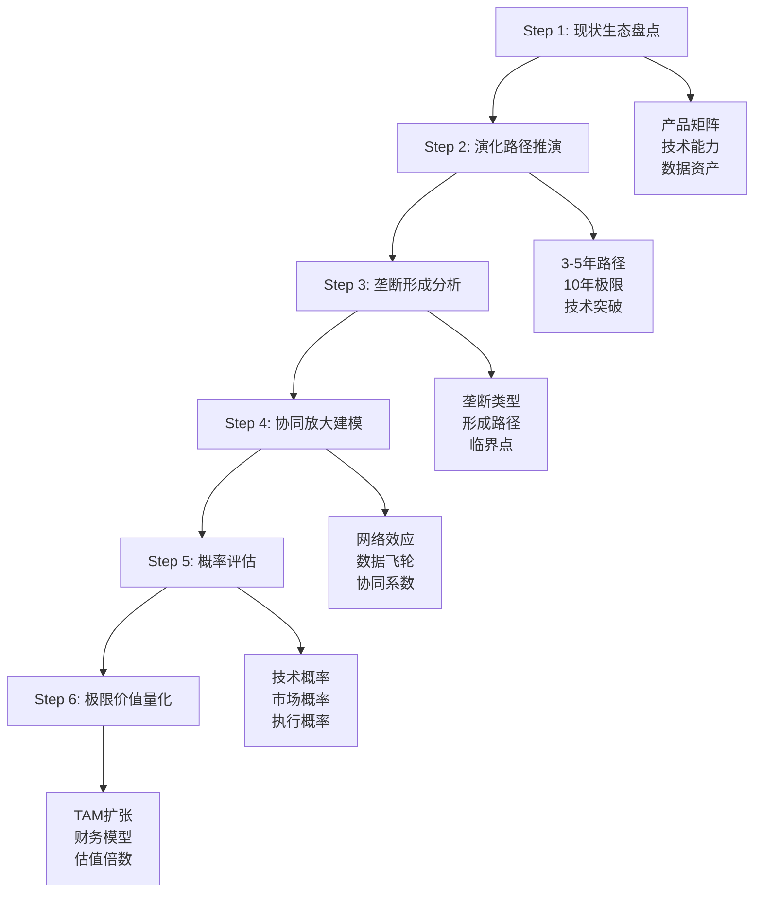
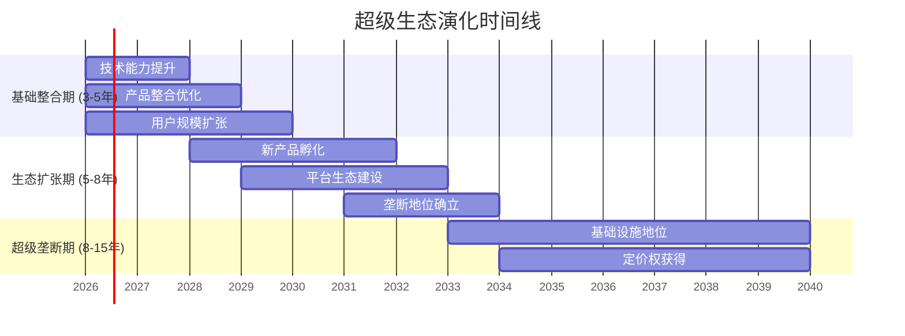

# 超级生态演绎分析模块 - 实施规划
## Super Ecosystem Evolution Analysis - Implementation Plan

**规划日期**: 2026-02-03
**模块版本**: v1.0
**适用范围**: 所有科技生态和平台型公司

---

## 🎯 **规划概览**

### **模块核心价值**
这个模块解决了传统投资分析的一个重要盲区：**科技公司极限演化价值的量化**。传统DCF和倍数法往往低估了生态协同、网络效应、和垄断形成的指数级价值创造潜力。

### **设计理念对比**
```
传统分析局限：                  超级演绎优势：
├─ 线性业务外推                ├─ 非线性协同建模
├─ 单一产品估值                ├─ 生态矩阵重组
├─ 静态竞争假设                ├─ 动态垄断分析
└─ 确定性价值计算              └─ 概率加权估值
```

---

## 🏗️ **框架架构设计**

### **6步标准化流程**



### **通用性设计原则**

**层次化适配**:
- **通用层 (70%)**: 标准化流程和方法论
- **行业层 (20%)**: 行业特定的关键因素
- **公司层 (10%)**: 个别公司的独特情况

**模块化组合**:
```
核心模块 (必选):
├─ 产品矩阵分析
├─ 演化路径建模
├─ 协同效应量化
└─ 概率权重评估

扩展模块 (可选):
├─ 垄断形成分析
├─ 技术突破预测
├─ 监管环境影响
└─ 竞争响应建模
```

---

## 🎯 **适用公司分类**

### **Tier 1: 生态科技巨头**
*适用度: ⭐⭐⭐⭐⭐ (完全适用)*

| 公司 | 当前生态 | 演化潜力 | 关键突破点 | 预期价值倍数 |
|------|---------|---------|-----------|-------------|
| **Meta** | 社交+AI+VR | AI基础设施 | AGI+AR普及 | 4-6x |
| **Tesla** | 汽车+能源+AI | 智能移动生态 | FSD+机器人 | 5-8x |
| **Apple** | 硬件+软件+服务 | 个人数字生活 | AR/VR+健康 | 2-3x |
| **Google** | 搜索+云+AI | 智能信息基础设施 | AGI+量子计算 | 3-5x |
| **Amazon** | 电商+云+物流 | 全球商业基础设施 | AI+无人化 | 2-4x |
| **Microsoft** | 软件+云+AI | 企业智能化平台 | Copilot生态 | 2-3x |

**分析重点**:
- 跨产品协同效应最强
- 垄断形成潜力最大
- 需要重点关注技术突破和监管风险

### **Tier 2: 平台型公司**
*适用度: ⭐⭐⭐⭐ (高度适用)*

| 公司 | 平台类型 | 演化方向 | 关键成功因素 |
|------|---------|---------|-------------|
| **Shopify** | 电商SaaS | 全球商业操作系统 | 中小企业数字化 |
| **Salesforce** | CRM平台 | 企业AI助手 | AI集成+数据优势 |
| **ServiceNow** | 企业服务 | 智能工作流平台 | 自动化+AI |
| **Palantir** | 数据平台 | 决策智能基础设施 | 政府+企业渗透 |
| **Unity** | 游戏引擎 | 3D内容创作平台 | 元宇宙+工业应用 |

**分析重点**:
- B端客户锁定和扩张
- 平台网络效应强化
- 向相邻市场扩展能力

### **Tier 3: 垂直整合公司**
*适用度: ⭐⭐⭐ (中等适用)*

| 公司 | 核心业务 | 生态化方向 | 演化概率 |
|------|---------|-----------|---------|
| **SpaceX** | 航天发射 | 太空经济基础设施 | 中等 |
| **TSMC** | 芯片制造 | 硬件供应链控制 | 低-中等 |
| **NVIDIA** | GPU+AI芯片 | AI计算基础设施 | 高 |
| **Adobe** | 创意软件 | 内容创作生态 | 中等 |

**分析要点**:
- 需要评估向生态化转型的可能性
- 重点关注技术护城河的持续性
- 考虑新技术对现有优势的冲击

---

## 🏭 **行业扩展应用**

### **生物科技行业**
*框架适配: ⭐⭐⭐⭐*

**演化路径模式**:
```
阶段1: 单一药物开发 (传统模式)
阶段2: 平台化药物发现 (AI+生物技术)
阶段3: 精准医疗生态 (数据+AI+药物+诊断)
```

**关键成功因素**:
- AI制药技术突破
- 基因测序成本下降
- 监管政策开放
- 数据共享机制建立

**适用公司示例**:
- **Moderna**: mRNA平台 → 个性化疫苗/癌症治疗
- **Illumina**: 基因测序 → 精准医疗数据平台
- **10x Genomics**: 单细胞分析 → 细胞工程平台

### **新能源行业**
*框架适配: ⭐⭐⭐*

**演化路径模式**:
```
阶段1: 单一技术产品 (太阳能板/风机)
阶段2: 能源解决方案 (发电+储能+管理)
阶段3: 智慧能源网络 (AI+物联网+碳市场)
```

**关键技术突破**:
- 储能技术成本breakthrough
- 电网智能化普及
- 碳市场机制成熟
- 能源管理AI算法

**适用公司示例**:
- **Tesla**: 汽车+储能+太阳能 → 能源生态
- **宁德时代**: 电池制造 → 储能解决方案
- **比亚迪**: 汽车+电池 → 绿色交通生态

### **金融科技行业**
*框架适配: ⭐⭐⭐⭐*

**演化路径模式**:
```
阶段1: 单点金融服务 (支付/贷款)
阶段2: 金融服务平台 (综合金融+技术)
阶段3: 数字经济基础设施 (数字货币+DeFi+监管科技)
```

**关键成功因素**:
- 央行数字货币政策
- 监管沙箱开放
- 跨境支付标准化
- 区块链技术成熟

**适用公司示例**:
- **Square**: 支付+商户服务 → 中小企业金融生态
- **蚂蚁集团**: 支付+信贷 → 数字金融基础设施
- **PayPal**: 全球支付 → 数字货币网络

### **制造业数字化**
*框架适配: ⭐⭐⭐*

**演化路径模式**:
```
阶段1: 传统制造 (人工+设备)
阶段2: 智能制造 (自动化+数据)
阶段3: 工业互联网平台 (设备+数据+服务+生态)
```

**适用公司示例**:
- **工业富联**: 代工制造 → 智能制造服务
- **美的集团**: 家电制造 → 智能家居生态
- **三一重工**: 工程机械 → 工业互联网平台

---

## 📊 **实施步骤指南**

### **Phase 0: 准备工作 (1小时)**

```markdown
□ 确认公司类型和适用度
  - Tier 1 生态巨头: 完整6步流程
  - Tier 2 平台公司: 重点协同+垄断分析
  - Tier 3 垂直公司: 重点演化路径评估

□ 收集基础数据
  - 产品线收入结构
  - 技术能力清单
  - 用户/客户数据
  - 竞争对手信息

□ 设定分析目标
  - 明确时间维度 (3年/5年/10年)
  - 确定概率区间 (5-50%合理范围)
  - 设置价值倍数预期
```

### **Phase 1: 现状生态盘点 (2-3小时)**

**Step 1: 产品矩阵分析**
```python
# 产品矩阵分析模板
product_matrix = {
    'core_products': [
        {'name': '产品A', 'revenue_pct': 60, 'growth_rate': 0.15},
        {'name': '产品B', 'revenue_pct': 25, 'growth_rate': 0.25},
        {'name': '产品C', 'revenue_pct': 15, 'growth_rate': 0.35}
    ],
    'emerging_products': [
        {'name': '新产品X', 'investment': 1000, 'stage': 'R&D'}
    ],
    'synergy_potential': {
        'data_sharing': 0.8,    # 数据共享程度
        'tech_reuse': 0.6,      # 技术复用度
        'cross_selling': 0.4,   # 交叉销售度
        'user_overlap': 0.7     # 用户重叠度
    }
}
```

**Step 2: 核心资产评估**
```markdown
技术资产清单:
□ 专利组合: X项核心专利
□ 算法优势: 在Y领域的独特算法
□ 数据资产: Z规模的独占数据
□ 人才团队: 关键技术人才密度

用户/客户资产:
□ 用户规模: X亿活跃用户
□ 用户粘性: 平均使用时长Y分钟/日
□ 网络密度: 用户间连接关系强度
□ 付费转化: 免费到付费的转化漏斗
```

### **Phase 2: 演化路径推演 (3-4小时)**

**Step 3-4: 时间线场景建模**



**关键里程碑识别**:
```markdown
技术里程碑:
□ 2027年: 关键技术突破A
□ 2029年: 技术平台成熟
□ 2032年: 下一代技术领先

市场里程碑:
□ 2028年: 新产品市场接受度>50%
□ 2030年: 跨产品协同效应显现
□ 2035年: 垄断地位不可撼动

监管里程碑:
□ 2026年: 重要政策明确
□ 2030年: 行业标准确立
□ 2035年: 监管与公司利益一致
```

### **Phase 3: 垄断形成分析 (2-3小时)**

**Step 5-6: 垄断路径建模**

**垄断类型选择矩阵**:
```
                网络效应强度
                低    中    高
平台开放度  开放  生态  网络  标准
           中等  数据  平台  基础设施
           封闭  技术  垂直  生态系统
```

**垄断形成阶段评估**:
```python
def assess_monopoly_stage(company_data):
    stages = {
        'resource_accumulation': {
            'users': company_data['user_count'] > 100_000_000,
            'data': company_data['data_moat'] > 0.7,
            'tech': company_data['tech_lead'] > 0.6
        },
        'capability_leadership': {
            'market_share': company_data['market_share'] > 0.3,
            'innovation_rate': company_data['r_d_intensity'] > 0.15,
            'talent_density': company_data['talent_score'] > 0.8
        },
        'ecosystem_lock_in': {
            'switching_cost': company_data['switching_cost'] > 0.5,
            'network_effects': company_data['network_strength'] > 0.7,
            'complementor_count': company_data['partners'] > 1000
        }
    }

    current_stage = 0
    for stage, conditions in stages.items():
        if all(conditions.values()):
            current_stage += 1

    return current_stage, stages
```

### **Phase 4: 协同放大建模 (3-4小时)**

**Step 7-8: 网络效应和协同计算**

**网络价值计算框架**:
```python
def calculate_network_value(n_users, connection_strength, alpha=0.5):
    """
    网络价值 = 用户数^α × 连接强度^β
    α: 网络效应指数 (0.3-2.0)
    β: 连接质量指数 (0.2-1.0)
    """
    base_value = n_users ** alpha
    quality_multiplier = connection_strength ** 0.7
    network_value = base_value * quality_multiplier

    return network_value

# 示例计算
meta_network_value = calculate_network_value(
    n_users=3_000_000_000,  # 30亿用户
    connection_strength=0.85,  # 高连接强度
    alpha=0.6  # 社交网络效应指数
)
```

**协同系数建模**:
```python
def calculate_synergy_coefficient(product_matrix):
    """
    协同系数 = Σ(产品i × 产品j × 协同强度ij)
    """
    synergies = {}
    products = product_matrix['products']

    for i, prod1 in enumerate(products):
        for j, prod2 in enumerate(products[i+1:], i+1):
            # 数据协同
            data_synergy = prod1['data_richness'] * prod2['data_richness'] * 0.8

            # 用户协同
            user_synergy = min(prod1['user_overlap'], prod2['user_overlap']) * 0.6

            # 技术协同
            tech_synergy = prod1['tech_sharing'] * prod2['tech_sharing'] * 0.7

            total_synergy = data_synergy + user_synergy + tech_synergy
            synergies[f"{prod1['name']}-{prod2['name']}"] = total_synergy

    return synergies
```

### **Phase 5: 概率评估 (2-3小时)**

**Step 9-10: 多维概率建模**

**概率评估框架**:
```python
def assess_evolution_probability():
    # 技术维度概率
    tech_factors = {
        'r_d_investment': 0.8,      # 研发投入充足
        'talent_quality': 0.9,      # 人才团队优秀
        'tech_difficulty': 0.4,     # 技术难度高
        'time_pressure': 0.6        # 时间窗口压力
    }
    tech_prob = (tech_factors['r_d_investment'] *
                 tech_factors['talent_quality'] *
                 tech_factors['time_pressure']) / tech_factors['tech_difficulty']

    # 市场维度概率
    market_factors = {
        'user_acceptance': 0.7,     # 用户接受度
        'regulatory_risk': 0.3,     # 监管风险
        'competition_threat': 0.4,  # 竞争威胁
        'macro_environment': 0.8    # 宏观环境
    }
    market_prob = (market_factors['user_acceptance'] *
                   market_factors['macro_environment'] *
                   (1 - market_factors['regulatory_risk']) *
                   (1 - market_factors['competition_threat']))

    # 执行维度概率
    execution_factors = {
        'management_vision': 0.9,   # 管理层愿景
        'organizational_capability': 0.8,  # 组织能力
        'financial_resources': 0.95,  # 资金资源
        'execution_track_record': 0.85  # 执行记录
    }
    execution_prob = sum(execution_factors.values()) / len(execution_factors)

    # 综合概率 (考虑相关性)
    correlation_adjustment = 0.7  # 正相关调整
    overall_prob = (tech_prob * market_prob * execution_prob) ** 0.5 * correlation_adjustment

    return {
        'technical': tech_prob,
        'market': market_prob,
        'execution': execution_prob,
        'overall': overall_prob
    }
```

### **Phase 6: 极限价值量化 (3-4小时)**

**Step 11-12: TAM扩张和财务建模**

**TAM演化建模**:
```python
def model_tam_expansion():
    tam_evolution = {
        'current_tam': {
            '2024': 1_200_000_000_000,  # $1.2T当前可触及市场
            'description': '核心业务+现有产品延伸'
        },
        'expanded_tam': {
            '2028': 3_500_000_000_000,  # $3.5T扩展市场
            'description': '新产品线+相邻市场进入'
        },
        'ultimate_tam': {
            '2035': 8_000_000_000_000,  # $8.0T极限市场
            'description': '基础设施地位+新商业模式'
        }
    }
    return tam_evolution
```

**极限估值计算**:
```python
def calculate_ultimate_valuation(financial_projections):
    # 方法1: 收益倍数法
    ultimate_revenue = financial_projections['revenue_2035']
    revenue_multiple = 6  # 高增长科技公司PS倍数
    ps_valuation = ultimate_revenue * revenue_multiple

    # 方法2: 利润倍数法
    ultimate_profit = financial_projections['profit_2035']
    profit_multiple = 25  # 成熟科技巨头PE倍数
    pe_valuation = ultimate_profit * profit_multiple

    # 方法3: DCF现值法
    ultimate_fcf = financial_projections['fcf_2035']
    terminal_growth = 0.03  # 3%长期增长
    discount_rate = 0.10    # 10%折现率
    terminal_value = ultimate_fcf * (1 + terminal_growth) / (discount_rate - terminal_growth)
    dcf_valuation = terminal_value * 0.6  # 现值折算

    # 方法4: 平台价值法
    ultimate_users = financial_projections['users_2035']
    ultimate_arpu = financial_projections['arpu_2035']
    platform_multiple = 8
    platform_valuation = ultimate_users * ultimate_arpu * platform_multiple

    # 加权平均估值
    weights = [0.25, 0.3, 0.25, 0.2]  # PS, PE, DCF, Platform
    valuations = [ps_valuation, pe_valuation, dcf_valuation, platform_valuation]
    weighted_valuation = sum(v * w for v, w in zip(valuations, weights))

    return {
        'ps_method': ps_valuation,
        'pe_method': pe_valuation,
        'dcf_method': dcf_valuation,
        'platform_method': platform_valuation,
        'weighted_average': weighted_valuation
    }
```

---

## 🎯 **质量保证体系**

### **必要条件检查**
```markdown
□ 公司具有2个以上有协同潜力的产品线
□ 存在可量化的网络效应或数据飞轮
□ 具备形成某种类型垄断的基础条件
□ 管理层有明确的生态整合战略意图
□ 行业处于数字化转型的关键期
```

### **深度验证标准**
```markdown
□ 每个演化阶段有具体的里程碑和时间点
□ 协同效应有定量的计算模型支撑
□ 概率评估考虑了技术/市场/执行三维度
□ 价值计算使用了3种以上估值方法交叉验证
□ 对当前投资决策有明确的指导意义
```

### **输出质量要求**
```markdown
□ 提供3个时间维度的演化场景和价值测算
□ 明确实现路径和关键风险点
□ 给出概率区间而非点值估计
□ 包含敏感性分析和压力测试
□ 有具体的里程碑监控指标
```

---

## 📈 **投资决策指导**

### **仓位配置调整**
```python
def adjust_portfolio_weight(base_weight, super_evolution_value, probability):
    """
    基于超级演绎分析调整投资仓位
    """
    # 期望价值计算
    expected_value = super_evolution_value * probability

    # 风险调整
    time_discount = 0.8  # 长期不确定性折价
    liquidity_discount = 0.9  # 流动性折价

    adjusted_expected_value = expected_value * time_discount * liquidity_discount

    # 仓位调整幅度 (基于期望价值与当前价值比例)
    upside_ratio = adjusted_expected_value / 1.0  # 相对当前价值

    if upside_ratio > 2.0:  # >100% upside
        weight_multiplier = 1.5
    elif upside_ratio > 1.5:  # 50-100% upside
        weight_multiplier = 1.3
    elif upside_ratio > 1.2:  # 20-50% upside
        weight_multiplier = 1.1
    else:
        weight_multiplier = 1.0

    new_weight = base_weight * weight_multiplier
    return min(new_weight, 0.15)  # 最大仓位限制15%

# 使用示例
meta_adjusted_weight = adjust_portfolio_weight(
    base_weight=0.08,           # 8%基础仓位
    super_evolution_value=5.0,  # 5倍价值潜力
    probability=0.2             # 20%实现概率
)
print(f"建议仓位调整至: {meta_adjusted_weight:.1%}")
```

### **投资周期延长**
```markdown
超级演绎投资的时间特征:
├─ 验证期: 2-3年 (关键里程碑验证)
├─ 加速期: 3-7年 (生态效应显现)
├─ 收获期: 7-15年 (垄断价值兑现)
└─ 成熟期: 15年+ (基础设施地位)

投资策略调整:
├─ 缩短验证频率: 季度→月度监控关键指标
├─ 设置里程碑: 技术/市场突破点作为加/减仓信号
├─ 分批建仓: 初期6成仓位，里程碑实现后追加
└─ 耐心持有: 准备5-10年投资周期
```

### **风险管理强化**
```markdown
超级演绎特有风险:
├─ 技术风险: 关键技术突破失败
├─ 竞争风险: 被新技术/新公司颠覆
├─ 监管风险: 政策阻断演化路径
├─ 执行风险: 管理层战略失误
└─ 时间风险: 实现周期超预期

风险控制措施:
├─ 分散投资: 不超过单一公司15%仓位
├─ 动态调整: 根据里程碑进展调整仓位
├─ 止损设置: 关键假设被证伪时的退出机制
└─ 对冲策略: 考虑相关空头对冲
```

---

## 🔄 **持续改进机制**

### **框架迭代优化**
```markdown
季度评估项目:
□ 概率评估准确性检查
□ 价值计算模型校准
□ 新增行业适用性评估
□ 成功/失败案例总结

年度框架升级:
□ 新技术趋势纳入考量
□ 监管环境变化适配
□ 估值方法论优化
□ 跨行业最佳实践整合
```

### **预测验证追踪**
```markdown
建立预测验证数据库:
├─ 技术里程碑实现情况
├─ 市场接受度预测准确性
├─ 财务指标达成情况
└─ 整体演化路径吻合度

学习闭环机制:
├─ 成功预测: 强化相关方法论
├─ 失败预测: 分析偏差原因并改进
├─ 意外事件: 纳入框架考虑范围
└─ 黑天鹅: 建立极端情况应对机制
```

---

## 📋 **实施时间表**

### **框架部署计划 (4周)**
```
Week 1: 框架文档完善和测试
├─ YAML框架代码调试
├─ 计算模型验证
├─ 案例模板制作
└─ 质量检查清单确认

Week 2-3: 重点公司试点应用
├─ Tesla超级演绎分析
├─ Apple生态演化评估
├─ Google AI基础设施潜力
└─ 方法论迭代优化

Week 4: 框架推广和培训
├─ 使用指南制作
├─ 典型案例库建设
├─ 适用性评估工具
└─ 持续改进机制建立
```

### **分阶段推广策略**
```
阶段1 (1-2月): 核心生态公司应用
- Meta, Tesla, Apple, Google等6家
- 验证框架有效性和适用性
- 建立标杆案例和最佳实践

阶段2 (3-4月): 扩展至平台公司
- Shopify, Salesforce, Palantir等10家
- 测试框架在不同商业模式的适用性
- 优化行业特定参数和方法

阶段3 (5-6月): 跨行业应用验证
- 生物科技、新能源、金融科技
- 验证框架通用性和扩展性
- 建立行业适配指南

阶段4 (7月+): 全面推广应用
- 纳入标准投资分析流程
- 建立持续监控和改进机制
- 形成投资组合配置新标准
```

---

## 🎯 **成功标准定义**

### **短期成功指标 (6个月)**
```
□ 完成10家以上重点公司的超级演绎分析
□ 框架在3个以上行业成功应用
□ 至少识别出2-3个被低估的超级演绎机会
□ 投资组合配置优化，获得额外α收益
□ 建立完整的预测验证追踪机制
```

### **中期成功指标 (2年)**
```
□ 超级演绎分析的概率预测准确率>60%
□ 基于该框架的投资决策平均收益>市场基准20%
□ 框架适用性扩展到5个以上主要行业
□ 成为业内投资科技公司的标准方法论
□ 培养3-5位熟练应用该框架的分析师
```

### **长期成功指标 (5年)**
```
□ 成功预测并参与1-2个超级生态演化的投资机会
□ 该框架成为科技投资领域的重要理论贡献
□ 基于框架的投资策略产生累计超额收益>50%
□ 在学术和实务界获得广泛认可和应用
□ 推动整个行业对科技公司估值方法的升级
```

---

## 🚀 **总结与展望**

超级生态演绎分析模块填补了传统投资分析的重要空白，为科技时代的投资决策提供了全新的分析工具。通过系统化的6步流程，我们能够：

1. **捕捉指数级价值机会** - 识别被传统方法低估的生态协同价值
2. **管理极端风险收益** - 量化低概率高回报事件的期望价值
3. **指导长期投资策略** - 为科技公司提供更准确的价值评估
4. **建立竞争优势** - 在复杂的科技投资领域获得分析优势

这个框架将不断迭代完善，并随着科技演进持续升级，最终成为新时代投资分析的重要工具。

---

**实施规划完成** | **框架就绪** | **2026-02-03**

*超级生态演绎分析框架现已准备就绪，可立即开始在投资实践中应用。建议从核心生态科技公司开始试点，逐步扩展到更广泛的公司和行业范围。*