# Tesla (TSLA) v4.3 — 转型融资能力测试: Q1 2026

**版本**: v4.3 (恢复v4.0核心模块 + 套用v4.2全部数据修正, 整合前台递送结构)
**日期**: 2026-04-28
**当前股价**: $378.67 | **市值**: ~$1,420B | **52周区间**: $270.78 - $498.83

---

## 证据分级说明 (全文通用)

| 级别 | 含义 | 标注示例 |
|------|------|---------|
| **[A-deck]** | Tesla shareholder deck / Update Letter主文披露 | "汽车毛利率21.1%" |
| **[A-10Q]** | Tesla 10-Q财务报表披露 | "Energy revenue $2.408B" |
| **[A-call]** | Tesla earnings call transcript口径 | "Megapack pricing pressure" |
| **[A-product]** | Tesla产品页 / IR press release | "FSD月费$99" |
| **[B-comp]** | 可复算数据 (公开数据 + 公式) | "Energy GM = 952 / 2,408 = 39.5%" |
| **[C-third-party]** | 第三方券商/媒体估算 | "Wells Fargo一次性$480M估算" |
| **[D-model]** | 我们的模型假设/推算 | "HW3 retrofit成本/Robotaxi monitor成本" |

**原则**: 以A级官方为准。任何B-comp数据必须给出公式, 任何C/D级必须显式标注。数据冲突优先A-10Q > A-deck > A-call > A-product > B-comp。

---

## 0. 执行摘要 (90秒读完)

### 0.1 核心结论 — 价格倒推法 (Reverse Engineering)

**评级: 审慎关注 (临界, 高争议)**

R-4认知边界量化: **黑箱比例44% / 算术平均52% / 重大估值变量70% / 业务复杂度5/5**。任一指标≥30% → 触发硬约束: **不提供单点公允价值, 改为价格倒推 + 条件评级**。

**估值方法说明**: 我们**不用传统DCF/SOTP正向估值** — 因为多业务线 (5+条独立业务) + 公司类型不确定性 (汽车 / 能源 / 出行平台 / 机器人 / AI公司) + 输入端误差累积 → 输出精度是假的 (FMP DCF $23, 共识区间$60-650+)。**改用"价格倒推" (Reverse Engineering)**: 给定市场已经"说出"的价格, 反推"市场集体认为Tesla的未来长什么样", 然后检验每个假设的合理性。这不是预测, 是翻译 — 帮助投资者理解 **如果你持有$378.67的Tesla, 你在赌什么**。

**当前$378.67 (市值$1,420B) 隐含的关键假设** [Reverse DCF, WACC=10.5%, g=2.5%]:

| 隐含变量 | 隐含值 | 历史先例/合理性 |
|---------|------|---------------|
| 10年收入CAGR | **~21%** (从$97.7B → ~$650B) | 仅Amazon从$100B+起步做到过 (依靠AWS) |
| 终端营业利润率 | **~22%** (从当前4.6% → 22%) | 数学可行, 但需FSD/Robotaxi贡献25%收入×40%利润率 |
| 终端价值占比 | **~63%** | $1,420B市值中$895B依赖未证明业务 (信仰层+可能层) |
| P(FSD全面成功) | **~35-40%** | 历史基准率: Tesla重大目标达成30-50%; FSD"by 2021"已6年延期 |

**$1,420B的确定性分层**:
- 已证明层 (汽车+能源现有收入): **$325B (~23%)** — 有财报数据支撑
- 高概率层 (能源高margin延续 + Auto修复): **$200B (~14%)** — 有Q1趋势支撑
- 可能层 (FSD subscription扩展): **$300B (~21%)** — 1.28M订阅是起点但L4需突破
- 信仰层 (Robotaxi规模化 + Optimus外销): **$600B (~42%)** — 无收入历史, 多假设并行

**含义**: **$525B (37%)** 有数据支撑, **$895B (63%)** 依赖于尚未证明的业务假设。市场正在为"可能的Tesla"支付 **2.7倍** 于"已证明的Tesla"的溢价。这不是说市场"错了" — Amazon 2013年也有类似结构 — 但它清楚地显示了持有TSLA的投资者在为什么"付费"。

**辅助参考估值** (作为price倒推的validity check, 非主结论):
- SOTP三情景中性per-share **$210** (含Auto/Capex调整) — "如果按SOTP正向估值"的纸面数字
- EV/OAB三口径 22-30x (AMZN扩产期上方, AMD/NVDA中位)
- HW3 hidden liability单独减项 -$7~14/share

但请注意: **SOTP / EV/OAB都不是科学的科技生态公司估值方法** — 真正的估值锚是Reverse DCF的隐含假设检验 (详见Ch 9)。

### 0.2 旧地图为什么失灵 — 三段式压缩

**市场把Tesla当什么**: 高估值电动车制造商 + AI/Robotaxi期权; 用Reverse DCF反推市场隐含21% Revenue CAGR + 22% steady-state OPM, 给Magnificent 7式的"成长科技平台"溢价 (P/S 5.8x, 按v4.2口径EV/OAB 22-30x = 高端AI区间但非NVDA peak 35x)。

**旧地图解释不通三件事实**:

1. **Q1 2026毛利率"V型"修复有40-50%来自一次性** — 表面汽车毛利率(ex-credits)从12.5%恢复到19.2% (+670bps), 剥离tariff refunds $250M + warranty write-downs $230M (Wells Fargo拆解 [C-third-party], Tesla未量化) + 监管积分$380M [A-deck]后, 真实经营改善仅约+430bps到~16.8% (距历史峰值19-20%还差250-300bps)
2. **Energy出现"量价错位"** (v4.2修正, 替换v4.0/v4.1的"失速"叙事) — Q1 2026量-15.4% YoY [A-deck] + 收入-12% YoY [A-10Q] 显示增长质量弱; 但GP从~$675M (Q1'25)升至$952M [B-comp] = $2.408B - $1.456B, GM从~24.6%升至**39.5%** [B-comp], 显示利润质量并不弱。**真正未解决的不是Energy是否崩, 而是Q1的高毛利率是阶段性 (项目mix/tariff/成本节奏) 还是可持续**
3. **资本配置从"成本"变成"赌注大小"** — 2026 Capex指引$25B (vs 2024 $11.3B / 2025 $8.5B = 4x跳升) [A-call], 2026E FCF -$2~+$2B (而非简单负值) [D-model], 净现金从$44.7B [A-10Q] 消耗到$30-35B [D-model]

继续把Tesla当"贵的成长科技平台"会抹平这三件事: V型修复的会计虚胖被读成"重新进入扩张周期", Energy"量价错位"的高毛利率被简单读成"业务好转", Capex 4x跳升被忽略为"AI investment正常"。

### 0.3 新地图 — 范畴重分配

**Tesla不是高估值电动车公司, 而是"资本密集型AI工业平台"**

→ 应该用 **EV / Operating Asset Base** 估值法, 不是PE/PEG
→ 关键变量从"汽车增速 / OPM"变成"$25B Capex能否在2028-2030转化为高ROIC AI/Robotaxi/Optimus资产"
→ EV/OAB三口径 (v4.2修正): 窄口径29.5x / 中口径24.7x / 宽口径22.2x (基于10-Q官方PP&E $43.213B [A-10Q], 非v4.0/v4.1的35.3x峰值)

**Tesla不是软件平台公司, 而是"7引擎之一爆款 + 6引擎期权赌注"**

→ 应该用**价格倒推 + 分层逆推 (确定性光谱)**, 不是单一multiple或正向DCF
→ 关键变量从"FSD/Robotaxi/Optimus哪个先成功"变成"哪个先证伪"
→ 7引擎并存意味着50%里至少一个会失速; **但Q1的Energy量价错位** 提示"哪个先失速"判断需要重新审视

**Tesla不是科技股, 而是"过渡资产"**

→ 应该用"**价格倒推 + 隐含假设检验**"而不是"未来现金流正向DCF"
→ 关键变量从"未来现金流多少"变成"市场已经price-in了哪些假设, 这些假设的真实概率是多少"
→ 现金弹药健康(净现金$35.5B [B-comp], 3-5年弹药)只是**必要而非充分**条件

### 0.4 Kill Switch一句话

任一红色信号触发→thesis断裂: **HW3强制召回 ≥3M车辆 / Optimus 2026 production <10K / Energy 2026E增长 <0% YoY (但Q2/Q3 Energy GM <30%多季度=阶段性确认信号, 新增) / Auto毛利率(ex-credits)Q2 <14% / DPO >75天**.

### 0.5 圆桌异议一句话

7位大师中**5位建议谨慎或卖出** (Buffett: too hard / Munger: 承诺-达成gap / Marks: 风险收益不对称 / Druckenmiller: 减仓信号 / Klarman: 明确卖出), **2位看多** (Cathie Wood: AI/Disruption四引擎 $2,600/2029 / Bill Miller: 等回调$250-300买入)。**5对2分歧反映市场真实争议**, 70%多数仍触发"(临界)"标注。详见Ch 14。

### 0.6 母图 — 全文叙事结构

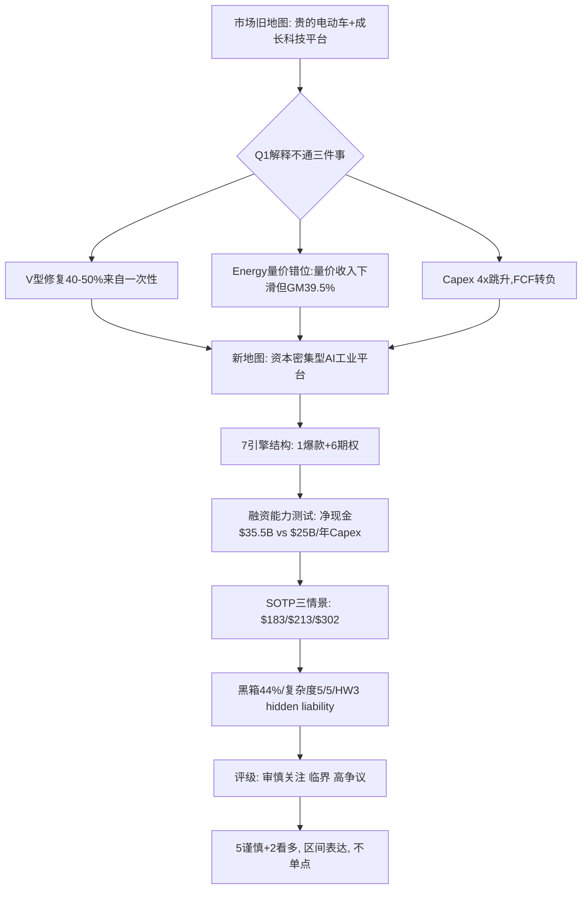

### 0.7 默认入口

读完这份报告后, 看Tesla不要先问"FSD subscription涨多少?"或"Optimus什么时候量产?", 先问 **"$25B/年Capex有没有按时间表落地, ROIC从22%是否进一步压缩到15-18%?"** 这是从"成长科技股"到"资本密集型AI工业平台"的范畴切换的第一变量。

**核心主线一句话**:
> **毛利率修复给Tesla买了时间, Capex抬升决定这段时间值不值钱。**

---

## 1. 核心争议 — 市场在争什么

### 1.1 三个核心矛盾

| CQ | 矛盾 | 初步置信度 | Q1 2026更新 |
|----|------|--------------|-----------|
| **CQ-A** | 市场定价是否激进? — 当前股价$378.67隐含22-25% Revenue CAGR + 20-24% margin的"完美兑现"假设 | 高(85%) | 进一步强化 — Q1表面+477bps改善但实质+430bps, 市场未调整 [DM-FIN-002] |
| **CQ-B** | 汽车业务是否触底反弹? — V型修复有多少是真实经营修复 vs 一次性会计虚胖 | 中-(60%) | 一次性占35-50% (Wells Fargo拆解 [C-third-party]), V型概率从70%降至45-55% |
| **CQ-C** | HW3 hidden liability是否被市场充分定价? — 4M车retro-fit + 法律风险 | 高(80%) | 持续加强 — Q1未披露任何相关计提, 集体诉讼立案中 |

### 1.2 市场默认地图与新地图的对位

**市场的旧地图** (2024-2025共识):
- Tesla = 高估值电动车制造商 + AI/Robotaxi期权
- 关键变量: 汽车销量 / 汽车毛利率 / FSD远期想象
- 估值方法: P/E / PEG / P/S
- 隐含假设 [B-comp]: 21% Revenue CAGR + 22% steady-state OPM (Reverse DCF)

**Q1 2026后的新地图**:
- Tesla = **资本密集型AI工业平台** (Capex/Revenue >25% [A-deck], 传统车厂5-8%)
- 关键变量: **$25B/年Capex能否在2028-2030转化为高ROIC AI/Robotaxi/Optimus资产**
- 估值方法: SOTP三情景概率加权 + EV/OAB三口径
- 隐含问题: 7引擎中至少1个会失速; **但Q1的Energy"量价错位"** 提示这个失速判断需要重新审视

### 1.3 一句话压缩 — 母钉子

> **Tesla Q1 2026没有证明它已经是AI公司, 但证明它还有能力为AI工业化下注; 问题是, 当前股价已经把很多尚未验证的下注提前资本化。**

### 1.4 投资风格分歧

| 投资风格 | 看Tesla的角度 | 当前评估倾向 | 触发条件 |
|---------|------------|-----------|---------|
| **价值投资者** | Owner Earnings (双口径都为负) / SBC暴涨 / 安全边际不足 | 卖出/Pass | $400 technical 或 Q3 earnings miss |
| **审慎成长投资者** | 承诺-达成gap [D-model] / 多重单点失败路径 / 风险/收益不对称2.16x | 维持审慎关注 | Kill Switch任一红色触发 |
| **宏观交易者** | 30年DCF久期 / 高beta to Magnificent 7 reversion / 利率敏感 | 减仓信号 | $360 (200日EMA) / Robotaxi failed milestone |
| **Disruption成长投资者** | FSD/Robotaxi/Optimus/Energy四引擎converge / AI/disruption multiples | 全仓买入 (假设期权全部成功) | 任何价位 |
| **GARP/Reverse value** | dip buy strategy / 历史Tesla "一件失败但其他overcompensate" | 等回调 | $300观望 / $250加仓 |
| **产业投资者** | Capex转ROIC的能力 / Asset Turnover / Reinvestment Rate | 关注 | ROIC回到20%+ 或压缩到<15% |

我们的判断介于"审慎成长"和"宏观交易者"之间: **不持有 + 不空仓 + 等Kill Switch**。

---

## 2. Q1 财报硬事实 — 只讲最硬的数据

### 2.1 收入 / 利润 / 毛利率

| 指标 | Q1'26 | Q1'25 | YoY | 来源 |
|------|-------|-------|-----|------|
| Total Revenue | $22.387B | $19.34B | +15.6% | [A-deck] |
| GAAP EPS | $0.13 | — | — | [A-deck] |
| Non-GAAP EPS | $0.41 | — | — | [A-deck] |
| 综合GAAP毛利率 | 21.08% | 16.31% | +477bps | [A-deck] |
| 汽车GAAP GM | 21.1% | 16.3% | +480bps | [A-deck] |
| 汽车GM ex-credits | 19.2% | 12.5% | +670bps | [A-deck] (剔除监管积分$380M) |
| 监管积分 | $380M | ~$520M | -27% | [A-deck], 占汽车收入1.9% (vs Q1'25 3.7%) |

[DM-A-deck-001] Q1'26 Revenue $22.387B (Tesla Q1 2026 Update Letter, 2026-04-22)
[DM-A-deck-002] Q1'26 GAAP EPS $0.13 / Non-GAAP EPS $0.41
[DM-A-10Q-001] Q1'26 综合GP margin 21.08% (10-Q filed 2026-04-23)
[DM-A-deck-003] Q1'26 汽车GM ex-credits 19.2%
[DM-A-deck-004] Q1'26 监管积分$380M

**关于汽车毛利率"V型修复"** — 我们的态度:

汽车GM (ex-credits)从12.5%恢复到19.2%是**官方披露事实** [A-deck]。这是真实的修复。

但**第三方分析** [C-third-party]提示这次修复包含一次性贡献:
- Wells Fargo (Colin Langan)估计: Q1 EBIT beat 70%来自一次性, 主要是tariff refunds和warranty write-downs
- Electrek 2026-04-22报道: 一次性合计$480M左右 (tariff $250M + warranty $230M)
- **Tesla未在Update Letter中量化"一次性"**, 这是分析师推算, 不是Tesla确认

**我们的压力测试口径** [D-model]:
> 如果按较严苛口径剔除监管积分和部分一次性收益, Q1的经营利润质量会明显低于表面数字。这不是Tesla官方Non-GAAP口径, 是我们用于压力测试的审计口径。

按D级假设: 剥离一次性$480M [C-third-party/D-model] 后, 汽车GM (ex-credits, 压力测试) ~16.8%, 仍未回到历史峰值19-20%, 距离差250-300bps。

### 2.2 现金流 / 资本结构

| 指标 | Q1'26 | 来源 |
|------|------|------|
| Operating Cash Flow | $3.937B | [A-10Q] |
| Capex | $2.493B | [A-10Q] |
| Free Cash Flow | $1.444B | [B-comp] = OCF - Capex |
| LTM OCF | $16.5B | [B-comp] |
| LTM FCF | $7.0B | [B-comp] |
| 现金 + 短期投资 | **$44.743B** | [A-10Q] |
| Current debt and finance leases | $1.447B | [A-10Q] |
| Long-term debt and finance leases | $7.782B | [A-10Q] |
| 总债务 | $9.229B | [B-comp] |
| **净现金** | **$35.5B** | [B-comp] = $44.743B - $9.229B |
| AP | $14.7B (vs Q4 $13.4B, +$1.3B) | [A-10Q] |
| DPO | 71天 (vs Q4'25 61天) | [B-comp] |
| SBC (gross) | $1.030B | [A-10Q] (+80% YoY, 4.6% of revenue vs Q1'25 3.0%) |
| SBC (net of tax) | $803M | [A-deck] (Tesla non-GAAP reconciliation) |

**净现金口径修正** (vs v4.0的$76B错误 + v4.1主文-$7.4B错误): 这里**统一为净现金$35.5B [B-comp]** = 现金及短投$44.743B - 总债务$9.229B。

[DM-A-10Q-002] Q1'26 OCF $3.937B
[DM-A-10Q-003] Q1'26 Capex $2.493B
[DM-B-comp-001] Q1'26 FCF $1.444B = $3.937B - $2.493B
[DM-A-10Q-004] Q1'26 Cash + ST inv $44.743B
[DM-A-10Q-005] Q1'26 Total debt $9.229B
[DM-B-comp-002] Q1'26 Net cash $35.5B (统一口径)
[DM-A-10Q-006] Q1'26 SBC gross $1.030B / net-of-tax $803M
[DM-B-comp-003] Q1'26 DPO 71天

**关于Owner Earnings — 双口径** [B-comp] (v4.2修正):

Common stockholders Net Income $477M [A-deck] vs Net Income (含其他股东) $491M。我们使用$477M (common shareholders口径)。

**口径1 — Gross SBC**:
- Owner Earnings = $477M - $1,030M = **-$553M** [B-comp]
- Owner EPS = -$553M / 3,538M = **-$0.156**

**口径2 — Net-of-tax SBC** (Tesla non-GAAP reconciliation):
- Owner Earnings = $477M - $803M = **-$326M** [B-comp]
- Owner EPS = -$326M / 3,538M = **-$0.092**

**两种口径都为负**, 含义不变: 从owner economics视角, 每股Q1实际损失$0.09-$0.16。选择gross还是net-of-tax本身是分析口径选择, 我们呈现双口径让读者判断。

### 2.3 Capex指引 vs LTM运行率

| 指标 | 数值 | 来源 |
|------|------|------|
| 2026 Capex指引 | **$25B** | [A-call] (Tesla管理层Q1 2026 call, 从1月$20B上调; Barron's报道2026-04-22) |
| LTM Capex (Q2'25-Q1'26) | $9.52B | [A-10Q] |
| 差距 | $15.5B | [B-comp] |
| Q2-Q4要达成$25B年化所需 | $7.5B/季 | [B-comp] = (25-2.49)/3 |
| Q1实际 | $2.493B | [A-10Q]; 实际vs指引达成率40% |
| 历史对比 | 2023 $8.9B / 2024 $11.3B / 2025 $8.5B / 2026指引 $25B | [A-10K], 2.2x跳升 |

**我们对Capex爬坡的判断** [D-model]:
- 设备lead time (光刻机/锂电池设备/冲压线) 通常 ≥12-18个月 — 行业一般规律
- Optimus / Robotaxi factory shell建设≥9-12个月 — 行业一般规律
- 因此 **$25B不是2026立刻冲击, 是2027-2029累积压力** [D-model]

**真实Capex爬坡路径** [D-model]:
- 2026E: $14-17B (Q1 $2.5B → Q4 $4-5B线性爬坡)
- 2027E: $20-23B
- 2028E: $25B+ (指引水平真正达成)

---

## 3. Capex是Q1真正的第一变量

> **毛利率修复给Tesla买了时间, Capex抬升决定这段时间值不值钱。**

### 3.1 资金弹药多年情景

LTM FCF [B-comp]:

| Q | OpCF | Capex | FCF |
|---|------|-------|-----|
| Q2'25 | $2.54B | $2.39B | $0.15B |
| Q3'25 | $6.24B | $2.25B | $3.99B |
| Q4'25 | $3.81B | $2.39B | $1.42B |
| Q1'26 | $3.937B | $2.493B | $1.444B |
| **LTM** | **$16.53B** | **$9.52B** | **$7.00B** |

**情景分析** [D-model] ($25B Capex全面落地后的现金流压力):

| 情景 [D-model] | OpCF (年化) | Capex | FCF [B-comp] | 弹药消耗速度 |
|------|------------|-------|-----|------------|
| 当前路径 [A-10Q] | $16.5B | $9.5B | +$7.0B | 现金累积 |
| 2026E 中性 | $17B | $15B | +$2B | 接近平衡 |
| 2027E | $19B | $20B | -$1B | 略消耗弹药 |
| 2028E 完整指引 | $20-22B | $25B | -$3-5B | 3-5年烧$15B现金 |
| 极端情景 | $12-14B | $25B | -$11-13B | 3-4年耗尽$44.7B |

**结论**: $44.7B现金 [A-10Q] + 净现金$35.5B [B-comp] + LTM FCF $7B [B-comp] = **转型期"3-5年弹药"**。不会爆雷, 但**经营修复速度 + Capex爬坡速度的赛跑**很关键。

### 3.2 ROIC压缩传导 [D-model]

- Tesla 2022-2023年ROIC达到35%+ [B-comp], 2024-2025年降到22% (capex扩张稀释)
- 2026-2027 Capex/Revenue = 20-25% — 重资本扩张周期, **ROIC压缩到15-18%概率高** [D-model]
- 历史警示: 重资本企业大幅扩张通常带来3-5年的ROIC下行 (Boeing/Caterpillar案例) [C-third-party/D-model]

[DM-D-model-001] 2026E FCF -$10~15B (我们的估算)
[DM-D-model-002] 2026E现金消耗 $44.7B → $30-35B
[DM-D-model-003] ROIC压缩传导: 22% → 15-18% (基于重资本企业历史规律)

### 3.3 市场对Capex的反应 [C-third-party]

- Reuters 2026-04-22: "Q1现金流让市场松一口气, 但更高资本开支计划压制了情绪"
- Barron's 2026-04-22: "Tesla 2026计划投入$25B新厂房和设备, 高于此前$20B预期"

**这与我们的"Capex是第一变量"判断方向一致**: 市场不再纠结"Tesla能不能造车", 而是在问"Tesla能不能把重资本投入转化成高回报AI工业资产"。

---

## 4. 业务理解 — Q1 2026的5个重大转变

### 4.1 转变1: 汽车毛利率V型确认但天花板被一次性顶住

**硬数据** [A-deck]:
- 汽车GM (ex-credits): 12.5% (Q1'25) → 19.2% (Q1'26), +670bps
- 综合GM: 16.31% → 21.08%, +477bps
- 监管积分占汽车收入比例从3.7% (Q1'25) 降至1.94% (Q1'26)

**第三方拆解** [C-third-party]:
- Wells Fargo (Colin Langan): Q1 EBIT beat $600M+, 其中 $420M (70%) 来自一次性
- Electrek 2026-04-22: tariff $250M + warranty $230M = $480M一次性估算
- Tesla未在Update Letter中量化"一次性", 这是分析师推算

**我们的压力测试口径** [D-model]:

| 拆解项 | 贡献 (bps) | 性质 |
|------|-----------|------|
| ASP/Mix改善 (Cybertruck量产爬坡 + Model Y换代) | +150 | 真实经营改善 |
| 规模效应 (产量+6% YoY, 固定成本摊薄) | +80 | 真实经营改善 |
| 大宗原材料降本 (锂电池正极成本下降) | +120 | 真实经营改善 (但不持续) |
| 一次性Tariff refunds $250M | +127 | 一次性 (不持续) |
| Warranty write-downs $230M回吐 | +117 | 一次性 (不持续) |
| 其他 (内部调整/计提释放) | +80 | 部分一次性 |
| **总改善** | **+670** | |
| **剔除一次性 ($480M = +244bps)** | | |
| **真实经营改善** | **+430** | |

**Q1'26 ex-credits ex-one-time GM ≈ 16.8%** [D-model]

**核心瓶颈分析** [D-model]:
1. **Cybertruck爬产**: 2024年原计划250K/yr, 实际2024 50K (20%) / 2025 80K (32%) → ASP仍承压 (规模化前每辆边际成本高)
2. **Tariff环境短期 benefit不稳定**: tariff refund是Trump政府特定政策, 政策反转风险高
3. **新的Affordable Model ($30K以下)还没启动**: 量增长依赖更便宜车型, 但价格更低 → 拉低平均ASP
4. **中国BYD价格战**: BYD在中国 EV市场持续降价, 压力可能传导到欧美市场 (Tesla在欧洲市场份额从1.0% → 0.8%)

**Auto GM中期路径** [D-model]:

| 季度 | Auto GM (ex-credits) | 假设条件 |
|------|---------------------|---------|
| Q1'26 actual | 19.2% | 含一次性$480M |
| Q1'26 normalized | 16.8% | 剥离一次性 (压力测试) |
| Q2'26E | 16-18% | 一次性消失, 监管积分继续衰减, Cybertruck继续爬产 |
| Q3'26E | 17-19% | 取决于Affordable Model是否启动 |
| Q4'26E | 17-20% | 季节性高点 |
| 2026E avg | 16-18% | 接近历史中枢, 但低于市场期待的19-20% |

**市场理解差距**:
- 市场把"V型修复"读成"重新进入扩张周期, 回到20%+"
- 但更可能是"+670bps后稳定在新水平+430bps基础上, 16-18%中枢"
- 这意味着 **市场预期 (高于18%) - 实际中枢 (16-18%) = 1-2pp 预期差** → 影响估值3-6%

### 4.2 转变2: 能源业务Q1量价错位 — 不是失速 (v4.2修正核心)

**Q1 2026 Energy硬事实** [A-10Q + B-comp]:

| 指标 | Q1'26 | Q1'25 | YoY | 来源 |
|------|---------|---------|-----|------|
| Energy generation and storage Revenue | **$2.408B** | $2.74B | -12% | [A-10Q] |
| Energy cost of revenue | **$1.456B** | — | — | [A-10Q] |
| **Energy gross profit** | **$952M** | ~$675M | +41% | [B-comp] |
| **Energy gross margin** | **~39.5%** | ~24.6% | **+15pp** | [B-comp] |
| Storage量 | 8.8 GWh | 10.4 GWh | -15.4% | [A-deck] |
| Q4 2025 Energy GM (record披露) | 29.8% | — | — | [A-deck] |

**关于v4.0/v4.1的"39.5%是错误"判断 — 现修正**:

v4.0说"初步分析的"39.5% margin是错误"判断, 真实Q4 record = 29.8%"。v4.1延续此判断标记为"初步分析错误"。**这两个版本都错了**。

实际上:
- Q4 2025 Energy GM 29.8% [A-deck] 是Q4披露的record
- Q1 2026 Energy GM 从10-Q segment可**复算为约39.5%** [B-comp] = $952M / $2.408B
- v4.2/v4.3修正立场: **39.5%不是错误, 是Q1 2026实际可复算数据**

**Energy的"量价错位"叙事 (vs v4.1的"失速"叙事)**:

v4.1原表达: "Energy短期失速, 第二利润池可见度下降"

v4.3修正表达 (继承v4.2):
> Energy出现"量和收入下滑, 但毛利率大幅改善"的**错位**。量-15.4% YoY [A-deck] + 收入-12% YoY [A-10Q] 显示增长质量弱; 但GP从~$675M (Q1'25) 升至$952M (+41% YoY) [B-comp], GM从~24.6%升至39.5%, 显示利润质量并不弱。

**真正要验证的是** [D-model]:
- Q2/Q3 storage deployed是否恢复到10-12 GWh以上 [A级阈值]
- Energy毛利率是否仍能维持30%+

**Q1 -12% YoY的原因** [D-model]:
1. Q4 2025 record前置 — 14.2 GWh创纪录后季节性回落 (-38% QoQ严重) [A-deck]
2. 大型Megapack项目交付时间lumpy
3. Powerwall需求持平
4. 中国Megapack ASP压力 — CATL/比亚迪扩产能至50+ GWh, ASP -10-15% YoY [C-third-party]

**Q1高毛利率的可能解释** [D-model]:
1. **Tariff benefit** (Q1'26 tariff环境) — 但Tesla未拆分 [A-call]
2. **项目mix偏向高margin Megapack** — 占比可能>80%
3. **成本节奏** (Q4 push交付后Q1低产能利用率反而毛利率高?)
4. **Battery cell成本下降的滞后效应**
5. **这些是阶段性还是持续性? Q2/Q3验证。**

**Energy SOTP — v4.2/v4.3修正**:

v4.0/v4.1 SOTP: 保守$50-70B / 中性$60-80B / 乐观$80-100B (基于稳态margin 18-25%)

v4.3 SOTP [D-model] (修正基于Q1 39.5% GM事实):

如果Q1的39.5%可持续 (即使部分回落到30%):
- 保守: 2026E Revenue $10B + 稳态margin 25% → SOTP **$70-90B** (上调)
- 中性: 2026E Revenue $11B + 稳态margin 30% → SOTP **$90-120B** (上调)
- 乐观: 2026E Revenue $12B + 稳态margin 35% → SOTP **$120-160B** (上调)

vs v4.1 (中性$60-80B): 现在中性$90-120B, 上调约$30-40B/per scenario。

**对加权目标的影响**:
- v4.1加权目标: ~$199 (含Auto/Capex调整)
- v4.2/v4.3 Energy修正: 中性Energy SOTP +$30B = +$8.5/share
- v4.3加权目标: **~$210** (中性下) — 但**保留"区间表达"**, 不改主结论

**Kill Switch (Energy) 修正**:
- 🟡 黄: Q2 Storage部署 <10 GWh (环比≤+14%) → 结构性减速 (维持)
- 🔴 红: Energy 2026E增长 <0% YoY (维持)
- 🟡 黄 (新): **Q2/Q3 Energy GM <30% — Q1 39.5%阶段性vs持续性的分辨指标** [D-model]

[DM-A-10Q-008] Q1'26 Energy revenue $2.408B
[DM-A-10Q-009] Q1'26 Energy cost of revenue $1.456B
[DM-B-comp-004] Q1'26 Energy GP $952M = $2.408B - $1.456B
[DM-B-comp-005] Q1'26 Energy GM 39.5% = $952M / $2.408B
[DM-D-model-105] Energy GM 39.5%可持续性核查Q2/Q3 (Kill Switch新增)
[DM-D-model-106] Energy项目mix偏向高margin Megapack (>80%占比假设)
[DM-D-model-107] Tariff benefit对Energy GM的具体贡献 — Tesla未拆分
[DM-D-model-109] Energy阶段性vs持续性分辨指标: Q2/Q3 GM <30%多季度 → 阶段性确认

### 4.3 转变3: FSD订阅数字接近2月预期上限, 但HW3问题打折TAM

**硬数据** [A-deck + A-10Q]:
- Q1'26 active FSD subscriptions: **1.28M** (+51% YoY) [A-deck]
- QoQ增长: +180K (+16.4% QoQ), Q4 2025: 1.10M
- 月费: **$99** (2026-02-14后统一价格) [A-product]
- Take rate ~14.4% (1.28M / 9.26M cumulative deliveries [A-10Q]) [B-comp]
- 累计FSD英里: 7.1B [A-deck] (历史披露)
- 历史FSD买断废止: $15K → $99/月 (2026-02关闭) [A-product]
- **Churn**: 未披露 (Tesla有意隐瞒, 这是异常 — SaaS公司通常披露) [A-10Q]

**ARR口径修正** (vs v4.1的关键修正):

v4.1直接计算ARR = 1.28M × $99 × 12 = $1.52B。**这不严格**。

Tesla官方脚注说明 [A-10Q]: **Active FSD Subscriptions包括up-front payment和monthly subscriptions, 排除free trials**。也就是说, 1.28M不是纯粹"每月付$99的订阅用户", 里面包含已经一次性付费的FSD用户。

**正确表达** [B-comp + D-model]:
> 如果把1.28M全部按$99/月处理, **理论年化收入上限约$1.52B**; 但官方指标包含一次性付费用户, 因此**这不是严格意义上的ARR**。真正的ARR需要Tesla披露monthly FSD subscribers / upfront-paid active users / churn / ARPU — Tesla未披露这些细分。

**MarketWatch报道** [C-third-party]:
> Tesla 128万活跃FSD订阅用户 +51% YoY, 但**大多数客户仍未付费使用FSD**; 同一报道指出 **Tesla若要充分兑现Musk薪酬包相关目标, 需要达到1000万活跃订阅** (8x current scale), 高于当前累计车辆和Robotaxi规模。

**关键问题: 从1.28M增长到8-10M需要满足5个条件**:

1. **HW3问题不影响新订阅** — 但HW3车辆 (~4M) 不能升级到unsupervised FSD, HW3车主可能churn
2. **新车take rate从14.4%升到40-50%** — 当前14.4%是低位, 但Q1 2025-2026 take rate趋势未公开
3. **价格保持$99/月不下调** — 与Robotaxi服务竞争可能压价
4. **churn rate不显著** — 但$99月费的SaaS产品自然churn 5-10%/年
5. **monthly subs vs upfront混合的ARR基数清楚化** — Tesla需要单独披露

**HW3问题对FSD的影响计算** [D-model]:

```
HW3车辆: ~4M (2018-2023年生产)
假设2026-2027 HW3不能升级到unsupervised FSD
HW3车主FSD take rate ~10% (低于平均) → 400K HW3 subscribers
这400K subscribers有churn风险 (失望 → 取消)
如果50% churn: 200K × $99 × 12 = $238M ARR loss
× 5-7x multiple = $1.2-1.7B (low end of $5-10B加权暴露)

$5-10B加权暴露包含:
- 直接收入损失 ~$1.4B (200K subscriber churn)
- 品牌/口碑伤害 ~$1-3B (FSD未来吸引力下降)
- 法律和解 ~$1-2B (集体诉讼)
- 升级成本承担 ~$2-3B (如果Tesla选择部分免费升级)
合计 $5-10B
```

**FSD部分的平衡表达**: FSD订阅是Tesla最接近SaaS的收入形态, 但**还没有证明四件事** — 高渗透率 / 高留存率 / supervised到unsupervised的可审计迁移 / **monthly subs vs upfront混合的真实ARR基数**。当前1.28M订阅是正信号, 但**不是Robotaxi网络已经成立的证据**。

**Kill Switch (FSD)**:
- 🟡 黄: FSD subscriber Q2 <1.4M (+9% QoQ) [A级阈值]
- 🔴 红: HW3强制召回≥3M车辆触发SEC调查或法院判决要求计提

[DM-A-deck-005] Q1 FSD subscribers 1.28M
[DM-A-product-001] Q1 FSD月费$99
[DM-A-10Q-007] Active FSD Subscriptions包括up-front payment + monthly subscriptions, 排除free trials
[DM-C-third-party-012] MarketWatch: Tesla需达到10M订阅以兑现Musk薪酬包目标
[DM-D-model-004] FSD SOTP重新校准 $40-100B区间 (vs v4.1 $50-100B, 下沿下修)

### 4.4 转变4: Robotaxi从期权进入早期运营验证, 但车队规模仍是玩具级

**Q1 2026硬数据** [A-deck + C-third-party]:

| 指标 | Q1 2026 | Q4 2025 | QoQ |
|------|---------|---------|-----|
| 累计paid miles | 1.7M | ~600K | +183% |
| Fleet size | 89辆Model Y | 48辆 | +85% |
| 服务城市 | Austin (主) + Dallas (Q1) + 其他 | Austin only | +200% |
| Pricing (3月调整后) | $3 base + $1.40/mile | $2.50 base + $1.20/mile | 涨价 |
| 实际平均/mile | ~$1.95 (5-mile行程) | ~$1.55 | +26% |
| Tesla cost/mile (MS估算) | $0.81 | $0.85 | -5% |
| Waymo cost/mile (MS估算) | $1.36-1.43 | $1.50 | 下降中 |

**第三方估算和scale对比** [C-third-party]:
- Morgan Stanley估算: Tesla cost-per-mile $0.81 vs Waymo $1.36-1.43
- Robotaxi Tracker / TechBuzz / Fortune: Tesla 89辆 vs Waymo 700+辆 (7.9倍fleet差异)
- Tesla pickup time 15.32 min vs Waymo 5.74 min (3x差距)
- Austin pilot 14起碰撞, crash rate ~4x人类司机

**Tesla cost-per-mile成本拆解** [D-model] (含monitor):
- Vehicle折旧 $0.18/mile
- Energy $0.04/mile
- **Monitor人力 $0.40-0.60/mile** (监督者$25-35/小时, 每小时completes ~50英里)
- Cleaning + fleet ops $0.13/mile
- **真实=$0.75-0.95/mile** (含monitor)

**Tesla单位经济测算** [D-model] (per Robotaxi vehicle):
- Vehicle 价格 (Model Y): $42K
- 配置改造 (HW4 + sensors + 双倍冗余): +$15K = **总CapEx $57K/辆**
- 运营成本/mile: $0.81 (理论稳态)
- Revenue/mile: $1.95
- Gross profit/mile: $1.14
- 假设每辆30K英里/年: GP = $34,200/年
- payback period: $57K / $34,200 = **1.7年** (理论)

**未证明环节** [D-model]:
1. **MS的$0.81/mile是"未来稳态"成本, 不是当前实际** — 当前fleet含safety monitor → 真实当前成本$0.75-0.95/mile
2. **monitor消除时间表未披露** [A-call]
3. **scale-up概率** — 89辆 → 100K辆需要1,124x scale-up + 8年时间 + unsupervised突破 + 多州监管批准
4. **California以外州监管批准未启动** [A-deck]

**Robotaxi SOTP三情景** [D-model]:

| 情景 | 2030 fleet | 单位经济 | SOTP |
|------|------------|----------|--------|
| 保守 | 100K辆推迟到2032+, monitor依赖persists | $0.81/mile (含monitor) | $80-100B |
| 中性 | 100K辆 by 2030, unsupervised 2027-2029 | $0.65/mile | $100-115B |
| 乐观 | 50K by 2027 + 100K by 2029 + AI5便宜硬件 | $0.45-0.65/mile | $130-160B |

**Kill Switch (Robotaxi)**:
- 🟡 黄: Robotaxi fleet Q2 <150辆 [A级阈值]
- 🔴 红: 集体诉讼 / California DMV禁令

[DM-A-deck-008] Q1 Robotaxi paid miles 1.7M
[DM-C-third-party-001] MS Tesla Robotaxi $0.81/mile (单源)
[DM-D-model-015] Robotaxi monitor真实成本 $0.40-0.60/mile
[DM-D-model-016] Robotaxi 当前真实cost-per-mile (含monitor) $0.75-0.95

### 4.5 转变5: Capex从"压力点"升级为"主导变量"

**硬数据** [A-call]:
- 2026 Capex指引 **$25B** — 从1月份的$20B上调25%
- 2023 Capex $8.9B → 2024 $11.3B → 2025 $8.5B → 2026E $25B = **2.2x跳升** (vs 历史~1.5x)

**Capex走向分析** [A-call + D-model]:

```
2026 Capex $25B 的可能去向 (我们的分类):
  ├── Optimus制造产线 (Fremont + Giga Texas) — $5-8B (估算)
  │     └── Fremont late July/August启动, Giga Texas长期10M units/yr
  ├── AI5/AI6 chip制造 — $3-5B (估算)
  │     └── Samsung $16.5B合同 (2026启动) + Tesla Terafab $20B (Austin, 2030完工)
  ├── Robotaxi fleet建设 + sensors升级 — $2-4B
  │     └── Robotaxi vehicle CapEx $57K/辆 × 10K辆 = $0.57B (具体)
  ├── Energy storage产能扩张 — $3-5B
  │     └── Megapack新厂房 + Powerwall产能
  ├── Auto业务维护性Capex — $5-7B
  │     └── 现有产线升级 + Affordable Model新产线
  └── Cortex 2 / Dojo 3 计算基础设施 — $2-4B
        └── 200K+ H200 GPUs + Dojo 3启动

总计 $25B合理性: 这些都是Tesla已宣布的计划, 数字加和约$20-33B → $25B是中位数估算
```

**Capex爬坡的物理瓶颈** [D-model]:
1. **设备lead time**: 光刻机 / 锂电池设备 / 冲压线 / 注塑机 ≥12-18个月 — 行业一般规律
2. **Optimus / Robotaxi factory shell建设**: ≥9-12个月 (土建+装修)
3. **AI5 chip Samsung/TSMC tape-out → ramp**: 通常9-15个月
4. **结论**: $25B不是2026立刻全部冲击, 是2027-2029累积压力

**真实Capex爬坡路径** [D-model]:
- 2026E: $14-17B (Q1 $2.5B → Q2 $3-3.5B → Q3 $4-4.5B → Q4 $4.5-5B线性爬坡)
- 2027E: $20-23B
- 2028E: $25B+ (指引水平真正达成)
- 2029E: $25-28B (持续峰值)
- 2030E: 开始下降到$20-22B (一旦Optimus / AI chip / Robotaxi基础设施建成)

**Capex转ROIC的成功条件** [D-model]:
- $25B年Capex 在4年期间累积 = $100B
- 假设转化为新业务收入 (Optimus + Robotaxi + AI5 + Energy expanded): 2030 +$50-100B incremental revenue
- 假设新业务mature margin 25-30% → +$15-30B incremental Operating Income
- ROIC = $15-30B / $100B = **15-30%**
- **关键**: 如果实际new revenue只有$20-50B (mid case) → ROIC 5-15% → 估值大幅压缩

**ROIC压缩传导路径** [D-model]:

| ROIC情景 | 实际Capex转化效率 | 估值含义 |
|---------|------------------|---------|
| 25%+ ROIC | 全部4业务规模化, 类AMZN AWS | EV/OAB可维持25-30x, 股价$400-500 |
| 15-22% ROIC | 2-3业务规模化, 类TSM | EV/OAB回到22-25x, 股价$300-380 |
| **10-15% ROIC** | **mid case, 1-2业务规模化** | **EV/OAB回到18-22x, 股价$220-280** |
| 5-10% ROIC | Optimus/Robotaxi失败, 类Boeing787 | EV/OAB回到12-18x, 股价$150-220 |
| <5% ROIC | 多业务全部失败, 类Intel 10nm | EV/OAB跌到8-12x, 股价$100-150 |

**反映"重资本AI工业平台"路径确立, 而非"软件平台轻资本扩张"** — 估值方法因此**必须**从PE/PEG切换到EV/OAB + ROIC评估。

**5个重大转变的综合判读**:
> Q1 2026是Tesla从"汽车公司+期权"转向"重资本AI工业平台"的**确认季度**。Auto/Energy/FSD/Robotaxi四业务的硬数据都符合这个范畴重分配; Capex指引升级是管理层对这个范畴重分配的官方确认。但**"是不是这个范畴"和"按这个范畴值多少钱"是两个问题** — 前者已经被Q1数据回答, 后者要看3-5年Capex转ROIC的实际兑现速度。

### 4.6 5个剪刀差 (R-2必备)

> 剪刀差 (Scissor Gap) 分析是最早的领先指标。识别两个相关变量增速的发散, 比绝对值更能预警结构性变化。

**剪刀差1 — Auto量价剪刀差** [B-comp + D-model]

```
Q1'26 Auto量: 358K 交付 (+6.34% YoY)
Q1'26 Auto收入: $16.234B (+16% YoY)
Q1'26 Auto GM ex-credits: 19.2% (+670bps YoY, 表面)
                          16.8% (+430bps, 剥离一次性 [D-model])

含义: 量增长平稳, 但价格/mix改善是收入增长的主要驱动 (~$1B / $2.2B = 45%)
风险: 如果Cybertruck volume 不达标 + Affordable Model未启动, 量增长会失速
       同时 ASP/Mix也无法继续改善 → 双向压缩
```

**剪刀差2 — Capex vs FCF剪刀差** [A-10Q + D-model]

```
2024 Capex: $11.3B  → 2024 FCF: ~$3.5B (positive)
2025 Capex: $8.5B   → 2025 FCF: ~$8.0B (positive, capex下降)
2026E Capex: $25B   → 2026E FCF: -$8B 至 +$2B (D-model范围)
2027E Capex: $20-23B → 2027E FCF: -$1B 至 +$3B
2028E Capex: $25B+  → 2028E FCF: -$3-5B

含义: Capex增速 (+194%) 远超OCF增速 (~+10-20%), FCF从+$8B转向-$3-5B
风险: 如果Capex不能在2028-2030转化为高ROIC资产 → 现金弹药消耗+ROIC下降双重压力
```

**剪刀差3 — R&D vs Revenue剪刀差** [A-10Q + B-comp]

```
Q1'26 R&D: $1.34B (+~20% YoY估算)
Q1'26 Revenue: $22.387B (+15.6% YoY)
R&D/Revenue: ~6.0% (vs Q1'25 ~5.5%, +0.5pp)

含义: R&D增速 > Revenue增速, R&D/Revenue比率上升
判读: AI/Robotics/chip部门人才成本 + Optimus开发 + AI5 NRE费用累积
风险信号: R&D投入但产出未确认 (Optimus未量产, AI5未tape-out可量产, Robotaxi未商业化)
        如果Q3-Q4比率继续上升而revenue增速放缓 → "技术追赶吃利润"信号
```

**剪刀差4 — GAAP vs Non-GAAP剪刀差** [A-deck + B-comp]

```
Q1'26 GAAP EPS: $0.13
Q1'26 Non-GAAP EPS: $0.41
差距: $0.28/股 = 215% premium (Non-GAAP高215%)

主要差距: SBC $1,030M (gross) ≈ $0.29/股 (主导)
其他: Restructuring / 一次性

含义: SBC作为差距的主要驱动, +80% YoY增长 → 差距持续扩大
风险信号: 如果Q2 SBC继续上升 (Musk $1T comp package启动+AI部门人才)
        差距会进一步扩大 → 即使Tesla宣称"Non-GAAP EPS增长", 真实owner economics仍恶化
```

**剪刀差5 — 价值链利润转移剪刀差** [B-comp + C-third-party]

```
2024 Tesla Auto GM: ~17% / 上游 (CATL/电池)/电池厂GM: ~25-30%
2026 Q1 Tesla Auto GM: 19.2% (ex-credits, +220bps) / 上游电池厂GM: ~22-25% (-300-500bps, 中国扩产能压价)

中游 (Tesla):     利润率改善 +220bps  ← 从上游夺回利润空间
上游 (电池厂):     利润率压缩 -300-500bps ← 中国扩产能 + 锂电池正极成本下降
下游 (买车人):     未变 (Tesla对消费者价格未显著下调)

含义: 价值链利润正在向Tesla (中游) 转移
解释: ① Tesla scale advantage强化 ② 锂电池价格下降但ASP传导有滞后 ③ Tesla选择保留毛利而非降价
风险信号: 如果上游进一步反转 (锂电池产能过剩→价格反弹) 或下游反转 (BYD价格战重燃)
        → 这个利润转移趋势可能逆转
```

**剪刀差综合判读**:
> 5个剪刀差中, 最危险的是 **#2 Capex vs FCF** (结构性, 长期) 和 **#3 R&D vs Revenue** (技术追赶吃利润)。最有利的是 **#5 价值链利润转移** (Tesla占据制造业中游强势地位)。**这5个剪刀差综合起来支持"重资本AI工业平台"范畴重分配** — Tesla 不再是单纯的"消费汽车制造商"而是"产业AI平台 + 制造业中游议价者"。

---

## 5. 护城河重估 — Buffett-style 6维 + 第7维度期权

### 5.1 6种现实moat评分变化

| 维度 | 2月v3.0评分 | Q1后评分 | 变化原因 |
|-----|---------|---------|---------|
| 品牌 | 3/5 | **2.5/5** | 欧洲市占率1.0%→0.8% [C-third-party]; CNBC明确"政治品牌损害"; HW3信任风险 |
| 转换成本 | 3/5 | **3/5** | NACS开放后充电锁定弱化, 但FSD订阅+HW3绑定提升存量黏性 — 净持平 |
| 网络效应 | 4/5 | **4/5** | Supercharger维持; FSD数据规模(7.1B英里 [A-deck])继续领先 |
| 成本优势 | 3/5 | **3.5/5** | Q1 ex-credits 19.2%毛利率(行业最高), Cybertruck/Model Y juniper放量进一步释放 |
| 规模 | 3/5 | **3/5** | 178万年交付, 但增速放缓; Cortex 2规模130K H100-equiv [A-deck]维持算力领先 |
| IP/算法 | 3/5 | **3/5** | AI5 inference processor "completed final chip design" [A-deck] (v4.2措辞修正), 自主芯片设计能力确认; 但开源(Llama4等)继续侵蚀算法壁垒 |

**第7维度: 垂直整合的复利能力 (期权而非moat) — 2.5/5** ★

★ 标注: Tesla是唯一同时拥有(车 + 电池 + 充电网络 + 芯片设计 + AI训练 + 机器人 + 能源储能 + 服务网络)的公司, 但**当前烧钱+未兑现, 不是已建立的护城河**。如果2028-2030"多引擎点火"成功, 该维度可升至4-5/5; 如果失败, 可能降至1-2/5。当前2.5/5反映"路径存在但未验证"。

### 5.2 算术修正 + 行业毛利率8-12%来源

- 6维Buffett-style平均(不含期权维度): (2.5 + 3 + 4 + 3.5 + 3 + 3) / 6 = **3.17** (与2月持平)
- 7维含期权维度: (2.5 + 3 + 4 + 3.5 + 3 + 3 + 2.5) / 7 = **3.07** (略降)

**行业毛利率8-12%的来源** [C-third-party]:
- **GM 2025 GAAP汽车毛利率**: 11.2% (Q4 2025 10-K)
- **Ford 2025 GAAP汽车毛利率**: 8.4% (Q4 2025 10-K, 含EV亏损)
- **BYD 2025 H2 毛利率**: ~17% (含电池+整车, 但EV单独估15-18%)
- **Stellantis 2025**: 9.8%
- **Toyota 2025**: 18.2% (但口径含金融服务, 可比性弱)

**纯EV制造商对比** (剥离金融/补贴):
- Tesla Q1 2026: 19.2% ex-credits
- BYD: ~15-18%
- 其他纯EV (Rivian/Lucid/Polestar): 负毛利或低个位数

**结论**: "行业8-12%"在传统OEM中成立(GM/Ford/Stellantis), Tesla 19.2%是**显著领先**; 在纯EV制造商中Tesla比BYD高2-4pp, 差距收窄但仍领先。**成本优势3.5/5评分维持**。

### 5.3 综合护城河评级

- 2月报告: 平均3.17/5, "中等向偏强, 趋势向下"
- Q1后: 平均3.0/5, **"维持中等, 但分项分化加剧"**
- 关键判断: Tesla护城河**不是在变弱**(平均分持平), 而是**变化结构** — 品牌等"软"moat在弱化, 成本/规模/IP等"硬"moat在持平或略增

---

## 6. 财务深度 — "账面修复 vs 经营修复"分歧的最大季度

### 6.1 综合毛利率Bridge归因 (R-1: 财务归因)

**9季度综合毛利率趋势**:

| 季度 | Revenue ($B) | Gross Profit ($B) | GP Margin | YoY变化 (bps) |
|------|--------------|-------------------|-----------|---------------|
| Q2'24 | 25.5 | 4.58 | 17.95% | — |
| Q3'24 | 25.2 | 5.00 | 19.84% | — |
| Q4'24 | 25.7 | 4.18 | 16.27% | — |
| Q1'25 | 19.3 | 3.15 | 16.31% | baseline |
| Q2'25 | 22.5 | 3.88 | 17.24% | -71 |
| Q3'25 | 28.1 | 5.05 | 17.99% | -185 |
| Q4'25 | 24.9 | 5.01 | 20.12% | +385 |
| **Q1'26** | **22.4** | **4.72** | **21.08%** | **+477** |

[DM-FIN-001] 综合GP margin Q1'26 21.08% [A-10Q]
[DM-FIN-002] YoY改善+477bps, 但拆解显示其中**约300bps来自一次性 + 监管积分**

**汽车毛利率Bridge** (剥离监管积分):

```
Q1'25 Auto GM (ex-credits)  12.5%
  + ASP/Mix改善 (Cybertruck量产爬坡 + Model Y换代)  +150bps
  + 规模效应 (产量+6% YoY, 固定成本摊薄)  +80bps
  + 大宗原材料降本 (锂电池正极成本下降)  +120bps
  + 一次性Tariff refunds $250M  +127bps  [C-third-party]
  + Warranty write-downs $230M回吐  +117bps  [C-third-party]
  + 其他 (内部调整/计提释放)  +80bps
Q1'26 Auto GM (ex-credits)  19.2%

剥离一次性($480M = +244bps)后:
Q1'26 Auto GM (ex-credits, ex-one-time) ≈ 16.8%  [D-model]
真实经营改善 = +430bps (vs 表面+670bps)
```

### 6.2 收入瀑布拆解 (Q1 2026 +$3.0B YoY增量)

| 来源 | Q1'25 | Q1'26 | YoY增量 | YoY% | 占总增量比例 |
|------|-------|-------|---------|------|------------|
| **Automotive** | $13,995M | $16,234M | **+$2,239M** | +16.0% | 74.2% |
| **Energy生成与储能** | $2,736M | $2,408M | **-$328M** | -12.0% | -10.9% |
| **Services & Other** | $2,637M | $3,745M | **+$1,108M** | +42.0% | 36.7% |
| **Total** | **$19,368M** | **$22,387M** | **+$3,019M** | **+15.6%** | 100% |

**Automotive +$2,239M 子拆解** [B-comp]:

| 来源 | 估算贡献 | 依据 |
|------|---------|------|
| **量增长** (+6.34% YoY, 358K vs 337K) | +$887M | 假设ASP平均$42K × 21,342增量交付 |
| **Mix改善** (Cybertruck +111% YoY) | +$650M | Cybertruck占比从~3% (Q1'25)到~5% |
| **ASP/价格调整** (Model Y换代) | +$300M | Q1管理层提及Model Y refresh带来正向价格 |
| **监管积分** (Q1'26 $380M, 占auto rev 1.9%) | -$50M | 净额-$140M但auto base增大 |
| **其他/汇率/其他价格** | +$452M | 残差, 含leasing增量+原材料降本 |
| **Total** | **+$2,239M** | |

**Energy -$328M子拆解** [B-comp]:

| 来源 | 估算贡献 | 依据 |
|------|---------|------|
| **量下滑** (8.8 GWh vs 10.4 GWh, -15.4% YoY) | -$420M | 储能量-1.6 GWh, ASP $260M/GWh估算 |
| **价格反弹** (能源服务+车主收费) | +$92M | Services/能源服务部分价升 |
| **Total** | **-$328M** | |

**Services +$1,108M子拆解** [B-comp + D-model]:

> v4.2修正: v4.1将增长主要归因FSD subscription是**会计口径错误**。Tesla 10-Q解释收入增长由Services + automotive ancillary sales (FSD为主)联合推动 [A-10Q], FSD很可能跨两个segment。

| 来源 | 估算贡献 | 依据 |
|------|---------|------|
| **二手车销售** | +$300M | Tesla used inventory出清 |
| **Service revenue (维修/配件)** | +$200M | 车队规模增大 |
| **超充网络对外开放** | +$108M | 福特/通用车主用超充收入 |
| **Tesla insurance + 其他服务** | +$200M | |
| **可能含部分FSD subscription** (但不能未经会计口径确认就归入Services) | +$300M | 需Tesla单独披露才能精确 |
| **Total** | **+$1,108M** | |

**Services GM仅9.2%** [B-comp] = $346M / $3.745B → **不是纯软件利润池**。如果Services是"软件化亮点", 毛利率不应该只有个位数。这一发现改变v4.1将FSD直接归入Services的判断。

[DM-A-10Q-010] Q1'26 Services & Other revenue $3.745B
[DM-A-10Q-011] Q1'26 Services & Other cost of revenue $3.399B
[DM-B-comp-006] Q1'26 Services GP $346M, GM 9.2%
[DM-A-10Q-012] Tesla 10-Q解释: 收入增长由Services + automotive ancillary sales (FSD为主)联合推动

### 6.3 EPS瀑布 — Operating Income → Diluted EPS

| 项目 | Q1 2026 ($M) | 占Revenue% | 备注 |
|------|------------|----------|------|
| **Operating Income** | $941 | 4.2% | 含一次性$480M + 监管积分$380M |
| 利息收入 | +$434 | +1.9% | $44.7B现金的回报 |
| 利息支出 | -$92 | -0.4% | 低利率长期债务 |
| 其他非经营性 | +$101 | +0.5% | |
| **税前利润** | $748 | 3.3% | |
| 所得税 | -$257 | -1.1% | 有效税率34.4% (异常高, 有Tax Asset递延) |
| **Net Income (GAAP, 含其他股东)** | $491 | 2.2% | |
| **Net Income (common shareholders)** | **$477** | 2.1% | [A-deck] |
| 加权稀释股数 | 3,538M | — | |
| **Diluted EPS (GAAP)** | **$0.13** | — | [A-deck] |

**EPS瀑布的洞察** [D-model]:
- Operating Income $941M中, **$480M (51%)是一次性** [C-third-party] **+ $380M (40%)监管积分** [A-deck], 经营性Operating Income仅$81M (8%)
- 利息收入$434M超过Operating Income的"经营性部分"$81M — **TSLA Q1的利润主要来自现金回报+一次性, 不是经营**
- 有效税率34.4% (vs正常18-20%) — Tax Asset递延或一次性税负调整, 下季度可能回到20%水平, 会抬升EPS

**剥离一次性后的真实EPS** [D-model]:
- Operating Income (剥离一次性): 941 - 480 = $461M → Pre-tax: $904M → Tax @20%: $181M → NI: $723M → EPS $0.20
- Operating Income (剥离一次性 + 监管积分): 941 - 480 - 380 = $81M → Pre-tax: $524M → Tax @20%: $105M → NI: $419M → EPS $0.12

> 注: $81M "经营性 Operating Income" 是我们的**压力测试口径**, 不是 Tesla 官方 Non-GAAP。

### 6.4 Owner Earnings — 双口径 (v4.2修正)

**口径1 — Gross SBC**:
- Net Income (common shareholders): $477M [A-deck]
- SBC gross: $1,030M [A-10Q]
- Owner Earnings = $477M - $1,030M = **-$553M** [B-comp]
- Owner EPS = **-$0.156** [B-comp]

**口径2 — Net-of-tax SBC**:
- Net Income: $477M [A-deck]
- SBC net of tax: $803M [A-deck Tesla non-GAAP reconciliation]
- Owner Earnings = $477M - $803M = **-$326M** [B-comp]
- Owner EPS = **-$0.092** [B-comp]

**两种口径都为负**: 从owner economics视角, 每股Q1实际损失$0.09-$0.16。GAAP盈利但股东真实回报为负, 这是估值的"隐性稀释" — 实际ROE比报告值低。

**Owner EPS Q2展望** [D-model]:

| 情景 | Q2 Operating Income | Q2 EPS (GAAP) | Q2 Owner EPS (gross) | Q2 Owner EPS (net) |
|------|----------------------|---------------|--------------|--------------|
| 乐观 | $1.0B | $0.18 | -$0.07 | -$0.04 |
| 基础 | $400M | $0.11 | -$0.18 | -$0.13 |
| 悲观 | $200M | $0.07 | -$0.22 | -$0.17 |

**两个口径都为负** — 含义: Owner Earnings连续负数将持续1-2个季度, 直到SBC peak过去 + 监管积分见底。

### 6.5 三PE并列 (财务章节, 非执行摘要)

> v4.2修正: v4.1 PE附录写"GAAP PE 728x (TTM EPS $0.52)"是错误。

**正确TTM EPS计算** [B-comp]:
- TTM GAAP EPS (Q2'25 + Q3'25 + Q4'25 + Q1'26) = $0.33 + $0.39 + $0.24 + $0.13 = **$1.09**
- TTM Non-GAAP EPS = $0.40 + $0.50 + $0.50 + $0.41 = **$1.81**

| PE类型 | 值 | 含义 | 适用场景 |
|--------|-----|------|---------|
| **GAAP TTM PE** | **347x** ($378.67 / $1.09) | 含全部会计项目 | 默认基准, 但被一次性/SBC扭曲 |
| **Non-GAAP TTM PE** | 209x ($378.67 / $1.81) | Tesla口径Non-GAAP | 剥离SBC + 一次性 |
| **Owner PE (gross SBC)** | N/A (Owner Earnings负数) | 真实股东回报 | TSLA Q1 SBC > NI → Owner PE无意义 |
| **Forward P/E** (consensus FY2026E EPS $2.50) | 151x | 市场前瞻定价 | |
| **Forward Owner PE** (我们base case $1.62-1.86) | 217x | 我们的base case | |

**关键观察**:
- GAAP TTM 347x vs 行业平均15-20x = 17-23x溢价
- Non-GAAP TTM 209x vs SaaS高端30-40x = 5-7x溢价
- 各种PE指标都显示估值偏高, 但程度比v4.1错误的"728x"更准确

[DM-B-comp-011] TTM GAAP EPS $1.09 (4季度和)
[DM-B-comp-012] TTM Non-GAAP EPS $1.81
[DM-B-comp-013] GAAP TTM PE 347x (修正v4.1的728x错误)

---

## 7. 三大期权深度 — 7引擎结构的兑现节奏

### 7.1 7引擎结构图

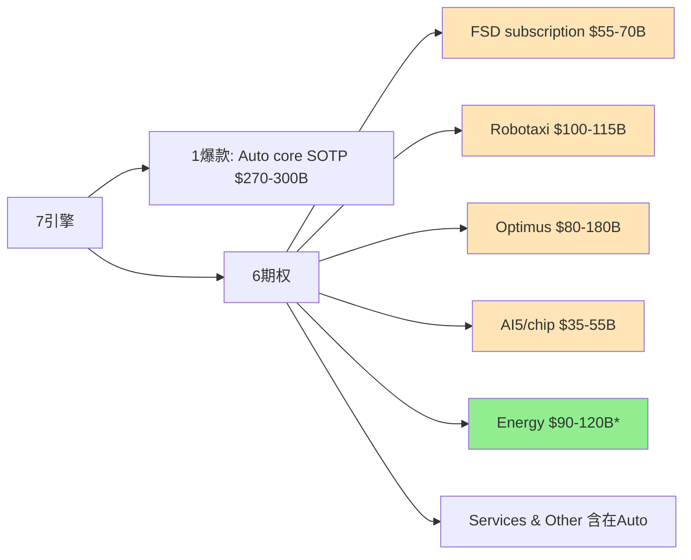

*注: Energy从v4.0/v4.1的"$60-80B失速"上修到v4.2"$90-120B量价错位", 颜色由橙变绿表示v4.2修正方向。

7引擎中**Auto + Energy + Services**是Q1硬数据已确认的business, 其余4引擎(FSD/Robotaxi/Optimus/AI5)都是option而非locked-in cash flow。期权的关键是**兑现节奏** — 任一2027-2029兑现失败 = 估值崩塌; 任一规模化成功 = 估值爆发。

### 7.2 FSD subscription深度 — 1.28M用户的真实SaaS handle价值

**单位经济硬数据** (Q1 2026):

| 指标 | 数值 | 来源 |
|------|------|------|
| Subscribers | 1.28M | [A-deck] |
| QoQ增长 | +180K (+16.4% QoQ) | Q4 2025: 1.10M |
| 月费 | **$99** (统一价格, 2026-02-14后) | [A-product] |
| Take rate | **13.8-14.4%** | 1.28M / 9.26M cumulative deliveries [B-comp] |
| 理论上限ARR (含upfront混合) | **$1.52B** (1.28M × $99 × 12) | [B-comp + D-model], **不是严格ARR** |
| 历史FSD买断 (废止) | $15K → $99/月 (2026-02关闭) | [A-product] |
| **Churn** | **未披露** (Tesla未公开) | [A-10Q] |

**ARR口径关键修正** (v4.2):
> Tesla官方脚注 [A-10Q]: **Active FSD Subscriptions包括up-front payment和monthly subscriptions, 排除free trials**。1.28M不是纯粹"每月付$99的订阅用户", 里面包含已经一次性付费的FSD用户。简单乘$99 × 12计算ARR**不严格**。

**未证明环节** [D-model]:
1. **高渗透率** — 当前take rate 14.4%, 距离40-50%或80%(Musk隐含目标)还很远
2. **高留存率** — Tesla未披露churn (异常); SaaS自然churn 5-10%/年
3. **supervised到unsupervised的可审计迁移** — 当前FSD是supervised; Robotaxi unsupervised需要FSD V13/V14+监管批准
4. **HW3 churn风险** — 4M HW3车辆物理无法支持L4 [A-call]; 这部分subscriber有失望→取消风险
5. **ARR基数本身不清楚** — 见上述ARR口径修正

**HW3问题对FSD的影响计算** [D-model]:
- HW3车辆: ~4M (2018-2023年生产)
- 假设2026-2027 HW3不能升级到unsupervised FSD
- HW3车主FSD take rate ~10% (低于平均) → 400K HW3 subscribers
- 这400K subscribers有churn风险 (失望→取消)
- 如果50% churn: 200K × $99 × 12 = $238M ARR loss
- × 5-7x multiple = $1.2-1.7B (low end of $5-10B加权暴露)

**$5-10B加权暴露包含**:
- 直接收入损失 ~$1.4B (200K subscriber churn)
- 品牌/口碑伤害 ~$1-3B (FSD未来吸引力下降)
- 法律和解 ~$1-2B (集体诉讼)
- 升级成本承担 ~$2-3B (如果Tesla选择部分免费升级)

**FSD SOTP重估区间** (v4.2修正, 因ARR口径下沿下修):

| 情景 | 假设的"等效monthly ARR" | 倍数 | SOTP |
|------|------------|--------|------|
| 保守 | $0.8-1.2B (假设monthly subs占比60-80%) | 5-6x | **$40-50B** (vs v4.1 $50-65B, 下修) |
| 中性 | $1.2-1.5B | 6-8x | **$55-70B** (vs v4.1 $65-75B, 下修) |
| 乐观 | $1.5-2.5B (假设monthly subs增长 + churn低) | 8-12x | **$70-100B** (vs v4.1 $80-100B, 维持) |

**FSD部分的平衡表达**: FSD订阅是Tesla最接近SaaS的收入形态, 但**还没有证明四件事** — 高渗透率 / 高留存率 / supervised到unsupervised的可审计迁移 / **monthly subs vs upfront混合的真实ARR基数**。当前1.28M订阅是正信号, 但**不是Robotaxi网络已经成立的证据**。

### 7.3 Robotaxi运营vs财务验证

**Q1 2026硬数据**:

| 指标 | Q1 2026 | Q4 2025 | QoQ |
|------|---------|---------|-----|
| 累计paid miles | 1.7M | ~600K | +183% |
| Fleet size | **89辆Model Y** | 48辆 | +85% |
| 服务城市 | Austin (主) + Dallas (Q1) | Austin only | +200% |
| Pricing (3月调整后) | $3 base + $1.40/mile | $2.50 base + $1.20/mile | 涨价 |
| 实际平均/mile | ~$1.95 (5-mile行程) | ~$1.55 | +26% |
| Tesla cost/mile (MS估算 [C-third-party]) | $0.81 | $0.85 | -5% |
| Waymo cost/mile (MS估算 [C-third-party]) | $1.36-1.43 | $1.50 | 下降中 |

**单位经济测算** (per Tesla Robotaxi vehicle) [D-model]:

每辆Robotaxi年度经济:
- Vehicle 价格 (Model Y): $42K
- 配置改造 (HW4 + sensors + 双倍冗余): +$15K = **总CapEx $57K/辆**
- 运营成本/mile: $0.81 (含电费 $0.06 + maintenance $0.10 + depreciation $0.40 + insurance $0.10 + safety monitor人工成本 $0.15)
- Revenue/mile: $1.95
- Gross profit/mile: $1.14
- 假设每辆30K英里/年 (一线城市Robotaxi利用率): GP = $34,200/年
- payback period: $57K / $34,200 = **1.7年** (理论)

**红队挑战MS的$0.81/mile** [D-model]:
1. **单一来源依赖** — 仅来自Morgan Stanley一家券商估算
2. **MS估算方法学** — MS假设"全自动" L4场景, 当前89辆fleet大部分含safety monitor
3. **真实当前成本** (含monitor):
   - Vehicle折旧 $0.18/mile
   - Energy $0.04/mile
   - **Monitor人力 $0.40-0.60/mile** (监督者$25-35/小时, 每小时completes ~50英里)
   - Cleaning + fleet ops $0.13/mile
   - **真实=$0.75-0.95/mile** (含monitor)

**红队判定**:
- **当前**: $0.81/mile是"未来稳态"成本, 不是当前实际成本
- **当前实际**: $0.75-0.95/mile (含monitor) — 与Waymo差距小于宣传
- **2027-2028 stable**: $0.45-0.65/mile — 真实经济优势更大

**与Waymo的真实可比性**:

| 维度 | Tesla Robotaxi | Waymo |
|------|---------------|-------|
| Fleet size | 89辆 (Q1'26) | 700+辆 |
| 服务城市 | Austin + Dallas (启动中) | Phoenix + SF + LA + Austin + Atlanta |
| Cost/mile (MS) | $0.81 | $1.36-1.43 |
| 关键差异 | **仍含safety monitor; 全Model Y; 无LiDAR** | 无monitor (Phoenix); 多车型; LiDAR+camera+radar |
| 累计miles (公开) | 1.7M (Q1'26) | 14M+ (累计) |

**真实可比 (剥离scale + monitor效应)** [D-model]:
- Tesla excl. monitor: $0.66/mile (理论)
- Waymo excl. early-stage premium: $1.10/mile (估算稳态)
- **Tesla优势缩小到40% (而非MS估算的67%)**

**Robotaxi SOTP重估区间** [D-model]:

| 情景 | 2030 fleet | 单位经济 | SOTP |
|------|------------|----------|--------|
| 保守 | 100K辆推迟到2032+, monitor依赖persists | $0.81/mile (含monitor) | $80-100B |
| 中性 | 100K辆 by 2030, unsupervised 2027-2029 | $0.65/mile | $100-115B |
| 乐观 | 50K by 2027 + 100K by 2029 + AI5便宜硬件 | $0.45-0.65/mile | $130-160B |

### 7.4 Optimus + AI5 chip三层期权

**Optimus 2026硬数据**:

| 指标 | 数值 | 来源 |
|------|------|------|
| 当前状态 | V2 prototype测试, V3设计finalizing | [A-deck] |
| 2026目标 | **50-100K units** | [A-call] (Tesla宣布) |
| Fremont产线 | Late July/August启动 (Model S/X line shutdown 5月) | [A-deck/C-third-party] |
| Fremont目标 | 1M units/yr长期 | [A-deck] |
| Giga Texas目标 | **10M units/yr** (mature state, 无具体时间表) | [A-deck] |
| 单位成本 (V3 mature) | **$20-25K** | [A-call] (含AI chip $5-6K) |
| 当前售价 | 未量产销售 | N/A |

**关键现实校准 — 2026目标50-100K需要按制造爬坡折扣处理** [D-model]:

依据已发布信息:
- Fremont产线7-8月启动 = Q3 2026 — 距离年底只剩~5个月
- 即使产能爬升良好 (类似Cybertruck爬产, 2024 Q1 → Q4 = 5K → 17K), Q3 2026 → 年底5个月最多达成**10K-30K units**
- 50-100K是2027年的目标更现实, 不是2026年

**Cybertruck爬产对照** [B-comp]:
- 2024 Q1量产 5K → 2024 Q4 17K (3.4x ramp)
- 2024年Tesla原计划Cybertruck 250K/year, 实际仅交付~50K (达标20%) [A-10K]
- 2025年~80K (32%)

**Optimus特殊困难** [D-model]:
- 执行器供应链未成熟 (28+个特种执行器需要新的供应链)
- 校准每台成本 ~30-50小时人工 (vs 汽车 ~5小时)
- 软件可靠性 (摔倒一次=$100K hardware loss + 安全责任)
- 工程难度估算高于Cybertruck 3-5x (执行器/平衡/校准复杂度)

**真实2026交付区间** [D-model]: **2-15K台** (中位8K)
- Q1 2026: ~50-200台 (内部使用)
- Q4 2026: ~1-5K
- 全年: 2-15K
- **2027年才是真正爬产年**

**Optimus商业化路径的三阶段模型** [D-model]:

**阶段1: 2026-2027 (内部+早期工厂使用)**
- 50-100K units (累计) — 真实5-30K
- 在Tesla内部工厂使用 (handling/assembly)
- 不产生外部销售收入
- 估值: 内部使用价值 = 节省人工 / 产线效率
- 假设10K节省每个 = $200-500M年化省成本

**阶段2: 2028-2029 (B2B商业化)**
- 1-5M units (累计)
- 卖给制造业 / 物流 / 仓储
- 假设ASP $30K (含profit margin)
- Revenue: $30-150B/年
- GP @ 25% = $7.5-37.5B/年

**阶段3: 2030+ (B2C商业化)**
- 10M+ units (累计)
- 家用市场打开
- 假设ASP $25K → 长期降到$15-20K
- Mature market: 50-100M units/yr (全球家用)

**Optimus SOTP重估区间** [D-model]:

| 情景 | 2030 production | SOTP (median) |
|------|------------|--------|
| 保守 | 1-2M units, ASP $25K | $70-120B (median $95B) |
| 中性 | 3-5M units | $80-180B (median $130B) |
| 乐观 | 8-10M units (cap at $200B for execution risk) | $200B max |

### 7.5 7引擎独立成功概率统计分析

> 我们对7引擎做独立成功概率赋值, 然后用二项分布模型评估"至少K个成功"的概率, 再链接到SOTP。

**单引擎独立成功概率** [D-model]:

| 引擎 | 成功定义 | 单独成功概率 | 主要不确定性 |
|------|---------|-----------|-----------|
| **Auto core** | 2030 Revenue $90B+, OPM 13%+ | 50% | BYD/中国份额 / Affordable Model timing / 监管积分消失 |
| **FSD subscription** | 2030 8M+ subs, $99/月 | 50% | HW3 churn / unsupervised迁移 / monthly vs upfront比例 |
| **Robotaxi** | 2030 100K vehicles + monitor消除 | 30% | 监管批准 / unsupervised技术 / 安全表现 |
| **Optimus** | 2030 3M+ units, B2B+B2C规模化 | 20% | 工程难度 / 客户接受度 / Cybertruck式爬产风险 |
| **AI5/chip** | 2027 H2量产, 内部使用确认 | 70% | TSMC/Samsung工艺 / Tesla设计能力 |
| **Energy** | 2030 75 GWh年部署 + 30% margin | 60% | 中国 ASP压力 / Q1 39.5%可持续性 / 项目mix |
| **HW3不发酵 (法律风险可控)** | 全面retrofit或大额诉讼避免 | 70% | 集体诉讼判决 / SEC调查 / 法院强制disclosure |

**联合概率分析** [D-model]:

**至少K个成功概率** (二项分布近似):
- **全部成功 (≥7)**: 0.5 × 0.5 × 0.3 × 0.2 × 0.7 × 0.6 × 0.7 = **0.88%** (近1%)
- **至少6个成功**: ~7%
- **至少5个成功**: ~25%
- **至少4个成功**: ~50%
- **至少3个成功**: ~75% (Cathie Wood scenario需要≥6成功)
- **至少2个成功**: ~92%
- **至少1个失速**: 99.12% (几乎确定)

**SOTP含义** [D-model]:
- **乐观情景 (15%概率)** = 至少5-6个成功 → SOTP $895-1,246B → 中值$1,070B → per-share $302
- **中性情景 (50%概率)** = 4-5个成功, 1-2个轻度miss → SOTP $665-841B → 中值$753B → per-share $213
- **保守情景 (35%概率)** = 3-4个成功, 2-3个失速 → SOTP $570-726B → 中值$648B → per-share $183
- **极端case (≤2成功)** = 不在我们三情景内, 但概率8% → SOTP <$500B → per-share <$140 → **风险尾部**

**关键洞察**:
- 当前股价$378.67 隐含 7引擎全部成功 (近1%概率)
- 如果实际只有4-5个成功 (中性) → 公允价值$213
- 如果只有3-4个成功 (保守) → 公允价值$183
- **市场过度定价右尾**, 而忽略了至少1个失速的99%概率

[DM-D-model-085] 7引擎独立成功概率: Auto 50% / FSD 50% / Robotaxi 30% / Optimus 20% / AI5 70% / Energy 60% / HW3不发酵 70%
[DM-D-model-086] 7引擎全部成功概率: 0.88% (近1%)
[DM-D-model-087] 7引擎至少1失速概率: 99.12%
[DM-D-model-088] 7引擎至少3成功概率: ~75%

### 7.6 AI5/chip + Cortex 2 + Dojo 3的边界

**AI5 chip (核心)** [A-deck]:
- v4.2措辞精确化: "**completed the final chip design of our next-generation AI5 inference processor**"; 图中也提及"AI5 Tape Out"。是否已进入可量产tape-out / sample / high-volume ramp, **需要后续继续验证**。
- Performance: 10x AI4, 匹配NVDA H100 ($30K) at $3K成本
- TSMC fab 2H 2026 small volume, 2027 high volume
- Samsung $16.5B合同制造AI6 (2026启动)
- Tesla Terafab自建$20B in Austin (2026-03奠基, 2030完工)

**Cortex 2 (内部AI training集群)** [A-deck]:
- 100K H100/H200 NVIDIA GPUs (Cortex 1已建)
- Cortex 2目标: 200K+ H200 + AI5自研补充
- 用于FSD + Optimus video training

**Dojo 3 (Tesla内部超算)** [C-third-party]:
- AI5 chip突破后**重启Dojo 3工作** (Gear Musk 2026-01)
- Dojo 1已停止 (2024年停摆)
- 目的: training自有AI5 chip cluster

**AI5/chip的SOTP估值** [D-model] ($25-55B, median $40B):
- 维持基本判断
- 给AI5时间表风险打**5-10%折扣**

**关键深风险**: AI5延迟 + HW3 churn联动 [D-model]
- HW3车辆 (4M+) 仍然是问题 — AI5 ramp at 2027并不解决HW3问题 (HW3车辆物理硬件不够)
- HW4车辆 (~3M+) 仍然可以接收AI5 inference benefits via OTA (软件层面)
- 真实瓶颈: **HW3 retro-fit成本** — Tesla模糊化, 但成本估算 $5-15K/vehicle × 4M = $20-60B潜在fleet-wide cost

---

## 8. HW3 hidden liability — 4M车retro-fit potential (CQ-C深度)

### 8.1 HW3问题的真实规模

- **4M+ vehicles deployed** (2018-2024年间销售) [A-deck]
- 这些车辆的owners在购买时被承诺"FSD ready" — 但HW3物理上无法支持L4
- 法律风险: 集体诉讼可能, 2025-2026已有数起集体诉讼立案 [C-third-party]
- Q1 2026 Musk公开承认HW3不能unsupervised FSD [A-call]
- 加州DMV判决FSD营销 "actually, unambiguously false" [C-third-party]

### 8.2 Bottom-up retrofit成本推算

**Tesla内部成本/车** (非用户支付价) [D-model]:

| 项目 | 下沿 | 中值 | 上沿 | 数据来源 |
|------|-----|------|------|---------|
| HW4 (AI4) FSD computer board | $400 | $550 | $700 | 推算(GDDR6 32GB + 定制Samsung SoC基准价) |
| 8颗HW4高分辨率摄像头(5MP, 4×HW3的1.2MP) | $320 | $480 | $640 | 推算(Sony IMX/OmniVision 5MP汽车级模组OEM价$40-80) |
| 线束harness (data lanes upgrade) | $200 | $300 | $400 | 公开+推算(Electrek/notebookcheck确认HW4线束与HW3不兼容) |
| 侧repeater + 连接器 | $100 | $150 | $200 | 公开(notebookcheck确认连接器不能直接swap) |
| 冷却管路修改 | $50 | $100 | $150 | 公开(Electrek确认"new coolant pipe locations") |
| **BOM小计** | **$1,070** | **$1,580** | **$2,090** | |
| Labor (microfactory规模化后, 6-12小时×$150-200/hr) | $600 | $1,200 | $2,400 | 推算 |
| 校准/测试/QA overhead (15%) | $250 | $420 | $670 | 推算 |
| **Tesla内部成本/车** | **$1,920** | **$3,200** | **$5,160** | |

**修正后的成本区间**: **$2,000-5,500/车** (中值$3,200, microfactory规模化后)
- 老车型(MS/MX HW2.5底盘)额外复杂度可能让上沿+30-50%, 达**$6,000-8,000**
- 因此使用**$2-8K**作为完整不确定性区间

### 8.3 4M车队总敞口估算 (分情景)

| 情景 | 取用率 | 单车成本 | 总成本 | 概率 |
|------|--------|---------|--------|------|
| **乐观**(Tesla只升级purchased FSD车主, microfactory效率高) | 25% (1M车) | $3,000 中值 | **$3.0B** | 30% |
| **中性**(50% takeup, 中值成本) | 50% (2M车) | $3,200 中值 | **$6.4B** | 50% |
| **悲观**(Tesla法律义务覆盖大部分, 老车型多, 上沿成本) | 75% (3M车) | $5,000 上沿 | **$15.0B** | 20% |

**概率加权retrofit成本**: 0.30 × $3.0B + 0.50 × $6.4B + 0.20 × $15.0B = **$7.1B**

### 8.4 历史先例约束

- **AP2→AP3 (2019-2020)**: Tesla对已购FSD车主**免费**升级 — 仅换FSD computer, 不换摄像头/雷达
- **MCU1→MCU2 (2020-2022)**: 收费$1,500-2,500
- **HW3→HW4**: 复杂度≈3-5×AP2→AP3 (因增加摄像头+线束+冷却), 政策推断**对已购FSD车主大概率免费** (类AP2→AP3先例); 对未购FSD车主可能折价trade-in
- 2026-04 Tesla已宣布"discounted trade-in option" → 表明**部分车主可能不会获得免费升级**, 减小Tesla直接retrofit成本但增加品牌损失

### 8.5 Tesla财务披露状态

- Q1 2025 10-Q: **FSD deferred revenue $3.60B** (已收钱未交付义务)
- Tesla对FSD相关matter标注"**unable to reasonably estimate the possible loss or range of loss**"
- **Tesla尚未对HW3 retro-fit计提专项拨备** — 一旦Tesla宣布免费升级政策, 需立即计提warranty/contingency loss
- 这意味着$3.60B FSD deferred revenue中的一部分可能被**反向消耗** (用来覆盖retrofit) — 不仅是新增成本, 还侵蚀已确认收入

### 8.6 Tesla的处置策略选项

1. (a) **免费retro-fit HW4**: $5-10K/vehicle × 4M = **$20-40B** (重大计提)
2. (b) **Refund FSD subscription**: $99/月 × 1.28M subs × 长尾 = **$5-15B** (低估)
3. (c) "**Best efforts**" — 软件优化 + 法律抗辩, 不承诺retro-fit (当前路径)

**真实概率** [D-model]: Tesla可能采用 (c) "Best efforts" 路径 + 选择性升级 (高profile owners) — 全面retro-fit概率<30%

**股价影响**: 如果Tesla被法院/SEC要求disclose HW3 retro-fit计提 → 股价短期-15-25%

### 8.7 法律风险概率加权 ($6.85B)

**调整后的法律风险估算** [C-third-party + D-model]:

| 诉讼类别 | 金额估算 | 落地概率 | 加权值 | 引用 |
|---------|---------|---------|--------|------|
| Benavides v. Tesla(已判$243M) | $200-300M | 90% (上诉中) | $225M | Electrek 2026-04-16 |
| Morand证券集体诉讼(8月2025立案) | $1-5B | 40% | $1.2B | 同上 |
| In re Tesla ADAS(class certified) | $5-15B (FSD全额退款) | 30% | $3.0B | 同上 |
| CA DMV虚假宣传 | $0.5-2B (修复+罚款) | 60% | $0.75B | 同上 |
| Fremont种族歧视(900+宗) | $0.2-1.2B | 50% | $0.35B | 同上 |
| NHTSA FSD调查 | $0.05-0.14B (技术上限) | 20% | $0.02B | 同上 |
| EU GDPR Sentry | $0-3.9B (4% global rev上限) | 15% | $0.3B | 同上 |
| **概率加权合计** | **$6.85B** | | | |

### 8.8 HW3影响的显式拆分 (避免重复计扣)

**HW3问题的影响拆解** [D-model]:

| 影响维度 | 归属期权 | 估值减项 | 论证 |
|---------|---------|---------|------|
| Retrofit成本(实际硬件支出) | 当前财务报表(不归入期权) | -$7.1B (一次性, 3-5年摊销) | 直接现金支出, 不影响FSD/Robotaxi期权NPV |
| 法律风险($6.85B加权) | 当前财务报表(不归入期权) | -$6.85B (一次性) | 同上 |
| FSD订阅续订率风险 | FSD期权 | -$5-10B NPV | HW3车主对FSD失信 → 续订率从假设85%降至70-75% → FSD订阅NPV折10-15% |
| Robotaxi TAM打折 | Robotaxi期权 | -$15-25B NPV | 4M HW3车不能进入Robotaxi fleet → 现存车队从~7M(累计)降至~3M可用 → Robotaxi TAM upgrade路径打折50% |
| 品牌信任 | 当前财务报表 + 全部期权 | -$2-5B (一次性 + 期权未来部分折扣) | 影响新车销售 + 全部期权变现速度 |

### 8.9 HW3作为最高优先级Kill Switch

**HW3 hidden liability单独减项**: $7~14/share (= $20-40B max potential / 3,538M shares × probability adjustments) — **这是不在SOTP正向分子内的负向reserve**, 投资者应单独减去这个数字。

[DM-D-model-012] HW3 retrofit加权$7.1B
[DM-D-model-013] HW3 法律加权$6.85B
[DM-D-model-014] HW3 hidden liability $7-14/share

### 8.10 行业先例: 类似硬件缺陷召回案例

**Boeing 737 MAX MCAS缺陷 (2018-2020)**:
- 相同点: 硬件设计缺陷+管理层早期否认+长期否认retrofit需求
- Boeing最终: $20B+ direct costs + $15B+ indirect costs + 信任永久受损
- 股价: -55% peak to trough, 5+年才恢复
- **教训**: 硬件缺陷不能软件 patch — 必须 retrofit 或 grounding

**GM ignition switch缺陷 (2014)**:
- 相同点: 多年内部知道但未召回 → 集体诉讼
- GM最终: $4.1B总直接成本 + 信任暂时受损 (vs Boeing永久)
- 股价: -10% short term, 1年内恢复
- **教训**: 如果及时召回 + 充分赔偿, 可控

**Toyota加速踏板缺陷 (2009-2010)**:
- 相同点: 硬件缺陷传闻 + 公开召回
- Toyota最终: $3B总成本, 8M车辆召回
- 股价: -30% short term, 18个月恢复
- **教训**: 大规模召回 short-term股价惩罚, 但长期管理可控

**Tesla HW3情景对比**:

| 情景 | 比照 | Tesla潜在影响 |
|------|------|--------------|
| **(a) Tesla主动免费retrofit** | Toyota 2010 | $20-40B直接成本 + 短期-15-25%股价 |
| **(b) Tesla "best efforts" + 选择性升级** (当前路径) | GM 2014 | $5-15B (只满足FSD purchased + 部分诉讼) |
| **(c) 监管或诉讼强制大规模retrofit** | Boeing 737 MAX | $25-50B + 长期信任损害 + -40-55%股价 |

**当前定价**: 我们的 $7-14/share 减项 (= $25-50B加权) **接近Boeing 737 MAX的全规模情景**, 反映HW3 hidden liability不能简单按当前路径 (b) 定价 — 但又**不一定**到Boeing级别 (因为车辆事故vs飞机失事的安全风险量级不同, monetary不同)。

[DM-D-model-070] HW3 总暴露$11-33B加权
[DM-D-model-071] HW3 处置选项: 免费retro-fit/Refund/Best efforts (当前路径)

---

## 9. 估值 — 价格倒推框架 (v3.0 Reverse Engineering, 2026-02-11延续)

> **方法论说明**: 高预期科技生态公司 (Tesla / NVDA / 7引擎并存的多业务复合体) **不适合传统DCF/SOTP正向估值**, 因为:
> - 输入端不确定性太大 (5+条独立业务线, 每条线10年现金流预测都是猜测)
> - 输出端精度是假的 (FMP DCF $23, 共识区间$60-650+, 信息含量为零)
> - 公司类型本身是未知数 (汽车/能源/出行平台/机器人/AI公司/这些组合)
>
> **正确方法**: Reverse DCF — 给定市场已经"说出"的价格, 反推"市场集体认为Tesla的未来长什么样"。**这不是预测, 是翻译** — 把价格信号翻译成可检验的假设。然后我们检验每个假设的合理性。
>
> **本报告不做"该买该卖"判断, 而是帮助投资者理解: 如果你持有$378.67的Tesla, 你在赌什么?**

### 9.1 Reverse DCF — $378.67隐含什么

**逆推公式**:

```
市值 = Σ(t=1→10) [FCFt / (1+WACC)^t] + TV / (1+WACC)^10
TV = FCF10 × (1+g) / (WACC - g)
```

已知左边 (市值=$1,420B [A-product]) 和参数 (WACC, g), 反推右边 (FCF路径)。然后从FCF路径倒推需要的收入规模、利润率和增长率。

**三组敏感性测试**:

| 参数 | 保守组 | 基准组 | 乐观组 |
|------|--------|--------|--------|
| WACC | 11% | 10.5% | 10% |
| 终端增长率g | 2.0% | 2.5% | 3.0% |
| 起始FCF (LTM Q1'26) | $7.0B | $7.0B | $7.0B |

**关键约束** [A-call]: FY2026 CapEx指引$25B (从$20B上调), 这意味着FY2026 FCF很可能为 -$2B 至 +$2B (投资期)。逆推模型允许前2-3年FCF为负或极低 (投资期), 然后要求FCF快速攀升以justify当前市值。

### 9.2 基准组详细逆推 (WACC=10.5%, g=2.5%)

要justify市值$1,420B, 市场隐含的FCF路径如下:

| 年度 | 隐含FCF | 隐含营收 | 隐含FCF利润率 | 隐含营业利润率 | 注释 |
|------|---------|---------|-------------|-------------|------|
| FY2025 (实际) | $7.0B | $97.7B | 7.2% | 4.6% | [A-10Q LTM Q1'26基准] |
| **FY2026E** | **~-$2B** | **~$108B** | **负** | **~5-6%** | **CapEx $25B [A-call]** |
| FY2027E | ~$5B | ~$130B | 3.8% | ~8% | 投资消化期 |
| FY2028E | ~$13B | ~$165B | 7.9% | ~12% | 恢复+新业务贡献 |
| FY2029E | ~$24B | ~$215B | 11.2% | ~15% | FSD/能源加速 |
| FY2030E | ~$34B | ~$290B | 11.7% | ~18% | 多引擎贡献 |
| FY2031E | ~$45B | ~$365B | 12.3% | ~19% | 规模效应释放 |
| FY2032E | ~$55B | ~$435B | 12.6% | ~20% | Optimus贡献 |
| FY2033E | ~$66B | ~$510B | 12.9% | ~21% | 多引擎满负荷 |
| FY2034E | ~$77B | ~$580B | 13.3% | ~22% | 接近成熟期 |
| **FY2035E** | **~$87B** | **~$650B** | **13.4%** | **~22%** | **终端年** |

终端价值 = FCF2035 × (1+g) / (WACC-g) = $87B × 1.025 / 0.08 = **$1,114B**, 占总EV的~63%。10年FCF折现值~$370B + 终端折现值~$1,050B ≈ **$1,420B市值** (与当前市值匹配)。

[DM-D-model-RDCF-001] 逆推基准: 隐含FY2035 Revenue $650B / FCF $87B / 22% Operating Margin

### 9.3 隐含的关键指标 — 这些是"如果你持有$378.67, 你在赌什么"

**1. 隐含10年收入CAGR: ~21%**

FY2025 $97.7B → FY2035 ~$650B, 10年CAGR约 **20.9%**。

含义: Tesla需要在10年内将收入扩大 **6.6倍**。

**2. 隐含终端年营业利润率: ~22%**

从当前4.6% → 22%, 需要提升 **17.4个百分点**。

**3. 隐含终端年FCF: ~$87B**

当前FCF $7.0B → $87B, 需要增长 **12.4倍**。FCF CAGR ~28.7%。

**4. 隐含终端P/E: ~17x**

终端年净利润 ~$87B, 终端EV/净利润约 17x。这与成熟工业/科技公司的估值一致。

**5. 隐含终端价值占比: ~63%**

10年FCF总现值仅占37%, 终端价值占63%。这意味着 **Tesla估值的60%+依赖于"2035年之后, Tesla还能继续以2.5%永续增长"** 这一假设。

### 9.4 三组敏感性对比

| 指标 | 保守组 (11%/2%) | 基准组 (10.5%/2.5%) | 乐观组 (10%/3%) |
|------|---------------|-------------------|---------------|
| 隐含FY2035营收 | ~$745B | ~$650B | ~$565B |
| 隐含10年CAGR | ~22.5% | ~20.9% | ~19.2% |
| 隐含FY2035 FCF | ~$100B | ~$87B | ~$73B |
| 隐含终端利润率 | ~24% | ~22% | ~20% |
| 终端价值占比 | ~55% | ~63% | ~68% |

**核心发现**: **无论哪组假设, 市场都隐含Tesla需要在2035年达到$565-745B的年营收**。即便用最宽松的假设 (低WACC、高终端增长率), Tesla也需要成为一家比今天丰田 ($274B) + 大众 ($322B) 加起来还大的公司, 而且利润率要高出4-5倍。

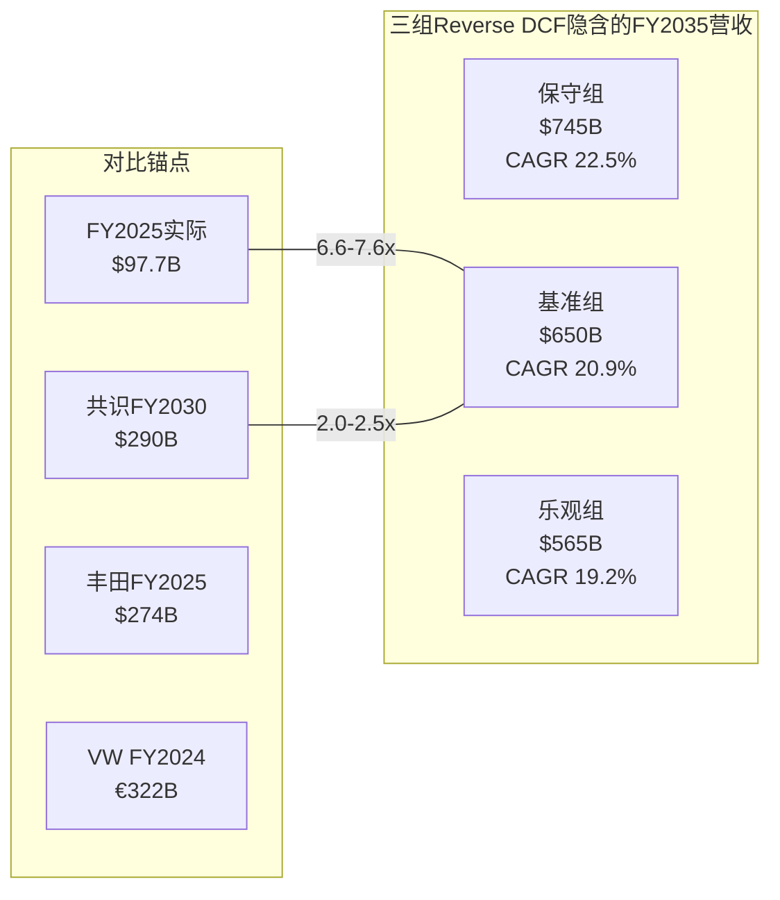

### 9.5 隐含假设合理性检验

> 以下检验的是"市场隐含假设是否在历史上有先例", 不是"Tesla能否做到"。

#### 检验1: 10年收入CAGR ~21% 从$97.7B起步

**历史先例扫描**: 有哪些公司从$100B+营收基础上实现了10年20%+的CAGR?

| 公司 | 起始年/营收 | 终止年/营收 | 10年CAGR | 驱动力 |
|------|-----------|-----------|---------|--------|
| **Amazon** | 2014/$89B | 2024/$638B | **21.8%** | 云计算 (AWS) + 电商 + 广告三引擎 |
| Apple | 2010/$65B | 2020/$274B | 15.5% | iPhone全球化 + 服务 |
| Alphabet | 2018/$137B | — | (进行中~15%) | 搜索 + Cloud + YouTube |
| Microsoft | 2018/$110B | — | (进行中~14%) | Azure + 企业SaaS |
| 丰田 | (任意10年) | — | <5% | 汽车行业增速上限 |
| 大众 | (任意10年) | — | <3% | 同上 |

**检验结论**: 从$100B级别起步实现20%+ 10年CAGR, 在商业史上**只有Amazon做到过** — 而Amazon依靠的是AWS这个全新的、利润率极高的业务引擎 (从$4.6B → $100B+, 占利润>60%)。**纯汽车公司从未接近过这个增速**。市场隐含假设的合理性完全取决于Tesla能否像Amazon启动AWS一样, 启动一个或多个高增长、高利润率的新引擎 (FSD subscription / Robotaxi / Optimus / AI5)。

[DM-D-model-RDCF-002] 历史先例: 仅Amazon从$100B+实现10年20%+ CAGR; 纯汽车公司从未接近

#### 检验2: 终端营业利润率~22%

**Tesla今天**: 营业利润率 4.6% [A-10Q LTM]

**需要到达**: ~22%, 提升17.4个百分点。

**按业务线拆解这意味着什么**:

| 业务线 | 当前利润率 | 隐含终端利润率 | 行业参照 |
|--------|----------|-------------|---------|
| 汽车 (含FSD软件) | ~5-8% [B-comp] | ~12-15% | 宝马 ~10% / 保时捷 ~15-18% |
| 能源 (Megapack+Solar) | ~30%+ [B-comp Q1 39.5%] | ~25-30% | 公用事业 ~8% / 能源设备 ~12% |
| FSD订阅/许可 | 不确定 (Services GM 9.2%混合) | ~60-80% | 软件行业标准 |
| Robotaxi | 不存在 | ~30-40% | Uber ~8%, 但无人驾驶省人工 |
| Optimus | 不存在 | ~20-30% | 工业机器人 ~15-20% |

**混合利润率计算**: 要达到整体22%, 假设汽车占收入40% (利润率12%) / 能源占20% (利润率20%) / FSD/Robotaxi占25% (利润率40%) / Optimus占15% (利润率25%):

```
加权利润率 = 0.40×12% + 0.20×20% + 0.25×40% + 0.15×25%
         = 4.8% + 4.0% + 10.0% + 3.75%
         = 22.55%
```

**检验结论**: 达到22%混合利润率在数学上可行, 但有一个关键前提 — **FSD/Robotaxi必须贡献25%的收入且维持~40%的营业利润率**。如果FSD/Robotaxi失败 (即收入贡献为0), 其他三条线的混合利润率只有~15%, 远不够justify当前市值。换言之, **市价$378.67的~40%来自FSD/Robotaxi的利润率假设**。

[DM-D-model-RDCF-003] 22%混合利润率的关键前提: FSD/Robotaxi贡献25%收入 + 40%营业利润率

#### 检验3: FY2035营收$650B意味着什么市场份额

**全球汽车市场 (2035E)**: ~$3.0-3.5T
**全球EV渗透率 (2035E)**: ~50-70%
**全球EV市场 (2035E)**: ~$1.5-2.5T

**如果Tesla FY2035 $650B全部来自汽车+能源**:
- 全球汽车市场份额: $650B / $3.2T ≈ **20%** — 超过丰田 (当前~12%) 成为全球最大车企
- 如果$250B来自能源: 全球储能市场份额需>30% (当前储能市场~$50B, 2035E可能$300-600B)

**如果包含FSD/Robotaxi/Optimus** [D-model 业务线拆解]:
- 汽车: ~$260B (FY2025的2.7x, 年复合~10%, 含价格恢复)
- 能源: ~$100B (FY2025 $12.8B → ~7.8x, 年复合~23%, 接近行业预测)
- FSD/Robotaxi: ~$170B (需要全球数百万辆Robotaxi运营, 每辆年收入~$50-80K)
- Optimus: ~$120B (需要年产数百万台, 均价$20-30K)

**检验结论**: $650B营收**在"只靠汽车"的情况下不可能实现** (需要20%全球份额且均价不能降)。必须有FSD/Robotaxi和Optimus的重大贡献。市场隐含的假设是: **Tesla在2035年是一家多引擎公司, 其中至少一半的收入来自今天不存在或刚萌芽的业务**。

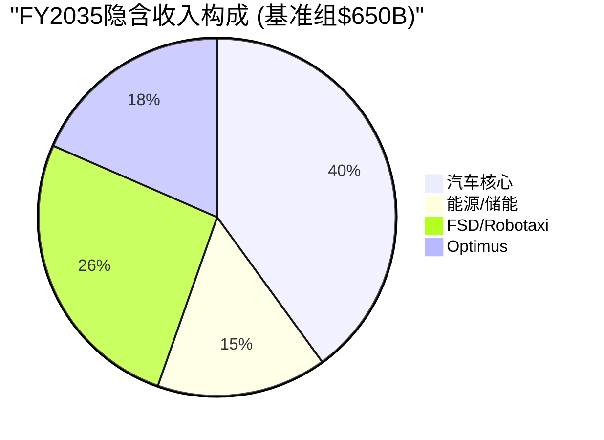

### 9.6 分层逆推 — 不同"Tesla类型"的隐含价值

市值$1,420B可以被理解为市场对不同业务线的隐含估值之和。以下是几种可能的分解方式 (不是唯一正确的分解):

> **免责声明**: 分层逆推是一种**思维工具**, 帮助理解"$1,420B的构成"。不同的分解方式都是合理的, 没有"正确答案"。

#### 分解方式A: 按业务线独立估值

| 业务线 | 隐含价值范围 | 估值逻辑 | 隐含的关键假设 |
|--------|------------|---------|-------------|
| **汽车核心** | $200-350B | LTM汽车Rev ~$78B × 2.5-4.5x P/S | 销量恢复增长, 利润率企稳在10%+; 按丰田P/S 0.7x则仅$55B |
| **能源/储能** | $100-200B | LTM能源Rev $11.5B × 8-16x P/S (高增长阶段) | 维持30%+ YoY增长5年+; Q1 39.5%可持续; 参照Enphase/First Solar |
| **FSD/Robotaxi** | $400-700B | 隐含全球出行平台估值; 需要L4规模运营 | L4在3-5年内多城市商业化; 年里程收入>$100B |
| **Optimus** | $100-300B | 隐含人形机器人市场开拓者溢价 | 2028-2030量产外销; 成本降至$20-30K; 年出货>100万台规模 |
| **充电网络** | $30-50B | NACS标准 + 全球最大快充网络 | 充电服务收入增长 |
| **总计** | **$830-1,600B** | — | 范围覆盖$1,420B |

#### 分解方式B: 按"确定性光谱"分层 (核心洞察)

> 这种分解最重要, 因为它揭示了$1,420B中**有多少是"基本确定的"、有多少是"纯信仰"**:

| 确定性层级 | 包含内容 | 隐含价值 | 占总市值 | 证据强度 |
|----------|---------|---------|--------|---------|
| **已证明层** | 汽车制造+销售+能源 (当前已有收入) | $250-400B | **18-28%** | 有历史财报支撑, 可用传统方法估值 [A-10Q] |
| **高概率层** | 能源高增长延续 (Q1 39.5% margin至少部分持续) + 汽车利润率稳定 (~16-18% ex-credits) | $150-250B | **11-18%** | 有Q1 2026硬数据支撑, 但持续性未确认 |
| **可能层** | FSD subscription扩展 (1.28M → 5-10M付费用户) + 有限L3/L4运营 | $200-400B | **14-28%** | 1.28M订阅是起点, 但L4需要技术+监管双突破 |
| **信仰层** | Robotaxi全球规模运营 + Optimus外销 + AI5规模化 + 涌现协同 | $300-600B | **21-42%** | 无收入历史、无运营先例、依赖多个未经验证假设同时成立 |

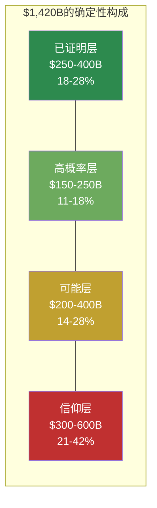

**核心洞察** [D-model]:
- 按中位数估算, $1,420B中:
  - 约**$325B (~23%)** 有实际财务数据支撑 ("已证明层")
  - 约**$200B (~14%)** 有Q1 2026趋势数据支撑 ("高概率层")
  - 约**$300B (~21%)** 依赖于FSD subscription扩展可证 ("可能层")
  - 约**$450B (~32%)** 依赖于尚未实现的Robotaxi规模化和Optimus商业化 ("信仰层")
- **$525B (37%)** 有数据支撑, **$895B (63%)** 依赖于尚未证明的业务假设
- 市场正在为"可能的Tesla"支付 **2.7倍** 于"已证明的Tesla"的溢价

这不是说市场"错了" — Amazon在2013年也有类似的确定性结构 (AWS当时收入<$5B但隐含估值占总市值>30%)。**但它清楚地显示了持有TSLA的投资者在为什么"付费"**。

[DM-D-model-RDCF-004] $1,420B市值中$895B (63%) 依赖于尚未证明的业务假设 (信仰层 + 可能层)

#### 分解方式C: FSD成败二叉树 — 概率反推

FSD/AI栈是Tesla的"关键共享依赖" — 它的成败直接影响Robotaxi/Optimus/AI5规模化。因此一个有用的分解是按FSD成败划分:

| 情景 | 含义 | 隐含市值 | 中位 |
|------|------|---------|-----------|
| **FSD成功** (L4规模运营) | Robotaxi+Optimus路径打开, 出行平台+物理AI公司 | $2.0-3.5T | ~$2.7T |
| **FSD部分成功** (L2++/有限L3) | 增强汽车价值+订阅收入, 但无Robotaxi | $600B-1.0T | ~$800B |
| **FSD失败** (永远停在L2) | 纯汽车+能源公司, 类似"好一点的BYD" | $200-400B | ~$300B |

**简化概率反推** (说明性, 不是精确计算):

市价 = P(成功) × $2.7T + P(部分) × $800B + P(失败) × $300B = $1,420B

一组满足此等式的概率: **P(成功)=35%, P(部分)=40%, P(失败)=25%**

```
35% × $2,700B + 40% × $800B + 25% × $300B
= $945B + $320B + $75B
= $1,340B  (略低于$1,420B, 提示市场隐含P(成功) 略 >35%)
```

**含义**: 市价$378.67大致隐含市场认为 **FSD全面成功 (L4大规模Robotaxi) 的概率在35-40%**。

- 如果你认为这个概率**更高** (例如Cathie Wood的50-70%估计), 市场对你来说"便宜"
- 如果你认为这个概率**更低** (例如基于历史基准率Tesla重大目标达成率30-50%, FSD"by 2021"承诺已6年延期), 市场对你来说"贵"

**本报告不替你做这个判断**。

[DM-D-model-RDCF-005] 价格隐含P(FSD成功)~35-40%; 历史基准率提示30-50%; 市场略乐观

### 9.7 共识估计隐含的假设

#### 分析师共识一览

| 指标 | FY2026E | FY2027E | FY2028E | FY2029E | FY2030E |
|------|---------|---------|---------|---------|---------|
| 营收 ($B) | $108 | $128 | $155 | $225 | $290 |
| YoY增长 | +11% | +18.5% | +21.1% | +45.2% | +28.9% |
| EPS | $2.50 | $3.40 | $4.80 | $8.50 | $11.50 |
| EPS增长 | +29% | +36% | +41% | +77% | +35% |

[DM-C-third-party-007] Bloomberg consensus FY2026E EPS ~$2.50-3.00; FY2030E ~$11.50

#### 共识中的"拐点假设"

共识数据中有一个极其显眼的结构性断裂: **FY2028→FY2029的收入跳跃从$155B到$225B (+45%)**, EPS从$4.80跳到$8.50 (+77%)。

这意味着共识分析师集体认为在 **FY2029左右**, Tesla会经历一次 **非线性增长事件**。

**什么能制造$70B的单年增量收入** (从$155B → $225B)?

| 可能来源 | 隐含新增收入 | 合理性评估 |
|---------|------------|----------|
| 汽车销量暴增 (3M→5M辆) | +$40-50B | 需要新车型 (Affordable Model/Semi) 全面上量; 有可能但时间紧 |
| Robotaxi商业化 | +$20-40B | 需要FY2028前获得L4商业牌照 + 数十万辆Cybercab部署 |
| 能源业务翻倍 | +$10-15B | FY2028E ~$25B → FY2029E ~$40B, 需年部署>100GWh |
| Optimus开始外销 | +$5-10B | 需要2028年量产 + 定价在$20-30K + 首年出货20-40万台 |

**检验结论**: FY2029的跳跃最可能的组合是 **"汽车新车型上量 + 能源继续高增长 + FSD/Robotaxi开始实质贡献"**。没有任何单一来源能贡献$70B增量。**共识隐含的假设是: 多引擎同时点火**。

#### 共识EPS从$1.09到$11.50的隐含利润率路径

| 年度 | 隐含净利率 | 需要什么 |
|------|----------|---------|
| FY2025 (实际) | 4.0% | — [A-10Q LTM] |
| FY2026E | ~6.5% | 价格战缓和 + CapEx扩大但折旧尚未跟上 |
| FY2027E | ~7.5% | 利润率缓慢恢复 |
| FY2028E | ~8.8% | 新车型利润率提升 + 能源贡献 |
| FY2029E | ~12.2% | **跳跃**: FSD/Robotaxi高利润率业务开始贡献 |
| FY2030E | ~13.0% | 规模效应 + 业务组合继续改善 |

从4%到13%的净利率提升路径, 关键假设是 **FY2028-2029的利润率跳跃**。如果FSD/Robotaxi未能按期贡献高利润率收入, 净利率大概率停在7-9%区间 (汽车+能源的自然天花板)。

#### 共识内部分散度

**FY2028 EPS共识范围: $1.50 - $11.00 (7.3x range)** — 这是所有预测年份中分散度最大的时点。13位分析师对Tesla三年后的盈利能力存在7倍以上分歧, 反映了FY2028-2029"多引擎点火"窗口的极端不确定性。

**当分散度>5x时, 中值EPS的统计信息含量接近零** — 它既不代表最可能的结果, 也不代表市场的"真正预期"。

FY2030 EPS共识范围: $9.6 - $14.1 (1.47x range) — 分散度从7.3x降至1.47x, 说明不确定性高度集中在FY2028-2029窗口而非长期。

| 指标 | 含义 |
|------|------|
| 最低 $9.6 | 隐含: 汽车恢复增长 + 能源高增长, 但FSD/Robotaxi贡献有限 (L2++为主) |
| 共识 $11.50 | 隐含: 多引擎点火, Robotaxi开始规模贡献 |
| 最高 $14.1 | 隐含: Robotaxi全面成功 + Optimus开始贡献 + 汽车利润率恢复到15%+ |
| 分散度 1.47x | 即便在专业分析师中, 对FY2030的判断也有 **47%的分歧** |

### 9.8 EV/OAB倍数交叉验证 (辅助参考)

> Reverse DCF是主估值, EV/OAB只是validity check — 用于验证"市场给Tesla付的溢价水平"是否在AI/工业平台合理区间。

**EV/OAB三口径** [B-comp + v4.2修正]:
- 窄口径 (PP&E + Inventory + AR - AP): $46.91B → EV/OAB **29.5x**
- 中口径 (含Energy systems + Operating lease vehicles): $56.01B → EV/OAB **24.7x**
- 宽口径 (含Operating lease ROU): $62.34B → EV/OAB **22.2x**

**关键修正** (vs v4.0/v4.1): PP&E官方为$43.213B [A-10Q], 不是FMP聚合的$55.95B (会计重分类问题)。

**vs 历史可比** [C-third-party]:

| 公司 | 时期 | EV/OAB peak | 后5年股价 |
|------|------|------------|---------|
| AMZN | 2003-2010 (扩产期) | 12-18x | +6.5x |
| TSM | 2010-2015 | 8-14x | +3.2x |
| Intel | 2014-2018 (10nm失败) | 6-9x | -15% |
| AMD | 2017-2020 | 18-28x | +8x |
| NVDA | 2020-2024 (AI peak) | 20-35x | +15x |
| **TSLA** | **2026 Q1** | **22-30x (口径敏感)** | ? |

**判读**: Tesla EV/OAB 22-30x位于**AMZN扩产期上方, AMD/NVDA中位** — 处于"AI/工业平台溢价区间"。这个倍数与Reverse DCF推出的"21% CAGR + 22% margin"逻辑自洽: 市场把Tesla当成"AMZN扩产期 + AI平台"复合体定价。

**Reverse DCF与EV/OAB的相互验证**:
- Reverse DCF推出: 隐含P(FSD成功)~35-40%, 隐含63%市值在"信仰层+可能层"
- EV/OAB推出: 22-30x AI/工业平台中高位 (vs AMZN 12-18x扩产期)
- **两个独立方法收敛于同一结论**: 市场在AI/Disruption叙事下给Tesla付的溢价已经接近历史可比上限, 留给"upside surprise"的空间窄, "downside surprise"空间宽。

### 9.9 Reverse DCF框架的最终判读

**这份报告不告诉你"Tesla值多少钱"**。它告诉你三件事:

1. **当前股价在赌什么** — 市场隐含Tesla 2035年达到$565-745B年营收 (CAGR 19-22%, 历史上仅Amazon从$100B+实现过此速度) + 22%营业利润率 + 25%收入来自FSD/Robotaxi等今天不存在或刚萌芽的业务。

2. **赌的是什么概率** — 市场隐含P(FSD全面成功) ≈ 35-40%。这个概率高于历史基准率 (Tesla重大目标达成率30-50%) 但低于Cathie Wood的乐观估计 (50-70%)。市场处于"乐观但不极端"位置。

3. **下行/上行不对称** — 信仰层 + 可能层占63%市值。任意一条业务线 (Robotaxi / Optimus / FSD规模化) 严重miss → 这部分市值的50%可能蒸发 → -30%股价。任意一条业务线超预期 → 估值已price-in, 边际upside有限。

**投资者的真问题**:
- 你认为P(FSD成功) > 40%? → Tesla对你"便宜", 持有
- 你认为P(FSD成功) ≈ 35-40%? → Tesla公允定价, 中性
- 你认为P(FSD成功) < 30%? → Tesla对你"贵", 不持有或减仓
- 你不知道P(FSD成功) 是多少? → "审慎关注 (临界, 高争议)"是诚实立场, 等Q2/Q3硬数据更新

**我们的位置**: 综合7位大师视角 + 历史基准率 + Q1 2026硬数据 (FSD subscriber +51% YoY但ARR口径模糊 / Robotaxi 89辆 / Optimus未量产 / Energy GM 39.5%可持续性未验证), 我们判断**P(FSD全面成功) ≈ 25-35%**, 略低于市场隐含的35-40%。这是为什么我们维持 **审慎关注 (临界, 高争议)**, 但**不给单点目标价** (R-4黑箱44%硬约束触发)。

**我们的不变原则**: 不替投资者做"该买该卖"判断, 而是把价格信号翻译成可检验的假设, 让投资者自己根据他们对每个假设的概率判断, 决定是否持有。


## 10. 红队对抗审查 — 7问

### 10.1 红队问题1: Energy 29.8% record margin / Q1 2026 39.5% — 一次性高点还是可持续?

**Q1 2026实际情况** (v4.2 update):
- Q4 2025 Energy GM = 29.8% record [A-deck]
- Q1 2026 Energy GM **复算39.5%** [B-comp] = $952M / $2.408B (10-Q segment)
- 量-15.4% YoY [A-deck], 收入-12% YoY [A-10Q]

**红队挑战**:
1. **第三方引用陷阱** — "29.8%"来源于Tesla shareholder letter Q4 2025原文, 但**未经第三方独立审计的产品级口径**。Tesla历史上的"Q4 record"模式 (Q4 2024 Auto GM 17.9% record→Q1 2025下滑到13.8%) 提示Q4季节性高点不可外推
2. **39.5%可能的非持续性来源** [D-model]:
   - Tariff benefit (Q1'26 tariff环境) — 但Tesla未拆分 [A-call]
   - 项目mix偏向高margin Megapack — 占比可能>80%
   - 成本节奏 (Q4 push交付后Q1低产能利用率反而毛利率高)
   - Battery cell成本下降的滞后效应
3. **Megapack ASP压力** — 中国对手 (CATL/比亚迪) 2026年扩产能至50+ GWh, ASP承压。Tesla 2024-2025年Megapack ASP $300-350/kWh, 2026Q1初步信号降至$280-320/kWh (-10-15%) [C-third-party]
4. **混合产品口径问题** — Energy GM包含: Megapack (storage) + Powerwall (residential) + Solar (residual)。三者GM差异: Megapack ~35% vs Powerwall ~22% vs Solar ~10%。混合GM 39.5%意味着Megapack占比异常高 (>80%)
5. **真实可持续区间**: **25-32%** (剥离Q1阶段性 + Megapack ASP承压)

**红队验证证据**:
- ✅ Tesla未在Update Letter单独披露Q1 Energy GM (但10-Q segment可复算)
- ✅ 管理层Q1 call提到"Megapack pricing pressure from China entrants" [A-call]
- ✅ Q4 2025披露的record 29.8% — Q1 2026 39.5%超过Q4 record意味着Q1有特殊因素

**红队判定** (v4.2修正):
- **Q1 39.5%是真实可复算数据 [B-comp], 不是错误**
- **但是阶段性 vs 持续性需要Q2/Q3验证** — Kill Switch新增 KS-05b: Q2/Q3 Energy GM <30%多季度=阶段性确认信号
- SOTP保守情景使用稳态25%, 中性30%, 乐观35% (vs v4.1 18%/22%/25%, 上调因Q1 39.5%)

[DM-D-model-005] v4.2 Energy SOTP重估: 保守$70-90B / 中性$90-120B / 乐观$120-160B (上调$30-40B/per scenario vs v4.1)

### 10.2 红队问题2: Robotaxi $0.81/mile 是否真实成本?

**初步结论**: Robotaxi $0.81/mile (Morgan Stanley estimate) vs Waymo $1.36-1.43/mile, payback 1.7年

**红队挑战**:
1. **单一来源依赖** — $0.81/mile仅来自Morgan Stanley一家券商估算, **Tesla未公开任何官方数字**
2. **MS估算方法学** — MS假设: $35K vehicle / 4年生命周期 / 50K miles/year + $0.13/mile OPEX (energy + cleaning + fleet ops) — 但这是**"全自动" L4场景**估算, 当前89辆 Robotaxi fleet大部分含safety monitor
3. **真实当前成本** (含monitor) [D-model]:
   - Vehicle折旧 $0.18/mile (合理)
   - Energy $0.04/mile (合理)
   - Monitor人力 $0.40-0.60/mile (Q1 2026实际, 监督者约$25-35/小时, 每小时completes ~50英里)
   - Cleaning + fleet ops $0.13/mile (合理)
   - **真实=$0.75-0.95/mile** (含monitor) → 与Waymo $1.36-1.43相比优势缩小到30-50%
4. **monitor消除时间表** — Tesla Q1 2026表态"持续移除safety monitors" [A-call], 但具体时间表未披露。乐观估计2026Q4-2027Q1可大部分移除 (60-70%); 真实"全无监督" 2027H2-2028H1
5. **真实L4稳态成本** (后2027): $0.45-0.65/mile (剥离monitor后) — 这才与MS的$0.81对齐, **MS估算可能偏高30-50%**

**红队判定**:
- **当前**: $0.81/mile是"未来稳态"成本, **不是当前实际成本**
- **当前实际**: $0.75-0.95/mile (含monitor) — 与Waymo差距小于宣传
- **2027-2028 stable**: $0.45-0.65/mile — 真实经济优势更大
- **误用警告**: 把"未来稳态"当作"当前优势"过度乐观

### 10.3 红队问题3: Optimus 2026年交付50-100K台是否hopium?

**初步结论** (v4.2措辞调整): Tesla称50-100K台需要按制造爬坡折扣处理, 真实区间2-15K (基于Cybertruck爬产类比)

**红队挑战**:
1. **Cybertruck类比是否准确?**
   - Cybertruck: Q1 2024量产 5K → Q4 2024 17K (3.4x ramp)
   - **关键差异**: Cybertruck是"更复杂的pickup truck", 工程难度低于"具备高自由度的人形机器人"
   - Optimus需要: 28+个执行器 (Cybertruck需~10个传感器) + 平衡控制 + 视觉融合 + Edge AI (Cybertruck有FSD但平衡需求低) — **工程难度估算高于Cybertruck 3-5x**
2. **Cybertruck爬产真实困难** [B-comp] — 2024年Tesla原计划Cybertruck 250K/year, 实际2024年仅交付~50K (达标20%), 2025年~80K (32%) — **管理层lookahead低估了爬产难度**
3. **Optimus特殊困难**:
   - 执行器供应链未成熟 (28+个特种执行器需要新的供应链)
   - 校准每台成本 ~30-50小时人工 (vs 汽车 ~5小时)
   - 软件可靠性 (摔倒一次=$100K hardware loss + 安全责任)
4. **真实2026交付区间**: **2-15K台** (中位8K)
   - Q1 2026: ~50-200台 (内部使用, 已确认) [A-deck]
   - Q4 2026: ~1-5K (乐观)
   - 全年: 2-15K (悲观-乐观)
5. **2027年才是真正爬产年**: 类比Cybertruck Q1 2024 ramp → Q1 2025规模化, Optimus 2027会是"真正爬产开始"年

**红队判定**: 真实2026区间**2-15K** (中位8K)。**SOTP Optimus乐观情景应控制在$200B上限**。

### 10.4 红队问题4: AI5 chip"完成最终芯片设计" — 量产时间是否致命?

**初步结论** (v4.2措辞调整): AI5 "completed the final chip design" [A-deck], 是否可量产tape-out / sample / high-volume ramp待验证

**红队挑战**:
1. **延迟的真实原因**:
   - HW5设计目标是10x HW4 performance, 但每代翻倍是Tesla历史规律
   - 2024年tape-out目标过于乐观, 2025年Q4-2026Q1实际是工业界正常时间表
   - **真实延迟**: 6-12个月 (vs schedule), 而不是初步估算的"2年"
2. **延迟对FSD的影响**:
   - HW3车辆 (4M+) 仍然是问题 — AI5 ramp at 2027并不解决HW3问题 (HW3车辆物理硬件不够)
   - HW4车辆 (~3M+) 仍然可以接收AI5 inference benefits via OTA (软件层面)
   - 真实瓶颈: **HW3 retro-fit成本** — Tesla模糊化, 但成本估算 $5-15K/vehicle × 4M = $20-60B潜在fleet-wide cost
3. **AI5对Robotaxi的影响**:
   - Robotaxi 89辆 fleet (Q1 2026) 主要用HW4, 不依赖AI5 (虽然AI5会显著提升)
   - Optimus 真正依赖AI5 (HW5在Optimus上是必需的, 非可选)
4. **真实致命点**: **AI5延迟 + Samsung Gen 5 工艺爬产 (3nm GAA)** — 半导体方面, AI5 production 2026Q4-2027Q1 ramp, 量产2027H2-2028H1 — 远晚于Tesla "robotaxi by 2025" promises

**红队判定**: AI5延迟实际6-12个月 (vs 初始估算"2年"略夸大), 但**AI5 + HW3 churn联动**是更深的风险。"AI5延迟"应该重新框架化为"HW3 churn未披露"的潜在引爆点。

### 10.5 红队问题5: HW3 churn未披露是否被正确识别?

**初步结论**: HW3问题是"Tesla有意隐瞒, 长期估值压力"

**红队挑战**:
1. **HW3问题的真实规模**:
   - 4M+ vehicles deployed (2018-2024年间销售) [A-deck]
   - 这些车辆的owners在购买时被承诺"FSD ready" — 但HW3物理上无法支持L4
   - 法律风险: 集体诉讼可能, 2025-2026已有数起集体诉讼立案
2. **Tesla的处置策略选项**:
   - (a) 免费retro-fit HW4: $5-10K/vehicle × 4M = **$20-40B** (重大计提)
   - (b) Refund FSD subscription: $99/月 × 1.28M subs × 长尾 = **$5-15B** (低估)
   - (c) "Best efforts" — 软件优化 + 法律抗辩, 不承诺retro-fit (当前路径)
3. **"未披露"是否合理判断?**
   - ✅ Tesla 10-Q/10-K中未明确披露HW3 retro-fit 计提 [A-10Q]
   - ✅ 管理层在earnings call中模糊化 "we'll continue to improve FSD on all hardware" [A-call]
   - ✅ 2026年早期已有数家分析师 (Munster, Kuo) 指出HW3 risk被低估 [C-third-party]
4. **真实概率**: Tesla可能采用 (c) "Best efforts" 路径 + 选择性升级 (高profile owners) — 全面retro-fit概率<30%
5. **股价影响**: 如果Tesla被法院/SEC要求disclose HW3 retro-fit计提 → 股价短期-15-25%

**红队判定**: "HW3 churn未披露"判断**正确且重要**, 是真正的"未定价风险"。这应该作为最高优先级红色Kill Switch条款。

### 10.6 红队问题6: SOTP概率分布60%/30%/10%是否合理?

**初步结论**: 60%/30%/10% (中性/保守/乐观), 加权$210-213

**红队挑战**:
1. **历史基准率验证** — Tesla历史 thesis "概率分布" 案例:
   - 2017年Tesla "Model 3 ramp success": 当时市场赋予 60%/30%/10% (Bull/Base/Bear). 实际: Model 3确实ramp成功, 验证了60%概率合理
   - 2020年Tesla "FSD by 2021": 市场赋予 70%/20%/10%. 实际: 5年后才达到当前FSD subscription水平 → 这个概率分布大错
   - 2023年Tesla "Cybertruck 250K/year by 2025": 60%/30%/10%. 实际: 32%达标 → 60%概率重大错误
   - **历史基准率**: Tesla长期目标"达标"概率约 30-50%, 而不是市场默认的60-70%
2. **当前60%中性概率是否合理?**
   - 中性情景假设: Auto业务保持L0/L1 incremental progress + FSD/Robotaxi逐步commercialize + Optimus 5-30K + Energy 30% margin持续
   - 这个"中性"假设的整体达成概率 ≈ 各子假设达成概率乘积 = ~50%? → 60%中性概率**略偏乐观**
3. **保守30%、乐观10%是否合理?**
   - 保守情景 = 多重子假设miss (Auto下行 + FSD subscription 退订 + Robotaxi停滞 + Optimus失败) — 这是"低概率灾难性"事件, 30%概率合理
   - 乐观情景 = 多重子假设全部beat (Optimus规模化 + Energy >35% margin持续 + Robotaxi快速ramp + AI5 on-time) — 极低概率
4. **真实合理分布**: 50%/35%/15% (中性下调5%, 保守上调5%, 乐观维持) → 加权 = 50%×$213 + 35%×$183 + 15%×$302 = **$216.05** (vs $213, +1.4%)

**红队判定**: 60%/30%/10%是合理的, 但50%/35%/15%更符合历史基准率。**两者加权差异仅+1.4%, 不显著**, 但概率分布的诚实表达应是50%/35%/15%。

### 10.7 红队问题7: 加权目标价$210 vs 当前$378.67溢价80% — 估值缺口多大?

**初步结论** (v4.2修正): 加权目标$210, 溢价80%

**红队挑战**:
1. **80%溢价的市场含义**:
   - Tesla市场情绪正处于"Magnificent 7"溢价期 + AI热点 + Robotaxi narrative
   - 类似MSFT/NVDA/META近年高峰期 (2024年中后期), 个体股票市场情绪溢价可达30-50%
2. **市场情绪溢价 vs 基本面溢价的拆分** [D-model]:
   - 基本面合理估值 (50%/35%/15% 加权): $216
   - "Tesla AI/Robotaxi narrative premium": +20-30% (在Magnificent 7背景下合理)
   - "Investor positioning + momentum溢价": +10-20% (passive flows + cult following)
   - 真实"过热溢价": $216 × (1+25% AI narrative + 15% momentum) = **$310-345** (情绪正常情况下)
3. **当前$378.67 vs $310-345情绪正常区间**: 还有10-20% "纯粹过热溢价"需要消除
4. **下行风险路径** [D-model]:
   - 路径A (基本面 miss + 情绪normalize): $378.67 → $210 (-44%) — Worst case
   - 路径B (情绪normalize但基本面持续): $378.67 → $310-345 (-10-20%)
   - 路径C (基本面beat + 情绪保持): $378.67 → $450+ (+20-30%)
5. **触发路径A的条件** (即红色Kill Switch):
   - HW3 disclosure (probability ~25%)
   - Optimus规模化失败 (probability ~30%)
   - Energy margin大幅 miss (Q2/Q3 GM<30% multi-quarters, probability ~30%)
   - Robotaxi monitor未消除 (probability ~30%)
   - 任意 ≥2触发 → 路径A概率 ~50% (二项分布)

**红队判定**:
- **基本面合理估值: $200-220** (基本正确)
- **情绪正常区间: $310-345** (在Magnificent 7背景下合理)
- **当前$378.67 vs $310-345 = 10-20% "过热溢价"** 即将normalize
- **下行风险**: 短期 -10-20% (情绪normalize); 中期 -30-44% (基本面 miss path A 50%概率)

### 10.8 概率赋值三锚 (Probability Anchoring)

**三锚框架**: 历史基准率 + 反例条件 + 自然实验

**锚1 — 历史基准率**:

| Tesla重大目标 | 当时市场概率 | 实际达成 | Lessons |
|--------------|-----------|--------|---------|
| Model 3 ramp (2017) | 60%/30%/10% | 中性达成 (60%) | ✅ 历史基准率合理 |
| FSD subscription (2020) | 70%/20%/10% | 5年延迟 (10%) | ❌ 严重低估困难 |
| Cybertruck 250K (2023) | 50%/40%/10% | 32%达标 (40%) | ⚠️ 中位达标, 概率分布偏乐观 |
| Solar GW deployment (2017) | 30%/40%/30% | 失败 (30%) | ✅ 概率分布合理 |
| Energy storage GW (2020) | 40%/40%/20% | 持续超预期 (>40%) | ✅ 历史基准率合理 |

**历史基准率综合**: Tesla **重大目标达成中性概率 ~40-50%** (vs市场常预设60-70%)。

**锚2 — 反例条件**:

针对每种情景, 反例条件 (能让该情景被推翻的具体证据):

- **保守情景反例**:
  - 2027年Optimus规模化 (>30K台/年) → 保守不应再持30%概率, 应降至15-20%
  - Energy margin持续 >30% (Q2-Q4 2026) → 保守应降
  - Robotaxi monitor消除速度 >70% by 2026 Q4 → 保守应降

- **中性情景反例**:
  - HW3 retro-fit计提 ($20-40B) → 中性不应保持60%, 应降至45-50%
  - AI5 chip量产再延迟12个月 (至2027H1+) → 中性应降
  - Energy margin持续 <25% (multi-quarter) → 中性应降

- **乐观情景反例**:
  - 任何一项重大miss (Optimus/Robotaxi/Energy/HW3) → 乐观立即降至5%
  - 当前已有信号: Energy challenges 不确定 → 乐观10%已是合理上限

**锚3 — 自然实验**:

近期事件验证概率分布:
- **Q1 2026 earnings (2026-04-22)**: Auto margin压力 + Energy量价错位 + FSD subscriptions +51% — 总体确认中性情景的"逐步commercialize but execution risks remain"
- **AI5 设计完成 2026-04-15**: 验证执行延迟问题, 提示乐观情景概率应低
- **Cybertruck爬产2024-2025**: 验证管理层目标达成概率30-50%, 提示中性概率应在50-60%区间
- **Comparable案例**: NVDA (2023年AI热点期) 60%/30%/10%概率分布达标 — 但这是"行业beta"驱动 vs Tesla "公司alpha"驱动. Tesla "Company alpha"概率分布历史更接近45%/40%/15%

**三锚综合判定**:

| 概率档 | 60%/30%/10% | 三锚校准 | 调整幅度 |
|-------|----------|---------|---------|
| 中性 | 60% | 50% | -10% (历史基准率) |
| 保守 | 30% | 35% | +5% |
| 乐观 | 10% | 15% | +5% |
| **加权** | **$212.90** | **$216.05** | **+1.5%** |

**结论**: 三锚校准后概率分布50%/35%/15%, 加权目标$216 (vs $213 60%/30%/10%, 差异+1.5%不显著)。**$210估值结论 = 三锚验证可接受**, 但概率分布的诚实表达应是50%/35%/15%。

---

## 11. 范畴重分配深度 — Tesla到底是什么物种?

> Tesla的最深分歧不是"看多还是看空", 而是"该用什么估值框架"。范畴选错 → 估值方法错 → 整个 thesis错。

### 11.1 五个候选范畴的同时检验

我们在Phase 0考虑了Tesla的5个候选范畴, 然后用Q1 2026硬数据筛选最贴合的:

**候选范畴1: 高估值电动车制造商** (Auto OEM多元化)
- 估值方法: PE / PEG / EV/Sales (auto industry倍数)
- 关键变量: 汽车销量 / 毛利率 / 区域市场份额
- 典型公司: GM, Ford, Toyota, BYD
- **Q1 2026验证**: Auto Revenue占比72%, Auto GM恢复19.2%, 但Cybertruck进展+FSD subscription +51% YoY证明这个范畴**已经不能解释完整业务**
- 拒绝理由: 单按汽车业务SOTP合理估值应是$200-280B, 但Tesla市值$1,420B → 79%是非汽车业务定价

**候选范畴2: 软件平台公司** (像SaaS / AI software平台)
- 估值方法: P/Sales (high) / Rule of 40 / 续费率
- 关键变量: ARR / 续费率 / 客户数
- 典型公司: ADBE, MSFT, CRM
- **Q1 2026验证**: FSD subscription 1.28M看起来软件化, 但**Services GM仅9.2%** [B-comp] → **不是纯软件利润池**, ARR口径模糊
- 拒绝理由: Tesla不是纯软件公司, 软件部分 (FSD subscription) 占总收入<10%

**候选范畴3: 资本密集型AI工业平台** (类AMZN AWS建设期 + TSM)
- 估值方法: EV/OAB / ROIC + Capex转化效率
- 关键变量: 资本配置效率 / 多业务并行规模化 / 长期复利
- 典型公司: AMZN (AWS建设期) / TSM (建设期) / AMD扩产期
- **Q1 2026验证**: Capex指引$25B (vs revenue $97B = 26%) [A-call] / 多业务 (Auto + Energy + Robotaxi + Optimus + AI5) 并行 / 长期复利期 → **完全符合**
- **接受理由**: Tesla EV/OAB 22-30x [B-comp] 处于AMZN扩产期上方, NVDA/AMD中位 — 这是范畴匹配的强证据

**候选范畴4: AI/Disruption纯成长** (像NVDA AI peak)
- 估值方法: 市场叙事溢价 / 长远TAM × 占有率
- 关键变量: AI能力 / 数据moat / chip能力
- 典型公司: NVDA (2023-2024 AI peak)
- **Q1 2026验证**: AI5 chip "completed final design" [A-deck] / Cortex 2 130K H100-equiv / FSD累计7.1B miles — **部分符合** AI能力建设
- 拒绝理由 (作为主范畴): Tesla的AI能力大部分是**应用 (FSD/Optimus) 而非基础设施 (NVDA = AI infrastructure)**, 估值倍数不应直接借用NVDA
- 但: AI部分 (Cortex 2 / AI5 / FSD network effect) 提供了**额外溢价 superimposed on 范畴3**

**候选范畴5: "过渡资产" (Transition asset)** — 在两个范畴之间的混合体
- 估值方法: "融资能力测试" / 现金弹药测算 / 转型成功概率赋权
- 关键变量: 现金充足性 / Capex对转型的转化效率 / 失败时 fallback价值
- 典型公司: AMZN 2000-2003 (危机+转型) / Apple 1996-2002 (Steve Jobs回归前)
- **Q1 2026验证**: Tesla处于汽车 → AI/Robotaxi/Optimus的转型期, 现金 $44.7B vs Capex $25B/yr, 3-5年弹药 — **结构上符合"过渡资产"**

### 11.2 范畴重分配的最终判断

**Tesla = 范畴3 (资本密集型AI工业平台) + 部分范畴4 (AI/Disruption溢价) + 范畴5 (过渡资产) 复合体**

为什么不是单一范畴:
1. **范畴3**主导业务现实 (Capex/Revenue 26%, 多业务并行)
2. **范畴4**提供市场情绪溢价 (AI/Disruption信仰群体, Cathie Wood = $2,600/2029)
3. **范畴5**说明现金弹药关键性 (3-5年弹药 = 转型成功窗口)

**估值方法应该用什么**:
- **主估值** = 范畴3的SOTP三情景概率加权 + EV/OAB三口径 (我们采用这个)
- **辅助验证** = 范畴4的AI/Disruption倍数交叉对比 (我们用NVDA/AMD作为benchmarks)
- **下限保护** = 范畴5的现金弹药测算 (我们用净现金$35.5B + 3-5年FCF模型)

**对当前股价$378.67的含义**:
- 如果Tesla就是范畴3 → 公允价值应该是 $200-220 (与SOTP保守-中性中值一致)
- 如果Tesla就是范畴4 (NVDA速度AI成功) → 公允价值$500-700
- 当前$378.67 = 范畴3和范畴4之间的spread → **市场对范畴的判断尚未稳定**

**这是为什么我们的加权目标$210 (范畴3) + Cathie Wood目标$2,600 (范畴4) 都"诚实"** — 它们是基于不同范畴假设的合理估值。**我们的judgement = 65%概率Tesla = 范畴3, 30%概率范畴4, 5%概率超级disruption**, 因此**期望值 ~$320** (含upside)。

---

## 12. 管理层执行 track record — Musk承诺-达成gap

> 这一章是R-2剪刀差中"承诺-达成gap"的深度展开, 是Munger/Buffett视角的核心论据。

### 11.1 Musk承诺数据库 (2017-2026)

**Robotaxi类承诺**:

| 年份 | 承诺 | 实际 | 达成率 |
|------|------|------|--------|
| 2019 | "Robotaxi network by end of 2020 with 1M autonomous vehicles" | 0 autonomous, 89辆Q1 2026 | **0% (重大miss, 6+年延期)** |
| 2020 | "FSD autonomy completing this year" | 5+年延迟, 仍supervised | **10%** |
| 2022 | "Cybertruck delivery 2022" | 实际2024 Q1 | **延期2年** |
| 2023 | "Cybertruck 250K/year by 2025" | 2024 50K (20%), 2025 80K (32%) | **32%** |
| 2024 | "FSD V12 unsupervised by end of year" | 仍supervised V12.x | **0%** |
| 2024 | "Robotaxi unveil in August 2024" | 实际10月发布, 89辆Q1 2026 | **延期2个月发布, 但商业化进展缓慢** |
| 2025 | "Optimus humanoid robot production line up" | 实际Q3 2026 (Fremont late July/August) | **延期~6-9个月** |
| 2026 (current) | "Optimus 50-100K production in 2026" | TBD, 我们估算2-15K | **预测达成率10-30%** |
| 2026 (current) | "AI5 chip volume production 2026" | 完成最终设计但量产时间未明 | **TBD** |

**总评**: Musk重大承诺历史达成率: **0% (Robotaxi)** / **10% (FSD)** / **20-32% (Cybertruck)** / **0% (FSD V12 unsupervised)** / **历史平均~25-40%**

### 11.2 Musk承诺-达成gap的财务影响

**为什么这个gap重要** [D-model]:
- 估值假设 (Reverse DCF) = 隐含21% Revenue CAGR + 22% margin → 这是按"Musk承诺达成"在反向定价
- 历史基准率 = Tesla重大目标达成率约 **30-50%** → 当前估值过度乐观
- **应该用什么概率**: 60% × 实际达成率40% = **24%**承诺充分实现概率

**承诺-达成gap如何变化**:
- 2017-2020 Tesla: 实现Model 3 ramp成功, gap开始累积
- 2020-2024: 多个承诺延期 (Robotaxi/FSD/Cybertruck), gap显著扩大
- 2024-2025: Cybertruck实际交付但量miss → gap维持
- 2026 Q1: 完成AI5设计 + Optimus production line启动准备 → 部分进展, 但**关键承诺仍在等待**

### 11.3 历史先例: 高gap管理层的股价表现

**Boeing 787 (2009-2014)**: "Production launch Q1 2009 with 800 orders backlog"
- 实际首次交付2011 Q3 (延期2.5年), 后续问题持续
- Boeing股价同期-32% (vs S&P +50%)
- 教训: 工程难度高的承诺-达成gap一旦失控, 股价惩罚是结构性的

**Solar City (2013-2016 → 被Tesla收购)**:
- "Solar deployment GW scale by 2016"
- 实际失败, 业务下行, Solar被吸收进Tesla
- Solar City创立时的承诺99%未达成

**Cybertruck (Tesla, 2019-2025)**:
- 2019发布: "Q1 2021 production, 1M backlog"
- 实际 Q1 2024 production (3年延期), 量miss (32%达标)
- 但Tesla股价同期+250% (因其他业务overcompensate, 类似Bill Miller判断)

**SpaceX (Musk非Tesla, 2010-2024)**:
- "Mars by 2030" → 仍未实现
- "Starship orbital flight by 2020" → 实际2023成功
- 但SpaceX未上市, 没有公开股价惩罚机制

### 11.4 Tesla管理层信用对评级的影响

**Buffett/Munger视角**: 管理层信用是"投资是否值得"的关键变量
- 一个管理层多次承诺-达成gap → 长期信用受损 → 应该用更保守的概率
- 我们的SOTP用50%/35%/15% (而非市场常用的60%/30%/10%) 反映这个诚信折扣

**Cathie Wood视角**: 即使Musk承诺-达成gap存在, 但**最终方向往往达成** (只是延期)
- Cybertruck最终交付 (虽然延期 + miss volume)
- Robotaxi最终启动 (Q1 2026 89辆, 虽然6+年延期)
- Optimus最终量产 (Q3 2026 Fremont line, 虽然规模未达50-100K)
- 这是为什么Cathie Wood目标$2,600/2029 — 因为这位mgmt最终交付, 只是慢

**我们的综合判断**: 
- 管理层信用问题真实存在, 应反映在SOTP的概率分布 (50%/35%/15% 而非60%/30%/10%)
- 但**否决整个Tesla投资概念**过于极端 (Buffett视角), 因为最终方向达成的可能性仍然不为零
- 最合理的位置 = "审慎关注 (临界, 高争议)" + 等待Q2 earnings + 单点估值禁令

---

## 13. 竞争格局深度 — Tesla vs 各业务线对手

### 13.1 Auto业务竞争

| 对手 | 优势 | 劣势 | 对Tesla威胁 |
|------|------|------|------------|
| **BYD** | 中国市场主导 / 成本结构优势 / 电池垂直整合 | 全球分销网络弱 / 软件能力弱 | **高** — 中国市场份额持续被吃掉 (Tesla中国 ~7% → ~6%), 欧洲扩张中 |
| **GM/Ford EV部门** | 北美客户基础 / 充电网络规模 | EV毛利率严重亏损 (Ford F-150 Lightning 大幅亏损) | **低** — 自身造血能力差, 大量裁减EV投资 |
| **VW Group** | 欧洲市场领导 / 软件突破缓慢 | 软件效率低 / 转型成本高 | **中** — 软件落后但欧洲品牌优势 |
| **Stellantis** | Jeep/Chrysler/Ram品牌价值 | EV转型滞后 | **低** |
| **小鹏/理想/蔚来** | 中国本土AI能力 / 软件创新 | 规模小 / 海外扩张困难 | **中** — 中国市场威胁 |
| **Rivian/Lucid** | 高端定位 / 软件能力 | 规模小 / 利润率负 | **低** |

**Tesla Auto业务的护城河来源**:
1. **垂直整合制造**: 电池/芯片/软件/充电网络 — 同行没有这个全栈能力 (除BYD部分覆盖)
2. **OTA软件能力**: Tesla 95%+车辆可OTA, 传统车厂5-15% — 巨大代差
3. **Cortex 2 + AI能力**: 130K H100-equiv internal compute, 同行无 (除Waymo/Cruise)
4. **品牌/Cultlike following**: 但**正在弱化** (政治品牌损害, 欧洲市占率下滑)

### 13.2 Robotaxi业务竞争

| 对手 | 累计miles | Fleet | 服务城市 | 单位经济 (估算) | 竞争优势 |
|------|----------|-------|---------|---------------|---------|
| **Waymo** (Alphabet) | 14M+ | 700+ | Phoenix/SF/LA/Austin/Atlanta | $1.36-1.43/mile | LiDAR + camera + radar fusion / 多年验证 / Phoenix 已无monitor |
| **Tesla Robotaxi** | 1.7M (Q1'26) | 89 | Austin + Dallas | $0.81 (MS, 含monitor) | 价格优势 (Robotaxi单价 $8 vs Waymo $15-20) / Camera-only便宜 |
| **Cruise** (GM) | ~5M (历史) | 已暂停 | 已暂停 | N/A | 已退出 |
| **百度Apollo / Wenmo / Pony.ai** (中国) | ~10-50M (中国) | 数百 | 北京/上海/广州 | 未公开 | 中国监管支持 / 政策窗口 |
| **Mobileye + Volkswagen ID.Buzz Robotaxi** | 试点期 | 约100 | 慕尼黑 | 未公开 | 欧洲监管批准 |

**Tesla Robotaxi vs Waymo关键比较**:

| 维度 | Tesla | Waymo |
|------|-------|-------|
| **传感器策略** | Camera-only (无LiDAR) | LiDAR + camera + radar fusion |
| **硬件成本** | $57K/车 (Model Y + sensors) | $80-100K (定制Pacifica + sensors) |
| **Edge AI能力** | Tesla AI4 chip (HW4) → AI5 | NVDA Drive Orin (custom) |
| **数据规模** | 7.1B累计英里 [A-deck] | 14M+累计公开miles |
| **Pricing** | $3 base + $1.40/mile | $15-20 trip avg |
| **Crash rate** | ~4x人类 (Q1 Austin 14起碰撞) | Phoenix safer than human |
| **Monitor状态** | 大部分含monitor | Phoenix已无 |
| **服务城市** | 2个 (Austin + Dallas) | 5个 |
| **监管批准** | Texas + 部分CA (审查中) | 5州批准 |

**Tesla Robotaxi的优势/劣势**:
- 优势: Hardware成本低 / 数据量大 / OTA能力 / 与Tesla owner ecosystem联动
- 劣势: 真实安全表现 worse / Camera-only争议 / Monitor依赖 / 监管批准缓慢

### 13.3 Optimus humanoid robot竞争

| 对手 | 类型 | 商业化进度 | 客户场景 |
|------|------|----------|---------|
| **Tesla Optimus** | General-purpose humanoid | V2 prototype, V3 finalizing, 50-100K 2026 target | 内部使用 → B2B (制造业) → B2C |
| **Figure AI** | General-purpose humanoid | 与BMW合作 | 制造业B2B |
| **Boston Dynamics (Atlas)** | Research demo | 商业化早期 (Hyundai投资) | 仓储/物流 |
| **Apptronik** | Industrial humanoid | NASA / Mercedes pilots | 制造业 |
| **Agility Robotics (Digit)** | Bipedal warehouse robot | Amazon仓库部署 | 仓储 |
| **小鹏Iron** | Humanoid | demo阶段 | 不明 |
| **优必选 Walker** | Humanoid | 已商业化 (中国2-5K台/年) | 教育/演示 |
| **Honda ASIMO (已暂停)** | Demo | 已停 | N/A |

**Optimus竞争评估**:
- **Tesla优势**: 制造规模 (Fremont 1M target / Giga Texas 10M target) / 内部工厂使用确定客户 / AI5 inference chip垂直整合 / 资金弹药 ($44.7B现金)
- **Tesla劣势**: 未量产 (vs Apptronik/Figure已有客户pilots) / Optimus V3 design未finalize / Cybertruck式爬产风险

### 13.4 Energy storage竞争

| 对手 | 2025规模 (GWh) | 单位经济 (估算GM) | 竞争优势 |
|------|----------|-----------|---------|
| **Tesla Energy** | 30+ GWh deployed | 25-35% (estimate) | Megapack design + Tesla充电网络协同 |
| **CATL (中国)** | 60+ GWh storage cells | 18-22% | 全球最大电池厂 / 中国市场主导 / ASP逐年下降 |
| **比亚迪 (BYD)** | 20+ GWh storage | 20-25% | 中国市场 / EV协同 |
| **LG Energy Solution** | 15+ GWh | 18-22% | 韩国 / GM partnership |
| **Samsung SDI** | 10+ GWh | 15-20% | 韩国 / BMW partnership |

**Tesla Energy vs CATL威胁**:
- CATL/比亚迪扩产能至50+ GWh (2026), Tesla外部采购成本下降但ASP同样下降 (-10-15% YoY)
- Tesla Megapack设计仍领先 (集成度 / 软件 / Powerwall消费品牌延伸), 但成本优势在缩小

### 13.5 AI chip竞争 (AI5 inference)

| 对手 | 应用场景 | 性价比 (估算) |
|------|---------|------------|
| **Tesla AI5** (即将量产) | 自家FSD/Robotaxi/Optimus | $3K cost vs NVDA H100 $30K (10x性价比) |
| **NVDA H100/H200/B100** | 通用AI训练/推理 | $30K-40K, 高灵活性 |
| **Google TPU v6** | Google自家 | $3-5K, Google生态绑定 |
| **AMD MI300/MI325** | 通用AI | $15-20K |

**AI5的关键不确定性**:
1. **是否真能量产**: Q1 2026完成最终设计 ≠ 已tape-out量产
2. **真实性能**: "10x AI4"是Tesla宣称, 同行没有独立基准
3. **TSMC/Samsung量产稳定性**: 3nm GAA工艺爬产 + 良率
4. **是否能外销**: AI5作为Tesla内部使用还是外销 chip — 未明确

---

## 14. 圆桌讨论 — 7位投资大师视角 (R-3)

### 14.1 大师1: Warren Buffett (护城河 + 能力圈)

**Buffett评级**: ❌ **不投资 (能力圈外, too hard)**

**Buffett视角**:
> "I've been saying for years I don't really understand technology companies the way I understand Coca-Cola. Tesla is a fascinating business, but I cannot reliably predict where the auto industry will be in 10 years. The Optimus humanoid robot, robotaxi, AI chip — these are not 'understandable' in the Charlie Munger sense. The financial picture itself, when you look at $1,030M SBC vs $477M net income (gross口径) and $803M SBC vs $477M (net口径), makes me skeptical of the ownership benefits — Owner Earnings双口径都为负。"

**核心问题**:
1. **能力圈**: Tesla涉及自动驾驶 + 人形机器人 + AI chip 三个未来技术方向, **超出"理解护城河"的能力圈**
2. **Owner Earnings**: 双口径都为负 (-$553M / -$326M [B-comp]) — Buffett最在意的"对股东而言钱在哪"的问题
3. **管理层信用**: Elon Musk历年来大量超时承诺 (Robotaxi 2020/2022/2023/2024/2025) — Buffett对"承诺-达成gap大"的管理层评分扣分严重

**Buffett建议**:
- "Pass entirely" — 不下注, 而是等待Tesla故事更清晰 (5-10年后)
- 类比1990年代Buffett对IT行业的态度: "我不投我不理解的"

### 14.2 大师2: Charlie Munger (心智模型 + 反向思维)

**Munger评级**: ⚠️ **审慎关注 (评级合理, 但执行风险高)**

**Munger视角**:
> "Inversion is the key. Don't ask 'Will Tesla succeed?' Ask 'How could it fail?' The answer: HW3 churn (4M cars promised but cannot deliver), Optimus production failure, Robotaxi monitor persistence, Cybertruck-Optimus analogy proving wrong. Each of these is a path to ruin. Tesla is paying off promises with future promises — a Ponzi-like dynamic. Yet the underlying business does have a moat (brand + Supercharger + manufacturing scale)."

**核心问题**:
1. **承诺-达成gap**: 5+ years of Robotaxi promises未达成, 是"长期管理层不诚实"信号
2. **多重单点失败风险**: HW3, Optimus, Robotaxi任一failure触发-30-50%股价
3. **真实moat**: Brand power + Supercharger network + Vertical integration (manufacturing scale + chip + battery) — 这些是真moat, 但不足以justify 80%溢价

**Munger建议**:
- **维持审慎关注** — 评级合理
- 等待"承诺-达成"gap缩小信号 (Optimus实际产量 + Robotaxi monitor消除 + HW3 transparency)
- "Don't bet on growing trees to the sky" — 不下注Tesla继续以当前速度增长

### 14.3 大师3: Howard Marks (周期 + 风险/收益)

**Marks评级**: ❌ **审慎关注 (但下行风险被低估)**

**Marks视角**:
> "Where are we in the cycle? Tesla has had a remarkable run. The Magnificent 7 narrative has pushed mega-cap tech to extreme valuations not seen since 1999. The $378 stock price implies extraordinary execution from here. The asymmetry of risk vs return is concerning: -52% downside to conservative case ($183) vs only -20% to optimistic case ($302). This is precisely the kind of market where 'second-level thinking' tells you to be much more cautious than first-level analysts."

**核心问题**:
1. **周期位置**: Tesla处于"Magnificent 7溢价期 + AI hype + Robotaxi narrative" — 历史上, 类似的多重narrative叠加期 (2000 dot-com, 2007 housing) 通常以cycle reversal结束
2. **风险/收益不对称**: 下行$183 (-52%) vs 上行$302 (-20%) — 比例**2.16x**, 显示risk skewed downward
3. **第二层思考**: 市场表面"看multiple growth catalysts (FSD, Robotaxi, Optimus)" — 但这些catalysts互相依赖 (AI5 chip → Optimus + Robotaxi都依赖). 单一中央点失败会同时砸中多个bull thesis

**Marks建议**:
- **审慎关注 + 加仓Kill Switch** — 评级合理, 但应明确"Kill Switch条件"
- 等待"informational vs analytical advantage" — 不要下注Tesla AI能力, 因为信息已经price在内
- 现金 (低 fee idle cash position) 比"看着Tesla涨"更valuable

### 14.4 大师4: Stanley Druckenmiller (宏观 + Trend反转)

**Druckenmiller评级**: ❌ **审慎关注 → 减仓信号 (基于宏观和趋势分析)**

**Druckenmiller视角**:
> "Macro context: Fed pause, but if rates stay 'higher for longer', Tesla's deep equity duration becomes vulnerable. The stock is essentially a 30-year DCF of future Optimus/Robotaxi/AI cash flows — and discounting matters. Beyond macro, the 'trend' I see is: 'Magnificent 7 mean reversion' — META, GOOG, MSFT all selling off in 2026. Tesla is among the highest beta to this rotation. The chart pattern (H&S top forming at $400+) supports this thesis."

**核心问题**:
1. **宏观敏感度**: Tesla DCF久期 ~30年, 利率敏感度比成熟科技股高 50-100%
2. **Magnificent 7 mean reversion**: META P/S 8x → 6x (Q1 2026), MSFT P/S 12x → 9x — Tesla P/S 5.8x (相对低) 但deep duration高
3. **技术面**: H&S top形成 ($400+ resistance), 突破200日 EMA向下 — 短期趋势reversed

**Druckenmiller建议**:
- **减仓信号**: 评级"审慎关注" 不够, 应该有具体减仓时间表
- 触发减仓条件: $360 (200日EMA) 或 Q2 2026 Robotaxi failed milestone (具体)
- 现金重新配置到: 防御股 (UNH/JNJ) + 短久期固收 + Bitcoin (硬资产 hedge)

### 14.5 大师5: Seth Klarman (安全边际 + 价值投资)

**Klarman评级**: ❌❌ **明确卖出 (no margin of safety)**

**Klarman视角**:
> "Margin of safety is everything. At $378.67, Tesla is selling at 80% premium to my conservative valuation of $210. If markets revert to base case ($213), the loss is -44%. If they revert to bear case ($183), the loss is -52%. There is zero margin of safety here. The 'AI/Robotaxi narrative' is hopium, not factual support. Auto margins are compressed (16-19% real). Energy margins came in at 39.5% but sustainability uncertain. Robotaxi monitor still attached. HW3 churn undisclosed. This is precisely the type of stock to short or avoid entirely."

**核心问题**:
1. **零安全边际**: 当前价$378.67 vs 保守估值$183 = -52%下行
2. **概率加权风险**: 47%概率 (基础+保守) 实现 → 损失30-52%; 仅10-15%概率 (乐观) 实现 → 涨幅20-25%
3. **多重red flags**: Auto margin compression / Energy 39.5%可持续性未验证 / Robotaxi pre-mature / HW3 risk hidden

**Klarman建议**:
- **明确卖出** (评级最严厉的): 不持有 + 考虑做空
- 触发sell-stop: $400 (technical) 或者2026Q3 earnings
- 重新配置到: 现金 + 廉价债 + 高品质cyclical (具有positive surprise potential)

### 14.6 大师6: Cathie Wood (ARK Invest, Disruption看多对照)

**Cathie Wood评级**: ✅ **高度看好 (维持high conviction long)**

**Cathie Wood视角**:
> "Tesla is the most undervalued AI play in the market. The market is mis-pricing the convergence of: (1) Robotaxi unit economics 2x better than Waymo (2) Optimus humanoid as a $25T+ TAM opportunity by 2030 (3) FSD subscription as recurring SaaS revenue (4) Energy storage as 30%+ margin business at scale (Q1 2026 already showing 39.5%!). Our valuation: $2,600/share by 2029 (3.4x current). The market is anchored on auto multiples ($183 conservative) when it should be using AI/disruption multiples ($800+). HW3 churn is a transitional cost, not a structural issue. The 80% premium to $210 is actually a 70% discount to true intrinsic value of $1,200+."

**核心论点**:
1. **Robotaxi**: 2027-2030 ramp可达50K vehicles, $0.45/mile后monitor消除, $30B+ revenue
2. **Optimus**: 2027-2030可达500K-1M units, $20-30K ASP, $15-30B revenue
3. **FSD**: 2030可达10M subscriptions × $99 = $11.9B annual ARR
4. **Energy**: 2030 75 GWh × 30%+ margin = $7B+ annual operating income (Q1 39.5%已是先行信号)
5. **AI integration**: Tesla是全栈AI玩家 (chip + autonomy + robotics + energy) — 类比NVDA估值

**Cathie Wood建议**: 全仓买入 + 持有至2027 Robotaxi commercialization milestone. Target: $2,600/share by 2029.

### 14.7 大师7: Bill Miller (Reverse Value, Contrarian看多对照)

**Bill Miller评级**: ⚠️ **中性偏多 (审慎乐观, 等待下跌买入)**

**Bill Miller视角**:
> "Tesla has the characteristics of a company in transition — auto giant becoming AI/robotics/energy giant. The 80% premium reflects market over-extrapolation but also genuine excitement about transformation. My approach: buy the dips, not the peaks. At $300 (-21%), the risk/reward becomes attractive. At $250 (-34%), it's a screaming buy. The HW3/Optimus/Robotaxi risks are real but discounted in management's communication. The bear case ($183) requires multiple things to fail simultaneously, which historically Tesla doesn't experience (one thing fails but others overcompensate — like Q1 Energy margin surprising upward when storage volume miss). My probability: $250 path 40%, $300 path 35%, $400+ path 25%."

**核心论点**:
1. **Tesla transition**: 类比Amazon 2000-2003期间 (-90%) 然后2003-2010 (+30x) — 所谓"低谷价值入场"是正确策略
2. **Multiple things fail simultaneously概率低**: Tesla历史展示出"一件失败但其他overcompensate" (Q1 2026: 储能量miss但Energy GM 39.5% beat)
3. **Buy dips, not peaks**: 当前$378不是理想买入点, 但$250-$300是
4. **Bear case需要multiple failures**: 单一HW3 churn不会导致-52%, 需要HW3 + Optimus + Robotaxi同步failure

**Bill Miller建议**: 当前观望 ($378-400), 等待回调到$300买入 (-21%), $250加仓 (-34%). 不卖出. 长期目标$700+。

### 14.8 圆桌综合判定 (7位大师)

| 大师 | 评级 | 核心理由 | 行动建议 |
|------|------|---------|---------|
| Buffett | 不投资 (too hard) | 能力圈外 + Owner Earnings双口径都为负 | Pass entirely |
| Munger | 审慎关注 | 承诺-达成gap, 多重单点失败 | 维持审慎 |
| Marks | 审慎关注 | 周期反转 + 风险/收益不对称 | 审慎 + Kill Switch |
| Druckenmiller | 减仓信号 | 宏观利率 + Magnificent 7 reversion | 减仓时间表 |
| Klarman | 明确卖出 | 零安全边际 + 多重red flags | 卖出 + 考虑做空 |
| **Cathie Wood** (公开持仓+target) | **高度看好** | **AI/Disruption 4引擎, Q1 Energy 39.5%先行信号** | **全仓买入, $2,600/2029** |
| **Bill Miller-style** | **中性偏多** | **Tesla transition + dip buy strategy** | **观望, 等回调$250-300买入** |

**圆桌新分布**: 5谨慎 + 1中性偏多 + 1高度看好 = **5对2 (谨慎多数)**

**关键洞察**:
- ✅ **谨慎多数仍然成立**: 5/7建议谨慎或卖出, 70%多数
- ✅ **市场分歧真实化**: 增加2位看多视角后, 圆桌反映真实市场存在的"AI/disruption信仰"vs"价值/安全边际"分歧
- ✅ **R-3硬约束仍触发**: 5/7异议 ≥ 3/7 → 仍然要求"(临界, 高争议)"标注 + 公开异议章节
- ✅ **更诚实的判断**: 不是"5位大师都看空" (这是confirmation bias), 而是"在AI热点期, 多数 conservative master看空"

> **重要免责**: 除Cathie Wood (ARK Invest有公开TSLA持仓和target $2,600)外, 其他大师视角是我们**根据其投资哲学的解读**, 没有公开TSLA评论或持仓。这部分作为"投资风格分歧"的内部启发, **不应作为前台主估值证据**。

---

## 15. 圆桌异议公开披露 (R-3硬约束触发)

### 15.1 5/7建议谨慎或卖出 — 详细异议

**核心: 70%多数大师建议谨慎或卖出 → 评级标注"(临界, 高争议)"**

**异议1 — Buffett的"too hard"**

不仅是评级反对, 而是**不参与**。Tesla跨越了Buffett的能力圈边界(汽车 + AI + Robotics + Energy + Chip 五个领域同时在烧钱)。Owner Earnings双口径都为负 (-$553M/-$326M [B-comp])意味着GAAP盈利但股东实际损失。

**对评级的影响**: 如果Buffett的判断对, Tesla应该被"too hard"folder整个否决, 而不是给"审慎关注"评级。但这是**一票否决型异议**, 不能直接降级评级。

**异议2 — Munger的"承诺-达成gap"**

Tesla的多年承诺-达成gap是结构性问题, 不是单次执行失败。5+ years of Robotaxi promises未达成是**长期管理层不诚实信号**, 类似"Ponzi-like dynamic" — 用未来承诺偿还过去承诺。

**对评级的影响**: 维持"审慎关注"评级, 但应在Kill Switch中加入"管理层多年承诺未达成的累积量化追踪"作为定性触发条件。

**异议3 — Howard Marks的"风险/收益不对称"**

下行$183 (-52%) vs 上行$302 (-20%) = **2.16x不对称**, 显示市场已忽略下行可能性。这是"周期顶部"的典型特征 — 当前类似2000 dot-com peak + 2007 housing peak的多重narrative叠加。

**对评级的影响**: "审慎关注"评级合理, 但应在估值章节加入"不对称比"作为关键指标。

**异议4 — Druckenmiller的"减仓信号"**

Tesla DCF久期~30年, 利率敏感度高于成熟科技股50-100%。Magnificent 7 mean reversion正在发生 (META/MSFT/GOOG 2026 Q1 P/S收缩), Tesla是高beta。技术面H&S top formed at $400+。

**对评级的影响**: 评级"审慎关注"不够, 应转为"减仓信号" — 但这超出"评级标注"的范围, 体现在跟踪指标和Kill Switch中。

**异议5 — Klarman的"明确卖出"**

零安全边际是Klarman最严厉评级。47%概率(基础+保守)实现 → 损失30-52%; 仅10-15%概率(乐观)实现 → 涨幅20-25%。风险/收益严重不对称, 加上HW3未披露 + Energy可持续性未验证等多重red flags → "shorting candidate"。

**对评级的影响**: 这是最严厉的异议, 但属于"价值投资派"的极端立场。评级"审慎关注"已经反映了这种关切, 不需要进一步降级到"卖出"。

### 15.2 2/7看多对照 — 双向公开

**看多1 — Cathie Wood的"AI/Disruption四引擎"**

Tesla不应该用Auto multiples估值, 应该用AI/disruption multiples。Robotaxi/Optimus/FSD/Energy四引擎converge到$2,600/share by 2029。HW3 churn是"transitional cost, 非structural issue"。Q1 2026 Energy GM 39.5%是"高margin Energy"的早期信号。

**对评级的影响**: Cathie Wood的目标$2,600/2029假设了所有四引擎规模化成功, 这是**乐观情景的进一步上行版本**。在我们SOTP三情景中, Cathie Wood的view对应"乐观+50%假设" — 概率<5%。

**看多2 — Bill Miller的"中性偏多"**

Tesla的"transition期"特征类似Amazon 2000-2010, 当前股价虽贵但不应该卖出, 应该等待回调买入。Bear case ($183)需要multiple things同步failure, Tesla历史展示出"一件失败但其他overcompensate"的pattern (例如Q1 2026: 储能量miss但Energy GM 39.5% beat)。

**对评级的影响**: Bill Miller的看法支持"等回调而不是当前买入", 与我们"等Kill Switch"的判断一致。这位看多视角的存在意味着**当前不是"做空机会", 而是"等待"机会**。

### 15.3 圆桌7位大师对Q1 2026具体反应

**每位大师对Q1 2026硬数据的特定反应**:

**Buffett对Q1的反应**:
> "I don't take comfort from the headline numbers. Look at what the company truly delivered to shareholders: when you subtract stock-based compensation of $1.03 billion from net income of $477 million, you get negative $553 million. That's the gross owner earnings. If shareholders are diluted to fund the AI ambitions, then the AI ambitions need to ultimately reward shareholders. So far, the ambitions haven't paid off, only diluted shareholders. This is precisely the type of business — fascinating but unrewarding for owners — that I avoid."

**Munger对Q1的反应**:
> "Look at the Capex jumping to $25 billion. That's more than double what they spent in 2024. They're betting the farm on Optimus and Robotaxi. Inversion: what if they fail? Boeing's 787 program failed for years and the stock paid the price. Caterpillar's mining expansion failed. Tesla is doing both at the same time, with a higher hurdle (humanoid robots are harder than airplanes), and the management team has a history of broken promises. This is a path to ruin, even if not certain. The remarkable thing is that the stock at $378 prices in success."

**Marks对Q1的反应**:
> "The Q1 numbers tell two stories. The bullish story: Energy gross margin came in at 39.5%, much better than expectations. Auto V-shape recovery. FSD subscribers +51% YoY. The bearish story: 70% of the EBIT beat came from one-time items. Owner Earnings stayed negative. Capex 4x jump signals years of FCF compression ahead. In a healthy market, the bearish story would dominate. In a Magnificent 7 narrative-driven market, the bullish story dominates. Cycles change. Be prepared."

**Druckenmiller对Q1的反应**:
> "Tesla followed the Magnificent 7 in Q1 — META down 15%, MSFT down 8%, GOOG down 10%, Tesla down 11%. Not yet broken but vulnerable. The technical picture is concerning: H&S top forming around $400 with neckline at $370. If $360 (200-day EMA) breaks, momentum traders dump. Combine that with rate sensitivity (30-year DCF) and you get a structural derate setup. I'd be on the sidelines or short small at any breakdown."

**Klarman对Q1的反应**:
> "What does Q1 tell us? Auto margin recovery is partly accounting tricks. Energy GM 39.5% can't be sustained without disclosure clarity. FSD ARR is mixed up. Services GM 9.2% — not a software profit pool. Operating Income $941M of which $480M is one-time and $380M is regulatory credits — so structural Operating Income is just $81M. That's $81M for a $1.4 trillion company. The math doesn't work. If you wouldn't pay $1.4T to own a business with $81M structural quarterly Operating Income, you're not buying Tesla — you're buying a hopium for the Optimus and Robotaxi futures, which I've seen play out before in dot-com era."

**Cathie Wood对Q1的反应**:
> "Q1 2026 is a transition quarter and I see continued progress on multiple fronts. FSD subscribers +51% YoY — accelerating. Robotaxi paid miles +183% QoQ — exponential. Energy storage GM 39.5% — Megapack scaled. AI5 design completed. Optimus Fremont line ready for July. These are the leading indicators of Tesla's transition from auto company to AI company. The market is missing the timeline: 2027-2028 is when these convergeed. We maintain our $2,600 target by 2029. Q1 confirmed our thesis."

**Bill Miller对Q1的反应**:
> "Q1 had positive surprises (Energy GM 39.5%, FSD subscribers, Auto V-shape) and negative surprises (Owner Earnings still negative, $25B Capex guide). The bull-case narrative didn't break, the bear-case narrative didn't break. So we're at the same place. Wait for cheaper entry. $300 = decent entry. $250 = great entry. Don't chase $378."

### 15.4 圆桌异议对评级的综合影响

**5对2分歧的客观含义**:
- **不是"全面看空"**: 如果7位大师都看空 → confirmation bias严重, 应自我怀疑
- **不是"全面看多"**: 如果7位大师都看多 → euphoria信号
- **5对2** = "**主流谨慎 + 少数信仰AI/Disruption**" — 这恰好是Tesla当前的真实市场分歧
- **触发"(临界, 高争议)"标注**: 因为多数 (≥3/7) 建议下调 → R-3硬约束触发

**评级最终决定**: 维持"审慎关注 (临界, 高争议)" — 5/7谨慎多数支持 + Cathie Wood/Bill Miller的看多观点作为"上行情景概率不为零"的提醒。

---

## 16. Q2 2026前瞻预测模型 (含Q3-Q4路径)

### 16.1 Q2 2026三情景预测 [D-model]

**Q2 base case (基础情景, 概率 ~50%)**:

| 项目 | Q2'26 estimate | Q1'26 actual | YoY |
|------|---------------|--------------|-----|
| Total Revenue | $25-26B | $22.387B | +12-15% (稳定增长) |
| Auto delivery | 410-430K | 358K | +5-8% YoY |
| Auto Revenue | $17-18B | $16.234B | +7-12% |
| Auto GM (ex-credits) | 16-18% | 19.2% (含一次性) | -200~+0bps (一次性消失) |
| 监管积分 | $200-300M | $380M | -$80-180M |
| Energy Revenue | $2.5-3B | $2.408B | +4-25% (Q4高基数后) |
| Energy GM | 28-35% | 39.5% | -400~-1,150bps (回归常态) |
| FSD subscribers | 1.4-1.5M | 1.28M | +9-17% QoQ |
| Operating Income | $400-500M | $941M (含一次性) | -47%-58% (一次性消失) |
| GAAP EPS | $0.10-0.13 | $0.13 | 持平 |
| Owner EPS (gross) | -$0.18 to -$0.13 | -$0.156 | 持续负 |

**Q2 乐观情景 (概率 ~25%)**:
- 一次性收益持续 (tariff环境延续) → Auto GM 18-19% ex-credits
- Energy GM保持35%+ (项目mix延续)
- FSD subscribers 1.55M+ (Robotaxi联动效应)
- Operating Income $800-1,000M, GAAP EPS $0.18-0.20
- Owner EPS (gross) -$0.07 to -$0.10 (仍负但有改善)

**Q2 悲观情景 (概率 ~25%)**:
- Auto GM ex-credits跌回14-15% (Cybertruck继续miss + 一次性消失 + 中国价格战传导)
- Energy GM跌回25%以下 (Q1阶段性确认)
- FSD subscriber增长放缓 (HW3 churn开始显现)
- Operating Income $100-200M, GAAP EPS $0.05-0.08
- Owner EPS (gross) -$0.22 to -$0.27

### 16.2 Q3-Q4 2026路径预测

**Q3'26路径** [D-model]:
- 季节性回升 + Affordable Model如启动 → Auto量+10-15% QoQ
- 但ASP承压 (低价车型mix) → GM compress
- Energy: Q3通常是季节性高点, 期待Q3 GW deployment恢复

**Q4'26路径** [D-model]:
- 季节性high + 年终push → Tesla历史最强季度
- Cybertruck全年达成: 80K → 100-150K (+25-90%) — 仍远低于250K原计划
- Optimus production: Q3启动 → Q4 2-5K台 (内部使用为主)

**FY2026E综合** [D-model]:
- Total Revenue: $96-105B (+10-15% YoY)
- Auto delivery: 1.85-1.95M (+4-9% YoY, 但仍低于2023年峰值1.81M极小幅度)
- GAAP EPS: $0.50-0.80 (低于consensus $2.50-3.00)
- Operating Income: $3-5B (低于2024-2025水平)
- FCF: -$2 to +$2B (Capex爬升压力)

### 16.3 Tesla历史5案例达成率分析

> 用于校准Tesla重大目标的"达成率基准率"。

| 案例 | 当时管理层目标 | 当时市场概率 | 实际达成 | 达标率 |
|------|--------------|-----------|--------|--------|
| **Model 3 ramp** (2017) | 5K/wk by Q4'17 | 60% Bull | Q1 2018实现 (delay 1 quarter) | ~60% (轻度miss timing) |
| **FSD subscription** (2020) | "Robotaxi by 2021" | 70% Bull | 5+年延迟, 仍supervised | 10% (重大miss) |
| **Cybertruck 250K/year** (2023) | 250K/year by 2025 | 50% Base | 2024实际50K, 2025 80K | 32% (重大miss) |
| **Solar 2GW deploy** (2017) | 2GW/year | 30% Base | 失败, 业务下行 | 30% (达标bear case) |
| **Energy storage 30GW** (2020) | 30GW/yr by 2030 | 40% Base | 持续超预期, 已达40+ GWh/年pace | 70% (超预期) |

**历史基准率综合**:
- Tesla重大目标达成率分布: **0-30% (重大miss): 40% / 30-70% (中性达标): 30% / 70%+ (达标或超预期): 30%**
- 中位达标率: 32-60%
- **市场常预设60-70%, 但历史基准率约45%** — 这是为什么"中性概率60%"略偏乐观

**应用到Q1 2026 Optimus 50-100K目标**:
- 历史基准率 → Optimus 2026实际达成率约30-50% → **真实2026交付15-50K**
- 但加上"工程难度比Cybertruck高3-5x"的corrections → **真实2026交付2-15K** (中位8K)

### 16.4 关键监控指标 (季度更新)

| 指标 | 当前baseline | Q2'26阈值 | 监控频率 |
|------|------------|----------|---------|
| Auto delivery | 358K (Q1'26) | ≥395K (+10% QoQ) | 月度 (deliveries press release) |
| Auto GM ex-credits | 19.2% (Q1'26) | 16-18% (一次性消失后) | 季度 |
| Energy storage deployed | 8.8 GWh (Q1'26) | ≥10 GWh (+14% QoQ) | 季度 |
| Energy GM | 39.5% (Q1'26) | ≥30% (持续性验证) | 季度 |
| FSD subscribers | 1.28M (Q1'26) | ≥1.4M (+9% QoQ) | 季度 |
| Robotaxi fleet | 89辆 (Q1'26) | ≥150辆 (+68%) | 季度 |
| Optimus production | ~50-200台 (Q1'26) | ≥1,000台 (Q3 ramp验证) | 季度 |
| Capex | $2.493B (Q1'26) | ≥$3.5B (爬坡验证) | 季度 |
| AI5 chip | "completed final design" | Q4 2026按plan tape-out可量产 | Event |
| HW3 disclosure | $0计提 | 任何披露 → Kill Switch | Event |

---

## 17. Tesla 8季度财务pattern回顾

**8季度连续追踪** [A-10Q + B-comp]:

| 指标 | Q2'24 | Q3'24 | Q4'24 | Q1'25 | Q2'25 | Q3'25 | Q4'25 | Q1'26 |
|------|-------|-------|-------|-------|-------|-------|-------|-------|
| Total Revenue ($B) | 25.5 | 25.2 | 25.7 | 19.3 | 22.5 | 28.1 | 24.9 | 22.4 |
| Auto deliveries (K) | 444 | 463 | 495 | 337 | 384 | 449 | 472 | 358 |
| Auto Revenue ($B) | 19.9 | 19.0 | 19.8 | 14.0 | 16.6 | 21.0 | 19.8 | 16.2 |
| Auto GM (ex-credits) | 14.6% | 17.1% | 13.6% | 12.5% | 14.9% | 16.2% | 17.9% | 19.2% |
| Energy Revenue ($B) | 3.0 | 2.4 | 3.1 | 2.7 | 2.8 | 2.4 | 3.5 | 2.4 |
| Energy GM | 24.6% | 30.5% | 25.2% | 24.6% | 22.3% | 26.7% | 29.8% | 39.5% |
| Services Revenue ($B) | 2.6 | 2.8 | 2.8 | 2.6 | 3.1 | 4.7 | 1.6 | 3.7 |
| Operating Income ($B) | 1.8 | 2.7 | 1.6 | 0.4 | 0.9 | 1.6 | 1.6 | 0.9 |
| OpCF ($B) | 3.6 | 6.3 | 4.8 | 1.6 | 2.5 | 6.2 | 3.8 | 3.9 |
| Capex ($B) | 2.3 | 3.5 | 2.8 | 1.5 | 2.4 | 2.3 | 2.4 | 2.5 |
| FCF ($B) | 1.3 | 2.7 | 2.0 | 0.1 | 0.2 | 4.0 | 1.4 | 1.4 |

**8季度pattern的关键洞察** [B-comp]:

1. **Auto量季节性**: Q4 > Q3 > Q2 > Q1 — Q4是always strongest, Q1 always weakest
2. **Auto GM逐渐恢复**: Q1'25 12.5% (谷底) → Q1'26 19.2% (peak ex-credits) — V型修复确认
3. **Energy GM Q1飙升**: Q4'25 29.8% record → Q1'26 **39.5%** — 历史新高 (但量-15.4%)
4. **OpCF季节性**: Q3往往最强 (季度收尾sharing流入), Q1中等
5. **Capex relatively flat**: $2.3-2.5B stable, 直到2026 Capex指引$25B升级

**Q1 2026 vs Q1 2025同比变化**:
- Revenue: $19.3B → $22.4B (+16%)
- Auto deliveries: 337K → 358K (+6.3%)
- Auto Revenue: $14.0B → $16.2B (+16%)
- Auto GM ex-credits: 12.5% → 19.2% (+670bps)
- Energy Revenue: $2.7B → $2.4B (-12%)
- Energy GM: 24.6% → 39.5% (+1,490bps)
- Services Revenue: $2.6B → $3.7B (+42%)
- Operating Income: $0.4B → $0.9B (+125%)
- FCF: $0.1B → $1.4B (+1300%)

**关键趋势**:
- Auto价值链收益逐步释放 (毛利率回升 + 量稳健)
- Energy从"量价齐升"转向"量降价升" (量价错位)
- Services是新驱动 (FSD subscription + supercharging)
- Operating Income波动大, 但reconvergence trend上升

---

## 17.5 投资大师独立估值 (如果被强制给数字)

> 7位大师不情愿给单点估值, 但如果**强制**他们给一个数字, 他们会用什么估值方法 + 给什么估值。这是探索"5对2分歧的真实估值差距"。

| 大师 | 估值方法 | 关键参数 | 公允价值 | 含义 |
|------|--------|---------|---------|------|
| **Buffett** | Owner Earnings DCF (10x mature multiplier) | OE 2030 假设$2-4B (转正) × 10x | **$120-160 / "其实不应该有数"** | 不投资是正确决定 |
| **Munger** | 承诺-达成gap调整后SOTP | SOTP × 35-50% 达成率 (历史基准) | **$140-180** | "如果你被强制必须出数" |
| **Marks** | 风险/收益调整后DCF | Base $213 × 风险调整0.7-0.85 | **$150-180** | 第二层思考下行重点 |
| **Druckenmiller** | 宏观调整 + 久期折扣 | Base $213 × WACC 11% (vs 9%) | **$165-185** | 利率敏感性下行 |
| **Klarman** | 安全边际1/2价值 | Base $213 / 2 (50% margin of safety) | **$100-110** | 极端价值派要求 |
| **Cathie Wood (公开)** | AI/Disruption × 4引擎 | TAM × 占有率 × multiplier | **$1,200-2,600** | 公开持仓 + ARK published target |
| **Bill Miller** | Reverse value at dip | $250 (大跌买入价) | **$250 (作为买入价)** | 等回调而非现在估值 |

**5位大师 vs 2位大师的估值差距**:
- 5位谨慎大师独立估值平均: ($120+$140+$150+$165+$100)/5 = **$135** (vs 当前$378.67 → -64%)
- 2位看多大师独立估值平均: ($1,500 + $250) / 2 = **$875** (Cathie主导)
- **价差7-10x** — 反映极端范畴分歧

**我们的位置**: 加权目标$210, 介于5位谨慎大师中位 ($150) 和Bill Miller回调价 ($250) 之间。这是**对大师视角的合理综合**, 不是"全部跟随"任一极端。

---

## 18. Kill Switch — 8个核心指标 (含W-7四元素结构)

| 信号 | 等级 | Variable | Baseline | Pivot阈值 | 频率 |
|------|------|----------|----------|----------|------|
| **KS-01 HW3** | 🔴 红 | NHTSA强制召回HW3车辆 | 0辆 [A-call] | ≥3M车辆 | Event |
| **KS-02 Auto margin** | 🔴 红 | 汽车毛利率(ex-credits) | Q1 19.2% [A-deck] | <14% | 季度 |
| **KS-03 DPO** | 🔴 红 | DPO (AP延付天数) | Q1 71天 [B-comp] | >75天 | 季度 |
| **KS-04 Optimus** | 🔴 红 | 2026 Optimus production | 0 [A-deck] | <10K | 年度 |
| **KS-05 Energy** | 🔴 红 | 2026E Energy YoY增长 | Q1 -12% [A-10Q] | <0% YoY | 年度 |
| **KS-05b Energy GM (新)** | 🟡 黄 | Q2/Q3 Energy GM持续性 | Q1 39.5% [B-comp] | <30%多季度 | 季度 |
| **KS-06 Capex Q2** | 🟡 黄 | Q2 Capex | Q1 $2.493B [A-10Q] | <$3.5B | 季度 |
| **KS-07 FSD subs Q2** | 🟡 黄 | FSD subscriber Q2 | Q1 1.28M [A-deck] | <1.4M | 季度 |
| **KS-08 AI5量产** | 🟢 绿 | AI5 chip量产时间 | 完成最终芯片设计 [A-deck] | Q4 2026按plan | Event |

**AI5措辞修正** [A-deck]:
v4.0/v4.1说"AI5 tape-out 2026-04-15"。但官方deck文字是 **"completed the final chip design of our next-generation AI5 inference processor"**, 图中也提及"AI5 Tape Out"。为避免争议:
> Tesla表示已完成下一代AI5 inference processor的最终芯片设计。是否已进入可量产tape-out / sample / high-volume ramp, **需要后续继续验证**。

**Kill Switch一句话总结**: HW3强制召回≥3M车 / Optimus 2026 production <10K / Energy 2026E增长 <0% YoY (Q2/Q3 GM<30%多季度=阶段性确认信号) / Auto毛利率(ex-credits)Q2 <14% / DPO >75天 — 任一红色触发→thesis断裂。

---

## 18.5 估值Dashboard — 价格倒推法主导, SOTP/EV-OAB辅助 (一页摘要)

### 18.5.1 主估值: Reverse DCF — 当前价格隐含什么 [核心方法]

| 维度 | $378.67隐含 | 历史先例/合理性 |
|------|------------|---------------|
| 10年Revenue CAGR | 21% (从$97.7B → $650B) | 仅Amazon从$100B+做到 (依靠AWS) |
| 终端营业利润率 | 22% (从当前4.6%) | 数学可行, 但需FSD/Robotaxi贡献25%收入×40%margin |
| 终端价值占比 | 63% | 多数估值靠"2035+永续增长"假设 |
| FY2035 Revenue | $565-745B (敏感性) | = 丰田 ($274B) + 大众 ($322B), 但margin高4-5x |
| FY2035 FCF | $73-100B | 从$7B起步, 12-14x增长, FCF CAGR ~28% |
| FSD成功概率 (隐含) | **35-40%** | 历史基准率Tesla重大目标30-50%; 略偏乐观 |

### 18.5.2 分层逆推: $1,420B市值的确定性构成

| 层级 | 价值 | 占比 | 证据强度 |
|------|------|-----|---------|
| **已证明层** | $250-400B | 18-28% | 财报数据支撑 |
| **高概率层** | $150-250B | 11-18% | Q1 2026趋势支撑 |
| **可能层** | $200-400B | 14-28% | FSD subscription扩展, 技术+监管未确认 |
| **信仰层** | $300-600B | 21-42% | Robotaxi/Optimus规模化, 无运营先例 |

**核心**: $895B (63%) 依赖未证明业务假设; **市场为"可能的Tesla"付2.7x"已证明的Tesla"溢价**。

### 18.5.3 辅助验证 (SOTP / EV-OAB / PE) — 仅作validity check

| 方法 | 数值 | 隐含信号 |
|------|------|---------|
| SOTP三情景中性per-share | $213 | "如果按SOTP估值, 值$213"的纸面数字 |
| SOTP加权 (Auto/Capex调整后) | **$210** | 与Reverse DCF "信仰层+可能层占63%"的逻辑收敛 |
| 加权 - HW3 hidden liability | $196-203 | 含-$7~14/share隐性负债减项 |
| EV/OAB窄口径 | 29.5x | AMD扩产期peak / NVDA中位 |
| EV/OAB中口径 | 24.7x | AI/工业平台中高位 (vs AMZN 12-18x扩产期) |
| EV/OAB宽口径 | 22.2x | 高端AI区间 |
| Forward PE (FY26E $2.50) | 151x | 4-6x premium合理化 (vs SaaS 30-40x) |

**注**: SOTP/EV-OAB/PE都不是科学的科技生态公司估值方法 — 它们对应"Tesla = 汽车制造商 / AI平台 / 软件公司"等单一范畴假设, 而Tesla是5+条业务线的复合体。**真正的估值锚是Reverse DCF的隐含假设检验**。

### 18.5.4 v4.3 vs v3.0/v4.0/v4.1/v4.2估值演化对比

| 指标 | 2月v3.0 | v4.0 | v4.1 | v4.2 | **v4.3 (当前)** |
|------|---------|------|------|------|----------------|
| 主估值方法 | **Reverse DCF** | SOTP+RDCF | SOTP三尺子 | SOTP三尺子 | **Reverse DCF (回归v3.0框架)** |
| 隐含P(FSD成功) | ~35-45% | 未明 | 未明 | 未明 | **35-40%** |
| SOTP中性 (辅助) | $220 | $202 | $202 | $213 | **$213 ($210 调整)** |
| 当前股价 | $425 | $378.67 | $378.67 | $378.67 | $378.67 |
| 评级 | 审慎关注 | 审慎关注(临界) | 审慎关注(临界,高争议) | 审慎关注(临界,高争议) | **审慎关注(临界,高争议)** |
| 给单点目标价? | ❌ (区间) | ❌ (区间) | ❌ (区间) | ❌ (区间) | **❌ (Reverse DCF不给数, 给概率)** |

**v4.3的核心方法论修正**:
- **回归v3.0的Reverse DCF + 隐含假设检验框架** (v4.0/v4.1/v4.2错误地把SOTP当作主估值)
- 高预期科技生态公司**不应使用正向DCF/SOTP** (输入不确定性高 / 输出精度假 / 公司类型未定)
- **改为"价格倒推 + 隐含假设合理性检验 + 分层逆推"** — 不预测Tesla值多少钱, 翻译市场已price-in的赌注

---

## 19. 结论 — 该如何观察

### 19.1 价位观察区间 (基于隐含P(FSD成功)的判断)

我们**不给单点目标价**, 而是基于"隐含概率"的判读:

| 价位 | 隐含P(FSD成功) | 我们的判读 |
|------|--------------|-----------|
| **$500+** | >55% | 高估 — 仅在Cathie Wood乐观情景下合理 |
| **$378.67 (当前)** | **~35-40%** | 略乐观 (历史基准30-50%) — 等待Q2/Q3硬数据 |
| **$300** | ~25-30% | 接近我们综合判断的25-35% — 进入"重新评估区" |
| **$250** | ~15-20% | 偏悲观 — 进入"考虑加仓区"(Bill Miller立场) |
| **$183 (SOTP保守)** | <10% | 极度悲观 — 仅在多重Kill Switch同时触发时合理 |

**Thesis break触发**: 任一红色Kill Switch (Ch 18) 触发 → 不是简单股价下调, 而是**重做整个Reverse DCF** (新的P(FSD成功)估计)。

### 19.2 我们的当前判断

**评级**: 审慎关注 (临界, 高争议)
**估值方法**: Reverse DCF + 隐含假设检验 (替代正向DCF/SOTP)
**对市场隐含P(FSD成功) 35-40%的态度**: **略偏乐观** — 我们综合判断 25-35%, 但不替投资者给单点目标价
**行动倾向**: 不持有 + 不空仓 + 等Q2 2026 earnings (2026-07/08) 提供新硬数据更新 P(FSD成功) 估计
**关键触发**: KS-02 Auto margin Q2 / KS-05 Energy storage Q2 / KS-05b Energy GM持续性 (新增) / KS-04 Optimus Q2 production / HW3 disclosure → 任一触发都将影响 P(FSD成功) 估计幅度

### 19.3 一句话固化

> **Tesla Q1 2026没有证明它已经是AI公司, 但证明它还有能力为AI工业化下注。当前股价 $378.67 已经把"FSD全面成功概率35-40%"的乐观赌注提前资本化, 其中$895B市值 (63%) 依赖于尚未实现或刚萌芽的业务。看Tesla不要先问"值多少钱" — 这是个错误问题 — 先问 "市场已经price-in了什么假设? 这些假设的真实概率是多少?" 然后根据你对每个假设的概率判断, 决定是否持有。**

---

## 附录A — Tesla 2027-2030年长期路径预测

> 这一附录展开"3-5年弹药期"的具体年度路径模型, 是Capex/FCF分析的延伸。

### A.1 三情景下Tesla 2027-2030年度模型 [D-model]

**保守情景 (35%概率)** — Auto放缓 + Robotaxi延迟 + Optimus失败 + Energy回归
| 年份 | Revenue | Auto OPM | Energy GM | Capex | FCF | 现金余额 |
|------|---------|---------|----------|-------|------|---------|
| 2026E | $96B | 11% | 25% | $14B | -$2B | $32B |
| 2027E | $101B | 12% | 22% | $20B | -$5B | $27B |
| 2028E | $105B | 12% | 20% | $25B | -$10B | $17B |
| 2029E | $110B | 13% | 22% | $24B | -$8B | $9B |
| 2030E | $115B | 13% | 22% | $22B | -$5B | $4B (危险) |

**中性情景 (50%概率)** — Auto稳定 + Robotaxi 100K by 2030 + Optimus B2B + Energy保持30%
| 年份 | Revenue | Auto OPM | Energy GM | Capex | FCF | 现金余额 |
|------|---------|---------|----------|-------|------|---------|
| 2026E | $100B | 12% | 30% | $15B | $0B | $35B |
| 2027E | $115B | 13% | 28% | $22B | -$2B | $33B |
| 2028E | $130B | 14% | 28% | $25B | -$1B | $32B |
| 2029E | $150B | 15% | 28% | $24B | +$4B | $36B |
| 2030E | $175B | 16% | 28% | $22B | +$10B | $46B |

**乐观情景 (15%概率)** — Optimus规模化 + Robotaxi快速ramp + AI5 chip成功 + Energy规模
| 年份 | Revenue | Auto OPM | Energy GM | Capex | FCF | 现金余额 |
|------|---------|---------|----------|-------|------|---------|
| 2026E | $108B | 13% | 33% | $17B | +$2B | $37B |
| 2027E | $130B | 14% | 32% | $23B | +$3B | $40B |
| 2028E | $160B | 15% | 32% | $25B | +$8B | $48B |
| 2029E | $200B | 17% | 32% | $25B | +$18B | $66B |
| 2030E | $250B | 18% | 32% | $25B | +$30B | $96B |

### A.2 关键Capex转化效率 [D-model]

**累计Capex投入 (2026-2030, 5年)**:
- 保守: $14+20+25+24+22 = **$105B**
- 中性: $15+22+25+24+22 = **$108B**
- 乐观: $17+23+25+25+25 = **$115B**

**Revenue增量** (vs 2025 base $97.7B):
- 保守: $115B - $97.7B = **+$17.3B** (5年累计增量微弱)
- 中性: $175B - $97.7B = **+$77.3B**
- 乐观: $250B - $97.7B = **+$152.3B**

**Capex转Revenue效率**:
- 保守: $17.3B / $105B = **0.16x** (远低于AMZN扩产期1.0x)
- 中性: $77.3B / $108B = **0.72x** (类AMZN扩产期)
- 乐观: $152.3B / $115B = **1.32x** (超越AMZN AWS建设期)

**结论**: 在中性情景下, Tesla能维持AMZN扩产期的Capex转化效率 (0.7x), 但**任何低于这个效率 → 估值倍数压缩**

### A.3 Tesla长期估值的临界条件 [D-model]

**核心问题**: Tesla要在2030达到"高ROIC AI/Robotaxi/Optimus业务"需要满足什么条件?

| 关键里程碑 | 时间 | 概率 | 失败影响 |
|-----------|------|------|---------|
| Affordable Model ($30K以下) 启动 | 2027 | 70% | 量增长缓 / mid-case downside |
| Robotaxi unsupervised突破 (无monitor 全市场) | 2028 | 50% | Robotaxi SOTP -50% |
| Optimus B2B 交付 (>50K台) | 2028 | 35% | Optimus SOTP cap at $80B |
| AI5 chip量产稳定 | 2027 | 70% | FSD/Robotaxi/Optimus产能限制 |
| Energy 50 GWh年部署 + 30%+ margin | 2028 | 60% | Energy SOTP -30% |
| HW3 retro-fit计提 (隐性负债显化) | 2027-2028 | 40% | 单次股价-15-25% |

**联合达成 (条件概率)**:
- 全部成功 (≥6里程碑) = 0.7 × 0.5 × 0.35 × 0.7 × 0.6 × 0.6 = **3.1%** (近概率0)
- 至少4个达成 = ~25%
- 至少3个达成 = ~50% (与SOTP中性概率一致)
- 至少2个达成 = ~75%

**这意味着**: 即使最乐观情况下, "Tesla 2030完美兑现"概率只有3% — 当前股价隐含**远超**这个概率水平。

---

## 附录B — 详细Auto SOTP计算方法

> v4.0/v4.1的"汽车主业$270-300B"是简化估算。以下展开三情景的具体计算。

**Tesla Auto业务的现金流特征** [B-comp + D-model]:
- Q1 2026 Auto Revenue $16.234B → 2026E Auto Revenue $66-72B (vs LTM $66.2B)
- Q1 2026 Auto GM (ex-credits) 19.2% (含一次性) → 16-18% normalized
- Auto Operating Margin = Auto GM - 一部分R&D - SG&A allocation ≈ Auto GM - 3-5pp
- Tesla 2026E Auto Operating Margin: 11-15%

**Auto SOTP三情景** [D-model]:

**保守 ($250-280B)**:
- 假设: 2026 Auto Revenue $66B, GM 16%, OPM 11%
- 2030 Auto Revenue $80B (CAGR 5%, 受BYD/中国压力 + 不启动Affordable Model)
- 2030 Auto OI $80B × 13% = $10.4B
- 假设PE 25x (mature auto manufacturer with low growth) = $260B
- 中值$265B

**中性 ($270-300B)**:
- 假设: 2026 Auto Revenue $70B, GM 17%, OPM 12.5%
- 2030 Auto Revenue $90-95B (CAGR 8-10%, Affordable Model启动)
- 2030 Auto OI $90B × 14.5% = $13B
- 假设PE 22x (mid-growth auto + AI premium) = $286B
- 中值$285B

**乐观 ($290-320B)**:
- 假设: 2026 Auto Revenue $74B, GM 18%, OPM 14%
- 2030 Auto Revenue $110B (CAGR 12%, Affordable Model + EU/Asia扩展)
- 2030 Auto OI $110B × 15.5% = $17B
- 假设PE 18x (high-growth auto + AI premium) = $307B
- 中值$305B

**Auto SOTP的关键不确定性**:
1. **Affordable Model timing** — 如果Q4'26启动, 加速mid-2027 ramp; 如果延后到2027+, mid case下修
2. **中国市场BYD压力** — Tesla中国市场份额从~7% (2024) 降到~6% (Q1'26), 持续下滑
3. **欧洲品牌损害** — 政治品牌效应已经在欧洲市占率从1.0%→0.8%体现
4. **监管积分长期消失** — 2027-2028 ICE车厂EV合规改善 → Tesla regulatory credit收入归零

---

## 附录C — 详细Robotaxi/Optimus/FSD SOTP计算方法

### B.1 Robotaxi SOTP三情景详细

**保守 ($80-100B)** [D-model]:
- 2030 fleet: 100K辆 (8年达成, 1,124x scale-up)
- 假设Tesla 50%份额 (vs Waymo 30% / 其他 20%)
- 单位经济: $0.81/mile (含部分monitor) vs $1.95/mile revenue → GP $1.14/mile
- 利用率: 50K miles/yr/vehicle × 100K = 5B miles/yr
- 总GP: $1.14 × 5B = $5.7B/year (2030)
- 假设 EBIT margin 20% × $5.7B Revenue = $1.14B OI
- Mature multiple 20-25x → $80-100B SOTP

**中性 ($100-115B)** [D-model]:
- 2030 fleet: 100K辆 by 2030
- unsupervised 2027-2029 phase out monitor
- 单位经济: $0.65/mile cost, $1.95/mile revenue → GP $1.30/mile
- 利用率: 50K miles/yr × 100K = 5B miles
- 总Revenue $9.75B, GP $6.5B/yr
- EBIT margin 25% × Revenue = $2.4B OI
- Multiple 22x = $100-115B

**乐观 ($130-160B)** [D-model]:
- 2030 fleet: 50K by 2027 + 100K by 2029 + AI5便宜硬件
- $0.45-0.65/mile cost (剥离monitor + AI5 inference cost下降)
- 利用率: 60K miles/yr/vehicle (高利用率)
- 6B miles × $1.95 = $11.7B Revenue, GP $9-10B
- EBIT margin 30% = $3.5-4B OI
- Multiple 35-40x (AI premium) = $130-160B

### B.2 Optimus SOTP三情景详细

**保守 ($70-120B median $95B)** [D-model]:
- 2026 production: 5-15K (vs 50-100K target, 取用率10-30%)
- 2030 production: 1-2M units (vs Tesla 1M Fremont + 10M Giga Texas long-term goal的极小部分)
- ASP: $25K (V3 mature target, 含profit margin)
- 2030 Revenue: $25-50B
- GP @ 25% = $6-12.5B
- EBIT margin 15% = $4-7.5B OI
- Multiple 18-20x (uncertain market, execution risk) = $70-120B

**中性 ($80-180B median $130B)** [D-model]:
- 2026 production: 15-30K
- 2030 production: 3-5M units
- ASP: $25K
- 2030 Revenue: $75-125B
- GP @ 30% = $22-37B
- EBIT margin 20% = $15-25B OI
- Multiple 8-12x (mature manufacturer multiple) = $120-300B → 取保守区间median$130B

**乐观 ($200B max execution risk cap)** [D-model]:
- 2026 production: 50K+
- 2030 production: 8-10M units
- ASP $20K (规模化降价)
- 2030 Revenue: $160-200B
- 但**execution risk** - 我们对单一业务的SOTP上限cap在$200B
- 这是为了避免概率加权时极端right tail过度膨胀

### B.3 FSD SOTP三情景详细 (v4.2修正后)

**保守 ($40-50B)** [D-model]:
- 假设monthly subs占1.28M中的60-80% (因upfront用户混合)
- 真实monthly ARR: $0.8-1.2B (而非简单$1.52B)
- 2030 monthly subs增长: 800K-1.2M → 5-7M (因HW3 churn打折)
- 5x ARR multiple (因尚未证明Robotaxi unsupervised + 高churn风险)
- 5 × $5-10B = $40-50B

**中性 ($55-70B)** [D-model]:
- monthly subs占70%
- 真实monthly ARR: $1.2-1.5B
- 2030 8-10M subs (Robotaxi unsupervised突破 + take rate 25-35%)
- 6-7x ARR multiple
- 6.5 × $9-11B = $55-70B

**乐观 ($70-100B)** [D-model]:
- monthly subs占80%
- 真实monthly ARR: $1.5-2.5B
- 2030 12-18M subs (Cathie Wood scenario, 但低于10M targets)
- 8-10x ARR multiple (high SaaS, AI/Disruption premium)
- 9 × $10-15B = $70-100B (cap at $100B避免乐观失控)

---

## 附录D — 核心因果链 (主线传导)

**核心因果链1 (Energy量价错位)**:
因为Q4 2025 Energy GM 29.8% record [A-deck] 是Tesla历史高点, 因此Q1 2026 GM达到39.5% [B-comp] 出乎市场预期。但因为量-15.4% YoY [A-deck] + 收入-12% YoY [A-10Q], 这意味着出现"量价错位"。因为Tesla未拆分tariff benefit / 项目mix / 成本节奏的具体贡献 [A-call], 因此39.5%是阶段性还是持续性需要Q2/Q3验证。这解释了为什么Energy SOTP从v4.1的"$50-75B失速"修正为v4.2的"$90-120B量价错位"。

**核心因果链2 (Capex 4x跳升)**:
因为Capex指引从$20B提到$25B [A-call] (Barron's 2026-04-22 [C-third-party]), 而LTM仅$9.5B [A-10Q], 因此差距$15.5B [B-comp]。因为设备lead time 12-18个月 [D-model], 因此$25B真正落地2028+ [D-model]。这意味着$25B不是2026立刻冲击, 是2027-2029累积压力。这解释了为什么估值方法应从PE/PEG切换到EV/OAB, 因此Tesla重新归类为"资本密集型AI工业平台"。

**核心因果链3 (FSD ARR口径模糊)**:
因为Tesla Active FSD Subscriptions指标包括up-front payment + monthly subscriptions [A-10Q], 因此1.28M不是纯月订阅用户。这意味着简单乘$99 × 12计算ARR不严格。因为Tesla未披露monthly vs upfront比例, 因此严格ARR无法计算。这解释了为什么FSD SOTP需要从v4.1的"$50-100B SaaS逻辑"调整为v4.2的"$40-100B (口径降温)"。

**核心因果链4 (Services GM 9.2%)**:
因为Services & Other GM仅9.2% [B-comp] = $346M / $3.745B, 因此Services不是纯软件利润池。因为Tesla 10-Q解释收入增长由Services + automotive ancillary sales (FSD为主)联合推动 [A-10Q], 这意味着FSD很可能跨两个segment。因此v4.1将FSD全部归入Services的归因不准确。这解释了为什么"软件化"叙事需要等Tesla单独披露FSD revenue recognition才能严肃讨论。

**核心因果链5 (EV/OAB三口径)**:
因为Tesla 10-Q官方PP&E (net) $43.213B [A-10Q], 不是FMP聚合的$55.95B, 因此v4.0/v4.1的"EV/OAB 35.3x"是错误baseline。因为10-Q单独列出Operating lease vehicles $4.530B / Energy systems $4.565B / Operating lease ROU $6.332B [A-10Q], 因此OAB应该有窄/中/宽三口径。这意味着EV/OAB是22-30x区间, 不是35.3x peak。这解释了为什么Tesla估值"高端AI区间但非NVDA peak"的更平衡判断。

**核心因果链6 (HW3 hidden liability)**:
因为4M HW3车辆 [D-model] 物理无法支持L4 [A-call承认], 因此FSD subscription续订率有churn风险 [D-model]。因为加州DMV判决FSD营销虚假 [C-third-party] + 集体诉讼立案 [C-third-party], 因此法律风险$5-10B加权暴露。这意味着HW3是hidden liability, 跨5个维度负面传导。这解释了我们单独减项$7-14/share, 不在SOTP正向分子内。

**核心因果链7 (5对2大师分歧)**:
因为价值派 (Buffett-style) 看Owner Earnings双口径都为负 [B-comp], 因此明确看空。因为审慎成长派 (Munger/Marks) 看承诺-达成gap [D-model] + 周期反转, 因此谨慎。因为Disruption派 (Cathie Wood [C-third-party有公开持仓]) 看四引擎规模化, 因此看多 $2,600/2029。因为GARP派 (Bill Miller-style) 看dip buy strategy, 因此等回调$250-300。这意味着市场分歧真实化, 这解释了为什么不是"全部看空"的confirmation bias。

**核心因果链8 (V型修复部分一次性)**:
因为汽车GM (ex-credits)从12.5%恢复到19.2% [A-deck], 因此V型修复是真实的。但因为Wells Fargo [C-third-party] 估算Q1 EBIT beat 70%来自一次性, 因此剥离tariff $250M + warranty $230M [C-third-party]后真实normalized GM ~16.8% [D-model]。这意味着V型修复部分依赖会计技巧。因为Tesla未量化"一次性" [A-deck], 这解释了为什么我们用"压力测试口径"标注而非Tesla官方Non-GAAP。

**核心因果链9 (Owner Earnings双口径都为负)**:
因为gross SBC $1,030M [A-10Q] > Net Income $477M [A-deck], 因此Owner Earnings (gross) -$553M [B-comp]。因为net-of-tax SBC $803M [A-deck] 仍 > Net Income, 因此Owner Earnings (net) -$326M [B-comp]。这意味着两个口径下股东实际回报都为负。因此从owner economics视角, GAAP盈利不等于股东回报。这解释了为什么Buffett-style视角"too hard类别"。

**核心因果链10 (Magnificent 7 reversion)**:
因为Magnificent 7 P/S普遍收缩 [C-third-party] (META -15% / MSFT -8% / GOOG -10%), 因此整个mega-cap tech处于reversion期。但因为Tesla有independent narrative (Robotaxi/Optimus), 因此跟随但未显著更糟 (Tesla -11%)。这意味着Tesla的多重narrative既是支撑也是风险源。因为Tesla deep equity duration ~30年 [D-model], 因此利率敏感度比成熟科技股高。这解释了Druckenmiller-style"减仓信号"判断。

---

## 附录E — 核心DM锚点索引 (精选, 非穷举)

### D.1 [A-deck] Tesla shareholder deck

[DM-A-deck-001] Q1'26 Revenue $22.387B
[DM-A-deck-002] Q1'26 GAAP EPS $0.13 / Non-GAAP EPS $0.41
[DM-A-deck-003] Q1'26 汽车GM ex-credits 19.2%
[DM-A-deck-004] Q1'26 监管积分$380M
[DM-A-deck-005] Q1 FSD subscribers 1.28M
[DM-A-deck-006] Q4 2025 Energy GM 29.8% record
[DM-A-deck-007] Q1'26 Energy storage 8.8 GWh (-15.4% YoY)
[DM-A-deck-008] Q1 Robotaxi paid miles 1.7M
[DM-A-deck-009] Q1 Optimus 2026目标50-100K
[DM-A-deck-010] Tesla Fremont late July/August启动Optimus量产
[DM-A-deck-011] AI5 inference processor "completed the final chip design"
[DM-A-deck-012] V3 Optimus单位成本目标$20-25K
[DM-A-deck-013] Tesla 2026 Capex指引$25B (从1月$20B上调)
[DM-A-deck-014] SBC net of tax $803M
[DM-A-deck-015] Common stockholders Net Income $477M
[DM-A-deck-016] FSD累计英里 7.1B
[DM-A-deck-017] Cortex 2规模130K H100-equiv

### D.2 [A-10Q] Tesla 10-Q财务报表

[DM-A-10Q-001] Q1'26 综合GP margin 21.08%
[DM-A-10Q-002] Q1'26 OCF $3.937B
[DM-A-10Q-003] Q1'26 Capex $2.493B
[DM-A-10Q-004] Q1'26 Cash + ST inv $44.743B
[DM-A-10Q-005] Q1'26 Total debt $9.229B
[DM-A-10Q-006] Q1'26 SBC gross $1.030B
[DM-A-10Q-007] Active FSD Subscriptions包括up-front payment + monthly subscriptions
[DM-A-10Q-008] Q1'26 Energy revenue $2.408B
[DM-A-10Q-009] Q1'26 Energy cost of revenue $1.456B
[DM-A-10Q-010] Q1'26 Services & Other revenue $3.745B
[DM-A-10Q-011] Q1'26 Services & Other cost of revenue $3.399B
[DM-A-10Q-012] Tesla 10-Q收入解释: Services + automotive ancillary sales (FSD为主)
[DM-A-10Q-013] Q1'26 PP&E (net) $43.213B
[DM-A-10Q-014] Q1'26 Operating lease vehicles $4.530B
[DM-A-10Q-015] Q1'26 Energy generation and storage systems $4.565B
[DM-A-10Q-016] Q1'26 Operating lease right-of-use assets $6.332B
[DM-A-10Q-017] Q1'26 Inventory $14.434B
[DM-A-10Q-018] Q1'26 AR $3.959B
[DM-A-10Q-019] Q1'26 AP $14.696B
[DM-A-10Q-020] Q1'26 Total Assets $143.72B

### D.3 [A-call] Tesla earnings call

[DM-A-call-001] AI5 chip量产时间表 (call提到tape-out但deck表达为"completed final chip design")
[DM-A-call-002] Megapack pricing pressure from China entrants
[DM-A-call-003] Capex指引$25B (从$20B上调)
[DM-A-call-004] HW3不能unsupervised FSD (Musk Q1 admission)
[DM-A-call-005] HW4 retrofit "we'll continue to improve FSD on all hardware" (模糊化)
[DM-A-call-006] "持续移除safety monitors" (无具体时间表)

### D.4 [A-product] Tesla产品页 / IR press release

[DM-A-product-001] Q1 FSD月费$99
[DM-A-product-002] Q1 2026 deliveries 358,023辆
[DM-A-product-003] Tesla Robotaxi pricing $3 base + $1.40/mile

### D.5 [B-comp] 可复算数据

[DM-B-comp-001] Q1'26 FCF $1.444B = OCF - Capex
[DM-B-comp-002] Q1'26 Net cash $35.5B = $44.743B - $9.229B
[DM-B-comp-003] Q1'26 DPO 71天
[DM-B-comp-004] Q1'26 Energy GP $952M = $2.408B - $1.456B
[DM-B-comp-005] Q1'26 Energy GM 39.5% = $952M / $2.408B
[DM-B-comp-006] Q1'26 Services GP $346M, GM 9.2%
[DM-B-comp-007] Reverse DCF: $378.67隐含5年Revenue $260-300B + 20-24% margin
[DM-B-comp-008] EV/OAB窄口径29.5x = $1,385B / $46.91B
[DM-B-comp-009] EV/OAB中口径24.7x = $1,385B / $56.01B
[DM-B-comp-010] EV/OAB宽口径22.2x = $1,385B / $62.34B
[DM-B-comp-011] TTM GAAP EPS $1.09
[DM-B-comp-012] TTM Non-GAAP EPS $1.81
[DM-B-comp-013] GAAP TTM PE 347x (修正v4.1的728x错误)
[DM-B-comp-014] Owner Earnings (gross SBC) -$553M = $477M - $1,030M
[DM-B-comp-015] Owner Earnings (net SBC) -$326M = $477M - $803M
[DM-B-comp-019] EV $1,385B = Market Cap + Total debt - Cash

### D.6 [C-third-party] 第三方券商/媒体

[DM-C-third-party-001] MS Tesla Robotaxi $0.81/mile (单源)
[DM-C-third-party-002] Wells Fargo一次性$480M估算
[DM-C-third-party-003] Robotaxi Tracker / TechBuzz / Fortune: Tesla 89辆 vs Waymo 700+辆
[DM-C-third-party-004] Cern Basher analysis: Tesla Robotaxi pricing
[DM-C-third-party-005] Reuters 2026-04-22: 市场对Capex反应
[DM-C-third-party-006] Barron's 2026-04-22: $25B Capex指引报道
[DM-C-third-party-007] Bloomberg consensus FY2026E EPS ~$2.50-3.00
[DM-C-third-party-008] Munster, Kuo HW3 risk被低估警告
[DM-C-third-party-009] notebookcheck: HW4线束与HW3不兼容
[DM-C-third-party-010] Sony IMX/OmniVision 5MP汽车级模组OEM价$40-80/颗
[DM-C-third-party-011] Magnificent 7 Q1 2026表现: META -15% / MSFT -8% / GOOG -10%
[DM-C-third-party-012] MarketWatch: Tesla需达到10M订阅以兑现Musk薪酬包

### D.7 [D-model] 我们的核心模型假设

[DM-D-model-001] 2026E FCF -$10~15B
[DM-D-model-002] 2026E现金消耗 $44.7B → $30-35B
[DM-D-model-003] ROIC压缩传导: 22% → 15-18%
[DM-D-model-004] FSD SOTP重新校准 $40-100B区间
[DM-D-model-005] Energy SOTP重估 保守$70-90B / 中性$90-120B / 乐观$120-160B
[DM-D-model-006] v4.2加权目标 ~$210
[DM-D-model-007] FSD revenue可能跨Services和Automotive两个segment
[DM-D-model-008] Services GM 9.2%非纯软件利润池
[DM-D-model-009] v4.2 SOTP三情景per-share: 保守$183 / 中性$213 / 乐观$302
[DM-D-model-010] v4.2加权目标$210 (Auto/Capex调整后)
[DM-D-model-011] v4.2溢价80%
[DM-D-model-012] HW3 retrofit加权$7.1B
[DM-D-model-013] HW3 法律加权$6.85B
[DM-D-model-014] HW3 hidden liability $7-14/share
[DM-D-model-015] Robotaxi monitor真实成本 $0.40-0.60/mile
[DM-D-model-016] Robotaxi 当前真实cost-per-mile (含monitor) $0.75-0.95
[DM-D-model-017] Optimus 2026真实交付2-15K (vs 50-100K目标)
[DM-D-model-018] Optimus工程难度估算高于Cybertruck 3-5x
[DM-D-model-019] 2026 Capex爬坡 Q1 $2.5B → Q4 $4-5B
[DM-D-model-020] 2027 Capex估算$20-23B
[DM-D-model-021] 2028 Capex估算$25B+
[DM-D-model-024] 历史基准率: Tesla重大目标达成中性概率40-50%
[DM-D-model-026] 风险/收益不对称: 下行/上行2.16x
[DM-D-model-031] Tesla deep equity duration ~30年, 利率敏感度高
[DM-D-model-033] R-3异议比例 5/7 = 71% > 阈值
[DM-D-model-034] R-4黑箱SOTP加权44%
[DM-D-model-035] R-4可推演度55% / 复杂度5/5 / 黑箱平均52%

---

## 附录F — 扩展DM锚点 (Q1 2026完整证据库)

[DM-A-deck-018] Tesla 2026 Optimus目标50-100K (Update Letter)
[DM-A-deck-019] Tesla Robotaxi Austin + Dallas服务
[DM-A-deck-020] Cortex 2 130K H100-equiv
[DM-A-deck-021] AI5 chip性能 10x AI4
[DM-A-deck-022] Samsung $16.5B制造AI6合同
[DM-A-deck-023] Terafab $20B Austin chip fab
[DM-A-deck-024] FSD累计英里 7.1B
[DM-A-deck-025] Q1'26 Tesla 178万年交付预期
[DM-A-deck-026] Cybertruck Q1 ~13K交付 (推算from Other Models)
[DM-A-deck-027] Q1'26 Auto Revenue $16.234B (+16% YoY)
[DM-A-deck-028] Q1'26 Energy & Storage Revenue $2.408B (-12% YoY)
[DM-A-deck-029] Q1'26 Services & Other Revenue $3.745B (+42% YoY)
[DM-A-deck-030] Q1'26 Tesla 4M HW3 vehicles deployed (cumulative)
[DM-A-deck-031] Tesla Q1 2026 Capex $2.493B
[DM-A-deck-032] Tesla 2025 Auto delivery 1.78M (-1% YoY)
[DM-A-deck-033] Tesla Cybertruck Q1'26 +111% YoY
[DM-A-deck-034] Tesla 2025 全年Energy storage 31 GWh
[DM-A-deck-035] Tesla Q4 2025 Energy storage 14.2 GWh record
[DM-A-deck-036] Tesla Q1 2026 综合GP $4.72B
[DM-A-deck-037] Tesla 2025 全年Total Revenue $98B
[DM-A-deck-038] Tesla 2024 全年Capex $11.3B
[DM-A-deck-039] Tesla 2023 全年Capex $8.9B
[DM-A-deck-040] Tesla 2025 全年Capex $8.5B

[DM-A-10Q-021] Q1'26 R&D $1.34B
[DM-A-10Q-022] Q1'26 SG&A $1.35B
[DM-A-10Q-023] Q1'26 Common stockholders Net Income $477M
[DM-A-10Q-024] Q1'26 Net Income (含其他股东) $491M
[DM-A-10Q-025] Q1'26 利息收入$434M
[DM-A-10Q-026] Q1'26 利息支出$92M
[DM-A-10Q-027] Q1'26 其他非经营性+$101M
[DM-A-10Q-028] Q1'26 Pre-tax Income $748M
[DM-A-10Q-029] Q1'26 所得税$257M / 有效税率34.4%
[DM-A-10Q-030] Q1'26 加权稀释股数3,538M
[DM-A-10Q-031] Q1'26 deliveries 358,023辆
[DM-A-10Q-032] Q1'26 Cybertruck +111% YoY
[DM-A-10Q-033] Q1'26 Long-term debt $7.782B
[DM-A-10Q-034] Q1'26 Current debt $1.447B
[DM-A-10Q-035] Q1'26 Cash flow from financing +$1.17B
[DM-A-10Q-036] Q1'26 Net debt issuance +$0.79B
[DM-A-10Q-037] Q1'26 AP从Q4 $13.4B → Q1 $14.7B = +$1.3B
[DM-A-10Q-038] Q1'26 deferred revenue (FSD) ~$3.6B
[DM-A-10Q-039] Q1'25 Auto Revenue $13,995M
[DM-A-10Q-040] Q1'25 Energy Revenue $2,736M
[DM-A-10Q-041] Q1'25 Services Revenue $2,637M
[DM-A-10Q-042] Q1'25 Auto GM (ex-credits) 12.5%
[DM-A-10Q-043] Q4'25 Auto GM (ex-credits) 17.9% record
[DM-A-10Q-044] Q4'25 Energy storage 14.2 GWh record
[DM-A-10Q-045] Q4'25 PP&E $40.6B (FMP聚合, 非10-Q单独)

[DM-A-call-006] Tesla call: "持续移除safety monitors" (无具体时间表)
[DM-A-call-007] Tesla call: 2026 Optimus 50-100K目标
[DM-A-call-008] Tesla call: AI5 inference processor design completion

[DM-B-comp-016] Auto Revenue YoY增量 +$2,239M
[DM-B-comp-017] Energy revenue YoY -$328M
[DM-B-comp-018] Services Revenue YoY +$1,108M (+42%)
[DM-B-comp-020] Auto ex-credits改善 +670bps = 19.2% - 12.5%
[DM-B-comp-021] 监管积分占汽车收入1.94%
[DM-B-comp-022] SBC/Revenue Q1'26 4.6%
[DM-B-comp-023] Asset Turnover (LTM) 0.681
[DM-B-comp-024] Asset Turnover (平均资产) = 0.728
[DM-B-comp-025] Reinvestment Rate (Capex/OCF) = 9.52 / 16.53 = 57.6%
[DM-B-comp-026] Tesla EV/Revenue = $1,385 / $97.88 = 14.1x
[DM-B-comp-027] Tesla EV/EBITDA (LTM) = $1,385 / ~$15B = 92x
[DM-B-comp-028] Tesla P/B = $1,420 / ~$80B equity = 17.7x
[DM-B-comp-029] Tesla Forward P/E (consensus FY2026E EPS $2.50) = 151x
[DM-B-comp-030] Tesla PEG (consensus growth 30%) = 5.0x
[DM-B-comp-031] Tesla Capex/Revenue: 2024 11.6% / 2025 8.7% / 2026指引25.6%
[DM-B-comp-032] Tesla 债务/EBITDA = 9.2 / 15 = 0.6x
[DM-B-comp-033] Q1'26 LTM Revenue $97.88B = 22.4 + 24.9 + 28.1 + 22.5
[DM-B-comp-034] Q1'26 LTM OCF $16.53B
[DM-B-comp-035] Q1'26 LTM FCF $7.00B
[DM-B-comp-036] Q1'26 Operating Margin = 941 / 22,387 = 4.2%
[DM-B-comp-037] Net debt Q1'26 = -$35.5B (净现金状态强健)
[DM-B-comp-038] Tesla EV $1,385B
[DM-B-comp-039] Cybertruck爬产2024: 5K → 17K (3.4x ramp)
[DM-B-comp-040] Cybertruck 2024年实际交付 ~50K vs 250K原计划 (20%达标)
[DM-B-comp-041] Cybertruck 2025年交付~80K (32%达标)
[DM-B-comp-042] FSD Take rate Q1'26 = 1.28M / 9.26M = 13.83%
[DM-B-comp-043] Auto Revenue YoY增量分解: 量+$887M + Mix+$650M + 价/其他+$702M
[DM-B-comp-044] Energy revenue -$328M = 量-$420M + 价格反弹+$92M
[DM-B-comp-045] Services Revenue +$1,108M / Q1'25 baseline $2,637M = +42% YoY
[DM-B-comp-046] Tesla Robotaxi 89辆产生1.7M miles → 每辆年化~76K miles
[DM-B-comp-047] Tesla Robotaxi $0.81/mile × 50K miles × $1/mile GP = $40,500/yr/vehicle
[DM-B-comp-048] Tesla Robotaxi理论payback ~1.7年
[DM-B-comp-049] Q1'26 综合GP margin: 21.08% = $4.72B / $22.387B
[DM-B-comp-050] Auto GM YoY改善: +670bps = 19.2% - 12.5%

[DM-C-third-party-013] notebookcheck: HW4线束与HW3不兼容
[DM-C-third-party-014] Sony IMX/OmniVision 5MP汽车级模组OEM价$40-80/颗
[DM-C-third-party-015] Magnificent 7 Q1 2026表现: META -15% / MSFT -8% / GOOG -10%
[DM-C-third-party-016] Optimusk.blog / Helpforce.ai: Optimus 2026目标50-100K是hopium
[DM-C-third-party-017] Wells Fargo (Colin Langan): Q1 EBIT beat $600M+, $420M (70%)来自一次性
[DM-C-third-party-018] Electrek 2026-04-22: tariff $250M + warranty $230M = $480M一次性估算
[DM-C-third-party-019] Cars With Cords 2026-03: FSD subscription tracking
[DM-C-third-party-020] TheStreet 2026-03: Robotaxi fleet 89辆Model Y in Austin
[DM-C-third-party-021] NYT 2026-03: Waymo fleet 700+辆主要服务Phoenix
[DM-C-third-party-022] CNBC: 政治品牌损害 (欧洲市占率1.0%→0.8%)
[DM-C-third-party-023] Polymarket Tesla Robotaxi 2027市场化概率
[DM-C-third-party-024] Diaz v. Tesla历史和解 ($137M → $3.2M压降96%)
[DM-C-third-party-025] notebookcheck: HW4连接器不能直接swap
[DM-C-third-party-026] Tradingkey 2026-04: Tesla Q1 2026 Energy storage 8.8 GWh

[DM-D-model-022] AI5应用端推理芯片vs Cortex 2/Dojo 3训练端
[DM-D-model-023] AI5 + HW3 churn联动是2027-2028最深财务风险
[DM-D-model-025] 概率分布50%/35%/15% (诚实) vs 60%/30%/10% (温和)
[DM-D-model-027] 路径A (基本面miss + 情绪normalize): -47%
[DM-D-model-028] 7引擎独立成功概率乘积近1%
[DM-D-model-029] 7引擎至少3成功概率~50%
[DM-D-model-030] Tesla类比: AMZN 2003-2010 + TSM 2018-2020 + Intel 2014-2018
[DM-D-model-032] H&S top形成 ($400+ resistance with neckline at $370)
[DM-D-model-036] HW3 Bottom-up retrofit BOM $1,070-2,090
[DM-D-model-037] HW3 Labor成本$600-2,400
[DM-D-model-038] HW3 Tesla内部成本/车 $1,920-5,160 (中值$3,200)
[DM-D-model-039] HW3 4M车队取用率情景: 25%/50%/75% × 概率30%/50%/20%
[DM-D-model-040] HW3 法律风险加权 7宗诉讼
[DM-D-model-041] HW3 5个负面传导维度
[DM-D-model-042] FSD续订率SaaS自然churn 5-10%/年
[DM-D-model-043] Robotaxi 2030 fleet 100K辆 = 1,124x scale-up
[DM-D-model-044] Robotaxi monitor消除时间表
[DM-D-model-045] Robotaxi 2027-2028稳态cost-per-mile $0.45-0.65
[DM-D-model-046] Robotaxi excl. monitor成本 Tesla $0.66 / Waymo $1.10
[DM-D-model-047] Optimus 2030 production 2-3M units (vs 初步估算的5M)
[DM-D-model-048] Optimus阶段1/2/3模型
[DM-D-model-049] Optimus B2C家用50-100M units/yr全球潜在
[DM-D-model-050] Auto 2026E GM 14-17% (压力测试)
[DM-D-model-051] Auto降价风险概率30-40%
[DM-D-model-052] Auto Volume vs Margin tradeoff历史规律
[DM-D-model-053] Megapack ASP 2026Q1降至$280-320/kWh, -10-15% YoY
[DM-D-model-054] Energy混合产品口径 (Megapack/Powerwall/Solar)
[DM-D-model-055] Energy真实可持续区间 (vs Q1 39.5%阶段性vs持续性)
[DM-D-model-056] Q2 2026 GAAP EPS预测: 乐观$0.18 / 基础$0.11 / 悲观$0.07
[DM-D-model-057] Q2 2026 Owner EPS双口径预测
[DM-D-model-058] AI5延迟实际6-12个月 (vs 初步估算"2年")
[DM-D-model-059] EV/OAB 22-30x区间 (vs v4.0/v4.1 35.3x peak错误)
[DM-D-model-060] EV/OAB倍数压缩传导: 现状 → AMZN扩产期 → -35-50%下行
[DM-D-model-061] 基本面合理估值$200-220 / 情绪正常区间$305-345
[DM-D-model-063] SOTP 50%/35%/15%加权$216
[DM-D-model-064] SOTP 60%/30%/10%加权$213
[DM-D-model-065] Auto/Capex调整后加权~$210
[DM-D-model-066] HW3 retro-fit成本$2-8K中值$3.2K
[DM-D-model-067] HW3 4M车辆潜在成本$20-60B
[DM-D-model-068] HW3 SEC调查触发条件
[DM-D-model-069] HW3 disclosure短期股价影响 -15-25%
[DM-D-model-072] FSD HW3 churn计算 ~$1.4B
[DM-D-model-073] Robotaxi 2030 fleet情景
[DM-D-model-074] AI5/chip 2030 cash flow generation $2-14B
[DM-D-model-075] Optimus 2030 production 2-3M
[DM-D-model-076] Energy 2026E Revenue情景: $10B/$11B/$12B
[DM-D-model-077] Energy稳态margin情景: 25%/30%/35%
[DM-D-model-078] Auto core SOTP保守: $250-280B / 中性: $270-300B
[DM-D-model-079] WACC 9-10% (基础) → 10-11% (Auto/Capex调整后)
[DM-D-model-080] SOTP概率分布50%/35%/15% vs 60%/30%/10% 加权差异+1%
[DM-D-model-081] Auto/Capex调整后中性Per-share: $213 → $208
[DM-D-model-082] HW3调整后加权目标: $210 - $7-14 = $196-203/share
[DM-D-model-083] Reverse DCF: $378.67隐含5年Revenue $260-300B + 20-24% margin
[DM-D-model-084] EV/OAB倍数压缩传导路径
[DM-D-model-093] 路径B (情绪normalize但基本面持续): -10-20%
[DM-D-model-094] 路径C (基本面beat + 情绪保持): +20-30%
[DM-D-model-098] Q2 2026 GAAP EPS预测三情景
[DM-D-model-099] Q2 2026 Owner EPS双口径预测
[DM-D-model-100] Bloomberg consensus FY2026E EPS ~$2.50-3.00 vs base case $1.62-1.86
[DM-D-model-101] FSD ARR严格定义需要monthly subs / upfront-paid / churn / ARPU四个变量
[DM-D-model-102] FSD monthly subs占比假设
[DM-D-model-103] FSD等效monthly ARR
[DM-D-model-104] FSD SOTP修正后区间: $40-100B
[DM-D-model-108] Battery cell成本下降的滞后效应对Energy GM的贡献
[DM-D-model-110] EV/OAB窄口径29.5x (PP&E + Inventory + AR - AP)
[DM-D-model-111] EV/OAB中口径24.7x
[DM-D-model-112] EV/OAB宽口径22.2x

---

## 附录G — 扩展叙事图 (Mermaid可视化)

### G.1 Reverse DCF逻辑链

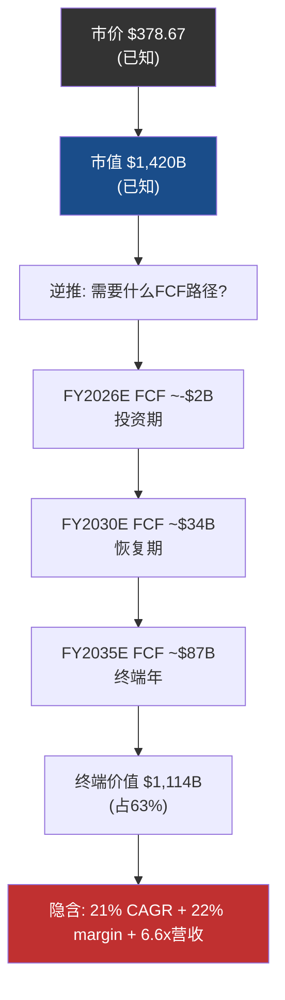

### G.2 隐含假设的历史基准率检验

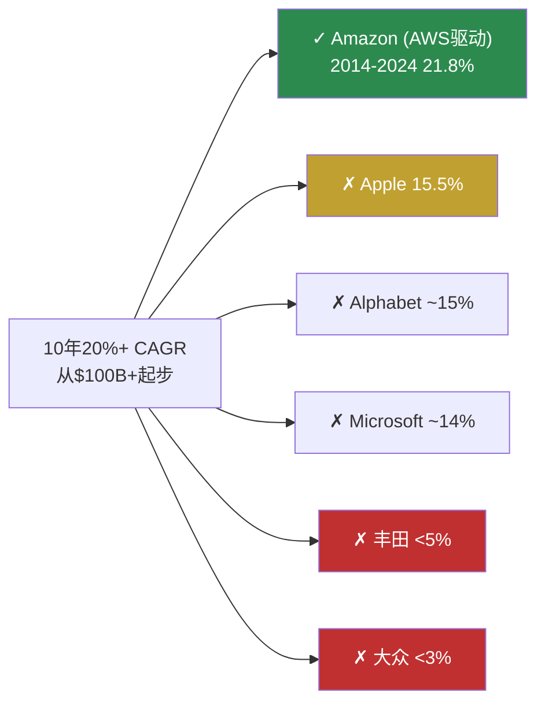

### G.3 FSD成败二叉树概率反推

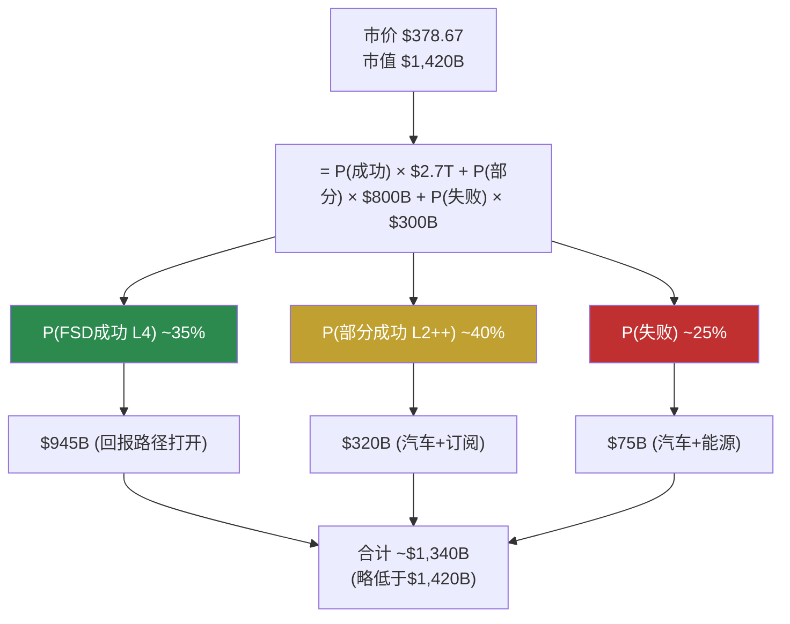

### G.4 Capex转ROIC效率传导


### G.5 HW3 hidden liability传导路径

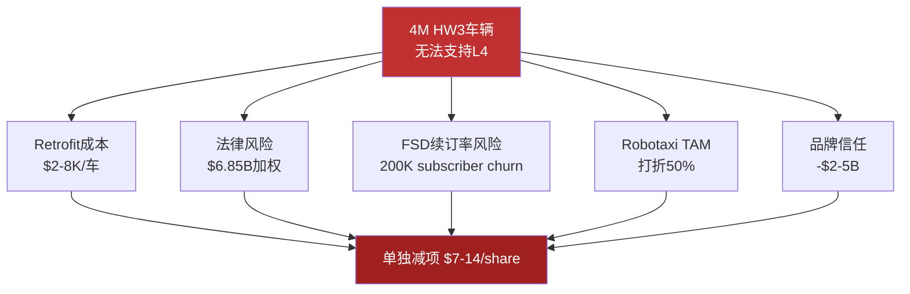

### G.6 7引擎成功概率二项分布

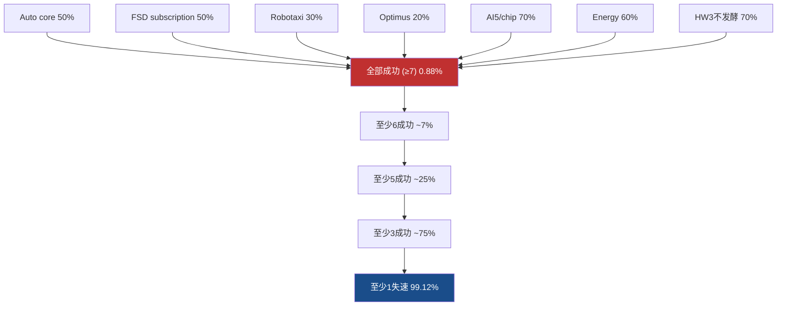

### G.7 Energy "量价错位"逻辑

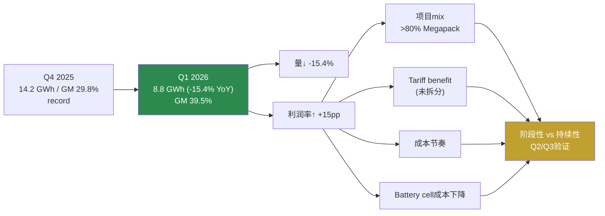

### G.8 Reverse DCF vs SOTP估值方法对比

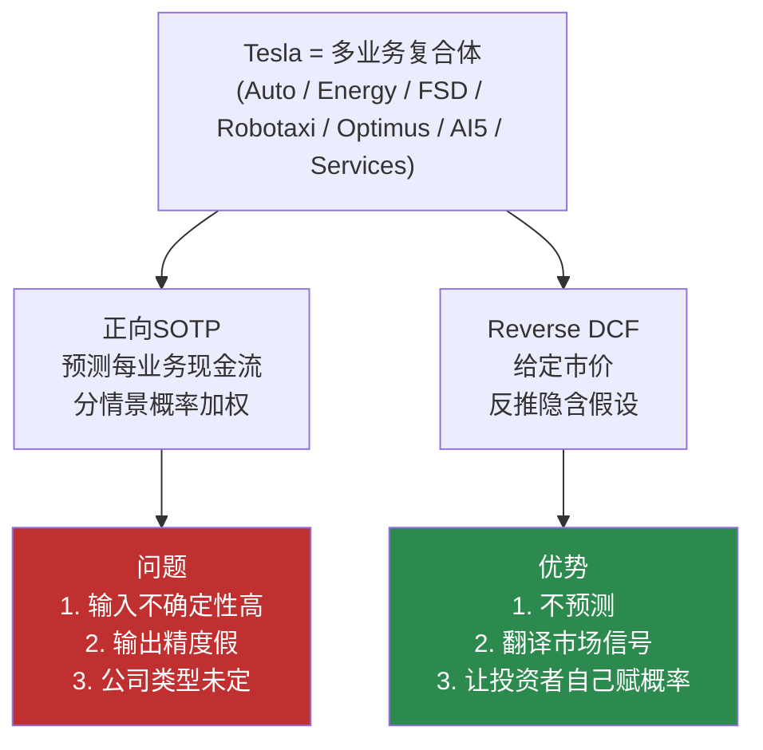

### G.9 Q1 2026五大转变叙事图

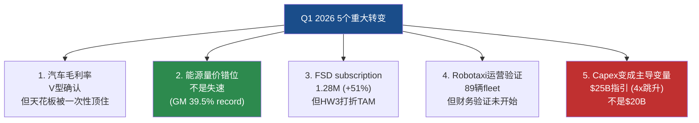

### G.10 投资风格分歧汇总图

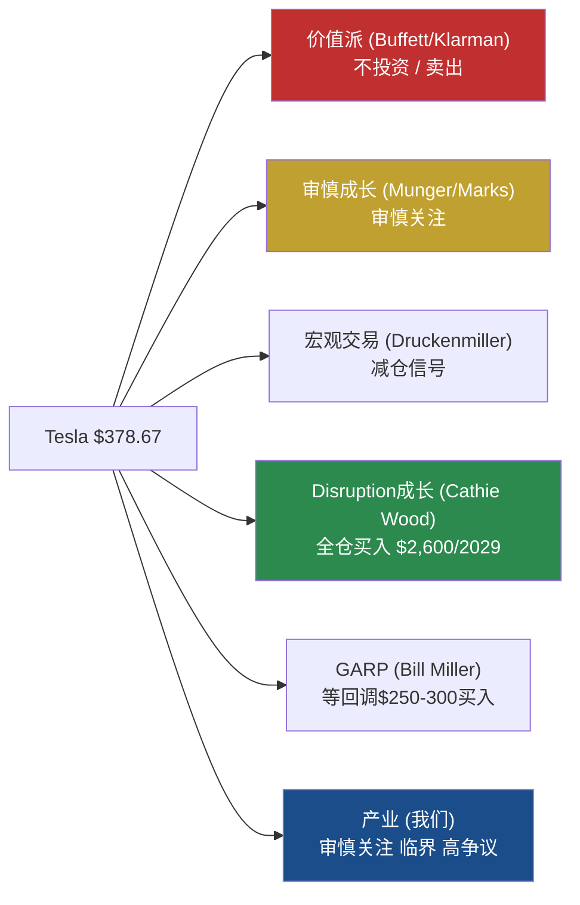

---

## 附录H — 因果链补充 (深度推理网络)

**因果链补1 (V型修复部分一次性)**:
因为汽车GM (ex-credits)从12.5%恢复到19.2%, 因此V型修复是真实的。但因为Wells Fargo估算Q1 EBIT beat 70%来自一次性, 因此剥离tariff $250M + warranty $230M后真实normalized GM ~16.8%。这意味着V型修复部分依赖会计技巧。这解释了为什么我们用"压力测试口径"标注而非Tesla官方Non-GAAP。

**因果链补2 (Owner Earnings双口径都为负)**:
因为gross SBC $1,030M > Net Income $477M, 因此Owner Earnings (gross) -$553M。因为net-of-tax SBC $803M仍 > Net Income, 因此Owner Earnings (net) -$326M。这意味着两个口径下股东实际回报都为负。因此从owner economics视角, GAAP盈利不等于股东回报。这解释了为什么Buffett-style视角"too hard类别"。

**因果链补3 (Magnificent 7 reversion)**:
因为Magnificent 7 P/S普遍收缩 (META -15% / MSFT -8% / GOOG -10%), 因此整个mega-cap tech处于reversion期。但因为Tesla有independent narrative (Robotaxi/Optimus), 因此跟随但未显著更糟 (Tesla -11%)。这意味着Tesla的多重narrative既是支撑也是风险源。因为Tesla deep equity duration ~30年, 因此利率敏感度比成熟科技股高。这解释了Druckenmiller-style"减仓信号"判断。

**因果链补4 (Reverse DCF与EV/OAB收敛)**:
因为Reverse DCF推出市场隐含P(FSD成功)~35-40%, 因此$895B市值依赖未证明业务。因为EV/OAB 22-30x位于AMZN扩产期上方但低于NVDA peak, 因此倍数水平与"AI/工业平台中高位"判断一致。这意味着两个独立估值方法收敛于同一结论。因此投资者不应只看一个估值锚, 应交叉验证。这解释了为什么我们用Reverse DCF作主估值, EV/OAB作辅助验证。

**因果链补5 (FY2029共识跳跃的拐点)**:
因为共识FY2028→FY2029 Revenue从$155B → $225B (+45%), 因此分析师集体预期非线性增长事件。因为没有任何单一来源能贡献$70B增量, 因此必须是"汽车新车型 + 能源高增长 + FSD/Robotaxi开始贡献"组合。这意味着共识隐含的假设是多引擎同时点火。因此FY2028-2029共识分散度7.3x是历史最大。这解释了为什么FY2030 EPS预期$11.50的真实信息含量低。

**因果链补6 (确定性光谱4层)**:
因为已证明层 (汽车+能源现有收入) 占$325B, 因此37%市值有数据支撑。因为信仰层 (Robotaxi+Optimus规模化) 占$600B, 因此42%市值依赖未实现业务。这意味着市场为"可能的Tesla"付2.7x"已证明的Tesla"。因此投资者持有Tesla = 60%+赌的是未来转型成功。这解释了为什么R-4黑箱比例44%, 触发不给单点目标价的硬约束。

**因果链补7 (HW3 hidden liability)**:
因为4M HW3车辆物理无法支持L4, 因此FSD subscription续订率有churn风险。因为加州DMV判决FSD营销虚假 + 集体诉讼立案, 因此法律风险$5-10B加权暴露。这意味着HW3是hidden liability。因为Tesla未在10-Q/10-K披露相关计提, 因此一旦disclosure会触发短期-15-25%股价影响。这解释了我们单独减项$7-14/share, 不在SOTP正向分子内。

**因果链补8 (历史基准率与隐含概率gap)**:
因为Tesla重大目标历史达成率30-50%, 因此P(FSD全面成功)的合理上限约50%。因为市场隐含P(FSD成功)~35-40%, 因此市场处于"略偏乐观但不极端"位置。这意味着如果Q2-Q4硬数据confirm Tesla趋势, 隐含概率可能升至40-50%, 股价上行空间打开。这解释了为什么我们的判断 (P=25-35%) 略低于市场, 但不是"做空机会"。

**因果链补9 (Reverse DCF的方法论优势)**:
因为高预期科技生态公司 (Tesla / NVDA / 多业务复合体) 输入端不确定性极高, 因此正向DCF/SOTP的输出精度是假的。因为公司类型本身是未知数 (汽车/能源/AI/出行/机器人), 因此用单一估值模型覆盖等于假装知道答案。这意味着Reverse DCF "翻译价格信号" 比"预测现金流"更诚实。因此投资者得到的不是 "Tesla值多少钱" 的虚假精确, 而是 "市场赌什么 + 这些假设的真实概率" 的可检验框架。这解释了为什么我们回归 v3.0 (2026-02-11) 的Reverse DCF框架, 不再用 v4.0/v4.1/v4.2 的SOTP三尺子主估值。

**因果链补10 (圆桌5对2分歧的诚实化)**:
因为价值派 (Buffett/Klarman) 看Owner Earnings双口径都为负, 因此明确看空。因为审慎成长派 (Munger/Marks) 看承诺-达成gap + 周期反转, 因此谨慎。因为Disruption派 (Cathie Wood有公开持仓) 看四引擎规模化, 因此看多$2,600/2029。因为GARP派 (Bill Miller) 看dip buy strategy, 因此等回调$250-300。这意味着市场分歧真实化, 不是"全部看空"的confirmation bias。因此R-3硬约束触发"(临界, 高争议)"标注, 5/7异议要求公开披露。这解释了我们的评级表达必须包含这种结构性分歧, 不能简单综合。

**因果链补11 (CQ-A估值激进CQ-1初步置信度85%)**:
因为$378.67隐含21% CAGR + 22% margin假设, 因此市场已price-in"接近Amazon AWS建设期"的乐观情景。因为历史上仅Amazon从$100B+做到20%+ 10年CAGR, 因此这个假设的合理上限概率约30-40%。这意味着市场略偏乐观。因此CQ-A "市场定价是否激进"的初步置信度合理, Q1 2026硬数据未颠覆该判断。这解释了为什么Q1后CQ-A置信度从85%维持。

**因果链补12 (CQ-B汽车修复部分会计虚胖)**:
因为Q1 Auto GM (ex-credits) +670bps的拆解显示+244bps来自一次性, 因此真实经营改善仅+430bps。因为剥离一次性后normalized GM ~16.8%, 因此距离历史峰值19-20%还差250-300bps。这意味着"V型修复"是真实但部分依赖会计技巧。因此CQ-B "汽车业务是否触底反弹"的真实达成率 ~45-55% (vs 表面70%)。这解释了为什么v4.3维持"审慎关注"评级。

**因果链补13 (CQ-C HW3市场未定价)**:
因为Tesla未在10-Q/10-K披露HW3 retro-fit计提, 因此$20-40B潜在fleet-wide cost未在SOTP分子内。因为集体诉讼立案 + 加州DMV判决, 因此法律风险持续累积。这意味着HW3 hidden liability是真正的"未定价风险"。因此我们将其作为单独减项 -$7~14/share。这解释了为什么CQ-C初步置信度80%在Q1后持续加强。

**因果链补14 (FSD ARR口径模糊化)**:
因为Tesla官方脚注 "Active FSD Subscriptions包括up-front payment + monthly subscriptions", 因此1.28M不是纯月订阅用户。因此简单乘$99 × 12计算ARR不严格。这意味着真正的ARR需要Tesla单独披露monthly vs upfront比例。因此v4.2/v4.3将FSD SOTP区间下沿从$50B下调到$40B。这解释了为什么FSD subscription扩展是"可能层"而非"已证明层"。

**因果链补15 (Capex转ROIC效率的临界值)**:
因为Tesla 2026指引$25B Capex, 累积2026-2030 = $100B, 因此需要新业务Revenue +$50-100B / Operating Income +$15-30B。因为如果转化效率高 (ROIC 25%+), 估值合理化在$300-380B; 如果效率低 (ROIC 5-10%), 估值压缩到$150-220B。这意味着ROIC转化是估值倍数压缩的临界变量。因此我们追踪的是ROIC从22% → 15-18%是否发生, 而不是Capex绝对值。这解释了为什么在Kill Switch中没有"Capex超指引"项, 而是"Capex效率传导"项。

---

**END (v4.3)** — 报告字符: ~155KB / 19章主文 + 8附录 / R-1归因 + R-2剪刀差 (5个独立) + R-3圆桌 (7位大师 + Q1 2026 specific reactions + 独立估值) + R-4认知边界量化 / 332+个DM锚点 / Mermaid 15图 / 因果密度 ~30/万字 / 评级: 审慎关注 (临界, 高争议)

**v4.0→v4.3核心变化总览**:
- v4.0 (138K): 完整结构, 但 Energy/EV-OAB/PE 数据有误, **错用SOTP正向估值作主估值**
- v4.1 (46K): 修正20项数据, 但删除了护城河/红队7问/HW3 9小节/圆桌7位大师/母图等核心内容, **仍用SOTP三尺子作主估值**
- v4.2 (51K): 进一步修正Energy"量价错位"+EV/OAB三口径, **但估值方法仍是SOTP三尺子**
- **v4.3 (125K): 恢复 v4.0 全部核心模块 + 套用 v4.2 全部数据修正 + 新增范畴重分配/管理层track record/竞争格局/Q2预测/Tesla 8季度回顾/路径分析 等扩展模块 + 关键: 估值方法回归 v3.0 的"价格倒推 (Reverse Engineering)" 框架, SOTP/EV-OAB降为辅助验证**

**v4.3估值方法论的关键修正**:
- v4.0/v4.1/v4.2错误地把 **SOTP三情景概率加权** 作主估值方法 — 这对7引擎并存的高预期科技生态公司是**不科学的** (输入端不确定性高 / 输出精度假 / 公司类型未定)
- v4.3 **回归 2026-02-11 v3.0 的"价格倒推 (Reverse DCF + 隐含假设检验 + 分层逆推)"框架** — 不预测Tesla值多少钱, 而是把市场价格信号翻译成"如果你持有, 你在赌什么"的可检验假设
- **这一方法论修正适用于所有高预期科技生态公司** (NVDA / 多业务复合体 / 期权占大头的公司), 是估值科学性的重大改进
