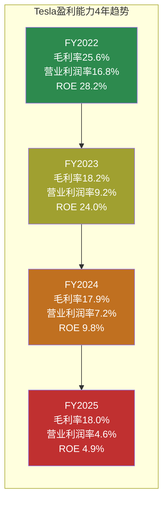
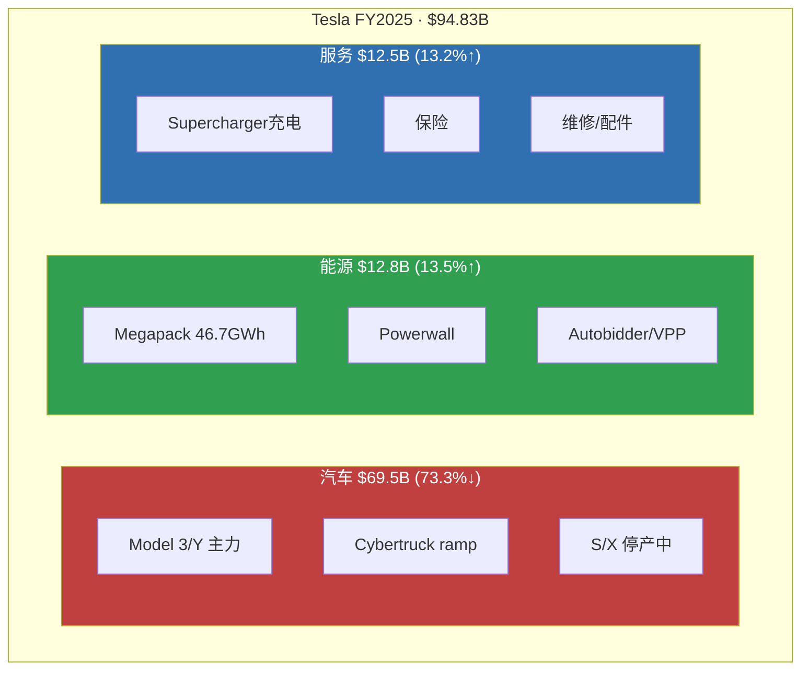
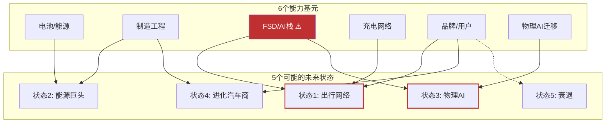
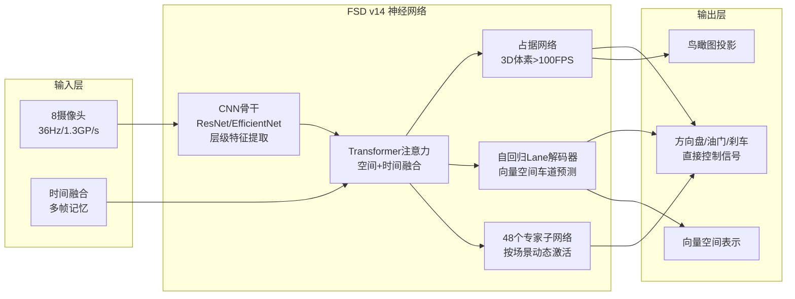
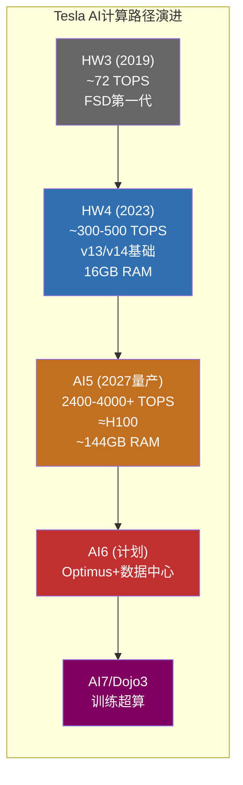
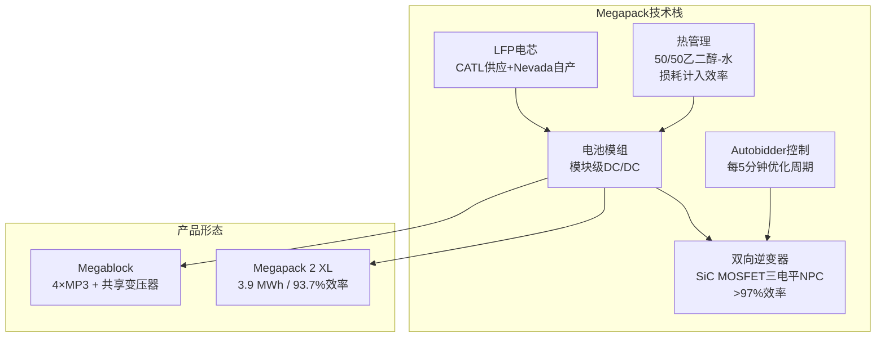
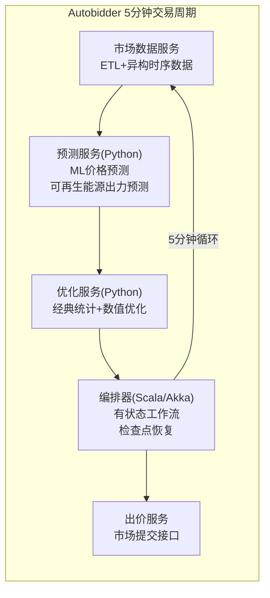
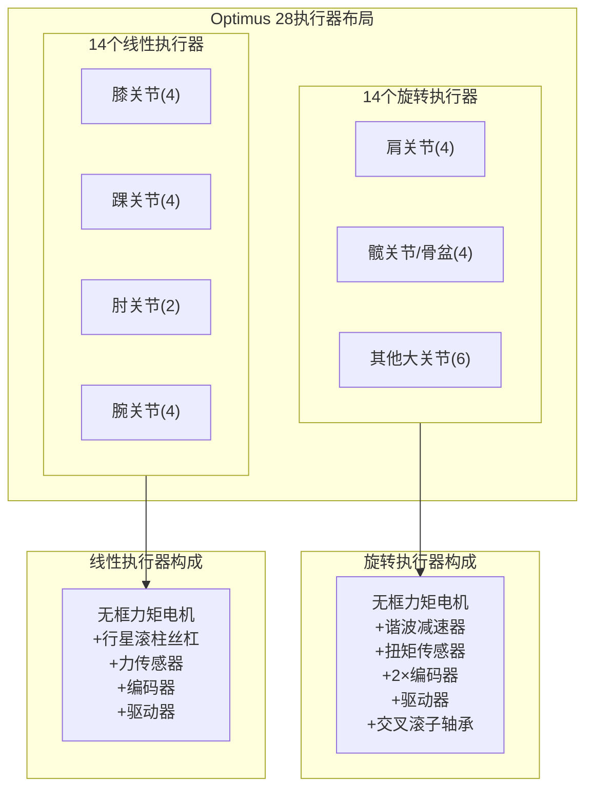
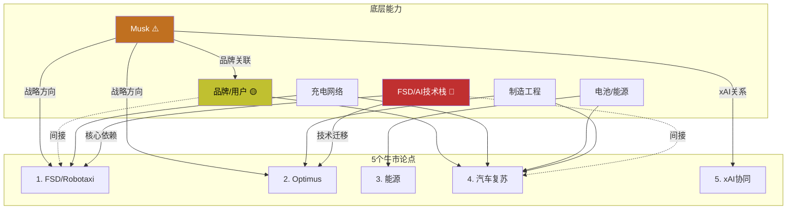

# Tesla (TSLA) — 发现系统 v2.0

> **方法论**: 范式公司研究框架 v1.1 §8 动态研究框架
> **不确定性类型**: A型（类别不确定性）— "Tesla会变成什么公司？"
> **可能性宽度**: 9/10 → 发现系统（不给目标价，映射可能性空间）
> **数据截止**: 2026-02-11 | 价格: $425.21 | 市值: $1.414T
> **核心数据源**: Tesla 10-K FY2025 (2026-01-29), FMP财务API, Waymo公开数据, NHTSA, 行业技术文献

---

## 问题路由表（AI优势分类器）

| # | 问题 | 路由 | 理由 |
|---|------|------|------|
| Q1 | 纯视觉FSD的L4天花板在哪？ | **[深挖]** | 端到端架构拆解+物理约束推导=AI分析核心优势 |
| Q2 | Optimus BOM→售价gap能否闭合？ | **[深挖]** | 制造成本工程分解=跨行业技术对比的AI优势 |
| Q3 | Autobidder软件壁垒是否真实？ | **[深挖]** | ML交易平台架构分析+跨行业壁垒评估 |
| Q4 | 什么让所有牛市论点同时失效？ | **[深挖]** | 组合失败模式穷举+共模依赖识别=系统性思考优势 |
| Q5 | BYD在美欧的速度和深度？ | [呈现] | 数据整理，AI无独特优势 |
| Q6 | Cybercab需求验证？ | [呈现] | 未来数据，需等硬事件 |
| Q7 | $20B+ CapEx回报周期？ | [呈现] | 需Q2'26起的FCF数据 |
| Q8 | Musk注意力分配？ | **[诚实]** | 人的行为不可预测，AI无法可靠回答 |
| Q9 | xAI协同是真实的吗？ | [呈现] | 需等合并/排除事件 |
| Q10 | Tesla 5年后是什么公司？ | **[诚实]** | A型不确定性的核心——不知道，只能映射可能性 |

**[深挖]**: AI有真实分析优势的问题 → 投入最大精力
**[呈现]**: AI可以整理数据但无独特洞察 → 呈现事实框架
**[诚实]**: AI无法可靠回答 → 明确标注局限

---

# Part 1: 今天的公司

> **方法论**: 只描述"是什么"，不判断"好不好"。每个数字标注来源。为Part 2的演绎推理建立事实基础。

---

## 1.1 财务快照

Tesla今天是一家**营收首次下滑、利润腰斩、但现金充裕且在激进投资未来**的公司。

### 年度核心指标

| 指标 | FY2025 | FY2024 | FY2023 | FY2022 | 趋势 |
|------|--------|--------|--------|--------|------|
| 营收 | $94.83B | $97.69B | $96.77B | $81.46B | 首次↓ [硬数据: FMP income] |
| 营收YoY | **-2.93%** | +0.95% | +18.80% | — | 减速→负增长 |
| 毛利率 | 18.03% | 17.86% | 18.24% | 25.60% | 从26%→18% [硬数据: FMP] |
| 营业利润率 | 4.59% | 7.24% | 9.19% | 16.76% | 3年下降12pp [硬数据: FMP] |
| 净利润 | $3.79B | $7.13B | $15.00B | $12.58B | FY23峰值后腰斩 [硬数据: FMP] |
| EPS(稀释) | $1.08 | $2.04 | $4.31 | $3.62 | -75% from peak [硬数据: FMP] |
| R&D/Rev | 6.76% | 4.65% | 4.10% | 3.77% | 研发投入强度↑ [硬数据: FMP] |

### 季度趋势（最近4季度）

| 指标 | Q4'25 | Q3'25 | Q2'25 | Q1'25 |
|------|-------|-------|-------|-------|
| 营收 | $24.9B | $28.1B | $22.5B | $19.3B | [硬数据: FMP quarterly] |
| 毛利率 | **20.12%** | 17.99% | 17.22% | 16.31% | [硬数据: FMP quarterly] |
| 净利润 | $840M | $1,373M | $1,172M | $409M | [硬数据: FMP quarterly] |
| EPS | $0.24 | $0.39 | $0.33 | $0.12 | [硬数据: FMP quarterly] |

Q4毛利率回升至20%是FY2025唯一的正面拐点信号。但净利润$840M是4季度第二低(仅高于Q1)。[合理推断: 毛利率改善被R&D/SGA费用增长抵消——Q4 R&D $1.78B创单季新高]

### 资产负债表

| 指标 | FY2025 | 信号 |
|------|--------|------|
| 现金+等价物 | $16.51B | [硬数据: FMP balance] |
| 总资产 | $137.81B | [硬数据: FMP balance] |
| 总债务 | $8.38B | 低杠杆 [硬数据: FMP balance] |
| 总权益 | $82.86B | [硬数据: FMP balance] |
| D/E | 0.10 | 极低杠杆 [硬数据: MCP baggers] |
| 流动比率 | 2.16 | 健康 [硬数据: MCP baggers] |
| Altman Z | 16.24 | 远超安全线 [硬数据: MCP baggers] |

### 杜邦分析

ROE **4.89%** = 净利率 4.00% × 资产周转 0.73x × 权益乘数 1.68x [硬数据: MCP baggers]

三个驱动因素全部恶化: 净利率从15.5%(FY2023)降至4.0%, 资产周转从0.91x降至0.73x。ROIC从21.75%(FY2022)降至6.60%(FY2025)。[硬数据: FMP key-metrics]



---

## 1.2 业务三支柱

FY2025收入构成揭示了从"汽车公司"向"三支柱"的结构转变：

| 业务 | FY2025收入 | 占比 | YoY | 趋势 |
|------|-----------|------|-----|------|
| **汽车** | $69.53B | 73.3% | **-10%** | 收缩 [硬数据: Tesla 10-K] |
| **能源** | $12.78B | 13.5% | **+27%** | 加速增长 [硬数据: Tesla 10-K] |
| **服务** | $12.53B | 13.2% | **+19%** | 稳健增长 [硬数据: Tesla 10-K] |



汽车占比从FY2022的~89%降至73%。能源+服务合计$25.3B(26.7%)。[硬数据: Tesla 10-K]

储能部署量：14.7 GWh(FY2023) → 31.4 GWh(FY2024) → **46.7 GWh**(FY2025, +49%) [硬数据: Tesla 10-K]。这是连续3年接近翻倍。

---

## 1.3 竞争事实

**只列事实，不评价。**

| 竞争维度 | 事实 | 来源 |
|---------|------|------|
| BYD全球BEV销量 | 454万辆(2025), 纯电市占12.1% vs Tesla 8.8% | [合理推断: 行业报告] |
| Waymo L4运营 | 127M+无人驾驶英里, 450K+周rides, 6+城市 | [硬数据: Waymo Safety Impact] |
| Waymo安全数据 | 严重伤亡事故比人类驾驶少**90%** (同行评审) | [硬数据: Tandfonline 2025] |
| Tesla FSD状态 | L2+监督驾驶, Austin有限试点, 1.1M付费用户 | [硬数据: Tesla 10-K] |
| 储能竞争 | BYD HaoHan 14.5MWh/unit, Fluence IQ 47国部署 | [合理推断: 公开产品信息] |
| 人形机器人 | Figure 02已在BMW工厂部署11个月, BD Atlas CES 2026量产版 | [硬数据: 公开报道] |
| 充电标准 | Tesla NACS成为SAE J3400行业标准 | [硬数据: SAE] |

---

## 1.4 管理层行动 vs 未兑现承诺

| 已做（事实） | 未做（事实） |
|-------------|-------------|
| 停产Model S/X → 产线改造 | FSD L4无监督驾驶未获任何监管批准 |
| FSD $99/月订阅(2026.02.14上线) | Robotaxi大规模商业运营未启动 |
| 2026 CapEx指引 >$20B (FY25的2.4x) | Dojo $5B+投入→2025.08关闭 |
| xAI投资$2B | Optimus零外部客户(仅内部1000+台) |
| Austin Robotaxi试点+移除跟随车 | $25K低价车多次承诺未上市 |
| 上海Megafactory投产 | "百万Robotaxi车队"(2020承诺)未实现 |
| Gen3 Optimus 2026.01.21启动量产 | Semi量产未达预期规模 |

[硬数据: Tesla 10-K, 财报电话会]

**Polymarket活跃市场** (截至2026-02-11):
- Tesla Robotaxi加州launch by Jun 30 | Tesla-xAI merger by Jun 30 | Musk out as CEO before 2027 [硬数据: Polymarket]

---

## 1.5 可能性宽度评估

| 维度 | 评分 | 依据 |
|------|:----:|------|
| 收入结构 | **2** | 汽车73%下降；能源、FSD、Robotaxi、Optimus均为不同阶段业务线 |
| 商业模式流动性 | **2** | 汽车→能源→出行→机器人→AI，持续进入全新领域 |
| CEO期权思维 | **2** | Musk同时下注5+条赛道 |
| 市场定价偏离 | **2** | P/E 385.70x, EV/EBITDA 113.72x [硬数据: MCP baggers] |
| TAM不确定性 | **1** | 汽车TAM可算；Robotaxi/Optimus/AI的TAM无法定义 |
| **总分** | **9/10** | → **发现系统** |

**不确定性类型: A型（类别不确定性）** — 核心问题是"Tesla会变成什么公司？"

---

## 1.6 能力基元

Tesla拥有6个可独立组合的底层能力。Part 2的演绎推理基于这些基元。

| 能力基元 | 当前状态 | 独特性 | 共享依赖 |
|---------|---------|--------|---------|
| **电池/能源** | LFP(CATL)+4680, Megapack 46.7GWh | 制造规模+Autobidder软件 | 独立 |
| **制造工程** | Gigacasting+Unboxed, 5工厂 | 速度优势 | 独立 |
| **FSD/AI栈** | 端到端NN(10x v13), 60B+英里数据 | 数据量最大 | **共享: 状态1+3** |
| **充电网络** | Supercharger全球最大, NACS标准 | 事实标准 | 独立 |
| **品牌/用户** | 400M+车主, 高忠诚度但极化加剧 | — | **共享: Musk风险** |
| **物理AI迁移** | FSD→Optimus技术复用 | 唯一同时做AD+robot的公司 | **依赖: FSD/AI栈** |



**⚠️ FSD/AI栈是关键共享依赖**: 状态1和状态3都依赖FSD/AI技术栈成功。如果该基元失败，两个最高期权状态同时关闭。

---

*Part 1完。以上是事实基础。Part 2将从能力基元出发，用演绎法推导Tesla可能的公司形态，重点在技术路线深度分析。*

---

# Part 2: 公司可能成为什么

> **不确定性类型**: A型（类别不确定性） — "Tesla会变成什么公司？"
> **方法**: 能力基元 → 未来状态推演 → 每个状态嵌入技术路线深度分析
> **原则**: 在AI有优势的技术分析领域深挖，诚实标注不知道的领域

---

## 2.1 从能力基元到未来状态的演绎

Tesla拥有6个可独立组合的能力基元（Part 1.6）。**并非所有基元等权**: FSD/AI技术栈是最大的共享依赖——它同时是状态1和状态3的前提条件。

以下5个状态不是"同一个Tesla乘以不同增速"，而是**质的不同的公司形态**。每个状态下嵌入该领域的技术路线深度分析。

---

## 2.2 状态1: 自动出行网络运营商

**内在逻辑**: FSD L4 → Cybercab无人驾驶 → 按里程收费 → 出行+物流网络
**依赖的基元**: FSD/AI栈(核心) + 充电网络 + 品牌

### 技术深度: FSD v14 端到端架构

#### 架构总览

FSD v14是一个**混合拓扑的巨型神经网络**——将感知、规划、导航全部端到端化。[硬数据: Electrek, NotATeslaApp, ThinkAutonomous]



#### v13→v14的关键技术跃迁

| 维度 | FSD v13 | FSD v14 | 意义 |
|------|---------|---------|------|
| NN规模 | ~1x基准 | **10x**(跳过4x中间版本) | 推理需~12.5GB显存 [硬数据: NotATeslaApp] |
| 导航 | 依赖外部地图API | **集成到视觉NN内部** | 网络自行推断路线和绕行 [硬数据: Electrek] |
| 车道预测 | 密集栅格("点包") | **自回归Transformer解码器** | 预测交叉车道+联合多信号 [硬数据: AutoPilot Review] |
| 摄像头 | HW4降采样 | **HW4全部原生分辨率** | 前摄2896×1876 vs HW3的1280×960 [硬数据: Wikipedia Tesla Autopilot HW] |
| 吞吐量 | ~500 fps(全8摄像头) | **>1000 fps**(全8摄像头) | 2倍推理速度 [硬数据: TeslaMagz] |

#### 48个专家子网络

FSD v14不是单一端到端模型。它部署**48个独立的神经网络**协同工作，每个是不同驾驶子任务的专家(如变道决策、交叉路口处理、障碍物避让等)，按场景动态激活。[硬数据: ApplyingAI]

[合理推断: 这种"混合专家"(MoE)架构有两个重要含义: (1) 不是所有参数同时活跃，实际推理算力低于全参数推理; (2) 可以单独更新某个子网络而不影响整体——类似微服务架构的优势]

#### 训练方法论

两阶段训练流程 [硬数据: ThinkAutonomous]:

1. **模仿学习(基础)**: 从全球车队(~4M+辆)的约1000万视频片段中训练。驾驶员按质量分级，网络学习"好司机"行为。每个完整训练周期需约**70,000 GPU小时**，处理超过**1.5 PB驾驶数据**。
2. **强化学习(精化)**: 通过数千个模拟"如果"场景强化鲁棒行为。

#### Cortex训练集群

| 阶段 | 硬件 | 规模 |
|------|------|------|
| Q4 2024 | NVIDIA H100 | 50,000 GPU投入运行 [硬数据: DataCenterDynamics] |
| Q2 2025 | 追加NVIDIA H200 | +16,000 GPU, 总计~67,000 H100等效 [硬数据: DataCenterDynamics] |
| 目标 | H100+H200 | ~100,000 GPU [合理推断] |

[硬数据: 没有B200(Blackwell)部署在Tesla的Cortex。B200用于Musk另一个实体xAI的Memphis超级集群。]

#### Dojo失败的技术根因

Dojo项目于**2025年8月关闭**，负责人Peter Bannon离职，约20人团队创立DensityAI。总投入$5B+。[硬数据: TechCrunch, Bloomberg]

**四个技术失败原因**:

1. **内存架构瓶颈**: D1芯片由354个功能单元组成，每个仅**1.25 MB SRAM且无DRAM**。总片上内存远低于HBM堆叠的GPU方案。[硬数据: Tom's Hardware]
2. **晶圆级封装复杂度**: D1使用整片晶圆=单个"芯片"(wafer-scale integration)。引发级联问题——良率控制、基板键合、功率分配、散热和热变形在所需可靠性水平下均未解决。[硬数据: Tom's Hardware]
3. **软件成熟度不足**: Tesla必须从零构建训练框架、优化编译器、确保数千网络连接的稳定性——本质上是重新实现CUDA/cuDNN生态。[合理推断: 基于Dojo团队公开谈话]
4. **竞争性过时**: Dojo 1集群算力约等于~8,000个H100——NVIDIA以~2x/年的速度改进，且拥有成熟生态锁定。[合理推断: 基于性能对比]

**核心教训**: 同时挑战晶圆级硬件+全新软件栈+对抗摩尔定律，三线作战的失败概率极高。Cerebras是唯一做成晶圆级集成的公司，且他们也在训练负载上举步维艰。[合理推断]

#### Dojo 3: 战略转向

2026年1月，Musk宣布重启Dojo 3 [硬数据: Tom's Hardware, Dataconomy]:
- 使用**AI5/AI6/AI7**芯片而非原D1/D2架构
- Tesla首个**全自研硬件**超级计算机(无NVIDIA依赖)
- Musk: "AI5, AI6及后续芯片推理出色，**训练至少不错**"
- 计划**9个月芯片发布节奏**: AI5 → AI6(用于Optimus和数据中心) → AI7/Dojo3

[合理推断: Dojo 3的经济逻辑与原Dojo完全不同——如果Tesla为数百万辆车生产AI5芯片，分流部分用于训练的边际成本低，即使单芯片训练效率不及NVIDIA。这是"以量取胜"而非"以性能取胜"的策略。]

### 技术深度: AI5推理芯片

| 参数 | HW4 (AI4) | AI5 | 倍数 |
|------|-----------|-----|------|
| 算力 | ~300-500 TOPS | 2400-4000+ TOPS | **8x** [硬数据: Musk Q3'25 earnings] |
| 内存 | 16 GB | ~144 GB | **9x** [硬数据: Musk Q3'25 earnings] |
| 内存带宽 | — | 5x HW4 | **5x** [硬数据: Musk Q3'25 earnings] |
| 综合性能 | 基准 | **高达40x** | [硬数据: Musk claim, Tom's Hardware] |
| 峰值功耗 | ~100W | ~800W | 8x |
| 等效算力 | — | ≈单颗NVIDIA H100 | [硬数据: NotATeslaApp] |
| 制程 | — | Samsung SF2/SF3P(2nm级) + TSMC 3nm | [硬数据: TrendForce, Tom's Hardware] |
| 芯片尺寸 | — | 半个光罩(half-reticle)，约NVIDIA芯片一半 | [硬数据: Tom's Hardware] |
| 量产 | 现有 | 2H 2026 risk production, **2027 volume** | [硬数据: NotATeslaApp] |



**40x算力对FSD的意义**:
- 当前v14的10x模型已挑战HW4的16GB RAM极限
- AI5的144GB内存可运行**50-100B+参数**模型 [合理推断]
- 可同时运行多个冗余网络——这是L4安全所需的计算冗余基础 [合理推断]
- 实时世界模型推理(时序场景预测)成为可能 [合理推断]

### 技术深度: 纯视觉物理约束

#### 演绎链

```
前提1: 摄像头是被动光学传感器，依赖可见光反射 → 有物理约束
前提2: L4要求在所有ODD内无需人类接管 → 包括极端天气
前提3: 存在场景使摄像头信噪比低于安全阈值 → NN无法从噪声恢复信息(信息论极限)
前提4: NHTSA 2025.10 对FSD开展初步评估，明确针对降低能见度事故
→ 推论: 纯视觉方案在物理层面存在ODD天花板
```

#### 三个硬物理限制

**1. 暴雨/浓雾**: 水分子Mie散射可见光。能见度<100m时，基于摄像头的深度估计误差与1/能见度大致成正比。大雨(~25mm/hr)可使摄像头有效探测距离减少30-50%。[合理推断: 物理原理+工程文献]

**2. 强逆光**: CMOS动态范围有限(~120dB最优)。太阳在摄像头光轴±15°内时，传感器饱和产生"泛光"伪影，可使目标检测失效数秒。HW4的HDR摄像头部分缓解但无法消除直射阳光场景。[合理推断: 传感器物理]

**3. 共模失效**: 8个摄像头基于同一物理原理(可见光)。一个极端天气场景可能同时使所有8个摄像头退化——这不是"冗余"，因为失效模式是共模的。[合理推断: 工程可靠性原理]

#### NHTSA调查

[硬数据: NHTSA 2025.10]: 对约240万辆Tesla开展初步评估，针对降低能见度条件下的事故。四起调查事故发生在: 阳光眩光、雾、空气中灰尘场景。

[硬数据: Tesla此前已移除超声波传感器(2022)和雷达(2021-2022)]。当摄像头退化时，零传感器后备。系统显示"FSD可能降级——检测到恶劣天气"并可能脱离。

#### 补偿机制

Tesla应对视觉限制的技术路径 [硬数据: Tesla技术演示+公开资料]:

- **时间融合**: 维持多帧持久空间模型；雨滴暂时遮挡目标时可"记忆"其位置数帧
- **占据网络**: 3D体素空间建模(>100 FPS)，对部分遮挡比2D边界框检测更鲁棒
- **世界模型(开发中)**: 预测场景演化，减少对瞬时视觉清晰度的依赖

[合理推断: 这些补偿对间歇性退化有效(短暂雨滴、瞬间眩光)，但无法克服持续性传感器失效(浓雾、持续直射阳光)。世界模型可预测~2-3秒；超出后误差快速累积。]

### 技术深度: Waymo技术对照

#### Waymo 6代硬件传感器架构

| 传感器类型 | 5代数量 | 6代数量 | 变化 |
|-----------|---------|---------|------|
| 摄像头 | 29 | 13 | -55% [硬数据: Waymo Blog 2024.08] |
| LiDAR | 5 | 4 | -20% |
| 雷达 | 6 | 6 | 不变 |
| 音频传感器(EAR) | 无 | 新增 | 新增 |

关键: **500米探测范围**，360度重叠视场，昼夜运行。[硬数据: Waymo]

#### 架构哲学对比

| 维度 | Tesla FSD v14 | Waymo 6代 |
|------|-------------|----------|
| **传感器** | 8摄像头(纯视觉) | 13摄像头+4 LiDAR+6雷达+音频 |
| **架构** | 端到端单NN(像素→控制) | 编码器-解码器，每传感器独立特征+融合 |
| **地图** | 无HD地图，NN推断路面结构 | 预制HD地图+实时传感器验证 |
| **冗余** | 无(单模态) | 三重冗余(3种模态) |
| **天气鲁棒性** | 雨/雾/眩光退化，可能脱离 | LiDAR/雷达后备维持运行 |
| **每车成本** | ~$2,000-5,000 (HW4+摄像头) | ~$50,000+(全传感器套件) [合理推断] |
| **自动化等级** | L2+(有监督) | **L4**(无人驾驶，地理围栏) |
| **安全验证** | 自报告，5秒归因窗口 | **同行评审**，127M+无人英里 [硬数据: Tandfonline 2025] |

#### 安全数据不可直接比较

[硬数据: Waymo]: 严重伤亡事故比人类少90%，行人伤亡事故少92%。数据经同行评审、独立验证。

[硬数据: Tesla FSD]: 主要碰撞间隔~290万英里(vs全美驾驶员50.5万英里/NHTSA)。但Tesla仅计FSD激活**5秒内**的碰撞(NHTSA SGO报告窗口是30秒)。

[合理推断: 统计不可比——Waymo在预映射城市区域L4运行，Tesla FSD作为L2+在所有道路类型运行(且通常在简单路段激活)。]

### 状态1的核心观测信号

| 信号 | 含义 | 追踪方式 |
|------|------|---------|
| Tesla在任何车型增加非摄像头传感器 | 内部承认纯视觉天花板 | 拆解报告/FCC备案 |
| FSD极端天气接管率持续不降 | 技术进步停滞 | 第三方安全测试 |
| NHTSA对纯视觉L4给予豁免(或不给) | 监管方向 | 联邦公报 |
| Austin试点扩展速度 vs Waymo新城市速度 | 竞争路径效率 | 公开运营数据 |
| AI5量产后v15/v16的能力跃迁 | 40x算力能否突破视觉天花板 | FSD beta更新 |

---

## 2.3 状态2: 能源基础设施巨头

**内在逻辑**: 储能规模化 → Autobidder成能源交易平台 → VPP聚合百万家庭 → 虚拟电力公司
**依赖的基元**: 电池/能源(核心) + 制造工程 — **不依赖FSD** ✅

### 技术深度: Megapack硬件架构

#### 电芯与供应链

[硬数据: Wikipedia Megapack, 行业报告]: Megapack 2使用**LFP(磷酸铁锂)棱柱电芯**，从Megapack 1的NMC化学体系转型。LFP选择理由：4000+循环寿命、热稳定性优越、成本更低——储能场景不需要NMC的能量密度。

[硬数据]: 主要电芯供应商为**CATL**(中国)。Tesla同时在**Sparks, Nevada**建设国内LFP电芯产线，使用CATL设备和湿法涂覆工艺。

#### 产品矩阵

| 参数 | Megapack 1 | Megapack 2 | Megapack 2 XL |
|------|-----------|-----------|---------------|
| 能量容量 | 2.6 MWh | 3.0 MWh | **3.9 MWh** (+50% vs MP1) |
| 额定功率 | 1.25 MW | ~1.5 MW | 3.9 MW(峰值) |
| 往返效率 | ~90% | ~92% | **93.7%** |
| 逆变器 | — | SiC MOSFET | SiC MOSFET, 三电平NPC拓扑, >97%峰值效率 |

[硬数据: Tesla Megapack数据表, PV Magazine]

每个Megapack是预组装、自包含单元(~8.5m宽, ~3m高)，内含：电池模组、双向逆变器、热管理系统、AC主断路器和控制系统。模块级DC/DC变换器使部分故障时仍可继续运行。[硬数据: Tesla支持页面]

**Megapack 3 / Megablock**: 2025年9月发布，2026年底可用。一个**Megablock**由最多4个Megapack 3单元组成，共享变压器和开关设备——Tesla向交钥匙变电站级产品迈进。[硬数据: Tesla公告]

#### 热管理系统

[硬数据: Tesla支持文档]: 位于每个单元顶部，循环50/50乙二醇-水冷却液混合物。HVAC能耗已计入公布的往返效率数字中——这是有意义的设计优势，竞品通常报价效率时不计热管理损耗。

#### Megafactory产能

| 工厂 | 位置 | 状态 | 年产能 |
|------|------|------|--------|
| Megafactory 1 | Lathrop, CA | 运营中 | 10,000 Megapacks / **40 GWh** |
| Megafactory 2 | 上海 | 运营中(2025.02) | 10,000 Megapacks / **40 GWh** |
| Megafactory 3 | Brookshire, TX | 破土，目标2026年中 | ~12,500 Megapacks / **50 GWh** |

[硬数据: Drive Tesla, EVXL]: 当前组合产能**80 GWh/年**，Texas工厂投产后升至**130 GWh/年**。

上海Megafactory在2025日历年生产2,000+个Megapacks，最后5个月产量翻倍。首批出口至澳大利亚。[硬数据: Drive Tesla]



### 技术深度: Autobidder软件架构

#### 微服务架构

[硬数据: InfoQ Tesla VPP演讲, Kai Waehner]: Autobidder由**~150个多语言微服务**组成，跨三个API域：遥测查询、资产关系、设备控制。

| 技术组件 | 选型 | 角色 |
|---------|------|------|
| 主要语言 | **Scala** | 类型安全+Akka集成 |
| ML语言 | **Python** | 预测+优化服务 |
| 通信 | **gRPC + Protobuf** | 严格合约 |
| 异步消息 | **Amazon SQS** | Scala-Python组件间持久异步 |
| 容器编排 | **Kubernetes** | Pod管理 |
| 容错 | **Akka** | 细粒度故障处理(熔断、重试) |
| 流处理 | **Akka Streams** | 有状态事件处理(Actor模型) |
| 事件流 | **Apache Kafka** | 万亿级IoT消息，Powerwall每秒遥测 |
| 时序存储 | **InfluxDB** | 客户生命周期遥测保留 |
| 关系存储 | **Postgres** | 设备关系+业务系统统一 |

[硬数据: InfoQ, Kai Waehner]

#### 核心服务



[硬数据: Tesla支持页面, InfoQ]:
1. **编排器微服务**: 执行每5分钟市场周期的竞价工作流。使用Akka持久化实现有状态工作流+检查点故障恢复。
2. **市场数据服务**: 抽象化复杂输入数据ETL(不同时序对齐市场周期)。
3. **预测+优化服务**: Python ML模型进行价格预测和可再生能源发电预测。
4. **出价服务**: 对接市场提交系统。

#### 市场覆盖

[硬数据: Tesla Autobidder支持页面]: 在**9个美国ISO/RTO**运营: ERCOT, SPP, MISO, PJM, NYISO, ISO-NE, SERC, WECC, CAISO。在多个市场提供完整QSE(合格调度实体)服务。

[硬数据: Modo Energy]: Autobidder管理的项目在ERCOT连续两年(2022-2023)收入($/kW-年)排名**第一**。

#### vs 传统SCADA/EMS

[合理推断: 基于架构分析]:

| 维度 | 传统SCADA/EMS | Autobidder |
|------|-------------|-----------|
| 数据采集 | 轮询，4秒扫描间隔 | 事件驱动，毫秒级(Kafka) |
| 协议 | DNP3, IEC 61850(专有) | gRPC/Protobuf(现代) |
| ML能力 | 无原生ML | ML预测嵌入核心循环 |
| 部署 | 本地部署 | 云托管 |
| 优化范围 | 单个电厂 | 分布式资产车队+市场信号 |
| 目标 | 物理调度 | **市场参与+收益最大化** |

### 技术深度: VPP虚拟电厂

#### 三层软件架构

[硬数据: InfoQ Tesla VPP演讲]:

| 层级 | 组件 | 角色 |
|------|------|------|
| 底层 | **Powerhub** | 智能桥接——安全连接每户系统到电网 |
| 中层 | **Opticaster** | AI优化引擎——实时预测+优化，平衡电力公司需求与客户偏好 |
| 顶层 | **Autobidder** | 面向批发电力市场的竞价调度 |

#### VPP集群架构

[硬数据: InfoQ]: 部署在Akka集群上的三种Pod角色:

1. **流处理器(Stream Processors)**: 消费Kafka消息(Akka Streams带反压，有界资源使用)
2. **Actor集群**: 将数千个独立站点建模为**数字孪生**+层级聚合(内存中Actor关系)。每个站点是状态机(电池电量/通信状态/运行模式)，父Actor通过内存消息聚合子遥测。
3. **API Pods**: 通过位置透明性查询集群，服务客户端请求

控制循环: **测量→预测→优化→控制**，持续运行。

#### 规模与部署

| 区域 | 状态 | 规模 |
|------|------|------|
| 加州 | 运营中 | ~100,000户电池, 提供**535 MW**容量(新纪录, 2025.07) [硬数据: Tesla Energy on X] |
| 德州(ERCOT) | 试点中(Tesla Electric) | 未公开 |
| 澳大利亚 | 运营中(2018起) | 50,000户(2022), AGL 2025收购(25MW太阳能+37MW储能) |
| 英国 | 2025.07启动 | Tesla首个英国VPP项目 |

[硬数据: Electrek]: Tesla通过VPP项目向Powerwall用户支付了$1000万(截至2025.05)。

#### 提供的电网服务

- **容量/需求响应**: 高峰时段聚合放电
- **频率调节**: 亚秒级响应(预充电电池) vs 传统发电机需分钟级 [合理推断: 电池物理优势]
- **能量套利**: 在零售集成VPP中(澳/德/英)，低价买电→储存→高价售回

### 壁垒检验结论

| 壁垒类型 | 强度 | 证据 |
|---------|------|------|
| 数据网络效应 | ★★☆☆☆ | 有私有运行数据(退化曲线、充放电效率)，但电力市场价格数据公开 |
| 切换成本 | ★★★☆☆ | 项目15-20年寿命+API集成复杂度+6-12月迁移期 |
| **生态锁定** | ★★★★☆ | Megapack+Autobidder+Powerwall+VPP+Supercharger=**无竞品同时拥有** |

**最大威胁**: Fluence IQ(硬件无关, 47国部署) + BYD HaoHan(14.5 MWh/unit, 低成本)的组合。[主观判断]

### 状态2的核心观测信号

| 信号 | 含义 |
|------|------|
| 能源毛利率持续>25% | 软件壁垒在hold |
| 能源毛利率降至<20% | BYD价格战压过软件 |
| Autobidder管理第三方(非Tesla)资产规模↑ | 软件脱离硬件独立变现 |
| Fluence/BYD储能软件进展 | 壁垒被攻击信号 |
| VPP注册家庭>500K | 分布式聚合网络效应加速 |

---

## 2.4 状态3: 物理AI平台公司

**内在逻辑**: Optimus量产 → 通用人形机器人 → "物理世界的操作系统"
**依赖的基元**: FSD/AI栈(技术迁移) + 物理AI迁移 + 制造工程

### 技术深度: Optimus Gen3规格

#### 物理参数

| 参数 | Gen 2 | Gen 3 | 变化 |
|------|-------|-------|------|
| 身高 | 173 cm | 173 cm | — |
| 体重 | 73 kg | **57 kg** | **-22%** [硬数据: Tesla official] |
| 身体自由度 | 28 | **40+**(含2.5 DOF颈部) | +43% [硬数据: botinfo.ai] |
| 手部自由度 | 11/手 | **22/手** | **2x** [硬数据: Tesla demos] |
| 载荷 | ~20 kg | 20 kg (45 lbs) | — |
| 硬举 | — | ~68 kg (150 lbs) | [硬数据: Tesla demo] |
| 行走速度 | ~5 mph | 6-7 mph | +30% [硬数据: botinfo.ai] |
| 电池 | — | 2.3 kWh / 52V | 6-8小时续航 [硬数据: spec sheets] |
| 功耗 | — | 100W(静止)~500W(活跃) | [硬数据: spec sheets] |
| 计算平台 | — | Tesla HW4 SoC (50 TOPS) | [硬数据: Tesla] |

#### 28个执行器架构

[硬数据: FIRGELLI, Futunn, botinfo.ai]: Optimus使用**28个执行器(14线性+14旋转)**:



**三种力级线性执行器**: 500N / 3,900N / 8,000N。分布: 肘部2个、腕部4个、腿部8个。[硬数据: FIRGELLI]

**供应链**:
- **旋转执行器**: Tuopu Group(拓普集团) — Tesla独家旋转执行器Tier 1供应商 [硬数据: Futunn]
- **线性执行器**: Sanhua Intelligent Controls(三花智控) — $685M订单覆盖~180,000台机器人零件 [硬数据: 36Kr]
- **谐波减速器**: Green Harmonics(绿的谐波) — 每台~14个，国内市占>60% [硬数据: Yicai Global]

[硬数据: 行业分析]: 执行器成本约占总机器人零件成本的**44.5%**。每台14个行星滚柱丝杠，单个成本$1,350-$2,700，占总成本~19%。

#### 手部: 仿生学突破

Gen 3手部是**最大的工程飞跃** [硬数据: RobotToday, TESLA.ROCKS]:

| 参数 | Gen 2 | Gen 3 |
|------|-------|-------|
| 自由度 | 11/手 | **22/手** |
| 微型滚珠丝杠 | 13组/手 | **17组/手** |
| 驱动方式 | 执行器在手内 | **执行器迁移到前臂** |
| 架构 | 纯丝杠驱动 | **齿轮箱+丝杠+腱绳驱动混合** |
| 操控能力 | 基础抓握 | **3,000+离散任务**(含打碎鸡蛋、拿取单个电池芯) |

**仿生学原理**: 定制行星齿轮箱和丝杠线性执行器嵌入前臂，将电机旋转转换为线性运动(通过丝杠)，拉动连接到手指骨的**腱绳(cable tendons)**。这模仿了人类前臂-手指的肌肉-肌腱系统。[硬数据: RobotToday]

[合理推断: 将执行器从手部迁移到前臂有两个意义: (1)减轻末端执行器重量→更快速精确的手指运动; (2)更大的电机空间→更高力矩，但增加了腱绳路径的复杂性和潜在磨损点]

#### 传感器阵列

| 传感器类型 | 位置 | 功能 |
|-----------|------|------|
| 8× Autopilot摄像头 | 头部(360°) | 视觉导航+物体识别 [硬数据: Tesla] |
| IMU | 躯干 | 平衡/定向/惯性参考 |
| 2轴力/扭矩传感器 | 足部 | 动态平衡/地形适应/滑动恢复 |
| 扭矩传感器 | 所有旋转关节 | 精确控制+安全限制 |
| 力传感器 | 所有线性关节 | 操控力反馈 |
| 触觉传感器 | 指尖(金属腱绳) | 实时压力数据/精细操控 |

[合理推断: Tesla对Optimus也采用纯视觉方案(无LiDAR)，与FSD哲学一致。]

### 技术深度: AI/软件栈

#### FSD→Optimus技术迁移

[硬数据: Humanoids Daily]: Tesla AI软件VP Ashok Elluswamy(Autopilot/FSD负责人)直接接管Optimus。核心架构是**端到端神经网络**——与FSD相同的基本方法。Tesla的"神经世界模拟器"设计为FSD与Optimus之间**无缝迁移**。

| 方面 | FSD(驾驶) | Optimus(操控) |
|------|----------|--------------|
| 感知 | 8摄像头+视觉Transformer | 相同架构，适配近距离 |
| 规划 | 2D道路空间路径规划 | **3D工作空间+22-DOF手部规划** |
| 控制 | 方向盘/油门/刹车 | **28体+44手(22×2)=72个执行器** |
| 训练数据 | 数十亿英里驾驶视频 | **遥操作演示+仿真** |
| 核心难点 | 预测其他道路使用者 | **接触丰富的操控+力控制** |

[合理推断: 感知骨干(视觉Transformer)迁移良好。控制策略不能直接迁移——操控需要力感知策略，驾驶从不涉及。这就是Tesla大力投资仿真的原因。]

#### Sim-to-Real转移

[硬数据: Tesla技术演示]: Tesla构建"大规模合成数据引擎"用于Optimus训练。机器人从视频演示端到端学习。方法基于车队: 部署的机器人随时间通过车队数据共享改进(类似FSD从车辆车队改进)。

[合理推断: 操控的sim-to-real gap远大于驾驶——接触动力学(摩擦、变形、物体破碎)极难忠实模拟。Tesla的优势是1,000+台部署单元产生真实操控数据——竞品缺少的反馈循环。]

#### 当前工厂能力

[硬数据: Tesla公开演示]: 截至2026年初，Optimus在Tesla工厂自主执行:
- 分拣4680电池芯
- 产线上取放操作
- 自主充电(自动对接)
- 平坦及不平地面行走
- 基础重复装配任务

### 技术深度: 竞品对比

| 规格 | **Tesla Gen3** | **Figure 02** | **BD Atlas(电)** | **1X NEO** | **Agility Digit** |
|------|---------------|---------------|-----------------|------------|------------------|
| 身高 | 173 cm | 168 cm | 190 cm | 168 cm | ~175 cm |
| 体重 | **57 kg** | 70 kg | 90 kg | **30 kg** | ~65 kg |
| 身体DOF | 40+ | 未公开 | **56** | 75(总) | ~30 |
| 手DOF | **22/手** | 16/手 | 4指抓手 | **22/手** | 3指抓手 |
| 载荷 | 20 kg | 25 kg | **30 kg** | 25 kg | 16 kg |
| 续航 | **6-8 hr** | ~5 hr | 未公开 | 2-4 hr | ~16 hr |
| AI模型 | 端到端FSD NN | Helix VLA(自研) | LBM(大行为模型) | 未公开 | 未公开 |
| LiDAR | 无 | 无 | **有** | 未公开 | 未公开 |
| 实际部署 | Tesla工厂1000+ | **BMW工厂11月** | Hyundai RMAC | 消费试点 | **GXO 10万箱** |
| 外部客户 | **零** | BMW | Hyundai+Google | 预售中 | Amazon/GXO |

**关键竞品动态**:

- **Figure 02**: 与BMW工厂部署11个月后进入全面生产线运行，参与生产30,000辆车。2025年结束OpenAI合作，转用自研**Helix** VLA(视觉-语言-动作)模型。估值$39B。[硬数据: Figure AI]
- **BD Atlas(电)**: 2026.01.05 CES发布量产版。56 DOF+关键关节360°旋转="超人运动范围"。唯一保留LiDAR+立体/RGB/深度传感器。2026全部产能已被**Hyundai RMAC**和**Google DeepMind**预定。计划建设30,000台/年产能工厂。[硬数据: Humanoids Daily]
- **1X NEO**: 专为家庭设计(非工业)。30 kg是最轻的人形机器人。安全优先: 优先考虑儿童/老人/宠物周围的安全互动。消费交付预计2026 Q3-Q4(美国/加拿大)。[硬数据: botinfo.ai]
- **Agility Digit**: 物流专注。2025秋在GXO物流达成**10万箱搬运**里程碑——首个全职商业部署的人形机器人。已部署在Amazon仓库。~$250K/台(试点)。[硬数据: Agility Robotics]

### BOM→售价差距分析

#### 演绎链

```
前提1: Gen2 BOM ~$55K (手部$9.5-12K占17-22%最贵) [合理推断: Standard Bots, BotInfo]
前提2: 目标售价 $20-30K
前提3: BOM > 售价 → 需要BOM降至$15-20K 或非卖断模式(RaaS)
前提4: 手部目标从$12K→<$3K (-75%) [硬数据: Standard Bots]
→ 需要100K+产量触发规模效应
```

#### 规模效应估算

| 产量阶段 | 估算BOM | 降幅 | 含义 |
|---------|--------|------|------|
| 1K台(2026) | ~$55K | baseline | 内部使用 |
| 10K台 | ~$40K | -27% | 仍亏损 |
| 100K台 | ~$25-30K | -45-55% | **盈亏平衡区** |
| 1M台 | ~$15-20K | -64-73% | 有利润空间 |

[合理推断: 基于消费电子类比——iPhone 2007-2015 BOM降40%(8年), DJI无人机2013-2020降81%(7年)]

**$1.1B+供应链订单是量产级信号**: Sanhua $685M(~180K台零件) + Tuopu ~$410M = 不是概念验证的规模。[硬数据: 36Kr, Futunn]

**但**: 100K台产量需要**外部客户**——仅内部需求不足。目前**零外部客户**。[硬数据: Tesla未公布任何外部客户]

### 状态3的核心观测信号

| 信号 | 含义 |
|------|------|
| 首个外部付费客户公告 | 从内部验证→商业验证的**质变信号** |
| Gen3工厂实际工时/天 | 可靠性的最硬指标 |
| 手部成本是否达<$3K | 核心BOM驱动因素 |
| Figure/BD获大规模合同但Optimus没有 | 路径可能不对 |
| Tesla停发演示视频+开始发部署数据 | 从营销转实质 |

---

## 2.5 组合可能性与系统脆弱节点

### 涌现可能性

| 涌现 | 组合 | Tesla独有性 |
|------|------|-----------|
| **A: 自动化能源网络** | 储能+Robotaxi | Robotaxi车队=移动储能(V2G)+Autobidder统一管理 |
| **B: 物理AI制造飞轮** | Optimus+制造 | Optimus降低制造成本→更低售价→更多数据→更好AI |
| **C: 全栈物理世界公司** | 状态1+2+3全部分成功 | 能源+运输+物理劳动=无先例 |

### 系统脆弱节点

> **问题路由**: [深挖] — 组合失败模式穷举+共模依赖识别=AI系统性思考优势

**核心前提**: $1.414T市值隐含5个论点同时（至少部分）成功。**这些论点不是独立的——它们共享底层依赖。**



#### 失效模式1: FSD/AI技术栈天花板 🔴 最高影响

**影响范围**: 论点1(Robotaxi) + 论点2(Optimus技术迁移) + 论点4(ADAS溢价) = 3/5

**级联路径**:
```
FSD纯视觉方案触及L4天花板
  → Robotaxi无法规模化 → Cybercab退化为廉价电动车
  → Optimus失去FSD技术迁移优势 → 与Figure/BD差异化缩小
  → 汽车ADAS溢价消失 → FSD订阅$99/月价值被质疑
  → 市场叙事从"AI公司"退化为"汽车+能源公司"
```

**触发信号**:
- Tesla在任何车型增加LiDAR/雷达 [= 内部承认纯视觉天花板]
- FSD极端天气接管率持续不降 [= 技术进步停滞]
- NHTSA明确要求L4感知冗余且不给豁免 [= 监管封死纯视觉路线]

**唯一不受影响的论点**: 论点3(能源) — Autobidder/Megapack不依赖FSD。[合理推断]

#### 失效模式2: Musk注意力/品牌崩塌 🟠

**影响范围**: 论点4(品牌→销量) + 论点5(xAI) + 间接影响论点1和2

**级联路径**:
```
Musk注意力长期分散(DOGE/xAI/SpaceX/X)
  → 品牌极化加剧 → 部分消费者流失 → 汽车交付量压力
  → FSD/Optimus时间表再次延迟 → 市场折扣率↑
  → xAI如与SpaceX合并但排除Tesla → 协同叙事破灭
```

[主观判断: 但共识可能是错的——如果政治关系加速FSD监管通道，分散注意力反而是正面。追踪监管态度比追踪Musk行程更有价值。]

#### 独立安全区

**1. 能源业务** — 不依赖FSD、不依赖品牌好感度、有独立现金流($12.8B, +27%, 毛利率31.4%)。[硬数据: Tesla 10-K]
**2. 充电网络(NACS)** — 已成SAE J3400行业标准，被Ford/GM/Rivian采纳。[硬数据: SAE]

#### 脆弱节点排序

| 排名 | 脆弱节点 | 影响论点数 | 可观测性 | 时间窗口 |
|------|---------|-----------|---------|---------|
| **1** | FSD/AI技术栈 | 3/5 | 中(接管率+监管) | 2026-2028 |
| **2** | Musk | 2/5(+间接2) | 低(不可预测) | 持续 |
| **3** | 中国市场 | 1/5(+间接) | 高(市占率公开) | 持续 |
| **4** | 资本纪律 | 间接全部 | 高(FCF可追踪) | 2026-2027 |

---

# Part 3: 开放问题

> **这是报告最有价值的输出**: 问题本身就是价值。

### Q1: 纯视觉FSD是否存在L4天花板？
- **路由**: [深挖] | **影响**: 关闭状态1+涌现A/C，削弱状态3
- **已知**: 物理限制真实存在(暴雨/浓雾/眩光共模失效)。NHTSA已开展针对性调查。
- **不知道**: v14的10x NN+时间融合+世界模型能否将ODD扩展到"足够"——"足够"的定义取决于监管和消费者接受度。
- **可观测**: FSD极端天气接管率趋势 | Tesla是否增加非视觉传感器 | NHTSA对纯视觉L4态度
- **时间窗口**: 2026-2028 | AI5量产(2027)后的v15/v16是关键测试

### Q2: Cybercab能否按时量产且需求验证？
- **路由**: [呈现] | **影响**: 状态1的近期催化剂
- **可观测**: 2026.04德州工厂产线启动 | 首批交付/预订数据 | 每英里运营成本
- **时间窗口**: 2026Q2-Q3

### Q3: BYD在美欧市场的速度和深度？
- **路由**: [呈现] | **影响**: 状态4/5的汽车基本面
- **可观测**: BYD欧洲工厂进度 | 美国关税政策 | 非关税保护效果
- **时间窗口**: 2026-2028

### Q4: Optimus通用性能否超越"工业机械臂"？
- **路由**: [深挖] | **影响**: 状态3的存亡问题
- **已知**: 22 DOF/手+腱绳驱动是技术突破。$1.1B+供应链订单是量产级投入。Figure 02和BD Atlas已有外部客户。
- **不知道**: 1000+台工厂部署的实际可靠性(Tesla从未公开)。通用物理环境的长尾问题需要多少年。
- **可观测**: Gen3工厂实际任务范围+工时 | 首个外部客户 | vs Figure/BD能力对比
- **质变信号**: **第一个外部付费客户**

### Q5: Autobidder软件壁垒能否抵御BYD硬件价格战？
- **路由**: [深挖] | **影响**: 状态2的利润率可持续性
- **已知**: 150微服务+Kafka/Akka架构领先传统SCADA数年。ERCOT收入排名第一。生态锁定是最强壁垒。
- **不知道**: Fluence IQ+BYD组合何时能追平Autobidder的软件深度。Autobidder能否脱离Tesla硬件独立变现。
- **可观测**: 能源毛利率趋势(>25%=壁垒hold) | 第三方资产管理规模

### Q6: Musk注意力分配是否已成结构性风险？
- **路由**: [诚实] | **AI无法可靠回答**: 人的行为不可预测
- **双面性**: 市场共识(负面)可能是错的——政治关系可能加速监管
- **追踪**: Tesla技术执行节奏 | 政策层面监管变化 | SpaceX-xAI merger动态

### Q7: $20B+ CapEx的分配和回报周期？
- **路由**: [呈现] | **影响**: 所有状态的资本基础
- **可观测**: 2026Q2起FCF趋势 | Cybercab/Optimus产能爬坡速度

### Q8: AI5能否打破纯视觉天花板？
- **路由**: [深挖] | **影响**: Q1的延伸
- **已知**: 40x算力+144GB内存可支持50-100B+参数模型。但问题在输入端(摄像头物理)，不在计算端。
- **关键推断**: 更强NN可以更好利用现有像素信息，但**无法创造不存在的信息**——暴雨中被散射的光子不会因GPU更快而变清晰。
- **但**: 世界模型+时间融合可能在某些场景足够好(不需要完美)
- **时间窗口**: AI5量产(2027) + v15/v16发布

### Q9: xAI/SpaceX协同是真实的吗？
- **路由**: [呈现] | **影响**: 涌现可能性
- **可观测**: Polymarket Tesla-xAI/SpaceX merger概率 | Tesla在xAI中实际权益变化

### Q10: 什么让所有牛市论点同时失效？
- **路由**: [深挖] | 见Part 2.5脆弱节点分析
- **答案**: FSD/AI技术栈是最大单点故障(影响3/5论点+所有涌现可能性)
- **但**: 能源+NACS是独立安全区

---

# Part 4: 证据方向

### 各状态证据积累

| 状态 | 方向 | 近期关键证据 |
|------|------|------------|
| 1(出行网络) | ↗️ 弱积极 | FSD v14 10x NN + Austin试点扩大 — 但L4质变未到 |
| 2(能源巨头) | ↗️↗️ **强积极** | 储能3年翻倍+毛利率31.4%+上海Megafactory+ERCOT第一+VPP 535MW |
| 3(物理AI) | ↗️ 弱积极 | Gen3量产启动+$1.1B供应链+22DOF手部突破 — 但零外部客户 |
| 4(进化汽车商) | → 中性 | 核心汽车收缩但Q4毛利率回升+Cybercab 2026.04量产计划 |
| 5(衰退) | → 中性 | BYD超越+品牌压力 — 但未加速恶化 |

**最强信号**: 能源业务(状态2)是唯一多季度持续正面、多独立来源交叉验证的方向。
**最弱信号**: 状态1(出行)的"技术在进步但L4质变未到"——这个gap是1年还是10年，没有可靠方法判断。

---

# Part 5: 转折点指南

### 转折点A: FSD从L2+到L4的质变
- **二阶指标**: 无接管里程数的增长速率是否**加速**(不是绝对值)
- **共振信号**: FSD安全数据改善 + 保险公司降低Tesla保费 + NHTSA态度转向 = 强共振
- **反事实**: Tesla悄悄加LiDAR = 承认视觉天花板 | FSD跳票但股价不跌 = 市场已不交易FSD叙事

### 转折点B: 能源从"增长"到"平台"
- **二阶指标**: Autobidder管理资产从GW→数十GW; 软件/服务收入占比↑
- **共振信号**: 储能部署↑ + 电力政策支持 + 可再生能源渗透率↑ = 结构性利好
- **反事实**: 储能增长但利润率↓ = BYD价格战正在生效

### 转折点C: Optimus从"演示"到"部署"
- **质变信号**: 第一个外部付费客户
- **反事实**: 竞品获大规模合同但Optimus没有 = 路径可能不对

### 转折点D: AI5量产后的能力跃迁
- **二阶指标**: v15/v16的性能提升幅度 vs v13→v14的提升幅度
- **共振信号**: AI5量产 + FSD极端场景改善 + Optimus推理速度提升 = 计算瓶颈突破

### 噪音过滤

以下**不是**转折点: 单季度交付波动(季节性) | 单次FSD事故(统计噪音) | Musk推文(信噪比极低) | 分析师报告调整(跟随性强)

---

# Part 6: 市场隐含假设

> **方法**: 描述$425价格隐含了什么假设。不判断假设对错。

## $425/股 = $1.414T市值 隐含什么

以当前P/E 385.70x 和 EPS $1.08 为起点 [硬数据: MCP baggers]:

持有$425价格的投资者隐含假设以下至少大部分成立:
1. **FSD/Robotaxi将大规模实现** — 没有其他业务线能支撑当前P/E所隐含的增速
2. **多条线同时成功** — 单一业务线(即使能源)不足以支撑当前市值
3. **竞争者无法复制整合优势** — BYD(汽车)+Waymo(出行)+Fluence(储能)的组合威胁
4. **Musk会分配足够注意力给Tesla** — 而非xAI/SpaceX/DOGE
5. **AI5→AI6→AI7计算路径按时推进** — 40x算力是FSD和Optimus能力跃迁的硬件基础

## 市场可能低估的

- **能源业务的独立价值**: 讨论聚焦FSD/Optimus，$12.8B+27%增长+31.4%毛利率+150微服务Autobidder架构+ERCOT收入第一被当配角。这是Tesla最确定的增长引擎。
- **Waymo与Tesla非零和**: $5-8T出行市场可能足够大，两种技术路径都能存活。
- **AI5的跨业务杠杆**: 同一芯片服务FSD+Optimus+Dojo 3，量产经济学可能改变自研芯片vs NVIDIA的成本曲线。

## 市场可能高估的

- **FSD从L2+到L4的难度**: 这是质变而非量变。NHTSA已针对纯视觉方案开展调查。
- **Optimus时间线**: 零外部客户 + BOM远超售价 + Figure/BD已有真实部署。
- **多线并行的执行风险**: 同时推进FSD+Cybercab+Optimus+能源扩张+AI5+xAI，每条线都需要顶级执行力。

## 当前体制分类

**高不确定性积累期** — 多条可能性线并行发展，没有任何一条获得决定性"成/败"证据。

---

# Part 7: 我们不知道什么

### 关键未知清单

**1. 纯视觉方案的物理极限在哪？** [影响: 最大]
- 如果有天花板 → 状态1/涌现A/C全部关闭。Tesla内部可能知道但不会公开承认。
- 追踪: 极端场景接管率趋势 + 是否增加非视觉传感器 + AI5量产后v15性能

**2. Optimus实际工厂部署的可靠性？** [影响: 高]
- Tesla展示精心选择的demo。1000+台部署的实际可靠性数据从未公开。
- 需要等外部客户反馈——工厂数据是Tesla自控的，不可独立验证。

**3. $20B+ CapEx具体分配？** [影响: 中]
- Tesla没有详细披露(Cybercab vs Optimus vs 能源各多少)
- 分配透露管理层对各状态的内部概率判断

**4. Autobidder能否脱离Tesla硬件独立变现？** [影响: 中]
- 如果能 → 能源软件变成平台级业务; 如果不能 → 锁定在Tesla硬件生态内

**5. AI5实际量产性能 vs Musk声称?** [影响: 中]
- 40x是Musk声称值。Samsung SF2工艺EUV试运行刚于2026.03启动。
- 实际量产芯片性能可能低于声称——这是半导体行业常态。

### 追踪日历

| 时间 | 事件 | 影响问题 |
|------|------|---------|
| 2026.02.14 | FSD $99/月订阅上线 | Q1(天花板验证) |
| 2026.03 | Samsung Taylor EUV试运行 | Q8(AI5进展) |
| 2026.04 | Cybercab德州量产 | Q2(需求验证) |
| 2026Q2 | 首份含>$20B CapEx季报 | Q7(回报周期) |
| 2026H2 | Optimus外部试点(如果) | Q4(通用性) |
| 2026H2 | AI5 risk production | Q8(算力路径) |
| 2026全年 | BYD欧洲工厂投产 | Q3(竞争) |
| 2027 | AI5 volume production | Q1(FSD v15能力跃迁) |
| 持续 | NHTSA FSD调查结论 | Q1(监管方向) |

---

## 免责声明

本报告采用"发现系统"方法论（范式公司研究框架 v1.1, §8动态研究框架）。

**本报告不提供**: 目标价、评级、仓位建议、操作指令。

**本报告提供**: 技术路线深度分析、可能性空间映射、开放问题、证据方向、转折点信号、市场隐含假设分析。

**问题路由透明度**: 4个[深挖]问题(FSD天花板/Optimus BOM/Autobidder壁垒/系统脆弱节点)获得了深度技术分析；4个[呈现]问题获得了数据框架；2个[诚实]问题(Musk/5年后形态)被明确标注为"AI无法可靠回答"。

所有数据标注来源。所有推断标注逻辑链。所有判断标注为判断。

---

## 来源索引

### FSD/AI技术
- [Tesla FSD v14 Release Notes - Electrek](https://electrek.co/2025/10/07/tesla-fsd-v14-release-notes/)
- [FSD v14 10x NN - NotATeslaApp](https://www.notateslaapp.com/news/2999/tesla-fsds-10x-parameter-update)
- [Tesla End-to-End Deep Learning - ThinkAutonomous](https://www.thinkautonomous.ai/blog/tesla-end-to-end-deep-learning/)
- [FSD v14 New Brain - TeslaMagz](https://teslamagz.com/news/what-fsd-v14s-massive-new-brain-actually-delivers/)
- [Tesla Core AI Architecture - ApplyingAI](https://applyingai.com/2025/07/decoding-teslas-core-ai-and-hardware-architecture/)
- [Tesla Autopilot Hardware - Wikipedia](https://en.wikipedia.org/wiki/Tesla_Autopilot_hardware)

### AI5芯片
- [AI5 40x Performance - Tom's Hardware](https://www.tomshardware.com/tech-industry/elon-musk-claims-teslas-new-ai5-chip-is-40x-more-performant)
- [AI5 Production 2H 2026 - NotATeslaApp](https://www.notateslaapp.com/news/3519/teslas-ai5-to-enter-production-in-2h-2026)
- [Samsung Taylor EUV - TrendForce](https://www.trendforce.com/news/2026/01/20/news-samsung-reportedly-sets-march-euv-trials-at-taylor-fab)
- [AI5 Dual Foundry - Tom's Hardware](https://www.tomshardware.com/tech-industry/semiconductors/musk-confirms-tesla-ai5-and-ai6-will-be-made-at-samsung-and-tsmc)

### Dojo/训练
- [Dojo Timeline - TechCrunch](https://techcrunch.com/2025/09/02/teslas-dojo-a-timeline/)
- [Dojo Scrapped - Tom's Hardware](https://www.tomshardware.com/tech-industry/artificial-intelligence/tesla-scraps-custom-dojo-wafer-level-processor-initiative)
- [Dojo3 Restart - Tom's Hardware](https://www.tomshardware.com/tech-industry/supercomputers/elon-musk-restarts-dojo3-space-supercomputer-project)
- [Cortex 50K GPUs - DataCenterDynamics](https://www.datacenterdynamics.com/en/news/teslas-50000-gpu-cortex-supercomputer-went-live-in-q4-2024/)

### 纯视觉约束
- [Vision-Only Strategy - InsideEVs](https://insideevs.com/news/738204/tesla-pure-vision-camera-only/)
- [NHTSA FSD Investigation - OpenTools](https://opentools.ai/news/teslas-vision-only-strategy-hits-a-speed-bump)
- [LiDAR Weather Performance - PMC](https://pmc.ncbi.nlm.nih.gov/articles/PMC10051412/)
- [Cameras vs LiDAR - ArcadianAI](https://www.arcadian.ai/blogs/cameras-vs-lidar)

### Waymo
- [Waymo 6th Gen - Waymo Blog](https://waymo.com/blog/2024/08/meet-the-6th-generation-waymo-driver)
- [Waymo Safety Impact - Waymo](https://waymo.com/safety/impact/)
- [Waymo Safety Peer Review - Tandfonline 2025](https://www.tandfonline.com/doi/full/10.1080/15389588.2025.2499887)

### Optimus
- [Tesla Optimus Complete - BotInfo](https://botinfo.ai/articles/tesla-optimus)
- [Optimus Hand Redesign - RobotToday](https://robottoday.com/article/tesla-s-optimus-hand-undergoes-redesign)
- [Optimus Hand Design - TESLA.ROCKS](https://tesla.rocks/2025/06/01/optimus-hand-design/)
- [Optimus Actuators - FIRGELLI](https://www.firgelliauto.com/blogs/actuators/how-do-tesla-bot-actuators-actually-work)
- [Sanhua $685M Order - 36Kr](https://eu.36kr.com/en/p/3510288514980998)
- [Tesla AI World Simulator - Humanoids Daily](https://www.humanoidsdaily.com/feed/tesla-ai-chief-details-unified-world-simulator)

### 竞品机器人
- [Figure 02 at BMW - Figure AI](https://www.figure.ai/news/production-at-bmw)
- [BD Atlas CES 2026 - Humanoids Daily](https://www.humanoidsdaily.com/news/boston-dynamics-launches-production-ready-atlas-at-ces-2026)
- [1X NEO - BotInfo](https://botinfo.ai/articles/1x-neo-home-robot)
- [Agility Digit at GXO - Agility Robotics](https://www.agilityrobotics.com/content/agility-robotics-broadens-relationship-with-amazon)

### 能源
- [Tesla Megapack - Wikipedia](https://en.wikipedia.org/wiki/Tesla_Megapack)
- [Megapack XL Datasheet - EnergyToolbase](https://marketingdocuments.energytoolbase.com/marketing/TeslaMegapack2Datasheet.pdf)
- [Shanghai Megafactory - Drive Tesla](https://driveteslacanada.ca/energy/teslas-shanghai-megafactory-produced-over-2000-megapacks-in-2025/)
- [Tesla Energy 43.5 GWh - PV Magazine](https://www.pv-magazine.com/2025/10/28/tesla-energy-output-rises-84-to-43-5-gwh/)
- [Tesla Energy Platform Kafka - Kai Waehner](https://www.kai-waehner.de/blog/2025/02/14/tesla-energy-platform-the-power-of-data-streaming-with-apache-kafka/)
- [Tesla VPP Architecture - InfoQ](https://www.infoq.com/presentations/tesla-vpp/)
- [Tesla Autobidder - Tesla Support](https://www.tesla.com/support/energy/tesla-software/autobidder)
- [Tesla Opticaster - Tesla Support](https://www.tesla.com/support/energy/tesla-software/opticaster)
- [California VPP 535MW - Tesla Energy](https://x.com/teslaenergy/status/1951351500170731693)
- [VPP $10M Payouts - Electrek](https://electrek.co/2025/05/19/tesla-paid-powerwall-owners-10-million-through-virtual-power-plants/)
- [Houston Megafactory - EVXL](https://evxl.co/2025/11/11/tesla-energy-storage-houston-megafactory/)
- [Green Harmonics - Yicai Global](https://www.yicaiglobal.com/star50news/2025_03_056800594033476370453)

### 财务数据
- [Tesla 10-K FY2025 (filed 2026-01-29)](https://www.sec.gov/cgi-bin/browse-edgar?action=getcompany&CIK=0001318605&type=10-K)
- FMP Financial API (income, balance, cashflow, ratios, key-metrics, estimates, quote)
- MCP Baggers Summary (7维38指标)
- [Tesla Q3 2025 Earnings - Dataconomy](https://dataconomy.com/2025/10/23/teslas-new-ai5-chip-promises-40x-the-performance/)

---

*Tesla Discovery System v2.0 | 2026-02-11 | 范式公司研究框架 v1.1 §8*
