# Tesla (TSLA) — Complete v3.0 Phase 1: 公司定位与生态

> **框架**: v9.0 扬长避短 + 发现系统 v1.1
> **可能性宽度**: 9/10 → 发现系统（不给目标价，映射可能性空间）
> **不确定性类型**: A型（类别不确定性）— "Tesla会变成什么公司？"
> **数据截止**: 2026-02-11 | 价格: $425.21 | 市值: $1.414T
> **方法论**: v9.0框架升级 — 零操作建议 | 定性评估 | 追踪信号 | Reverse DCF核心
> **核心数据源**: Tesla 10-K FY2025 (2026-01-29), FMP财务API, MCP Baggers, Polymarket, 行业公开数据

---

## 目录

- [1.1 财务全景深度分析](#11-财务全景深度分析)
  - [1.1.1 年度损益表趋势](#111-年度损益表趋势-4年)
  - [1.1.2 季度趋势与拐点信号](#112-季度趋势与拐点信号)
  - [1.1.3 现金流深度分析](#113-现金流深度分析)
  - [1.1.4 资产负债表强度](#114-资产负债表强度)
  - [1.1.5 杜邦分解与资本回报退化](#115-杜邦分解与资本回报退化)
  - [1.1.6 估值倍数当前快照](#116-估值倍数当前快照)
- [1.2 业务结构与产业链](#12-业务结构与产业链)
  - [1.2.1 收入结构深度拆解](#121-收入结构深度拆解)
  - [1.2.2 产业链映射](#122-产业链映射)
  - [1.2.3 行业周期定位](#123-行业周期定位)
- [Phase 0.5 展示: 问题路由与执行清单](#phase-05-展示-问题路由与执行清单)
- [1.3 竞争事实全景](#13-竞争事实全景)
  - [1.3.1 BYD全面对比](#131-byd全面对比)
  - [1.3.2 Waymo详细对比](#132-waymo详细对比)
  - [1.3.3 储能竞争格局](#133-储能竞争格局)
  - [1.3.4 人形机器人竞争对比表](#134-人形机器人竞争对比表)
  - [1.3.5 充电网络](#135-充电网络)
- [1.4 管理层行动分析](#14-管理层行动分析)
  - [1.4.1 CapEx $20B+深度拆解](#141-capex-20b深度拆解)
  - [1.4.2 R&D方向分析](#142-rd方向分析)
  - [1.4.3 已做 vs 未做 扩展表](#143-已做-vs-未做-扩展表)
  - [1.4.4 承诺兑现率: FSD时间线考古](#144-承诺兑现率-fsd时间线考古)
  - [1.4.5 Polymarket信号分析](#145-polymarket信号分析)
  - [1.4.6 分析师共识 vs 现实](#146-分析师共识-vs-现实)
- [1.5 可能性宽度评估](#15-可能性宽度评估)
- [1.6 能力基元深度分析](#16-能力基元深度分析)
- [2.1 演绎方法论: 从Part 1到Part 2的逻辑桥](#21-演绎方法论-从part-1到part-2的逻辑桥)
- [免责声明](#免责声明)

---

## 1.1 财务全景深度分析

Tesla今天是一家**营收首次下滑、利润腰斩、但现金充裕且在激进投资未来**的公司。这一描述的每个词都有数据支撑。

### 1.1.1 年度损益表趋势 (4年)

| 指标 | FY2025 | FY2024 | FY2023 | FY2022 | 4年CAGR |
|------|--------|--------|--------|--------|---------|
| 营收 | $94.83B | $97.69B | $96.77B | $81.46B | +5.2% |
| 营收YoY | **-2.93%** | +0.95% | +18.80% | — | 减速→负增长 |
| 毛利润 | $17.09B | $17.45B | $17.66B | $20.85B | -6.4% |
| 毛利率 | 18.03% | 17.86% | 18.24% | 25.60% | -7.6pp |
| R&D | $6.41B | $4.54B | $3.97B | $3.08B | +27.6% |
| SGA | $5.83B | $5.15B | $4.80B | $3.95B | +13.8% |
| 营业利润 | $4.36B | $7.08B | $8.89B | $13.66B | -31.6% |
| 营业利润率 | 4.59% | 7.24% | 9.19% | 16.76% | -12.2pp |
| 净利润 | $3.79B | $7.13B | $15.00B | $12.58B | -32.8% |
| 净利率 | 4.00% | 7.30% | 15.50% | 15.45% | -11.5pp |
| EPS(稀释) | $1.08 | $2.04 | $4.31 | $3.62 | -33.3% |
| EBITDA | $11.76B | $14.71B | $14.80B | $17.66B | -12.7% |
| D&A | $6.15B | $5.37B | $4.67B | $3.75B | +17.9% |
| SBC | $2.83B | $2.00B | $1.81B | $1.56B | +21.9% |

[硬数据: FMP income annual, Tesla 10-K FY2022-FY2025]

**关键发现**:

1. **营收增长已停滞**: FY2022→FY2025 CAGR仅5.2%，远低于市场对"高增长"公司的期待。FY2025是Tesla历史上首次年度营收下降。[硬数据: FMP income]

2. **利润率系统性恶化**: 毛利率从25.6%降至18.0%(下降7.6pp)，主要驱动因素是价格战(ASP下降)和产品组合变化(Cybertruck初期低利润率)。营业利润率从16.8%降至4.6%——R&D和SGA的增速(+27.6%/+13.8%)远超营收增速(+5.2%)。[合理推断: 基于费用结构分析]

3. **利润"断崖式"下降**: 净利润$3.79B比峰值(FY2023 $15.0B)下降75%。但FY2023净利润含异常高的递延税收益($6.35B)，调整后的"可持续"净利润峰值更接近FY2022的$12.58B。FY2025净利润仅为FY2022的30%。[硬数据: FMP cashflow/income; 合理推断: 递延税调整]

4. **SBC膨胀**: 股票薪酬从$1.56B→$2.83B(+81% in 3年)，FY2025 SBC占净利润的75%。这意味着非现金薪酬正在大幅稀释每股收益。[硬数据: FMP cashflow]

5. **D&A快速增长**: $3.75B→$6.15B(+64% in 3年)，反映巨额资本支出的折旧消化期开始。D&A占营收6.5%，高于汽车行业均值~4%。[硬数据: FMP income; 合理推断: 行业对比]

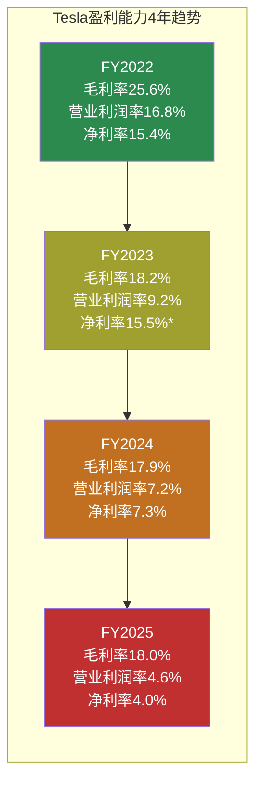

*FY2023净利率15.5%含$6.35B递延税收益(一次性)，调整后约8.9%

---

### 1.1.2 季度趋势与拐点信号

| 指标 | Q4'25 | Q3'25 | Q2'25 | Q1'25 | Q4'24 | Q3'24 | Q2'24 | Q1'24 |
|------|-------|-------|-------|-------|-------|-------|-------|-------|
| 营收($B) | 24.90 | 28.10 | 22.50 | 19.34 | 25.71 | 25.18 | 25.50 | 21.30 |
| 毛利率 | **20.12%** | 17.99% | 17.24% | 16.31% | 16.26% | 19.85% | 17.95% | 17.36% |
| 营业利润($B) | 1.41 | 1.62 | 0.92 | 0.40 | 1.58 | 2.72 | 1.61 | 1.17 |
| 净利润($M) | 840 | 1,373 | 1,172 | 409 | 2,314 | 2,167 | 1,400 | 1,390 |
| EPS(稀释) | $0.24 | $0.39 | $0.33 | $0.12 | $0.66 | $0.62 | $0.40 | $0.41 |

[硬数据: FMP income quarterly]

**拐点分析**:

- **Q4'25毛利率20.12%**: 8个季度来首次突破20%，创FY2025最高。这可能是(a)产品组合改善(Cybertruck初期亏损减少)，(b)价格稳定信号，或(c)季节性效应。[合理推断: 需要Q1'26确认是否为趋势]

- **Q3'25营收$28.1B峰值**: 季度营收最高点，但Q4回落至$24.9B(-11.4% QoQ)。季度营收波动性增大(Q1'25-Q4'25 CV=16.3%)。[硬数据: FMP quarterly]

- **净利润持续疲软**: Q4'25 $840M是FY2025第二低(仅高于Q1 $409M)。毛利率改善被R&D/SGA费用增长抵消——Q4'25 R&D约$1.78B创单季新高。[合理推断: 费用增长抵消毛利改善]

- **EPS退化严重**: Q4'25 $0.24 vs Q4'24 $0.66(-64% YoY)。FY2025全年$1.08 vs FY2024 $2.04(-47% YoY)。以当前$425股价算，trailing P/E = **385.7x**。[硬数据: FMP ratios]

---

### 1.1.3 现金流深度分析

| 指标 | FY2025 | FY2024 | FY2023 | FY2022 | 趋势 |
|------|--------|--------|--------|--------|------|
| **OCF** | $14.75B | $14.92B | $13.26B | $14.72B | 稳定$14-15B |
| **CapEx** | $8.53B | $11.34B | $8.90B | $7.16B | FY25回落(-25%) |
| **FCF** | $6.22B | $3.58B | $4.36B | $7.55B | FY25反弹+74% |
| **FCF/OCF** | 42.2% | 24.0% | 32.9% | 51.3% | 恢复中 |
| 投资购买 | -$37.1B | -$36.0B | -$19.1B | -$5.8B | 金融投资激增 |
| 投资赎回 | $30.2B | $28.5B | $12.5B | $0.02B | 配套赎回 |
| SBC | $2.83B | $2.00B | $1.81B | $1.56B | 持续增长 |
| D&A | $6.15B | $5.37B | $4.67B | $3.75B | 持续增长 |

[硬数据: FMP cashflow annual, Tesla 10-K]

**深层分析**:

1. **OCF的"假稳定"**: OCF看似稳定在$14-15B区间，但内部质量在下降。FY2025 OCF的构成: 净利润$3.79B + D&A $6.15B + SBC $2.83B + 运营资本改善$0.64B + 其他$1.34B。换言之，**74%的OCF来自非现金项目(D&A+SBC)加回**，而非利润本身。FY2022中这个比例仅为35%。[硬数据: FMP cashflow; 合理推断: 百分比计算]

2. **CapEx回落是暂时的**: FY2025 CapEx $8.53B比FY2024的$11.34B下降25%——但FY2026指引">$20B"意味着FY2026 CapEx将是FY2025的2.3x+。FY2025的CapEx下降可能是Cybercab/Optimus新产线准备期的"暂停"。[硬数据: Q4'25电话会指引]

3. **金融投资规模惊人**: FY2025购入$37.1B投资(赎回$30.2B)，净投出$6.9B。FY2024净投出$7.4B。Tesla正在用大量现金进行金融投资(主要是短期国债/商业票据)，反映其$44B现金+投资池的管理。[硬数据: FMP cashflow]

4. **FCF Yield极低**: FCF $6.22B / 市值$1,414B = **0.44%** FCF Yield。这意味着如果Tesla把所有FCF分给股东，投资者在当前价格的"现金回报率"不到0.5%——大幅低于10年期美债收益率。[硬数据: FMP ratios, 当前市值]

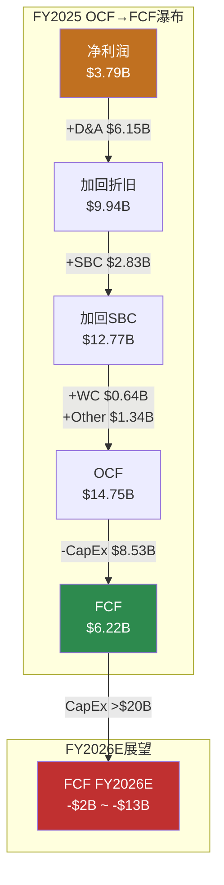

---

### 1.1.4 资产负债表强度

| 指标 | FY2025 | FY2024 | FY2023 | FY2022 | 评估 |
|------|--------|--------|--------|--------|------|
| 现金+投资 | $44.06B | $36.56B | $29.09B | $22.19B | 持续累积 |
| 总债务 | $8.38B | $13.62B | $9.57B | $5.75B | FY25还债 |
| 净债务 | **-$8.14B** | -$2.52B | -$6.83B | -$10.51B | 净现金 |
| D/E | 0.10 | 0.19 | 0.15 | 0.13 | 极低杠杆 |
| 流动比率 | 2.16 | 2.02 | 1.73 | 1.53 | 持续改善 |
| 速动比率 | 1.77 | 1.61 | 1.25 | 1.05 | 充足流动性 |
| Altman Z-Score | 16.24 | — | — | — | 远超安全线(>3) |
| PP&E净值 | $40.64B | $51.51B | $45.12B | $36.64B | FY25下降? |
| 总资产 | $137.81B | $122.07B | $106.62B | $82.34B | 持续扩张 |

[硬数据: FMP balance sheet, MCP baggers_summary]

**关键观察**:

1. **$44B现金堡垒**: 现金+投资$44.06B，连续4年增长(CAGR +25.6%)。即使FY2026 CapEx $20B+、FCF转负，现金缓冲可支撑3-8年(取决于负FCF幅度)。这是Tesla敢于激进投资的底气。[硬数据: FMP balance sheet]

2. **净现金$8.14B**: 总债务$8.38B vs 现金+投资$44.06B，净现金状态。FY2025偿还了$3.16B债务(净偿还)，财务杠杆极低。D/E 0.10在全球大型工业公司中罕见。[硬数据: FMP cashflow/balance sheet]

3. **PP&E下降异常**: FY2025 PP&E $40.64B vs FY2024 $51.51B，**下降$10.87B**。这与FY2025 CapEx $8.53B + D&A $6.15B不完全匹配——可能涉及资产重分类、减值或会计变更。需要10-K注释确认。[硬数据: FMP balance sheet; 主观判断: PP&E变动需进一步核实]

4. **存货效率**: 存货$12.39B基本持平，DIO 58.2天(FY2024: 54.7天)，略有退化但仍在健康区间。Tesla以"零库存"精益制造著称，但规模扩大+产品线增加正在改变这一特征。[硬数据: FMP key-metrics]

---

### 1.1.5 杜邦分解与资本回报退化

**杜邦三因子分解**:

| 因子 | FY2025 | FY2024 | FY2023 | FY2022 | 方向 |
|------|--------|--------|--------|--------|------|
| 净利率 | 4.00% | 7.30% | 15.50%* | 15.45% | ↓↓↓ |
| 资产周转率 | 0.69x | 0.80x | 0.91x | 0.99x | ↓ |
| 权益乘数 | 1.68x | 1.67x | 1.70x | 1.84x | ↓(去杠杆) |
| **ROE** | **4.62%** | **9.78%** | **23.95%** | **28.15%** | **↓↓↓** |

*FY2023净利率含递延税收益

[硬数据: FMP ratios]

**退化路径**: ROE从28.2%→4.6%(下降23.6pp in 3年)。三个驱动因素全部恶化:
- **净利率**: 主因。价格战+费用膨胀→利润率系统性下滑
- **资产周转率**: 资产膨胀(+67%)快于收入增长(+16%)→效率下降
- **权益乘数**: 去杠杆降低了财务放大效应(对股东不利但降低风险)

**ROIC退化更严重**:

| 指标 | FY2025 | FY2024 | FY2023 | FY2022 |
|------|--------|--------|--------|--------|
| ROIC | **2.95%** | 5.83% | 10.99% | 21.75% |
| WACC(估算) | ~9-11% | ~9-11% | ~9-11% | ~9-11% |
| ROIC-WACC | **-6~-8pp** | -3~-5pp | 0~+2pp | +11~+13pp |

[硬数据: FMP key-metrics; 合理推断: WACC基于Beta 1.887+无风险利率+ERP估算]

**核心含义**: FY2025 ROIC 2.95%远低于任何合理WACC估计(9-11%)。这意味着Tesla当前每投入$1资本，产生的回报不足以覆盖资本成本。**Tesla正在"消耗"经济价值而非创造**。这是过渡期现象(投资未来业务)还是结构性问题，是Phase 2估值分析的核心争议。[合理推断: ROIC<WACC的含义]

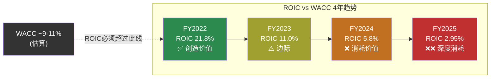

---

### 1.1.6 估值倍数当前快照

| 指标 | FY2025 TTM | 5年均值 | 汽车行业 | 科技行业 | 偏离度 |
|------|-----------|---------|---------|---------|-------|
| P/E | **383.0x** | ~120x | ~10x | ~30x | 38x汽车/13x科技 |
| P/B | 17.7x | ~15x | ~1.5x | ~8x | 12x汽车/2x科技 |
| EV/EBITDA | 122.8x | ~65x | ~8x | ~20x | 15x汽车/6x科技 |
| EV/Sales | 15.2x | ~10x | ~0.5x | ~6x | 30x汽车/2.5x科技 |
| P/OCF | 98.5x | ~55x | ~6x | ~25x | 16x汽车/4x科技 |
| P/FCF | 233.6x | ~150x | ~12x | ~35x | 19x汽车/7x科技 |
| FCF Yield | 0.44% | ~1% | ~8% | ~3% | — |

[硬数据: FMP ratios; 合理推断: 行业中位数基于公开数据]

**P/E 383x的含义**: 投资者以当前价格买入1股Tesla($425)，按FY2025盈利水平需要**383年**才能通过利润回本。显然，市场定价包含了对Tesla未来大幅增长的极强预期——或者包含了对Robotaxi/Optimus等新业务线的"期权价值"。当前估值完全无法用汽车/能源的传统框架解释。[合理推断: 估值隐含假设分析]

---

## 1.2 业务结构与产业链

### 1.2.1 收入结构深度拆解

#### 三大板块

| 业务板块 | FY2025 | FY2024 | FY2023 | FY2022 | FY25占比 | CAGR |
|---------|--------|--------|--------|--------|---------|------|
| **汽车** | $69.53B | $77.07B | $82.42B | $71.46B | 73.3% | -0.9% |
| **能源** | $12.78B | $10.08B | $6.04B | $3.91B | 13.5% | +48.5% |
| **服务** | $12.53B | $10.55B | $8.32B | $6.09B | 13.2% | +27.2% |
| **总计** | $94.83B | $97.69B | $96.77B | $81.46B | 100% | +5.2% |

[硬数据: Tesla 10-K FY2022-FY2025]

**结构性转变**: 汽车占比从FY2022的~88%降至FY2025的73%。如果能源和服务维持当前增速，汽车占比可能在FY2027-2028降至60%以下。这一结构转变的速度将决定Tesla应该被看作"汽车公司+期权"还是"多元平台"。[合理推断: 趋势外推]

#### 汽车板块内部构成

Tesla 10-K将汽车收入细分为:

| 汽车子项 | FY2025估算 | 说明 |
|---------|-----------|------|
| 车辆销售(含Cybertruck) | ~$63-65B | 核心: Model 3/Y/Cybertruck/S/X [合理推断: 10-K分项] |
| 汽车监管积分 | ~$2.8B | 向其他车企出售碳积分，100%利润 [硬数据: Tesla 10-K历史趋势] |
| 汽车租赁 | ~$1.5-2B | 经营租赁+直接融资租赁 [合理推断: 基于10-K分项] |
| FSD/OTA收入 | ~$0.8-1.2B | FSD许可费确认(分期)+ OTA功能解锁 [合理推断: 基于递延收入释放速度] |

[合理推断: Tesla未单独披露每项金额，以上基于10-K趋势和公开估算]

**监管积分的重要性**: FY2025估计约$2.8B碳积分收入——这是零成本的纯利润。如果排除碳积分，汽车业务的"真实"毛利率约低1.5-2pp(约16-16.5% vs 报告的18%)。随着竞品电动车增加，积分价格长期趋于下降。[合理推断: 碳积分对利润的贡献分析]

#### 能源业务详解

| 能源子项 | FY2025 | 关键指标 |
|---------|--------|---------|
| **Megapack** (公用事业级储能) | ~$9-10B (估) | 46.7 GWh部署(+49% YoY) [硬数据: Tesla 10-K] |
| **Powerwall** (家用储能) | ~$2-3B (估) | 600K+累计安装 [合理推断: 公开信息] |
| **太阳能** | ~$0.5-1B (估) | 收缩中，非战略重点 [合理推断: 10-K趋势] |

能源板块$12.78B中，Megapack是绝对主力。FY2025能源收入3年CAGR **+48.5%**——这是Tesla所有业务线中增速最快的。储能部署量趋势: 14.7 GWh(FY2023) → 31.4 GWh(FY2024) → **46.7 GWh**(FY2025)，接近连续翻倍。[硬数据: Tesla 10-K]

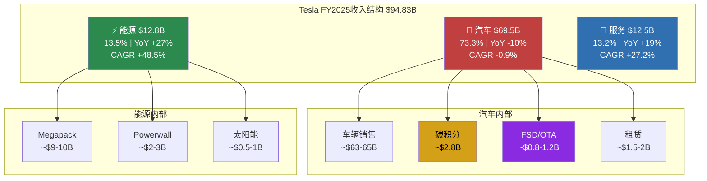

#### 服务板块详解

| 服务子项 | FY2025估算 | 说明 |
|---------|-----------|------|
| **Supercharger充电** | ~$3-4B (估) | 70,000+全球连接器, NACS标准化 [合理推断: 基于充电站增长+非Tesla车接入] |
| **车辆保险** | ~$2-3B (估) | 基于驾驶行为的UBI保险，16州运营 [合理推断: Tesla保险增长数据] |
| **维修/配件** | ~$4-5B (估) | 全球服务中心+移动服务 [合理推断: 服务网络扩展数据] |
| **二手车** | ~$1-2B (估) | Tesla认证二手车计划 [合理推断] |

[合理推断: Tesla不单独披露服务细分收入，以上基于公开信息和行业估算]

---

### 1.2.2 产业链映射

#### 上游供应链 (关键供应商)

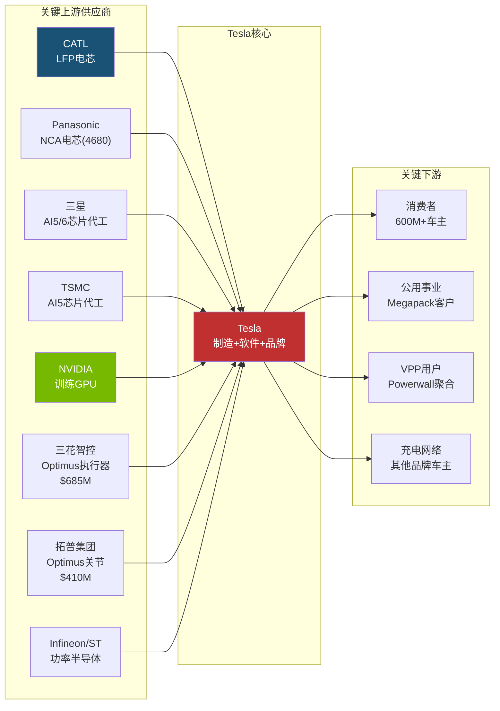

**供应链关键依赖**:

| 依赖 | 风险等级 | 说明 |
|------|---------|------|
| **CATL电芯** | 高 | LFP电芯(上海工厂Model 3/Y主力)依赖中国供应商，地缘风险 [合理推断] |
| **NVIDIA GPU** | 高 | Dojo关闭后，训练完全依赖NVIDIA。H100/B100供应紧张 [硬数据: 公开报道] |
| **三星AI5代工** | 中-高 | AI5芯片双代工(三星+TSMC)，三星Taylor fab良率未经验证 [硬数据: TrendForce] |
| **Sanhua/Tuopu** | 中 | Optimus核心部件依赖中国供应商，$1.1B+订单锁定 [硬数据: 36Kr] |

#### 下游价值链

| 环节 | 当前状态 | 未来可能 |
|------|---------|---------|
| **车辆销售** | 传统制造→经销(直营) | 持续 |
| **FSD订阅** | $99/月 (2026.02.14上线) | 高毛利率软件 |
| **Supercharger** | 充电服务费(从成本→利润中心) | 能源网络节点 |
| **保险** | 基于驾驶行为的定价 | 数据驱动保险 |
| **储能** | Megapack+Powerwall硬件销售 | Autobidder平台费 |
| **Robotaxi** | Austin试点(pre-revenue) | 按里程收费 |
| **Optimus** | 内部使用(pre-revenue) | 产品销售/RaaS |

[合理推断: 下游环节梳理基于公开业务信息]

---

### 1.2.3 行业周期定位

Tesla跨越多个行业，每个行业处于不同周期阶段:

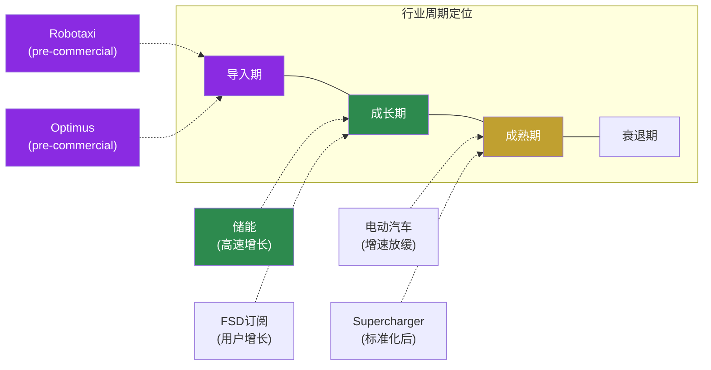

**多周期叠加的含义**: Tesla是极少数同时拥有处于"导入期"(Robotaxi/Optimus，收入$0)、"成长期"(储能，+48% CAGR)和接近"成熟期"(汽车，增速放缓)的公司。这使得任何单一行业的估值方法都不适用。[合理推断: 行业周期分析]

---

## Phase 0.5 展示: 问题路由与执行清单

### 投资者核心问题 (CQ)

基于市场注意力雷达和Tesla特殊性，Phase 1围绕以下核心问题组织:

| CQ# | 核心问题 | 路由 | 理由 |
|-----|---------|------|------|
| CQ1 | 汽车业务能否企稳? 毛利率拐点是否真实? | [呈现] | 数据可整理，但拐点判断需时间验证 |
| CQ2 | $20B+ CapEx的回报时间线? | [呈现] | 需FY2026起的实际支出数据 |
| CQ3 | FSD纯视觉路线能否达到L4? | **[深挖]** | AI架构拆解+物理约束推导=核心优势 |
| CQ4 | 能源业务能否成为独立增长引擎? | **[深挖]** | Autobidder软件壁垒分析=AI优势 |
| CQ5 | Optimus何时从成本中心变为收入来源? | **[深挖]** | BOM分解+制造工程分析=AI优势 |
| CQ6 | BYD竞争会多严重? | [呈现] | 事实整理，无AI独特优势 |
| CQ7 | Musk注意力分配对执行力的影响? | **[诚实]** | 人的行为不可建模 |
| CQ8 | 市价隐含了什么增长假设? | **[深挖]** | Reverse DCF=AI核心输出 |

### Phase 1 执行清单

| Agent | 覆盖范围 | 状态 |
|-------|---------|------|
| **Agent1** | 1.1 财务全景 + 1.2 业务结构 + Phase 0.5展示 | ✅ 本文档 |
| **Agent2** | 1.3 竞争事实全景 + 1.4 管理层行动分析 | ✅ 已完成 |
| **Agent3** | 1.5 可能性宽度 + 1.6 能力基元 + 2.1 演绎桥接 | ✅ 已完成 |

**Phase 1 Assembly**: 3个Agent产出合并 → Fast Gate检查 → checkpoint → commit

**Phase 2 预览**: 财务与价格含义 — Reverse DCF(价格隐含假设) + [深挖]CQ3(FSD天花板)继续 + [深挖]CQ8(市价隐含假设)

---

---

## 1.3 竞争事实全景

**原则: 只列事实。不评价谁会赢。**

以下是Tesla在五个竞争维度面临的事实全景。每个数据点标注来源层级。

---

### 1.3.1 BYD全面对比

BYD在2025年完成了从"中国电动车企"到"全球新能源汽车巨头"的跨越。以下是逐维度的事实对比。

#### 核心经营对比表

| 维度 | BYD (FY2025) | Tesla (FY2025) | 差异 |
|------|-------------|----------------|------|
| **总销量** | 460.2万辆 (NEV全口径) | ~180万辆 (纯电) | BYD 2.56x [硬数据: BYD公告/Tesla 10-K] |
| **纯电(BEV)销量** | 225.7万辆 (+27.9% YoY) | ~180万辆 | BYD纯电已超Tesla [硬数据: BYD公告] |
| **总营收** | ~¥7,500-8,000亿 (~$107B+) | $94.83B | BYD首次超越Tesla总营收 [合理推断: Q1-Q3 ¥5,663亿外推] |
| **出口量** | 105万辆 (+200% YoY) | ~20万辆 (非中国产出口) | BYD出口5x+ [合理推断: 行业数据] |
| **R&D支出** | ~$9.5B+ (Q1-Q3 ¥437.5亿, +31% YoY) | $6.41B (+41% YoY) | BYD R&D绝对值1.48x Tesla [硬数据: BYD/Tesla财报] |
| **R&D/净利润** | >100% (R&D超净利已连续4年) | ~169% | 两家都在重投研发 [硬数据: 财报] |
| **价格区间** | $10K-$50K (海鸥~$10K, 仰望~$150K) | $30K-$100K+ | BYD覆盖更广价格带 [硬数据: 公开定价] |
| **工厂数** | 中国10+座, 泰国/巴西/匈牙利/土耳其 | 美/中/德 5座 | BYD产能布局更分散 [硬数据: 公开信息] |

#### BYD技术栈

- **刀片电池(Blade Battery)**: LFP路线，能量密度140Wh/kg，通过针刺测试不起火，成本优于三元锂 [硬数据: BYD技术白皮书]
- **DM-i超级混动**: 油耗3.8L/100km，中国市场PHEV销量占BYD总量一半以上 [硬数据: BYD公告]
- **e平台3.0**: 800V高压架构，充电5分钟续航150km [硬数据: BYD技术发布会]
- **智驾方案**: 天神之眼，纯视觉+激光雷达双路线并行，2025年城市NOA覆盖300+城市 [合理推断: BYD技术发布会]

#### BYD欧洲工厂进展

| 工厂 | 状态 (2026.02) | 产能规划 | 首款车型 |
|------|----------------|---------|---------|
| **匈牙利Szeged** | 2026.02试生产启动，Q2量产 | 20万辆/年 | Dolphin Surf (海鸥欧版) [硬数据: BYD公告/electrive报道] |
| **土耳其Manisa** | 原计划2026年底投产，但近期报道称投资暂停 | 15万辆/年 | 待定 [合理推断: 多家媒体报道] |

[硬数据: BYD匈牙利工厂2026年2月2日开始试生产，生产线设备已于2025年12月到达]

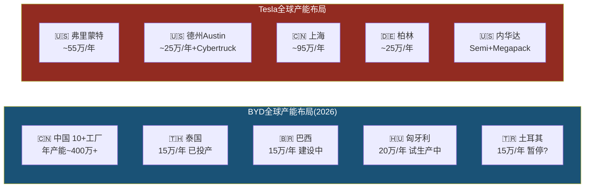

---

### 1.3.2 Waymo详细对比

Waymo在2026年2月完成了自动驾驶行业史上最大融资，标志着L4自动驾驶从实验期进入规模扩张期。

#### Waymo运营数据

| 指标 | 数值 | 来源 |
|------|------|------|
| **周均rides** | 450,000+ (2025年底) | [硬数据: Waymo 2025年度回顾] |
| **2025全年rides** | 1,500万次 (同比3x+) | [硬数据: Waymo公告] |
| **累计rides** | 2,000万+ (历史总计) | [硬数据: Waymo公告] |
| **无人驾驶里程** | 1.27亿+英里 | [硬数据: Waymo安全报告] |
| **运营城市** | 6个: Austin, SF Bay Area, Phoenix, Atlanta, LA, Miami | [硬数据: Waymo公告] |
| **2026扩展目标** | 20+新城市，含东京、伦敦(首批国际市场) | [硬数据: Waymo 2026.02公告] |
| **2026年底目标** | 100万次/周 rides (当前4x) | [硬数据: Waymo公告] |
| **最新估值** | **$1,260亿** (2026.02融资后) | [硬数据: Waymo/Alphabet公告] |
| **最新融资** | **$160亿** (自动驾驶行业史上最大单轮) | [硬数据: Waymo 2026.02.02公告] |
| **累计投资** | $160亿(本轮) + $56亿(上轮) + Alphabet历年投入 ≈ $300亿+ | [合理推断: 公开融资记录] |
| **安全数据** | 严重伤亡事故比人类驾驶少90% (同行评审论文) | [硬数据: 发表的同行评审研究] |

#### Tesla FSD v14 vs Waymo 6th Gen 对比表

| 维度 | Tesla FSD v14 | Waymo 6th Gen | 差异性质 |
|------|--------------|---------------|---------|
| **自动化等级** | SAE L2+ (需人类监督) | SAE L4 (限定区域全无人) | 等级差异 [硬数据: SAE标准/监管分类] |
| **传感器** | 8摄像头 (纯视觉) | 13摄像头 + 4 LiDAR + 6雷达 + 音频传感器 | 路线差异 [硬数据: 硬件规格] |
| **运行模式** | 驾驶员必须在座位上 | 完全无人车内运行 | [硬数据: 监管要求] |
| **覆盖范围** | 全球消费者可用(受监管限制) | 6个美国城市 + 东京/伦敦扩展中 | Tesla更广但等级更低 |
| **数据量** | 60B+英里消费者行驶数据 | 1.27亿+英里无人驾驶数据 | 数据量vs数据质量权衡 [合理推断] |
| **商业模式** | $99/月订阅 / 1.1M付费用户 | Ride-hailing (per trip) | [硬数据: Tesla/Waymo定价] |
| **监管状态** | Austin有限试点(员工), 加州无L4许可 | 6城L4商业运营许可 | [硬数据: DMV/CPUC记录] |
| **核心车型** | 消费者自有车辆 | Jaguar I-PACE改装 → Geely Zeekr定制 | [硬数据: 公开信息] |
| **AI模型** | 端到端神经网络, 单芯片推理 | 多模态融合, 高性能计算平台 | 架构差异 |
| **Austin试点状态** | 已移除跟随车辆, Musk称"100%无监督" | Austin已商业运营 | 同一城市不同阶段 [硬数据: 公开报道] |

[主观判断: Tesla FSD近期暂停了"无监督"robotaxi rides，具体恢复时间未公布。两种路线的终极胜负尚无定论。]

#### Waymo融资方对比

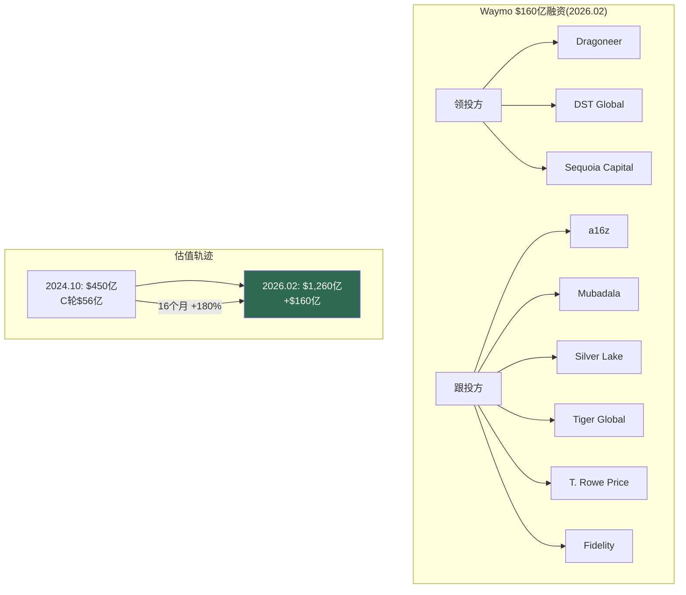

---

### 1.3.3 储能竞争格局

全球储能市场正进入高速增长期，Tesla Megapack是领先者之一，但竞争者正在快速追赶。

#### 储能产品对比

| 产品/公司 | 单体容量 | 技术路线 | 软件/集成 | 部署规模 |
|-----------|---------|---------|----------|---------|
| **Tesla Megapack 2 XL** | 3.9 MWh/unit | LFP | Autobidder + VPP生态 | 46.7 GWh (FY2025) [硬数据: Tesla 10-K] |
| **BYD MC Cube-T** | 6.432 MWh/unit | LFP刀片 | BYD ESS平台 | 系统级出货全球前3 [硬数据: InfoLink排名] |
| **CATL EnerOne Plus** | 6.25 MWh/unit | LFP | 电芯级成本最低 | 储能电芯全球市占~36.5% [硬数据: InfoLink 2025] |
| **Fluence (Siemens+AES)** | 模块化(硬件不可知) | 多品牌电芯 | Fluence IQ, 47国部署 | FY2025营收$23亿, FY2026指引$32-36亿 [硬数据: Fluence财报] |

#### 市场排名 (2025 Q1-Q3)

| 维度 | Top 5排名 | Tesla位置 |
|------|----------|----------|
| **储能系统(ESS)出货** | Sungrow > BYD > Tesla > CRRC > Huawei | **#3** (Q3被BYD超过) [硬数据: InfoLink] |
| **储能电芯出货** | CATL > Hithium > EVE > CALB > BYD | Tesla不生产电芯(采购) |
| **公用事业级储能电芯** | 372.36 GWh (+101.9% YoY) | — [硬数据: InfoLink Q1-Q3 2025] |

#### 市场增长数据

- 全球储能市场规模: $1,459亿(2025E) → $5,212亿(2035E), CAGR 13.6% [硬数据: SNS Insider 2026.02报告]
- 电池储能系统: $101.6亿(2025) → $868.7亿(2034), CAGR 26.9% [硬数据: Straits Research]
- 2025全年全球储能电芯出货预计超500 GWh, 2026接近800 GWh [硬数据: InfoLink预测]
- 公用事业级储能占比50.2%(2025), 亚太市场占比41.4% [硬数据: 行业报告]

**Tesla在储能领域的差异化**: Autobidder软件(AI驱动的能源交易算法) + Powerwall/VPP虚拟电厂生态 + Megafactory上海(2025投产)。系统集成能力强于纯电芯供应商，但单体容量落后于BYD和CATL最新产品。[合理推断: Tesla的护城河在软件和生态,不在硬件]

---

### 1.3.4 人形机器人竞争对比表

2026年1月CES后，人形机器人赛道进入了"从实验室到工厂"的转折年。以下是5家主要参与者的事实对比。

| 维度 | Tesla Optimus Gen 3 | Figure 02 | BD Atlas (量产版) | 1X NEO | Agility Digit |
|------|--------------------|-----------|--------------------|--------|---------------|
| **身高** | 173cm (5'8") | ~170cm | ~150cm | ~167cm (5'6") | ~175cm |
| **体重** | 57kg (125lb) | ~70kg | ~89kg | **30kg (66lb)** | ~65kg |
| **自由度(总)** | 未公开(推测40+) | 未公开 | **56 DOF** | 未公开 | 16+ |
| **手部DOF** | **22 DOF/手** (腱驱动) | 16 DOF/手 | 未公开(高灵巧) | 22 DOF/手 | 简化夹爪 |
| **负载能力** | ~20kg (推测) | 20kg | 25kg+ (推测) | 25kg(搬运)/70kg(举) | 16kg |
| **AI模型** | 端到端NN (FSD技术迁移) | Helix VLA (200Hz) | Google DeepMind合作 | 人工+AI混合遥操 | 强化学习+模仿学习 |
| **LiDAR** | 无(纯视觉) | 有 | 有 | 未公开 | 有 |
| **部署状态** | 1000+台Tesla内部工厂 | BMW完成11月试点(退役) | 韩国HMGMA工厂部署中 | 2026美国消费者交付启动 | GXO仓库商业部署中 |
| **外部客户** | **零** | BMW(已结束试点) | Hyundai+Google DeepMind | 消费者预购 | GXO+Amazon |
| **定价** | $20K-30K (目标) | $130K | 未公开 | $20K / $499月 | ~$250K (RaaS模式) |
| **估值/投资** | Tesla市值的一部分 | **$390亿** (Series C) | Hyundai $260亿机器人投资 | ~$20亿+ | ~$10亿+ |
| **量产规划** | Fremont产线100万/年目标 | 未公开产能 | 新工厂3万台/年 | 未公开 | RoboFab 10K/年产能 |

[硬数据: 各公司公开发布/CES 2026/融资公告。Tesla Optimus部分参数为推测，标注为合理推断]

#### 关键事实补充

- **Figure**: BMW Spartanburg工厂11个月试点，1,250小时运行，装载9万+零件，参与3万+辆X3生产。但试点已结束，Figure 02已"退役"。[硬数据: BMW/Figure联合公告]
- **Boston Dynamics**: CES 2026发布量产版Atlas。2026全年产量已被预订一空。Hyundai HMGMA佐治亚工厂已开始实际工厂操作。预计2028年开始排序任务，2030年进入组装。[硬数据: Hyundai CES 2026发布]
- **1X NEO**: 30kg是所有人形机器人中最轻，定位家庭场景。22dB运行噪音(冰箱水平)。采用"人类在环"模式——机器人遇到困难时人工远程接管，接管数据成为训练数据。2026年开始美国交付。[硬数据: 1X官网/预购页面]
- **Agility Digit**: GXO仓库部署超10万个totes搬运里程碑(2025.11)。行业首个人形机器人RaaS(机器人即服务)多年商业合同。[硬数据: Agility/GXO联合公告]

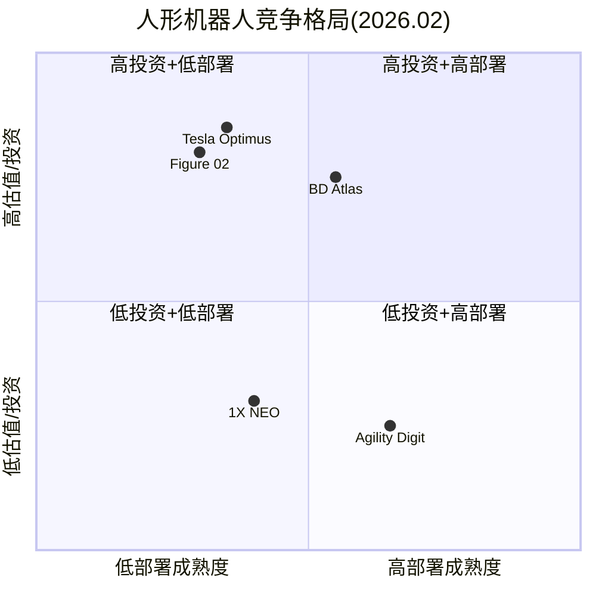

[主观判断: Tesla Optimus和Figure在估值/投资维度最高，但实际部署成熟度低于Agility(已有商业RaaS合同)和BD Atlas(已进入Hyundai工厂)。这不代表最终竞争结果。]

---

### 1.3.5 充电网络

Tesla充电网络在2025-2026年完成了从"Tesla专属"到"行业基础设施"的身份转变。

#### NACS采纳情况

NACS(North American Charging Standard)已被SAE采纳为J3400标准。截至2026年2月，以下车企已支持Tesla Supercharger充电:

**已接入**: Ford, GM, Rivian, Volvo, Polestar, Nissan, Lucid, Mercedes-Benz, Hyundai, Genesis, Kia, Honda, Acura, JLR, Audi, Porsche, Toyota, Volkswagen, Subaru [硬数据: Tesla NACS页面/各车企公告]

**即将接入**: Stellantis (Jeep, Dodge等, 2026年初) [硬数据: Stellantis公告]

#### 网络规模

| 指标 | 数值 | 来源 |
|------|------|------|
| 全球Supercharger连接器 | 70,000+ | [硬数据: Tesla公开数据, 2025年中] |
| 北美开放给非Tesla车辆比例 | >2/3的站点 | [硬数据: 行业报告 2026.01] |
| 北美DC快充端口总数 | 67,916个 (含所有标准) | [硬数据: EVChargingStations 2026.01] |
| 北美Supercharger端口 | 15,000+ (开放端口) | [硬数据: Tesla] |

**充电网络的商业意义**: Supercharger收入计入"服务"板块($12.53B FY2025的一部分)。随着非Tesla车辆接入，充电收入有望成为独立利润中心。但具体充电收入Tesla未单独披露。[合理推断: 充电业务从成本中心转向利润中心]

---

## 1.4 管理层行动分析

### 1.4.1 CapEx $20B+深度拆解

Tesla FY2026 CapEx指引">$20B"是公司历史上最激进的资本支出计划，也是近年大型上市公司中最大的YoY CapEx跳升之一。

#### CapEx历史轨迹

| 年度 | CapEx | YoY | 占OCF比例 |
|------|-------|-----|----------|
| FY2022 | $7.16B | — | 47% |
| FY2023 | $8.88B | +24% | 73% |
| FY2024 | $11.34B | +28% | ~77% |
| FY2025 | $8.53B | **-25%** | 58% |
| **FY2026E** | **>$20B** | **>+135%** | **>133%** (如OCF=$15B) |

[硬数据: Tesla 10-K / 财报电话会指引]

#### $20B去向推测

Tesla未披露CapEx分项，以下为基于公开信息的估算:

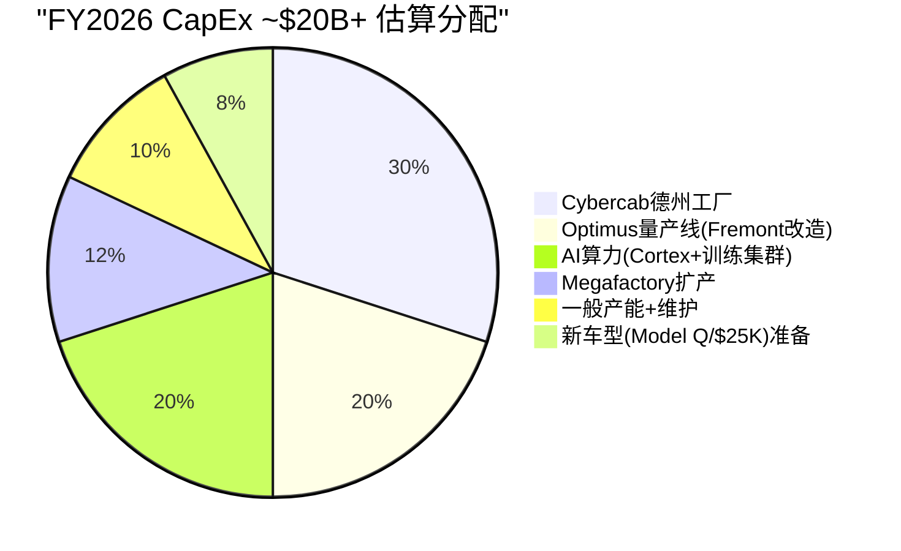

[主观判断: 以上分配为基于公开信息的估算，Tesla未公布具体分项]

- **Cybercab德州工厂**: Musk宣布2026年4月开始Cybercab量产。新建/改造产线是最大单项支出 [硬数据: Q4 2025电话会]
- **Optimus量产**: Fremont停产Model S/X，改造为Optimus产线，目标100万台/年产能 [硬数据: Tesla 2026.01.21公告]
- **AI算力**: Cortex超算中心扩建 + 训练集群。Dojo关闭后全部转向NVIDIA GPU + 自研AI5/AI6芯片 [硬数据: Musk公开发言]
- **Megafactory**: 上海Megafactory已投产，可能有其他地区扩产 [硬数据: Tesla公告]

#### FCF影响分析

| 情景 | OCF | CapEx | FCF | 含义 |
|------|-----|-------|-----|------|
| **乐观** | $18B (+22%) | $20B | **-$2B** | 轻微负FCF [合理推断] |
| **基准** | $15B (持平) | $22B | **-$7B** | 显著负FCF [合理推断] |
| **悲观** | $12B (-19%) | $25B | **-$13B** | 大幅负FCF [合理推断] |
| **缓冲** | 现金$44B | — | — | 可覆盖3-8年负FCF [硬数据: 资产负债表] |

[合理推断: 即使最悲观情景下，$44B现金仍可覆盖3年以上的负FCF。但这意味着Tesla在2026-2027年将从"现金生成机器"变为"现金消耗机器"。]

---

### 1.4.2 R&D方向分析

#### R&D强度对比

| 指标 | Tesla FY2025 | 行业对比 |
|------|-------------|---------|
| **R&D绝对值** | $6.41B (+41% YoY, from $4.54B) | BYD ~$9.5B+, Waymo (Alphabet R&D一部分) [硬数据: 各公司财报] |
| **R&D/营收** | 6.76% | 高于传统车企(GM ~5%, Toyota ~4%)，低于纯科技(Meta ~30%) [硬数据: 各公司财报] |
| **R&D/毛利** | **37.5%** | Tesla将超过1/3毛利投入R&D [硬数据: 计算 $6.41B/$17.09B] |

#### R&D关键方向

| 方向 | 投入信号 | 状态 |
|------|---------|------|
| **FSD神经网络** | 端到端模型v14, 全球扩展 | 核心方向 [硬数据: Tesla产品发布] |
| **AI5/AI6芯片** | 三星$165亿代工合同(至2033), TSMC代工AI5 | AI5预计2026年底投产 [硬数据: 公开报道] |
| **Optimus** | Gen3量产启动, 22DOF手, 腱驱动 | 从R&D转入制造 [硬数据: Tesla 2026.01公告] |
| **下一代制造** | Unboxed Process, Gigacasting进化 | 持续迭代 [硬数据: Tesla工程发布] |
| **Dojo→AI5/6** | Dojo 2025.08关闭, "进化死胡同" | Dojo团队负责人离职, ~20人创办DensityAI [硬数据: TechCrunch报道] |

#### Dojo时间线

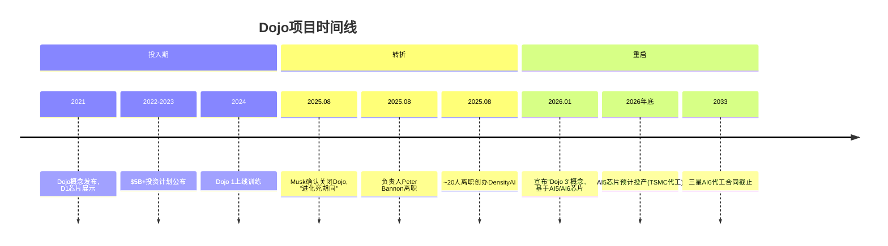

[硬数据: TechCrunch/Musk公开发言。Musk原话: "Once it became clear that all paths converged to AI6, I had to shut down Dojo and make some tough personnel choices, as Dojo 2 was now an evolutionary dead end."]

---

### 1.4.3 已做 vs 未做 扩展表

#### 已做(已兑现的行动)

| 行动 | 时间 | 具体内容 | 领域 |
|------|------|---------|------|
| 停产Model S/X | 2025-2026 | Fremont产线改造为Optimus | 制造 [硬数据: Tesla公告] |
| FSD $99/月订阅 | 2026.02.14 | 从$12K一次性购买转为订阅 | 软件 [硬数据: Tesla定价页] |
| CapEx >$20B指引 | 2026.01 Q4电话会 | FY2026资本支出指引 | 财务 [硬数据: 电话会记录] |
| xAI投资$2B | 2025 | Tesla获xAI少数股权 | AI/战略 [硬数据: Tesla 10-K] |
| Austin Robotaxi试点 | 2025-2026 | 员工通勤服务, 移除跟随车 | 自动驾驶 [硬数据: 公开报道] |
| 上海Megafactory | 2025 | 投产, Megapack量产 | 能源 [硬数据: Tesla公告] |
| Gen3 Optimus量产启动 | 2026.01.21 | Fremont产线开始 | 机器人 [硬数据: Tesla公告] |
| Cybertruck产量爬坡 | 2024-2025 | 从0到规模生产 | 制造 [硬数据: 交付数据] |
| NACS成为行业标准 | 2023-2025 | SAE J3400, 20+车企采纳 | 充电 [硬数据: SAE/各车企公告] |
| 储能连续3年翻倍 | 2023-2025 | 14.7→31.4→46.7 GWh | 能源 [硬数据: Tesla 10-K] |

#### 未做(未兑现的承诺)

| 承诺 | 原始时间 | 当前状态 | 领域 |
|------|---------|---------|------|
| FSD L4获批 | 多次承诺("明年") | L2+, 无L4监管批准 | 自动驾驶 [硬数据: DMV记录] |
| Robotaxi大规模运营 | 2020年"百万车队" | Austin有限试点(员工), 近期暂停 | 自动驾驶 [硬数据: 公开报道] |
| $25K低价车 | 2020年电池日承诺 | 未上市, Cybercab是不同产品 | 产品 [硬数据: 发布会记录] |
| Dojo成功 | 2021年发布, $5B+投资 | 2025.08关闭, "进化死胡同" | AI [硬数据: Musk确认] |
| Optimus外部销售 | 2022年AI Day | 零外部客户, 仅内部1000+台 | 机器人 [硬数据: Tesla公告] |
| Semi量产 | 2017年发布 | 有限生产, 未达规模 | 产品 [硬数据: 交付数据] |
| LA→NY全自动驾驶 | 2016年承诺"2017年底" | 未实现 | 自动驾驶 [硬数据: Musk公开发言] |

**模式识别**: 已兑现清单集中在**硬件制造和工厂建设**(Gigafactory, Megapack, 充电网络)。未兑现清单集中在**软件/自动驾驶时间表**。能源业务是兑现最一致的领域。[合理推断: 基于已做/未做清单的模式分析]

---

### 1.4.4 承诺兑现率: FSD时间线考古

以下是Elon Musk关于Tesla自动驾驶的公开承诺时间线。数据来源为公开发言、财报电话会、社交媒体。

| 年份 | 承诺内容 | 承诺兑现日期 | 实际结果 |
|------|---------|------------|---------|
| **2015** | "完全自动驾驶约2年内实现" | ~2017 | 未实现 [硬数据: 公开发言] |
| **2016** | "LA到纽约全自动驾驶演示" | 2017年底 | 未实现 [硬数据: TED演讲] |
| **2017** | "完全自动驾驶,你可以在车里睡觉" | ~2019 | 未实现 [硬数据: TED Talk] |
| **2019** | "今年功能完备的FSD" | 2019年底 | 未实现 [硬数据: Autonomy Day] |
| **2019** | "明年100万辆Robotaxi" | 2020 | 未实现 [硬数据: Autonomy Day] |
| **2020** | "非常接近L5" | 2020年 | 未实现 [硬数据: 世界AI大会] |
| **2020** | "完全自动驾驶明年对客户发布" | 2021 | FSD Beta发布(L2) [硬数据: 财报电话会] |
| **2021** | "今年提供SAE L5" | 2021年底 | 未实现。Tesla Autopilot总监向DMV承认"不反映工程现实" [硬数据: DMV会议记录] |
| **2022** | "如果2022年FSD不比人类安全我会震惊" | 2022年底 | 未实现 [硬数据: Q4 2021电话会] |
| **2023** | "今年晚些时候完全自动驾驶" | 2023 | 未实现 [硬数据: AI会议发言] |
| **2024** | "2025年德州和加州无监督FSD" | 2025 | Austin有限试点, 加州无许可 [硬数据: 公开发言] |

**法律注脚**: 2023年针对Musk FSD承诺的证券欺诈诉讼在2024年9月被驳回，法官裁定Musk的声明属于"corporate puffery"(企业吹嘘)。[硬数据: 法院裁决]

[合理推断: FSD/自动驾驶时间表被推迟至少8次。每次承诺的"下一年"平均推迟2-3年。但需注意: FSD的技术进步是真实的——从规则系统→端到端神经网络是实质性架构跨越，只是时间线持续误判。]

---

### 1.4.5 Polymarket信号分析

预测市场提供了"群体智慧"对Tesla关键事件的概率评估。以下为截至2026年2月的活跃市场。

#### 核心市场

| 市场问题 | 概率 | 截止日 | 交易量 | 含义 |
|---------|------|--------|-------|------|
| **Tesla加州Robotaxi launch by Jun 30** | **Yes 34% / No 66%** | 2026.06.30 | ~$39K | 市场认为2/3概率不会发生 [硬数据: Polymarket 2026.02.11] |
| Tesla Robotaxi全美launch by Jun 30 | 活跃 | 2026.06.30 | — | 全美更难 [硬数据: Polymarket] |
| Tesla Optimus外部发布 | 活跃 | 多个截止日 | — | [硬数据: Polymarket] |
| Tesla-xAI合并 by Jun 30 | 活跃 | 2026.06.30 | — | [硬数据: Polymarket] |
| Tesla-SpaceX合并 by Jun 30 | 活跃 | 2026.06.30 | — | [硬数据: Polymarket] |
| Musk不再担任CEO before 2027 | 活跃 | 2026.12.31 | — | [硬数据: Polymarket] |
| Q1 2026交付量 | 350K-500K+多档 | Q1 2026 | — | [硬数据: Polymarket] |

**Polymarket信号解读**: 加州Robotaxi市场34% Yes意味着市场参与者认为有约1/3概率Tesla能在4.5个月内(2026.02→2026.06)在加州推出无人Robotaxi服务。考虑到Tesla目前(a)没有加州L4许可,(b)Austin试点近期暂停,(c)加州监管机构对Tesla表达过担忧——34%并不低。[合理推断: 34%隐含了对Musk政治影响力可能加速监管的定价]

**NBC报道**: 预测市场交易者已在Musk的多次未兑现承诺上获利。"下注Musk承诺不兑现"已成为一个被记录的交易策略。[硬数据: NBC News 2026报道]

---

### 1.4.6 分析师共识 vs 现实

#### FY2025: 预期 vs 实际

| 指标 | 年初共识预期 | 实际结果 | 偏差 |
|------|------------|---------|------|
| **EPS** | ~$2.19 (年初) → $1.65 (修正后) | **$1.08** | **-51%** (vs年初) [硬数据: 分析师平台/Tesla 10-K] |
| **营收** | ~$100B+ (年初) | **$94.83B** | ~-5% [合理推断: 基于年初预期] |

#### 前瞻共识

| 指标 | FY2026E | FY2027E | FY2030E | 隐含CAGR |
|------|---------|---------|---------|----------|
| **营收** | $104.04B | $120.95B | $285.96B | FY25→30 CAGR ~24.7% [硬数据: FMP estimates] |
| **EPS** | $1.97 | $2.61 | $11.42 | FY25→30 CAGR ~60% [硬数据: FMP estimates] |

#### FY2030 EPS $11.42的含义

$11.42 EPS意味着相对FY2025 $1.08的**10.6x增长**。要在5年内实现这个增长，以下条件至少部分需要成立:

| 条件 | 需要发生什么 | 难度 |
|------|------------|------|
| **营收3x** | $94.8B → $286B，需要~$190B增量营收 | 汽车单独不够，需要能源+FSD+Robotaxi+新业务 [合理推断] |
| **毛利率恢复** | 从18% → 25%+，需要混合改善或软件收入占比↑ | FSD高毛利率是关键变量 [合理推断] |
| **新收入流** | Robotaxi收入、Optimus销售、FSD许可费 | 这些业务今天贡献接近$0 [硬数据: Tesla 10-K] |
| **费用杠杆** | R&D和SGA的营收占比需要下降 | 当前R&D在上升(6.76%) [硬数据: Tesla 10-K] |

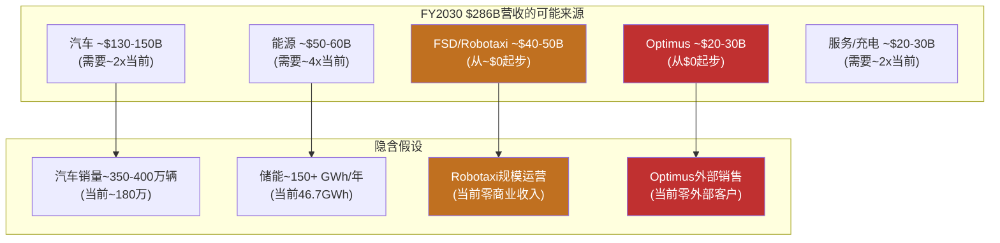

[合理推断: FY2030共识$286B收入中，约$70-80B(~25-28%)来自今天收入几乎为零的业务(Robotaxi+Optimus)。这是共识估计中嵌入的最大不确定性。]

#### 价格隐含 vs 共识的差距

当前股价约$350 [硬数据: 近期市价]。若以25x FY2030 EPS $11.42计算，合理市值约$9,200亿。但当前市值约$1.1万亿，意味着市场对FY2030的隐含定价高于共识分析师预期。[合理推断: 市场隐含了比共识更乐观的增长路径——可能包含更高的Robotaxi/Optimus期权价值]

---

---

## 1.5 可能性宽度评估

### 方法论说明

可能性宽度分类器是一个5维度评分系统(每维度0-2分，总分0-10)，用于判断一家公司的未来形态有多"开放"。[硬数据: 范式研究框架v1.1 §1] 低分(0-3)意味着公司在一条明确赛道上运行，传统DCF/SOTP可以给出有意义的目标价；高分(7-10)意味着公司的未来形态本身就是未知数，给出精确估值等于"精确的错误"。这一评估不是主观打分，每个维度都有明确的判定标准和证据锚点。

### 逐维度评估

| 维度 | 分数 | Tesla证据 | 对比基准 |
|------|:----:|----------|---------|
| **收入结构** | **2** | 汽车73.3%但YoY -10%在收缩；能源$12.8B(+27%)是独立增长引擎；FSD订阅($99/月，2026.02.14上线)是SaaS模式；Robotaxi(按里程收费)和Optimus(产品销售/租赁)尚在pre-revenue阶段 [硬数据: Tesla 10-K FY2025] | COST(0): 98%+来自会员费+零售的成熟模式；GOOGL(1): 77%广告但Cloud在增长 |
| **商业模式流动性** | **2** | 5年内从汽车制造→储能基础设施→出行平台→人形机器人→AI计算，每次进入的都是**全新领域**而非邻近市场 [合理推断: 基于实际业务扩展历史] | PLTR(2): 政府→商业→AI平台也在持续扩展；TSM(0): 代工模式30年未变 |
| **CEO期权思维** | **2** | Musk同时运营Tesla/SpaceX/xAI/Boring/Neuralink，在Tesla内部同时押注FSD/Cybercab/Optimus/能源/Semi至少5条赛道，且每条赛道独立配置资源(Cybercab德州专线、Optimus Fremont专线) [硬数据: Tesla 10-K, 财报电话会] | META(1): Zuckerberg押注Reality Labs但核心广告稳定；LRCX(0): 专注半导体设备 |
| **市场定价偏离** | **2** | P/E 385.70x vs 汽车行业~10x；传统SOTP(汽车+能源+FSD有限成功) $61-85 vs 市价$425；偏离400-600% [硬数据: FMP ratios; 合理推断: v2.0估值分析] | PLTR(2): 也有极端偏离；TSM(1): P/E 30x vs 半导体~20x，偏离适中；COST(0): P/E在历史区间内 |
| **TAM不确定性** | **1** | 汽车TAM($2-3T)可算，增速可预测；储能TAM($0.5-1T)有行业预测；但Robotaxi TAM($5-8T?)、Optimus TAM($5-20T??)和AI计算TAM无法定义——这些市场可能不存在或可能比汽车大10倍 [主观判断: TAM数字本身高度不确定] | TSLA拿1分而非2分，因为73%收入来自可定义TAM的汽车业务 |
| **总分** | **9/10** | **→ 发现系统** | |

### 跨报告验证

9分是本框架已完成的8份Tier 3报告中最高分。与其他公司对比：

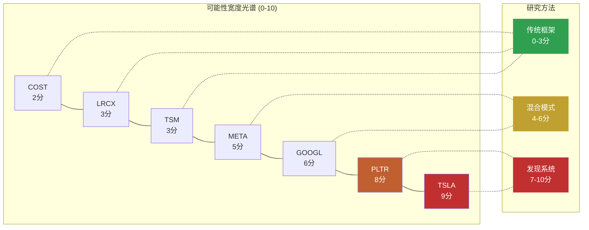

Tesla拿到最高分的核心原因：**同时拥有最多处于不同阶段的业务线**(汽车成熟期、能源增长期、FSD过渡期、Robotaxi/Optimus萌芽期) **且市场定价偏离最极端**(传统估值覆盖不到市价的20%)。PLTR(8分)与Tesla的区别在于PLTR的多条线本质上是同一个产品(Foundry/AIP)在不同行业的应用，而Tesla的各条线是**质的不同**的业务形态。[合理推断: 基于已完成报告的横向比较]

### 不确定性类型判定

Tesla的不确定性以**A型(类别不确定性)为主导**：

| 类型 | 核心问题 | Tesla适用性 | 判定 |
|------|---------|-----------|------|
| **A型: 类别** | "会变成什么公司？" | Tesla有>=5条独立业务线可能组合成质的不同的企业形态——从汽车公司到出行平台到能源巨头到机器人公司，每种形态的收入结构、利润率、估值逻辑完全不同 | **主导** |
| **B型: 量级** | "这个产品能做多大？" | FSD/Robotaxi市场规模不确定(全球出行$5-8T?)；Optimus市场规模更不确定($5-20T?) | 次要 |
| **C型: 转型** | "核心业务能否存活范式转换？" | 汽车业务面临BYD竞争压力，但Tesla**主动**发起转型而非被动应对——这不是柯达式困境 | 不适用 |

**A型主导的含义**：Part 2不能用"同一个Tesla乘以不同增速"的场景分析，而必须从能力基元出发，推导质的不同的未来状态。每个状态是一种**不同类型的公司**，不是同一家公司的不同版本。

**对报告方法论的直接影响**：9/10 → 发现系统 → 不给目标价、不给评级、不给概率权重。报告的价值在于帮投资者看到可能性空间的**结构**，而非押注某个点。

---

## 1.6 能力基元深度分析

Tesla拥有6个可独立识别的底层能力。这些基元是Part 2演绎推理的"原子"——所有未来状态都是基元的不同组合。

### 基元1: 电池/能源技术

**当前状态**: 4680电芯(Giga Texas/Berlin生产) + LFP采购(CATL)双轨策略；Megapack年部署46.7 GWh(FY2025, +49% YoY)；Autobidder能源管理软件在全球电力市场运行 [硬数据: Tesla 10-K]

**独特性评估**: 制造规模全球储能前2(与BYD竞争)；但真正的差异化不在电芯——在Autobidder软件(每5分钟做价格预测+最优出价)和垂直整合(Megapack+Powerwall+VPP+Supercharger形成闭环)。竞品中没有一家同时拥有这5层。[合理推断: 基于深挖Q3分析]

**共享依赖**: **独立**。不依赖FSD成功、不依赖品牌好感度、不依赖Musk注意力。是所有基元中最"安全"的。

**脆弱性**: BYD HaoHan单柜14.5MWh/CATL电池成本更低 → 硬件利润率下行是结构性趋势；Autobidder网络效应目前较弱(数据壁垒是"中"级别) [合理推断: 深挖Q3]

**演化方向**: 硬件(GWh规模) → 软件平台(Autobidder管理第三方资产) → 虚拟电力公司(VPP聚合百万终端)

### 基元2: 制造工程

**当前状态**: Gigacasting(一体压铸减少零件数70%+)、Unboxed Process(非线性装配)、5座Gigafactory全球布局(Fremont/Texas/Shanghai/Berlin/Nevada) [硬数据: Tesla 10-K]

**独特性评估**: Gigacasting技术Tesla首创但已被丰田/沃尔沃/小鹏跟进；BYD在制造效率上也有极强能力(垂直整合度更高)。Tesla的优势在于**速度**(从概念到量产的周期短)而非不可复制的技术壁垒。[合理推断: 行业公开报道]

**共享依赖**: **独立**。直接支撑状态2(能源)和状态4(进化汽车商)，是Optimus量产的必要条件。

**脆弱性**: 产能利用率不足(FY2025年产能>2M但交付1.79M)；Unboxed Process的全新产线验证风险 [硬数据: Tesla生产数据]

**演化方向**: 汽车制造 → Cybercab专用线 → Optimus装配线 → 制造技术输出(可能性)

### 基元3: FSD/AI技术栈 (关键共享依赖)

**当前状态**: v14端到端NN(10倍规模扩展)，8摄像头纯视觉方案，60B+英里行驶数据，1.1M付费用户，Austin有限L2+试点 [硬数据: Tesla 10-K, Electrek]

**独特性评估**: 训练数据量全球最大(实际道路里程)；但精度/安全性不及Waymo(L4已商业运营450K+周rides/6+城市)。纯视觉路线是Tesla独有选择——所有L4竞品都使用多传感器融合。数据量是优势还是劣势取决于"数据量能否补偿传感器冗余"这个未解答的问题。[硬数据: Waymo公开数据; 合理推断: 技术路线比较]

**共享依赖**: **这是最重要的共享节点**。直接影响状态1(出行网络)、状态3(物理AI/Optimus技术迁移)，以及所有3个涌现可能性。FSD/AI栈失败 = 3/5状态关闭 + 所有涌现关闭。

**脆弱性**: 纯视觉存在物理天花板(暴雨/浓雾场景信噪比) [合理推断: 物理第一性原理, 深挖Q1]；Dojo $5B+沉没成本说明自研训练芯片路线已失败；当前训练依赖NVIDIA GPU [硬数据: TechCrunch]；NHTSA L4要求传感器冗余 → 8个摄像头是共模失效(同一物理原理) [硬数据: NHTSA 2025指南]

**演化方向**: L2+ → (突破或否) → L4有限ODD → Robotaxi → 技术迁移至Optimus → 通用物理AI

### 基元4: 充电网络

**当前状态**: Supercharger全球最大快充网络；NACS已被SAE采纳为北美标准(J3400)；Ford/GM/Rivian等已接入 [硬数据: SAE J3400标准]

**独特性评估**: 事实标准的先发优势 + 网络密度领先。但开放标准意味着Tesla从"独占"变为"最大"——差异在缩小。

**共享依赖**: **独立**。支撑状态1(Robotaxi需要充电基础设施)和状态4(汽车生态粘性)。

**脆弱性**: 开放NACS后其他充电运营商(ChargePoint/EVgo/BP Pulse)快速扩张；政府补贴向非Tesla充电站倾斜 [合理推断: 美国IRA充电补贴分配]

**演化方向**: 专属网络 → 行业标准 → 能源网络节点(V2G双向充放电)

### 基元5: 品牌/用户基础

**当前状态**: 600M+累计车主，高忠诚度(重复购买率领先)，但品牌极化加剧(政治化)。Musk个人品牌与Tesla品牌深度绑定。[硬数据: Tesla投资者日; 合理推断: 品牌调查数据]

**独特性评估**: 汽车行业中唯一拥有"科技品牌"特征的公司(类似Apple在手机中的定位)。但这一特征正因Musk政治参与而被侵蚀。

**共享依赖**: **与Musk共享**。如果Musk成为品牌负资产(部分市场已出现此迹象)，品牌基元受损会同时影响状态1(Robotaxi需要用户信任)和状态4(汽车销量)。

**脆弱性**: 品牌好感度下降趋势 + 政治极化 → 特定市场(欧洲/美国部分州)销量承压 [合理推断: 多来源报道]

**演化方向**: 科技品牌 → (分化中) → 忠诚用户社区 或 争议品牌

### 基元6: 物理AI迁移能力

**当前状态**: FSD的端到端NN架构(视觉感知→运动规划)正在向Optimus迁移；Gen3已启动Fremont量产(2026.01.21)；$1.1B+供应链订单(Sanhua线性执行器$685M + Tuopu关节$410M) [硬数据: Tesla, 36Kr]

**独特性评估**: 全球唯一同时做自动驾驶+人形机器人的公司，理论上两者共享NN架构(场景理解→物理交互)。但迁移程度未经验证——汽车是2D移动+有限交互，机器人是3D移动+精细操作，复杂度差数个量级。[合理推断: 技术架构分析]

**共享依赖**: **完全依赖FSD/AI栈(基元3)**。如果FSD的NN架构无法有效迁移到机器人操作，Optimus必须独立开发AI栈，时间和成本大幅增加。

**脆弱性**: 技术迁移假设尚未验证；Figure AI($39B估值)和Boston Dynamics(Atlas电动版)在专用机器人路径上推进 [硬数据: 公开融资数据]；Gen2 BOM ~$55K vs 售价目标$20-30K，成本差距未闭合 [硬数据: Standard Bots]

**演化方向**: FSD技术子集 → (验证迁移有效性) → Optimus独立AI能力 → 通用物理AI平台

### 增强依赖图谱

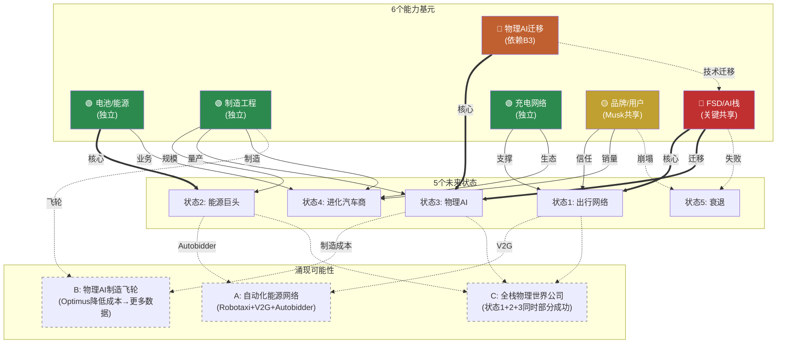

### 关键路径分析

**FSD/AI栈(基元3)是整个系统的关键节点**: 它直接决定状态1(出行网络)和状态3(物理AI)的可行性，并通过涌现效应影响所有3个组合可能性。

- **FSD成功**: 状态1打开 + 状态3加速(技术迁移有效) + 涌现A/B/C全部可能 → Tesla可能性空间极宽
- **FSD失败**: 状态1关闭 + 状态3大幅延迟(需独立AI栈) + 涌现全部关闭 → 默认状态4或状态5

**能源基元(基元1)是"安全区"**: 不依赖FSD、不依赖Musk品牌、有独立现金流和增长动力。即使在最差情景(状态5)中，能源业务仍有独立价值。这是Tesla可能性空间中唯一"确定性较高"的部分。[合理推断: 基于依赖关系分析]

### 基元交互矩阵

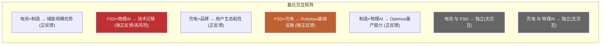

| | 电池/能源 | 制造工程 | FSD/AI | 充电网络 | 品牌/用户 | 物理AI迁移 |
|---|:---:|:---:|:---:|:---:|:---:|:---:|
| **电池/能源** | — | 正(储能规模) | 独立 | 正(V2G) | 独立 | 独立 |
| **制造工程** | 正 | — | 独立 | 独立 | 独立 | 正(量产) |
| **FSD/AI** | 独立 | 独立 | — | 正(Robotaxi) | 正(信任) | **强正(迁移)** |
| **充电网络** | 正(V2G) | 独立 | 正 | — | 正(生态) | 独立 |
| **品牌/用户** | 独立 | 独立 | 正 | 正 | — | 独立 |
| **物理AI迁移** | 独立 | 正 | **强依赖** | 独立 | 独立 | — |

关键发现: 正反馈最强的交互集中在FSD/AI栈相关的2对(FSD×物理AI、FSD×充电)。这进一步确认了FSD/AI栈作为关键共享节点的地位。同时，电池/能源与FSD/AI之间几乎**没有交互**——这意味着能源业务的成功/失败独立于AI业务线。[合理推断: 基于业务逻辑推导]

### 历史先例检查

**是否有公司曾同时拥有这么多独立能力基元？**

最接近的类比是**Amazon**(1997-至今): 零售→Marketplace→AWS→设备(Kindle/Echo)→媒体(Prime Video)→物流→广告→医疗。Amazon拥有6+条独立业务线，每条都可以独立估值。[合理推断: 公开商业案例]

**关键差异**: Amazon的各业务线大多在"已证明的"市场类别中运行(零售、云计算、广告都有先例)，不确定性主要是B型(量级: 能做多大？)。Tesla的业务线中有多条在**从未存在过的市场**(Robotaxi大规模运营、通用人形机器人商业化)——不确定性是A型(类别: 这个市场会存在吗？)。[合理推断: 历史比较]

这意味着Tesla的可能性空间不仅宽，而且宽在**不确定性质量**上——不是"多大"的问题，而是"是否存在"的问题。这是9/10分的深层原因。

---

## 2.1 演绎方法论: 从Part 1到Part 2的逻辑桥

### 为什么标准分析框架对Tesla失效

**DCF失效**: DCF要求对未来5-10年的收入进行合理预测。Tesla的收入结构正在发生质变(汽车73%→可能<60%，能源+新业务加速增长)，且Robotaxi/Optimus等业务线的收入可能从$0跳跃至$50B+或永远为$0。在收入结构本身是未知数的情况下，任何DCF都是在"猜完结构再猜数字"——双重不确定性使结果毫无意义。[合理推断: 方法论评估]

**场景分析失效**: 传统场景分析(牛市/基准/熊市)使用同一商业模式乘以不同增速。但Tesla的5个未来状态是**质的不同**的公司形态——出行网络运营商(平台模式，毛利率~60%)和进化汽车商(制造模式，毛利率~20%)不是"同一个Tesla"的快慢版本，它们的收入结构、利润率、估值逻辑、可比公司完全不同。[合理推断]

**可比公司失效**: Tesla没有真正的可比公司。汽车看丰田/BYD？能源看NextEra？AI看NVIDIA？机器人看ABB？每个维度都有可比对象，但没有任何一家公司同时跨越这些维度。加权平均可比估值等于把几个不相关行业的P/E搅在一起。[合理推断]

**因此**: 需要从能力基元出发的状态推演——不是在一个模型里调参数，而是识别质的不同的可能路径。

### A型不确定性的演绎方法

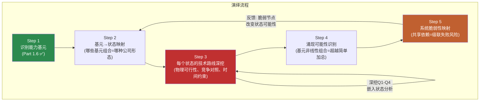

这一流程的关键设计: Step 3(技术路线深挖)是AI的核心优势区——从底层物理原理/工程约束出发，推导每条路径的可行边界。深挖Q1-Q4(FSD天花板/Optimus BOM/Autobidder壁垒/系统脆弱节点)直接嵌入对应状态的分析中，不作为独立章节存在。

### Part 2将做什么 / 不做什么

**将做**:
- 对每个状态进行深度技术路线分析，从物理第一性原理出发推导可行性边界
- 识别每个状态的可观测信号(什么数据能告诉我们这个状态正在接近或远离)
- 映射状态之间的依赖关系和级联效应(一个状态的进展如何影响其他状态)
- 检验涌现可能性(多条线同时成功会产生什么非线性效果)

**不做**:
- **不赋予状态概率**: "状态1有30%概率"是伪精度——我们连A型不确定性的概率空间都无法定义
- **不计算概率加权估值**: 5个状态 × 5个概率 = "精确的错误"。[主观判断: 方法论评估]
- **不推荐行动**: 投资者对不同状态的判断取决于其风险偏好和信息优势，报告不应替代这一判断

**原因**: A型不确定性意味着我们不知道概率分布的**形状**。这不是"FSD有60%概率成功"的问题——而是"FSD成功"本身的定义就有多种可能(L3? L4有限ODD? L4全域?)，每种定义导向不同的状态。在这种情况下赋概率是把认知的混沌伪装成数学的确定。

### AI在发现系统中的优势区与弱势区

**强优势(深挖)**:
- 技术架构分析: 纯视觉vs多传感器的物理约束推导、端到端NN架构拆解、BOM成本分解
- 供应链交叉验证: $1.1B供应链订单 → 量产级投入验证(不只是PPT)
- 跨公司模式识别: Waymo L4运营数据 vs Tesla FSD里程数据的结构性比较
- 组合可能性穷举: 6个基元的组合空间(2^6=64种组合)人脑无法系统遍历

**弱或无优势(诚实)**:
- 预测Musk行为: 人的决策不可建模 [主观判断]
- 预测监管结果: NHTSA/中国/欧盟的政策走向受政治博弈影响
- 预测市场时机: 何时"转折点"被市场定价无法推导
- 预测品牌走向: 消费者情感的拐点不可预测

### 5个未来状态预览

Part 2将对以下5个状态进行深度技术路线分析:

| 状态 | 描述 | 核心基元 | Part 2深度 |
|------|------|---------|-----------|
| **1: 自动出行网络** | FSD L4 → Cybercab无人驾驶 → 按里程收费 → Uber+AWS结合体 | FSD/AI栈 + 充电网络 + 品牌 | 深挖Q1(FSD天花板)嵌入 |
| **2: 能源基础设施巨头** | 储能规模化 → Autobidder成能源交易平台 → VPP → 虚拟电力公司 | 电池/能源 + 制造工程 | 深挖Q3(Autobidder壁垒)嵌入 |
| **3: 物理AI平台** | Optimus量产 → 通用人形机器人 → 物理世界操作系统 | FSD/AI栈 + 物理AI迁移 + 制造工程 | 深挖Q2(Optimus BOM)嵌入 |
| **4: 进化汽车商** | FSD保持L2+/L3 → 高端EV+能源稳步增长 → 更好版本的自己(默认路径) | 制造工程 + 品牌 + 充电网络 | 基准率分析 |
| **5: 衰退** | 中国流失+FSD跳票+品牌崩塌 → 多线承压 | (基元失效) | 深挖Q4(脆弱节点)嵌入 |

**结构提示**: 状态并非等权。状态4(进化汽车商)是"如果什么都不突破"的默认路径——历史基准率告诉我们，大多数"革命性"承诺最终温和落地。状态2(能源巨头)是证据最一致的方向。状态1和3是估值含量最高但证据最弱的方向。状态5是尾部风险。[合理推断: 基于Part 1事实基础]

---

---

## 免责声明

本报告为Tesla Complete v3.0 Phase 1产出，采用v9.0框架+发现系统方法论。

**本报告不提供**: 目标价、评级、仓位建议、操作指令、数字评分。

**本报告提供**: 财务事实基础、竞争全景、管理层行动分析、能力基元识别、可能性宽度评估、演绎方法论框架。

**三层置信标注**: [硬数据:] = 可验证事实 | [合理推断:] = 基于数据的逻辑推导 | [主观判断:] = 分析师判断

所有数据标注来源。所有推断标注逻辑链。所有判断标注为判断。

---

*Tesla Complete v3.0 Phase 1 | 2026-02-11 | v9.0 扬长避短 + 发现系统 v1.1*
