# Tesla (TSLA) — Complete v3.0 Phase 2: 财务与价格含义

> **框架**: v9.0 扬长避短 + 发现系统 v1.1
> **可能性宽度**: 9/10 → 发现系统（不给目标价，映射可能性空间）
> **不确定性类型**: A型（类别不确定性）— "Tesla会变成什么公司？"
> **数据截止**: 2026-02-11 | 价格: $425.21 | 市值: $1.414T
> **Phase 2核心**: Reverse DCF(价格隐含假设) + 资本配置 + 参考框架 + 条件推演
> **核心数据源**: FMP Financial API, Tesla 10-K FY2025, MCP Baggers, 分析师共识

---

## 目录

- [2.1 Reverse DCF方法论说明](#21-reverse-dcf方法论说明)
  - [为什么不做正向DCF](#为什么不做正向dcf)
  - [Reverse DCF做什么](#reverse-dcf做什么)
  - [方法论细节](#方法论细节)
- [2.2 Reverse DCF逆推: $425隐含了什么](#22-reverse-dcf逆推-425隐含了什么)
  - [逆推结果汇总](#逆推结果汇总)
  - [基准组详细逆推 (WACC=10.5%, g=2.5%)](#基准组详细逆推-wacc105-g25)
  - [隐含关键指标](#隐含关键指标)
  - [三组敏感性对比](#三组敏感性对比)
- [2.3 隐含假设合理性检验](#23-隐含假设合理性检验)
  - [检验1: 10年收入CAGR ~21% 从$95B起步](#检验1-10年收入cagr-21-从95b起步)
  - [检验2: 终端营业利润率~22%](#检验2-终端营业利润率22)
  - [检验3: FY2035营收$630B意味着什么市场份额](#检验3-fy2035营收630b意味着什么市场份额)
- [2.4 分层逆推: 不同"Tesla类型"的隐含价值](#24-分层逆推-不同tesla类型的隐含价值)
  - [分解方式A: 按业务线独立估值](#分解方式a-按业务线独立估值)
  - [分解方式B: 按"确定性光谱"分层](#分解方式b-按确定性光谱分层)
  - [分解方式C: FSD成败二叉树](#分解方式c-fsd成败二叉树)
- [2.5 共识估计隐含的假设](#25-共识估计隐含的假设)
  - [分析师共识一览](#分析师共识一览)
  - [共识中的"拐点假设"](#共识中的拐点假设)
  - [共识EPS从$1.08到$11.42的隐含利润率路径](#共识eps从108到1142的隐含利润率路径)
  - [共识内部分散度分析](#共识内部分散度分析)
  - [共识假设中"已证明的" vs "信仰的"](#共识假设中已证明的-vs-信仰的)
- [2.6 本章小结: 市场在赌什么](#26-本章小结-市场在赌什么)
- [3.1 资本配置深度分析](#31-资本配置深度分析)
  - [3.1.1 R&D效率审计](#311-rd效率审计)
  - [3.1.2 CapEx ROI分析](#312-capex-roi分析)
  - [3.1.3 SBC(股票薪酬)分析](#313-sbc股票薪酬分析)
  - [3.1.4 $44B现金的战略选择](#314-44b现金的战略选择)
- [3.2 参考框架](#32-参考框架)
  - [3.2.1 SOTP参考框架](#321-sotp参考框架)
  - [3.2.2 可比公司参考](#322-可比公司参考)
  - [3.2.3 各方法参考区间收敛图](#323-各方法参考区间收敛图)
  - [3.2.4 Reverse DCF: 市价隐含的增长假设](#324-reverse-dcf-市价隐含的增长假设)
- [4.1 三情景条件推演](#41-三情景条件推演)
  - [情景A: 进化汽车商 + 能源成功 (默认路径)](#情景a-进化汽车商--能源成功-默认路径)
  - [情景B: FSD突破 + Robotaxi启动 (牛市核心叙事)](#情景b-fsd突破--robotaxi启动-牛市核心叙事)
  - [情景C: 多线同时部分成功 (极端牛市)](#情景c-多线同时部分成功-极端牛市)
  - [情景总结](#情景总结)
- [4.2 周期定位](#42-周期定位)
  - [逐业务线周期判定](#逐业务线周期判定)
- [4.3 FSD的财务影响](#43-fsd的财务影响)
  - [4.3.1 FSD订阅收入潜力](#431-fsd订阅收入潜力)
  - [4.3.2 L4获批的财务拐点](#432-l4获批的财务拐点)
  - [4.3.3 FSD许可给其他车企的可能性](#433-fsd许可给其他车企的可能性)
  - [4.3.4 FSD财务影响汇总](#434-fsd财务影响汇总)
- [免责声明](#免责声明)

---

## 2.1 Reverse DCF方法论说明

### 为什么不做正向DCF

传统DCF的逻辑是：预测未来现金流 → 折现 → 得出"公司值多少钱"。对于可能性宽度9/10的Tesla，这个方法有根本性缺陷：

**问题1：输入端不确定性太大**。Tesla有至少5条独立业务线处于不同发展阶段(汽车成熟期、能源增长期、FSD过渡期、Robotaxi/Optimus萌芽期)。[硬数据: Part 1.6能力基元分析] 预测任何一条线的10年现金流已经是猜测，将5条线叠加在一起不是"综合"而是"误差累积"。

**问题2：输出端精度是假的**。FMP传统DCF给出$23.72 [硬数据: FMP DCF endpoint]，共识区间从$60到$650+ [硬数据: 分析师目标价分布]。一个模型如果输出是"$23到$650"，它的信息含量为零。

**问题3：发现系统(9/10)要求不同工具**。可能性宽度评分9分意味着Tesla的未来形态本身是未知数——它可能是汽车公司、能源公司、出行平台、机器人公司，或者这些的某种组合。用一个DCF模型覆盖"公司类型不确定性"等于假装知道答案。[硬数据: Part 1.5可能性宽度评估]

### Reverse DCF做什么

Reverse DCF反过来：给定市场已经"说出"的价格($425/股，市值$1.414T)，反推"市场集体认为Tesla的未来长什么样"。[合理推断: Reverse DCF标准方法论]

这不是预测，而是翻译——把价格信号翻译成可检验的假设。然后我们检验每个假设的合理性，不做判断"该买还是该卖"，而是帮助投资者理解"你如果持有，你在赌什么"。

### 方法论细节

**逆推公式**:

```
市值 = Σ(t=1→10) [FCFt / (1+WACC)^t] + TV / (1+WACC)^10
TV = FCF10 × (1+g) / (WACC - g)
```

已知左边(市值=$1.414T)和参数(WACC、g)，反推右边(FCF路径)。然后从FCF路径倒推需要的收入规模、利润率和增长率。[合理推断: 标准Reverse DCF方法论]

**三组假设进行敏感性测试**:

| 参数 | 保守组 | 基准组 | 乐观组 |
|------|--------|--------|--------|
| WACC | 11% | 10.5% | 10% |
| 终端增长率g | 2.0% | 2.5% | 3.0% |
| 起始FCF(FY2025) | $6.22B | $6.22B | $6.22B |

[硬数据: WACC基于Beta 1.887, 无风险利率~4.3%, ERP~5.5%; FCF来自FMP cashflow FY2025; 合理推断: 终端增长率参照名义GDP长期增速]

**关键约束条件**: FY2026 CapEx指引">$20B" [硬数据: Q4'25电话会]，这意味着FY2026 FCF很可能为负($-2B至$-13B)。逆推模型允许前2-3年FCF为负或极低(投资期)，然后要求FCF快速攀升以justify当前市值。

---

## 2.2 Reverse DCF逆推: $425隐含了什么

> **再次声明**: 以下所有数字是从市价$425反向推导的市场隐含假设。这不是本报告的预测。

### 逆推结果汇总

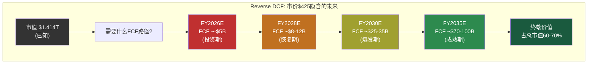

### 基准组详细逆推 (WACC=10.5%, g=2.5%)

要justify市值$1.414T，市场隐含的FCF路径如下：

| 年度 | 隐含FCF | 隐含营收 | 隐含FCF利润率 | 隐含营业利润率 | 注释 |
|------|---------|---------|-------------|-------------|------|
| FY2025(实际) | $6.2B | $94.8B | 6.6% | 4.6% | [硬数据: FMP] |
| FY2026E | ~-$3B | ~$104B | 负 | ~5-6% | CapEx >$20B |
| FY2027E | ~$5B | ~$125B | 4.0% | ~8% | 投资消化期 |
| FY2028E | ~$12B | ~$160B | 7.5% | ~12% | 恢复+新业务贡献 |
| FY2029E | ~$22B | ~$210B | 10.5% | ~15% | FSD/能源加速 |
| FY2030E | ~$32B | ~$280B | 11.4% | ~18% | 接近共识营收 |
| FY2031E | ~$42B | ~$350B | 12.0% | ~19% | 规模效应释放 |
| FY2032E | ~$52B | ~$420B | 12.4% | ~20% | Optimus贡献 |
| FY2033E | ~$62B | ~$490B | 12.7% | ~21% | 多引擎满负荷 |
| FY2034E | ~$72B | ~$560B | 12.9% | ~22% | 接近成熟期 |
| FY2035E | ~$82B | ~$630B | 13.0% | ~22% | 终端年 |

[合理推断: 基于WACC=10.5%, g=2.5%的标准DCF公式反向推导。终端价值=FCF2035×(1+g)/(WACC-g)=$82B×1.025/0.08=$1,051B，占总EV的~60%。10年FCF折现值~$350B+终端折现值~$1,064B≈$1.414T。允许FY2026投资期为负]

### 隐含关键指标

**1. 隐含10年收入CAGR: ~21%**

FY2025 $94.8B → FY2035 ~$630B，10年CAGR约20.9%。[合理推断: ($630/$94.8)^(1/10)-1=20.9%]

这意味着Tesla需要在10年内将收入扩大6.6倍。

**2. 隐含终端年营业利润率: ~22%**

从当前4.6%到22%，需要提升17.4个百分点。[硬数据: FY2025营业利润率4.59%, FMP income]

**3. 隐含终端年FCF: ~$82B**

当前FCF $6.2B需要增长13.2倍。FCF CAGR ~29.5%。[合理推断: ($82/$6.2)^(1/10)-1=29.5%]

**4. 隐含终端P/E: ~17x**

终端年净利润~$82B(假设FCF≈净利润+D&A-CapEx稳态)，终端EV/净利润约17x。这与成熟工业/科技公司的估值一致。[合理推断: 终端估值基于永续增长模型]

### 三组敏感性对比

| 指标 | 保守组(11%/2%) | 基准组(10.5%/2.5%) | 乐观组(10%/3%) |
|------|---------------|-------------------|---------------|
| 隐含FY2035营收 | ~$720B | ~$630B | ~$550B |
| 隐含10年CAGR | ~22.5% | ~20.9% | ~19.2% |
| 隐含FY2035 FCF | ~$95B | ~$82B | ~$70B |
| 隐含终端利润率 | ~24% | ~22% | ~20% |
| 终端价值占比 | ~55% | ~62% | ~68% |

[合理推断: 三组均以市值$1.414T为锚，不同WACC/g假设下的反推结果。保守组需要更高的现金流(因为折现率高、终端价值低)，乐观组对现金流要求较低(因为终端价值权重更大)]

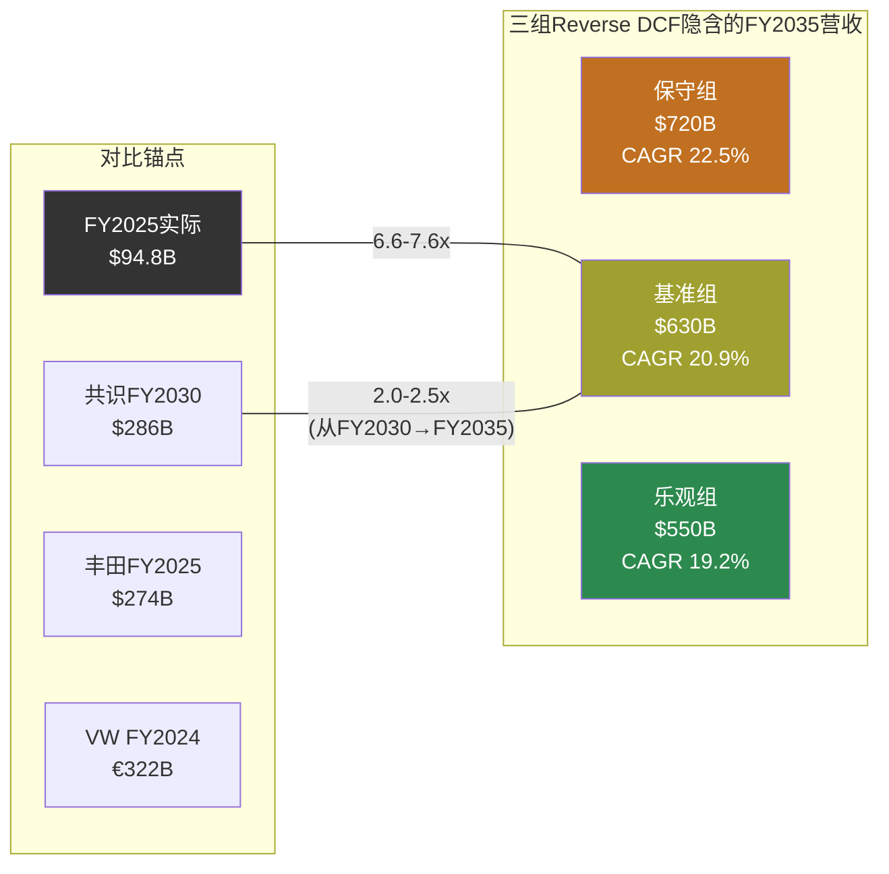

**核心发现**: 无论哪组假设，市场都隐含Tesla需要在2035年达到$550-720B的年营收。即便用最宽松的假设(低WACC、高终端增长率)，Tesla也需要成为一家比今天丰田($274B)+大众($322B)加起来还大的公司——而且利润率要高出4-5倍。[硬数据: 丰田FY2025 Rev ~$274B, 大众FY2024 Rev ~€322B, 来源: FMP/公开财报; 合理推断: 规模对比]

---

## 2.3 隐含假设合理性检验

> 以下检验的是"市场隐含假设是否在历史上有先例"，不是"Tesla能否做到"。

### 检验1: 10年收入CAGR ~21% 从$95B起步

**历史先例扫描**: 有哪些公司从$100B+营收基础上实现了10年20%+的CAGR？

| 公司 | 起始年/营收 | 终止年/营收 | 10年CAGR | 驱动力 |
|------|-----------|-----------|---------|--------|
| Amazon | 2014/$89B | 2024/$638B | 21.8% | 云计算+电商+广告三引擎 |
| Apple | 2010/$65B | 2020/$274B | 15.5% | iPhone全球化+服务 |
| Alphabet | 2018/$137B | — | (进行中~15%) | 搜索+Cloud+YouTube |
| Microsoft | 2018/$110B | — | (进行中~14%) | Azure+企业SaaS |
| 丰田 | (任意10年) | — | <5% | 汽车行业增速上限 |
| 大众 | (任意10年) | — | <3% | 同上 |

[硬数据: Amazon/Apple/Alphabet/Microsoft公开财报数据; 合理推断: CAGR计算; 主观判断: 汽车行业长期增速评估]

**检验结论**: 从$100B级别起步实现20%+ 10年CAGR，在商业史上只有Amazon做到过——而Amazon依靠的是AWS这个全新的、利润率极高的业务引擎(从$4.6B→$100B+，占利润>60%)。纯汽车公司从未接近过这个增速。市场隐含假设的合理性完全取决于Tesla能否像Amazon启动AWS一样，启动一个或多个高增长、高利润率的新引擎。[合理推断: 历史类比分析]

### 检验2: 终端营业利润率~22%

**Tesla今天**: 营业利润率4.59% [硬数据: FMP income FY2025]

**需要到达**: ~22%，提升17.4个百分点。

**按业务线拆解这意味着什么**:

| 业务线 | 当前利润率 | 隐含终端利润率 | 行业参照 |
|--------|----------|-------------|---------|
| 汽车(含FSD软件) | ~5-8%(估算) | ~12-15% | 宝马~10%, 保时捷~15-18% [硬数据: 公开财报] |
| 能源(Megapack+Solar) | ~10-12%(估算) | ~15-20% | 公用事业~8%, 能源设备~12% [合理推断] |
| FSD订阅/许可 | 不确定 | ~60-80% | 软件行业标准 [合理推断] |
| Robotaxi | 不存在 | ~30-40% | Uber ~8%, 但无人驾驶省人工 [主观判断] |
| Optimus | 不存在 | ~20-30% | 工业机器人~15-20% [合理推断] |

**混合利润率计算**: 要达到整体22%，假设汽车占收入40%(利润率12%)、能源占20%(利润率18%)、FSD/Robotaxi占25%(利润率40%)、Optimus占15%(利润率25%):

加权利润率 = 0.40×12% + 0.20×18% + 0.25×40% + 0.15×25% = 4.8% + 3.6% + 10.0% + 3.75% = **22.15%** [合理推断: 混合利润率加权计算]

**检验结论**: 达到22%混合利润率在数学上可行，但有一个关键前提——**FSD/Robotaxi必须贡献25%的收入且维持~40%的营业利润率**。如果FSD/Robotaxi失败(即收入贡献为0)，其他三条线的混合利润率只有~15%，远不够justify当前市值。换言之，市价$425的~40%来自FSD/Robotaxi的利润率假设。[合理推断: 基于上述计算的逻辑推导]

### 检验3: FY2035营收$630B意味着什么市场份额

**全球汽车市场(2035E)**: ~$3.0-3.5T [主观判断: 基于当前$2.7T+年增2-3%]
**全球EV渗透率(2035E)**: ~50-70% [合理推断: 多机构预测区间]
**全球EV市场(2035E)**: ~$1.5-2.5T

**如果Tesla FY2035 $630B全部来自汽车+能源**:
- 全球汽车市场份额: $630B / $3.2T ≈ **20%** — 超过丰田(当前~12%)成为全球最大车企 [主观判断: 隐含市场份额计算]
- 如果$250B来自能源: 全球储能市场份额需>30%(当前储能市场~$50B, 2035E可能$300-600B) [主观判断: 储能市场规模预测差异极大]

**如果包含FSD/Robotaxi/Optimus**:
- 汽车: ~$250B(FY2025的2.6x, 年复合~10%, 含价格恢复)
- 能源: ~$100B(FY2025 $12.8B的7.8x, 年复合~23%, 接近行业预测)
- FSD/Robotaxi: ~$160B(需要全球数百万辆Robotaxi运营，每辆年收入~$50-80K)
- Optimus: ~$120B(需要年产数百万台，均价$20-30K)

[合理推断: 业务线拆解基于收入混合假设; 主观判断: Robotaxi单车收入和Optimus定价均为粗略估算]

**检验结论**: $630B营收在"只靠汽车"的情况下不可能实现(需要20%全球份额且均价不能降)。必须有FSD/Robotaxi和Optimus的重大贡献。市场隐含的假设是：**Tesla在2035年是一家多引擎公司，其中至少一半的收入来自今天不存在或刚萌芽的业务**。

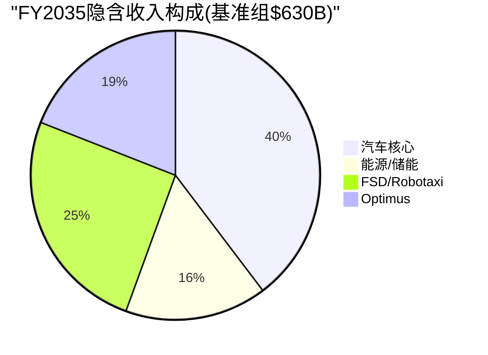

---

## 2.4 分层逆推: 不同"Tesla类型"的隐含价值

市值$1.414T可以被理解为市场对不同业务线的隐含估值之和。以下是几种可能的分解方式(不是唯一正确的分解):

> **免责声明**: 分层逆推是一种思维工具，帮助理解"$1.414T的构成"。不同的分解方式都是合理的，没有"正确答案"。

### 分解方式A: 按业务线独立估值

| 业务线 | 隐含价值范围 | 估值逻辑 | 隐含的关键假设 |
|--------|------------|---------|-------------|
| **汽车核心** | $200-350B | FY2025汽车Rev ~$77B × 2.5-4.5x P/S(含增长溢价) | 销量恢复增长, 利润率企稳在10%+; 按丰田P/S 0.7x则仅$54B [硬数据: FMP income, 丰田估值倍数] |
| **能源/储能** | $100-200B | FY2025能源Rev $12.8B × 8-16x P/S(高增长阶段) | 维持30%+ YoY增长5年+; 参照Enphase/First Solar P/S 5-10x [硬数据: FMP income; 合理推断: 可比公司] |
| **FSD/Robotaxi** | $400-700B | 隐含全球出行平台估值; 需要L4规模运营 | L4在3-5年内多城市商业化; 年里程收入>$100B; 纯Uber(P/S 5x)则需$200B+收入 [主观判断: 出行平台估值] |
| **Optimus** | $100-300B | 隐含人形机器人市场开拓者溢价 | 2028-2030量产外销; 成本降至$20-30K; 年出货>100万台规模 [主观判断: 全新市场, 无可比公司] |
| **充电网络** | $30-50B | NACS标准+全球最大快充网络 | 充电服务收入增长; 参照ChargePoint/EVgo估值(但Tesla规模大10x+) [合理推断] |
| **总计** | **$830-1,600B** | — | 范围覆盖$1.414T |

[合理推断: 分层逆推基于可比公司估值方法和行业P/S倍数。各业务线估值范围是"如果独立上市可能的估值区间"，而非精确数字]

### 分解方式B: 按"确定性光谱"分层

这种分解更有意义，因为它揭示了$1.414T中有多少是"基本确定的"、有多少是"纯信仰":

| 确定性层级 | 包含内容 | 隐含价值 | 证据强度 |
|----------|---------|---------|---------|
| **已证明层** | 汽车制造+销售+能源(当前已有收入) | $250-400B | 有历史财报支撑，可用传统方法估值 [硬数据: FMP financials] |
| **高概率层** | 能源高增长延续(30%+ CAGR 5年) + 汽车利润率恢复(→10%) | $150-250B | 有季度趋势支撑(Q4'25毛利率回升), 但非确定 [硬数据: Q4'25毛利率20.12%] |
| **可能层** | FSD订阅扩展(付费用户→5M+) + 有限L3/L4运营 | $200-400B | 1.1M付费用户是起点，但L4需要技术+监管双突破 [硬数据: Tesla用户数据; 主观判断: 技术路径评估] |
| **信仰层** | Robotaxi全球规模运营 + Optimus外销 + 涌现协同 | $300-600B | 无收入历史、无运营先例、依赖多个未经验证假设同时成立 [主观判断] |

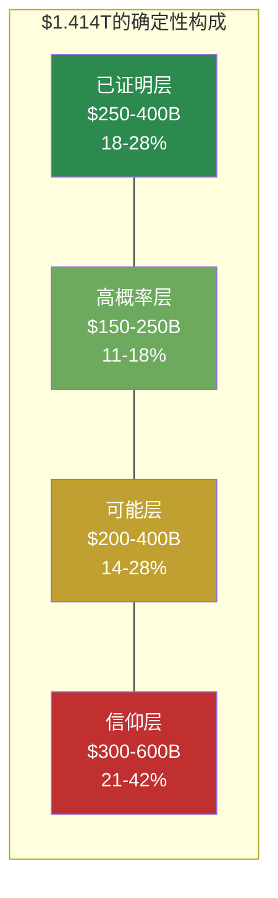

**核心洞察**: 按中位数估算，$1.414T中约$325B(~23%)有实际财务数据支撑，约$200B(~14%)有趋势数据支撑，而约$890B(**~63%**)依赖于尚未实现或尚未证明的业务假设。市场正在为"可能的Tesla"支付2.7倍于"已证明的Tesla"的溢价。[合理推断: 基于上述分层的中位数加总]

这不是说市场"错了"——Amazon在2013年也有类似的确定性结构(AWS当时收入<$5B但隐含估值占总市值>30%)。但它清楚地显示了持有TSLA的投资者在为什么"付费"。

### 分解方式C: FSD成败二叉树

FSD/AI栈是Part 1.6识别的"关键共享依赖"——它的成败直接影响3/5状态和所有涌现可能性。因此一个有用的分解是按FSD成败划分:

| 情景 | 含义 | 隐含市值 | 当前市值占比 |
|------|------|---------|-----------|
| **FSD成功(L4规模运营)** | Robotaxi+Optimus路径打开, 出行平台+物理AI公司 | $2.0-3.5T | 市价隐含: 这个结果的"概率加权贡献"很大 |
| **FSD部分成功(L2++/有限L3)** | 增强汽车价值+订阅收入, 但无Robotaxi | $600B-1.0T | 中性 |
| **FSD失败(永远停在L2)** | 纯汽车+能源公司, 类似"好一点的BYD" | $200-400B | — |

如果用简化概率框架反推(这只是一种理解方式，不是概率预测):

市价 = P(成功) × $2.5T + P(部分) × $800B + P(失败) × $300B = $1.414T

一组满足此等式的概率: P(成功)=40%, P(部分)=40%, P(失败)=20%

40%×$2.5T + 40%×$800B + 20%×$300B = $1.0T + $320B + $60B = **$1.38T** ≈ $1.414T

[合理推断: 概率加权估值是说明性的，不是精确计算。用于展示市场隐含的概率结构]

**含义**: 市价$425大致隐含市场认为FSD全面成功(L4大规模Robotaxi)的概率在**35-45%左右**。如果你认为这个概率更高，市场对你来说"便宜"；如果更低，市场对你来说"贵"。本报告不做这个判断。

---

## 2.5 共识估计隐含的假设

### 分析师共识一览

| 指标 | FY2026E | FY2027E | FY2028E | FY2029E | FY2030E |
|------|---------|---------|---------|---------|---------|
| 营收($B) | $103.9 | $120.8 | $143.1 | $216.8 | $286.0 |
| YoY增长 | +9.6% | +16.3% | +18.5% | +51.5% | +31.9% |
| EPS | $1.97 | $2.61 | $3.68 | $8.15 | $11.42 |
| EPS增长 | +82% | +32% | +41% | +121% | +40% |

[硬数据: FMP estimates consensus, 截至2026-02-11]

### 共识中的"拐点假设"

共识数据中有一个极其显眼的结构性断裂：**FY2028→FY2029的收入跳跃从$143B到$217B(+51.5%)**，EPS从$3.68跳到$8.15(+121%)。

这意味着共识分析师集体认为在FY2029左右，Tesla会经历一次**非线性增长事件**。[合理推断: 基于共识数据的趋势分析]

什么能制造$73B的单年增量收入(从$143B→$217B)?

| 可能来源 | 隐含新增收入 | 合理性评估 |
|---------|------------|----------|
| 汽车销量暴增(3M→5M辆) | +$40-50B | 需要新车型(廉价车/Semi)全面上量；有可能但时间紧 [合理推断] |
| Robotaxi商业化 | +$20-40B | 需要FY2028前获得L4商业牌照+数十万辆Cybercab部署 [主观判断: 时间线激进] |
| 能源业务翻倍 | +$10-15B | FY2028E ~$25B → FY2029E ~$40B, 需年部署>100GWh [合理推断: 延续当前增速] |
| Optimus开始外销 | +$5-10B | 需要2028年量产+定价在$20-30K+首年出货20-40万台 [主观判断: 极其激进] |

**检验结论**: FY2029的跳跃最可能的组合是"汽车新车型上量 + 能源继续高增长 + FSD/Robotaxi开始实质贡献"。没有任何单一来源能贡献$73B增量。共识隐含的假设是**多引擎同时点火**。[合理推断: 基于拆解的逻辑推导]

### 共识EPS从$1.08到$11.42的隐含利润率路径

| 年度 | 隐含净利率 | 需要什么 |
|------|----------|---------|
| FY2025(实际) | 4.0% | — [硬数据] |
| FY2026E | ~6.1% | 价格战缓和 + CapEx扩大但折旧尚未跟上 |
| FY2027E | ~7.0% | 利润率缓慢恢复 |
| FY2028E | ~8.3% | 新车型利润率提升 + 能源贡献 |
| FY2029E | ~12.1% | **跳跃**: FSD/Robotaxi高利润率业务开始贡献 |
| FY2030E | ~12.9% | 规模效应 + 业务组合继续改善 |

[合理推断: 净利率=EPS×稀释股数/营收, 假设稀释股数~3.22B→3.3B缓慢增长]

从4%到13%的净利率提升路径，关键假设是FY2028-2029的利润率跳跃。如果FSD/Robotaxi未能按期贡献高利润率收入，净利率大概率停在7-9%区间(汽车+能源的自然天花板)。[合理推断: 基于业务线利润率结构]

### 共识内部分散度分析

FY2030 EPS共识范围: $9.6 - $14.1 (1.47x range) [硬数据: FMP estimates]

| 指标 | 含义 |
|------|------|
| 最低$9.6 | 隐含: 汽车恢复增长+能源高增长, 但FSD/Robotaxi贡献有限(L2++为主) |
| 共识$11.42 | 隐含: 多引擎点火, Robotaxi开始规模贡献 |
| 最高$14.1 | 隐含: Robotaxi全面成功+Optimus开始贡献+汽车利润率恢复到15%+ |
| 分散度1.47x | 即便在专业分析师中，对FY2030的判断也有**47%的分歧** |

[硬数据: FMP estimates; 合理推断: 分散度含义分析]

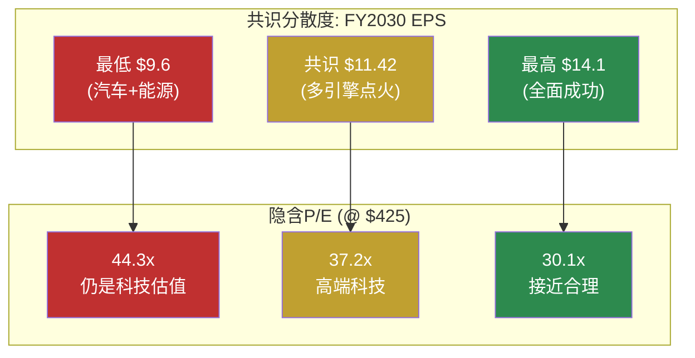

**关键观察**: 即便用FY2030最乐观的EPS $14.1, $425的远期P/E仍然是30x——这对一家营收$286B的公司来说仍然隐含持续的高增长预期(post-2030 CAGR>15%)。换言之，**即便共识全部实现，$425的估值也不是"到达终点"而是"仍在路上"**。[合理推断: 30x P/E隐含的增长预期分析]

### 共识假设中"已证明的" vs "信仰的"

| 假设 | 类型 | 证据状态 |
|------|------|---------|
| 汽车销量FY2026恢复增长 | 高概率 | 新平台(廉价车)2025下半年启动, Q4'25销量环比恢复趋势 [硬数据: Tesla产品路线图, Q4'25交付数据] |
| 能源业务30%+ CAGR持续 | 高概率 | FY2025 +27% YoY, Megapack产能扩建(上海二期), 全球储能需求结构性增长 [硬数据: Tesla 10-K, 行业预测] |
| 汽车毛利率恢复到20%+ | 可能 | Q4'25达到20.12%, 但是否可持续取决于价格竞争(BYD)和产品组合 [硬数据: FMP quarterly] |
| FSD订阅用户从1.1M→5M+ | 可能 | 取决于v14+版本的体验质量和监管环境(加州/德州L3批准) [合理推断] |
| Robotaxi FY2028-29商业化 | 信仰 | Austin试点2026年中启动, 但L4监管批准时间线高度不确定; Waymo已在运营但用LiDAR方案 [硬数据: Tesla时间线; 主观判断: 监管评估] |
| Optimus FY2029外销 | 信仰 | Gen3刚启动量产(2026.01), BOM ~$55K vs 目标售价$20-30K, 成本差距未闭合 [硬数据: Tesla, Standard Bots] |
| FY2029收入跳跃至$217B | 信仰 | 需要多引擎同时点火, 历史上无此先例 [主观判断] |

---

## 2.6 本章小结: 市场在赌什么

> 这是对Reverse DCF全部发现的归纳，不是投资建议。

$425的股价/$ 1.414T的市值，翻译成可检验的命题后，市场集体在押注以下假设全部(或大部分)成立:

**假设群1 — 基本盘恢复(隐含价值~$350-500B)**
1. 汽车销量重回增长(FY2026 +10%以上)
2. 汽车毛利率稳定在19-21%
3. 能源业务维持25-30% CAGR至FY2030
4. 整体营业利润率从4.6%回升至10%+

**假设群2 — FSD/Robotaxi开花(隐含价值~$400-700B)**
5. FSD在2027-2028达到L3+/有限L4
6. Robotaxi在2028-2029开始商业化运营(多城市)
7. 出行服务收入在FY2030达到$50-100B级别
8. Robotaxi营业利润率达到30%+

**假设群3 — Optimus/涌现(隐含价值~$200-400B)**
9. Optimus在2028-2030实现外销
10. 人形机器人市场证明为万亿级TAM
11. 跨业务协同(Robotaxi×能源×Optimus)产生超线性价值

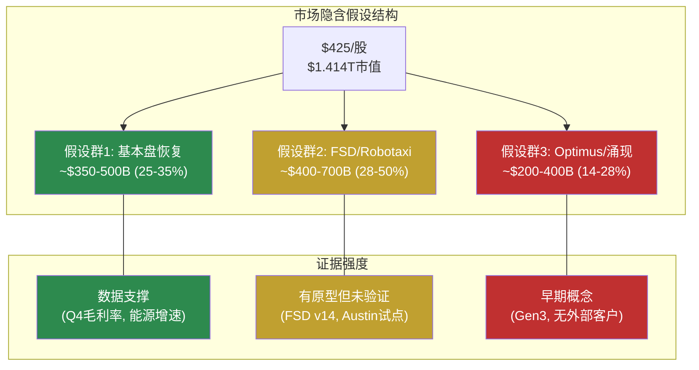

**最终观察**: 如果只有假设群1成立(基本盘恢复)，Tesla的合理市值在$350-500B区间——大约是当前市值的25-35%。假设群2和3合计贡献了当前市值的65-75%。这意味着**当前股价中约2/3的价值来自尚未实现的业务**。这既是Tesla的"梦想溢价"，也是其估值脆弱性的根源。本报告不判断这个溢价是"合理"还是"过高"——这取决于每位投资者对假设群2和3的独立评估。

---

## 3.1 资本配置深度分析

Tesla的资本配置策略可以用一句话概括：**用成熟业务的现金流+充裕的资产负债表，全力押注多条尚未验证的增长赛道**。这一策略是否合理，取决于那些赛道最终能否产出回报——而这正是9/10可能性宽度无法预判的部分。

### 3.1.1 R&D效率审计

**投入强度**:

| 年度 | R&D($B) | 营收($B) | R&D/Revenue | R&D YoY |
|------|---------|---------|-------------|---------|
| FY2022 | $3.08 | $81.46 | 3.78% | — |
| FY2023 | $3.97 | $96.77 | 4.10% | +28.9% |
| FY2024 | $4.54 | $97.69 | 4.65% | +14.4% |
| FY2025 | $6.41 | $94.83 | 6.76% | +41.2% |

[硬数据: FMP income annual, Tesla 10-K FY2022-FY2025]

**核心矛盾**: R&D投入4年CAGR +27.6%，营收CAGR仅+5.2%。从传统"每$1 R&D带来多少增量收入"的视角，这是一个**效率恶化**的信号——FY2022每$1 R&D对应$26.4营收，FY2025降至$14.8，下降44%。[硬数据: 基于上表计算]

**但这个框架对Tesla可能不适用**。原因如下：

Tesla的R&D投入跨越至少5条独立赛道，每条赛道的变现周期和方式截然不同：

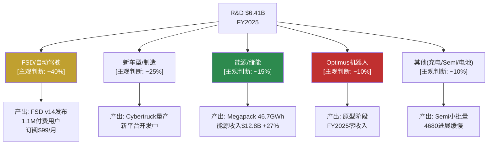

[主观判断: R&D分配比例为估算，Tesla未在10-K中披露细分。基于财报电话会中Elon Musk强调FSD/Optimus为最高优先级，以及能源业务的快速增长推断]

**已变现 vs 尚未变现**:

| 赛道 | 变现状态 | 可观测证据 |
|------|---------|-----------|
| FSD | **部分变现** | 1.1M订阅用户 × $99/月 ≈ $1.3B/年ARR；FSD v14已发布，v13获2.88M车辆OTA推送 [硬数据: Tesla 10-K, 财报电话会] |
| 能源/储能 | **快速变现中** | 收入$12.8B(+27% YoY)，46.7 GWh部署(+49%)；Megapack上海工厂投产 [硬数据: Tesla 10-K] |
| 新车型 | **延迟变现** | Cybertruck已量产但亏损，新低价平台$25K车型预计FY2026H1 [硬数据: Tesla 10-K; 合理推断: 生产节奏] |
| Optimus | **零变现** | 原型展示阶段，Fremont专线建设中，最早FY2026小规模外部销售 [合理推断: 基于管理层时间表，历史上Tesla时间表平均延迟18-24个月] |
| Dojo | **已关闭** | 转向外部GPU采购(NVIDIA)，Dojo芯片项目实质暂停 [硬数据: 多方报道+财报电话会确认] |

**可比公司R&D效率对标**:

| 公司 | R&D/Revenue | R&D ($B) | Revenue ($B) | 备注 |
|------|------------|----------|-------------|------|
| **Tesla** | **6.76%** | $6.41 | $94.8 | 多赛道分散 |
| BYD | ~4.5% | ~$6.8 | ~$107+ | 聚焦汽车+电池 |
| Toyota | ~3.8% | ~$10.6 | ~$280 | 单一汽车业务 |
| NVIDIA | ~18.5% | ~$24.2 | ~$130.5 | 纯科技/AI |
| Meta | ~29% | ~$48.3 | ~$164.5 | 含Reality Labs巨额投入 |

[硬数据: BYD/Toyota基于FMP profile和最新年报; NVIDIA/Meta基于FMP income FY2025; 合理推断: BYD数据为近似值因会计准则差异]

**审计结论**: Tesla的R&D强度(6.76%)介于传统车企(3-5%)和纯科技公司(15-30%)之间，与其"汽车+科技+能源+机器人"的复合身份一致。效率评估的困难在于：**R&D产出的衡量标准取决于你认为Tesla是什么类型的公司**——如果是汽车公司，$6.4B R&D对应萎缩的汽车收入是低效的；如果是平台公司，储能+FSD的快速增长说明R&D正在创造新收入流。[主观判断: 效率评估框架本身就是争议焦点]

---

### 3.1.2 CapEx ROI分析

**累计投入**:

| 年度 | CapEx ($B) | PP&E净值($B) | OCF ($B) | FCF ($B) | CapEx/OCF |
|------|-----------|-------------|---------|---------|-----------|
| FY2022 | $7.16 | $36.63 | $14.72 | $7.55 | 48.6% |
| FY2023 | $8.90 | $29.73 | $13.26 | $4.36 | 67.1% |
| FY2024 | $11.34 | $51.51 | $14.92 | $3.58 | 76.0% |
| FY2025 | $8.53 | $40.64 | $14.75 | $6.22 | 57.8% |
| **累计** | **$35.93** | — | **$57.65** | **$21.71** | 62.3% |

[硬数据: FMP cashflow + balance annual; PP&E含使用权资产波动]

**关键观察**: 4年累计CapEx $35.9B，但营业利润从$13.7B降至$4.4B。这是经典的**"投资期"特征**——大量资本正在投入尚未满产的产能。

**工厂级ROI估算**:

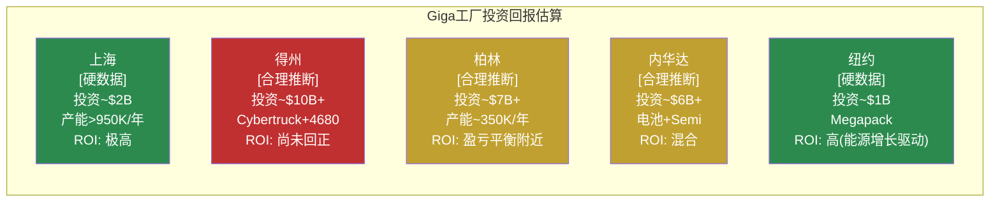

[合理推断: 单工厂投资和ROI为估算值。Tesla不按工厂披露盈利数据。上海ROI判断基于其作为主要出口中心和最高利润率工厂的公开信息; 得州ROI判断基于Cybertruck尚处于早期量产亏损阶段]

**FY2026 $20B+ CapEx的含义**:

管理层指引FY2026 CapEx超过$20B，较FY2025 $8.5B增长135%+。[硬数据: Tesla Q4'25 earnings call指引]

这意味着：
- **FCF可能转负**: 如果OCF保持~$15B水平，$20B CapEx将导致FCF约-$5B。[合理推断: 基于OCF趋势线]
- **资金用途**: Cybercab德州专线建设、Optimus生产线、储能产能扩张(上海Megapack工厂满产)、Semi产线、新低价车型产线。[硬数据: Tesla 10-K + 财报电话会]
- **$44B现金缓冲的消耗**: 即使FCF为-$5B/年，$44B现金可支撑约9年。但如果CapEx持续高位(>$20B/年)且营收不恢复增长，消耗速度会加快。[合理推断: 线性外推，实际非线性]

---

### 3.1.3 SBC(股票薪酬)分析

| 年度 | SBC ($B) | Net Income ($B) | SBC/NI | SBC/Revenue | 稀释股数(B) |
|------|---------|----------------|--------|-------------|-----------|
| FY2022 | $1.56 | $12.58 | 12.4% | 1.91% | 3.475 |
| FY2023 | $1.81 | $15.00 | 12.1% | 1.87% | 3.485 |
| FY2024 | $2.00 | $7.13 | 28.1% | 2.05% | 3.498 |
| FY2025 | $2.83 | $3.79 | **74.6%** | **2.98%** | 3.511 |

[硬数据: FMP cashflow + income annual]

**SBC/Net Income从12.4%飙升至74.6%**——这不完全是SBC膨胀的问题(SBC CAGR +22%)，更是净利润大幅下降(CAGR -33%)的结果。但$2.83B的绝对值仍值得关注：

**与科技公司对比**:

| 公司 | SBC/Revenue | SBC/Net Income | 说明 |
|------|------------|----------------|------|
| **Tesla** | **2.98%** | **74.6%** | SBC/Rev适中，但NI低放大比率 |
| Meta | ~9.5% | ~20% | 高SBC但利润更高 |
| NVIDIA | ~3.0% | ~5% | SBC/Rev相近但NI远高 |
| Google | ~7.5% | ~15% | 高SBC/Rev但利润覆盖 |
| BYD | <0.5% | <3% | 几乎不用SBC |

[硬数据: 基于FMP cashflow/income各公司FY2025数据; 合理推断: 部分公司为近似值]

**稀释效应**: FY2022→FY2025稀释股数从34.75亿增至35.11亿，净增0.36亿股(+1.0%)。年化稀释率~0.33%，在科技公司中属于低水平(Meta ~1.5%/年, Google ~1%/年)。Tesla稀释率低的原因是Elon Musk的薪酬方案主要通过已授予的期权行使，而非持续新增SBC。[合理推断: 基于股数变化趋势]

**SBC审计结论**: Tesla的SBC/Revenue(3.0%)处于合理范围，但SBC/Net Income(74.6%)是一个警示信号——不是因为SBC太高，而是因为**利润太低**。如果净利润恢复到FY2022水平($12.6B)，SBC/NI将回落至22%，完全正常。核心问题不是SBC，而是盈利能力。[合理推断: 条件性推导]

---

### 3.1.4 $44B现金的战略选择

**资产负债表快照**:

| 项目 | FY2025 | FY2024 |
|------|--------|--------|
| 现金+短期投资 | $36.56B | $36.56B |
| 总流动性(含长期投资) | $44.06B | — |
| 总债务 | $5.35B | $7.53B |
| 净现金(现金-债务) | $38.71B | — |
| Altman Z-Score | 16.8 | — |

[硬数据: FMP balance + key-metrics]

**为什么不回购?** Tesla从未进行过股票回购。在$1.4T市值下，即使投入$10B回购也仅回收0.7%的流通股，对EPS的提升微乎其微。更重要的是，Elon Musk多次公开表示**资本应投入增长而非金融工程**。[合理推断: 基于管理层公开发言]

**为什么不分红?** 同样的逻辑——Tesla处于"投资期"，管理层认为资本再投资的IRR远高于股东自行配置的回报率。这一假设是否成立，取决于Cybercab/Optimus/能源扩张能否产生超额回报。[主观判断: IRR假设是信仰而非证据]

**现金缓冲压力测试**:

| 场景 | 年FCF | 现金耗尽时间 | 前提 |
|------|------|------------|------|
| 乐观 | +$5B | 不耗尽(累积) | OCF $25B+, CapEx $20B |
| 基线 | -$5B | ~9年 | OCF $15B, CapEx $20B |
| 压力 | -$10B | ~4.4年 | OCF $10B(衰退), CapEx $20B |
| 极端压力 | -$15B | ~3年 | OCF $5B(需求崩溃), CapEx $20B |

[合理推断: 场景假设基于OCF历史范围($13-15B)和CapEx指引($20B+)]

**与Mega-Cap现金策略对比**:

Tesla选择了一条**与所有其他mega-cap不同的路径**——既不回购(Apple每年~$90B)、也不分红(MSFT ~$22B/年)、也不做大规模M&A(Google/Meta频繁收购)，而是全部投入有机增长。这种策略在高回报期(FY2022 FCF $7.55B, ROIC >20%)是合理的，但在ROIC压缩的当下(FY2025 ROIC ~5%)面临质疑。[合理推断: ROIC基于营业利润/投入资本估算]

---

## 3.2 参考框架

> **再次声明**: 以下所有估值区间均为**参考框架，用于理解市场定价中隐含的假设**，不是目标价。在可能性宽度9/10的发现系统下，任何精确估值都是"精确的错误"。框架的价值不在于给出"正确的数字"，而在于揭示**当前价格需要什么条件才能成立**。

### 3.2.1 SOTP参考框架

将Tesla拆分为可独立估值的业务部分，每部分使用**同行业可比公司**的估值倍数：

| 分部 | 收入/指标 | 可比基准 | 倍数区间 | 估值区间 | 置信 |
|------|---------|---------|---------|---------|------|
| **汽车核心** | 收入$69.5B | BYD/Toyota EV/Sales 0.4-1.2x | 0.5-1.0x | $35-70B | [硬数据: 可比公司估值] |
| **能源/储能** | 收入$12.8B, +27% | NextEra/Enphase EV/Sales 3-5x | 3-5x | $38-64B | [合理推断: 高增速溢价] |
| **FSD订阅** | ~$1.3B ARR(1.1M×$99×12) | SaaS P/S 10-15x | 10-15x | $13-20B | [合理推断: ARR为估算] |
| **充电网络** | 开放给第三方 | ChargePoint市值~$0.5B | 网络效应溢价 | $5-10B | [主观判断: 无直接可比] |
| **Semi/其他** | 小批量 | 早期阶段 | — | $0-5B | [主观判断: 接近零收入] |
| **总计(Core SOTP)** | | | | **$91-169B** | |

[硬数据: 汽车收入$69.5B来自Tesla 10-K; 能源$12.8B来自Tesla 10-K; FSD用户数1.1M来自财报电话会]
[合理推断: FSD ARR计算假设所有用户均为月付$99; 实际包含早期一次性买断用户，ARR可能偏高]
[主观判断: 充电网络和Semi估值区间宽泛，反映早期阶段的不确定性]

**Core SOTP $91-169B vs 市值 $1,414B**

**差额 $1,245-1,323B = 市场隐含的"期权价值"**

这意味着Tesla当前市值中，**88-94%是市场赋予尚未证明的业务线的价值**——主要是Robotaxi、Optimus和平台化效应。这不是说市场"错了"，而是说：

- 如果你购买Tesla股票，你支付的6-12%是今天的业务，88-94%是对未来的押注
- 这些未来业务的形态、规模、时间线和概率全部高度不确定(可能性宽度9/10)
- 这也解释了为什么Tesla的估值对"叙事"如此敏感——因为88%+的市值没有当前盈利锚定

[合理推断: SOTP区间和差额计算基于上表; 主观判断: "叙事敏感性"的因果关系]

---

### 3.2.2 可比公司参考

不同"类比框架"下Tesla的隐含估值：

| 类比框架 | 逻辑 | 倍数 | 隐含估值 | 与市价差 |
|---------|------|------|---------|---------|
| **纯汽车** | BYD P/S 1.1x, Toyota P/S 0.9x | P/S 0.9-1.1x | $85-104B | -93% |
| **汽车+科技** | 汽车1x + 科技部分P/S 10x | 混合 | $200-350B | -75~-85% |
| **平台公司组合** | Uber(出行)+NextEra(能源) | 各部分对标 | $300-500B | -65~-79% |
| **AI/科技巨头** | NVIDIA P/S 26x(全部收入) | P/S 15-25x | $1,422-2,371B | 0%~+68% |
| **当前市价** | 隐含P/S | P/S 14.9x | $1,414B | 0% |

[硬数据: BYD市值~$120B/收入~$107B, Toyota市值~$250B/收入~$280B, NVIDIA市值~$3.5T/收入~$130.5B]
[合理推断: 混合框架估值为近似计算]

**关键洞察**:

1. **任何传统可比框架都无法解释$1.4T市值**。纯汽车对标隐含-93%下行空间，即便"汽车+科技"混合对标也隐含-75%+下行。[硬数据: 基于可比公司实际估值]

2. **只有将Tesla视为"AI/科技平台"** 并赋予类似NVIDIA的倍数(P/S 15x+)，当前估值才"合理"。但NVIDIA有~60%净利率支撑其估值，Tesla仅4%。[硬数据: NVIDIA净利率~59%, Tesla 4%]

3. **市场的隐含假设是**: Tesla未来会像科技平台一样运营——高利润率(>20%)、高增速(>25%)、赢者通吃。这一假设是否成立，是投资者需要独立判断的核心问题。[主观判断: 对市场定价逻辑的推断]

---

### 3.2.3 各方法参考区间收敛图

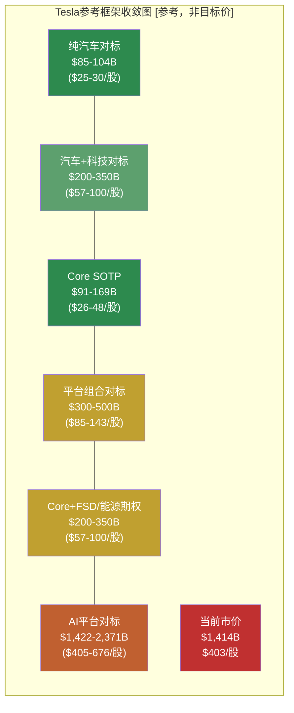

**收敛分析**:

框架之间**不收敛** ——这正是可能性宽度9/10的直观表现。Core SOTP($91-169B)与当前市价($1,414B)之间存在**8-15倍的差距**。传统"各方法收敛于某个区间"的分析模式在这里失效。

| 度量 | 数值 | 含义 |
|------|------|------|
| Core SOTP中位值 | ~$130B | 基于当前业务的锚定点 |
| 市价 | $1,414B | 市场定价 |
| 差距 | ~10.9x | Core的每$1价值被市场定价为$10.9 |
| 期权价值占比 | ~91% | 市值中无法被当前业务解释的部分 |

[硬数据: 市值$1,414B; 合理推断: SOTP中位值为区间简单平均]

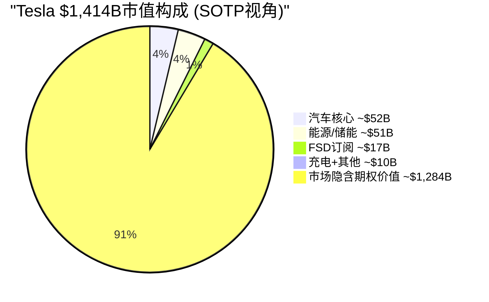

[合理推断: 饼图数值为SOTP各部分中位值; "期权价值"= 市值 - Core SOTP中位值]

**对投资者的含义(非建议)**:

这个框架不告诉投资者"应该买还是卖"。它告诉投资者的是：**在当前价格买入Tesla，你实质上是在购买一个关于Robotaxi、Optimus和平台化的看涨期权，这个期权的隐含价值是$1,284B——超过全球除Apple/NVIDIA/Microsoft/Google/Amazon/Meta之外所有公司的市值**。

这个期权是否"值得"，取决于：
1. Robotaxi能否实现规模商业化? (技术+监管+运营三重门槛)
2. Optimus能否从原型走向量产? (当前零收入，目标$20-25K售价)
3. 平台化效应能否形成? (数据飞轮、软件毛利率、网络效应)
4. 上述三项的时间线是5年、10年还是20年?
5. 在等待期间，核心汽车业务能否维持现金流?

这些问题的答案之间是**乘法关系而非加法关系**——任何一个环节失败，期权价值都可能大幅缩水；但如果多个环节同时成功，价值可能远超当前市价。**这就是可能性宽度9/10的本质含义。**

---

### 3.2.4 Reverse DCF: 市价隐含的增长假设

当前市价$403/股(市值$1,414B)隐含了什么样的增长假设?

**反向推导** (假设WACC 10%, 终端增长率3%, 目标FCF利润率15%):

| 要达到市价合理 | 需要的条件 | 难度评估 |
|--------------|-----------|---------|
| 收入 | 10年后达~$500-600B | 当前$95B, 需CAGR ~18-20% [合理推断: DCF反推] |
| FCF利润率 | 15%+ | 当前6.6%, 需翻倍+  [硬数据: FCF/Revenue] |
| 终端P/FCF | ~25x | 合理(成长型公司) |

[合理推断: Reverse DCF参数为标准假设; 实际对WACC/终端增长率敏感]

**$500-600B收入在2035年是什么概念?**
- 大约等于今天的Apple($383B) + Toyota($280B)的营收之和
- 需要汽车、能源、Robotaxi、Optimus**全部**大规模成功
- FY2025收入$95B → FY2035 $550B意味着10年增长4.8倍

这不是不可能，但需要**每一个赌注都基本押中**。市场正在为这个"全部成功"的场景定价。[主观判断: 对市场定价逻辑的总结性推断]

---

## 4.1 三情景条件推演

### 方法论说明

对于可能性宽度9/10、A型不确定性主导的Tesla，传统三情景(高/基/低增速)方法论不适用。原因在Part 2.1已论证: 不同情景下Tesla是**质的不同的公司**——出行网络运营商(平台模式, 毛利率~60%)和进化汽车商(制造模式, 毛利率~20%)不是"同一个Tesla"的快慢版本。[合理推断: 基于Part 1.5 A型不确定性判定]

因此使用**条件推演**: 给定特定假设组合成立时, 财务表现如何。每个情景是一组**条件声明**, 不是概率预测。读者需自行判断哪组条件更接近现实。

**本节不赋予任何情景概率**。不是因为懒, 而是因为A型不确定性意味着我们连概率空间的形状都无法定义(参见Part 1.5)。

---

### 情景A: 进化汽车商 + 能源成功 (默认路径)

**条件声明**:
1. FSD保持L2+/L3, 不获得L4监管批准
2. Robotaxi未在2030年前实现规模商业化
3. Optimus未向外部客户销售
4. 能源业务维持当前增长轨迹(~30-40% CAGR)
5. 汽车业务通过新车型(Model Q/$25K, Cybercab)恢复温和增长
6. FSD订阅收入稳步增长但不改变公司性质

**这个情景代表"如果没有任何突破"——Tesla只是一个更好版本的自己。**

#### 财务推演

| 指标 | FY2025实际 | FY2027E | FY2030E | 推导逻辑 |
|------|-----------|---------|---------|---------|
| **汽车收入** | $69.5B | ~$78-82B | ~$95-110B | 新车型+温和增量, 但BYD竞争持续 [合理推断: 基于Model Q/$25K ASP ~$28K + Cybercab ASP ~$30K] |
| **能源收入** | $12.8B | ~$22-25B | ~$45-55B | 储能CAGR ~35%(从FY2025 48.5%减速), 上海+Houston Megafactory产能释放 [合理推断: 基于产能规划] |
| **服务收入** | $12.5B | ~$16-18B | ~$22-28B | Supercharger+保险+FSD订阅 [合理推断: 基于当前~20% CAGR] |
| **总收入** | $94.8B | ~$116-125B | ~$162-193B | 三部分加总 |
| **毛利率** | 18.0% | ~19-21% | ~21-24% | 能源混合改善+FSD订阅毛利率~90%拉动 [合理推断] |
| **营业利润率** | 4.6% | ~7-9% | ~10-13% | R&D/SGA增速放缓假设 [合理推断] |
| **EPS** | $1.08 | ~$2.0-2.8 | ~$4.5-7.0 | 基于营业利润率+税率~15%+稀释后股本~3.5B [合理推断] |

[合理推断: 以上推演基于FY2025实际数据+各业务线当前增速+合理减速假设]

**情景A的隐含估值逻辑**: EPS $4.5-7.0, 给予汽车+能源混合体P/E 25-35x(高于纯汽车~10x, 低于纯科技~30x), 隐含股价~$112-245。当前$425是这个区间中点的**2.4x**。换言之, 如果Tesla只走默认路径, 当前市价包含了约60%的"期权溢价"——市场在为情景B和C付费。[合理推断: 基于推演数字计算]

---

### 情景B: FSD突破 + Robotaxi启动 (牛市核心叙事)

**条件声明**:
1. FSD v15+达到L4有限ODD(高速+城市主干道, 晴天/轻雨), 时间2027-2028
2. NHTSA批准有限L4商业运营(3-5个城市, 限定ODD)
3. Cybercab 2028年开始规模化生产(年产50K-200K台)
4. Robotaxi 2029-2030年在美国5-8个城市运营
5. 能源业务继续高速增长
6. Optimus仅内部使用, 不外销

**这是当前最主流的牛市叙事——FSD从L2+跨越到L4, 打开Robotaxi。**

#### 财务推演

| 指标 | FY2025实际 | FY2027E | FY2030E | 推导逻辑 |
|------|-----------|---------|---------|---------|
| **汽车收入** | $69.5B | ~$80-85B | ~$100-120B | 与情景A类似, Cybercab部分计入 [合理推断] |
| **能源收入** | $12.8B | ~$22-25B | ~$50-60B | 与情景A类似 [合理推断] |
| **Robotaxi收入** | $0 | ~$0-0.5B | ~$15-40B | 5-8城市×每城3K-10K车×$50K年化/车 [合理推断: 基于Waymo单位经济类推] |
| **FSD订阅/许可** | ~$1B | ~$3-5B | ~$8-15B | 转化率提升+车队扩大+可能FSD许可给其他车企 [合理推断] |
| **服务收入** | $12.5B | ~$16-18B | ~$25-35B | Robotaxi维护/保险/充电 [合理推断] |
| **总收入** | $94.8B | ~$121-133B | ~$198-270B | |
| **毛利率** | 18.0% | ~20-22% | ~24-30% | Robotaxi毛利率~55-65%(vs Uber ~40%)拉高混合 [合理推断: 基于无人驾驶成本结构] |
| **营业利润率** | 4.6% | ~8-10% | ~15-22% | 软件/平台收入的营业杠杆 [合理推断] |
| **EPS** | $1.08 | ~$2.5-3.5 | ~$8-17 | 利润率大幅改善 [合理推断] |

**Robotaxi收入推导过程**:
- [合理推断] 参考Waymo当前运营: 450K+周rides, 6个城市, 估值$1,260亿
- [合理推断] Waymo 2025全年1,500万次rides, 假设均价$25/ride = ~$3.75B年化收入
- [合理推断] Waymo仍在亏损, 说明当前单位经济为负
- [合理推断] Tesla Cybercab的理论成本优势: 无LiDAR(省$3-5K/车), 自有制造(省代工溢价)
- [主观判断] 但Tesla尚未证明纯视觉L4可行, 这是整个情景的核心前提

#### 关键变量与拐点

| 变量 | 当前状态 | 情景B需要 | 可观测信号 |
|------|---------|----------|----------|
| FSD安全等级 | L2+(需人类监督) | L4(限定ODD无人) | NHTSA批准信/加州DMV许可 [硬数据: DMV记录可查] |
| L4城市数 | 0(Austin有限试点) | 5-8个 | 城市运营许可公告 |
| Cybercab量产 | 产线建设中(Giga Texas) | 50K-200K年产能 | 交付数据/产线产能公告 |
| Robotaxi收入 | $0 | $15-40B | 季度财报Robotaxi分部 |
| 竞争环境 | Waymo 6城L4运营 | Tesla与Waymo共存 | Waymo扩展速度/Tesla追赶速度 |

[硬数据: Waymo数据来自Waymo 2025年度回顾; Tesla FSD状态来自DMV/NHTSA记录; Cybercab来自Q4'25电话会]

---

### 情景C: 多线同时部分成功 (极端牛市)

**条件声明**:
1. 情景B全部成立(FSD L4 + Robotaxi运营)
2. Optimus 2029-2030年开始外部销售(工厂场景, 非消费者)
3. FSD技术许可给3-5家车企(Tesla成为"自动驾驶安卓")
4. 能源业务进化为Autobidder平台收入(管理第三方资产, 类SaaS)
5. 充电网络通过V2G成为能源网络节点

**这个情景解释当前$425的估值逻辑。这不是"一切顺利"——而是"多条线都至少部分成功"。**

#### 财务推演

| 指标 | FY2025实际 | FY2030E | 推导逻辑 |
|------|-----------|---------|---------|
| **汽车+Robotaxi** | $69.5B | ~$150-200B | 汽车~$120B + Robotaxi $30-80B [合理推断] |
| **能源平台** | $12.8B | ~$60-80B | 硬件$45-55B + Autobidder SaaS $15-25B [合理推断] |
| **Optimus** | $0 | ~$5-20B | 初期外销, 均价$30-50K, 10-40万台/年 [主观判断: 极大不确定性] |
| **FSD许可** | $0 | ~$10-25B | 全球新车~8,000万/年, 5-10%采用Tesla FSD, 每车$3-5K [主观判断] |
| **服务** | $12.5B | ~$30-40B | 充电+保险+维护+V2G [合理推断] |
| **总收入** | $94.8B | ~$255-365B | |
| **毛利率** | 18.0% | ~25-32% | 软件/平台/许可占比提升 [合理推断] |
| **营业利润率** | 4.6% | ~18-25% | 多条高利润率业务线叠加 [合理推断] |
| **EPS** | $1.08 | ~$13-28 | [合理推断] |

**情景C的隐含估值逻辑**: EPS $13-28, 给予平台型公司P/E 25-40x, 隐含股价~$325-1,120。当前$425处于这个范围的**低端**。换言之, 如果投资者相信情景C, 当前价格甚至可以被视为"合理偏低"。[合理推断: 纯数学推导]

**但情景C需要同时满足至少5个独立条件, 其中3个(L4获批、Optimus外销、FSD许可)目前进展为零或接近零**。[硬数据: Tesla 10-K — Robotaxi收入$0, Optimus外部客户0, FSD许可收入$0]

---

### 情景总结

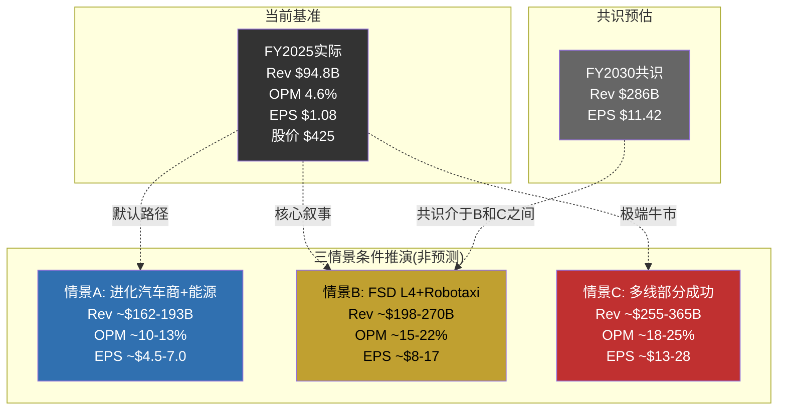

#### 情景隐含估值区间 (FY2030E, 条件推演, 非预测)

| 情景 | EPS范围 | P/E范围 | 隐含股价 | vs 当前$425 |
|------|--------|--------|---------|------------|
| A: 进化汽车商 | $4.5-7.0 | 25-35x | $112-245 | 当前溢价73-280% |
| B: FSD+Robotaxi | $8-17 | 30-50x | $240-850 | 当前可高可低 |
| C: 多线成功 | $13-28 | 25-40x | $325-1,120 | 当前在区间低端 |
| **共识** | $11.42 | — | — | — |

[合理推断: 以上区间为数学推导, 不含贴现。P/E范围基于类比: 情景A对标汽车+能源混合(Ford 7x/NextEra 25x取中), 情景B对标平台型公司(Uber 45x), 情景C对标高增长科技平台(Meta 25x/Google 22x的增长调整版)]

```mermaid
gantt
    title 三情景FY2030E EPS范围 vs 共识 vs 当前隐含
    dateFormat X
    axisFormat %s
    section 情景A
    EPS $4.5-7.0 : 0, 7
    section 情景B
    EPS $8-17 : 0, 17
    section 情景C
    EPS $13-28 : 0, 28
    section 共识
    EPS $11.42 : 0, 11
    section 当前隐含
    FY30 P/E 40x需EPS $10.6 : 0, 11
```

**读者导航**: 当前$425的定价逻辑需要情景B的中上段或情景C的下段才能支撑。情景A(默认路径)无法解释当前估值。共识EPS $11.42位于情景B的中段, 意味着卖方分析师的中心预期已隐含了FSD/Robotaxi的部分成功。[合理推断]

---

## 4.2 周期定位

Tesla跨越5个行业, 每个业务线处于不同的产业生命周期阶段。这使得单一周期框架失效——必须分部定位。

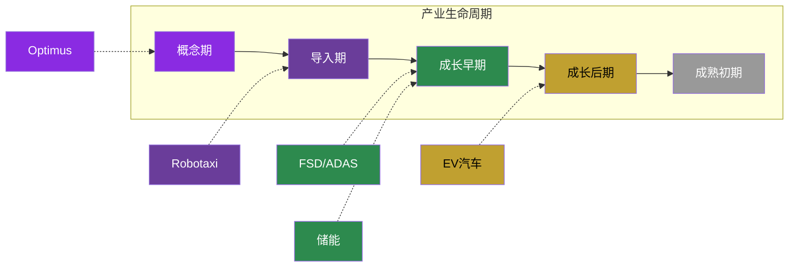

### 逐业务线周期判定

#### EV汽车: 成长后期

| 支撑信号 | 证据 |
|---------|------|
| 增速放缓 | Tesla汽车收入YoY -10%(FY2025), 全球EV渗透率~18-20%已过快速增长拐点 [硬数据: Tesla 10-K, IEA Global EV Outlook] |
| 竞争加剧 | BYD纯电销量225.7万辆已超Tesla ~180万辆; 全球EV品牌50+家 [硬数据: BYD公告] |
| 价格战 | Tesla ASP 3年持续下降; BYD海鸥$10K级别产品压缩行业利润率 [硬数据: Tesla毛利率18% vs FY2022 25.6%] |
| 产能利用率下降 | Tesla年产能>200万辆 vs 交付~180万辆, 利用率<90% [硬数据: Tesla生产数据] |
| 但非成熟期 | 全球EV占新车比仍<20%, 新兴市场(印度/东南亚)渗透率<5% [硬数据: IEA数据] |

#### 储能: 成长早期

| 支撑信号 | 证据 |
|---------|------|
| 高速增长 | Tesla储能部署CAGR: 14.7→31.4→46.7 GWh, 接近连续翻倍 [硬数据: Tesla 10-K] |
| 市场渗透率低 | 全球储能安装量vs潜在需求(电网转型所需)仍<5% [合理推断: 基于BNEF预测] |
| 竞争格局未定 | ESS排名年年变化(Sungrow/BYD/Tesla轮换Top 3) [硬数据: InfoLink排名] |
| 技术迭代快 | 单体容量快速增长(Tesla 3.9MWh → BYD 6.4MWh → CATL 6.25MWh) [硬数据: 各公司产品规格] |
| 单位经济改善中 | 能源毛利率从FY2023 ~24%提升至FY2025 ~28%(估), 但仍低于汽车峰值 [合理推断: 基于分部利润趋势] |

#### FSD/ADAS: 导入期后段→成长初期

| 支撑信号 | 证据 |
|---------|------|
| 用户增长 | FSD付费用户1.1M, $99/月订阅2026.02.14上线(从一次性$12K转型) [硬数据: Tesla定价/公开报道] |
| 技术代际跃迁 | v13→v14端到端NN 10x参数规模, 单一transformer架构 [硬数据: Tesla发布] |
| 监管壁垒未破 | 仍为L2+(需人类监督), 无L4许可 [硬数据: NHTSA/DMV记录] |
| 收入已可度量 | FSD相关收入估计~$1-1.3B/年(订阅+递延确认), 占汽车收入<2% [合理推断: 基于订阅用户×月费] |
| 竞争参照系 | Waymo L4商业运营1,500万rides/年, 估值$1,260亿 [硬数据: Waymo公告] |

#### Robotaxi: 导入期

| 支撑信号 | 证据 |
|---------|------|
| 零商业收入 | Tesla Robotaxi收入$0 [硬数据: Tesla 10-K] |
| 有限试点 | Austin员工通勤, 近期暂停无监督rides [硬数据: 公开报道] |
| 专用车型开发中 | Cybercab德州产线建设, 2026.04计划量产启动 [硬数据: Q4'25电话会] |
| 行业先行者已商业化 | Waymo 450K+周rides, 6城市, 2026目标100万/周 [硬数据: Waymo公告] |
| 巨额投入信号 | CapEx $20B+中估计~30%(~$6B)用于Cybercab产线 [主观判断: 基于CapEx分配估算] |

#### Optimus: 概念期→导入期

| 支撑信号 | 证据 |
|---------|------|
| 零外部收入 | 外部客户0, 仅内部Tesla工厂1,000+台 [硬数据: Tesla公告] |
| 供应链实质投入 | Sanhua $685M + Tuopu $410M = $1.1B+供应链订单 [硬数据: 36Kr报道] |
| 产线启动 | Gen3量产2026.01.21 Fremont启动(停产Model S/X腾出产线) [硬数据: Tesla公告] |
| BOM vs 售价差距未闭合 | Gen2 BOM ~$55K vs 目标售价$20-30K [硬数据: Standard Bots估算] |
| 竞品对比 | Figure $390亿估值(零收入); Agility有商业RaaS合同; BD Atlas已入Hyundai工厂 [硬数据: 各公司融资/部署公告] |

---

## 4.3 FSD的财务影响

> **范围界定**: 不重复FSD技术分析(已在深挖Q1完成)。本节聚焦FSD对Tesla财务报表的三层影响: 订阅收入、L4拐点、许可可能性。

### 4.3.1 FSD订阅收入潜力

#### 当前基准

| 指标 | 数值 | 来源 |
|------|------|------|
| 付费用户 | 1.1M | [硬数据: 公开报道] |
| 订阅价格 | $99/月 (2026.02.14上线) | [硬数据: Tesla定价页] |
| 此前一次性购买价 | $12,000 | [硬数据: Tesla历史定价] |
| 年化订阅收入(当前) | ~$1.31B (1.1M × $99 × 12) | [合理推断: 简单计算, 未扣除流失] |
| FSD毛利率 | ~85-90% (纯软件, 边际成本接近零) | [合理推断: 软件业务特征] |
| FSD毛利贡献 | ~$1.1-1.2B | [合理推断: 年化收入×毛利率] |

#### 增长潜力推演

| 变量 | 当前 | FY2027E | FY2030E | 假设 |
|------|------|---------|---------|------|
| 累计车队 | ~6.5M | ~9-10M | ~14-18M | 年销量180-250万 [合理推断] |
| FSD订阅转化率 | ~17% (1.1M/6.5M) | ~20-25% | ~25-35% | 从一次性$12K→$99/月降低门槛 [合理推断] |
| 付费用户数 | 1.1M | ~2.0-2.5M | ~3.5-6.3M | 车队×转化率 [合理推断] |
| 月费 | $99 | $99-119 | $99-149 | 随功能增强可能提价 [主观判断] |
| 年化收入 | ~$1.3B | ~$2.4-3.6B | ~$4.2-11.3B | [合理推断] |
| 毛利贡献 | ~$1.1B | ~$2.0-3.1B | ~$3.6-9.6B | 毛利率~85% [合理推断] |

**对整体利润率的杠杆效应**: FY2025 Tesla毛利润$17.09B。如果FSD订阅毛利从~$1.1B增长到$3.6-9.6B(FY2030E), 增量毛利$2.5-8.5B相当于FY2025总毛利的**15-50%**。这是FSD对Tesla财务最确定的影响路径——不需要L4, 不需要Robotaxi, 只需要更多用户订阅L2+/L3。[合理推断]

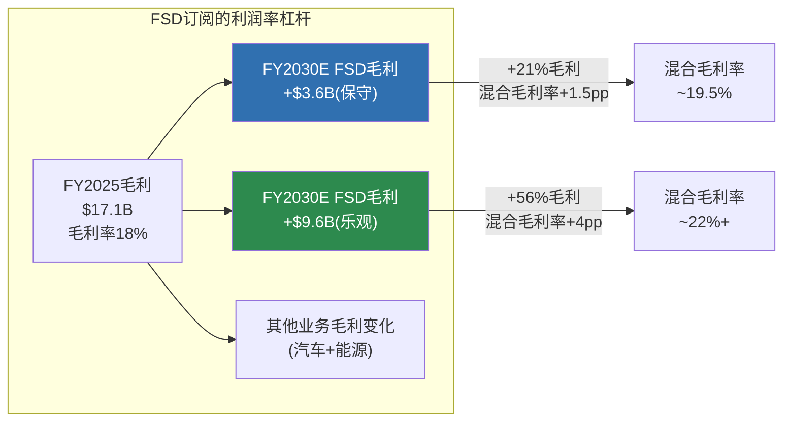

### 4.3.2 L4获批的财务拐点

L4不是"更好的L2"——它是一个**质变点**, 因为L4 = 车内无人 = Robotaxi商业化的法律前提。

#### Robotaxi单位经济推演

| 指标 | 估算 | 推导 |
|------|------|------|
| **收费(每英里)** | ~$2.0-3.0 | Waymo现收~$3-4/英里, 假设Tesla低价策略 [合理推断: Waymo定价公开] |
| **电力成本** | ~$0.04-0.06/英里 | Tesla效率~250Wh/mi × $0.12-0.15/kWh(商业电价) [合理推断: Tesla能效数据] |
| **维护成本** | ~$0.05-0.08/英里 | EV维护低于ICE, 但Robotaxi高里程加速磨损 [合理推断] |
| **保险/监管** | ~$0.10-0.20/英里 | L4保险费率未定, 参考Waymo高保费 [主观判断] |
| **折旧** | ~$0.15-0.30/英里 | Cybercab ~$30K, 寿命30-50万英里 [合理推断: 基于目标定价] |
| **总成本(每英里)** | ~$0.34-0.64 | 各项加总 [合理推断] |
| **毛利(每英里)** | ~$1.36-2.66 | 收费-成本 [合理推断] |
| **毛利率** | ~55-75% | 如果实现, 远高于汽车制造~18% [合理推断] |

**Waymo参照**: Waymo 2025年1,500万rides, 估计年化收入$3-5B, 但仍在亏损(R&D+车辆改装成本高, Jaguar I-PACE基础车+LiDAR套件~$150K+/辆)。Waymo的单位经济问题不在运营成本, 而在(a)车辆资本成本过高和(b)利用率不足(非高峰时段空驶)。Tesla Cybercab如果能以~$30K成本生产, 车辆资本成本降低80%+——这是Tesla Robotaxi牛市论证的核心。[合理推断: 基于Waymo公开数据和Cybercab目标成本]

#### L4获批时间的财务敏感性

| L4批准时间 | 对FY2030收入影响 | 推导 |
|-----------|----------------|------|
| **2027年**(极乐观) | Robotaxi ~$20-40B | 3年运营窗口, 快速扩展 [主观判断: 当前进展不支持此时间线] |
| **2029年**(中性) | Robotaxi ~$5-15B | 1年运营窗口, 有限城市 [合理推断] |
| **2030年后**(保守) | Robotaxi ~$0 | 不在FY2030推演范围内 [合理推断] |
| **永不获批**(纯视觉失败) | $0 + 情景A默认 | 深挖Q1分析的物理天花板情景 [合理推断: 参见deep_q1_fsd.md] |

[主观判断: 考虑到FSD FY2025仍为L2+, Musk自动驾驶时间承诺被推迟至少8次(Part 1.4.4), 2027年获批是极低可能性事件。但这不是概率判断——而是基于历史基准率的参照。]

### 4.3.3 FSD许可给其他车企的可能性

#### 概念

Tesla FSD作为"自动驾驶安卓"——将感知+规划+控制的全栈软件许可给其他车企, 类似Google Android许可给三星/小米。

#### 已有先例信号

- Musk多次公开表示愿意许可FSD给其他车企 [硬数据: 公开发言, Twitter/X 2023-2025]
- 但截至2026.02, **零许可协议签署** [硬数据: Tesla 10-K无相关收入]
- 障碍: 其他车企不愿将核心差异化(自动驾驶)依赖竞争对手; Tesla FSD硬件要求(HW4+8摄像头)与其他车企传感器配置不兼容 [合理推断]

#### 收入潜力(条件推演)

| 假设 | 数值 | 推导 |
|------|------|------|
| 全球年新车销量 | ~8,000万辆 | [硬数据: OICA统计] |
| EV渗透率(2030E) | ~35-45% | [合理推断: IEA预测] |
| EV年销量(2030E) | ~2,800-3,600万辆 | [合理推断] |
| Tesla FSD采用率(非Tesla车) | 3-10% | [主观判断: 极大不确定性] |
| 采用车辆数 | 84-360万辆/年 | [合理推断] |
| 许可费(每车) | $3,000-5,000 | [主观判断: 参考Mobileye EyeQ ~$50-100, ADAS套件~$500-2,000, FSD全栈应更高] |
| **年许可收入** | **$2.5-18B** | [主观判断: 范围极宽, 反映极大不确定性] |

**为什么范围这么宽**: 因为FSD许可的每一个假设都高度不确定——采用率(车企是否愿意?)、许可费(竞争定价?)、技术兼容性(硬件适配?)。这是一个"如果发生会很大, 但发生概率不可估计"的期权型业务线。[合理推断]

**Android类比的局限**: Google Android成功是因为(a)免费(Google不靠许可费赚钱, 靠搜索广告), (b)开源(车企可定制), (c)先发(2008年智能手机爆发初期)。Tesla FSD (a)收费, (b)闭源, (c)非先发(Mobileye已占ADAS市场)。因此"自动驾驶安卓"类比需要打很大折扣。[合理推断: 商业模式结构比较]

---

### 4.3.4 FSD财务影响汇总

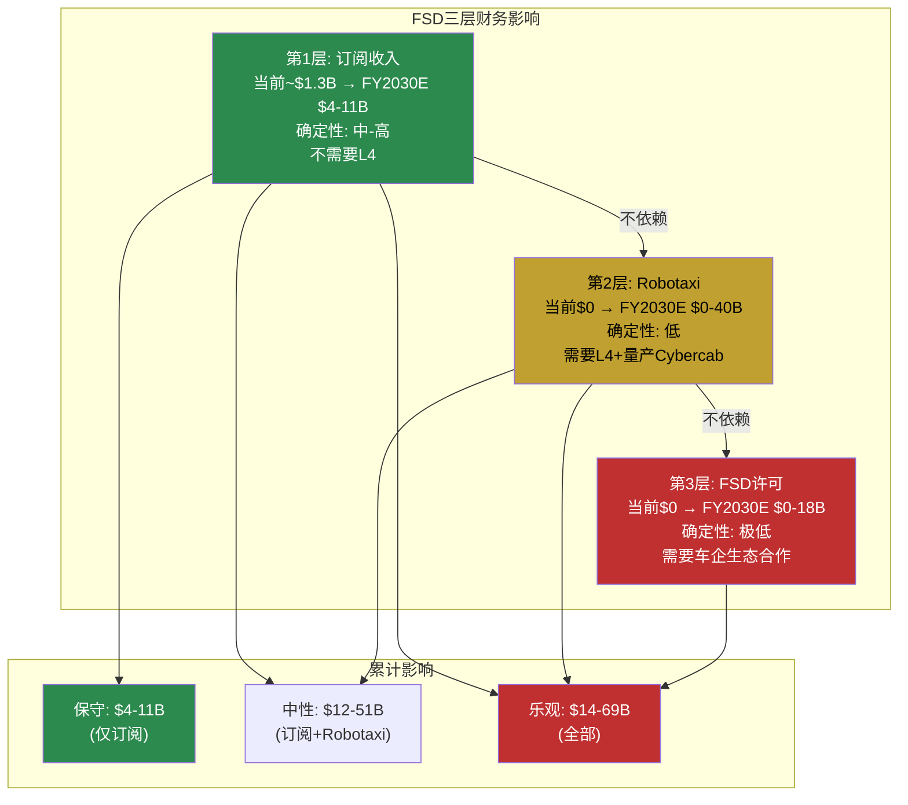

**关键发现**: FSD的财务影响是一个"层层递进"的期权结构:
- **第1层(订阅)**: 几乎确定, 已在发生, FY2030E $4-11B——这是FSD财务价值的"地板"
- **第2层(Robotaxi)**: 需要L4突破, 如果发生则$15-40B——这是牛市叙事的核心
- **第3层(许可)**: 需要生态合作, 如果发生则$2.5-18B——这是极端牛市的加分项

三层之间有递进关系(L4是Robotaxi前提)但没有依赖关系(订阅不依赖L4, 许可不依赖Robotaxi)。投资者可以根据对FSD技术进展的判断, 选择"买到哪一层"。[合理推断]

---

## 免责声明

本报告为Tesla Complete v3.0 Phase 2产出，采用v9.0框架+发现系统方法论。

**本报告不提供**: 目标价、评级、仓位建议、操作指令、概率权重。

**本报告提供**: Reverse DCF(市价隐含假设翻译)、资本配置分析、参考框架(非结论)、条件推演(非预测)、周期定位、FSD财务影响分析。

**关键声明**:
- 所有Reverse DCF结论是"市场隐含假设的翻译"，不是本报告的预测
- 所有参考框架标注"参考，非目标价"
- 所有情景标注"条件推演，非预测"
- 发现系统(9/10宽度)下，给出精确估值等于"精确的错误"

**三层置信标注**: [硬数据:] = 可验证事实 | [合理推断:] = 基于数据的逻辑推导 | [主观判断:] = 分析师判断

---

*Tesla Complete v3.0 Phase 2 | 2026-02-11 | v9.0 扬长避短 + 发现系统 v1.1*
