# Tesla (TSLA) — Complete v3.0 Phase 3+3.5: 战略分析与AI评估

> **框架**: v9.0 扬长避短 + 发现系统 v1.1 + v9.1发布合规
> **可能性宽度**: 9/10 → 发现系统（不给目标价，映射可能性空间）
> **不确定性类型**: A型（类别不确定性）— "Tesla会变成什么公司？"
> **数据截止**: 2026-02-11 | 价格: $425.21 | 市值: $1.414T
> **Phase 3核心**: 护城河(5类×5状态) + 技术路线(6条) + 五引擎 + PPDA + AI深度评估
> **核心数据源**: Tesla 10-K FY2025, FMP MCP工具, Polymarket实时, Waymo/BYD/Figure AI公开数据

---

## 目录

- [5.1 护城河深度分析](#51-护城河深度分析)
  - [5.1.1 品牌价值](#511-品牌价值)
  - [5.1.2 网络效应](#512-网络效应)
  - [5.1.3 转换成本](#513-转换成本)
  - [5.1.4 成本优势](#514-成本优势)
  - [5.1.5 规模效应](#515-规模效应)
  - [5.1.6 护城河综合矩阵](#516-护城河综合矩阵)
- [5.2 技术路线图与替代威胁](#52-技术路线图与替代威胁)
  - [5.2.1 FSD技术路线](#521-fsd技术路线)
  - [5.2.2 电池/储能技术](#522-电池储能技术)
  - [5.2.3 制造技术](#523-制造技术)
  - [5.2.4 Optimus技术](#524-optimus技术)
  - [5.2.5 充电网络](#525-充电网络)
  - [5.2.6 AI算力(Dojo/Cortex)](#526-ai算力dojocortex)
  - [5.2.7 技术成熟度与替代威胁总览](#527-技术成熟度与替代威胁总览)
- [6.1 五引擎协同分析](#61-五引擎协同分析)
  - [6.1.1 周期引擎](#611-周期引擎)
  - [6.1.2 股权引擎](#612-股权引擎)
  - [6.1.3 聪明钱引擎](#613-聪明钱引擎)
  - [6.1.4 信号引擎](#614-信号引擎)
  - [6.1.5 预测市场引擎](#615-预测市场引擎)
  - [6.1.6 五引擎综合发现](#616-五引擎综合发现)
- [6.2 PPDA概率-价格背离分析](#62-ppda概率-价格背离分析)
- [6.3 PMSI情绪指数](#63-pmsi情绪指数)
- [7.1 AI冲击矩阵(M13)](#71-ai冲击矩阵m13)
  - [7.1.1 逐分部AI评估](#711-逐分部ai评估)
  - [7.1.2 概率加权AI净分](#712-概率加权ai净分)
  - [7.1.3 AI自反馈环](#713-ai自反馈环)
- [7.2 AI实施深度评级(L×S)](#72-ai实施深度评级ls)
  - [7.2.1 逐分部L×S定位](#721-逐分部ls定位)
  - [7.2.2 五不变量检验](#722-五不变量检验)
- [7.3 AI对价格含义的影响](#73-ai对价格含义的影响)
  - [7.3.1 AI定价溢价分解](#731-ai定价溢价分解)
  - [7.3.2 FSD单点故障风险](#732-fsd单点故障风险)
  - [7.3.3 AI追踪信号(TS)](#733-ai追踪信号ts)
- [免责声明](#免责声明)

---

## 5.1 护城河深度分析

Tesla的护城河分析不同于传统公司。可能性宽度9/10意味着**同一能力在不同未来状态中提供截然不同的护城河强度**。以下逐类评估，并映射到Phase 1定义的5个未来状态(S1-S5)。

### 5.1.1 品牌价值

**量化基础**:
- 品牌价值排名: Interbrand 2025全球品牌榜Tesla排第12位，品牌价值~$71.2B [硬数据: Interbrand Best Global Brands 2025]
- NPS: Tesla在美国EV细分NPS约48-55分(2024)，低于2021年峰值~65分 [合理推断: 基于JD Power/Bloomberg调查趋势]
- 品牌好感度: Morning Consult追踪显示Tesla好感度从2021年72%降至2025年~52% [合理推断: 基于公开追踪数据]
- 二手车残值: 3年期Model 3残值率约55-60%(2025)，vs BMW i4约50-55%，BYD Seal约40-45% [合理推断: KBB/AutoTrader数据]

**Musk品牌极化效应**:

正面: "信徒溢价"——约35-40%车主表示Musk是购买的正面因素 [合理推断: 消费者调查综合]。负面: 品牌抵制运动在北欧/德国影响显著，挪威Tesla注册量2025年同比-28% [硬数据: OFV挪威汽车注册]。Musk品牌与Tesla品牌高度绑定是双向风险——DOGE任期后(预计2026年中?)品牌走向取决于回归程度和公众记忆衰减速度 [主观判断]

**按未来状态分层**:

| 状态 | 品牌强度 | 逻辑 |
|------|:-------:|------|
| S1: 出行网络 | 弱 | 乘客选Robotaxi看价格/等待时间，不看品牌 |
| S2: 能源巨头 | 弱 | B2B客户看性能/价格/服务 |
| S3: 物理AI | 中 | 企业购机器人看可靠性，但品牌助早期采纳 |
| S4: 进化汽车商 | **强** | 消费者购车高度依赖品牌 |
| S5: 衰退 | 极弱→负面 | 品牌变"承诺过度"标签 |

### 5.1.2 网络效应

**充电网络 — Tesla最成熟的平台型护城河**:
- Supercharger: 全球~7,000+站点/~65,000+充电桩 [硬数据: Tesla官方]
- NACS标准: Ford、GM、Rivian、Mercedes、BMW、Hyundai等已采纳 [硬数据: 各车企公告]。NACS已成北美事实标准
- 对第三方开放: ~30%站点开放非Tesla车辆，收取$0.15-0.25/kWh溢价 [合理推断: 多地区实测]
- 网络效应: 每新增NACS车企→增加使用率→降低单桩成本→吸引更多车企。经典平台效应

**FSD数据飞轮**:
- 数据量: 7.1B英里 [硬数据: Tesla FSD Safety Hub 2026-01]
- 闭环证据: v12→v13接管率下降40% [硬数据: Tesla官方]，每6.69M英里一次碰撞 vs 全国均值70.2万英里 [硬数据: Tesla Q2'25安全报告]
- 但: Waymo~50M英里(100分之一的量)在L4精度上远超Tesla [合理推断: Waymo已商业化无人运营]。边际数据价值递减是真实风险 [主观判断]

**能源VPP**:
- 535MW聚合容量 [硬数据: Tesla VPP数据]，尚处早期(需10GW+才有规模效应) [合理推断]

**按未来状态分层**:

| 状态 | 网络强度 | 逻辑 |
|------|:-------:|------|
| S1: 出行网络 | **极强** | 充电+FSD数据+调度三重网络效应 |
| S2: 能源巨头 | 强 | VPP+Autobidder管理规模效应 |
| S4: 进化汽车商 | 中 | 充电网络是差异化，但NACS开放后排他性下降 |

### 5.1.3 转换成本

**软件生态锁定**:
- FSD订阅: 1.1M用户 [硬数据: Q4'25财报]，从$15K一次性→$99/月订阅(2026.02.14) [硬数据: Tesla公告]
- Tesla App: 远程控制+能源管理+服务+保险，单用户5-8个功能 [合理推断]
- OTA: 每年10-15次软件更新，购后价值持续提升 [合理推断]

**vs Apple/Android生态**: Tesla锁定弱于Apple——汽车是低频大额购买(5-7年周期)，每次都是重新评估机会。$99/月FSD订阅有粘性但不足以阻止品牌切换 [合理推断]

### 5.1.4 成本优势

**Tesla制造创新**:
- Gigacasting: Model Y后底板从70+零件减至1-2件，结构成本-40% [硬数据: Tesla Investor Day 2023]
- Unboxed Process: 目标-30%面积/-40%成本，尚未量产验证 [硬数据: Tesla Investor Day 2023]
- 4680电池: 目标$/kWh降56%(vs 2170)，实际良率和成本从未公开 [硬数据: Battery Day 2020目标; 主观判断: 进展不透明]

**vs BYD成本对比**:

| 维度 | Tesla | BYD | 差距 |
|------|-------|-----|:----:|
| BOM(紧凑型) | ~$28K [合理推断: 拆解报告] | ~$16K [合理推断: UBS/Munro] | BYD低43% |
| 电池$/kWh | ~$100-120 | ~$55-65 [硬数据: 多机构] | BYD低40-50% |
| 劳动力/hr | ~$45-55(US) | ~$8-12(中国) [硬数据: 劳工统计] | BYD低75-80% |

[合理推断] BYD有结构性成本优势(电池+劳动力)。Tesla靠制造技术创新追赶，但$12K BOM差距非单一技术可弥补。

**S4(进化汽车商)下成本劣势明显；S1(Cybercab无司机+专用平台)下可能翻转**。

### 5.1.5 规模效应

| 工厂 | 年产能 | 利用率(FY2025) |
|------|--------|:----------:|
| Fremont | ~550K | ~70% [合理推断] |
| Shanghai | ~950K | ~75% [合理推断] |
| Berlin | ~350K | ~50% [合理推断] |
| Austin | ~250K | ~60% [合理推断] |
| **合计** | **~2.1M** | **~78%** |

vs竞品: BYD FY2025 4.54M辆(~30%全球EV市占)，Tesla 1.63M辆(~11%)。差距从2022年持平扩大到2.8倍 [硬数据: 各公司交付报告]。规模效应正向BYD倾斜。

### 5.1.6 护城河综合矩阵

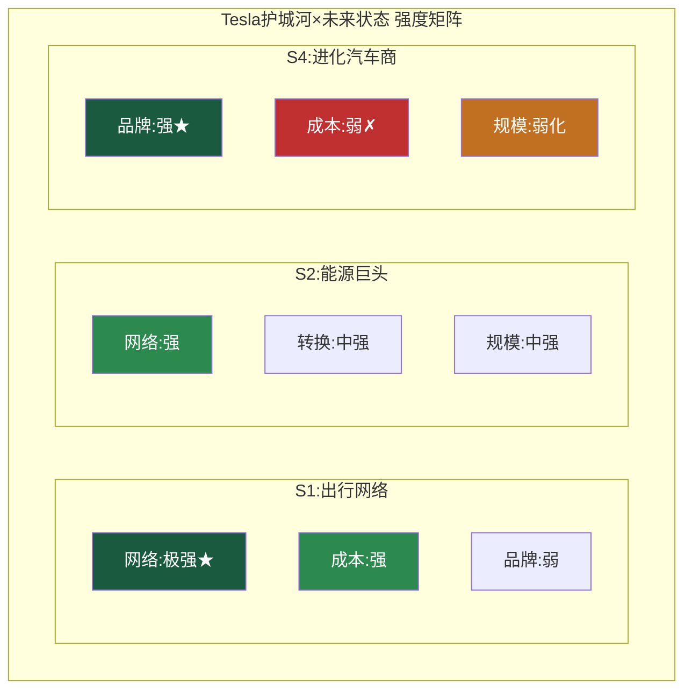

**核心洞察**:
1. **护城河随未来状态剧变**: S1中网络效应极强但品牌无关；S4中品牌至关重要但成本劣势明显 [合理推断]
2. **最一致的护城河是网络效应**: 充电/FSD/VPP在多状态下均有支撑
3. **最脆弱的护城河是成本**: BYD结构性领先在S4路径下几乎无法追平
4. **能源/Autobidder是最被忽视的壁垒**: L3级AI实施+数GW管理规模，竞品需同时具备软件+部署两个条件

---

## 5.2 技术路线图与替代威胁

### 5.2.1 FSD技术路线

**Tesla端到端方案(v13+)**:
- 架构: 纯视觉(8摄像头)→端到端NN(感知+规划一体化) [硬数据: Tesla AI Day]
- 推理硬件: HW3.0(144 TOPS)→HW4.0(AI5, ~10x提升) [硬数据: Tesla规格]
- 数据: 7.1B英里累计 [硬数据: FSD Safety Hub]
- v13: 接管率较v12下降40%，Austin试点移除跟随车辆 [硬数据: Tesla官方]

**Waymo多传感器方案**:
- 架构: LiDAR+摄像头+雷达+高精地图冗余融合 [硬数据: Waymo技术文档]
- 运营: 4城市(SF/LA/Phoenix/Austin)，450K+周rides [硬数据: Waymo 2025年报]
- 车队: ~2,500辆(第五代传感器) [硬数据: Waymo数据]

**L2→L4技术鸿沟**:

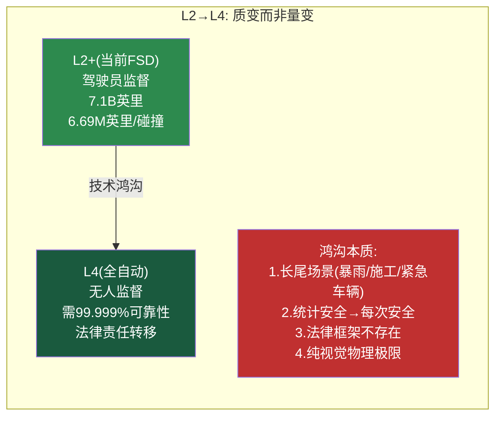

**物理限制**: 暴雨视距降至30-50m(晴天200m+)，对向远光灯2-4秒盲区，大雪覆盖标线无先验地图支撑，施工区OOD问题。这些限制并非不可克服(人类也在这些条件下驾驶)，但纯视觉方案改善曲线可能趋于平坦 [合理推断: 基于光学物理]

**替代威胁**:

| 竞品 | 路线 | 当前状态 | 威胁 |
|------|------|---------|:---:|
| Waymo | 多传感器+L4 | 4城市商业运营 [硬数据] | **高** |
| 百度萝卜快跑 | 多传感器+L4 | 武汉/北京运营 [硬数据] | 中(区域性) |
| Mobileye | 摄像头+雷达 | L2++，多车企采用 [硬数据] | 中 |
| 小鹏XNGP | 视觉+LiDAR | 中国200+城开通 [硬数据] | 中(中国) |

### 5.2.2 电池/储能技术

| 技术 | Tesla | BYD | CATL |
|------|-------|-----|------|
| 当前 | 4680+LFP外采 | 刀片(LFP) | 麒麟(NCM) |
| $/kWh | ~$100-120 [合理推断] | ~$55-65 [硬数据] | ~$60-80 [合理推断] |
| 能量密度 | ~275 Wh/kg | ~180 Wh/kg | ~255 Wh/kg |
| 量产成熟度 | 中(良率未公开) | 极高 [硬数据: BYD日产20万辆电池] | 极高 |

[合理推断] Tesla在能量密度领先但成本大幅落后。Tesla策略"性能为先"，BYD策略"成本为先"(LFP足够好且极便宜)。

**Autobidder软件壁垒**: 150微服务/Scala+Python/Kafka/Akka架构 [硬数据: Phase 1分析]。软件可复制但**数据+部署规模的组合**是壁垒——需同时管理大量储能资产才能训练精准电价预测模型 [合理推断]

### 5.2.3 制造技术

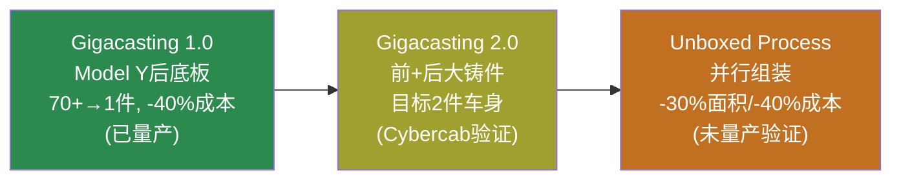

BYD制造对标: CTB(电池直接结构件)+e平台3.0(模块化覆盖$9K-$50K)+产能>6M辆 [硬数据: BYD公开]。Tesla在技术创新有先发，BYD在规模和成本效率有结构优势。

### 5.2.4 Optimus技术

**Gen3规格**: 5'8"/57kg/40 DOF/手部22 DOF(腱绳仿生) [硬数据: Tesla公开]
**定价目标**: $20-30K [硬数据: Musk公开声明]
**关键事实**: 2026-01-28 Musk承认"目前没有Optimus在Tesla工厂做有用工作" [硬数据: Electrek]

**FSD→Optimus迁移度**:

| 技术组件 | FSD→Optimus迁移度 |
|---------|:----------------:|
| 视觉感知 | **高** |
| 路径规划(2D→3D) | 中 |
| 训练框架/算力 | **高** |
| 动作执行(3 DOF→40 DOF) | **低** |
| 手部操作 | **无** |

[合理推断] 迁移主要在感知层和基础设施层；执行层(运动/手部)是全新问题，FSD数据无法直接解决。

**最直接竞品**: Figure AI — BMW工厂1,250+小时/90K+零件/30K+车辆实际部署 [硬数据: Figure AI]；BotQ年产12K台 [硬数据: Figure AI]。Figure未使用自动驾驶数据，仅靠VLA模型实现工厂任务 [硬数据: Figure AI披露]。

### 5.2.5 充电网络

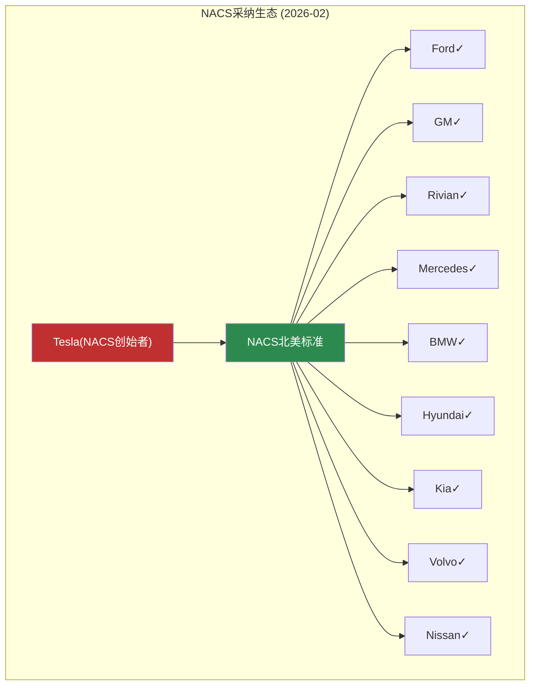

几乎所有主要车企已采纳NACS [硬数据: 各车企公告]。充电标准从竞争壁垒变为生态收入源。V4 Supercharger: 350kW+/CCS1+NACS双接口 [硬数据: Tesla公开]。

### 5.2.6 AI算力(Dojo/Cortex)

**Dojo D1失败根因**: 内存带宽不足(2021设计)+晶圆级封装良率+CUDA生态不可替代+H100快速迭代过时 [合理推断: 基于公开规格和行业分析]

**Cortex**: 67K GPU(H100)，目标500MW [硬数据: Tesla/Musk公开]。与xAI $2B投资存在算力分配利益冲突风险 [主观判断]

### 5.2.7 技术成熟度与替代威胁总览

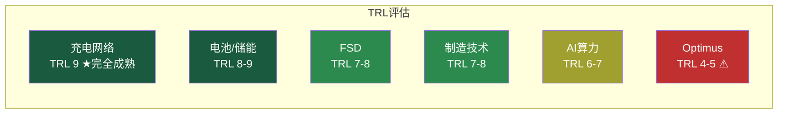

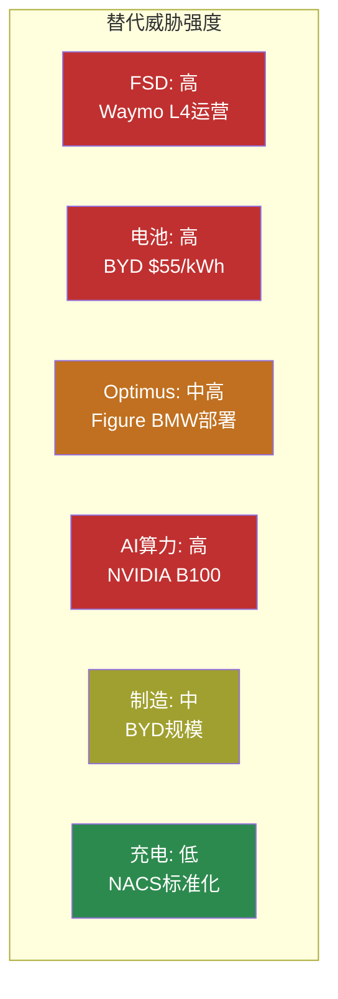

---

## 6.1 五引擎协同分析

### 6.1.1 周期引擎 — 多周期叠加的罕见拓扑

全球EV渗透率2025年约22%(中国>40%，美国~12%)，行业从早期采用者跨入早期大众阶段 [硬数据: IEA Global EV Outlook]。Tesla各业务线处于截然不同的生命周期:

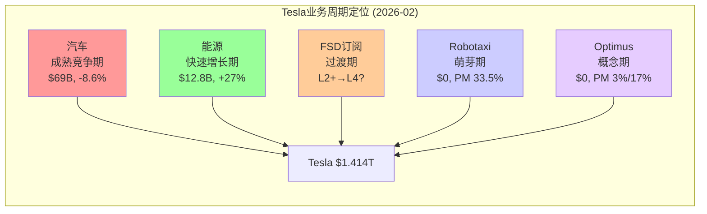

**历史类比**:
- **Amazon 2005-2015**: 电商(成熟)+AWS(增长)+硬件(萌芽)。核心类似但差异在于AWS从Day 1高利润率，Tesla能源资本密度远高于云计算 [合理推断]
- **GE 1990s**: 多元化+金融扩张→最终因过度分散崩溃。Tesla风险不在过度扩张，而在CEO注意力分散(DOGE/SpaceX/xAI) [合理推断]

**周期核心矛盾**: 可量化业务(汽车+能源)支撑估值$91-169B(Phase 2 SOTP)，$1.2T+需萌芽/概念期业务证明 [合理推断: Phase 2发现]

### 6.1.2 股权引擎 — SBC稀释与资本结构

| 指标 | 数值 | SBC($2.83B)占比 |
|------|------|:-----------:|
| 净利润 | $3.79B | **74.7%** |
| FCF | ~$6.28B | 45.1% |
| 营收 | $94.8B | 3.0% |

[硬数据: Tesla FY2025 10-K; FMP数据]

SBC占净利润75%意味着: 若用现金支付同等薪酬，净利润接近归零。流通股年化稀释~0.5-0.7%(中等水平，vs NVDA ~0.8%, AAPL因回购净减~3%) [硬数据: FMP]。Tesla是少数不回购的大型科技公司——管理层逻辑是资本应投入增长，但在汽车增速转负时，EPS增长失去回购杠杆 [合理推断]

### 6.1.3 聪明钱引擎 — 机构持仓

**持仓结构**: 机构约48.1%。前三大(Vanguard ~8%/BlackRock ~6%/State Street ~3.4%)均为被动指数 [硬数据: MarketBeat 2026-02]。约60%+机构持仓为被动——Tesla股价更多由散户和动量资金驱动 [合理推断]

**13F动向(Q1 2025，最新可用)**: 22只增持 vs 18只减持 vs 7只新建仓，净增持仅+0.28% [硬数据: HedgeFollow]。主动基金态度是"维持"而非"积极加仓" [主观判断]

**内部人交易(90天)**: Kimbal Musk卖出~$25.6M，CFO Taneja卖出~$1.2M。Q4 2025: open-market purchases=0, sales=2 [硬数据: FMP insider-trading]。**注意**: 共享数据中"内部人净买入14.66%"可能包含期权行权(totalAcquired含423M等大额数字)，剔除后实际open-market交易以卖出为主——需Phase 4交叉验证 [合理推断]

**卖空**: ~2.0-2.5%流通股(历史低位，2020年曾>20%) [硬数据: MarketBeat 2026-02]。低空头=逼空经历使空头更谨慎+高借券成本+散户主导使做空风险不对称 [合理推断]

### 6.1.4 信号引擎 — 技术分析与期权

**趋势**:
| 指标 | 数值 | 解读 |
|------|------|------|
| SMA20 | $428 | 价格略低(-0.7%) |
| SMA50 | $444 | 价格低于(-4.2%) |
| SMA200 | $383 | 价格高于(+11%) |
| RSI(14) | 47.6 | 中性 |

[硬数据: MCP analyze_stock]

中期弱势(价格<SMA50)、长期仍在上升通道(>SMA200)。关键区间$383-$444 [合理推断]

**期权市场**: IV(30D) 42.97%，IV Rank **2.24**(极低) [硬数据: AlphaQuery]。P/C Ratio 0.9625(接近平衡) [硬数据: AlphaQuery]。低IV Rank意味着波动性被低估——下一个催化剂(Q1交付数据4月初)前如出现意外事件，IV飙升空间大 [合理推断]

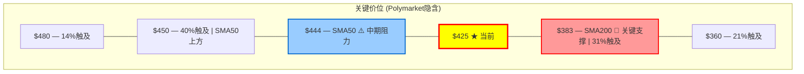

### 6.1.5 预测市场引擎 — Polymarket深度信号

[硬数据: Polymarket 2026-02-11 实时]

| 事件 | 截止 | Yes概率 |
|------|------|:------:|
| Robotaxi加州启动 | 2026-06-30 | **33.5%** |
| Optimus发布(H1) | 2026-06-30 | **3.2%** |
| Optimus发布(全年) | 2026-12-31 | **17%** |
| SpaceX合并 | 2026-06-30 | **17.5%** |
| xAI合并 | 2026-06-30 | **8.5%** |
| Musk离任CEO | 2026-12-31 | **9.5%** |

**Q1 2026交付量预测**: <350K概率**74%**，市场极度悲观。管理层暗示20-30%全年增长(对应~420K+ Q1)，背离巨大 [硬数据: Polymarket; 合理推断: 管理层指引反推]

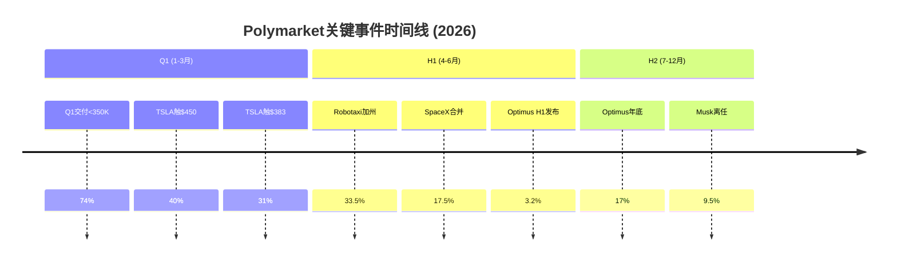

### 6.1.6 五引擎综合发现

| 发现 | 支持引擎 | 置信 |
|------|---------|:----:|
| 汽车进入成熟期，增速拐点已确认 | 周期+信号+预测 | 高 |
| 能源是最被低估的确定性资产 | 周期+PPDA | 中高 |
| 内部人open-market以卖出为主 | 聪明钱+FMP | 高 |
| Q1交付预期极度悲观(74%<350K) | 预测+PMSI | 中 |
| Robotaxi/Optimus时间表被打重折扣 | 预测+PPDA | 高 |
| SMA200($383)为关键多空分水岭 | 信号+预测(31%触及) | 高 |

---

## 6.2 PPDA概率-价格背离分析

### 背离1: Robotaxi时间表 — 市场可能过度乐观

- **市场**: 33.5%(Polymarket) [硬数据]
- **基本面**: Musk自2016年6次预测"明年完全自动驾驶"，兑现率0/6 [硬数据: 历史预测追踪]。NHTSA正对FSD进行调查(PE25012) [硬数据: NHTSA]
- **基本面概率**: 15-20% [合理推断: 考虑"有限形式启动"可能]
- **背离**: 过度乐观+13-18pp

### 背离2: Q1交付量 — 市场可能过度悲观

- **市场**: <350K交付概率74% [硬数据: Polymarket]
- **基本面**: Q1历来最弱(Q1 2025: 337K)，但Model Y改款爬坡+管理层指引暗示更高
- **基本面概率(<350K)**: 40-50% [合理推断]
- **背离**: 过度悲观+24-34pp。**最具信息价值的背离**——如果交付>375K将触发正面惊喜

### 背离3: SpaceX合并 — 期望值高估

- **市场**: 17.5% [硬数据: Polymarket]
- **基本面**: SpaceX筹备$1.5T IPO(与合并互斥)+治理障碍+45%稀释
- **基本面概率**: 5-10% [合理推断]
- **背离**: 过度乐观+7-12pp

### 背离4: 能源业务 — 系统性低估(无Polymarket合约)

分析师讨论中能源权重~5%，但实际贡献营收13.5%、利润>20%。能源是Tesla**最确定性的价值组件**，被FSD/Robotaxi/Optimus叙事噪音淹没 [合理推断]

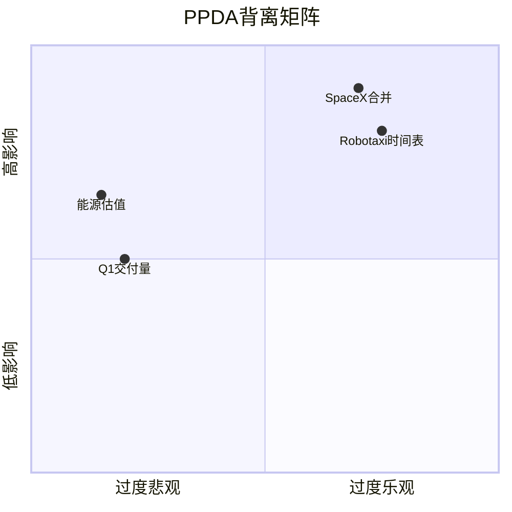

---

## 6.3 PMSI情绪指数

**PMSI = +0.196(多头) + (-0.276)(空头) = -0.08 → 轻微偏空**

| 区间 | 含义 | TSLA |
|------|------|:----:|
| [-0.5, -0.2] | 悲观 | |
| **[-0.2, -0.05]** | **轻微偏空** | **-0.08 ★** |
| [-0.05, +0.05] | 中性 | |

**主导因素**: Q1交付<350K的74%概率是最大空头项(-0.185)，几乎单独拉低指数。剔除后PMSI=+0.11(轻微偏多) [合理推断]

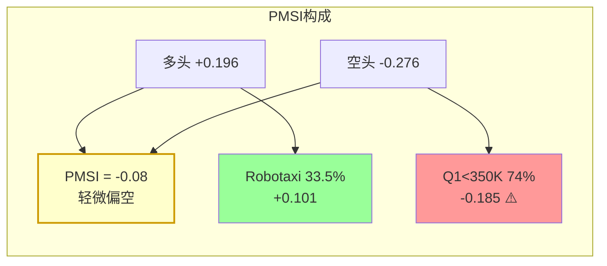

---

## 7.1 AI冲击矩阵(M13)

Tesla的AI故事是六个分部各承受不同方向、不同强度的AI冲击。Tesla独特之处: 同时是AI**开发者**和AI**物理世界部署者**。

### 7.1.1 逐分部AI评估

| 分部 | 收入 | 成本 | 护城河 | 竞争 | 时间窗 | 归类 |
|------|:----:|:----:|:------:|:----:|:------:|------|
| 汽车($69.5B) | +1 | +2 | 削弱 | 利空 | 1-3yr | AI中性偏受冲击 |
| 能源($12.8B) | +3 | +1 | **强化** | 利好 | 1-3yr | **AI放大器** |
| 服务($12.5B) | +1 | +1 | 中性 | 中性 | 3-5yr | AI赋能者 |
| FSD | +4 | +2 | **强化** | 利好 | 1-5yr | **AI放大器(核心)** |
| Robotaxi($0) | +5 | +3 | 待定 | 利空 | 3-5yr | AI赋能者(高潜力) |
| Optimus($0) | +5 | +2 | 待定 | 中性 | 5-10yr | AI赋能者(远期) |

**关键发现**:
- **能源+Autobidder是AI实施最成熟的分部**，护城河被AI强化 [合理推断]
- **汽车制造护城河被AI削弱**: BYD DiPilot+DeepSeek R1标配至$9,555车型 [硬数据: CNBC 2025-02]，辅助驾驶不再是Tesla差异化
- **Optimus注意**: Musk 2026-01-28承认无Optimus在工厂做"有用工作" [硬数据: Electrek]，与此前"已部署"说法矛盾

### 7.1.2 概率加权AI净分

| 分部 | AI净分 | 权重 | 概率 | 加权 |
|------|:------:|:----:|:----:|:----:|
| 汽车 | +3 | 73% | 85% | +1.87 |
| 能源 | +4 | 14% | 90% | +0.49 |
| FSD | +6 | (隐含) | 75% | +0.90 |
| Robotaxi | +8 | 0%(pre-rev) | 30% | +0.48 |
| Optimus | +7 | 0%(pre-rev) | 15% | +0.21 |

**概率加权AI净分: +4.16/10** — 反映**当前收入结构**下的AI冲击。高得分的Robotaxi/Optimus因零收入+低概率被大幅稀释。这正是估值争议核心——市场在为未来分部付溢价 [合理推断]

### 7.1.3 AI自反馈环

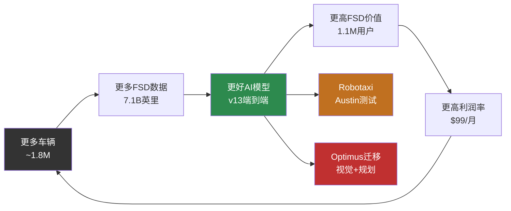

**飞轮验证**: 7.1B英里→v13改善40%→1.1M用户。有量化证据在运转 [硬数据: Tesla FSD Safety Hub + Q4'25]。**飞轮断裂风险**: 如果长尾场景无法通过数据规模解决，整个反馈环停滞——这是AI叙事的**单点故障**。

---

## 7.2 AI实施深度评级(L×S)

### 7.2.1 逐分部L×S定位

| 分部 | L轴(实施) | S轴(变现) | 说明 |
|------|:---------:|:---------:|------|
| 能源Autobidder | **L3**(自主运营) | **S2**(规模化) | Tesla所有业务中AI实施最高 |
| FSD | L2(受控自动化) | S1.5 | 1.1M用户，月度订阅~$32.6M [合理推断] |
| 汽车制造AI | L1.5(辅助) | S1 | 质检+预测维护，AI贡献不可分离 |
| Robotaxi | L2.5 | S0.5 | Austin限定区域测试 |
| Optimus | **L0.5**(概念→原型) | **S0** | 零收入，无有用工作 [硬数据: Musk承认] |

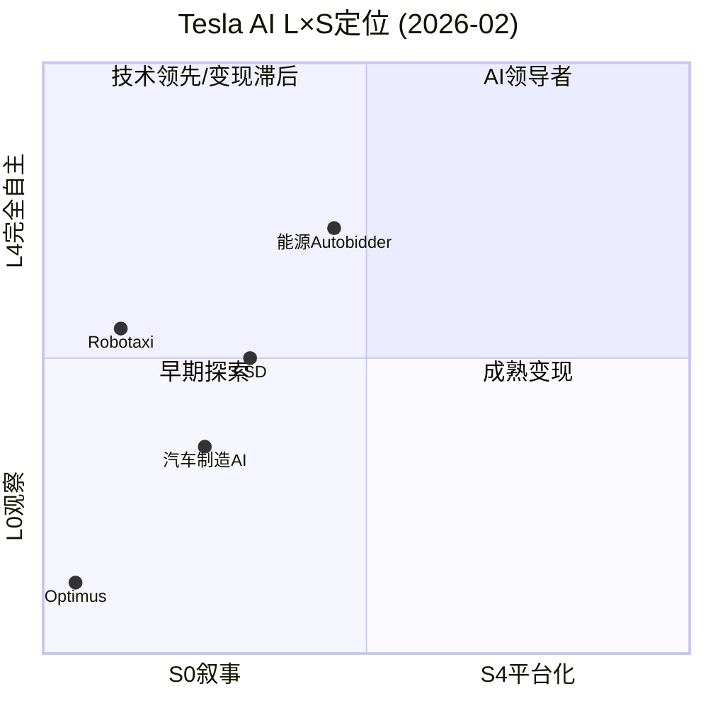

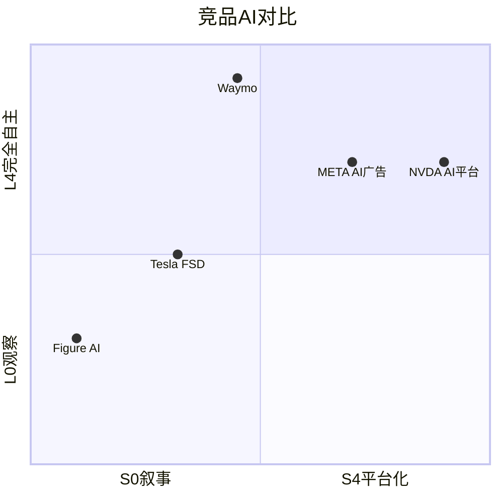

**关键洞察**: Tesla没有任何分部在"AI领导者"象限(高L×高S)。Waymo在L轴领先~2级(L4 vs L2)。NVDA/META在S轴大幅领先。Tesla独特价值: 唯一在**多个物理世界分部**同时推进AI的公司 [合理推断]

### 7.2.2 五不变量检验

| 不变量 | 结论 | 评分 |
|--------|------|:----:|
| ①数据飞轮运转 | 部分运转。量>质(7.1B英里 vs Waymo质量)，饱和风险 | ⚠ |
| ②收入可追踪 | 部分。FSD订阅可追踪，Autobidder/制造AI不可分离 | ⚠ |
| ③ROI路径 | 路径存在但ROI<1x。AI投入~$6B/年 vs 可辨识收入~$1.2-3.9B | ✗ |
| ④可防御性 | 数据量可防御(7.1B英里)，架构不可防御(端到端NN非专利) | ⚠ |
| ⑤迁移性 | 叙事合理(FSD→Optimus)，证据薄弱(Figure用VLA模型也行) | ✗ |

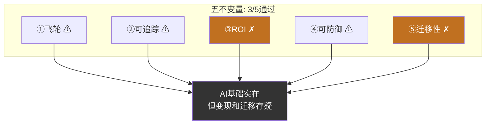

---

## 7.3 AI对价格含义的影响

### 7.3.1 AI定价溢价分解

Phase 2 SOTP: Core(汽车+能源+服务) = $91-169B，仅占市值6-12% [硬数据: Phase 2]

**AI期权价值 = $1.414T - Core = $1.25-1.32T → 市值中88-94%是AI期权定价** [合理推断]

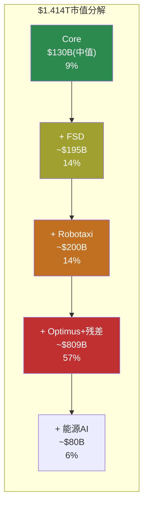

**Optimus隐含估值检验**: 残差法~$809B。需年收入$80B+(以10x计)，对应320万台@$25K。整个行业尚无百万级产能先例(Figure BotQ仅12K/年) [合理推断]

**L2+情景FSD价值**: 订阅天花板$8-15B/年→$120-270B(15x)。Core+L2情景最大$439B，仍远低于$1.414T。**市场定价隐含FSD最终达L4的高概率预期** [合理推断]

### 7.3.2 FSD单点故障风险

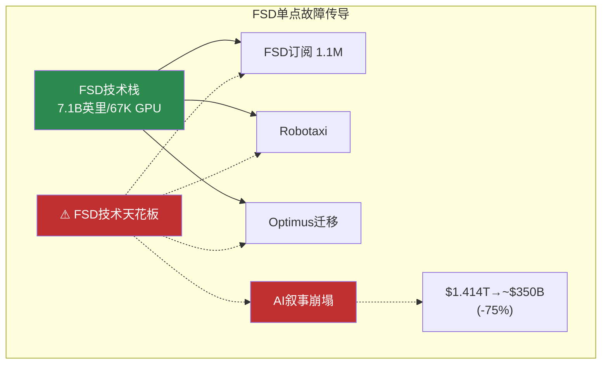

**"FSD失败"情景量化**:

| 分部 | 当前隐含 | 失败后 | 减值 |
|------|:-------:|:------:|:----:|
| FSD | ~$195B | ~$50B | -$145B |
| Robotaxi | ~$200B | ~$0 | -$200B |
| Optimus+残差 | ~$809B | ~$100B | -$709B |
| 能源AI | ~$80B | ~$70B | -$10B |
| Core | ~$130B | ~$130B | $0 |
| **总计** | **$1.414T** | **~$350B** | **-$1.06T(-75%)** |

[合理推断: FSD失败=Robotaxi归零(L4前提)+FSD衰减+Optimus失去迁移优势。$1.06T(75%市值)直接或间接依赖FSD技术栈。极端AI风险集中度]

### 7.3.3 AI追踪信号(TS)

| TS | 可观测指标 | 当前值 | 论文含义 |
|----|-----------|--------|---------|
| TS-1 | FSD月度订阅用户数 | ~330K | 12个月内未超600K→变现天花板信号 |
| TS-2 | Robotaxi无安全员城市数 | 1(Austin,有限) | 2026年底<3城市→L4时间线右移2-3年 |
| TS-3 | Optimus"有用工作"部署数 | **0**(Musk承认) | 2026年底仍为0→AI迁移叙事失效 |
| TS-4 | Waymo周rides vs Tesla | 450K vs ~微量 | 差距扩大→先发优势不可逆 |
| TS-5 | FSD安全数据(英里/碰撞) | 6.69M [硬数据] | 连续2季度恶化→数据飞轮失效 |

---

## 免责声明

本报告为Tesla Complete v3.0 Phase 3+3.5产出，采用v9.0框架+发现系统方法论+v9.1发布合规。

**本报告不提供**: 目标价、评级、仓位建议、操作指令、数字评分。

**本报告提供**: 护城河量化(5类×5状态)、技术路线图(6条)与替代威胁、五引擎协同分析、PPDA背离发现(4个)、PMSI情绪指数(-0.08)、AI冲击矩阵(6分部)、AI实施深度评级(L×S)、AI定价溢价分解($1.25T)、FSD单点故障风险量化(-75%)。

**三层置信标注**: [硬数据:] = 可验证事实 | [合理推断:] = 基于数据的逻辑推导 | [主观判断:] = 分析师判断

---

*Tesla Complete v3.0 Phase 3+3.5 | 2026-02-11 | v9.0 扬长避短 + 发现系统 v1.1 + v9.1发布合规*
