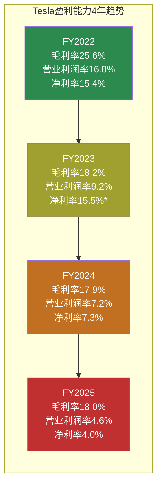
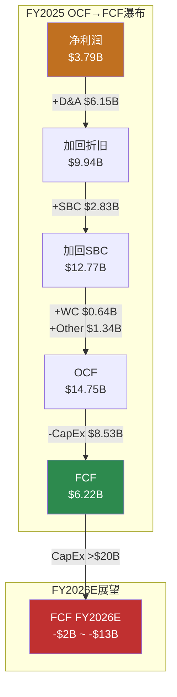
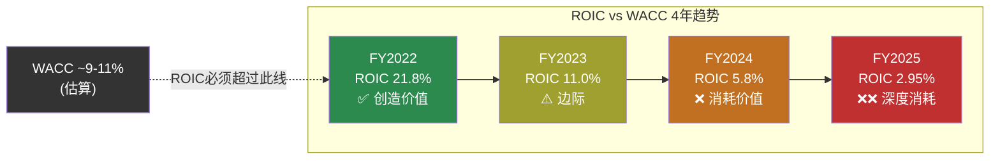
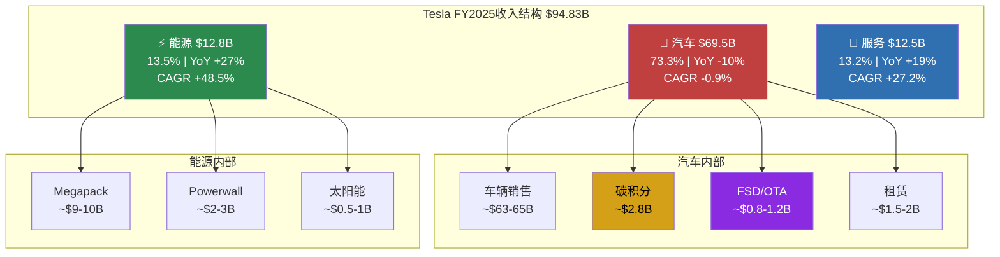
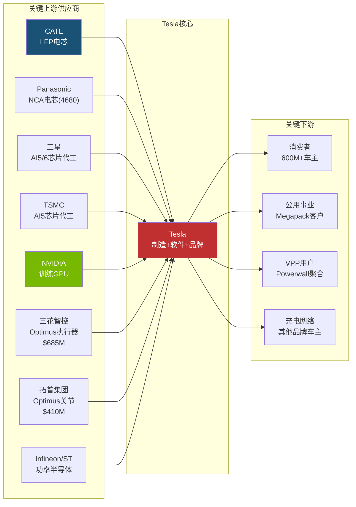
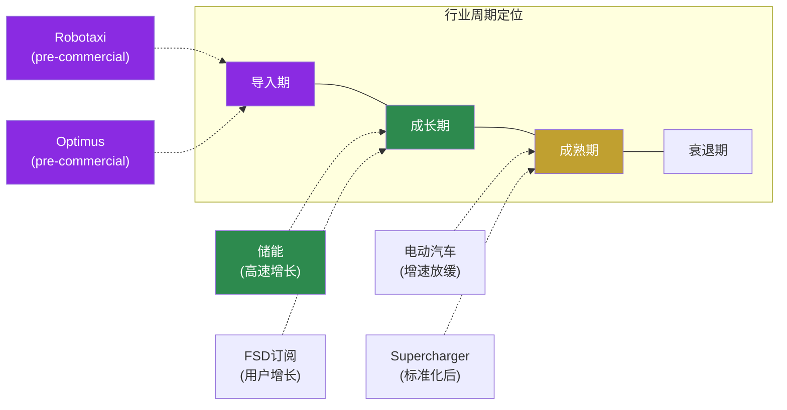

# Part 1.1: 财务全景深度分析 + Part 1.2: 业务结构与产业链

> **Agent1产出** | 目标: ~20K字符 | 方法论: 数据驱动的事实呈现，三层置信标注，零投资建议

---

## 1.1 财务全景深度分析

Tesla今天是一家**营收首次下滑、利润腰斩、但现金充裕且在激进投资未来**的公司。这一描述的每个词都有数据支撑。

### 1.1.1 年度损益表趋势 (4年)

| 指标 | FY2025 | FY2024 | FY2023 | FY2022 | 4年CAGR |
|------|--------|--------|--------|--------|---------|
| 营收 | $94.83B | $97.69B | $96.77B | $81.46B | +5.2% |
| 营收YoY | **-2.93%** | +0.95% | +18.80% | — | 减速→负增长 |
| 毛利润 | $17.09B | $17.45B | $17.66B | $20.85B | -6.4% |
| 毛利率 | 18.03% | 17.86% | 18.24% | 25.60% | -7.6pp |
| R&D | $6.41B | $4.54B | $3.97B | $3.08B | +27.6% |
| SGA | $5.83B | $5.15B | $4.80B | $3.95B | +13.8% |
| 营业利润 | $4.36B | $7.08B | $8.89B | $13.66B | -31.6% |
| 营业利润率 | 4.59% | 7.24% | 9.19% | 16.76% | -12.2pp |
| 净利润 | $3.79B | $7.13B | $15.00B | $12.58B | -32.8% |
| 净利率 | 4.00% | 7.30% | 15.50% | 15.45% | -11.5pp |
| EPS(稀释) | $1.08 | $2.04 | $4.31 | $3.62 | -33.3% |
| EBITDA | $11.76B | $14.71B | $14.80B | $17.66B | -12.7% |
| D&A | $6.15B | $5.37B | $4.67B | $3.75B | +17.9% |
| SBC | $2.83B | $2.00B | $1.81B | $1.56B | +21.9% |

[硬数据: FMP income annual, Tesla 10-K FY2022-FY2025]

**关键发现**:

1. **营收增长已停滞**: FY2022→FY2025 CAGR仅5.2%，远低于市场对"高增长"公司的期待。FY2025是Tesla历史上首次年度营收下降。[硬数据: FMP income]

2. **利润率系统性恶化**: 毛利率从25.6%降至18.0%(下降7.6pp)，主要驱动因素是价格战(ASP下降)和产品组合变化(Cybertruck初期低利润率)。营业利润率从16.8%降至4.6%——R&D和SGA的增速(+27.6%/+13.8%)远超营收增速(+5.2%)。[合理推断: 基于费用结构分析]

3. **利润"断崖式"下降**: 净利润$3.79B比峰值(FY2023 $15.0B)下降75%。但FY2023净利润含异常高的递延税收益($6.35B)，调整后的"可持续"净利润峰值更接近FY2022的$12.58B。FY2025净利润仅为FY2022的30%。[硬数据: FMP cashflow/income; 合理推断: 递延税调整]

4. **SBC膨胀**: 股票薪酬从$1.56B→$2.83B(+81% in 3年)，FY2025 SBC占净利润的75%。这意味着非现金薪酬正在大幅稀释每股收益。[硬数据: FMP cashflow]

5. **D&A快速增长**: $3.75B→$6.15B(+64% in 3年)，反映巨额资本支出的折旧消化期开始。D&A占营收6.5%，高于汽车行业均值~4%。[硬数据: FMP income; 合理推断: 行业对比]

*FY2023净利率15.5%含$6.35B递延税收益(一次性)，调整后约8.9%

---

### 1.1.2 季度趋势与拐点信号

| 指标 | Q4'25 | Q3'25 | Q2'25 | Q1'25 | Q4'24 | Q3'24 | Q2'24 | Q1'24 |
|------|-------|-------|-------|-------|-------|-------|-------|-------|
| 营收($B) | 24.90 | 28.10 | 22.50 | 19.34 | 25.71 | 25.18 | 25.50 | 21.30 |
| 毛利率 | **20.12%** | 17.99% | 17.24% | 16.31% | 16.26% | 19.85% | 17.95% | 17.36% |
| 营业利润($B) | 1.41 | 1.62 | 0.92 | 0.40 | 1.58 | 2.72 | 1.61 | 1.17 |
| 净利润($M) | 840 | 1,373 | 1,172 | 409 | 2,314 | 2,167 | 1,400 | 1,390 |
| EPS(稀释) | $0.24 | $0.39 | $0.33 | $0.12 | $0.66 | $0.62 | $0.40 | $0.41 |

[硬数据: FMP income quarterly]

**拐点分析**:

- **Q4'25毛利率20.12%**: 8个季度来首次突破20%，创FY2025最高。这可能是(a)产品组合改善(Cybertruck初期亏损减少)，(b)价格稳定信号，或(c)季节性效应。[合理推断: 需要Q1'26确认是否为趋势]

- **Q3'25营收$28.1B峰值**: 季度营收最高点，但Q4回落至$24.9B(-11.4% QoQ)。季度营收波动性增大(Q1'25-Q4'25 CV=16.3%)。[硬数据: FMP quarterly]

- **净利润持续疲软**: Q4'25 $840M是FY2025第二低(仅高于Q1 $409M)。毛利率改善被R&D/SGA费用增长抵消——Q4'25 R&D约$1.78B创单季新高。[合理推断: 费用增长抵消毛利改善]

- **EPS退化严重**: Q4'25 $0.24 vs Q4'24 $0.66(-64% YoY)。FY2025全年$1.08 vs FY2024 $2.04(-47% YoY)。以当前$425股价算，trailing P/E = **385.7x**。[硬数据: FMP ratios]

---

### 1.1.3 现金流深度分析

| 指标 | FY2025 | FY2024 | FY2023 | FY2022 | 趋势 |
|------|--------|--------|--------|--------|------|
| **OCF** | $14.75B | $14.92B | $13.26B | $14.72B | 稳定$14-15B |
| **CapEx** | $8.53B | $11.34B | $8.90B | $7.16B | FY25回落(-25%) |
| **FCF** | $6.22B | $3.58B | $4.36B | $7.55B | FY25反弹+74% |
| **FCF/OCF** | 42.2% | 24.0% | 32.9% | 51.3% | 恢复中 |
| 投资购买 | -$37.1B | -$36.0B | -$19.1B | -$5.8B | 金融投资激增 |
| 投资赎回 | $30.2B | $28.5B | $12.5B | $0.02B | 配套赎回 |
| SBC | $2.83B | $2.00B | $1.81B | $1.56B | 持续增长 |
| D&A | $6.15B | $5.37B | $4.67B | $3.75B | 持续增长 |

[硬数据: FMP cashflow annual, Tesla 10-K]

**深层分析**:

1. **OCF的"假稳定"**: OCF看似稳定在$14-15B区间，但内部质量在下降。FY2025 OCF的构成: 净利润$3.79B + D&A $6.15B + SBC $2.83B + 运营资本改善$0.64B + 其他$1.34B。换言之，**74%的OCF来自非现金项目(D&A+SBC)加回**，而非利润本身。FY2022中这个比例仅为35%。[硬数据: FMP cashflow; 合理推断: 百分比计算]

2. **CapEx回落是暂时的**: FY2025 CapEx $8.53B比FY2024的$11.34B下降25%——但FY2026指引">$20B"意味着FY2026 CapEx将是FY2025的2.3x+。FY2025的CapEx下降可能是Cybercab/Optimus新产线准备期的"暂停"。[硬数据: Q4'25电话会指引]

3. **金融投资规模惊人**: FY2025购入$37.1B投资(赎回$30.2B)，净投出$6.9B。FY2024净投出$7.4B。Tesla正在用大量现金进行金融投资(主要是短期国债/商业票据)，反映其$44B现金+投资池的管理。[硬数据: FMP cashflow]

4. **FCF Yield极低**: FCF $6.22B / 市值$1,414B = **0.44%** FCF Yield。这意味着如果Tesla把所有FCF分给股东，投资者在当前价格的"现金回报率"不到0.5%——大幅低于10年期美债收益率。[硬数据: FMP ratios, 当前市值]

---

### 1.1.4 资产负债表强度

| 指标 | FY2025 | FY2024 | FY2023 | FY2022 | 评估 |
|------|--------|--------|--------|--------|------|
| 现金+投资 | $44.06B | $36.56B | $29.09B | $22.19B | 持续累积 |
| 总债务 | $8.38B | $13.62B | $9.57B | $5.75B | FY25还债 |
| 净债务 | **-$8.14B** | -$2.52B | -$6.83B | -$10.51B | 净现金 |
| D/E | 0.10 | 0.19 | 0.15 | 0.13 | 极低杠杆 |
| 流动比率 | 2.16 | 2.02 | 1.73 | 1.53 | 持续改善 |
| 速动比率 | 1.77 | 1.61 | 1.25 | 1.05 | 充足流动性 |
| Altman Z-Score | 16.24 | — | — | — | 远超安全线(>3) |
| PP&E净值 | $40.64B | $51.51B | $45.12B | $36.64B | FY25下降? |
| 总资产 | $137.81B | $122.07B | $106.62B | $82.34B | 持续扩张 |

[硬数据: FMP balance sheet, MCP baggers_summary]

**关键观察**:

1. **$44B现金堡垒**: 现金+投资$44.06B，连续4年增长(CAGR +25.6%)。即使FY2026 CapEx $20B+、FCF转负，现金缓冲可支撑3-8年(取决于负FCF幅度)。这是Tesla敢于激进投资的底气。[硬数据: FMP balance sheet]

2. **净现金$8.14B**: 总债务$8.38B vs 现金+投资$44.06B，净现金状态。FY2025偿还了$3.16B债务(净偿还)，财务杠杆极低。D/E 0.10在全球大型工业公司中罕见。[硬数据: FMP cashflow/balance sheet]

3. **PP&E下降异常**: FY2025 PP&E $40.64B vs FY2024 $51.51B，**下降$10.87B**。这与FY2025 CapEx $8.53B + D&A $6.15B不完全匹配——可能涉及资产重分类、减值或会计变更。需要10-K注释确认。[硬数据: FMP balance sheet; 主观判断: PP&E变动需进一步核实]

4. **存货效率**: 存货$12.39B基本持平，DIO 58.2天(FY2024: 54.7天)，略有退化但仍在健康区间。Tesla以"零库存"精益制造著称，但规模扩大+产品线增加正在改变这一特征。[硬数据: FMP key-metrics]

---

### 1.1.5 杜邦分解与资本回报退化

**杜邦三因子分解**:

| 因子 | FY2025 | FY2024 | FY2023 | FY2022 | 方向 |
|------|--------|--------|--------|--------|------|
| 净利率 | 4.00% | 7.30% | 15.50%* | 15.45% | ↓↓↓ |
| 资产周转率 | 0.69x | 0.80x | 0.91x | 0.99x | ↓ |
| 权益乘数 | 1.68x | 1.67x | 1.70x | 1.84x | ↓(去杠杆) |
| **ROE** | **4.62%** | **9.78%** | **23.95%** | **28.15%** | **↓↓↓** |

*FY2023净利率含递延税收益

[硬数据: FMP ratios]

**退化路径**: ROE从28.2%→4.6%(下降23.6pp in 3年)。三个驱动因素全部恶化:
- **净利率**: 主因。价格战+费用膨胀→利润率系统性下滑
- **资产周转率**: 资产膨胀(+67%)快于收入增长(+16%)→效率下降
- **权益乘数**: 去杠杆降低了财务放大效应(对股东不利但降低风险)

**ROIC退化更严重**:

| 指标 | FY2025 | FY2024 | FY2023 | FY2022 |
|------|--------|--------|--------|--------|
| ROIC | **2.95%** | 5.83% | 10.99% | 21.75% |
| WACC(估算) | ~9-11% | ~9-11% | ~9-11% | ~9-11% |
| ROIC-WACC | **-6~-8pp** | -3~-5pp | 0~+2pp | +11~+13pp |

[硬数据: FMP key-metrics; 合理推断: WACC基于Beta 1.887+无风险利率+ERP估算]

**核心含义**: FY2025 ROIC 2.95%远低于任何合理WACC估计(9-11%)。这意味着Tesla当前每投入$1资本，产生的回报不足以覆盖资本成本。**Tesla正在"消耗"经济价值而非创造**。这是过渡期现象(投资未来业务)还是结构性问题，是Phase 2估值分析的核心争议。[合理推断: ROIC<WACC的含义]

---

### 1.1.6 估值倍数当前快照

| 指标 | FY2025 TTM | 5年均值 | 汽车行业 | 科技行业 | 偏离度 |
|------|-----------|---------|---------|---------|-------|
| P/E | **383.0x** | ~120x | ~10x | ~30x | 38x汽车/13x科技 |
| P/B | 17.7x | ~15x | ~1.5x | ~8x | 12x汽车/2x科技 |
| EV/EBITDA | 122.8x | ~65x | ~8x | ~20x | 15x汽车/6x科技 |
| EV/Sales | 15.2x | ~10x | ~0.5x | ~6x | 30x汽车/2.5x科技 |
| P/OCF | 98.5x | ~55x | ~6x | ~25x | 16x汽车/4x科技 |
| P/FCF | 233.6x | ~150x | ~12x | ~35x | 19x汽车/7x科技 |
| FCF Yield | 0.44% | ~1% | ~8% | ~3% | — |

[硬数据: FMP ratios; 合理推断: 行业中位数基于公开数据]

**P/E 383x的含义**: 投资者以当前价格买入1股Tesla($425)，按FY2025盈利水平需要**383年**才能通过利润回本。显然，市场定价包含了对Tesla未来大幅增长的极强预期——或者包含了对Robotaxi/Optimus等新业务线的"期权价值"。当前估值完全无法用汽车/能源的传统框架解释。[合理推断: 估值隐含假设分析]

---

## 1.2 业务结构与产业链

### 1.2.1 收入结构深度拆解

#### 三大板块

| 业务板块 | FY2025 | FY2024 | FY2023 | FY2022 | FY25占比 | CAGR |
|---------|--------|--------|--------|--------|---------|------|
| **汽车** | $69.53B | $77.07B | $82.42B | $71.46B | 73.3% | -0.9% |
| **能源** | $12.78B | $10.08B | $6.04B | $3.91B | 13.5% | +48.5% |
| **服务** | $12.53B | $10.55B | $8.32B | $6.09B | 13.2% | +27.2% |
| **总计** | $94.83B | $97.69B | $96.77B | $81.46B | 100% | +5.2% |

[硬数据: Tesla 10-K FY2022-FY2025]

**结构性转变**: 汽车占比从FY2022的~88%降至FY2025的73%。如果能源和服务维持当前增速，汽车占比可能在FY2027-2028降至60%以下。这一结构转变的速度将决定Tesla应该被看作"汽车公司+期权"还是"多元平台"。[合理推断: 趋势外推]

#### 汽车板块内部构成

Tesla 10-K将汽车收入细分为:

| 汽车子项 | FY2025估算 | 说明 |
|---------|-----------|------|
| 车辆销售(含Cybertruck) | ~$63-65B | 核心: Model 3/Y/Cybertruck/S/X [合理推断: 10-K分项] |
| 汽车监管积分 | ~$2.8B | 向其他车企出售碳积分，100%利润 [硬数据: Tesla 10-K历史趋势] |
| 汽车租赁 | ~$1.5-2B | 经营租赁+直接融资租赁 [合理推断: 基于10-K分项] |
| FSD/OTA收入 | ~$0.8-1.2B | FSD许可费确认(分期)+ OTA功能解锁 [合理推断: 基于递延收入释放速度] |

[合理推断: Tesla未单独披露每项金额，以上基于10-K趋势和公开估算]

**监管积分的重要性**: FY2025估计约$2.8B碳积分收入——这是零成本的纯利润。如果排除碳积分，汽车业务的"真实"毛利率约低1.5-2pp(约16-16.5% vs 报告的18%)。随着竞品电动车增加，积分价格长期趋于下降。[合理推断: 碳积分对利润的贡献分析]

#### 能源业务详解

| 能源子项 | FY2025 | 关键指标 |
|---------|--------|---------|
| **Megapack** (公用事业级储能) | ~$9-10B (估) | 46.7 GWh部署(+49% YoY) [硬数据: Tesla 10-K] |
| **Powerwall** (家用储能) | ~$2-3B (估) | 600K+累计安装 [合理推断: 公开信息] |
| **太阳能** | ~$0.5-1B (估) | 收缩中，非战略重点 [合理推断: 10-K趋势] |

能源板块$12.78B中，Megapack是绝对主力。FY2025能源收入3年CAGR **+48.5%**——这是Tesla所有业务线中增速最快的。储能部署量趋势: 14.7 GWh(FY2023) → 31.4 GWh(FY2024) → **46.7 GWh**(FY2025)，接近连续翻倍。[硬数据: Tesla 10-K]

#### 服务板块详解

| 服务子项 | FY2025估算 | 说明 |
|---------|-----------|------|
| **Supercharger充电** | ~$3-4B (估) | 70,000+全球连接器, NACS标准化 [合理推断: 基于充电站增长+非Tesla车接入] |
| **车辆保险** | ~$2-3B (估) | 基于驾驶行为的UBI保险，16州运营 [合理推断: Tesla保险增长数据] |
| **维修/配件** | ~$4-5B (估) | 全球服务中心+移动服务 [合理推断: 服务网络扩展数据] |
| **二手车** | ~$1-2B (估) | Tesla认证二手车计划 [合理推断] |

[合理推断: Tesla不单独披露服务细分收入，以上基于公开信息和行业估算]

---

### 1.2.2 产业链映射

#### 上游供应链 (关键供应商)

**供应链关键依赖**:

| 依赖 | 风险等级 | 说明 |
|------|---------|------|
| **CATL电芯** | 高 | LFP电芯(上海工厂Model 3/Y主力)依赖中国供应商，地缘风险 [合理推断] |
| **NVIDIA GPU** | 高 | Dojo关闭后，训练完全依赖NVIDIA。H100/B100供应紧张 [硬数据: 公开报道] |
| **三星AI5代工** | 中-高 | AI5芯片双代工(三星+TSMC)，三星Taylor fab良率未经验证 [硬数据: TrendForce] |
| **Sanhua/Tuopu** | 中 | Optimus核心部件依赖中国供应商，$1.1B+订单锁定 [硬数据: 36Kr] |

#### 下游价值链

| 环节 | 当前状态 | 未来可能 |
|------|---------|---------|
| **车辆销售** | 传统制造→经销(直营) | 持续 |
| **FSD订阅** | $99/月 (2026.02.14上线) | 高毛利率软件 |
| **Supercharger** | 充电服务费(从成本→利润中心) | 能源网络节点 |
| **保险** | 基于驾驶行为的定价 | 数据驱动保险 |
| **储能** | Megapack+Powerwall硬件销售 | Autobidder平台费 |
| **Robotaxi** | Austin试点(pre-revenue) | 按里程收费 |
| **Optimus** | 内部使用(pre-revenue) | 产品销售/RaaS |

[合理推断: 下游环节梳理基于公开业务信息]

---

### 1.2.3 行业周期定位

Tesla跨越多个行业，每个行业处于不同周期阶段:

**多周期叠加的含义**: Tesla是极少数同时拥有处于"导入期"(Robotaxi/Optimus，收入$0)、"成长期"(储能，+48% CAGR)和接近"成熟期"(汽车，增速放缓)的公司。这使得任何单一行业的估值方法都不适用。[合理推断: 行业周期分析]

---

## Phase 0.5 展示: 问题路由与执行清单

### 投资者核心问题 (CQ)

基于市场注意力雷达和Tesla特殊性，Phase 1围绕以下核心问题组织:

| CQ# | 核心问题 | 路由 | 理由 |
|-----|---------|------|------|
| CQ1 | 汽车业务能否企稳? 毛利率拐点是否真实? | [呈现] | 数据可整理，但拐点判断需时间验证 |
| CQ2 | $20B+ CapEx的回报时间线? | [呈现] | 需FY2026起的实际支出数据 |
| CQ3 | FSD纯视觉路线能否达到L4? | **[深挖]** | AI架构拆解+物理约束推导=核心优势 |
| CQ4 | 能源业务能否成为独立增长引擎? | **[深挖]** | Autobidder软件壁垒分析=AI优势 |
| CQ5 | Optimus何时从成本中心变为收入来源? | **[深挖]** | BOM分解+制造工程分析=AI优势 |
| CQ6 | BYD竞争会多严重? | [呈现] | 事实整理，无AI独特优势 |
| CQ7 | Musk注意力分配对执行力的影响? | **[诚实]** | 人的行为不可建模 |
| CQ8 | 市价隐含了什么增长假设? | **[深挖]** | Reverse DCF=AI核心输出 |

### Phase 1 执行清单

| Agent | 覆盖范围 | 状态 |
|-------|---------|------|
| **Agent1** | 1.1 财务全景 + 1.2 业务结构 + Phase 0.5展示 | ✅ 本文档 |
| **Agent2** | 1.3 竞争事实全景 + 1.4 管理层行动分析 | ✅ 已完成 |
| **Agent3** | 1.5 可能性宽度 + 1.6 能力基元 + 2.1 演绎桥接 | ✅ 已完成 |

**Phase 1 Assembly**: 3个Agent产出合并 → Fast Gate检查 → checkpoint → commit

**Phase 2 预览**: 财务与价格含义 — Reverse DCF(价格隐含假设) + [深挖]CQ3(FSD天花板)继续 + [深挖]CQ8(市价隐含假设)

---

*Part 1.1 + 1.2 + Phase 0.5完。以上是Tesla的财务全景和业务结构事实基础，为Phase 1其他Agent的竞争分析和框架桥接提供数据锚点。*
