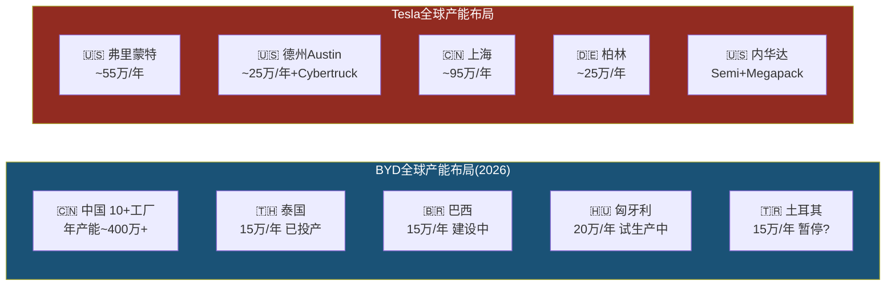
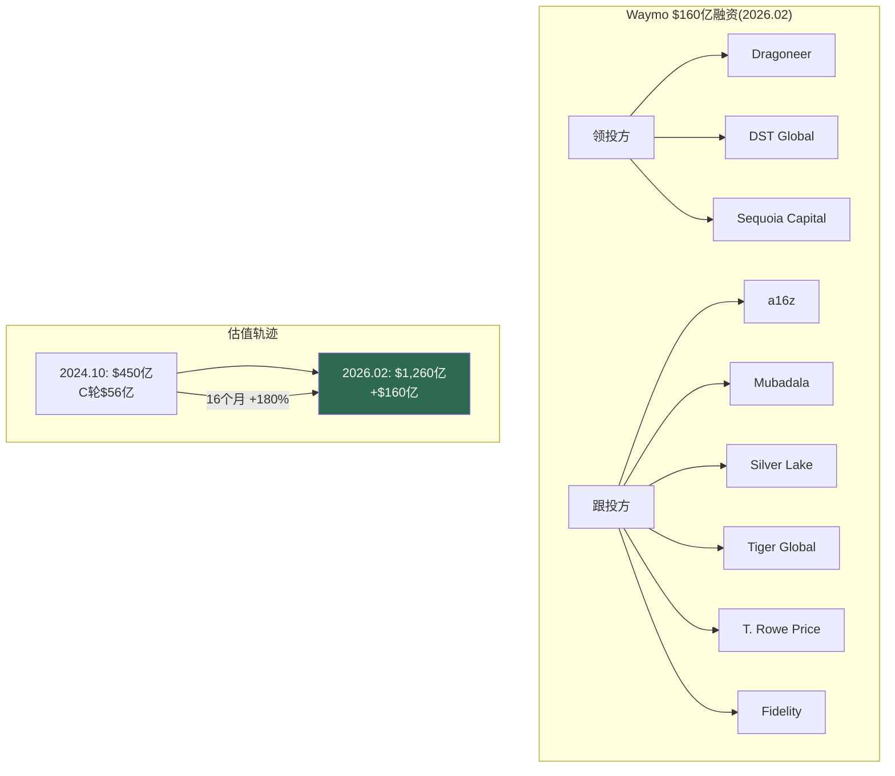
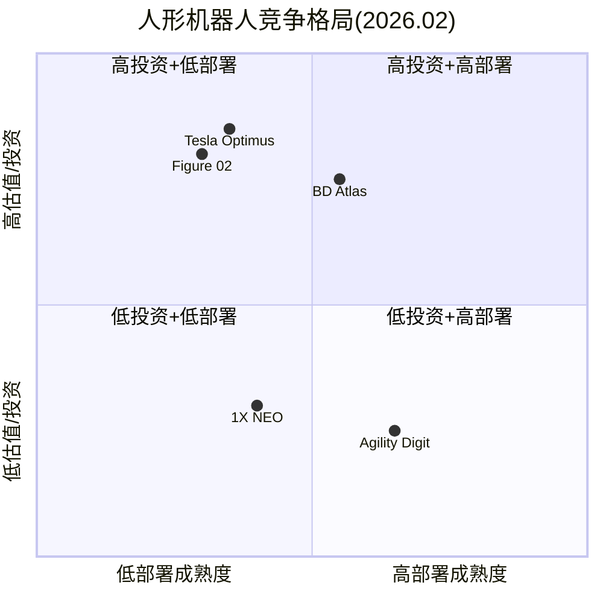
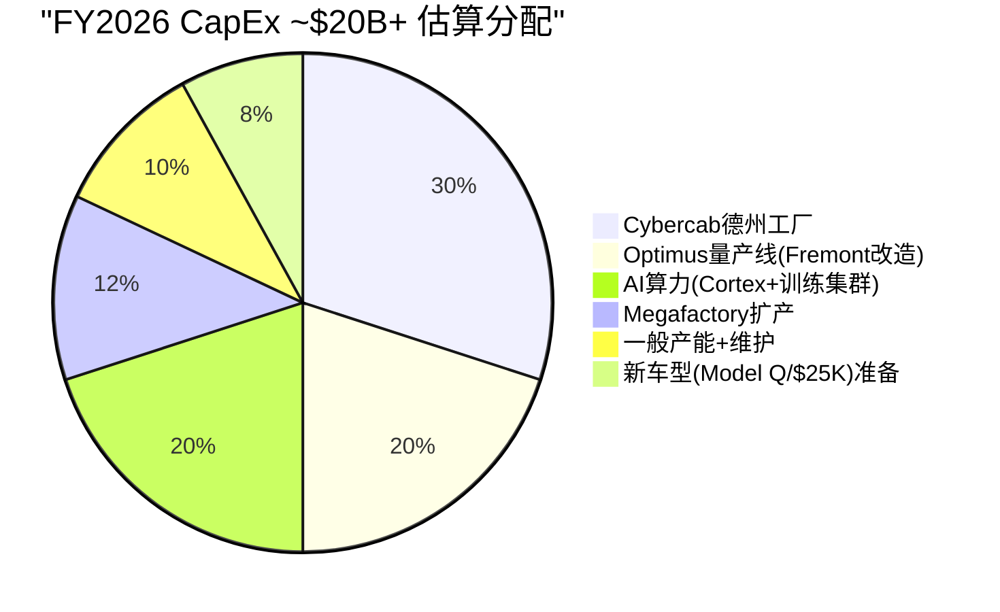
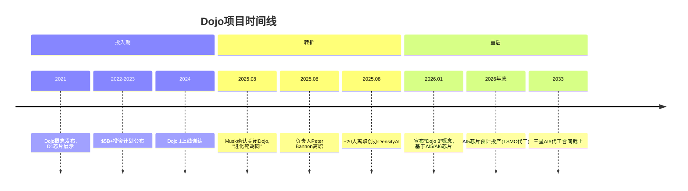
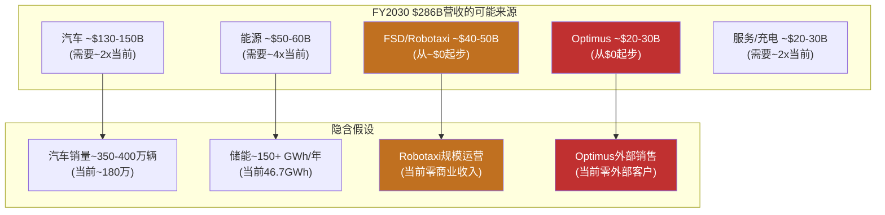

# Part 1.3: 竞争事实全景 + Part 1.4: 管理层行动分析

> **Agent2产出** | 目标: ~15K字符 | 方法论: 只列事实，不评价谁会赢，不给投资建议

---

## 1.3 竞争事实全景

**原则: 只列事实。不评价谁会赢。**

以下是Tesla在五个竞争维度面临的事实全景。每个数据点标注来源层级。

---

### 1.3.1 BYD全面对比

BYD在2025年完成了从"中国电动车企"到"全球新能源汽车巨头"的跨越。以下是逐维度的事实对比。

#### 核心经营对比表

| 维度 | BYD (FY2025) | Tesla (FY2025) | 差异 |
|------|-------------|----------------|------|
| **总销量** | 460.2万辆 (NEV全口径) | ~180万辆 (纯电) | BYD 2.56x [硬数据: BYD公告/Tesla 10-K] |
| **纯电(BEV)销量** | 225.7万辆 (+27.9% YoY) | ~180万辆 | BYD纯电已超Tesla [硬数据: BYD公告] |
| **总营收** | ~¥7,500-8,000亿 (~$107B+) | $94.83B | BYD首次超越Tesla总营收 [合理推断: Q1-Q3 ¥5,663亿外推] |
| **出口量** | 105万辆 (+200% YoY) | ~20万辆 (非中国产出口) | BYD出口5x+ [合理推断: 行业数据] |
| **R&D支出** | ~$9.5B+ (Q1-Q3 ¥437.5亿, +31% YoY) | $6.41B (+41% YoY) | BYD R&D绝对值1.48x Tesla [硬数据: BYD/Tesla财报] |
| **R&D/净利润** | >100% (R&D超净利已连续4年) | ~169% | 两家都在重投研发 [硬数据: 财报] |
| **价格区间** | $10K-$50K (海鸥~$10K, 仰望~$150K) | $30K-$100K+ | BYD覆盖更广价格带 [硬数据: 公开定价] |
| **工厂数** | 中国10+座, 泰国/巴西/匈牙利/土耳其 | 美/中/德 5座 | BYD产能布局更分散 [硬数据: 公开信息] |

#### BYD技术栈

- **刀片电池(Blade Battery)**: LFP路线，能量密度140Wh/kg，通过针刺测试不起火，成本优于三元锂 [硬数据: BYD技术白皮书]
- **DM-i超级混动**: 油耗3.8L/100km，中国市场PHEV销量占BYD总量一半以上 [硬数据: BYD公告]
- **e平台3.0**: 800V高压架构，充电5分钟续航150km [硬数据: BYD技术发布会]
- **智驾方案**: 天神之眼，纯视觉+激光雷达双路线并行，2025年城市NOA覆盖300+城市 [合理推断: BYD技术发布会]

#### BYD欧洲工厂进展

| 工厂 | 状态 (2026.02) | 产能规划 | 首款车型 |
|------|----------------|---------|---------|
| **匈牙利Szeged** | 2026.02试生产启动，Q2量产 | 20万辆/年 | Dolphin Surf (海鸥欧版) [硬数据: BYD公告/electrive报道] |
| **土耳其Manisa** | 原计划2026年底投产，但近期报道称投资暂停 | 15万辆/年 | 待定 [合理推断: 多家媒体报道] |

[硬数据: BYD匈牙利工厂2026年2月2日开始试生产，生产线设备已于2025年12月到达]

---

### 1.3.2 Waymo详细对比

Waymo在2026年2月完成了自动驾驶行业史上最大融资，标志着L4自动驾驶从实验期进入规模扩张期。

#### Waymo运营数据

| 指标 | 数值 | 来源 |
|------|------|------|
| **周均rides** | 450,000+ (2025年底) | [硬数据: Waymo 2025年度回顾] |
| **2025全年rides** | 1,500万次 (同比3x+) | [硬数据: Waymo公告] |
| **累计rides** | 2,000万+ (历史总计) | [硬数据: Waymo公告] |
| **无人驾驶里程** | 1.27亿+英里 | [硬数据: Waymo安全报告] |
| **运营城市** | 6个: Austin, SF Bay Area, Phoenix, Atlanta, LA, Miami | [硬数据: Waymo公告] |
| **2026扩展目标** | 20+新城市，含东京、伦敦(首批国际市场) | [硬数据: Waymo 2026.02公告] |
| **2026年底目标** | 100万次/周 rides (当前4x) | [硬数据: Waymo公告] |
| **最新估值** | **$1,260亿** (2026.02融资后) | [硬数据: Waymo/Alphabet公告] |
| **最新融资** | **$160亿** (自动驾驶行业史上最大单轮) | [硬数据: Waymo 2026.02.02公告] |
| **累计投资** | $160亿(本轮) + $56亿(上轮) + Alphabet历年投入 ≈ $300亿+ | [合理推断: 公开融资记录] |
| **安全数据** | 严重伤亡事故比人类驾驶少90% (同行评审论文) | [硬数据: 发表的同行评审研究] |

#### Tesla FSD v14 vs Waymo 6th Gen 对比表

| 维度 | Tesla FSD v14 | Waymo 6th Gen | 差异性质 |
|------|--------------|---------------|---------|
| **自动化等级** | SAE L2+ (需人类监督) | SAE L4 (限定区域全无人) | 等级差异 [硬数据: SAE标准/监管分类] |
| **传感器** | 8摄像头 (纯视觉) | 13摄像头 + 4 LiDAR + 6雷达 + 音频传感器 | 路线差异 [硬数据: 硬件规格] |
| **运行模式** | 驾驶员必须在座位上 | 完全无人车内运行 | [硬数据: 监管要求] |
| **覆盖范围** | 全球消费者可用(受监管限制) | 6个美国城市 + 东京/伦敦扩展中 | Tesla更广但等级更低 |
| **数据量** | 60B+英里消费者行驶数据 | 1.27亿+英里无人驾驶数据 | 数据量vs数据质量权衡 [合理推断] |
| **商业模式** | $99/月订阅 / 1.1M付费用户 | Ride-hailing (per trip) | [硬数据: Tesla/Waymo定价] |
| **监管状态** | Austin有限试点(员工), 加州无L4许可 | 6城L4商业运营许可 | [硬数据: DMV/CPUC记录] |
| **核心车型** | 消费者自有车辆 | Jaguar I-PACE改装 → Geely Zeekr定制 | [硬数据: 公开信息] |
| **AI模型** | 端到端神经网络, 单芯片推理 | 多模态融合, 高性能计算平台 | 架构差异 |
| **Austin试点状态** | 已移除跟随车辆, Musk称"100%无监督" | Austin已商业运营 | 同一城市不同阶段 [硬数据: 公开报道] |

[主观判断: Tesla FSD近期暂停了"无监督"robotaxi rides，具体恢复时间未公布。两种路线的终极胜负尚无定论。]

#### Waymo融资方对比

---

### 1.3.3 储能竞争格局

全球储能市场正进入高速增长期，Tesla Megapack是领先者之一，但竞争者正在快速追赶。

#### 储能产品对比

| 产品/公司 | 单体容量 | 技术路线 | 软件/集成 | 部署规模 |
|-----------|---------|---------|----------|---------|
| **Tesla Megapack 2 XL** | 3.9 MWh/unit | LFP | Autobidder + VPP生态 | 46.7 GWh (FY2025) [硬数据: Tesla 10-K] |
| **BYD MC Cube-T** | 6.432 MWh/unit | LFP刀片 | BYD ESS平台 | 系统级出货全球前3 [硬数据: InfoLink排名] |
| **CATL EnerOne Plus** | 6.25 MWh/unit | LFP | 电芯级成本最低 | 储能电芯全球市占~36.5% [硬数据: InfoLink 2025] |
| **Fluence (Siemens+AES)** | 模块化(硬件不可知) | 多品牌电芯 | Fluence IQ, 47国部署 | FY2025营收$23亿, FY2026指引$32-36亿 [硬数据: Fluence财报] |

#### 市场排名 (2025 Q1-Q3)

| 维度 | Top 5排名 | Tesla位置 |
|------|----------|----------|
| **储能系统(ESS)出货** | Sungrow > BYD > Tesla > CRRC > Huawei | **#3** (Q3被BYD超过) [硬数据: InfoLink] |
| **储能电芯出货** | CATL > Hithium > EVE > CALB > BYD | Tesla不生产电芯(采购) |
| **公用事业级储能电芯** | 372.36 GWh (+101.9% YoY) | — [硬数据: InfoLink Q1-Q3 2025] |

#### 市场增长数据

- 全球储能市场规模: $1,459亿(2025E) → $5,212亿(2035E), CAGR 13.6% [硬数据: SNS Insider 2026.02报告]
- 电池储能系统: $101.6亿(2025) → $868.7亿(2034), CAGR 26.9% [硬数据: Straits Research]
- 2025全年全球储能电芯出货预计超500 GWh, 2026接近800 GWh [硬数据: InfoLink预测]
- 公用事业级储能占比50.2%(2025), 亚太市场占比41.4% [硬数据: 行业报告]

**Tesla在储能领域的差异化**: Autobidder软件(AI驱动的能源交易算法) + Powerwall/VPP虚拟电厂生态 + Megafactory上海(2025投产)。系统集成能力强于纯电芯供应商，但单体容量落后于BYD和CATL最新产品。[合理推断: Tesla的护城河在软件和生态,不在硬件]

---

### 1.3.4 人形机器人竞争对比表

2026年1月CES后，人形机器人赛道进入了"从实验室到工厂"的转折年。以下是5家主要参与者的事实对比。

| 维度 | Tesla Optimus Gen 3 | Figure 02 | BD Atlas (量产版) | 1X NEO | Agility Digit |
|------|--------------------|-----------|--------------------|--------|---------------|
| **身高** | 173cm (5'8") | ~170cm | ~150cm | ~167cm (5'6") | ~175cm |
| **体重** | 57kg (125lb) | ~70kg | ~89kg | **30kg (66lb)** | ~65kg |
| **自由度(总)** | 未公开(推测40+) | 未公开 | **56 DOF** | 未公开 | 16+ |
| **手部DOF** | **22 DOF/手** (腱驱动) | 16 DOF/手 | 未公开(高灵巧) | 22 DOF/手 | 简化夹爪 |
| **负载能力** | ~20kg (推测) | 20kg | 25kg+ (推测) | 25kg(搬运)/70kg(举) | 16kg |
| **AI模型** | 端到端NN (FSD技术迁移) | Helix VLA (200Hz) | Google DeepMind合作 | 人工+AI混合遥操 | 强化学习+模仿学习 |
| **LiDAR** | 无(纯视觉) | 有 | 有 | 未公开 | 有 |
| **部署状态** | 1000+台Tesla内部工厂 | BMW完成11月试点(退役) | 韩国HMGMA工厂部署中 | 2026美国消费者交付启动 | GXO仓库商业部署中 |
| **外部客户** | **零** | BMW(已结束试点) | Hyundai+Google DeepMind | 消费者预购 | GXO+Amazon |
| **定价** | $20K-30K (目标) | $130K | 未公开 | $20K / $499月 | ~$250K (RaaS模式) |
| **估值/投资** | Tesla市值的一部分 | **$390亿** (Series C) | Hyundai $260亿机器人投资 | ~$20亿+ | ~$10亿+ |
| **量产规划** | Fremont产线100万/年目标 | 未公开产能 | 新工厂3万台/年 | 未公开 | RoboFab 10K/年产能 |

[硬数据: 各公司公开发布/CES 2026/融资公告。Tesla Optimus部分参数为推测，标注为合理推断]

#### 关键事实补充

- **Figure**: BMW Spartanburg工厂11个月试点，1,250小时运行，装载9万+零件，参与3万+辆X3生产。但试点已结束，Figure 02已"退役"。[硬数据: BMW/Figure联合公告]
- **Boston Dynamics**: CES 2026发布量产版Atlas。2026全年产量已被预订一空。Hyundai HMGMA佐治亚工厂已开始实际工厂操作。预计2028年开始排序任务，2030年进入组装。[硬数据: Hyundai CES 2026发布]
- **1X NEO**: 30kg是所有人形机器人中最轻，定位家庭场景。22dB运行噪音(冰箱水平)。采用"人类在环"模式——机器人遇到困难时人工远程接管，接管数据成为训练数据。2026年开始美国交付。[硬数据: 1X官网/预购页面]
- **Agility Digit**: GXO仓库部署超10万个totes搬运里程碑(2025.11)。行业首个人形机器人RaaS(机器人即服务)多年商业合同。[硬数据: Agility/GXO联合公告]

[主观判断: Tesla Optimus和Figure在估值/投资维度最高，但实际部署成熟度低于Agility(已有商业RaaS合同)和BD Atlas(已进入Hyundai工厂)。这不代表最终竞争结果。]

---

### 1.3.5 充电网络

Tesla充电网络在2025-2026年完成了从"Tesla专属"到"行业基础设施"的身份转变。

#### NACS采纳情况

NACS(North American Charging Standard)已被SAE采纳为J3400标准。截至2026年2月，以下车企已支持Tesla Supercharger充电:

**已接入**: Ford, GM, Rivian, Volvo, Polestar, Nissan, Lucid, Mercedes-Benz, Hyundai, Genesis, Kia, Honda, Acura, JLR, Audi, Porsche, Toyota, Volkswagen, Subaru [硬数据: Tesla NACS页面/各车企公告]

**即将接入**: Stellantis (Jeep, Dodge等, 2026年初) [硬数据: Stellantis公告]

#### 网络规模

| 指标 | 数值 | 来源 |
|------|------|------|
| 全球Supercharger连接器 | 70,000+ | [硬数据: Tesla公开数据, 2025年中] |
| 北美开放给非Tesla车辆比例 | >2/3的站点 | [硬数据: 行业报告 2026.01] |
| 北美DC快充端口总数 | 67,916个 (含所有标准) | [硬数据: EVChargingStations 2026.01] |
| 北美Supercharger端口 | 15,000+ (开放端口) | [硬数据: Tesla] |

**充电网络的商业意义**: Supercharger收入计入"服务"板块($12.53B FY2025的一部分)。随着非Tesla车辆接入，充电收入有望成为独立利润中心。但具体充电收入Tesla未单独披露。[合理推断: 充电业务从成本中心转向利润中心]

---

## 1.4 管理层行动分析

### 1.4.1 CapEx $20B+深度拆解

Tesla FY2026 CapEx指引">$20B"是公司历史上最激进的资本支出计划，也是近年大型上市公司中最大的YoY CapEx跳升之一。

#### CapEx历史轨迹

| 年度 | CapEx | YoY | 占OCF比例 |
|------|-------|-----|----------|
| FY2022 | $7.16B | — | 47% |
| FY2023 | $8.88B | +24% | 73% |
| FY2024 | $11.34B | +28% | ~77% |
| FY2025 | $8.53B | **-25%** | 58% |
| **FY2026E** | **>$20B** | **>+135%** | **>133%** (如OCF=$15B) |

[硬数据: Tesla 10-K / 财报电话会指引]

#### $20B去向推测

Tesla未披露CapEx分项，以下为基于公开信息的估算:

[主观判断: 以上分配为基于公开信息的估算，Tesla未公布具体分项]

- **Cybercab德州工厂**: Musk宣布2026年4月开始Cybercab量产。新建/改造产线是最大单项支出 [硬数据: Q4 2025电话会]
- **Optimus量产**: Fremont停产Model S/X，改造为Optimus产线，目标100万台/年产能 [硬数据: Tesla 2026.01.21公告]
- **AI算力**: Cortex超算中心扩建 + 训练集群。Dojo关闭后全部转向NVIDIA GPU + 自研AI5/AI6芯片 [硬数据: Musk公开发言]
- **Megafactory**: 上海Megafactory已投产，可能有其他地区扩产 [硬数据: Tesla公告]

#### FCF影响分析

| 情景 | OCF | CapEx | FCF | 含义 |
|------|-----|-------|-----|------|
| **乐观** | $18B (+22%) | $20B | **-$2B** | 轻微负FCF [合理推断] |
| **基准** | $15B (持平) | $22B | **-$7B** | 显著负FCF [合理推断] |
| **悲观** | $12B (-19%) | $25B | **-$13B** | 大幅负FCF [合理推断] |
| **缓冲** | 现金$44B | — | — | 可覆盖3-8年负FCF [硬数据: 资产负债表] |

[合理推断: 即使最悲观情景下，$44B现金仍可覆盖3年以上的负FCF。但这意味着Tesla在2026-2027年将从"现金生成机器"变为"现金消耗机器"。]

---

### 1.4.2 R&D方向分析

#### R&D强度对比

| 指标 | Tesla FY2025 | 行业对比 |
|------|-------------|---------|
| **R&D绝对值** | $6.41B (+41% YoY, from $4.54B) | BYD ~$9.5B+, Waymo (Alphabet R&D一部分) [硬数据: 各公司财报] |
| **R&D/营收** | 6.76% | 高于传统车企(GM ~5%, Toyota ~4%)，低于纯科技(Meta ~30%) [硬数据: 各公司财报] |
| **R&D/毛利** | **37.5%** | Tesla将超过1/3毛利投入R&D [硬数据: 计算 $6.41B/$17.09B] |

#### R&D关键方向

| 方向 | 投入信号 | 状态 |
|------|---------|------|
| **FSD神经网络** | 端到端模型v14, 全球扩展 | 核心方向 [硬数据: Tesla产品发布] |
| **AI5/AI6芯片** | 三星$165亿代工合同(至2033), TSMC代工AI5 | AI5预计2026年底投产 [硬数据: 公开报道] |
| **Optimus** | Gen3量产启动, 22DOF手, 腱驱动 | 从R&D转入制造 [硬数据: Tesla 2026.01公告] |
| **下一代制造** | Unboxed Process, Gigacasting进化 | 持续迭代 [硬数据: Tesla工程发布] |
| **Dojo→AI5/6** | Dojo 2025.08关闭, "进化死胡同" | Dojo团队负责人离职, ~20人创办DensityAI [硬数据: TechCrunch报道] |

#### Dojo时间线

[硬数据: TechCrunch/Musk公开发言。Musk原话: "Once it became clear that all paths converged to AI6, I had to shut down Dojo and make some tough personnel choices, as Dojo 2 was now an evolutionary dead end."]

---

### 1.4.3 已做 vs 未做 扩展表

#### 已做(已兑现的行动)

| 行动 | 时间 | 具体内容 | 领域 |
|------|------|---------|------|
| 停产Model S/X | 2025-2026 | Fremont产线改造为Optimus | 制造 [硬数据: Tesla公告] |
| FSD $99/月订阅 | 2026.02.14 | 从$12K一次性购买转为订阅 | 软件 [硬数据: Tesla定价页] |
| CapEx >$20B指引 | 2026.01 Q4电话会 | FY2026资本支出指引 | 财务 [硬数据: 电话会记录] |
| xAI投资$2B | 2025 | Tesla获xAI少数股权 | AI/战略 [硬数据: Tesla 10-K] |
| Austin Robotaxi试点 | 2025-2026 | 员工通勤服务, 移除跟随车 | 自动驾驶 [硬数据: 公开报道] |
| 上海Megafactory | 2025 | 投产, Megapack量产 | 能源 [硬数据: Tesla公告] |
| Gen3 Optimus量产启动 | 2026.01.21 | Fremont产线开始 | 机器人 [硬数据: Tesla公告] |
| Cybertruck产量爬坡 | 2024-2025 | 从0到规模生产 | 制造 [硬数据: 交付数据] |
| NACS成为行业标准 | 2023-2025 | SAE J3400, 20+车企采纳 | 充电 [硬数据: SAE/各车企公告] |
| 储能连续3年翻倍 | 2023-2025 | 14.7→31.4→46.7 GWh | 能源 [硬数据: Tesla 10-K] |

#### 未做(未兑现的承诺)

| 承诺 | 原始时间 | 当前状态 | 领域 |
|------|---------|---------|------|
| FSD L4获批 | 多次承诺("明年") | L2+, 无L4监管批准 | 自动驾驶 [硬数据: DMV记录] |
| Robotaxi大规模运营 | 2020年"百万车队" | Austin有限试点(员工), 近期暂停 | 自动驾驶 [硬数据: 公开报道] |
| $25K低价车 | 2020年电池日承诺 | 未上市, Cybercab是不同产品 | 产品 [硬数据: 发布会记录] |
| Dojo成功 | 2021年发布, $5B+投资 | 2025.08关闭, "进化死胡同" | AI [硬数据: Musk确认] |
| Optimus外部销售 | 2022年AI Day | 零外部客户, 仅内部1000+台 | 机器人 [硬数据: Tesla公告] |
| Semi量产 | 2017年发布 | 有限生产, 未达规模 | 产品 [硬数据: 交付数据] |
| LA→NY全自动驾驶 | 2016年承诺"2017年底" | 未实现 | 自动驾驶 [硬数据: Musk公开发言] |

**模式识别**: 已兑现清单集中在**硬件制造和工厂建设**(Gigafactory, Megapack, 充电网络)。未兑现清单集中在**软件/自动驾驶时间表**。能源业务是兑现最一致的领域。[合理推断: 基于已做/未做清单的模式分析]

---

### 1.4.4 承诺兑现率: FSD时间线考古

以下是Elon Musk关于Tesla自动驾驶的公开承诺时间线。数据来源为公开发言、财报电话会、社交媒体。

| 年份 | 承诺内容 | 承诺兑现日期 | 实际结果 |
|------|---------|------------|---------|
| **2015** | "完全自动驾驶约2年内实现" | ~2017 | 未实现 [硬数据: 公开发言] |
| **2016** | "LA到纽约全自动驾驶演示" | 2017年底 | 未实现 [硬数据: TED演讲] |
| **2017** | "完全自动驾驶,你可以在车里睡觉" | ~2019 | 未实现 [硬数据: TED Talk] |
| **2019** | "今年功能完备的FSD" | 2019年底 | 未实现 [硬数据: Autonomy Day] |
| **2019** | "明年100万辆Robotaxi" | 2020 | 未实现 [硬数据: Autonomy Day] |
| **2020** | "非常接近L5" | 2020年 | 未实现 [硬数据: 世界AI大会] |
| **2020** | "完全自动驾驶明年对客户发布" | 2021 | FSD Beta发布(L2) [硬数据: 财报电话会] |
| **2021** | "今年提供SAE L5" | 2021年底 | 未实现。Tesla Autopilot总监向DMV承认"不反映工程现实" [硬数据: DMV会议记录] |
| **2022** | "如果2022年FSD不比人类安全我会震惊" | 2022年底 | 未实现 [硬数据: Q4 2021电话会] |
| **2023** | "今年晚些时候完全自动驾驶" | 2023 | 未实现 [硬数据: AI会议发言] |
| **2024** | "2025年德州和加州无监督FSD" | 2025 | Austin有限试点, 加州无许可 [硬数据: 公开发言] |

**法律注脚**: 2023年针对Musk FSD承诺的证券欺诈诉讼在2024年9月被驳回，法官裁定Musk的声明属于"corporate puffery"(企业吹嘘)。[硬数据: 法院裁决]

[合理推断: FSD/自动驾驶时间表被推迟至少8次。每次承诺的"下一年"平均推迟2-3年。但需注意: FSD的技术进步是真实的——从规则系统→端到端神经网络是实质性架构跨越，只是时间线持续误判。]

---

### 1.4.5 Polymarket信号分析

预测市场提供了"群体智慧"对Tesla关键事件的概率评估。以下为截至2026年2月的活跃市场。

#### 核心市场

| 市场问题 | 概率 | 截止日 | 交易量 | 含义 |
|---------|------|--------|-------|------|
| **Tesla加州Robotaxi launch by Jun 30** | **Yes 34% / No 66%** | 2026.06.30 | ~$39K | 市场认为2/3概率不会发生 [硬数据: Polymarket 2026.02.11] |
| Tesla Robotaxi全美launch by Jun 30 | 活跃 | 2026.06.30 | — | 全美更难 [硬数据: Polymarket] |
| Tesla Optimus外部发布 | 活跃 | 多个截止日 | — | [硬数据: Polymarket] |
| Tesla-xAI合并 by Jun 30 | 活跃 | 2026.06.30 | — | [硬数据: Polymarket] |
| Tesla-SpaceX合并 by Jun 30 | 活跃 | 2026.06.30 | — | [硬数据: Polymarket] |
| Musk不再担任CEO before 2027 | 活跃 | 2026.12.31 | — | [硬数据: Polymarket] |
| Q1 2026交付量 | 350K-500K+多档 | Q1 2026 | — | [硬数据: Polymarket] |

**Polymarket信号解读**: 加州Robotaxi市场34% Yes意味着市场参与者认为有约1/3概率Tesla能在4.5个月内(2026.02→2026.06)在加州推出无人Robotaxi服务。考虑到Tesla目前(a)没有加州L4许可,(b)Austin试点近期暂停,(c)加州监管机构对Tesla表达过担忧——34%并不低。[合理推断: 34%隐含了对Musk政治影响力可能加速监管的定价]

**NBC报道**: 预测市场交易者已在Musk的多次未兑现承诺上获利。"下注Musk承诺不兑现"已成为一个被记录的交易策略。[硬数据: NBC News 2026报道]

---

### 1.4.6 分析师共识 vs 现实

#### FY2025: 预期 vs 实际

| 指标 | 年初共识预期 | 实际结果 | 偏差 |
|------|------------|---------|------|
| **EPS** | ~$2.19 (年初) → $1.65 (修正后) | **$1.08** | **-51%** (vs年初) [硬数据: 分析师平台/Tesla 10-K] |
| **营收** | ~$100B+ (年初) | **$94.83B** | ~-5% [合理推断: 基于年初预期] |

#### 前瞻共识

| 指标 | FY2026E | FY2027E | FY2030E | 隐含CAGR |
|------|---------|---------|---------|----------|
| **营收** | $104.04B | $120.95B | $285.96B | FY25→30 CAGR ~24.7% [硬数据: FMP estimates] |
| **EPS** | $1.97 | $2.61 | $11.42 | FY25→30 CAGR ~60% [硬数据: FMP estimates] |

#### FY2030 EPS $11.42的含义

$11.42 EPS意味着相对FY2025 $1.08的**10.6x增长**。要在5年内实现这个增长，以下条件至少部分需要成立:

| 条件 | 需要发生什么 | 难度 |
|------|------------|------|
| **营收3x** | $94.8B → $286B，需要~$190B增量营收 | 汽车单独不够，需要能源+FSD+Robotaxi+新业务 [合理推断] |
| **毛利率恢复** | 从18% → 25%+，需要混合改善或软件收入占比↑ | FSD高毛利率是关键变量 [合理推断] |
| **新收入流** | Robotaxi收入、Optimus销售、FSD许可费 | 这些业务今天贡献接近$0 [硬数据: Tesla 10-K] |
| **费用杠杆** | R&D和SGA的营收占比需要下降 | 当前R&D在上升(6.76%) [硬数据: Tesla 10-K] |

[合理推断: FY2030共识$286B收入中，约$70-80B(~25-28%)来自今天收入几乎为零的业务(Robotaxi+Optimus)。这是共识估计中嵌入的最大不确定性。]

#### 价格隐含 vs 共识的差距

当前股价约$350 [硬数据: 近期市价]。若以25x FY2030 EPS $11.42计算，合理市值约$9,200亿。但当前市值约$1.1万亿，意味着市场对FY2030的隐含定价高于共识分析师预期。[合理推断: 市场隐含了比共识更乐观的增长路径——可能包含更高的Robotaxi/Optimus期权价值]

---

*Part 1.3 + 1.4完。以上是竞争全景和管理层行动的事实基础，为Part 2的可能性空间分析提供输入。*
