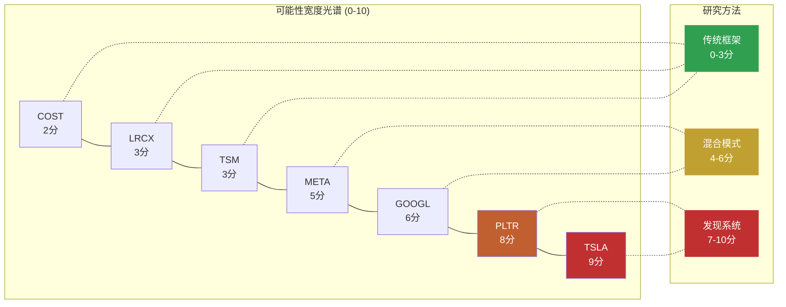
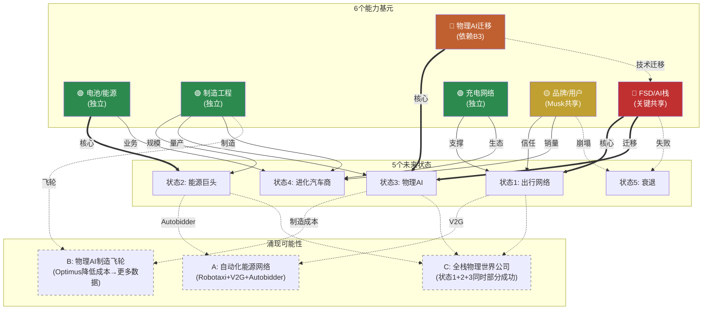
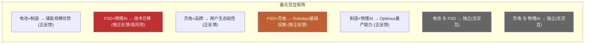
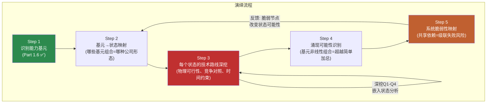

# Part 1.5 / 1.6 / 2.1 — 分析框架桥接

> **定位**: 从"今天的公司"(Part 1)到"公司可能成为什么"(Part 2)的方法论桥梁
> **产出Agent**: P1_agent3_framework | **目标**: ~12K字符

---

## 1.5 可能性宽度评估

### 方法论说明

可能性宽度分类器是一个5维度评分系统(每维度0-2分，总分0-10)，用于判断一家公司的未来形态有多"开放"。[硬数据: 范式研究框架v1.1 §1] 低分(0-3)意味着公司在一条明确赛道上运行，传统DCF/SOTP可以给出有意义的目标价；高分(7-10)意味着公司的未来形态本身就是未知数，给出精确估值等于"精确的错误"。这一评估不是主观打分，每个维度都有明确的判定标准和证据锚点。

### 逐维度评估

| 维度 | 分数 | Tesla证据 | 对比基准 |
|------|:----:|----------|---------|
| **收入结构** | **2** | 汽车73.3%但YoY -10%在收缩；能源$12.8B(+27%)是独立增长引擎；FSD订阅($99/月，2026.02.14上线)是SaaS模式；Robotaxi(按里程收费)和Optimus(产品销售/租赁)尚在pre-revenue阶段 [硬数据: Tesla 10-K FY2025] | COST(0): 98%+来自会员费+零售的成熟模式；GOOGL(1): 77%广告但Cloud在增长 |
| **商业模式流动性** | **2** | 5年内从汽车制造→储能基础设施→出行平台→人形机器人→AI计算，每次进入的都是**全新领域**而非邻近市场 [合理推断: 基于实际业务扩展历史] | PLTR(2): 政府→商业→AI平台也在持续扩展；TSM(0): 代工模式30年未变 |
| **CEO期权思维** | **2** | Musk同时运营Tesla/SpaceX/xAI/Boring/Neuralink，在Tesla内部同时押注FSD/Cybercab/Optimus/能源/Semi至少5条赛道，且每条赛道独立配置资源(Cybercab德州专线、Optimus Fremont专线) [硬数据: Tesla 10-K, 财报电话会] | META(1): Zuckerberg押注Reality Labs但核心广告稳定；LRCX(0): 专注半导体设备 |
| **市场定价偏离** | **2** | P/E 385.70x vs 汽车行业~10x；传统SOTP(汽车+能源+FSD有限成功) $61-85 vs 市价$425；偏离400-600% [硬数据: FMP ratios; 合理推断: v2.0估值分析] | PLTR(2): 也有极端偏离；TSM(1): P/E 30x vs 半导体~20x，偏离适中；COST(0): P/E在历史区间内 |
| **TAM不确定性** | **1** | 汽车TAM($2-3T)可算，增速可预测；储能TAM($0.5-1T)有行业预测；但Robotaxi TAM($5-8T?)、Optimus TAM($5-20T??)和AI计算TAM无法定义——这些市场可能不存在或可能比汽车大10倍 [主观判断: TAM数字本身高度不确定] | TSLA拿1分而非2分，因为73%收入来自可定义TAM的汽车业务 |
| **总分** | **9/10** | **→ 发现系统** | |

### 跨报告验证

9分是本框架已完成的8份Tier 3报告中最高分。与其他公司对比：

Tesla拿到最高分的核心原因：**同时拥有最多处于不同阶段的业务线**(汽车成熟期、能源增长期、FSD过渡期、Robotaxi/Optimus萌芽期) **且市场定价偏离最极端**(传统估值覆盖不到市价的20%)。PLTR(8分)与Tesla的区别在于PLTR的多条线本质上是同一个产品(Foundry/AIP)在不同行业的应用，而Tesla的各条线是**质的不同**的业务形态。[合理推断: 基于已完成报告的横向比较]

### 不确定性类型判定

Tesla的不确定性以**A型(类别不确定性)为主导**：

| 类型 | 核心问题 | Tesla适用性 | 判定 |
|------|---------|-----------|------|
| **A型: 类别** | "会变成什么公司？" | Tesla有>=5条独立业务线可能组合成质的不同的企业形态——从汽车公司到出行平台到能源巨头到机器人公司，每种形态的收入结构、利润率、估值逻辑完全不同 | **主导** |
| **B型: 量级** | "这个产品能做多大？" | FSD/Robotaxi市场规模不确定(全球出行$5-8T?)；Optimus市场规模更不确定($5-20T?) | 次要 |
| **C型: 转型** | "核心业务能否存活范式转换？" | 汽车业务面临BYD竞争压力，但Tesla**主动**发起转型而非被动应对——这不是柯达式困境 | 不适用 |

**A型主导的含义**：Part 2不能用"同一个Tesla乘以不同增速"的场景分析，而必须从能力基元出发，推导质的不同的未来状态。每个状态是一种**不同类型的公司**，不是同一家公司的不同版本。

**对报告方法论的直接影响**：9/10 → 发现系统 → 不给目标价、不给评级、不给概率权重。报告的价值在于帮投资者看到可能性空间的**结构**，而非押注某个点。

---

## 1.6 能力基元深度分析

Tesla拥有6个可独立识别的底层能力。这些基元是Part 2演绎推理的"原子"——所有未来状态都是基元的不同组合。

### 基元1: 电池/能源技术

**当前状态**: 4680电芯(Giga Texas/Berlin生产) + LFP采购(CATL)双轨策略；Megapack年部署46.7 GWh(FY2025, +49% YoY)；Autobidder能源管理软件在全球电力市场运行 [硬数据: Tesla 10-K]

**独特性评估**: 制造规模全球储能前2(与BYD竞争)；但真正的差异化不在电芯——在Autobidder软件(每5分钟做价格预测+最优出价)和垂直整合(Megapack+Powerwall+VPP+Supercharger形成闭环)。竞品中没有一家同时拥有这5层。[合理推断: 基于深挖Q3分析]

**共享依赖**: **独立**。不依赖FSD成功、不依赖品牌好感度、不依赖Musk注意力。是所有基元中最"安全"的。

**脆弱性**: BYD HaoHan单柜14.5MWh/CATL电池成本更低 → 硬件利润率下行是结构性趋势；Autobidder网络效应目前较弱(数据壁垒是"中"级别) [合理推断: 深挖Q3]

**演化方向**: 硬件(GWh规模) → 软件平台(Autobidder管理第三方资产) → 虚拟电力公司(VPP聚合百万终端)

### 基元2: 制造工程

**当前状态**: Gigacasting(一体压铸减少零件数70%+)、Unboxed Process(非线性装配)、5座Gigafactory全球布局(Fremont/Texas/Shanghai/Berlin/Nevada) [硬数据: Tesla 10-K]

**独特性评估**: Gigacasting技术Tesla首创但已被丰田/沃尔沃/小鹏跟进；BYD在制造效率上也有极强能力(垂直整合度更高)。Tesla的优势在于**速度**(从概念到量产的周期短)而非不可复制的技术壁垒。[合理推断: 行业公开报道]

**共享依赖**: **独立**。直接支撑状态2(能源)和状态4(进化汽车商)，是Optimus量产的必要条件。

**脆弱性**: 产能利用率不足(FY2025年产能>2M但交付1.79M)；Unboxed Process的全新产线验证风险 [硬数据: Tesla生产数据]

**演化方向**: 汽车制造 → Cybercab专用线 → Optimus装配线 → 制造技术输出(可能性)

### 基元3: FSD/AI技术栈 (关键共享依赖)

**当前状态**: v14端到端NN(10倍规模扩展)，8摄像头纯视觉方案，60B+英里行驶数据，1.1M付费用户，Austin有限L2+试点 [硬数据: Tesla 10-K, Electrek]

**独特性评估**: 训练数据量全球最大(实际道路里程)；但精度/安全性不及Waymo(L4已商业运营450K+周rides/6+城市)。纯视觉路线是Tesla独有选择——所有L4竞品都使用多传感器融合。数据量是优势还是劣势取决于"数据量能否补偿传感器冗余"这个未解答的问题。[硬数据: Waymo公开数据; 合理推断: 技术路线比较]

**共享依赖**: **这是最重要的共享节点**。直接影响状态1(出行网络)、状态3(物理AI/Optimus技术迁移)，以及所有3个涌现可能性。FSD/AI栈失败 = 3/5状态关闭 + 所有涌现关闭。

**脆弱性**: 纯视觉存在物理天花板(暴雨/浓雾场景信噪比) [合理推断: 物理第一性原理, 深挖Q1]；Dojo $5B+沉没成本说明自研训练芯片路线已失败；当前训练依赖NVIDIA GPU [硬数据: TechCrunch]；NHTSA L4要求传感器冗余 → 8个摄像头是共模失效(同一物理原理) [硬数据: NHTSA 2025指南]

**演化方向**: L2+ → (突破或否) → L4有限ODD → Robotaxi → 技术迁移至Optimus → 通用物理AI

### 基元4: 充电网络

**当前状态**: Supercharger全球最大快充网络；NACS已被SAE采纳为北美标准(J3400)；Ford/GM/Rivian等已接入 [硬数据: SAE J3400标准]

**独特性评估**: 事实标准的先发优势 + 网络密度领先。但开放标准意味着Tesla从"独占"变为"最大"——差异在缩小。

**共享依赖**: **独立**。支撑状态1(Robotaxi需要充电基础设施)和状态4(汽车生态粘性)。

**脆弱性**: 开放NACS后其他充电运营商(ChargePoint/EVgo/BP Pulse)快速扩张；政府补贴向非Tesla充电站倾斜 [合理推断: 美国IRA充电补贴分配]

**演化方向**: 专属网络 → 行业标准 → 能源网络节点(V2G双向充放电)

### 基元5: 品牌/用户基础

**当前状态**: 600M+累计车主，高忠诚度(重复购买率领先)，但品牌极化加剧(政治化)。Musk个人品牌与Tesla品牌深度绑定。[硬数据: Tesla投资者日; 合理推断: 品牌调查数据]

**独特性评估**: 汽车行业中唯一拥有"科技品牌"特征的公司(类似Apple在手机中的定位)。但这一特征正因Musk政治参与而被侵蚀。

**共享依赖**: **与Musk共享**。如果Musk成为品牌负资产(部分市场已出现此迹象)，品牌基元受损会同时影响状态1(Robotaxi需要用户信任)和状态4(汽车销量)。

**脆弱性**: 品牌好感度下降趋势 + 政治极化 → 特定市场(欧洲/美国部分州)销量承压 [合理推断: 多来源报道]

**演化方向**: 科技品牌 → (分化中) → 忠诚用户社区 或 争议品牌

### 基元6: 物理AI迁移能力

**当前状态**: FSD的端到端NN架构(视觉感知→运动规划)正在向Optimus迁移；Gen3已启动Fremont量产(2026.01.21)；$1.1B+供应链订单(Sanhua线性执行器$685M + Tuopu关节$410M) [硬数据: Tesla, 36Kr]

**独特性评估**: 全球唯一同时做自动驾驶+人形机器人的公司，理论上两者共享NN架构(场景理解→物理交互)。但迁移程度未经验证——汽车是2D移动+有限交互，机器人是3D移动+精细操作，复杂度差数个量级。[合理推断: 技术架构分析]

**共享依赖**: **完全依赖FSD/AI栈(基元3)**。如果FSD的NN架构无法有效迁移到机器人操作，Optimus必须独立开发AI栈，时间和成本大幅增加。

**脆弱性**: 技术迁移假设尚未验证；Figure AI($39B估值)和Boston Dynamics(Atlas电动版)在专用机器人路径上推进 [硬数据: 公开融资数据]；Gen2 BOM ~$55K vs 售价目标$20-30K，成本差距未闭合 [硬数据: Standard Bots]

**演化方向**: FSD技术子集 → (验证迁移有效性) → Optimus独立AI能力 → 通用物理AI平台

### 增强依赖图谱

### 关键路径分析

**FSD/AI栈(基元3)是整个系统的关键节点**: 它直接决定状态1(出行网络)和状态3(物理AI)的可行性，并通过涌现效应影响所有3个组合可能性。

- **FSD成功**: 状态1打开 + 状态3加速(技术迁移有效) + 涌现A/B/C全部可能 → Tesla可能性空间极宽
- **FSD失败**: 状态1关闭 + 状态3大幅延迟(需独立AI栈) + 涌现全部关闭 → 默认状态4或状态5

**能源基元(基元1)是"安全区"**: 不依赖FSD、不依赖Musk品牌、有独立现金流和增长动力。即使在最差情景(状态5)中，能源业务仍有独立价值。这是Tesla可能性空间中唯一"确定性较高"的部分。[合理推断: 基于依赖关系分析]

### 基元交互矩阵

| | 电池/能源 | 制造工程 | FSD/AI | 充电网络 | 品牌/用户 | 物理AI迁移 |
|---|:---:|:---:|:---:|:---:|:---:|:---:|
| **电池/能源** | — | 正(储能规模) | 独立 | 正(V2G) | 独立 | 独立 |
| **制造工程** | 正 | — | 独立 | 独立 | 独立 | 正(量产) |
| **FSD/AI** | 独立 | 独立 | — | 正(Robotaxi) | 正(信任) | **强正(迁移)** |
| **充电网络** | 正(V2G) | 独立 | 正 | — | 正(生态) | 独立 |
| **品牌/用户** | 独立 | 独立 | 正 | 正 | — | 独立 |
| **物理AI迁移** | 独立 | 正 | **强依赖** | 独立 | 独立 | — |

关键发现: 正反馈最强的交互集中在FSD/AI栈相关的2对(FSD×物理AI、FSD×充电)。这进一步确认了FSD/AI栈作为关键共享节点的地位。同时，电池/能源与FSD/AI之间几乎**没有交互**——这意味着能源业务的成功/失败独立于AI业务线。[合理推断: 基于业务逻辑推导]

### 历史先例检查

**是否有公司曾同时拥有这么多独立能力基元？**

最接近的类比是**Amazon**(1997-至今): 零售→Marketplace→AWS→设备(Kindle/Echo)→媒体(Prime Video)→物流→广告→医疗。Amazon拥有6+条独立业务线，每条都可以独立估值。[合理推断: 公开商业案例]

**关键差异**: Amazon的各业务线大多在"已证明的"市场类别中运行(零售、云计算、广告都有先例)，不确定性主要是B型(量级: 能做多大？)。Tesla的业务线中有多条在**从未存在过的市场**(Robotaxi大规模运营、通用人形机器人商业化)——不确定性是A型(类别: 这个市场会存在吗？)。[合理推断: 历史比较]

这意味着Tesla的可能性空间不仅宽，而且宽在**不确定性质量**上——不是"多大"的问题，而是"是否存在"的问题。这是9/10分的深层原因。

---

## 2.1 演绎方法论: 从Part 1到Part 2的逻辑桥

### 为什么标准分析框架对Tesla失效

**DCF失效**: DCF要求对未来5-10年的收入进行合理预测。Tesla的收入结构正在发生质变(汽车73%→可能<60%，能源+新业务加速增长)，且Robotaxi/Optimus等业务线的收入可能从$0跳跃至$50B+或永远为$0。在收入结构本身是未知数的情况下，任何DCF都是在"猜完结构再猜数字"——双重不确定性使结果毫无意义。[合理推断: 方法论评估]

**场景分析失效**: 传统场景分析(牛市/基准/熊市)使用同一商业模式乘以不同增速。但Tesla的5个未来状态是**质的不同**的公司形态——出行网络运营商(平台模式，毛利率~60%)和进化汽车商(制造模式，毛利率~20%)不是"同一个Tesla"的快慢版本，它们的收入结构、利润率、估值逻辑、可比公司完全不同。[合理推断]

**可比公司失效**: Tesla没有真正的可比公司。汽车看丰田/BYD？能源看NextEra？AI看NVIDIA？机器人看ABB？每个维度都有可比对象，但没有任何一家公司同时跨越这些维度。加权平均可比估值等于把几个不相关行业的P/E搅在一起。[合理推断]

**因此**: 需要从能力基元出发的状态推演——不是在一个模型里调参数，而是识别质的不同的可能路径。

### A型不确定性的演绎方法

这一流程的关键设计: Step 3(技术路线深挖)是AI的核心优势区——从底层物理原理/工程约束出发，推导每条路径的可行边界。深挖Q1-Q4(FSD天花板/Optimus BOM/Autobidder壁垒/系统脆弱节点)直接嵌入对应状态的分析中，不作为独立章节存在。

### Part 2将做什么 / 不做什么

**将做**:
- 对每个状态进行深度技术路线分析，从物理第一性原理出发推导可行性边界
- 识别每个状态的可观测信号(什么数据能告诉我们这个状态正在接近或远离)
- 映射状态之间的依赖关系和级联效应(一个状态的进展如何影响其他状态)
- 检验涌现可能性(多条线同时成功会产生什么非线性效果)

**不做**:
- **不赋予状态概率**: "状态1有30%概率"是伪精度——我们连A型不确定性的概率空间都无法定义
- **不计算概率加权估值**: 5个状态 × 5个概率 = "精确的错误"。[主观判断: 方法论评估]
- **不推荐行动**: 投资者对不同状态的判断取决于其风险偏好和信息优势，报告不应替代这一判断

**原因**: A型不确定性意味着我们不知道概率分布的**形状**。这不是"FSD有60%概率成功"的问题——而是"FSD成功"本身的定义就有多种可能(L3? L4有限ODD? L4全域?)，每种定义导向不同的状态。在这种情况下赋概率是把认知的混沌伪装成数学的确定。

### AI在发现系统中的优势区与弱势区

**强优势(深挖)**:
- 技术架构分析: 纯视觉vs多传感器的物理约束推导、端到端NN架构拆解、BOM成本分解
- 供应链交叉验证: $1.1B供应链订单 → 量产级投入验证(不只是PPT)
- 跨公司模式识别: Waymo L4运营数据 vs Tesla FSD里程数据的结构性比较
- 组合可能性穷举: 6个基元的组合空间(2^6=64种组合)人脑无法系统遍历

**弱或无优势(诚实)**:
- 预测Musk行为: 人的决策不可建模 [主观判断]
- 预测监管结果: NHTSA/中国/欧盟的政策走向受政治博弈影响
- 预测市场时机: 何时"转折点"被市场定价无法推导
- 预测品牌走向: 消费者情感的拐点不可预测

### 5个未来状态预览

Part 2将对以下5个状态进行深度技术路线分析:

| 状态 | 描述 | 核心基元 | Part 2深度 |
|------|------|---------|-----------|
| **1: 自动出行网络** | FSD L4 → Cybercab无人驾驶 → 按里程收费 → Uber+AWS结合体 | FSD/AI栈 + 充电网络 + 品牌 | 深挖Q1(FSD天花板)嵌入 |
| **2: 能源基础设施巨头** | 储能规模化 → Autobidder成能源交易平台 → VPP → 虚拟电力公司 | 电池/能源 + 制造工程 | 深挖Q3(Autobidder壁垒)嵌入 |
| **3: 物理AI平台** | Optimus量产 → 通用人形机器人 → 物理世界操作系统 | FSD/AI栈 + 物理AI迁移 + 制造工程 | 深挖Q2(Optimus BOM)嵌入 |
| **4: 进化汽车商** | FSD保持L2+/L3 → 高端EV+能源稳步增长 → 更好版本的自己(默认路径) | 制造工程 + 品牌 + 充电网络 | 基准率分析 |
| **5: 衰退** | 中国流失+FSD跳票+品牌崩塌 → 多线承压 | (基元失效) | 深挖Q4(脆弱节点)嵌入 |

**结构提示**: 状态并非等权。状态4(进化汽车商)是"如果什么都不突破"的默认路径——历史基准率告诉我们，大多数"革命性"承诺最终温和落地。状态2(能源巨头)是证据最一致的方向。状态1和3是估值含量最高但证据最弱的方向。状态5是尾部风险。[合理推断: 基于Part 1事实基础]

---

*Part 1.5/1.6/2.1完。方法论框架已建立。Part 2将从能力基元出发，对每个状态进行深度技术路线推演。*
