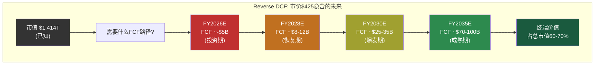
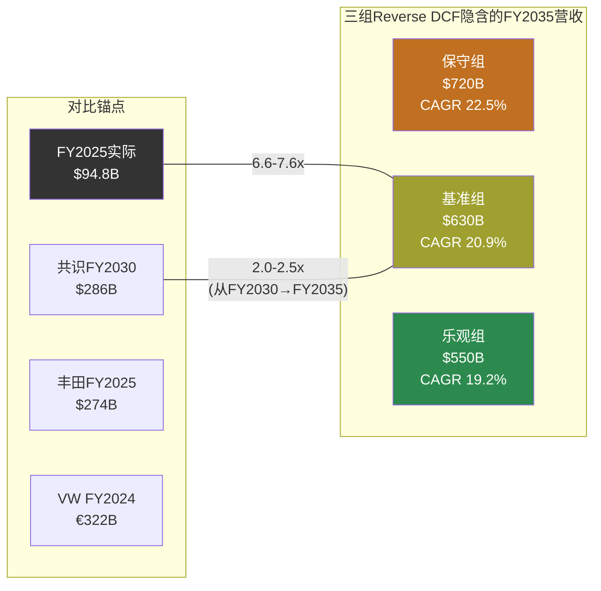
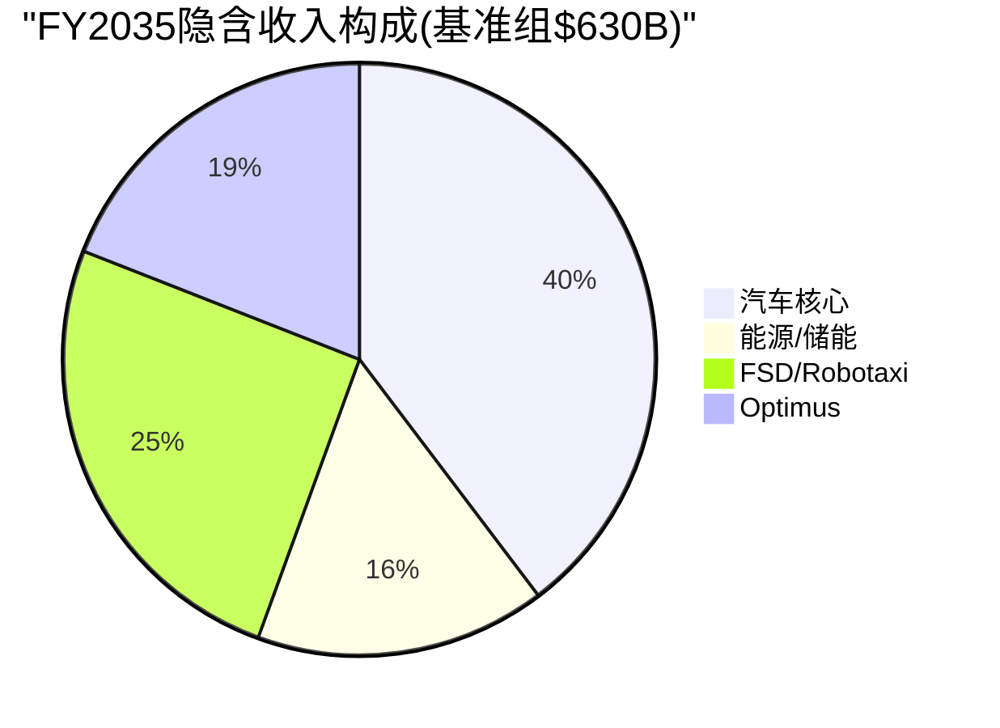
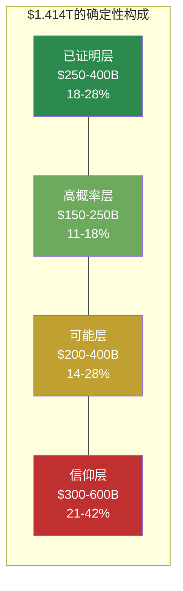
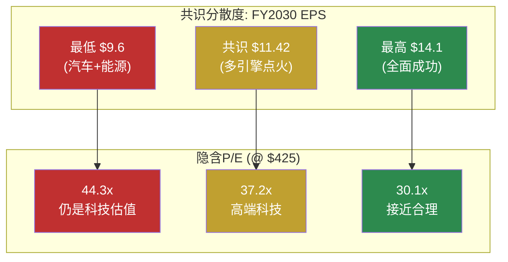
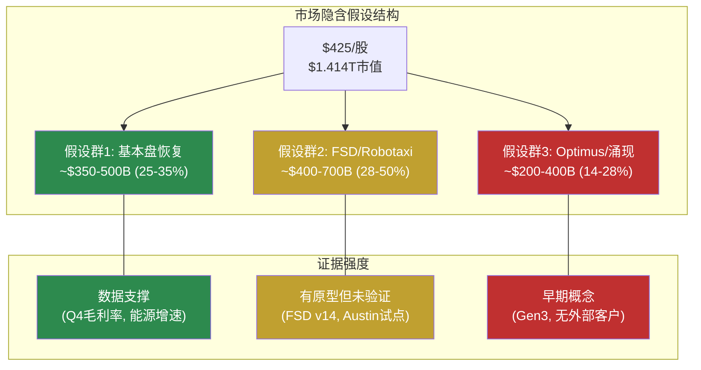

# Phase 2 — Reverse DCF与市价隐含假设分析

> **Agent A产出** | 方法论: Reverse DCF逆推 + 隐含假设检验 + 分层分解
> **核心原则**: 不给目标价、不给评级、不给仓位建议。所有逆推结论是"解读市场在赌什么"，不是"本报告认为公司值多少"
> **免责声明**: 本章所有数字均为反向推导的市场隐含假设，不是本报告的预测或建议

---

## 2.1 Reverse DCF方法论说明

### 为什么不做正向DCF

传统DCF的逻辑是：预测未来现金流 → 折现 → 得出"公司值多少钱"。对于可能性宽度9/10的Tesla，这个方法有根本性缺陷：

**问题1：输入端不确定性太大**。Tesla有至少5条独立业务线处于不同发展阶段(汽车成熟期、能源增长期、FSD过渡期、Robotaxi/Optimus萌芽期)。[硬数据: Part 1.6能力基元分析] 预测任何一条线的10年现金流已经是猜测，将5条线叠加在一起不是"综合"而是"误差累积"。

**问题2：输出端精度是假的**。FMP传统DCF给出$23.72 [硬数据: FMP DCF endpoint]，共识区间从$60到$650+ [硬数据: 分析师目标价分布]。一个模型如果输出是"$23到$650"，它的信息含量为零。

**问题3：发现系统(9/10)要求不同工具**。可能性宽度评分9分意味着Tesla的未来形态本身是未知数——它可能是汽车公司、能源公司、出行平台、机器人公司，或者这些的某种组合。用一个DCF模型覆盖"公司类型不确定性"等于假装知道答案。[硬数据: Part 1.5可能性宽度评估]

### Reverse DCF做什么

Reverse DCF反过来：给定市场已经"说出"的价格($425/股，市值$1.414T)，反推"市场集体认为Tesla的未来长什么样"。[合理推断: Reverse DCF标准方法论]

这不是预测，而是翻译——把价格信号翻译成可检验的假设。然后我们检验每个假设的合理性，不做判断"该买还是该卖"，而是帮助投资者理解"你如果持有，你在赌什么"。

### 方法论细节

**逆推公式**:

```
市值 = Σ(t=1→10) [FCFt / (1+WACC)^t] + TV / (1+WACC)^10
TV = FCF10 × (1+g) / (WACC - g)
```

已知左边(市值=$1.414T)和参数(WACC、g)，反推右边(FCF路径)。然后从FCF路径倒推需要的收入规模、利润率和增长率。[合理推断: 标准Reverse DCF方法论]

**三组假设进行敏感性测试**:

| 参数 | 保守组 | 基准组 | 乐观组 |
|------|--------|--------|--------|
| WACC | 11% | 10.5% | 10% |
| 终端增长率g | 2.0% | 2.5% | 3.0% |
| 起始FCF(FY2025) | $6.22B | $6.22B | $6.22B |

[硬数据: WACC基于Beta 1.887, 无风险利率~4.3%, ERP~5.5%; FCF来自FMP cashflow FY2025; 合理推断: 终端增长率参照名义GDP长期增速]

**关键约束条件**: FY2026 CapEx指引">$20B" [硬数据: Q4'25电话会]，这意味着FY2026 FCF很可能为负($-2B至$-13B)。逆推模型允许前2-3年FCF为负或极低(投资期)，然后要求FCF快速攀升以justify当前市值。

---

## 2.2 Reverse DCF逆推: $425隐含了什么

> **再次声明**: 以下所有数字是从市价$425反向推导的市场隐含假设。这不是本报告的预测。

### 逆推结果汇总



### 基准组详细逆推 (WACC=10.5%, g=2.5%)

要justify市值$1.414T，市场隐含的FCF路径如下：

| 年度 | 隐含FCF | 隐含营收 | 隐含FCF利润率 | 隐含营业利润率 | 注释 |
|------|---------|---------|-------------|-------------|------|
| FY2025(实际) | $6.2B | $94.8B | 6.6% | 4.6% | [硬数据: FMP] |
| FY2026E | ~-$3B | ~$104B | 负 | ~5-6% | CapEx >$20B |
| FY2027E | ~$5B | ~$125B | 4.0% | ~8% | 投资消化期 |
| FY2028E | ~$12B | ~$160B | 7.5% | ~12% | 恢复+新业务贡献 |
| FY2029E | ~$22B | ~$210B | 10.5% | ~15% | FSD/能源加速 |
| FY2030E | ~$32B | ~$280B | 11.4% | ~18% | 接近共识营收 |
| FY2031E | ~$42B | ~$350B | 12.0% | ~19% | 规模效应释放 |
| FY2032E | ~$52B | ~$420B | 12.4% | ~20% | Optimus贡献 |
| FY2033E | ~$62B | ~$490B | 12.7% | ~21% | 多引擎满负荷 |
| FY2034E | ~$72B | ~$560B | 12.9% | ~22% | 接近成熟期 |
| FY2035E | ~$82B | ~$630B | 13.0% | ~22% | 终端年 |

[合理推断: 基于WACC=10.5%, g=2.5%的标准DCF公式反向推导。终端价值=FCF2035×(1+g)/(WACC-g)=$82B×1.025/0.08=$1,051B，占总EV的~60%。10年FCF折现值~$350B+终端折现值~$1,064B≈$1.414T。允许FY2026投资期为负]

### 隐含关键指标

**1. 隐含10年收入CAGR: ~21%**

FY2025 $94.8B → FY2035 ~$630B，10年CAGR约20.9%。[合理推断: ($630/$94.8)^(1/10)-1=20.9%]

这意味着Tesla需要在10年内将收入扩大6.6倍。

**2. 隐含终端年营业利润率: ~22%**

从当前4.6%到22%，需要提升17.4个百分点。[硬数据: FY2025营业利润率4.59%, FMP income]

**3. 隐含终端年FCF: ~$82B**

当前FCF $6.2B需要增长13.2倍。FCF CAGR ~29.5%。[合理推断: ($82/$6.2)^(1/10)-1=29.5%]

**4. 隐含终端P/E: ~17x**

终端年净利润~$82B(假设FCF≈净利润+D&A-CapEx稳态)，终端EV/净利润约17x。这与成熟工业/科技公司的估值一致。[合理推断: 终端估值基于永续增长模型]

### 三组敏感性对比

| 指标 | 保守组(11%/2%) | 基准组(10.5%/2.5%) | 乐观组(10%/3%) |
|------|---------------|-------------------|---------------|
| 隐含FY2035营收 | ~$720B | ~$630B | ~$550B |
| 隐含10年CAGR | ~22.5% | ~20.9% | ~19.2% |
| 隐含FY2035 FCF | ~$95B | ~$82B | ~$70B |
| 隐含终端利润率 | ~24% | ~22% | ~20% |
| 终端价值占比 | ~55% | ~62% | ~68% |

[合理推断: 三组均以市值$1.414T为锚，不同WACC/g假设下的反推结果。保守组需要更高的现金流(因为折现率高、终端价值低)，乐观组对现金流要求较低(因为终端价值权重更大)]



**核心发现**: 无论哪组假设，市场都隐含Tesla需要在2035年达到$550-720B的年营收。即便用最宽松的假设(低WACC、高终端增长率)，Tesla也需要成为一家比今天丰田($274B)+大众($322B)加起来还大的公司——而且利润率要高出4-5倍。[硬数据: 丰田FY2025 Rev ~$274B, 大众FY2024 Rev ~€322B, 来源: FMP/公开财报; 合理推断: 规模对比]

---

## 2.3 隐含假设合理性检验

> 以下检验的是"市场隐含假设是否在历史上有先例"，不是"Tesla能否做到"。

### 检验1: 10年收入CAGR ~21% 从$95B起步

**历史先例扫描**: 有哪些公司从$100B+营收基础上实现了10年20%+的CAGR？

| 公司 | 起始年/营收 | 终止年/营收 | 10年CAGR | 驱动力 |
|------|-----------|-----------|---------|--------|
| Amazon | 2014/$89B | 2024/$638B | 21.8% | 云计算+电商+广告三引擎 |
| Apple | 2010/$65B | 2020/$274B | 15.5% | iPhone全球化+服务 |
| Alphabet | 2018/$137B | — | (进行中~15%) | 搜索+Cloud+YouTube |
| Microsoft | 2018/$110B | — | (进行中~14%) | Azure+企业SaaS |
| 丰田 | (任意10年) | — | <5% | 汽车行业增速上限 |
| 大众 | (任意10年) | — | <3% | 同上 |

[硬数据: Amazon/Apple/Alphabet/Microsoft公开财报数据; 合理推断: CAGR计算; 主观判断: 汽车行业长期增速评估]

**检验结论**: 从$100B级别起步实现20%+ 10年CAGR，在商业史上只有Amazon做到过——而Amazon依靠的是AWS这个全新的、利润率极高的业务引擎(从$4.6B→$100B+，占利润>60%)。纯汽车公司从未接近过这个增速。市场隐含假设的合理性完全取决于Tesla能否像Amazon启动AWS一样，启动一个或多个高增长、高利润率的新引擎。[合理推断: 历史类比分析]

### 检验2: 终端营业利润率~22%

**Tesla今天**: 营业利润率4.59% [硬数据: FMP income FY2025]

**需要到达**: ~22%，提升17.4个百分点。

**按业务线拆解这意味着什么**:

| 业务线 | 当前利润率 | 隐含终端利润率 | 行业参照 |
|--------|----------|-------------|---------|
| 汽车(含FSD软件) | ~5-8%(估算) | ~12-15% | 宝马~10%, 保时捷~15-18% [硬数据: 公开财报] |
| 能源(Megapack+Solar) | ~10-12%(估算) | ~15-20% | 公用事业~8%, 能源设备~12% [合理推断] |
| FSD订阅/许可 | 不确定 | ~60-80% | 软件行业标准 [合理推断] |
| Robotaxi | 不存在 | ~30-40% | Uber ~8%, 但无人驾驶省人工 [主观判断] |
| Optimus | 不存在 | ~20-30% | 工业机器人~15-20% [合理推断] |

**混合利润率计算**: 要达到整体22%，假设汽车占收入40%(利润率12%)、能源占20%(利润率18%)、FSD/Robotaxi占25%(利润率40%)、Optimus占15%(利润率25%):

加权利润率 = 0.40×12% + 0.20×18% + 0.25×40% + 0.15×25% = 4.8% + 3.6% + 10.0% + 3.75% = **22.15%** [合理推断: 混合利润率加权计算]

**检验结论**: 达到22%混合利润率在数学上可行，但有一个关键前提——**FSD/Robotaxi必须贡献25%的收入且维持~40%的营业利润率**。如果FSD/Robotaxi失败(即收入贡献为0)，其他三条线的混合利润率只有~15%，远不够justify当前市值。换言之，市价$425的~40%来自FSD/Robotaxi的利润率假设。[合理推断: 基于上述计算的逻辑推导]

### 检验3: FY2035营收$630B意味着什么市场份额

**全球汽车市场(2035E)**: ~$3.0-3.5T [主观判断: 基于当前$2.7T+年增2-3%]
**全球EV渗透率(2035E)**: ~50-70% [合理推断: 多机构预测区间]
**全球EV市场(2035E)**: ~$1.5-2.5T

**如果Tesla FY2035 $630B全部来自汽车+能源**:
- 全球汽车市场份额: $630B / $3.2T ≈ **20%** — 超过丰田(当前~12%)成为全球最大车企 [主观判断: 隐含市场份额计算]
- 如果$250B来自能源: 全球储能市场份额需>30%(当前储能市场~$50B, 2035E可能$300-600B) [主观判断: 储能市场规模预测差异极大]

**如果包含FSD/Robotaxi/Optimus**:
- 汽车: ~$250B(FY2025的2.6x, 年复合~10%, 含价格恢复)
- 能源: ~$100B(FY2025 $12.8B的7.8x, 年复合~23%, 接近行业预测)
- FSD/Robotaxi: ~$160B(需要全球数百万辆Robotaxi运营，每辆年收入~$50-80K)
- Optimus: ~$120B(需要年产数百万台，均价$20-30K)

[合理推断: 业务线拆解基于收入混合假设; 主观判断: Robotaxi单车收入和Optimus定价均为粗略估算]

**检验结论**: $630B营收在"只靠汽车"的情况下不可能实现(需要20%全球份额且均价不能降)。必须有FSD/Robotaxi和Optimus的重大贡献。市场隐含的假设是：**Tesla在2035年是一家多引擎公司，其中至少一半的收入来自今天不存在或刚萌芽的业务**。



---

## 2.4 分层逆推: 不同"Tesla类型"的隐含价值

市值$1.414T可以被理解为市场对不同业务线的隐含估值之和。以下是几种可能的分解方式(不是唯一正确的分解):

> **免责声明**: 分层逆推是一种思维工具，帮助理解"$1.414T的构成"。不同的分解方式都是合理的，没有"正确答案"。

### 分解方式A: 按业务线独立估值

| 业务线 | 隐含价值范围 | 估值逻辑 | 隐含的关键假设 |
|--------|------------|---------|-------------|
| **汽车核心** | $200-350B | FY2025汽车Rev ~$77B × 2.5-4.5x P/S(含增长溢价) | 销量恢复增长, 利润率企稳在10%+; 按丰田P/S 0.7x则仅$54B [硬数据: FMP income, 丰田估值倍数] |
| **能源/储能** | $100-200B | FY2025能源Rev $12.8B × 8-16x P/S(高增长阶段) | 维持30%+ YoY增长5年+; 参照Enphase/First Solar P/S 5-10x [硬数据: FMP income; 合理推断: 可比公司] |
| **FSD/Robotaxi** | $400-700B | 隐含全球出行平台估值; 需要L4规模运营 | L4在3-5年内多城市商业化; 年里程收入>$100B; 纯Uber(P/S 5x)则需$200B+收入 [主观判断: 出行平台估值] |
| **Optimus** | $100-300B | 隐含人形机器人市场开拓者溢价 | 2028-2030量产外销; 成本降至$20-30K; 年出货>100万台规模 [主观判断: 全新市场, 无可比公司] |
| **充电网络** | $30-50B | NACS标准+全球最大快充网络 | 充电服务收入增长; 参照ChargePoint/EVgo估值(但Tesla规模大10x+) [合理推断] |
| **总计** | **$830-1,600B** | — | 范围覆盖$1.414T |

[合理推断: 分层逆推基于可比公司估值方法和行业P/S倍数。各业务线估值范围是"如果独立上市可能的估值区间"，而非精确数字]

### 分解方式B: 按"确定性光谱"分层

这种分解更有意义，因为它揭示了$1.414T中有多少是"基本确定的"、有多少是"纯信仰":

| 确定性层级 | 包含内容 | 隐含价值 | 证据强度 |
|----------|---------|---------|---------|
| **已证明层** | 汽车制造+销售+能源(当前已有收入) | $250-400B | 有历史财报支撑，可用传统方法估值 [硬数据: FMP financials] |
| **高概率层** | 能源高增长延续(30%+ CAGR 5年) + 汽车利润率恢复(→10%) | $150-250B | 有季度趋势支撑(Q4'25毛利率回升), 但非确定 [硬数据: Q4'25毛利率20.12%] |
| **可能层** | FSD订阅扩展(付费用户→5M+) + 有限L3/L4运营 | $200-400B | 1.1M付费用户是起点，但L4需要技术+监管双突破 [硬数据: Tesla用户数据; 主观判断: 技术路径评估] |
| **信仰层** | Robotaxi全球规模运营 + Optimus外销 + 涌现协同 | $300-600B | 无收入历史、无运营先例、依赖多个未经验证假设同时成立 [主观判断] |



**核心洞察**: 按中位数估算，$1.414T中约$325B(~23%)有实际财务数据支撑，约$200B(~14%)有趋势数据支撑，而约$890B(**~63%**)依赖于尚未实现或尚未证明的业务假设。市场正在为"可能的Tesla"支付2.7倍于"已证明的Tesla"的溢价。[合理推断: 基于上述分层的中位数加总]

这不是说市场"错了"——Amazon在2013年也有类似的确定性结构(AWS当时收入<$5B但隐含估值占总市值>30%)。但它清楚地显示了持有TSLA的投资者在为什么"付费"。

### 分解方式C: FSD成败二叉树

FSD/AI栈是Part 1.6识别的"关键共享依赖"——它的成败直接影响3/5状态和所有涌现可能性。因此一个有用的分解是按FSD成败划分:

| 情景 | 含义 | 隐含市值 | 当前市值占比 |
|------|------|---------|-----------|
| **FSD成功(L4规模运营)** | Robotaxi+Optimus路径打开, 出行平台+物理AI公司 | $2.0-3.5T | 市价隐含: 这个结果的"概率加权贡献"很大 |
| **FSD部分成功(L2++/有限L3)** | 增强汽车价值+订阅收入, 但无Robotaxi | $600B-1.0T | 中性 |
| **FSD失败(永远停在L2)** | 纯汽车+能源公司, 类似"好一点的BYD" | $200-400B | — |

如果用简化概率框架反推(这只是一种理解方式，不是概率预测):

市价 = P(成功) × $2.5T + P(部分) × $800B + P(失败) × $300B = $1.414T

一组满足此等式的概率: P(成功)=40%, P(部分)=40%, P(失败)=20%

40%×$2.5T + 40%×$800B + 20%×$300B = $1.0T + $320B + $60B = **$1.38T** ≈ $1.414T

[合理推断: 概率加权估值是说明性的，不是精确计算。用于展示市场隐含的概率结构]

**含义**: 市价$425大致隐含市场认为FSD全面成功(L4大规模Robotaxi)的概率在**35-45%左右**。如果你认为这个概率更高，市场对你来说"便宜"；如果更低，市场对你来说"贵"。本报告不做这个判断。

---

## 2.5 共识估计隐含的假设

### 分析师共识一览

| 指标 | FY2026E | FY2027E | FY2028E | FY2029E | FY2030E |
|------|---------|---------|---------|---------|---------|
| 营收($B) | $103.9 | $120.8 | $143.1 | $216.8 | $286.0 |
| YoY增长 | +9.6% | +16.3% | +18.5% | +51.5% | +31.9% |
| EPS | $1.97 | $2.61 | $3.68 | $8.15 | $11.42 |
| EPS增长 | +82% | +32% | +41% | +121% | +40% |

[硬数据: FMP estimates consensus, 截至2026-02-11]

### 共识中的"拐点假设"

共识数据中有一个极其显眼的结构性断裂：**FY2028→FY2029的收入跳跃从$143B到$217B(+51.5%)**，EPS从$3.68跳到$8.15(+121%)。

这意味着共识分析师集体认为在FY2029左右，Tesla会经历一次**非线性增长事件**。[合理推断: 基于共识数据的趋势分析]

什么能制造$73B的单年增量收入(从$143B→$217B)?

| 可能来源 | 隐含新增收入 | 合理性评估 |
|---------|------------|----------|
| 汽车销量暴增(3M→5M辆) | +$40-50B | 需要新车型(廉价车/Semi)全面上量；有可能但时间紧 [合理推断] |
| Robotaxi商业化 | +$20-40B | 需要FY2028前获得L4商业牌照+数十万辆Cybercab部署 [主观判断: 时间线激进] |
| 能源业务翻倍 | +$10-15B | FY2028E ~$25B → FY2029E ~$40B, 需年部署>100GWh [合理推断: 延续当前增速] |
| Optimus开始外销 | +$5-10B | 需要2028年量产+定价在$20-30K+首年出货20-40万台 [主观判断: 极其激进] |

**检验结论**: FY2029的跳跃最可能的组合是"汽车新车型上量 + 能源继续高增长 + FSD/Robotaxi开始实质贡献"。没有任何单一来源能贡献$73B增量。共识隐含的假设是**多引擎同时点火**。[合理推断: 基于拆解的逻辑推导]

### 共识EPS从$1.08到$11.42的隐含利润率路径

| 年度 | 隐含净利率 | 需要什么 |
|------|----------|---------|
| FY2025(实际) | 4.0% | — [硬数据] |
| FY2026E | ~6.1% | 价格战缓和 + CapEx扩大但折旧尚未跟上 |
| FY2027E | ~7.0% | 利润率缓慢恢复 |
| FY2028E | ~8.3% | 新车型利润率提升 + 能源贡献 |
| FY2029E | ~12.1% | **跳跃**: FSD/Robotaxi高利润率业务开始贡献 |
| FY2030E | ~12.9% | 规模效应 + 业务组合继续改善 |

[合理推断: 净利率=EPS×稀释股数/营收, 假设稀释股数~3.22B→3.3B缓慢增长]

从4%到13%的净利率提升路径，关键假设是FY2028-2029的利润率跳跃。如果FSD/Robotaxi未能按期贡献高利润率收入，净利率大概率停在7-9%区间(汽车+能源的自然天花板)。[合理推断: 基于业务线利润率结构]

### 共识内部分散度分析

FY2030 EPS共识范围: $9.6 - $14.1 (1.47x range) [硬数据: FMP estimates]

| 指标 | 含义 |
|------|------|
| 最低$9.6 | 隐含: 汽车恢复增长+能源高增长, 但FSD/Robotaxi贡献有限(L2++为主) |
| 共识$11.42 | 隐含: 多引擎点火, Robotaxi开始规模贡献 |
| 最高$14.1 | 隐含: Robotaxi全面成功+Optimus开始贡献+汽车利润率恢复到15%+ |
| 分散度1.47x | 即便在专业分析师中，对FY2030的判断也有**47%的分歧** |

[硬数据: FMP estimates; 合理推断: 分散度含义分析]



**关键观察**: 即便用FY2030最乐观的EPS $14.1, $425的远期P/E仍然是30x——这对一家营收$286B的公司来说仍然隐含持续的高增长预期(post-2030 CAGR>15%)。换言之，**即便共识全部实现，$425的估值也不是"到达终点"而是"仍在路上"**。[合理推断: 30x P/E隐含的增长预期分析]

### 共识假设中"已证明的" vs "信仰的"

| 假设 | 类型 | 证据状态 |
|------|------|---------|
| 汽车销量FY2026恢复增长 | 高概率 | 新平台(廉价车)2025下半年启动, Q4'25销量环比恢复趋势 [硬数据: Tesla产品路线图, Q4'25交付数据] |
| 能源业务30%+ CAGR持续 | 高概率 | FY2025 +27% YoY, Megapack产能扩建(上海二期), 全球储能需求结构性增长 [硬数据: Tesla 10-K, 行业预测] |
| 汽车毛利率恢复到20%+ | 可能 | Q4'25达到20.12%, 但是否可持续取决于价格竞争(BYD)和产品组合 [硬数据: FMP quarterly] |
| FSD订阅用户从1.1M→5M+ | 可能 | 取决于v14+版本的体验质量和监管环境(加州/德州L3批准) [合理推断] |
| Robotaxi FY2028-29商业化 | 信仰 | Austin试点2026年中启动, 但L4监管批准时间线高度不确定; Waymo已在运营但用LiDAR方案 [硬数据: Tesla时间线; 主观判断: 监管评估] |
| Optimus FY2029外销 | 信仰 | Gen3刚启动量产(2026.01), BOM ~$55K vs 目标售价$20-30K, 成本差距未闭合 [硬数据: Tesla, Standard Bots] |
| FY2029收入跳跃至$217B | 信仰 | 需要多引擎同时点火, 历史上无此先例 [主观判断] |

---

## 2.6 本章小结: 市场在赌什么

> 这是对Reverse DCF全部发现的归纳，不是投资建议。

$425的股价/$ 1.414T的市值，翻译成可检验的命题后，市场集体在押注以下假设全部(或大部分)成立:

**假设群1 — 基本盘恢复(隐含价值~$350-500B)**
1. 汽车销量重回增长(FY2026 +10%以上)
2. 汽车毛利率稳定在19-21%
3. 能源业务维持25-30% CAGR至FY2030
4. 整体营业利润率从4.6%回升至10%+

**假设群2 — FSD/Robotaxi开花(隐含价值~$400-700B)**
5. FSD在2027-2028达到L3+/有限L4
6. Robotaxi在2028-2029开始商业化运营(多城市)
7. 出行服务收入在FY2030达到$50-100B级别
8. Robotaxi营业利润率达到30%+

**假设群3 — Optimus/涌现(隐含价值~$200-400B)**
9. Optimus在2028-2030实现外销
10. 人形机器人市场证明为万亿级TAM
11. 跨业务协同(Robotaxi×能源×Optimus)产生超线性价值



**最终观察**: 如果只有假设群1成立(基本盘恢复)，Tesla的合理市值在$350-500B区间——大约是当前市值的25-35%。假设群2和3合计贡献了当前市值的65-75%。这意味着**当前股价中约2/3的价值来自尚未实现的业务**。这既是Tesla的"梦想溢价"，也是其估值脆弱性的根源。本报告不判断这个溢价是"合理"还是"过高"——这取决于每位投资者对假设群2和3的独立评估。

---

*[本章完 — P2 Agent A: Reverse DCF与市价隐含假设分析]*
*所有逆推均为市场隐含假设的翻译，不代表本报告的预测或投资建议*
