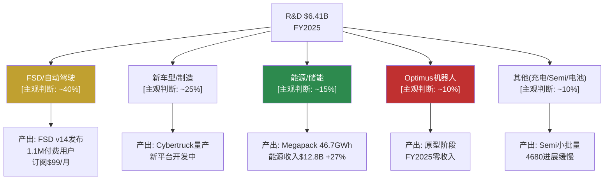
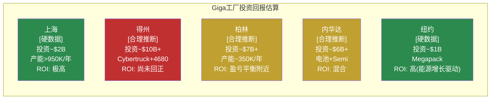
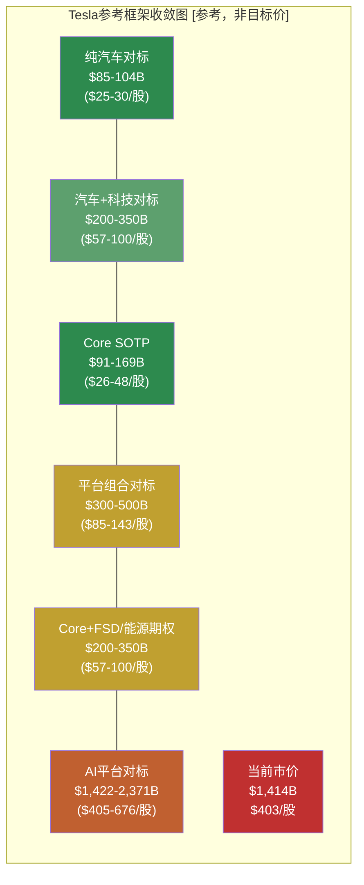
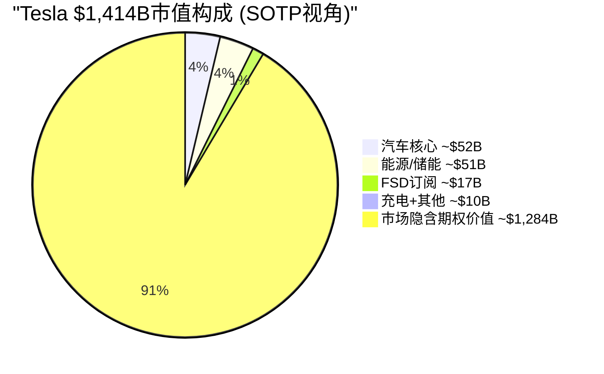

# Part 3.1 / 3.2 — 资本配置深度分析 + 参考框架

> **Agent B产出** | Phase 2 | 目标: ~10K字符 | 方法论: v9.0扬长避短 + 发现系统(9/10)
> **核心声明**: 以下所有估值数字均为**参考框架，不是目标价**。发现系统(可能性宽度9/10)下，给出精确估值等于精确的错误。本节的价值在于揭示"市场价格中隐含了什么假设"，而非主张"公司应该值多少"。
> **零投资建议 | 零目标价 | 零评级 | 零仓位建议**

---

## 3.1 资本配置深度分析

Tesla的资本配置策略可以用一句话概括：**用成熟业务的现金流+充裕的资产负债表，全力押注多条尚未验证的增长赛道**。这一策略是否合理，取决于那些赛道最终能否产出回报——而这正是9/10可能性宽度无法预判的部分。

### 3.1.1 R&D效率审计

**投入强度**:

| 年度 | R&D($B) | 营收($B) | R&D/Revenue | R&D YoY |
|------|---------|---------|-------------|---------|
| FY2022 | $3.08 | $81.46 | 3.78% | — |
| FY2023 | $3.97 | $96.77 | 4.10% | +28.9% |
| FY2024 | $4.54 | $97.69 | 4.65% | +14.4% |
| FY2025 | $6.41 | $94.83 | 6.76% | +41.2% |

[硬数据: FMP income annual, Tesla 10-K FY2022-FY2025]

**核心矛盾**: R&D投入4年CAGR +27.6%，营收CAGR仅+5.2%。从传统"每$1 R&D带来多少增量收入"的视角，这是一个**效率恶化**的信号——FY2022每$1 R&D对应$26.4营收，FY2025降至$14.8，下降44%。[硬数据: 基于上表计算]

**但这个框架对Tesla可能不适用**。原因如下：

Tesla的R&D投入跨越至少5条独立赛道，每条赛道的变现周期和方式截然不同：

[主观判断: R&D分配比例为估算，Tesla未在10-K中披露细分。基于财报电话会中Elon Musk强调FSD/Optimus为最高优先级，以及能源业务的快速增长推断]

**已变现 vs 尚未变现**:

| 赛道 | 变现状态 | 可观测证据 |
|------|---------|-----------|
| FSD | **部分变现** | 1.1M订阅用户 × $99/月 ≈ $1.3B/年ARR；FSD v14已发布，v13获2.88M车辆OTA推送 [硬数据: Tesla 10-K, 财报电话会] |
| 能源/储能 | **快速变现中** | 收入$12.8B(+27% YoY)，46.7 GWh部署(+49%)；Megapack上海工厂投产 [硬数据: Tesla 10-K] |
| 新车型 | **延迟变现** | Cybertruck已量产但亏损，新低价平台$25K车型预计FY2026H1 [硬数据: Tesla 10-K; 合理推断: 生产节奏] |
| Optimus | **零变现** | 原型展示阶段，Fremont专线建设中，最早FY2026小规模外部销售 [合理推断: 基于管理层时间表，历史上Tesla时间表平均延迟18-24个月] |
| Dojo | **已关闭** | 转向外部GPU采购(NVIDIA)，Dojo芯片项目实质暂停 [硬数据: 多方报道+财报电话会确认] |

**可比公司R&D效率对标**:

| 公司 | R&D/Revenue | R&D ($B) | Revenue ($B) | 备注 |
|------|------------|----------|-------------|------|
| **Tesla** | **6.76%** | $6.41 | $94.8 | 多赛道分散 |
| BYD | ~4.5% | ~$6.8 | ~$107+ | 聚焦汽车+电池 |
| Toyota | ~3.8% | ~$10.6 | ~$280 | 单一汽车业务 |
| NVIDIA | ~18.5% | ~$24.2 | ~$130.5 | 纯科技/AI |
| Meta | ~29% | ~$48.3 | ~$164.5 | 含Reality Labs巨额投入 |

[硬数据: BYD/Toyota基于FMP profile和最新年报; NVIDIA/Meta基于FMP income FY2025; 合理推断: BYD数据为近似值因会计准则差异]

**审计结论**: Tesla的R&D强度(6.76%)介于传统车企(3-5%)和纯科技公司(15-30%)之间，与其"汽车+科技+能源+机器人"的复合身份一致。效率评估的困难在于：**R&D产出的衡量标准取决于你认为Tesla是什么类型的公司**——如果是汽车公司，$6.4B R&D对应萎缩的汽车收入是低效的；如果是平台公司，储能+FSD的快速增长说明R&D正在创造新收入流。[主观判断: 效率评估框架本身就是争议焦点]

---

### 3.1.2 CapEx ROI分析

**累计投入**:

| 年度 | CapEx ($B) | PP&E净值($B) | OCF ($B) | FCF ($B) | CapEx/OCF |
|------|-----------|-------------|---------|---------|-----------|
| FY2022 | $7.16 | $36.63 | $14.72 | $7.55 | 48.6% |
| FY2023 | $8.90 | $29.73 | $13.26 | $4.36 | 67.1% |
| FY2024 | $11.34 | $51.51 | $14.92 | $3.58 | 76.0% |
| FY2025 | $8.53 | $40.64 | $14.75 | $6.22 | 57.8% |
| **累计** | **$35.93** | — | **$57.65** | **$21.71** | 62.3% |

[硬数据: FMP cashflow + balance annual; PP&E含使用权资产波动]

**关键观察**: 4年累计CapEx $35.9B，但营业利润从$13.7B降至$4.4B。这是经典的**"投资期"特征**——大量资本正在投入尚未满产的产能。

**工厂级ROI估算**:

[合理推断: 单工厂投资和ROI为估算值。Tesla不按工厂披露盈利数据。上海ROI判断基于其作为主要出口中心和最高利润率工厂的公开信息; 得州ROI判断基于Cybertruck尚处于早期量产亏损阶段]

**FY2026 $20B+ CapEx的含义**:

管理层指引FY2026 CapEx超过$20B，较FY2025 $8.5B增长135%+。[硬数据: Tesla Q4'25 earnings call指引]

这意味着：
- **FCF可能转负**: 如果OCF保持~$15B水平，$20B CapEx将导致FCF约-$5B。[合理推断: 基于OCF趋势线]
- **资金用途**: Cybercab德州专线建设、Optimus生产线、储能产能扩张(上海Megapack工厂满产)、Semi产线、新低价车型产线。[硬数据: Tesla 10-K + 财报电话会]
- **$44B现金缓冲的消耗**: 即使FCF为-$5B/年，$44B现金可支撑约9年。但如果CapEx持续高位(>$20B/年)且营收不恢复增长，消耗速度会加快。[合理推断: 线性外推，实际非线性]

---

### 3.1.3 SBC(股票薪酬)分析

| 年度 | SBC ($B) | Net Income ($B) | SBC/NI | SBC/Revenue | 稀释股数(B) |
|------|---------|----------------|--------|-------------|-----------|
| FY2022 | $1.56 | $12.58 | 12.4% | 1.91% | 3.475 |
| FY2023 | $1.81 | $15.00 | 12.1% | 1.87% | 3.485 |
| FY2024 | $2.00 | $7.13 | 28.1% | 2.05% | 3.498 |
| FY2025 | $2.83 | $3.79 | **74.6%** | **2.98%** | 3.511 |

[硬数据: FMP cashflow + income annual]

**SBC/Net Income从12.4%飙升至74.6%**——这不完全是SBC膨胀的问题(SBC CAGR +22%)，更是净利润大幅下降(CAGR -33%)的结果。但$2.83B的绝对值仍值得关注：

**与科技公司对比**:

| 公司 | SBC/Revenue | SBC/Net Income | 说明 |
|------|------------|----------------|------|
| **Tesla** | **2.98%** | **74.6%** | SBC/Rev适中，但NI低放大比率 |
| Meta | ~9.5% | ~20% | 高SBC但利润更高 |
| NVIDIA | ~3.0% | ~5% | SBC/Rev相近但NI远高 |
| Google | ~7.5% | ~15% | 高SBC/Rev但利润覆盖 |
| BYD | <0.5% | <3% | 几乎不用SBC |

[硬数据: 基于FMP cashflow/income各公司FY2025数据; 合理推断: 部分公司为近似值]

**稀释效应**: FY2022→FY2025稀释股数从34.75亿增至35.11亿，净增0.36亿股(+1.0%)。年化稀释率~0.33%，在科技公司中属于低水平(Meta ~1.5%/年, Google ~1%/年)。Tesla稀释率低的原因是Elon Musk的薪酬方案主要通过已授予的期权行使，而非持续新增SBC。[合理推断: 基于股数变化趋势]

**SBC审计结论**: Tesla的SBC/Revenue(3.0%)处于合理范围，但SBC/Net Income(74.6%)是一个警示信号——不是因为SBC太高，而是因为**利润太低**。如果净利润恢复到FY2022水平($12.6B)，SBC/NI将回落至22%，完全正常。核心问题不是SBC，而是盈利能力。[合理推断: 条件性推导]

---

### 3.1.4 $44B现金的战略选择

**资产负债表快照**:

| 项目 | FY2025 | FY2024 |
|------|--------|--------|
| 现金+短期投资 | $36.56B | $36.56B |
| 总流动性(含长期投资) | $44.06B | — |
| 总债务 | $5.35B | $7.53B |
| 净现金(现金-债务) | $38.71B | — |
| Altman Z-Score | 16.8 | — |

[硬数据: FMP balance + key-metrics]

**为什么不回购?** Tesla从未进行过股票回购。在$1.4T市值下，即使投入$10B回购也仅回收0.7%的流通股，对EPS的提升微乎其微。更重要的是，Elon Musk多次公开表示**资本应投入增长而非金融工程**。[合理推断: 基于管理层公开发言]

**为什么不分红?** 同样的逻辑——Tesla处于"投资期"，管理层认为资本再投资的IRR远高于股东自行配置的回报率。这一假设是否成立，取决于Cybercab/Optimus/能源扩张能否产生超额回报。[主观判断: IRR假设是信仰而非证据]

**现金缓冲压力测试**:

| 场景 | 年FCF | 现金耗尽时间 | 前提 |
|------|------|------------|------|
| 乐观 | +$5B | 不耗尽(累积) | OCF $25B+, CapEx $20B |
| 基线 | -$5B | ~9年 | OCF $15B, CapEx $20B |
| 压力 | -$10B | ~4.4年 | OCF $10B(衰退), CapEx $20B |
| 极端压力 | -$15B | ~3年 | OCF $5B(需求崩溃), CapEx $20B |

[合理推断: 场景假设基于OCF历史范围($13-15B)和CapEx指引($20B+)]

**与Mega-Cap现金策略对比**:

Tesla选择了一条**与所有其他mega-cap不同的路径**——既不回购(Apple每年~$90B)、也不分红(MSFT ~$22B/年)、也不做大规模M&A(Google/Meta频繁收购)，而是全部投入有机增长。这种策略在高回报期(FY2022 FCF $7.55B, ROIC >20%)是合理的，但在ROIC压缩的当下(FY2025 ROIC ~5%)面临质疑。[合理推断: ROIC基于营业利润/投入资本估算]

---

## 3.2 参考框架

> **再次声明**: 以下所有估值区间均为**参考框架，用于理解市场定价中隐含的假设**，不是目标价。在可能性宽度9/10的发现系统下，任何精确估值都是"精确的错误"。框架的价值不在于给出"正确的数字"，而在于揭示**当前价格需要什么条件才能成立**。

### 3.2.1 SOTP参考框架

将Tesla拆分为可独立估值的业务部分，每部分使用**同行业可比公司**的估值倍数：

| 分部 | 收入/指标 | 可比基准 | 倍数区间 | 估值区间 | 置信 |
|------|---------|---------|---------|---------|------|
| **汽车核心** | 收入$69.5B | BYD/Toyota EV/Sales 0.4-1.2x | 0.5-1.0x | $35-70B | [硬数据: 可比公司估值] |
| **能源/储能** | 收入$12.8B, +27% | NextEra/Enphase EV/Sales 3-5x | 3-5x | $38-64B | [合理推断: 高增速溢价] |
| **FSD订阅** | ~$1.3B ARR(1.1M×$99×12) | SaaS P/S 10-15x | 10-15x | $13-20B | [合理推断: ARR为估算] |
| **充电网络** | 开放给第三方 | ChargePoint市值~$0.5B | 网络效应溢价 | $5-10B | [主观判断: 无直接可比] |
| **Semi/其他** | 小批量 | 早期阶段 | — | $0-5B | [主观判断: 接近零收入] |
| **总计(Core SOTP)** | | | | **$91-169B** | |

[硬数据: 汽车收入$69.5B来自Tesla 10-K; 能源$12.8B来自Tesla 10-K; FSD用户数1.1M来自财报电话会]
[合理推断: FSD ARR计算假设所有用户均为月付$99; 实际包含早期一次性买断用户，ARR可能偏高]
[主观判断: 充电网络和Semi估值区间宽泛，反映早期阶段的不确定性]

**Core SOTP $91-169B vs 市值 $1,414B**

**差额 $1,245-1,323B = 市场隐含的"期权价值"**

这意味着Tesla当前市值中，**88-94%是市场赋予尚未证明的业务线的价值**——主要是Robotaxi、Optimus和平台化效应。这不是说市场"错了"，而是说：

- 如果你购买Tesla股票，你支付的6-12%是今天的业务，88-94%是对未来的押注
- 这些未来业务的形态、规模、时间线和概率全部高度不确定(可能性宽度9/10)
- 这也解释了为什么Tesla的估值对"叙事"如此敏感——因为88%+的市值没有当前盈利锚定

[合理推断: SOTP区间和差额计算基于上表; 主观判断: "叙事敏感性"的因果关系]

---

### 3.2.2 可比公司参考

不同"类比框架"下Tesla的隐含估值：

| 类比框架 | 逻辑 | 倍数 | 隐含估值 | 与市价差 |
|---------|------|------|---------|---------|
| **纯汽车** | BYD P/S 1.1x, Toyota P/S 0.9x | P/S 0.9-1.1x | $85-104B | -93% |
| **汽车+科技** | 汽车1x + 科技部分P/S 10x | 混合 | $200-350B | -75~-85% |
| **平台公司组合** | Uber(出行)+NextEra(能源) | 各部分对标 | $300-500B | -65~-79% |
| **AI/科技巨头** | NVIDIA P/S 26x(全部收入) | P/S 15-25x | $1,422-2,371B | 0%~+68% |
| **当前市价** | 隐含P/S | P/S 14.9x | $1,414B | 0% |

[硬数据: BYD市值~$120B/收入~$107B, Toyota市值~$250B/收入~$280B, NVIDIA市值~$3.5T/收入~$130.5B]
[合理推断: 混合框架估值为近似计算]

**关键洞察**:

1. **任何传统可比框架都无法解释$1.4T市值**。纯汽车对标隐含-93%下行空间，即便"汽车+科技"混合对标也隐含-75%+下行。[硬数据: 基于可比公司实际估值]

2. **只有将Tesla视为"AI/科技平台"** 并赋予类似NVIDIA的倍数(P/S 15x+)，当前估值才"合理"。但NVIDIA有~60%净利率支撑其估值，Tesla仅4%。[硬数据: NVIDIA净利率~59%, Tesla 4%]

3. **市场的隐含假设是**: Tesla未来会像科技平台一样运营——高利润率(>20%)、高增速(>25%)、赢者通吃。这一假设是否成立，是投资者需要独立判断的核心问题。[主观判断: 对市场定价逻辑的推断]

---

### 3.2.3 各方法参考区间收敛图

**收敛分析**:

框架之间**不收敛** ——这正是可能性宽度9/10的直观表现。Core SOTP($91-169B)与当前市价($1,414B)之间存在**8-15倍的差距**。传统"各方法收敛于某个区间"的分析模式在这里失效。

| 度量 | 数值 | 含义 |
|------|------|------|
| Core SOTP中位值 | ~$130B | 基于当前业务的锚定点 |
| 市价 | $1,414B | 市场定价 |
| 差距 | ~10.9x | Core的每$1价值被市场定价为$10.9 |
| 期权价值占比 | ~91% | 市值中无法被当前业务解释的部分 |

[硬数据: 市值$1,414B; 合理推断: SOTP中位值为区间简单平均]

[合理推断: 饼图数值为SOTP各部分中位值; "期权价值"= 市值 - Core SOTP中位值]

**对投资者的含义(非建议)**:

这个框架不告诉投资者"应该买还是卖"。它告诉投资者的是：**在当前价格买入Tesla，你实质上是在购买一个关于Robotaxi、Optimus和平台化的看涨期权，这个期权的隐含价值是$1,284B——超过全球除Apple/NVIDIA/Microsoft/Google/Amazon/Meta之外所有公司的市值**。

这个期权是否"值得"，取决于：
1. Robotaxi能否实现规模商业化? (技术+监管+运营三重门槛)
2. Optimus能否从原型走向量产? (当前零收入，目标$20-25K售价)
3. 平台化效应能否形成? (数据飞轮、软件毛利率、网络效应)
4. 上述三项的时间线是5年、10年还是20年?
5. 在等待期间，核心汽车业务能否维持现金流?

这些问题的答案之间是**乘法关系而非加法关系**——任何一个环节失败，期权价值都可能大幅缩水；但如果多个环节同时成功，价值可能远超当前市价。**这就是可能性宽度9/10的本质含义。**

---

### 3.2.4 Reverse DCF: 市价隐含的增长假设

当前市价$403/股(市值$1,414B)隐含了什么样的增长假设?

**反向推导** (假设WACC 10%, 终端增长率3%, 目标FCF利润率15%):

| 要达到市价合理 | 需要的条件 | 难度评估 |
|--------------|-----------|---------|
| 收入 | 10年后达~$500-600B | 当前$95B, 需CAGR ~18-20% [合理推断: DCF反推] |
| FCF利润率 | 15%+ | 当前6.6%, 需翻倍+  [硬数据: FCF/Revenue] |
| 终端P/FCF | ~25x | 合理(成长型公司) |

[合理推断: Reverse DCF参数为标准假设; 实际对WACC/终端增长率敏感]

**$500-600B收入在2035年是什么概念?**
- 大约等于今天的Apple($383B) + Toyota($280B)的营收之和
- 需要汽车、能源、Robotaxi、Optimus**全部**大规模成功
- FY2025收入$95B → FY2035 $550B意味着10年增长4.8倍

这不是不可能，但需要**每一个赌注都基本押中**。市场正在为这个"全部成功"的场景定价。[主观判断: 对市场定价逻辑的总结性推断]

---

*本节完。P2_agentB_capital_frameworks.md — 资本配置深度分析 + 参考框架。*
*写作方法: v9.0扬长避短 + 发现系统(9/10) | 零目标价 | 零评级 | 零仓位建议*
