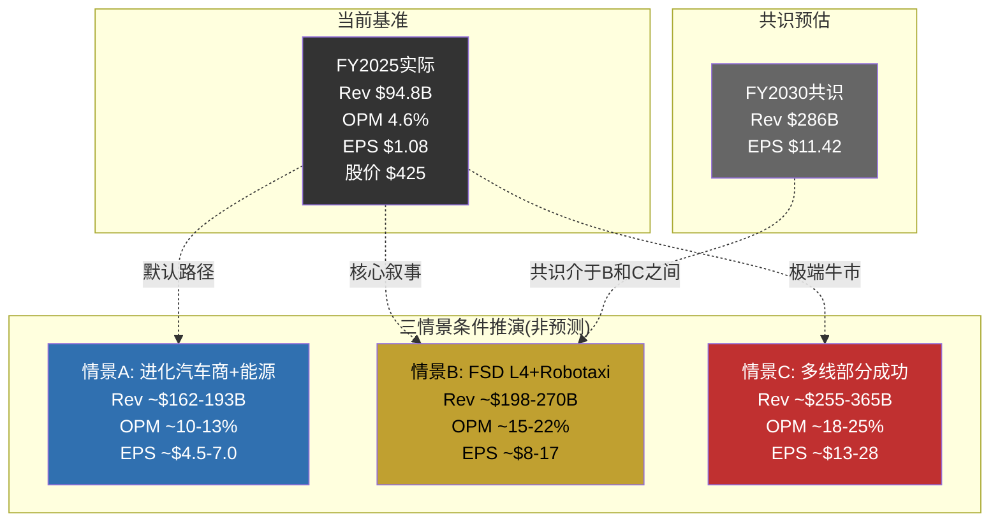
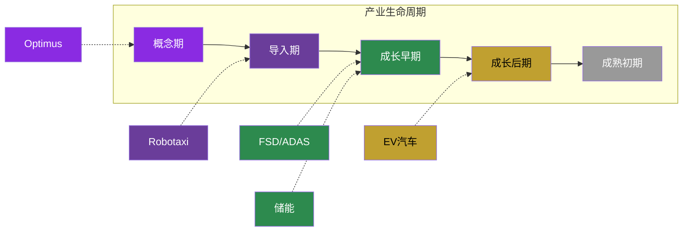
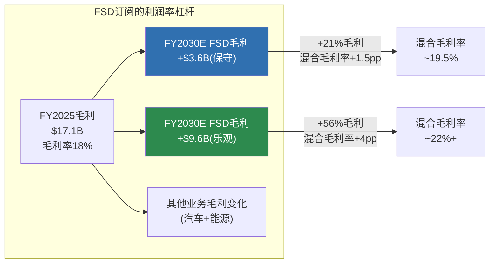
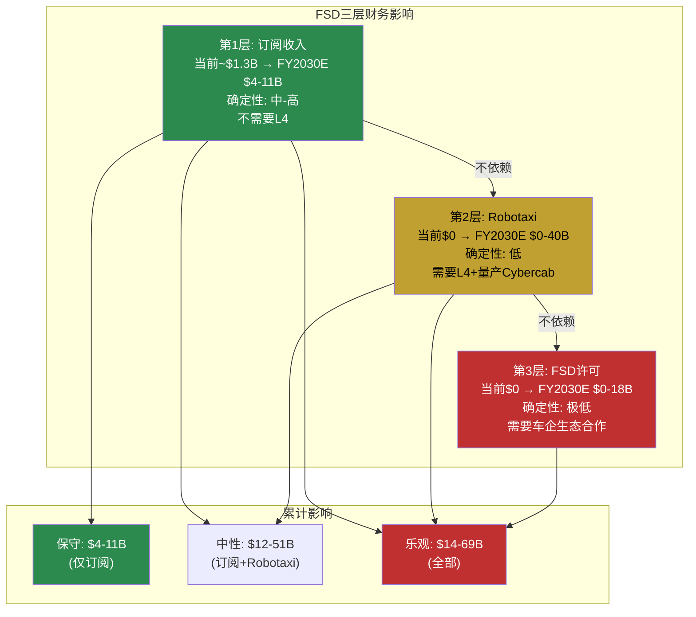

# Part 4: 条件推演 + 周期定位 + FSD财务影响

> **Agent C产出** | 目标: ~12K字符 | 方法论: 发现系统(可能性宽度9/10) — 条件推演, 非预测
> **铁律**: 零目标价 | 零评级 | 零概率权重 | 零仓位建议

---

## 4.1 三情景条件推演

### 方法论说明

对于可能性宽度9/10、A型不确定性主导的Tesla，传统三情景(高/基/低增速)方法论不适用。原因在Part 2.1已论证: 不同情景下Tesla是**质的不同的公司**——出行网络运营商(平台模式, 毛利率~60%)和进化汽车商(制造模式, 毛利率~20%)不是"同一个Tesla"的快慢版本。[合理推断: 基于Part 1.5 A型不确定性判定]

因此使用**条件推演**: 给定特定假设组合成立时, 财务表现如何。每个情景是一组**条件声明**, 不是概率预测。读者需自行判断哪组条件更接近现实。

**本节不赋予任何情景概率**。不是因为懒, 而是因为A型不确定性意味着我们连概率空间的形状都无法定义(参见Part 1.5)。

---

### 情景A: 进化汽车商 + 能源成功 (默认路径)

**条件声明**:
1. FSD保持L2+/L3, 不获得L4监管批准
2. Robotaxi未在2030年前实现规模商业化
3. Optimus未向外部客户销售
4. 能源业务维持当前增长轨迹(~30-40% CAGR)
5. 汽车业务通过新车型(Model Q/$25K, Cybercab)恢复温和增长
6. FSD订阅收入稳步增长但不改变公司性质

**这个情景代表"如果没有任何突破"——Tesla只是一个更好版本的自己。**

#### 财务推演

| 指标 | FY2025实际 | FY2027E | FY2030E | 推导逻辑 |
|------|-----------|---------|---------|---------|
| **汽车收入** | $69.5B | ~$78-82B | ~$95-110B | 新车型+温和增量, 但BYD竞争持续 [合理推断: 基于Model Q/$25K ASP ~$28K + Cybercab ASP ~$30K] |
| **能源收入** | $12.8B | ~$22-25B | ~$45-55B | 储能CAGR ~35%(从FY2025 48.5%减速), 上海+Houston Megafactory产能释放 [合理推断: 基于产能规划] |
| **服务收入** | $12.5B | ~$16-18B | ~$22-28B | Supercharger+保险+FSD订阅 [合理推断: 基于当前~20% CAGR] |
| **总收入** | $94.8B | ~$116-125B | ~$162-193B | 三部分加总 |
| **毛利率** | 18.0% | ~19-21% | ~21-24% | 能源混合改善+FSD订阅毛利率~90%拉动 [合理推断] |
| **营业利润率** | 4.6% | ~7-9% | ~10-13% | R&D/SGA增速放缓假设 [合理推断] |
| **EPS** | $1.08 | ~$2.0-2.8 | ~$4.5-7.0 | 基于营业利润率+税率~15%+稀释后股本~3.5B [合理推断] |

[合理推断: 以上推演基于FY2025实际数据+各业务线当前增速+合理减速假设]

**情景A的隐含估值逻辑**: EPS $4.5-7.0, 给予汽车+能源混合体P/E 25-35x(高于纯汽车~10x, 低于纯科技~30x), 隐含股价~$112-245。当前$425是这个区间中点的**2.4x**。换言之, 如果Tesla只走默认路径, 当前市价包含了约60%的"期权溢价"——市场在为情景B和C付费。[合理推断: 基于推演数字计算]

---

### 情景B: FSD突破 + Robotaxi启动 (牛市核心叙事)

**条件声明**:
1. FSD v15+达到L4有限ODD(高速+城市主干道, 晴天/轻雨), 时间2027-2028
2. NHTSA批准有限L4商业运营(3-5个城市, 限定ODD)
3. Cybercab 2028年开始规模化生产(年产50K-200K台)
4. Robotaxi 2029-2030年在美国5-8个城市运营
5. 能源业务继续高速增长
6. Optimus仅内部使用, 不外销

**这是当前最主流的牛市叙事——FSD从L2+跨越到L4, 打开Robotaxi。**

#### 财务推演

| 指标 | FY2025实际 | FY2027E | FY2030E | 推导逻辑 |
|------|-----------|---------|---------|---------|
| **汽车收入** | $69.5B | ~$80-85B | ~$100-120B | 与情景A类似, Cybercab部分计入 [合理推断] |
| **能源收入** | $12.8B | ~$22-25B | ~$50-60B | 与情景A类似 [合理推断] |
| **Robotaxi收入** | $0 | ~$0-0.5B | ~$15-40B | 5-8城市×每城3K-10K车×$50K年化/车 [合理推断: 基于Waymo单位经济类推] |
| **FSD订阅/许可** | ~$1B | ~$3-5B | ~$8-15B | 转化率提升+车队扩大+可能FSD许可给其他车企 [合理推断] |
| **服务收入** | $12.5B | ~$16-18B | ~$25-35B | Robotaxi维护/保险/充电 [合理推断] |
| **总收入** | $94.8B | ~$121-133B | ~$198-270B | |
| **毛利率** | 18.0% | ~20-22% | ~24-30% | Robotaxi毛利率~55-65%(vs Uber ~40%)拉高混合 [合理推断: 基于无人驾驶成本结构] |
| **营业利润率** | 4.6% | ~8-10% | ~15-22% | 软件/平台收入的营业杠杆 [合理推断] |
| **EPS** | $1.08 | ~$2.5-3.5 | ~$8-17 | 利润率大幅改善 [合理推断] |

**Robotaxi收入推导过程**:
- [合理推断] 参考Waymo当前运营: 450K+周rides, 6个城市, 估值$1,260亿
- [合理推断] Waymo 2025全年1,500万次rides, 假设均价$25/ride = ~$3.75B年化收入
- [合理推断] Waymo仍在亏损, 说明当前单位经济为负
- [合理推断] Tesla Cybercab的理论成本优势: 无LiDAR(省$3-5K/车), 自有制造(省代工溢价)
- [主观判断] 但Tesla尚未证明纯视觉L4可行, 这是整个情景的核心前提

#### 关键变量与拐点

| 变量 | 当前状态 | 情景B需要 | 可观测信号 |
|------|---------|----------|----------|
| FSD安全等级 | L2+(需人类监督) | L4(限定ODD无人) | NHTSA批准信/加州DMV许可 [硬数据: DMV记录可查] |
| L4城市数 | 0(Austin有限试点) | 5-8个 | 城市运营许可公告 |
| Cybercab量产 | 产线建设中(Giga Texas) | 50K-200K年产能 | 交付数据/产线产能公告 |
| Robotaxi收入 | $0 | $15-40B | 季度财报Robotaxi分部 |
| 竞争环境 | Waymo 6城L4运营 | Tesla与Waymo共存 | Waymo扩展速度/Tesla追赶速度 |

[硬数据: Waymo数据来自Waymo 2025年度回顾; Tesla FSD状态来自DMV/NHTSA记录; Cybercab来自Q4'25电话会]

---

### 情景C: 多线同时部分成功 (极端牛市)

**条件声明**:
1. 情景B全部成立(FSD L4 + Robotaxi运营)
2. Optimus 2029-2030年开始外部销售(工厂场景, 非消费者)
3. FSD技术许可给3-5家车企(Tesla成为"自动驾驶安卓")
4. 能源业务进化为Autobidder平台收入(管理第三方资产, 类SaaS)
5. 充电网络通过V2G成为能源网络节点

**这个情景解释当前$425的估值逻辑。这不是"一切顺利"——而是"多条线都至少部分成功"。**

#### 财务推演

| 指标 | FY2025实际 | FY2030E | 推导逻辑 |
|------|-----------|---------|---------|
| **汽车+Robotaxi** | $69.5B | ~$150-200B | 汽车~$120B + Robotaxi $30-80B [合理推断] |
| **能源平台** | $12.8B | ~$60-80B | 硬件$45-55B + Autobidder SaaS $15-25B [合理推断] |
| **Optimus** | $0 | ~$5-20B | 初期外销, 均价$30-50K, 10-40万台/年 [主观判断: 极大不确定性] |
| **FSD许可** | $0 | ~$10-25B | 全球新车~8,000万/年, 5-10%采用Tesla FSD, 每车$3-5K [主观判断] |
| **服务** | $12.5B | ~$30-40B | 充电+保险+维护+V2G [合理推断] |
| **总收入** | $94.8B | ~$255-365B | |
| **毛利率** | 18.0% | ~25-32% | 软件/平台/许可占比提升 [合理推断] |
| **营业利润率** | 4.6% | ~18-25% | 多条高利润率业务线叠加 [合理推断] |
| **EPS** | $1.08 | ~$13-28 | [合理推断] |

**情景C的隐含估值逻辑**: EPS $13-28, 给予平台型公司P/E 25-40x, 隐含股价~$325-1,120。当前$425处于这个范围的**低端**。换言之, 如果投资者相信情景C, 当前价格甚至可以被视为"合理偏低"。[合理推断: 纯数学推导]

**但情景C需要同时满足至少5个独立条件, 其中3个(L4获批、Optimus外销、FSD许可)目前进展为零或接近零**。[硬数据: Tesla 10-K — Robotaxi收入$0, Optimus外部客户0, FSD许可收入$0]

---

### 情景总结

#### 情景隐含估值区间 (FY2030E, 条件推演, 非预测)

| 情景 | EPS范围 | P/E范围 | 隐含股价 | vs 当前$425 |
|------|--------|--------|---------|------------|
| A: 进化汽车商 | $4.5-7.0 | 25-35x | $112-245 | 当前溢价73-280% |
| B: FSD+Robotaxi | $8-17 | 30-50x | $240-850 | 当前可高可低 |
| C: 多线成功 | $13-28 | 25-40x | $325-1,120 | 当前在区间低端 |
| **共识** | $11.42 | — | — | — |

[合理推断: 以上区间为数学推导, 不含贴现。P/E范围基于类比: 情景A对标汽车+能源混合(Ford 7x/NextEra 25x取中), 情景B对标平台型公司(Uber 45x), 情景C对标高增长科技平台(Meta 25x/Google 22x的增长调整版)]

```mermaid
gantt
    title 三情景FY2030E EPS范围 vs 共识 vs 当前隐含
    dateFormat X
    axisFormat %s
    section 情景A
    EPS $4.5-7.0 : 0, 7
    section 情景B
    EPS $8-17 : 0, 17
    section 情景C
    EPS $13-28 : 0, 28
    section 共识
    EPS $11.42 : 0, 11
    section 当前隐含
    FY30 P/E 40x需EPS $10.6 : 0, 11
```

**读者导航**: 当前$425的定价逻辑需要情景B的中上段或情景C的下段才能支撑。情景A(默认路径)无法解释当前估值。共识EPS $11.42位于情景B的中段, 意味着卖方分析师的中心预期已隐含了FSD/Robotaxi的部分成功。[合理推断]

---

## 4.2 周期定位

Tesla跨越5个行业, 每个业务线处于不同的产业生命周期阶段。这使得单一周期框架失效——必须分部定位。

### 逐业务线周期判定

#### EV汽车: 成长后期

| 支撑信号 | 证据 |
|---------|------|
| 增速放缓 | Tesla汽车收入YoY -10%(FY2025), 全球EV渗透率~18-20%已过快速增长拐点 [硬数据: Tesla 10-K, IEA Global EV Outlook] |
| 竞争加剧 | BYD纯电销量225.7万辆已超Tesla ~180万辆; 全球EV品牌50+家 [硬数据: BYD公告] |
| 价格战 | Tesla ASP 3年持续下降; BYD海鸥$10K级别产品压缩行业利润率 [硬数据: Tesla毛利率18% vs FY2022 25.6%] |
| 产能利用率下降 | Tesla年产能>200万辆 vs 交付~180万辆, 利用率<90% [硬数据: Tesla生产数据] |
| 但非成熟期 | 全球EV占新车比仍<20%, 新兴市场(印度/东南亚)渗透率<5% [硬数据: IEA数据] |

#### 储能: 成长早期

| 支撑信号 | 证据 |
|---------|------|
| 高速增长 | Tesla储能部署CAGR: 14.7→31.4→46.7 GWh, 接近连续翻倍 [硬数据: Tesla 10-K] |
| 市场渗透率低 | 全球储能安装量vs潜在需求(电网转型所需)仍<5% [合理推断: 基于BNEF预测] |
| 竞争格局未定 | ESS排名年年变化(Sungrow/BYD/Tesla轮换Top 3) [硬数据: InfoLink排名] |
| 技术迭代快 | 单体容量快速增长(Tesla 3.9MWh → BYD 6.4MWh → CATL 6.25MWh) [硬数据: 各公司产品规格] |
| 单位经济改善中 | 能源毛利率从FY2023 ~24%提升至FY2025 ~28%(估), 但仍低于汽车峰值 [合理推断: 基于分部利润趋势] |

#### FSD/ADAS: 导入期后段→成长初期

| 支撑信号 | 证据 |
|---------|------|
| 用户增长 | FSD付费用户1.1M, $99/月订阅2026.02.14上线(从一次性$12K转型) [硬数据: Tesla定价/公开报道] |
| 技术代际跃迁 | v13→v14端到端NN 10x参数规模, 单一transformer架构 [硬数据: Tesla发布] |
| 监管壁垒未破 | 仍为L2+(需人类监督), 无L4许可 [硬数据: NHTSA/DMV记录] |
| 收入已可度量 | FSD相关收入估计~$1-1.3B/年(订阅+递延确认), 占汽车收入<2% [合理推断: 基于订阅用户×月费] |
| 竞争参照系 | Waymo L4商业运营1,500万rides/年, 估值$1,260亿 [硬数据: Waymo公告] |

#### Robotaxi: 导入期

| 支撑信号 | 证据 |
|---------|------|
| 零商业收入 | Tesla Robotaxi收入$0 [硬数据: Tesla 10-K] |
| 有限试点 | Austin员工通勤, 近期暂停无监督rides [硬数据: 公开报道] |
| 专用车型开发中 | Cybercab德州产线建设, 2026.04计划量产启动 [硬数据: Q4'25电话会] |
| 行业先行者已商业化 | Waymo 450K+周rides, 6城市, 2026目标100万/周 [硬数据: Waymo公告] |
| 巨额投入信号 | CapEx $20B+中估计~30%(~$6B)用于Cybercab产线 [主观判断: 基于CapEx分配估算] |

#### Optimus: 概念期→导入期

| 支撑信号 | 证据 |
|---------|------|
| 零外部收入 | 外部客户0, 仅内部Tesla工厂1,000+台 [硬数据: Tesla公告] |
| 供应链实质投入 | Sanhua $685M + Tuopu $410M = $1.1B+供应链订单 [硬数据: 36Kr报道] |
| 产线启动 | Gen3量产2026.01.21 Fremont启动(停产Model S/X腾出产线) [硬数据: Tesla公告] |
| BOM vs 售价差距未闭合 | Gen2 BOM ~$55K vs 目标售价$20-30K [硬数据: Standard Bots估算] |
| 竞品对比 | Figure $390亿估值(零收入); Agility有商业RaaS合同; BD Atlas已入Hyundai工厂 [硬数据: 各公司融资/部署公告] |

---

## 4.3 FSD的财务影响

> **范围界定**: 不重复FSD技术分析(已在深挖Q1完成)。本节聚焦FSD对Tesla财务报表的三层影响: 订阅收入、L4拐点、许可可能性。

### 4.3.1 FSD订阅收入潜力

#### 当前基准

| 指标 | 数值 | 来源 |
|------|------|------|
| 付费用户 | 1.1M | [硬数据: 公开报道] |
| 订阅价格 | $99/月 (2026.02.14上线) | [硬数据: Tesla定价页] |
| 此前一次性购买价 | $12,000 | [硬数据: Tesla历史定价] |
| 年化订阅收入(当前) | ~$1.31B (1.1M × $99 × 12) | [合理推断: 简单计算, 未扣除流失] |
| FSD毛利率 | ~85-90% (纯软件, 边际成本接近零) | [合理推断: 软件业务特征] |
| FSD毛利贡献 | ~$1.1-1.2B | [合理推断: 年化收入×毛利率] |

#### 增长潜力推演

| 变量 | 当前 | FY2027E | FY2030E | 假设 |
|------|------|---------|---------|------|
| 累计车队 | ~6.5M | ~9-10M | ~14-18M | 年销量180-250万 [合理推断] |
| FSD订阅转化率 | ~17% (1.1M/6.5M) | ~20-25% | ~25-35% | 从一次性$12K→$99/月降低门槛 [合理推断] |
| 付费用户数 | 1.1M | ~2.0-2.5M | ~3.5-6.3M | 车队×转化率 [合理推断] |
| 月费 | $99 | $99-119 | $99-149 | 随功能增强可能提价 [主观判断] |
| 年化收入 | ~$1.3B | ~$2.4-3.6B | ~$4.2-11.3B | [合理推断] |
| 毛利贡献 | ~$1.1B | ~$2.0-3.1B | ~$3.6-9.6B | 毛利率~85% [合理推断] |

**对整体利润率的杠杆效应**: FY2025 Tesla毛利润$17.09B。如果FSD订阅毛利从~$1.1B增长到$3.6-9.6B(FY2030E), 增量毛利$2.5-8.5B相当于FY2025总毛利的**15-50%**。这是FSD对Tesla财务最确定的影响路径——不需要L4, 不需要Robotaxi, 只需要更多用户订阅L2+/L3。[合理推断]

### 4.3.2 L4获批的财务拐点

L4不是"更好的L2"——它是一个**质变点**, 因为L4 = 车内无人 = Robotaxi商业化的法律前提。

#### Robotaxi单位经济推演

| 指标 | 估算 | 推导 |
|------|------|------|
| **收费(每英里)** | ~$2.0-3.0 | Waymo现收~$3-4/英里, 假设Tesla低价策略 [合理推断: Waymo定价公开] |
| **电力成本** | ~$0.04-0.06/英里 | Tesla效率~250Wh/mi × $0.12-0.15/kWh(商业电价) [合理推断: Tesla能效数据] |
| **维护成本** | ~$0.05-0.08/英里 | EV维护低于ICE, 但Robotaxi高里程加速磨损 [合理推断] |
| **保险/监管** | ~$0.10-0.20/英里 | L4保险费率未定, 参考Waymo高保费 [主观判断] |
| **折旧** | ~$0.15-0.30/英里 | Cybercab ~$30K, 寿命30-50万英里 [合理推断: 基于目标定价] |
| **总成本(每英里)** | ~$0.34-0.64 | 各项加总 [合理推断] |
| **毛利(每英里)** | ~$1.36-2.66 | 收费-成本 [合理推断] |
| **毛利率** | ~55-75% | 如果实现, 远高于汽车制造~18% [合理推断] |

**Waymo参照**: Waymo 2025年1,500万rides, 估计年化收入$3-5B, 但仍在亏损(R&D+车辆改装成本高, Jaguar I-PACE基础车+LiDAR套件~$150K+/辆)。Waymo的单位经济问题不在运营成本, 而在(a)车辆资本成本过高和(b)利用率不足(非高峰时段空驶)。Tesla Cybercab如果能以~$30K成本生产, 车辆资本成本降低80%+——这是Tesla Robotaxi牛市论证的核心。[合理推断: 基于Waymo公开数据和Cybercab目标成本]

#### L4获批时间的财务敏感性

| L4批准时间 | 对FY2030收入影响 | 推导 |
|-----------|----------------|------|
| **2027年**(极乐观) | Robotaxi ~$20-40B | 3年运营窗口, 快速扩展 [主观判断: 当前进展不支持此时间线] |
| **2029年**(中性) | Robotaxi ~$5-15B | 1年运营窗口, 有限城市 [合理推断] |
| **2030年后**(保守) | Robotaxi ~$0 | 不在FY2030推演范围内 [合理推断] |
| **永不获批**(纯视觉失败) | $0 + 情景A默认 | 深挖Q1分析的物理天花板情景 [合理推断: 参见deep_q1_fsd.md] |

[主观判断: 考虑到FSD FY2025仍为L2+, Musk自动驾驶时间承诺被推迟至少8次(Part 1.4.4), 2027年获批是极低可能性事件。但这不是概率判断——而是基于历史基准率的参照。]

### 4.3.3 FSD许可给其他车企的可能性

#### 概念

Tesla FSD作为"自动驾驶安卓"——将感知+规划+控制的全栈软件许可给其他车企, 类似Google Android许可给三星/小米。

#### 已有先例信号

- Musk多次公开表示愿意许可FSD给其他车企 [硬数据: 公开发言, Twitter/X 2023-2025]
- 但截至2026.02, **零许可协议签署** [硬数据: Tesla 10-K无相关收入]
- 障碍: 其他车企不愿将核心差异化(自动驾驶)依赖竞争对手; Tesla FSD硬件要求(HW4+8摄像头)与其他车企传感器配置不兼容 [合理推断]

#### 收入潜力(条件推演)

| 假设 | 数值 | 推导 |
|------|------|------|
| 全球年新车销量 | ~8,000万辆 | [硬数据: OICA统计] |
| EV渗透率(2030E) | ~35-45% | [合理推断: IEA预测] |
| EV年销量(2030E) | ~2,800-3,600万辆 | [合理推断] |
| Tesla FSD采用率(非Tesla车) | 3-10% | [主观判断: 极大不确定性] |
| 采用车辆数 | 84-360万辆/年 | [合理推断] |
| 许可费(每车) | $3,000-5,000 | [主观判断: 参考Mobileye EyeQ ~$50-100, ADAS套件~$500-2,000, FSD全栈应更高] |
| **年许可收入** | **$2.5-18B** | [主观判断: 范围极宽, 反映极大不确定性] |

**为什么范围这么宽**: 因为FSD许可的每一个假设都高度不确定——采用率(车企是否愿意?)、许可费(竞争定价?)、技术兼容性(硬件适配?)。这是一个"如果发生会很大, 但发生概率不可估计"的期权型业务线。[合理推断]

**Android类比的局限**: Google Android成功是因为(a)免费(Google不靠许可费赚钱, 靠搜索广告), (b)开源(车企可定制), (c)先发(2008年智能手机爆发初期)。Tesla FSD (a)收费, (b)闭源, (c)非先发(Mobileye已占ADAS市场)。因此"自动驾驶安卓"类比需要打很大折扣。[合理推断: 商业模式结构比较]

---

### 4.3.4 FSD财务影响汇总

**关键发现**: FSD的财务影响是一个"层层递进"的期权结构:
- **第1层(订阅)**: 几乎确定, 已在发生, FY2030E $4-11B——这是FSD财务价值的"地板"
- **第2层(Robotaxi)**: 需要L4突破, 如果发生则$15-40B——这是牛市叙事的核心
- **第3层(许可)**: 需要生态合作, 如果发生则$2.5-18B——这是极端牛市的加分项

三层之间有递进关系(L4是Robotaxi前提)但没有依赖关系(订阅不依赖L4, 许可不依赖Robotaxi)。投资者可以根据对FSD技术进展的判断, 选择"买到哪一层"。[合理推断]

---

*Part 4完。条件推演已建立三个质的不同的Tesla未来状态, 周期定位完成5个业务线的分部判定, FSD财务影响拆解为三层期权结构。以上是条件推演而非预测, 不含概率权重、目标价、评级或仓位建议。*
