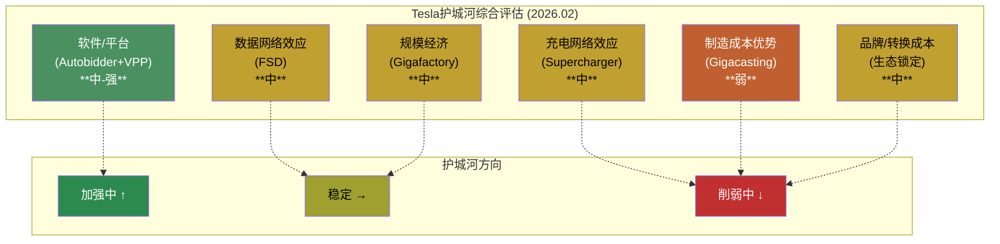
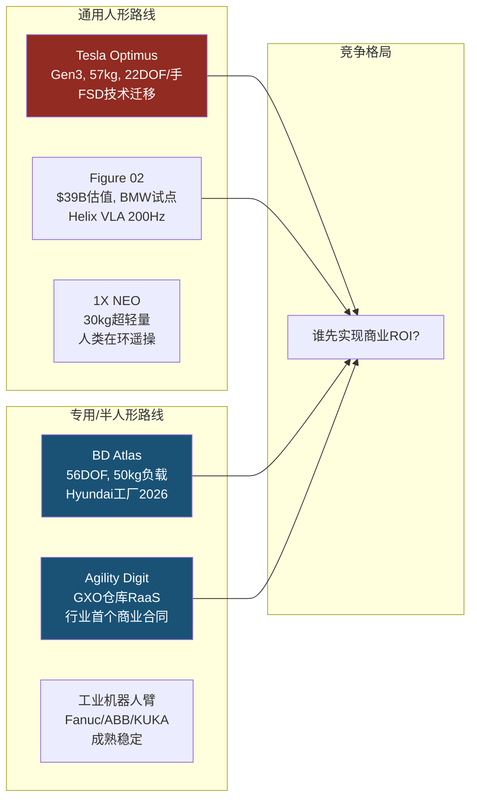
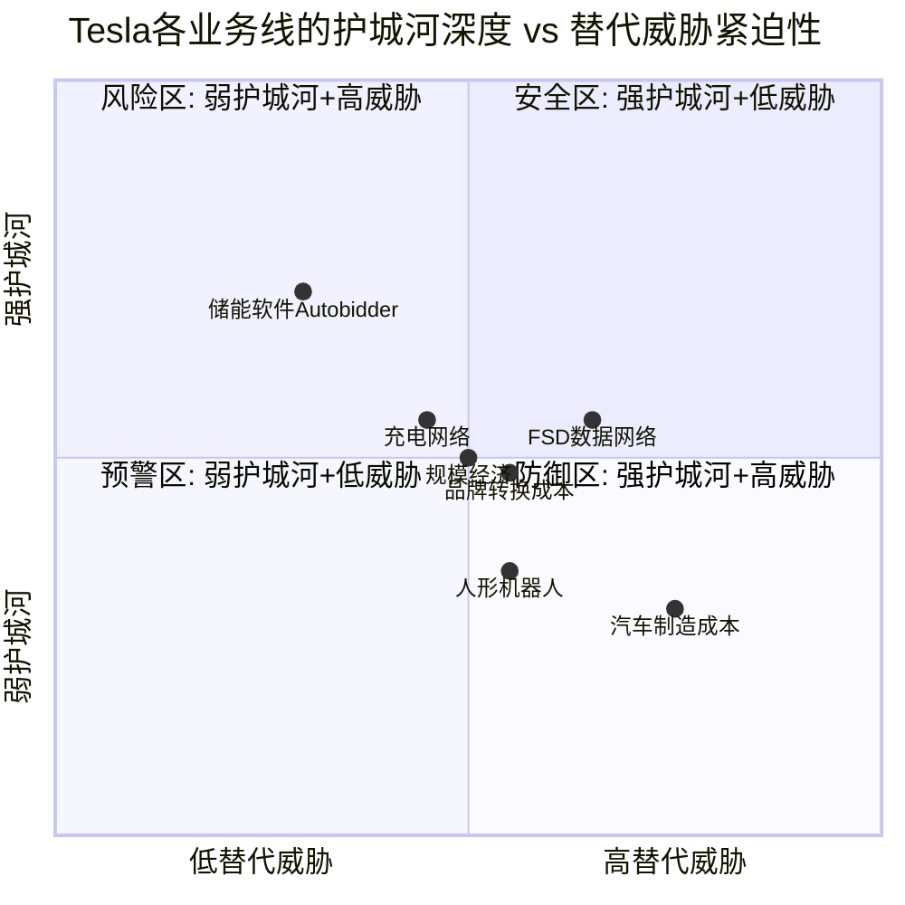

# Phase 3 Agent A: 护城河量化评估 + 技术路线替代威胁

> **Agent A产出** | 目标: ~12K字符 | 方法论: v9.0扬长避短 + 发现系统(9/10)
> **核心原则**: 零目标价 | 零评级 | 零仓位建议 | 护城河聚焦可量化竞争优势
> **不重复Phase 1**: Phase 1已列事实清单，本章聚焦"护城河的耐久性评估"和"技术替代的时间窗口"
> **数据截止**: 2026-02-11 | 价格: $425.21 | 市值: $1.414T

---

## 5.1 护城河类型识别与量化

Tesla拥有6种可识别的竞争优势，但每种的耐久性和强度差异极大。以下逐一量化评估，每种护城河提供正面证据和反面证据，然后给出定性评级。

---

### 5.1.1 数据网络效应 (FSD)

**正面量化证据**:

- FSD累计行驶里程: ~7.1B英里(截至2026年初)，其中城市道路2.5B英里 [硬数据: Tesla FSD Safety Hub, fsdmiles.com]
- 付费用户: 1.1M FSD订阅用户($99/月) [硬数据: Tesla 10-K FY2025]
- 日均FSD里程: 按当前增速，预计2026年7月突破10B英里 [合理推断: fsdmiles.com趋势外推]
- 飞轮逻辑: 更多车辆 -> 更多corner case数据 -> 更好的端到端NN -> 更高用户信任 -> 更多订阅 -> 更多数据

**反面量化证据**:

- Waymo仅用1.27亿英里无人驾驶数据(Tesla的1/56)，已在6个城市实现L4商业运营，周均rides 450K+ [硬数据: Waymo 2025年度回顾]
- Waymo安全数据: 严重伤亡事故比人类驾驶减少90%(同行评审论文) [硬数据: 发表研究]
- Tesla FSD仍为L2+(需人类监督)，Waymo已L4(全无人) — 等级差异说明数据量不等于数据质量 [硬数据: SAE标准/监管分类]
- Musk承认需要10B英里才能实现"安全无监督"FSD，等于承认当前7.1B英里不够 [硬数据: Electrek 2026.01报道]
- 关键限制: Tesla数据来自L2+辅助驾驶(人类随时接管)，Waymo数据来自L4无人驾驶(系统独立决策)。两种数据的"AI训练信息密度"不同 — L4场景中AI必须解决所有edge case，L2+场景中人类接管掩盖了AI的不足 [合理推断: 基于自动驾驶训练方法论]

**飞轮是否成立?**

[主观判断:] 飞轮的前半段(更多车辆->更多数据)已证实。后半段(更好模型->更多用户)尚未闭合 — FSD付费渗透率仅~2%(1.1M/~5M+累计车辆)，说明大多数Tesla车主未被说服为FSD付费。数据量是必要条件但非充分条件。Waymo的反证表明：在高质量L4数据+多传感器冗余的路线中，1/50的数据量可以产出更高安全标准的产品。

**评估: [中]** — 数据规模壁垒真实存在(任何新进入者难以从零积累7B+英里)，但未转化为产品等级优势(L2+ vs 竞品L4)，且飞轮的"用户增长"环节渗透率低。

---

### 5.1.2 充电网络效应

**正面量化证据**:

- 全球Supercharger: 7,753站点 / 75,000+连接器(截至2025年底)，覆盖55个国家 [硬数据: EVChargingStations Q3 2025, Tesla]
- NACS已被SAE采纳为J3400标准 — 北美事实标准 [硬数据: SAE标准]
- 已接入品牌: Ford, GM, Rivian, Volvo, Hyundai, Toyota, VW等20+品牌 [硬数据: Tesla NACS页面]
- 网络性能: 2025全年交付6.7 TWh电力 [硬数据: Tesla Supercharger统计]
- 增速: 8个月内新增10,000连接器(从60K到70K) [硬数据: Drive Tesla Canada]

**反面量化证据**:

- 开放NACS标准后，竞品充电网络(ChargePoint, EVgo, BP Pulse, Electrify America)也采用J3400 — Tesla从"独占"变为"最大但非唯一" [合理推断: 行业趋势]
- 北美DC快充总端口67,916个(2026年1月)，Tesla约15,000+开放端口，市占率约22% [硬数据: EVChargingStations]
- 美国IRA充电补贴($7.5B)要求开放标准和非歧视性接入，部分补贴流向非Tesla充电站 [硬数据: 联邦NEVI计划]
- 网络效应在"标准化"后减弱: 当所有充电站都支持J3400时，Tesla Supercharger的独占粘性消失，变成"品牌偏好"而非"技术锁定" [合理推断: 经济学标准化理论]

**评估: [中]** — 网络密度领先+事实标准地位是真实优势。但标准开放后，这是一个正在稀释的护城河。长期看，充电网络更像"基础设施收入来源"而非"竞争壁垒"。

---

### 5.1.3 制造成本优势

**正面量化证据**:

- Gigacasting(一体压铸): 减少车身零件数量70%+ [硬数据: Tesla制造白皮书]
- Q4 2024 COGS/辆: <$35,000，创Tesla历史最低 [硬数据: Tesla FY2024 Q4 Earnings]
- Unboxed Process(非线性装配): 理论上减少装配面积40%+ [合理推断: Tesla Investor Day 2023]
- 产能布局: 5座Gigafactory(Fremont/Texas/Shanghai/Berlin/Nevada) [硬数据: Tesla 10-K]

**反面量化证据**:

- BYD同级车型制造成本比Tesla上海工厂**低15%** [硬数据: UBS拆解分析]
- BYD垂直整合度~75%(含电池、电机、电控) vs Tesla~46%(上海Model 3) [硬数据: UBS供应链分析]
- BYD劳动力成本优势: 中国工厂工人平均时薪~$6-8 vs Tesla上海~$10-12 vs Tesla美国~$25-35 [合理推断: 行业薪资数据]
- Gigacasting已被丰田、沃尔沃、小鹏等跟进 — 非独占技术 [硬数据: 行业公开报道]
- Tesla FY2025毛利率18.03% vs FY2022 25.60%，3年下降7.6pp — 制造效率改善被ASP下降抵消 [硬数据: FMP income]
- 产能利用率不足: 年产能>2M辆但FY2025交付~1.79M辆(<90%) [硬数据: Tesla 10-K]

**ASP对比**:

| 维度 | Tesla (FY2025) | BYD (FY2025) |
|------|---------------|-------------|
| ASP(估算) | ~$43,000-45,000 | ~$18,000-20,000(全系) |
| 售价区间 | $30K-$100K+ | $10K-$150K |
| COGS/辆 | <$35,000 | <$13,000-15,000(估算) |
| 毛利率 | 18.0% | ~22-24%(汽车业务) |

[合理推断: Tesla ASP基于汽车收入$69.5B/交付~1.62M辆(不含regulatory credits); BYD COGS基于UBS拆解数据外推; BYD毛利率基于H1 2025财报]

**评估: [弱]** — Tesla在制造创新(Gigacasting/Unboxed)上有先发优势，但BYD在绝对成本上领先。Gigacasting被跟进说明这不是持久壁垒。在价格战环境中，成本较高的一方不构成"护城河"。

---

### 5.1.4 品牌/转换成本

**正面量化证据**:

- S&P Global Mobility 2025 Loyalty Awards: Tesla获"Overall Loyalty to Make"奖(连续第4年) [硬数据: S&P Global Mobility 2025]
- FY2025品牌忠诚度: 55.9%(行业第3)，仍然高于大多数汽车品牌 [硬数据: LexisNexis数据]
- 转换成本组件: FSD数据积累(驾驶习惯学习) + Supercharger生态(充电便利) + Tesla App(车辆控制/保险) + OTA更新(持续改善) [合理推断: 产品生态分析]
- 唯一"科技品牌"汽车: 类似Apple在手机中的定位 — 品牌溢价能力 [主观判断]

**反面量化证据**:

- 品牌忠诚度正在下降: 从2024 H1的60.9%降至2025 H1的54.2% [硬数据: CleanTechnica引用行业数据]
- EV换购忠诚度: 从2020年的98%降至2025年的78% [硬数据: S&P Global Mobility]
- Tesla对Tesla换购: 从88%降至75%，车主越来越多选择竞品EV [硬数据: S&P Global Mobility分析]
- 品牌极化: Musk政治参与(DOGE/政治立场)导致特定市场(欧洲/美国东西海岸)品牌好感度下降 [合理推断: 多来源报道, 欧洲销量数据]
- 品牌与Musk个人深度绑定 — 这是优势也是风险: "Musk溢价"可能变成"Musk折价" [主观判断]

**评估: [中]** — 品牌忠诚度绝对值仍然强(行业Top 3)，转换成本通过生态锁定真实存在。但下降趋势清晰且加速，品牌极化是结构性问题而非周期性波动。

---

### 5.1.5 规模经济

**正面量化证据**:

- 全球5座Gigafactory + 2座Megafactory(Lathrop + 上海) [硬数据: Tesla 10-K]
- FY2025产能: >2M辆(汽车) + 100GWh+(储能，含Houston新厂50GWh) [硬数据: Tesla公开数据]
- 规模曲线: COGS/辆从FY2022 ~$38,000降至Q4 2024 <$35,000(-8%+) [硬数据: Tesla季度更新]
- R&D平摊效应: $6.41B R&D / 1.79M辆 = ~$3,580/辆。如果产量翻倍(3.6M辆)，R&D/辆可降至~$1,780 [合理推断: 线性平摊估算]
- D&A平摊效应: $6.15B D&A表明资产基础庞大，但高产能利用率时每辆分摊成本将下降 [合理推断]

**反面量化证据**:

- 产能利用率<90%: 规模经济的前提是高利用率。当前~2M产能只交付1.79M辆 [硬数据: Tesla 10-K]
- BYD年产能>400万辆+且利用率更高 — 在绝对规模上Tesla不是最大 [硬数据: BYD公开数据]
- 丰田/大众年产能均>1000万辆 — 传统规模巨头仍存在 [硬数据: 行业数据]
- Tesla在高端市场有规模优势，但在$15K-25K价格带(全球最大市场)几乎无存在感 [合理推断: 产品线分析]

**评估: [中]** — 在EV纯电领域Tesla有规模优势(仅次于BYD)。但汽车行业本身是规模经济充分竞争的行业，丰田/大众等传统巨头的规模更大。规模经济是"行业参与条件"而非"独特壁垒"。

---

### 5.1.6 软件/平台护城河 (Autobidder + VPP)

**正面量化证据**:

- Autobidder: AI驱动的能源交易软件，每5分钟做价格预测+最优出价 [硬数据: Tesla Support页面]
- 管理资产规模: 数百MWh资产管理，已交付GWh级电网服务 [硬数据: Tesla Autobidder]
- VPP(虚拟电厂): 德国+荷兰聚合50,000+台Powerwall [硬数据: Tesla UK VPP Launch报道]
- FY2025储能部署: 46.7 GWh(+49% YoY)，能源业务毛利率>汽车业务 [硬数据: Tesla 10-K]
- 垂直整合: Megapack(硬件) + Autobidder(软件) + Powerwall(分布式) + VPP(聚合) + Supercharger(充电) — 5层闭环 [合理推断: 基于Phase 1.6基元分析]
- 2026扩展: Houston Megafactory(50 GWh Megapack 3)投产，全球产能达133 GWh/年 [硬数据: 行业报道]

**反面量化证据**:

- Fluence IQ: 47国部署，FY2025营收$23亿，FY2026指引$32-36亿。硬件不可知策略覆盖更多电芯供应商 [硬数据: Fluence财报]
- CATL 587Ah电芯已大规模商业化，单体储能系统成本更低 [硬数据: ESS News]
- BYD MC Cube-T: 单柜6.432 MWh vs Tesla Megapack 2 XL 3.9 MWh — 硬件参数已被超越 [硬数据: BYD产品规格]
- 公用事业可能自建软件平台(非依赖Autobidder) — 软件粘性取决于切换成本和数据锁定 [主观判断]

**评估: [中-强]** — Autobidder+VPP的垂直整合是Tesla所有护城河中最接近"强"的一个。5层闭环在竞品中无人完全复制。但硬件层已被中国竞品超越，软件层的网络效应(更多数据->更好预测->更多客户)还在早期阶段。

---

### 护城河综合图谱

**护城河综合摘要表**:

| 护城河类型 | 评估 | 方向 | 核心证据 | 最大威胁 |
|-----------|:----:|:----:|---------|---------|
| 数据网络效应 | 中 | → | 7.1B英里但仍L2+; 飞轮未完全闭合 | Waymo用1/56数据达L4 |
| 充电网络效应 | 中 | ↓ | 75K+连接器+事实标准; 但标准开放稀释 | NACS开放→非独占 |
| 制造成本优势 | 弱 | ↓ | Gigacasting先发; BYD绝对成本低15%+ | BYD 75%垂直整合 |
| 品牌/转换成本 | 中 | ↓ | 忠诚度Top3+生态锁定; 但从61%降至54% | Musk政治极化 |
| 规模经济 | 中 | → | EV纯电#2(次于BYD); 产能>2M | 传统巨头规模更大 |
| 软件/平台 | 中-强 | ↑ | 5层垂直整合无人复制; 46.7GWh部署 | 中国硬件成本更低 |

[主观判断: Tesla的护城河组合整体上是"宽度不足但数量多"的格局。没有一条护城河达到Visa(网络效应)或ASML(技术垄断)级别的"强"评级。最有潜力的护城河(Autobidder+VPP)恰好是市场关注最少的。最受关注的护城河(FSD数据)恰好有最强的反证(Waymo)。]

---

## 5.2 技术路线图与替代威胁

### 5.2.1 FSD技术路线竞争

三条路线正在竞速L4商业化:

```mermaid
graph TD
    subgraph "Tesla路线"
        T1["纯视觉8摄像头"] --> T2["端到端NN v14"]
        T2 --> T3["AI5/AI6训练集群"]
        T3 --> T4["L4有限ODD?"]
        T4 --> T5["Cybercab Robotaxi?"]
    end
    subgraph "Waymo路线"
        W1["多传感器融合<br/>13摄+4LiDAR+6雷达"] --> W2["6代硬件<br/>(成本大幅降低)"]
        W2 --> W3["20+城市扩展<br/>(含东京/伦敦)"]
        W3 --> W4["100万rides/周<br/>(2026年底目标)"]
    end
    subgraph "中国路线"
        C1["视觉+LiDAR混合"] --> C2["华为/小鹏/BYD"]
        C2 --> C3["城市NOA 300+城市"]
        C3 --> C4["渐进式L3→L4"]
    end
    style T4 fill:#c07020,color:#fff,stroke-dasharray: 5 5
    style T5 fill:#c03030,color:#fff,stroke-dasharray: 5 5
    style W4 fill:#2d8a4e,color:#fff
    style C3 fill:#4a9060,color:#fff
```

**路线对比深度分析**:

| 维度 | Tesla纯视觉 | Waymo多传感器 | 中国混合 |
|------|-----------|-------------|---------|
| **传感器成本/辆** | ~$200-300(8摄像头) | ~$5,000-10,000(6代降低后) | ~$1,000-3,000 |
| **数据规模** | 7.1B英里(L2+) | 127M英里(L4) | 各家10-100M英里 |
| **当前等级** | L2+(需监督) | L4(限定区域无人) | L2+/L3(部分地区) |
| **商业化状态** | $99/月订阅 | 按里程计费运营中 | 主要免费(品牌附加值) |
| **扩展速度** | 全球(受监管限制) | 2026目标20+城市 | 中国为主(出海困难) |
| **物理限制** | 暴雨/浓雾/强逆光 = 信噪比瓶颈 | LiDAR在恶劣天气也退化(但多冗余) | 中间方案 |
| **监管路径** | NHTSA未批L4; Austin有限试点 | 6城L4运营许可 | 中国L3/L4各地试点 |

[硬数据: 传感器成本基于行业拆解; 等级基于SAE/监管记录; 合理推断: 物理限制基于传感器物理学]

**关键不确定性**: AI能否在5年内让传感器差异变得不重要? 如果端到端NN的感知能力提升到与LiDAR融合等效，Tesla纯视觉路线将获得巨大成本优势($200 vs $5,000+/辆)。如果不能，Tesla在L4领域将持续落后。这是一个**技术赌注**，不是确定性判断。[主观判断]

---

### 5.2.2 储能技术替代

**电池化学路线竞争**:

| 技术路线 | 能量密度 | 成本 | 商业化时间 | 代表企业 | Tesla影响 |
|---------|---------|------|----------|---------|----------|
| **LFP(磷酸铁锂)** | 140-180 Wh/kg | ~$50-70/kWh(电芯) | 已成熟 | CATL, BYD, Tesla(采购) | Tesla主力路线 |
| **钠离子** | 100-175 Wh/kg | ~$30-50/kWh(目标) | 2026大规模商用 | CATL Naxtra, BYD | 低成本储能竞品 |
| **固态电池** | 300-500 Wh/kg | 高(试产阶段) | 2027-2030(量产) | BYD(硫化物), Toyota, QuantumScape | 性能天花板重写 |

[硬数据: CATL确认2026年大规模部署钠离子电池(4大领域); BYD 2026.02宣布钠离子电池循环寿命达10,000次; BYD硫化物固态电池预计2027年小规模量产]

**关键威胁**:

1. **钠离子替代**: CATL Naxtra钠离子电池已达175 Wh/kg，支持500km续航，2026年搭载长安车型。如果钠离子在储能领域大规模替代LFP，Tesla Megapack的电芯采购成本优势(当前LFP)将消失，因为钠离子更便宜且不依赖锂 [硬数据: CATL/BYD公告; 合理推断: 供应链成本分析]

2. **BYD固态电池**: 20Ah/60Ah试产线已运行(2024)，硫化物路线2027年小规模量产。如果固态电池在2028-2030实现成本突破(>300 Wh/kg + <$80/kWh)，当前所有LFP储能产品的竞争力将被重新定义 [硬数据: BYD 2026.02.09公告]

**系统集成竞争**:

| 产品 | 单柜容量 | 软件 | 差异化 |
|------|---------|------|-------|
| Tesla Megapack 2 XL | 3.9 MWh | Autobidder(AI交易) | 软件+VPP生态 |
| BYD MC Cube-T | **6.432 MWh** | BYD ESS平台 | 容量最大+成本最低 |
| CATL EnerOne Plus | **6.25 MWh** | 基础EMS | 电芯成本最低 |
| Fluence(Siemens+AES) | 模块化 | Fluence IQ(47国) | 硬件不可知+最广部署 |

[硬数据: 各公司产品规格; Phase 1.3.3已列]

[主观判断: Tesla在储能领域的持久优势不在硬件(已被BYD/CATL超越)而在Autobidder软件生态。但如果钠离子电池在2026-2027大幅降低系统成本，Tesla作为电芯采购方反而可能受益(采购更便宜的电芯)——前提是Autobidder平台足够开放以集成新电芯技术。]

---

### 5.2.3 人形机器人替代路线

**核心路线分歧: 通用人形 vs 专用机器人**

Tesla押注"通用人形机器人"(Optimus)——一种能做多种任务的类人形态。但市场正在发展的替代路线包括:

**竞品量化对比**:

| 维度 | Tesla Optimus | BD Atlas | Figure 02 | Agility Digit |
|------|-------------|----------|-----------|---------------|
| **外部客户** | **零** | Hyundai(2026全产量) | BMW(试点结束) | GXO(商业RaaS) |
| **商业合同** | 无 | 2026全年预售 | UPS签约 | 多年RaaS合同 |
| **量产计划** | 100万/年(目标) | 3万/年(2028目标) | 未公开 | 1万/年(RoboFab) |
| **估值隐含** | Tesla市值的一部分(P2估算~$60-200B) | Hyundai $260亿机器人投资 | $390亿独立估值 | ~$10亿+ |
| **BOM成本** | ~$55K(Gen2推测) | 未公开 | 未公开 | 未公开 |
| **目标售价** | $20K-30K | 未公开 | $130K | ~$250K(RaaS) |
| **核心优势** | FSD技术迁移+规模制造 | 56DOF+50kg负载+Hyundai整合 | AI模型速度(200Hz) | 已验证商业模型 |

[硬数据: Tesla/Figure/BD/Agility公开数据; 合理推断: Tesla BOM基于Standard Bots分析; CES 2026数据]

**Figure AI $39B估值含义**:

[合理推断:] Figure AI总融资$2.34B，估值$39B(19x投入资本)，意味着VC市场对人形机器人赛道高度乐观。如果Tesla Optimus独立上市，基于类似倍数和更大的制造能力，估值可能在$100-300B。但$39B的估值建立在"100K台4年出货"的预期上——Tesla的100万/年目标如果实现，规模将是Figure的40x。关键问题: 规模在机器人领域是否等于成本领先? 汽车制造经验能迁移到机器人装配吗?

**BD Atlas + Hyundai整合的威胁**:

- BD有56 DOF(行业最高灵巧度)，50kg负载能力(行业最高) [硬数据: BD CES 2026]
- 2026全年产量已被Hyundai预订一空 — 需求已验证 [硬数据: BD公告]
- 2028年目标3万台/年 + 进入组装流程 [硬数据: Hyundai Metaplant计划]
- Google DeepMind合作 — AI能力可能快速迭代 [硬数据: BD合作公告]
- 核心差异: BD走"专用工业机器人"路线(排序→装配→搬运)，Tesla走"通用物理AI"路线(工厂→家庭→服务)。[主观判断: 两条路线的终极胜负取决于"通用性溢价"是否存在 — 即客户愿意为"一台能做所有事的机器人"vs"几台各做一件事的专用机器人"多付多少钱。]

---

### 5.2.4 技术替代威胁总结矩阵

| 业务线 | 最大替代威胁 | 时间窗口 | Tesla的防御 | 威胁等级 |
|-------|-----------|---------|-----------|---------|
| **FSD/Robotaxi** | Waymo L4扩展(2026目标20+城市/100万rides周) | 1-3年(Waymo) / 3-5年(中国方案) | 数据规模+成本优势(纯视觉); 但需L4突破 | **高** |
| **储能硬件** | BYD MC Cube-T(6.4MWh) + CATL钠离子(2026) | 1-2年(硬件竞争已到) | Autobidder软件生态 + VPP网络 | **中** |
| **储能软件** | Fluence IQ(47国) + 公用事业自建 | 3-5年 | 数据积累+垂直整合(5层闭环) | **低-中** |
| **人形机器人** | BD Atlas(Hyundai整合) + Figure AI($39B) | 3-5年(排序) / 5-10年(通用) | FSD技术迁移 + 制造规模目标 | **中** |
| **汽车(中国)** | BYD全系($10K-$150K) + 华为智驾 | 已在发生 | 品牌溢价 + FSD差异化 + 充电网络 | **高** |
| **汽车(西方)** | 传统OEM电动化(VW/BMW/Hyundai) | 2-4年 | 规模+软件+品牌忠诚度 | **中** |
| **电池化学** | 钠离子(2026商用) + 固态(2027-2030) | 2-5年 | Tesla作为采购方可切换电芯; 但无自有电芯优势 | **低**(可受益) |

[合理推断: 时间窗口基于各竞品公开时间表; 威胁等级是主观判断，综合考虑竞品成熟度、市场覆盖和Tesla防御能力]

---

## 本章总结

Tesla的护城河格局呈现"数量多但深度不足"的特征:

1. **最强护城河在最不起眼的地方**: Autobidder+VPP的5层垂直整合是最接近"强"评级的护城河，也是唯一方向向上的护城河。但市场的叙事焦点在FSD/Robotaxi/Optimus上。[主观判断]

2. **最受关注的护城河有最强反证**: FSD的7.1B英里数据壁垒看似庞大，但Waymo用1/56的数据达到了更高的自动化等级。数据量是必要条件但非充分条件。[合理推断: 基于FSD vs Waymo对比]

3. **三条护城河在削弱**: 充电网络(标准开放)、制造成本(BYD更低)、品牌(忠诚度下降)都在方向上恶化。这不是周期性波动，而是结构性趋势。[合理推断: 基于多年数据趋势]

4. **技术替代最紧迫的威胁**: (a) Waymo L4扩展(2026目标100万rides/周); (b) BYD在中国和全球的价格+技术攻势(已在发生); (c) 钠离子电池2026大规模商业化可能重塑储能成本结构。[硬数据: 各竞品公开时间表]

5. **Tesla的核心防御不是单一护城河，而是"多线程同时推进"的战略期权组合**: 任何一条线失败不会致命(现金堡垒$44B)，但任何一条线的大成功可以重新定义公司。这与可能性宽度9/10的判断一致 — Tesla的价值不在于任何单一护城河的深度，而在于多种可能性的**组合期权价值**。[主观判断: 与发现系统框架一致的结论]

---

> **免责声明**: 本报告为买方研究分析，不构成投资建议。所有分析基于公开数据和合理推断。护城河评估为定性判断，投资者应独立验证数据并做出自己的投资决策。
