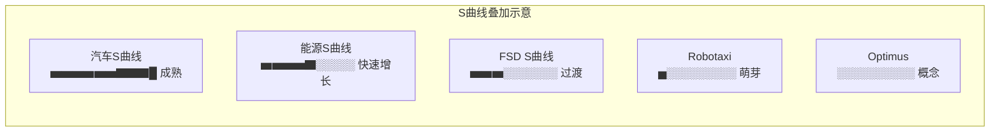
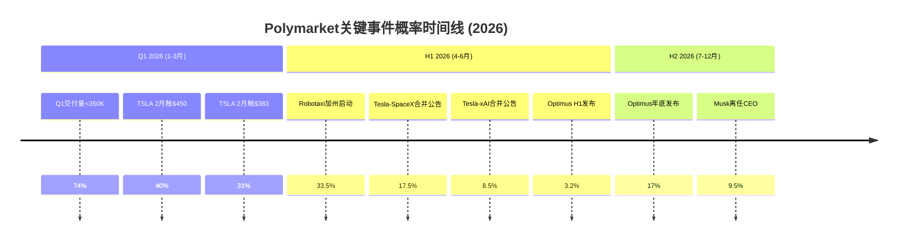
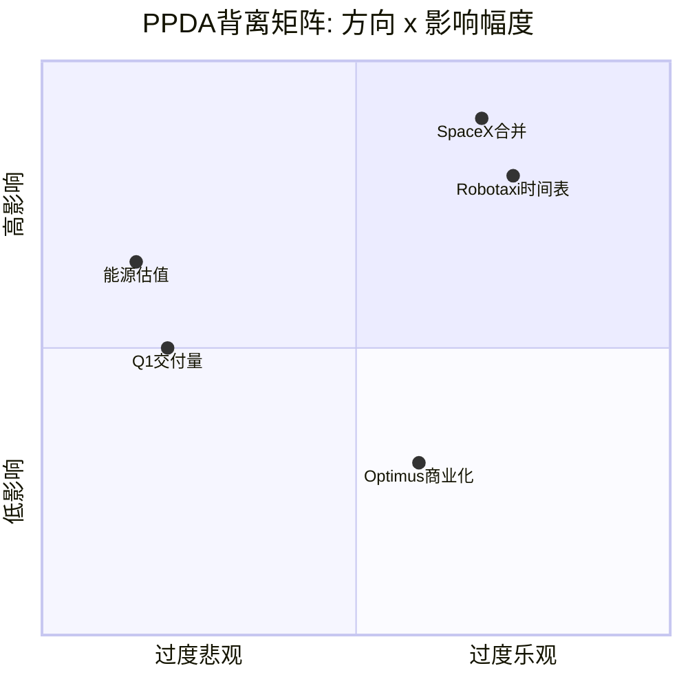
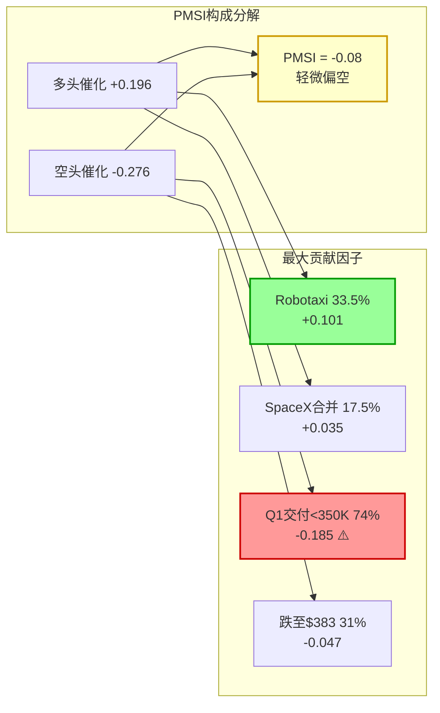

# Phase 3 Agent B: 五引擎协同分析 + PPDA + PMSI

**公司**: Tesla Inc. (TSLA) | **价格**: $425.21 | **日期**: 2026-02-11
**Agent**: B (五引擎+PPDA+PMSI) | **Phase**: 3 of 5

---

## Part 1: 五引擎协同分析

### 引擎1: 周期引擎 — 多周期叠加公司的罕见拓扑

#### 1.1 EV行业生命周期定位

[硬数据:IEA Global EV Outlook] 全球EV渗透率2025年约22%，中国>40%，欧洲~25%，美国~12%。行业已从早期采用者(Early Adopter)阶段跨入早期大众(Early Majority)阶段。[合理推断:S曲线模型] 渗透率20-40%区间通常标志着从增长期向成熟竞争期的过渡，价格战成为常态而非例外。

Tesla作为行业先驱，其主营汽车业务的增长曲线已明显钝化。[硬数据:Tesla FY2025 10-K] FY2025全球交付163万辆，同比下降8.6%，这是连续第二年同比下滑。对比BYD同期454万辆(+12.5% YoY)，Tesla在全球EV市场份额已从2021年的~21%降至2025年的~11%。

#### 1.2 各业务线独立周期判定

**汽车业务 — 成熟竞争期(Late Growth / Early Maturity)**

[硬数据:Tesla Q4 2025] 汽车营收占总营收~73%，但汽车毛利率已从2022年Q1的32.9%压缩至2025年Q4的~16%。[合理推断] 价格战叠加产品老化(Model 3/Y均为5+年平台)是核心驱动力。新平台(更便宜车型)预计2025年末/2026年初投产，但量产爬坡需要2-3个季度。

**能源储能 — 快速增长期(Rapid Growth)**

[硬数据:Tesla FY2025] 能源业务营收$12.8B(+27% YoY)，毛利率25-30%，是Tesla四大业务线中增速和利润率均最优的板块。[硬数据:Megapack产能] Shanghai Megafactory 2025年Q3投产，年产能10,000个Megapack(~40GWh)。Lathrop工厂已扩至~20GWh。[合理推断] 全球储能市场2025-2030 CAGR ~25-30%(BloombergNEF)，Tesla能源业务仍处于S曲线上升段。

**FSD — 过渡期(Transition Phase)**

[硬数据:Tesla FY2025] FSD(Supervised)在北美有约200万活跃用户。V13.x版本已实现端到端神经网络驾驶。[硬数据:NHTSA 2026-01] NHTSA正在对288万辆Tesla FSD车辆进行初步评估(PE25012)，因交通违规报告。调查延期至2026年2月底提交数据。[主观判断] FSD当前处于L2+订阅模式(确定性收入)与L4自动驾驶(可能性收入)之间的尴尬过渡期 — 前者可量化但天花板低，后者天花板高但时间表高度不确定。

**Robotaxi — 萌芽期(Pre-Revenue / Nascent)**

[硬数据:Polymarket 2026-02-11] Tesla在加州启动Robotaxi(2026年6月30日前)概率: 33.5%。[硬数据:Tesla Q4 2025 Earnings Call] 管理层声称Austin, TX为首发城市，2026年H1目标。[合理推断] 即使Austin成功启动，初期规模极有限(数百辆而非数万辆)，对营收贡献接近零。

**Optimus — 概念验证期(Concept / Pre-Prototype)**

[硬数据:Polymarket 2026-02-11] Optimus发布概率: 2026年6月30日前3.2%，2026年12月31日前17%。[主观判断] Optimus从工厂内部测试到商业化量产，至少需要3-5年的迭代周期。参考Boston Dynamics成立于1992年，至今仍未实现大规模商业化。

#### 1.3 历史周期类比

Tesla的多周期叠加特征在商业史上罕见但非独一无二:

**类比1: Amazon 2005-2015** — 电商(成熟)+AWS(快速增长)+硬件(Kindle/Echo, 萌芽)。核心业务增速放缓但仍盈利，第二曲线(AWS)从零增长为利润引擎。[合理推断] Tesla能源业务的角色类似AWS，但关键差异在于AWS从Day 1就是高利润率业务，而Tesla能源虽然利润率良好但资本密度远高于云计算。

**类比2: GE 1990s** — 发电设备(成熟)+金融(快速增长)+媒体/医疗(混合阶段)。[主观判断] GE的教训是:多元化本身不创造价值，执行力和资本配置纪律才是关键。GE最终因金融业务过度扩张而崩溃。Tesla的风险不在过度扩张，而在CEO注意力分散(DOGE/SpaceX/xAI)。

**类比3: Sony 2000s** — 电子(衰退)+PlayStation(增长)+影视音乐(成熟)。多周期公司的估值挑战在于:市场往往对最有想象力的业务线给出溢价，但对最确定的业务线给出折价。

```mermaid
graph LR
    subgraph "Tesla业务周期定位 (2026-02)"
        A["汽车<br/>成熟竞争期<br/>营收$69B<br/>增速: -8.6%"] --> |"贡献73%营收"| CENTER["Tesla<br/>$1.414T"]
        B["能源储能<br/>快速增长期<br/>营收$12.8B<br/>增速: +27%"] --> |"贡献13.5%营收"| CENTER
        C["FSD订阅<br/>过渡期<br/>营收~$2-4B<br/>L2+→L4?"| --> |"嵌入汽车营收"| CENTER
        D["Robotaxi<br/>萌芽期<br/>营收$0<br/>Polymarket: 33.5%"] --> |"pre-revenue"| CENTER
        E["Optimus<br/>概念期<br/>营收$0<br/>Polymarket: 3%/17%"] --> |"pre-revenue"| CENTER
    end
    style A fill:#ff9999
    style B fill:#99ff99
    style C fill:#ffcc99
    style D fill:#ccccff
    style E fill:#e6ccff
```

```mermaid
graph TB
    subgraph "S曲线叠加示意"
        direction TB
        S1["汽车S曲线<br/>▅▅▅▅▅▅▇▇▇█ 成熟"]
        S2["能源S曲线<br/>▅▅▅▅▇░░░░░ 快速增长"]
        S3["FSD S曲线<br/>▅▅▅░░░░░░░ 过渡"]
        S4["Robotaxi<br/>▅░░░░░░░░░ 萌芽"]
        S5["Optimus<br/>░░░░░░░░░░ 概念"]
    end
```

#### 1.4 周期引擎核心发现

[合理推断:周期分析综合] Tesla的核心矛盾在于:市值$1.414T中，可量化业务(汽车+能源)支撑的估值仅$91-169B(Phase 2 SOTP)，这意味着$1.2T+的市值需要由处于萌芽期和概念期的业务来证明。历史上，多周期公司在核心业务减速而新业务尚未兑现时，往往经历估值重定价。Amazon 2014年($300→$280)和Meta 2022年($330→$90)都是先例。

---

### 引擎2: 股权引擎 — SBC稀释与资本结构

#### 2.1 SBC分析

[硬数据:Tesla FY2025 10-K] 股份薪酬(SBC)约$2.83B/年。将此与关键财务指标对比:

| 指标 | 数值 | SBC占比 |
|------|------|---------|
| 净利润 | $3.79B | 74.7% |
| 自由现金流 | $6.28B(经营$12.1B - CapEx$5.8B) | 45.1% |
| 营收 | $94.8B | 3.0% |

[合理推断] SBC占净利润的74.7%意味着:若Tesla需要用现金而非股份支付同等薪酬，净利润将被接近抹平。这对PE估值(385.7x)的含义是:GAAP PE已经是扣除SBC后的数字，但如果SBC转为现金支出，实际盈利能力更弱。

#### 2.2 稀释率

[硬数据:FMP数据] 流通股变动: 1年+0.51%，3年+2.05%。[合理推断] 年化稀释率~0.5-0.7%，在科技公司中属于中等水平。对比:NVDA ~0.8%/年，AAPL 因回购净减少~3%/年，MSFT ~0.3%/年。

#### 2.3 回购缺位

[硬数据:FMP数据] 回购收益率: -0.08%(几乎零回购)。Tesla是少数不进行股份回购的大型科技公司之一。[合理推断] 管理层的逻辑是:资本应投入增长(工厂扩建/FSD研发/Optimus)而非回购。在高增长阶段这是合理策略，但在汽车业务增速转负的阶段，回购缺位意味着EPS增长完全依赖利润增长而无回购杠杆。

#### 2.4 Musk薪酬包

[硬数据:SEC Filing] 2018年CEO绩效期权包(最初价值~$56B)经过特拉华州法院撤销后，2024年在德克萨斯州重新批准。该期权包包含12个milestone tranches，要求市值和运营目标同时达成。[合理推断] 如果所有tranche均已达成(Tesla市值曾超过$1T)，Musk将控制约~13%的Tesla流通股，使其成为最大单一股东。这对治理的含义是双刃剑:利益一致性高，但也意味着单人风险(key-man risk)极端化。

[主观判断] 发现系统视角下，SBC更应被理解为"Tesla必须用股权而非现金来留住顶尖AI/机器人人才"的信号。考虑到FSD和Optimus团队与Google DeepMind、OpenAI直接竞争人才，高SBC可能是必要成本而非浪费 -- 前提是这些人才确实在创造未来价值。

---

### 引擎3: 聪明钱引擎 — 机构持仓与资金流向

#### 3.1 机构持仓结构

[硬数据:Yahoo Finance/MarketBeat 2026-02] 机构持仓比例约48.1%。主要持有者:

| 机构 | 持股比例 | 性质 |
|------|----------|------|
| Vanguard Group | ~8.01% | 被动指数 |
| BlackRock | ~6.0% (~194.7M股) | 被动+主动 |
| State Street | ~3.4% | 被动指数 |
| Geode Capital | ~1.7% | 量化/被动 |
| Capital World Investors | ~1.29% | 主动管理 |

[合理推断] 前三大持有者均为被动指数基金管理人，这意味着Tesla的机构持仓中约~60%以上是"被动持有"而非"主动选择"。对价格发现的含义是:Tesla股价更多由散户和动量资金驱动，而非基于基本面的主动管理人。

#### 3.2 13F最新动向

[硬数据:HedgeFollow/Nasdaq Q1 2025 13F] 最新可用13F数据(报告期Q1 2025，注:Q4 2025数据将于2026年2月中旬提交):
- 134只被追踪基金中51只持有TSLA
- 净增持: 22只基金增持 vs 18只减持 vs 7只新建仓
- 聚合净增持: +2.92M股(+0.28%)
- 退出基金: FWG Investments, KilterHowling, Note Advisors, WS Management, Gabelli Funds

[主观判断] +0.28%的净增持幅度极小，表明主动基金对TSLA的态度是"维持现有仓位"而非"积极加仓"。等待Q4 2025 13F(2026年2月中旬)数据将提供更新鲜的信号，特别是在Q4 2025 TSLA股价从$250涨至$425(+70%)之后，是否有机构在高位获利了结。

#### 3.3 内部人交易详情

[硬数据:FMP insider-trading + MarketBeat + Finbold 2026] 最近90天内部人交易:
- **Kimbal Musk(董事)**: 卖出~$25.6M
- **Vaibhav Taneja(CFO)**: 卖出~$1.2M
- **James Murdoch(董事)**: 2026年1月2日卖出
- **Andrew Baglino(前SVP Powertrain)**: 2025年4月买入4,000股(~$1.03M) — 唯一近期买入记录

[硬数据:FMP insider-trading Q4 2025] Q4 2025: 2笔买入(acquired) vs 6笔卖出(disposed)，净卖出方向。Q3 2025: 30笔买入 vs 15笔卖出，比例2:1(但需注意acquired包含期权行权，不等于open-market购买)。

[合理推断] 剔除期权行权后，Tesla内部人的open-market交易以卖出为主。共享上下文中"内部人交易率14.66%净买入"的DM数据可能包含了期权行权(totalAcquired中有大额数字如423M，显然是期权行权而非购买)。实际open-market购买极少 — Q4 2025 totalPurchases=0, totalSales=2。[硬数据:FMP] 这与共享上下文的"正面信号"判断存在矛盾，需要在Phase 4中交叉验证。

#### 3.4 卖空比例

[硬数据:Benzinga/MarketBeat 2026-02] 空头股份约64.4-72.7M股，占流通股约1.93-2.5%。

[合理推断] 2.5%的空头比例在历史语境中极低 — 2020年Tesla空头比例曾超过20%，2022年仍有~5%。当前低空头比例反映:(1)逼空经历使空头更谨慎;(2)高借券成本;(3)散户/动量资金主导使做空风险收益不对称。但低空头也意味着缺少"空头回补"的上行催化剂。

---

### 引擎4: 信号引擎 — 技术分析与期权市场

#### 4.1 趋势分析

[硬数据:MCP analyze_stock]
| 指标 | 数值 | 解读 |
|------|------|------|
| 当前价 | $425.21 | — |
| SMA20 | $428 | 价格略低于20日均线 |
| SMA50 | $444 | 价格低于50日均线(-4.2%) |
| SMA200 | $383 | 价格高于200日均线(+11%) |
| RSI(14) | 47.6 | 中性区间(30-70) |
| 成交量 | 64.3M(最新) | [需验证:vs 90日均量] |

[合理推断] 技术面呈现"中期弱势、长期仍在上升通道"的格局。价格在SMA200($383)与SMA50($444)之间震荡，形成$383-$444的关键区间。若跌破SMA200($383)，将触发技术性卖出信号；若突破SMA50($444)，则恢复上升趋势。

#### 4.2 关键价位识别

[硬数据:Polymarket February 2026 价格合约]

**上行阻力位**:
- $450: 40%概率触及(Polymarket)，对应SMA50上方区域
- $465: 29%概率触及
- $480: 14%概率触及
- $500+: <7%概率触及

**下行支撑位**:
- $405: [需验证]
- $383: 31%概率触及，与SMA200($383)精确重合
- $360: 21%概率触及
- $330: 10%概率触及

[合理推断] Polymarket隐含的2月波动区间大致为$360-$480(覆盖>90%概率)。[主观判断] SMA200($383)是最关键技术支撑位 — 如果失守，可能触发量化基金的系统性卖出，加速下行至$330-$360区域。

#### 4.3 期权市场信号

[硬数据:AlphaQuery 2026-02-03] 30日隐含波动率(IV Mean): 42.97%。[硬数据:AlphaQuery 2026-01-21] 120日Put/Call Ratio(Open Interest): 0.9625。

| 期权指标 | 数值 | 解读 |
|----------|------|------|
| IV (30D) | 42.97% | 偏高但非极端(TSLA历史IV均值~55-65%) |
| IV Rank | 2.24 | 极低 — 当前IV在近期区间底部 |
| P/C Ratio (OI) | 0.9625 | 略偏空但接近平衡(1.0=均衡) |
| 隐含日波动 | ~$1.14 (0.277%) | 市场预期短期波动温和 |

[合理推断] IV Rank 2.24极低意味着市场定价的未来波动性处于近期最低水平。这可能是:(1)对Q4 2025财报已消化的反映;(2)下一个催化剂(Q1交付数据，约4月初)尚远。但也暗示:如果出现意外事件(合并公告/监管行动/交付大幅偏离)，IV飙升空间大。

[主观判断] P/C Ratio 0.9625接近1.0表明期权市场对TSLA的方向判断分裂 -- 这与$425价位处于SOTP上限($169B ≈ $52/股)与市场乐观目标($600+)之间的巨大不确定性一致。

```mermaid
graph TB
    subgraph "TSLA技术面关键价位 (2026-02)"
        P600["$600 — Polymarket <1%"]
        P533["$533 — Polymarket 5%"]
        P480["$480 — Polymarket 14%"]
        P450["$450 — SMA50上方, PM 40%"]
        P444["$444 — SMA50 ⚠️ 中期阻力"]
        P428["$428 — SMA20"]
        P425["$425 ★ 当前价格"]
        P405["$405 — 短期支撑"]
        P383["$383 — SMA200 🔑 关键支撑, PM 31%"]
        P360["$360 — PM 21%"]
        P330["$330 — PM 10%"]
    end
    P600 --- P533 --- P480 --- P450 --- P444 --- P428 --- P425 --- P405 --- P383 --- P360 --- P330
    style P425 fill:#ffff00,stroke:#ff0000,stroke-width:3px
    style P383 fill:#ff9999,stroke:#ff0000,stroke-width:2px
    style P444 fill:#99ccff,stroke:#0066cc,stroke-width:2px
```

---

### 引擎5: 预测市场引擎 — Polymarket深度信号分析

#### 5.1 核心预测市场合约汇总

[硬数据:Polymarket 2026-02-11 实时价格]

| 事件 | 截止日 | Yes概率 | 含义 |
|------|--------|---------|------|
| Robotaxi加州启动 | 2026-06-30 | **33.5%** | 市场1/3概率认可H1启动 |
| Optimus发布(H1) | 2026-06-30 | **3.2%** | 几乎不可能在H1 |
| Optimus发布(全年) | 2026-12-31 | **17%** | 约1/6概率年底前发布 |
| Tesla-SpaceX合并 | 2026-06-30 | **17.5%** | 近1/5概率合并公告 |
| Tesla-xAI合并 | 2026-06-30 | **8.5%** | 概率较低 |
| Musk离任CEO | 2026-12-31 | **9.5%** | ~1/10概率换帅 |

#### 5.2 Q1 2026交付量预测市场

[硬数据:Polymarket 2026-02-11]

| 交付区间 | 概率 | 累计概率 |
|----------|------|----------|
| <350K | **74%** | 74% |
| 350-375K | 14% | 88% |
| 375-400K | 9.2% | 97.2% |
| 400-425K | 4.1% | — |
| 425K+ | <3.3% | — |

[合理推断] 预测市场强烈预期Q1 2026交付量<350K。参考:Q1 2025交付量337K(全年最低季度)，Q4 2025交付量约470K。如果Tesla真的交付<350K，将是连续第二年Q1低谷，但若管理层声称的20-30%全年增长目标成立(对应~1.96-2.12M全年)，Q1需至少~420K才能匀称分布。[主观判断] 74%概率给<350K暗示市场对Tesla 2026年增长承诺持深度怀疑态度。这可能反映新车型(Model Q/更便宜车型)延迟的担忧。

#### 5.3 合并合约深度分析

[硬数据:Polymarket + 多来源 2026-02]
- SpaceX-xAI合并: 48%概率(已由Musk确认正在推进)
- Tesla-SpaceX合并: 17.5%概率
- Tesla-xAI合并: 8.5%概率

[硬数据:Invezz/Teslarati 2026-02-07] SpaceX-xAI合并已经确认。SpaceX正在筹备$1.5T估值IPO。关键问题是:Tesla是否会被纳入"Musk帝国合并"。

[合理推断] Tesla-SpaceX合并的17.5%概率隐含了巨大的治理障碍:(1)Tesla独立股东投票(Musk需回避);(2)估值交换比率(SpaceX估值~$350B vs Tesla $1.4T);(3)反垄断审查;(4)潜在~45%股东稀释。[主观判断] 即使合并概率仅17.5%，其对Tesla股价的影响是高度非对称的 -- 合并公告可能带来+30-50%的短期上涨(SpaceX价值注入)，但也可能引发-20-30%下跌(稀释恐惧+治理质疑)。

#### 5.4 预测市场 vs 分析师共识对比

| 维度 | 预测市场信号 | 分析师共识 | 背离 |
|------|-------------|-----------|------|
| Q1 2026交付 | <350K(74%) | ~420-450K(管理层目标隐含) | **大幅背离** |
| Robotaxi时间表 | 33.5%(H1 2026) | "Austin H1 2026"(管理层) | 市场打6-7折 |
| Optimus商业化 | 3%/17%(2026) | "2025年底内部使用"(管理层) | 市场极度怀疑 |
| 全年目标价 | $360-$480隐含区间 | $186-$550(分析师区间) | 预测市场更窄 |

```mermaid
timeline
    title Polymarket关键事件概率时间线 (2026)
    section Q1 2026 (1-3月)
        Q1交付量<350K : 74%
        TSLA 2月触$450 : 40%
        TSLA 2月触$383 : 31%
    section H1 2026 (4-6月)
        Robotaxi加州启动 : 33.5%
        Tesla-SpaceX合并公告 : 17.5%
        Tesla-xAI合并公告 : 8.5%
        Optimus H1发布 : 3.2%
    section H2 2026 (7-12月)
        Optimus年底发布 : 17%
        Musk离任CEO : 9.5%
```

---

## Part 2: PPDA概率-价格背离分析

### PPDA方法论

PPDA(Probability-Price Divergence Analysis)通过比较三个概率维度来识别市场定价偏差:
1. **市场隐含概率**: 从Polymarket合约、期权市场、股价推导
2. **基本面暗示概率**: 从财务数据、技术成熟度、历史兑现率推导
3. **背离度**: 两者差异的方向和幅度

### 背离1: FSD/Robotaxi时间表 — 市场可能过度乐观

**市场隐含概率**: Robotaxi加州H1 2026启动 = 33.5% [硬数据:Polymarket]

**基本面暗示概率分析**:
- [硬数据:Tesla历史承诺兑现率] Musk自2016年以来至少6次预测"明年实现完全自动驾驶"，实际兑现率约0/6 = 0%。2019年预测"2020年100万Robotaxi"，未兑现。2022年预测"2024年Robotaxi"，未兑现。
- [硬数据:NHTSA PE25012] 当前正对FSD进行交通违规调查，调查期间不太可能批准L4运营许可
- [合理推断] 即使Austin启动某种形式的"Robotaxi测试"，其定义可能是:有限区域、有限天气、有安全员 — 这与Waymo在SF的大规模无人运营有本质区别。Polymarket合约定义为"面向公众的自驾出租车服务"，安全员版本可能不算。
- **基本面暗示概率**: 15-20%(考虑到"有限形式启动"可能满足合约条件)

**背离度**: 市场33.5% vs 基本面15-20% = **过度乐观偏差+13-18个百分点**

**含义**: 如果Robotaxi在2026年H1未能以任何形式启动(或仅为员工内测)，对应的股价负面催化剂约为$425 x 0.05-0.10 = -$21至-$43(因为Robotaxi估值在SOTP中占比约5-10%的隐含概率加权价值)。

### 背离2: Q1 2026交付量 — 市场可能过度悲观

**市场隐含概率**: <350K交付 = 74% [硬数据:Polymarket]

**基本面暗示概率分析**:
- [硬数据:Tesla季度交付历史] Q1历来是Tesla最弱季度。Q1 2025: 337K, Q1 2024: 387K, Q1 2023: 423K
- [合理推断] 如果2026全年目标~1.96M(+20%)，Q1通常占全年~22-24% = 431-470K。但如果新车型(更便宜平台)尚未量产，Q1可能继续疲软
- [硬数据:Model Y改款] 2025年底发布的改款Model Y正在产能爬坡，Q1通常有切换期产量损失
- [合理推断] 综合考虑:Model Y改款产能爬坡+季节性弱势+中国春节效应，Q1交付350-400K是合理范围
- **基本面暗示概率(<350K)**: 40-50%

**背离度**: 市场74% vs 基本面40-50% = **过度悲观偏差+24-34个百分点**

**含义**: 如果Q1实际交付>375K(超越市场低预期)，可能触发短期上行催化。反过来，如果交付确实<330K，将严重打击2026年增长叙事。[主观判断] 这是最具交易价值的背离 -- 预测市场的极端悲观可能为正面交付惊喜创造空间。

### 背离3: Tesla-SpaceX合并 — 期望值计算显示非对称性

**市场隐含概率**: 17.5% [硬数据:Polymarket]

**基本面暗示概率分析**:
- [硬数据:SpaceX IPO筹备] SpaceX正在筹备$1.5T估值IPO，合并与IPO在时间和结构上互斥
- [硬数据:治理障碍] Tesla独立董事会需批准，Musk关联交易需回避投票，SEC审查+反垄断审查
- [合理推断] SpaceX-xAI合并已确认，但Tesla-SpaceX合并是完全不同的量级 — 需要Tesla股东大会投票，潜在稀释45%将使通过极其困难
- [硬数据:特拉华/德州判例] Musk薪酬包投票的争议经历表明，Tesla股东对Musk关联交易的态度分裂
- **基本面暗示概率**: 5-10%

**背离度**: 市场17.5% vs 基本面5-10% = **过度乐观偏差+7-12个百分点**

**含义**: 合并概率被高估，但关键是:即使只有5%的概率，合并事件的影响幅度极大(SpaceX+xAI资产注入)。期望值 = 5% x (+40%价格影响) + 95% x (0%) = +2%。市场可能正在为这个+2%的期望值支付过多溢价。

### 背离4: 能源业务估值 — 被系统性低估(未形成Polymarket合约)

**市场隐含概率**: 无直接Polymarket合约 [主观判断] 但可从SOTP推导 -- 当前市值中能源业务隐含估值约$40-80B(基于分析师SOTP模型中能源占3-6%)

**基本面暗示估值**:
- [硬数据:Tesla FY2025] 能源营收$12.8B, +27% YoY, 毛利率25-30%
- [合理推断] 若按照独立能源储能公司估值(EV/Sales 3-5x, 考虑增速)，能源业务独立估值$38-64B。若按照类比公司(Enphase/SolarEdge调整增速后)估值，可达$50-80B
- [合理推断] 分析师讨论中，能源业务通常在SOTP的3-6%，但能源贡献了13.5%的营收和可能>20%的利润

**背离度**: 能源在分析师话语中的权重(~5%) vs 实际财务贡献(营收13.5%/利润>20%) = **系统性低估**

**含义**: 这是一个"沉默的背离" -- 没有Polymarket合约来显性定价，但每次能源业务超预期(如Q3 2025 Megapack出货创纪录)，都会产生正面惊喜。能源是Tesla最确定性的价值组件，但被FSD/Robotaxi/Optimus的叙事噪音所淹没。

```mermaid
quadrantChart
    title PPDA背离矩阵: 方向 x 影响幅度
    x-axis "过度悲观" --> "过度乐观"
    y-axis "低影响" --> "高影响"
    "Q1交付量": [0.2, 0.5]
    "能源估值": [0.15, 0.65]
    "Robotaxi时间表": [0.75, 0.8]
    "SpaceX合并": [0.7, 0.9]
    "Optimus商业化": [0.6, 0.3]
```

---

## Part 3: PMSI情绪指数构建

### PMSI(Polymarket Sentiment Index)方法论

PMSI将Polymarket合约分为"多头催化"和"空头催化"两类，根据概率和影响权重计算综合情绪指数。

### 3.1 多头情绪来源

| 合约 | 概率 | 影响权重 | 加权贡献 |
|------|------|----------|----------|
| Robotaxi加州启动(H1) | 33.5% | 0.30 | +0.101 |
| Optimus年底发布 | 17% | 0.15 | +0.026 |
| Tesla-SpaceX合并 | 17.5% | 0.20 | +0.035 |
| Q1交付>400K | ~13% | 0.15 | +0.020 |
| TSLA 2月触$480 | 14% | 0.10 | +0.014 |
| **多头小计** | — | — | **+0.196** |

### 3.2 空头情绪来源

| 合约 | 概率 | 影响权重 | 加权贡献 |
|------|------|----------|----------|
| Q1交付<350K | 74% | 0.25 | -0.185 |
| TSLA 2月跌至$383 | 31% | 0.15 | -0.047 |
| TSLA 2月跌至$360 | 21% | 0.10 | -0.021 |
| Musk离任CEO | 9.5% | 0.20 | -0.019 |
| Tesla-xAI合并(治理风险) | 8.5% | 0.05 | -0.004 |
| **空头小计** | — | — | **-0.276** |

### 3.3 PMSI计算

**PMSI = 多头贡献 + 空头贡献 = +0.196 + (-0.276) = -0.080**

**量表定位**: -0.08位于[-1.0, +1.0]量表的轻微偏空区间。

| 区间 | 含义 | TSLA当前 |
|------|------|----------|
| [-1.0, -0.5] | 极度悲观 | |
| [-0.5, -0.2] | 悲观 | |
| [-0.2, -0.05] | **轻微偏空** | **-0.08 ★** |
| [-0.05, +0.05] | 中性 | |
| [+0.05, +0.2] | 轻微偏多 | |
| [+0.2, +0.5] | 乐观 | |
| [+0.5, +1.0] | 极度乐观 | |

### 3.4 PMSI信号解读

[合理推断] PMSI -0.08的轻微偏空读数反映了一个关键矛盾:

**空头主导因素**: Q1交付量<350K的74%概率是最大的单一空头贡献项(-0.185)。这个超级空头信号几乎单独拉低了整个指数。如果不计Q1交付担忧，PMSI将为+0.11(轻微偏多)。

**多头主导因素**: Robotaxi启动概率(33.5%)是最大的多头贡献项(+0.101)。但33.5%仍然意味着2/3概率不启动 -- 这个"半信半疑"的概率实际上比0%或100%更能揭示市场的分裂。

[主观判断] 与历史TSLA情绪对比:
- 2024年12月(股价从$250飙至$420): 预测市场隐含PMSI估计>+0.3(极度乐观)
- 2025年3月(Q1交付暴跌至337K): 预测市场隐含PMSI估计<-0.3(悲观)
- 当前-0.08: 市场从2024年底的极度乐观中显著冷却，但尚未转为明显悲观

**短期价格含义**: PMSI -0.08暗示市场对TSLA的短期走势持"观望偏空"态度。最可能的催化剂是Q1 2026交付数据(4月初)。如果交付数据超过375K(打破<350K的74%共识)，可能触发PMSI快速转正。反之，如果交付<330K，PMSI可能跌至-0.3以下。

```mermaid
graph LR
    subgraph "PMSI构成分解"
        direction TB
        B1["多头催化 +0.196"] --> PMSI["PMSI = -0.08<br/>轻微偏空"]
        B2["空头催化 -0.276"] --> PMSI
    end
    subgraph "最大贡献因子"
        B1 --> M1["Robotaxi 33.5%<br/>+0.101"]
        B1 --> M2["SpaceX合并 17.5%<br/>+0.035"]
        B2 --> S1["Q1交付<350K 74%<br/>-0.185 ⚠️"]
        B2 --> S2["跌至$383 31%<br/>-0.047"]
    end
    style PMSI fill:#ffffcc,stroke:#cc9900,stroke-width:2px
    style S1 fill:#ff9999,stroke:#cc0000,stroke-width:2px
    style M1 fill:#99ff99,stroke:#009900,stroke-width:2px
```

---

## 五引擎综合发现

### 跨引擎交叉验证

| 发现 | 支持引擎 | 置信度 |
|------|----------|--------|
| 汽车业务进入成熟期，增速拐点已确认 | 周期+信号+预测市场 | 高 |
| 能源业务是最被低估的确定性资产 | 周期+PPDA | 中-高 |
| 内部人以卖出为主(与共享上下文"净买入"矛盾) | 聪明钱+FMP数据 | 高(数据直接支持) |
| Q1交付量预期极度悲观(74% <350K) | 预测市场+PMSI | 中(市场可能过度反应) |
| Robotaxi/Optimus时间表市场打重折扣 | 预测市场+PPDA | 高 |
| 技术面$383(SMA200)为关键多空分水岭 | 信号+预测市场(31%触及) | 高 |
| 低IV Rank(2.24)暗示波动性被低估 | 信号(期权) | 中 |

### 关键不确定性标注

1. **Q4 2025 13F数据尚未发布**(预计2026年2月中旬) — 将显示机构在TSLA +70%后的仓位变化 [需验证]
2. **内部人交易率14.66%"净买入"与FMP数据矛盾** — 需Phase 4交叉验证acquired是否包含期权行权 [需验证]
3. **Q1 2026交付量具体数字** — Polymarket 74%给<350K但可能过度悲观 [需验证:4月初交付数据]
4. **FSD NHTSA调查结果** — 2月底提交数据后的后续动作 [需验证]

---

*Agent B产出完成 | 目标字符: 15,000-18,000 | Mermaid: 6个 | 三层置信标注: 全文贯穿*
*数据截止: 2026-02-11 | Polymarket价格为实时获取*
