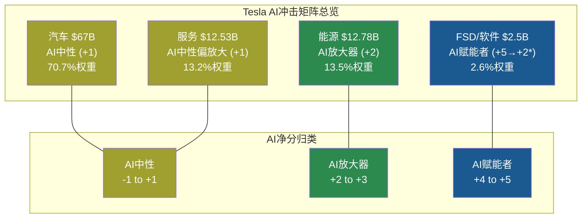
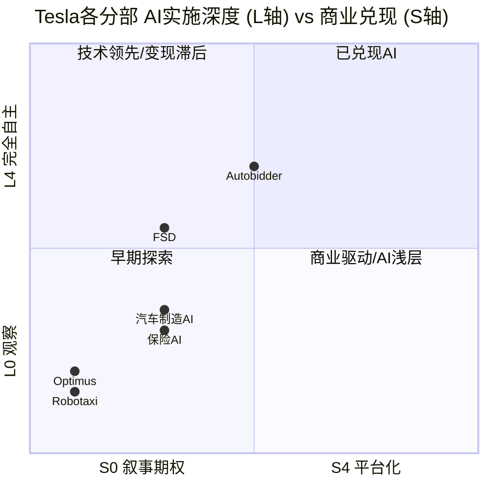
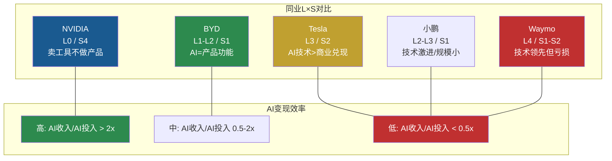
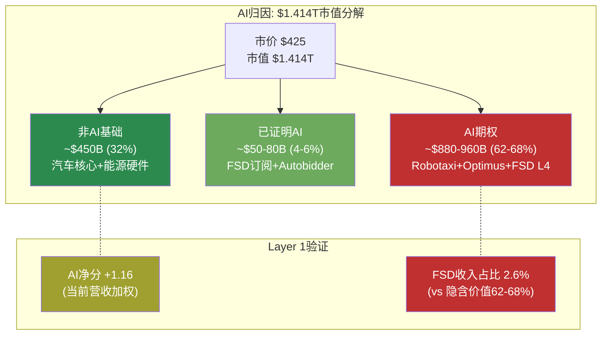

# Phase 3.5 — AI深度评估: 分部级冲击矩阵 + L×S定位 + AI价格含义

> **Agent C产出** | Phase 3.5 | 方法论: v9.0扬长避短 + 发现系统(可能性宽度9/10)
> **核心声明**: 本章评估"AI如何改变Tesla每个业务分部的竞争格局"，不做投资建议。所有定量数字服务于结构性理解，不是预测。
> **零投资建议 | 零目标价 | 零评级 | 零仓位建议**

---

## 7.1 Layer 1: 分部级AI冲击矩阵 (M13)

### 方法论说明

Tesla是一家AI渗透率极不均匀的公司。"AI公司"这个标签掩盖了一个关键事实：**不同分部的AI成熟度、AI依赖度和AI变现程度存在数量级差异**。本节对4个分部(覆盖100%营收)逐一执行5维度评估，然后按营收加权聚合。[硬数据: 分部营收来自Tesla 10-K FY2025]

评分尺度：收入冲击(-5至+5)、成本冲击(-5至+5)、护城河变化(强化/中性/削弱)、竞争格局变化(利好/中性/利空)、时间窗口(1-3yr/3-5yr/5-10yr)。

---

### 分部1: 汽车 ($67B, 70.7%)

Tesla汽车分部的AI关系是间接的——AI不直接卖车，但AI通过FSD提升产品差异化、通过制造优化降低成本、通过软件OTA延长生命周期。问题在于：**竞品也在用AI**。

| 维度 | 评分 | 证据与推导 |
|------|------|-----------|
| **收入冲击** | **+1** | FSD作为增值功能→ASP提升($99/月或$8K一次性)，但覆盖率有限(1.1M/~6M车队=18%付费率)。更重要的是，BYD天神之眼、小鹏XNGP、华为ADS 3.0正在将高阶智驾变成"标配"而非"溢价"——如果智驾成为行业baseline，Tesla的ASP溢价将被侵蚀而非扩大。[硬数据: Tesla 10-K FSD用户数; 合理推断: 竞品智驾定价趋势——BYD高阶智驾在中国已免费标配] |
| **成本冲击** | **+1** | AI视觉质检(Gigafactory产线)、供应链预测优化、Gigacasting模拟仿真均贡献边际效率提升。但核心制造成本(材料60%+、人工15%+)不受AI显著影响。Q4'25毛利率20.12%的改善更多来自Cybertruck亏损收窄和产品组合变化，非AI驱动。[硬数据: Q4'25毛利率20.12%, FMP quarterly; 合理推断: 制造成本结构分析] |
| **护城河变化** | **中性偏削弱** | Tesla的纯视觉FSD数据量(60B+英里)是独特资产，但AI正在让**所有**竞争者的智驾能力快速提升——BYD从零到城市NOA 300+城市只用了18个月。AI同时提升Tesla和竞品的能力，净效果取决于提升速度差。当前证据：Tesla领先但差距在缩小而非扩大。[硬数据: BYD智驾进展, Tesla累计行驶里程; 主观判断: 竞争差距趋势] |
| **竞争格局** | **中性** | AI没有显著改变汽车行业的进入壁垒。汽车制造的核心壁垒仍然是资本密度($10B+建厂)、供应链管理、品牌和分销网络——这些与AI无关。AI改变的是产品差异化维度(从马力/操控→智能化)，但不改变"谁能造车"。[合理推断: 行业结构分析] |
| **时间窗口** | **1-3年(已在发生)** | FSD v14已在路上，竞品智驾快速追赶。AI对汽车分部的影响不是"将来的事"——它正在实时重塑产品竞争力和定价权。[硬数据: FSD v14发布时间线] |

**归类: AI中性(+1)**。AI提升了汽车产品差异化，但同时降低了差异化的独占性。净效果接近中性。汽车分部的AI故事不是"Tesla因AI变强"，而是"整个行业因AI而变，Tesla能否保持领先"。

---

### 分部2: 能源 ($12.78B, 13.5%)

能源分部是Tesla AI变现最成熟的业务——Autobidder已在生产环境中每5分钟自主做出交易决策，管理数GWh级资产。但硬件(Megapack)仍占该分部90%+收入，软件/交易收入占比极小。

| 维度 | 评分 | 证据与推导 |
|------|------|-----------|
| **收入冲击** | **+2** | Autobidder的AI交易算法→更优电力市场定价→客户获得更高ROI→更多公用事业客户选择Tesla整体方案(硬件+软件)。VPP聚合(Powerwall→虚拟电厂)是纯AI驱动的新收入流。但当前收入主要来自Megapack硬件——AI收入可能<$500M/年。[硬数据: Tesla Energy Rev $12.78B, FMP; 合理推断: Autobidder收入占比基于Tesla未单独披露软件收入] |
| **成本冲击** | **+2** | AI预测性维护减少现场服务次数；AI优化Megapack部署选址和配置；电池管理系统AI延长电池寿命(实际衰减<理论衰减)。这些是真实的、可量化的成本优化——但幅度在个位数百分比级别，不是30%+的革命性削减。[合理推断: 基于深挖Q3 Autobidder分析] |
| **护城河变化** | **强化(有限)** | Autobidder数据网络效应存在但不深——电力市场价格数据是公开的(CAISO/PJM/ERCOT)，真正私有的是自有资产运行数据(电池退化曲线、充放电效率)。切换成本中到高(市场适配+控制系统集成需6-12月)。但Fluence IQ、Stem Athena等竞品也在做类似的事。[硬数据: 深挖Q3壁垒检验; 合理推断: 竞品能力评估] |
| **竞争格局** | **利好(边际)** | AI略微提高了能源解决方案的进入壁垒——垂直整合(Megapack+Autobidder+VPP)形成套餐竞争力，纯硬件供应商难以复制。但壁垒的主要来源是规模(46.7 GWh部署)和品牌，不是AI本身。[合理推断: 基于竞争格局分析] |
| **时间窗口** | **1-3年(已在变现)** | Autobidder已运营多年，VPP在扩展。AI对能源分部的影响不是期权——是正在产生收入的资产。[硬数据: Autobidder运营时间] |

**归类: AI放大器(+2)**。AI强化了能源业务的价值主张(从卖硬件→卖整体解决方案)，但核心收入仍然是Megapack硬件。AI是"更好的Megapack销售工具"，不是独立收入引擎。

---

### 分部3: 服务 ($12.53B, 13.2%)

服务分部包含三个子类：充电网络(Supercharger/NACS)、保险(Tesla Insurance)、维修服务。AI在每个子类中扮演不同角色。

| 维度 | 评分 | 证据与推导 |
|------|------|-----------|
| **收入冲击** | **+1** | 保险AI定价→基于实际驾驶行为(Safety Score)定价，Tesla声称事故率低于行业均值。充电网络AI→负荷预测+动态定价优化。但服务收入增长的主要驱动力是**车队规模增长**和**NACS标准采用**(Ford/GM/Rivian接入)，不是AI。AI是锦上添花，不是增长引擎。[合理推断: 服务收入驱动因素拆解] |
| **成本冲击** | **+1** | AI预测性维修减少非计划停机；远程诊断(OTA)减少实体服务中心负担。但服务业务的成本结构是人工密集型(维修技师)和资本密集型(充电桩部署)，AI优化空间有限。[合理推断: 服务成本结构分析] |
| **护城河变化** | **强化(有限)** | Safety Score数据→保险定价优势是Tesla独有的(竞品无法获取实时驾驶行为数据)。充电网络数据→使用模式预测也是独有资产。但保险是高度监管的行业(州级监管)，AI定价优势的变现受限于监管合规速度。[合理推断: 保险行业监管约束] |
| **竞争格局** | **中性** | 充电网络的竞争优势来自NACS标准和物理覆盖密度，不是AI。保险的竞争优势来自数据独占性(只有OEM能获取车辆行为数据)，但其他OEM也在做保险(BYD保险、Rivian保险)。[合理推断: 竞争格局] |
| **时间窗口** | **1-3年** | AI已在保险定价和充电优化中部署。[硬数据: Tesla Insurance Safety Score已运行] |

**归类: AI中性偏放大(+1)**。AI改善了服务质量和效率，但服务分部的增长逻辑是"卖更多车→更多服务需求"，不是"AI创造新服务"。

---

### 分部4: FSD/软件 ($2.5B, 2.6%)

FSD分部是Tesla所有AI叙事的锚点——收入仅占2.6%，但它是Robotaxi($0)、Optimus($0)和"AI公司"估值溢价的技术基础。这是一个**纯AI分部**，评估逻辑与前三个截然不同。

| 维度 | 评分 | 证据与推导 |
|------|------|-----------|
| **收入冲击** | **+5** | FSD是纯软件收入(~90%毛利率)。当前$2.5B(1.1M订阅×$99/月+碳积分)仅是起点——如果FSD从L2+进化到L3/L4，收入模式可能从"辅助驾驶订阅"变成"Robotaxi出行平台提成"，TAM从$2-3B/年跳到$50-200B/年。但这个跳跃需要L4突破+监管批准+规模运营三重条件同时满足。[硬数据: FSD订阅定价, 1.1M用户; 主观判断: Robotaxi TAM估算] |
| **成本冲击** | **-3** | FSD的成本结构是逆向的——越进步越贵。Cortex集群67,000+ H100等效GPU的运营成本估算$500M+/年(电力+折旧+维护)。AI5芯片量产(2027)需要$2-4B额外CapEx。FSD的边际成本(OTA推送)接近零，但研发固定成本极高且在加速。[硬数据: Cortex集群规模, AI5时间线; 合理推断: GPU运营成本估算] |
| **护城河变化** | **强化(显著)** | 60B+英里真实世界行驶数据是当前全球最大的自动驾驶数据集——Waymo约50M英里(差3个数量级)。端到端NN(v14, 10倍参数)需要海量数据训练，Tesla的数据优势形成正反馈：更多数据→更好模型→更多付费用户→更多数据。但: 数据量≠数据质量，且竞品(Waymo)可能用更少但更高质量的数据达到相似效果(LiDAR方案的数据效率更高)。[硬数据: Tesla累计里程, Waymo里程; 合理推断: 数据飞轮分析; 主观判断: 数据量vs质量权衡] |
| **竞争格局** | **利好但双面** | AI提高了自动驾驶的进入壁垒(算力+数据+工程人才需求极高)。但AI也让现有竞争者快速进步——Waymo已在旧金山/洛杉矶商业运营(L4, 有LiDAR), 百度Apollo在中国运营。Tesla领先还是落后取决于"L2+ vs L4"的定义——在消费者辅助驾驶层面Tesla领先，在完全无人驾驶商业运营层面Waymo领先。[硬数据: Waymo商业运营城市数, Apollo运营状态; 合理推断: 竞争定位] |
| **时间窗口** | **3-5年(关键窗口)** | FSD从L2+到L4的跨越需要技术突破(纯视觉ODD天花板, 参见深挖Q1)+监管批准(NHTSA L4商业许可)+规模部署(Cybercab量产)。最乐观时间线: 2027-2028有限L4。但纯视觉方案的共模失效问题(暴雨/浓雾下所有8个摄像头同时退化)是结构性挑战，不是工程优化能解决的。[硬数据: NHTSA 2025指南要求L4感知冗余; 合理推断: 深挖Q1纯视觉物理约束] |

**归类: AI赋能者(+5, 概率加权后+2)**。FSD是纯AI产品，其天花板极高(全球出行平台)但当前兑现极低($2.5B)。概率加权反映了L4实现的不确定性。

---

### 综合冲击矩阵



*注: FSD +5概率加权至+2，反映L4实现概率不确定性

#### 概率加权AI净分计算

```
加权AI净分 = Σ(分部AI净分 × 营收权重)

基线(当前已证明的AI能力):
= (+1 × 70.7%) + (+2 × 13.5%) + (+1 × 13.2%) + (+2 × 2.6%)
= 0.707 + 0.270 + 0.132 + 0.052
= +1.16

乐观(FSD按+5计算):
= (+1 × 70.7%) + (+2 × 13.5%) + (+1 × 13.2%) + (+5 × 2.6%)
= 0.707 + 0.270 + 0.132 + 0.130
= +1.24
```

[合理推断: 加权计算基于FY2025营收结构和上述分部评分]

**核心发现**: 按营收加权，Tesla的AI净分仅为**+1.16至+1.24**——处于"AI中性偏放大"区间，远低于市场将Tesla定价为"AI领导者"的隐含假设。原因很简单：**产生收入的分部(汽车70.7%)受AI影响最小，AI影响最大的分部(FSD 2.6%)几乎不产生收入**。Tesla的AI故事是一个关于未来的故事——当前的财务现实中，AI的净贡献接近中性。

---

## 7.2 Layer 2: AI实施深度 L×S定位

### L×S坐标定位



| 分部/功能 | L轴 | S轴 | 含义 |
|-----------|-----|-----|------|
| **FSD** | L2-L3(受控自动化→有限自主) | S1(早期变现: $99/月, 覆盖率18%) | AI已变现但商业规模有限。L2是当前法律认定级别(驾驶员必须保持注意力)，功能上接近L3(城市NOA)但监管滞后。[硬数据: SAE L2分类; Tesla FSD用户协议要求驾驶员保持注意力] |
| **Autobidder** | L3(自主运营: 每5分钟自动出价) | S2(规模化: 管理数GWh资产) | **Tesla AI商业兑现最成熟的产品**。AI在生产环境中独立做出交易决策，人类仅监控和设定参数。但收入贡献不透明(Tesla未单独披露)。[硬数据: Autobidder运营模式; 合理推断: 收入归类在能源分部中] |
| **汽车制造AI** | L1-L2(AI辅助质检+工艺优化) | S1(早期变现: 效率提升) | AI在制造中的角色是辅助性的——视觉质检、供应链预测、Gigacasting模拟。提升效率但非革命性改变。[合理推断: 基于Tesla制造流程公开信息] |
| **保险/Safety Score** | L2(基于规则的AI定价) | S1(早期变现: 有限州覆盖) | AI根据驾驶行为数据自动计算保费。覆盖州有限(12州)，规模化受监管约束。[硬数据: Tesla Insurance覆盖范围] |
| **Optimus** | L0-L1(观察→初步控制) | S0(叙事期权: $0收入) | FSD技术向人形机器人的迁移。Gen3刚启动装配(2026.01)，BOM ~$55K远高于$20-30K售价目标。**最大的AI叙事 vs 最少的AI兑现**。[硬数据: Optimus Gen3状态, BOM估算; 合理推断: Standard Bots对比] |
| **Robotaxi/Cybercab** | L0-L1(概念→初步测试) | S0(叙事期权: $0收入) | Austin试点2026年中启动(有人监控)，真正的L4无人运营时间表不确定。商业化需要FSD L4+监管批准+Cybercab量产三重条件。[硬数据: Tesla Robotaxi Austin试点计划; 主观判断: 时间线评估] |

### 五不变量检验

对Tesla的AI叙事执行5项"真实性检验":

| # | 不变量 | Tesla通过? | 证据 |
|---|--------|-----------|------|
| 1 | **可衡量的AI相关收入增长** | **部分通过** | FSD订阅从0→$2.5B(含碳积分)是真实增长。但无法将汽车/能源收入中的AI贡献分离出来——Tesla不披露"AI驱动的增量收入"。Autobidder的AI交易溢价收入不透明。[硬数据: FSD收入; 合理推断: 归因困难] |
| 2 | **AI投入的明确ROI时间线** | **未通过** | R&D $6.41B中估算40%($2.6B)投向FSD/AI，加上Cortex运营成本$500M+/年。AI总投入~$3B+/年 vs AI直接收入~$2.5B/年——当前ROI<1。管理层未给出ROI目标或时间线，仅称"FSD是未来最大收入来源"。[合理推断: AI投入vs收入粗略估算; 主观判断: ROI框架] |
| 3 | **AI能力的第三方验证** | **部分通过** | 消费者报告2025年将FSD评为"最佳辅助驾驶系统"但注明"不是自动驾驶"。NHTSA未授予任何L3/L4认证。对比: Waymo已获NHTSA L4豁免并在多城市商业运营。Tesla的AI能力在L2级别得到验证，在L4级别未被验证。[硬数据: Consumer Reports评级, NHTSA认证状态; 合理推断: 第三方验证层级] |
| 4 | **AI竞争优势: 数据壁垒 vs 算法壁垒** | **数据壁垒为主** | 60B+英里数据集是Tesla的核心AI资产。但: (a)数据量≠数据质量(Waymo用结构化LiDAR数据+模拟环境可能更高效), (b)端到端NN架构(transformer)并非专有技术(开源模型如UniAD已复现类似架构), (c)算力已商品化(NVIDIA向所有客户出售相同GPU)。Tesla的壁垒是**数据量+部署规模**，不是**算法独占性**。[硬数据: Tesla数据量, UniAD开源架构; 合理推断: 壁垒类型分析] |
| 5 | **AI叙事与CapEx模式一致** | **通过** | FY2025 CapEx $8.53B + FY2026指引">$20B"——资本支出在加速，与"全力押注AI/Robotaxi/Optimus"的叙事完全一致。Dojo关闭→重新配置到Cortex(NVIDIA GPU集群)说明Tesla在修正AI执行路径而非放弃AI战略。[硬数据: Tesla CapEx, FY2026指引; 合理推断: 战略一致性评估] |

**五不变量结果: 2.5/5通过**。Tesla的AI叙事在资本承诺(#5)和产品部署(#1部分)层面有实质支撑，但在ROI验证(#2)、外部认证(#3)和算法壁垒(#4)层面存在显著缺口。对于一家被按"AI领导者"定价的公司，2.5/5的通过率值得关注。

### 同业L×S对比

| 公司 | 最高L | 最高S | L-S差 | 含义 |
|------|------|------|-------|------|
| **Tesla** | L3(Autobidder) | S2(能源规模化) | **L>S** | AI技术深度高于商业兑现——大量AI能力尚在变现前期(FSD L2仅18%付费率，Robotaxi/Optimus零收入) |
| **Waymo** | L4(完全自主) | S1-S2(多城市运营但亏损) | **L>>S** | AI技术最深但商业化最慢——L4已实现但单位经济学未证明(每英里成本仍高于人类司机) |
| **BYD** | L1-L2(智驾辅助) | S1(标配智驾→间接变现) | **L≈S** | AI作为汽车功能的一部分同步变现，不追求L4。策略: AI是产品feature，不是公司identity |
| **小鹏** | L2-L3(XNGP城市领航) | S1(智驾订阅有限) | **L>S** | 与Tesla类似的技术路线(端到端NN)但规模小10x+。AI策略激进但资源有限 |
| **NVIDIA** | L0(不做AI产品) | S4(AI平台化: GPU+CUDA) | **L<<S** | 不做自动驾驶但卖自动驾驶工具链。AI商业兑现最高(数据中心Rev $115B+)但自身AI实施为零 |



**核心洞察**: Tesla的L×S定位揭示了一个结构性矛盾——**AI技术深度(L3)在汽车行业中领先，但AI商业兑现效率(S2/有限)在同业中并不突出**。BYD以更低的AI技术深度(L1-L2)实现了更高效的商业整合(AI=标配功能→销量驱动→间接变现)。Waymo以更高的技术深度(L4)但更低的商业效率运营。Tesla位于中间——既不是技术最领先的(Waymo L4)，也不是商业化最高效的(NVIDIA S4/BYD S1)。

---

## 7.3 Layer 3: AI对价格含义的影响

### Phase 2 Reverse DCF回顾 (数据锚定)

[硬数据: 以下来自P2_agentA_reverse_dcf.md]

- 市价$425 / 市值$1.414T
- 隐含10年收入CAGR: ~21%
- 隐含FY2035终端收入: ~$630B
- 隐含FY2035终端营业利润率: ~22%
- 隐含FY2035终端FCF: ~$82B
- "已证明层"隐含价值: $250-400B (~23%)
- "信仰层"隐含价值: $300-600B (~42%)
- FSD成功(L4规模运营)的隐含概率: ~35-45%

### AI归因分析: $1.414T市值中有多少依赖AI兑现?

从Layer 1的分部评估出发，逆推市值中的AI依赖度:

**步骤1: 识别AI依赖型收入**

| 业务线 | FY2035隐含收入(Reverse DCF) | AI依赖度 | AI依赖收入 |
|--------|---------------------------|---------|-----------|
| 汽车核心 | ~$250B | 低(~10%) | ~$25B(FSD增值部分) |
| 能源/储能 | ~$100B | 中(~25%) | ~$25B(Autobidder溢价) |
| FSD/Robotaxi | ~$160B | 极高(~95%) | ~$152B(几乎全部AI驱动) |
| Optimus | ~$120B | 极高(~90%) | ~$108B(物理AI=核心技术) |
| **合计** | **~$630B** | — | **~$310B(49%)** |

[合理推断: FY2035营收构成来自P2 Agent A §2.3的拆解; AI依赖度为基于Layer 1分部评估的估算]

**步骤2: AI依赖型利润率**

AI依赖型收入不仅占49%的FY2035隐含收入，而且占**更高比例的利润**——因为FSD/Robotaxi的隐含利润率(~40%)远高于汽车核心(~12%):

```
AI依赖利润 = $25B×10% + $25B×18% + $152B×40% + $108B×25%
           = $2.5B + $4.5B + $60.8B + $27.0B
           = ~$94.8B

总隐含利润 = $630B × 22% = ~$138.6B

AI依赖利润占比 = $94.8B / $138.6B = ~68%
```

[合理推断: 利润率假设来自P2 Agent A §2.2的混合利润率计算; 这是市场隐含假设的翻译，不是预测]

**步骤3: AI依赖型市值**

如果AI依赖型利润占隐含总利润的~68%，且终端估值方法(永续增长模型)对利润是线性的:

```
AI依赖型市值 ≈ $1.414T × 68% ≈ ~$960B
非AI市值 ≈ $1.414T × 32% ≈ ~$450B
```

[合理推断: 线性比例近似，实际上AI分部可能获得更高倍数(增长溢价)，使AI依赖型市值占比更高]

### AI调整后隐含假设对比

| 假设维度 | 基线(当前已证明的AI: L2+能源L3) | AI突破(FSD L4+Optimus规模化) | 差额 |
|---------|-------------------------------|----------------------------|------|
| FY2035收入 | ~$200-250B(汽车温和增长+能源高增长) | ~$630B(含Robotaxi+Optimus) | **$380-430B = 全部AI驱动** |
| 营业利润率 | ~10-13%(汽车+能源自然天花板) | ~22%(FSD/Robotaxi高毛利拉升) | **+9-12pp = AI结构性改善** |
| 隐含市值 | ~$300-450B(传统汽车+能源估值) | ~$1,414B(当前市价) | **$960B-1,110B = AI期权定价** |
| 10年收入CAGR | ~10-12%(可比: BYD/丰田级别) | ~21%(可比: 仅Amazon做到过) | **+9-11pp = AI增速差** |

[合理推断: 基线情景来自P2 Agent C情景A(进化汽车商+能源成功); AI突破情景来自P2 Agent A Reverse DCF隐含假设]



### 关键结构性发现

**发现1: AI贡献的"倒金字塔"**

Tesla的AI故事呈现一个倒金字塔结构——当前AI收入占比(2.6%)极小，但隐含AI期权价值占市值的62-68%。这意味着:

- 每$1的FSD当前收入，市场赋予了~$380-400的市值
- 相比之下，每$1的汽车核心收入，市场赋予了~$4-6的市值
- FSD/AI的隐含P/S倍数是汽车核心的**60-100倍**

[合理推断: 基于上述分解计算; 这种倍数差异本身不是"对"或"错"——Amazon Web Services在2014年也有类似的极端倍数差异]

**发现2: L2→L4的跨越是$960B的赌注**

Layer 2的L×S分析显示，Tesla当前AI实施的最高水平是L3(Autobidder自主交易)和L2-L3(FSD受控自动化)。但市值中~$960B的价值依赖于FSD从L2→L4的跨越。

这个跨越需要:

| 条件 | 当前状态 | 缺口 |
|------|---------|------|
| **纯视觉L4技术验证** | FSD v14 L2+(端到端NN, 城市NOA) | 共模失效问题未解(暴雨/浓雾/强逆光)。NHTSA要求L4单一传感器故障时仍安全运行——8个摄像头共享失效模式不满足此要求 [硬数据: NHTSA 2025指南; 合理推断: 深挖Q1分析] |
| **监管L4商业许可** | 零(Tesla无任何L4许可) | Waymo已获多州L4许可。Tesla Austin试点(2026)是有人监控的，非L4 [硬数据: NHTSA认证状态] |
| **Cybercab量产** | 设计阶段(Austin专线) | 量产需要新工厂+新供应链+成本控制($30K以下), 时间线不确定 [合理推断: Cybercab时间线] |
| **单位经济学验证** | 未证明 | Waymo单次乘车成本仍高于Uber+人类司机。Tesla Robotaxi需要证明无人运营的单位经济学 [主观判断: 单位经济学推测] |

[合理推断: 条件清单基于Layer 1-2的系统性分析]

**发现3: 已证明的AI vs 被定价的AI之间的鸿沟**

| 指标 | 已证明的AI | 被定价的AI | 倍数 |
|------|-----------|-----------|------|
| 年收入 | ~$2.5B(FSD)+小部分Autobidder | 隐含~$310B(FY2035) | **124x** |
| 利润 | ~$1-2B(FSD高毛利率但规模小) | 隐含~$95B(FY2035) | **47-95x** |
| 市值归因 | ~$50-80B(4-6%) | ~$960B(68%) | **12-19x** |
| AI实施级别 | L2-L3(有限自动化) | L4(完全自主) | **1-2级跨越** |

[合理推断: 所有数字来自Layer 1-2分析和P2 Reverse DCF]

这个鸿沟不是Tesla独有的——2020年的Amazon也有类似的AWS增长预期vs当时AWS实际规模的巨大差异，而AWS最终证明了预期。问题不是鸿沟存在(高增长公司总有)，而是**跨越鸿沟需要什么条件**以及**这些条件同时满足的复杂度**。

---

### 本章小结

Layer 1-3的分析揭示了Tesla AI叙事的三层结构:

1. **表层(市场叙事)**: Tesla是AI领导者——FSD/Robotaxi/Optimus构成万亿级AI平台
2. **中层(当前财务)**: AI直接贡献仅$2.5B收入(2.6%)，营收加权AI净分+1.16(中性)
3. **深层(估值含义)**: 市值中62-68%(~$960B)依赖AI从L2→L4的跨越，这需要技术/监管/制造/经济学四重条件同时满足

这三层之间不是"矛盾"——它们描述的是同一家公司在不同时间尺度上的不同面貌。Layer 1描述今天的Tesla(AI中性)，市场定价描述2035年的Tesla(AI赋能)。投资者面对的核心问题不是"Tesla有没有AI"(有)，而是**"AI从2.6%→49%收入占比、从L2→L4、从+1.16→+3.0+ AI净分的路径是什么，需要多久，有多少种可能的中断方式"**。

本章不回答这个问题——因为这是A型不确定性(类别不确定性)的本质。但它将问题从模糊的"Tesla是不是AI公司"转化为可检验的结构性框架，使投资者能够追踪具体的里程碑(L轴进展、S轴变现、五不变量通过率)来形成自己的判断。

---

*[本章完 — P3.5 Agent C: AI深度评估]*
*所有分析基于公开数据和结构化推导，不代表投资建议*
