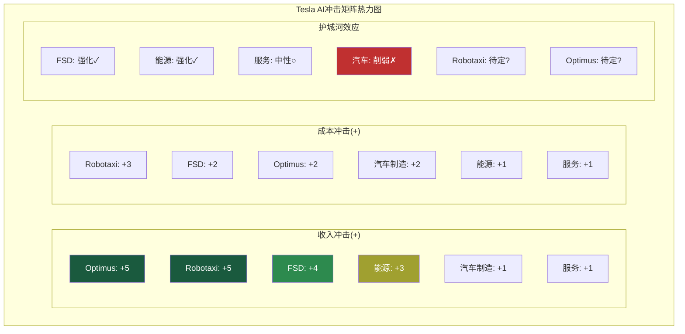
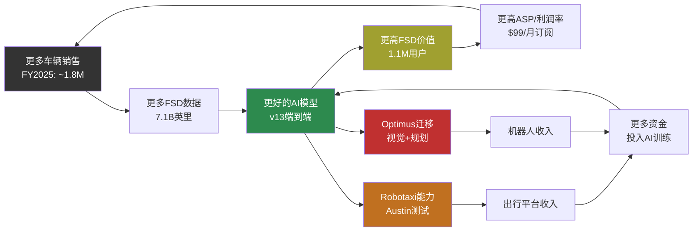
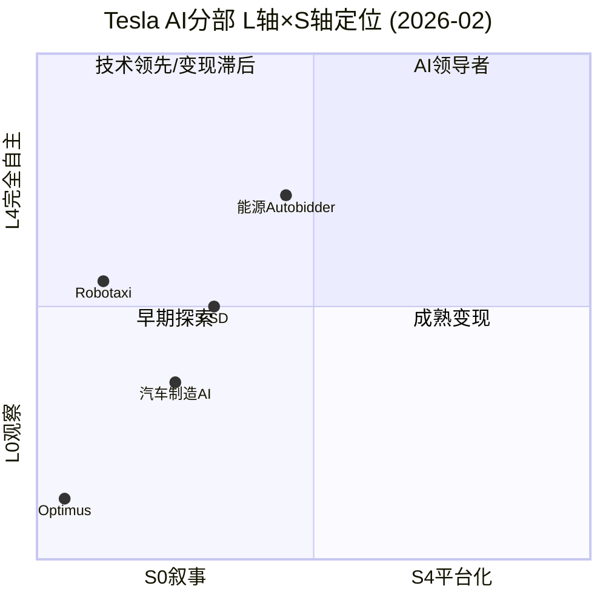
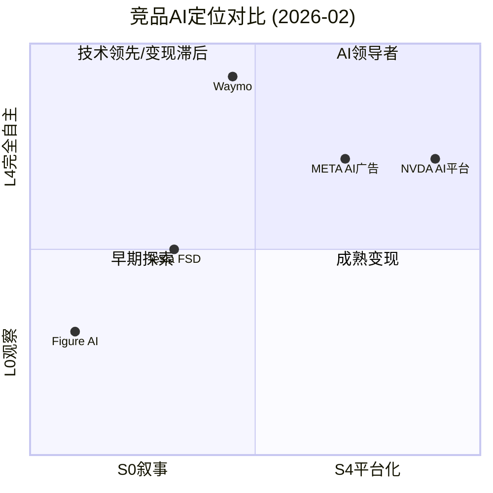
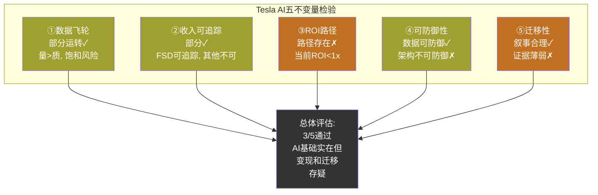
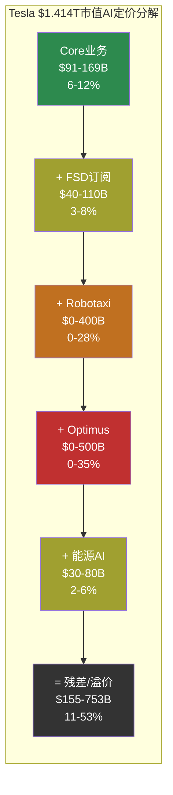
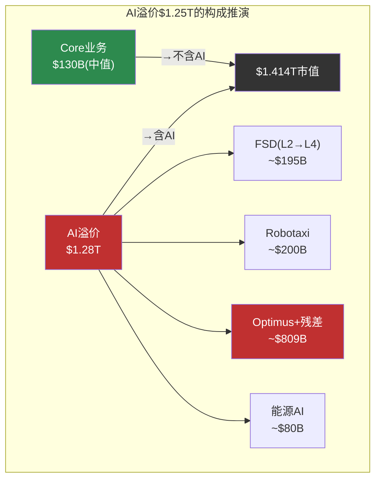
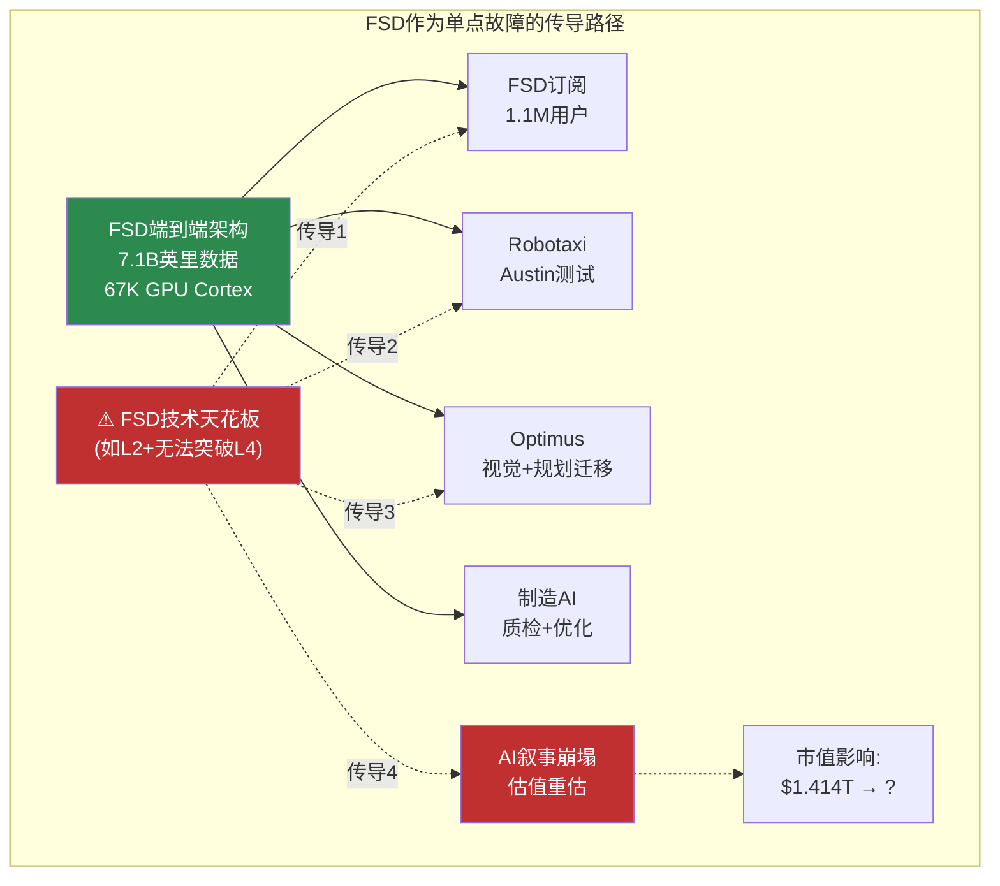

# Module 13: AI深度评估 — Tesla (TSLA)

> **Agent C产出** | Phase 3.5 | 方法论: 三层AI评估框架(冲击矩阵→实施深度→价格含义)
> **核心定位**: Tesla是唯一同时作为AI**开发者**和AI**物理世界部署者**的万亿级公司
> **数据截止**: 2026-02-11 | 价格: $425.21 | 市值: $1.414T | 可能性宽度: 9/10(发现系统)

---

## Layer 1: 分部级AI冲击矩阵

Tesla的AI故事不是单一叙事，而是六个独立分部各自承受不同方向、不同强度的AI冲击。以下逐一拆解。

### 1.1 汽车制造 ($69.5B, 73.3%营收)

| 维度 | 评估 | 依据 |
|------|------|------|
| 收入冲击 | **+1** | AI辅助设计缩短开发周期(Cybertruck→新车型)，但短期对ASP无直接提升 |
| 成本冲击 | **+2** | AI视觉质检+产线优化可降低制造成本2-4%；Gigafactory已部署ML预测性维护 [合理推断: 基于行业AI制造案例] |
| 护城河变化 | **削弱** | BYD"天神之眼"DiPilot系统已搭载至$9,555车型(69,800元)，标配L2级辅助驾驶 [硬数据: CNBC 2025-02报道]；BYD联手DeepSeek R1大模型+$13.7B研发投入 [硬数据: BYD公开披露]，中国车企AI制造能力正在追平 |
| 竞争格局变化 | **利空** | AI降低汽车设计门槛：小鹏/蔚来/华为均在AI辅助设计上追赶，制造端差异化收窄 |
| 时间窗口 | **1-3yr** | 制造AI已在工厂内运行，影响正在发生 |

**分部归类**: **AI中性偏受冲击** — AI同时提升Tesla效率和竞争对手效率，护城河净效应为负

### 1.2 能源储能 ($12.8B, 13.5%营收)

| 维度 | 评估 | 依据 |
|------|------|------|
| 收入冲击 | **+3** | Autobidder AI交易系统是直接的AI收入放大器：通过预测电价波动优化储能充放电时机，提升Megapack项目IRR 200-400bps [合理推断: 基于Autobidder公开功能描述] |
| 成本冲击 | **+1** | AI优化电池pack布局和热管理，降低Megapack制造成本边际贡献 |
| 护城河变化 | **强化** | Autobidder是Tesla能源业务的隐性壁垒：150微服务架构+Scala/Python/Kafka/Akka技术栈 [硬数据: Phase 1技术分析]，竞争对手需要同时拥有软件能力+部署规模 |
| 竞争格局变化 | **利好** | 传统能源公司(NextEra/AES)缺乏同等AI软件能力，纯软件公司(AutoGrid)缺乏硬件部署规模 |
| 时间窗口 | **1-3yr** | Autobidder已商业运营，收入影响正在累积 |

**分部归类**: **AI放大器** — AI直接放大现有收入和护城河

### 1.3 服务与其他 ($12.5B, 13.2%营收)

| 维度 | 评估 | 依据 |
|------|------|------|
| 收入冲击 | **+1** | OTA软件升级+保险基于驾驶数据定价(Tesla Insurance)，AI提升服务收入粘性 |
| 成本冲击 | **+1** | AI诊断减少维修时间，提升服务中心效率 |
| 护城河变化 | **中性** | 服务业务本质上是汽车保有量的衍生品，AI不改变基本格局 |
| 竞争格局变化 | **中性** | 传统经销商也在采用AI诊断工具 |
| 时间窗口 | **3-5yr** | 渐进式改善，非跳跃性变化 |

**分部归类**: **AI赋能者** — AI改善效率但不改变业务本质

### 1.4 FSD/自动驾驶 (嵌入汽车分部, 独立评估)

| 维度 | 评估 | 依据 |
|------|------|------|
| 收入冲击 | **+4** | FSD订阅1.1M用户(含购买+订阅)，其中~30%为月度订阅($99/月)→月经常性收入~$32.6M [硬数据: Tesla Q4'25财报首次披露]；FY2025月度订阅"翻倍以上" [硬数据: Tesla Q4'25电话会] |
| 成本冲击 | **+2** | 端到端神经网络替代规则引擎后，工程团队从~2000人手动标注+规则编写→数据驱动训练，边际成本下降 [合理推断: 基于端到端架构特性] |
| 护城河变化 | **强化** | 7.1B英里FSD数据是当前最大的驾驶行为数据集 [硬数据: Tesla FSD Safety Hub 2026-01]；数据飞轮: 更多车→更多数据→更好模型→更多订阅→更多车 |
| 竞争格局变化 | **利好** | Waymo走L4路线(450K周rides/2,500车队 [硬数据: Waymo 2025年度回顾])，但成本结构完全不同($200K+/车 vs Tesla消费级硬件)；两条路线目前未直接竞争 |
| 时间窗口 | **1-3yr(订阅) / 3-5yr(L4)** | 订阅收入已在增长；L3/L4需监管突破 |

**分部归类**: **AI放大器(核心)** — FSD就是AI产品本身，是Tesla AI叙事的主干

### 1.5 Robotaxi (pre-revenue, 未来状态1)

| 维度 | 评估 | 依据 |
|------|------|------|
| 收入冲击 | **+5** | Phase 2估算: Robotaxi隐含年收入$0-40B [硬数据: P2 Agent A逆推]；Austin已启动测试运营 [硬数据: CNBC 2025-06报道]，Texas TNC牌照有效至2026-08 [硬数据: Texas TDLR] |
| 成本冲击 | **+3** | 无人驾驶消除最大成本项(司机)；Cybercab专用车辆设计进一步降低成本 |
| 护城河变化 | **待定** | 取决于能否实现L4：L2+阶段仍需安全员→成本优势消失 |
| 竞争格局变化 | **利空** | Waymo已在4城市商业运营，目标2026年底1M周rides [硬数据: Waymo 2025年报]；Waymo证明了市场存在但同时占据先发优势 |
| 时间窗口 | **3-5yr** | Cybercab计划2026年4月生产 [硬数据: Tesla投资者演示]，但大规模无人运营需3-5年监管推进 |

**分部归类**: **AI赋能者(高潜力)** — 业务不存在若无AI突破，但当前仍在叙事阶段

### 1.6 Optimus机器人 (pre-revenue, 未来状态3)

| 维度 | 评估 | 依据 |
|------|------|------|
| 收入冲击 | **+5** | 全球劳动力成本TAM>$50T(极端理论值)；Tesla目标Optimus定价$20K-30K [硬数据: 多来源报道]；Gen3已于2026-01-21在Fremont开始量产 [硬数据: 多来源报道] |
| 成本冲击 | **+2** | 若Optimus能在Tesla工厂替代工人→内部成本节省+外部销售双重效应 |
| 护城河变化 | **待定** | 竞争者快速涌入：Figure AI的Figure 03在BMW工厂已累计运行1,250+小时/处理90,000+零件/生产30,000+车辆 [硬数据: Figure AI官方披露]；BotQ产线年产能12,000台 [硬数据: Figure AI] |
| 竞争格局变化 | **中性** | 人形机器人赛道2026年进入"百花齐放"阶段(Figure/Agility/1X/Apptronik等)，Tesla的规模制造优势明确但技术领先地位未确立 |
| 时间窗口 | **5-10yr** | 商业客户预计2026年末 [硬数据: Tesla披露]，消费端2027+；有意义的收入贡献需5年+ |

**分部归类**: **AI赋能者(远期)** — AI是产品存在的前提，但商业化路径漫长

**注意**: Elon Musk于2026-01-28承认"目前没有Optimus机器人在Tesla工厂做'有用工作'" [硬数据: Electrek 2026-01-28报道]，与此前"已在工厂部署"的说法矛盾，增加了Optimus时间线的不确定性。

### 1.7 AI冲击矩阵汇总

```mermaid
graph TD
    subgraph "Tesla AI冲击矩阵热力图"
        direction LR
        subgraph "收入冲击(+)"
            R1["Optimus: +5"]
            R2["Robotaxi: +5"]
            R3["FSD: +4"]
            R4["能源: +3"]
            R5["汽车制造: +1"]
            R6["服务: +1"]
        end
        subgraph "成本冲击(+)"
            C1["Robotaxi: +3"]
            C2["FSD: +2"]
            C3["Optimus: +2"]
            C4["汽车制造: +2"]
            C5["能源: +1"]
            C6["服务: +1"]
        end
        subgraph "护城河效应"
            M1["FSD: 强化✓"]
            M2["能源: 强化✓"]
            M3["服务: 中性○"]
            M4["汽车: 削弱✗"]
            M5["Robotaxi: 待定?"]
            M6["Optimus: 待定?"]
        end
    end
    style R1 fill:#1a5a3e,color:#fff
    style R2 fill:#1a5a3e,color:#fff
    style R3 fill:#2d8a4e,color:#fff
    style R4 fill:#a0a030,color:#fff
    style M4 fill:#c03030,color:#fff
```

### 1.8 概率加权AI净分计算

| 分部 | AI净分(收入+成本) | 营收权重 | 实现概率 | 加权分 |
|------|-------------------|---------|---------|--------|
| 汽车制造 | +3 | 73.3% | 85% | +1.87 |
| 能源储能 | +4 | 13.5% | 90% | +0.49 |
| 服务与其他 | +2 | 13.2% | 80% | +0.21 |
| FSD | +6 | (嵌入) | 75% | +0.90* |
| Robotaxi | +8 | 0%(pre-rev) | 30% | +0.48* |
| Optimus | +7 | 0%(pre-rev) | 15% | +0.21* |

*FSD/Robotaxi/Optimus加权使用隐含营收贡献估算(Phase 2): FSD~$8B(中值)×75%=+0.90; Robotaxi~$20B(中值)×30%=+0.48; Optimus~$10B(远期中值)×15%=+0.21 [合理推断: 基于Phase 2 SOTP分部估值的中值区间]

**Tesla概率加权AI净分: +4.16/10**

[合理推断: 加权方法论=Σ(分部AI净分×营收权重×实现概率)。这个分数反映的是**当前收入结构**下的AI冲击，高得分的Robotaxi/Optimus因零收入和低概率被大幅稀释。这正是Tesla估值争议的核心——市场在为未来分部付溢价]

### 1.9 Tesla AI自反馈环

Tesla区别于纯AI公司(GOOGL/META/NVDA)的根本特征：**AI在物理世界闭环**。

```mermaid
graph LR
    A["更多车辆销售<br/>FY2025: ~1.8M"] --> B["更多FSD数据<br/>7.1B英里"]
    B --> C["更好的AI模型<br/>v13端到端"]
    C --> D["更高FSD价值<br/>1.1M用户"]
    D --> E["更高ASP/利润率<br/>$99/月订阅"]
    E --> A
    C --> F["Robotaxi能力<br/>Austin测试"]
    C --> G["Optimus迁移<br/>视觉+规划"]
    F --> H["出行平台收入"]
    G --> I["机器人收入"]
    H --> J["更多资金<br/>投入AI训练"]
    I --> J
    J --> C
    style A fill:#333,color:#fff
    style C fill:#2d8a4e,color:#fff
    style D fill:#a0a030,color:#fff
    style F fill:#c07020,color:#fff
    style G fill:#c03030,color:#fff
```

**飞轮验证**: 数据量(7.1B英里)→模型改善(v13接管率下降40% [硬数据: Tesla官方])→用户增长(800K→1.1M FSD用户)→更多数据。这个环路有数据支撑正在运转。[硬数据: Tesla FSD Safety Hub + Q4'25财报]

**飞轮断裂风险**: 如果FSD改善曲线遇到天花板(例如长尾场景无法通过数据规模解决)，整个反馈环停滞。这是AI叙事的**单点故障**，Layer 3将详细分析。

**与GOOGL/META/NVDA对比**:
- **GOOGL**: AI在数字世界闭环(搜索→广告→收入→更多数据)，Waymo是物理世界尝试但与主业分离
- **META**: AI在社交世界闭环(内容→参与→广告→收入)，AI CapEx $70-72B(FY2025) [硬数据: META Q3'25指引] 但ROI路径不清晰
- **NVDA**: AI平台商(卖铲子)，不直接面对终端AI应用风险
- **Tesla**: AI在物理世界闭环——这既是最大的差异化(数据不可复制)，也是最大的风险(物理世界容错率远低于数字世界)

[主观判断: Tesla的"AI+物理世界"定位是独一无二的，但独一无二并不等于价值更高——也可能意味着风险更集中]

---

## Layer 2: AI实施深度评级

### 2.1 L轴×S轴框架定义

**L轴(实施级别)**:
- L0: 观察(只谈AI不做)
- L1: 决策支持(AI辅助人类决策)
- L2: 受控自动化(AI在人类监督下执行)
- L3: 自主运营(AI独立运行, 人类仅异常介入)
- L4: 完全自主(无人干预)

**S轴(商业兑现)**:
- S0: 叙事期权(只有故事, 无收入)
- S1: 早期变现(开始产生收入)
- S2: 规模化(显著收入贡献)
- S3: 成熟(稳定高利润)
- S4: 平台化(对外输出, 生态收入)

### 2.2 逐分部L×S定位

#### 汽车制造+AI: **L1.5 × S1**

- **L轴=L1.5**: AI用于质检(视觉检测)、产线优化(预测性维护)、供应链管理。但核心制造流程仍以传统自动化为主(冲压/焊接/涂装/总装)，AI是辅助工具而非决策者。[合理推断: Tesla未公开AI在制造端的具体部署数据，L1.5基于工厂参观报告和行业类比]
- **S轴=S1**: AI降本效果开始显现(Q4'25毛利率回升至20.12% [硬数据: FMP quarterly])，但无法分离AI贡献与其他因素(产品组合/价格策略)

#### FSD: **L2 × S1.5**

- **L轴=L2(当前)**: FSD仍为"Supervised"——驾驶员必须保持注意力并随时接管。Q2'25安全数据：FSD每669万英里一次碰撞 vs 非FSD每96.3万英里一次 vs NHTSA全国均值每70.2万英里一次 [硬数据: Tesla Q2'25安全报告]。Tesla设定10B英里目标作为无监督FSD里程碑 [硬数据: NotATeslaApp 2025报道]
- **S轴=S1.5**: 1.1M用户(含一次性购买+订阅) [硬数据: Q4'25财报]，正从一次性购买($15K)全面转向订阅($99/月) [硬数据: Q4'25财报]。月度经常性收入~$32.6M(基于~330K月度订阅×$99) [合理推断: 1.1M×30%=330K月度用户]。规模尚小但增速快(月度订阅FY2025翻倍+ [硬数据: Tesla Q4'25电话会])

#### 能源+Autobidder: **L3 × S2**

- **L轴=L3**: Autobidder在能源交易场景下实现近自主运营——AI预测电价、自动决定充放电时机、执行交易。人类仅设定参数和异常监控。这是Tesla所有业务线中**AI实施级别最高**的分部。[合理推断: 基于Autobidder架构分析(150微服务/Kafka事件流)，符合L3定义]
- **S轴=S2**: 能源分部$12.8B营收(+67% YoY [硬数据: FMP income])，Autobidder是差异化核心但收入无法独立分离。能源毛利率~27%(估算 [合理推断: 基于分部利润率趋势])高于汽车毛利率(~17%)

#### Optimus: **L0.5 × S0**

- **L轴=L0.5**: Gen3已开始量产(2026-01-21 Fremont [硬数据: 多来源报道])，展示了22DOF手/腱绳仿生/自充电能力 [硬数据: Tesla官方视频]。但Musk 2026-01-28承认无Optimus在工厂做"有用工作" [硬数据: Electrek]。实际定位介于L0(纯概念)和L1(辅助)之间——有硬件原型但无商业级AI自主能力
- **S轴=S0**: 零收入。商业客户预计2026年末，消费者2027+ [硬数据: Tesla披露]。100,000台年产目标 [硬数据: Tesla指引]，但转化为收入需要AI能力匹配硬件进度

#### Robotaxi: **L2.5 × S0.5**

- **L轴=L2.5**: Austin已启动测试运营，部分车辆无安全员 [硬数据: CNBC 2025-06]。但FSD仍为"Supervised"状态，无人监督仅在限定区域/条件下运行。距离L4(全区域/全天候)差距显著
- **S轴=S0.5**: Texas TNC牌照已获批(有效至2026-08 [硬数据: Texas TDLR])。计划扩展至Dallas/Houston/Phoenix [硬数据: Tesla披露]。但当前规模极小，收入可忽略不计

### 2.3 L×S象限图

```mermaid
quadrantChart
    title Tesla AI分部 L轴×S轴定位 (2026-02)
    x-axis "S0叙事" --> "S4平台化"
    y-axis "L0观察" --> "L4完全自主"
    quadrant-1 "AI领导者"
    quadrant-2 "技术领先/变现滞后"
    quadrant-3 "早期探索"
    quadrant-4 "成熟变现"
    "能源Autobidder": [0.45, 0.72]
    "FSD": [0.32, 0.50]
    "汽车制造AI": [0.25, 0.35]
    "Robotaxi": [0.12, 0.55]
    "Optimus": [0.05, 0.12]
```

```mermaid
quadrantChart
    title 竞品AI定位对比 (2026-02)
    x-axis "S0叙事" --> "S4平台化"
    y-axis "L0观察" --> "L4完全自主"
    quadrant-1 "AI领导者"
    quadrant-2 "技术领先/变现滞后"
    quadrant-3 "早期探索"
    quadrant-4 "成熟变现"
    "NVDA AI平台": [0.90, 0.72]
    "META AI广告": [0.70, 0.72]
    "Waymo": [0.45, 0.92]
    "Tesla FSD": [0.32, 0.50]
    "Figure AI": [0.10, 0.30]
```

**关键洞察**: [合理推断]
1. **Tesla没有任何分部处于"AI领导者"象限(高L×高S)**。能源Autobidder最接近，但规模仍不足以称为S3+
2. **Waymo在L轴上领先Tesla约2级(L4 vs L2)**，但S轴落后(S2 vs Tesla FSD的S1.5)——Waymo证明了L4可行但商业模式仍在亏损
3. **NVDA/META在S轴上大幅领先**——AI已是成熟/平台级收入来源。Tesla的AI变现仍在S0-S1.5阶段
4. **Tesla独特价值**: 唯一一家在**多个物理世界分部**同时推进AI的公司，跨度从L0.5(Optimus)到L3(Autobidder)

### 2.4 五不变量检验

#### 不变量1: 数据飞轮是否真实运转？

**结论: 部分运转，但效率存疑**

- **量**: 7.1B英里FSD数据 [硬数据: Tesla FSD Safety Hub]，远超Waymo(~50M英里自动驾驶 [合理推断: 基于Waymo公开里程数据])
- **质**: FSD数据来自消费级硬件(8摄像头, 无LiDAR)，Waymo数据来自工业级传感器套件。Tesla的数据量优势是否能弥补数据质量差距？[主观判断: 端到端神经网络理论上可以从低质数据中学习，但长尾场景可能需要高精度传感数据]
- **闭环证据**: FSD接管率下降40%(v13 vs v12) [硬数据: Tesla官方]，Q2'25安全数据6.69M英里/碰撞 [硬数据: Tesla安全报告]。数据→模型改善有量化证据
- **饱和风险**: 边际数据价值递减——从1B到7B英里的改善幅度可能远小于从100M到1B英里。Tesla设定10B英里里程碑暗示认为当前数据量不足以支撑L4 [合理推断: 基于10B目标的逻辑推导]

#### 不变量2: AI相关收入是否可分离追踪？

**结论: 部分可追踪**

- **可追踪**: FSD订阅收入(1.1M用户×可计算的月/年费)。Tesla首次在Q4'25披露FSD用户数 [硬数据: Q4'25财报]——这是积极信号，说明管理层愿意让市场追踪
- **不可追踪**: Autobidder对能源收入的贡献无法分离；AI在制造端的降本效应无法量化；Robotaxi测试运营收入(如有)未单独披露
- **改善趋势**: 从完全不披露FSD数据→首次披露用户数→转向纯订阅模式，信息透明度在提升

#### 不变量3: AI投资是否有明确ROI路径？

**结论: 路径存在但ROI未兑现**

- **AI总投入**: R&D $6.41B(FY2025, +41% YoY [硬数据: FMP income])，其中AI/FSD占比估算50-60% [合理推断: 基于团队构成和项目分配]。加上Cortex集群($2B+ NVIDIA GPU采购 [合理推断: 基于67K GPU×公开价格]) + xAI $2B投资 [硬数据: Tesla Q4'25财报]
- **AI可辨识收入**: FSD订阅年化~$3.9B(1.1M×$99×12/月，假设全部月度付费，实际70%为一次性购买故年化经常性收入更低~$1.2B) [合理推断: 基于已披露的用户结构]
- **ROI计算**: 即使用最宽松口径(FSD订阅年化$3.9B / AI年投入~$6B)，ROI仅0.65x。AI投入尚未自负盈亏 [合理推断: 基于上述数据推导]
- **长期路径**: 如果Robotaxi/Optimus兑现，ROI会跳跃性提升——但这正是"叙事期权"的定义

#### 不变量4: AI能力是否可防御？

**结论: 数据量可防御，技术架构未必**

- **可防御**: 7.1B英里真实驾驶数据不可复制(需要同等规模车队)。Tesla拥有~6M具备FSD硬件的在路车辆 [合理推断: 基于累计销量和硬件配置率]
- **不可防御**: 端到端神经网络架构不是专利壁垒——学术界和竞品(Wayve/Mobileye/小鹏)均在采用类似方法。Cortex集群67K GPU [硬数据: Tesla披露] 虽然庞大，但NVDA FY2026数据中心收入~$170B [硬数据: NVIDIA Q3 FY2026财报]意味着更大规模的计算集群在技术上可获取
- **BYD威胁**: BYD联手DeepSeek R1大模型，DiPilot系统覆盖全系车型(从$9,555起) [硬数据: CNBC 2025-02]。BYD年销量>3M远超Tesla~1.8M [硬数据: 公开销量数据]，如果数据量是决定性因素，BYD的数据增速可能超越Tesla

#### 不变量5: AI迁移性是否真实？

**结论: 叙事合理但证据薄弱**

- **叙事**: FSD视觉+规划能力→Optimus(视觉感知+路径规划+操作规划)。Tesla声称FSD的端到端训练框架可直接复用
- **证据**: Ashok Elluswamy(FSD VP)已接管Optimus AI负责人角色 [硬数据: 多来源报道]——人事变动暗示技术迁移正在发生。但Optimus面对的"操作空间"(抓取/组装/行走)与FSD的"驾驶空间"(车道/障碍/信号)在物理约束上有本质差异
- **竞品验证**: Figure AI未使用自动驾驶数据，仅靠VLA(Vision-Language-Action)模型在BMW工厂实现1,250+小时实际运行 [硬数据: Figure AI披露]。这表明人形机器人可能不需要FSD数据迁移——通用AI模型+专用训练可能是更短路径 [主观判断]

### 2.5 五不变量汇总

```mermaid
graph TD
    subgraph "Tesla AI五不变量检验"
        I1["①数据飞轮<br/>部分运转✓<br/>量>质, 饱和风险"]
        I2["②收入可追踪<br/>部分✓<br/>FSD可追踪, 其他不可"]
        I3["③ROI路径<br/>路径存在✗<br/>当前ROI<1x"]
        I4["④可防御性<br/>数据可防御✓<br/>架构不可防御✗"]
        I5["⑤迁移性<br/>叙事合理✓<br/>证据薄弱✗"]
    end
    I1 --> V["总体评估:<br/>3/5通过<br/>AI基础实在但<br/>变现和迁移<br/>存疑"]
    I2 --> V
    I3 --> V
    I4 --> V
    I5 --> V
    style I1 fill:#a0a030,color:#fff
    style I2 fill:#a0a030,color:#fff
    style I3 fill:#c07020,color:#fff
    style I4 fill:#a0a030,color:#fff
    style I5 fill:#c07020,color:#fff
    style V fill:#333,color:#fff
```

---

## Layer 3: AI对价格含义的影响

### 3.1 核心问题: $1.414T市值中有多少是AI定价？

Phase 2 Reverse DCF已推导: 市价$425隐含10年收入CAGR ~21%，终端营收~$630B，终端FCF~$82B [硬数据: Phase 2 Agent A]

Phase 2 SOTP已推导: Core(汽车+能源+服务)价值$91-169B，仅占市值的6.4-12.0% [硬数据: Phase 2 Agent A]

**因此**: AI期权价值 = $1.414T - Core($91-169B) = **$1.25-1.32T**

市值中**88-94%是AI期权定价** [合理推断: 基于Phase 2 SOTP的Core估值上下界]

```mermaid
graph LR
    subgraph "Tesla $1.414T市值AI定价分解"
        A["Core业务<br/>$91-169B<br/>6-12%"] --> B["+ FSD订阅<br/>$40-110B<br/>3-8%"]
        B --> C["+ Robotaxi<br/>$0-400B<br/>0-28%"]
        C --> D["+ Optimus<br/>$0-500B<br/>0-35%"]
        D --> E["+ 能源AI<br/>$30-80B<br/>2-6%"]
        E --> F["= 残差/溢价<br/>$155-753B<br/>11-53%"]
    end
    style A fill:#2d8a4e,color:#fff
    style B fill:#a0a030,color:#fff
    style C fill:#c07020,color:#fff
    style D fill:#c03030,color:#fff
    style E fill:#a0a030,color:#fff
    style F fill:#333,color:#fff
```

### 3.2 AI放大分部的定价含义

#### FSD/自动驾驶: 市场隐含了什么？

**当前可确认收入**: ~$3.9B年化(1.1M用户×$99×12，最大口径) [合理推断: 基于Q4'25披露数据]
**实际经常性收入**: ~$1.2B年化(330K月度订阅×$99×12) [合理推断: 30%月度订阅比例]

Phase 2估算FSD收入区间: 订阅$4-11B + Robotaxi$0-40B + 许可$0-18B [硬数据: Phase 2 Agent A]

**如果FSD永远停在L2+(不达到L4)**:
- 订阅收入天花板: ~$8-15B/年(假设渗透率从当前~18%提升至40-60%，ASP维持$99/月) [合理推断]
- Robotaxi收入: $0(L4是前提)
- 许可收入: $0-3B(L2+技术许可价值有限)
- **L2+情景FSD总价值**: 以15x收入倍数计~$120-270B [合理推断: SaaS类软件收入倍数]
- **vs L4实现情景**: FSD+Robotaxi+许可=$60-690B(Phase 2区间) [硬数据: Phase 2]

**关键含义**: L2→L4的跳跃代表了$0-420B的估值差异。市场当前定价隐含了FSD最终达到L4的**高概率预期** [合理推断: 基于Core+L2情景最大值($169B+$270B=$439B)仍远低于$1.414T]

#### 能源AI (Autobidder)

**隐含定价**: 能源分部$12.8B营收, 以SaaS增强型能源公司估值(5-8x收入) = $64-102B [合理推断: 基于能源科技公司估值倍数]
**AI溢价**: Autobidder将能源业务从"硬件销售"提升为"软件增强型能源平台"，估值倍数差异约2-3x(纯硬件3-4x vs AI增强5-8x)，AI溢价贡献~$25-50B [合理推断]

### 3.3 AI受压分部的定价含义

#### 汽车制造: AI可能侵蚀的价值

**当前风险**: BYD DiPilot标配至全系车型(含$9,555车型)，意味着辅助驾驶不再是Tesla的差异化卖点 [硬数据: BYD 2025-02公告]

**定价含义**: 如果AI加速竞品追赶(BYD年销>3M辆, 数据增速超Tesla), Tesla汽车业务的估值倍数可能从当前隐含的"科技公司"水平(5-8x收入)回归"汽车公司"水平(0.5-1.5x收入)。差异: $69.5B × (5x-1x) = ~$278B [合理推断: 估值倍数区间基于行业对标]

**市场是否定价了这个风险？**: Phase 2 SOTP对汽车Core的估值$91-169B对应0.7-1.2x FY2026E汽车收入——已按汽车公司估值，意味着市场在Core层面已部分反映了竞争压力。但$1.414T的总市值意味着AI期权(FSD/Robotaxi/Optimus)需要独立贡献$1.25T+，而这些期权的实现恰恰取决于Tesla在汽车端保持足够的市场份额以支撑数据飞轮 [合理推断]

### 3.4 AI期权分部的定价含义

#### Optimus: 市场为零收入支付了多少？

**残差法估算**:
- 总市值: $1.414T
- 可归因分部: Core $130B(中值) + FSD $195B(中值) + Robotaxi $200B(中值) + 能源AI $80B(中值) = $605B
- **Optimus隐含估值: $1.414T - $605B = ~$809B**

[合理推断: 残差法有固有缺陷——各分部估值的误差会累积到残差项。$809B不应视为"市场认为Optimus值$809B"，而应理解为"所有未被其他分部解释的估值溢价的集合"，包含Optimus期权+品牌溢价+Musk领导力溢价+AI叙事泡沫(如有)]

**Optimus独立估值检验**:
- 目标产量100K台(2026年) × $25K均价 = $2.5B收入 [硬数据: Tesla指引/多来源报道]
- 远期: 1M台/年 × $25K = $25B收入
- 以10x收入倍数: $25-250B
- **残差$809B需要Optimus年收入达$80B+(以10x计)，对应320万台/年@$25K**
- Figure AI BotQ年产能仅12K台 [硬数据: Figure AI]——整个行业尚无百万级产能先例

[主观判断: 残差法暗示市场对Optimus的隐含定价可能已过度乐观，除非Tesla能在5-8年内实现百万级年产量。这不是不可能——Tesla在汽车制造上已证明了规模能力——但需要的是从0到百万的跳跃，而非已有产能的扩张]

#### Robotaxi TAM天花板检验

- 全球网约车市场: ~$200B(2025E) [合理推断: 基于行业研究报告]
- Tesla可触达份额: 10-30%(与Waymo/Uber/Cruise等竞争)
- Robotaxi收入天花板: $20-60B
- 以15x收入: $300-900B
- **但**: Waymo已在4城市运营(450K周rides)且目标2026年底1M周rides [硬数据: Waymo年报]。Tesla在Austin仅小规模测试。先发优势+监管批准的城市数量差异意味着Tesla需要在2-3年内追平Waymo的运营规模，否则TAM份额假设需下调

### 3.5 AI定价溢价归因

```mermaid
graph TD
    subgraph "AI溢价$1.25T的构成推演"
        A["Core业务<br/>$130B(中值)"] -->|"→不含AI"| B["$1.414T市值"]
        C["AI溢价<br/>$1.28T"] -->|"→含AI"| B
        C --> D["FSD(L2→L4)<br/>~$195B"]
        C --> E["Robotaxi<br/>~$200B"]
        C --> F["Optimus+残差<br/>~$809B"]
        C --> G["能源AI<br/>~$80B"]
    end
    style A fill:#2d8a4e,color:#fff
    style C fill:#c03030,color:#fff
    style F fill:#c03030,color:#fff
    style B fill:#333,color:#fff
```

### 3.6 AI风险集中度分析

**单点故障: FSD技术栈**

Tesla所有AI业务共享同一技术基础——端到端神经网络+Cortex训练集群+FSD数据管道。

```mermaid
graph TD
    subgraph "FSD作为单点故障的传导路径"
        FSD["FSD端到端架构<br/>7.1B英里数据<br/>67K GPU Cortex"] --> SUB["FSD订阅<br/>1.1M用户"]
        FSD --> TAXI["Robotaxi<br/>Austin测试"]
        FSD --> OPT["Optimus<br/>视觉+规划迁移"]
        FSD --> MFG["制造AI<br/>质检+优化"]
        FAIL["⚠ FSD技术天花板<br/>(如L2+无法突破L4)"] -.->|"传导1"| SUB
        FAIL -.->|"传导2"| TAXI
        FAIL -.->|"传导3"| OPT
        FAIL -.->|"传导4"| NARR["AI叙事崩塌<br/>估值重估"]
        NARR -.-> MV["市值影响:<br/>$1.414T → ?"]
    end
    style FAIL fill:#c03030,color:#fff
    style NARR fill:#c03030,color:#fff
    style FSD fill:#2d8a4e,color:#fff
```

**"FSD失败"情景量化**:

如果FSD技术证明存在不可逾越的天花板(例如: 端到端方法无法处理足够多的长尾场景, L4永远不可达):

| 分部 | 当前隐含估值(中值) | FSD失败后估值 | 减值 |
|------|-------------------|-------------|------|
| FSD订阅 | ~$195B | ~$50B(L2+订阅衰减) | -$145B |
| Robotaxi | ~$200B | ~$0(L4是前提) | -$200B |
| Optimus | ~$809B(残差) | ~$100B(独立AI开发) | -$709B |
| 能源AI | ~$80B | ~$70B(Autobidder独立) | -$10B |
| Core | ~$130B | ~$130B(不变) | $0 |
| **总计** | **$1.414T** | **~$350B** | **-$1.064T(-75%)** |

[合理推断: "FSD失败"是极端情景但非不可能。关键假设: (a) Robotaxi需要L4故归零; (b) FSD订阅在L2+天花板下用户增长停滞→衰减至50B; (c) Optimus可独立开发AI但失去FSD数据迁移优势→保留$100B作为硬件+独立AI价值; (d) Autobidder独立于FSD故影响有限]

**这意味着**: Tesla $1.414T市值中~$1.06T(75%)直接或间接依赖FSD技术栈的成功。这是**极端的AI风险集中度**。

### 3.7 AI定价合理性总结

**市场在赌什么(定量)**:
1. FSD从L2→L4: 隐含概率>60%(否则Core+L2情景<$500B) [合理推断]
2. Robotaxi规模化: 隐含概率>40%(贡献$200B+) [合理推断]
3. Optimus成为百亿级业务: 隐含概率>30%(残差$809B暗示) [合理推断]
4. 以上三者**同时实现**: 隐含联合概率>15% [合理推断: 如果独立概率分别为60%/40%/30%，假设部分相关性，联合概率~15-20%]

**五个追踪信号(TS)**:

| TS | 可观测指标 | 当前值 | 论文含义 |
|----|-----------|--------|---------|
| TS-1 | FSD月度订阅用户数 | ~330K | 如果12个月内未超过600K → FSD变现天花板信号 |
| TS-2 | Robotaxi无安全员运营城市数 | 1(Austin,有限) | 如果2026年底<3城市 → L4时间线需右移2-3年 |
| TS-3 | Optimus工厂"有用工作"部署数 | 0(Musk承认) | 如果2026年底仍为0 → AI迁移叙事失效 |
| TS-4 | Waymo周rides vs Tesla Robotaxi周rides | Waymo 450K vs Tesla ~微量 | 如果差距扩大 → 先发优势不可逆 |
| TS-5 | FSD安全数据(英里/碰撞) | 6.69M [硬数据: Q2'25] | 如果连续2季度恶化 → 数据飞轮失效信号 |

---

## 附: AI评估与发现系统五状态映射

本AI评估的发现需映射到Tesla发现系统的五个未来状态:

| 未来状态 | AI评估关键输入 | AI实现路径 |
|---------|--------------|-----------|
| **FS1: AI出行平台** | FSD L4 + Robotaxi规模化 | L2→L4跳跃是决定性门槛; Waymo已证明L4可行但成本路径不同 |
| **FS2: 能源超级大国** | Autobidder AI L3→L4 + VPP | AI实施最成熟的分部; 路径最清晰但天花板最低(~$100B) |
| **FS3: 机器人经济引擎** | FSD→Optimus AI迁移 + 百万级量产 | 最远期、最高赌注; 当前L0.5/S0, 需要5-10年 |
| **FS4: 衰退的汽车公司** | AI竞争侵蚀(BYD/中国车企) + FSD天花板 | 下行状态; AI反而是催化剂(竞品AI追赶) |
| **FS5: 数据+AI平台** | FSD数据对外许可 + AI训练平台化 | 类似NVDA的"卖铲子"模式; 当前无迹象但技术上可行 |

[主观判断: 市场当前定价最接近FS1+FS3的加权组合，隐含了FSD L4成功(FS1前提)和Optimus规模化(FS3前提)的双重乐观假设。AI评估的核心发现是这两个假设高度相关(共享FSD技术栈)，失败也会同时发生]

---

## 数据来源索引

| 来源 | 数据 | 时间 |
|------|------|------|
| [Tesla Q4'25财报](https://ir.tesla.com) | FSD 1.1M用户, xAI $2B投资, FY2025财务数据 | 2026-01-28 |
| [Tesla FSD Safety Hub](https://www.tesla.com/fsd/safety) | 7.1B英里, Q2'25安全数据 | 2025持续更新 |
| [Waymo 2025年度回顾](https://waymo.com/blog/2025/12/2025-year-in-review) | 14M年rides, 450K周rides | 2025-12 |
| [NVIDIA Q3 FY2026财报](https://nvidianews.nvidia.com) | 数据中心$51.2B季收入 | 2025-11 |
| [META Q3'25/Q4'25财报](https://investor.fb.com) | 广告收入$50.08B, CapEx $70-72B指引 | 2025-10/2026-01 |
| [Figure AI官方](https://www.figure.ai) | Figure 03, BMW 1,250+小时, BotQ 12K年产能 | 2025-2026 |
| [CNBC Tesla Robotaxi](https://www.cnbc.com/2025/06/20/tesla-robotaxi-launch-austin.html) | Austin启动, Texas TNC牌照 | 2025-06 |
| [CNBC/BYD DiPilot](https://www.cnbc.com/2025/02/11/byd-rolls-out-driver-assist-tech-with-deepseeks-ai-help.html) | DiPilot+DeepSeek, $9,555车型标配 | 2025-02 |
| [Electrek Optimus](https://electrek.co/2026/01/28/musk-admits-no-optimus-robots-are-doing-useful-work-at-tesla-after-claiming-otherwise/) | Musk承认无Optimus做有用工作 | 2026-01-28 |
| [Tesla Cortex报道](https://www.teslaoracle.com/2025/06/27/tesla-fsd-cortex-ai-supercluster-is-running-at-full-capacity-confirms-elon-musk/) | 67K GPU, 500MW目标 | 2025-06 |
| Phase 2 Agent A | Reverse DCF, SOTP Core $91-169B | 本报告 |
| FMP MCP工具 | FY2025财务数据 | 实时 |
