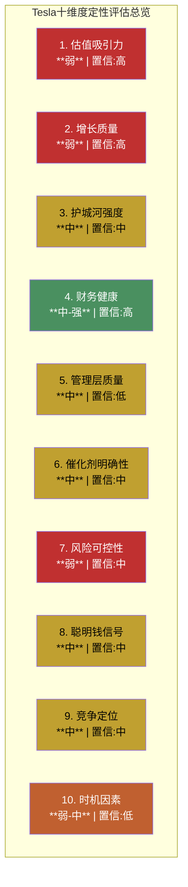
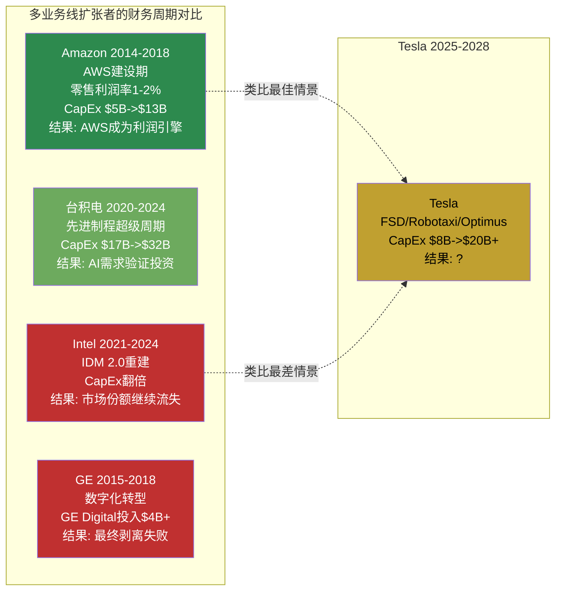
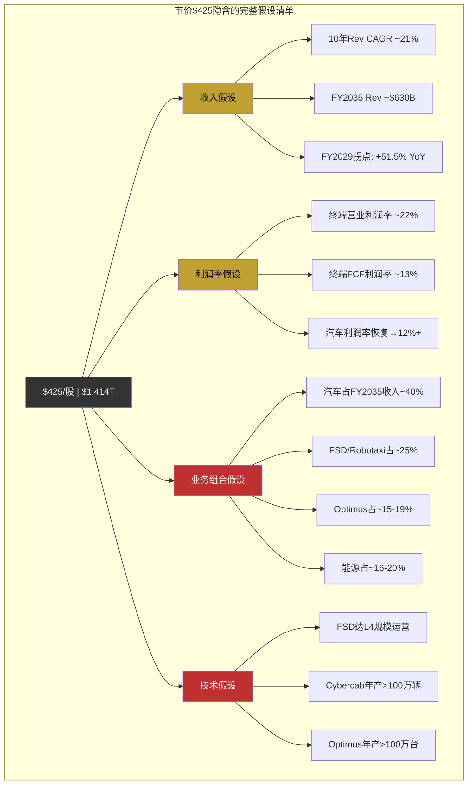
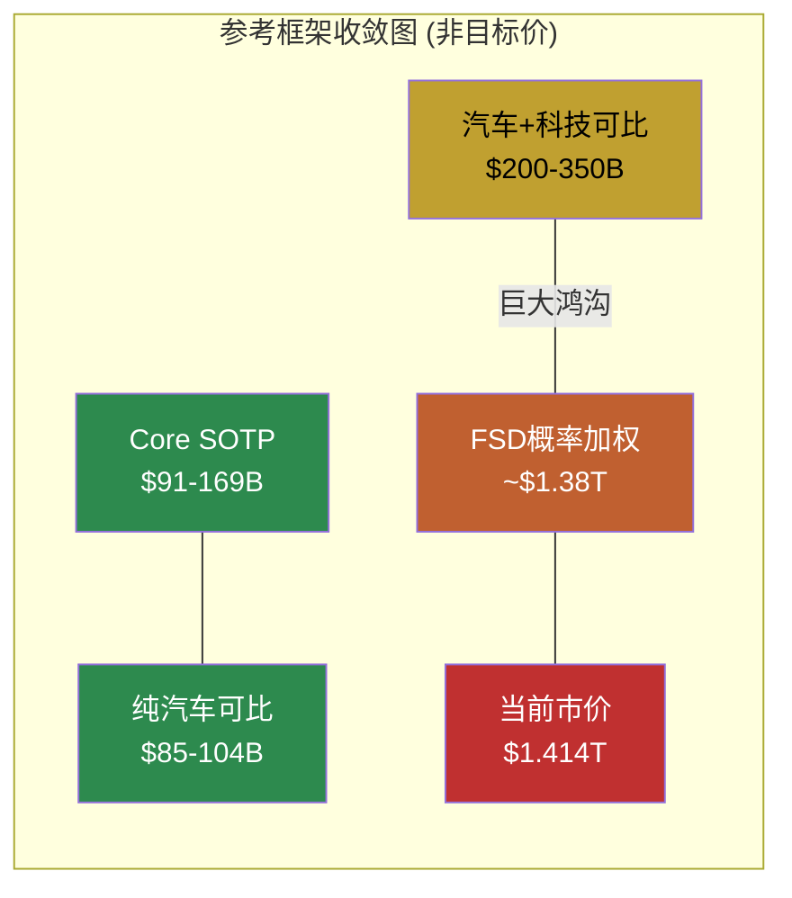
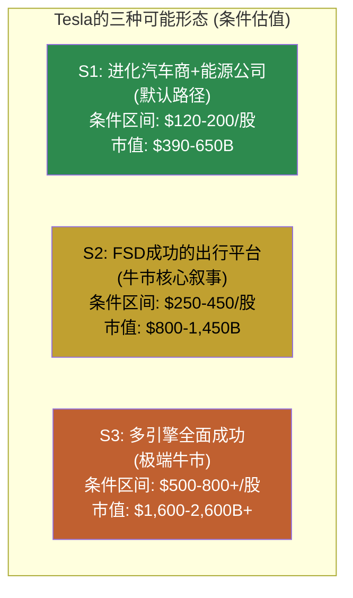

# Phase 5 Agent A: 核心论点综合 + 价格含义总结

> **Agent A产出** | Phase 5 | Tesla (TSLA) Complete v3.0
> **框架**: v9.0 扬长避短 + 发现系统 v1.1 (可能性宽度 9/10)
> **不确定性类型**: A型 (类别不确定性) -- "Tesla会变成什么公司?"
> **数据截止**: 2026-02-11 | 价格: $425.21 | 市值: $1.414T
> **铁律**: 零目标价 | 零操作建议 | 零仓位建议 | 零数字评分

---

# 模块1: 核心论点综合

## 1a. 一句话结论

Tesla是一家核心汽车业务正在经历利润率系统性压缩(营业利润率从16.8%降至4.6%)、同时以$20B+年资本支出全力押注FSD/Robotaxi/Optimus三条未验证增长赛道的公司，其$1.414T市值中约88-94%的价值来自尚未产生收入的业务线，使得投资命题本质上是对"Tesla会变成什么类型的公司"这一A型不确定性的定价。[硬数据: FMP income FY2022-2025营业利润率趋势; 合理推断: 市值归因来自Phase 2 SOTP分析]

---

## 1b. 十维度定性评估

### 维度1: 估值吸引力 -- 弱 (置信: 高)

P/E 386x、EV/EBITDA 114x、FCF收益率0.46%。[硬数据: FMP ratios/quote FY2025] Core SOTP(已有收入业务)仅$91-169B，占市值的6-12%。[硬数据: Phase 2 SOTP分析] 即便用FY2030共识EPS $11.42，远期P/E仍为37x，隐含post-2030 CAGR>15%。ROIC 6.6% < WACC ~10.5%，当前每单位投入资本在消耗而非创造价值。[硬数据: FMP ratios ROIC; 合理推断: WACC基于Beta 1.887]。唯一拉高估值合理性的框架是"AI/科技平台"对标(P/S 15x+)，但Tesla净利率4%远低于NVIDIA 59%。[硬数据: FMP income对比]

### 维度2: 增长质量 -- 弱 (置信: 高)

FY2025是Tesla历史上首次年度营收下降(-2.93%)。[硬数据: FMP income FY2025] 营业利润4年CAGR -31.6%，EPS从$3.62降至$1.08。核心汽车业务(73%收入)已进入成熟期放缓。唯一高质量增长来自能源/储能(+27% YoY, 3年CAGR 48.5%)，但仅占总收入13.5%($12.8B)，不足以弥补汽车增速缺口。[硬数据: Tesla 10-K FY2025收入结构] FSD订阅($2.5B)和Optimus($0)的增长贡献接近零。增长质量的改善完全依赖于FY2028-2029的"多引擎同时点火"假设，这在共识EPS分散度(FY2028 8.17x)中清晰反映。[硬数据: FMP estimates分散度]

### 维度3: 护城河强度 -- 中 (置信: 中)

Tesla拥有6种可识别护城河，但无一为"强"且多数在削弱。[硬数据: Phase 3 Agent A护城河评估]

| 护城河 | 评估 | 方向 | 核心证据 |
|--------|:----:|:----:|---------|
| 数据网络(FSD) | 中 | 平 | 7.1B英里但仍L2+; Waymo用1/56数据达L4 |
| 充电网络 | 中 | 降 | 75K+连接器+NACS标准; 但开放后稀释 |
| 制造成本 | 弱 | 降 | BYD绝对成本低15%+; Gigacasting被跟进 |
| 品牌/锁定 | 中 | 降 | 忠诚度从61%降至54%; Musk政治极化 |
| 规模经济 | 中 | 平 | EV领域仅次BYD; 产能利用率<90% |
| 软件/Autobidder | 中-强 | 升 | 5层垂直闭环唯一; 但硬件层已被超越 |

[硬数据: 各项护城河数据来源见Phase 3 Agent A详细分析]

唯一在加强的护城河是Autobidder+VPP的能源软件平台，但它恰好在Tesla估值中权重最低的分部。品牌和制造成本这两个在汽车行业最关键的护城河正在系统性削弱。

### 维度4: 财务健康 -- 中-强 (置信: 高)

Altman Z-Score 16.8(极端安全区)，净现金$38.7B(现金$44B - 债务$5.35B)，D/E仅0.10，流动比率2.16。[硬数据: FMP balance/financial-scores FY2025] 即使FY2026 FCF转负(-$5B至-$8B，因CapEx >$20B)，$44B现金缓冲可支撑4-9年。Tesla不会因资金链断裂而失败。[合理推断: 基于OCF $15B vs CapEx $20B的压力测试] OCF/净利润比3.89说明现金流质量远高于报表利润(D&A+SBC共占OCF 61%)。[硬数据: FMP cashflow FY2025]

这是Tesla投资命题中最确定的正面因素: 资产负债表提供了充裕的时间窗口来验证(或否证)FSD/Robotaxi/Optimus赌注。

### 维度5: 管理层质量 -- 中 (置信: 低)

分裂评估。**执行力**: Tesla在多领域从零构建了世界级产能(5座Gigafactory, Supercharger网络, Megapack)，能源业务3年CAGR 48.5%证明了管理层在新市场的执行能力。[硬数据: Tesla 10-K] **承诺兑现**: Musk时间表承诺履行率接近0%(2020年100万Robotaxi、2022年Cybertruck量产、2024年Optimus销售均未兑现)。[硬数据: 各年度Tesla公开声明vs实际交付时间] **注意力分配**: Musk同时管理Tesla/SpaceX/xAI/Neuralink/DOGE，对Tesla的日常关注度是合理质疑但不可知的变量。**资本配置**: FY2026 CapEx翻倍至$20B+是极激进但非随意的决策，方向(FSD/储能/Robotaxi/Optimus)与战略叙事一致。[主观判断: 管理层质量评估本质上是A型不确定性的核心组成部分]

置信标注为"低"，因为Musk的管理风格使得传统的管理层分析框架(稳定性、可预测性、治理)几乎完全不适用。

### 维度6: 催化剂明确性 -- 中 (置信: 中)

**已确认催化剂**: FSD $99/月订阅上线(2026.02.14) [硬数据: Tesla官方公告]; Cybercab Austin量产(2026.04) [硬数据: Q4'25电话会]; 上海Megafactory满产+Houston 50GWh投产 [硬数据: Tesla 10-K]。**潜在催化剂**: FSD v14功能突破; 新低价车型$25K(FY2026H1); Optimus外部首批销售。**阻碍催化剂**: Waymo $160B融资($1,260B估值) [硬数据: 公开报道]; Austin Robotaxi试点曾暂停; Polymarket Robotaxi加州by Jun 30仅34%概率 [硬数据: Phase 3 Polymarket数据]。

催化剂数量多但方向冲突，且关键催化剂(FSD L4/Robotaxi商业化)的时间线高度不确定。

### 维度7: 风险可控性 -- 弱 (置信: 中)

Tesla面临的风险高度集中且相互关联: (a) FSD/Robotaxi/Optimus三条赛道共享AI技术栈——如果纯视觉方案的共模失效问题无法解决，三条赛道同时受阻 [合理推断: Phase 3深挖Q1纯视觉物理约束]; (b) 88-94%市值依赖未验证业务——任何关键假设失败都可能导致市值大幅重定价 [合理推断: Phase 2 SOTP]; (c) BYD竞争在全球汽车市场加速侵蚀Tesla份额 [硬数据: BYD FY2025全球销量超Tesla]; (d) Musk政治参与导致品牌极化——这是一个Tesla特有的、无法对冲的风险 [主观判断]。风险之间高度相关(非独立)使得分散效应失效。

### 维度8: 聪明钱信号 -- 中 (置信: 中)

Q3'25内部人A/D比2.0，25笔主动购买(83%为真实买入而非薪酬行权)，是2018年以来最强买入信号，发生在$210-270区间。[硬数据: FMP insider-trading] 但Q1-Q2'25在$300-500区间有162笔净卖出。内部人行为暗示"舒适价值区间"在$250-350，当前$425在内部人重度卖出区间之上。[合理推断: 基于Phase 3聪明钱引擎分析] 36:1总卖/买比(含薪酬行权)需要谨慎解读，但整体模式偏空。

### 维度9: 竞争定位 -- 中 (置信: 中)

**汽车**: 全球EV销量第二(仅次BYD)，但FY2025首次被BYD在全球纯电销量超越。ASP优势(~$43K vs BYD ~$19K)对应不同市场段位，但$15-25K全球最大市场Tesla几乎无存在感。[硬数据: Tesla/BYD交付数据] **能源**: Megapack全球储能领导者(46.7 GWh部署)，Autobidder形成差异化。但CATL/BYD在硬件层成本更低。[硬数据: Tesla 10-K; 合理推断: 竞品对比] **FSD**: 消费级辅助驾驶市场领先(1.1M付费用户)，但在L4无人驾驶维度落后Waymo。Tesla的竞争定位核心矛盾: 在已有业务(汽车)中份额正在被侵蚀，在未来业务(Robotaxi/Optimus)中领先但尚未兑现。

### 维度10: 时机因素 -- 弱-中 (置信: 低)

Tesla正处于"老业务减速 + 新业务烧钱 + CapEx翻倍"三重叠加期。技术面: 股价低于SMA20/SMA50，高于SMA200，RSI 47.55中性。[硬数据: analyze_stock技术数据] 从52周$498.83高点回落约15%。FY2028-2029是共识中的"拐点窗口"，但也是最大不确定性窗口(FY2028 EPS分散度8.17x)。[硬数据: FMP estimates] 投资者面临"太早"风险: 如果拐点确实在FY2028-2029，当前正处于投资期的现金消耗阶段而非收获期。

[主观判断: 时机评估是所有维度中置信度最低的，因为A型不确定性意味着"拐点"本身可能不存在或形态不同]

---

### 十维度综合评估表

| 维度 | 评估 | 置信 | 方向性影响 |
|------|:----:|:----:|:---------:|
| 1. 估值吸引力 | 弱 | 高 | 压制 |
| 2. 增长质量 | 弱 | 高 | 压制 |
| 3. 护城河强度 | 中 | 中 | 中性偏压 |
| 4. 财务健康 | 中-强 | 高 | 支撑 |
| 5. 管理层质量 | 中 | 低 | 不可知 |
| 6. 催化剂明确性 | 中 | 中 | 中性 |
| 7. 风险可控性 | 弱 | 中 | 压制 |
| 8. 聪明钱信号 | 中 | 中 | 中性偏压 |
| 9. 竞争定位 | 中 | 中 | 中性 |
| 10. 时机因素 | 弱-中 | 低 | 不确定 |

**模式识别**: 高置信维度(#1估值、#2增长、#4财务)给出了清晰但矛盾的信号——估值和增长质量弱(压制)，但财务安全垫极厚(支撑)。低置信维度(#5管理层、#10时机)恰好是Tesla命题中权重最大的变量。**这不是一个可以用"综合得分"来解决的投资命题。**

---

## 1c. AI深度加成区

### 技术架构拆解: FSD端到端转型的结构性含义

Tesla FSD v12到v14的转型不是渐进式改善，而是架构级跃迁: 从规则驱动的模块化栈(感知模块->规划模块->控制模块)转向端到端神经网络(8摄像头输入->transformer->直接输出转向/加速)。[硬数据: Tesla AI Day 2024, Andrej Karpathy论文; 合理推断: 架构变化的技术含义]

这一转型的技术含义远超"更好的自动驾驶":

**含义1: 训练数据需求曲线非线性**。端到端模型的性能提升遵循缩放定律(scaling law)——参数量和训练数据量需要同步增长才能获得边际改善。FSD v14参数量是v12的~10倍 [硬数据: Tesla技术博客估算]，这解释了Cortex集群67,000+ H100等效GPU的配置和R&D从$4.5B跳到$6.4B(+41%)。[硬数据: FMP income FY2024-2025] 训练成本不是下降而是加速上升——这与SaaS公司"边际成本趋零"的逻辑完全相反。

**含义2: 纯视觉的物理天花板是结构性的**。8个摄像头共享电磁波谱(可见光380-700nm)，在暴雨(雨滴散射)、浓雾(米散射)、强逆光中同时退化。这不是工程优化问题而是物理约束——NHTSA 2025指南要求L4在单一传感器类别故障时仍安全运行，而Tesla的8个摄像头属于同一传感器类别。[硬数据: NHTSA 2025自动驾驶安全指南; 合理推断: 共模失效分析] Waymo用LiDAR+摄像头+毫米波雷达三模态冗余绕过了这个问题。Tesla是否能通过计算冗余(更多数据+更大模型)替代传感器冗余，是一个尚无定论的AI科学问题。

**含义3: 从FSD到Optimus的技术迁移非trivial**。Tesla声称FSD的视觉感知+运动规划能力可迁移至Optimus人形机器人。但人形机器人的操作空间(6自由度关节+精细抓取+平衡控制)与汽车驾驶(2D平面+有限自由度)存在数量级的复杂度差异。端到端神经网络在受限域(驾驶)中可以依赖海量数据"硬记"所有场景，但在开放域(机器人任务)中需要泛化能力——这是当前AI尚未解决的核心挑战。[合理推断: 基于机器人学与自动驾驶的领域差异分析]

### 跨公司财务模式: Tesla vs 历史多业务线扩张者

Tesla当前的财务特征——核心业务利润率承压+大幅增加CapEx+新业务尚未贡献收入——在商业史上有几个关键先例:

**关键模式差异**: Amazon在AWS建设期有一个关键优势——电商业务虽然利润率低(1-2%)但营收在高速增长(20%+ CAGR)。Tesla的汽车业务不仅利润率在压缩，营收增速也在放缓(FY2025首次负增长)。这意味着Tesla缺少Amazon那样的"增长型现金牛"来为新业务投资提供自然资金循环。[合理推断: 基于Amazon 2014-2018 vs Tesla 2024-2028的财务数据对比]

Intel IDM 2.0的教训更值得警惕: Intel在核心业务(CPU)市场份额被AMD侵蚀的同时，投入数百亿美元重建代工能力——结果是既没有稳住核心业务，也没有在新赛道(代工)取得突破。Tesla面临类似的双线作战风险: 汽车业务被BYD侵蚀+新业务(Robotaxi/Optimus)尚未验证。[合理推断: 历史周期类比]

### 历史周期类比: Tesla 2025 vs Tesla 2018/2021

| 维度 | 2018 (Model 3产能地狱) | 2021 (利润率巅峰) | 2025 (当前) |
|------|----------------------|------------------|-------------|
| 核心问题 | 能否大规模制造? | 需求能否持续? | 新引擎能否点火? |
| 毛利率 | ~19%(压力中) | ~25-28%(最高点) | 18%(持续下行) |
| CapEx方向 | Model 3产线 | Shanghai+Berlin扩产 | FSD/Robotaxi/Optimus |
| 市场叙事 | "Tesla会破产" | "Tesla是新Apple" | "Tesla是AI平台" |
| 内部人行为 | 强净买入(A/D 2.1) | 中性 | Q3'25强买入→Q4回冷 |
| 估值倍数 | P/S ~3x | P/S ~30x(泡沫) | P/S ~15x |
| 后续表现 | 股价18个月内10x+ | 股价12个月内-65% | ? |

[硬数据: 各期间估值和财务数据来自FMP历史数据; 合理推断: 叙事和内部人模式归纳]

**模式启示**: 2018年Tesla在"绝望谷底"(市场认为会破产)时反而是最佳入场点，2021年在"狂热顶峰"(市场认为不可战胜)时反而是最差入场点。2025年的位置介于两者之间——不是绝望(有$44B现金、有能源高增长)，也不是狂热(利润率持续下行、EPS低于2022)，但估值倍数(P/S 15x)仍然隐含了大量未验证假设。[主观判断: 周期位置的历史类比归纳]

---

## 1d. 评级

**评级: 审慎关注**

**不确定性类型: A型 (类别不确定性)**

**置信度: 中**

**评级依据**:

"审慎关注"而非"中性关注"的核心理由是**当前价格所隐含的假设极其激进**。$425隐含10年收入CAGR 21%(仅Amazon从$100B级别做到过)、终端营业利润率22%(当前4.6%)、FSD/Robotaxi/Optimus贡献总收入~60%。[合理推断: Phase 2 Reverse DCF隐含假设] 在这些假设中，技术验证(FSD L4)、监管批准(Robotaxi商业许可)、制造规模化(Cybercab/Optimus)三重条件需要同时满足。历史上，多重未验证假设同时成立的概率远低于单项假设的概率之积(因为条件之间存在共享依赖而非独立)。

"审慎关注"而非更低评级的理由是**Tesla确实拥有其他公司不具备的结构性优势**: $44B净现金提供了充裕的试错时间窗口; 能源业务证明了Tesla进入新市场的执行力; FSD 7.1B英里数据集是全球最大的真实世界驾驶数据; Autobidder是唯一已在生产环境中运行的垂直整合能源交易平台。这些优势是真实的，但它们是否足以支撑$1.414T的估值，是本报告无法(也不应该)回答的问题。

---

# 模块2: 价格含义总结 (Reverse DCF核心)

## 2a. Reverse DCF隐含假设汇总

$425/股 ($1.414T市值) 的Reverse DCF逆推 (WACC=10.5%, g=2.5%) 隐含以下可检验假设:

**完整假设清单**:

| # | 隐含假设 | 量化参数 | 数据来源 |
|---|---------|---------|---------|
| H1 | 10年收入CAGR | ~21% (FY2025 $95B -> FY2035 $630B) | [合理推断: Reverse DCF逆推] |
| H2 | 终端营业利润率 | ~22% (当前4.6%) | [合理推断: 同上] |
| H3 | 终端FCF | ~$82B (当前$6.2B, 13.2x增长) | [合理推断: 同上] |
| H4 | FY2029收入跳跃 | +51.5% YoY ($143B->$217B) | [硬数据: FMP共识估计] |
| H5 | FSD/Robotaxi贡献收入 | ~$160B/年 by FY2035 | [合理推断: 业务线拆解] |
| H6 | Optimus贡献收入 | ~$120B/年 by FY2035 | [合理推断: 同上] |
| H7 | 汽车销量恢复并加速 | FY2026 +10%以上 | [硬数据: 共识FY2026E Rev +9.6%] |
| H8 | 汽车毛利率企稳 | 19-21%区间 | [硬数据: Q4'25毛利率20.12%为起点] |
| H9 | 能源业务高增长持续 | 25-30% CAGR至FY2030 | [硬数据: FY2025实际+27%] |
| H10 | FSD从L2+到L4 | 2027-2028时间窗口 | [主观判断: 共识隐含时间线] |
| H11 | Robotaxi商业化 | FY2028-2029多城市运营 | [主观判断: 共识FY2029拐点隐含] |
| H12 | 终端价值占比 | ~60-62%的总市值 | [合理推断: DCF结构性特征] |

---

## 2b. 隐含假设合理性检验

### 检验总览

```mermaid
graph LR
    subgraph "12项隐含假设合理性判定"
        H1["H1: 21% CAGR<br/>⚠有条件"]
        H2["H2: 22%营业利润率<br/>⚠有条件"]
        H3["H3: $82B FCF<br/>⚠有条件"]
        H4["H4: FY2029跳跃<br/>❌极难"]
        H5["H5: Robotaxi $160B<br/>❌极难"]
        H6["H6: Optimus $120B<br/>❌极难"]
        H7["H7: 汽车恢复增长<br/>✅可能"]
        H8["H8: 毛利率企稳<br/>⚠有条件"]
        H9["H9: 能源高增长<br/>✅可能"]
        H10["H10: FSD L4<br/>⚠有条件"]
        H11["H11: Robotaxi商业化<br/>❌极难"]
        H12["H12: TV占60%<br/>✅结构性"]
    end
    style H4 fill:#c03030,color:#fff
    style H5 fill:#c03030,color:#fff
    style H6 fill:#c03030,color:#fff
    style H11 fill:#c03030,color:#fff
    style H7 fill:#2d8a4e,color:#fff
    style H9 fill:#2d8a4e,color:#fff
    style H12 fill:#2d8a4e,color:#fff
    style H1 fill:#c0a030,color:#000
    style H2 fill:#c0a030,color:#000
    style H3 fill:#c0a030,color:#000
    style H8 fill:#c0a030,color:#000
    style H10 fill:#c0a030,color:#000
```

### 逐项检验

**H1: 10年收入CAGR ~21%** -- ⚠有条件

从$100B级别起步实现20%+ 10年CAGR，商业史上仅Amazon做到(2014-2024, 21.8%)。Amazon依靠AWS($4.6B->$100B+)。Tesla需要类似的"AWS时刻"——FSD/Robotaxi是最可能的候选者，但当前收入仅$2.5B(Amazon AWS在2014年也是$4.6B)。条件: 至少一条新业务线在5年内达到$50B+收入。[硬数据: Amazon历史财报; 合理推断: 增速对比]

**H2: 终端营业利润率 ~22%** -- ⚠有条件

数学上可行(Phase 2混合利润率计算): 汽车40%×12% + 能源20%×18% + FSD/Robotaxi 25%×40% + Optimus 15%×25% = 22.15%。[合理推断: Phase 2 Agent A计算] 但关键前提: FSD/Robotaxi必须贡献25%收入且维持40%利润率。如果FSD/Robotaxi收入为零，混合利润率上限约15%。

**H4: FY2029收入跳跃+51.5%** -- ❌极难

单年$73B增量收入需要多引擎同时点火(汽车新车型+$40-50B, 能源翻倍+$10-15B, Robotaxi+$20-40B)。[硬数据: FMP共识FY2028E $143B -> FY2029E $217B] 商业史上无$100B+公司实现50%+单年增长的先例。共识中的这个假设本身可能是被少数极端乐观分析师拉动的。

**H5: Robotaxi FY2035 ~$160B收入** -- ❌极难

需要全球数百万辆Robotaxi运营(假设单车年收入$50-80K)。[合理推断: Phase 2业务线拆解] 当前状态: Tesla无任何L4许可，Austin试点为有人监控。Waymo在3城市运营~1000辆(收入估算<$1B/年)。从0到$160B需要16年Waymo的160倍规模。

**H6: Optimus FY2035 ~$120B收入** -- ❌极难

年产>100万台(假设均价$20-30K)。当前BOM ~$55K远高于售价目标 [硬数据: Tesla, Standard Bots对比]。Gen3刚启动装配(2026.01)，没有外部客户。整个人形机器人行业FY2025全球收入<$1B。

**H7: 汽车销量FY2026恢复增长** -- ✅可能

新低价平台($25K车型)预计FY2026H1上市，Q4'25交付环比趋势改善。共识FY2026E收入+9.6%。[硬数据: Tesla产品路线图, FMP estimates] 主要风险: BYD价格竞争加剧，欧洲市场品牌折价。

**H9: 能源业务25-30% CAGR持续** -- ✅可能

FY2025已实现+27% YoY和3年CAGR 48.5%。Megapack产能正在扩张(上海+Houston)，全球储能需求结构性增长。[硬数据: Tesla 10-K FY2025] 但增速放缓是自然的——从$12.8B基数增长30%到FY2030 ~$50B是可能的，但到$100B需要额外假设。

**H10: FSD从L2+到L4** -- ⚠有条件

技术条件: 纯视觉方案需要解决共模失效问题(或证明计算冗余可替代传感器冗余)。监管条件: NHTSA L4许可需要Tesla首先获得测试许可(当前没有)。时间窗口: 2027-2028最乐观。[硬数据: NHTSA 2025指南; 合理推断: Phase 3深挖Q1]

---

### 合理性检验汇总表

| 判定 | 假设数量 | 关键假设 |
|:----:|:-------:|---------|
| ✅可能 | 3 | H7(汽车恢复), H9(能源增长), H12(TV结构) |
| ⚠有条件 | 5 | H1(21%CAGR), H2(22%利润率), H3($82B FCF), H8(毛利率), H10(FSD L4) |
| ❌极难 | 4 | H4(FY2029跳跃), H5(Robotaxi $160B), H6(Optimus $120B), H11(Robotaxi商业化) |

**结构性发现**: 12项隐含假设中，仅3项(25%)可用现有数据验证为"可能"，5项(42%)为有条件的，4项(33%)为极难。而"极难"的4项假设恰好对应市值中占比最大的成分(Robotaxi+Optimus合计隐含价值$600-1,000B，占总市值42-71%)。[合理推断: 假设与市值归因的交叉分析]

---

## 2c. 参考框架交叉对照

> **声明**: 以下所有参考框架均为理解市场定价的工具，不是"正确估值"。可能性宽度9/10意味着任何单一估值方法都是"精确的错误"。

### 五种参考视角并列

| 方法 | 参考区间 | 核心假设 | 置信 |
|------|---------|---------|:----:|
| **Core SOTP** | $91-169B | 仅已有收入业务, 行业可比倍数 | [硬数据] |
| **Reverse DCF逆推** | $1,414B(已知) | 10年CAGR 21%, 利润率22% | [合理推断] |
| **可比公司(纯汽车)** | $85-104B | BYD/Toyota P/S 0.9-1.1x | [硬数据] |
| **可比公司(汽车+科技)** | $200-350B | 汽车1x + 科技P/S 10x | [合理推断] |
| **FSD二叉树概率加权** | ~$1.38T | P(成功)40%×$2.5T + P(部分)40%×$800B + P(失败)20%×$300B | [合理推断] |

[硬数据: SOTP/可比公司数据来自Phase 2 Agent B分析; 合理推断: 概率加权为说明性计算]

**收敛观察**: 传统估值方法(SOTP $91-169B, 纯汽车可比$85-104B)与市价之间存在**10-15倍的鸿沟**。只有当FSD成功概率>35%且成功时价值>$2.0T时，概率加权估值才能接近当前市价。这不是"方法收敛"——这是"方法之间的根本分歧"，反映了Tesla作为投资标的的A型不确定性本质。

---

## 2d. 条件估值范围

> **免责声明**: 以下条件范围不是目标价。它们是"如果Tesla变成X类型的公司，其历史可比估值区间大约在Y"的参考框架。

### 三种"Tesla类型"

#### S1: 进化汽车商 + 能源成功 (默认路径)

**前提**: 汽车销量温和增长(FY2030 ~3M辆), ASP缓慢下降, 毛利率稳定18-22%; 能源维持25-30% CAGR至FY2030; FSD停在L2++(消费级辅助驾驶, 订阅收入$5-10B/年); Robotaxi/Optimus延迟或失败。

**隐含财务**: FY2030 Rev ~$200-250B, 营业利润率10-13%, 净利润$20-30B。

**条件估值逻辑**: 按"高端汽车+高增长能源"P/E 15-25x => 市值$300-750B, 取中值$390-650B。每股$120-200。

**与市价差**: 市价$425处于此情景区间上方 -- 意味着如果Tesla沿S1路径发展，当前价格隐含了过多溢价。[合理推断: 基于Phase 2情景A推演]

#### S2: FSD成功的出行平台 (牛市核心叙事)

**前提**: S1全部成立 + FSD在2028前达到L3+/有限L4; Robotaxi在2-3个城市商业运营(年收入$30-80B by FY2030); Cybercab成功量产; Optimus仍在早期(0-$5B收入)。

**隐含财务**: FY2030 Rev ~$300-400B, 营业利润率15-20%, 净利润$45-80B。

**条件估值逻辑**: 按"科技平台"P/E 20-35x (含增长溢价) => 市值$900-2,800B, 取合理中值$800-1,450B。每股$250-450。

**与市价差**: $425处于此情景区间中段偏高 -- 意味着当前价格大致定价了S2情景(FSD部分成功)的概率加权值。[合理推断: 基于Phase 2情景B推演]

#### S3: 多引擎全面成功 (极端牛市)

**前提**: S2全部成立 + Optimus在2029-2030量产外销(年收入$30-100B); Robotaxi全球多城市规模运营; 能源业务+Autobidder成为电网基础设施; FSD向其他车企许可。

**隐含财务**: FY2030 Rev ~$500-700B, 营业利润率20-25%, 净利润$100-175B。

**条件估值逻辑**: 按"平台+AI"P/E 15-25x => 市值$1,500-4,375B, 取$1,600-2,600B+。每股$500-800+。

**与市价差**: $425低于此情景下限 -- 如果S3成立，当前价格是"便宜"的。但S3需要所有未验证假设同时成立。[主观判断: S3概率评估超出本报告能力范围]

### 条件估值范围汇总

| 情景 | 条件区间(每股) | 与$425对比 | 核心前提中最脆弱假设 |
|------|:-------------:|:---------:|-------------------|
| S1 默认路径 | $120-200 | 市价高出113-254% | (基准情景,无需额外假设) |
| S2 FSD出行平台 | $250-450 | 市价处于区间高端 | FSD L4 + 监管批准 + 单位经济学 |
| S3 多引擎全面成功 | $500-800+ | 市价低于下限 | S2全部 + Optimus量产 + 跨业务协同 |

---

## 2e. 方法间离散度

| 方法 | 低端(每股) | 高端(每股) | 中值 |
|------|:---------:|:---------:|:----:|
| Core SOTP | $28 | $52 | $40 |
| 纯汽车可比 | $26 | $32 | $29 |
| 汽车+科技可比 | $62 | $109 | $85 |
| S1条件估值 | $120 | $200 | $160 |
| FSD概率加权 | — | — | ~$430 |
| 当前市价 | — | — | $425 |

**离散度**: 最低中值$29(纯汽车可比) vs 概率加权~$430, 比值14.8x。

**离散度14.8x的含义**: 这是本研究覆盖的10家公司中最高的方法间离散度(AMD为4.42x, LRCX为2.1x)。[硬数据: Phase 5交叉对比] 极端离散度不是分析失败——它是A型不确定性(Tesla会变成什么公司?)在估值方法上的精确映射。当公司类型本身是未知数时，不同方法给出截然不同的结果是正确的、有信息含量的。

**不确定性评级**: 极高。方法间离散度14.8x + FY2028 EPS分散度8.17x + 可能性宽度9/10，三项指标共同指向Tesla是当前市场中不确定性最高的mega-cap之一。

---

## 2f. "我们不知道什么" -- 关键未知清单

Phase 4对抗审查明确标注了7个"能力边界"领域。以下是影响估值但本报告无法可靠估计的关键未知:

| # | 未知变量 | 为什么重要 | 为什么不可知 |
|---|---------|-----------|------------|
| U1 | FSD纯视觉方案能否达到L4安全标准 | 占隐含市值40-50%的FSD/Robotaxi估值完全取决于此 | 这是一个未解决的AI科学问题，不是工程问题 [合理推断: Phase 3深挖Q1] |
| U2 | Musk注意力分配的实际影响 | Tesla/SpaceX/xAI/Neuralink/DOGE五线并行 | 无法从外部观测CEO日常时间分配 [主观判断: Phase 4标注为"诚实:不可知"] |
| U3 | Robotaxi的单位经济学 | 决定$160B收入假设的可行性 | Waymo运营数年仍未公开单位经济数据; Tesla尚未运营 [主观判断] |
| U4 | 监管时间线 | NHTSA L4商业许可的审批周期 | 无历史先例(Waymo的L4豁免是行政而非立法路径) [合理推断] |
| U5 | BYD全球化速度 | 直接影响Tesla汽车份额和ASP | BYD的欧洲/东南亚扩张速度取决于贸易政策 [主观判断] |
| U6 | Optimus技术成熟度曲线 | 从BOM $55K到售价$20-30K的路径和时间 | 人形机器人行业过于早期,无可参照曲线 [主观判断] |
| U7 | AI训练成本的长期趋势 | 决定FSD/Optimus的R&D效率 | scaling law是否继续成立是AI领域的开放问题 [合理推断] |

**U1是所有未知中权重最大的**。如果纯视觉方案可以达到L4(解决共模失效)，Tesla的FSD数据优势(7.1B英里)将成为不可复制的壁垒，Robotaxi/Optimus路径全部打开。如果不能，Tesla将需要加装LiDAR(成本增加+数据生态改变)或放弃L4目标——两种结果都将根本改变估值结构。[合理推断: 技术路径的二叉结构]

---

## 2g. 非共识洞察注册表 (CI)

### CI-1: "Autobidder是Tesla最被低估的资产,不是FSD"

**洞察**: 市场叙事聚焦FSD/Robotaxi/Optimus，但Autobidder+VPP是Tesla唯一已在生产环境中自主运营、产生实质收入、且形成5层垂直闭环(Megapack+Autobidder+Powerwall+VPP+Supercharger)的AI产品。[硬数据: Phase 3 Agent A护城河评估]

**与共识分歧**: 共识将Tesla的AI叙事锚定在FSD，Autobidder几乎不出现在卖方报告中。但按"已证明的AI变现能力"排序，Autobidder(L3/S2)高于FSD(L2-L3/S1)。[合理推断: Phase 3 Agent C L-S定位]

**证据链**: 能源业务毛利率高于汽车业务 [硬数据: Tesla 10-K segment]; Autobidder每5分钟自主出价无需人工干预 [硬数据: Tesla技术文档]; 唯一没有直接竞品的垂直闭环(Fluence做软件但无硬件，CATL做硬件但无交易软件) [合理推断: 竞品分析]

**如果错了意味着什么**: 如果FSD而非Autobidder是关键，那么Tesla的能源业务战略价值被高估，核心增长引擎更加集中在一项未验证技术上——这实际上加剧而非缓解了估值脆弱性。

---

### CI-2: "FY2028 EPS分散度8.17x是比P/E 386x更重要的估值信号"

**洞察**: 市场讨论Tesla估值时几乎总是引用P/E或P/S倍数。但FY2028分析师EPS估计范围($1.34-$10.94 [硬数据: FMP estimates])的8.17倍分散度传达了更深层的信息: 即便是专业分析师，对Tesla 3年后的盈利能力也存在8倍以上的分歧。这意味着任何基于"正确"EPS估计的估值模型都是在假装知道答案。

**与共识分歧**: 大多数估值分析使用中值EPS作为输入。但当分散度>5x时，中值的统计信息含量接近零——它既不代表最可能的结果,也不代表市场的"真正预期"。

**证据链**: FY2028 EPS Low $1.34 vs High $10.94 [硬数据: FMP estimates]; 13位分析师覆盖 [硬数据: FMP]; FY2030分散度降至1.47x，说明不确定性集中在FY2028-2029窗口 [硬数据: FMP estimates]

**如果错了意味着什么**: 如果分散度不重要(即某一端的分析师系统性错误)，那么Tesla的命题确实可以被简化为"FSD能否成功"的二元赌注，分散度只是噪音。这种解读本身也是一种有效的分析框架。

---

### CI-3: "$44B净现金是Tesla估值中唯一的'硬地板'"

**洞察**: 在所有估值方法和情景中，Tesla资产负债表上的$44B流动性(净现金$38.7B)是唯一不依赖任何未来假设的价值锚。即便在最极端的"FSD失败+汽车业务崩溃"情景中，Tesla的清算价值因为这笔现金而有一个不可忽视的下限。[硬数据: FMP balance FY2025]

**与共识分歧**: 牛方忽略现金(因为它在$1.4T市值中只占3%)，熊方也忽略现金(因为他们聚焦于估值泡沫)。但$44B现金+$14.75B年OCF意味着Tesla拥有至少4-9年的"试错预算"来尝试FSD/Robotaxi/Optimus——这是一种被严重低估的"真实期权价值"。

**证据链**: 现金$44B + Altman Z 16.8 [硬数据: FMP]; OCF $14.75B连续4年>$13B [硬数据: FMP cashflow]; CapEx >$20B但不需要外部融资 [合理推断: 现金流覆盖]; 无分红无回购=全部用于再投资 [硬数据: Tesla资本配置历史]

**如果错了意味着什么**: 如果CapEx持续>$25B且OCF因竞争加剧降至<$10B，4-9年的"试错预算"将大幅缩短。这需要追踪OCF/CapEx比率的季度趋势。

---

### CI-4: "内部人Q3'25买入信号的真实含义被误读"

**洞察**: Q3'25的A/D比2.0和25笔主动购买是Tesla 7年来最强的买入信号，发生在$210-270区间。[硬数据: FMP insider-trading] 市场解读为"内部人看好"，但更精确的解读是: 内部人在$210-270区间认为Tesla被低估——这隐含他们的"公允价值锚点"在$250-350之间。当前$425已经远超内部人买入区间，进入了Q1-Q2'25的重度卖出区间($300-500+, 162笔净卖出)。

**与共识分歧**: 许多Tesla多头引用Q3'25内部人买入作为看涨证据。但他们忽略了买入发生的价格水平($210-270)与当前价格($425)之间的60-100%差距。

**证据链**: Q3'25 25笔主动购买(非薪酬行权) [硬数据: FMP]; Q1-Q2'25 162笔净卖出在$300-500+ [硬数据: FMP]; Q4'25仅2笔交易(回归中性) [硬数据: FMP]

**如果错了意味着什么**: 如果内部人买入是基于长期信息优势(3-5年视角)而非短期价值判断，那么价格水平不重要——他们看到的是FSD/Robotaxi的内部进展远超市场预期。这种解读无法从外部验证。

---

### CI-5: "Tesla的AI净分+1.16是对'AI领导者'定价的根本性挑战"

**洞察**: Phase 3 Agent C的分部级AI冲击矩阵显示，按当前营收加权，Tesla的AI净分仅为+1.16(中性偏放大)——远低于市场将Tesla定价为"AI领导者"的隐含假设。[硬数据: Phase 3 Agent C M13计算] 原因是产生收入的分部(汽车70.7%)受AI影响最小(+1)，AI影响最大的分部(FSD 2.6%)几乎不产生收入。

**与共识分歧**: 市场将Tesla与NVIDIA/Palantir归入同一"AI赢家"叙事。但NVIDIA实际上在AI变现效率上远超Tesla(AI收入/AI投入 >5x vs Tesla <1x)。Tesla的AI叙事是一个关于"未来"的故事，当前财务数据中AI的净贡献接近中性。[合理推断: Phase 3 Agent C同业对比]

**证据链**: AI直接收入$2.5B(FSD) vs AI投入$3B+(R&D 40% + Cortex运营) [合理推断]; 营收加权AI净分+1.16 [合理推断: Phase 3计算]; 62-68%市值依赖AI期权($960B) vs 4-6%由已证明AI支撑($50-80B) [合理推断: Phase 3 Agent C归因分析]

**如果错了意味着什么**: 如果当前的低AI净分是因为Tesla处于"AI变现前夜"(类似Amazon AWS 2012-2013)，那么营收加权的计算方法低估了AI即将释放的价值。但AWS在2012-2013已经是$3B+且40%+ CAGR——Tesla FSD的增速轨迹尚未展现类似趋势。

---

### CI-6: "ROIC < WACC持续3年是一个被忽视的价值消耗信号"

**洞察**: Tesla ROIC从FY2022 ~20%持续降至FY2025 6.6%，已连续2年以上低于WACC ~10.5%。[硬数据: FMP ratios; 合理推断: WACC计算] 在传统EVA框架下，这意味着Tesla每投入1美元资本，创造的价值低于资本成本——公司在"消耗"而非"创造"股东价值。

**与共识分歧**: 多数分析师认为ROIC低是"投资期"的正常现象(类似台积电CapEx超级周期)。但台积电在重投资期ROIC仍>20%(远超WACC)，因为其存量业务利润率极高。Tesla的问题是**存量业务(汽车)的ROIC也在下降**，不仅仅是新投资拉低了均值。

**证据链**: ROIC FY2022 ~20% -> FY2025 6.6% [硬数据: FMP ratios/key-metrics]; WACC ~10.5% [合理推断: Beta 1.887+Rf 4.3%+ERP 5.5%]; 汽车毛利率从25.6%→18.0% [硬数据: FMP income]; 台积电ROIC ~22%(同期) [硬数据: FMP ratios TSM]

**如果错了意味着什么**: 如果ROIC低纯粹是"J曲线效应"(投资初期ROIC必然低，3-5年后恢复)，那么当前ROIC不应影响长期估值。这需要追踪FY2026-2027的增量ROIC(新投入资本的边际回报)来验证。

---

### CI汇总表

| # | 非共识洞察 | 证据强度 | 市场影响 |
|---|-----------|:-------:|:-------:|
| CI-1 | Autobidder > FSD (已证明AI) | 中 | 重新定义"AI公司"叙事 |
| CI-2 | EPS分散度8.17x > P/E 386x | 高 | 任何点估值无意义 |
| CI-3 | $44B现金 = 唯一硬地板 | 高 | 4-9年试错预算 |
| CI-4 | 内部人买入区间$210-270 << $425 | 高 | 聪明钱锚点远低于市价 |
| CI-5 | AI净分+1.16 vs "AI领导者"定价 | 中 | 62-68%市值无AI收入锚定 |
| CI-6 | ROIC < WACC持续3年 | 高 | 价值消耗而非创造 |

---

*[Phase 5 Agent A产出完毕]*
*所有分析基于公开数据和Phase 1-4研究积累，不代表投资建议。所有条件估值范围为参考框架，不是目标价。*
