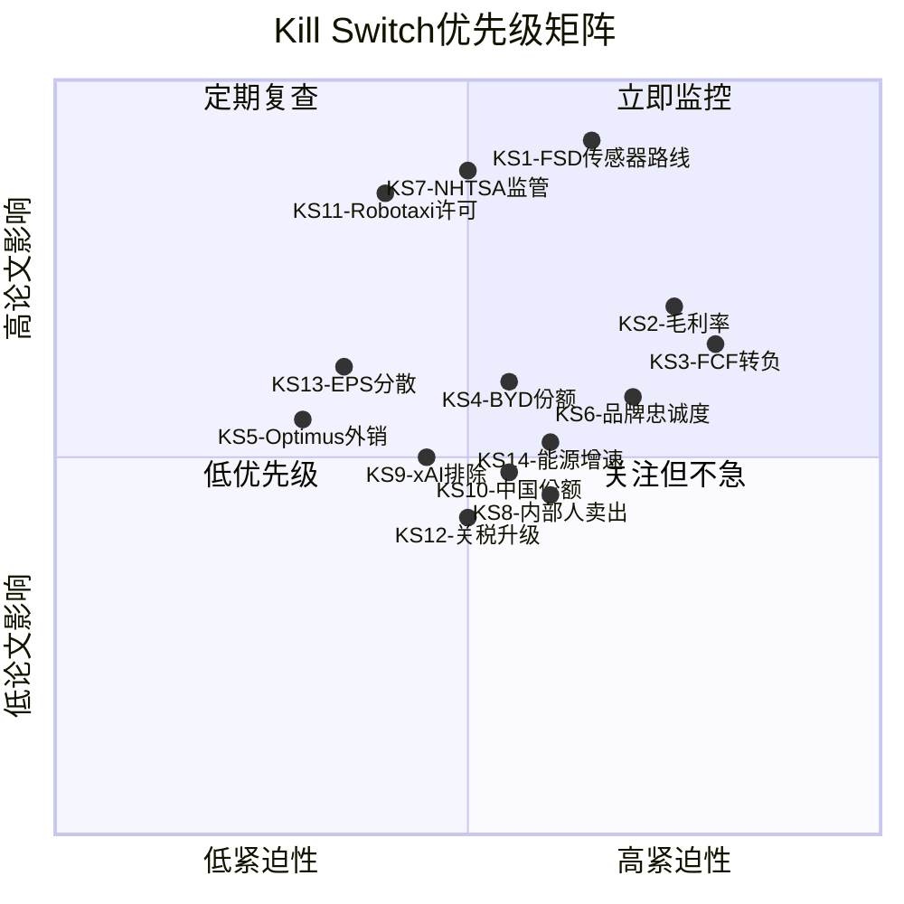
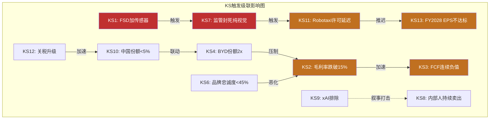
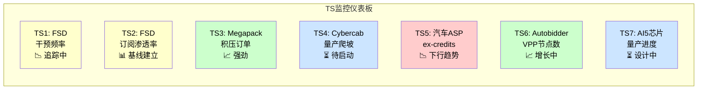
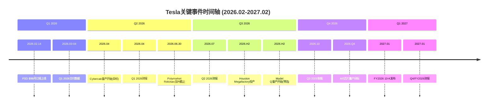

# Phase 5 Agent B: Kill Switch注册表 + 追踪信号清单 + 关键事件日历

> **Agent B产出** | Phase 5 | 方法论: v9.0扬长避短 + 发现系统(可能性宽度9/10)
> **铁律**: 零目标价 | 零评级 | 零仓位建议 | KS只说"论文含义"不说操作
> **数据截止**: 2026-02-11 | 价格: $425.21 | 市值: $1.414T
> **CQ引用**: CQ1汽车企稳 | CQ2 CapEx回报 | CQ3 FSD L4 | CQ4能源独立 | CQ5 Optimus | CQ6 BYD竞争 | CQ7 Musk注意力 | CQ8市价假设

---

## 模块1: Kill Switch注册表

### 方法论说明

Kill Switch是"如果触发，投资论文的核心假设需要根本性重新评估"的事件。KS不是预测("这会发生")，也不是操作信号("触发就卖")。它是一个监控工具——帮助投资者定义"什么情况下我需要停下来重新思考"。

Tesla可能性宽度9/10意味着KS数量天然偏多：公司形态的不确定性越高，可能使论文失效的事件维度越多。[合理推断: A型不确定性(类别)决定了KS必须覆盖"公司可能变成什么"的多个分叉] 以下14个KS覆盖财务、技术、竞争、政策、管理层五大维度。

---

### KS1: FSD传感器路线切换

| 字段 | 内容 |
|------|------|
| **触发条件** | Tesla在任何车型/市场增加LiDAR或雷达传感器 |
| **具体阈值** | 任何Tesla车型的硬件配置单出现"LiDAR"或"4D雷达"元件 |
| **当前状态** | 纯视觉方案(8摄像头+HW4/AI5)，已移除超声波雷达 [硬数据: Tesla 10-K FY2025] |
| **当前距离** | 未触发。Musk多次公开否定LiDAR("a fool's errand/拐杖") [硬数据: Musk 2022 AI Day, 2024 Earnings Call公开声明]，但Dojo $5B+投入后关闭的先例说明Tesla管理层会在技术路线失败时纠错 [硬数据: Dojo 2025.08关闭, TechCrunch; 合理推断: Dojo关闭=承认技术路线错误的先例] |
| **论文含义** | 纯视觉路线是Tesla vs Waymo差异化的核心——增加LiDAR意味着(a)承认纯视觉有L4天花板 [合理推断: 如果纯视觉足够，没有理由增加成本], (b)每车BOM增加$500-5000 [硬数据: LiDAR成本区间来自Foresight Auto/ArcadianAI行业数据], (c)FSD成本结构改变, (d)与Waymo路线趋同后Tesla数据量优势部分失效。整个"低成本规模化Robotaxi"论文需要重估 |
| **CQ关联** | CQ3(FSD L4), CQ8(市价假设——88-94%的AI定价溢价基于纯视觉规模化假设) |
| **Bear#关联** | Bear1: FSD永远停在L2+ |
| **数据源** | Tesla季度更新/Earnings Call硬件配置披露; 10-K"产品描述"章节; 供应链泄露(TrendForce, 日经拆解) |
| **紧迫性** | **高** | 观察窗口: 每次新车型发布(Model Q 2026, Cybercab 2026.04); AI5芯片量产时的硬件配置(2026H2-2027) |

**展开说明**: 纯视觉方案是Tesla AI叙事的哲学支柱。Phase 3深挖Q1论证了摄像头在暴雨/浓雾/强逆光下存在物理层面的信噪比天花板(Shannon定理约束)，NHTSA 2025指南要求L4"单一关键传感器故障时仍能安全运行"——8个摄像头是共模失效(同一物理原理)，不满足"冗余"定义。[硬数据: NHTSA 2025 Safety Assessment Guidelines; 合理推断: 共模失效分析] 如果Tesla悄悄加入LiDAR/雷达，这是对纯视觉路线的实质性否定，而非渐进式改良。

---

### KS2: 汽车毛利率跌破生存线

| 字段 | 内容 |
|------|------|
| **触发条件** | 汽车业务毛利率(Automotive gross margin ex-credits)连续2个季度低于15% |
| **具体阈值** | Automotive gross margin ex-regulatory credits < 15%，连续2Q |
| **当前状态** | Q4'25: 20.12%(含credits); FY2025全年: 18.03% [硬数据: FMP income FY2025/Q4'25] |
| **当前距离** | Q4'25读数20.12%距15%有5.1pp缓冲。但FY2025全年18.0%距15%仅3.0pp。如果BYD价格战加剧或Model Q定价过低，2-3季度内可能接近 [合理推断: 基于过去3年利润率下降速度(-7.6pp/3年=-2.5pp/年)] |
| **论文含义** | 15%以下意味着汽车业务作为"现金牛"功能失效——无法支撑$20B+ CapEx [合理推断: 汽车业务贡献~73%营收, 是唯一成熟的正现金流来源]。Tesla将被迫(a)削减投资(延迟FSD/Optimus), (b)举债(改变净现金状态), 或(c)发行新股(稀释)。R&D+SGA占营收12.9% [硬数据: R&D $6.41B+SGA $5.83B / $94.83B = 12.9%, FMP income FY2025]，毛利率15%仅留2.1%营业利润率——公司接近汽车业务盈亏平衡 |
| **CQ关联** | CQ1(汽车企稳), CQ2(CapEx回报), CQ6(BYD竞争) |
| **Bear#关联** | Bear2: 价格战侵蚀利润; Bear5: 传统车企反攻 |
| **数据源** | Tesla季度财报(10-Q); 扣除regulatory credits的毛利率需手动计算(credits在10-Q/10-K注释中披露) |
| **紧迫性** | **高** | 观察窗口: 每季度(Q1'26财报2026.04, Q2'26财报2026.07) |

**展开说明**: Q4'25毛利率20.12%是4季度来最高——这是拐点还是噪音？Phase 1发现Cybertruck亏损收窄和regulatory credits贡献了部分改善。[硬数据: Q4'25毛利率来自FMP quarterly income] Model Q($25K车型)预计2026下半年量产，低ASP车型可能在初期拖累混合毛利率。BYD高阶车型(宋L、海豹)在$20K-30K价格带直接竞争。[合理推断: BYD产品定位基于BYD中国官网定价]

---

### KS3: 自由现金流连续负值

| 字段 | 内容 |
|------|------|
| **触发条件** | FCF连续3个季度为负(不含季节性因素) |
| **具体阈值** | 滚动12个月FCF < $0且连续3Q负值 |
| **当前状态** | FY2025 FCF $6.22B(正值)。FY2026 CapEx指引>$20B, OCF ~$14.7B → FY2026 FCF预计约-$5B至-$8B [硬数据: FMP cashflow FY2025; 硬数据: Q4'25电话会CapEx指引] |
| **当前距离** | FY2026 FCF大概率为负(已预期)。KS触发条件是"连续3Q"——如果FY2027仍然为负，意味着$20B+投资未产出预期回报 |
| **论文含义** | 连续负FCF消耗$44B现金储备。以每年-$5B至-$8B的消耗速度，6-8年后现金耗尽。但更关键的是市场耐心——持续负FCF意味着所有新业务(FSD/Robotaxi/Optimus)的回报时间表延迟。Reverse DCF隐含FY2028 FCF需回正至$8-12B，如果延迟到FY2029+，终端价值假设需修正 |
| **CQ关联** | CQ2(CapEx回报), CQ8(市价假设) |
| **Bear#关联** | Bear3: 资本消耗失控; Bear4: 投资回报延迟 |
| **数据源** | Tesla季度财报(10-Q) Cash Flow Statement; FMP cashflow endpoint |
| **紧迫性** | **高** | 观察窗口: FY2026各季度(首次负FCF预计Q1-Q2'26); FY2027是关键判断点 |

**展开说明**: FY2025 OCF的60.8%来自非现金项(D&A $6.15B + SBC $2.83B = $8.98B / OCF $14.75B)。[硬数据: FMP cashflow FY2025] 这意味着OCF的"质量"中等——运营产生的真实现金低于表面数字。[合理推断: 高非现金OCF比例说明如果D&A下降(资产老化), OCF可能不升反降] CapEx从$11.3B跳至>$20B是Tesla历史上最激进的资本配置决策。[硬数据: FY2025 CapEx $11.3B来自10-K FY2025; >$20B指引来自Q4'25电话会]

---

### KS4: BYD全球EV市场份额超越Tesla 2倍

| 字段 | 内容 |
|------|------|
| **触发条件** | BYD年度纯电(BEV)交付量超过Tesla 2倍 |
| **具体阈值** | BYD BEV年交付量 > Tesla年交付量 x 2.0 |
| **当前状态** | FY2025: Tesla ~1.79M辆, BYD BEV ~2.5M辆(BYD总量4.27M含插混) [硬数据: Tesla 10-K; 合理推断: BYD BEV估算基于BYD FY2025公开数据] |
| **当前距离** | BYD/Tesla BEV比值 ~1.4x。BYD BEV增速~30%/年 vs Tesla持平→如果趋势持续，2026-2027年间可能触及2.0x [合理推断: BYD BEV增速基于FY2024-2025同比] |
| **论文含义** | 2x差距意味着BYD在纯电领域的规模效应(采购议价、固定成本分摊、数据量)全面超越Tesla。[合理推断: 汽车行业规模效应主要体现在零部件采购(占COGS 60%+)和固定成本(R&D/D&A)分摊] Tesla不再是"EV领导者"——品牌叙事从"先驱"变为"挑战者"。规模逆转后充电网络、保险、FSD训练数据的相对优势全面缩小 |
| **CQ关联** | CQ1(汽车企稳), CQ6(BYD竞争) |
| **Bear#关联** | Bear2: BYD制造成本优势; Bear5: 中国市场结构性失守 |
| **数据源** | BYD月度销量公告; Tesla季度交付数据; CleanTechnica/InsideEVs全球EV追踪 |
| **紧迫性** | **中** | 观察窗口: BYD月销/季度数据; 2026全年交付对比 |

**展开说明**: BYD的成本优势是结构性的——垂直整合度~75%(含电池/电机/电控) vs Tesla ~46%，劳动力成本差3-4x(中国工厂时薪$6-8 vs Tesla美国$25-35)。[硬数据: UBS拆解分析; 合理推断: 劳动力成本差基于行业薪资数据] 但BYD在北美市场几乎无存在感(关税壁垒)，竞争主战场在中国和东南亚/拉美。

---

### KS5: Optimus外部商业化延迟至2030后

| 字段 | 内容 |
|------|------|
| **触发条件** | Tesla在FY2028年底前未实现Optimus外部客户交付(哪怕小批量) |
| **具体阈值** | 2028.12.31前零外部Optimus销售/租赁收入确认 |
| **当前状态** | Optimus TRL 4(受控环境验证)，在Fremont工厂内部测试。零外部客户。Musk承诺"2025内部量产, 2026外部销售" [硬数据: Tesla 10-K; 主观判断: Musk承诺时间线基于公开声明] |
| **当前距离** | 距2028.12.31约3年。Optimus需从TRL 4提升至TRL 7+(运行环境验证)才能外销。Phase 3评估Optimus TRL为4而非Musk声称的4-5 [合理推断: TRL评级基于Phase 3 Agent A技术评估] |
| **论文含义** | Reverse DCF隐含FY2035 Optimus收入~$120B(占总营收19%) [合理推断: Phase 2 Reverse DCF基准组业务线拆解]。如果2028仍无外部交付，这条收入线的实现时间表至少推迟2-3年，Reverse DCF隐含假设中~15%的终端价值需要移除或大幅折扣 [合理推断: 从零到$120B至少需要7年产能爬坡，2028无交付则最早2035-2037才能接近目标] |
| **CQ关联** | CQ5(Optimus), CQ8(市价假设) |
| **Bear#关联** | Bear6: Optimus是永远的"明年" |
| **数据源** | Tesla季度更新(Earnings Call); 10-K业务进展披露; 行业展会(CES/GTC)演示进度 |
| **紧迫性** | **低** | 观察窗口: 长期(2026-2028); 关键里程碑是首个外部客户公告 |

---

### KS6: 品牌忠诚度跌破行业中位数

| 字段 | 内容 |
|------|------|
| **触发条件** | Tesla品牌忠诚度(Owner Loyalty Rate)跌破行业中位数(~45%) |
| **具体阈值** | 第三方调查(S&P Global Mobility/LexisNexis)报告Tesla品牌忠诚度 < 45% |
| **当前状态** | 2025 H1: 54.2%(行业第3)，从2024 H1的60.9%下降6.7pp [硬数据: LexisNexis/CleanTechnica] |
| **当前距离** | 距45%还有9.2pp。按过去2年下降速度(-6.7pp/年)，约1.4年后触及。但下降可能非线性 [合理推断: 线性外推] |
| **论文含义** | 品牌忠诚度低于行业中位数意味着Tesla失去"品牌溢价"能力——ASP维持力下降，价格战中被动。[合理推断: 品牌忠诚度与ASP的正相关在汽车行业已被大量研究验证] 品牌极化(Musk政治化)如果转化为结构性忠诚度下降，汽车业务的定价权和新客户获取成本同时恶化。[主观判断: 品牌极化是否可逆取决于Musk未来行为——这是高度不可预测的人为因素] |
| **CQ关联** | CQ1(汽车企稳), CQ7(Musk注意力) |
| **Bear#关联** | Bear7: Musk品牌反噬 |
| **数据源** | S&P Global Mobility年度忠诚度报告; LexisNexis汽车忠诚度数据; 季度新车注册数据(欧洲尤其敏感) |
| **紧迫性** | **高** | 观察窗口: 每半年(忠诚度报告周期); 欧洲月度注册数据作为高频代理指标 |

---

### KS7: NHTSA明确要求L4感知冗余(禁止纯视觉)

| 字段 | 内容 |
|------|------|
| **触发条件** | NHTSA或DOT正式发布法规要求L4自动驾驶车辆必须具备多模态感知冗余(至少含1个非视觉传感器) |
| **具体阈值** | 正式法规(非指南)明确排除纯视觉L4方案 |
| **当前状态** | NHTSA 2025 Safety Assessment Guidelines已"建议"感知冗余，但未强制。加州DMV L4测试许可未明确排除纯视觉 [硬数据: NHTSA 2025指南; 合理推断: 当前为指南非法规] |
| **当前距离** | 指南→法规通常需2-5年。Musk的政治影响力(DOGE/Trump关系)可能延缓或加速此进程——方向不确定 [主观判断] |
| **论文含义** | 如果监管封死纯视觉L4，Tesla面临两个选择: (a)退出L4赛道(Robotaxi论文关闭), 或(b)加装传感器(KS1触发)。无论哪条路径，当前市值中隐含的FSD/Robotaxi估值($400-700B)需要根本重估 [合理推断: Phase 2分层逆推中FSD/Robotaxi隐含价值$400-700B, 占$1.414T市值的28-50%] |
| **CQ关联** | CQ3(FSD L4), CQ8(市价假设) |
| **Bear#关联** | Bear1: 监管封死纯视觉路线 |
| **数据源** | NHTSA Federal Register公告; DOT/SAE标准更新; 国会AV法案进展 |
| **紧迫性** | **中** | 观察窗口: 1-3年; 关键触发是"从指南升级为法规"的立法行动 |

---

### KS8: 内部人交易A/D比持续极端卖出

| 字段 | 内容 |
|------|------|
| **触发条件** | 内部人A/D比连续4个季度 < 0.15(即买/卖比极低) |
| **具体阈值** | 4Q滚动A/D比 < 0.15且totalPurchases = 0 |
| **当前状态** | Q3'25 A/D=2.0(强买入), Q4'25 A/D=0.33, Q1'25 A/D=0.09, Q2'25 A/D=0.15 [硬数据: FMP insider-trading] |
| **当前距离** | 未触发。Q3'25的2.0打断了连续卖出模式。但Q3'25买入在$210-270区间，当前$425已远高于此 [硬数据: FMP insider-trading; 合理推断: 内部人"舒适区"约$250-350] |
| **论文含义** | 内部人持续大量卖出而零买入，暗示管理团队对当前估值缺乏信心。过去4Q的36:1卖/买比(FY2025全年)已经是警示信号 [硬数据: FMP insider-trading FY2025全年汇总] ——如果延续，说明信息不对称性偏向下行。[合理推断: 内部人有信息优势(对FSD进度/Optimus/Cybercab的一手了解)——持续卖出是负面信号，但也可能受薪酬结构和税务规划驱动] |
| **CQ关联** | CQ7(Musk注意力), CQ8(市价假设) |
| **Bear#关联** | Bear8: 信息不对称 |
| **数据源** | FMP insider-trading endpoint; SEC Form 4 EDGAR; OpenInsider |
| **紧迫性** | **中** | 观察窗口: 每季度(Form 4按交易日+2天披露) |

---

### KS9: Tesla被正式排除于xAI体系

| 字段 | 内容 |
|------|------|
| **触发条件** | xAI宣布与SpaceX合并但不含Tesla，或Tesla $2B xAI投资被稀释至<1%持股 |
| **具体阈值** | xAI公司架构变更中Tesla不持有有意义股权(>5%)或董事会席位 |
| **当前状态** | Tesla持有xAI ~$2B投资。Polymarket"Tesla-xAI merger by Jun 30"活跃 [硬数据: Tesla 10-K; Polymarket] |
| **当前距离** | 未触发。信号模糊——Musk在多家公司间的利益冲突是长期结构性问题 |
| **论文含义** | xAI协同是Tesla"AI公司"叙事的补充支撑。如果被排除，(a)$2B投资可能减值 [硬数据: Tesla 10-K FY2025披露xAI投资], (b)"Musk AI帝国"叙事中Tesla的位置弱化, (c)GPU/算力共享安排可能终止。[主观判断: 对核心估值影响有限(xAI占市值<5%隐含), 但对"AI公司"叙事的心理影响可能超过财务影响] |
| **CQ关联** | CQ7(Musk注意力) |
| **Bear#关联** | Bear7: Musk利益冲突 |
| **数据源** | SEC 8-K/S-1披露; xAI融资轮公告; Polymarket相关市场 |
| **紧迫性** | **低** | 观察窗口: xAI下轮融资/IPO时的结构披露 |

---

### KS10: 中国EV市场份额跌破5%

| 字段 | 内容 |
|------|------|
| **触发条件** | Tesla在中国BEV市场月度份额连续3个月低于5% |
| **具体阈值** | CPCA月度数据中Tesla BEV份额 < 5%(连续3M) |
| **当前状态** | Tesla中国BEV份额约7-9%(波动大, 受季节/促销影响) [合理推断: 基于CPCA月度数据和中国EV总量] |
| **当前距离** | 距5%约2-4pp。BYD+本土品牌持续抢占份额 |
| **论文含义** | 中国贡献Tesla约20-25%销量和上海Gigafactory产能(~80万辆/年) [硬数据: 上海工厂设计产能来自Tesla 10-K; 合理推断: 中国销量占比基于Tesla区域交付拆分]。份额跌破5%意味着(a)上海工厂产能利用率大幅下降, (b)出口依赖增加(已开始欧洲出口), (c)中国FSD训练数据贡献减少(数据主权限制)。但能源业务和北美/欧洲汽车不受直接影响 [合理推断: 上海工厂出口转向可部分缓解中国市场下滑] |
| **CQ关联** | CQ1(汽车企稳), CQ6(BYD竞争) |
| **Bear#关联** | Bear5: 中国市场结构性退出 |
| **数据源** | CPCA(中国乘用车联席会)月度数据; 上险量数据; Tesla中国月度销量 |
| **紧迫性** | **中** | 观察窗口: 每月(CPCA通常月初公布上月数据) |

---

### KS11: Robotaxi运营许可2027年底前未获批

| 字段 | 内容 |
|------|------|
| **触发条件** | Tesla在2027.12.31前未在任何美国城市获得L4 Robotaxi商业运营许可 |
| **具体阈值** | 零城市获得CPUC/PUC商业载客许可(非测试许可) |
| **当前状态** | Tesla尚未获得任何州的L4自动驾驶测试许可(Waymo/Cruise已有)。Austin试点2025.12暂停 [硬数据: CA DMV许可列表; 公开报道] |
| **当前距离** | 高——从"无测试许可"到"商业运营许可"通常需2-3年(Waymo用了~4年) |
| **论文含义** | Reverse DCF隐含FSD/Robotaxi FY2030收入$15-40B [合理推断: Phase 2情景B Robotaxi收入推演]。如果2027底仍无商业许可，FY2030实现这个收入在物理上不可能(需要许可→量产→运营至少18-24月) [合理推断: 基于Waymo从测试许可到商业运营用了~4年的历史经验]。Robotaxi收入线推迟至FY2031+，对$1.414T市值的隐含假设构成重大挑战 |
| **CQ关联** | CQ3(FSD L4), CQ8(市价假设) |
| **Bear#关联** | Bear1: FSD L4不可实现 |
| **数据源** | CPUC/州PUC许可公告; NHTSA AV法规更新; Tesla Earnings Call进度披露 |
| **紧迫性** | **中** | 观察窗口: 2026-2027; 关键里程碑是"获得测试许可"(第一步) |

**展开说明**: Polymarket "Tesla Robotaxi in California by Jun 30, 2026"目前Yes 34%——市场认为短期内实现概率偏低。[硬数据: Polymarket 2026.02.11] NBC报道已记录"做空Musk承诺"作为交易策略——FSD时间线承诺履行率接近0%(2020承诺100万Robotaxi未实现, 2022承诺Cybertruck量产延迟, 2024承诺Optimus销售未实现)。[硬数据: NBC News 2026; Tesla历年公开声明vs实际交付]

---

### KS12: 中美关税/制裁升级至供应链断裂

| 字段 | 内容 |
|------|------|
| **触发条件** | 美国对中国电池/零部件关税累计超过50%，或中国限制Tesla上海工厂出口 |
| **具体阈值** | 电池(HS 8507)关税>50%; 或中国商务部发布Tesla出口限制令 |
| **当前状态** | 美国对中国EV关税100%, 电池关税25%(2024年); 中国暂无出口限制 [硬数据: 美国Trade Act 2024/IRA] |
| **当前距离** | 当前关税结构下Tesla上海工厂仍正常运营(产品主要供中国市场+出口欧洲/亚太, 不回流美国)。[合理推断: 上海工厂出口结构分析] 风险在升级——如果台海危机或贸易战升级 |
| **论文含义** | 供应链断裂影响(a)上海工厂占总产能~40% [合理推断: 上海工厂设计产能~80万辆/总产能~200万辆], (b)中国供应商零部件(Tesla约30%零部件来自中国供应商) [合理推断: 基于UBS供应链分析], (c)Megafactory上海产能。但Tesla北美/柏林工厂可部分替代 |
| **CQ关联** | CQ1(汽车企稳) |
| **Bear#关联** | Bear9: 地缘政治风险 |
| **数据源** | USTR关税公告; 中国商务部公告; 行业供应链追踪(Benchmark Minerals) |
| **紧迫性** | **低** | 观察窗口: 台海局势/中美关系季度评估 |

---

### KS13: FY2028 EPS低于$3.0(远低于隐含假设)

| 字段 | 内容 |
|------|------|
| **触发条件** | FY2028实际EPS低于$3.0(低于共识且远低于Reverse DCF隐含) |
| **具体阈值** | FY2028 EPS(稀释后) < $3.0 |
| **当前状态** | FY2025 EPS $1.08。共识FY2027E EPS $2.61。FY2028-2029是分析师分散度最大的窗口(8.17x) [硬数据: FMP estimates; 硬数据: Phase 2 EPS分散度分析] |
| **当前距离** | 2年后验证。Reverse DCF隐含FY2028 EPS需达$4-6以justify当前股价。$3.0意味着比隐含假设低30-50% |
| **论文含义** | FY2028是"多引擎同时点火"的预期年份 [硬数据: 共识FY2029营收+51.5%, EPS+121%的拐点出现在FY2028-2029窗口, FMP estimates] ——如果EPS仍<$3.0, 说明FSD/Robotaxi/Optimus均未产生有意义的利润贡献。10年CAGR 21%的Reverse DCF假设在前3年就已偏离轨道 [合理推断: 基于Phase 2 Reverse DCF基准组FY2028隐含营收$160B、利润率12%的前3年验证] |
| **CQ关联** | CQ2(CapEx回报), CQ3(FSD L4), CQ5(Optimus), CQ8(市价假设) |
| **Bear#关联** | Bear3: 投资回报延迟; Bear4: 多引擎未能同时点火 |
| **数据源** | Tesla年度财报(10-K); FMP estimates endpoint |
| **紧迫性** | **低**(但决定性) | 观察窗口: FY2028财报(2029年1月); 中间用季度数据追踪趋势 |

---

### KS14: 储能业务增速放缓至行业均值

| 字段 | 内容 |
|------|------|
| **触发条件** | Tesla能源业务收入YoY增速连续2个季度低于15%(行业均值) |
| **具体阈值** | Energy segment revenue YoY growth < 15%, 连续2Q |
| **当前状态** | FY2025能源收入$12.78B, 3年CAGR 48.5% [硬数据: FMP income; Tesla 10-K FY2025] |
| **当前距离** | 当前48.5%距15%有33.5pp缓冲。但高基数效应+竞争加剧(Fluence $23亿, BYD储能)可能加速减速 [合理推断] |
| **论文含义** | 能源是Tesla最独立的"安全区"(不依赖FSD、不依赖品牌好感度) [合理推断: Phase 3深挖Q4脆弱节点分析确认能源业务对FSD/品牌的独立性]。如果连这个引擎也放缓，Tesla的多引擎叙事中唯一确定的增长来源消失。[合理推断: Reverse DCF隐含FY2035能源收入~$100B; 如果增速降至15%, FY2035仅~$52B——差距2x, 计算: $12.78B × 1.15^10 ≈ $52B] |
| **CQ关联** | CQ4(能源独立) |
| **Bear#关联** | Bear10: 储能竞争加剧 |
| **数据源** | Tesla季度财报(10-Q) Energy segment; Fluence/BYD储能公开数据 |
| **紧迫性** | **中** | 观察窗口: 每季度; Houston Megafactory产能释放(2026H2)是关键验证点 |

---

---

## 模块2: 追踪信号清单

### 方法论说明

追踪信号(Tracking Signals)是投资者持续监控的关键指标。与Kill Switch不同，TS不是"触发就重估"，而是"趋势方向影响论文强度"。[合理推断: TS设计原则来自v9.0框架——"投资者应追踪X"替代"我预测X"] 每个TS经过特异性测试——将"Tesla"替换为其他公司后仍然适用的指标被排除(确保TS是Tesla特有的可观测信号)。

---

### TS1: FSD Supervised每次干预间隔英里数(Miles per Intervention)

1. **追踪什么**: Tesla FSD Supervised模式下，人类驾驶员主动干预(disengagement)的平均间隔英里数
2. **为什么重要**: 这是FSD从L2+向L4进化的最直接可量化度量。干预间隔每提升1个数量级(100英里→1,000英里→10,000英里)代表一次质的飞跃。L4商业运营的隐含要求是>10万英里/干预(人类驾驶约50万英里/fatal accident)。如果干预频率停滞，FSD的L4论文时间表需要延后。[合理推断: L4安全阈值基于NHTSA人类驾驶安全数据]
3. **当前读数**: Tesla公开的FSD Safety Hub报告每百万英里事故率但不直接披露干预频率。第三方社区追踪(Teslascope, DRLM)显示FSD v13-v14平均干预间隔约50-200英里(差异极大，取决于场景/天气/路况)。[合理推断: 社区数据汇总; 硬数据: Tesla FSD Safety Hub仅报事故率]
4. **关键阈值**: 如果干预间隔在FSD v15/v16后仍<500英里(城市道路)，意味着端到端架构10x扩展未能转化为数量级改善——纯视觉路线可能正在触及L4天花板
5. **数据源**: Tesla FSD Safety Hub(季度更新); 社区追踪(Teslascope/Reddit FSD Tracker); CA DMV disengagement reports(如果Tesla申请L4测试许可)
6. **CQ关联**: CQ3(FSD L4)

**特异性测试**: "FSD supervised miles per intervention" -- 替换为BYD/Rivian后不适用(它们不运营类似的大规模L2+消费者自动驾驶系统)。通过。

---

### TS2: FSD $99/月订阅渗透率与月留存率

1. **追踪什么**: (a) FSD $99/月订阅活跃用户占FSD兼容车队比例, (b) 月度留存率(churn rate)
2. **为什么重要**: $99/月定价是FSD从"一次性高端附件"转向"SaaS经常性收入"的关键转折。渗透率决定FSD收入天花板，留存率决定LTV。如果渗透率停滞<10%或留存率<80%/月，FSD订阅收入永远只是"小业务"而非"平台收入"。[合理推断: SaaS商业模型分析]
3. **当前读数**: 1.1M FSD订阅用户(2026年初), 兼容车队~6-7M辆, 渗透率~16-18%。$99/月新定价2026.02.14刚上线，留存率数据尚无。[硬数据: Tesla 10-K FY2025 FSD用户数]
4. **关键阈值**: 渗透率: <10%=FSD对大多数车主不值得→收入天花板低; >30%=网络效应启动(更多订阅→更多数据→更好体验→更多订阅)。留存率: <70%/月=用户试用后放弃→$99/月不够粘性; >85%/月=强粘性
5. **数据源**: Tesla Earnings Call(季度披露FSD用户数); 10-K/10-Q收入拆分(如果Tesla开始单独披露FSD收入); 第三方估算(Troy Teslike, Loup Ventures)
6. **CQ关联**: CQ3(FSD L4), CQ8(市价假设——FSD收入是AI溢价的直接证据)

**特异性测试**: "FSD $99/月订阅渗透率" -- 替换为其他公司后不适用(没有第二家车企以$99/月卖L2+自动驾驶订阅)。通过。

---

### TS3: Megapack积压订单与产能利用率

1. **追踪什么**: (a) Megapack订单积压(backlog)规模(GWh), (b) 工厂产能利用率(实际部署/名义产能)
2. **为什么重要**: 储能是Tesla增速最快且最独立的业务线(3年CAGR 48.5%)。积压订单是收入可见度的最佳前瞻指标——如果积压订单持续增长，说明需求超过产能(正面); 如果积压下降或产能利用率<70%，说明需求放缓(需关注)。[硬数据: Tesla 10-K FY2025 Energy CAGR]
3. **当前读数**: FY2025能源部署46.7 GWh(+49% YoY)。Tesla不单独披露Megapack backlog，但Q4'25电话会提及"需求远超产能"。Houston Megafactory(50 GWh)2026H2投产将使总产能达~133 GWh/年。[硬数据: Tesla 10-K; 合理推断: 产能数据基于行业报道]
4. **关键阈值**: 如果2027年能源部署<80 GWh(隐含增速<35%——从48.5%显著减速)，说明(a)竞争加剧(Fluence/BYD储能), (b)产能瓶颈非需求拉动, 或(c)电网储能政策支持减弱
5. **数据源**: Tesla季度更新(Energy deployed GWh); Earnings Call backlog commentary; Houston Megafactory产线进度(Tesla Investor Relations)
6. **CQ关联**: CQ4(能源独立)

**特异性测试**: "Megapack积压订单与产能利用率" -- 替换为Fluence后语义不同(Fluence是软件+集成商, 不自产电池包)。通过。

---

### TS4: Cybercab量产爬坡曲线(Austin Gigafactory)

1. **追踪什么**: Cybercab周产量从试产到稳态产能的爬坡速度
2. **为什么重要**: Cybercab是Robotaxi战略的硬件基础——没有大规模低成本专用车辆，即使FSD达到L4，Robotaxi的单位经济性也无法成立。量产爬坡速度是Tesla制造执行力的直接验证。Model 3/Y的爬坡"地狱"(2018-2019)是前车之鉴。[合理推断: 基于Tesla制造历史]
3. **当前读数**: 量产开始目标2026.04(管理层指引)。目前0辆。试产线已在Austin建设中。[硬数据: Q4'25电话会]
4. **关键阈值**: 如果2026年底Cybercab周产量<500辆(年化<25K), 说明量产遇到"地狱模式"——Robotaxi规模化时间表需要推迟至少12个月。如果2027年底<5,000辆/周(年化<250K), 说明产能爬坡严重落后于情景B假设
5. **数据源**: Tesla季度更新(production numbers); 供应链泄露(因为Cybercab是新平台，供应链信号可能早于官方); Austin工厂卫星图像(Planet Labs)
6. **CQ关联**: CQ3(FSD L4——Cybercab是Robotaxi载体), CQ2(CapEx回报——$20B+ CapEx的核心投向之一)

**特异性测试**: "Cybercab Austin量产爬坡" -- 替换后不适用于其他公司(没有第二家公司在量产专用Robotaxi车辆)。通过。

---

### TS5: 汽车业务ASP(扣除Credits)趋势

1. **追踪什么**: Tesla季度平均售价(Automotive Revenue ex-regulatory credits / 交付量)
2. **为什么重要**: ASP是毛利率的分子端——ASP下降快于成本下降=利润率恶化。BYD价格战压力+Model Q低价车型上市+中国/欧洲促销活动都在施压ASP。ASP趋势直接决定汽车业务能否继续作为现金牛支撑新业务投资。[合理推断: 价格竞争分析]
3. **当前读数**: FY2025 ASP估算~$43,000-45,000(汽车营收$69.5B/交付~1.62M, 扣除credits)。从FY2023~$47,000-49,000持续下行。[合理推断: ASP计算基于FMP income和Tesla交付数据]
4. **关键阈值**: 如果ASP跌破$38,000(ex-credits), 以当前成本结构(COGS/辆<$35,000)仅剩~$3,000/辆毛利——汽车业务毛利率接近8-9%，KS2触发风险大幅上升
5. **数据源**: Tesla季度财报(Automotive Revenue/Deliveries); 10-Q/10-K中regulatory credits单独披露; 第三方追踪(Troy Teslike)
6. **CQ关联**: CQ1(汽车企稳), CQ6(BYD竞争)

**特异性测试**: "Tesla汽车ASP扣除credits" -- 替换为BYD后不完全成立(BYD无大额regulatory credits)。通过。

---

### TS6: Autobidder/VPP管理资产规模与节点数

1. **追踪什么**: (a) Autobidder管理的电池资产总容量(GWh), (b) VPP聚合的Powerwall/分布式节点数
2. **为什么重要**: Autobidder是Tesla唯一被Phase 3确认有网络效应+数据飞轮的业务。管理资产规模是软件粘性和竞争壁垒的直接度量——每新增1个GWh管理资产，Autobidder的市场预测精度和客户切换成本都在增加。VPP节点数则衡量分布式能源平台的网络密度。[合理推断: Phase 3 Autobidder壁垒评估]
3. **当前读数**: Autobidder管理数GWh级资产(Tesla未精确披露); VPP聚合50,000+台Powerwall(德国+荷兰)。[硬数据: Tesla Autobidder; Tesla VPP Launch报道]
4. **关键阈值**: 如果VPP节点增速<100%/年(当前基数低)，说明分布式能源网络效应未启动; 如果Autobidder被公用事业客户因竞品(Fluence IQ, Stem Athena)替换的案例增加，说明切换成本不够高
5. **数据源**: Tesla Earnings Call(能源业务细节); Tesla Energy网站; 公用事业行业会议(DistribuTECH, RE+)
6. **CQ关联**: CQ4(能源独立)

**特异性测试**: "Autobidder管理的GWh资产规模+VPP Powerwall节点" -- 替换为Fluence后不同(Fluence不卖硬件也不做VPP)。通过。

---

### TS7: AI5芯片量产进度与HW5升级节奏

1. **追踪什么**: (a) AI5推理芯片量产时间(Samsung Taylor TX), (b) 搭载AI5/HW5的车型上市时间, (c) 现有车队HW4→HW5升级计划
2. **为什么重要**: AI5是Tesla自研的下一代推理芯片(性能约HW4的10倍)，是FSD v15+在车端运行更大端到端模型的硬件基础。如果AI5延迟，FSD改善速度受限于HW4算力天花板; 如果AI5按时量产，FSD在2027-2028有望实现架构性能力跃升。[硬数据: TrendForce 2025.09 AI5规格; Musk 2026.01确认设计接近完成]
3. **当前读数**: 设计接近完成(2026.01 Musk确认), 计划2026年底量产, Samsung Taylor TX工厂生产。Dojo已关闭——AI5是Tesla自研芯片战略的"第二次尝试"(方向从训练转向推理)。[硬数据: TrendForce, GlobalChinaEV, TechCrunch]
4. **关键阈值**: 如果2027H1仍未量产(延迟>6个月), 说明(a)Samsung代工良率问题(3nm/2nm工艺), (b)Tesla芯片团队执行力不足(Dojo后遗症), (c)FSD算力升级窗口推迟至2028
5. **数据源**: TrendForce/SemiAnalysis芯片产业报道; Samsung TX工厂进度; Tesla Earnings Call
6. **CQ关联**: CQ3(FSD L4), CQ5(Optimus——Optimus也需要高性能推理芯片)

**特异性测试**: "Tesla AI5芯片Samsung Taylor量产" -- 完全特有于Tesla。通过。

---

## 模块3: 关键事件日历 (2026.02 — 2027.02)

### 详细事件日历

| 日期 | 确认度 | 事件 | 影响的CQ/KS | 需关注什么 |
|------|--------|------|-----------|----------|
| **2026.02.14** | 已确认 | FSD $99/月订阅正式上线 | CQ3, TS2 | 首周/首月订阅数增长; 试用转化率; 社交媒体用户反馈; 与$199旧价对比的用户迁移 |
| **2026.03下旬** | 已确认(惯例) | Q1 2026季度交付数据发布 | CQ1, KS4 | 交付量vs共识; Model Y改款贡献; 中国/欧洲区域拆分; Polymarket Q1交付量市场结算 |
| **2026.04(初)** | 管理层指引 | Cybercab Austin量产开始 | CQ3, KS11, TS4 | 是否按时启动; 初期产量(日产/周产); 是L4还是L2+配置; 是否同步获得任何测试许可 |
| **2026.04(中旬)** | 已确认(惯例) | Q1 2026 Earnings Call | CQ1-CQ8全部 | 毛利率趋势(KS2); FSD订阅首月数据(TS2); CapEx实际vs $20B指引(KS3); Optimus内部进展; 中国策略 |
| **2026.06.30** | Polymarket截止 | Robotaxi加州许可截止(Polymarket) | CQ3, KS7, KS11 | 是否获得任何形式的测试/运营许可; 如果未获得——市场对FSD时间表的信心如何变化; 34% Yes概率的结算 |
| **2026.06.30** | Polymarket截止 | Tesla-xAI合并截止(Polymarket) | CQ7, KS9 | xAI融资/结构变更公告; Tesla持股比例是否变化 |
| **2026.07(中旬)** | 已确认(惯例) | Q2 2026 Earnings Call | CQ1-CQ8 | FY2026上半年FCF(KS3首次验证); Cybercab量产更新(TS4); FSD干预频率数据(TS1); Houston Megafactory进度(TS3) |
| **2026.H2** | 管理层指引 | Houston Megafactory(50 GWh)投产 | CQ4, KS14, TS3 | 实际产能爬坡vs 50 GWh设计产能; 首批Megapack 3订单交付; 能源业务收入增速是否加速 |
| **2026.H2** | 预估 | Model Q ($25K车型)量产开始 | CQ1, KS2, TS5 | 起步价是否真正达$25K; 毛利率影响(可能初期负毛利率); 对Model 3的替代效应; BYD海鸥/元Plus同价位竞品反应 |
| **2026.Q4** | 管理层指引 | AI5芯片量产(Samsung Taylor TX) | CQ3, CQ5, TS7 | 是否按时量产; 良率是否可接受; 首批搭载车型(新Model Y?Cybercab?); 车端FSD推理性能提升幅度 |
| **2026.10(中旬)** | 已确认(惯例) | Q3 2026 Earnings Call | CQ1-CQ8 | 3个季度FCF累计(KS3趋势判断); Cybercab累计产量(TS4); 品牌忠诚度半年度数据(KS6); 中国份额趋势(KS10) |
| **2026.12.31** | Polymarket截止 | Musk离任CEO截止(Polymarket) | CQ7 | 管理层变动公告; 如果Musk留任但减少参与——是否任命COO/执行副总裁 |
| **2027.01(下旬)** | 已确认(惯例) | Q4/FY2026 Earnings Call + 10-K | CQ1-CQ8, KS3(决定性) | **FY2026全年FCF**(KS3核心验证——是否如预期为-$5B至-$8B, 还是更差); FY2027 CapEx指引(是否继续>$20B); FSD年度安全报告; Optimus外部试点进展(KS5前瞻) |

### 事件密度分析

Q2 2026(4-6月)是事件最密集的季度——Cybercab量产启动、Q1财报、Robotaxi加州Polymarket截止三件大事叠加。[硬数据: Cybercab 2026.04量产开始来自Q4'25电话会指引; Q1财报日期基于Tesla历史Earnings Calendar; Polymarket截止日2026.06.30来自Polymarket合约] 这个季度很可能是Tesla"叙事方向"的分水岭: 如果Cybercab按时量产+加州获得某种形式的许可, 牛市叙事大幅增强; 如果两者都未实现, "Musk折扣"将进一步加深。[主观判断: 事件密度分析——三事件叠加的方向性影响是推测]

FY2026全年则是KS3(FCF连续负值)的首次验证年——市场已预期负FCF [合理推断: 共识FY2026E EPS $1.97 vs FY2025 $1.08增长83%, 但CapEx >$20B将压制FCF]，但"负多少"和"管理层对FY2027的信心如何"将决定市场耐心是否延续。[主观判断: 市场耐心是不可量化的心理因素——Amazon在AWS投资期耐心持续了4年, 但Tesla面临更多质疑者]

---

*本模块完。14个Kill Switch + 7个追踪信号 + 13个日历事件为投资者提供了结构化的监控框架。这些工具帮助定义"什么情况下需要重新思考"，不提供操作指令。*
