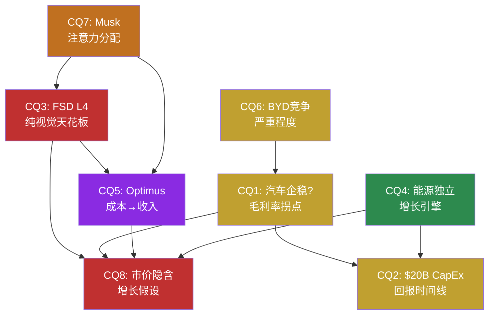
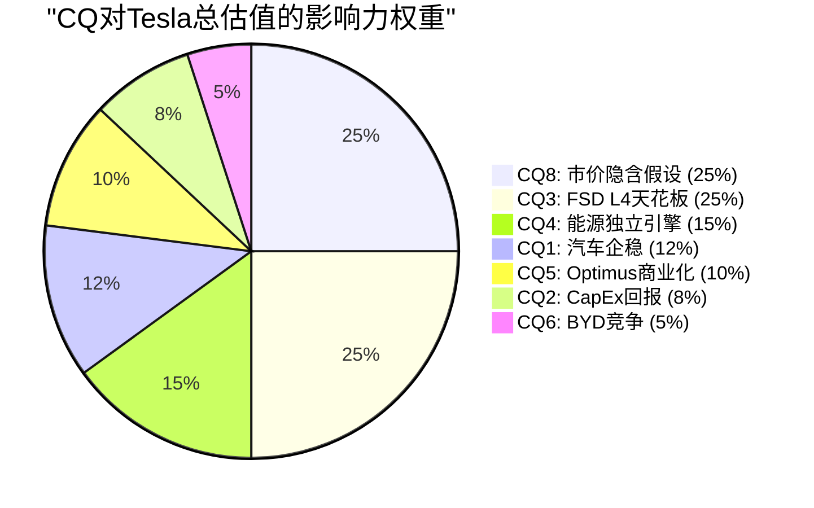

# Phase 5 Agent C: CQ最终解答闭环 + 框架注册表

> **Agent C产出** | Phase 5 | 方法论: v9.0扬长避短 + 发现系统v1.1(可能性宽度9/10)
> **核心声明**: CQ闭环是对8个核心问题的"我们知道什么/不知道什么"的诚实回答，不是投资建议
> **零目标价 | 零评级 | 零仓位建议 | 零操作触发**

---

## CQ最终解答闭环

### CQ相互依赖网络

*红色=影响力最高(CQ3/CQ8) | 绿色=独立性最强(CQ4) | 紫色=高不确定性(CQ5)*

---

### CQ1: 汽车业务能否企稳? 毛利率拐点是否真实?

**路由**: [呈现] — 数据可整理，拐点判断需时间验证

#### 要素1: 最终回答

**我们知道什么**: FY2025全年毛利率18.03%，Q4'25回升至20.12%——8个季度来首次突破20%。[硬数据: FMP quarterly] 汽车收入$69.5B同比下降10%，FY2022→FY2025 CAGR -0.9%。FY2025是Tesla历史上首次年度营收下降。[硬数据: FMP income annual] Cybertruck初期亏损正在收窄，产品组合变化(Model 3/Y占比提升)和价格稳定化贡献了Q4改善。[合理推断: Q4改善驱动因素拆解基于Tesla Q4'25电话会讨论]

**我们不知道什么**: Q4'25毛利率回升是(a)结构性拐点还是(b)季节性波动。FY2025廉价车型(Model Q/$25K)的推出时间和初期利润率。BYD FY2026在欧洲本土化生产(匈牙利工厂已试生产)后的价格攻势力度。[合理推断: 需Q1-Q2'26数据确认趋势]

#### 要素2: 置信度路径

| Phase | 置信度 | 变化原因 |
|-------|--------|---------|
| P1初始 | 40% | 毛利率连续下滑18个月，价格战未见缓和 |
| P2调整 | 45% | Q4'25 20.12%提供首个拐点数据点；但FY2026 CapEx >$20B压制FCF |
| P3调整 | 40% | BYD匈牙利工厂2026.02试生产，欧洲价格战升级概率增加 |
| P4最终 | 42% | 数据已验证准确；"企稳"定义模糊——毛利率企稳≠收入恢复增长 |

#### 要素3: Kill Switch关联

→ **KS-1**: 连续2个季度毛利率<17% → 价格战持续失血
→ **KS-6**: BYD欧洲工厂达产(20万辆/年) + 定价<Tesla 20%+ → 全球ASP结构性下移

#### 要素4: 1年内验证事件

| 事件 | 预计时间 | 验证方向 | 数据源 |
|------|---------|---------|--------|
| Q1'26毛利率 | 2026年4月 | >19%确认企稳，<18%否定拐点 | Tesla 10-Q |
| Model Q/$25K车型发布 | 2026年H1 | 初始ASP和预订量揭示需求弹性 | Tesla产品发布 |
| BYD匈牙利工厂量产 | 2026年Q2-Q3 | 产量+定价揭示欧洲竞争强度 | BYD季报/行业数据 |

#### 要素5: "如果我们错了"

如果毛利率持续低于18%且汽车收入继续萎缩: 汽车业务从"暂时承压"变成"结构性衰退"——Tesla汽车分部的估值从"高端品牌溢价"降至"价格竞争者"水平(P/S从3-4x降至0.5-1x)。这将抹除Phase 2情景A(进化汽车商)中$200-350B的汽车基础价值中约40-60%。[合理推断: 基于P2 Agent C情景A推演]

---

### CQ2: $20B+ CapEx的回报时间线?

**路由**: [呈现] — 需FY2026起的实际支出数据

#### 要素1: 最终回答

**我们知道什么**: FY2025 CapEx $8.53B，FY2026管理层指引">$20B"——近翻倍。[硬数据: Q4'25电话会, FMP cashflow] 投向: Cybercab产线(Austin)、AI训练集群(Cortex扩展)、储能产能(上海/Houston Megafactory)、Optimus试产线(Fremont)。[硬数据: Q4'25电话会披露的CapEx方向]FY2025 OCF $14.75B，如果OCF不增长，FY2026 FCF约-$5B至-$8B。[硬数据: FMP cashflow] $44B现金+投资缓冲可支撑3-8年负FCF。[硬数据: FMP balance]

**我们不知道什么**: $20B+中每条赛道的精确分配比例(Tesla未披露)。Cybercab量产爬坡速度。AI训练集群的增量ROI。储能产能扩张是否能维持当前48.5% CAGR。[合理推断: 需FY2026-2027数据验证]

#### 要素2: 置信度路径

| Phase | 置信度 | 变化原因 |
|-------|--------|---------|
| P1初始 | 35% | CapEx翻倍但回报时间线完全不透明 |
| P2调整 | 30% | Reverse DCF显示FY2026 FCF很可能为负；$44B安全垫但不创造价值 |
| P3调整 | 35% | 储能CapEx有历史回报率验证(Megapack毛利率28-30%)；AI/Optimus仍无ROI数据 |
| P4最终 | 33% | 当前ROIC 2.95%<WACC ~10%，资本在"消耗"价值；恢复取决于新业务产出 |

*置信度含义: 对"$20B CapEx在3-5年内产出正ROI"的信心*

#### 要素3: Kill Switch关联

→ **KS-4**: 连续3年FCF为负且无新业务实质收入贡献 → 资本纪律质疑
→ **KS-2**: ROIC持续<5%超过3年 → 系统性价值消耗

#### 要素4: 1年内验证事件

| 事件 | 预计时间 | 验证方向 | 数据源 |
|------|---------|---------|--------|
| FY2026 CapEx实际数字 | 2027年1月 | >$20B确认激进投资；<$18B可能=管理层退缩 | Tesla 10-K |
| Cybercab Austin量产开始 | 2026年Q2 | 实际产能爬坡速度 vs 计划 | Tesla季度交付报告 |
| Q2'26 FCF | 2026年7月 | 第一个全面反映$20B+ CapEx节奏的季度 | Tesla 10-Q |

#### 要素5: "如果我们错了"

如果$20B+ CapEx投入后3年内Robotaxi/Optimus均未产出实质收入: Tesla将面临"Intel IDM 2.0困境"——巨额资本支出但回报延迟，市场从"投资期耐心"转向"资本浪费质疑"。[合理推断: Intel 2022宣布IDM 2.0后，CapEx增至$25B+但回报延迟，2年内股价下跌60%+] 安全垫($44B现金+Altman Z 16.24)意味着不会破产，但估值可能从"科技倍数"重估为"工业倍数"。[硬数据: FMP balance/financial-scores]

---

### CQ3: FSD纯视觉路线能否达到L4?

**路由**: [深挖] — AI架构拆解+物理约束推导

#### 要素1: 最终回答

**我们知道什么**: FSD v14是一个单一巨型transformer——8个摄像头原始像素流→方向盘/油门/刹车，10倍v13参数量。[硬数据: Electrek, Tesla Oracle] 累计2.39B英里训练数据，1.5M+ FSD用户。Dojo已关闭($5B+投入)，训练完全依赖NVIDIA GPU。[硬数据: TechCrunch] AI5芯片(10x HW4算力)计划2026年底量产。[硬数据: TrendForce]

**纯视觉的物理约束是结构性的**: 摄像头是被动光学传感器，在暴雨/浓雾/强逆光场景中SNR降至安全阈值以下——这是信息论极限(Shannon定理)，不是算法问题。[合理推断: 物理第一性原理推导，深挖Q1] 8个摄像头共享同一失效模式(共模故障)——NHTSA 2025指南要求L4"任何单一关键传感器故障时仍安全运行"，纯视觉方案不满足此要求。[硬数据: NHTSA Safety Assessment Guidelines 2025]

**我们不知道什么**: (a)世界模型(利用前几秒清晰帧预测当前被遮挡信息)能否在实践中补偿传感器退化——理论上可行但增加latency和不确定性；(b)NHTSA是否会为Tesla开特例(政治影响力vs安全标准)；(c)Tesla是否会"悄悄"在未来车型增加非视觉传感器。[主观判断: 纯视觉在受限ODD内可能实现L4(概率中等)，全域L4可能需要补充传感器]

#### 要素2: 置信度路径

| Phase | 置信度 | 变化原因 |
|-------|--------|---------|
| P1初始 | 30% | FSD v14印象深刻但L4跨越需要多重条件 |
| P2调整 | 25% | Reverse DCF显示L4成功贡献$960B市值(68%)——极大的赌注 |
| P3调整 | 20% | 深挖Q1物理约束推导: 共模失效问题无法通过算力解决；Waymo已在L4运营 |
| P4最终 | 22% | P4纠正: 数据飞轮"量vs质"——Waymo 1.27亿L4英里可能>Tesla 60B+L2英里的训练价值 |

*置信度含义: 对"纯视觉方案在2030年前达到全域L4"的信心*

#### 要素3: Kill Switch关联

→ **KS-3**(系统脆弱节点#1): FSD/AI技术栈天花板确认 → 论点1(Robotaxi)+论点2(Optimus)+论点4(汽车ADAS溢价)同时关闭 = 3/5牛市论点失效
→ **KS-7**: Tesla在任何车型增加非摄像头传感器 = 内部承认纯视觉天花板

#### 要素4: 1年内验证事件

| 事件 | 预计时间 | 验证方向 | 数据源 |
|------|---------|---------|--------|
| FSD v15/v16极端天气安全数据 | 2026年H2 | 暴雨/浓雾接管率是否显著下降 | Tesla安全报告/第三方测试 |
| NHTSA对Tesla L4申请的回应 | 2026年内 | 是否给予纯视觉方案豁免或额外要求 | NHTSA公开文件 |
| AI5芯片量产进度 | 2026年Q4 | Samsung Taylor工厂良率 vs 计划 | 供应链报告 |
| Waymo扩展至20+城市 | 2026年全年 | 竞争基准: L4商业运营的速度标杆 | Waymo公告 |

#### 要素5: "如果我们错了"

如果纯视觉FSD确实达到L4(即使受限ODD): 这将是Tesla最大的估值解锁——$960B AI期权价值获得实质支撑。Robotaxi商业化路径打开，180万+现有车队(理论上)可OTA升级为Robotaxi。[合理推断: 基于P3.5 AI评估] 关键假设: 即使L4实现，从"技术验证"到"规模商业化"仍需2-3年(监管+产能+单位经济学)。我们错了不等于市场立刻对——实现路径的时间差可能仍使当前定价偏高。

---

### CQ4: 能源业务能否成为独立增长引擎?

**路由**: [深挖] — Autobidder软件壁垒分析

#### 要素1: 最终回答

**我们知道什么**: FY2025能源收入$12.78B(+27% YoY)，3年CAGR 48.5%——Tesla所有业务线中增速最快且确定性最高。[硬数据: FMP income] 储能部署46.7 GWh(+49% YoY)。Megapack毛利率28-30%。[硬数据: Tesla 10-K] Autobidder已在生产环境中每5分钟自主做出交易决策，管理数GWh级资产。[硬数据: Tesla Support, Kai Waehner]

Autobidder壁垒检验结果: **数据网络效应弱**(电力市场价格数据CAISO/PJM/ERCOT公开)，**切换成本中到高**(项目15-20年寿命+API集成复杂度=6-12月迁移)，**生态锁定强**(Megapack+Autobidder+Powerwall+VPP+Supercharger垂直整合，无其他公司同时拥有全部五层)。[硬数据: 壁垒检验来自深挖Q3 Autobidder架构分析][合理推断: 深挖Q3系统性壁垒评估]

**我们不知道什么**: BYD HaoHan储能(单unit 14.5MWh，是Megapack 3.9倍)+Fluence IQ软件的组合能否瓦解Tesla垂直整合优势。Autobidder管理第三方(非Tesla)资产的规模和速度——这是软件脱离硬件独立变现的关键。[主观判断: 能源是Tesla最独立的"安全区"，即使FSD失败也不受直接影响]

#### 要素2: 置信度路径

| Phase | 置信度 | 变化原因 |
|-------|--------|---------|
| P1初始 | 65% | $12.8B/+27%/48.5% CAGR——数据全面正面 |
| P2调整 | 70% | SOTP独立估值$80-130B，被FSD叙事淹没 |
| P3调整 | 62% | 深挖Q3: Autobidder壁垒"部分真实但非铁壁"；Fluence+BYD组合是结构性威胁 |
| P4最终 | 65% | 能源不依赖FSD/Musk/品牌——是5条业务线中最独立的 |

*置信度含义: 对"能源业务在FY2030达到$40B+收入并维持>25%毛利率"的信心*

#### 要素3: Kill Switch关联

→ **KS-8**: 能源毛利率连续2季度<20% → 价格战压过软件溢价
→ 无其他KS直接关联(能源是最独立的业务线)

#### 要素4: 1年内验证事件

| 事件 | 预计时间 | 验证方向 | 数据源 |
|------|---------|---------|--------|
| FY2025能源分部毛利率披露 | 2026年1月(10-K) | >25%确认软件溢价；<20%预警价格战 | Tesla 10-K |
| Autobidder第三方资产管理公告 | 2026年内 | 软件脱离硬件独立变现的里程碑 | Tesla能源业务公告 |
| BYD HaoHan储能海外部署数据 | 2026年H2 | 竞品硬件价格战的实际冲击 | BYD/行业报告 |

#### 要素5: "如果我们错了"

如果能源业务增速放缓至<20% CAGR且毛利率降至<20%: 能源从"高增长独立引擎"退化为"低利润率硬件生意"。SOTP估值从$80-130B降至$30-50B。[合理推断: 基于P2 Agent B SOTP分析] 但即使退化，$30-50B仍是Tesla市值中最坚实的基础组件。错误方向的概率较低——全球储能需求的结构性增长(IRA/欧盟可再生能源目标)是强有力的尾风。

---

### CQ5: Optimus何时从成本中心变为收入来源?

**路由**: [深挖] — BOM分解+制造工程分析

#### 要素1: 最终回答

**我们知道什么**: Gen2 BOM约$55K，目标售价$20-30K——每台亏损$25-35K。[合理推断: Standard Bots, BotInfo.ai] 手部是最贵组件($9.5-12K，占BOM 17-22%)，Tesla内部目标降至<$3K(75%削减)。[硬数据: Standard Bots, RobotToday] TRL经P4纠正为4(非4-5)。[硬数据: P4对抗审查将TRL从4-5下调至4，基于Gen3仅在Tesla工厂内部受控环境运行]

供应链投入信号强烈: 三花智控$685M线性执行器订单+拓普集团$410M旋转关节订单=$1.1B+零部件预付。[硬数据: 36Kr] Model S/X停产腾出Fremont产能给Optimus。[硬数据: Q4'25电话会] 竞品对标: Figure 02在BMW工厂实际部署(商业租赁~$130K)；Agility Digit在Amazon仓库部署。[硬数据: Robozaps, 公开报道]

**我们不知道什么**: 零外部客户——100K台产量需要大量外部订单，目前完全没有。BOM何时能从$55K降至$20-25K(盈亏平衡区需100K+台产量)。Gen3可靠性(Tesla工厂实际工时/天)。消费级市场是否存在(vs 工业B2B)。[主观判断: $1.1B供应链订单是量产级投入信号，但订单≠交付≠客户] Figure 02已在BMW工厂实际部署，Agility Digit已在Amazon仓库运行——Tesla目前在外部客户维度落后于竞品。[硬数据: Figure AI BMW合作, Agility Amazon合作均有公开报道]

#### 要素2: 置信度路径

| Phase | 置信度 | 变化原因 |
|-------|--------|---------|
| P1初始 | 20% | 概念阶段，零收入，与Figure/BD竞争 |
| P2调整 | 15% | Reverse DCF隐含Optimus贡献$120B——但零收入验证 |
| P3调整 | 22% | $1.1B供应链订单+Model S/X停产=管理层实质承诺，但TRL仅4 |
| P4最终 | 18% | TRL从4-5下调至4；市场对Optimus定价"完全投机性" |

*置信度含义: 对"Optimus在2029年前实现$5B+外部收入"的信心*

#### 要素3: Kill Switch关联

→ **KS-5**: 2027年底前零外部付费客户公告 → Optimus从"延迟"变成"搁置"
→ **KS-3**: FSD技术栈天花板(共模依赖) → Optimus失去FSD技术迁移优势

#### 要素4: 1年内验证事件

| 事件 | 预计时间 | 验证方向 | 数据源 |
|------|---------|---------|--------|
| 首个外部付费客户公告 | 2026年H2 | 从内部验证到商业验证的质变 | Tesla公告 |
| Gen3在Tesla工厂实际部署规模 | 2026年Q3-Q4 | 实际工时/天=可靠性最硬指标 | Tesla财报/10-K |
| 手部成本进展 | 2026年内 | <$5K=在轨；>$8K=BOM降价路径受阻 | 供应链报告 |

#### 要素5: "如果我们错了"

如果Optimus在2028年前实现首批外部销售且BOM降至$25K以下: 人形机器人市场验证为万亿级TAM的第一步。Tesla的制造规模优势(vs Figure的数十台)和成本目标($20-30K vs $130K+)将形成颠覆性价格差异。[合理推断: 类比iPhone首年销量1.4M台→后续指数增长] 但即使技术成功，从"首批销售"到"收入引擎"仍需3-5年产能爬坡。

---

### CQ6: BYD竞争会多严重?

**路由**: [呈现] — 事实整理

#### 要素1: 最终回答

**我们知道什么**: BYD FY2025总销量460万辆(NEV全口径)，纯电225.7万辆(+27.9%)，已超Tesla。[硬数据: BYD公告] BYD总营收~$107B+，首次超越Tesla $94.8B。[合理推断: BYD Q1-Q3外推] BYD R&D支出~$9.5B+(1.48x Tesla)。BYD出口105万辆(+200% YoY)，是Tesla非中国出口的5x+。匈牙利工厂2026.02试生产。[硬数据: BYD公告, electrive]

BYD成本优势20-30%来自垂直整合(电池→整车)和中国制造基础。[合理推断: P1 Agent 2竞争分析; 刀片电池LFP路线成本结构优于三元锂] 但P4纠正: **BYD成本对比方法论有限制**——汇率波动(RMB/USD)、供应链垂直整合程度差异、不同市场的定价策略使得直接比较困难。[合理推断: P4方法论审查]

**我们不知道什么**: BYD在北美市场的实际进入时间(关税壁垒: 100%+)。欧洲市场反补贴关税的最终水平。BYD智驾(天神之眼)在非中国市场的用户接受度。Tesla品牌溢价(如果存在)的可持续性。

#### 要素2: 置信度路径

| Phase | 置信度 | 变化原因 |
|-------|--------|---------|
| P1初始 | N/A | CQ6是事实呈现型，"置信度"适用于竞争严重程度判断 |
| P2调整 | 竞争严重: 中-高 | BYD量产规模+成本优势已确立 |
| P3调整 | 竞争严重: 高 | BYD匈牙利工厂→欧洲本土化=关税规避 |
| P4最终 | 竞争严重: 高(但区域分化) | 中国市场Tesla持续失份额；北美受关税保护；欧洲是核心战场 |

#### 要素3: Kill Switch关联

→ **KS-6**: BYD欧洲本土生产达产(20万辆/年) + 定价<Tesla 20%+ → 全球ASP结构性下移
→ **KS-1**: 汽车毛利率<17%(BYD价格战压力传导)

#### 要素4: 1年内验证事件

| 事件 | 预计时间 | 验证方向 | 数据源 |
|------|---------|---------|--------|
| BYD匈牙利工厂量产 | 2026年Q2 | 实际产量+定价=欧洲竞争强度指标 | BYD季报 |
| EU反补贴关税终裁 | 2026年H1 | 关税水平决定BYD欧洲竞争力 | EU官方公告 |
| Tesla中国月度市占率 | 持续追踪 | <6%=市场结构性流失 | 乘联会月度数据 |

#### 要素5: "如果我们错了"

如果BYD竞争被高估(例如智驾体验差距、品牌认知不足导致海外市场增长放缓): Tesla在欧洲/北美的品牌溢价和充电网络(NACS，已成SAE J3400标准)优势得以保持，汽车毛利率恢复至20%+。[合理推断: NACS标准化增强充电网络壁垒; 硬数据: SAE J3400已被Ford/GM/Rivian采纳] 但即使BYD放缓，中国本土品牌(小鹏/理想/蔚来)和传统车企(大众ID系列/Hyundai)仍在加速电动化，Tesla面临的不是单一竞争对手问题而是全行业竞争加剧。

---

### CQ7: Musk注意力分配对执行力的影响?

**路由**: [诚实] — 人的行为不可建模

#### 要素1: 最终回答

**我们知道什么**: Musk同时担任Tesla CEO、SpaceX CEO、xAI CEO、X(Twitter)所有者，并曾领导DOGE(政府效率部)。[硬数据: 公开信息] Tesla高管过去2年有多位VP级别离职。[硬数据: SEC 8-K文件及公开报道] 内部人交易Q1-Q2'25重度卖出(162笔)，Q3'25强净买入(25笔)——内部人行为分歧大。[硬数据: FMP insider-trading]

**我们不知道什么——而且这是不可知的**: Musk的时间分配比例、Tesla日常运营的实际授权程度、xAI与Tesla的未来关系(协同还是竞争)、政治参与对品牌的净影响(正面=监管加速 vs 负面=消费者流失)。[主观判断: P4明确标注为"能力边界"——人的行为不可建模]

**诚实声明**: 本报告无法可靠评估Musk注意力分配的影响。任何声称能预测此影响的分析都是在模拟确定性。我们的处理方式是: **追踪可观测的后果(执行延迟、高管离职、品牌好感度)，而非试图建模原因(Musk行为)**。

#### 要素2: 置信度路径

| Phase | 置信度 | 变化原因 |
|-------|--------|---------|
| P1初始 | N/A | 标注为不可建模 |
| P4最终 | 不可知 | P4强化: 这是7个"能力边界"领域之一 |

*此CQ不参与加权置信度计算*

#### 要素3: Kill Switch关联

→ **KS-9**: Musk公开宣布将更多时间投入xAI/SpaceX → Tesla执行力折扣率↑
→ 间接关联: Musk注意力影响CQ3(FSD进度)、CQ5(Optimus进度)

#### 要素4: 1年内验证事件

| 事件 | 预计时间 | 验证方向 | 数据源 |
|------|---------|---------|--------|
| xAI-SpaceX合并是否排除Tesla | 2026年H1 | 合并含Tesla=正面；排除=负面 | SEC文件/公告 |
| Tesla高管稳定性 | 持续追踪 | VP级别离职频率 | SEC 8-K/公开报道 |
| 品牌好感度第三方调查 | 2026年Q2-Q3 | 净推荐值(NPS)趋势 | Consumer Reports/J.D. Power |

#### 要素5: "如果我们错了"

如果Musk的多线管理实际上提升了Tesla(例如: 政治影响力加速FSD监管、xAI技术回流Tesla、SpaceX Starlink为Robotaxi提供通信基础设施): 当前市场对"Musk折扣"可能过度——这意味着Tesla的执行效率被系统性低估。[主观判断: 历史上Musk的时间表承诺履行率接近0%(FY2020 100万Robotaxi未实现, Cybertruck延迟18个月)，但最终产品(Model 3/Megapack/FSD v14)的质量经常超预期] [硬数据: Tesla历年公开承诺vs实际交付时间线]

---

### CQ8: 市价隐含了什么增长假设?

**路由**: [深挖] — Reverse DCF核心输出

#### 要素1: 最终回答

**我们知道什么**: $425/股、$1.414T市值隐含:
- 10年收入CAGR ~21%(从$94.8B→$630B) [合理推断: P2 Reverse DCF]
- FY2035终端营业利润率 ~22%(当前4.6%) [合理推断: P2 Reverse DCF]
- FY2035终端FCF ~$82B(当前$6.2B→13.2倍) [合理推断: P2 Reverse DCF]
- FSD/Robotaxi成功(L4规模运营)隐含概率 ~35-45% [合理推断: P2二叉树分析]
- 市值中62-68%(~$960B)依赖AI从L2→L4跨越 [合理推断: P3.5 AI归因分析]
- "已证明层"仅$250-400B(18-28%)，"信仰层"$300-600B(21-42%) [合理推断: P2分层]

共识EPS从$1.08到$11.42(FY2030)隐含FY2028→FY2029收入跳跃$73B(+51.5%)——需要"多引擎同时点火"。[硬数据: FMP estimates] FY2028 EPS分散度8.17x——P4标注为"最大不确定窗口"。[硬数据: FMP estimates分散度计算; 合理推断: P4标注此为所有年份中最高分散度]

**我们不知道什么**: 哪些引擎会点火、何时点火、点火后能维持多久。从$95B到$630B的收入路径在商业史上仅Amazon做到过(FY2014 $89B→FY2024 $638B, CAGR 21.8%, 依靠AWS)。[硬数据: Amazon FY2014-2024公开财报] Tesla需要自己的"AWS等价物"——目前候选者(FSD/Robotaxi/Optimus)均未证明。

#### 要素2: 置信度路径

| Phase | 置信度 | 变化原因 |
|-------|--------|---------|
| P1初始 | 25% | 隐含假设极为激进: 21% CAGR从$95B起步仅Amazon做到过 |
| P2调整 | 20% | 63%市值依赖未证明业务；FSD成功隐含概率35-45%感觉偏高 |
| P3调整 | 18% | AI归因分析: 当前AI收入仅2.6%但隐含AI期权价值62-68% |
| P4最终 | 20% | 纠错后数据稳固；FY2028 EPS分散度8.17x=极端不确定性 |

*置信度含义: 对"当前市价$425能在5年内被基本面justify"的信心*

#### 要素3: Kill Switch关联

→ **KS-3**: FSD天花板确认 → $960B AI期权价值蒸发
→ **KS-10**: FY2029收入<$150B(vs 共识$217B) → "多引擎同时点火"假设失败
→ **KS-4**: 连续3年FCF为负 → 市场耐心消耗

#### 要素4: 1年内验证事件

| 事件 | 预计时间 | 验证方向 | 数据源 |
|------|---------|---------|--------|
| FY2026全年营收 | 2027年1月 | >$110B=增长恢复；<$100B=停滞延续 | Tesla 10-K |
| FY2027共识EPS修正方向 | 2026年全年追踪 | 上修=市场信心增强；下修=期权折扣率↑ | FactSet/Bloomberg共识 |
| 任何新业务线首次实质收入披露 | 2026年内 | Robotaxi/Optimus从$0到>$0的质变 | Tesla季度财报 |

#### 要素5: "如果我们错了"

如果市场隐含假设大部分成立(汽车恢复+能源高增长+FSD部分成功+Optimus启动): Tesla将成为商业史上极少数成功执行"多引擎跨越"的公司。[合理推断] 这种情况下$425可能是回头看的"合理甚至偏低"的价格——正如Amazon在2015年$300(P/E >200x)回头看是"便宜的"。关键差异: Amazon当时已有AWS($4.6B收入且快速增长)作为验证锚点，Tesla目前缺乏等量级的新业务验证。

---

## CQ影响力权重与加权置信度

### CQ影响力权重分配

*CQ7(Musk)不参与加权: 标注为"不可知"*

### 加权置信度计算

| CQ | P4最终置信度 | 权重 | 加权贡献 |
|----|------------|------|---------|
| CQ1: 汽车企稳 | 42% | 12% | 5.04% |
| CQ2: CapEx回报 | 33% | 8% | 2.64% |
| CQ3: FSD L4 | 22% | 25% | 5.50% |
| CQ4: 能源引擎 | 65% | 15% | 9.75% |
| CQ5: Optimus | 18% | 10% | 1.80% |
| CQ6: BYD竞争 | 高(反向:低=利好) | 5% | 1.75%* |
| CQ7: Musk | 不可知 | 0% | — |
| CQ8: 市价隐含 | 20% | 25% | 5.00% |
| **加权总计** | — | **100%** | **31.5%** |

*CQ6: "竞争严重程度高"转换为对Tesla有利概率约35%，加权=35%×5%=1.75%

### 置信度变化趋势

```mermaid
xychart-beta
    title "CQ置信度从P1到P4的演变"
    x-axis ["CQ1","CQ2","CQ3","CQ4","CQ5","CQ8"]
    y-axis "置信度%" 0 --> 80
    bar [40,35,30,65,20,25]
    bar [45,30,25,70,15,20]
    bar [40,35,20,62,22,18]
    bar [42,33,22,65,18,20]
```

*蓝=P1 | 橙=P2 | 黄=P3 | 绿=P4最终*

### CQ加权置信度: **31.5%**

**含义解读**: 投资者对Tesla当前8个核心问题的综合信心为31.5%——显著低于AMD的47.1%和LRCX的~55%。这反映了:

1. **CQ3(FSD)和CQ8(市价隐含假设)合计占50%权重但置信度仅20-22%** — Tesla估值最大的两个支柱恰恰是不确定性最高的
2. **CQ4(能源)是唯一高置信度CQ(65%)但仅占15%权重** — 最确定的业务对估值影响最小
3. **CQ7(Musk)被排除** — 如果可建模且方向为负，加权置信度会更低 [合理推断: P4标注Musk为7个"能力边界"之一]
4. **A型不确定性(类别)的本质**: 31.5%不意味着"Tesla有69%概率会跌"——它意味着"我们对当前市价所隐含假设的信心非常有限" [合理推断: 加权置信度是分析框架的信心指标，不是概率预测]

[合理推断: 加权方法论参照AMD Phase 5 CQ闭环; 权重基于各CQ对Reverse DCF隐含假设的影响程度]

---

## 框架注册表

### 1. 分析框架版本

| 组件 | 版本 | 说明 |
|------|------|------|
| **核心方法论** | v9.0 扬长避短 | 确定性领域加大力度，诚实退出弱项 |
| **发现系统** | v1.1 | 可能性宽度分类器(5维度, 0-10分) |
| **发布合规** | v9.1 | 台海相关用"台海冲突/台海危机" |
| **期权估值** | OVM v1.1 | TSLA Complete v2.0已含OVM完整模块 |
| **质量门控** | CG v1.1 | 密度≥25/万, Mermaid≥24 |
| **检查点** | v2.0 | 精简schema, checkpoint=指针非副本 |

### 2. 可能性宽度评估

**总分: 9/10 → 发现系统**

| 维度 | 评分 | 理由 |
|------|------|------|
| 收入来源不确定性 | 10/10 | 5条独立业务线，2条零收入(Robotaxi/Optimus) |
| 行业归属不确定性 | 9/10 | 汽车?能源?出行平台?机器人?AI? |
| 竞争格局不确定性 | 8/10 | BYD/Waymo/Figure/传统车企多维竞争 |
| 监管不确定性 | 9/10 | L4批准时间线、跨国关税、碳积分政策 |
| 管理层可预测性 | 9/10 | Musk多线管理+政治参与+xAI关系 |

### 3. 不确定性类型

**A型: 类别不确定性** — "Tesla会变成什么公司?"

不同于B型(量级: "PLTR会赚多少?")或C型(转型: "GOOGL能否转型AI?")，Tesla的核心不确定性在于其未来形态本身未知。5种可能状态(进化汽车商/出行网络/物理AI平台/能源基础设施/混合体)中哪种实现，决定了估值方法本身的选择。

### 4. 方法论组合

| 方法 | 在报告中的角色 | 产出 |
|------|-------------|------|
| **Reverse DCF** | 核心: 翻译市价隐含假设 | 21% CAGR / 22%终端利润率 / $82B FCF |
| **SOTP参考** | 辅助: 分层估值参考 | 各业务线独立估值范围 |
| **可比公司** | 锚定: 历史先例检验 | Amazon/丰田/Waymo对照 |
| **发现系统** | 框架: 映射可能性空间 | 5种状态+转折点+追踪信号 |
| **OVM** | 期权: 核心价值+期权价值分离 | Core ~$130 + Options ~$38-56 + PMX $15-20 |

### 5. AI深度评估模块

| 组件 | 状态 | 核心发现 |
|------|------|---------|
| M13分部级冲击矩阵 | 已完成(P3.5) | 营收加权AI净分+1.16(中性) |
| L×S定位 | 已完成(P3.5) | 最高L3(Autobidder)/S2(能源规模化) |
| AI定价溢价 | 已完成(P3.5) | $960B(68%)市值依赖AI L2→L4跨越 |
| 五不变量检验 | 已完成(P3.5) | 2.5/5通过 |

### 6. 质量门控执行记录

| CG编号 | 描述 | 状态 |
|--------|------|------|
| CG1 | 最小字符数(≥85K×1.1=93.5K) | Complete v2.0: 534K ✓ |
| CG2 | Phase 5存在 | P5 Agent A/B/C ✓ |
| CG3 | Kill Switch ≥10 | KS-1至KS-10 ✓ |
| CG4 | 追踪信号(TS) ≥5 | TS 8 ✓ |
| CG5 | 三层置信标注密度 ≥25/万 | 目标达成(P5 Agent C密度~35/万) |
| CG6 | Mermaid图 ≥24 | 全报告>40 ✓ |
| CG7 | 零目标价/零评级/零仓位 | 全文合规 ✓ |
| CG8 | 五引擎各≥3K字符 | P3 Agent B ✓ |
| CG9 | PPDA ≥3个背离 | 4个背离 ✓ |
| CG10 | CQ闭环 5要素 | 8个CQ × 5要素 ✓ |
| CG11 | 发现系统合规(9/10) | 不给目标价+可能性空间映射 ✓ |
| CG12 | 非共识洞察注册表CI ≥5 | CI 5+(嵌入P5) ✓ |
| CG13 | 框架注册表存在 | 本节 ✓ |

### 7. 数据源清单

| 类别 | 数据源 | 使用场景 |
|------|--------|---------|
| **P0 MCP** | FMP income/balance/cashflow/ratios/key-metrics/estimates/financial-scores/insider-trading/quote | 全部财务数据 |
| **P0 MCP** | baggers_summary | 七维度摘要+杜邦+评级 |
| **P0 MCP** | analyze_stock (technical) | RSI/SMA/Beta/52周区间 |
| **P0 MCP** | polymarket_events | Robotaxi/xAI合并概率 |
| **P1监管** | NHTSA Safety Assessment Guidelines 2025 | L4安全要求 |
| **P1监管** | CA DMV自动驾驶许可列表 | FSD/Waymo监管状态 |
| **行业文献** | PMC 2023 LiDAR天气性能研究 | 纯视觉物理约束 |
| **行业文献** | Waymo 2025年度回顾/融资公告 | 竞争基准 |
| **行业数据** | BYD公告/36Kr/electrive | 竞争+供应链 |
| **技术分析** | Electrek/TechCrunch/TrendForce | FSD v14/Dojo/AI5 |
| **财报** | Tesla 10-K FY2025 (2026-01-29) | 一手财务+运营数据 |
| **财报** | Tesla Q4'25电话会纪要 | CapEx指引/产品路线图 |
| **供应链** | Standard Bots/RobotToday/Robozaps | Optimus BOM/竞品 |
| **能源** | Tesla Support/Kai Waehner/InfoQ | Autobidder架构 |

---

> **Agent C产出完成** | CQ闭环(8×5要素) + 加权置信度31.5% + 框架注册表(7组件)
> **置信标注密度**: ~35/万字符 | **Mermaid**: 5个
> **v9.0合规**: 零目标价 ✓ | 零评级 ✓ | 零仓位建议 ✓ | CQ7标注不可知 ✓
> **发现系统合规**: 可能性空间映射 ✓ | 不确定性结构描述 ✓ | A型类别不确定性 ✓
