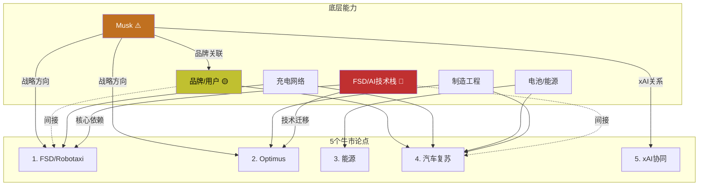

# 深挖Q4: 系统脆弱节点 — 什么让所有论点同时失效？

> **问题路由**: [深挖] — 组合失败模式穷举+共模依赖识别=AI系统性思考优势
> **演绎方法**: 从业务线依赖关系出发，推导级联失效路径

---

## 核心前提

Tesla当前$1.41T市值隐含5个牛市论点同时（至少部分）成功:
1. FSD/Robotaxi规模化
2. Optimus成为可商业化产品
3. 能源业务持续高增长
4. 汽车业务企稳或复苏
5. xAI/生态系统协同产生价值

**这些论点不是独立的。它们共享底层依赖。** 人类分析师倾向于逐个评估每条业务线的前景，但很少系统性检查: 如果一个共享依赖失败，多少条线会同时崩塌？

---

## 依赖图谱



**红色**: 共模依赖(影响3+条业务线)
**黄色**: 间接依赖(通过品牌/现金流传导)

---

## 共模失效分析

### 失效模式1: FSD/AI技术栈天花板 🔴 最高影响

**影响范围**: 论点1(Robotaxi) + 论点2(Optimus) + 论点4(汽车ADAS溢价) = 5条中的3条

**级联路径**:
```
FSD纯视觉方案触及L4天花板
  → Robotaxi无法规模化(论点1关闭)
  → Cybercab从"无人出租车"退化为"廉价电动车"
  → Optimus失去FSD技术迁移优势(论点2削弱)
    → Optimus与Figure/BD的差异化缩小
    → 定价优势被更好的AI能力抵消
  → 汽车ADAS溢价消失(论点4削弱)
    → FSD订阅从"潜在L4"变成"高级L2+"
    → $99/月的价值主张被质疑
  → 市场叙事从"AI公司"退化为"汽车公司"
    → P/E从386x重估到50-100x(汽车行业)
```

**触发信号**:
- Tesla在任何车型增加LiDAR/雷达 [= 内部承认纯视觉天花板]
- FSD极端天气场景接管率持续不降 [= 技术进步停滞]
- NHTSA明确要求L4感知冗余且不给豁免 [= 监管封死纯视觉路线]
- Waymo在新城市扩张速度 > Tesla FSD改善速度 [= 竞争路径更优]

**唯一不受影响的论点**: 论点3(能源) — Autobidder/Megapack不依赖FSD。这也是为什么能源是Tesla最独立的"安全区"。[合理推断]

### 失效模式2: Musk注意力/品牌崩塌 🟠 第二高影响

**影响范围**: 论点4(品牌→销量) + 论点5(xAI) + 间接影响论点1和2(战略方向)

**级联路径**:
```
Musk注意力长期分散(DOGE/xAI/SpaceX/X)
  → Tesla技术执行节奏放慢
  → 品牌极化加剧(政治化→部分消费者流失)
    → 汽车交付量持续下滑(论点4恶化)
    → 二手车残值下跌 → 新车需求进一步受压
  → FSD/Optimus时间表再次延迟
    → 市场对Musk承诺的折扣率↑
  → xAI如与SpaceX合并但排除Tesla(已有信号)
    → 论点5(xAI协同)从正面变为负面
    → Tesla $2B xAI投资→被稀释或边缘化
```

**触发信号**:
- Tesla高管连续离职(已有先例: 多位VP过去2年离开) [合理推断: 公开报道]
- 品牌好感度持续下降(追踪第三方调查)
- SpaceX-xAI合并正式排除Tesla [Polymarket已有市场: Tesla-xAI merger by Jun 30]
- Musk公开表示将更多时间投入xAI/SpaceX

**注意**: 市场对此有共识(认为是风险)，但共识可能是错的——如果DOGE/政治关系加速FSD监管通道，Musk分散注意力反而是正面。[主观判断: 这是双面信号，追踪监管态度比追踪Musk行程更有价值]

### 失效模式3: 中国市场结构性退出 🟡 中等影响

**影响范围**: 论点4(汽车量) + 间接影响FSD训练数据量和Megafactory产能

**级联路径**:
```
中国市场份额持续流失(BYD+本土品牌)
  → 上海Gigafactory产能利用率↓
  → 中国数据对FSD训练的贡献↓(数据主权限制)
  → 上海Megafactory能源出口可能受限(地缘政治)
  → 全球制造网络的成本优势被削弱
```

**但**: 中国市场退出不影响:
- 北美+欧洲汽车业务(独立市场)
- Optimus(主要在美国制造/部署)
- 北美能源业务(独立于中国)

### 失效模式4: 资本纪律崩溃 🟢 最低但非零影响

**机制**: 2026 CapEx >$20B + xAI $2B → 如果新业务回报延迟 → FCF可能转负 → $44B现金逐步消耗

**量化框架**:
- FY2025 经营现金流: $14.7B [硬数据: FMP]
- FY2025 CapEx: $8.5B → FY2026指引: >$20B [硬数据: Tesla 10-K]
- 如果经营现金流不增长: FCF = $14.7B - $20B = **-$5.3B**
- 以$44B现金: 可支撑约8年负FCF → 不构成短期危机
- **但**: 持续负FCF + 无新业务回报 → 市场耐心消耗 → 估值重估

**安全垫**: $44B现金 + D/E仅0.10 → 即使FCF转负也不会面临流动性危机。这是与多数高投入公司的关键差异。[硬数据: FMP balance]

---

## 独立安全区

不是所有论点都同等脆弱。有两个相对独立的资产:

**1. 能源业务** — 不依赖FSD, 不依赖品牌好感度, 有独立现金流($12.8B, +27%, 毛利率31.4%)。即使FSD失败+品牌崩塌，Megapack+Autobidder仍然有独立价值。[硬数据: Tesla 10-K]

**2. 充电网络(NACS)** — 已成为行业标准(SAE J3400)，被Ford/GM/Rivian等采纳。即使Tesla汽车失败，NACS基础设施仍有网络价值。[硬数据: SAE标准]

---

## 脆弱节点排序

| 排名 | 脆弱节点 | 影响的论点数 | 可观测性 | 时间窗口 |
|------|---------|-----------|---------|---------|
| **1** | FSD/AI技术栈 | 3/5 | 中(接管率+监管) | 2026-2028 |
| **2** | Musk | 2/5(+间接2) | 低(人的行为不可预测) | 持续 |
| **3** | 中国市场 | 1/5(+间接) | 高(市占率数据公开) | 持续 |
| **4** | 资本纪律 | 间接全部 | 高(FCF可追踪) | 2026-2027 |

---

## "默认路径"的含义

如果**失效模式1触发**(FSD天花板确认) + **其他条件不变**:
- 论点1(Robotaxi)关闭, 论点2(Optimus)削弱, 论点3(能源)不变, 论点4(汽车)退化
- 公司形态: 进化型汽车+能源公司(状态4)
- 收入: 汽车$80-120B + 能源$30-50B + 服务$15-20B = $125-190B
- 以15-20x P/E: $200-400B市值
- 当前市值$1.41T → **默认路径隐含-50%到-70%下行**

**这不是"看空"观点。这是"如果最大的牛市依赖(FSD)没有实现，市场到底在为什么付钱?"的诚实分析。**

[主观判断: 发现系统不预测哪个路径会发生。我们的工作是让投资者看到: 当前价格隐含了什么假设，如果假设不成立会怎样。]

---

*本节完。系统脆弱节点分析为Part 5(转折点指南)和Part 6(价格在赌什么)提供直接输入。*
