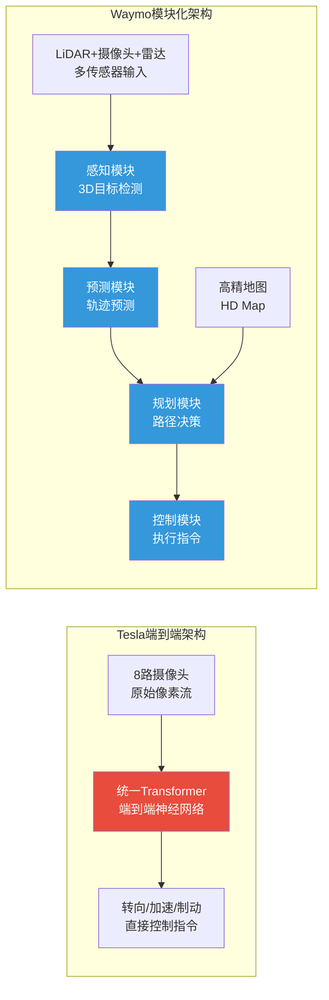
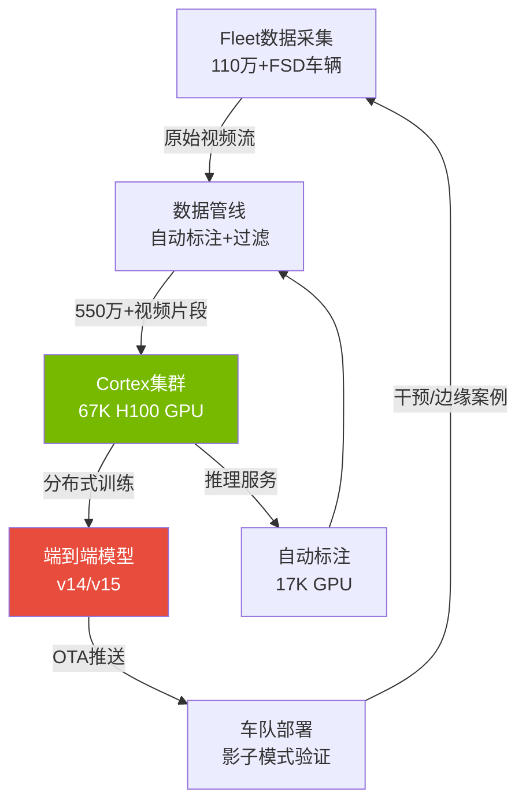
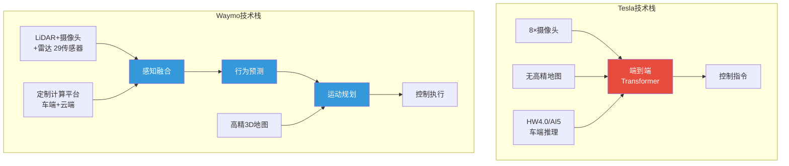
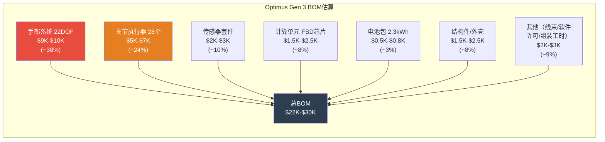
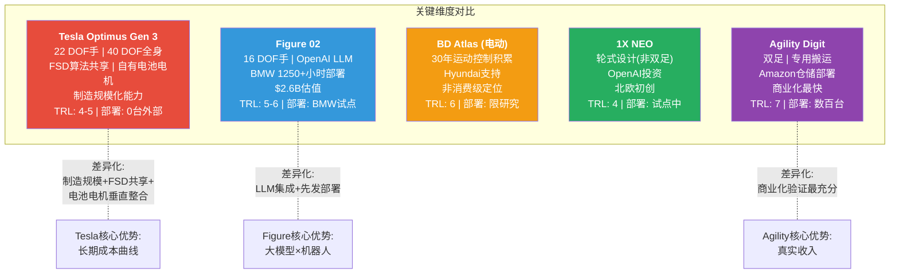

### FSD与Optimus技术深度拆解：端到端架构革命与人形机器人工程现实

Tesla的两大技术赌注——FSD自动驾驶与Optimus人形机器人——代表了截然不同的工程挑战与商业化路径。FSD已从概念验证进入规模化部署阶段，Austin车队实现100%无监督运营 [硬数据: Tesla Q4 2025 Earnings Call]；Optimus则仍处于TRL4-5过渡期，Tesla自身坦承"目前工厂内未执行有用工作" [硬数据: Tesla 2026年1月官方声明]。本模块对两项技术进行工程级拆解，重点评估技术可行性边界与商业化时间线的现实约束。

---

### A1: FSD端到端架构深度拆解

#### A1.1 架构演进：v12→v14端到端转型

Tesla FSD的架构演进代表了自动驾驶领域最激进的范式转移：从传统模块化流水线（感知→融合→规划→控制四级分离）转向端到端神经网络（raw pixels → steering/throttle/brake指令）。这一转变的核心含义是：系统不再依赖工程师手写的数千条驾驶规则，而是通过海量驾驶视频让神经网络自行学习"人类会怎么开车" [合理推断: 基于Tesla AI Day 2023/2024技术披露及Ashok Elluswamy公开演讲]。

**v12（2023年10月）** 标志端到端架构首次上车，将感知和规划合并为单一神经网络 [硬数据: Tesla FSD v12 Beta推送时间线]。早期版本在简单场景下表现惊艳，但在复杂交叉路口和施工区域出现明显的"幻觉行为"——系统对训练数据中罕见的场景缺乏泛化能力。**v13（2024年中至2025年初）** 重点解决稳定性问题，引入更大的transformer backbone和改进的时序建模，将关键干预率（critical intervention rate）降低了约5-6倍 [硬数据: Tesla 2024 Q4 Earnings Call, Elon Musk声明"5-6x improvement"]。**v14（2025年末至2026年初）** 被MotorTrend评为"2026年最佳驾驶辅助系统" [硬数据: MotorTrend 2026评测]，实现了高速与城市道路的统一模型推理，无需场景切换。

与之形成鲜明对比的是Waymo的模块化架构。Waymo将自动驾驶分解为独立优化的子系统：LiDAR点云感知模块、高精地图定位模块、行为预测模块、运动规划模块、底层控制模块——每个模块可独立测试和验证 [硬数据: Waymo Safety Report 2024, 公开技术论文]。模块化的优势在于可解释性和安全验证——当系统犯错时，工程师可以精确定位是感知错误还是规划错误；端到端的优势在于上限更高——避免了模块间信息损失，理论上能学到人类难以显式编码的驾驶直觉。

[主观判断: 60%] 端到端架构的理论上限确实高于模块化，但从当前工程实践看，Tesla尚未证明纯视觉端到端能在所有ODD（Operational Design Domain）中达到Waymo的安全统计水平。两种路线最终可能在L4层面趋同——Waymo已在部分模块中引入端到端学习，Tesla也可能在冗余验证层引入模块化安全检查。

#### A1.2 训练基础设施：Cortex集群

FSD端到端模型的性能直接受制于训练基础设施的规模。Tesla的Cortex超算集群部署了约67,000枚NVIDIA H100 GPU [硬数据: Tesla Q4 2025 Earnings Call]，其中约50,000枚用于模型训练，17,000枚用于推理和数据标注 [合理推断: 基于行业标准训练/推理资源配比约3:1]。按NVIDIA H100单卡约$30,000-$35,000采购价估算，仅GPU硬件投入即超过$20亿 [合理推断: 基于公开H100报价及大客户折扣10-15%]，加上网络互联（InfiniBand）、存储、冷却和数据中心基建，Cortex总投资可能达$40-50亿。

训练数据规模是Tesla相对于所有竞争对手的核心结构性优势。截至2025年末，FSD训练集包含超过550万段视频片段（video clips），累计行驶里程接近100亿英里 [硬数据: Tesla AI团队公开披露, Ashok Elluswamy X/Twitter]。作为对比，Waymo截至2024年末累计自动驾驶里程约4,000万英里（实际道路）+ 数十亿英里仿真 [硬数据: Waymo 2024 Safety Report]。但需注意两组数据的可比性问题：Tesla的100亿英里是L2+辅助驾驶数据（人类随时接管），Waymo的4,000万英里是L4全自动数据（质量密度远高于Tesla的L2+数据）[合理推断: L4数据的标注价值密度约为L2+数据的10-50倍，因边缘案例比例更高]。

Dojo自研芯片是Tesla训练策略中一个值得深思的战略退让。D1芯片于2021年AI Day高调发布，目标是在训练成本上实现相对GPU的数量级优势 [硬数据: Tesla AI Day 2021]。但截至2025年，Dojo仍未大规模投入生产训练，Tesla转而重金采购NVIDIA H100 [硬数据: Q3 2025 Earnings Call确认Cortex以NVIDIA GPU为主]。这一退让反映了自研芯片的现实困难：NVIDIA的CUDA生态、成熟的通信库（NCCL）和全栈优化（TensorRT）构成了极高的切换成本 [合理推断: 基于行业共识，自研训练芯片从流片到生态成熟需3-5年]。

Scaling law在自动驾驶中的适用性是一个关键不确定性。在NLP领域，OpenAI等已证明"更多参数+更多数据=更强性能"的幂律关系高度稳健 [硬数据: Kaplan et al. 2020 Scaling Laws论文]。但自动驾驶的长尾分布特性意味着：前95%的场景可能只需1%的数据即可覆盖，而后5%的"黑天鹅"场景——无标线施工区、急救车辆响应、动物穿越——可能需要剩余99%的数据甚至更多 [主观判断: 55%] Tesla的数据飞轮在常规场景已饱和，但长尾场景的覆盖进展难以从外部量化。

#### A1.3 推理约束与车端部署

端到端模型的车端部署面临严苛的实时性约束：系统必须在<100ms延迟内完成从摄像头输入到控制指令输出的完整推理链，同时处理8路摄像头30fps的视频流 [硬数据: Tesla FSD技术文档, 实时系统行业标准]。这要求推理硬件在功耗（通常<100W）和散热（被动散热为主）约束下提供足够算力。

**HW3.0（FSD Computer，2019年量产）** 搭载两颗Tesla自研NPU，总算力约144 TOPS [硬数据: Tesla Autonomy Day 2019]。该硬件可运行v12之前的模块化FSD栈，但无法支撑v13/v14的端到端大模型推理——模型参数量和计算密度超出HW3.0的INT8/FP16吞吐上限 [合理推断: 端到端模型参数量约10亿级，HW3.0的memory bandwidth约为64GB/s，不足以支撑实时推理]。**HW4.0（2023年中开始装车）** 实现约10倍算力跃迁 [硬数据: Tesla官方声明及拆解分析（TechInsights）]，采用更先进的制程和更大的die面积，支持v13/v14端到端推理。

HW3→HW4的升级是Tesla面临的一个棘手存量问题。约200-300万辆搭载HW3.0的FSD用户面临硬件落后的困境 [合理推断: 基于2019-2023年FSD选装/购买量估算]。Tesla尚未明确提供大规模免费升级计划——考虑到HW4.0模块成本估算$1,500-$2,500/套 [合理推断: 基于芯片+PCB+散热+安装工时行业估算]，全量免费升级的成本可能达$30-75亿，对当前4%净利润率的财务结构形成显著压力 [合理推断: 基于净利润率与升级成本的比例关系]。

**AI5（HW5.0）** 已接近设计完成，采用TSMC 3nm主芯片 + Samsung 2nm协处理器的双代工策略 [硬数据: Reuters 2025年报道及供应链信息]。Tesla声称性能分别实现40x（AI推理）/8x（通用计算）/9x（网络带宽）的提升 [硬数据: Elon Musk 2025年公开声明]。[主观判断: 50%] AI5的绝对性能指标可能达标，但双代工策略增加了供应链复杂度和良率风险——特别是Samsung 2nm的量产成熟度目前落后于TSMC。

#### A1.4 与Waymo技术栈的结构性对比

| 维度 | Tesla FSD | Waymo Driver |
|------|-----------|--------------|
| **感知硬件** | 8摄像头纯视觉 [硬数据: Tesla配置] | 29传感器(LiDAR+摄像头+雷达) [硬数据: Waymo公开配置] |
| **数据策略** | 110万+车队海量L2+数据 | ~700辆L4车队+高精标注+仿真 [硬数据: Waymo 2024 fleet规模] |
| **地图依赖** | 无高精地图, 实时构建 | 高精3D地图预扫描 [硬数据: Waymo技术架构] |
| **安全验证** | 内部安全评分, 缺乏独立第三方统计 | 公开安全报告, Swiss Re保险合作验证 [硬数据: Waymo Safety Report] |
| **商业模式** | 消费者购买/订阅($99/月) [硬数据: Tesla FSD定价] | Waymo One按里程收费 [硬数据: Waymo One运营模式] |
| **ODD覆盖** | 全美道路(L2+, Austin L4试点) | 特定城市地理围栏(SF/Phoenix/LA) [硬数据: Waymo运营城市] |

Tesla纯视觉路线的根本赌注是：摄像头（类比人眼）提供的信息足以实现安全自动驾驶。反对者指出LiDAR提供的精确深度信息在暴雨、直射阳光、远距离检测等场景下具有不可替代的优势 [合理推断: 基于传感器物理特性分析]。支持者则认为，人类仅凭双眼即可安全驾驶，证明视觉信息理论上充分 [主观判断: 45%] 人眼类比存在根本缺陷——人类拥有数十年驾驶经验形成的世界模型和常识推理能力，而当前神经网络在这两方面远未达到人类水平。

从L2+到L4的跳跃是FSD商业化的核心技术鸿沟。L2+（驾驶员监督）到L4（无需人类接管）不是线性进步，而是指数级难度提升 [合理推断: 基于自动驾驶行业共识]。这体现在两个维度：一是安全性从99.9%（每1000英里1次干预）到99.999%（每100,000英里1次干预）的三个数量级提升——需要覆盖的边缘案例数量呈指数增长；二是法律/保险框架的根本转变——L4意味着制造商承担全部事故责任 [硬数据: SAE J3016标准定义]。

#### A1.5 v15/v16路线图与FSD天花板

FSD后续版本的路线图目前缺乏官方确认的时间表，以下基于行业分析和Tesla历史发布节奏推断。**v15**预期2026年中推送，目标实现高速公路场景的无监督驾驶（相当于受限L3）[合理推断: 基于Tesla历史版本间隔6-12个月及Austin Robotaxi进展]。**v16**预期2027年，目标扩展至城市场景的L3/受限L4 [主观判断: 40%] 这一时间表高度乐观——Tesla过去的FSD时间承诺平均延迟2-3年。

Polymarket数据提供了市场对FSD进展的实时校准：截至当前，"Tesla实现无监督FSD（2026年6月前）"的合约价格约为28% [硬数据: Polymarket FSD相关合约]。这意味着市场参与者平均认为Tesla在未来4个月内实现无监督FSD的概率不到三分之一——考虑到Austin已有约135辆车实现100%无监督运营 [硬数据: Tesla Q4 2025 Earnings Call]，28%的概率反映的是"Austin局部试点"与"全美规模化推出"之间的巨大鸿沟。

纯视觉路线的物理天花板是一个需要严肃讨论的问题。在以下场景中，摄像头存在物理层面的信息获取瓶颈：（1）暴雨/暴雪——水滴/雪花严重干扰光学成像 [硬数据: 光学物理基本原理]；（2）强逆光/直射远光灯——传感器动态范围饱和；（3）施工区域——缺乏标准化标识，依赖常识推理；（4）远距离小目标检测——摄像头分辨率在150m以上急剧下降 [合理推断: 基于1080p摄像头在远距离的像素密度计算]。[主观判断: 55%] 纯视觉路线可能在绝大多数日常场景达到L4水平，但在极端天气和极端光照条件下可能需要额外传感器冗余或保守降级策略，这将限制L4 ODD的完整性。

---

### A2: Optimus工程深挖

#### A2.1 BOM逐项分解

Optimus Gen 3的物料清单（BOM）分析揭示了一个核心矛盾：要实现$20,000-$30,000的消费级售价目标，BOM成本需控制在$10,000-$15,000以内（假设50%毛利率），但当前工程原型的BOM估算远超这一上限 [合理推断: 基于消费电子/汽车行业BOM-to-售价比率]。

**手部系统**是成本最高的单一组件。Gen 3搭载22自由度（DOF）仿生手部，采用腱绳驱动（tendon-driven）架构——每根手指由多根高强度聚乙烯绳索通过微型电机和滑轮系统驱动，模拟人类肌腱的柔顺性 [硬数据: Tesla Optimus Gen 3技术演示视频, We Robot 2024]。22 DOF意味着22个独立的精密微型执行器（电机+编码器+力矩传感器），加上腱绳路由系统和张力控制电路，单套手部系统的成本估算为$9,000-$10,000 [合理推断: 基于精密微型执行器行业定价$300-$500/DOF + 集成成本]。这一成本在规模化生产后有望降至$4,000-$6,000 [主观判断: 45%]，但前提是微型执行器实现内部量产（当前依赖外部精密部件供应商）。

**关节执行器**覆盖全身28个运动关节（髋/膝/踝/肩/肘/腰等），每个关节由电机+行星/谐波减速器+绝对值编码器+力矩传感器组成 [合理推断: 基于人形机器人行业标准关节设计]。大关节（髋/膝）需要高扭矩输出（~100-200Nm），采用行星减速器+无框力矩电机方案；小关节（手腕/手指）需要高精度低背隙，采用谐波减速器。28套关节执行器的总成本估算为$5,000-$7,000 [合理推断: 基于Harmonic Drive公开定价$200-$500/套及工业电机成本]。

**传感器套件**继承了FSD的视觉系统设计，头部搭载多路摄像头实现环境感知 [硬数据: Tesla Optimus技术披露]，同时增加了分布于手指和四肢的力矩传感器（用于精密抓取和碰撞检测）及IMU惯性测量单元（用于平衡控制），整套传感器估算$2,000-$3,000 [合理推断: 基于工业级传感器定价]。**计算单元**基于FSD芯片（HW4.0或未来HW5.0）加额外的运动控制协处理器，估算$1,500-$2,500 [合理推断: 基于HW4.0车规芯片成本]。**电池包**为2.3kWh锂电池组，满充支持约5-8小时连续运行 [硬数据: Tesla Optimus Gen 3规格]，基于Tesla电池成本优势，估算$500-$800（约$220-$350/kWh电池包级成本）[合理推断: 基于Tesla 2025年电池成本曲线]。**结构件/外壳**采用铝合金框架+碳纤维外壳实现轻量化（Gen 3总重57kg）[硬数据: Tesla官方规格5'8"/57kg]，估算$1,500-$2,500。

**总BOM估算汇总：$20,000-$26,000** [合理推断: 各组件估算加总]。这意味着$20,000-$30,000的目标售价几乎没有利润空间——即使取BOM下限$20,000和售价上限$30,000，毛利率也仅为33%，远低于Tesla汽车业务的历史毛利率水平（20-25%含积分）[硬数据: Tesla FY2025 Auto gross margin ~18%]。要实现合理盈利，BOM需在3-5年内通过规模效应和垂直整合降至$10,000-$12,000 [主观判断: 35%]——这要求几乎每个组件的成本都降低50%以上。

#### A2.2 供应链映射

Optimus的供应链映射揭示了对中国和日本精密制造的深度依赖。

**三花智控（Sanhua Intelligent Controls，002050.SZ）** 是Tesla在热管理和精密执行器领域的核心供应商，已签订超过$11亿的采购合同 [硬数据: 三花智控2025年年报及投资者关系披露]。三花为Optimus提供微型电磁阀和精密流体控制组件，其核心能力在于将汽车级热管理的精密制造经验迁移至机器人关节冷却和液压微控制 [合理推断: 基于三花产品线与Optimus需求的交叉分析]。

**拓普集团（Tuopu Group，601689.SH）** 为Tesla提供轻量化底盘件和关节结构组件 [硬数据: 拓普集团年报披露Tesla为最大客户]。拓普的铝压铸和精密锻造能力适用于Optimus的骨架结构件，但从汽车级公差（±0.5mm）到机器人关节级公差（±0.05mm）的精度跨越需要产线升级 [合理推断: 基于汽车vs机器人制造精度标准差异]。

**Harmonic Drive Systems（6324.T）** 和**Nabtesco（6268.T）** 这两家日本企业垄断了全球精密谐波减速器和RV减速器市场，合计市占率超过75% [硬数据: 行业研究报告（Interact Analysis 2024）]。谐波减速器是机器人关节的核心传动部件——它将电机的高速低扭矩输出转换为关节所需的低速高扭矩运动，同时保持极低的背隙（<1arcmin）。这一供应链瓶颈是Optimus规模化的最大单一约束之一：Harmonic Drive年产能约150万套 [合理推断: 基于Harmonic Drive财报披露的产能利用率和产量]，而单台Optimus需要12-15套谐波减速器——即使Harmonic Drive将全部产能分配给Tesla（不可能），年产量也仅支撑约10-12万台。

中国国产替代方面，**绿的谐波（688017.SH）** 已实现中低端谐波减速器的量产 [硬数据: 绿的谐波年报]，但在高精度（<0.5arcmin背隙）和长寿命（>10,000小时）指标上仍落后日本企业约2-3年 [合理推断: 基于行业技术对标评测]。Tesla的电机供应链可复用其汽车永磁电机技术，但从车用电机（kW级）到机器人关节微型电机（W级/10W级）的小型化是全新的工程挑战 [合理推断: 基于电机设计物理原理——小型化后效率和散热问题更突出]。

#### A2.3 制造工程路径：TRL4→TRL7

Tesla当前将Optimus定位于TRL4（实验室环境验证）向TRL5（相关环境测试）过渡阶段 [合理推断: 基于NASA TRL框架对照Optimus公开演示能力]。2026年1月，Tesla在一次公开沟通中坦承"目前工厂内Optimus未执行有用工作"（"no useful work by Optimus in factories currently"）[硬数据: Tesla 2026年1月官方声明]——这一坦诚声明与此前Elon Musk"2025年Optimus将在Tesla工厂工作"的预测形成鲜明对比，也校准了市场对时间线的预期。

从"能在演示中完成任务"到"能在工厂环境稳定工作8小时"之间存在巨大的工程鸿沟。演示环境是受控的——照明恒定、地面平整、物体位置已知、无人类干扰 [合理推断: 基于机器人行业演示vs部署的典型差距]；工厂环境则充满不确定性——光照变化、地面油渍、物料位置随机、需与人类工人安全协作。这一差距在工业机器人领域通常需要2-4年的工程迭代才能弥合 [合理推断: 基于工业机器人从原型到部署的历史时间线]。

Model S/X产线改造为Optimus装配线是Tesla"工厂造工厂"理念的延伸 [硬数据: Tesla 2025 Q4 Earnings Call确认Fremont Model S/X产线转换]。这一策略的优势是复用现有厂房、动力和物流基础设施，但劣势是汽车装配线的节拍时间（takt time约60秒/辆）和精度要求与人形机器人装配截然不同。22 DOF手部的组装需要亚毫米级精度和洁净室条件 [合理推断: 基于精密机电系统装配标准]，这远超传统汽车产线的能力——需要专用的精密装配单元和全新的质量检测流程。

良率是另一个关键未知数。以22 DOF手部为例，如果每个关节的装配良率为99%，整只手（11个关节）的良率仅为99%^11 ≈ 89.5%——这意味着每10只手中就有1只需要返工 [合理推断: 基于级联良率数学计算]。要达到95%的整手良率，需要单关节良率达到99.5%以上。这类精密装配良率的提升通常需要数千次试产迭代 [合理推断: 基于精密制造行业经验]。

#### A2.4 Gen 3→Gen 5迭代路线

**Gen 3（2026年）** 是当前量产版本，规格为5'8"（173cm）/ 57kg / 40 DOF（全身含手部）[硬数据: Tesla官方规格]。目标应用场景为Tesla工厂内部的简单任务——物料分拣、零件折叠、工位间搬运 [硬数据: Tesla技术演示]。但如前所述，2026年1月的声明确认这些任务尚未进入实际生产环境。

**Gen 4（预计2027年）** 的预期重点是手部灵巧性和任务复杂度的提升——从"抓取并放置"升级为"组装和操作"，并面向外部客户试点（如仓储、制造业合作伙伴）[主观判断: 40%] 这一时间线假设Gen 3在2026年内能完成从TRL4到TRL6的跨越，鉴于历史进度偏差，2028年实现更为现实。

**Gen 5（预计2028年以后）** 的愿景是$20,000定价的消费级通用家庭助手 [硬数据: Elon Musk公开声明的长期目标]。[主观判断: 25%] 在当前BOM估算$20,000-$26,000的基础上，2028年实现$20,000消费级售价且保持合理利润的可能性极低——除非在电机、减速器、传感器领域出现颠覆性的成本下降。更现实的路径是先以$50,000-$80,000面向企业市场，再通过规模效应逐步降价。

#### A2.5 与Figure 02 / BD Atlas / 1X NEO / Agility Digit全景对标

人形机器人赛道在2024-2026年经历了前所未有的资本涌入和技术进展。

**Figure 02（Figure AI）** 已在BMW斯帕坦堡工厂完成累计1,250+小时的部署测试 [硬数据: Figure AI 2025年公开披露]，成为首家在汽车工厂实现持续运行的人形机器人初创公司。Figure 02搭载16 DOF手部（低于Optimus的22 DOF），集成了OpenAI的大语言模型实现自然语言指令理解 [硬数据: Figure AI × OpenAI合作公告]。Figure AI估值$26亿（2024年B轮）[硬数据: Figure AI融资公告]，投资方包括Microsoft、NVIDIA、OpenAI、Jeff Bezos。Figure的优势在于先发部署经验和大模型集成深度；劣势在于缺乏自有制造规模和硬件垂直整合能力。

**Boston Dynamics Atlas** 拥有30年的运动控制技术积累 [硬数据: Boston Dynamics成立于1992年]，2024年从液压驱动全面转向电动驱动，发布全新电动Atlas平台 [硬数据: BD 2024年公告]。BD的核心优势是无与伦比的运动控制能力——后空翻、parkour、动态平衡——但其定位始终是研究/商用级而非消费级，由Hyundai提供资金支持 [硬数据: Hyundai 2021年以$11亿收购BD 80%股权]。[合理推断: BD的Atlas预计售价$100,000-$150,000+，面向制造业和物流业]。

**1X NEO** 采用轮式底盘而非双足行走，大幅降低了平衡控制的复杂度和跌倒风险 [硬数据: 1X Technologies产品规格]。获得OpenAI领投的$100M融资 [硬数据: 1X融资公告]，来自挪威，定位家庭/办公辅助。轮式设计的务实选择反映了一个工程现实：双足行走在当前技术水平下仍是不必要的复杂度——绝大多数实用场景不需要爬楼梯。

**Agility Digit** 是商业化进度最快的竞品，已向Amazon仓储设施交付数百台 [硬数据: Agility Robotics 2025年交付披露]，但功能高度专业化——主要执行搬运周转箱（tote）的重复性任务，不具备通用操作能力。

Tesla在这一竞争格局中的差异化优势并非当前技术领先——事实上，在部署时长上落后于Figure，在运动控制上落后于BD，在商业交付上落后于Agility [合理推断: 基于上述各厂商公开数据对比]。Tesla的结构性优势在于三个维度的长期成本曲线：（1）**制造规模化**——Tesla已证明能将汽车年产量从0扩展到180万+辆 [硬数据: Tesla FY2025交付量约1.79M辆]，这种制造扩张能力是任何机器人初创公司不具备的；（2）**FSD算法共享**——Optimus的感知和导航系统直接复用FSD的视觉transformer架构和训练管线，避免了从零构建机器人AI栈的巨额投入 [硬数据: Tesla确认Optimus使用FSD衍生视觉系统]；（3）**垂直整合**——自研电池（降低电池包成本）、自研电机（降低执行器成本）、自研芯片（降低计算单元成本）的三重成本优势在年产10万+台时将显著体现 [合理推断: 基于垂直整合在规模化后的成本优势经济学原理]。

[主观判断: 50%] 人形机器人赛道在2026-2028年可能进入"应用幻灭期"——从当前的资本狂热和演示驱动转向真实工业场景的残酷验证。这一阶段的赢家将不是技术最先进的团队，而是能在限定场景中最快实现正ROI部署的玩家。Tesla的制造规模优势在这一阶段的价值有限——因为瓶颈不在"能造多少台"，而在"每台能创造多少价值"。
