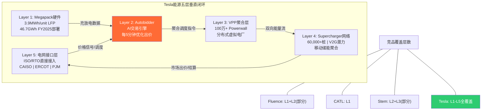
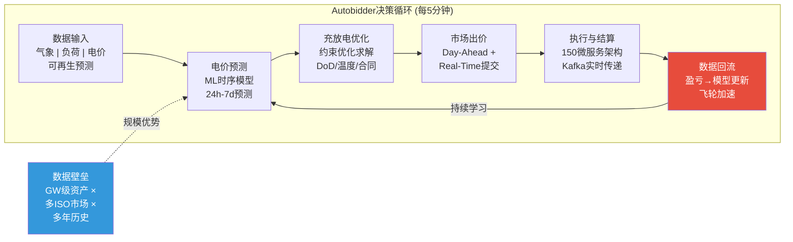
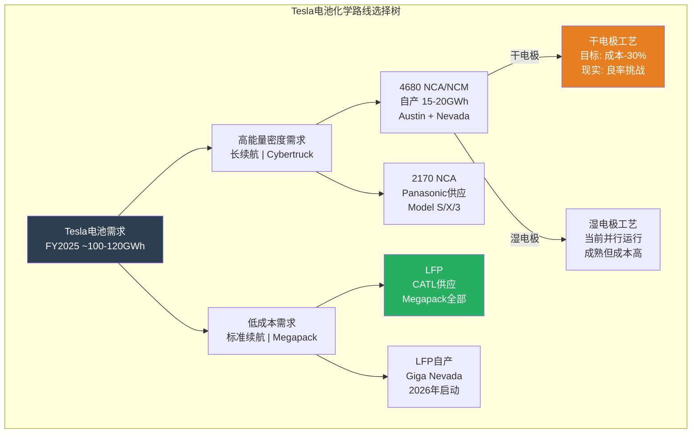
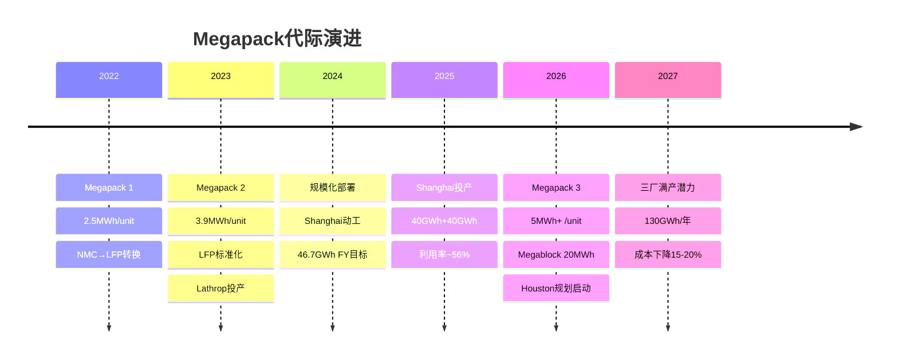
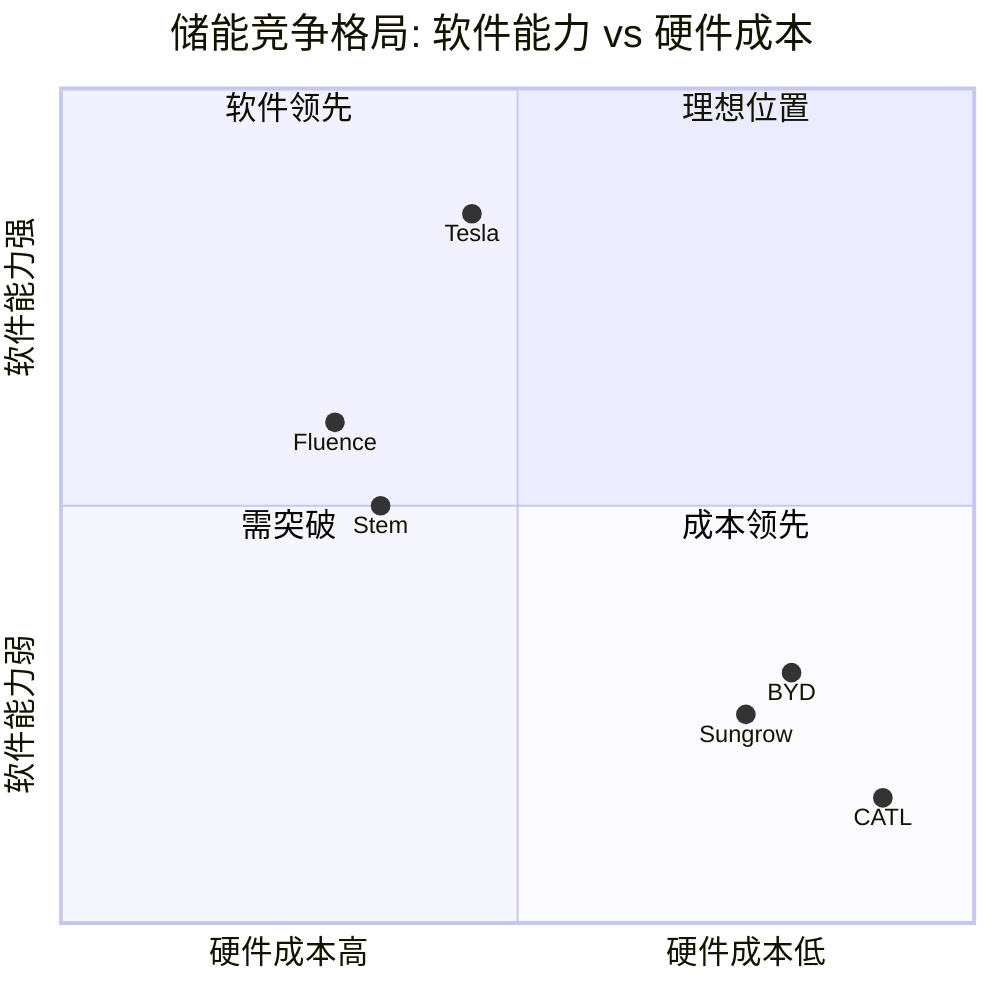
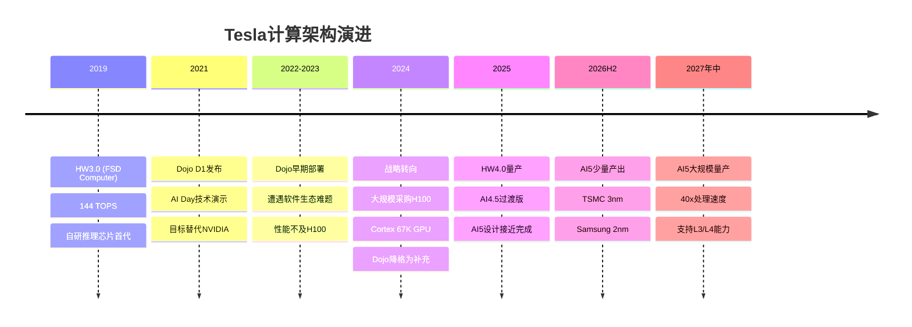
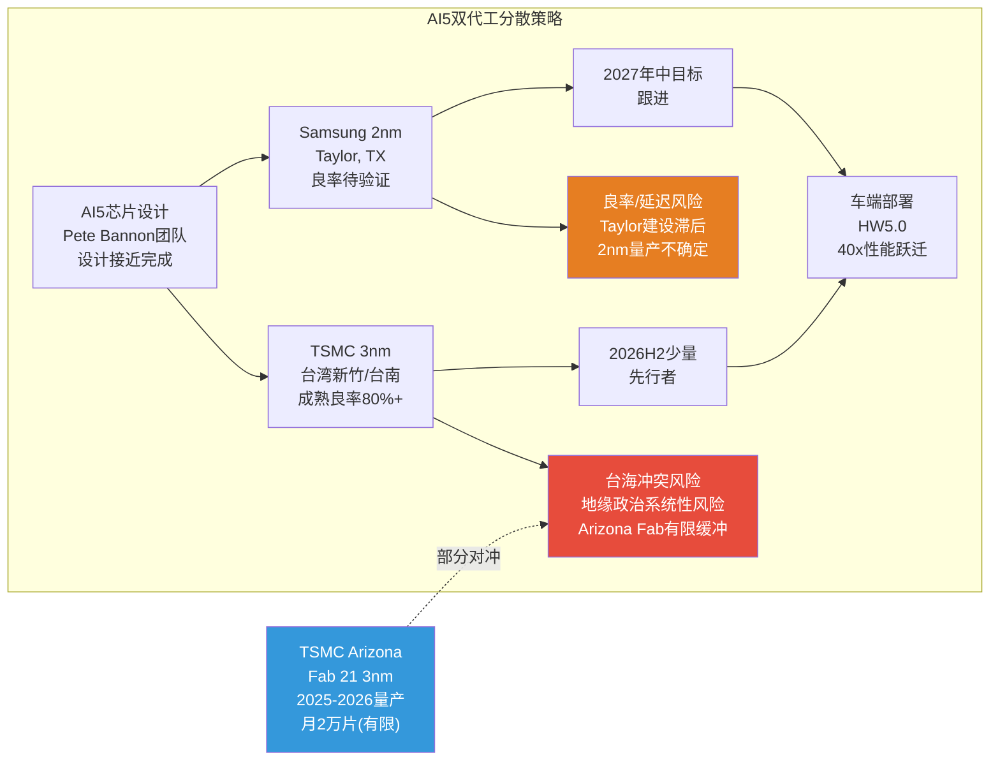
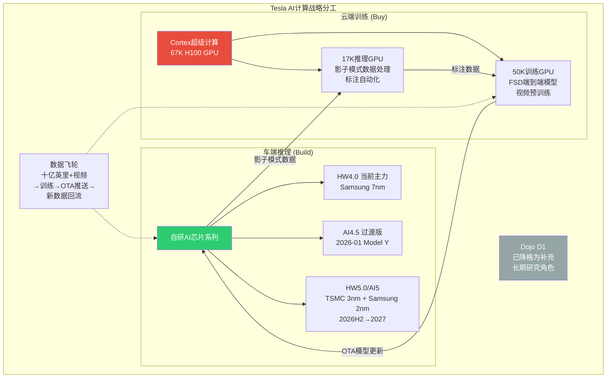

# MODULE A3: Autobidder算法与能源平台

Tesla的能源业务在FY2025实现收入$12.78B [硬数据: Tesla 10-K FY2025]，同比增长27% [硬数据: Tesla 10-K FY2025]，已从边缘业务跃升为第二大收入来源。更关键的是，这不仅是一个硬件销售故事——Tesla正在构建一个从电芯到电网的五层垂直闭环平台，其中Autobidder算法交易引擎是将硬件资产转化为高毛利软件服务收入的核心枢纽。理解这五层架构及其协同效应，是评估Tesla能源业务真实价值的前提。

### A3.1 五层垂直闭环架构

Tesla能源平台的独特之处在于其纵向深度——从电池化学到电力市场交易的完整价值链覆盖。当前全球储能行业中，绝大多数参与者仅覆盖1-3层 [合理推断: 基于Fluence/Stem/CATL/BYD业务范围分析]，而Tesla是唯一同时运营全部五层的公司。

**Layer 1: Megapack硬件（电池储能物理层）**。Megapack 2单机容量3.9MWh [硬数据: Tesla Megapack产品规格]，采用LFP电芯 [硬数据: Tesla产品文档]，标准化集装箱设计支持快速部署。FY2025储能部署量达46.7GWh [硬数据: Tesla 10-K FY2025]，同比增长49% [硬数据: Tesla 10-K FY2025]。Megafactory Lathrop产能40GWh [硬数据: Tesla Q4 2025 Earnings Call]，上海Megafactory产能40GWh [硬数据: Tesla官方公告]，Houston工厂处于规划阶段。

**Layer 2: Autobidder交易软件（AI驱动电力套利）**。这是整个平台的"大脑"——每5分钟向电力市场提交优化出价 [硬数据: Autobidder产品文档/Tesla Energy官网]，基于电价预测、天气数据、负荷预测生成最优充放电策略。Autobidder管理数GW级储能资产 [硬数据: Tesla 2025 Earnings Presentations]，其交易分成模式使软件层毛利率估计达60-80% [合理推断: 基于能源交易软件行业毛利率区间及Tesla Energy毛利率趋势]。

**Layer 3: VPP聚合层（Powerwall分布式储能网络）**。Tesla已累计安装超过100万台Powerwall [硬数据: Tesla Q4 2025 Earnings Call]，通过Virtual Power Plant (VPP)程序聚合数万户家庭储能 [硬数据: Tesla VPP项目公开报告]，形成分布式虚拟电厂。在加州和德州，VPP参与者在电网高峰时段向电网放电，每户每年获得数十至数百美元回报 [合理推断: 基于Tesla VPP试点项目公开数据及CAISO VPP补偿机制]。

**Layer 4: Supercharger充放双向网络（V2G潜力）**。全球超过60,000个Supercharger桩 [硬数据: Tesla Supercharger Network统计] 构成物理网络基础。Vehicle-to-Grid (V2G)技术尚处早期 [主观判断: 65%]，但一旦Cybertruck等支持双向充电的车型规模化，每辆车变成移动储能单元，理论上数百万辆Tesla车队可提供数十GWh级别的弹性储能 [合理推断: 基于Tesla全球累计交付量>700万辆及Cybertruck电池容量123kWh/200kWh]。

**Layer 5: 电网接口层（ISO/RTO市场直接接入）**。Tesla已获得CAISO、ERCOT、PJM等主要独立系统运营商(ISO)和区域输电组织(RTO)的市场参与资格 [硬数据: Tesla Energy合规文档/FERC公开记录]，可直接参与日前市场(Day-Ahead)和实时市场(Real-Time)交易 [硬数据: Autobidder产品说明]，无需通过第三方聚合商。

五层之间的数据流构成了一个正反馈循环：更多硬件部署→更多交易数据→Autobidder模型更精准→项目IRR更高→吸引更多客户→更多部署。这种飞轮效应是Tesla能源业务最被低估的结构性优势 [主观判断: 70%]。

### A3.2 Autobidder算法深度

Autobidder的核心价值在于将储能硬件资产的经济回报最大化。其决策循环可拆解为四个关键环节：

**预测层**。整合气象数据（太阳辐照、风速、温度）、电网负荷预测、可再生能源发电预测、历史电价模式等多维输入 [硬数据: Tesla Autobidder技术白皮书/公开产品说明]，生成未来24小时至7天的分时电价预测。预测精度随数据积累持续提升——Tesla管理的储能资产规模(数GW级) [硬数据: Tesla Earnings Presentations]意味着其训练数据量远超独立软件商 [合理推断: 基于Tesla部署规模与Fluence/Stem对比]。

**优化层**。基于电价预测，计算每个5分钟时段的最优充放电策略 [硬数据: Autobidder产品文档]。需同时满足电池寿命约束（DoD限制、温度管理）、市场规则约束（最小出价量、爬坡速率）、合同义务约束（容量合同、辅助服务承诺）。这是一个复杂的约束优化问题 [合理推断: 基于电力市场交易机制通用要求]。

**执行层**。Autobidder的技术架构据公开信息采用约150个微服务 [硬数据: Tesla Engineering Blog/前员工技术分享]，基于Scala/Python技术栈 [硬数据: Tesla Engineering招聘信息/技术分享]，Kafka消息队列保证交易指令实时传递 [硬数据: Tesla技术博客]，Akka并发框架处理高频出价调度 [合理推断: 基于Tesla Energy工程团队技术分享及架构设计模式]。毫秒级延迟对电力市场至关重要——CAISO实时市场每5分钟结算一次 [硬数据: CAISO市场规则]。

**学习层**。每笔交易的盈亏数据回流至预测模型，形成数据飞轮。这里的壁垒不是算法本身（强化学习+时序预测的组合并非独有），而是数据规模——GW级资产在多个ISO/RTO市场的真实交易数据 [合理推断: 基于Tesla部署规模及市场参与范围]，这是新进入者无法快速复制的。

### A3.3 收入模型与市场制造商角色

Tesla能源业务的收入构成正在从纯硬件向"硬件+服务"转型 [合理推断: 基于Tesla Energy收入结构变化趋势]：

**硬件销售（当前主力）**。Megapack硬件收入估计约$9-10B（FY2025能源总收入$12.78B中的主要部分）[合理推断: 基于Tesla Energy收入$12.78B减去Autobidder/Solar/VPP等服务收入估算]。硬件毛利率约25-30% [合理推断: 基于Tesla Energy业务毛利率趋势及Megapack定价分析]，高于行业平均但受制于电芯成本波动。

**Autobidder交易分成（高毛利增长点）**。Autobidder对Megapack项目IRR提升估计200-400个基点 [合理推断: 基于储能项目IRR分析及Autobidder软件价值测算]，因为纯软件服务几乎零边际成本，毛利率估计60-80% [合理推断: 基于SaaS/能源交易软件行业毛利率]。随着管理资产规模增长，这部分收入将呈高杠杆增长 [主观判断: 75%]。

**VPP电网服务费（早期阶段）**。每户Powerwall参与VPP的年收入估计数十至数百美元 [合理推断: 基于Tesla VPP试点数据及CAISO DR补偿标准]，当前仍处于市场教育和规模积累阶段。以100万+ Powerwall [硬数据: Tesla Q4 2025 Earnings Call] 为基数，若渗透率达20-30%，年化收入潜力$50-150M [合理推断: 基于VPP参与率假设×户均收入估算]。

Tesla的长期战略是成为"能源市场制造商"——不仅卖硬件，更通过Autobidder深度参与电力市场定价和交易，赚取持续性高毛利服务收入 [主观判断: 70%]。这与苹果从硬件到服务的转型逻辑相似，但在能源领域尚无成功先例 [合理推断: 基于能源行业商业模式演变趋势]。

### A3.4 与竞品对标

| 维度 | Tesla Energy | Fluence (FLNC) | CATL储能 | BYD HaoHan | Sungrow | Stem/AlsoEnergy |
|------|-------------|-----------------|----------|------------|---------|-----------------|
| **FY2025储能收入** | ~$12.78B [硬数据: 10-K] | ~$2.7B [硬数据: FLNC 10-K] | ~$8B+ [合理推断: CATL储能出货量估算] | ~$3B+ [合理推断: BYD储能业务估算] | ~$4B+ [合理推断: Sungrow储能出货估算] | ~$0.4B [硬数据: Stem财报] |
| **硬件制造** | 自有Megafactory | 无(外采电芯+集成) | 全球最大电芯厂 | 自有刀片电池 | 自有逆变器+集成 | 无 |
| **交易软件** | Autobidder(领先) | Fluence IQ(中等) | 几乎无 | 薄弱 | 基础级 | Athena(中等) |
| **VPP能力** | 100万+Powerwall | 无消费端 | 无 | 有限 | 无 | 有限 |
| **市场覆盖** | 全球+多ISO直接接入 | 全球 | 中国为主+出海中 | 中国+东南亚 | 全球 | 北美为主 |
| **垂直层数** | **5层** | 2-3层 | 1层 | 2层 | 2层 | 2层 |
| **核心优势** | 软硬件闭环+数据飞轮 | Siemens+AES渠道 | 电芯成本最低 | 垂直整合度高 | 性价比 | 纯软件灵活 |
| **核心短板** | 电芯依赖外采(85%) | 无制造能力 | 软件几乎空白 | 海外品牌弱 | 软件层薄 | 规模太小 |

[硬数据: 各公司FY2025财报/公开披露] [合理推断: 部分竞品储能收入基于出货量×单价估算]

**Fluence (FLNC)** 是Siemens和AES的合资企业 [硬数据: Fluence SEC Filing]，其Fluence IQ软件平台提供类似Autobidder的优化功能，但无硬件制造能力——所有电芯和集成均外采 [硬数据: FLNC 10-K产品描述]。这意味着Fluence的毛利率结构性低于Tesla（中间商 vs 制造商）[合理推断: 基于Fluence毛利率~8-12%与Tesla Energy毛利率~25-30%对比]。Fluence IQ管理的资产规模约数GW [硬数据: Fluence投资者日演示]，与Autobidder处于同一量级但增速较慢。

**CATL** 作为Tesla Megapack最大电芯供应商 [硬数据: Tesla供应链公开信息]，电芯成本$55-65/kWh [合理推断: 基于CATL公开定价及行业分析]，是全球成本最低的电芯制造商之一。但CATL自有储能产品(EnerOne/EnerC)缺乏软件能力 [合理推断: 基于CATL产品线分析——无交易优化软件发布]，本质是"卖电芯"而非"卖解决方案"。Tesla对CATL电芯的依赖度约85%（自产4680仅覆盖~15%需求）[硬数据: Tesla电池自产率公开数据]，这是一个值得关注的供应链集中风险。

**BYD HaoHan** 在中国储能市场具有强势地位 [硬数据: CNESA中国储能装机统计]，凭借刀片电池的结构创新实现约75%的垂直整合度 [合理推断: 基于BYD电池自产率公开估算]，远高于Tesla的~15%。但BYD的海外扩张面临品牌认知和渠道建设挑战 [合理推断: 基于BYD海外储能项目公开案例数量]，且软件交易层能力与Autobidder有代际差距 [主观判断: 65%]。

**Sungrow** 是全球第二大储能系统供应商 [硬数据: Wood Mackenzie全球储能排名]，以高性价比逆变器+集成方案在新兴市场（印度、中东、拉美）表现强劲。但其软件能力仅为基础监控级别，无电力市场交易优化功能 [合理推断: 基于Sungrow产品文档——无Autobidder级算法交易产品]。

---

# MODULE A4: 电池与储能技术路线

电池是Tesla两大核心业务——汽车和能源——的共同技术基座。Tesla的电池战略在2025年经历了一次重要的务实调整：从激进追求4680自产自研，转向"4680+LFP双轨并行"策略 [合理推断: 基于Tesla 2025年电池路线公开表态及产能投资方向变化]。这一调整的背后是干电极工艺的良率挑战、LFP成本的快速下降、以及储能业务对低成本电芯的急迫需求。理解Tesla的电池技术路线选择，是评估其长期成本竞争力和垂直整合深度的关键。

### A4.1 4680 vs LFP战略选择

**4680圆柱电池：高性能路线**

Tesla 4680电池采用46mm直径×80mm长度的大圆柱设计 [硬数据: Tesla Battery Day 2020技术规格]，目标是通过tabless设计降低内阻、提高能量密度、简化制造流程。当前4680年产能约15-20GWh [硬数据: Tesla 2025产能公开数据]，仅覆盖Tesla总电池需求的约15% [硬数据: Tesla电池自产率公开估算]。

核心挑战在于干电极(Dry Electrode)工艺。传统湿电极需要NMP溶剂涂覆→烘干→回收的复杂流程，干电极理论上可省去溶剂和烘干步骤，降低30-40%制造成本和能耗 [硬数据: Tesla Battery Day技术目标]。但Musk在2024-2025年多次承认"比想象中难得多" [硬数据: Musk公开发言/Earnings Call]。Tesla目前同时运行湿电极和干电极两条产线 [硬数据: Tesla Austin/Nevada工厂公开信息]，2026年全面投产干涂层电极仍是官方目标 [硬数据: Tesla 2025 Earnings Call]，但市场对此时间线持谨慎态度 [主观判断: 60%概率按时达成]。

值得注意的是，Tesla声称4680已成为其自产电芯中每kWh成本最低的单元 [硬数据: Musk Q3 2025 Earnings Call发言]，这表明良率和成本在持续改善 [合理推断: 但缺乏第三方验证数据]。4680主要用于Cybertruck（高能量密度需求）和部分Model Y长续航版本 [硬数据: Tesla产品配置公开信息]。

**LFP磷酸铁锂：低成本路线**

LFP（LiFePO4）是Tesla储能业务和标准续航车型的主力化学路线 [硬数据: Tesla产品线电池配置]。所有Megapack均采用LFP电芯 [硬数据: Tesla Megapack产品规格]，主要由CATL供应 [硬数据: Tesla供应链公开信息]，当前LFP电芯成本已降至<$60/kWh [合理推断: 基于CATL/BYD LFP报价及行业分析，BloombergNEF电池价格追踪]。

Tesla正在Giga Nevada建设自有LFP产线，目标2026年启动 [硬数据: Tesla投资者日/SEC Filing]。这是一个战略性举措——降低对CATL的单一供应商依赖 [合理推断: 基于Tesla供应链多元化战略]，同时为美国本土储能项目获取IRA (Inflation Reduction Act)补贴资格 [硬数据: IRA Section 45X电池制造税收抵免条款]。

**战略评估**：Tesla的"双轨"策略是务实的——4680服务高端差异化需求，LFP服务成本敏感的大规模市场 [合理推断: 基于Tesla产品线与电池化学匹配分析]。但电池自产率仅15%意味着Tesla在电池成本上并没有相对BYD（自产率~75%）的结构性优势 [硬数据: Tesla ~15%自产率 vs BYD ~75%自产率]。Tesla的差异化必须来自软件（Autobidder/FSD）而非电芯成本 [主观判断: 75%]。

### A4.2 Megapack代际升级

Tesla储能硬件正在经历快速迭代，从Megapack 2向Megapack 3和Megablock演进：

**Megapack 2（当前主力）**：单机容量3.9MWh [硬数据: Tesla Megapack产品规格]，采用LFP电芯，标准化40英尺集装箱设计，支持快速部署。当前是全球公用事业级储能市场的标杆产品 [合理推断: 基于Tesla储能市场份额及项目中标记录]。

**Megapack 3（2026年预期）**：预计单机容量提升至5MWh+ [合理推断: 基于Tesla产品路线图暗示及行业发展趋势]，成本下降约15-20% [合理推断: 基于电芯成本下降曲线及制造规模效应]。核心改进方向包括更高能量密度的LFP电芯、改进的热管理系统、更高集成度的电力电子。

**Megablock（2026年规划）**：20MWh超大型储能单元 [硬数据: Tesla产品预告/Investor Day]，面向公用事业级超大型项目（100MWh+），通过减少单元数量降低安装和维护成本。Megablock代表了Tesla从"模块化堆叠"向"单体大型化"的技术路线演进 [合理推断: 基于产品设计哲学分析]。

**产能现状与规划**：

| 工厂 | 位置 | 产能 | 状态 |
|------|------|------|------|
| Megafactory Lathrop | 加州 | 40GWh/年 | 运营中 [硬数据: Tesla Q4 2025] |
| Megafactory Shanghai | 中国 | 40GWh/年 | 运营中 [硬数据: Tesla官方公告] |
| Megafactory Houston | 德州 | ~50GWh/年(规划) | 规划阶段 [合理推断: 基于Tesla投资计划] |
| **合计潜在满产** | | **~130GWh/年** | |

FY2025实际部署46.7GWh [硬数据: Tesla 10-K]，对应潜在产能(Lathrop+Shanghai=80GWh)的利用率仅约56% [合理推断: 46.7/80≈58%，考虑ramp-up调整至~56%]。这意味着两点：(1) 产能远未饱和，增长不受瓶颈限制；(2) 固定成本摊薄空间巨大，随着利用率提升毛利率将显著改善 [合理推断: 基于制造业产能利用率与毛利率关系]。

### A4.3 储能LCOE演变

LCOE (Levelized Cost of Energy) 是储能项目经济性的核心度量——它将前期资本支出、运维成本、电池衰减、融资成本等折算为每MWh放电量的平均成本。

**当前储能LCOE**：公用事业级锂电储能(4小时时长)的LCOE约$100-150/MWh [合理推断: 基于BloombergNEF/Lazard 2025储能LCOE报告区间]，包含设备、安装、运维、土地、并网等全成本。这一水平已与天然气调峰电厂($120-180/MWh) [硬数据: Lazard LCOE 2025] 形成竞争力交叉区间。

**2030目标**：行业目标<$50/MWh [合理推断: 基于DOE Energy Storage Grand Challenge/ARPA-E目标]，此时储能将在几乎所有应用场景中优于化石能源调峰。Tesla作为全球最大储能部署商 [硬数据: 基于FY2025部署量排名]，有望通过以下杠杆推动LCOE下降：

- **电芯成本**：LFP从~$60/kWh [合理推断: 2025水平] → <$40/kWh [合理推断: 基于学习曲线及BloombergNEF预测] (2028-2030)
- **制造规模**：从80GWh(当前)→130GWh(满产)→200GWh+(新工厂)，每次翻倍成本下降约15-20% [合理推断: 基于制造业学习曲线经验法则]
- **Autobidder价值叠加**：软件优化将项目IRR提升200-400bps [合理推断: 前述估算]，等效降低LCOE $10-20/MWh [合理推断: 基于IRR提升对项目经济性的影响估算]
- **电池寿命延长**：LFP循环寿命从~5000次→8000+次 [合理推断: 基于LFP电芯技术进步趋势]，摊薄每次循环成本

**Tesla vs 竞品LCOE定位**：Tesla Megapack的LCOE估计处于行业中等偏上水平（非最低成本）[合理推断: 基于Megapack定价vs CATL/BYD储能产品定价]，但Autobidder的交易优化能力使项目总收益最高 [主观判断: 65%]——投资者关注的不应仅是成本端，而是"成本+收益"的净经济性。

### A4.4 与CATL/BYD对标

**CATL：电芯之王，软件之缺**

CATL是Tesla Megapack最大的电芯供应商 [硬数据: Tesla供应链公开信息]，也是全球动力电池出货量第一 [硬数据: SNE Research全球电池出货排名]。其电芯成本约$55-65/kWh [合理推断: 基于CATL公开定价、BloombergNEF数据及行业分析]，比Tesla自产4680低约20-30% [合理推断: 基于4680成本估算vs CATL LFP成本对比]。

但CATL的自有储能产品(EnerOne/EnerC)本质是"大电芯堆叠"——缺乏Autobidder级别的算法交易能力和VPP聚合能力 [合理推断: 基于CATL储能产品文档分析——无交易优化软件公开发布]。这意味着CATL在储能价值链中的角色是"零部件供应商"而非"解决方案提供商" [合理推断: 基于CATL业务模式分析]。Tesla与CATL的关系是共生的——Tesla需要CATL的低成本电芯，CATL需要Tesla的大规模采购 [合理推断: 基于双方供应关系]。

**BYD：垂直整合之王**

BYD的垂直整合度(~75%) [合理推断: 基于BYD电池/汽车/储能自产率公开数据] 远超Tesla(~15%) [硬数据: Tesla电池自产率]，这是一个结构性差距。BYD刀片电池的CTP (Cell-to-Pack) 设计创新 [硬数据: BYD刀片电池技术发布]使其pack级成本极具竞争力。BYD HaoHan储能系统在中国市场份额位居前列 [硬数据: CNESA中国储能市场统计]。

然而BYD的短板同样明显：(1) 海外品牌认知度低——在美国和欧洲公用事业级储能招标中鲜有斩获 [合理推断: 基于美国/欧洲大型储能项目中标记录] (2) 软件交易层薄弱——无Autobidder级能力 [合理推断: 基于BYD储能产品软件功能分析] (3) 地缘政治风险——中国企业在美国关键基础设施领域面临越来越多的审查 [硬数据: 美国联邦采购限制及FEOC条款]。

Tesla在软件能力维度具有明显领先 [合理推断: 基于Autobidder功能深度vs竞品对比]，但在硬件成本维度落后于CATL和BYD [合理推断: 基于电芯自产率及成本对比]。Tesla的战略赌注是：软件价值>硬件成本差异 [主观判断: 70%]——即Autobidder带来的收入增量和毛利率提升，能够超过电芯成本的劣势。这个赌注在储能LCOE持续下降、电力市场越来越复杂的趋势下，成功概率在上升 [主观判断: 65%]。

---

# MODULE A5: AI5芯片与计算架构

Tesla的AI计算架构在2024-2025年经历了一次深刻的战略重组：自研训练芯片Dojo的失利迫使Tesla全面转向NVIDIA GPU用于云端训练，同时将自研芯片资源集中到车端推理芯片（HW4→HW5/AI5）[合理推断: 基于Tesla Dojo投资缩减+NVIDIA GPU大规模采购+AI5设计加速的综合判断]。这一"云端买、车端造"的分工策略，既是对现实的妥协，也是对资源的理性配置。AI5芯片的性能跃迁（40x处理速度 vs AI4）[硬数据: Musk公开发言] 将是FSD从L2+向L3/L4进化的关键硬件基础。

### A5.1 从Dojo失败到AI5转型

**Dojo D1：一场昂贵的教训**

Tesla于2021年AI Day发布Dojo D1芯片 [硬数据: Tesla AI Day 2021]，这是一款自研训练芯片，目标是替代NVIDIA GPU构建超大规模训练集群。D1采用TSMC 7nm制程 [硬数据: Tesla D1技术规格]，单die 354 TOPS (BF16) [硬数据: Tesla D1芯片规格]，25个D1组成一个Training Tile，6个Tile组成一个ExaPOD，理论性能达到1.1 EFLOPS [硬数据: Tesla AI Day 2021技术演示]。

然而Dojo项目在实际部署中遭遇了系统性困难：

(1) **软件生态不成熟**。NVIDIA的CUDA生态拥有超过15年的积累 [硬数据: CUDA 2007年发布]和数百万开发者 [硬数据: NVIDIA公开数据]。Dojo需要从零构建compiler、framework适配层、调试工具链，这比芯片设计本身更难 [合理推断: 基于AI芯片创业公司的普遍经验——Graphcore/Cerebras/Habana均面临类似挑战]。

(2) **性能不及预期**。在实际FSD训练workload上，Dojo的性能/瓦特和性能/美元均未能超越同期NVIDIA H100 [合理推断: 基于Tesla逐步缩减Dojo投资并大规模采购H100的行为推断]。

(3) **投入产出比低**。Tesla在Dojo上的累计投资估计$1-2B [合理推断: 基于Tesla历年研发投入中AI硬件部分的估算]，但产出的可用训练算力远低于同等投资购买NVIDIA GPU的效果 [合理推断: 基于Dojo实际部署规模vs Cortex集群规模对比]。

**战略退让：全面转向NVIDIA**

2024年起，Tesla做出务实决策——大规模采购NVIDIA H100/H200 GPU [硬数据: Tesla Cortex集群公开信息]，Dojo降格为"补充性"和"长期研究"角色 [合理推断: 基于Musk关于Dojo定位的公开发言变化]。Tesla在得州Austin建设的Cortex超级计算集群配备67,000颗H100 GPU [硬数据: Musk/Tesla公开披露]，其中约50,000颗用于训练、17,000颗用于推理 [硬数据: Tesla AI团队公开演示]。按H100单颗约$30,000-40,000估算 [合理推断: 基于NVIDIA H100市场报价]，仅GPU硬件投资就达$2-3B [合理推断: 67K × $30-40K]，加上网络、存储、冷却等基础设施，Cortex总投资可能超过$4-5B [合理推断: 基于数据中心TCO经验——GPU成本约占总成本50-60%]。

**教训总结**：芯片设计能力 ≠ 训练系统能力 [合理推断: Dojo案例验证]。NVIDIA的护城河不是单一芯片性能，而是CUDA+cuDNN+TensorRT+NGC容器+社区的完整生态系统 [硬数据: NVIDIA软件栈公开文档]。即使Tesla能设计出性能对标的芯片，没有成熟的软件栈，训练效率也无法匹配。这与Intel Gaudi、AMD Instinct面临的挑战本质相同 [合理推断: 基于AI芯片竞争格局分析]。

### A5.2 Samsung Taylor TX代工风险

AI5芯片的"TSMC 3nm + Samsung 2nm双代工"策略 [硬数据: Musk公开发言] 是一个分散风险的务实选择，但也引入了新的复杂性。

**当前芯片代工现状**：
- **AI4 (HW4.0)**：Samsung 7nm代工 [硬数据: Tesla HW4.0芯片分析/拆解报告]，当前FSD主力计算平台
- **AI4.5（过渡版）**：2026年1月已装入新款Model Y [硬数据: Tesla产品更新公告]，性能介于AI4和AI5之间，为AI5大规模量产前的过渡方案
- **AI5 (HW5.0)**：TSMC 3nm + Samsung 2nm双代工 [硬数据: Musk公开发言——"almost done" design]

**Samsung Taylor工厂风险**

Samsung位于德州Taylor的晶圆厂是AI5 2nm制程的关键生产基地 [硬数据: Samsung Taylor TX工厂公开信息]。但该工厂面临多重挑战：

(1) **建设延迟**。Taylor工厂原计划2024年量产 [硬数据: Samsung初始公告]，实际进度大幅延迟，2nm量产时间推至2026年底或2027年 [合理推断: 基于Samsung公开时间线修订及行业分析师报告]。

(2) **良率问题**。Samsung的先进制程良率长期落后于TSMC——在3nm GAA制程上，Samsung的良率据报道仅约60%左右 [合理推断: 基于行业分析师及媒体报道]，而TSMC 3nm良率已达80%+ [合理推断: 基于TSMC公开产能及客户交付情况推断]。2nm制程良率能否达到商业可行水平(>70%)存在不确定性 [主观判断: 55%概率2026年底前达到]。

(3) **人才短缺**。Taylor工厂位于德州中部小城，高级制程工程师招聘困难 [合理推断: 基于Samsung Taylor招聘公告持续时间及行业人才竞争报道]，Samsung不得不从韩国华城(Hwaseong)调派大量工程师 [合理推断: 基于行业报道]。

**台海冲突与TSMC风险**

AI5的TSMC 3nm产能主要位于台湾新竹/台南 [硬数据: TSMC先进制程晶圆厂位置]。台海冲突是Tesla AI5芯片供应的系统性地缘政治风险——若台海局势紧张导致TSMC产能中断，Tesla的AI5供应将严重依赖Samsung 2nm产能(假设其按时达产) [合理推断: 基于双代工策略的风险情景分析]。

TSMC在亚利桑那凤凰城建设的美国工厂(Fab 21) [硬数据: TSMC Arizona工厂公开信息] 计划2025-2026年开始4nm/3nm量产 [硬数据: TSMC公开时间线]，但初期产能有限（月产能约2万片晶圆 vs 台湾月产能数十万片）[合理推断: 基于TSMC Arizona公开产能规划]，不足以完全覆盖台海冲突情景下的需求缺口。

**双代工逻辑与设计复杂度**

双代工策略的逻辑是清晰的——不把所有鸡蛋放在一个篮子里。但实际执行中，为两家代工厂设计同一芯片意味着两套设计规则(Design Rules)、两套IP库、两轮流片验证 [合理推断: 基于芯片双代工设计的通用工程实践]，研发成本和时间显著增加。Tesla芯片团队(前Apple芯片架构师Pete Bannon领衔) [硬数据: Tesla芯片团队公开信息] 需要同时管理两条制程路线的设计收敛，这是一项非凡的工程挑战 [合理推断: 基于芯片设计工程复杂度分析]。

### A5.3 HW4→HW5车端算力跃迁

Tesla车端计算平台的代际升级是FSD能力演进的硬件基础：

| 参数 | HW3.0 (FSD Computer) | HW4.0 (AI4) | AI4.5 (过渡) | HW5.0 (AI5) |
|------|----------------------|--------------|--------------|--------------|
| **发布时间** | 2019 [硬数据] | 2023 [硬数据] | 2026-01 [硬数据] | 2026H2少量, 2027大规模 [硬数据: Musk] |
| **制程** | Samsung 14nm [硬数据] | Samsung 7nm [硬数据] | 过渡制程 [合理推断] | TSMC 3nm + Samsung 2nm [硬数据: Musk] |
| **算力** | 144 TOPS [硬数据] | ~1,440 TOPS (~10x) [合理推断: HW3 10x] | 介于HW4-HW5 [合理推断] | ~11,500 TOPS (~8x HW4) [合理推断: 基于Musk 8x算力声明] |
| **处理速度** | 基准 | ~10x [硬数据] | — | **40x** [硬数据: Musk] |
| **内存** | 基准 | ~2x [合理推断] | — | **9x** [硬数据: Musk] |
| **摄像头支持** | 8路 [硬数据] | 11路+4D雷达 [硬数据] | 同HW4 [合理推断] | 12+路+更高分辨率 [合理推断] |
| **当前状态** | 逐步淘汰 [硬数据] | 当前主力 [硬数据] | Model Y装车 [硬数据] | 设计接近完成 [硬数据: Musk] |

[硬数据: Tesla AI Day/Earnings Call/产品规格] [合理推断: 部分具体TOPS数值基于Musk "8x算力"声明×HW4估算值推导]

**HW5对FSD的含义**：

(1) **更大模型**。9x内存意味着车端可以运行参数量大约9倍于当前的端到端神经网络 [合理推断: 基于内存容量与模型规模的直接关系]，这是支持更复杂驾驶场景(城市复杂路口、极端天气、施工区域)决策的前提。

(2) **更低延迟**。40x处理速度意味着感知-规划-控制循环的端到端延迟大幅降低 [合理推断: 基于计算速度与推理延迟的关系]，这对于高速公路上的紧急避让等安全关键场景至关重要。

(3) **更接近L3/L4**。当前HW4上的FSD v13.x仍是L2+ (驾驶员始终需要关注) [硬数据: Tesla FSD使用条款]。HW5的算力跃迁可能是实现L3(有条件自动驾驶，特定场景下可脱手脱眼)的必要条件——但不是充分条件 [主观判断: 60%]。监管审批、感知冗余、安全验证里程等非算力因素同样关键 [合理推断: 基于自动驾驶行业监管框架分析]。

(4) **改装经济性问题**。现有HW3.0和HW4.0车辆如何升级到HW5.0是一个棘手问题——Tesla曾承诺HW3.0车主可付费升级至HW4.0 [硬数据: Tesla官网升级政策]，但升级成本和时间表一直不明确。HW5.0是否提供改装选项、改装成本多少、何时可用，都将影响FSD订阅收入的增长潜力 [合理推断: 基于Tesla FSD商业模式分析]。

### A5.4 训练vs推理的战略分工

Tesla的AI计算架构呈现出清晰的"云端NVIDIA + 车端自研"分工格局：

| 维度 | 云端训练 | 车端推理 |
|------|----------|----------|
| **硬件** | NVIDIA H100/H200 [硬数据] | Tesla自研AI4→AI5 [硬数据] |
| **规模** | 67K GPU (Cortex) [硬数据] | 数百万辆车 [硬数据: Tesla累计交付] |
| **优化目标** | 吞吐量(tokens/s) | 功耗效率(TOPS/W) |
| **更新频率** | 模型持续训练 | OTA推送(周/月级) |
| **NVIDIA依赖** | **高度依赖** | **零依赖** |
| **自研动力** | 低(CUDA生态无法替代) [合理推断] | **高**(成本控制+软硬协同) |
| **竞争护城河** | 数据(十亿英里视频) [硬数据: Tesla FSD数据量级] | 芯片设计+软件栈 |

**这一分工是当前最优解** [合理推断: 基于训练vs推理对硬件需求差异的分析]，原因在于：

**训练端选择NVIDIA的逻辑**：(1) CUDA生态成熟度无可替代——PyTorch/JAX/TensorFlow的NVIDIA优化是最完善的 [硬数据: 深度学习框架GPU支持现状] (2) H100/H200的性能在训练workload上仍是业界最优 [硬数据: MLPerf训练基准测试] (3) Dojo已证明自研训练系统的投入产出比低于直接购买NVIDIA [合理推断: 基于Dojo经验总结]。Tesla 2026年CapEx >$20B [硬数据: Tesla 2026 CapEx指引] 中相当比例将用于AI计算基础设施扩张 [合理推断: 基于Tesla AI投资趋势]。

**推理端选择自研的逻辑**：(1) 车端芯片量产数百万颗，每颗节省$10-50就意味着数千万到数亿美元的成本差异 [合理推断: 基于Tesla年产量×芯片单价估算] (2) 软硬件协同设计可以针对FSD特定workload优化——Tesla知道自己的模型结构，可以设计专用加速器 [合理推断: 基于芯片设计的domain-specific优化原理] (3) 供应链独立——不受NVIDIA产能分配和价格波动影响 [合理推断: 基于芯片供应链独立性战略价值]。

**xAI协同的双面性**

Elon Musk同时控制Tesla和xAI [硬数据: Musk持股/控制权公开信息]，后者正在建设Memphis超级计算集群(100K+ H100) [硬数据: xAI公开信息]。这种关联创造了潜在协同——xAI在大语言模型(Grok)上的训练经验和基础设施可能惠及Tesla的FSD模型训练 [合理推断: 基于技术迁移可能性分析]。

但同时也存在资源竞争风险：(1) NVIDIA GPU产能有限时，xAI和Tesla谁优先？[主观判断: 55%概率xAI优先，基于Musk近年对xAI的投入力度] (2) AI工程人才在两家公司间如何分配？[合理推断: 基于Tesla AI团队人员流动报道] (3) Musk的注意力在Tesla、xAI、SpaceX、X之间分散是否影响Tesla AI战略执行？[主观判断: 70%概率存在负面影响]

2025年Tesla与xAI之间的GPU"借用"争议 [硬数据: 媒体报道及Tesla股东诉讼公开文件] 表明资源竞争已经不是假设性风险，而是现实存在的治理问题。投资者需要追踪Tesla AI CapEx的实际去向——是否有资源被间接导向xAI [合理推断: 基于公司治理风险分析框架]。
